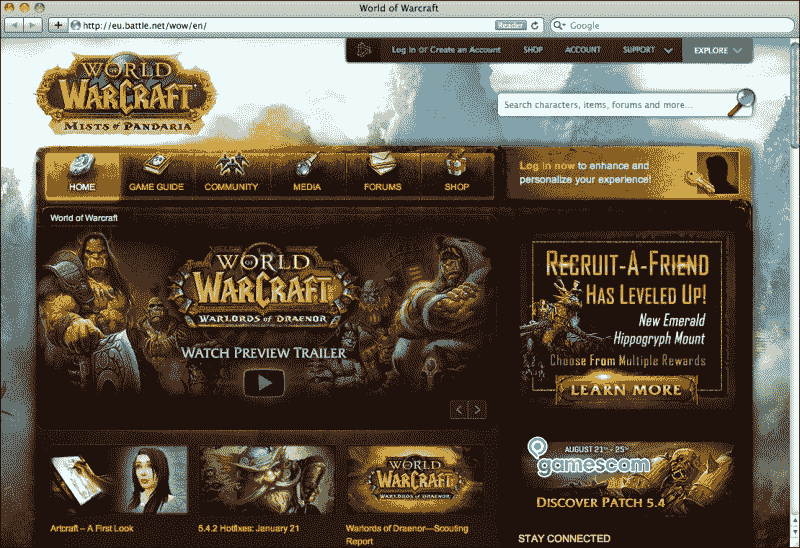
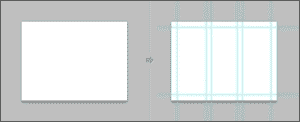
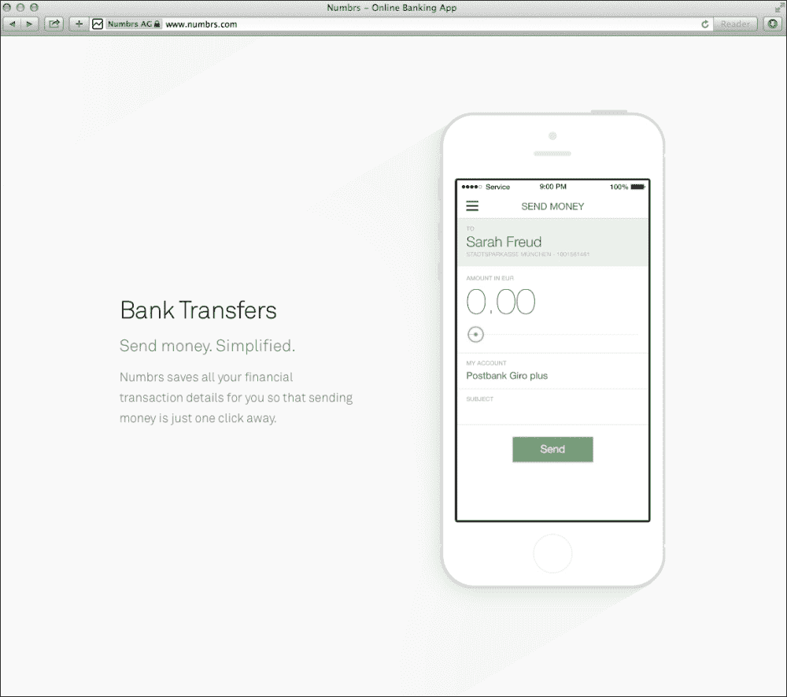
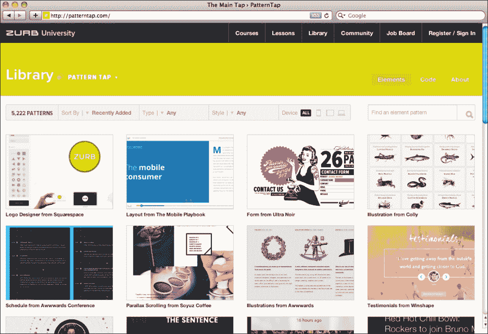
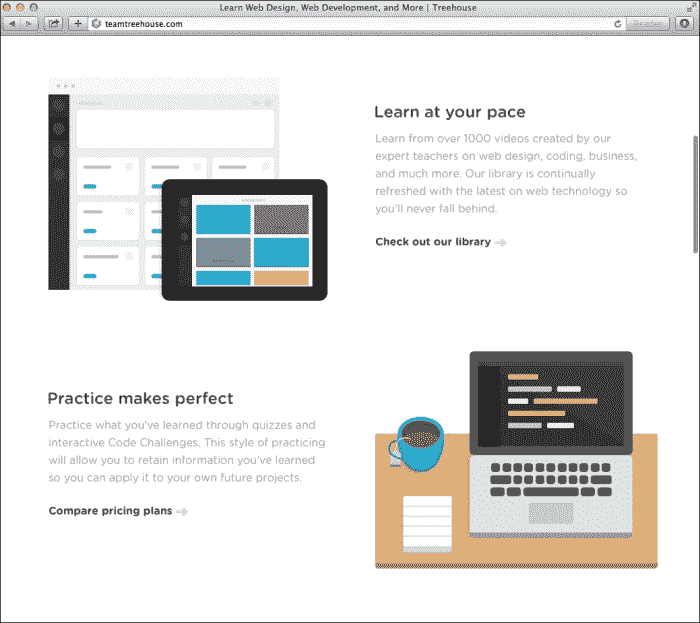
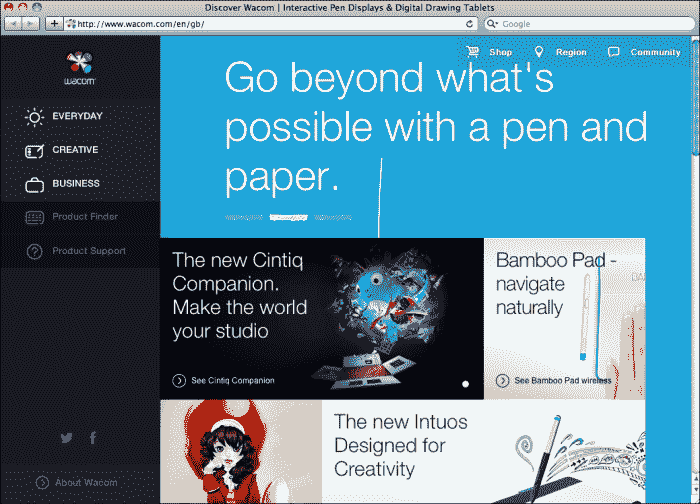

# 二、平面设计

本章介绍如何在平面中进行设计，以及在设计时需要关注的最重要的事情是什么。它还将涵盖排版、对齐、网格和布局的重要性，以创建更好、更具可读性的设计。继续阅读，了解在平面设计中需要记住的所有事情，并准备开始创建自己的平面设计项目。

# 设计风格

平面设计顾名思义，是一种类似平面的风格。这种外观和风格因其简洁而在设计师中迅速崛起，同时保留了巨大的影响力。在本章中，我们将介绍平面设计的限制和规则，您应该做什么和不应该做什么，以及何时在布局中使用平面设计。

一个平面设计网站看起来井然有序、干净，但又非常专业。想象一下，房间里摆满了家具、桌子、沙发、地毯、花盆和植物。你曾在这样一个房间里呆过，尽管感觉很舒适，但感觉很局促，有时，只是有点太多的东西。现在想象一下，把那些桌子、沙发和地毯移走，只留下最基本的东西：一块地毯、一张沙发，只有一张有用的小桌子。白色的墙壁看起来会更清晰更大，房间会感觉更清晰更宽敞。对于一个从平面设计开始的设计师，比如你自己，这与你需要经历的过程大致相同，通过删除所有额外的图像、细节和效果（如阴影和渐变），只关注以平面背景和平面颜色显示信息。

平面设计绝对是一种趋势。这是一个坚持了很长时间，原因是有很好的学习和良好的界面出来。对于设计师来说，跟随潮流，根据当前使用频率更高的风格创作作品是很常见的。毕竟，灵感每天都来自我们所看到的几乎所有地方，而网络是我们不断使用的东西。设计师在布局上的新想法和方法创造了新的范例和设计模式，因此，作为设计师，我们自然会遵循这些模式。这将导致布局的不断改进和界面的新想法，而对于 flat 来说，这是完全相同的。这是一种具有特定外观的特定样式。如果你想创建一个平面设计，你应该坚持这些规则，最后，只需从风格中获得最佳效果，并将其与你自己的风格混合。这些规则也可以被视为限制，但在设计中，这并不总是一件坏事。

# 限制性工作

我认为平面设计不是一种自然的风格；你不会发现自己在没有强迫的情况下自己使用它。即使是最简约的网站通常也不会选择平面外观，因为平面有其特定的外观和特定的*规则*。

之所以会出现这种情况，是因为设计师经常发现设计中的缺陷和问题，并试图通过修饰和变通办法来克服它们。不能很好地阅读每幅图像的文本通常有一个细微的阴影，以确保有一个较暗的背景，使文本对比度足以始终可读。这些都是设计师面临的挑战。这些限制使设计变得有趣，因为通过移除所有这些拐杖，设计师发现自己只关注重要的东西。

在学术环境中，当一个学生被给予一个设计项目时，他们被允许设计他们想要的任何东西，并且能够选择使用哪种媒介作为风格，结果往往比被给予特定主题和媒介的学生更糟糕。例如，知道你正在为儿童玩具设计一个网站，你就有了你的重点和目标。当你被允许做任何事情时，很难确切地知道你想专注于什么。限制在项目管理中非常有效，可以让您将注意力集中在最重要的任务以及设计上。这使您可以设计所需的元素，并将重点放在更适合心中目标的样式上。

扁平确实是一种有其自身局限性的风格。你需要设计一个外观平淡的东西，不使用任何你通常能使用的效果。你需要遵循某种美学；它必须是简单的，它需要有大量的空白，它必须看起来有条理，有条理。你放内容的空间必须经过深思熟虑，因为它通常是一个较小的部分。如果你有一个包含几十个文本块的大页面，那么你的布局就会变得更加狭窄，无法获得你想要的美观外观。

定义您的限制并尽可能优化您的布局。如果不需要某个副本或图像，只需将其删除即可。它越简单，最终看起来就越清晰。

# 平坦并不总是答案

与每一种风格一样，平面设计应该用于网站和产品中，其外观符合产品的目标和目的。并非所有网站或应用都能从使用平面美学设计中获益。平面设计外观确实非常灵活，可用于不同类型的市场和目标，但始终牢记您的目标。仅当对手头的项目有意义时才使用平面。每个项目都是不同的，您希望在网站中传达信息或通过用户界面与用户交互的方式因项目而异。

Flat 可以很容易地在设计师作品集、公司网站、web 应用、移动应用、餐厅和许多其他不同的示例中使用和找到，但你需要问自己这样一个问题：Flat 对我的网站来说是一个好的外观吗？如果你正在创建一个游戏网站，比如 RPG，或者推广一款高档昂贵的产品，比如手表或美酒，你最好干脆跳过。原因是，这些项目将从纹理和效果（如渐变和阴影）中受益匪浅，并允许设计师创造更高级和微妙的外观。例如，一个游戏网站是由游戏图像和未来或旧元素组成的，它们总是与所讨论的游戏相关。想象一下，如果魔兽世界的网站是平面设计的，那该有多无聊。因此，请确保您的项目适合于平面外观，不要只使用样式而不顾目标，因为它会破坏目标并失去所有影响。

以下截图显示了*魔兽世界*网站：

# 丢掉你的“拐杖”

没错，平面设计有一个“没有拐杖”的规则。此处不应使用所有阴影、斜面、光晕、渐变、照明效果、纹理和浮雕，因为此限制是学习和实践创建平面设计的最佳方法。

如果您希望创建一个真正的平面外观，那么您需要确保您的设计确实是平面的。但是，不要认为公寓是独裁；你总是可以尝试创建一个平面的 3D 外观，看起来真的很棒，是的，阴影是允许的。每个设计师都试图用自己的想法来增加和改进风格，伟大的图标也随之出现。阴影和照明的使用不应破坏平面外观。因此，从尽可能设计平面开始，关注使平面设计看起来很棒的重要因素。设计包括网格、空白、构图和排版；当你觉得舒服的时候，试着添加这些新元素，因为它们看起来真的很好。甚至还有一种阴影样式，称为**长阴影**，与平面一起使用。这基本上类似于靠近地面的灯光，在表面上创建了一个沉重而长的阴影。这会产生一种很酷的效果。请查看以下屏幕截图：

Pixeden（左）的平面设计图标和 Sajeer Mohamed（右）的摩托罗拉长影标志

# 照片还是插图？

这个问题的答案很简单：两者都有。

平面设计插图是设计师们很快学会的东西，尤其是设计平面图标，因此在这些图标上使用平面颜色可以获得非常有趣的效果。这些插图看起来很棒，是你网站平面外观的一个很好的补充（如果它们确实与你的产品和目标相关），但是也可以（而且应该）使用照片。平面不仅仅是文字和简单的色彩；它是通过将用户的注意力集中在内容上而不是界面上，来创建一个让照片和内容突出的布局。这种情况经常发生在 skeuomorphic 接口上。

如今，很常见的情况是，网站使用非常广泛和高分辨率的人、产品或环境照片，以便更轻松地在现实生活中展示其产品。人们常说，一幅画抵得上千言万语，所以，好好利用这些图片来帮助你传达信息。照片在设置网站的情绪和基调时非常重要；平面设计在图片上看起来很棒，因为它是复杂（图像）和简单（布局）的混合体，两者之间形成了巨大的对比。

如果你正在寻找一些预先设计的平面图标，有几个免费提供的图标集在线，由设计师和设计师创建。

以下是一些可以在项目中使用的示例：

*   平面设计图标由 Pixeden 在 Vol1 中设置（[http://www.pixeden.com/media-icons/flat-design-icons-set-vol1)](http://www.pixeden.com/media-icons/flat-design-icons-set-vol1))
*   buatoom（[提供的免费平面图标 http://dribbble.com/shots/1095922-Free-Flat-Icons)](http://dribbble.com/shots/1095922-Free-Flat-Icons))
*   Jan Dvořák 的免费平面图标（[http://dribbble.com/shots/1054478-Free-Flat-Icons)](http://dribbble.com/shots/1054478-Free-Flat-Icons))
*   平面图标集合（[http://www.flaticon.com/)](http://www.flaticon.com/))
*   平面图标集合（[http://flaticons.net/)](http://flaticons.net/))

Flat 很棒，因为它的风格非常简单，可以让你展示它的内容。最后，这一切都与内容有关，设计的功能是以最简单、最快捷的方式将内容提供给用户/读者。因此，在平面设计中使用和滥用图片；让内容来说话，而不是界面。以下屏幕截图是一个很好的示例：

Teehan+Lax 设计工作室主页

# 尊重网格

网格是平面设计和数字设计的重要工具。网格是定义主要布局的间距和尺寸的虚线的组合，它是界面的基础，在上面，布局将被设计。这是一个框架，它为用户提供方向和指导，让用户设计每一页和每一节的内容，而不必担心对齐、安全边距和间距。这是因为网格早就开发好了，可以避免每页的计算。请查看以下屏幕截图：

Photoshop 指南与指南插件

网格在每一个设计作品中都是必不可少的，但它的重要性对于平面设计来说是不可否认的。由于平面设计往往具有较少的方框和线条，因此网格对于将所有视觉元素结合在一起形成布局非常重要。两个对齐的元素可以让观众感觉到一个块或一条线，这些视觉感知是使用这个网格并通过确保这些对齐是正确的来构建的。

白色空间是平面设计想要实现的简洁外观中最重要的角色之一。在设计中使用网格对于创建此空白区域至关重要。即使是平衡的元素也会创建一种结构，而这种结构原本是使用方框和线条创建的。以下屏幕截图显示了 numbrs.com 网站上空白的使用情况：

为了帮助您进行设计，已经为几种应用开发了几种网格系统。特别是对于 Web，最常用的系统之一是 960 网格系统。可在网上[找到 http://960.gs](http://960.gs) 。以下屏幕截图显示了[tapbots.com](http://tapbots.com)上正在使用的 960 网格系统：

此网格将允许您根据最常用的尺寸创建几种不同类型的块，所有这些块的总宽度均为 960 像素。您可以在 12 列和 16 列之间进行选择。这些可以单独使用，也可以在同一布局中一起使用，以便在整个项目中保持一致性和连贯性的同时，在块的设计上具有更大的灵活性。

如果你想创建一个响应性强的网站，那么一个很好的帮助你完成这项任务的工具就是 unsemantic，可以在[网站上找到 http://unsemantic.com/demo-responsive](http://unsemantic.com/demo-responsive) 。这是一个网格系统，非常类似于 960，但它不是一个固定的网格，而是一个流体网格。流体网格不是在固定数量的列上定义的，而是完全基于百分比，允许布局适应设备视口并为用户提供响应体验。

我们将在[第 4 章](4.html "Chapter 4. Designing Your Own Flat Website")、*设计您自己的平面网站*中了解更多关于网格以及如何使用网格的信息。

# 专注于排版

排版对于平面设计布局来说非常重要。按照简洁和几何形状的思路，在平面排版时，无衬线是必然的选择。有许多字体在平面设计中更常见和使用。选择这些字体时要考虑它们的特点。这些字体通常是几何体；然而，由于可能有细微的圆角，它们通常在标题中以大写形式使用。在一个单词中使用所有大写字母也是为了给这个单词创造一个更具影响力的外观，这也可以通过在字体上增加权重来实现。一个好的字体应该有两个不同的权重，以便能够将轻量级字体与粗体或超粗体字体混合，因为两个相反权重的组合在标题和文本块中的视觉效果都很好。通过创建这种视觉对比，它使标题更加突出。下面的屏幕截图是 Motiva Sans 字体具有不同权重的示例。此字体可在[上找到 http://www.myfonts.com/fonts/niramekko/motiva-sans/](http://www.myfonts.com/fonts/niramekko/motiva-sans/) 。

如今，在网上可以找到大量高质量的免费字体。这些是专门为网络设计的。谷歌字体等网站允许用户轻松搜索、浏览和在项目中使用字体。对于那些希望在网站上使用自定义字体的 web 开发人员来说，它们是一个很好的工具。

以下是建议在平面设计中使用的一些字体系列：

*   Proxima 新星（[http://www.myfonts.com/fonts/marksimonson/proxima-nova/](http://www.myfonts.com/fonts/marksimonson/proxima-nova/)
*   未来（[http://www.myfonts.com/fonts/bitstream/futura/](http://www.myfonts.com/fonts/bitstream/futura/)
*   拉丁语（[http://www.google.com/fonts/specimen/Lato](http://www.google.com/fonts/specimen/Lato)
*   蒙特塞拉特[http://www.google.com/fonts/specimen/Montserrat](http://www.google.com/fonts/specimen/Montserrat)
*   打开 SAN（[http://www.google.com/fonts/specimen/Open+无](http://www.google.com/fonts/specimen/Open+Sans)
*   科伯特（[http://www.fontsquirrel.com/fonts/corbert](http://www.fontsquirrel.com/fonts/corbert)

这些只是一些你可以在设计中使用的字体。您可以随意搜索更多适合您所追求风格的产品。根据你所用的字体，你可以得到更严肃或更愉快的语气。为您的项目明智地选择字体，因为字体是您在网站中创建外观的主要因素之一。理想情况下，每个网站最多可以选择两到三种字体。主要的应该是标题。这是最详细的字体，它将在排版上定下基调。你应该为文本块选择另一个，它将是你的身体；这一个应该是中立的，它的唯一目标是使文本可读，并使其与标题形成对比。第三种可能的字体应该是大写和小字体；这可以用于标题、描述图像，也可以附加到图形上。小心选择字体；比较和测试它们，以确保它们配合良好。永远记住你使用的媒体，因为为屏幕设计的字体可能无法打印，反之亦然。

# 单色

在平面中使用颜色的规则非常简单：避免渐变和纹理。这些颜色应按原样使用，不作任何修改。由于 LCD 屏幕的构造方式，即使是平坦的颜色看起来也有一点渐变。这是因为屏幕的每个区域的颜色并不完全相同，而且设备周围的光线也会对其产生一些影响。所以，试着测试一下你的颜色，选择一个合适的颜色。

不过，有一些类型的首选颜色可以在平面中使用。网站，[http://flatuicolors.com](http://flatuicolors.com) ，快速检查和使用这些工具非常好。只需点击屏幕上的颜色，十六进制代码就会被复制到剪贴板，并准备粘贴到 Photoshop 或 CSS 代码中。网站上显示的颜色很容易代表使用的颜色。使用鲜艳的颜色是一个有趣的尝试，但它们应该被调低一点。一些最常用的颜色是浓绿的绿松石、柔和的绿色和略显不太鲜艳的蓝色。这个想法是创造一个好的颜色背景，但不是太生动，以避免过多的重点在颜色。请记住，颜色用于内容所在的背景，焦点应始终放在内容上，而不是颜色本身。下面的屏幕截图显示了[中的平面 UI 颜色 http://flatuicolors.com](http://flatuicolors.com) ：

创建网站时，您应该选择要使用的调色板。此调色板由网站中使用的所有颜色组成，应该有一个或两个主颜色和一些额外的中性颜色。例如，在 patterntap.com（如下屏幕截图所示）的情况下，主颜色显然是标题部分使用的绿黄色，而黑色用于顶部的辅助菜单，非常浅的灰色用于背景。每种颜色都有自己的功能。黄色是与品牌相关的主色，黑色是分隔符。有一个单独的内容中性区，灰色是内容区，其中可读性更为重要。定义你自己的调色板；试着使用不同色调的主色调，浅色和深色；并测试它在链接、标题和视觉元素（如线条）中的工作方式。创建调色板时要记住的一件重要事情是，必须避免混合不协调的颜色。此外，记住在使用它们时要连贯一致。如果一个标题在一个页面中是浅蓝色的，那么在所有页面中都应该是这样。

### 提示

让我告诉你一个小秘密；当线条或文本使用黑色时，尝试使用深灰色而不是完全黑色。看起来会好多了。用白色试试同样的；试着用灰白色或黄白色代替纯白。对该颜色稍加着色会使应用该颜色的元素具有另一种外观，就像使用纹理一样。

以下屏幕截图是使用平面颜色的示例（[www.patterntap.com](http://www.patterntap.com)：

# 启示与借鉴

在设计中需要很多技术诀窍，但其中最重要的是视觉文化。通过看别人的作品来养活自己和你的视觉文化。学习时，试着模仿别人的风格，理解他们是如何做的，最重要的是他们为什么这样做。

通过在不同的项目上保持视觉上的最新，您将发现您将在视觉上学习使用的一些设计模式，以及调色板、界面想法、布局和排版。这是通过观察其他人在做什么，并从视觉上感受到它来完成的。你可以在本节后面找到一些关于平面设计和布局的灵感和很好的参考资料。这些是平面设计的一些很好的例子，也展示了如何以不同的方式使用样式。注意使用的空白、颜色和调色板，以及图像、摄影和这些网站的整体组织方式。您可以自由地使用这些作为您自己项目的灵感，通过对执行和布局的想法，而不是复制整个布局本身。

设计师的作品必须是原创的，无论灵感和/或设计模式如何。

以下是一些网站，你应该知道和看到的灵感。以下是平面设计出色实施的示例：

*   Treehouse ([www.teamtreehouse.com](http://www.teamtreehouse.com))

    

*   The Treehouse content section, with flat style illustrations ([www.threehouse.com](http://www.threehouse.com))

    

*   The Numbrs homepage with full-screen photo using the sans-serif text ([www.numbrs.com](http://www.numbrs.com))

    

*   Wacom home page with content blocks and flat icons [(www.wacom.com](http://(www.wacom.com))

    

*   Hellomonday home page ([www.hellomonday.com](http://www.hellomonday.com))

    

# 总结

到目前为止，您应该能够理解网格和空白对平面设计的重要性，以及如何在平面颜色上使用出色的排版来创建有影响力的信息。平面设计都是关于细节的，在这种情况下，细节在于学习如何在缺乏复杂性和噪音的情况下进行设计。现在你知道如何让它好看了。在下一章中，我们将通过讨论 web 可用性及其在平面界面中的重要性来学习如何使其工作良好。