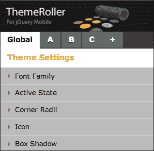
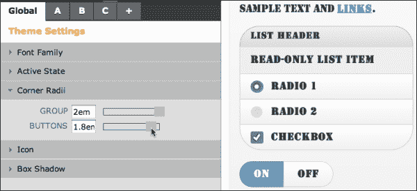
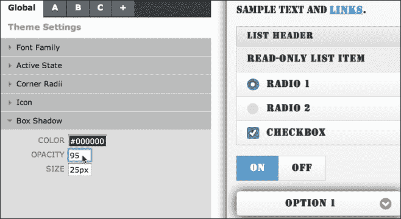
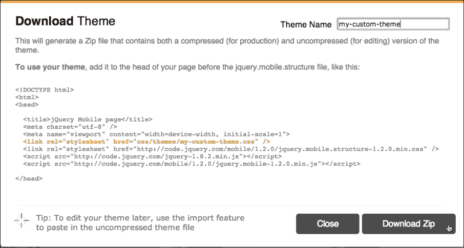

# 九、使用主题滚轮自定义主题

在我们旅程的这个阶段，我们已经探索了用 Dreamweaver CS6 构建基本的和更复杂的 jQuery Mobile 页面。少了什么？风格！我们还没有定制字体、字体颜色、背景，以及我们在本书前几章中学习的使用 CSS 样式表做的所有其他事情。

但是当我们设计 jQuery Mobile 页面时，正常的 CSS 样式规则只在非常有限的意义上适用。为什么呢？因为 jQuery Mobile 页面依赖于一个集中的、相当庞大的 CSS 样式表文件。该文件包括五组配色方案样本。在本章中，您将学习在 Dreamweaver CS6 中应用这些色板。

但是五套配色样本并不多。为了认真定制 jQuery Mobile 页面的外观，有必要更改主题，这是另一种说法，表示您必须定制集中分布的 CSS 样式表。在本章的后半部分，我们将介绍如何使用 Adobe 推出的在线工具**主题滚轮**创建定制的 CSS 文件和主题。

将涵盖以下主题:

*   在 Dreamweaver 中使用 jQuery Mobile 主题理解格式
*   将 jQuery 移动主题应用于页面元素
*   将 jQuery 移动主题应用于页面中的特定元素
*   使用主题滚轮自定义 jQuery 移动主题

# 应用 jQuery 移动主题样例

有五个标准的 jQuery Mobile 数据主题(简称主题)。它们是:a、b、c、d 和 e，正如你可能已经猜到的，这五个标准主题被构建到我们链接所有 jQuery Mobile 页面的大型集中式 CSS 样式表文件中。

### 类型

如果您检查该 CSS 文件，您会看到该样式表中的大多数 CSS 样式在样式名称中都有一个`-a`、`-b`、`-c`、`-d`或`-e`。

同样，这里的基本概念是，五个主题样本(a、b、c、d 和 e)都存储在每个 jQuery Mobile 页面链接到的单个 CSS 样式表文件中。该链接内置在 Dreamweaver 中生成的 jQuery Mobile 页面中。

## 检查五个数据主题

在印刷书籍中，甚至在我们的电子书版本中，都不可能提供五个默认 jQuery Mobile 主题样本的动态、动画、交互式演示。查看它们如何工作的最佳方法是执行以下任一操作:

*   将它们应用于 Dreamweaver 中的页面
*   Look them up at the jQuery Mobile site where you can interact with and compare all five themes as shown in the following screenshot:

    

### 类型

演示这些主题样本的 jQuery Mobile 页面的 URL 会定期更改。但是你可以在 www.jquerymobile.com 找到它。将有一个链接到网站的主题框架部分，可以很容易地从网站的主页访问。

作为快速文本参考，下面是每个主题的简化描述:

*   主题 *a* 是一种高对比度、基于深灰色的配色方案，可在各种照明情况下使用。
*   主题 *b* 是一种蓝色背景上的白色风格，有点不太容易接近，但很有吸引力，而且对比度仍然很高。
*   主题 *c* 有点像主题 *a* 的逆。它不是在深灰色背景上显示白色，而是在浅灰色背景上显示深灰色。
*   主题 *d* 与主题 *c* 几乎无法区分，但与深灰色类型后面的浅灰色背景相比，具有更高的对比度。
*   主题 *e* 有一个黄色到橙色的渐变背景，比其他主题更吸引人，也更乐观。

要在 Dreamweaver CS6 中应用主题样本，请按照给定的步骤操作:

1.  定义好 Dreamweaver 站点后，导航至**文件** | **新建**打开**新建文档**对话框。
2.  从左侧的**类别**栏中选择**样本** | **页面**，从**样本文件夹**栏中选择**移动启动器**，从**样本页面**栏中选择 **jQuery 移动(CDN)** ，点击**创建**生成新页面。
3.  打开 jQuery Mobile 页面，使用**拆分**视图，打开**直播**视图。
4.  保存页面。稍后我们将使用 Dreamweaver CS6 的 **jQuery 移动样本**面板，该面板要求您首先保存一个页面。保存页面后，导航至**窗口** | **jQuery 移动色板**显示 **jQuery 移动色板**面板。
5.  Click on any of the five available theme swatches (the swatch on the far left assigns no theme), as shown in the following screenshot:

    

您也可以在**代码**视图中为任何元素指定一个数据主题。使用以下语法应用 jQuery 移动主题:

```html
data-theme="x"
```

其中`"x"`为`a`、`b`、`c`、`d`或`e`。下面是一个将数据主题`e`应用到第一个页面元素的例子:

```html
(<div data-role="page" id="page" data-theme="e">
```

该数据主题代码可以应用于任何 jQuery Mobile 元素。在**代码**视图中编辑数据主题后，点击**文档**工具栏中的**刷新**按钮刷新视图，如下图截图所示:


### 注

CS6 之前版本的 Dreamweaver 用户将无法访问的 **jQuery 移动样本**面板，并且必须在代码视图中应用数据主题，如前所述。

## 将主题应用于特定元素

当您将数据主题应用于整个页面元素时，您可以为该页面元素定义配色方案。但是您也可以将数据主题应用到数据页面中的任何元素，以精确调整每个元素的显示方式。

但这是一个挑战；只有在 Dreamweaver 中打开 **Live** 视图时，才能看到数据主题的外观。但是，打开 **Live** 视图后，也很难选择元素来应用主题，因为通常当您单击某个元素(如**列表**视图中的链接)时，该链接会工作，并且您在预览窗口中不再看到它。所以，我一般建议依赖**代码**视图来应用数据主题。

例如，您可以给主页面`listview`分配一个数据主题，该主题是通过我们的 jQuery Mobile 示例页面(在 jQuery Mobile 站点的第一个页面元素上)默认生成的。为此，在**分割**视图的**代码**侧，找到以下代码:

```html
<ul data-role="listview">
```

要应用数据主题`b`，我们可以将此参数添加到`listview`:

```html
<ul data-role="listview" data-theme="b">
```

保存您的页面，并在 **Live** 视图中检查效果。

您可以将数据主题应用于任何*元素。这包括* a `listview`中的元素*。例如，我们可以为`listview`中的每个列表项分配不同的数据主题。为此，在第一页元素的三个`<li>`标签中添加数据主题定义。以下代码将数据主题`c`、`d`和`e`分别应用于列表元素:*

```html
<li data-theme="c"><a href="#page2" >Page Two</a></li>
<li data-theme="d"><a href="#page3" >Page Three</a></li>
<li data-theme="e"><a href="#page4" >Page Four</a></li>
```

# 使用主题滚轮定制主题

如果每个网站都受到 jQuery Mobile CSS 文件中五个默认主题的颜色选项的限制，移动世界将是一个相当沉闷、墨守成规的地方。

用于创建自定义主题的最方便、最强大的工具是主题滚轮。主题滚轮是一个在线应用，它将一组样本滚动到一个主题中。滚筒创建多达 26 个单独的样本。

### 注

**主题和样本**

五个 jQuery Mobile 主题样本(`a`、`b`、`c`、`d`和`e`)通常被简称为主题。但是从技术上来说，这些颜色和图形元素集合是一个主题中的样本。jQuery Mobile 主题实际上是与 jQuery Mobile 包相关联的 CSS 样式表中的一组样本。

## 手机配色的美感

在让您在主题滚轮中创建自定义主题之前，让我回顾一下为移动设备设计有效、吸引人的辅助配色方案的一些基本规则。

*   所有网页设计配色方案都是围绕一组五种颜色构建的。这五种颜色可以是你选择的任何一组颜色。但将这一组限制在五种的原因是，更少的颜色会很无聊，超过五种颜色会造成视觉混乱——太多的颜色没有连贯性或目的。
*   中性颜色，如白色、黑色、灰色和蓝色，不算五种颜色。尽可能多地使用它们。
*   移动站点需要高对比度的配色方案。木炭屏幕上的石板灰色文本对于在光线可调的环境中使用强背光笔记本电脑的用户来说可能是一种有效的配色方案。但是在明亮的阳光下，这种配色方案看起来就像一块实心的黑色。
*   使用渐变混合将一种颜色转换成另一种颜色，使移动网站更具吸引力。

在专业的移动设计工作流程中，设计师会挑选一种配色方案，并为您提供要使用的五种颜色的颜色值。

## 启动滚轮

点击 **jQueryMobile 色板**面板底部的**获取更多主题**链接，即可启动主题滚轮，如下图截图所示:


或者(或者如果您使用的是旧版 Dreamweaver)，您可以在浏览器中导航到 jQuery Mobile 的页面，在[http://jquerymobile.com/themeroller/](http://jquerymobile.com/themeroller/)找到主题滚轮。

### 类型

主题滚轮是一个在线开源项目，已经被 Adobe Dreamweaver 所接受，但不是它的一部分。因此，主题滚轮不如像 Dreamweaver 这样的传统软件应用稳定且易于可靠记录。这意味着当你阅读这本书时，我在这里写的关于滚轮的内容通常是准确的，但是随着滚轮的发展，你应该会发现一些差异。我会让你准备好的。也就是说，滚轮是一个非常强大的工具。它允许我们完全定制 jQuery Mobile 网站的外观和感觉。它相对容易使用，并为我们作为开发人员可以添加到网站的内容增加了实质性的价值。

正如在前面的技巧中所强调的，主题滚轮是一个不断发展的在线资源，所以您的屏幕看起来会有些不同，但非常像下面的截图。如果一个**开始滚动**按钮可见，如下图所示，点击该按钮使信息框消失，并开始在滚动器中工作。


## 定义全局主题属性

在滚轮中定义主题有两个部分: **全局**和**样本**。全局属性包括字体等属性，适用于所有*样本。配色方案由色板定义。*

您可以使用**滚轮**窗口左上角的标签在全局元素和单个样本之间导航，如下图所示:



通常，从为自定义主题定义全局主题属性开始是有意义的。

全局主题设置包括以下内容:

*   **字体系列**:这可以让你选择一组字体，从你喜欢的显示字体开始，就像你在普通网页中为`<body>`标签定义一个 CSS 字体系列属性一样
*   **活动状态**:这组选项控制活动链接显示
*   **拐角半径**:该设置定义圆角框拐角的半径大小
*   **图标**:该选项定义图标的颜色和样式
*   **盒子阴影**:这些设置控制颜色、不透明度以及应用于盒子的任何阴影的大小

所有这些属性都是为您的整个 jQuery Mobile 页面定义的，也就是您站点中的所有元素(包括页面元素)。它们必须是全球性的。为什么呢？例如，想想`listview`上的拐角半径。如果不同色板中的角半径不同，则`listview`的形状会根据您分配给它的颜色而有所不同。

要在主题滚动应用窗口左侧的**全局**选项卡中编辑全局主题属性，请单击与该属性相关联的展开三角形以查看可用选项。

有些全局主题设置很重要，有些比较晦涩。**字体系列**、**角半径**和**框影**是对你的自定义主题影响最大的三个属性。

要更改已定义的字体系列，请在**字体系列**选项卡的**字体**字段中输入新字体(用逗号分隔)。点击字段外，右侧预览窗口显示编辑后的字体系列，如下图截图所示:


您可以使用**拐角半径**区域中的滑块(或输入值)来更改分配给方框和按钮的曲率。同样，当您在字段外单击时，您的设置会在右侧窗口中预览。



在**框阴影**区域，可以在**颜色**框中选择一种阴影颜色；**不透明度**框中的不透明度百分比(100%为最暗阴影，0%为无阴影)；以及**尺寸**框中的尺寸(以像素为单位)。



## 定义自定义色板

样本是定义 jQuery 移动站点的样式表中的一组格式选项。您可以向自定义主题添加多达 26 个自定义色板。您可以为每个样本自定义页眉、页脚和内容样式以及按钮状态样式。

让我们从创建一个的过程开始。如前所述，通过从**滚轮**页面左上角的标签集中选择特定样本，可以访问定义该样本颜色(和其他属性)的界面。

要自定义页眉和页脚，请展开**主题滚轮**窗口左侧的**页眉/页脚栏**面板。执行以下步骤来定义页眉和页脚条的色样:

1.  Click on the **TEXT COLOR** swatch. Use the outer ring to click a color close to the one you want to apply to text in headers and footers, and use the inner gradient to fine-tune your selection. The color you click will translate into a hexadecimal value in the **TEXT COLOR** box, as shown in the following screenshot:

    

2.  文本阴影用于在文本周围产生一个微妙的轮廓，以便它显示得更清楚。你接受极简默认设置(水平阴影，0px 垂直阴影，1px 模糊，1px 和颜色，白色)。
3.  To set the background color, you can define a solid color (in the same way you defined text color in step 1). But gradient backgrounds are the stock-in-trade of mobile sites, so consider generating one. To do that, define a gradient by clicking on the plus (**+**) icon to the right-hand side of the **BACKGROUND** label, to expand the options. Choose a **START** and **END** color for the gradient, as shown in the following screenshot:

    

4.  为内容主体区域(即`<body>`标签或`<content>`元素覆盖的区域)定义颜色与定义页眉或页脚颜色非常相似。最大的区别在于您可以通过展开样本的**链接颜色**部分来定义链接状态颜色。点击**链接颜色**旁边的加号( **+** )图标，为每个链接状态定义颜色。您可以为三种按钮状态定义文本颜色(和阴影)、背景颜色和边框颜色。当按钮没有悬停或按下时，显示正常状态。请记住，大多数移动设备以及无鼠标移动设备都不能充分利用悬停状态。
5.  您可以使用我们到目前为止探索过的相同技术来定义特定的文本颜色、文本阴影、背景颜色(或渐变)以及普通按钮、悬停按钮和按下按钮的边框。

## 创建附加色板

默认情况下，滚轮会显示三个选项卡，允许您创建和预览三个不同的样本( **A** 、 **B** 和 **C** )。需要更多吗？要添加更多样本，请点击主题滚轮应用窗口底部的**添加样本**链接。每次这样做时，都会为样本 D、E、F 等生成新的样本面板，一直到 z。您定义这些样本的方式与定义样本 A-C 的方式相同

# 滚动一个主题

为主题创建色板并定义全局属性后，请执行以下步骤将它们滚动到主题并下载:

1.  点击**屏幕上方的**下载**按钮。**下载主题**对话框打开。在**下载主题**对话框的**主题名称**字段输入`my-custom-theme`。**
***   Click on the **Download Zip** button.

    

    *   将出现浏览器的下载对话框。这对于不同的浏览器以及 Windows 和 Mac 会有所不同。使用对话框中的设置将文件保存到定义 Dreamweaver 站点的文件夹中。*   最后，解压文件。我们需要的所有文件都在解压后的**主题**文件夹中。**

 **# 在 Dreamweaver 中应用自定义主题

现在您已经准备好将自定义主题应用到您的 jQuery Mobile 站点。

您可能在 **下载主题**窗口(您用来创建 ZIP 文件的窗口)中注意到的应用主题生成的 CSS 文件的说明是为没有 Dreamweaver 的人设计的。当您在 Dreamweaver 中工作时，该过程更容易。您所要做的就是将生成的文件名末尾`-min`(但在`.css`文件扩展名之前)带有的 CSS 文件附加到您的 jQuery Mobile 站点。

为此，请执行以下步骤:

1.  回到 Dreamweaver 中，查看 **CSS 样式**面板，然后单击**附加样式表**图标。将打开**附加外部样式表**对话框。
2.  Click on the **Browse** button in the **Attach External Style Sheet** dialog. The **Select Style Sheet File** dialog opens. Navigate, in your site folder, to the file with `-min` at end of the filename. Double-click on that file to link your jQuery Mobile page to this CSS file.

    

3.  Click on **OK** in the **Attach External Style Sheet** dialog. Your custom CSS file is added to your original CSS file, and will apply your custom theme styling.

    

4.  点击 **jQuery 移动色板**面板底部的**刷新**图标，刷新面板，显示自定义色板和主题属性。随着您的 **jQuery 移动样本**面板重新加载您自己的自定义主题，您可以使用面板或**代码**视图，将您自己的自定义数据主题应用于任何元素。

# 总结

这一章有点不寻常，因为我们将大部分注意力集中在 Dreamweaver 本身之外。在某些方面，我们可以将 Dreamweaver 视为管弦乐队的指挥——在这种情况下，利用并集成自定义主题来创建真正独特的 jQuery Mobile 站点。

能够使用主题滚轮生成自定义主题，然后将它们集成到 Dreamweaver jQuery Mobile 站点中，这确实是一件大事。它允许我们摆脱 jQuery Mobile 内置的无聊的五个样本选项，取而代之的是，访问主题和配色方案的无限选项。

在构建自己的主题时，请记住一个主题包含多个样本。因此，您的主题将定义一组标准元素(尤其是字体系列)。然后，您可以构建多达 26 个色板，这些色板将被卷成一个主题。

在本书的最后一章，我们将讨论生成全面应用的 PhoneGap 在线资源。这些应用在没有浏览器的移动设备上运行。Dreamweaver CS6 包含大量新工具，可以通过 PhoneGap 生成应用，而无需编码。**