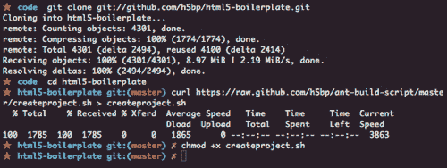
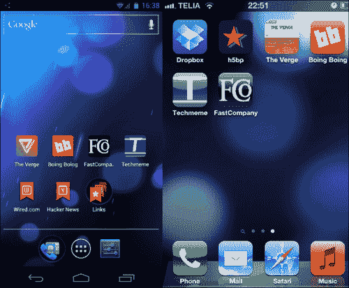

# 二、启动您的项目

您希望尽可能快地启动并运行您的项目，在本章中，我们将看到一些使用 HTML5 样板文件的最快方法。

有许多风格的 HTML5 样板可供选择，我们将研究创建您的起始文件夹的一些机制，并看看一旦您开始，您可以处理的即时任务。

# 创建您的初始项目文件夹

正如我们在上一章中看到的，HTML5 样板有三个版本。以下是开始使用最新文件的两种最快方法:

*   为您开始的每个新项目下载最新版本的 HTML5 样板文件
*   维护 HTML5 样板的本地最新副本，并使用脚本将文件复制到项目中

我们现在将从这两个方面来看。

## 下载 HTML5 样板的最新版本

这是在 HTML5 样板文件上开始使用最新文件的最简单方法。如果你熟悉 Git，你可以下载 HTML5 样板作为文件夹。在命令行界面中，导航到通常存储项目的文件夹，然后在命令行界面中输入以下命令:

```html
git clone git://github.com/h5bp/html5-boilerplate.git

```

这会将名为`html5-boilerplate`的文件夹下载到该文件夹中。然后，您可以将其重命名为您自己的项目，并开始使用它。

如果您不熟悉命令行界面，您可以下载最新的文件作为 ZIP 文件，并将其解压缩到一个文件夹中，您可以将其重命名为要使用的项目。

如果您觉得这些选项很乏味，我建议您使用 shell 脚本。但是，它要求您让 Git 设置并熟悉命令行界面。

### 注

如果你在 Windows 上，一定要在`sources.redhat.com/cygwin/cygwin-ug-net/cygwin-ug-net.html`下载 **Cygwin** ，用它来输入我提到的所有命令行。

在`nathanj.github.com/gitguide/tour.html`还有一个在 Windows 上设置和使用 Git 的图解指南。

## 使用外壳脚本

使用这个脚本，我们将为 HTML5 样板文件建立一个本地存储库，该存储库可以与项目中所做的更改保持同步。

转到您希望保存最新 HTML5 样板文件副本的文件夹，您希望将其用作所有项目的参考。就我而言，我想把它保存在一个名为`source`的文件夹中。

然后，使用上一节中提到的相同命令行脚本来下载文件的最新副本。脚本如下:

```html
git clone git://github.com/h5bp/html5-boilerplate.git

```

我们将让该文件夹保持原样，而不是重命名该文件夹。接下来，我们将把`createproject.sh` shell 脚本复制到这个文件夹中。

在 shell 中，导航到`html5 Boilerplate`文件夹，下载`createproject.sh`文件，如下命令行脚本所示:

```html
curl https://raw.github.com/h5bp/ant-build-script/master/createproject.sh > createproject.sh

```

通过在 shell 中执行以下命令，确保它是可执行的:

```html
chmod +x createproject.sh

```

这些命令行脚本的执行如下图所示:



然后从命令行执行以下脚本:

```html
./createproject.sh <project-name>

```

这将在`html5-boilerplate`文件夹的父文件夹中创建一个标题为项目名称的文件夹。如果希望项目文件位于其他位置，也可以使用项目文件夹的绝对路径，如以下脚本所示:

```html
./createproject.sh /Users/divya/projects/<project-name>

```

# 创建我们的项目

在这本书中，我们将致力于一个示例项目，以了解如何使用 HTML5 样板。我们所有的项目源文件都可以在`nimbu.in/h5bp-book/sun-shine-festival-2012/`获得。

假设我们需要为 2012 年 11 月 12 日至 2012 年 11 月 16 日在塞内加尔达喀尔的恩戈尔和特罗乌比举行的假设的太阳和沙子节创建一个网站。我想给这个项目贴上`sun-sand-festival-2012`的标签。

我把我所有的项目存储在一个`projects`文件夹中，把我所有的框架和初学者工具包存储在一个`source`文件夹中。

在我的源文件夹中，我有最初用以下脚本创建的`html5-boilerplate`文件夹:

```html
git clone git://github.com/h5bp/html5-boilerplate.git

```

我定期更新它，方法是在 Github 上托管的主存储库中提取最新的更改，使用以下脚本:

```html
git pull origin master

```

我在同一个文件夹中也有`createproject.sh` shell 脚本，我们将使用它来创建我们的新项目。在 shell 界面中，我导航到`html5-boilerplate`文件夹，并输入以下脚本:

```html
./createproject.sh ../projects/sun-sand-festival-2012

```

这将创建项目文件夹，其中包含开始工作所需的所有文件。创建的文件如下图所示:


# 管家

现在我们已经准备好了我们的项目，让我们开始做一些基本的内务处理，我们将需要做任何项目。在您喜欢使用的任何文本编辑器中打开项目。

### 类型

如果你正在寻找一个好的文本编辑器，我强烈推荐跨平台**崇高文本**文本编辑器，可从[www.sublimetext.com](http://www.sublimetext.com)下载。命令行大师可能想尝试使用 **Vim** 文本编辑器，可从[www.vim.org](http://www.vim.org)下载。

## 设置标签

我们的`index.html`页面包含一些我们需要填写的标签:

```html
<title></title>
<meta name="description" content="">
```

对于我们项目的标题标签，让我们输入以下内容:

```html
<title>Home | Sun and Sand Festival 2012, Dakar</title>
```

当网站在搜索引擎结果中列出时，带有`name`描述的`meta`标签非常有用。这个标签将被用来呈现解释这个页面内容的文本片段。让我们将设置为以下内容:

```html
<meta name="description" content="Sun and Sand Festival is occurring between Nov 12 to Nov 16 2012 at the Ngor and Terou Bi, Dakar featuring performances by top Senegal artists">
```

## 编辑收藏夹图标

添加收藏夹将是我们大多数人在开始一个项目时忘记做的下一件小事。这是你能达到的下一个容易的目标，在你需要开始考虑你将要创建的代码之前。

图标有助于唯一识别您的网站。如下面的截图所示，有一个 favicon 可以很容易地告诉你想访问哪个标签或书签:


当您的页面被添加到 iOS(如下图右侧截图所示)和安卓设备(如下图左侧截图所示)的主屏幕时，触摸图标非常有用:



HTML5 样板文件在根文件夹中带有一组图标，这些图标的大小适合触摸屏图标(安卓和 iOS 设备都使用)和收藏夹图标所需的所有图标。当你在你的图标上工作时，你可以用它们作为指南。

HTML5 样板带有以下组图标:

*   **faviicon . ico**:桌面浏览器用来在标签页或标题旁边呈现图标的默认图标。
*   **apple-touch-icon.png**:如果没有其他指定，iOS 将使用这个图标在主屏幕上渲染。不幸的是，这也意味着 iOS 将在这个图标上添加自己的效果，如阴影、圆角和反光。如果不支持其他功能，例如 iOS 1 和黑莓 OS 6，这也是一种不错的回退图标格式。
*   **apple-touch-icon-precomposed.png**:这个防止 iOS 在你的图标上应用任何类型的效果，让它保持原样。提供此图标还将确保当您的网页添加到主屏幕时，Android 2.1 及以上设备将使用此图标。
*   **apple-touch-icon-57x57-precomposed.png**:这个将会被没有 Retina 显示的 iOS 设备使用。
*   **apple-touch-icon-72x72-precomposed.png**:这个会被 iPad 使用，iPad 没有高分辨率显示。
*   **apple-touch-icons-114x114-precomposed.png**:这个将会被高分辨率的 iPhone Retina 显示器使用。
*   **apple-touch-icons-144x144-precomposed.png**:这个将被高分辨率 iPad Retina 显示器使用。

为什么我们有这么多图标的基本原理已经被马蒂亚斯·比涅斯在 http://mathiasbynens.be/notes/touch-icons 记录了下来。

### 注

汉斯·克里斯蒂安·赖因主持一个包含所有图标的`PSD`模板，你可以用它来开始为你的项目创建图标。如果你需要如何创建这些图标的指导，乔恩·希克斯在[www.netmagazine.com/features/create-perfect-favicon](http://www.netmagazine.com/features/create-perfect-favicon)写道如何这样做。

如果您有创建图标所需的图形元素，您可以开始将这些图标添加到项目的根文件夹中。很可能你会在最后期限临近时忘记做这件事。

对于我们的太阳和沙子节示例，我们已经组装了关键的图形元素，下面的截图显示了从`PSD`模板生成的图标:


## 添加第三方库

如果你已经有了一个你将要使用的库列表，你可以开始将它们添加到文件夹中。

HTML5 样板文件附带了 jQuery 的最新稳定版本，所以您已经拥有了它。如果倾向于使用 jQuery UI 等其他库，可以复制到`libs`文件夹。

假设你想在你的项目中使用 jQuery UI，可在[www.jqueryui.com](http://www.jqueryui.com)获得，然后将最新版本的 jQuery UI 复制到`libs`文件夹中，然后在`index.html`标记的底部，使用`script`标签引用它。

### 使用内容交付网络

通过使用**内容交付网络** ( **CDN** )，我们可以减少在我们的网络服务器上服务的资源数量通过引用由谷歌或微软普遍托管的资源，文件更有可能被缓存，因为用户访问的许多其他网站也将引用该特定资源。

如果您密切关注，您会注意到链接到 jQuery 的脚本的源代码不同于我们的 jQuery UI 源代码。这有两个原因，下面几节将对此进行解释。

#### 协议相关网址

通常，大多数链接 T4 到网络资产的网址都以 T0 开头。然而，有时页面托管在使用加密通信的服务器上。所以，你的页面将被提供`https://`而不是典型的`http://`。唉，由于您的脚本源仍然被`http://`协议引用，IE 将抛出一个令人讨厌的对话框，向您页面上的访问者询问以下问题:


你绝对不希望你的访客对此感到恐慌。因此，防止这种情况的最简单方法是完全删除 URL 的协议(`http:`)部分，如下所示:

```html
//ajax.googleapis.com/ajax/libs/jquery/1.7.1/jquery.min.js

```

这样，浏览器将使用为该请求提供的任何协议。您可以在[附录](08.html "Appendix A. You Are an Expert,Now What?")部分了解更多与协议相关的网址。

当然，这意味着如果您在本地测试，并且如果您在浏览器上查看您的页面，浏览器将使用看起来像`file://users/divya/projects,`的 URL，因此浏览器将尝试使用以下 URL 查找 jQuery 文件:

```html
file://ajax.googleapis.com/ajax/libs/jquery/1.7.1/jquery.min.js

```

这个请求肯定会失败，因为该路径上没有本地资源。因此，如果你正在使用协议相关的网址，你需要设置一个本地服务器来测试你的文件。这可以在基于 Mac 或 Unix 的操作系统上轻松完成，方法是在 shell 界面中导航到项目文件夹，然后执行以下命令:

```html
python -m SimpleHTTPServer

```

这将启动一个服务器，您项目的`index.html`文件将在`http://localhost:8000`上可用。

### 类型

如果你在 Windows 上，将 Mongoose 可执行文件(编写时的最新版本是`mongoose-3.3.exe`)从`code.google.com/p/mongoose/`复制到你的项目文件夹中并启动它。您的项目`index.html`将在`http://localhost:8080`上市。

#### 谷歌 CDN 托管

谷歌拥有许多流行的 JavaScript 库。在`code.google.com/apis/libraries/devguide.html`可以获得谷歌 CDN 上托管的所有库的列表。

我们也可以在 jQuery 用户界面中利用谷歌的 CDN，因为它是托管在上面的。让我们通过将脚本文件的来源从`js/libs/jqueryui-jquery-ui-1.8.17.min.js`更改为以下内容，将其转换为使用谷歌的 CDN:

```html
//ajax.googleapis.com/ajax/libs/jqueryui/1.8.16/jquery-ui.min.js

```

但是等等！让我们看看如何在 HTML5 样板中引用 jQuery CDN。这在下面的代码片段中显示:

```html
<script src="//ajax.googleapis.com/ajax/libs/jquery/1.8.2/jquery.min.js"></script>
<script>window.jQuery || document.write('<script src="js/vendor/jquery-1.8.2.min.js"><\/script>')
</script>
```

您注意到我们如何引用 jQuery 文件的本地副本了吗？我们这样做只是为了在谷歌的 CDN 失败的情况下，我们仍然可以使用我们的本地副本。诚然，这种情况并不经常发生，但如果真的发生了，有个退路还是有用的。

声明`window.jQuery || document.write(…)`做了两件事。这些措施如下:

*   检查 jQuery 对象是否存在:如果存在，说明谷歌的 CDN 工作正常。如果它存在，什么都不要做。
*   如果`window.jQuery`对象不存在:这意味着谷歌的 CDN 失败；它会立即在项目的`libs`文件夹中呈现一个引用 jQuery 副本的`script`标签。这告诉浏览器立即请求该资源。

我们可以为 jQuery UI 做一些类似的事情。

所有的 jQuery 插件都是 jQuery 对象中的对象。因此，我们只需要验证插件对象是否存在，如果不存在，则在`libs`文件夹中加载插件的副本，使用以下代码片段:

```html
<script>window.jQuery.ui || document.write('<script src="js/libs/jqueryui-jquery-ui-1.8.17.min.js"><\/script>')
</script>
```

因此，我们引用 jQuery 用户界面的完整脚本文件将是，如以下代码片段所示:

```html
<script src="//ajax.googleapis.com/ajax/libs/jqueryui/1.8.16/jquery-ui.min.js "></script>
<script>window.jQuery.ui || document.write('<script src="js/libs/jqueryui-jquery-ui-1.8.16.custom.min.js"><\/script>')
</script>
```

### 注

还有其他宿主库的 cdn。`cdnjs.com` URL 托管了大量的 JavaScript 库。微软也在其 CDN 上托管了一些库；该名单可在[www.asp.net/ajaxlibrary/cdn.ashx](http://www.asp.net/ajaxlibrary/cdn.ashx)获得。

## 添加谷歌分析 ID

这是另一个在最后期限到来时被遗忘的小行为。HTML5 样板已经提供了现成的片段供您使用。所有你需要包括的是你的网站的唯一标识符。

请注意，HTML5 样板包括页面页脚的代码片段，这意味着只有在页面加载后才会发送度量。然而，也有一些人认为分析应该在页面加载之前发生，以衡量谁在页面加载完成之前就离开了页面。如果您想这样做，您应该将分析片段移到`index.html`页面中结束的`</head>`标签的正上方。

## 更新人类

`humans.txt`让知道在网站工作过的人。任何人都可以简单地访问`example.com/humanx.txt`立即知道在那个网站工作过的人的名字。将您和您团队成员的姓名添加到 HTML5 样板文件中的`humans.txt`文件中。

对于我们的太阳和沙子节示例，下面的截图显示了我们的`humans.txt`将会是什么样子:


# 总结

在本章中，我们了解了如何使用 HTML5 样板文件开始一个项目，以及我们在新项目中应该采取的第一步。在路上，我们了解了与协议相关的网址和链接到 cdn 上托管的库。我们更新了`humans.txt`文件和我们项目中要使用的图标。到目前为止，我们对示例项目所做的所有更改都可以在`nimbu.in/h5bp-book/chapter-2/`处获得。在下一章中，我们将考虑为我们的项目编写一些代码。