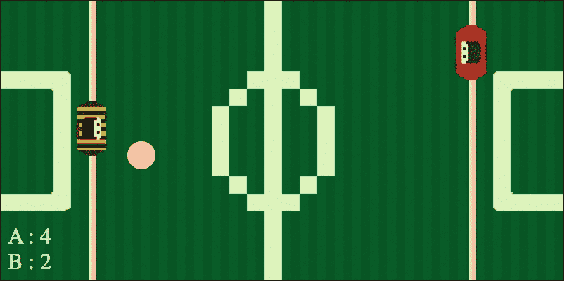
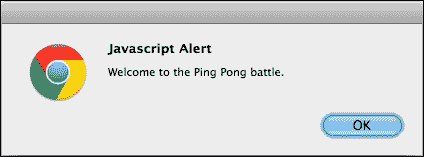
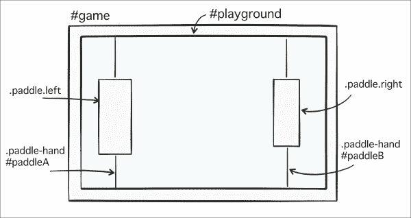
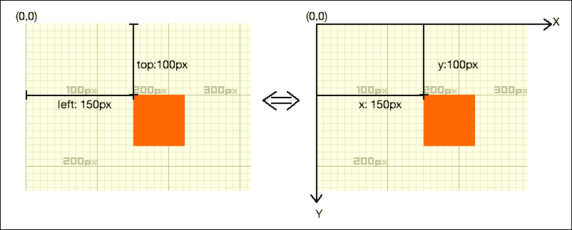
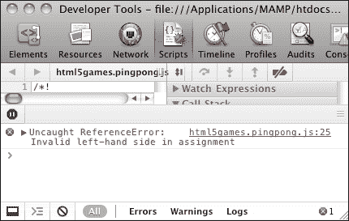
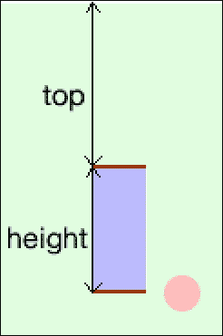
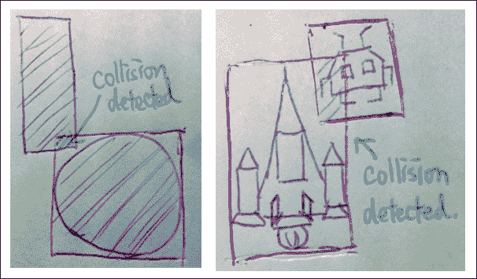

# 二、基于 DOM 的游戏开发入门

*在[第一章](01.html "Chapter 1. Introducing HTML5 Games")*介绍 HTML5 游戏*中，我们已经了解了整本书要学习的内容。从本章开始，我们将经历很多“边做边学”的章节，我们将在每个章节中集中讨论一个主题。在深入研究最前沿的 CSS3 动画和 HTML5 画布游戏之前，让我们先从传统的基于 DOM 的游戏开发开始。在本章中，我们将使用一些基本技术进行热身。*

在本章中，我们将：

*   建立我们的第一场乒乓球比赛
*   使用 jQuery JavaScript 库学习基本定位
*   获取鼠标输入
*   创建显示分数的乒乓球游戏
*   学习分离数据和查看渲染逻辑

我们将创建一个乒乓球游戏，玩家通过鼠标输入与计算机进行游戏。您可以在[试试游戏 http://makzan.net/html5-games/pingpong/](http://makzan.net/html5-games/pingpong/) 。

以下屏幕截图显示了本章末尾的游戏外观：



那么，让我们继续制作我们的乒乓球游戏吧。

### 注

在编写本书时，jQuery 版本是 2.1.3。我们在示例中使用的 jQuery 函数是在将来的版本中也应该使用的基本函数。

# 为基于 DOM 的游戏准备 HTML 文档

每个网站、网页和 HTML5 游戏都以默认的 HTML 文档开始。此外，该文档从一个基本的 HTML 代码开始。我们将以`index.html`开始 HTML5 游戏开发之旅。

# 行动时间-安装 jQuery 库

我们将从头开始创建 HTML5 乒乓球游戏。听起来好像我们要自己准备所有的事情。幸运的是，我们可以使用 JavaScript 库来帮助我们。**jQuery**是**JavaScript 库**，设计用于轻松导航 DOM 元素、操作它们、处理事件以及创建异步远程调用。我们将在书中使用这个库来操作 DOM 元素。它将帮助我们简化 JavaScript 逻辑：

1.  创建一个名为`pingpong`的新文件夹作为我们的项目目录。
2.  在`pingpong`文件夹中，我们将创建以下文件结构，包括三个文件夹—`js`、`css`和`images`——以及一个`index.html`文件：

    ```html
    index.html
    js/
      js/pingpong.js
    css/
      css/pingpong.css
    img/
    ```

3.  现在，是下载 jQuery 库的时候了。转到[http://jquery.com/](http://jquery.com/) 。
4.  选择**下载 jQuery**并点击**下载压缩的生产 jQuery 2.1.3**。
5.  将`jquery-2.1.3.min.js`保存在我们在步骤 2 中创建的`js`文件夹中。
6.  在文本编辑器中打开`index.html`，插入空 HTML 模板：

    ```html
    <!DOCTYPE html>
    <html lang="en">
    <head>
      <meta charset="utf-8">
      <title>Ping Pong</title>
      <link rel="stylesheet" href="css/pingpong.css">
    </head>
    <body>
      <header>
        <h1>Ping Pong</h1>
      </header>
      <div id="game">
        <!-- game elements to be here -->
      </div>
      <footer>
        This is an example of creating a Ping Pong Game.
      </footer>
      <script src="js/jquery-2.1.3.min.js"></script>
      <script src="js/pingpong.js"></script></body>
    </html>
    ```

7.  最后，我们必须确保 jQuery 成功加载。为此，将以下代码放入`js/pingpong.js`文件中：

    ```html
    (function($){
      $(function(){
        // alert a message
        alert("Welcome to the Ping Pong battle.");
      });
    })(jQuery);
    ```

8.  Save the `index.html` file and open it in the browser. You should see the following alert window showing our text. This means that our jQuery is correctly set up:

    

## *刚才发生了什么事？*

我们刚刚用 jQuery 创建了一个基本的 HTML5 页面，并确保 jQuery 被正确加载。

## 新 HTML5 doctype

在 HTML5 中，`DOCTYPE`和`meta`标记被简化。

在 HTML 4.01 中，我们使用以下代码声明 doctype：

```html
<!DOCTYPE HTML PUBLIC "-//W3C//DTD HTML 4.01//EN" "http://www.w3.org/TR/html4/strict.dtd">
```

这是一行很长的代码，对吗？在 HTML5 中，doctype 声明再简单不过了：

```html
<!DOCTYPE html>
```

声明中甚至没有 HTML 版本。这是因为 HTML5 现在是一个没有版本号的生活标准。

## 页眉和页脚

HTML5 有许多新特性和改进，其中之一就是语义。HTML5 添加了新的元素来改进**语义**。我们只使用了两个元素：`header`和`footer`。**页眉**对章节或整页进行介绍。因此，我们将`h1`标题放在标题中。**页脚**与顾名思义的一样，包含章节或页面的页脚信息。

### 注

语义 HTML 意味着标记本身为内容提供有意义的信息，而不仅仅是定义视觉外观。

## 放置 JavaScript 代码的最佳实践

我们将 JavaScript 代码放在结束`</body>`标记之前，并放在页面中所有内容之后。将代码放在那里而不是放在`<head></head>`部分是有原因的。

通常，浏览器加载内容并从上到下呈现。如果 JavaScript 代码放在`head`部分，则在加载所有 JavaScript 代码之前不会加载文档内容。实际上，如果浏览器在页面中间加载一个 JavaScript 代码，所有的渲染和加载都会被暂停。这就是我们希望尽可能将 JavaScript 代码放在底部的原因。通过这种方式，我们可以更快地向读者提供 HTML 内容。

在编写本书时，jQuery 的最新版本是 2.1.3。这就是为什么我们代码示例中的 jQuery 文件名为`jquery-2.1.3.min.js`。文件名中的版本号确保 web 开发人员不会与不同项目中相同文件名的不同版本混淆。这个版本号会有所不同，但是用法应该是相同的，除非 jQuery 中有很大的变化而没有向后兼容性。

### 注

请注意，一些 JavaScript 库必须在加载任何 HTML 元素之前放置`<head>`标记。当您使用第三方库时，请检查它们是否有这样的要求。

## 选择 jQuery 文件

对于 jQuery 库，目前有两个主要版本；它们是**1.x**和**2.x**。x 版本保持了与旧浏览器的向后兼容性，主要用于 IE 版本 6、7 和 8。由于我们的 HTML5 游戏以现代浏览器为目标，我们选择了 2.x 版本，该版本已经放弃了对 IE8 或更旧版本的支持。

包含 jQuery 库有两种常见方法。我们可以下载**托管的**版本或使用**CDN**版本。托管版本意味着我们下载文件，并且我们自己托管文件。CDN 代表内容交付网络。jQuery 文件托管在几个中央服务器中，以缩短文件下载时间。对于 CDN 版本，我们可以在[找到 URLhttp://code.jquery.com](http://code.jquery.com) 。我们可以直接将 HTML 中带有`<script>`标记的文件包括为：`<script src="http://code.jquery.com/jquery.min.js"></script>`。

否则，我们可以将文件名中的版本号指定为：`<script src="http://code.jquery.com/jquery-2.1.3.min.js"></script>`。

## 在范围内运行 jQuery

我们需要确保页面在我们的 JavaScript 代码执行之前准备就绪。否则，当我们试图访问尚未加载的元素时，可能会出现错误。jQuery 为我们提供了一种在页面准备就绪后使用以下代码执行代码的方法：

```html
jQuery(document).ready(function(){
  // code here.
});
```

大多数情况下，我们使用`$`符号来表示 jQuery。这是一个使调用 jQuery 函数更容易的快捷方式。因此，本质上，我们使用以下代码：

```html
$(function(){
  // code here.
});
```

当我们呼叫`$(something)`时，我们实际上是在呼叫`jQuery(something)`。

如果我们在一个项目中使用多个 JavaScript 库，`$`变量可能会发生冲突。为了获得最佳实践，我们使用一个**匿名函数**将 jQuery 对象传递到函数范围，在该范围内它将成为一个`$`符号：

```html
(function($){
  // jQuery code here with $.
})(jQuery);
```

匿名函数是没有名称的函数定义。这就是为什么它被称为匿名。因为我们不能再引用这个函数了，所以匿名函数总是自己执行。JavaScript 的变量范围绑定到函数范围。我们经常使用匿名函数来控制某些变量的可用性。例如，在我们的示例中，我们将 jQuery 作为`$`变量传递到函数中。

## 页面准备就绪后运行我们的代码

`$(function_callback)`是 DOM 元素`ready`事件的另一个快捷方式。我们需要 jQuery`ready`函数的原因是为了防止在加载 HTMLDOM 元素之前执行 JavaScript 逻辑。我们在 jQuery`ready`函数中定义的函数是在加载所有 HTML 元素后执行的。

它与以下代码行相同：

```html
$(document).ready(function_callback);
```

### 注

请注意，jQuery`ready`事件在加载 HTML 结构（DOM 树）后触发。然而，这并不意味着加载诸如实际图像内容之类的内容。另一方面，浏览器的`onload`事件在加载包括图像在内的所有内容后触发。

## 突击测验

问题 1。哪一个是放置 JavaScript 代码的最佳位置？

1.  在`<head>`标签之前
2.  `<head></head>`元素内部
3.  就在`<body>`标签后面
4.  就在`</body>`标签前面

## 下载图片资产

这一步我们需要一些图形文件。您可以在代码包中或从[下载图形文件 http://mak.la/book-assets/](http://mak.la/book-assets/) 。

在资产包中，您将找到`Chapter 2`的图像文件。下载后，将文件放入`images`文件夹中。应该有四个文件，如以下屏幕截图所示：


# 设置乒乓球游戏元素

我们已经做好了准备，现在是开始乒乓球比赛的时候了。下图显示了如何放置游戏元素。游戏元素包括我们的操场和后来的记分板。在操场内，我们放置了两个装饰元素，即**桨手**，作为足球机的手柄。然后，我们有两个**桨**元素，一个在左边，一个在右边。



# 行动时间-在 DOM 中放置乒乓球游戏元素

1.  我们将继续 jQuery 安装示例中的，并在文本编辑器中打开`index.html`文件。
2.  然后，我们将在主体中创建以下带有 DIV 节点的游乐场和`game`对象。操场内有两个桨和一个球，操场放在游戏内：

    ```html
    <div id="game">
      <div id="playground">
        <div class="paddle-hand right"></div>
        <div class="paddle-hand left"></div>
        <div id="paddleA" class="paddle"></div>
        <div id="paddleB" class="paddle"></div>
        <div id="ball"></div>
      </div>
    </div>
    ```

3.  现在我们已经准备好了`game`对象的结构，是时候对它们应用样式了。我们将在`pingpong.css`文件中添加以下样式：

    ```html
    #game {
      position: relative;
      width: 400px;
      height: 200px;
    }
    #playground{
      background: url(img/playground.png);
      background-size: contain;
      width: 100%;
      height: 100%;
      position: absolute;
      top: 0;
      left: 0;
      overflow: hidden;
      cursor: pointer;
    }
    #ball {
      background: #fbb;
      position: absolute;
      width: 20px;
      height: 20px;
      left: 150px;
      top: 100px;
      border-radius: 10px;
    }
    ```

4.  然后，我们将通过在`pingpong.css`文件中添加以下代码来定义两个桨叶的尺寸和位置：

    ```html
    .paddle {
      background-size: contain;
      top: 70px;
      position: absolute;
      width: 30px;
      height: 70px;
    }

    #paddleA {
      left: 50px;
      background-image: url(img/football-player-left.png);
    }
    #paddleB {
      right: 50px;
      background-image: url(img/football-player.png);
    }
    ```

5.  我们将延续`pingpong.css`文件中的样式，定义`paddle-hands`，这是桨叶的装饰：

    ```html
    .paddle-hand {
      background: url(img/football-player-hand.png) 50% 0 repeat-y;
      background-size: contain;
      width: 30px;
      height: 100%;
      position: absolute;
      top: 0;
    }
    .left.paddle-hand {
      left: 50px;
    }
    .right.paddle-hand {
      right: 50px;
    }
    ```

6.  现在我们已经完成了 CSS 样式，让我们转到`js/pingpong.js`文件来了解 JavaScript 的逻辑。我们需要一个函数来根据位置数据更新拨片的 DOM 元素。为此，我们将用以下代码替换当前代码：

    ```html
    (function($){
      // data definition
      var pingpong = {
        paddleA: {
          x: 50,
          y: 100,
          width: 20,
          height: 70
        },
        paddleB: {
          x: 320,
          y: 100,
          width: 20,
          height: 70
        },
      };

      // view rendering
      function renderPaddles() {
        $("#paddleB").css("top", pingpong.paddleB.y);
        $("#paddleA").css("top", pingpong.paddleA.y);
      }

      renderPaddles();

    })(jQuery);
    ```

7.  Now, we will test the setup in a browser. Open the `index.html` file in a browser; we should see a screen similar to the one shown in the following screenshot:

    

## *刚才发生了什么事？*

让我们来看看我们刚刚使用的 HTML 代码。HTML 页面包含页眉、页脚信息和 ID 为`game`的 DIV 元素。`game`节点包含一个名为`playground`的子节点，该子节点依次包含三个子节点—两个桨和球。

我们通常通过准备一个结构良好的 HTML 层次结构来开始 HTML5 游戏开发。HTML 层次结构帮助我们将类似的游戏对象（一些 DIV 元素）分组在一起。这有点像在 AdobeFlash 中将资源分组到电影剪辑中，如果您曾经使用它制作过动画的话。我们也可以把它看作是游戏对象的层次，便于我们选择和风格化。

## 使用 jQuery

jQuery 命令通常包含两个主要部分：**选择**和**修改**。选择使用 CSS 选择器语法选择网页中所有匹配的元素。修改操作修改选定图元，例如添加或删除子图元或样式。使用 jQuery 通常意味着将选择和修改操作链接在一起。

例如，下面的代码使用`box`类选择所有元素并设置 CSS 属性：

```html
$(".box").css({"top":"100px","left":"200px"});
```

## 了解基本 jQuery 选择器

jQuery 是关于选择元素并对其执行操作的。我们需要一个方法来选择整个 DOM 树中所需的元素。jQuery 借用了 CSS 中的选择器。选择器提供一组模式来匹配元素。下表列出了我们将在本书中使用的最常见和最有用的选择器：

<colgroup><col style="text-align: left"> <col style="text-align: left"> <col style="text-align: left"></colgroup> 
| 

选择器模式

 | 

意思

 | 

例子

 |
| --- | --- | --- |
| `$("Element")` | 选择具有给定标记名的所有元素 | `$("p")`选择所有`p`标签。`$("body")`选择`body`标签。 |
| `$("#id")` | 选择具有给定属性 ID 的元素 | 考虑下面的代码：

```html
<div id="box1"></div>
 <div id="box2"></div>
```

`$("#box1")`选择高亮显示的元素。 |
| `$(".className")` | 选择具有给定类属性的所有元素 | 考虑下面的代码：

```html
<div class="apple"></div>
<div class="apple"></div>
 <div class="orange"></div>
 <div class="banana"></div>
```

`$(".apple")`选择`class`设置为`apple`的高亮显示元素。 |
| `$("selector1, selector2, selectorN")` | 选择与给定选择器匹配的所有元素 | 考虑下面的代码：

```html
<div class="apple"></div>
<div class="apple"></div>
<div class="orange"></div>
 <div class="banana"></div>
```

`$(".apple,``.orange")`选择`class`设置为`apple`或`orange`的高亮显示元素。 |

## 了解 jQuery CSS 函数

jQuery`css`函数用于获取和设置所选元素的 CSS 属性。这被称为获取和设置模式，许多 jQuery 函数都遵循这种模式。

以下是如何使用`css`功能的一般定义：

```html
.css(propertyName)
.css(propertyName, value)
```

`css`函数接受下表中列出的几种类型的参数：

<colgroup><col style="text-align: left"> <col style="text-align: left"> <col style="text-align: left"></colgroup> 
| 

功能类型

 | 

参数定义

 | 

讨论

 |
| --- | --- | --- |
| `.css(propertyName)` | `propertyName`是 CSS 属性 | 函数返回所选元素的给定 CSS 属性的值。例如，下面的代码返回`body`元素的`background-color`属性的值：`$("body").css("background-color")`它将只读取值，而不修改属性值。 |
| `css(propertyName,``value)` | `propertyName`是 CSS 属性，`value`是要为该属性设置的值。 | 该函数将给定的 CSS 属性修改为给定的值。例如，以下代码将`box`类的所有元素的背景色设置为红色：`$(".box").css("background-color","#ff0000")` |

## 使用 jQuery 操作 DOM 中的游戏元素

我们用 jQuery 初始化了桨的游戏元素。我们将做一个关于如何使用 jQuery 放置游戏元素的实验。

## 理解绝对位置的行为

当 DOM 节点被设置为在`absolute`位置时，左侧和顶部属性可以被视为**坐标**。我们可以将左/顶属性处理为 Y 正指向下的 X/Y 坐标。下图显示了这种关系。左侧是实际 CSS 值，右侧是编程游戏时我们脑海中的坐标系：



默认情况下，左侧和顶部属性指的是网页的左上角边缘。当此 DOM 节点的任何父节点的`position`样式显式设置为`relative`或`absolute`时，此参考点是不同的。“左”和“顶”特性的参照点将成为该父特性的左上边缘。

这就是为什么我们需要将游戏设置为相对位置，并将其中的所有游戏元素设置为绝对位置。我们示例中的以下代码片段显示了元素的位置值：

```html
#game{
  position: relative;
}
#playground,
#ball,
#paddle {
  position: absolute;
}
```

## 以更好的方式声明全局变量

**全局变量**是可以在整个文档中全局访问的变量。在任何函数外部声明的任何变量都是全局变量。例如，在下面的示例代码段中，`a`和`b`是全局变量，`c`是只存在于函数内部的**局部变量**：

```html
var a = 0;
var b = "xyz";
function something(){
  var c = 1;
}
```

由于全局变量在整个文档中都是可用的，如果我们将不同的 JavaScript 库集成到同一网页中，它们可能会增加变量名冲突的可能性。作为良好实践，我们应该尽量减少使用全局变量。

在前面的*动作时间*部分中，我们有一个对象来存储游戏数据。我们创建了一个名为`pingpong`的对象，并将数据放入其中，而不是将该对象放在全局范围内。

此外，当我们将所有逻辑放入一个自执行函数中时，正如我们在上一节中所讨论的，我们将游戏的数据对象放在函数范围内。

### 注

在没有`var`的情况下声明变量会将变量放入全局范围，即使它们是在函数范围内定义的。所以，我们总是用`var`来声明变量。

## 突击测验

问题 1。如果要选择所有标题元素，将使用哪个 jQuery 选择器？

1.  `$("#header")`
2.  `$(".header")`
3.  `$("header")`
4.  `$(header)`

# 获取鼠标输入

在前面的章节中，您学习了如何使用 CSS 和 jQuery 显示游戏对象。我们需要在游戏中创建的下一件事是从玩家那里获取输入。我们将在本节讨论鼠标输入。

# 行动时间–通过鼠标输入移动 DOM 对象

我们将创造一个传统的乒乓球游戏。操场的左右两侧都有一个桨。一个球放在操场的中间。玩家可以用鼠标控制右桨并上下移动。我们将重点关注鼠标输入，并将球的移动留待后面的部分：

1.  让我们继续我们的`pingpong`目录。
2.  接下来，在`js/pingpong.js`文件中的`pingpong`数据对象中添加一个`playground`对象。存储与`playground`：

    ```html
    // data definition
    var pingpong = {
      paddleA: {
        x: 50,
        y: 100,
        width: 20,
        height: 70
      },
      paddleB: {
        x: 320,
        y: 100,
        width: 20,
        height: 70
      },
      playground: {
        offsetTop: $("#playground").offset().top,
      }
    };
    ```

    相关的变量
3.  然后，创建处理鼠标进入、移动和离开事件的以下函数，并将其放入`js/pingpong.js`文件中：

    ```html
    function handleMouseInputs() {
      // run the game when mouse moves in the playground.
      $('#playground').mouseenter(function(){
        pingpong.isPaused = false;
      });

      // pause the game when mouse moves out the playground.
      $('#playground').mouseleave(function(){
        pingpong.isPaused = true;
      });

      // calculate the paddle position by using the mouse position.
      $('#playground').mousemove(function(e){
        pingpong.paddleB.y = e.pageY - pingpong.playground.offsetTop;  
      });
    }
    ```

4.  我们在上一节中使用了`renderPaddles`功能。在本节中，我们将定义一个`render`函数并调用桨渲染逻辑。然后我们在下一个浏览器上调用`render`函数，通过`requestAnimationFrame`函数重新绘制。

    ```html
    function render() {
      renderPaddles();
      window.requestAnimationFrame(render);
    }
    ```

5.  最后，我们创建一个`init`函数来执行初始逻辑。

    ```html
    function init() {
      // view rendering
      window.requestAnimationFrame(render);

      // inputs
      handleMouseInputs();
    }
    ```

6.  最后，您需要调用启动游戏逻辑的`init`函数：

    ```html
    (function($){
      // All our existing code

      // Execute the starting point
      init();
    })(jQuery);
    ```

7.  让我们测试一下游戏的`paddle`控制。在 web 浏览器中打开`index.html`页面。尝试在操场区域内上下移动鼠标。右桨应跟随鼠标的移动。

## *刚才发生了什么事？*

我们根据鼠标位置处理鼠标事件以移动挡板。您可以在[处玩游戏当前正在进行的工作版本 http://makzan.net/html5-games/pingpong-wip-step3/](http://makzan.net/html5-games/pingpong-wip-step3/) 。

## 获取鼠标事件

jQuery 提供了几个方便的鼠标事件，最基本的是单击、鼠标下键和鼠标上键。我们跟踪鼠标进入和鼠标离开事件以开始和暂停游戏。我们还使用鼠标移动事件获取鼠标位置，并根据操场区域上的鼠标位置更新挡板位置。

我们需要根据操场的左上边缘获取光标的*y*位置。鼠标事件中的`Y`值是页面左上角的鼠标光标。然后我们通过`$("#playground").offset().top`减去操场的位置。

我们使用鼠标的`X`和`Y`值更新桨的`Y`值数据。在浏览器重画期间，当`render`功能中更新拨片视图时，该值最终将反映在屏幕上。

## 请求动画帧

时间间隔用于执行游戏循环。`game`循环计算游戏逻辑，计算游戏对象的移动。

`requestAnimationFrame`功能用于根据数据更新视图。我们使用`requestAnimationFrame`功能来更新视图，因为视图只需要在浏览器决定的最佳场景中更新。

`requestAnimationFrame`的间隔不是固定的。当浏览器位于前端时，`requestAnimationFrame`功能会经常运行。当电池电量不足或浏览器处于后台时，浏览器会降低`requestAnimationFrame`功能的执行频率。

我们仅在视图相关逻辑上使用`RequestAnimationFrame`。在后面的部分中，我们将需要处理游戏数据计算。对于数据计算，我们将使用`setInterval`，因为`setInterval`函数总是在固定的时间间隔内执行。这就是为什么我们使用`setInterval`函数进行游戏逻辑计算，并使用动画帧进行视图渲染。

## 检查控制台窗口

我们现在正在编写更复杂的逻辑代码。关注**开发者工具**的控制台是一种很好的做法。您可以在 Windows 中按*F12*或 Mac OS 上的*命令*+*选项*+*I*在开发者工具之间切换。如果代码包含任何错误或警告，则会显示错误消息。它报告发现的任何错误以及包含该错误的代码行。在测试 HTML5 游戏时，打开控制台窗口是非常有用和重要的。我经常看到人们陷入困境，不知道为什么代码不起作用。这是因为他们有一个打字错误或语法错误，并且他们在与代码斗争数小时之前没有检查控制台窗口。

下面的屏幕截图显示，`js/pingpong.js`文件的第二十五行有错误。错误消息为分配中的**左侧无效。检查代码后，我发现我在 jQuery 中设置 CSS`top`属性时错误地使用了等号（`=`：**

```html
$("#paddleA").css("top"=top+5);

// instead of the correct code:
// $("#paddleA").css("top", top+5);
```

错误显示如下：



## 使用 JavaScript 间隔移动 DOM 对象

想象一下，现在我们可以让小红球在操场上移动。球碰到球拍时会反弹开。当球越过对手的球拍并击中球拍后面的场地边缘时，球员将赢得一分。所有这些操作都通过 jQuery 操纵 HTML 页面中 div 的位置。为了完成这场乒乓球比赛，我们的下一步是移动球。

# 行动时间-以 JavaScript 间隔移动球

我们将使用函数创建一个计时器。计时器每 30 毫秒移动一次球。我们还将改变球的运动方向，一旦它击中操场边缘。让我们现在让球移动：

1.  我们将使用上一个示例，即收听多个键盘输入作为起点。
2.  在文本编辑器中打开`js/pingpong.js`文件。
3.  在现有的`pingpong.playground`对象中，我们将更改为以下代码，为操场添加高度和宽度。

    ```html
    playground: {
      offsetTop: $("#playground").offset().top,
      height: parseInt($("#playground").height()),
      width: parseInt($("#playground").width()),
    },
    ```

4.  我们现在正在移动球，我们需要在全球范围内存储球的状态。我们将球相关变量放入`pingpong`对象

    ```html
    var pingpong = {
      //existing data
      ball: {
        speed: 5,
        x: 150,
        y: 100,
        directionX: 1,
        directionY: 1
      }
    }
    ```

    中
5.  我们定义了一个`gameloop`函数，并在每个游戏循环迭代中移动球：

    ```html
    function gameloop() {
      moveBall();
    }
    ```

6.  我们定义了检查球是否撞击操场的四个边界墙的功能：

    ```html
    function ballHitsTopBottom() {
      var y = pingpong.ball.y + pingpong.ball.speed * pingpong.ball.directionY;
      return y < 0 || y > pingpong.playground.height;
    }
    function ballHitsRightWall() {
      return pingpong.ball.x + pingpong.ball.speed * pingpong.ball.directionX > pingpong.playground.width;
    }
    function ballHitsLeftWall() {
      return pingpong.ball.x + pingpong.ball.speed * pingpong.ball.directionX < 0;
    }
    ```

7.  然后，我们定义了两个函数，在任一玩家获胜后重置游戏。

    ```html
    function playerAWin() {
      // reset the ball;
      pingpong.ball.x = 250;
      pingpong.ball.y = 100;

      // update the ball location variables;
      pingpong.ball.directionX = -1;
    }
    function playerBWin() {
      // reset the ball;
      pingpong.ball.x = 150;
      pingpong.ball.y = 100;

      pingpong.ball.directionX = 1;
    }
    ```

8.  现在是定义`moveBall`函数的时候了。该函数检查操场的边界，在球碰到边界时更改球的方向，并在所有这些计算之后设置新的球位置。让我们在 JavaScript 文件中放置以下`moveBall`函数定义：

    ```html
    function moveBall() {  
      // reference useful varaibles
      var ball = pingpong.ball;

      // check playground top/bottom boundary
      if (ballHitsTopBottom()) {
        // reverse direction
        ball.directionY *= -1;
      }
      // check right
      if (ballHitsRightWall()) {
        playerAWin();
      }
      // check left
      if (ballHitsLeftWall()) {
        playerBWin();
      }

      // check paddles here

      // update the ball position data
        ball.x += ball.speed * ball.directionX;
        ball.y += ball.speed * ball.directionY;
    }
    ```

9.  我们已经计算了球的运动。接下来，我们希望渲染视图以根据数据更新球的位置。为此，使用以下代码定义一个新的`renderBall`函数。

    ```html
    function renderBall() {
      var ball = pingpong.ball;
      $("#ball").css({
        "left" : ball.x + ball.speed * ball.directionX,
        "top" : ball.y + ball.speed * ball.directionY
      });
    }
    ```

10.  现在我们需要更新`render`函数，根据更新后的游戏数据

    ```html
    function render() {
      renderBall();
      renderPaddles();
      window.requestAnimationFrame(render);
    }
    ```

    呈现球的更新
11.  下面几行代码是新的`init`函数，我们在`setInterval`函数中添加了`gameloop`逻辑：

    ```html
    function init() {
      // set interval to call gameloop logic in 30 FPS
      pingpong.timer = setInterval(gameloop, 1000/30);

      // view rendering
      window.requestAnimationFrame(render);

      // inputs
      handleMouseInputs();
    }
    ```

12.  我们已经准备好每 33.3 毫秒移动一次球的代码。保存所有文件并在 web 浏览器中打开`index.html`进行测试。球拍的工作原理和上一个例子一样，球应该在操场上移动。

## *刚才发生了什么事？*

我们刚刚成功地使球在操场上移动。我们有一个循环，每秒运行 30 次常规游戏逻辑。在游戏循环中，我们一次移动球五个像素。您可以在[处尝试游戏并查看正在进行的代码 http://makzan.net/html5-games/pingpong-wip-step6/](http://makzan.net/html5-games/pingpong-wip-step6/) 。

球有三个特性：速度、*x*和*y*方向。速度定义球在每一步中移动的像素数。X/Y 方向为 1 或-1。我们使用以下等式移动球：

```html
new_ball_x = ball_x_position + speed * direction_x
new_ball_y = ball_y_position + speed * direction_y
```

方向值乘以移动。当方向为 1 时，球向轴的正方向移动。当方向为`-1`时，球向负方向移动。通过切换*x*和*y*方向，我们可以在四个方向移动球。

我们将球的`X`和`Y`值与操场 DIV 元素的四条边进行比较。这将检查球的下一个位置是否超出边界，然后在 1 和-1 之间切换方向以创建反弹效果。

## 使用 setInterval 函数创建 JavaScript 计时器

我们有一个计时器来周期性地循环和移动球。这个可以通过 JavaScript 中的`setInterval`函数来完成。

以下是`setInterval`函数的一般定义：

```html
setInterval(expression, milliseconds)
```

`setInterval`接受两个必需的参数。其他参数作为参数传递到函数中：

<colgroup><col style="text-align: left"> <col style="text-align: left"> <col style="text-align: left"></colgroup> 
| 

论点

 | 

释义

 | 

讨论

 |
| --- | --- | --- |
| `expression` | 要执行的函数回调或代码表达式 | 表达式可以是函数回调的引用或内联代码表达式。内联代码表达式被引用，函数回调的引用不被引用。例如，以下代码每 100 毫秒调用一次`hello`函数：

```html
setInterval(hello, 100);
```

以下代码每 100 毫秒调用一次带参数的`hi`函数：

```html
setInterval("hi('Makzan')", 100);
```

 |
| `milliseconds` | 每次执行表达式之间的持续时间，以毫秒为单位 | 间隔的单位为毫秒。因此，将其设置为 1000 意味着每秒运行一次表达式。 |

## 了解游戏循环

我们有一个计时器，每 33.3 毫秒执行一次游戏相关代码，因此该代码每秒执行 30 次。该频率称为每秒帧数，或 FPS。在游戏开发中，这个计时器被称为**游戏循环**。

我们将在游戏循环中执行几个常见的操作：

*   处理用户输入，我们刚刚做了
*   更新游戏对象的状态，包括位置和外观
*   检查游戏结束

在不同类型的游戏中，游戏循环中实际执行的内容是不同的，但目的是相同的。定期执行游戏循环以计算游戏数据。

## 数据与视图逻辑分离

我们已经分离了数据和视图逻辑。我们使用`setInterval`进行数据渲染，使用`requestAnimationFrame`进行视图渲染。数据集中于所有游戏数据计算，包括基于计算的对象的尺寸和位置。`view`逻辑的重点是根据不断更新的游戏数据更新接口。

在我们的渲染函数中，视图更新 DOM 元素的 CSS。想象一下，如果我们在画布中渲染游戏，或者使用任何其他技术，那么我们的视图渲染逻辑可以使用特定的方法基于相同的游戏数据渲染视图。游戏数据的计算独立于我们用于渲染游戏界面的技术。

# 开始碰撞检测

我们在上一节移动球时已经检查了操场的边界。现在，我们可以用键盘控制球拍，看球在操场上移动。现在缺少什么？我们不能与球互动。我们控制着球拍，但球只是穿过球拍，就好像球拍不在那里一样。这是因为我们错过了桨叶和移动球之间的碰撞检测。

# 行动时间-用球拍击球

我们将使用一种类似于检查边界的方法来检查碰撞：

1.  打开我们在上一节中使用的`js/pingpong.js`文件。
2.  在`moveBall`功能中，我们已经预留了放置碰撞检测代码的位置。查找带有`//``check``paddles``here`的行。
3.  让我们把下面的代码放在那里。该代码检查球是否与任一桨重叠，并在重叠时将球反弹开：

    ```html
    // Variables for checking paddles
    var ballX = ball.x + ball.speed * ball.directionX;
    var ballY = ball.y + ball.speed * ball.directionY;

    // check moving paddle here, later.
    // check left paddle
    if (ballX >= pingpong.paddleA.x && ballX < pingpong.paddleA.x + pingpong.paddleA.width) {
      if (ballY <= pingpong.paddleA.y + pingpong.paddleA.height && ballY >= pingpong.paddleA.y) {
        ball.directionX = 1;
      }
    }

    // check right paddle
    if (ballX + pingpong.ball.radius >= pingpong.paddleB.x && ballX < pingpong.paddleB.x + pingpong.paddleB.width) {
      if (ballY <= pingpong.paddleB.y + pingpong.paddleB.height && ballY >= pingpong.paddleB.y) {
        ball.directionX = -1;
      }
    }
    ```

4.  在浏览器中测试游戏，现在球将在击中左或右挡板后反弹。当它碰到操场的左边缘或右边缘时，它也将重置为操场的中心。

## *刚才发生了什么事？*

我们对球进行了修改使其在与桨重叠时反弹。让我们看看如何检查球和左桨之间的碰撞。

首先，我们检查球的*x*位置是否小于左桨的右边缘。右边缘是桨叶的`left`值加上`width`。


然后，我们检查球的*y*位置是否在桨叶的上边缘和下边缘之间。上边缘为`top`值，下边缘为`top`值加上桨叶`height`值。



如果球的位置通过了两次检查，我们就把球反弹开。这就是我们检查它的方式，它只是一个基本的碰撞检测。

我们通过检查两个对象的位置和宽度/高度来确定它们是否重叠。这种类型的碰撞检测适用于矩形对象，但不适用于圆形和其他形状。下面的屏幕截图说明了这个问题。下图中显示的碰撞区域为假阳性。它们的边界框发生碰撞，但实际形状彼此不重叠。这是检查碰撞的经典而有效的方法。它可能不是很精确，但计算速度很快。



对于特殊形状，我们需要更先进的碰撞检测技术，我们将在后面讨论。

## 做个英雄吧

我们在操场上放了两个桨。如果我们在中场有另一种桨，那么我们如何让比赛更具挑战性呢？这就像足球机器里有守门员和前锋一样。

# 控制左桨运动

电脑控制左桨。我们想创建一个功能，使左桨追逐球。

# 动作时间-自动移动左拨杆

为自动移动我们的桨叶，执行以下一组操作：

1.  让我们继续使用`pingpong.js`JavaScript 文件。我们创建了一个跟随球的*y*位置的函数。

    ```html
    function autoMovePaddleA() {
      var speed = 4;
      var direction = 1;

      var paddleY = pingpong.paddleA.y + pingpong.paddleA.height/2;
      if (paddleY > pingpong.ball.y) {
        direction = -1;
      }

      pingpong.paddleA.y += speed * direction;
    }
    ```

2.  然后，在游戏循环函数中，我们调用`autoMovePaddleA`函数。

    ```html
    autoMovePaddleA();
    ```

## 刚才发生了什么事？

我们创建了一个逻辑，根据球的*y*位置移动左挡板。您可以在[尝试当前进度的游戏 http://makzan.net/html5-games/pingpong-wip-step6/](http://makzan.net/html5-games/pingpong-wip-step6/) 。

由于我们已经在`renderPaddles`函数中实现了视图渲染，在本节中，我们只需要更新划桨的数据，视图就会自动更新。

我们使桨的速度比球的速度慢。否则，玩家永远无法战胜电脑，因为电脑控制的球拍总是可以接住球，并在速度相同的情况下反弹回来。

# 在 HTML 中动态显示文本

在前面的章节中，我们已经实现了基本的游戏机制。我们的乒乓球比赛缺少一个记分板，上面显示了两名球员的得分。我们讨论了如何使用 jQuery 修改所选元素的 CSS 样式。我们还可以用 jQuery 更改所选元素的内容吗？是的，我们可以。

# 行动时间-显示两名球员的得分

我们将创建一个基于文本的记分板，并在任一球员进球时更新分数：

1.  我们正在对现有的游戏进行改进，以便可以使用最后一个示例作为起点。
2.  在文本编辑器中打开`index.html`。我们将添加记分板的 DOM 元素。
3.  将`#scoreboard`HTML 结构添加到我们的`#game`DIV inside index.HTML 中。`#game`DIV 变为以下内容：

    ```html
    <div id="game">
      <div id="playground">
        <div class="paddle-hand right"></div>
        <div class="paddle-hand left"></div>
        <div id="paddleA" class="paddle"></div>
        <div id="paddleB" class="paddle"></div>
        <div id="ball"></div>
      </div>
      <div id="scoreboard">
        <div class="score"> A : <span id="score-a">0</span></div>
        <div class="score"> B : <span id="score-b">0</span></div>
      </div>
    </div>
    ```

4.  现在，让我们转到 JavaScript 部分。打开`js/pingpong.js`文件。
5.  我们还需要两个变量来存储球员的得分。在现有`pingpong`数据对象

    ```html
    var pingpong = {
      scoreA : 0,  // score for player A
      scoreB : 0,  // score for player B

      // existing pingpong data goes here.
    }
    ```

    中添加其得分变量
6.  找到`playerAWin`函数。我们在那里增加球员 A 的分数，并用以下代码更新记分板：

    ```html
    // player B lost.
    pingpong.scoreA += 1;
    $("#score-a").text(pingpong.scoreA);
    ```

7.  当玩家 a 在`playerBWin`函数

    ```html
    // player A lost.
    pingpong.scoreB += 1;
    $("#score-b").text(pingpong.scoreB);
    ```

    中丢失时，我们可以添加一个类似于上一步的代码来更新玩家 B 的分数
8.  让我们转到`css/pingpong.css`文件。将以下样式放入文件中，使记分板看起来更美观：

    ```html
    /* Score board */
    #scoreboard {
      position: absolute;
      bottom: 0;
      left: 0;
      width: 100%;
      padding: 5px;
      color: lightgrey;
    }
    ```

9.  是时候测试我们的最新代码了。在 web 浏览器中打开`index.html`。试着通过控制两个球拍来比赛，并失去一些分数。记分板应正确计算分数。

## 刚才发生了什么事？

我们刚刚使用了另一个常见的 jQuery 函数：`text()`来动态更改游戏内容。

`text()`函数获取或更新所选元素的文本内容。以下是`text`（）函数的一般定义：

```html
.text()
.text(string)
```

当我们在没有参数的情况下使用`text()`函数时，它返回匹配元素的文本内容。当我们将其与参数一起使用时，它将文本内容设置为具有给定字符串的所有匹配元素。

例如，提供以下 HTML 结构：

```html
<p>My name is <span id="myname" class="name">Makzan</span>.</p>
<p>My pet's name is <span id="pet" class="name">
  Co-co</span>.</p>
```

以下 jQuery 调用返回 Makzan：

```html
$("#myname").text(); // returns Makzan
```

但是，在以下 jQuery 调用中，它将所有匹配的元素设置为给定的 HTML 内容：

```html
$(".name").text("Mr. Mystery")
```

执行 jQuery 命令会得到以下 HTML 结果：

```html
<p>My name is <span id="myname" class="name">Mr. Mystery</span></p>
<p>My pet's name is <span id="pet" class="name">Mr. Mystery</span></p>
```

## 做一个英雄——赢得比赛

假设游戏是一个广告。我们使用指针光标设置整个游戏场，以便用户知道游戏是可点击的，并链接到其他地方。尝试使用 jQuery 的`click`事件并处理链接到`handleMouseInputs`函数的广告。

# 总结

在本章中，您学习了很多有关使用 HTML5 和 JavaScript 创建简单乒乓球游戏的基本技术。具体来说，我们创建了第一款 HTML5 游戏乒乓球。在游戏中，我们使用 jQuery 操作 DOM 对象。我们能够使用鼠标事件来获取光标位置。我们使用了一种非常简单的方法来检测与边界框的碰撞。在逻辑上，我们分离了数据操作和视图渲染。我们还讨论了如何创建游戏循环并移动球和桨。

现在我们已经通过创建一个简单的基于 DOM 的游戏来热身了，我们准备使用 CSS3 的新功能创建更高级的基于 DOM 的游戏。在下一章中，我们将创建具有 CSS3 转换和转换的游戏。