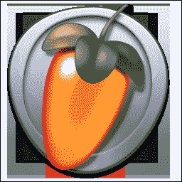
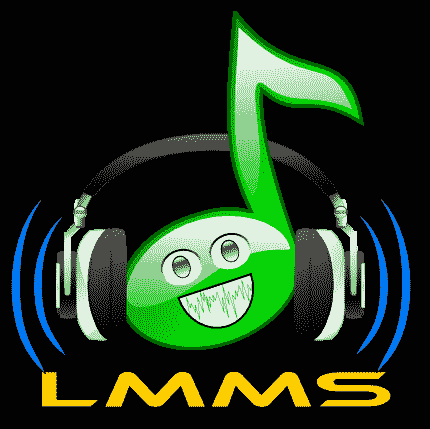
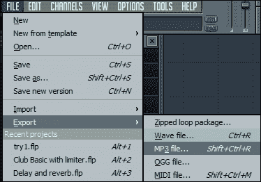

# 六、音乐和音效

音乐和音效就像蛋糕上的樱桃:正确实现可以大大提升游戏体验，但如果没有，至少你还有蛋糕。如今的大预算游戏总是伴随着原创精致的歌曲和曲调。游戏音乐小众在过去的几十年里不断壮大，有很多作曲家致力于制作游戏音乐。

以下是一些这样伟大的作曲家的名单:

*   近藤浩治(马里奥和塞尔达系列)
*   最终幻想系列
*   中村正人(音速，金属齿轮固体，和 Metroid Prime 系列)
*   迈克·吉亚奇诺(使命召唤，荣誉勋章:盟军突击)
*   比尔·布朗(指挥和征服将军，敌方领土，彩虹六号)
*   杰米·索尔(老年卷轴系列，星球大战旧共和国，横扫千军，无冬之夜，巴尔杜尔之门，激战，英雄军团，轻击轻击)

这些人当然知道如何制作令人震撼的音乐，给游戏体验带来难以置信的附加值。这些游戏中使用的曲调往往会像游戏本身一样具有标志性和纪念意义。如果你看一部非常老的电影，你会注意到他们使用的音乐和音效比现在少得多，这使得他们对我们今天的许多人来说实际上是不值得看的。试着从最近的电影中剥离所有的背景音乐，你可能会发现看起来很无聊，即使故事保持不变。许多游戏也是如此，尤其是冒险游戏，作曲良好的背景音乐非常重要，因为它有助于将你拖入故事情节。

同样，没有音效和威胁性音乐的恐怖游戏几乎是不可想象的。曲调和音效对于设定场景的气氛至关重要。一个很好的例子是著名的游戏**生化危机**。在这个僵尸游戏中，即使 20 分钟内什么都没有发生，你仍然会一直处于边缘。是声音和威胁的音乐让你本能地犹豫要不要打开隔壁的门。所以，在选择音乐和音效之前，想想你希望你的游戏玩家在玩的时候有什么感觉。对于唤起感情来说，没有什么比完美挑选的音乐和声音更有 Impact 了。

在这一章中，我们将会看到一些游戏音乐的来源，除了这些相当昂贵的作曲家。我们将快速了解一下 FL Studio，它可以用来创作您自己的音乐。最后，我们将在 ImpactJS 中整合音乐和音效。

# 制作或购买音乐

如果你决定你想给你的游戏增加一些音乐，这仍然是一个制作还是购买的问题。似乎作为一个 2D 游戏建设者，你需要了解一点点一切:你必须能够理解游戏心理，实际编程你的游戏，为它制作图形，甚至谱写它的音乐。听起来你需要一个人的军队才能完成这样的壮举。然而，在平面设计和音乐领域自学可能是浪费时间。虽然多面手是一个很好的特征，但是考虑一下你为你的游戏创作音乐需要花费多少时间，而不是从别人那里购买。

在本章中，这两个选项都受支持。首先，我们来看看一些可以为你提供音乐和音效的网站。

# 购买曲调和音效

如果你的游戏需要一些 **音乐**，你可以雇佣一个像杰米·索尔这样的私人作曲家。但是，假设您没有数百万美元的预算，以下网站可能会有用:

[www . Craig . se](http://www.craze.se)

在*热潮*中，可以找到各种各样的音乐曲目。歌曲可以提前收听，价格从每首 15 美元到 60 美元不等。它们也可以打包购买，这大大降低了整体成本。

如果你正在寻找一个稍微实惠一点的供应商，你可以通过以下链接查看*幸运狮子工作室*:

[www . luckilationstudios . com](http://www.luckylionstudios.com)

大多数曲目售价为 5 美元。他们接受定制佣金，甚至会在购买定制项目的独家或非独家权利之间做出区别，让您可以削减定制任务的成本。

最后，如果你正在寻找一些免费音乐，有 *Nosoapradio* ，可以在以下链接找到:

[www.nosoapradio.us](http://www.nosoapradio.us)

这个网站什么都有；你可以听和下载超过 300 首歌曲(超过 12 个小时的音乐),你可以随意使用。该网站甚至提供了一个种子文件的追踪器，让你一次下载 1 千兆字节的音乐。这是一个伟大的网站，以防你希望有一些音乐作为占位符，甚至发布一个实际的游戏。

还有一些网站可以购买音效:

*   *Pro sound effects* allows you to buy from a wide array of different sounds for $5 per effect at the following link:

    [www.prosoundeffects.com](http://www.prosoundeffects.com)

    你也可以购买某个主题的整个图书馆，比如动物的声音。这些包裹的价格从 40 美元到 15，000 美元不等。

*   *Radish patch* does custom work for $45 per hour but also sells premade sound effects for $8 or $80, depending on what you plan to do with it. It can be found at the following link:

    [www.radish-patch.com](http://www.radish-patch.com)

    如果你计划出售超过 5000 份你的游戏，他们会对你使用的每个音效收取 80 美元，而不是 8 美元。

*   The list wouldn't be complete without a free site for you to plunder, which can be found at the following link:

    [www.mediacollege.com/downloads/sound-effects/](http://www.mediacollege.com/downloads/sound-effects/)

    *媒体学院*在广泛的主题上提供合理数量的免费音效。他们唯一要求的回报就是捐赠，以防你喜欢他们提供的东西。

与好音乐不同，音效并不难制作。你只需要一份你需要的声音清单，一台像样的录音机，和一点点空闲时间(也许还有几个疯狂的朋友帮你制作它们)。所以在决定要不要制作或者购买音效的时候，建议自己动手制作，除非你需要一些真正的高品质效果。

现在让我们来看看 FL Studio 为我们的音乐提供的基础知识。

# 使用 FL Studio 制作基本曲调

**FL 演播室** 是一个数字音频工作站，原名为水果机器人。以下是 FL 工作室的标志:



FL Studio 不是免费软件，而是可以在他们的网站上下载的演示:

[www.fl-studio.en.softonic.com](http://www.fl-studio.en.softonic.com)

FL 工作室被认为是目前最完整的虚拟工作室。但是，FL Studio 还不能用于 Linux。

对于 Linux 用户来说，**可能是一个不错的(也是免费的)选择，尽管功能没有那么强大。以下是 LMMS 的标志:**

 **

您可以从以下链接下载 LMMS:

[http://lmms . SourceForge . net/download . PHP](http://lmms.sourceforge.net/download.php)

由于本书的目的不是为了深入了解音乐发展，这里只介绍 FL Studio 的基础知识。

打开 FL Studio 时，首先注意到的元素是顶部菜单栏，如下图截图所示:


我们可以大致区分三个主要部分。左手边是这些天你可以期待任何程序拥有的所有菜单:**文件**、**工具**、**视图**、**选项**等等。条的中间可以快速访问播放、停止和其他与您正在创作的歌曲直接相关的按钮。在右侧，我们找到了一些快速访问按钮，用于 FL Studio 的重要元素。

创建新文件时，FL Studio 允许您从模板开始，这对初学者来说非常棒。


例如，带限制器的**Basic**将立即为用户提供鼓线的不同元素。这样你就不需要自己找出基本的组件。FL Studio 五个最重要元素的快速访问按钮从左到右依次为:播放列表、步骤序列器、钢琴卷帘窗、文件浏览器和调音台，如下图截图所示:


如果你打开步序器，你会注意到你的第一个序列，叫做**模式 1** ，有四个元素预定义:**踢****拍****帽子**和**圈套**。这四个构成了您的鼓线的基础，如下表所述:

*   **踢**可以比作你的大鼓。
*   **拍手**是拍手棒的近似。Clap(也叫 tala)本身是印度古典音乐中的一个术语，用来表示任何作品的节奏模式。
*   **小军鼓**代表较小的鼓。
*   **帽子**是你鼓线的钹。

以下截图显示了**模式 1** 序列:


图案中的每种乐器都有一系列矩形。通过点击一个矩形，你告诉 FL Studio 在那个特定的点激活这个仪器。右键单击高亮显示的矩形将再次关闭它。几乎 FruityLoop studio 中的所有东西都是通过左键打开或添加的，而右键用于关闭或删除。试着通过在特定的时间间隔激活一些乐器来发出好听的鼓声。

一旦创建了模式，就可以将其添加到播放列表中。**播放列表**控制台将保存您项目的所有音乐片段，如下图所示:


您的所有模式都可以同时或依次提示或播放，这取决于您如何使用它提供的不同轨道。当左键点击**播放列表**中的某个点时，控制台基本上是*在那个点上绘制*图案。右键单击一个模式将删除它。要更改模式，您当前正在**播放列表**控制台的右上角放置一个下拉框。

FL Studio 为用户提供了多种乐器、音效，甚至预制音乐和一些语音效果，如下图截图所示:


所有这些资源都可以通过**文件浏览器**进行访问。从这里你可以添加一个乐器到你的序列生成器，例如，合成器或吉他。每种声音类型都有不同的符号，如下图所示，甚至可以在浏览器本身预览(或提前听到)预制的音乐:


添加预先组合的旋律可以让你快速做出一首相当不错的歌曲，进而可以融入到你的游戏中。

如果您在音序器中添加了乐器，例如合成器，请尝试打开**钢琴卷帘窗**控制台，如下图所示:


**钢琴卷帘窗**控制台允许您定义乐器需要演奏的每个音符。对于一些乐器，例如鼓，这并不总是必要的，但是对于其他乐器，绝对建议您在**钢琴卷帘窗**控制台中制作自己的小曲子。您可以使用与鼓线相同的模式来完成这项工作，也可以启动不同的模式来释放您的创造力，如下图所示:


最终，你创作的每一首音乐都应该在播放列表中结束。用不同的轨道工作是对同时发生的所有事情保持良好看法的关键。如果您忘记了将您不同的乐器类别分配到不同的轨道，请不要担心，在**播放列表**窗口中有一个选项可以拆分它们。

在某个时候，你会想要听到不同的曲目一起播放时的声音。为此，您需要从模式切换到**歌曲**模式，如下图所示:


如果您觉得需要对不同的乐器进行一些额外的调整，这就是**混音器**控制台发挥作用的地方。**混音器**控制台允许您更改音量、平衡和特效等内容，如下图所示:


为音乐添加特殊效果或滤镜可以快速为您带来您想要的额外感受。有很多预设滤镜可供选择，可以单独调整。如果你正在寻找一个快速的解决方案，你当然可以让它们保持默认设置并使用它。

在音序器、播放列表、钢琴卷帘窗和调音台这四个元素中的每一个中，都有一些模板和/或默认值可用。总是寻找这些，以防你不想花太多精力去创作自己的音乐。你可以用已经有的东西，稍微调整一下，很快就有了自己的配乐！

当你完成你的第一首歌时，你可能不仅想保存它，还想将其导出为`.mp3`和`.ogg`文件。



同样，不要忘记将项目置于歌曲模式而不是模式模式，否则您将只导出您当前选择的模式。

导出歌曲后，您可以使用刚刚在 ImpactJS 中创建的内容。

# 为游戏添加背景音乐

背景音乐是你会希望一直播放的东西。当情况变得艰难时，很多游戏会把音乐从平静的轨道变成更乐观的轨道。所有这些事情都可以使用`if`条件在您的主代码或专门管理您的播放列表的单独文件中完成。

ImpactJS 有两个重要的类，它们负责您想要使用的所有声音:`ig.music`和`ig.sound`。`ig.music`是我们背景音乐所需要的。假设你想把你的音乐加入到[第三章](03.html "Chapter 3. Let's Build a Role Playing Game")、*的项目中，让我们建立一个角色扮演游戏*或[第四章](04.html "Chapter 4. Let's Build a Side Scroller Game")、*让我们建立一个侧滚游戏*。将以下代码添加到`MyGame`定义的`init()`功能中的`main.js`中:

```html
init: function() {
  this.loadLevel(LevelLevel1);
  ig.input.bind(ig.KEY.UP_ARROW, 'up');
  ig.input.bind(ig.KEY.DOWN_ARROW,'down');
  ig.input.bind(ig.KEY.LEFT_ARROW,'left');
  ig.input.bind(ig.KEY.RIGHT_ARROW,'right');
  ig.input.bind(ig.KEY.MOUSE1,'attack');
  var music = ig.music;
  music.add("media/music/background.*");
  music.volume = 1.0;
  music.play();
},
```

请注意，我们将我们的歌曲添加为`background.*`，而不是`background.ogg`或`background.mp3`。这样游戏就知道它需要寻找所有名为`background`的文件，不管它们的扩展名是什么。由于我们在`media`文件夹中创建了一个单独的`music`文件夹，因此在这里不应该有命名冲突。使用`background.*`不仅方便快捷(一行代码而不是两行)，而且有助于系统使用它能够播放的`music`文件。有时候会是`.mp3`，有时候会是`.ogg`；至少现在可以自动确定要使用的`music`文件。Chrome 现在似乎更喜欢 WebM 而不是`.mp3`或`.ogg`，但仍将与`.mp3`和`.ogg`配合使用。另一方面，火狐更喜欢用`.ogg`，而不喜欢用`.mp3`。

`ig.music`本身就是一种具有多种功能的播放列表。使用`add()`方法将在播放列表的末尾添加另一首歌曲。你可以用无限数量的歌曲填充这个列表。`music.volume`方法设置您的歌曲音量，范围从`0`到`1`。`music.play()`方法 将激活播放列表中的第一首歌曲。前一段代码不仅会激活你的歌曲，还会无限循环播放，因为默认情况下它会这样做。除了用于简单启动循环的功能之外，还有许多其他功能。

`fadeout(time)` 会让你的宋法德在你指定的时间内出来作为输入参数。当歌曲音量达到`0`时，会调用`stop()`方法，停止歌曲播放。无论你在常规电台上期待什么，都会在 ImpactJS 中出现。你有`pause()`和`next()`方法，还有`loop`和`random`属性让歌曲循环播放。另一个有趣的属性是`currentIndex`，因为这将返回播放列表中当前播放歌曲的位置。这对于管理歌曲的顺序以及在必要时在它们之间切换非常有用。

# 动作发生时发出声音

`ig.music`对于音乐使用来说很方便，因为它与基本的媒体播放器有许多共同的功能。而对于播放音乐来说`ig.music`是最好的选择，对于播放音效来说，你应该使用`ig.sound`来获得最好的效果。

声音效果不是持续活跃的，而是只有在执行某些动作时才会出现。假设我们想在玩家发射炮弹时听到一声枪响。我们需要在玩家的`init()`方法中添加声音，这样它就可以作为资源使用了。

在`player.js`中，使用以下代码添加`this.gunshotsound`:

```html
init: function( x, y, settings ) {
  this.parent( x, y, settings );
  // Add the animations
  this.addAnim( 'idle', 1, [0] );
  this.addAnim('down',0.1,[0,1,2,3,2,1,0]);
  this.addAnim('left',0.1,[4,5,6,7,6,5,4]);
  this.addAnim('right',0.1,[8,9,10,11,10,9,8]);
  this.addAnim('up',0.1,[12,13,14,15,14,13,12]);
  //set up the sound
  this.gunshotsound = new ig.Sound('media/sounds/gunshot.*');
  this.gunshotsound.volume = 1;
},
```

然后，我们通过在`player.js`中添加以下代码来实际播放射弹发射时的声音:

```html
if(ig.input.pressed('attack')) {
  if (GameInfo.projectiles> 0){
    ig.game.spawnEntity('EntityProjectile',this.pos.x,this.pos.y,{direction:this.lastpressed});
    ig.game.substractProjectile();
    this.gunshotsound.play();
  }
}
```

在`ig.music`歌曲被添加到播放列表时，通过调用`ig.sound`的新实例来启动声音。当音乐播放列表中只添加了一首歌曲时，默认情况下会永远循环播放。用`ig.sound`启动的声音效果不是这样，没有`loop`属性，因此调用`.play()`方法时声音只播放一次。`ig.sound`有属性`.enabled`，默认设置为`true`。将其设置为`false`将停用游戏的所有声音和音乐。这很有用，因为当一些移动设备需要同时播放两种不同的声音时，它们仍然有问题。同时播放两种不同的声音是非常常见的，尤其是如果你已经一直在播放背景音乐的话。通过使用 ImpactJS 直接画布解决方案，可以解决这个问题。代码保持不变，但弹出目前只支持 iPhone 和 iPad，不支持安卓或 Windows 设备。

# 在游戏中使用声音文件的提示

优化声音文件就是要保持简短。大多数游戏都有不太打扰人的短歌，所以不会总是被注意到。一首没有被注意到的歌曲仍然可以影响一种情绪，同时它不会变得太重复。出于优化目的，您当然应该注意以下几件事:

*   保持歌曲简短，只有在需要的时候才载入内存。
*   在`.ogg`和`.mp3`中准备同一首歌，这样需要播放的系统就可以选择哪个分机效率最高。
*   使用以下代码再次检查您的声音在您打算发布游戏的移动设备上是否正常工作。如果没有，请确保关闭这些设备上的所有声音，直到声音可以在这些设备上工作。

    ```html
    if(ig.ua.mobile){
      ig.music.add("media/music/backgroundMusic.ogg");
      ig.music.play();
    }
    ```

*   与其说这是的优化，不如说是一种用户友好的措施，但请确保您允许播放器关闭音乐和音效。最好是两者分开:有些玩家喜欢听到他们的枪开火，但就是不喜欢你的音乐。如果您使用游戏分析，请确保跟踪这些变化，以便您可以了解哪些类型的歌曲是可接受的，哪些是不可接受的。

# 总结

在这一章中，我们讨论了音乐和音效作为一个重要的元素，有助于在你的游戏中创造一个氛围。我们讨论了你是否应该购买或创作音乐，以及在哪里可以找到音乐:免费还是收费。我们使用 FL Studio 创建了自己的基本背景音乐，并将其添加到我们的游戏中。最后，我们复习了一些在 ImpactJS 中使用音乐的技巧。

在下一章中，我们将看一下图形。我们将检查是购买还是制作它们更好，以及如何使用 Inkscape 或 Photoshop 创建图形。**