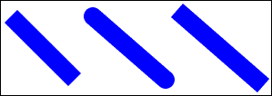
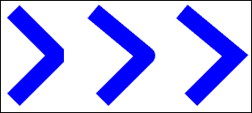
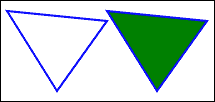
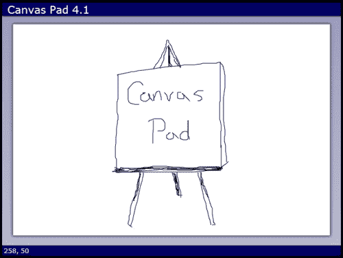
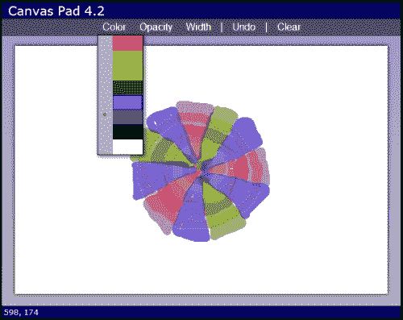
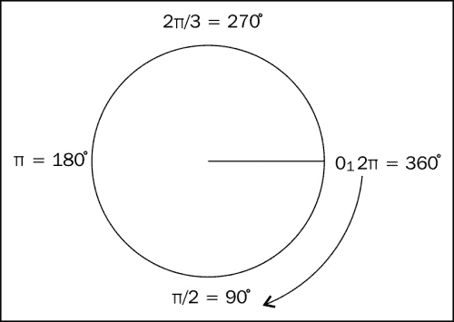
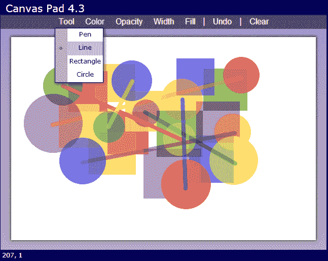

# 四、空白画布

> “站在空白的画布前是如此美好，却又如此可怕。”

*——保罗塞尚*

在这一章中，我们正朝着一个全新的方向前进。我们将通过创建一个简单的绘图应用来学习如何使用新的 HTML5 画布元素和 API。我们的应用将使用画布基础，如笔画、路径、线条和形状。我们将使用自定义数据属性创建一个工具栏，这是我们在上一章中学习的，用于将菜单项绑定到代码中的操作。

我们将在本章中学习以下内容:

*   画布元素及其绘图应用编程接口
*   如何获取画布上下文及其全局属性
*   如何绘制线条、矩形和其他形状
*   如何获取鼠标在画布元素中的位置
*   如何创建包含下拉菜单的工具栏
*   如何使用自定义数据属性将工具栏动作绑定到 JavaScript 代码

# HTML5 画布

HTML5 最令人兴奋的新特性之一可能是画布。您可以使用它在网页的任何地方创建绘图。以前做到这一点的唯一方法是使用其他技术，如闪存、SVG 或其他浏览器插件。

HTML5 画布既是一个元素，也是一个应用编程接口。`<canvas>`元素定义了网页中可以绘制图形的矩形区域。画布应用编程接口与`<canvas>`元素一起工作，提供在画布上绘制的 JavaScript 界面。它是一组低级功能，用于绘制线条、矩形、圆形和其他图元。

`<canvas>`元素本身就很简单。您必须设置`width`和`height`属性来指定其大小。您可以选择将内容放在`<canvas>`元素中，为不支持它的浏览器显示。好消息是 HTML5 `<canvas>`元素得到了几乎所有现代浏览器的广泛支持。下面的代码创建一个 600 像素宽、400 像素高的画布元素:

```html
<canvas width="600" height="400">
  Sorry, your browser doesn't support canvas.
</canvas>
```

### 注

如果您在 CSS 中将`<canvas>`元素的宽度和高度设置为元素上指定的大小之外的值，它将拉伸或收缩画布中的绘图以适应，这可能会影响图像质量。

# 获取上下文

画布应用编程接口通过画布上下文对象访问。通过调用`<canvas>`元素的`getContext()`方法，传入一个定义所需上下文类型的字符串参数，可以获得上下文:

```html
var context = $("canvas")[0].getContext("2d");
```

此时唯一可以传入`getContext()`的有效上下文类型参数是`"2d"`。这就引出了一个问题，“有 3D 环境吗？”答案是*没有*，没有。但是我们可以一直希望将来有一个。

# 画布基础

在本节中，我们将学习一些使用画布应用编程接口的基础知识。现在我们有了上下文，我们可以调用它的方法来绘制线条和形状。这个应用编程接口有一大堆方法，可以让你画出从最基本的线条到形状，甚至位图图像的所有东西。

你可以在`chapter4/canvas-examples/canvas-examples.html`找到这部分的源代码。

## 清理画布

画布的背景是透明的。无论您在 CSS 中为画布元素指定什么背景颜色，它都会显示出来。您可以使用上下文的`clearRect()`方法清除画布或其一部分。它采用 *x* 、 *y* 、宽度和高度参数，并清除画布的该部分。

```html
context.clearRect(0, 0, canvas.width, canvas.height);
```

## 上下文属性

默认情况下，在画布上绘制时，线条宽度为一个像素，颜色为黑色。您可以通过在`context`对象上设置全局属性来更改这些属性。

*   `penWidth`:该属性设置线条的宽度。它可以是任何十进制数。例如，可以有一条 1.5 像素宽的线。
*   `strokeStyle`:该属性设置将用于画线的颜色。它可以是任何一个 CSS 颜色说明符。例如，要画红色，你可以使用`red`或`#FF0000`、`rgb(255, 0, 0)`或`rgba(255, 0, 0, 1)`。
*   `fillStyle`:该属性设置用于填充形状的颜色。像`strokeStyle`一样，可以是任何 CSS 颜色说明符。
*   `globalAlpha`:该属性设置要绘制的 alpha 或透明度。它可以是 0 到 1 之间的任何数字，其中 0 是完全透明的，1 是完全不透明的。
*   `lineCap`: This property determines how the ends of lines are drawn. It can be one of the following:
    *   `butt`画一个平端
    *   `round`画一个圆形的端点
    *   `square`画一个正方形的端点

    `square`看起来与`butt`相似，只是在末端多画了一个矩形，使其更长。

    

*   `lineJoin`: This property determines how corners are drawn where two lines meet. It can be one of the following:
    *   `bevel`绘制一个斜角或平角
    *   `round`画一个圆角
    *   `miter`画一个尖角

    

# 帆布垫

现在我们已经知道了画布应用编程接口的基础知识，让我们用我们新获得的知识来创建一个名为**画布垫**的绘图应用。我们将从一个绘制黑线的应用开始，就像用笔在纸上绘图一样。然后我们将添加一个工具栏和菜单，以便用户可以更改选项，如宽度，不透明度，颜色，并选择不同的绘图工具。

# 行动时间-创建画布垫

你可以在`chapter4/example4.1`找到这个部分的源代码。让我们从复制我们在第一章中创建的应用模板开始，并将文件名重命名为`canvasPad.html`、`canvasPad.css`和`canvasPad.js`。然后我们将进入并更改这些文件的 HTML 中的链接。最后我们将 JavaScript 中的主要应用对象更改为`CanvasPadApp`。

现在，让我们在`<div id="main">`元素内的 HTML 中添加一个`<canvas>`元素，并将其大小调整为 600 乘 400:

```html
<div id="main">
  <canvas width="600" height="400">
    Sorry, your browser doesn't support canvas.
  </canvas>
</div>
```

接下来，我们将向 CSS 添加一些样式，使画布在页面上居中，并给它一个白色背景。我们还将使用一个`box-shadow`元素来使其突出:

```html
#main
{
    text-align: center;
}
#main>canvas
{
    cursor: crosshair;
    margin: 1em auto;
    background-color: white;
    box-shadow: 0 0 8px 2px #555;
}
```

为了封装我们与画布的交互，我们将创建一个名为`Canvas2D` 的新对象，并将其放入名为`canvas2d.js`的文件中。在这个对象中，我们将创建一些更高级别的绘图功能。该对象的构造函数将一个包装在 jQuery 对象中的`<canvas>`元素作为参数:

```html
function Canvas2D($canvas)
{
    var context = $canvas[0].getContext("2d"),
        width = $canvas[0].width,
        height = $canvas[0].height;
}
```

构造函数做的第一件事是设置一些私有变量。我们从`$canvas` jQuery 对象获得上下文、宽度和高度。

### 注

您可以通过使用方括号(如数组)来访问 jQuery 对象包装的基础元素。所以在这种情况下`$canvas[0]`给了我们第一个(也是唯一的)`<canvas>`元素。

## *刚刚发生了什么？*

我们从模板中创建了一个新的画布垫应用，并在其中添加了一个画布。我们将画布放在页面的中央，并给它一个全面的阴影来框住它，使它看起来漂浮在页面的顶部。最后，我们创建了一个`Canvas2D`对象来封装与画布的交互。

# 行动时间-显示坐标

我们将在`Canvas2D`对象中实现的第一件事是一种将页面坐标转换为画布坐标的方法。然后，当用户在画布上移动鼠标时，我们将使用它来显示页面上的鼠标坐标。

鼠标坐标的问题是它们总是偏离网页的左上角。为了得到画布坐标，我们需要找到页面上`<canvas>`元素的偏移量，并从页面坐标中减去它。

首先我们需要一个名为`pageOffset`的变量来保存画布元素的偏移量。我们将使用 jQuery 的`offset()`方法设置它的值，该方法获取元素的页面偏移量。它返回一个带有`left`和`top`字段的对象:

```html
var pageOffset = $canvas.offset();
```

现在我们增加一个`getCanvasPoint()`方法。它采用`pageX`和`pageY`参数，减去画布元素偏移，并返回一个带有`x`和`y`字段的新对象来保存调整后的坐标:

```html
this.getCanvasPoint = function(pageX, pageY)
{
    return {
        x: pageX - pageOffset.left,
        y: pageY - pageOffset.top
    }
};
```

因为我们的画布位于页面的中心，所以每当窗口的大小改变时，画布的偏移量也会改变。所以我们需要在窗口中添加一个`resize`事件处理程序，这样每当它改变时`pageOffset`变量就会更新:

```html
$(window).resize(function() { pageOffset = $canvas.offset(); });
```

现在让我们添加代码，当用户在画布上移动鼠标时，在状态栏中显示鼠标坐标。首先，我们需要应用主类`CanvasPadApp`中`Canvas2D`对象的一个实例。我们将把它分配给一个名为`canvas2d`的私有变量:

```html
function CanvasPadApp()
{
    var version = "4.1",
 canvas2d = new Canvas2D($("#main>canvas"));
    // ...
```

我们将在画布下方的`<footer>`元素中显示坐标。让我们在页脚添加一个`<span>`来保存坐标:

```html
<footer>
 <span id="coords">0, 0</span>
</footer>
```

接下来，我们在`start()`方法的`<canvas>`元素中添加一个`mousemove`事件处理程序。鼠标移动时会调用`onMouseMove`:

```html
this.start = function()
{
    $("#app header").append(version);
    $("#main>canvas").mousemove(onMouseMove);
}
```

`onMouseMove`事件处理程序调用`canvas2d.getCanvasPoint()`方法从鼠标事件传入页面坐标。它返回鼠标在画布上的位置，并将其传递到`showCoordinates()`方法中，以在页脚中显示它们:

```html
function onMouseMove(e)
{
    var canvasPoint = canvas2d.getCanvasPoint(e.pageX, e.pageY);
    showCoordinates(canvasPoint);
}
function showCoordinates(point)
{
    $("#coords").text(point.x + ", " + point.y);
}
```

`showCoordinates()`方法使用 jQuery 的`text()`方法将坐标放入页脚。现在，如果你在页面的画布上移动鼠标，你会看到坐标改变。当你将鼠标移动到左上角时，它会显示 **(0，0)** 。

## *刚刚发生了什么？*

我们通过从鼠标坐标中减去画布的位置来计算鼠标在画布上的页面偏移。然后我们添加了一个`mousemove`事件处理程序，当用户在画布上移动鼠标时，在页脚显示坐标。

# 画线

我们要实现的第一件事就是用户画简单线条的方式，或者在画布上乱涂乱画。要做到这一点，我们需要得到当用户移动鼠标时，鼠标按钮被按下的点，并在它们之间画线。所以让我们学习如何在画布上画画。

## 路径和笔画

在画布上绘制的最原始的方法是定义路径，然后轻抚，或者绘制它们。把它想象成在你的脑海中计划你要画的东西，然后把你的笔放到纸上，实际上把它画出来。

要创建路径，可以通过使用`moveTo()` 和 `lineTo()`方法指定两个或更多点来定义路径。然后通过调用`stroke()`方法将其绘制到画布上。您可以使用四种基本方法来定义和绘制路径。

*   `beginPath()`:这个方法开启了一个新的路径。
*   `moveTo(x, y)`:此方法将笔移动到一个新的位置，无需绘图。
*   `lineTo(x, y)`:这个方法从上一个位置画一条线到新的位置。
*   `stroke()`:这个方法在画布上绘制路径。重要的是要注意，在你调用`stroke().`之前，没有任何东西会真正被吸引到画布上

下面的代码从点(10，10)到(80，100)画一条线:

```html
context.beginPath();
context.moveTo(10, 10);
context.lineTo(80, 100);
context.stroke();
```

您可以通过`beginPath()`和`stroke()`之间的`moveTo()`和`lineTo()`方法拨打任意数量的电话。这允许您将多个绘图命令排队，然后一次性将它们提交到画布上。如果你想让你的路径形成一个封闭的形状，你可以调用`closePath()`方法从最后一点到第一点画一条线。例如，下面的代码绘制了一个三角形:

```html
context.beginPath();
context.moveTo(100, 10);
context.lineTo(150, 90);
context.lineTo(200, 20);
context.closePath();
context.stroke();
```

也可以通过调用上下文的`fill()`方法而不是`stroke()` 来填充形状。实际上，如果你想用一种颜色勾勒出一个形状，并用另一种颜色填充，你可以同时调用`fill()`和`stroke()`:

```html
context.beginPath();
context.moveTo(100, 10);
context.lineTo(150, 90);
context.lineTo(200, 20);
context.closePath();
context.fill();
context.stroke();

```



# 行动时间——用鼠标画画

第一件事我们需要做的是捕捉鼠标事件。让我们进入我们的`CanvasPadApp`对象，并在`start()`方法中添加代码来检查它们。大家可能还记得，我们已经在上面添加了一个`mousemove`事件处理程序。现在我们将为`mousedown`、`mouseup`和`mouseout`事件添加处理程序:

```html
$("#main>canvas").mousemove(onMouseMove)
    .mousedown(onMouseDown)
    .mouseup(onMouseUp)
    .mouseout(onMouseUp);
```

不，`mouseout`没有错。我们希望`mouseout`事件的处理方式与`mouseup`相同，所以他们都停止了绘图过程。当鼠标离开`<canvas>`元素时，触发`mouseout`事件。当这种情况发生时，我们不能再得到`mousemove`事件，因此失去了笔的位置。

在我们实现事件处理程序之前，我们需要一些新的变量来跟踪事情。我们需要一个布尔值来跟踪绘制时间，一个数组来跟踪当前的点集，一个数组来跟踪所有的点集(我们称之为动作):

```html
var version = "4.1",
canvas2d = new Canvas2D($("#main>canvas")),
drawing = false,
 points = [],
 actions = [];
```

### 注

请注意，如果您为全局对象变量提供默认值，那么具有自动完成功能的代码编辑器将更容易找出变量的类型，并为您提供适当的建议。

首先让我们实现`onMouseDown()` ，因为这开始了绘图过程。它接受一个参数，即鼠标事件对象:

```html
function onMouseDown(e)
{
 e.preventDefault();
    penDown(e.pageX, e.pageY);
}
function penDown(pageX, pageY)
{
    drawing = true;
    points = [];
    points.push(canvas2d.getCanvasPoint(pageX, pageY));
    actions.push(points);
}
```

我们在`onMouseDown()`方法中做的第一件事就是在鼠标事件对象上调用`preventDefault()`。这将阻止系统执行默认的鼠标按下行为，其中一部分是更改鼠标光标图标。我们希望它保持十字图标，这是我们之前在 CSS 中设置的。然后我们调用`penDown()`传入鼠标事件得到的鼠标页面坐标。

在`penDown()`方法中，我们初始化绘图过程。首先，我们将`drawing`标志设置为`true`。然后我们创建一个新的数组，将当前的绘图点放入其中。然后我们通过调用`getCanvasPoint()` 将第一个点从页面坐标转换为画布坐标后添加到数组中。我们要做的最后一件事是将当前的`points`阵添加到`actions`阵中。

绘图过程的下一步是处理`mousemove`事件，所以让我们重写 `onMouseMove()`方法:

```html
function onMouseMove(e)
{
    penMoved(e.pageX, e.pageY);
}
function penMoved(pageX, pageY)
{
    var canvasPoint = canvas2d.getCanvasPoint(pageX, pageY);
    showCoordinates(canvasPoint);

    if (drawing)
    {
        points.push(canvasPoint);
        redraw();
    }
}
```

现在`onMouseMove()`调用`penMoved()`传递鼠标坐标给它。`penMoved()`方法首先转换坐标，然后像以前一样调用`showCoordinates()`。然后我们检查是否设置了`drawing`标志。这是在`penDown()`方法中设置的，所以我们知道鼠标按钮是按下的。如果用户正在绘图，那么我们将当前点添加到点数组中并调用`redraw()`，接下来我们将实现它:

```html
function redraw()
{
    canvas2d.clear();
    for (var i in actions)
    {
        canvas2d.drawPoints(actions[i]);
    }
}
```

`redraw()`方法首先通过调用`canvas2d.clear()`来清除画布，我们接下来将写`canvas2d.clear()`，然后它迭代所有的动作并调用`drawPoints()`为每个动作传入一组点。

现在我们进入`Canvas2D`对象，添加`clear()`和`drawPoints()`方法。首先，我们的`clear()`方法调用画布中传递的`context.clearRect()`方法`width`和`height`变量，我们在`Canvas2D`构造函数中定义:

```html
this.clear = function()
{
    context.clearRect(0, 0, width, height);
    return this;
};
```

接下来，`drawPoints()`方法取一组点并在它们之间画线:

```html
this.drawPoints = function(points)
{
    context.beginPath();
    context.moveTo(points[0].x, points[0].y);
    for (var i = 1; i < points.length; i++)
    {
        context.lineTo(points[i].x, points[i].y);
    }
    context.stroke();
    return this;
};
```

开始新路径后，它调用`moveTo()`将笔移动到数组中的第一个点。然后迭代数组中剩余的点，为每个点调用`lineTo()`。完成后，它会调用`stroke()`将其绘制到画布上。

### 注

对于 Canvas2D 中所有通常不返回值的方法，我们将返回`this`，这样我们就可以进行函数链接。

我们最不需要实现的就是`onMouseUp()`事件处理程序。我们在这里所需要做的就是将`drawing`旗重新设置回`false`:

```html
function onMouseUp(e)
{
    penUp();
}
function penUp()
{
    drawing = false;
}
```

## *刚刚发生了什么？*

我们使用鼠标事件来捕获和存储缓冲区中的绘图动作。然后，我们使用画布应用编程接口从这些点向画布绘制线条。现在让我们在浏览器中打开我们的应用并检查它。我们可以用鼠标在画布上乱涂乱画，创建简单的线条画。



# 更改上下文属性

让我们让我们的应用更上一层楼，允许用户更改笔的属性，如颜色、不透明度和宽度。

# 行动时间–添加上下文属性

首先让我们添加一些代码到我们的`Canvas2D`对象，以允许我们改变全局上下文绘图属性。让我们在构造函数中设置一些默认值。我们将笔设置为黑色，宽度为`4`，通过将`globalAlpha`设置为`1`使其完全不透明。我们会将线条连接和大写设置为圆形，以使线条看起来更平滑:

```html
context.lineWidth = 4;
context.strokeStyle = "black";
context.fillStyle = "black";
context.globalAlpha = 1.0;
context.lineJoin = "round";
context.lineCap = "round";
```

接下来，我们将添加公共属性访问器方法，以允许我们设置和获取颜色、不透明度和宽度属性的值。如果一个参数被传递到一个属性方法中(即`arguments.length`不是`0`，它将设置属性的值，然后返回`this`，这样我们就可以进行函数链接了。否则，它将返回属性值:

```html
this.penWidth = function(newWidth)
{
    if (arguments.length)
    {
        context.lineWidth = newWidth;
        return this;
    }
    return context.lineWidth;
};
this.penColor = function(newColor)
{
    if (arguments.length)
    {
        context.strokeStyle = newColor;
        context.fillStyle = newColor;
        return this;
    }
    return context.strokeStyle;
};
this.penOpacity = function(newOpacity)
{
    if (arguments.length)
    {
        context.globalAlpha = newOpacity;
        return this;
    }
    return context
};
```

现在我们只需要一个的方式让用户从应用中更改这些设置，所以接下来我们要实现的是一个工具栏。

# 创建工具栏

我们的工具栏将需要以下按钮。前三个将是用于改变上下文的属性。最后两个将允许我们撤销和清除画布。

*   **颜色**:该按钮显示下拉菜单，用户可以选择笔的颜色
*   **不透明度**:该按钮显示一个下拉菜单，用户可以选择笔的不透明度
*   **宽度**:该按钮显示下拉菜单，用户可以选择笔宽
*   **撤销**:此按钮删除最后一个绘图动作
*   **清除**:此按钮清除画布和所有绘图动作重新开始

我们在上一章中介绍的自定义数据属性将在整个工具栏中用于定义工具栏按钮的操作和菜单选项。我们将在稍后的 JavaScript 中使用这些来确定所选择的动作或选项。现在添加一点额外的标记将使我们以后不再编写大量重复的代码。

# 行动时间-创建工具栏

您可以在`chapter4/example4.2`中找到该部分的代码。

我们将在 HTML 文件中的主元素内部和画布上方定义工具栏:

```html
<div id="toolbar">
  <div class="dropdown-menu">
    <button data-action="menu">Color</button>
    <ul id="color-menu"data-option="penColor" class="menu">
      <li data-value="red"></li>
      <li data-value="orange"></li>
      <li data-value="yellow"></li>
      <li data-value="green"></li>
      <li data-value="blue"></li>
      <li data-value="purple"></li>
      <li data-value="black" class="selected"></li>
      <li data-value="white"></li>
    </ul>
  </div>
<div class="dropdown-menu">
    <button data-action="menu">Opacity</button>
      <ul data-option="penOpacity" class="menu">
        <li data-value=".1">10%</li>
        <li data-value=".2">20%</li>
        <li data-value=".3">30%</li>
        <li data-value=".4">40%</li>
        <li data-value=".5">50%</li>
        <li data-value=".6">60%</li>
        <li data-value=".7">70%</li>
        <li data-value=".8">80%</li>
        <li data-value=".9">90%</li>
        <li data-value="1" class="selected">100%</li>
      </ul>
  </div>
  <div class="dropdown-menu">
    <button data-action="menu">Width</button>
      <ul id="width-menu" data-option="penWidth" class="menu">
        <li data-value="1">1</li>
        <li data-value="2">2</li>
        <li data-value="4" class="selected">4</li>
        <li data-value="6">6</li>
        <li data-value="8">8</li>
        <li data-value="10">10</li>
        <li data-value="12">12</li>
        <li data-value="14">14</li>
        <li data-value="16">16</li>
      </ul>
  </div> |
  <button data-action="undo">Undo</button> |
  <button data-action="clear">Clear</button>
</div>
```

每个工具栏按钮都有一个`data-action`自定义属性。这将在 JavaScript 中用于确定点击按钮时采取的动作。对于带有下拉菜单的按钮，我们将`data-action`设置为`"menu"`。**撤销**和**清除**按钮各有其独特的动作值。

因为颜色、不透明度和宽度的工具栏项是下拉菜单，所以我们将它们包装在`<div class="dropdown-menu">`元素中。这将工具栏按钮和单击按钮时显示的菜单分组。菜单被定义为无序列表。每个`<ul>`元素被赋予一个`menu`类和一个`data-option`自定义属性。该属性的值与`Canvas2D`对象中的属性方法的名称相匹配，例如`penColor()`。

菜单项由`<li>`元素定义。每一个都有`data-value`自定义属性。这被设置为将被传递到由菜单上的`data-option`属性定义的属性方法中的值。

现在让我们用 CSS 样式化工具栏:

```html
#toolbar
{
    padding: 2px;
    background-color: rgba(0, 0, 0, 0.5);
}
#toolbar button
{
    border: none;
    background-color: transparent;
    color: white;
    font-size: 1em;
}

```

首先，我们将工具栏的颜色设为黑色，不透明度为 50%，这样背景颜色就会渗色。然后我们设置按钮的样式，去掉边框和背景颜色，并将文本颜色设置为白色。现在让我们来设计下拉菜单的样式:

```html
#toolbar .dropdown-menu
{
    display: inline-block;
    position: relative;
}
#toolbar ul.menu
{
    display: none;
    position: absolute;
    top: 100%;
    left: 0;
```

```html
    margin: 0;
    padding-left: 1.5em;
    border: 1px solid black;
    box-shadow: 2px 2px 8px 1px rgba(0, 0, 0, 0.5);
    background-color: silver;
    color: black;
    list-style-type: none;
}
```

我们将`<div class="dropdown-menu">`包装元素设置为显示`inline-block`，将`position`设置为`relative`，这样我们就可以绝对定位它们下面的菜单。

对于`<ul>`菜单元素，我们首先将`display`设置为`none`，因此默认情况下它们是隐藏的。然后我们将`position`设置为`absolute`，这样它们就不会占用页面中的任何空间。为了使它们出现在按钮下方而不是上方，我们将`top`设置为`100%`。然后我们给它一个阴影，给它深度的错觉。最后，我们通过将`list-style-type`设置为`none`来去掉列表要点。

最后，让我们来设计菜单项的样式:

```html
#toolbar ul.menu>li
{
    margin: 0;
    min-width: 4em;
    height: 2em;
    border-width: 0;
    background-color: WhiteSmoke;
    font-size: .75em;
    cursor: pointer;
}
#toolbar ul.menu>li.selected
{
    list-style-type: circle;
    background-color: lightblue;
}
```

我们给菜单项一个最小宽度，这样它们就不会太小。我们还为所选菜单项指定一种样式，使用`list-style-type`在它旁边显示一个圆圈，并将背景涂成淡蓝色。

## *刚刚发生了什么？*

我们在 HTML 文件中创建了一个工具栏，其中包含颜色、宽度和不透明度的菜单项。我们使用自定义数据属性来定义将在我们的 JavaScript 中实现的自定义操作。最后，我们在 CSS 文件中设计了菜单的样式，这样它们就可以排列在工具栏按钮的下方。

# 行动的时间到了——实现一个可重用的工具栏

现在让我们创建一个新的可重用`Toolbar`对象，它封装了工具栏的代码。这样，我们以后还可以在其他应用中使用它。我们将把它放在一个名为`toolbar.js`的新文件中。构造函数将采用包装在 jQuery 对象中的工具栏根元素:

```html
function Toolbar($toolbar)
{
    var _this = this;
```

还记得我在[第 1 章](01.html "Chapter 1. The Task at Hand")*手边的任务*中说过`this`指针在使用带有公共方法的事件处理程序时会导致问题吗？为了解决这个问题，我们将创建一个全局`_this`变量，并将其设置为对象的`this`，这样它总是可用的。

首先，我们将实现公共方法。我们有两种方法用来通知应用工具栏按钮或菜单项被点击。在这个对象中，它们只是占位符。客户端应用将覆盖它们以实现自定义行为:

```html
this.toolbarButtonClicked = function(action)
{
    return false;
};
this.menuItemClicked = function(option, value)
{
    return false;
};
```

`toolbarButtonClicked()`方法以按钮的`data-action`属性为参数。`menuItemClicked()`方法以菜单的`data-option`和菜单项的`data-value`属性为参数。

我们还需要一个名为`hideMenus()` 的公共方法来隐藏工具栏的所有下拉菜单。它只是找到所有的菜单元素并隐藏它们:

```html
this.hideMenus = function()
{
    $(".menu", $toolbar).hide();
}
```

接下来，我们将为所有工具栏按钮添加一个事件处理程序:

```html
$("button", $toolbar).click(function(e) {
  onToolbarButtonClicked($(this));
});
```

当用户单击工具栏中的按钮时，它调用私有的`onToolbarButtonClicked()`方法，将被单击的按钮包装在一个 jQuery 对象中传递给它。现在让我们实现这个处理程序:

```html
function onToolbarButtonClicked($button)
{
    var action = $button.data("action");
    if (!_this.toolbarButtonClicked(action))
    {
        if (action == "menu")
        {
            showMenu($button.siblings("ul.menu"));
        }
        else
        {
            _this.hideMenus();
        }
    }
}
```

该方法从按钮获取`data-action`自定义属性的值。然后传递给公众`toolbarButtonClicked()`方法。请注意，它必须使用`_this`来调用公共方法，因为`this`当前指向的是`window`对象。如果`toolbarButtonClicked()` 返回`true`，则表示客户端处理了动作，没有其他事情可做。否则，它检查动作是否是`"menu"`，如果是，则调用传递到菜单元素的 `showMenu()`，菜单元素是按钮的同级。如果不是，菜单操作会隐藏所有菜单。

现在我们来写私 `showMenu()`法:

```html
function showMenu($menu)
{
    if ($menu.is(":visible"))
    {
        $menu.fadeOut("fast");
    }
    else
    {
        // Hide any open menus
        _this.hideMenus();
        // Show this menu
        $menu.fadeIn("fast");
    }
}
```

我们使用传入`:visible`过滤器的 jQuery `is()`方法来确定菜单是否已经显示。如果是，它会淡出菜单以隐藏它。否则，它会隐藏工具栏中的所有菜单，以防另一个菜单打开，然后淡入菜单以显示它。

接下来，我们为所有菜单项添加 click 事件处理程序:

```html
$(".menu>li", $toolbar).click(function(e) {
  onMenuItemClicked($(this));
});
```

当用户点击工具栏中的一个菜单项时，它调用 `onMenuItemClicked()`，将被点击的菜单项包装在一个 jQuery 对象中传递给它:

```html
function onMenuItemClicked($item)
{
    var $menu = $item.parent();
    var option = $menu.data("option");
    var value = $item.data("value");
    if (!_this.menuItemClicked(option, value))
    {
        $item.addClass("selected")
             .siblings().removeClass("selected");
        $menu.fadeOut("fast");
    }
}
```

首先我们得到父元素，也就是菜单。然后我们从中得到`data-option`属性。接下来我们从菜单项本身获取`data-value`属性。我们将这些值作为参数传递给公众`menuItemClicked()`方法。如果该方法返回`true`，则意味着客户端处理了该操作，没有其他事情可做。否则，我们在菜单项中添加一个`"selected"`类来突出显示它，并从所有其他菜单项中移除该类。然后我们淡出菜单来隐藏它。

## *刚刚发生了什么？*

我们创建了一个可重用的对象，它封装了工具栏行为，包括按钮和下拉菜单。它使用自定义数据属性来定义工具栏按钮和菜单项的操作。只要我们需要工具栏，就可以在应用中使用这个对象。

# 添加工具栏

现在我们有了一个`Toolbar`对象，并且定义了工具栏和菜单的 HTML，我们可以在绘图应用中连接事件来处理用户交互。

# 动作时间–添加工具栏对象

让我们将`Toolbar`对象添加到我们的应用中。首先我们给`CanvasPadApp`添加一个`toolbar`变量，并将其设置为`Toolbar`对象的一个新实例。我们将工具栏的根`<div>`元素作为参数传递给构造函数:

```html
var version = "4.2",
canvas2d = new Canvas2D($("#main>canvas")),
toolbar = new Toolbar($("#toolbar")),
        // code not shown...
```

在`start()`中，我们覆盖`toolbar`对象的`toolbarButtonClicked()` 和`menuItemClicked()`方法，将它们设置为我们自己的实现来处理这些事件:

```html
toolbar.toolbarButtonClicked = toolbarButtonClicked;
toolbar.menuItemClicked = menuItemClicked;
```

首先让我们实现我们的`CanvasPadApp.toolbarButtonClicked()`方法:

```html
function toolbarButtonClicked(action)
{
    switch (action)
    {
        case "clear":
            if (confirm("Clear the canvas?"))
            {
                actions = [];
                redraw();
            }
            break;
        case "undo":
            actions.pop();
            redraw();
            break;
    }
}
```

当用户点击**清除**按钮时，我们确认他们想要清除画布。如果是这样，我们将`actions`数组设置为一个新数组来清除所有内容，然后调用`redraw()`，这将清除画布。

当用户点击**撤销**按钮时，它从`actions`数组中移除最后一个绘制动作，然后调用`redraw()`。

现在我们来实施`menuItemClicked()`法。它需要两个参数；菜单选项名称和所选菜单项的值:

```html
function menuItemClicked(option, value)
{
    canvas2d[option](value);
}
```

如果您还记得以前的实例，`data-option`属性是用于在`Canvas2D`对象中设置属性的方法的名称。我们使用方括号方法访问对象中的该方法，然后通过将菜单项中的`data-value`属性传递到该方法中来执行该方法。

例如，如果用户点击**颜色**菜单中的红色菜单项，`data-option`将是`"penColor"`，`data-value`将是`"red"`。所以在这种情况下，声明`canvas2d[option](value)`相当于呼叫`canvas2d.penColor("red")`。

## *刚刚发生了什么？*

我们将上一节中创建的可重用`Toolbar`对象添加到我们的应用中，并添加了事件处理程序来处理工具栏按钮和菜单事件。然后我们实现了撤销和清除操作。

# 行动时间-初始化菜单项

接下来我们将初始化**颜色**菜单，将每个项目的背景颜色设置为它所代表的颜色。我们可以在 CSS 中这样做，但是会很麻烦。相反，我们将编写一个 JavaScript 方法，用一点点代码来设置它们:

```html
function initColorMenu()
{
    $("#color-menu li").each(function(i, e) {
        $(e).css("background-color", $(e).data("value"));
    });
}
```

这将获得所有的颜色菜单项，并使用 jQuery `each()` 方法对它们进行迭代。对于每个项目，它使用 jQuery `css()`方法将背景颜色设置为`data-value`自定义属性的值，这是一个 CSS 颜色名称。就像我们有一个颜色菜单。

我们想为宽度菜单的项目做一些类似的事情，除了我们将底部边框设置为`data-value`自定义属性中的宽度，以便让用户知道线条有多大:

```html
function initWidthMenu()
{
    $("#width-menu li").each(function(i, e) {
        $(e).css("border-bottom",
                 $(e).data("value") + "px solid black");
    });
}
```

当我们初始化应用时，我们将从`start()`方法调用这两个方法。

## *刚刚发生了什么？*

我们更改了颜色和宽度菜单项的样式，分别赋予它们颜色和宽度，以便用户可以更好地看到他们从菜单中选择的内容。

现在，如果您在浏览器中打开应用，您可以更改笔的属性。继续画几条线。如果点击**撤销，**最后一行被删除。当您点击**清除**时，整个图形被删除。

# 添加绘图动作

您可能已经注意到，当您更改一个选项时，下次您绘制某个东西时，这些选项会应用于之前绘制的所有线条。这不是很好的用户体验。用户期望当他们改变笔选项时，它只会应用到他们画的下一个东西，而不是所有的东西。

为了让它正常工作，我们需要给每个动作添加更多的数据，而不仅仅是一个点的列表。我们还需要知道颜色、宽度和不透明度来绘制点。为此，我们需要一个对象来保存所有这些值。

# 动作时间–创建绘图动作

我们将使用工厂方法来创建这个对象。让我们添加一个`newAction()`方法到`CanvasPadApp`，用当前设置的绘图选项为我们创建动作对象:

```html
function newAction(tool)
{
    return {
        tool: tool,
        color: canvas2d.penColor(),
        width: canvas2d.penWidth(),
        opacity: canvas2d.penOpacity(),
        points: []
    };
}
```

`newAction()`方法采用一个参数，即动作将使用的绘图工具的名称。接下来，它使用花括号来定义一个新的对象文字。该对象将保存该工具、上下文属性值以及该操作的点。它从我们的`Canvas2D`对象获取当前的颜色、宽度和不透明度设置。

接下来我们需要做的是从`CanvasPadApp`对象中移除全局`points`变量，并用`curAction`变量替换，以保存`newAction()`创建的当前动作对象。让我们也添加一个`curTool`变量来保存当前工具，并将其设置为`"pen"`:

```html
varversion = "4.2",
    // code not shown...
  curTool = "pen",
  curAction = newAction(curTool),
    actions = [];
```

现在，无论我们之前在哪里使用`points`变量，我们都需要将其改为使用`curAction.points`。第一个亮点是 `penDown()`法:

```html
function penDown(pageX, pageY)
{
    drawing = true;
 curAction = newAction(curTool);
 curAction.points.push(
 canvas2d.getCanvasPoint(pageX, pageY));
 actions.push(curAction);
}
```

首先我们将`curAction` 设置为一个新的动作对象，然后将第一个点添加到`curAction`对象的`points`数组中。然后我们将`curAction`加入到`actions`阵中。

下一站是`penMoved()`法。在这里，我们将下一个点添加到动作的`points`数组中:

```html
function penMoved(pageX, pageY)
{
    var canvasPoint = canvas2d.getCanvasPoint(pageX, pageY);
    showCoordinates(canvasPoint);
    if (drawing)
    {
        curAction.points.push(canvasPoint);
        redraw();
    }
}
```

我们还需要更新 `penUp()`方法:

```html
function penUp()
{
    if (drawing)
    {
        drawing = false;
        if (curAction.points.length < 2)
        {
            actions.pop();
        }
    }
}
```

首先，我们检查`drawing`变量，以确保我们确实在绘图。如果是这样的话，我们通过设置`false`来关闭`drawing`标志。接下来我们需要确保动作的`points`数组中至少有两点。如果用户按下鼠标按钮，但没有移动它，将只有一个点。没有两点我们不能画任何东西，所以我们将使用`pop()`从`actions`阵列中移除那个动作。

最后，我们将更新`redraw()`方法。这里是我们需要做出一些实质性改变的地方:

```html
function redraw()
{
    canvas2d.clear();
 canvas2d.savePen();

    for (var i in actions)
    {
 var action = actions[i];
 canvas2d.penColor(action.color)
 .penWidth(action.width)
 .penOpacity(action.opacity);

        canvas2d.drawPoints(action.points);
    }

 canvas2d.restorePen();
}
```

首先注意`Canvas2D`对象中对 `savePen()`和`restorePen()` 的调用。在我们开始绘制所有动作之前，它们将保存当前上下文属性，然后在我们完成后恢复它们。我们一会儿就会实现这些。接下来，在绘制点之前，我们迭代所有设置笔的颜色、宽度和不透明度的动作(使用函数链)。

## *刚刚发生了什么？*

我们添加了一个绘图动作对象来跟踪每个绘图动作的工具、笔属性和点。现在，当我们更改绘图属性时，它们不会影响以前的操作。

# 行动时间-保存和恢复

现在，说说那些`savePen()`和`restorePen()`的方法。让我们继续到`canvas2d.js`并将它们添加到`Canvas2D`对象。我们可以自己跟踪当前的属性，但是 canvas API 提供了一种更简单的方法。

画布 API 包含`save()`和`restore()`两种方法。任何时候你需要保存你称之为`save()`的上下文的状态，它会把上下文的状态推到一个堆栈上。当您想要恢复上下文状态时，您调用`restore()`，它将状态从堆栈中弹出回到上下文中。这允许您多次递归地保存和恢复状态。

这对于你可能有一个可以在运行时以任何顺序绘制的绘制函数库的情况非常有用。每个方法都可以在开始改变上下文属性之前调用`save()`，完成后调用`restore()`。这样，当一个方法完成时，上下文处于调用该方法之前的状态:

```html
this.savePen = function()
{
    context.save();
    return this;
};
this.restorePen = function()
{
    context.restore();
    return this;
};
```

## *刚刚发生了什么？*

我们学习了如何保存和恢复上下文，这样我们就不会丢失上下文的当前属性。

让我们在浏览器中打开应用，看一看。现在我们可以画出所有不同的颜色、宽度和不透明度。如果你犯了一个错误，你可以点击**撤销**来删除它。如果你想重新开始，你可以点击**清除**。



# 添加绘图工具

在这一点上我们有一个应用，我们可以画简单的线，比如一支笔，但是如果我们能画一些形状，比如直线，矩形和圆形，那肯定会很好。在这一部分，我们将添加一个**工具**菜单，允许用户选择不同的形状进行绘制。

# 行动时间-添加线条工具

你可以在`chapter4/example4.3`中找到这个部分的代码。

目前我们可以徒手画直线，但是我们没有办法画一条从一点到另一点的直线。所以让我们添加一个画线工具。为了允许用户选择不同的工具，我们需要一个新的下拉菜单工具栏选项。让我们把它添加到我们的 HTML 中:

```html
<div id="toolbar">
  <div class="dropdown-menu">
    <button data-action="menu">Tool</button>
      <uldata-option="drawingTool" class="menu">
        <li data-value="pen" class="selected">Pen</li>
        <li data-value="line">Line</li>
      </ul>
    </div>
```

对于该菜单，我们将`data-option`属性设置为`drawingTool`。我们为**笔**工具、添加了菜单项，这是我们目前拥有的，还有一个**行**工具，我们现在正在实现。由于`drawingTool`不是`Canvas2D`对象的属性，我们需要在`menuItemClicked()`中添加代码来检查它:

```html
function menuItemClicked(option, value)
{
    switch (option)
    {
        case "drawingTool":
            curTool = value;
            break;
        default;
            canvas2d[option](value);
    } 
}
```

首先，我们检查一下选择了哪个选项。如果是`"drawingTool"`，我们只需将当前工具设置为所选菜单项的值。否则，我们将默认使用选定的值设置`Canvas2D`属性。

接下来我们将改变`penMoved()`方法。我们需要检查我们目前使用的工具。如果是笔，我们在`points`数组中添加另一个点。否则我们只想改变`points`数组中的第二个点，因为我们画的是一条直线，而一条直线只有两个点:

```html
function penMoved(pageX, pageY)
{
    var canvasPoint = canvas2d.getCanvasPoint(pageX, pageY);
    showCoordinates(canvasPoint);

    if (drawing)
    {
 if (curTool == "pen")
 {
 // Add another point
 curAction.points.push(canvasPoint);
 }
 else
 {
 // Change the second point
 curAction.points[1] = canvasPoint;
 }
        redraw();
    }
}
```

最后我们需要对`redraw()`方法做一些改变。在循环中，我们将检查动作的工具。如果是笔，我们称之为`canvas2d.drawPoints()`和之前一样。如果是我们称之为`canvas2d.drawLine()`的直线工具，传递两点:

```html
function redraw()
{
    canvas2d.clear();
    canvas2d.savePen();

    for (var i in actions)
    {
        var action = actions[i];
        canvas2d.penColor(action.color)
                .penWidth(action.width)
                .penOpacity(action.opacity);

 switch (action.tool)
        {
 case "pen":
 canvas2d.drawPoints(action.points);
 break;
 case "line":
 canvas2d.drawLine(action.points[0], 
 action.points[1]);
 break;
 }
    }
    canvas2d.restorePen();
}
```

等一下！我们在`Canvas2D`对象中还没有`drawLine()`方法。让我们去添加它:

```html
this.drawLine = function(point1, point2)
{
    context.beginPath();
    context.moveTo(point1.x, point1.y);
 context.lineTo(point2.x, point2.y);
    context.stroke();
    return this;
};
```

`drawLine()`方法以直线起点和终点为参数。开始一条新路径后，它移动到第一个点，画一条线到第二个点，然后画它。就这样。现在我们可以画直线了。

## *刚刚发生了什么？*

我们在工具栏上增加了**工具**菜单，用户可以选择不同的绘图工具。除了我们已经拥有的钢笔工具之外，我们还在应用中添加了一个画线工具来绘制直线。

## 绘制矩形

您可以使用路径绘制一个矩形，但是 canvas API 有几个内置的方法可以做到这一点；`drawRect()`和`fillRect()`。它们都采用相同的参数； *x* 、 *y* 、宽度和高度。`drawRect()` 用`strokeStyle`画线，`fillRect()`用`fillStyle`填充。

下面从点(350，10)开始画一个矩形，宽度为`50`，高度为`90`:

```html
context.strokeRect(350, 10, 50, 90);
```

本示例从点(425，10)开始绘制一个填充矩形，宽度为`50`，高度为`90`:

```html
context.fillRect(425, 10, 50, 90);
```


# 行动时间-添加矩形工具

让我们添加一个工具来绘制矩形。我们首先将菜单项添加到**工具**下拉菜单中，其`data-value`属性设置为`"rect"`:

```html
<li data-value="rect">Rectangle</li>

```

让我们执行`Canvas2D`中的`drawRect()`方法:

```html
this.drawRect = function(point1, point2, fill)
{
    var w = point2.x - point1.x,
        h = point2.y - point1.y;
    if (fill) context.fillRect(point1.x, point1.y, w, h);
    else context.strokeRect(point1.x, point1.y, w, h);
    return this;
};
```

我们的`drawRect()`方法取三个参数；定义左上角和右下角坐标的两个点，以及一个用于确定矩形是否应该填充的布尔值。由于`fillRect()` 和`strokeRect()` 都采用宽度和高度参数，我们需要通过从`point2`变量的坐标中减去`point1`变量的坐标来计算它们。

在我们给`drawRect()`打电话之前，有一件事我们需要处理。我们的`drawRect()`方法既可以画出轮廓矩形，也可以画出填充矩形，所以我们需要一种方法让用户选择他们想要的矩形。让我们在名为**填充**的工具栏上添加另一个下拉菜单，允许用户设置该选项:

```html
<div class="dropdown-menu">
  <button data-action="menu">Fill</button>
    <ul data-option="fillShapes" class="menu">
      <li data-value="true" class="selected">Yes</li>
      <li data-value="false">No</li>
    </ul>
</div>
```

下拉菜单只有两个选项:**是**和**否**。在我们的`CanvasPadApp`对象中，我们需要一个全局`fillShapes`布尔变量来跟踪当前设置。让我们将它和其他变量一起添加到对象的顶部:

```html
var version = "4.3",
    // code not shown...
  fillShapes = true;
```

我们还需要在`newAction()`方法中将其添加到动作对象中。我们将添加一个名为`fill`的字段，并将其设置为`fillShapes`的当前值:

```html
function newAction(tool)
{
    return {
        tool: tool,
        color: canvas2d.penColor(),
        width: canvas2d.penWidth(),
        opacity: canvas2d.penOpacity(),
 fill: fillShapes,
        points: []
    };
  }
```

接下来，我们需要在`menuItemClicked()`方法中添加一些额外的代码，以检查该选项是否是**填充**菜单选项，如果是，则将`fillShapes`变量设置为其`data-value`。由于该值是`"true"`或`"false"`，我们可以直接将其转换为布尔值:

```html
function menuItemClicked(option, value)
{
    switch (option)
    {
        case "drawingTool":
            curTool = value;
            break;
 case "fillShapes":
 fillShapes = Boolean(value);
 break;
        default:
            canvas2d[option](value);
    }
}
```

好了，这就是**填充**选项。现在我们可以将代码添加到`redraw()`方法中来检查矩形工具，并通过调用`drawRect()`来绘制它。我们将传入矩形的两点和`action.fill`的值，告诉它是否填充矩形:

```html
switch (action.tool)
{
    // code not shown...
 case "rect":
 canvas2d.drawRect(action.points[0],
 action.points[1],
 action.fill);
 break;
}
```

## *刚刚发生了什么？*

我们在**工具**菜单中增加了一个矩形工具。我们还添加了一个新的工具栏菜单来选择是否填充形状。我们用它来决定是画填充矩形还是轮廓矩形。

## 弧和圆

除了直线，你还可以使用上下文中的`arc()`方法来绘制圆弧或圆的一部分。它采用以下参数:

```html
arc(centerX, centerY, radius, startAngle, endAngle, clockwise)
```

*   `centerX`:这个参数告诉中心点的水平位置。
*   `centerY`:这个参数告诉中心点的垂直位置。
*   `radius`:这个参数告诉弧的半径。
*   `startAngle`:该参数以弧度表示指定圆弧的起始角度。它可以是介于`0`到`2π`之间的任何值。超出此范围的数字将自动标准化到其中。
*   `endAngle`:这个参数告诉以弧度指定的弧的终止角度。它可以是介于`0`到`2π`之间的任何值。
*   `counterclockwise`:这是一个 `Boolean`参数，指定从起点到终点角度画出圆弧的方向。如果为假，则顺时针绘制，如果为真，则逆时针绘制。

弧真的是路径，必须用`beginPath()`和`stroke()`来画。下面的代码绘制了一个圆的右下角。中心点在这里`(100, 200)`。它的半径为`40`。角度从`0`开始，到`π/2`弧度结束，即 90 度。它是顺时针画的:

```html
context.beginPath();
context.arc(100, 200, 40, 0, Math.PI / 2, false);
context.stroke();
```

你也可以用`arc()`方法画一个完整的圆。圆只是从`0`到`2π`弧度或 360 度的完整弧线:

```html
context.beginPath();
context.arc(100, 200, 40, 0, 2 * Math.PI, false);
context.stroke();
```

如果你对弧度不熟悉，我给你简单介绍一下。弧度只是指定角度的另一种方式。它是基于圆周的公式；`C = 2 * π *`半径。通过将半径设置为`1`，我们可以使用该公式来测量从圆上的一点到圆周上的另一点的弧的长度。如果你要测量一整圈，你会有`2π`弧度。因此，`2π`弧度等于 360 度。圆的一半是`π`弧度，等于 180 度。四分之一左右是`π/2`弧度或 90 度。



如果您喜欢使用度数，您可以随时使用此转换函数将度数转换为弧度:

```html
function toRadians(deg)
{
    return deg * Math.PI / 180;
}
```

下面是一些使用不同参数的弧的例子。圆弧 1 和 2 使用相同的开始和结束角度，只是绘制方向不同。弧 3 和弧 4 也是如此。弧 5 画了一个完整的圆:

*   `context.arc(100, 200, 40, 0, toRadians(90), true);`
*   `context.arc(200, 200, 40, 0, toRadians(90), false);`
*   `context.arc(300, 200, 40, 0, toRadians(180), true);`
*   `context.arc(400, 200, 40, 0, toRadians(180), false);`
*   `context.arc(500, 200, 40, 0, toRadians(360), false);`


# 行动时间-添加圆形工具

让我们在**工具**菜单中添加一个圆形菜单项:

```html
<li data-value="circle">Circle</li>
```

现在让我们继续并给`Canvas2D`添加一个`drawCircle()`方法。我们的方法将采用中心点、半径和布尔值来确定是否应该填充圆:

```html
this.drawCircle = function(center, radius, fill)
{
    context.beginPath();
    context.arc(center.x, center.y, radius, 0, 2 * Math.PI, true)
    if (fill) context.fill();
    else context.stroke();
    return this;
};
```

如果填充参数设置为真，我们在调用`arc()`后调用`context.fill()`。否则我们就用`context.stroke()`来勾勒。

最后我们把代码加到`redraw()` 来画圆。这里我们需要做一点工作来找到进入`drawCircle()`的半径。首先我们找到第一点和第二点之间的区别`x`，然后是`y`的区别。无论哪个更小，我们将使用它作为半径:

```html
switch (action.tool)
{
    // code not shown...
 case "circle":
 var dx = Math.abs(action.points[1].x – 
 action.points[0].x);
 var dy = Math.abs(action.points[1].y – 
 action.points[0].y);
 var radius = Math.min(dx, dy);
 canvas2d.drawRect(action.points[0], radius, 
 action.fill);
 break;
}
```

## *刚刚发生了什么？*

我们在**工具**菜单中添加了一个新的菜单项，使用上下文的`arc()`方法绘制圆。

打开应用，试一试。现在，我们的应用中有了相当不错的绘图工具集合。我们可以用各种不同的颜色和不透明度制作一些更复杂的图画，而不仅仅是黑色的涂鸦。



## 加油英雄

尝试添加自己的绘图工具，如三角形或其他形状。在`Canvas2D`对象中实现形状的绘制，然后向工具栏添加菜单项。

## 突击测验

Q1。画圆弧时用什么单位定义角度？

1.  度
2.  单位
3.  弧度
4.  弧

Q2。使用什么上下文方法来绘制画布的路径？

1.  `drawPath()`
2.  `stroke()`
3.  `draw()`
4.  `endPath()`

# 总结

在本章中，我们创建了一个名为 canvas pad 的绘图应用，可以用来制作简单的绘图。一路上我们学习了如何使用 HTML5 画布元素和 API。我们还学习了如何实现带有菜单项的可重用工具栏，这些菜单项使用自定义数据属性绑定到操作。我们现在有了一个可以在其他应用中使用的可重用工具栏。

我们在本章中介绍了以下概念:

*   如何使用`<canvas>`柠檬和画布 api
*   如何获取画布上下文并更改全局绘图属性，如宽度、颜色和不透明度
*   如何使用路径绘制自由的线条和形状
*   如何绘制直线、矩形和圆形
*   如何获取鼠标在画布元素中的位置
*   如何创建可重用工具栏和实现下拉菜单
*   如何使用自定义数据属性将操作绑定到菜单项

在下一章中，我们将继续探索画布。我们将学习一些更高级的画布特性，例如变换和旋转。我们还将看到如何加载图像并从画布中导出它们，在这个过程中涉及到文件应用编程接口。然后我们将深入到画布的单个像素来做一些图像处理。