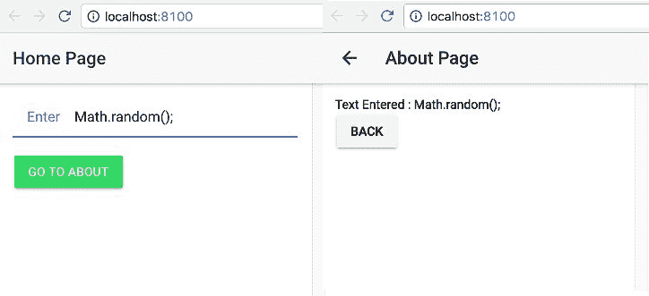
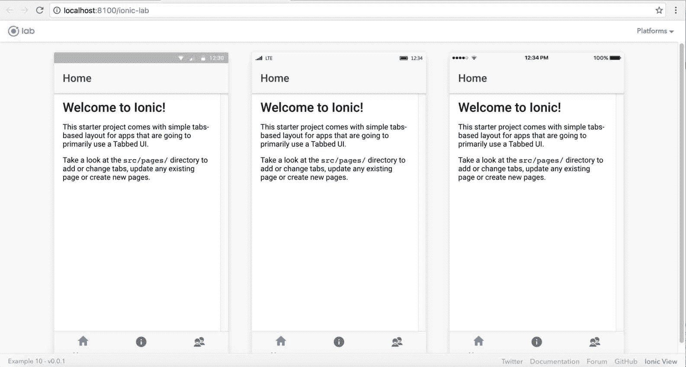
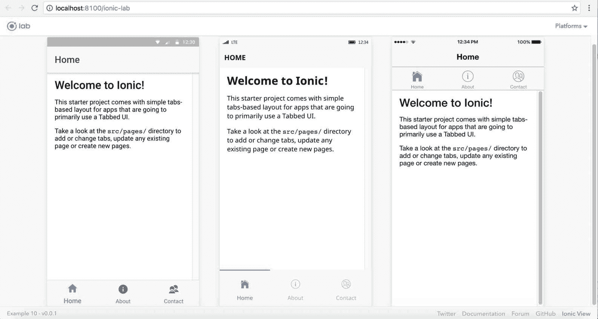
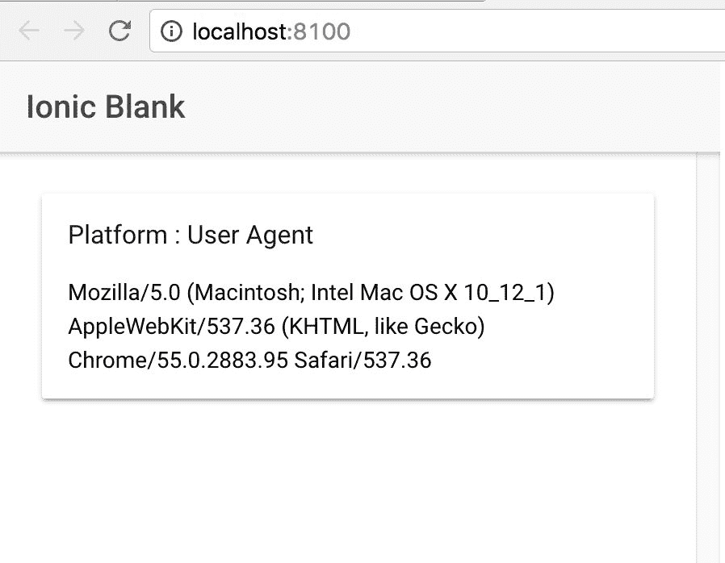
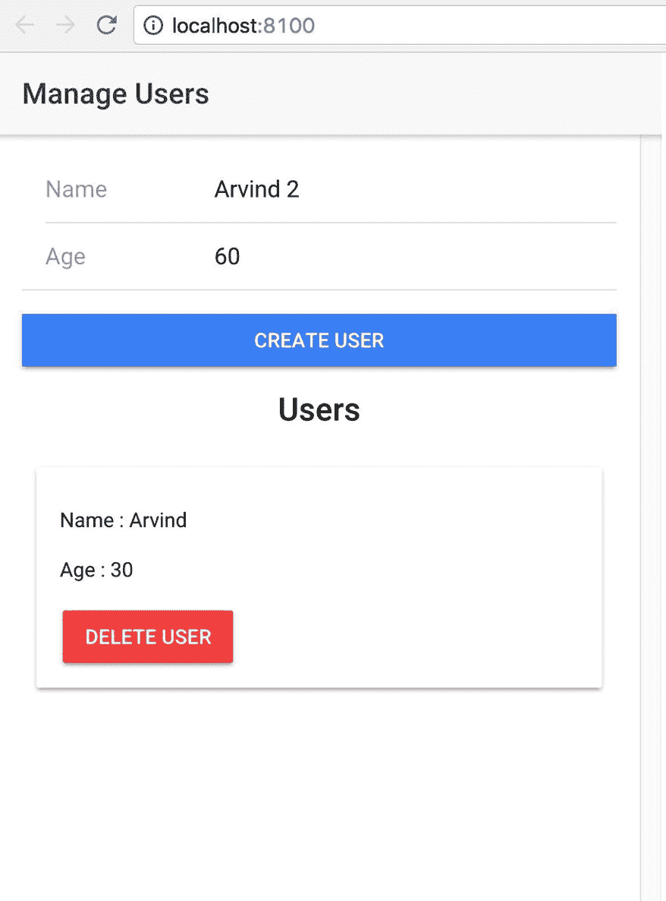

# 四、Ionic 装饰和服务

在最后一章中，我们介绍了一些 Ionic 组件，使用这些组件可以轻松构建经典的移动混合应用。在这一章，我们将与 Ionic 2 装饰和服务。整个 ion 2 生态系统分为两部分:组件和服务 API。组件包括按钮、卡片和列表，正如我们在上一章中看到的，服务 API 包括平台、`config`、`NavController`、`Storage`等。

在本章中，我们将了解以下主题:

*   Ionic 模块
*   组件装饰器
*   配置服务
*   平台服务
*   存储应用编程接口

# 装饰者

在我们开始使用 Ionic 内置装饰器之前，我们将很快了解什么是装饰器，以及它们如何让我们的生活变得轻松。

简单地说，装饰器是一个函数，它接受一个类并扩展它的行为，而不实际修改它。

例如，如果我们有一个人类，并且我们想要向该类添加更多关于该人的信息，例如年龄和性别，我们可以非常容易地做到这一点。

以下是我们如何在 TypeScript 中编写自己的装饰器的示例:

```html
@MoreInfo({ 
    age: 5, 
    gender: 'male' 
}) 
class Person { 
    constructor(private firstName, private lastName) {} 
}

```

装饰师看起来像这样:

```html
function MoreInfo(config) { 
    return function (target) { 
        Object.defineProperty(target.prototype, 'age', {value: () => config.age}); 
        Object.defineProperty(target.prototype, 'gender', {value: () => config.gender}); 
    } 
}

```

同样，Ionic 还提供两种装饰:

*   Ionic 模块或`NgModule`装饰器
*   组件装饰器

# Ionic 模块

Ionic 模块或`NgModule`装饰器启动 Ionic 应用。如果我们打开任何一个现有的 Ionic 项目并查找`src/app/app.module.ts`文件，我们将看到以下内容:

```html
import { NgModule, ErrorHandler } from '@angular/core'; 
import { IonicApp, IonicModule, IonicErrorHandler } from 'ionic-angular'; 
import { MyApp } from './app.component'; 
import { HomePage } from '../pages/home/home'; 
import { AboutPage } from '../pages/about/about'; 
import { ContactPage } from '../pages/contact/contact'; 

@NgModule({ 
  declarations: [ 
    MyApp, 
    HomePage, 
    AboutPage, 
    ContactPage 
  ], 
  imports: [ 
    IonicModule.forRoot(MyApp) 
  ], 
  bootstrap: [IonicApp], 
  entryComponents: [ 
    MyApp, 
    HomePage, 
    AboutPage, 
    ContactPage 
  ], 
  providers: [{ provide: ErrorHandler, useClass: IonicErrorHandler }] 
}) 
export class AppModule { }

```

这是我们引导 Ionic 应用的地方。也可以使用`IonicModule`上的`forRoot`来配置该应用。`forRoot`同时负责提供和配置服务。

在`IonicModule`上实现`forRoot`的示例如下所示:

```html
import { IonicApp, IonicModule } from 'ionic-angular'; 
import { MyApp } from './app.component'; 

@NgModule({ 
    declarations: [MyApp], 
    imports: [ 
        IonicModule.forRoot(MyApp, { 
            backButtonText: 'Go Back', 
            iconMode: 'ios', 
            modalEnter: 'modal-slide-in', 
            modalLeave: 'modal-slide-out', 
            tabsPlacement: 'bottom', 
            pageTransition: 'ios' 
        }, {}) 
    ], 
    bootstrap: [IonicApp], 
    entryComponents: [MyApp], 
    providers: [] 
})

```

还可以传递特定于平台的配置，如下所示:

```html
import { IonicApp, IonicModule } from 'ionic-angular'; 
import { MyApp } from './app.component'; 

@NgModule({ 
    declarations: [MyApp], 
    imports: [ 
        IonicModule.forRoot(MyApp, { 
            backButtonText: 'Go Back', 
            platforms: { 
                ios: { 
                    iconMode: 'ios', 
                    modalEnter: 'modal-slide-in', 
                    modalLeave: 'modal-slide-out', 
                    tabbarPlacement: 'bottom', 
                    pageTransition: 'ios-transition', 
                }, 
                android: { 
                    iconMode: 'md', 
                    modalEnter: 'modal-md-slide-in', 
                    modalLeave: 'modal-md-slide-out', 
                    tabbarPlacement: 'top', 
                    pageTransition: 'md-transition', 
                } 
            } 

        }, {}) 
    ], 
    bootstrap: [IonicApp], 
    entryComponents: [MyApp], 
    providers: [] 
})

```

You can read more about the Ionic Module at [https://ionicframework.com/docs/v2/api/IonicModule/](https://ionicframework.com/docs/v2/api/IonicModule/), about config at: [https://ionicframework.com/docs/v2/api/config/Config/](https://ionicframework.com/docs/v2/api/config/Config/) , and about `NgModule` at [https://angular.io/docs/ts/latest/guide/ngmodule.html](https://angular.io/docs/ts/latest/guide/ngmodule.html).

# 组件装饰器

`Component`装饰器将一个类标记为 Angular 组件，并收集组件配置元数据。一个简单的组件装饰器如下所示:

```html
import { Component } from '@angular/core'; 
import { Platform } from 'ionic-angular'; 
import { StatusBar, Splashscreen } from 'ionic-native'; 

import { HomePage } from '../pages/home/home'; 

@Component({ 
  templateUrl: 'app.html' 
}) 
export class MyApp { 
  rootPage = HomePage; 

  constructor(platform: Platform) { 
    platform.ready().then(() => { 
    StatusBar.styleDefault(); 
       Splashscreen.hide(); 
    }); 
  } 
}

```

组件中包含了所有的 ion 和 Angular 核心组件和指令，因此我们不需要显式声明指令属性。只需要显式指定子/父组件的相关属性。

要了解更多关于`Component`装饰器的信息，请参考[https://angular . io/docs/ts/latest/API/core/index/Component-decorator . html](https://angular.io/docs/ts/latest/api/core/index/Component-decorator.html)。

# 航行

在前一章中，我们看到了两个页面之间导航的基本实现。在这一节中，我们将深入探讨同样的问题。

首先，我们将搭建一个空白的 Ionic 应用。创建一个名为`chapter4`的新文件夹，并在该文件夹中打开一个新的命令提示符/终端，然后运行以下命令:

```html
ionic start -a "Example 9" -i app.example.nine example9 blank --v2

```

一旦应用已经搭建好，将`cd`放入`example9`文件夹。如果我们导航到`example9/src/app/app.component.ts`，我们应该会看到由名为`MyApp`的类定义的应用组件。如果我们导航到相应的模板`example9/src/app/app.html`，我们应该会看到`ion-nav`组件。

`ion-nav`组件接受名为 root 的输入属性。根属性指示哪个组件将充当根组件/根页面。在这个例子中，我们已经从我们的`MyApp`类(`example9/src/app/app.component.ts`)中指出主页为`root`。

现在，我们将使用 Ionic 命令行界面的生成命令生成一个名为关于的新页面。运行以下命令:

```html
ionic generate page about

```

该命令将在`src/pages`文件夹内创建一个新组件。

如果我们看一下`example9/src/pages/home/`和`example9/src/pages/about/`的内容，我们应该会看到两个独立的组件。

在我们开始将这两页拼接在一起之前，我们首先需要向`@NgModule`注册关于页面。打开`example9/src/app/app.module.ts`，更新如下图:

```html
import { NgModule, ErrorHandler } from '@angular/core'; 
import { IonicApp, IonicModule, IonicErrorHandler } from 'ionic-angular'; 
import { MyApp } from './app.component'; 
import { HomePage } from '../pages/home/home'; 
import { AboutPage } from '../pages/about/about'; 

@NgModule({ 
  declarations: [ 
    MyApp, 
    HomePage, 
    AboutPage 
  ], 
  imports: [ 
    IonicModule.forRoot(MyApp) 
  ], 
  bootstrap: [IonicApp], 
  entryComponents: [ 
    MyApp, 
    HomePage, 
    AboutPage 
  ], 
  providers: [{provide: ErrorHandler, useClass: IonicErrorHandler}] 
}) 
export class AppModule {}

```

接下来，我们将在主页上添加一个按钮，当我们点击它时，我们将显示关于页面。更新`example9/src/pages/home/home.html`如下图:

```html
<ion-header> 
  <ion-navbar> 
    <ion-title> 
      Home Page 
    </ion-title> 
  </ion-navbar> 
</ion-header> 

<ion-content padding> 
   <button ion-button color="secondary" (click)="openAbout()">Go To About</button> 
</ion-content>

```

接下来，我们将添加在页面之间导航的逻辑。更新`example9/src/pages/home/home.ts`如下:

```html
import { Component } from '@angular/core'; 
import { NavController } from 'ionic-angular'; 
import { AboutPage } from '../about/about'; 

@Component({ 
  selector: 'page-home', 
  templateUrl: 'home.html' 
}) 
export class HomePage { 

  constructor(public navCtrl: NavController) {} 

  openAbout(){ 
    this.navCtrl.push(AboutPage); 
  } 
}

```

使用`this.navCtrl.push(AboutPage);`，我们从主页移动到关于页面。

如果我们保存文件并执行`ionic serve`，我们应该会看到带有按钮的主页。当我们点击按钮时，我们会看到关于页面:


现在，如果我们想要返回，我们可以使用自动生成的返回按钮，或者我们可以在“关于”页面上创建一个按钮来返回。为此，更新`example9/src/pages/about/about.html`，如下所示:

```html
<ion-header> 
  <ion-navbar> 
    <ion-title>About Page</ion-title> 
  </ion-navbar> 
</ion-header> 

<ion-content padding> 
   <button ion-button color="light" (click)="goBack()">Back</button> 
</ion-content>

```

并更新`example9/src/pages/about/about.ts`如下:

```html
import { Component } from '@angular/core'; 
import { NavController } from 'ionic-angular'; 

@Component({ 
  selector: 'page-about', 
  templateUrl: 'about.html' 
}) 
export class AboutPage { 

  constructor(public navCtrl: NavController) {} 

  goBack(){ 
    this.navCtrl.pop(); 
  } 
}

```

请注意`this.navCtrl.pop();` -这就是我们从视图中弹出页面的方式。

如果我们保存所有文件并返回浏览器，然后从主页导航到关于，我们应该会看到一个后退按钮。点击此处将带我们回到主页。

这是一个简单的例子，说明我们如何把两页纸缝在一起。

除此之外，我们还有指示页面各个阶段的页面事件。为了更好地理解这一点，我们将更新`example9/src/pages/about/about.ts`，如下所示:

```html
import { Component } from '@angular/core'; 
import { NavController } from 'ionic-angular'; 

@Component({ 
  selector: 'page-about', 
  templateUrl: 'about.html' 
}) 
export class AboutPage { 

  constructor(public navCtrl: NavController) { } 

  goBack() { 
    this.navCtrl.pop(); 
  } 

  ionViewDidLoad() { 
    console.log("About page: ionViewDidLoad Fired"); 
  } 

  ionViewWillEnter() { 
    console.log("About page: ionViewWillEnter Fired"); 
  } 

  ionViewDidEnter() { 
    console.log("About page: ionViewDidEnter Fired"); 
  } 

  ionViewWillLeave() { 
    console.log("About page: ionViewWillLeave Fired"); 
  } 

  ionViewDidLeave() { 
    console.log("About page: ionViewDidLeave Fired"); 
  } 

  ionViewWillUnload() { 
    console.log("About page: ionViewWillUnload Fired"); 
  } 

  ionViewDidUnload() { 
    console.log("About page: ionViewDidUnload Fired"); 
  } 
}

```

保存所有文件，导航到浏览器，然后从主页导航到关于并返回，我们应该会看到以下内容:


基于此，我们可以抓住各种事件，并在需要时采取相应的行动。

# 在页面之间传递数据

到目前为止，我们已经看到了如何从一页移动到另一页。现在，使用`NavParams`，我们将数据从一个页面传递到另一个页面。

在同一个`example9`项目中，我们将增加这个功能。在主页上，我们将显示一个文本框供用户输入数据。一旦用户输入数据并点击转到关于，我们将获取`textbox`的值并将其传递到关于页面，并在关于页面中打印我们在主页上捕获的文本。

首先，我们将更新`example9/src/pages/home/home.html`，如下所示:

```html
<ion-header> 
    <ion-navbar> 
        <ion-title> 
            Home Page 
        </ion-title> 
    </ion-navbar> 
</ion-header> 
<ion-content padding> 
    <ion-list> 
        <ion-item> 
            <ion-label color="primary">Enter</ion-label> 
            <ion-input placeholder="Something..." #text></ion-input> 
        </ion-item> 
    </ion-list> 
    <button ion-button color="secondary" (click)="openAbout(text.value)">Go To About</button> 
</ion-content>

```

请注意，我们已经更新了`openAbout`方法来获取文本值。接下来，我们将更新`example9/src/pages/home/home.ts`:

```html
import { Component } from '@angular/core'; 
import { NavController } from 'ionic-angular'; 
import { AboutPage } from '../about/about'; 

@Component({ 
  selector: 'page-home', 
  templateUrl: 'home.html' 
}) 
export class HomePage { 

  constructor(public navCtrl: NavController) {} 

  openAbout(text){ 
    text = text || 'Nothing was entered'; 

    this.navCtrl.push(AboutPage, { 
      data : text 
    }); 
  } 
}

```

请注意我们传递给`navCtrl`的推送方法的第二个参数。这是我们从主页传递数据的方式。现在我们将更新`example9/src/pages/about/about.ts`来捕捉数据:

```html
import { Component } from '@angular/core'; 
import { NavController, NavParams } from 'ionic-angular'; 

@Component({ 
  selector: 'page-about', 
  templateUrl: 'about.html' 
}) 
export class AboutPage { 
  text: string; 

  constructor(public navCtrl: NavController, public navParams: NavParams) {  
    this.text = navParams.get('data'); 
  } 

  goBack() { 
    this.navCtrl.pop(); 
  } 

  /// SNIPP :: Page events... 
}

```

为了捕捉数据，我们需要从`ionic-angular`导入`NavParams`。使用`navParams.get(data);`，我们从构造器内部的主页获取传递的数据。

最后，要在“关于”页面显示数据，请更新`example9/src/pages/about/about.html`，如下所示:

```html
<ion-header> 
    <ion-navbar> 
        <ion-title>About Page</ion-title> 
    </ion-navbar> 
</ion-header> 
<ion-content padding> 
    <label>Text Entered : {{text}}</label> 
    <br> 
    <button ion-button color="light" (click)="goBack()">Back</button> 
</ion-content>

```

保存所有文件并返回浏览器，我们应该能够看到以下内容:



现在我们知道如何将两页缝合在一起，并在它们之间传递数据。

我们可以使用`@IonicPage`装饰器实现导航和延迟加载。你可以在[第 11 章](11.html#523VK0-9757c8e51afd47e0a7a9ced32db749b8)*Ionic 3* 找到更多相关信息。

# 配置服务

此服务允许您配置和设置特定于应用的首选项。

为了跨平台或在同一个平台内为各种组件定制应用的外观和感觉，我们使用了配置服务。

为了更好地理解这项服务，我们将搭建一个新的应用并与之合作。运行以下命令:

```html
ionic start -a "Example 10" -i app.example.ten example10 tabs --v2

```

然后运行`ionic serve --lab`。

这将在实验室视图中运行标签应用，在这里我们可以并排看到安卓 iOS 和视窗应用。

We can view the Ionic app in any of the three platform views by using the following URLs as well:
iOS: [http://localhost:8100/?ionicplatform=ios](http://localhost:8100/?ionicplatform=ios) Android: [http://localhost:8100/?ionicplatform=android](http://localhost:8100/?ionicplatform=android) Windows: [http://localhost:8100/?ionicplatform=windows](http://localhost:8100/?ionicplatform=windows)

我们应该看到这样的东西:


配置设置在`@NgModule`上。如果我们打开`example10/src/app/app.module.ts`，我们应该会找到`NgModule`装饰器，在里面我们可以找到`IonicModule.forRoot(MyApp)`。

一个简单的配置如下所示:

```html
//... snipp 
imports: [ 
    IonicModule.forRoot(MyApp, { 
        mode: 'md' 
    }) 
  ], 
//.. snipp

```

这将使外观和感觉默认为材料设计，与平台无关。我们应该能够看到以下内容:



您也可以像这样设置其他配置值:

```html
//.. snipp 
imports: [ 
    IonicModule.forRoot(MyApp, { 
      backButtonText: 'Go Back', 
      iconMode: 'ios', 
      modalEnter: 'modal-slide-in', 
      modalLeave: 'modal-slide-out', 
      tabsPlacement: 'bottom', 
      pageTransition: 'ios', 
    }) 
  ], 
//... snipp

```

前面的值是不言自明的。

可以在应用级、平台级和组件级覆盖配置中的属性。

例如，您可以在应用级别和平台级别覆盖`tabberPlacement`属性，如下所示:

```html
//..snipp 
imports: [ 
    IonicModule.forRoot(MyApp, { 
      tabsPlacement: 'bottom', // bottom for all platforms 
      platforms: { 
        ios: { 
          tabsPlacement: 'top', // top only for iOS 
        } 
      } 
    }) 
  ], 
//...snipp

```

我们将看到以下内容:



我们也可以在组件级别覆盖。更新`example10/src/pages/tabs/tabs.html`如下:

```html
<ion-tabs tabsPlacement="top"> 
  <ion-tab [root]="tab1Root" tabTitle="Home" tabIcon="home"></ion-tab> 
  <ion-tab [root]="tab2Root" tabTitle="About" tabIcon="information-circle"></ion-tab> 
  <ion-tab [root]="tab3Root" tabTitle="Contact" tabIcon="contacts"></ion-tab> 
</ion-tabs>

```

我们应该看到以下内容:


For quick testing, we can also set the config property in the URL, without any overrides defined. For instance, to test how tabs would look when placed on top, we can navigate to this URL: [http://localhost:8100/?ionicTabsPlacement=top](http://localhost:8100/?ionicTabsPlacement=top)

我们还可以为配置设置自定义属性，并在以后提取它们。例如，我们可以设置以下属性:

```html
config.set('ios', 'themePref', 'dark');

```

然后我们可以用下面的公式得到这个值:

```html
config.get('themePref');

```

We can import `config` from `ionic-angular`, for example `import {Config} from 'ionic-angular';` and then initialize `config` in the constructor: `constructor(private config : Config) { //**// }`

# 平台服务

平台服务返回关于当前平台的可用信息。Ionic 全新改进的平台服务有更多信息，帮助我们根据设备类型定制应用。

为了更好地理解平台服务，我们将搭建一个空白的 app。运行以下命令:

```html
ionic start -a "Example 11" -i app.example.eleven example11 blank --v2

```

然后运行`ionic serve`启动空白应用。

现在我们将在`example11/src/pages/home/home.ts`中添加对平台类的引用。更新`home.ts`如下:

```html
import { Component } from '@angular/core'; 
import { Platform } from 'ionic-angular'; 

@Component({ 
  selector: 'page-home', 
  templateUrl: 'home.html' 
}) 
export class HomePage { 
  constructor(public platform: Platform) {} 
}

```

现在我们将开始使用`Platform`类的各种特性。

我们要看的第一个是`userAgent`弦。要访问`userAgent`，我们可以在平台上执行`userAgent()`。

更新`example11/src/pages/home/home.html`内容部分如下:

```html
<ion-header> 
    <ion-navbar> 
        <ion-title> 
            Ionic Blank 
        </ion-title> 
    </ion-navbar> 
</ion-header> 
<ion-content padding> 
    <ion-card> 
        <ion-card-header> 
            Platform : User Agent 
        </ion-card-header> 
        <ion-card-content> 
            {{platform.userAgent()}} 
        </ion-card-content> 
    </ion-card> 
</ion-content>

```

我们应该看到以下内容:



接下来，我们将找出运行该应用的平台；为此，我们更新`home.html`中的`ion-content`内容如下:

```html
<ion-card> 
    <ion-card-header> 
      Platform : platformName 
    </ion-card-header> 
    <ion-card-content> 
      <ion-list> 
        <ion-item> 
          android : {{platform.is('android')}} 
        </ion-item> 
        <ion-item> 
          cordova : {{platform.is('cordova')}} 
        </ion-item> 
        <ion-item> 
          core : {{platform.is('core')}} 
        </ion-item> 
        <ion-item> 
          ios : {{platform.is('ios')}} 
        </ion-item> 
        <ion-item> 
          ipad : {{platform.is('ipad')}} 
        </ion-item> 
        <ion-item> 
          iphone : {{platform.is('iphone')}} 
        </ion-item> 
        <ion-item> 
          mobile : {{platform.is('mobile')}} 
        </ion-item> 
        <ion-item> 
          mobileweb : {{platform.is('mobileweb')}} 
        </ion-item> 
        <ion-item> 
          phablet : {{platform.is('phablet')}} 
        </ion-item> 
        <ion-item> 
          tablet : {{platform.is('tablet')}} 
        </ion-item> 
        <ion-item> 
          windows : {{platform.is('windows')}} 
        </ion-item> 
      </ion-list> 
    </ion-card-content> 
  </ion-card>

```

当浏览器刷新时，我们应该会看到以下内容:


从截图中我们可以看到，当在浏览器中运行时，前面的平台名称就是值。

现在，让我们添加浏览器平台，看看是否有任何变化。运行以下命令:

```html
ionic platform add browser 

```

然后运行:

```html
ionic run browser

```

您应该能够在支持科尔多瓦的浏览器中看到 Ionic 应用的启动，现在输出应该如下所示:


如果我们仔细观察，我们可以看到在前面的截图中，cordova 现在被设置为 true。

使用前面的平台名称，我们可以轻松定制应用并定制用户体验。

To find out more about the platform service, refer to [http://ionicframework.com/docs/api/platform/Platform/](http://ionicframework.com/docs/api/platform/Platform/)

# 存储服务

在本节中，我们将了解存储服务。Ionic 的 Storage 类帮助我们与各种存储选项进行交互，这些选项在应用在本机容器中运行时可用。

引用 Ionic 文档:

存储是存储键/值对和 JSON 对象的简单方法。存储使用各种存储引擎，根据平台选择最佳的存储引擎。

当在本机应用上下文中运行时，Storage 将优先使用 SQLite，因为它是最稳定和使用最广泛的基于文件的数据库之一，并避免了 localstorage 和 IndexedDB 等东西的一些陷阱，例如操作系统决定在磁盘空间不足的情况下清除这些数据。

当在网络中运行或作为渐进式网络应用运行时，存储将尝试按顺序使用索引数据库、网络 SQL 和本地存储。

现在，为了开始使用存储类，我们将创建一个新的应用。运行以下命令:

```html
ionic start -a "Example 12" -i app.example.twelve example12 blank --v2 

```

然后运行`ionic serve`在浏览器中启动。

为了了解如何使用存储，我们将构建一个简单的用户管理应用。在这个应用中，我们可以添加一个用户，将该数据保存在存储器中，然后在以后删除它。这个应用的主要目的是探索存储类。

最终的应用如下所示:



在我们开始使用`Storage`类之前，我们需要将其添加到我们的`Ionic`项目中。运行以下命令:

```html
npm install --save @ionic/storage

```

接下来，我们需要将其添加为提供者。更新`example12/src/app/app.module.ts`如下图:

```html
import { BrowserModule } from '@angular/platform-browser'; 
import { ErrorHandler, NgModule } from '@angular/core'; 
import { IonicApp, IonicErrorHandler, IonicModule } from 'ionic-angular'; 
import { SplashScreen } from '@ionic-native/splash-screen'; 
import { StatusBar } from '@ionic-native/status-bar'; 

import { MyApp } from './app.component'; 
import { HomePage } from '../pages/home/home'; 
import { IonicStorageModule } from '@ionic/storage'; 

@NgModule({ 
  declarations: [ 
    MyApp, 
    HomePage 
  ], 
  imports: [ 
    BrowserModule, 
    IonicModule.forRoot(MyApp), 
    IonicStorageModule.forRoot() 
  ], 
  bootstrap: [IonicApp], 
  entryComponents: [ 
    MyApp, 
    HomePage 
  ], 
  providers: [ 
    StatusBar, 
    SplashScreen, 
    {provide: ErrorHandler, useClass: IonicErrorHandler} 
  ] 
}) 
export class AppModule {}

```

接下来，我们将构建接口。打开`example12/src/pages/home/home.html`。我们将首先将标题更新为:

```html
<ion-header> 
    <ion-navbar> 
        <ion-title> 
            Manage Users 
        </ion-title> 
    </ion-navbar> 
</ion-header>

```

接下来，在内容部分，我们将创建两个分区，一个用于用户输入姓名和年龄的表单，另一个用于显示用户列表:

```html
<ion-content padding> 
    <div> 
        <ion-list> 
            <ion-item> 
                <ion-label fixed>Name</ion-label> 
                <ion-input type="text" placeholder="Enter Name" #name>
                </ion-input> 
            </ion-item> 
            <ion-item> 
                <ion-label fixed>Age</ion-label> 
                <ion-input type="number" placeholder="Enter Age" #age> 
                </ion-input> 
            </ion-item> 
        </ion-list> 
        <button ion-button full color="primary" (click)="addUser(name, 
        age)" [disabled]="!name.value || !age.value">Create 
        User</button> 
    </div> 
    <div *ngIf="users.length > 0"> 
        <h3 style="text-align: center;" padding>Users</h3> 
        <ion-card *ngFor="let user of users"> 
            <ion-card-content> 
                <ion-label>Name : {{user.name}}</ion-label> 
                <ion-label>Age : {{user.age}}</ion-label> 
                <button ion-button color="danger" 
                (click)="removeUser(user)">Delete User</button> 
            </ion-card-content> 
        </ion-card> 
    </div> 
</ion-content>

```

接下来，我们将开始处理逻辑。如下图更新`example12/src/pages/home/home.ts`

```html
import { Component } from '@angular/core'; 
import { NavController } from 'ionic-angular'; 
import { Storage } from '@ionic/storage'; 

@Component({ 
  selector: 'page-home', 
  templateUrl: 'home.html' 
}) 
export class HomePage { 
  users: any[] = []; 

  constructor(private navCtrl: NavController, private storage: Storage) { 
    // get all the users from storage on load 
    this.getUsers(); 
  } 

  getUsers() { 
    this.storage.ready().then(() => { 
      this.storage.forEach((v, k, i) => { 
        if (k.indexOf('user-') === 0) { 
          this.users.push(v); 
        } 
      }); 
    }); 
  } 

  addUser(name, age) { 
    this.storage.ready().then(() => { 
      let user = { 
        id: this.genRandomId(), 
        name: name.value, 
        age: age.value 
      }; 
      // save it to the storage 
      this.storage.set('user-' + user.id, user); 
      // update the inmemory variable to refresh the UI 
      this.users.push(user); 
      // reset the form 
      name.value = ''; 
      age.value = ''; 
    }); 
  } 

  removeUser(user) { 
    this.storage.ready().then(() => { 
      // remove from storage 
      this.storage.remove('user-' + user.id); 
      // update the inmemory variable to refresh the UI 
      this.users.splice(this.users.indexOf(user), 1); 
    }); 
  } 

  genRandomId() { 
    return Math.floor(Math.random() * 9999); // up to 4 digits random number 
  } 

}

```

在前面的代码中，首先我们已经从`@ionic/storage`导入了`Storage`。接下来，我们在构造函数中实例化了相同的。

我们已经创建了一个名为`users`的类变量，该变量将用于在内存中存储我们正在创建的所有用户。在构造函数内部，我们调用`getUsers()`从加载的存储中获取用户。我们创建了两个功能，`addUser()`和`removeUser()`，来添加和删除用户。

因为存储是键值存储，所以我们使用用户的标识来创建存储的用户的密钥。例如，如果用户的标识是 1，我们将密钥创建为`user-1`。这样，我们就知道属于我们应用的存储中的所有密钥都以*用户*开始，以防同一应用中有其他实体使用存储。

我们正在使用`genRandomId()`生成一个介于 1 和 9，999 之间的随机数。

如果我们保存所有文件，返回浏览器并打开控制台，我们应该会看到如下内容:


请注意控制台中的消息。这条消息告诉我们数据将存储在一个内存中。所以，在 Chrome 中，它应该是 IndexedDB。

因此，在 Chrome 中，如果我们单击开发工具中的“应用”选项卡并导航到 IndexedDB，我们应该会看到如下内容:


现在，让我们使用表单添加一个用户。更新后的屏幕和存储应该如下所示:


现在，点击删除，我们应该看到存储被清除，用户界面更新，没有任何用户。

因此，使用存储，我们可以轻松地在我们的 Ionic 应用中开始处理数据持久性，而不用担心底层实现。

如果需要，我们可以如下覆盖`IonicStorageModule.forRoot()`:

```html
IonicStorageModule.forRoot({
  name: 'appDB',
  driverOrder: ['indexeddb', 'sqlite', 'websql']
})

```

你可以在这里找到更多的配置和属性:[https://ionicframework.com/docs/storage/](https://ionicframework.com/docs/storage/)

至此，我们完成了对 Ionic 存储的概述。

# 摘要

在这一章中，我们已经介绍了 Ionic 的两个主要装饰者。然后，我们浏览了配置和平台服务，了解了如何根据平台和配置定制应用。在此之后，我们已经通过了 Ionic 存储应用编程接口。参见[第 11 章](11.html#523VK0-9757c8e51afd47e0a7a9ced32db749b8)、*Ionic 3* ，了解全新的`IonicPage`指令和`IonicPage`模块。

在下一章中，我们将研究 Ionic 应用的主题。