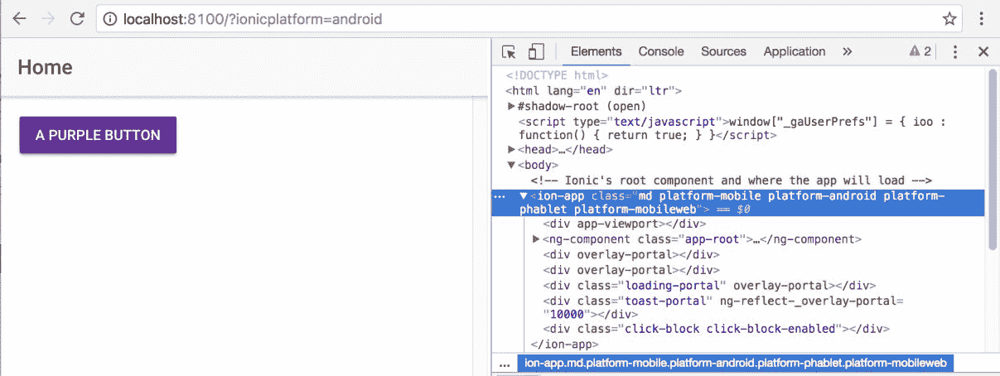
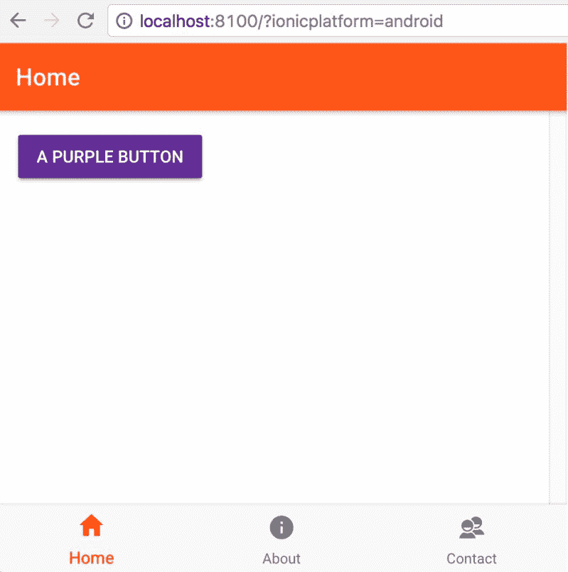
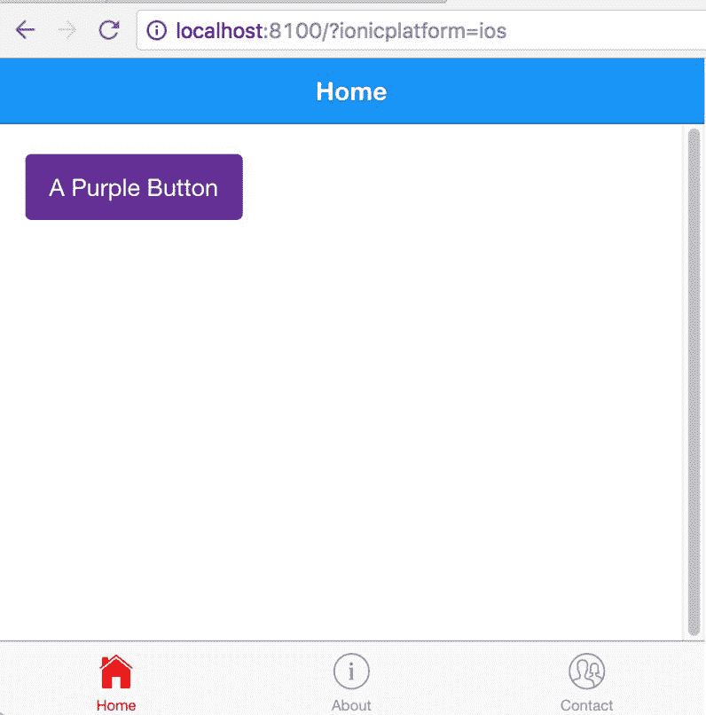
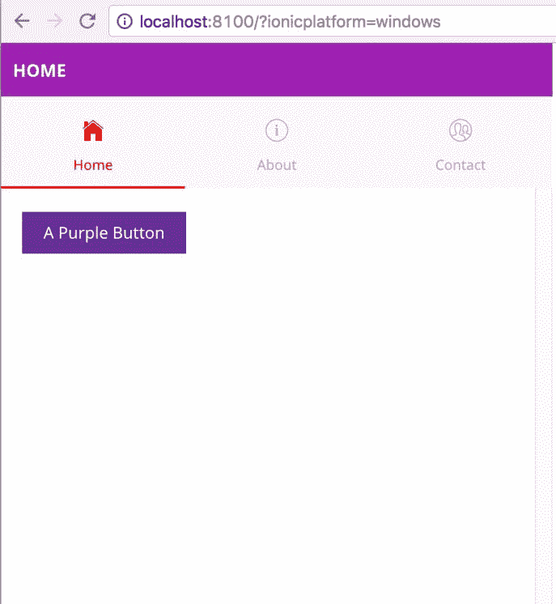
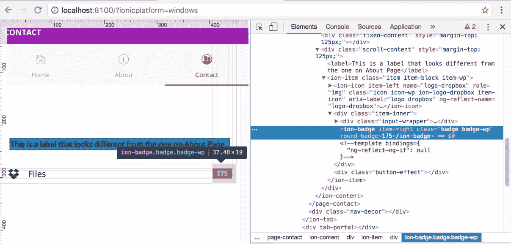
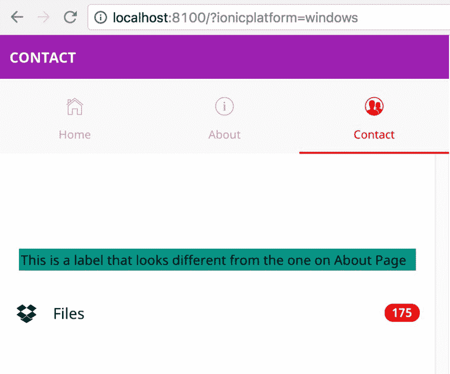

# 五、Ionic 和 SCSS

在这一章中，我们将看看与 Ionic 主题。在 Ionic 键中主题化简单且易于实现。Ionic 团队在 Ionic 简化和模块化主题化方面付出了巨大努力。简而言之，在 ion 中的主题化发生在组件级，以及平台级(iOS、Android 和 WP)。Ionic 用 SCSS 来做主题。我们将在本章中讨论以下主题:

*   萨斯对 SCSS
*   使用 SCSS 变量
*   平台级和页面/组件级覆盖

# 什么是萨斯？

引用萨斯文档:

"Sass is an extension of CSS that adds power and elegance to the basic language."

它允许我们使用变量、嵌套规则、混合、内联导入等，所有这些都具有完全兼容 CSS 的语法。Sass 有助于保持大型样式表的良好组织，并快速启动和运行小型样式表。

简单来说，Sass 使 CSS 可编程。但是这一章的标题是 SCSS；为什么我们要谈论萨斯？嗯，萨斯和 SCSS 几乎是同一个 CSS 预处理器，每个都有自己的方法来编写 CSS 前的语法。

SCSS 是由 Ruby 开发人员作为另一个名为 HAML([http://haml.info/](http://haml.info/))的预处理器的一部分开发的，所以它继承了 Ruby 的很多语法风格，比如缩进，没有大括号，也没有分号。

一个示例 Sass 文件如下所示:

```html
// app.sass 

brand-primary= blue 

.container 
    color= !brand-primary 
    margin= 0px auto 
    padding= 20px 

=border-radius(!radius) 
    -webkit-border-radius= !radius 
    -moz-border-radius= !radius 
    border-radius= !radius 

* 
    +border-radius(0px) 

```

当通过 Sass 编译器运行时，它将返回以下代码:

```html
.container { 
  color: blue; 
  margin: 0px auto; 
  padding: 20px; 
} 

* { 
  -webkit-border-radius: 0px; 
  -moz-border-radius: 0px; 
  border-radius: 0px; 
}

```

好老 CSS。但是你有没有注意到`brand-primary`作为一个变量，在容器类中替换它的值？而`border-radius`作为一个函数(也称为 mixin)，在用参数调用时生成所需的 CSS 规则？是的，CSS 编程中缺失的一块。您可以尝试前面的转换:[http://sasstocss.appspot.com/](http://sasstocss.appspot.com/)并查看 Sass 是如何编译成 CSS 的。

习惯于基于括号的编码语言的人发现这种编写代码的方式有点困难。所以，进入 SCSS。

萨斯代表**语法上很棒的样式表**，SCSS 代表**时髦的 CSS** 。因此，除了类似于 CSS 的语法之外，SCSS 与 Sass 基本相同。前面的萨斯代码在 SCSS 写的时候看起来是这样的:

```html
$brand-primary: blue; 

.container{ 
    color: !brand-primary; 
    margin: 0px auto; 
    padding: 20px; 
} 

@mixin border-radius($radius) { 
    -webkit-border-radius: $radius; 
    -moz-border-radius: $radius; 
    border-radius: $radius; 
} 

* { 
    @include border-radius(5px); 
}

```

这看起来更接近 CSS 本身，对吧？而且很有表现力。Ionic 用 SCSS 来设计它的组件。

如果你想了解更多关于 SCSS 和萨斯的信息，你可以看看:[http://thesassway . com/editional/Sass-vs-scss-哪个语法更好](http://thesassway.com/editorial/sass-vs-scss-which-syntax-is-better)。

现在，我们已经对什么是 SCSS 和萨斯以及如何使用它们有了基本的了解，我们将在我们的 Ionic 应用中利用它们来维护和主题化我们的组件。

# Ionic 和 SCSS

默认情况下，Ionic 挤满了 SCSS。与早期版本不同，在早期版本中，人们必须在一个项目中建立 SCSS，而在 Ionic 2 中，主题化变得更加模块化和简单。主题化有两个层次:

*   在平台层面
*   在页面/组件级别

应用级主题化几乎总是我们需要的。我们会根据我们的品牌改变我们的应用的颜色，由于 Ionic 使用 SCSS 地图，颜色直接由组件继承。此外，我们可以根据需要添加、重命名和移除颜色。原色是地图中唯一需要的颜色。如果每种模式的颜色不同，iOS、MD 和 WP 颜色可以进一步定制。

页面/组件级主题化非常有帮助，如果我们想保持我们的风格孤立和特定于那些页面/组件。这是基于组件的应用开发方法的最大优势之一。我们可以保持我们的组件模块化和可管理性，同时防止风格和功能从一个泄露到另一个，除非有意。

为了掌握 Ionic 主题化的窍门，我们将搭建一个新的标签应用，主题保持不变。如果需要，创建一个名为`chapter5`的新文件夹，然后打开一个新的命令提示符/终端。运行以下命令:

```html
ionic start -a "Example 13" -i app.example.thirteen example13 tabs 
--v2

```

应用搭建完成后，运行`ionic serve`在浏览器中查看应用。我们要做的第一件事是颜色。打开`example13/src/theme/variables.scss`，我们应该会看到一个名为`$colors`的变量地图。

要快速测试配色方案，请将`$colors`图中主变量的值从`#387ef5`更改为`red`。我们应该看到以下内容:


如前所述，primary 是唯一的强制值。

颜色图也可以扩展到添加我们自己的颜色。例如，在`example13/src/pages/home/home.html`上，让我们添加一个属性名为`purple`的按钮，如下所示:

```html
<ion-content padding> 
    <button ion-button color="purple">A Purple Button</button> 
</ion-content>

```

在`$colors`地图内部，添加一个新的键值:`purple: #663399`。完整的地图如下所示:

```html
$colors: ( 
  primary:    red, 
  secondary:  #32db64, 
  danger:     #f53d3d, 
  light:      #f4f4f4, 
  dark:       #222, 
  purple:     #663399 
);

```

现在，如果我们回到页面，我们应该会看到以下内容:


给我们的应用添加新的颜色确实很简单。

我们可以通过添加基础和对比度属性来进一步自定义主题颜色。基础将是元素的背景，对比度将是文本颜色。
要测试前面的功能，打开`example13/src/pages/about/about.html`并添加一个浮动动作按钮，如下代码所述:

```html
<ion-content padding> 
  <button ion-fab color="different">FAB</button> 
</ion-content>

```

在前面的片段中，我们已经将`color=different`添加到了`FAB`中。我们将使用这个变量名来应用样式。

我们更新的`$colors`地图如下:

```html
$colors: ( 
  primary:    red, 
  secondary:  #32db64, 
  danger:     #f53d3d, 
  light:      #f4f4f4, 
  dark:       #222, 
  purple:     #663399, 
  different: ( 
    base: #4CAF50, 
    contrast: #F44336 
  ) 
);

```

Note: This will generate styles for all the different Ionic components. Do not put SCSS variables in the map if they are not part of the root component.

保存所有文件后，当我们导航到“关于”选项卡时，应该会看到以下内容:


主题化难道不简单吗？

# 页面级覆盖

我们可以通过对两个不同页面中的同一个组件应用不同的样式，将相同的主题化提升到下一个层次。例如，我们将在“关于”页面和“联系人”页面中使标签看起来不同。这就是我们将如何实现它。

在`example13/src/pages/about/about.html`中，我们将在`ion-content`部分内添加一个新标签，如下代码所示:

```html
<ion-content padding> 
  <button ion-fab color="different">FAB</button> 
  <label>This is a label that looks different from the one on Contact Page</label> 
</ion-content>

```

我们将在`example13/src/pages/about/about.scss`中添加所需的样式，如下代码所示:

```html
page-about { 
    label { 
        border: 2px solid #FF5722; 
        background: #FF5722; 
    } 
}

```

同样，我们将在`ion-content`部分的`example13/src/pages/contact/contact.html`中添加另一个标签，如下代码所示:

```html
<ion-content> 
    <label>This is a label that looks different from the one on About Page</label> 
</ion-content>

```

我们将在`example13/src/pages/contact/contact.scss`内添加所需的样式，如下代码所示:

```html
page-contact { 
    label { 
        border: 2px solid #009688; 
        background: #009688; 
        margin: 20px; 
        margin-top: 100px; 
        display: block; 
    } 
}

```

现在，如果我们保存所有文件并返回浏览器中的“关于”页面，我们应该会看到以下内容:


“联系人”页面将如下所示:


从上图中我们可以看到，我们使用页面级样式来区分这两个组件。前面的截图是一个简单的例子，展示了我们如何在不同的页面中为同一个组件提供多种样式。

# 平台级覆盖

现在，我们已经看到了如何在页面级别应用样式，让我们看看 Ionic theming 如何使在平台级别管理样式变得如此简单。当在多个设备中查看同一个应用时，平台级样式是适用的，这些设备有自己独特的样式。

在与 Ionic 合作时，我们定义了模式，其中模式是应用运行的平台。默认情况下，ion 会添加一个类名，与`ion-app`元素上的模式相同。例如，如果我们在安卓系统上查看应用，主体将有一个名为`md`的类，其中`md`代表**材料设计**。

为了快速检查这一点，我们将打开`http://localhost:8100/?ionicplatform=ios`，然后在开发工具中检查主体元素。在其他类中，我们应该看到带有名为`ios`的类的`ion-app`元素:


如果打开`http://localhost:8100/?ionicplatform=android`，应该会看到以下内容:



而如果打开`http://localhost:8100/?ionicplatform=windows`，应该会看到如下:


截至目前，Ionic 有三种模式:

| **平台** | **模式** | **描述** |
| ios | ios | 将 iOS 样式应用于所有组件 |
| 机器人 | 钔 | 将材质设计样式应用于所有组件 |
| Windows 操作系统 | 最大输出功率 | 将窗口样式应用于所有组件 |
| 核心 | 钔 | 如果我们不在上述设备上，默认情况下，该应用将获得材料设计样式 |

更多信息请参考这里:[http://ioncframework . com/docs/theming/平台特定样式/](http://ionicframework.com/docs/theming/platform-specific-styles/) 。

我们将在评论部分的`example13/src/theme/variables.scss`文件中定义平台特定的样式。

为了理解特定于平台的样式，我们将对`navbar`应用不同的背景颜色，并更改文本颜色。

打开`example13/src/theme/variables.scss`，在评论中说`App Material Design Variables`的部分下添加以下样式:

```html
// App Material Design Variables 
// --------------------------------------------------

// Material Design only Sass variables can go here 
.md{ 
  ion-navbar .toolbar-background { 
      background: #FF5722; 
  } 

  ion-navbar .toolbar-title { 
      color: #fff; 
  } 
}

```

现在，当我们保存文件并导航到`http://localhost:8100/?ionicplatform=android`时，我们应该会看到以下内容:



一定要注意`.md`类，里面嵌套了样式。这就是风格平台的特殊性。

同样，我们更新`App iOS Variables`部分:

```html
// App iOS Variables 
// -------------------------------------------------- 
// iOS only Sass variables can go here 
.ios{ 
  ion-navbar .toolbar-background { 
      background: #2196F3; 
  } 

  ion-navbar .toolbar-title { 
      color: #fff; 
  } 
}

```

那么我们应该看到以下内容:



最后，对于 Windows，我们将更新`App Windows Variables`部分，如以下代码中所述:

```html
// App Windows Variables 
// -------------------------------------------------- 
// Windows only Sass variables can go here 
.wp{ 
  ion-navbar .toolbar-background { 
      background: #9C27B0; 
  } 

  ion-navbar .toolbar-title { 
      color: #fff; 
  } 
}

```

我们应该看到以下内容:



We have already seen in [Chapter 4](04.html#2BASE0-9757c8e51afd47e0a7a9ced32db749b8), *Ionic Decorators and Services*, how we can change the mode of the app to either `md`, `ios`, or `wp` using the `config` properties.

我们还可以动态设置平台并应用样式。
为了理解这一点，我们将使用徽章组件。仅在 Windows 平台上，徽章组件不会有任何边框半径，但我们希望使用动态属性覆盖该行为。

在我们现有的`example13/src/pages/contact/contact.html`中，我们将在`ion-content`部分中添加以下片段:

```html
<ion-item> 
        <ion-icon name="logo-dropbox" item-left></ion-icon> 
        Files 
        <ion-badge item-right [attr.round-badge]="isWindows ? '' : null">175</ion-badge> 
    </ion-item>

```

如果我们注意到在`ion-badge`上，我们有一个条件属性`[attr.round-badge]="isWindows ? '' : null"`。如果平台是 Windows，我们会添加一个名为`round-badge`的新属性，我们会更新我们的`example13/src/pages/contact/contact.ts`，如下代码所述:

```html
import { Component } from '@angular/core'; 
import { Platform } from 'ionic-angular'; 

@Component({ 
  selector: 'page-contact', 
  templateUrl: 'contact.html' 
}) 
export class ContactPage { 
  isWindows: Boolean; 

  constructor(public platform: Platform) { 
    this.isWindows = platform.is('windows'); 
  } 
}

```

我们已经在构造函数中定义了`isWindows`的值。现在，如果我们保存所有文件并导航到`http://localhost:8100/?ionicplatform=windows`，我们应该会看到以下内容:


如果我们检查徽章，我们应该会看到添加的属性`round-badge`:



我们可以导航到其他平台并对其进行验证。

如果我们观察，徽章容器的边框有一个`0px`边框半径。现在我们将在`App Windows Variables`部分向`example13/src/theme/variables.scss`添加所需的覆盖。

该片段如下所示:

```html
.wp{ 
  // snipp 

  ion-badge[round-badge]{ 
    border-radius: 12px; 
  } 
}

```

现在，即使对于 Windows 平台，我们也可以看到`border-radius`正在被应用:



这是我们可以实现特定于平台的覆盖的另一种方式。

# 组件级覆盖

到目前为止，我们看到的任何定制都主要是在页面和平台级别。如果我们想定制由 Ionic 提供的组件，以匹配我们品牌的外观和感觉，该怎么办？

这也可以非常容易地实现，这要感谢 Ionic 团队，他们在公开变量名以定制属性方面做了额外的努力。

如果我们导航到[http://ion cframework . com/docs/theming/override-ion-variables/](http://ionicframework.com/docs/theming/overriding-ionic-variables/)，我们将看到一个可过滤的表格，在这里我们可以找到我们可以覆盖的特定于组件的变量:


# 主题示例组件

为了快速检查这一点，我们将在当前应用的主页上实现覆盖加载栏。当用户登录到这个选项卡时，我们将以编程方式触发加载弹出窗口，并且根据平台的不同，我们将定制组件的外观和感觉，以显示组件可以按照我们的意愿进行定制。
按照以下代码更新`example13/src/pages/home/home.ts`:

```html
import { Component } from '@angular/core'; 
import { LoadingController } from 'ionic-angular'; 

@Component({ 
  selector: 'page-home', 
  templateUrl: 'home.html' 
}) 
export class HomePage { 

  constructor(public loadingCtrl: LoadingController) { 
    this.presentLoading(); 
  } 

  presentLoading() { 
    let loader = this.loadingCtrl.create({ 
      content: "Please wait...", 
      duration: 3000 
    }); 
    loader.present(); 
  } 
}

```

我们已经定义了一个名为`presentLoading`的函数，并在构造函数中调用了它。这将在页面加载时显示加载栏。

如果我们保存这个页面并导航到三个不同的平台，我们将看到特定于该特定平台的样式。在这个例子中，我们将使所有的加载条看起来(几乎)一样，而不考虑平台。我们将通过处理`SCSS`变量来达到同样的目的。

如果我们导航到[并过滤`loading-ios`，我们会看到一堆与加载弹出样式相关的 SCSS 变量。同样，如果搜索`loading-md`，会发现与安卓相关的 SCSS 变量。最后，如果我们搜索`loading-wp`，我们会发现 Windows 平台的 SCSS 变量。](http://ionicframework.com/docs/theming/overriding-ionic-variables/)

我们将使用前面的变量名并定制外观。打开`example13/src/theme/variables.scss`。在定义`@import 'ionic.globals';`之后和定义颜色映射之前，我们将添加组件级覆盖。如果你正在查看评论的 SCSS 文件，你会看到一个名为`Shared Variables`的部分。这是我们添加变量覆盖的地方。

我们获取了一些 SCSS 变量，并为每个平台修改了它们的属性，如下面的代码所示:

```html
// Overriding Loading Popup for iOS  
// >> Start 
$loading-ios-background: #2196F3; 
$loading-ios-border-radius: 0px; 
$loading-ios-text-color: #fff; 
$loading-ios-spinner-color: #eee; 
// >> End 

// Overriding Loading Popup for Android  
// >> Start 
$loading-md-background: #2196F3; 
$loading-md-border-radius: 0px; 
$loading-md-text-color: #fff; 
$loading-md-spinner-color: #eee; 
// >> End 

// Overriding Loading Popup for Windows  
// >> Start 
$loading-wp-background: #2196F3; 
$loading-wp-border-radius: 0px; 
$loading-wp-text-color: #fff; 
$loading-wp-spinner-color: #eee; 
// >> End

```

现在，如果我们导航到`http://localhost:8100/?ionicplatform=ios`，我们应该会看到以下内容:


如果导航到`http://localhost:8100/?ionicplatform=android`，应该会看到以下内容:


最后，如果我们导航到`http://localhost:8100/?ionicplatform=windows`，我们应该会看到以下内容:


我们也可以添加自定义的 CSS，让它们看起来都一样。

至此，我们完成了平台级和页面/组件级的 Ionic 应用主题化概述。

# 摘要

在这一章中，我们已经看到了如何主题化 Ionic 应用。我们还看到了如何在平台级和页面/组件级轻松实现样式。

在下一章中，我们将研究 Ionic 原生生物。Ionic 原生就是 ngCordova 对 Ionic 1 的意义。我们将更深入地研究如何将设备功能与 Ionic 应用相集成。