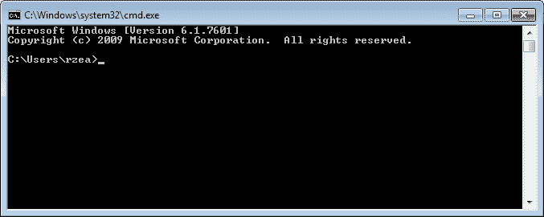
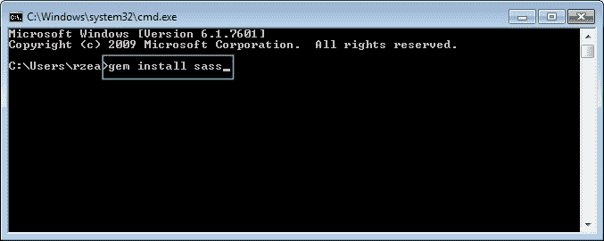
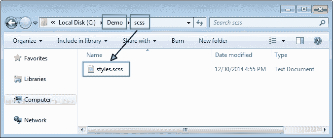
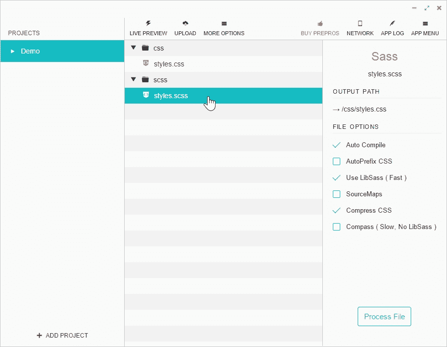
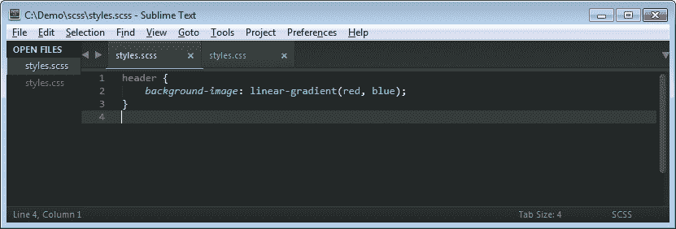
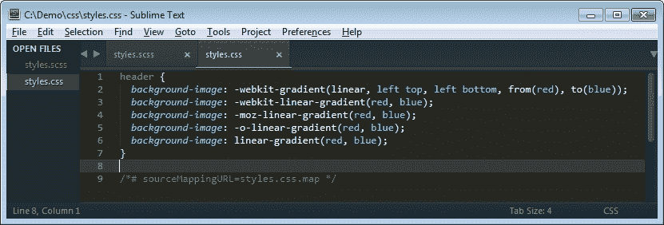
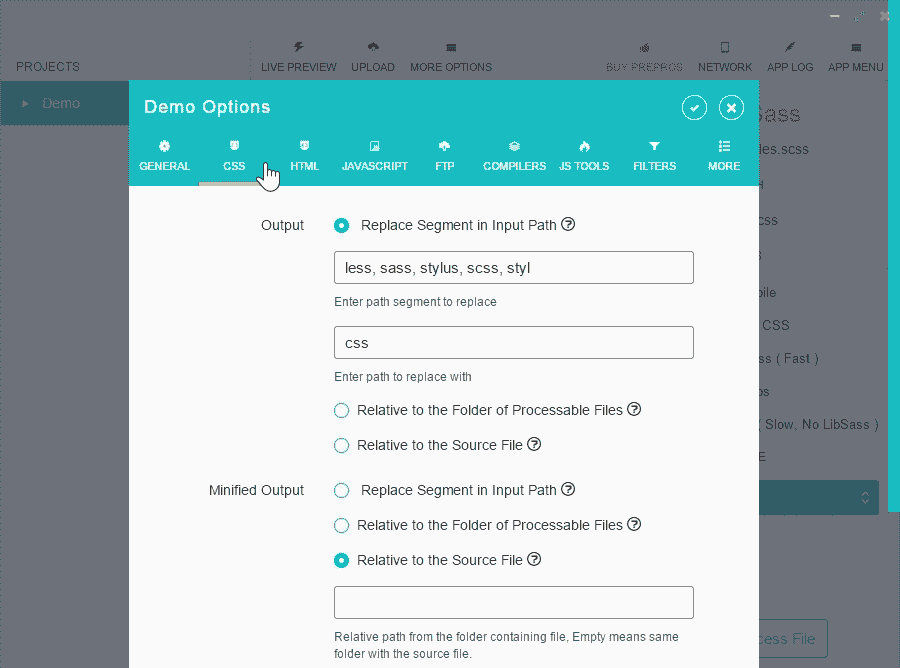
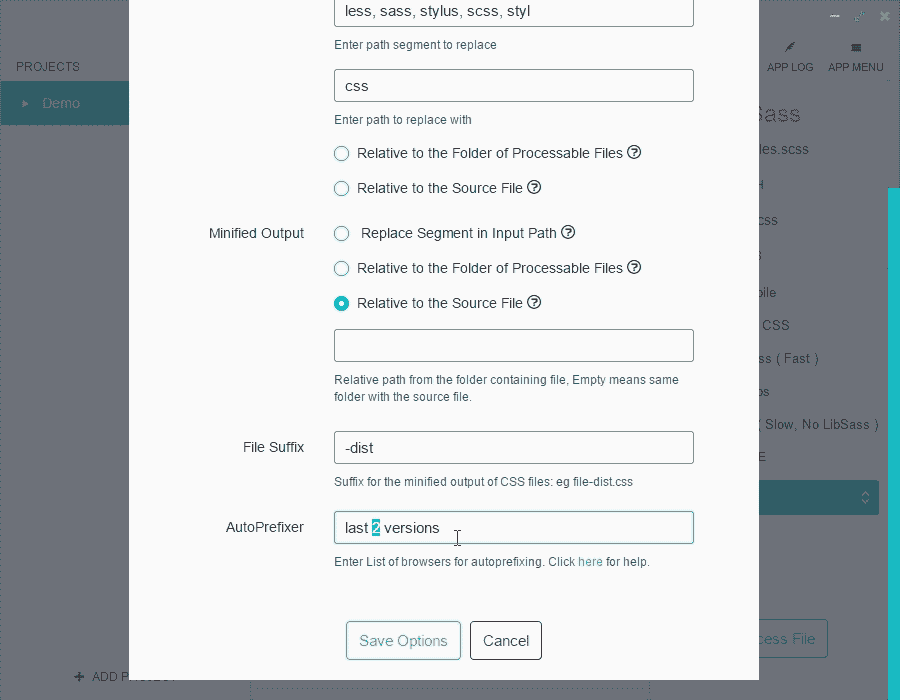

# 一、将 Sass 的力量用于响应性网页设计

在使用 HTML5 和 CSS3 掌握响应性 web 设计之前，我们需要在技术方面保持一致，在我们的例子中，CSS 预处理器，特别是 Sass。

在本书中，所有 CSS 都将以 SCSS 格式用 Sass 编写。我们写 CSS 的方式已经改变；它有了巨大的改进。

诸如 Sass、LESS 和 Stylus 等 CSS 预处理器为 web/移动设计人员和开发人员提供了新的超级能力。是的，我使用了*超级大国*这个词，因为这正是我第一次使用 Sass 几个小时后的感受，我使用的是最基本的：

```html
.navigation-bar {
    display: flex;
    li {
        padding: 5px 10px;
    }
}
```

看到嵌套的`li`选择器了吗？是的，这是一种行为。编译前面的代码时，它看起来是这样的：

```html
.navigation-bar {
   display: flex; 
}
.navigation-bar li {
   padding: 5px 10px;
}
```

### 提示

**下载示例代码**

您可以从您的账户[下载示例代码文件 http://www.packtpub.com](http://www.packtpub.com) 对于您购买的所有 Packt 出版书籍。如果您在其他地方购买了本书，您可以访问[http://www.packtpub.com/support](http://www.packtpub.com/support) 并注册，将文件直接通过电子邮件发送给您。

让我们看看本章为我们准备了什么：

*   Sass 是如何工作的？
*   SASS 的基本概念——顾虑 T1 的响应性网页设计

# Sass 是如何工作的？

了解 Sass 的工作原理需要理解几个基本的技术概念：

1.  Sass 可以基于两种不同的技术：Ruby 或 LibSass。在本书中，我们将使用基于 Ruby 的 Sass。
2.  Sass 是一颗红宝石。Gems 是用于 Ruby 的包。RubyGem 是只在 Ruby 上运行的软件。Ruby 是一种编程语言，与 PHP、.NET、Java 等类似。
3.  我们可以通过命令行运行 Sass，但是我们也可以使用第三方应用运行 Sass，这样就不需要使用命令行了。
4.  Sass 是一种用于创建 CSS 的编程/脚本语言。
5.  CSS 是一种非常重复的语言。Sass 允许作者优化那些重复的任务，并更快更有效地创建 CSS。
6.  Sass 工作流的一部分是当 Sass 在*监视*一个 SCSS 文件时，例如`book-styles.scss`。当它检测到该 SCSS 文件中的更改时，会将其编译为 CSS 文件`book-styles.css`。

### 提示

*监视 SCSS 文件*表示 Sass 监视程序正在后台运行，查看 SCSS 文件是否有任何更改。

## 安装 Sass

以下是我们将要遵循的步骤：

1.  下载 Ruby 安装程序
2.  打开命令行
3.  安装 Sass gem

### 下载 Ruby 安装程序

**Windows**：从以下链接下载 Ruby 安装程序：

T0http://rubyinstaller.org/downloads/ T1

**Mac**：Ruby 预装在所有 Mac 上，因此无需下载任何内容。

### 打开命令行

**Windows 和 Mac**：打开命令行。

### 提示

**窗口提示！**

按*窗口*+*R*，输入`CMD`，然后按*进入*。



### 安装 Sass gem

在命令提示符中键入以下命令（无论您在哪个文件夹中）：

在 Windows 中，使用以下命令：

```html
gem install sass

```

Mac，使用以下命令：

```html
sudo gem install sass

```



安装 Sass 需要几秒钟的时间。

### 提示

在撰写本文时，Sass 的最新版本是 3.4.14。该书出版时，版本/修订版可能会有所不同。

就这样！Sass 现在已安装在您的计算机上。

## 使用 Sass

我将要向你们展示的与任何其他 Sass 教程告诉你们的完全不同。这些教程中的大多数都让事情变得太复杂了。这是你读过的最简单的使用 Sass 的方法。

下面的屏幕截图在 Windows 上，但无论平台如何，都可以应用完全相同的过程。

在以下步骤中，您将看到创建必要文件夹和文件后的外观示例，而不是如何创建它们的示例：

1.  Create a `/Demo` folder anywhere on your drive:

    

2.  Inside that folder, create two subfolders, `/css` and `/scss`:

    

3.  Create a `.scss` file. Go into the `/scss` folder and create a file called `styles.scss`:

    

    ### 提示

    注意文件扩展名`.scss`？这是你的 Sass 文件。是的，现在里面什么都没有，是空的。

4.  Go back to the command line for a minute and follow these steps:
    1.  在命令行中，键入`cd <space>`
    2.  A space after `cd` means *Change Directory*. From your file manager, drag and drop the `/Demo` folder into the command prompt/terminal window and press *Enter*.

        

    3.  您现在应该在`/Demo`文件夹中。

    

5.  在命令行

    ```html
    sass --watch scss:css­

    ```

    中键入以下命令，使 Sass*监视*您的`/scss`和`/css`文件夹
6.  Make Sass watch the `/scss` and `/css` folders.

    

    就这样！您现在正在使用 Sass！

    ### 提示

    `--watch`标志告诉 Sass 注意`/scss`和`/css`文件夹，这样当我们对`.scss`文件（在我们的例子中为`styles.scss`文件）进行更改时，Sass 将检测到更改并将 SCS 编译为我们将在网站或应用中使用的最终 CSS 文件。

7.  Edit the `.scss` file and watch Sass compile it into a `.css` file:
    1.  打开文本编辑器（我使用升华文本）。
    2.  打开`styles.scss`文件。
    3.  添加一些 CSS 到它。
    4.  保存`styles.scss`文件。
    5.  从命令行/终端验证编译是否成功。
    6.  打开你的`styles.css`文件，享受你的新创作。

    

# RWD 用 Sass 的基本概念

对于初学者来说，Sass 是一种编程/脚本语言。我敢打赌你没想到会发生这样的事。是的，它是一种编程/脚本语言，专注于提高 web 设计师和 web 开发人员创建 CSS 的效率。在本书中，我们将重点介绍 Sass 的简单部分，它们可以帮助我们更高效地编写 CSS，更重要的是，我们将从中获得乐趣。

实现 RWD 非常耗时：编码、测试、创建资产、浏览器故障排除，然后测试更多。我们的编码流程越精简，重复性工作越少，我们的效率就越高，我们为项目、团队、业务以及最终的用户增加的价值也就越大。Sass 将帮助我们简化 CSS 的编码。

让我们首先讨论以下概念：

*   Sass 或 SCSS
*   变量
*   混血儿
*   论据
*   筑巢
*   部分文件
*   @进口
*   源地图
*   Sass 评论

## Sass 或 SCSS

有两种方式可以编写 Sass 样式的 CSS：Sass 语法和 SCSS 语法。

### 提示

不要搞错；Sass 用大写字母 S 书写，其余用小写字母，SCSS 全部用大写字母。

### Sass 语法

Sass 语法，也称为*缩进语法*，是编写 Sass 的初始和唯一方法。但它看起来与常规 CSS 有点太大的不同，使得学习曲线比实际需要的更陡峭。

此语法没有使用任何大括号或分号。在某些情况下，它使用等号代替冒号。与 SCS 不同，缩进是非常严格和强制性的。许多开发人员不太喜欢 Sass 语法的这些方面。

以下是一个基本示例：

```html
.selector-a
    float: left

        .selector-b
            background: orange
```

这将编译为以下代码：

```html
.selector-a {
    float: left;
}

.selector-a, .selector-b {
    background: orange;
}
```

### SCSS 语法

当 SCSS 随着 Sass 版本 3 的发布而推出时，对于我们这些不是程序员但希望利用 Sass 功能的人来说，事情变得容易多了。

### 注

SCSS 代表**时髦的 CSS**。

如果您已经编写了 CSS，那么您已经编写了 SCS。我们在编写 CSS 时已经使用的所有东西都与使用 SCSS 语法编写 Sass 时使用的东西相同。因此，学习曲线最初是不存在的。

然后，您意识到您还可以使用一些 Sass 来增强您已经知道的内容，使学习 Sass 成为一种很棒的体验，因为您可以非常快地掌握它。老实说，你感觉自己正在获得超能力。我不是开玩笑。

下面是我们以前使用 SCSS 语法看到的相同示例：

```html
.selector-a {
    float: left;
}

.selector-a, .selector-b {
    background: orange;
}
```

等一下！那是 CSS！是的，它也是 SCSS。

让我们以不同的方式使用 SCSS 语法来查看相同的示例：

```html
.selector- {
    &a {
        float: left;
     }
    &a, &b {
        background: orange;
    }
}
```

SCSS 中的符号“`&`”允许我们将父选择器的名称添加到嵌套选择器中，而无需键入整个内容，从而使我们处于事物的*干燥*一侧。

### 注

干燥意味着不要重复你自己。

两个 SCSS 示例编译为以下代码：

```html
.selector-a {
    float: left;
}

.selector-a, .selector-b {
    background: orange;
}
```

### Sass 变量

让我们先了解几件事：

*   变量只是存储值以供以后使用的一种方法
*   该值通常与简单的*用户友好*字关联
*   Sass 变量必须以美元符号（`$)`符号）开头
*   变量的巨大好处是，如果我们需要更改值，我们将在单个位置进行更改，而不是在整个文档中查找和替换值

### 提示

当列出多个变量时，每个变量的末尾应该有一个分号（`;`）。如果只有一个变量，则不需要分号。然而，这是一个很好的实践，总是用分号结束变量，即使它只是一个分号。

以下是 Sass 变量的示例：

```html
$brandBlue: #416e8e;
```

### 提示

我建议您使用*camelCase*样式命名变量，以区别于破折号分隔的类名和 CSS 属性。这在扫描 SCSS 文档时非常有用，因为变量更容易检测。

正如我们所见，我们正在存储一个颜色值。我们使用的名称`brandBlue`肯定比`#416e8e`更便于用户使用。此外，我们还使用了美元符号（`$`）并以分号（`;`结尾，以便在需要添加更多变量时进行良好的度量。现在，如果我们以后需要更改该值，我们需要做的就是在一个位置更改它。

变量应始终包含在 SCSS 文件的顶部，以便 Sass 知道在使用它们时要去哪里。您也可以通过部分文件包含它们，但我们将在本章后面讨论什么是部分文件。

以下是如何使用 SCSS 变量的示例：

```html
$brandBlue: #416e8e;
body {
    background: $brandBlue;
}
```

上述代码编译为以下代码：

```html
body {
   background: #416e8e;
}
```

### Sass 混合物

mixin 是 Sass 最强大的功能之一。**mixin**是一组 CSS 声明（一个属性和值），存储起来供以后使用，就像一个变量一样。因此，我们不是一遍又一遍地输入所有这些 CSS 声明，而是输入 mixin 的名称。

关于 SASS 混合器需要考虑的一些事情如下：

*   他们从`@mixin`指令开始
*   mixin 用`@include`指令调用
*   我们可以在 mixin 中存储任意数量的 CSS/SCSS 数据
*   在创建 mixin 时，尝试使用*参数*，这样更具可伸缩性

### 提示

我们还没有看到*参数*是什么，但是现在提到这个词很重要，这样你就可以开始熟悉不同的 Sass 术语了。我们将在下一节介绍 Sass 参数。

让我们看一个 mixin 的示例：

```html
$brandBlue: #416e8e;
$supportGray: #ccc;
@mixin genericContainer {
    padding: 10px;
    border: $brandBlue 1px solid;
    background: $supportGray;
    box-shadow: 1px 1px 1px rgba(black, .3);
}
```

我们在 SCSS 文件中调用 mixin，如下所示：

```html
.selector-a {
    @include genericContainer;
}
```

编译时，在 CSS 中看起来如下所示：

```html
.selector-a {
    padding: 10px;
    border: #416e8e 1px solid;
    background: #cccccc;
    box-shadow: 1px 1px 1px rgba(0, 0, 0, 0.3);
}
```

让我们回顾一下我们在 mixin 中做了什么。

我们使用了`@mixin`指令：

```html
$brandBlue: #416e8e;
$supportGray: #ccc;
@mixin genericContainer {
    padding: 10px;
    border: $brandBlue 1px solid;
    background: $supportGray;
    box-shadow: 1px 1px 1px rgba(black, .3);
}
```

我们使用 camelCase 命名约定将 mixin 的名称与破折号分隔的类名和 CSS 属性区分开来：

```html
$brandBlue: #416e8e;$supportGray: #ccc;
@mixin genericContainer {
    padding: 10px;
    border: $brandBlue 1px solid;
    background: $supportGray;
    box-shadow: 1px 1px 1px rgba(black, .3);
}
```

我们在 mixin 中使用了 Sass 变量：

```html
$brandBlue: #416e8e;$supportGray: #ccc;
@mixin genericContainer {
    padding: 10px;
    border: $brandBlue 1px solid;
    background: $supportGray;
    box-shadow: 1px 1px 1px rgba(black, .3);
}
```

我们在`box-shadow`颜色属性中使用关键字`black`，而不是使用十六进制`#000`或`rgb (0, 0, 0)`值：

```html
$brandBlue: #416e8e;$supportGray: #ccc;
@mixin genericContainer {
    padding: 10px;
    border: $brandBlue 1px solid;
    background: $supportGray;
    box-shadow: 1px 1px 1px rgba(black, .3);
}
```

就这点而言，我们也可以这样使用变量名：

```html
$brandBlue: #416e8e;$supportGray: #ccc;
@mixin genericContainer {
    padding: 10px;
    border: $brandBlue 1px solid;
    background: $supportGray;
    box-shadow: 1px 1px 1px rgba($brandBlue, .3);
}
```

我们还在α值（`.3`中省略了`0`。这实际上不是 Sass 特性；这是一个 CSS 功能：

```html
$brandBlue: #416e8e;$supportGray: #ccc;
@mixin genericContainer {
    padding: 10px;
    border: $brandBlue 1px solid;
    background: $supportGray;
    box-shadow: 1px 1px 1px rgba($brandBlue, .3);
}
```

### 提示

对于以零开头的十进制值，可以忽略零。

同样，前面的 mixin 编译为以下 CSS：

```html
.selector-a {
    padding: 10px;
    border: #416e8e 1px solid;
    background: #cccccc;
    box-shadow: 1px 1px 1px rgba(65, 110, 142, 0.3);
}
```

## 沙斯的论点

在我们的第一个 mixin 示例中，我们没有任何参数。这并不理想，因为它不允许我们在相同的属性中使用不同的值。实际上，在 mixin 中不使用任何参数与每次需要时键入相同的属性和值没有什么区别。我们并不是真的在干什么。

*参数*是混音的一部分，您可以根据自己的需要设置自己的值。参数使 mixin 值得创建。

在前面提到的 mixin 示例中，让我们添加一个参数：

```html
$brandBlue: #416e8e;$supportGray: #ccc;
@mixin genericContainer($padding) {
    padding: $padding;
    border: $brandBlue 1px solid;
    background: $supportGray;
    box-shadow: 1px 1px 1px rgba(black, .3);
}
```

`padding`的参数允许我们设置任何想要的值。我们不是每次都被*强迫*将填充物设置为`10px`。

这是我们设置参数值的方式：

```html
.selector-a {
    @include genericContainer(10px);
}
```

这将编译为以下内容：

```html
.selector-a {
    padding: 10px;
    border: #416e8e 1px solid;
    background: #cccccc;
    box-shadow: 1px 1px 1px rgba(0, 0, 0, 0.3);
}
```

然而，这个论点有一个潜在的问题；如果我们不为`padding`设置一个值，我们将在编译时得到一个错误。

所以这里的解决方案是设置一个*默认*值；如果出于某种原因我们没有为`padding`定义一个值，Sass 将采用该默认值并在编译时使用它，而不会抛出错误。

下面是我们如何设置参数的默认值：

```html
$brandBlue: #416e8e;$supportGray: #ccc;
@mixin genericContainer($padding: 8px) {
    padding: $padding;
    border: $brandBlue 1px solid;
    background: $supportGray;
    box-shadow: 1px 1px 1px rgba(black, .3);
}
```

这就是我们如何调用 mixin，而不声明任何`padding`值：

```html
.selector-a {
    @include genericContainer;
}
```

已编译的 CSS 如下所示：

```html
.selector-a {
    padding: 8px;
    border: #416e8e 1px solid;
    background: #cccccc;
    box-shadow: 1px 1px 1px rgba(0, 0, 0, 0.3);
}
```

### 如何在同一个 mixin 中使用多个参数

在前面的 mixin 基础上构建，让我们再添加几个参数，使其更加健壮和可扩展：

```html
@mixin genericContainer ($padding, $bdColor, $bgColor, $boxShdColor) {
    padding: $padding;
    border: $bdColor 1px solid;
    background: $bgColor;
    box-shadow: 1px 1px 1px $boxShdColor;
}
```

这是我们在包含 mixin 时声明参数的方式：

```html
.selector-a {
    @include genericContainer(2%, $brandBlue, #ccc, black);
}
```

我们可以使用相同的 mixin 并获得不同的样式，而无需重复键入所有属性。

前面的 mixin 及其参数编译为以下代码：

```html
.selector-a {
    padding: 2%;
    border: #416e8e 1px solid;
    background: #cccccc;
    box-shadow: 1px 1px 1px #000000;
}
```

### 在多个参数中设置默认值

有时，我们需要定义一些默认值，以防只需要声明一个或几个参数。换句话说，通过在参数中声明默认值，我们将始终确保创建了一个值，并且在编译 SCSS 文件时不会出现任何错误。

下面是我们如何在参数中设置默认值：

```html
@mixin genericContainer ($padding: 5px, $bdColor: orange, $bgColor: #999, $boxShdColor: #333) {
    padding: $padding;
    border: $bdColor 1px solid;
    background: $bgColor;
    box-shadow: 1px 1px 1px $boxShdColor;
}
```

如果我们只需要声明*第一个*属性`padding`，我们可以这样做：

```html
.selector-a {
    @include genericContainer(25px);
}
```

本汇编如下：

```html
.selector-a {
    padding: 25px;
    border: orange 1px solid;
    background: #999999;
    box-shadow: 1px 1px 1px #333333;
}
```

### 提示

一些 Sass 编译器会将速记颜色十六进制值`#333`转换为速记颜色十六进制值`#333333`。

我们可以看到，只有第一个参数`padding`被声明。其他参数使用了默认值并成功编译。

但是假设我们仍然只想声明一个参数，而不是`padding`，它是参数列表中的第一个。假设我们要声明背景色！

在这种情况下，我们需要通过键入变量名称来声明值：

```html
.selector-a { @include genericContainer($bgColor: $brandBlue); }
```

### 提示

如果我们只想声明一个与第一个不同的参数，我们需要声明整个参数名。

有更高级的方法来声明参数，但这对于本书的范围来说已经足够了。

## 在 Sass 中筑巢

在 Sass 中嵌套是使我们的 SCS 更具可读性的完美方式。与 HTML 中基于父元素嵌套标记一样，Sass 使用完全相同的结构。

以下是导航栏的两级选择器嵌套示例：

```html
$brandBlue: #416e8e;nav {
 ul {
 display: flex;
 margin: 0;
 padding: 0;
 list-style: none;
 }

 li {
 margin: 5px;
 background: #000;
 }
 a {
 display: block;
 padding: 5px 15px;
 text-decoration: none;
 color: $brandBlue;
 }
}
```

### 提示

小心深巢！最佳实践建议最多嵌套三个级别。否则，我们将遇到选择器专用性和可维护性问题。

您注意到我再次使用`$brandBlue`颜色变量了吗？导航栏前面的 SCS 编译为以下 CSS：

```html
nav ul {
    display: flex;
    margin: 0;
    padding: 0;
    list-style: none;
}
nav li {
    margin: 5px;
    background: #000;
}
nav a {
    display: block;
    padding: 5px 15px;
    text-decoration: none;
    color: #416e8e;
}
```

## Sass 中的部分文件（partials）

部分文件是我们创建用来存放 SCSS 片段的 SCSS 文件。Partials 允许我们对文件进行模块化，例如，`_variables.scss`。分部词以下划线符号（`_`开头，以扩展名`.scss`结尾。下划线符号告诉编译器该文件及其内容不需要编译成单独的 CSS 文件。

使用`@import`指令调用分部，就像在 CSS 中一样。主要区别在于不需要指定下划线符号和文件扩展名。

让我们创建一个局部文件，并将这些颜色变量放入其中。我们将把这个部分文件称为`_variables.scss`。`_variables.scss`部分中的变量（片段）如下：

```html
$brandBlue: #416e8e;
$brandRed: #c03;
$brandYellow: #c90;
```

让我们假设我们的主 SCSS 文件名为`styles.scss`。我们现在有两个文件：`styles.scss`和`_variables.scss`。

### 提示

项目的主 SCSS 文件不以下划线符号开头。

我们使用`@import`指令将`_variables.scss`称为`styles.scss`：

```html
@import "variables";
```

请注意，在引用分部时，不需要下划线符号和文件扩展名；它们可以省略。但是，如果您想添加它们，也可以。省略它们可以使代码更干净。

## Sass 扩展/继承功能

许多专业人士说，扩展或继承是 Sass 最有用的特性之一。其他人实际上建议远离它。本书的建议是：尽可能多地使用 Sass，并尝试不同的特性，这样你就可以创建自己的观点。当你有足够的经验时，你可以决定加入哪一方。

Sass 中的**扩展**意味着我们可以在另一个选择器中使用选择器的属性，而无需再次键入所有这些属性。这被称为**继承**。我们使用`@extend`指令进行此操作。

例如，考虑下面的选择器：

```html
$brandBlue: #416e8e; .generic-container {
    padding: 10px;
    border: $brandBlue 1px solid;
    background: #ccc;
    box-shadow: 1px 1px 1px rgba(black, .3);
}
```

假设我们希望在另一个选择器上继承该选择器的所有属性。我们还将修改一个属性，因为它们几乎相同，使用`@extend`指令重用第二个选择器中第一个选择器的样式：

```html
.box-customer-service {
    @extend .generic-container;
    padding: 25px;
}
```

这将编译为以下内容：

```html
.generic-container, .box-customer-service {
    padding: 10px;
    border: #416e8e 1px solid;
    background: #cccccc;
    box-shadow: 1px 1px 1px rgba(0, 0, 0, 0.3);
}

.box-customer-service {
    padding: 25px;
}
```

注意`.generic-container`和`.box-customer-service`在同一条规则中；这意味着`.box-customer-service`继承了`.generic-container`的所有属性和值。然后，`.box-customer-service`有一个单独的规则，其中只声明`padding`属性，因为这是两个容器之间的唯一区别。

## Sass 评论

由于我们知道 CSS 文档是有效的 SCSS 文档，因此使用 CSS 注释语法也是有效的：

```html
/* This is a traditional CSS comment */
```

在 Sass 中，还有另一种方式。我们可以在开头用双斜杠（`//`注释）：

```html
// This is a Sass-style comment
```

这两种风格的区别在于，使用`/**/`语法的传统 CSS 注释会添加到编译文件中，而使用`//`的 Sass 注释不会添加到编译文件中。

带有 Sass 语法的注释对于记录我们的 SCSS 文件非常有帮助，而不必担心所有这些注释被编译并使最终的 CSS 文件膨胀。未编译以下示例中的 Sass 注释：

```html
$brandBlue: #416e8e; //Mixin for generic container across the app
.generic-container {
    padding: 10px;
    border: $brandBlue 1px solid;
    background: #ccc;
    box-shadow: 1px 1px 1px rgba(black, .3);
}
```

然而，传统 CSS 注释确实会被编译：

```html
$brandBlue: #416e8e;
/* Mixin for generic container across the app */
.generic-container {
    padding: 10px;
    border: $brandBlue 1px solid;
    background: #ccc;
    box-shadow: 1px 1px 1px rgba(black, .3);
}
```

### 提示

现在，根据编译器上设置的选项，最终的 CSS 可以最小化。因此，为了优化文件大小，传统的 CSS 注释将被剥离。

## 供应商前缀

供应商前缀基本上是向 CSS3 属性或值添加一个特定的*标记*，该属性或值未被 web 开发行业和社区广泛使用，也未最终确定并包含在 CSS3 规范中。

*供应商*部分是指代表创建浏览器的公司名称的缩写标记：Mozilla、Opera 和 Microsoft。

不过有一个例外，苹果。尽管苹果创建了 Safari，但供应商前缀基于浏览器的布局引擎，而不是公司名称。

*   Mozilla:`-moz-`
*   歌剧：`-o-`
*   微软：`-ms-`
*   网络工具包（苹果）：`-webkit-`

*前缀*部分是指在 CSS 属性或 CSS 值之前添加供应商标签*的说明。每个供应商前缀仅在其自己的浏览器中工作，因此对于前面的列表，以下是它们所属的浏览器：*

*   Mozilla：这个前缀`-moz-`在 Firefox 中有效
*   歌剧：这个前缀`-o-`在歌剧中起作用
*   微软：这个前缀`-ms-`在 Internet Explorer 中有效
*   Webkit（苹果）：这个前缀`-webkit-`在 Safari 中起作用

如果你想知道 Google Chrome 在这一切中的地位，这里有一个简单的解释。

尽管谷歌创建了 Chrome，但 Chrome 没有特定的前缀。起初，Chrome 使用的布局引擎与 Safari:Webkit 相同。因此，基于 Webkit 的前缀不仅影响 Safari，还影响 Chrome 和其他基于 Chrome 的产品。

然而，谷歌 Chrome 不再使用 Webkit；它现在使用自己的布局引擎 Blink。然而，为了保持兼容性和避免网络进一步碎片化，Chrome 仍然支持`-webkit-`前缀。

Opera 也有类似的故事，他们有自己的布局引擎 Presto，然后切换到 Webkit。它现在使用闪烁。除了前面提到的浏览器供应商之外，还有其他浏览器供应商，他们也使用自己的前缀，例如带有前缀`-k-`的 Konqueror 浏览器。

以下是供应商前缀 CSS 属性的示例：

```html
-moz-box-sizing: border-box;
```

下面是一个带前缀的 CSS 值示例：

```html
background-image: -webkit-linear-gradient(red, blue);
```

### 供应商前缀的顺序

现实是，我们可以列出供应商前缀的顺序并不重要；重要的是，我们总是将非 endor 前缀的版本放在末尾。

以线性渐变属性为例，我们应该这样做：

```html
*, *:before, *:after {
    background-image: -webkit-linear-gradient(red, blue);
    background-image: -moz-linear-gradient(red, blue);
    background-image: -ms-linear-gradient(red, blue);
    background-image: -o-linear-gradient(red, blue);
    background-image: linear-gradient(red, blue);
}
```

### 提示

如果您愿意，也可以使用`background: linear-gradient(red, blue);`。

nonvendor 前缀声明应始终为 last 的原因是，如果浏览器供应商修改其前缀或放弃对其的支持，则由于级联，最后一行将始终覆盖其上方的任何内容。这使得整个 CSS 规则更加经得起未来的考验。此外，我们不必每次供应商更改某些内容时都重写样式表。

现在，许多 CSS3 属性和值不需要所有供应商前缀。大多数情况下，它们只需要几个厂商前缀，而其他情况下，不带前缀的属性或值就足够了。

但是，我们如何知道哪些 CSS3 属性和值可以加前缀或不加前缀，这样我们就可以创建某些传统浏览器支持的样式，而不必记住那么多信息？

答案是*自动*供应商前缀流程。

### 自动供应商前缀

供应商前缀有几个问题，如果我们想让我们的一些 CSS3 属性在当前浏览器和/或某些旧浏览器中工作，我们就无法摆脱这些问题。供应商前缀是肮脏的工作，我们*不*必须这样做。

那么，我们如何在尽可能保持工作干爽的同时自动化供应商前缀的过程呢？有几种方法。

#### 使用罗盘

Compass 是一个 Sass 框架，可以帮助我们更高效地编写 CSS。Compass 有一个庞大的混合库，我们可以利用它来处理供应商前缀。

Compass 的安装不在本书的范围之内，因此我们将重点介绍处理供应商前缀的基本用法，并假设您的计算机上已经安装了 Compass。有关如何安装罗盘的详细说明，请参考罗盘现场（[http://compass-style.org/](http://compass-style.org/) 。

安装 Compass 后，我们需要导入包含所需混音的特定模块。

继续前面使用的线性渐变示例，让我们将 Compass'`images`模块导入到我们的 SCSS 文件中。将此文件放在主 SCSS 文件的顶部：

```html
@import "compass/css3/images";
```

然后，我们可以使用相应的 mixin：

```html
header {
    @include background-image(linear-gradient(red, blue));
}
```

这将编译为以下内容：

```html
header {
    background-image: url('data:image/svg+xml;base64,…');
    background-size: 100%;
    background-image: -webkit-gradient(linear, 50% 0%, 50% 100%, color-stop(0%, red), color-stop(100%, blue));
    background-image: -moz-linear-gradient(red, blue);
    background-image: -webkit-linear-gradient(red, blue);
    background-image: linear-gradient(red, blue);
}
```

这里有一些新事物。

第一个声明使用 base64 嵌入式 SVG 文件。这是因为传统 IEs 和旧版本的 Opera 在渲染渐变时存在问题，因此 SVG 是它们的备用方案。按照今天的标准，处理这些类型的问题是完全没有必要的：

```html
header {
    background-image: url('data:image/svg+xml;base64,…');
    background-size: 100%;
    background-image: -webkit-gradient(linear, 50% 0%, 50% 100%, color-stop(0%, red), color-stop(100%, blue));
    background-image: -moz-linear-gradient(red, blue);
    background-image: -webkit-linear-gradient(red, blue);
    background-image: linear-gradient(red, blue);
}
```

使用`background-size: 100%;`参数，以便嵌入式 SVG 覆盖整个容器。同样，处理这样的事情只是浪费时间。此外，为了支持旧技术，我们的代码不断膨胀。考虑下一个代码块：

```html
header {
    background-image: url('data:image/svg+xml;base64,…');
    background-size: 100%;
    background-image: -webkit-gradient(linear, 50% 0%, 50% 100%, color-stop(0%, red), color-stop(100%, blue));
    background-image: -moz-linear-gradient(red, blue);
    background-image: -webkit-linear-gradient(red, blue);
    background-image: linear-gradient(red, blue);
}
```

第三个声明是只有 Webkit 浏览器才支持的旧 CSS 线性渐变语法；文件中更多不必要的代码膨胀：

```html
header {
    background-image: url('data:image/svg+xml;base64,…');
    background-size: 100%;
    background-image: -webkit-gradient(linear, 50% 0%, 50% 100%, color-stop(0%, red), color-stop(100%, blue));
    background-image: -moz-linear-gradient(red, blue);
    background-image: -webkit-linear-gradient(red, blue);
    background-image: linear-gradient(red, blue);
}
```

第四个和第五个声明基本上是针对旧的 Firefox、Chrome 和 Safari 版本的：

```html
header {
    background-image: url('data:image/svg+xml;base64,…');
    background-size: 100%;
    background-image: -webkit-gradient(linear, 50% 0%, 50% 100%, color-stop(0%, red), color-stop(100%, blue));
    background-image: -moz-linear-gradient(red, blue);
 background-image: -webkit-linear-gradient(red, blue);
    background-image: linear-gradient(red, blue);
}
```

最后一个声明是不带任何供应商前缀的建议语法：

```html
header {
    background-image: url('data:image/svg+xml;base64,…');
    background-size: 100%;
    background-image: -webkit-gradient(linear, 50% 0%, 50% 100%, color-stop(0%, red), color-stop(100%, blue));
    background-image: -moz-linear-gradient(red, blue);
    background-image: -webkit-linear-gradient(red, blue);
 background-image: linear-gradient(red, blue);
}
```

正如我们所看到的，Compass 是一个非常方便的工具，它允许我们自定义输出。然而，这最终可能会超出必要的工作量。

在总结罗盘是否是我们最好的解决方案之前，需要考虑一些事情：

*   需要安装指南针。这通常通过命令行完成。
*   一旦安装了 Compass，我们就不必再使用命令行来使用它的 mixin 了。
*   Compass 有一个庞大的 mixin 库，可以帮助处理供应商前缀和许多其他事情。
*   每次我们需要处理特定的 CSS3 属性或值时，我们都必须使用`@import`指令在主 SCSS 文件中导入相应的模块。这意味着我们必须花大量时间找到我们需要的模块，并学习如何使用它们。
*   使用指南针的学习曲线是中等的，我们需要在其他技术方面有点知识，才能使用指南针，即使是最基本的。
*   Compass 拥有大量文档，是一个不断开发的项目。
*   有一个类似的、著名的 mixin 库，名为 Bourbon:[http://bourbon.io/](http://bourbon.io/) 。

#### 使用-无前缀

`-prefix-free`是 Lea Verou 创建的 JavaScript 文件。当浏览器调用该脚本时，它会检测到该脚本，然后将该浏览器的特定前缀添加到 CSS 中。`-prefix-free`文件足够智能，可以确定需要哪些前缀，并且只注入这些前缀。

使用`-prefix-free`很简单。只需在 JavaScript 文件中添加一个调用。根据 Lea Verou 的建议，最好在样式表之后包含此脚本，以减少未样式内容（**FOUC**的**闪烁。**

您可以在[参观`-prefix-free`项目 http://leaverou.github.io/prefixfree/](http://leaverou.github.io/prefixfree/) 。

由于我们的 HTML 很短，我们可以遵循前面提到的提示：

```html
<!DOCTYPE html>
<html>
<head>
    <meta charset="utf-8">
    <meta name="viewport" content="width=device-width, initial-scale=1">
    <title>Page Title</title>
    <link href="css/styles.css" rel="stylesheet">
    <script src="js/prefixfree.min.js"></script>
</head>
<body>
    Site content...
</body>
</html>
```

使用这种方法当然很有诱惑力，因为调用一个简单的 JavaScript 文件来处理供应商前缀的自动化听起来是有史以来最好的主意。

让我们在决定使用 Tyt T0:

*   它非常容易使用。
*   这是一个额外的 HTTP 请求。我们的站点/页面请求越少，请求速度就越快，因此我们为用户提供的用户体验就越好。这也有利于搜索引擎优化。
*   这是一个需要管理的额外文件。是的，一旦我们上传 JavaScript 文件，我们可能不需要返回到它，除非我们正在更新它，这意味着我们需要在本地运行广泛的测试，以便在生产中不会破坏任何东西。
*   由于一切都是在浏览器中发生的，因此这会给用户的浏览器带来更大的负担。
*   它在使用`@import`指令调用的文件中不起作用。这也可能被视为一件好事，因为如果我们使用导入文件，我们将面临一个不同甚至更大的问题。
*   如果我们提供的样式表来自与主站点不同的域，`-prefix-free`将无法处理这些外部 CSS 文件。
*   Chrome 和 Opera 在允许`-prefix-free`在本地工作方面存在问题。尽管这很容易修复，但它只是给我们的工作流程增加了另一层复杂性。
*   如果有内联样式，一些不固定的 CSS 值和属性将无法在 IE 中工作。

有了这个列表，我们现在可以更好地做出更明智的决定，这将使项目、我们自己和我们的用户受益。

#### 使用自动刷新器

Autoprefixer 是一个*CSS 后处理器*，它使用 CanIUse.com 数据库将供应商前缀附加到已编译的 CSS 文件中。

术语*后处理器*表示在创建（post）后处理 CSS*。换句话说，如果我们有一个名为`styles.scss`的 SCSS 文件，这个文件在保存后会被编译成`styles.css`。此时，Autoprefixer 获取生成的`styles.css`文件，打开它，为每个属性和值添加所有必要的供应商前缀，保存文件，然后关闭它。此外，还可以将其配置为创建新的单独文件。完成后，我们可以在网站/应用中使用此文件。*

与任何其他自动供应商前缀方法相比，此方法的主要优点是它使用 CanIUse.com 数据库；这意味着，一旦浏览器供应商不再需要 CSS 属性或值的前缀，我们所需要做的就是通过 Autoprefixer 运行 CSS 文件，它将在几秒钟内更新。

Autoprefixer 的主要缺点是，它有太多的使用方法，对某些人来说可能有点难以承受。举几个例子，我们可以通过命令行使用它，但我们需要先安装`Node.js`：

```html
npm install --global autoprefixer
autoprefixer *.css
```

我们也可以将 Autoprefixer 与 Compass 一起使用，但我们需要先安装 Ruby：

```html
gem install autoprefixer-rails
```

我们可以在 Mac 上使用 CodeKit，在 Windows/Mac/Linux 上使用 Prepos 或考拉应用。我们还可以为 Sublime 文本、方括号或 Atom 编辑器安装插件。还有咕噜和咕噜的插件。

让我们在决定使用 Autoprefixer 之前先看一小部分要考虑的事情：

*   事实上，它使用 CanIUse.com 数据库是迄今为止与任何其他自动供应商前缀应用相比的最佳功能和优势，因为我们始终可以确保我们的 CSS 文件具有最新的前缀，或者如果浏览器供应商删除了任何前缀，则没有前缀。
*   它可以集成到许多应用中。
*   对于新的 web 设计师或开发人员来说，安装它可能有点让人望而生畏。
*   Autoprefixer 预装在其他应用中，所以我们只需运行这些应用，就可以自动使用 Autoprefixer，而无需进行任何设置。

Autoprefixer 可从[下载 https://github.com/postcss/autoprefixer](https://github.com/postcss/autoprefixer) 。

#### 使用 Pleeease

是的，是*请用*加上三个*e*。Pleease 也是一个类似于 Autoprefixer 的 CSS 后处理器，它还依赖于安装了`Node.js`。它只通过命令行运行，但实际上非常简单。Pleease 使用 Autoprefixer，这意味着它还使用 CanIUse.com 数据库来定义哪些 CSS 属性和/或值需要前缀。

安装 Pleease 后，我们需要创建一个配置文件（JSON 文件），其中最重要的是定义源 CSS 文件和目标 CSS 文件：

```html
{
    "in": "style.css",
    "out": "styles.fixed.css"
}
```

一旦设置了该配置文件，我们将在命令行中运行：

```html
pleeease compile
```

请获取`style.css`文件，添加所有必要的供应商前缀，并创建`styles.fixed.css`，这是我们在生产中使用的文件。

在这一点上，Pleease 还做了其他重要的事情：

*   将相同的媒体查询编译成一个`@media`块
*   Inlines`@import`样式表（这很好，因为我们最终只有一个 CSS 文件用于生产）
*   缩小/压缩最终文件

如果您对使用命令行和 JSON 文件感到满意，Pleease 将是您的武器库中非常有用的一部分。如果您喜欢远离命令行，那也没关系；还有其他更友好的方法可以自动为供应商添加前缀。

这里有一些事情要考虑，然后再决定席是否是自动化厂商前缀的方法：

*   安装和使用它需要使用命令行，但是命令非常简单。
*   它使用 JSON 文件来配置其设置。
*   它使用 Autoprefixer，这意味着它也使用 CanIUse.com 数据库。这使得它在了解哪些属性和/或值需要或不需要前缀时具有难以置信的强大功能。
*   它对最终的 CSS 文件进行了其他一些改进，例如将相同的媒体查询打包到一个`@media`规则中，缩小结果，等等。
*   它可以与 Grunt、Gulp、Brunch 和 Node.js 工作流集成。

您可以从[下载 http://pleeease.io/](http://pleeease.io/) 。

#### 使用 Emmet

Emmet 允许我们更快地编写 CSS 和 HTML。它是一个用于文本编辑器的插件，如 Sublime text、Coda、TextMate，甚至 Dreamweaver。

Emmet 还帮助我们为 CSS3 属性和值添加供应商前缀，这是我们将在下面的示例中重点关注的内容。

### 提示

埃米特过去被称为*禅宗编码*。

在我们最喜欢的文本编辑器中安装 Emmet 插件后，我们在 SCSS 文件中键入以下内容：

```html
.selector-a {
    -trf
}
```

### 提示

`-trf`是 CSS3 属性*转换*的缩写。

然后我们按下键盘上的*键*，代码自动变为：

```html
.selector-a {
    -webkit-transform:;
    -ms-transform:;
    -o-transform:;
    transform:;
}
```

我们只需在缩写词开头加上破折号（`-`即可添加供应商前缀。这告诉 Emmet，当点击*键*时，需要添加必要的供应商前缀。

### 提示

在前面的示例中未定义变换值，因为我们希望显示使用 Emmet 的结果。显然，我们最终必须添加这些值。

这里有几个席要考虑的问题，然后决定使用 Emmet 自动化供应商前缀：

*   由我们来定义什么加前缀，什么不加前缀，所以我们可能最终会给不再需要加前缀的属性和值加前缀。因此，我们最终会使 CSS 文件膨胀。
*   如果我们忘记在属性/值的开头添加破折号，那么它就不会加前缀，而且可能该属性/值确实需要加前缀。因此，我们将花费更多的时间进行故障排除。
*   Emmet 与最流行的文本编辑器一起工作，所以我们有可能使用它。
*   使用 Emmet 的学习曲线非常低。
*   Emmet 不依赖于命令行的使用。
*   Emmet 拥有大量文档，并在不断开发中。

您可以从[下载 Emmethttp://emmet.io/](http://emmet.io/) 。

#### 使用第三方应用

正如我们所看到的，以前用于自动供应商前缀的方法到处都是，从通过命令行使用的方法到让您在能够使用 JavaScript 解决方案之前找到要导入的特定模块的方法。

提到的所有功能中最重要的是 Autoprefixer 使用 CanIUse.com 数据库。这正是我们想要使用的，因为我们所需要做的就是编写 CSS3 属性和值，完全忘记供应商前缀，让 AutoRefixer 和 CanIUse.com 为我们添加它们。

幸运的是，有一些第三方应用已经安装了 Autoprefixer。这意味着我们不必通过命令行设置任何东西，也不必安装插件或类似的东西。只需安装应用，激活 Autoprefixer 复选框，然后我们就可以开始了！

我们之前提到过几个应用：CodeKit、Prepos 和考拉应用。他们基本上都做相同的事情，但他们擅长两件事：

*   他们可以*观看*我们的 SCSS 文件并为我们编译它们。
*   他们可以通过 Autoprefixer 自动添加供应商前缀。

这两个特性对我们的工作流程有着巨大的影响，使我们能够将精力集中在重要的事情上，比如 RWD 和更好的用户体验。

然而，在决定第三方应用席是否是厂商前缀的最佳解决方案之前，有一些事情要考虑：

*   Prepos 和 CodeKit 是付费应用。考拉是免费的，但支持作者的一小笔捐款表明了对他的工作的赞赏。但是，它们无论如何都不昂贵；当我们第一次编译一个文件时，它的好处是我们的几十倍。
*   它们非常容易设置。
*   他们有很好的文档、社区，并且由作者不断开发。
*   对于许多使用 CSS 和 HTML 的非前端开发人员来说，这些应用允许他们专注于其他重要的事情，如用户体验、设计、可用性和 SEO，而不必担心 JSON 文件、命令行、插件等。

#### 推荐的供应商前缀方法

这本书建议您使用 CodeKit、Prepos 或 Koala 应用来处理供应商前缀。这些应用不仅编译 SCSS 文件，而且在保存这些 SCSS 文件时，还会通过 Autoprefixer 自动运行这些文件。

让我们看看 PROPROs，它可以运行在最流行的操作系统，如 Windows、Linux 和 MAC。

## 使用第三方程序编译

使用命令行编译我们的 SCSS 文件其实并不难：

```html
--sass watch scss:css

```

这就是我们在命令行中需要做的，让 Sass 监视`/scss`文件夹中的 SCSS 文件，并将它们编译到`/css`文件夹中。其实就是这么简单。

前一种情况的问题是，每次我们必须处理不同的项目时，都需要运行此命令。尽管我们可以通过许多不同的方式实现自动化，但有些人发现命令行的使用要么令人望而生畏，要么根本没有必要。

### Prepos 应用

Prepos 是一款面向 web 设计师和开发人员的工具，用于处理常规工作流的许多部分：编译、CSS 前缀、实时刷新、JavaScript 连接、文件缩小、优化图像、浏览器测试同步、编译文件的源地图创建、内置服务器、FTP 等。

在本书中，我们将重点介绍它如何帮助我们编译 SCSS 文件，同时自动添加供应商前缀。

您可以从[下载 https://prepros.io/](https://prepros.io/) 。Prepos 是一种付费应用。然而，花 29 美元并不会让银行破产。我向您保证，在第一次编译之后，这个应用将自行付费。

还有一种方法可以免费使用 Prepos 并享受应用的所有功能。然而，这是以每 5 分钟关闭*购买应用*弹出窗口为代价的。

这是 Prepos 当前的欢迎屏幕（现在可能已更改）：


还记得安装 Sass 的步骤吗？我们在其中创建了一个`/Demo`文件夹并创建了两个子文件夹`/scss`和`/css`？我们将把`/Demo`文件夹拖放到 Prepos 界面上：


一张悲伤的脸出现了，让我们知道这个项目是空的。这是真的，因为我们没有向`/scss`文件夹添加任何文件：


那么，让我们创建一个。`/scss`文件夹中的`scss`文件：


prepos 会自动检测新的`styles.scss`文件并编译生成`styles.css`文件，保存在`/css`文件夹中。


点击`styles.scss`文件上的按钮将显示该文件的默认设置：



让我们修改其中的一些设置，以便 Prepos 可以自动执行以下操作：

*   添加供应商前缀。
*   创建源地图。
*   不压缩我们编译的 CSS（至少现在是这样）。

### 提示

`source map`是一个扩展名为`.map`的文件，它与我们的 CSS 文件一起生成。此映射文件包含必要的信息，这些信息将 CSS 文件的每一行链接到 SCSS 文件和部分中相应的行。当我们需要通过任何现代 web 浏览器的开发工具检查元素的样式时，这一点至关重要。

在**输出样式**部分，我们将把设置保留为**扩展**。


四种输出风格之间的差异很简单：

#### 扩大产量

这是传统的 CSS 样式，其中每个选择器、属性和值位于单独的行中：

```html
header {
    background: blue;
}
header .logo {
    float: left;
}
.container {
    float: right;
}
```

#### 嵌套输出

您可以看到第二条规则是缩进的，这意味着它属于`header`选择器：

```html
header {
    background: blue;
}
    header .logo {
       float: left;
  }
.container {
    float: right;
}
```

#### 紧凑型输出

所有规则都驻留在一行中，如下所示：

```html
header { background: blue; }
header .logo { float: left; }
.container { float: right; }
```

#### 压缩输出

此为缩小版，是我们在生产中应该使用的版本：

```html
header{background:blue;}header .logo{float:left;}.container{float:right;}
```

就这样。我们现在让 prepos 运行。它将添加所有供应商前缀，并在每次保存时编译 SCSS 文件。让我们看看这一行动。

#### 添加一些 CSS，让 Prepos 应用完成剩下的工作！

每次点击**保存**时，预印本将在屏幕右下角显示以下任一对话框。

**成功**将为我们提供以下输出：


**错误**将给我们以下输出：


让我们以我们的`styles.scss`文件为例，添加一个简单的 CSS 规则，它需要一些供应商前缀。



当我们保存`styles.scss`文件时，Prepos 会显示绿色/成功对话框，并将我们的 SCSS 文件编译为`styles.css`。

这是编译文件的外观，所有前缀都自动添加：



#### 定义要支持多少传统浏览器版本作为前缀

随着浏览器的发展，CSS3 属性和值被标准化，其中较少的属性和值需要供应商前缀。我们的 CSS 文件应该反映这一点，这样我们就不会用不必要的前缀填充样式表。

Prepos 允许我们定义在应用前缀时要支持多少传统浏览器版本。步骤如下：

1.  Click on the **MORE OPTIONS** menu at the top:

    

2.  Click on **Project Options** from the drop-down menu:

    

3.  Click on the **CSS** menu option:

    

4.  Scroll all the way to the bottom and type the number `2` in the **AutoPrefixer** field:

    

5.  Once this is done, save the `styles.scss` file. We'll see that the CSS3 linear gradient property doesn't really need to be prefixed after Prepros compiles the CSS file:

    

### 提示

如果无法看到开头前缀为“线性渐变”的属性，请尝试将该值更改为非常高的值，例如`40`，使其显示为*最后 40 个版本的*。保存 SCSS 文档并再次检查 CSS 文件。

就这些。

### 仅一个编译器

在我们继续之前，有一个非常重要的注意事项。到目前为止，我们已经讨论过通过`--watch`标志使用命令行，以及使用预处理程序编译我们的 SCSS 文件。请注意，*在任何给定时间只需要运行一个编译器*。不需要让 CMD 和 PREPO 编译相同的 SCSS 文件。

## Sass 加入我们的媒体询问

有很多方法可以创建 Sass mixin 来容纳媒体查询：只有变量的 mixin，不支持媒体查询的旧浏览器的*无查询的 mixin，以及断点等插件（用于 Compass）。还有其他技术，例如命名媒体查询。另一种技术是简单的三线混音，它可以为我们想要的任何东西工作。*

他们都很好，而且非常强大。然而，在本书的范围内，我们将重点介绍两种简单的方法，它们将使我们变得高效、简单，并利用 mixin 的强大功能。

到目前为止，您对 Sass 的所有了解，特别是关于 mixin 的部分，最终将创建一个部分文件，用于存储我们对 RWD 的媒体查询。

请记住，部分文件是我们创建用来存放 SCSS 代码段的 SCSS 文件。它们的文件名以下划线符号开头，以扩展名`.scss`结尾。

### 媒体查询混入方式

命名媒体查询和断点的方法与 web 设计师和前端开发人员的方法一样多。每个人都有自己的方式和风格。

无论您使用何种方法，重要的是开始使用 Sass mixin 来自动化此过程。当我们建立网站或应用并成为更好的网页设计师/前端开发人员时，我们会发现其他解决方案可能工作得更好。

有几种方法可以命名媒体查询混合：

*   让内容定义断点。换句话说，当您在测试期间调整浏览器窗口的大小时，您会看到内容中断或无法以理想、清晰的方式显示 bam！创建断点（这是推荐的方法）。
*   使用抽象名称（如`small`、`medium`和`large`或`s`、`m`和`l`进行媒体名称查询。
*   使用特定于设备的名称（我不建议使用此方法）。

在这本书中，我们将只关注前面列表中提到的第一种和第二种方法。

#### 让内容定义断点

因为我们不知道我们的内容会在哪里被破坏，我们需要一个初始的混合，我们可以在构建我们的响应性网站/应用时为其添加价值，我们将从一些已知的、宽度特定的价值开始。了解这些值可能会发生很大的变化，许多其他值将添加到此 mixin 中。

我们将把这个文件命名为`_mediaqueries.scss`。媒体查询 mixin 如下所示：

```html
//Mobile-first
@mixin minw($point) {
    @if $point == 320 {
      @media (min-width:  20em) { @content; }
    }
    @else if $point == 640 {
      @media (min-width:  40em) { @content; }
    }
    @else if $point == 768 {
      @media (min-width:  47.5em) { @content; }
    }
}
```

这是我们在主 SCSS 文件中使用 mixin 的方式：

```html
header {
    width: 50%; //Properties for small screens
    background: red;
      @include minw(640) {
 width: 100%; //Properties for large screens
 background: blue;
 }
}
```

这就是 mixin 编译的目的：

```html
header {
    width: 50%;
    background: red;
}
@media (min-width: 40em) {
 header {
 width: 100%;
 background: blue;
 }
}

```

在本书的媒体查询示例中，我们将以`em`单位而不是像素来声明宽度值。这是因为使用`em`有助于更好地缩放所有值，与屏幕密度无关。让我们看看这里发生了什么。

##### 混合

首先，我们看到了 Sass 风格的评论，其中描述了此 mixin 用于移动优先的方法：

```html
//Mobile-first
```

然后，我们有了开放`@mixin`指令。本指令包含 mixin 的名称`minw`，是*最小宽度*的缩写。我们将保持这个名称的简单性，因为我们将大量地键入它，因此在保持一个有意义的术语的同时，键入`minw`比键入*最小宽度*更快。

在括号中，我们有一个`($point)`参数，它将存储我们在定义要使用的断点时指定的值：

```html
@mixin minw($point)
```

然后，我们有一个开场白。还记得我们说过 Sass 是一种编程/脚本语言吗？有什么比`if-else`语句更能代表编程语言？

`@if`语句后面跟着`$point`变量，该变量等于（`==`320 像素宽。两个等号（`==`表示绝对等于该值，即`320`：

```html
@if $point == 320
```

在那之后，我们有了 CSS`@media`指令，我们已经见过很多次了。在本指令中，我们在`em`中指定宽度，在第一种情况下为`20em`。

```html
@media (min-width:  20em)
```

然后，我们有`@content`指令，允许我们将任何内容放在括号之间：

```html
@media (min-width:  20em) { @content; }
```

后面是带有`$point`变量的`@else`语句、两个等号（`==`符号）和`640`值。如果定义的值是`640`而不是`320`，那么 mixin 可以继续使用这个特定的媒体查询 640 像素的宽度。

```html
@else if $point == 640
```

这意味着 640 像素为`40em`：

```html
@media (min-width:  40em) { @content; }
```

最后，对于 768 像素的宽度，我们有相同的媒体查询结构。768 像素与`47.5em`相同。

在选择允许内容定义断点的方法之前，请考虑以下几点：

*   使用特定宽度值（记住，这些值是基于内容的）作为媒体查询名称（320、640 或 768）的好处在于，当我们使用 mixin 时，我们真正知道我们的目标是什么特定宽度。
*   这意味着无论我们有多少个断点，我们总是知道我们的目标宽度。
*   我们可以根据需要设置任意多的断点，而且我们永远不必返回 mixin 来提醒我们哪个名称属于哪个宽度。

#### 命名媒体查询

这是许多前端开发人员的最爱。这个混音几乎和我们刚才看到的一样；不同之处在于，该 mixin 使用设备特定宽度的抽象名称，而不是使用特定宽度，并且知道这些宽度将发生变化，其他宽度将被添加，并且通常有一个已定义的断点列表。

下面是这个 mixin 的样子：

```html
//Mobile-first
@mixin breakpoint($point) {
    @if $point == small {
        @media (min-width:  20em) { @content; }
    }
    @else if $point == medium {
        @media (min-width:  40em) { @content; }
    }
    @else if $point == large {
        @media (min-width:  48em) { @content; }
    }
}
```

我们就是这样使用它的：

```html
header {
    width: 50%; //Properties for small screens
    background: red;
    @include breakpoint(medium) {
 width: 100%; //Properties for large screens
 background: blue;
 }
}
```

这是它看起来的样子：

```html
header {
    width: 50%;
    background: red;
}
@media (min-width: 40em) {
 header {
 width: 100%;
 background: blue;
 }
}

```

在选择命名媒体查询方法之前，请考虑以下几点：

*   如果有许多断点，则抽象名称的使用可能会令人困惑。
*   在某个时刻，你要么会用完抽象名称，要么有太多的抽象名称，以至于你无法真正记住哪个名称属于哪个宽度。

#### 基本混合物

这是在处理媒体查询时推荐使用的 mixin，它具有以下优点：

*   它允许我们在定义宽度时以像素为单位进行思考，但输出是以相对单位（`em`。
*   它很容易理解和扩展。
*   如果我们使用桌面优先的方法，我们需要做的就是将 mixin 名称从`mobileFirst`更改为`desktopFirst`，并将`min-width`关键字更改为`max-width`。
*   如果我们想使用基于像素的宽度，我们只需要从分区中删除`16`：`/16+em`。
*   因为它不使用命名变量来表示不同的宽度，所以不需要记住哪个命名变量对应于哪个宽度。
*   我们永远不会用完命名变量，因为它不使用它们。

现在，考虑到我们的建议是让内容定义断点，这里是 mixin：

```html
@mixin mobileFirst($media) {
    @media (min-width: $media/16+em) { @content; }
}
```

就这样，仅仅是三线混音。我们就是这样使用它的：

```html
header {
    width: 50%; //Properties for small screensbackground: red;
    @include mobileFirst(640) {
 width: 100%; //Properties for large screensbackground: blue;
 }
}
```

这就是它编译的目的：

```html
header {
    width: 50%;background: red;
}
@media (min-width: 40em) {
    header {
      width: 100%;background: blue;
  }
}
```

现在，你可能会问自己，`em`值从何而来

很简单。我们把所需的宽度除以 16。我们除以 16 的原因是因为`16px`是所有浏览器的默认字体大小。通过这样做，我们得到的值以`em`为单位。

如果您想使用 Endot0}作为默认字体大小，请考虑以下示例：

*   *320px/16px=20em*
*   *640px/16px=40em*
*   *768px/16px=47.5em*

如果您决定您的默认字体大小不是`16px`，而是`18px`，那么同样的过程也适用。将所需宽度除以`18px`：

*   *320px/18px=17.77em*
*   *640px/18px=35.55em*
*   *768px/18px=42.66em*

选择权在你。

### 提示

我们所有的示例都将基于`16px`默认字体大小。

# 总结

这一章我们讲了很多，但最好的还在后面。我们学习了如何安装 Sass 以及如何让它*监视*我们的 SCSS 文件。我们还了解到有两种不同的语法：Sass 和 SCSS。我们现在知道任何 CSS 文件都是有效的 SCSS 文件，如果我们现在知道如何编写 CSS，我们也知道如何编写 SCSS。我们讨论了 Sass 的不同基本概念，如变量、混合、参数、嵌套、部分文件、`@import`指令、源映射和 Sass 注释。

我们还了解了什么是供应商前缀，以及有助于自动化此过程的不同方法。我们决定使用 prepos 来完成以下任务：监视、编译 SCSS 文件和自动化前缀。我们学会了创建一个名为`_mediaqueries.scss`的部分文件来容纳我们的媒体查询。我们还学习了使用基本 mixin 命名媒体查询的不同方法，它向我们展示了在坚持让内容定义断点的最佳实践的同时处理媒体查询是多么简单。

在下一章中，我们将深入研究 HTML5，以及如何标记我们的内容，为 RWD 做准备。准备好你的通气管！