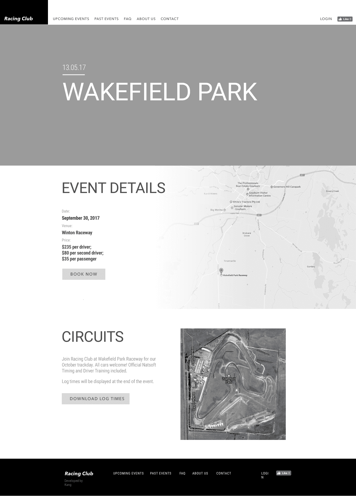
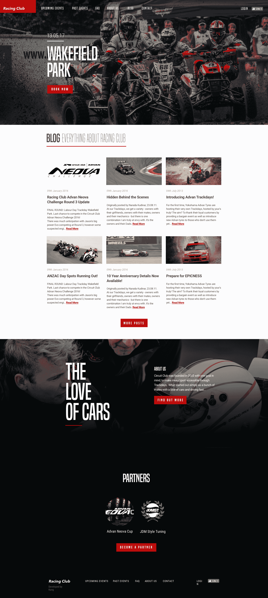

# 三、网站设计工作流

在我们真正开始挖掘创建和实施我们的第一个网站之前，我想让你经历从开始到发布的所有过程。 网页设计不仅仅是设计美观的网站和漂亮的布局; 网页设计是一个完整的过程，特别是当你想在现实世界中实现你的设计时。

在本章中，我们将涵盖以下内容:

*   *如何识别我们的目标*
*   范围定义:*列出范围*
*   *如何创建线框图*
*   设计:*框架创建伟大的设计*
*   实现、测试和发布

# 我们的情况

让我们想象自己是一名设计师，并接受客户的工作。 你的第一个项目是为一个赛马俱乐部设计一个网站; 以下是该项目的概要:

*赛车**俱乐部*是 2016 年成立的赛车爱好者俱乐部。 它一开始是一群热爱汽车的朋友，但很快就成长为一个热衷于分享他们的热情的社区。

现在，让我们来看看整个过程。

# 目标识别

在第一阶段，你需要确定网站的最终目标。 通过与客户沟通，询问他们有关业务和目标的问题。

# 这个网站的目的是什么?

这是确定需要解决的问题或为网站设定目标的恰当时机。 卖票还是增加门票销售? 看看你的客户想要什么，并找到最好的解决方案。 你也需要做自己的调查，深入他们的网站，并搜索任何需要解决的问题。 有了我们之前学过的所有基础知识，你现在就能知道什么是好的，什么是坏的。

# 这个网站是为谁建立的?

简化设计过程和决策的最好方法是了解你的目标用户。 有很多方法可以了解你的听众。 你可以询问客户，通过不同的分析来跟踪，或者查看之前关于同一市场的报告，这将在那个阶段对你有所帮助。

# 这对我们的用户有用吗?

你的客户应该了解他们客户的一些信息，比如他们的年龄、收入等。 利用这些信息来创建角色，并创建适合网站的用户流。 在我们的例子中，赛车俱乐部，我们将创建如下的角色:

*   乔治:38 岁，父亲，修车工人，热爱赛车
*   保罗:28 岁，单身，在金融行业工作，热爱赛车

这两个用户流的工作方式不同，您已经可以抑制任何与我们的目标用户无关的流。

# 他们期望在那里找到什么或者做什么?

定义网站的**信息架构**(**IA**)也是很重要的。 知道要向用户显示什么将有助于设置屏幕设计并规划用户体验。

你必须创建一个网站地图，并定义你需要做的每一个屏幕。 首先做这个会对你的网站设计有很大的帮助，因为你甚至不需要考虑它。

# 网站是否需要遵循一个品牌或有自己的品牌身份?

当你需要遵循品牌风格指南时，设计一个网站可能是不同的。 因为风格指南有助于保持品牌的一致性，客户会希望你遵循它，即使它会限制你的创意。

如果客户没有品牌标识，这是为他们创造一个品牌标识的好机会。

# 还有竞争者吗? 如果有，这个网站和其他网站有什么不同?

了解客户的竞争对手也是知道什么该做，什么不该做的好方法。 在你收集信息的过程中，你需要研究客户的竞争对手。 这不仅仅是做一些完全不同的事情，而是做对客户有益的事情。 如果你的竞争对手的一些用户体验很好，从他们那里汲取灵感，让你的客户的网站更好。 你通常不需要重新发明轮子，只需要改进它。

这是我们的项目。

我们需要一个网站与以下:

*   主页
*   即将来临的事件页面
*   过去的事件页面
*   活动页面详细信息(查看活动信息并可购买门票)
*   博客页面
*   关于我们页面
*   联系页面
*   登录页面(见购票历史)

网站需要有响应性，这样人们就可以通过手机访问它。 客户没有品牌标识，并愿意让我们创造一个。

网站的主要目标是首先向用户展示相关信息，然后，如果用户愿意，让他们可以在线购票，而不是去实体店。

下图是网站的网站地图:

Sitemap example

# 定义范围

这对于设计师来说通常是一个困难的部分:了解和定义项目的范围。 项目的持续时间通常比预期的要长，但这应该不是问题，因为这会导致更多的工作。 但是，有时候，客户的期望和你的期望是不一样的，所以最好设置界限，以防止意外的工作和范围蔓延。 把一切都写在合同里会对你有帮助。 下面是一些您可以使用的模板:[https://www.smashingmagazine.com/2013/04/legal-guide-contract-samples-for-designers/](https://www.smashingmagazine.com/2013/04/legal-guide-contract-samples-for-designers/)。

# 创建线框图

现在我们已经定义了项目的目标，我们可以开始设计一些线框图。

在这个项目示例中，我们将只做几个屏幕。 这是我们将用于主页、事件页面和即将到来的事件页面的线框。 线框图并不是用来打磨和设计的，它们只是为了了解布局和内容。 所以只要在你最喜欢的设计应用中使用简单的矩形，或者你甚至可以手工绘制它。

以下是我们的想法:

事件页面:

这是我们的活动页面:

# 设计

我总是在设计项目时使用相同的框架:

1.  获得灵感
2.  改善
3.  发明

让我来解释一下我每一步都做了些什么:

# 获得灵感

我真的认为灵感是设计创作的一个主要部分。 寻找和收集灵感对我来说是至关重要的，因为我需要这些灵感来通过一些我认为很酷或与这种类型的项目相关的设计来制作我自己的设计。

以下是一些我用来寻找灵感的网站:

*   Awwwards
*   CSSDesignawards
*   FWA
*   Dribbble
*   Behance 公司

然后我将使用*BukketApp*来抓取图片，并为这个特定的项目创建一个情绪板。

# 改善

一旦你有了你的情绪板，你可以开始调整和改进设计。 就像谜题一样，试着通过重新混合形状、颜色等等来组成。 这是最有趣和最有创意的部分，因为这取决于你的想象力和灵活性，你可以创造一些独特的和高质量的东西。

# 发明

当您最终从前面的步骤中获得一些内容时，您现在可以将该设计扩展为整个设计风格。

这个框架不仅可以应用于设计，而且可以应用于创意或研究过程的每一个方面。 看看生物研究，比如仿生学，它模仿自然的元素和一部分，以解决复杂的人类问题。 这个过程本质上是相同的，只是方式不同。

这是我们想出的最终设计:

主页设计:

# 实现、测试和发布

设计通过后，是时候通过实现网站来充实页面设计了。 这是一个非常有趣的阶段，因为你将使你的设计成为现实。 看到它并与之互动将会得到一些你在设计它时可能没有看到的有趣反馈。

一旦一切就绪，您将需要彻底测试每个页面，并确保每个链接都在工作。 这也是练习将您的站点放在登台网站上的好方法，在登台网站上，人们可以测试它，而无需将其启动到生产服务器。 在这个过程中，您总是会发现问题或错误。 测试将确保你的网站在每个浏览器和设备上都能完美运行。 这是一个漫长的过程，但必须这么做!

最后，每个人最喜欢的部分到来了:发布是你看到自己的作品最终发布的时候，你应该为此感到自豪。 但是，仅仅因为你建立了网站，并不意味着工作就结束了。 你仍然可以做一些 A/B 测试来让你的设计变得更好，并且不要忘记一个优秀的网站不只是关于美学，而是找到形式和功能之间的平衡。

这最后三个步骤是下一章的一部分，所以我们将一步一步地进行这个过程。

# 总结

在这一章中，我们经历了设计一个网站的整个过程。 了解整个过程将有助于你与客户和项目打交道。 许多人匆忙进入他们的项目设计，但在实际设计之前有许多步骤。 特别是当你在做大量的用户体验时，花些时间做一些研究将会为你节省大量的时间和金钱。

在下一章中，我们将研究响应式设计和适应性设计。 两者有着相似的最终目标，但却有很大的不同。 我们来看看怎么做!