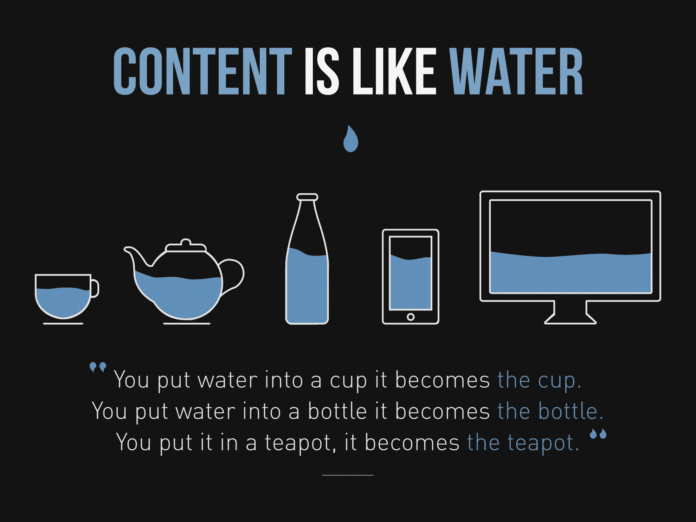
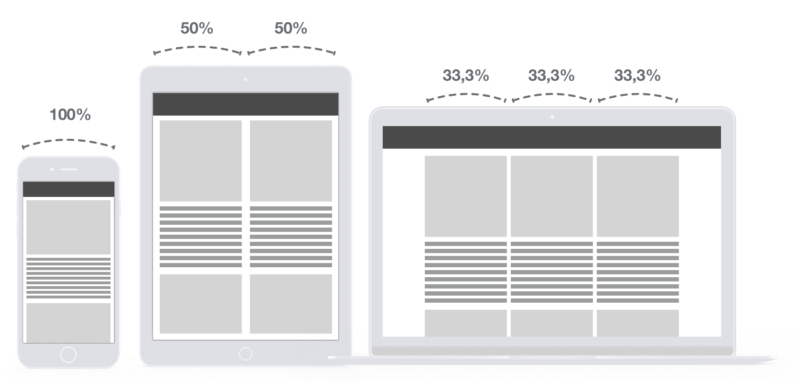
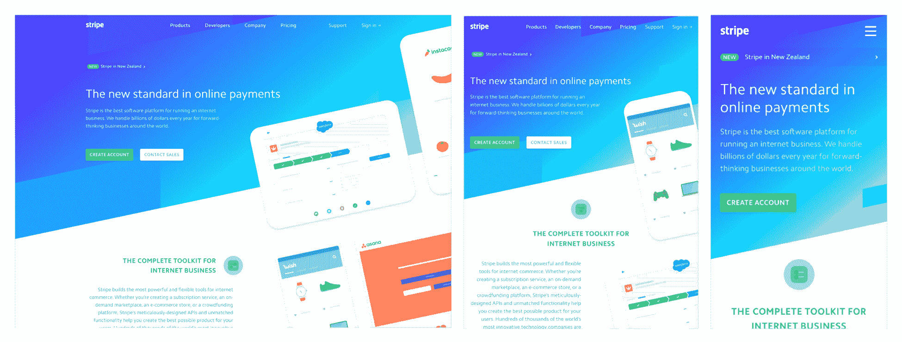
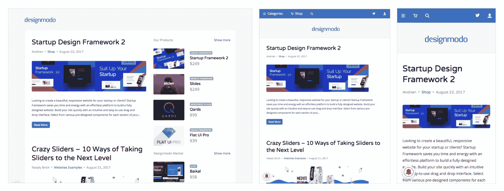
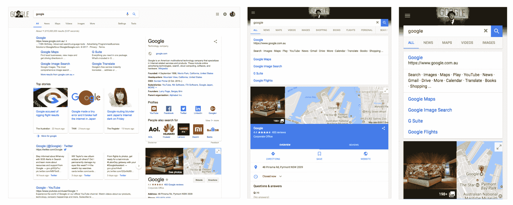

# 四、响应式设计与适应性设计

在开始设计我们的网站之前，让我们先了解响应式设计和适应性设计之间的区别，以及为什么需要理解它。 响应式和适应性设计方法的区别对于网页和应用设计师来说是非常重要的。 了解这些差异将使您能够以更好的愿景和结果规划和执行您的设计。

随着我们现在拥有的设备数量的增加，了解每个设备的需求和行为对于真正理解如何设计它是很重要的。 内容是关键，它需要在每个设备之间流动。 就像 Josh Clark 说的那样，在每个设备上进行水冷却:

"Content is like water. Content's going to take many forms, flow into many different containers, many of which we haven't even imagined yet." - (also inspired by Bruce Lee's famous quote)

Author/Copyright holder: Stéphanie Walter

设计师们仍然把这两者混淆在一起，并没有真正看到两者之间的界限，尤其是年轻的设计师。

在本章中，我们将学习:

*   响应设计
*   自适应设计
*   哪一个是最好的?
*   然后从中拿走

让我们开始吧!

# 响应设计

我们在[第一章](01.html)、*中简要讨论了响应式设计;* 如果你还记得的话，它描述了一种新的设计方式，适用于桌面，也适用于移动界面。 它基本上是建议使用相同的内容，但不同的布局设计在每个屏幕上。

更准确地说，响应式网站根据浏览器空间显示内容。 如果你在桌面打开一个响应式网站并改变浏览器窗口的大小，它会动态地适应窗口大小并自行安排。

响应式设计的概念最初是由 Ethan Marcotte 在他写了一篇关于响应式建筑设计概念的介绍性文章时提出的，即一个房间/空间会根据其中的人数自动调整。

“Recently, an emergent discipline called “Responsive architecture” has begun asking how physical spaces can respond to the presence of people passing through them. Through a combination of embedded robotics and tensile materials, architects are experimenting with art installations and wall structures that bend, flex, and expand as crowds approach them. Motion sensors can be paired with climate control systems to adjust a room's temperature and ambient lighting as it fills with people. Companies have already produced “smart-glass technology” that can automatically become opaque when a room's occupants reach a certain density threshold, giving them an additional layer of privacy.”

这个想法是在网页设计中有类似的行为。 与响应式架构一样，web 设计应该自动为用户调整。 最终的目标是在每个设备上都拥有无缝的体验，并且主要是在客户端使用 CSS(媒体查询)。

为了更容易理解，请看下面的图表:

在此图中，您可以看到每个设备上的行为。 桌面视图有三个列，占总宽度的 33.3%。 随着时间的推移，我们将这一数值提高到 50%，而在手机游戏中，这一数值最终将达到 100%。 其结果，如我们所见，是让内容扩展到适合每个窗口大小，所以无论用户使用什么设备，内容仍然是可读的。

所有的规则都是在 CSS 文件中制定的，因此 HTML 不会被修改。 这就是为什么 CSS 媒体查询非常强大的原因。

下面是一些好的响应式设计的例子:

Responsive Layout on Stripe.com

上面的截图来自*Stripe*网站，显示布局是完全流畅的，能够拉伸和适应各种屏幕分辨率:

Designmodo.com

上面的截图来自 Designmodo*网站，展示了非常干净清晰的响应式设计。 你可以看到，右边栏在平板电脑和手机视图中都消失了。*

The *Bloomberg* website

上面的截图显示的是彭博网站。 该网站以其响应良好的网格而闻名，并让用户专注于内容。

# 自适应设计

响应式设计通过不同设备的设计来创建通用的外观和感觉，而适应性设计则采用不同的方法。 适应性设计用于检测用户设备并将用户重定向到专为该分辨率设计的网站。

2011 年，Aaron Gustafson 在他的书《适应性网页设计:用渐进式增强打造丰富体验》中首次提出适应性设计，其主要区别在于在特定分辨率上拥有完全不同的网站。 调整浏览器的大小对设计没有影响。

Adaptive design 最好的例子是[Amazon.com](http://Amazon.com)，它在平板电脑和手机上展示了全新的网站布局:

Amazon Website in desktop, tablet and mobile.

如果你试图调整你的浏览器，你可以看到设计没有任何改变低于 999 像素。

A tool that you can use to test the Responsiveness or Adaptiveness of a website is the inspect tool of Google Chrome. You can just right-click and inspect any element to open the Developer Console and click the little icon, as shown in the following screenshot. You can then select any devices from the drop-down on the left.

Chrome Inspector with the Device toolbar

所以请记住，即使你调整了自适应网站的大小，它也不会在桌面上显示出来，而只能在相关设备上显示。

响应式设计在客户端使用 CSS 工作，而适应性设计则在服务器端工作。 这就是这两个概念之间的主要区别。

下面是一些其他的例子:

Opentable.com

上面的截图显示了*OpenTable*网站，其中有一个适用于 iPad 视图和 iPhone 视图的 Adaptive 网站。 有趣的是，看看它们是如何彻底改变移动视图的布局的:

Adidas.com

从上面的*阿迪达斯*网站截图可以看出，*阿迪达斯*在手机视图上有一个完全不同的网站([m.addas.com](http://m.adidas.com))，具有更加动态和用户友好的外观:

The last example will be Google.com

上面的截图显示了*谷歌*网站。 如果你没有注意到，[Google.com](http://Google.com)对于 iPad 和 iPhone 来说是一个适应性网站，令人惊讶，不是吗?

# 那么哪一个是最好的呢?

响应式设计当然更容易设计，也更容易实现。 这就是为什么它是目前为止创建和设计网站的首选方法。

然而，它将允许更少的控制每个屏幕的设计。 在简单的网站上，它看起来很简单，但在复杂的网站上，它往往是一个真正的头痛——不能在移动(广告)或视觉层次上工作的组件可能会变得不友好。 有时候响应式网站有一个*未完成*的感觉，元素的排列方式似乎只是适合屏幕，但不是为了最佳用户体验而设计的。 然而，还有另一种方法，即**移动优先**。 这基本上是在移动设备上开始设计，然后逐渐扩展到桌面。 但这仍然不能解决问题。

移动优先的另一个优势是速度。 研究表明，拥有自适应网站的公司在加载速度测试中通常比拥有响应式网站的公司表现得更好。 这是因为响应式网站通常使用相同的元素/资产从桌面到手机，而不是有一个特定的格式和大小的手机网站。 然而，如今，这个问题可以很容易地克服使用媒体查询，如果响应式网站是正确的实施:

| **度量(默认值)** | **适应性** | **响应式** |
| 响应 | 568 毫秒 | 1202 毫秒 |
| 文档完整 | 1536 毫秒 | 4086 毫秒 |
| 网页的响应 | 2889 毫秒 | 4860 毫秒 |
| 下载的字节数 | 2,474,326 kB | 4,229,362 kB |
| 下载对象 | 20 | 61 |

由 Catchpoint 进行的测试。 UXPin([https://www.uxpin.com/studio/blog/Responsive-vs-Adaptive-design-whats-best-choice-designers/](https://www.uxpin.com/studio/blog/responsive-vs-adaptive-design-whats-best-choice-designers/))。

适应性设计也有缺点。 首先，设计和实现自适应设计通常比设计和实现响应式设计要多得多。 管理和维护两个或多个不同的网站需要更多的基础设施和预算。

最后，虽然搜索引擎在识别`.com`和`m.com`站点方面做得越来越好，但明智的是，大多数搜索引擎仍然不会对多个 url 的相同内容进行同等的排名。

# 的外卖

响应式设计是设计跨设备的网站最流行的方法。 它更容易也更简单，但是，它可能在设计方面有限制。

| **优点** | **缺点** |
| 无缝的和统一的 | 更少的设计控制 |
| SEO friendly | 广告不能正常工作 |
| 更容易实现 | 加载时间要长一些 |

对于大型基础设施或复杂网站，适应性设计将被选择，以更好地控制设计和更好的跨设备用户体验。

| **优点** | **缺点** |
| 允许设计师建立一个更好的设计和用户体验 | 更多的工作在设计和实施网站 |
| 设计师可以优化设备上的广告 | 搜索引擎优化的挑战 |
| 加载速度更快 |  |

做事没有好方法或坏方法。 响应式设计和适应性设计只是易于理解的概念。 你甚至可以在一个网站中同时使用这两种设计，在个人电脑、笔记本电脑和平板电脑上使用响应式设计，在移动设备上使用适应性设计。 记住这一点:当设计网站时，必须始终考虑用户的需求。

# 总结

在本章中，我们看到了响应式设计和适应性设计之间的区别。 了解这些差异将有助于你实现你的网站。

既然我们已经学习了网页设计的基本原理，现在是时候去另一边建立你自己的网站了。 在下一章中，我们将学习 HTML 的基础知识以及如何从头开始构建 HTML 页面。 所以，让我们开始编写我们的第一个网站吧!