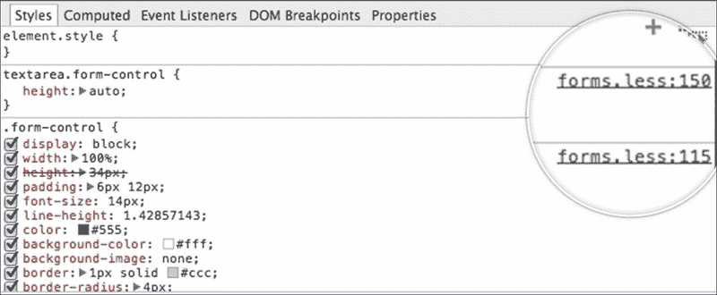
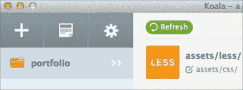
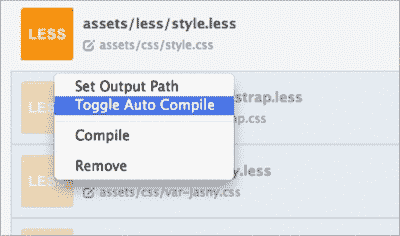
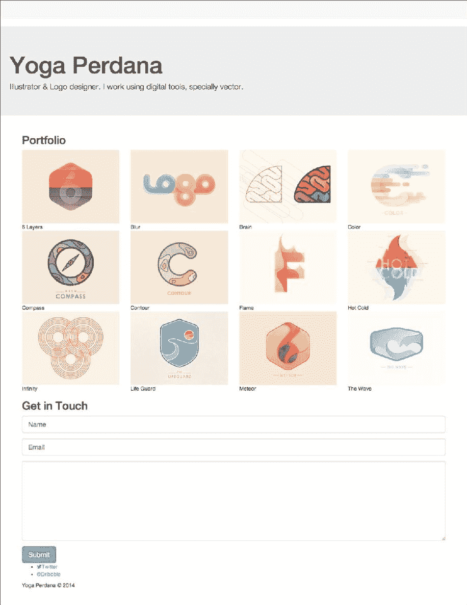
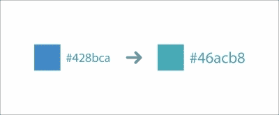
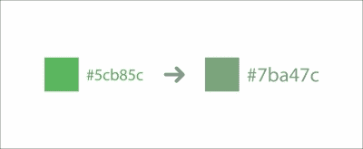
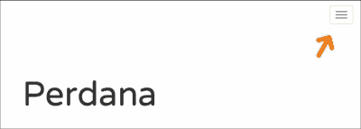
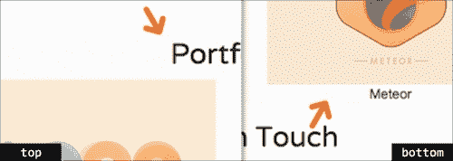
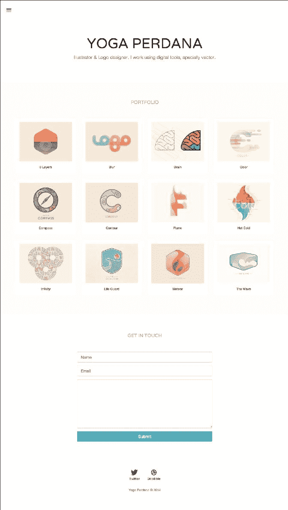
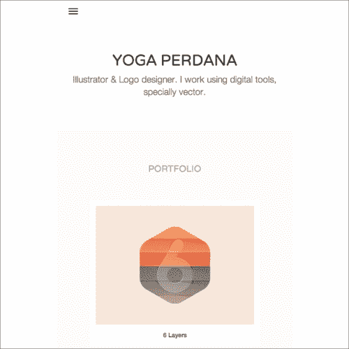

# 六、使用 LESS 打磨响应式投资组合网站

*在上一章中，我们使用 HTML5 和几个 Bootstrap drop-in 类构建了作品集网站结构。 你可能已经看到这个网站还没有装饰。 我们还没有组成自己的样式或将样式表链接到页面。 所以，本章的重点将放在网站装饰上。*

Bootstrap 主要使用 LESS 来生成组件的样式。 紧随其后，我们也将使用 LESS 风格的投资组合网站。 LESS 带来了许多特性，比如变量和 mixin，这将允许我们编写更精简、更有效的样式规则。 在一天结束的时候，你也会发现使用 LESS 定制和维护网站样式比使用纯 CSS 更容易。

*此外，我们还使用了一个名为 Jasny Bootstrap 的 Bootstrap 扩展来包括画布外的导航到作品集网站。 在这个阶段，画布外导航不会发生任何变化; 我们只设置 HTML 结构。 所以，在本章中，除了编译网站样式外，我们还将编译 Bootstrap 和 Jasny Bootstrap 的 JavaScript 库来实现 off-canvas 导航功能。*

在本章中，我们将讨论很多事情，包括以下主题:

*   学习基本的 LESS 语法，例如变量和 mixin
*   使用 LESS`@import`指令组织样式表引用
*   配置 Koala 将 LESS 编译为常规 CSS
*   查看源代码映射来调试 LESS
*   用 LESS 组合网站自定义样式
*   编译 JavaScript 来激活非画布导航

# 基本 LESS 语法

LESS([http://lesscss.org/](http://lesscss.org/))是 Alexis Sellier([http://cloudhead.io/](http://cloudhead.io/))开发的基于 javascript 的 CSS 预处理程序，也称为 CloudHead。 如前所述，Bootstrap 使用 LESS 来组合它的组件样式——尽管它最近才正式发布了 Sass 版本。 正如提到的，我们将遵循 Bootstrap 使用 LESS 来组成我们自己的样式规则和管理样式表。

简而言之，LESS 通过引入一些编程特性(如变量、函数和操作)来扩展 CSS。 CSS 是一种简单易懂的语言，从根本上来说非常容易学习。 然而，维护静态 CSS 实际上是详尽的，特别是当我们必须处理数千行样式规则和多个样式表时。 LESS 提供的功能，如变量、mixins、函数和操作(我们将很快看到)，将允许我们开发更容易维护和组织的样式规则。

## 变量

变量是 LESS 中最基本的特征。 与其他编程语言一样，LESS 中的变量用于存储一个常量或一个值，以便以后在整个样式表中无限制地重用。 在 LESS 中，变量用`@`号声明，后面跟着变量名。 变量名可以是数字和字母的组合。 在下面的例子中，我们将创建几个 LESS 变量来存储一些十六进制格式的颜色，并在随后的样式规则中分配它们来传递颜色，如下面的代码所示:

```html
@primaryColor: #234fb4;
@secondaryColor: #ffb400;
a {
  color: @primaryColor;
}
button {
  background-color: @secondaryColor;
}
```

使用 LESS 编译器，例如 Koala，上述代码将被编译成静态 CSS，如下所示:

```html
a {
  color: #234fb4;
}
button {
  background-color: #ffb400;
}
```

使用变量不仅限于存储颜色，就像我们刚才演示的那样。 我们可以将变量用于任何类型的值，例如:

```html
@smallRadius: 3px;
```

使用变量的一个优点是，如果必须进行更改，则只需要更改变量内的值。 我们所做的更改将在样式表中该变量的每次出现时发生。 这当然节省了时间。 扫描样式表并单独更改，或者使用**搜索**和**替换代码编辑器的**特性，如果不仔细执行，可能会导致意外的更改。

### 注意事项

你会经常发现术语*compile*和*compiler*。 这里的编译意味着我们将 LESS 转换成可以在浏览器中呈现的标准 CSS 格式。 编译器就是这样做的工具。 在本例中，我们使用的工具是考拉。

## 嵌套样式规则

LESS 让我们将风格规则嵌套在彼此之中。 传统上，对于普通 CSS，当我们想要将样式规则应用到元素上时，比如，在一个`<nav>`元素下，我们可以按照以下方式组成样式规则:

```html
nav {
  background-color: #000;
  width: 100%;
}
nav ul {
  padding: 0;
  margin: 0;
}
nav li {
  display: inline;
}
```

正如我们从前面的例子中看到的，每当我们将样式应用到嵌套在`<nav>`元素下的特定元素时，我们都会重复`nav`选择器。 通过使用 LESS，我们能够消除这种重复，并通过嵌套样式规则来简化它，如下所示:

```html
nav {
  background-color: #000;
  width: 100%;
  ul {
    padding: 0;
    margin: 0;
  }
  li {
    display: inline;
  }
}
```

最终，前面的样式规则将返回相同的结果——只是这次我们更有效地编写了样式规则。

## Mixins

mixin 是 LESS 中最强大的特性之一。 Mixins 简化了样式规则的声明，允许我们创建一组 CSS 属性，这些属性可以包含在样式表中的其他样式规则中。 让我们看看下面的代码片段:

```html
.links {
  -webkit-border-radius: 3px;
  -mox-border-radius: 3px;
  border-radius: 3px;
  text-decoration: none;
  font-weight: bold;
}
.box {
-webkit-border-radius: 3px;
  -moz-border-radius: 3px;
  border-radius: 3px;
  position: absolute;
  top: 0;
  left: 0;
}
.button {
  -webkit-border-radius: 3px;
  -mox-border-radius: 3px;
  border-radius: 3px;
}
```

在前面的示例中，我们用三个不同风格的规则声明了`border-radius`以及厂商前缀，以覆盖基于 Firefox 和 webkit 的浏览器的早期版本。 在 LESS 中，我们可以通过创建 mixin 来简化`border-radius`声明。 LESS 中的 mixin 只是用类选择器指定的。 考虑到前面的例子，让我们创建一个名为`.border-radius`的 mixin 来包含`border-radius`属性，如下所示:

```html
.border-radius {
  -webkit-border-radius: 3px;
  -moz-border-radius: 3px;
  border-radius: 3px;
}
```

然后，我们将包含`.border-radius`到后续的样式规则中，将包含的属性传递给它们，如下所示:

```html
.links {
  .border-radius;
  text-decoration: none;
  font-weight: bold;
}
.box {
  .border-radius;
  position: absolute;
  top: 0;
  left: 0;
}
.button {
  .border-radius;
}
```

当编译为静态 CSS 时，这段代码将产生与本节第一个代码片段完全相同的输出。

### 参数混合

此外，我们还可以将 mixins 扩展为所谓的**参数 mixins**。 这个特性允许我们添加参数或变量，并将 mixin 变成可配置的。 让我们举与前一节相同的例子。 但是，这一次，我们将不分配一个固定的值; 相反，我们用一个变量替换它，如下所示:

```html
 .border-radius(@radius) {
  -webkit-border-radius: @radius;
  -moz-border-radius: @radius;
  border-radius: @radius;
}
```

现在，我们可以将这个 mixin 插入到其他样式规则中，并为每个规则赋值:

```html
a {
  .border-radius(3px);
  text-decoration: none;
  font-weight: bold;
}
div {
  .border-radius(10px);
  position: absolute;
  top: 0;
  left: 0;
}
button {
  .border-radius(12px);
}
```

当我们将编译为常规 CSS 时，每个样式规则都应用，并使用不同的`border-radius`值，如下所示:

```html
a {
  -webkit-border-radius: 3px;
  -moz-border-radius: 3px;
  border-radius: 3px;
  text-decoration: none;
  font-weight: bold;
}
div {
  -webkit-border-radius: 10px;
  -moz-border-radius: 10px;
  border-radius: 10px;
  position: absolute;
  top: 0;
  left: 0;
}
button {
  -webkit-border-radius: 12px;
  -moz-border-radius: 12px;
  border-radius: 12px;
}
```

#### 在参数混合中指定一个默认值

此外，我们可以在参数混合中指定一个默认值，这将在没有传递参数的情况下非常有用。 当我们在 mixin 中设置一个参数时，就像我们在前面的例子中所做的那样，LESS 将把这个参数作为一个需求。 如果不传入参数，LESS 将返回一个错误。 因此，让我们采用前面的例子，并使用默认值`5px`对其进行扩展，如下所示:

```html
.border-radius(@radius: 5px) {
  -webkit-border-radius: @radius;
  -moz-border-radius: @radius;
  border-radius: @radius;
}
```

前面的参数 mixin 将默认返回`5px`的边界半径。 如果在括号中传递自定义值，默认值将被覆盖。

### 使用扩展语法合并 mixins

扩展语法是 LESS 中期待已久的特性。 LESS mixin 的一个主要问题是它简单地复制了 mixin 的 CSS 属性，从而产生重复的代码。 同样，如果我们处理的是一个有上千行代码的大型网站，重复代码的数量会使样式表的大小变得不必要的大。

在 Version 1.4 中，LESS 引入了扩展语法。 扩展语法的形式类似于 CSS 伪类`:extend`。 扩展语法将继承包含 mixin 的属性集的 CSS 选择器分组。 比较下面两个例子。

首先，我们包含了一个没有`:extend`语法的 mixin:

```html
.border-radius {
  -webkit-border-radius: 3px;
  -moz-border-radius: 3px;
  border-radius: 3px;
}
.box {
  .border-radius;
  position: absolute;
  top: 0;
  left: 0;
}
.button {
  .border-radius;
}
```

前面的 LESS 代码很短，但当它被编译成 CSS 时，代码扩展到大约 17 行，因为`border-radius`属性在每个样式规则中重复或简单复制，如下所示:

```html
.border-radius {
  -webkit-border-radius: 3px;
  -moz-border-radius: 3px;
  border-radius: 3px;
}
.box {
  -webkit-border-radius: 3px;
  -moz-border-radius: 3px;
  border-radius: 3px;
  position: absolute;
  top: 0;
  left: 0;
}
.button {
  -webkit-border-radius: 3px;
  -moz-border-radius: 3px;
  border-radius: 3px;
}
```

在这个第二个例子中，我们将把:`extend`语法放到实践中，放到同一个 mixin 中:

```html
.border-radius {
  -webkit-border-radius: 3px;
  -moz-border-radius: 3px;
  border-radius: 3px;
}
.box {
  &:extend(.border-radius);
  position: absolute;
  top: 0;
  left: 0;
}
.button {
  &:extend(.border-radius);
}
```

下面是代码如何转换成纯 CSS; 它甚至比最初未编译的 LESS 代码还要短。

```html
.border-radius,
.box
.button {
  -webkit-border-radius: 3px;
  -moz-border-radius: 3px;
  border-radius: 3px;
}
.box {
  position: absolute;
  top: 0;
  left: 0;
} 
```

## 用数学运算产生值

我们还可以执行与 less 类的加减除和乘法运算。 操作对于确定长度非常有用，比如元素的宽度和高度。 在下面的例子中，我们将计算适当的方框宽度，方法是用填充减去方框宽度，这样方框就可以放入父容器中。

首先，我们将用`@padding`变量定义填充变量:

```html
@padding: 10px;
```

然后，我们指定框的宽度，并用`@padding`变量减去它:

```html
.box {
  padding: @padding;
  width: 500px – (@padding * 2);
}
```

请记住，填充取盒子的两个侧面，无论是右和左，还是上和下，这就是为什么我们在宽度属性中乘以 2`@padding`。 最后，当我们将 LESS 操作编译到常规 CSS 中时，代码如下所示:

```html
.box {
  padding: 10px;
  width: 480px;
}
```

在其他情况下，我们可以对高度属性做同样的处理，如下所示:

```html
.box {
  padding: @padding;
  width: 500px – (@padding * 2);
  height: 500px – (@padding * 2);
}
```

## 用数学运算和 LESS 函数生成颜色

不管你信不信，在 LESS 中，我们可以用数学运算来改变颜色。 就像调色一样，只不过我们是用加减除法，再加上乘法来调色。 例如:

```html
.selector {
  color: #aaa + 2;
}
```

编译后，颜色变成如下:

```html
.selector {
  color: #acacac;
}
```

此外，LESS 还提供了一些功能，允许我们在一定程度上将颜色变深或变浅。 下面的示例将使`@color`变量中的颜色变亮`50%`。

```html
@color: #FF0000;
.selector {
  color: lighten(@color, 50%);
}
```

或者，为了使颜色变暗，使用`darken()`功能，如下所示:

```html
@color: #FF0000;
.selector {
  color: darken(@color, 50%);
}
```

### 注意事项

LESS 的官方网站([http://lesscss.org/functions/#color-operations](http://lesscss.org/functions/#color-operations))下面有一个完整的 LESS 颜色功能的列表。

## 参考导入

这是我在 LESS 中最喜欢的功能之一。 参考导入，顾名思义，允许我们导入一个外部样式表仅仅作为参考。 在此特性出现之前，用`@import`指令导入的样式表中的所有样式规则都将被附加，这通常是不必要的。

从 1.5 版开始，LESS 引入了将`@import`标记为引用的`(reference)`选项，从而防止附加外部样式规则。 在`@import`后加上`(reference)`标记，如下所示:

```html
@import (reference) 'partial.less'; 
```

### 在导入语句中使用变量

LESS 使用遇到的一个约束是在`@import`指令([https://github.com/less/less.js/issues/410](https://github.com/less/less.js/issues/410))中使用变量时。 它是在 LESS 中呈现的最受欢迎的特性之一，并最终在 LESS 1.4 中得到解决。 现在我们可以在`@import`语句中声明一个变量，例如，`@{variable-name}`用花括号命名变量。

与`@import`一起使用变量将允许我们通过变量定义一次样式表路径。 然后，使用变量调用路径，如下所示:

```html
@path: 'path/folder/less/';
@import '@{path}mixins.less';
@import '@{path}normalize.less';
@import '@{path}print.less';
```

与每次导入新样式表时都必须添加完整路径相比，这种方法明显更整洁、更高效，如下所示:

```html
@import 'path/folder/less/mixins.less';
@import 'path/folder/less/normalize.less';
@import 'path/folder/less/print.less';
```

### 注意事项

参考 LESS 官方网站([http://lesscss.org/features/#import-directives-feature](http://lesscss.org/features/#import-directives-feature))的**Import Directive**部分的，以获得关于使用 LESS 导入外部样式表的进一步帮助。

## 使用源映射来简化样式调试

虽然像 LESS 一样的 CSS 预处理器允许我们更高效地编写样式规则，但浏览器仍然只能读取普通的 CSS，这将导致一个新的问题，尤其是在调试样式表中的问题时。

由于浏览器引用的是生成的 CSS 而不是源文件(LESS)，我们可能不知道在源文件中具体声明了哪些行。 源映射通过将生成的 CSS 映射回源文件来解决这个问题。 在支持源映射的浏览器中，您将发现浏览器直接引用源文件。 在 LESS 的情况下，浏览器会参考`.less`样式表，如下截图所示:



在这个项目中，我们将生成生成的 CSS 的源映射。 因此，如果我们遇到 bug，解决它就容易得多。 我们可以立即准确地找出样式规则所在的位置。

### 注意事项

请转到以获得关于源地图的更多信息:

*   通过谷歌([https://developer.chrome.com/devtools/docs/css-preprocessors](https://developer.chrome.com/devtools/docs/css-preprocessors))处理与 CSS 预处理
*   源图简介([http://blog.teamtreehouse.com/introduction-source-maps](http://blog.teamtreehouse.com/introduction-source-maps))
*   使用 LESS 源映射([http://roots.io/using-less-source-maps/](http://roots.io/using-less-source-maps/))

## 多就少

LESS 拥有大量的功能，并且在未来几年只会随着更多的添加而增长。 在本模块中一次性包含并讨论它们是不切实际的。 所以，以下是一些参考文献，以深入挖掘:

*   LESS 的官方网站([http://lesscss.org/](http://lesscss.org/)); 是了解 LESS 最新信息的最佳来源
*   *LESS Web Development Essentials*，*Bass Jobsen*，*Packt Publishing*([https://www.packtpub.com/web-development/less-web-development-essentials](https://www.packtpub.com/web-development/less-web-development-essentials))
*   即时 LESS CSS 预处理器([https://www.packtpub.com/web-development/instant-less-css-preprocessor-how-instant](https://www.packtpub.com/web-development/instant-less-css-preprocessor-how-instant))

# 外部样式表引用

在上一节中，我们浏览了 LESS 中大量的基本语法。 现在,我们将开始用更少的工作,说到这里,之前我们能够编写自己的样式规则以及重用变量,mixin,和函数引导和出运 Jasny 引导计划,我们将不得不将它们导入到自己的样式表与少`@import`指令。

# 行动时间-创建样式表和组织外部样式表引用

执行以下步骤来管理样式表引用:

1.  转到项目目录并在`assets/less`目录中创建一个名为`var-bootstrap.less`的新样式表。 此样式表包含 Bootstrap 预定义变量的副本。 这个副本将允许我们在不影响初始规范的情况下自定义变量。
2.  Hence, copy the Bootstrap variables in the `variables.less` style sheet of the `/bootstrap/less` directory. Paste the complete variables into `var-bootstrap.less` that we only created in step 1.

    ### 提示

    为了您的方便，您也可以直接从 Github 存储库([http://git.io/7LmzGA](http://git.io/7LmzGA))复制 Bootstrap 变量。

3.  创建一个名为`var-jasny.less`的新样式表。 与`var-bootstrap.less`类似，该样式表将包含 Jasny Bootstrap 变量的副本。
4.  Obtain the Jasny Bootstrap variables in `variables.less` of the `jasny-bootstrap/less` directory. Paste all the variables in the `var-jasny.less` style sheet we just created in step 3.

    ### 提示

    或者，直接从 Jasny Bootstrap 存储库([http://git.io/SK1ccg](http://git.io/SK1ccg))复制变量。

5.  创建一个名为`frameworks.less`的新样式表。
6.  我们将使用这个样式表来导入位于`bower_component`文件夹中的 Bootstrap 和 Jasny Bootstrap 样式表。
7.  在`frameworks.less`中，创建一个名为`@path-bootstrap`的变量来定义路径，指向名为`less`的文件夹，Bootstrap 的所有 LESS 样式表都位于此文件夹中:

    ```html
    @path-bootstrap: '../../bower_components/bootstrap/less/';
    ```

8.  类似地，创建一个变量来定义路径，指向 Jasny Bootstrap`less`文件夹，如下所示:
9.  也创建一个定义离子路径:

    ```html
    @path-ionicons: '../../bower_components/ionicons-less/less/';
    ```

10.  使用以下代码导入包含变量的样式表:

    ```html
    @import 'var-bootstrap.less';
    @import 'var-jasny.less';
    ```

11.  Import the Bootstrap and Jasny Bootstrap style sheets, which are only required to build the portfolio website. Specify the paths using the variables we created in steps 6 to 8, as follows:

    ```html
    // Mixins
    @import '@{path-bootstrap}mixins.less';

    // Reset
    @import '@{path-bootstrap}normalize.less';
    @import '@{path-bootstrap}print.less';

    // Core CSS
    @import '@{path-bootstrap}scaffolding.less';
    @import '@{path-bootstrap}type.less';
    @import '@{path-bootstrap}grid.less';
    @import '@{path-bootstrap}forms.less';
    @import '@{path-bootstrap}buttons.less';

    // Icons 
    @import '@{path-ionicons}ionicons.less';

    // Components
    @import '@{path-bootstrap}navs.less';
    @import '@{path-bootstrap}navbar.less';
    @import '@{path-bootstrap}jumbotron.less';

    // Offcanvas
    @import "@{path-jasny}navmenu.less";
    @import "@{path-jasny}offcanvas.less";

    // Utility classes
    @import '@{path-bootstrap}utilities.less';
    @import '@{path-bootstrap}responsive-utilities.less';
    ```

    ### 提示

    你也可以从 Gist([http://git.io/WpBVAA](http://git.io/WpBVAA))复制前面的代码。

    ### 注意事项

    为了最小化多余的样式规则，这些规则对于网站来说确实是不需要的，我们从`frameworks.less`中排除了一些 Bootstrap 和 Jasny Bootstrap 样式表，正如你之前看到的。

12.  创建一个名为`style.less`的新样式表。 在这个样式表中，我们将组成我们自己的样式规则。
13.  在`style.less`:

    ```html
    @path-bootstrap: '../../bower_components/bootstrap/less/'; 
    @import 'var-bootstrap.less';
    @import 'var-jasny.less'; 
    @import (reference) '@{path-bootstrap}mixins.less';
    ```

    中导入 Bootstrap 变量和 mixins

## *刚才发生了什么?*

总之，我们只是创建了样式表并将它们按顺序排列。 首先，我们创建了两个名为`var-bootstrap.less`和`var-jasny.less`的样式表来存储 Bootstrap 和 Jasny Bootstrap 变量。 如前所述，我们制作这些副本是为了避免直接更改原件。 我们还创建了一个名为`frameworks.less`的样式表，其中包含对 Bootstrap 和 Jasny Bootstrap 样式表的引用。

最后，我们创建了名为`style.less`的网站主样式表，并导入了变量和 mixins，以便它们可以在`style.less`中重用。

## 有一个英雄的名字，并组织样式表

在前面的步骤中，我们根据我的个人偏好组织和命名文件夹以及文件。 即便如此，您也不必完全遵循命名约定。 用你自己的方式组织和命名它们。

### 注意事项

需要注意的最重要的一点是，`@import`语句引用的是正确的文件名。

以下是一些想法:

*   将`var-bootstrap.less`重命名为`vars.less`。
*   或者，创建一个新的文件夹名称`vars`或`configs`，将`var-bootstrap.less`和`var-jasny.less`样式表放在其中。
*   您知道吗?您还可以导入 LESS 样式表而不声明`.less`扩展名。 为了简单起见，您可以省略扩展，例如:

## 突击测验-以下哪个选项不是 LESS Import 选项?

Q1。 在本章的某一节中，我们讨论了`(reference)`，它导入但只将外部 LESS 样式表作为参考。 除了`(reference)`，LESS 还提供了更多导入样式表的选项。 那么，下面哪个选项不是 LESS 导入选项?

1.  `(less)`
2.  `(css)`
3.  `(multiple)`
4.  `(once)`
5.  `(default)`

Q2。 如何在`@import`语句中使用变量?

1.  `@import '@{variable}style.less';`
2.  `@import '@[variable]style.less';`
3.  `@import '@(variable)style.less';`

# 与考拉合作

HTML 和样式表已经准备好了。 现在是时候把它们放在一起，形成一个坚实的组合网站。 我们将使用 LESS 语法组成网站样式。 在这里，我们也将使用考拉作为第一个项目。 这一次，我们将把 LESS 编译成纯 CSS。

# 行动的时间-编译 LESS 到 CSS 使用考拉

使用考拉将 LESS 编译为 CSS，执行以下步骤:

1.  Add the project directory in the Koala sidebar, as follows:

    

2.  Select all the style sheets except `frameworks.less` and `style.less`. Right-click and select **Toggle Auto Compile**. Have a look at the following screenshot:

    

    这将关闭所选样式表上的**Auto Compile**选项，并防止考拉无意中编译这些样式表。

3.  On the other hand, ensure that **Auto Compile** is checked for the two remaining style sheets, `frameworks.less` and `style.less`:

    

4.  Make sure that the `frameworks.less` and `style.less` output is set to `/assets/css` directory, as shown in the following screenshot:

    

5.  Check the **Source Map** option for both style sheets to generate the source map files, which will help us when debugging:

    

6.  Select the output styles for the two style sheets, `frameworks.less` and `style.less`, to **compress**:

    

    这个选项将生成一个小型 CSS 样式表，因为样式表中的代码将被压缩为一行。 因此，样式表将更快地加载到浏览器中，并且还节省了用户端的带宽消耗。

7.  Select `frameworks.less` and click on the **Compile** button to compile it into CSS:

    

8.  对`style.less`执行同样的操作。 选择它，点击**Compile**按钮，将其编译为 CSS。 在代码编辑器中打开`index.html`，并链接`<head>`内的两个样式表，如下所示:

## *刚才发生了什么?*

在前面的步骤中，我们编译了网站的主要样式表`frameworks.less`和`style.less`，从 LESS 到 CSS。 您现在应该在`assets/css/`目录中拥有它们以及源映射。 代码经过压缩，文件大小相对较小，如下图所示:


样式表的大小相对较小。 如图所示，frameworks.css 是 92 kb，而 style.css 只有 2 kb

此外，我们还在`index.html`中链接了这些 CSS 样式表。 然而，由于我们还没有编写自己的风格，网站装饰与默认的 Bootstrap 风格，如下截图所示:



# 用 LESS 润色作品集网站

这是你可能正在等待的部分，用来设计作品集网站。 这显然是一个愉快的体验，看到网站开始有形状，颜色和外观。 在本节中，我们将自定义默认样式，并使用 LESS 语法组成我们的样式规则，我们在本章前面已经介绍过了。

# 行动时间-用较少的语法组合网站风格

执行以下步骤来设计网站:

1.  从谷歌 font 中添加一个新的字体家族。 这里，我选择了 Varela Round([http://www.google.com/fonts/specimen/Varela+Round](http://www.google.com/fonts/specimen/Varela+Round))。 在任何其他样式表之前放置以下谷歌字体链接:
2.  We will customize the default styles by changing some variables. Open `var-bootstrap.less` in Sublime Text. First, we change the `@brand-primary` variable that defines the Bootstrap primary color; change it from `#428bca` to `#46acb8`:

    

3.  Also, change the color in the `@brand-success` variable from `#5cb85c` to `#7ba47c`:

    

4.  将变量`@headings-font-family`从`inherit`改为`"Varela Round"`，如下所示:

    ```html
    @headings-font-family: "Varela Round", @font-family-sans-serif; 
    ```

5.  The Bootstrap default style shows a glowing effect when the user focusses on a form field. The color of this effect is specified in `@input-border-focus`. Change the color from `#66afe9` to `#89c6cb`:

    

6.  In the top section of the website, you can see that the navbar still has the Bootstrap default style with the gray background and border color, as shown in the following screenshot:

    

7.  这两种颜色分别在`@navbar-default-bg`和`@navbar-default-border`中指定。 将这两个变量值都更改为透明，如下所示:
8.  类似地，Jumbotron 区域的默认样式设置为灰色背景色。 要删除此颜色，将变量`@jumbotron-bg`设置为`transparent`，如下所示:
9.  稍后我们将返回编辑更多的 Bootstrap 变量。 与此同时，让我们编写自己的风格规则。 首先，我们将显示导航栏切换按钮，该按钮被 Bootstrap 默认样式隐藏。 在我们的例子中，这个按钮将用于滑动非画布导航。 让我们使用以下样式规则强制该按钮可见:

    ```html
    .portfolio-topbar {
      .navbar-toggle {
        display: block;
      }
    }
    ```

10.  As you can see from the following screenshot, the toggle button with the so-called hamburger icon ([http://gizmodo.com/who-designed-the-iconic-hamburger-icon-1555438787](http://gizmodo.com/who-designed-the-iconic-hamburger-icon-1555438787)) is now visible:

    

11.  目前该按钮位于右侧。 参考网站蓝图，左边应该是。 添加`float:left`将其置于左侧，添加`margin-left:15px`在按钮左侧添加少许空白，如下所示:
12.  在这里，我想定制切换按钮的默认样式，这也是通过`var-bootstrap.less`中的几个变量指定的。 因此，在 Sublime Text 中打开`var-bootstrap.less`。
13.  首先，我们将通过将变量`@navbar-default-toggle-border-color`的值从`#ddd`更改为`transparent`来移除按钮边框，如下所示:
14.  我们还将删除当鼠标悬停在按钮上时出现的灰色背景颜色。 通过将变量`@navbar-default-toggle-hover-bg`从`#ddd`更改为`transparent`来移除灰色背景色，如下所示:
15.  我想让汉堡图标看起来更大胆、更强大。 因此，在这里，我们想要将颜色更改为黑色。 将`@navbar-default-toggle-icon-bar-bg`的值从`#888`更改为`#000`:

    ```html
     @navbar-default-toggle-icon-bar-bg: #000;
    ```

16.  在这个阶段，网站内容对齐到左边，这是浏览器对任何内容的默认对齐方式。 按照网站蓝图，网站内容应该居中。 使用`text-align: center`，如下图，将内容对齐到中心:

    ```html
    .portfolio-about,
    .portfolio-display,
    .portfolio-contact,
    .portfolio-footer {
      text-align: center;
    }
    ```

17.  添加以下内容将网站名称改为全大写(全部大写字母)，使其更大更粗体:

    ```html
    .portfolio-about {
      .portfolio-name {
        text-transform: uppercase;
      }
    }
    ```

18.  另一方面，通过指定文本颜色为灰色，使标语行更微妙。 在这里，我们可以简单地使用 Bootstrap 预定义的变量`@gray-light`来应用灰色，如下所示:
19.  在 portfolio 部分，指定背景颜色为灰色，它比`@gray-lighter`变量中的颜色浅。 添加背景颜色的目的是为了强调作品集部分。
20.  In this project, we opt to use the LESS `darken()` function to slightly darken the white color, as follows:

    ```html
    .portfolio-display {
      background-color: darken(#fff, 1%);
    }
    ```

    ### 注意事项

    背景色也可以通过使用 LESS`lighten()`函数作为`background-color: lighten(#000, 99%);`将黑色调亮 99%来实现。

21.  At this stage, if we take a look at the portfolio section, it seems there are merely little spaces at the top and the bottom, as pointed out in the following screenshot:

    

22.  添加`padding-top`、`padding-bottom`，让作品集顶部和底部有更多的呼吸空间，如下:

    ```html
    .portfolio-display {
      background-color: darken(#fff, 1%);
    padding-top: 60px;
     padding-bottom: 60px;
    }
    ```

23.  综上所述，我们在网站中添加了两个标题，其中一个在作品集部分，以显式地显示部分名称。 这些标题将共享相同的风格规则。 因此，在这种情况下，我们最好创建一个 mixin 来专门定义标题样式。
24.  定义 mixin 以及 CSS 属性来应用标题样式，如下所示:
25.  为部分标题添加以下样式规则，这将使其看起来更微妙，并与 portfolio 部分的背景颜色一致:

    ```html
    .portfolio-display {
    ...
      h2 {
        &:extend(.heading);
      }
    }
    ```

26.  As shown in the following screenshot, there is only very little space in between each row; the rows are too close to each other, as follows:

    

    因此，为每个作品集项目指定`margin-bottom`，留出更多空间，如下所示:

    ```html
    .portfolio-item {
      margin-bottom: 30px;
    }
    ```

27.  为作品集图片添加样式，如下:

    ```html
    .portfolio-image {
      padding: 15px;
      background-color: #fff;
    margin-right: auto;
    margin-left: auto;
    }
    ```

28.  另外，为标题添加样式，如下:
29.  当我们将鼠标悬停在作品集图片上时，你认为显示过渡效果怎么样? 那看起来会很漂亮，不是吗? 在这种情况下，我想显示一个阴影周围的组合图像悬停。
30.  使用 Bootstrap 预定义的 mixins`.transition()`和`.box-shadow()`添加效果，如下:
31.  在 portfolio 部分的下面，我们有网站联系表单，它已经应用了 Bootstrap 默认样式。 所以，让我们用自己的样式规则来定制它。
32.  首先，我们将使用`padding`在联系人表单部分的顶部和底部添加更多的空格。
33.  使用我们在第 18 步中创建的`.heading`mixin 为标题添加样式:

    ```html
    .portfolio-contact {
    ...
     h2 {
     &:extend(.heading);
     }
    } 
    ```

34.  表单目前完全跨容器。 因此，添加以下样式规则来设置最大宽度，但仍然将窗体显示在容器的中间，如下所示:
35.  在中添加以下样式规则，使表单元素`<input>`，`<textarea>`，`<button>`看起来更平整。 这些样式规则删除阴影和降低边界半径。 看看下面的代码:

    ```html
    .portfolio-contact {
    ...
      .form {
        width: 100%;
        max-width: 600px;
        margin-right: auto;
        margin-left: auto;
     input, textarea, button {
     box-shadow: none;
     border-radius: @border-radius-small;
     }
      }
    }
    ```

36.  添加下面的线条来样式按钮，并使其具有过渡效果，如下所示:
37.  从这一步开始，我们将为页脚(网站的最后一部分)添加样式规则。 页脚包含社交媒体链接，Dribbble 和 Twitter，以及在最底部的版权声明。
38.  首先，像前面的部分一样，我们在部分的顶部和底部用填充符放置更多的空白:

    ```html
    .portfolio-footer {
      padding-top: 60px;
      padding-bottom: 60px;
    }
    ```

39.  然后我们用`margin-bottom`:

    ```html
    .portfolio-footer {
      padding-top: 60px;
      padding-bottom: 60px;
    .social {
        margin-bottom: 30px;
    }
    } 
    ```

    在社会化媒体链接和版权声明之间放更多的空格
40.  添加以下几行来删除来自默认浏览器样式的`<ul>`元素`padding`:
41.  在以下代码中中的中添加高亮显示的行，以显示社交媒体链接:

    ```html
    .portfolio-footer {
    ...
      .social {
        margin-bottom: 30px;
        ul {
          padding-left: 0;
        }
     li {
     list-style: none;
     display: inline-block;
     margin: 0 15px;
     }
      }
    }
    ```

42.  Give the social media links the color of their respective social media brands, as follows:

    ```html
    .portfolio-footer {
    ...
      .social {
        ...
     a {
     font-weight: 600;
     color: @gray;
     text-decoration: none;
     .transition(color 500ms);
     &:before {
     display: block;
     font-size: 32px;
     margin-bottom: 5px;
     }
     }
     .twitter a:hover {
     color: #55acee;
     }
     .dribbble a:hover {
     color: #ea4c89;
     }
      }
    } 
    ```

    ### 提示

    在 BrandColors 中获取更多热门网站的颜色([http://brandcolors.net/](http://brandcolors.net/))。

43.  最后，用灰色使版权声明色彩更加微妙:

    ```html
    .portfolio-footer {
    ...
     .copyright {
     color: @gray-light;
     }
    }
    ```

## *刚才发生了什么?*

在前面的步骤中，我们只是通过定制一些 Bootstrap 变量以及组合我们自己的样式规则来设计网站。 编译`style.less`生成 CSS。 此外，您可以从 Gist 中获得我们应用的所有样式规则([http://git.io/-FWuiQ](http://git.io/-FWuiQ))。

该网站现在应该是像样的。 下面的截图显示了网站在桌面视图中的样子:



网站的反应也很迅速; 布局将适应视窗的宽度大小，如下图所示:



## 有一个去英雄-更有创造力

我们在上一节中应用的许多样式规则仅仅是装饰性的。 自由添加更多创意和定制，如下:

*   探索网站的新配色方案。 使用方便的工具，如 Kuler，([https://kuler.adobe.com/](https://kuler.adobe.com/))来生成配色方案
*   应用不同的字体系列
*   使用 CSS3 呈现更棒的过渡效果

## Pop quiz -使用 LESS 函数和扩展语法

Q1。 如何用 LESS 使颜色变浅?

1.  `lighter(#000, 30%);`
2.  `lighten(#000, 30%);`
3.  `lightening(#000, 30%);`

Q2。 如何使一种颜色透明?

1.  `fadeout(#000, 10%);`
2.  `transparentize(#000, 10%);`
3.  `fade-out(#000, 10%);`

第三季。 下面哪一个是在 LESS 中扩展 mixin 的错误方法?

1.  `.class:extend(.another-class);`
2.  `.class::extend(.another-class);`
3.  `.class {`

    `:extend(.another-class);`

    `}`

# 使用 JavaScript 改进并使网站运行

画布外导航尚未激活。 如果您单击切换按钮，非画布导航将不会滑进。 此外，如果您在 Internet Explorer 8 中查看作品集网站，您会发现许多样式规则没有应用。 这是因为 Internet Explorer 8 不能识别网站中使用的 HTML5 元素。 为了解决这些问题，我们将不得不使用一些 JavaScript 库。

# 是时候用考拉编译 JavaScript 了

1.  在`assets/js`目录下创建一个名为`html5shiv.js`的新 JavaScript 文件。
2.  从我们通过 Bower 下载的 HTML5Shiv 包中导入`html5shiv.js`到这个文件:
3.  创建一个新的 JavaScript 文件`bootstrap.js`。
4.  在`bootstrap.js`中，导入开启 off-canvas 导航功能所需的 JavaScript 库，如下所示:
5.  Open Koala and ensure that the **Auto Compile** option for `html5shiv.js` and `bootstrap.js` is checked, as shown in the following screenshot:

    

6.  Also, make sure that the output path of these two JavaScript files is set to the `/assets/js` directory, as shown in the following screenshot:

    

7.  Compile both these JavaScript files by clicking on the **Compile** button in Koala, as follows:

    

    一旦这些 JavaScript 文件被编译，你应该找到这些文件的缩小版`html5shiv.min.js`和`bootstrap.min.js`，如下截图所示:

    

8.  在 Sublime Text 中打开`index.html`，并使用 Internet Explorer 条件注释标签链接`<head>`部分中的`html5shiv.js`，如下所示:
9.  链接`bootstrap.min.js`在`index.html`的底部，如下:

    ```html
    <script type="text/javascript" src="assets/js/bootstrap.min.js"></script>
    ```

## *刚才发生了什么?*

我们只是编译了 jQuery 和 Bootstrap JavaScript 库来启用 off-canvas 功能。 我们还使用 HTML5Shiv 在 Internet Explorer 8 中启用了 HTML5 元素。 到目前为止，网站的功能已经完备。

### 提示

您可以通过这个 Github 页面([http://tfirdaus.github.io/rwd-portfolio/](http://tfirdaus.github.io/rwd-portfolio/))查看该网站。

您的应该能够在非画布导航中滑动进和，并且样式现在应该在 Internet Explorer 8 中可见。 看看下面的截图:


非画布导航菜单被滑动进来。

# 总结

我们刚刚完成了这个模块的第二个项目。 在这个项目中，我们使用 Bootstrap 建立了一个作品集网站。 Bootstrap 使它容易和快速地建立一个响应式网站与网站组件使用 drop-in 类提供。

在此基础上，我们还使用了 Bootstrap 扩展 Jasny Bootstrap 来包含 off-canvas 导航，这是原始 Bootstrap 中缺少的流行响应式设计模式之一。 在设计网站样式时，我们使用了 LESS，一个 CSS 预处理器，它允许我们更有效地编写样式规则。

总而言之，我们在这个项目中做了很多事情来让网站建立和运行。 我希望你一路走来学到了很多东西。

在下一章中，我们将使用 Foundation 框架开始本模块的第三个项目。 请继续关注!