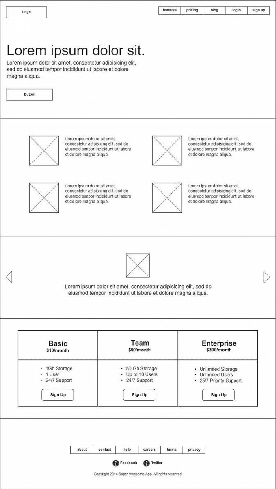
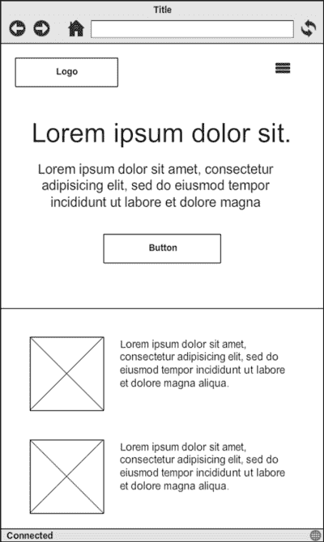
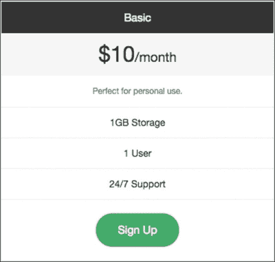
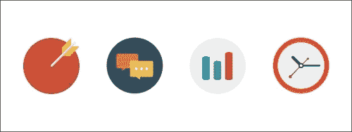
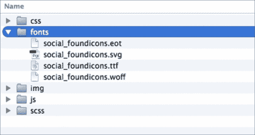
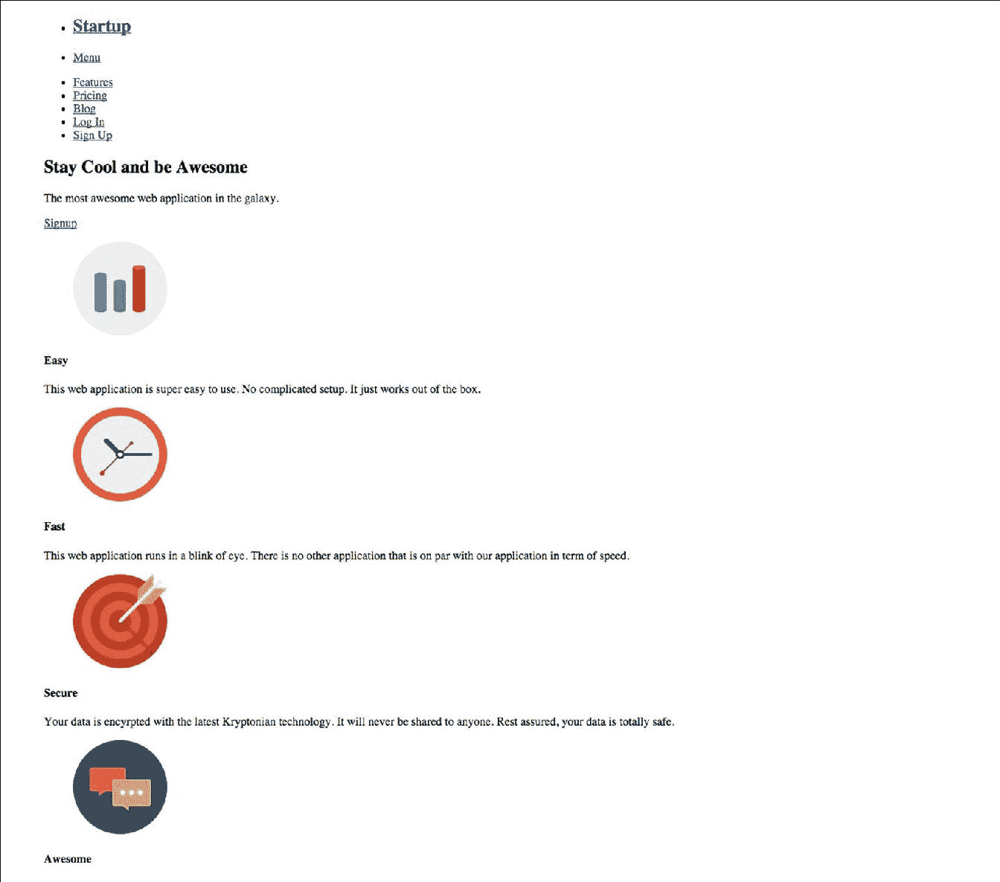

# 七、使用 Foundation 的响应性企业网站

*在这个许多人都能上网的时代，拥有一个网站对于任何规模的公司都是必不可少的，无论是小公司还是拥有数十亿业务的财富 500 强公司。 因此，在这个模块的第三个项目中，我们将为企业建立一个响应式网站。*

*建立网站，我们将采用一个叫做 Foundation 的新框架。 Foundation 由 ZURB 建立，一个位于加州的网络开发机构。 它是一个精心制作的框架，有一堆交互小部件。 在技术方面，基础风格是建立在 Sass 和 SCSS 之上。 因此，我们也将在项目的工作过程中浏览这个主题。*

*为了这个项目，首先让我们假设你有一个商业想法。 这可能有点夸张，但这是一个绝妙的想法，有可能成为一个数十亿美元的业务，并改变世界。 你已经有了一个很棒的产品，现在是时候建立网站了。 你非常兴奋，迫不及待地想要震撼世界。*

那么，废话少说，让我们开始这个项目吧。

本章将主要围绕 Foundation 展开，我们将涵盖的主题包括:

*   用线框检查网站的设计和布局
*   了解 Foundation 特性、组件和附加组件
*   管理项目目录和资产
*   通过 Bower 获取 Foundation 包
*   构建网站 HTML 结构

# 审核网站布局

首先和最重要的，不像之前的两个项目，我们做的，我们将检查网站布局在线框在本章进一步进行。 在检查它之后，我们将发现网站所需要的 Foundation 组件，以及 Foundation 包中可能不可用的组件和资产。 以下是网站布局在正常桌面屏幕的尺寸:



前面的线框显示网站将有五个部分。 第一部分显然是标题。 标题部分将包含网站 logo、菜单导航、几行标语和一个按钮——许多人称之为“号召行动”按钮。

### 注意事项

下面是一些关于指南、最佳实践和呼叫行动按钮示例的参考资料。 这些都是老文章，但基本的指导方针、技巧和原则是永恒的; 到目前为止，它仍然有效和相关。

*   呼叫行动按钮:示例和最佳实践([http://www.smashingmagazine.com/2009/10/13/call-to-action-buttons-examples-and-best-practices/](http://www.smashingmagazine.com/2009/10/13/call-to-action-buttons-examples-and-best-practices/))。
*   “呼叫行动”按钮:指南，最佳实践和示例([http://www.hongkiat.com/blog/call-to-action-buttons-guidelines-best-practices-and-examples/](http://www.hongkiat.com/blog/call-to-action-buttons-guidelines-best-practices-and-examples/))。
*   如何设计呼叫动作按钮转换([http://unbounce.com/conversion-rate-optimization/design-call-to-action-buttons/](http://unbounce.com/conversion-rate-optimization/design-call-to-action-buttons/))。

通常，在决定购买之前，人们需要尽可能多地了解利弊。 因此，在标题下面，我们将显示产品的项目列表或提供的关键功能。

除了功能列表，我们还将在滑块中显示客户评价。 根据[www.entrepreneur.com](http://www.entrepreneur.com)([http://www.entrepreneur.com/article/83752](http://www.entrepreneur.com/article/83752))，展示客户评价是推动更多客户或销售的有效方法之一，这最终对业务有好处。

在证明部分下面，网站将显示计划和价目表。 最后一部分是页脚，包含二级网站导航和 Facebook 和 Twitter 的链接。

现在让我们看看网站的布局将在一个较小的视口尺寸，如下所示:



就像我们在之前的项目中建立的网站一样，所有的内容都将被堆叠起来。 标语和“号召行动”按钮向中间对齐。 导航中的菜单现在被描述为汉堡包图标。 接下来，我们将看到 Foundation 在其建设网站的一揽子计划中提供了什么。

# Foundation 简介

Foundation([http://foundation.zurb.com/](http://foundation.zurb.com/))是最流行的前端开发框架之一。 它被许多著名的公司使用，如皮克斯，华盛顿邮报，Warby Parker([https://www.warbyparker.com/](https://www.warbyparker.com/))等。 正如前面提到的，Foundation 提供了常见的 web 组件和交互式小部件。 在这里，我们将研究的组件，以及小部件，我们将为网站雇用。

## 网格系统

网格系统是框架的组成部分。 这是一件让管理网页布局感觉很轻松的事情。 Foundation 的网格系统由 12 个柱组成，通过提供的旁听类可以适应狭窄的视口尺寸。 与我们在前几章中讨论的两个框架相似，网格由行和列组成。 每一列都必须包装在一行中，以便布局能够恰当地跨越。

在 Foundation 中，应用`row`类将元素定义为行，并应用带有`columns`或`column`类的元素将其定义为列。 例如:

```html
<div class="row">
<div class="columns">
</div>
<div class="columns">
</div>
</div>
```

你也可以省略`columns`中的*s*，如下所示:

```html
<div class="row">
<div class="column">
</div>
<div class="column">
</div>
</div>
```

列大小是通过以下一系列类定义的:

*   `small-{n}`:在小视口大小范围内指定网格列的宽度(大约 0 像素- 640 像素)。
*   `medium-{n}`:指定中等视口大小范围内的网格列宽度(大约 641 px - 1024 px)。
*   `large-{n}`: This specifies the grid column width in the large viewport size scope (approximately 1,025 px – 1,440 px).

    ### 注意事项

    我们在前面的类名中给出的变量`{n}`表示一个范围从`1`到`12`的数字。 行中列号的总和不应超过`12`。

这些类可以在单个元素中联合应用。 例如:

```html
<div class="row">
<div class="small-6 medium-4 columns"></div>
<div class="small-6 medium-8 columns"></div>
</div>
```

上面的例子在浏览器中给出如下结果:


调整视口的大小，使其足够小，并且列的宽度按照分配的类移动。 在这种情况下，每一列的宽度相等，因为它们都是用`small-6`类分配的:


### 注意事项

通常，您可以通过拖动浏览器窗口来调整视口的大小。 如果您正在使用 Chrome 浏览器，您可以激活设备模式和移动模拟器([https://developer.chrome.com/devtools/docs/device-mode](https://developer.chrome.com/devtools/docs/device-mode))。 或者,如果您使用 Firefox,您可以启用响应设计视图(https://developer.mozilla.org/en-US/docs/Tools/Responsive_Design_View),这将允许您调整视窗大小,而无需拖动火狐浏览器窗口。

## 按钮

按钮对于任何类型的网站都是必不可少的，我们当然会在网站的一些地方添加一个按钮。 Foundation 使用`button`类将元素定义为按钮。 您可以将类分配给元素，例如`<a>`和`<button>`。 这个类应用默认的按钮样式，如下图所示:


此外，还可以包含其他类来定义按钮颜色或上下文。 使用类`secondary`，`success`，`alert`来设置按钮的颜色:


您还可以使用以下类之一指定按钮大小:`tiny`、`small`或`large`:


使用其中一个类`radius`和`round`使按钮更圆角:


### 注意事项

还有几个类可以组成按钮。 此外，Foundation 还提供多种类型的按钮，例如按钮组、拆分按钮和下拉按钮。 因此，你可以去 Foundation 文件的**按钮**部分找到更多关于它们的信息。

## 导航和顶部栏

在一个网站上一个重要的部分是导航。 导航帮助用户从一个页面浏览网站到另一个页面。 在本例中，Foundation 提供了两种导航类型，其中一种称为 top bar。 Foundation 的顶部栏将位于网站的最顶端，在任何内容或部分之前。 下面是 Foundation 默认样式的顶部栏的显示方式:


顶部栏是响应的。 尝试调整浏览器的视口大小，使其足够小，你会发现导航隐藏在菜单中，这需要我们点击**menu**来显示菜单项的完整列表:


Foundation 顶部栏主要是由`top-bar`类应用样式，`data-topbar`属性运行与顶部栏相关的 JavaScript 函数，最后是`role="navigation"`以获得更好的可访问性。

下面的代码是我们如何开始在 Foundation 中构建顶部栏:

```html
<nav class="top-bar" data-topbar role="navigation">      
  ...
</nav>
```

基础将顶部栏的内容分成两个部分。 左边的区域被称为标题区域，由网站名称或 logo 组成。 Foundation 使用 list 元素构造本节，如下所示:

```html
<ul class="title-area">
<li class="name">
    <h1><a href="#">Hello</a></h1>
  </li>
  <li class="toggle-topbar menu-icon">
<a href="#"><span>Menu</span></a>
</li>
</ul>
```

第二部分简单地称为顶部栏部分。 通常，此部分包含菜单、按钮和搜索表单。 Foundation 使用`top-bar-section`类和`left`、`right`类设置本节，以指定对齐方式。 所以，为了把它们放在一起，下面是构建一个基本的 Foundation 顶部栏的完整代码，正如你在前面的截图中看到的:

```html
<nav class="top-bar" data-topbar role="navigation">
  <ul class="title-area">
    <li class="name">
      <h1><a href="#">Hello</a></h1>
    </li>
    <li class="toggle-topbar menu-icon">
<a href="#"><span>Menu</span></a>
</li>
  </ul>
<section class="top-bar-section">
    <ul class="right">
      <li class="active"><a href="#">Home</a></li>
      <li><a href="#">Blog</a></li>
      <li><a href="#">About</a></li>
      <li><a href="#">Contact</a></li>
    </ul>
  </section>
</nav>
```

当然，您必须预先在文档中链接 Foundation CSS 样式表，才能看到顶部栏的外观。

## 价格表

无论你卖的是产品还是服务，你都应该定价。

由于我们将建立一个商业网站，我们将需要显示价目表。 幸运的是，Foundation 在其核心中包含了这个组件，因此我们不需要第三方扩展。 为了灵活性，Foundation 使用 list 元素构造了一个定价表，如下所示:

```html
<ul class="pricing-table pricing-basic">
   <li class="title">Basic</li>
   <li class="price">$10<small>/month</small></li>
   <li class="description">Perfect for personal use.</li>
   <li class="bullet-item">1GB Storage</li>
   <li class="bullet-item">1 User</li>
   <li class="bullet-item">24/7 Support</li>
<li class="cta-button">
<a class="button success round" href="#">Sign Up</a>
</li>
</ul>
```

列表中的每个项目都设置了一个类，我相信这个类已经通过名称进行了说明。 给定前面的 HTML 结构和通过 Foundation CSS 给出的默认样式，输出结果非常好，如下截图所示:



## 绕轨道运动

旋转木马或 T0 滑块是网络上最流行的设计模式之一。 尽管关于其可访问性存在争议，但许多人仍然喜欢在他们的网站上使用它——我们也是。 在这里，我们想用运用 Orbit([http://foundation.zurb.com/docs/components/orbit.html](http://foundation.zurb.com/docs/components/orbit.html))，Foundation jQuery 插件来显示一个内容滑块。

Orbit 是可定制的，因为我们可以通过类、属性或 JavaScript 初始化来完全控制幻灯片的输出和行为。 我们还可以在 Orbit 幻灯片中添加几乎任何内容，包括文本内容、图像、链接和混合。 不用说，我们可以设计它的大部分部分。

### Orbit 是如何构建的?

Foundation 使用`list`元素构建幻灯片容器和幻灯片，并使用名为`data-orbit`的 HTML5`data-`属性启动功能。 下面是轨道滑块结构的一个基本示例，包含两张幻灯片的图像:

```html
<ul class="example-orbit" data-orbit>
<li></li>
<li class="active"></li>
</ul>
```

部署轨道非常简单，从技术上讲，它可以在幻灯片中包含几乎任何类型的内容，而不仅仅是图像。 当我们稍后建立网站时，我们将更多地关注这方面。

### 注意事项

目前，您可以在 Foundation 官网探索轨道滑块部分([http://foundation.zurb.com/docs/components/orbit.html](http://foundation.zurb.com/docs/components/orbit.html))，对我的账号来说，这是进入轨道滑块的最好的地方。

## 添加插件，字体图标

Foundation 也提供了一些插件，其中之一是 Webicons([http://zurb.com/playground/social-webicons](http://zurb.com/playground/social-webicons))。 不用说，我们将需要社交图标，因为这些图标基本上是矢量的，它们具有无限的可伸缩性，因此在任何屏幕分辨率下(正常或高清晰度)都将保持清晰和清晰。 看看下面的图标集:


图标集中的几个符号

除了这个图标集，你还可以找到以下图标:

*   一组初学者模板([http://foundation.zurb.com/templates.html](http://foundation.zurb.com/templates.html))，将对启动一个新网站和网页很有用
*   响应式表([http://foundation.zurb.com/responsive-tables.html](http://foundation.zurb.com/responsive-tables.html))
*   模板([http://foundation.zurb.com/stencils.html](http://foundation.zurb.com/stencils.html))，你会发现对绘制草图和创建新网站原型很有用

## 进一步夯实基础

详细介绍 Foundation 的每个角落和方面超出了本模块的范围。 到目前为止，这些是我们将在项目和网站中使用的框架中最重要的组成部分。

幸运的是，Packt Publishing 出版了几本专门涵盖 Foundation 的书。 如果您热衷于进一步探索该框架，我建议您阅读以下其中一本书:

*   *Learning Zurb Foundation*，*Kevin Horek*，*Packt Publishing*([https://www.packtpub.com/web-development/learning-zurb-foundation](https://www.packtpub.com/web-development/learning-zurb-foundation))
*   *ZURB Foundation 蓝图*，*James Michael Stone*，*Packt Publishing*([https://www.packtpub.com/web-development/zurb-foundation-blueprints](https://www.packtpub.com/web-development/zurb-foundation-blueprints))

# 额外所需的资产

除了 Foundation 自己的组件之外，我们还需要一些文件。 这些文件包含图像覆盖的网站标题、图标,代表网站的功能特性列表部分,该图标图像以及苹果图标,《阿凡达》的图像显示在证明部分,最后(这也很重要)网站的标志。

在标题图像方面，我们将使用以下由 Alejandro Escamilla 拍摄的图像，它显示了一个人正在使用他的 Macbook Air; 屏幕似乎离开([http://unsplash.com/post/51493972685/download-by-alejandro-escamilla](http://unsplash.com/post/51493972685/download-by-alejandro-escamilla)):


功能列表项旁边显示的图标由 Nick Frost 从 Ballicons([http://ballicons.net/](http://ballicons.net/))中设计。 以下是我们将在本网站收录的系列图标:



下面是 favicon 和 Apple 图标，它们是使用 Photoshop 动作 AppIconTemplate([http://appicontemplate.com/](http://appicontemplate.com/))生成的:


Favicon 和苹果图标

我们将使用 WordPress 的神秘人作为默认头像。 这个化身图像将显示在证明线上方，如下图所示:


神秘的男人

本网站的 logo 为，为了清晰和可扩展性，使用 SVG 制作。 logo 如下截图所示:


您可以从这个模块附带的源文件中获得所有这些资产。 否则，从我们在前面段落中显示的 URL 中获取它们。

# 项目目录、资产和依赖项

一旦我们评估了网站布局，框架特性，以及所有所需的资产，我们将开始项目的工作。 在此，我们将开始获得项目目录和资产组织。 此外，我们将获取并通过 Bower 记录所有的项目依赖项，Bower 是第二个使用 Bootstrap 的项目。 所以，是时候采取行动了。

# 行动时间-组织项目目录、资产和依赖项

1.  在`htdocs`文件夹中，创建一个新文件夹，并将其命名为`startup`。 这是网站将放置的文件夹。
2.  在`startup`文件夹中，创建一个名为`assets`的文件夹，以包含样式表、javascript 脚本、图像等所有资产。
3.  在`assets`文件夹中创建文件夹来分组这些资产:
    *   样式表的`css`。
    *   `js`来包含 javascript 脚本。
    *   `scss`包含 SCSS 样式表(关于 SCSS 的更多内容在下一章中)。
    *   `img`以包含图像。
    *   包含字体图标。
4.  Add the images, including the website logo, header image, icons, and the avatar image, as shown in the following screenshot:

    

5.  现在，我们将下载项目依赖项，其中包括 Foundation 框架、图标、jQuery 和两个其他库。 因此，如果您使用 Windows，让我们打开一个终端或命令提示符。 然后，使用`cd`命令导航到项目目录:
    *   Windows:`cd \xampp\htdocs\startup`
    *   OSX:`cd /Applications/XAMPP/htdocs/startup`
    *   Ubuntu:`cd /opt/lampp/htdocs/startup`
6.  As we did in the second project, type the command, fill out the prompts to set the project specification, including the project name and the project version, as shown in the following screenshot:

    

    填写并完成所有提示后，Bower 将生成一个名为`bower.json`的新文件，将所有信息放入其中。

7.  Before we install the project dependencies, we will set the dependencies folder destination. To do so, create a dot file named `.bowerrc`. Save the file with the following lines in it:

    ```html
    {
      "directory": "components"
    }
    ```

    这一行将告诉 Bower 命名文件夹组件，而不是`bower_components`。 一旦配置设置好，我们就准备好安装库，从安装 Foundation 包开始。

8.  To install the Foundation package through Bower, type `bower install foundation ––save`. Make sure that the `--save` parameter is included to record Foundation within the `bower.json file`.

    ### 注意事项

    除了 Foundation 主包(像样式表和 JavaScript 这样的文件)，这个命令还会抓取与 Foundation 相关的库，即:

    快速点击([https://github.com/ftlabs/fastclick](https://github.com/ftlabs/fastclick))

    jQuery([http://jquery.com/](http://jquery.com/))

    jQuery Cookie([https://github.com/carhartl/jquery-cookie](https://github.com/carhartl/jquery-cookie))

    jQuery 占位符([https://github.com/mathiasbynens/jquery-placeholder](https://github.com/mathiasbynens/jquery-placeholder))

    Modernizr([http://modernizr.com/](http://modernizr.com/))

9.  Foundation 字体图标是在单独的存储库中设置的。 要安装它，输入`bower install foundation-icons --save`命令。
10.  The Foundation icon package comes with the style sheet that specifies and presents the icon through HTML classes and also the icon files. Herein, we need to make a copy of the font from the package folder into our own `fonts` folder. Have a look at the following screenshot:

    

## *刚才发生了什么?*

我们刚刚创建了项目目录，以及组织项目资产的文件夹。 此外，我们还安装了通过 Bower 构建网站所需的图书馆，其中包括 Foundation 框架。

在添加了图像和库之后，我们将在下一节中构建网站的主页标记。 所以，废话少说，让我们继续，是时候再次行动了。

# 行动时间-建立网站的 HTML 结构

1.  创建一个名为`index.html`的新 HTML 文件。 然后，在 Sublime Text 中打开它，这是我们在本模块中选择的代码编辑器。
2.  让我们添加基本的 HTML5 结构如下:
3.  将 meta`X-UA-Compatible`变量与内容值`IE=edge`一起添加，以允许 Internet Explorer 使用其最新的尖端渲染版本:

    ```html
    <meta http-equiv="X-UA-Compatible" content="IE=edge">
    ```

4.  不要忘记元`viewport`标签需要使网站响应; 在`<head>`中添加如下内容:

    ```html
    <meta name="viewport" content="width=device-width, initial-scale=1">
    ```

5.  在 meta viewport 标签下面添加图标，以及苹果图标，如下所示:
6.  为搜索引擎结果添加元描述:

    ```html
    <meta name="description" content="A startup company website built using Foundation">
    ```

7.  内容的 HTML 标记将遵循 Foundation 指导原则，正如我们在本模块的前几节中讨论的那样。 此外，我们可以在元素中添加额外的类来定制样式。 让我们从添加网站`<header>`开始，为其添加以下行`<body>`:

    ```html
    <header class="startup-header">
    ...
    </header>
    ```

8.  接下来，在标题中添加网站导航栏，如下所示:
9.  在导航栏 HTML 标记的下方，我们添加了标语和动作调用按钮，如下所示:
10.  接下来，我们将添加网站的主体内容，其中将包含产品特性列表部分、验证部分和规划表价格。 首先，添加一个`<div>`，它将正文内容部分包装在标题下面，如下所示:
11.  Within `<div>`, we add the HTML markup for the feature list section, as follows:

    ```html
    <div class="startup-body">
    <div class="startup-features">
    <div class="row">
     <div class="medium-6 columns">
     <div class="row">
     <div class="small-3 medium-4 columns">
     <figure>
    
     </figure>
    </div>
     <div class="small-9 medium-8 columns">
     <h4>Easy</h4>
    <p>This web application is super easy to use. No complicated setup. It just works out of the box.</p>
     </div>
     </div>
     </div>
     <div class="medium-6 columns">
     <div class="row">
    <div class="small-3 medium-4 columns">
     <figure>
     
     </figure>
     </div>
     <div class="small-9 medium-8 columns">
     <h4>Fast</h4>
     <p>This web application runs in a blink of eye. There is no other application that is on par with our application in term of speed.</p>
     </div>
     </div>
     </div>
     </div>
     <div class="row">
     <div class="medium-6 columns">
     <div class="row">
    <div class="small-3 medium-4 columns">
     <figure>
    
    </figure>
     </div>
    <div class="small-9 medium-8 columns">
     <h4>Secure</h4>
    <p>Your data is encyrpted with the latest Kryptonian technology. It will never be shared to anyone. Rest assured, your data is totally safe.</p>
     </div>
     </div>
     </div>
     <div class="medium-6 columns">
     <div class="row">
     <div class="small-3 medium-4 columns">
     <figure>
     
     </figure>
     </div>
     <div class="small-9 medium-8 columns">
     <h4>Awesome</h4>
     <p>It's simply the most awesome web application and make you the coolest person in the galaxy. Enough said.</p>
     </div>
    </div>
     </div>
     </div>
    </div>
    </div> 
    ```

    这部分的栏目划分参考了网站线框中的布局。 因此，正如您从刚才添加的前面代码中看到的，每个特性列表项都被分配了`medium-6`列，因此每个项的列宽度相等。

12.  在特性列表部分下面，我们添加了验证部分的 HTML 标记，如下所示:
13.  参照线框布局，我们需要在证明部分下方添加平面图价格表，如下:

    ```html
    <div class="startup-body">
    <!-- ... feature list section … -->
    <!-- ... testimonial section … --> 
    <div class="startup-pricing">
     <div class="row">
     <div class="medium-4 columns">
     <ul class="pricing-table pricing-basic">
     <li class="title">Basic</li>
     <li class="price">$10<small>/month</small></li>
     <li class="description">Perfect for personal use.</li>
     <li class="bullet-item">1GB Storage</li>
     <li class="bullet-item">1 User</li>
     <li class="bullet-item">24/7 Support</li>
     <li class="cta-button"><a class="button success round" href="#">Sign Up</a></li>
     </ul>
     </div>
     <div class="medium-4 columns">
     <ul class="pricing-table pricing-team">
     <li class="title">Team</li>
     <li class="price">$50<small>/month</small></li>
     <li class="description">For a small team.</li>
     <li class="bullet-item">50GB Storage</li>
     <li class="bullet-item">Up to 10 Users</li>
     <li class="bullet-item">24/7 Support</li>
     <li class="cta-button"><a class="button success round" href="#">Sign Up</a></li>
     </ul>
     </div>
     <div class="medium-4 columns">
     <ul class="pricing-table pricing-enterprise">
     <li class="title">Enterprise</li>
     <li class="price">$300<small>/month</small></li>
     <li class="description">For large corporation</li>
     <li class="bullet-item">Unlimited Storage</li>
     <li class="bullet-item">Unlimited Users</li>
     <li class="bullet-item">24/7 Priority Support</li>
     <li class="cta-button"><a class="button success round" href="#">Sign Up</a></li>
     </ul>
     </div>
     </div>
     </div>
    </div>
    ```

14.  最后，我们在 body 内容下面添加网站页脚，如下:

## *刚才发生了什么?*

我们只是按照 Foundation 的指导方针为网站内容和部分构建了 HTML 标记。 我们还添加了额外的类来定制 Foundation 默认的样式。

自从构建 HTML 标记以来，我们没有添加任何样式; 这个网站，在这一点上，看起来白色和普通，如下截图所示:



### 提示

我们刚刚添加的 HTML 的完整代码也可以在[http://git.io/qvdupQ](http://git.io/qvdupQ)找到。

# 总结

这一章有效地启动了我们的第三个项目。 在这个项目中，我们使用 Foundation 为一家创业公司建立一个网站。 我们浏览了 Foundation 的特色，并将其中一些引入了网站。 在本章中我们只添加了网站的 HTML 结构。 这个网站，在这一点上，仍然看起来简单和白色。 我们必须构建风格来定义网站的外观和感觉，这正是我们在下一章将要做的。

我们将使用 Sass(也定义了 Foundation 基本样式的 CSS 预处理程序)来构建网站样式。 因此，在下一章的开始，首先，我们将学习使用 Sass 变量，mixins，函数，和其他 Sass 特性，然后我们写网站风格。

看起来要完成这个项目还有很多工作要做。 所以，废话少说，让我们进入下一章。