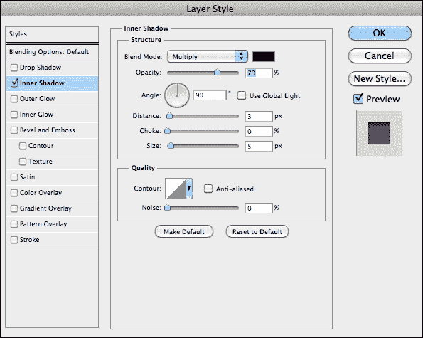
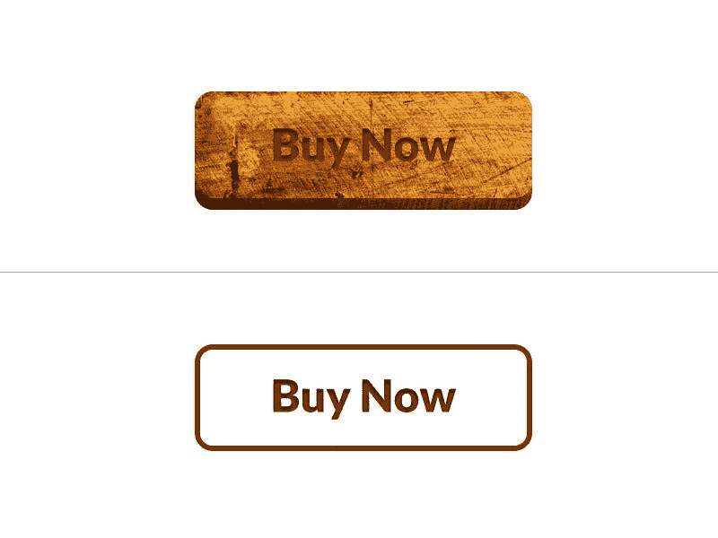
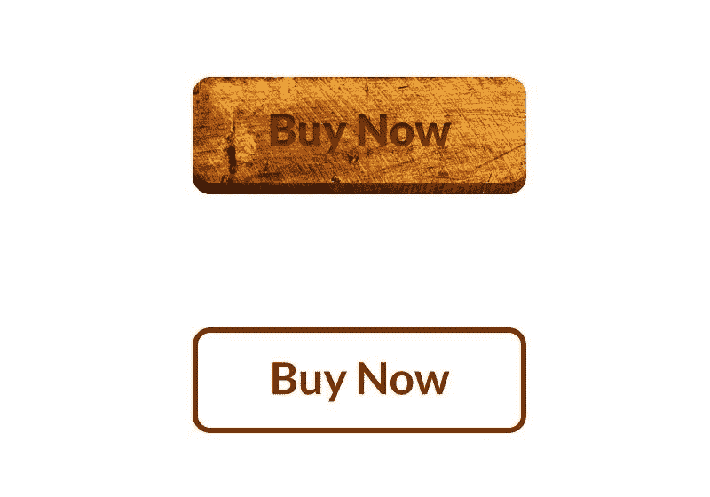

# 一、什么是平面设计？

本章将解释什么是平面设计以及这种风格是如何形成的。我们将介绍自 1950 年以来在平面设计领域的前辈，接着介绍 Skeumorphic design 在使平面设计成为过去几年数字设计最大趋势之一的过程中的重要性。

我们还将了解平面设计的现状，市场上一些最大品牌是如何采用平面设计的，以及我们每天如何与平面设计中设计的界面交互。还有一个简单的练习可以帮助您了解如何构建 Skeumorphic 元素及其平面对应项，从而更好地阐明 Skeumorphic 和平面设计之间的差异。

# 定义平面设计

平板设计是一种数字化设计风格，是 2013 年讨论最多的趋势之一。它的特点是非常简约的外观，重点是从设计中删除所有额外的元素和效果，例如斜面、阴影、灯光效果、深度、纹理，以及为这些元素创建和提供额外维度的每个元素。

通过使用空白、明亮的颜色和简单的线条作为布局元素，这种处理可以创建一种非常简单、干净的外观，在屏幕上看起来很平坦。平面设计，作为一种风格，由于其富有冲击力的外观和令人惊讶的简单方法，迅速成名并广泛使用。它开始聚集了大量的粉丝和这种风格的支持者，因为大多数人认为平面设计为他们创造了一个简单美观的网页的机会。

毫无疑问，这是 2013 年设计界讨论最多的话题之一，因为有很多支持者，也有很多人反对这种风格，反对它的重要性和讨论。

此外，公寓设计在社区中如此有影响力的最大原因之一就是它的时机。平面设计出现在一个时代，当时立体设计是数字设计和界面中最著名和最常用的风格之一。他们的对比非常明显，对于这些应用的用户以及需要改变设计风格以适应用户愿望和期望的设计师来说，这确实是一个非常粗糙和极端的转变。你说什么是变形设计？

# 历史与演变

平面设计作为一种数字化设计趋势和名称在 2012 年左右出现在网络上。作为一种回应和 Skeumorphic 设计的替代方案，第一批采用者获得了大量的关注，因为与当时创建的复杂而沉重的布局相比，走上创建如此简单而清晰的布局的道路被认为是一种风险。历史表明，这种趋势的转变总是发生的。时尚和风格是周期性的，在这个一切都是数字化的时代，这些周期往往更短，变化可能比以往更快。

要真正找到平面的最初起源，我们需要追溯到 1950 年，随着国际排版风格（或瑞士风格）的发展。与当时印刷海报中使用的复杂插图、纹理和照片相比，这种风格还注重创造一种干净易读的设计。同样是在 Akzidenz Grotesk（最终成为 Helvetica 的字体的第一个版本）开始被更多地使用的时候，这给了一种新的力量，并专注于无衬线排版。排版是瑞士风格海报的主要焦点之一，特别是大的无衬线字体，因此创造了一个真正有影响力的信息。我们可以说，这在历史上是平面设计的第一种形式。

几十年后，已经进入数字领域的微软公司，在 2006 年推出 Zune 音乐播放器，成为推动这种极简主义展望的公司之一。尽管这款设备本身并不是商业上的成功，但它的界面却是革命性的。对薄而大的排版设计的关注，以及对导航和图像设计的清晰而简约的方法，是当今微软界面重新设计的根源之一，这一点仍然可以在 Windows Phone 上呈现的强烈的排版菜单上找到。Zune 还影响了其他产品，如 Xbox 360 仪表板和 Windows 8。代号为**Metro UI**的 Windows 8 界面也是强调平面设计风格的最大界面革新之一。这是微软视窗外观上的一次重大改变，也是一次非常大胆的改变，引起了设计界的高度评价，并影响了许多至今仍试图复制方形布局的网站。以下屏幕截图显示了在 Metro UI 中使用平面设计：

但是回到平面设计的定义上来，这是一个术语，也是一种风格，是由写这个主题的设计师们定义的。其中一位，设计师版本控制 LayerVault 的 Allan Grinshtein 在他的帖子*平面设计时代*（[中写道 http://layervault.tumblr.com/post/32267022219/flat-interface-design](http://layervault.tumblr.com/post/32267022219/flat-interface-design) 他怎么相信*优雅的界面是用最少的元素产生最大影响的界面*。这一点，再加上 LayerVault 平面设计界面的成功和良好反馈，强化了一个概念，即一个非常简约的界面可以被认为是可用的，并在应用的用户群中获得巨大成功。在这个时候，随着第一批大胆设计师的成功，社区遵循并坚持这种风格，创造了大量遵循平面设计美学的设计方案和应用。

# 斜形与扁平

Skeuomorphic 设计，也被称为现实主义，是一种风格，在 2012 年和 2013 年被大量使用，它包括创造视觉元素，代表其原始的物理对应物。

Skeuomorphism 被定义为一种设计或结构元素，其在由新材料制成的人工制品中几乎没有或根本没有用途，但对由原始材料制成的物品而言是所必需的（*提供：维基百科*-[http://en.wikipedia.org/wiki/Skeuomorph](http://en.wikipedia.org/wiki/Skeuomorph) ）。

苹果为他们的桌面和移动应用创建了多个 skeuomorphic 界面；iCal、iBooks、Find My Friends、Podcast 等应用。

这种界面在设计界和用户中既受欢迎又受厌恶。这是一种非常注重细节和纹理的风格，使界面更重，通常更复杂，但由于与此处所描绘的真实对象的清晰联系，因此很有趣。对于用户来说，这是一种愉快而丰富的体验，因为 Skeumorphic 界面提供了高度的细节和交互，吸引了人们对这些设计中细节和细节的关注；例如，iBooks 中的页面翻转，在视觉上表示页面在传统书籍中的滑动。但这种风格也有其缺点。

除了从传统界面（如苹果的情况，它意味着来自其著名的玻璃般干净的水性界面）的严酷过渡之外，桌面上的一些 skeuomorphic 应用似乎不适合整个操作系统的外观。除了风格偏好和不连贯的外观外，skeuomorphic 设计也是一个糟糕的设计选择，因为风格本身就是创新的限制。通过复制传统的和类似的设计，设计师没有选择或自由想象、创建和设计新的界面以及与用户的交互。平面设计是一种极其简单明了的风格，它忽略了任何限制和效果，给了设计师所有的自由。但这两种风格都有使用的位置和时间，skeuomorphic 非常适合直接替代硬件（如音频混音器）的螺旋桨头等应用。使用这些类型的接口可以让新用户更容易地学习如何使用真正的硬件，同时以前的硬件用户已经知道如何轻松地使用接口。

不管风格如何，一个好的设计师必须准备好创建一个适合用户和市场需求的界面。为了举例说明这一点，并更好地了解平面和 skeuomorphic 之间的基本区别，让我们做一个快速练习。

## 练习 1–变形按钮和扁平按钮

在这个练习中，我们将创建一个对操作按钮的简单调用，即*立即购买*的副本。我们将创建此元素两次；首先，我们将通过创建具有纹理、阴影和深度的逼真外观按钮来了解 Skeumorphic 方法。下一步，我们将简单地将其转换为它的平面对应物，删除所有这些额外的元素，并将其调整为极简风格。

你应该有这个练习所需的所有材料。我们将使用字体 Lato，也可以在 Google Fonts 上免费获得，并且在 skeuomorphic 按钮上使用纹理图像`wood.jpg`。本练习只需要 Photoshop，因此让我们打开它并使用以下步骤：

1.  创建一个 800 x 600 像素的新 Photoshop 文档。这是我们将创建按钮的地方。
2.  Let's start by creating the skeuomorphic one. We start by creating a rectangle with the rounded rectangle tool, with a radius of 20 px. This will be the face of our button. To make it easier to visualize the element while we create it, let's make it gray (`#a2a2a2`).

    

3.  Now that we have our button face created, let's give some depth to this button. Just duplicate the layer (*command* + *J* on Mac or *Ctrl* + *J* on Windows) and pull it down to 10 or 15 px, whichever you prefer. Let's make this new rectangle a darker shade of gray (`#393939`) and make sure that this layer is below the face layer. You should now have a simple gray button with some depth. The side layer simulates the depth of the button by being pulled down for just a couple of pixels, and since we made it darker, it resembles a shadow.

    

4.  Now for the call to action. Create a textbox on top of the button face, set its width to that of the button, and center the text. In there, write `Buy Now`, and set the text to Lato, weight to Black, and size to 50 pt. Center it vertically just by looking at the screen, until you find that it sits correctly in the center of the button.

    

5.  Now to make this button really skeuomorphic, let's get our image `wood.jpg`, and let's use it as our texture. Create a new layer named `wood-face` and make sure it's above our `face` layer. Now to define the layer as a texture and use our button as a mask, we're going to right-click on the layer and click on **Create clipping mask**. This will mask our texture to overlay the button face.

    

6.  For the side texture, duplicate the `wood-face` layer, rename it to `wood-side` and repeat the preceding instructions for the side layer. After that, and to have a different look, move the `wood-face` layer around and look for a good area of the texture to use on the side, ideally something with some up strips to make it look more realistic.

    

7.  To finish the side, create a new layer style in the `side` layer, `gradient overlay`, and make a gradient from black to transparent and change the settings as shown in the following screenshot. This will make a shadow effect on top of the wood, making it look a lot better.

    

8.  To finish our skeuomorphic button, let's go back to the text and define the color as `#7b3201` (or another shade of brown; try to pick from the button and make it slightly darker until you find that it looks good), so that it looks like the text is carved in the wood.

    

9.  The last touch will be to add an **Inner Shadow** layer style in the text with the settings shown. Group all the layers and name it `Skeuomorphic` and we're done.

    

    而且现在我们有了我们的 Skeumorphic 按钮。这是一种非常简单的方法，但我们通过使用形状、纹理和一些图层样式，重新创建了一个木制按钮的外观。

现在来看我们的平面版：

1.  复制我们刚刚创建的组，并将其命名为`flat`。将其移动到工作区的另一半。
2.  删除以下图层：`wood-face`、`wood-side`和`side`。
3.  This button will not have any depth, so we do not need the side layer as well as the textures. To keep the button in the same color scheme as our previous one, we'll use the color `#7b3201` for our text and face. We'll make a transparent button, which only has color on the border and fills up on a mouse hover (we will cover those effects later in the book). Your document should look like what is shown in the following screenshot:

    

4.  Create a new layer style and choose **Stroke** with the following settings. This will create the border of our button. To make the button transparent, let's reduce the **Layer Fill** option to 0 percent, which will leave only the layer styles applied.

    

5.  Let's remove the layer styles from our text to make it flat, reduce the weight of the font to **Bold** to make it thinner and roughly the same weight of the border, and align it visually, and our flat button is done!

    

这种透明按钮非常适合平面界面，尤其是在模糊的颜色背景上使用时。这是因为它创建了一个只有很少元素的有影响力的按钮，创建了一个透明的控件，并充分利用了设计中的空白。在设计中，尤其是在设计平面时，要记住少就是多。

通过本练习，您可以构建一个 skeumorphic 元素，并将其分解为平面版本，该版本与带边框和文本的圆形矩形一样简单。我们选择的字体经常用于平面设计布局；它简单但圆润，适用于圆角形状，如我们刚刚创建的圆角形状。

# 平面在现实世界中的使用

设计师们对这种款式的采用和使用速度之快令人难以置信。苹果、谷歌和 Facebook 等大品牌和公司重新设计了它们的界面和品牌，以创造更简单的外观。苹果 iPhone 的移动操作系统 iOS 7 无疑是这一应用的最大例子，因为它的界面经过了彻底的重新设计，简化了导航、控件、图像以及操作系统中几乎所有的元素。考虑到用户界面世界的变化，这已经是意料之中的事了，但从 iOS 6 及其 skeumorphic 应用到 iOS 7 及其平面外观和实验性界面，这是一个巨大的飞跃。更多的品牌跟随这一转变，如 Facebook，并重新设计了他们的品牌和应用，使其更简单、更贴切。大多数移动应用都重新设计了界面和图标，并坚持这种平面风格。少就是多；平面设计有助于品牌理解这一点，并将其外观改为更简单、更干净的外观。请看以下示例：

*   Facebook logo redesign (old version and the new flat redesign):

    

*   Google logo redesign (old version and the new flat redesign):

    

*   Apple iOS for the iPhone (on the left, iOS 6 and on the right, iOS 7, redesigned to have a flat look, which can be seen in the icons used):

    

# 总结

好了，给你！我们研究了平面作为一种设计风格是如何不新鲜，因为它的极简外观可以追溯到 20 世纪 50 年代的国际排版风格。我们还介绍了如何在 Skeumorphic 和 flat 中进行设计，以及它们的主要区别。此外，我们还了解到平面设计在谷歌、Facebook 和苹果等世界知名公司中的重要性和广泛性，这些公司已经重新设计了徽标和用户界面，以匹配这种外观。

现在我们知道了什么是平面设计，接下来我们将了解如何在平面中进行设计，以及作为设计师，您应该关注什么来创建出色的平面界面。