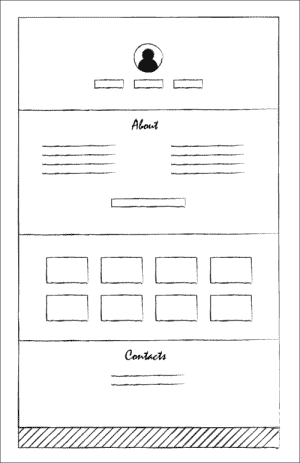
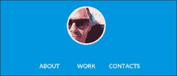
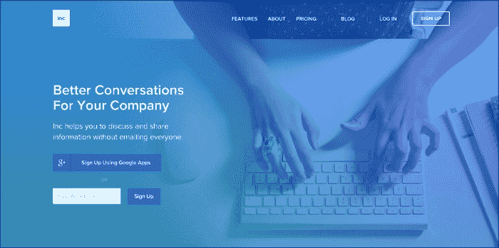
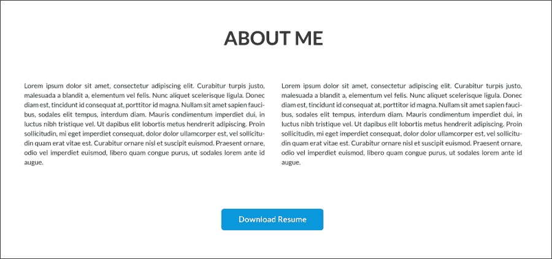

# 四、设计自己的平面网站

本章将是一个实用的循序渐进的指南，介绍如何以平面设计风格设计一个简单的网站。

在本章中，我们将介绍以下主题：

*   项目规划
*   利用外部资源简化和加快工作
*   布局设计过程
*   通过牢记设计的发展来创建设计，从而加快整个工作过程

# 规划你的工作

规划绝对是网站设计中最重要的阶段之一。大部分工作归结为确切地知道你将如何设计和开发你的网站；计划是做出所有这些决定的地方。

你需要首先确定你的目标和你的网站目标，你想实现什么，为谁。假设您正在为一家小工具公司创建一个在线电子商务网站。目标是在网上销售这些小玩意儿（“what”），目标是 25 至 50 岁的男性（“who”）。这些通常很容易理解。然而，如果你发现客户的简报不清楚，请确保事先了解他们的目标，因为没有什么比一个不知情的设计师在项目中工作更糟糕的了。

然而，在本例中，我们正在创建自己的公文包页面。因此，本质上，我们正在创建一个页面，旨在向设计师和未来可能的客户（“谁”）展示我们的工作（“什么”）。当然，本案中的目标并不像玩具公司或女装店那样容易界定，但目标始终存在。你可以是一个对手机或时尚更感兴趣的设计师，所以在设计网站时，一定要记住这一点。你的线上和线下图片应该让浏览者将你与某个市场联系起来，这是通过创建和实现一种特定的方法和风格来完成的。

不幸的是，我不会亲自了解你，所以我们必须创建一个简单而灵活的设计师组合。这应该是可以用于一般投资组合的东西，不管你的工作专业是什么。那么，让我们开始计划吧！

# 定义您的部门

因为我们正在设计一个公文包，所以重点是展示设计师的作品。我们将在这里有几个部分；详情如下:

*   **作品/作品组合**：这是展示您的设计项目的地方
*   **关于**：这是一篇关于你作为设计师和个人的小文字描述，以及你的经历
*   **联系人**：这是一个存放您的联系人的地方，以便观众可以联系您以及您的位置

这些是我们必须为您的投资组合设计的基本部分。由于这是一个如此小而简单的网站，我们将创建一个单页网站。这种页面最近被越来越多地使用。这主要是因为它以一种非常简单的方式向用户提供所有信息。此外，它通过在单个页面上呈现不同的内容提供了更具动态性的体验。

# 开始设计你的页面

所以现在我们已经知道我们将要设计什么，我们准备开始绘制草图和设计您的网站。我通常从在纸上画一个非常简单的草图开始，只是为了快速模仿我们要设计的东西。您也可以使用 Balsamiq 等软件创建线框，但我更喜欢在纸上开始绘制草图。所以，抓起一张纸，开始画草图。

我们将要创建的页面将具有五个可视块。这些区块如下：

*   **标题**：这是我们将在中放置一个化身或标志，以作为品牌和菜单来代表设计师
*   **关于**：这是关于你的部分，有一条关于你的文字和到你简历的链接
*   **项目**：本部分将展示您的设计与缩略图的结合
*   **联系人**：这是一个包含联系人的短文本块
*   **Footer**: This is a really small block by the end of the page with copyright and links for social networks

    下图是我的草图：

    

    手绘版式

随着我们的布局画出来，我们准备打开 Photoshop 并开始设计我们的最终页面。

# 使用 Designmodo.com 平面用户界面

有这么多的设计师和开发人员，你可以找到一些外部资源和预先设计和开发的组件，可以用来节省项目时间。Designmodo.com 平面 UI 包是一个非常适合在项目中使用的包，其中一些基本元素已经设计好了，因此我们将使用它来设计页面。您可以获得免费软件包，其中包括分层 PSD、图标、Lato 字体和文件，用于我们使用基于 Twitter Bootstrap 3 的框架进行开发，可在[使用 http://designmodo.com/flat-free/](http://designmodo.com/flat-free/) 。在本书的后面部分，我们将使用这些预先开发的组件为我们的开发工作设置页面，并使我们的布局生动起来。以下是 Designmodo 平面 UI 包的屏幕截图：

# 在 Photoshop 中设计

现在我们已经定义了各个部分并绘制了全局布局，我们准备开始创建最终像素。因此，打开你的 Photoshop，让我们开始工作并执行以下步骤：

1.  创建一个宽 1200 像素、高 2000 像素、背景为白色的新文档。这将是我们的全长网站设计画布。
2.  让我们从创建标题开始。我们需要为我们的脸使用一个化身，所以当你可以使用你自己的化身时，我将从[中获取一个 http://uifaces.com/](http://uifaces.com/) ，在这里你可以找到几个真实用户的化身，用于你的设计模型。
3.  让我们用矩形工具创建一个用作标题背景的形状。您可以将形状的颜色设置为灰色，稍后我们将决定颜色。
4.  现在我们有了头的基础，让我们把它放在里面。这将是我们的品牌领域的网站。它显示了网站的内容以及它属于谁。
5.  创建一个 125 x 125 像素的圆圈，并将其用作头像的遮罩。为遮罩提供 5 像素的白色笔划混合选项。这将在我们的圈子周围创建一个边界，使化身更加流行。
6.  要创建菜单，我们将使用文本字段。创建三个不同的文本字段，并在其中写入`ABOUT`、`WORK`和`CONTACTS`。这些将是我们的菜单链接。将字体类型设置为 Lato，字体样式设置为粗体，文本大小设置为 20px。这是您可以尝试文本样式的地方；尝试使用小写文本而不是大写文本，并尝试使用较轻的字体和下划线。您可以根据您选择的样式调整链接，但我将坚持使用指定的链接，因为我相信它可以工作并且看起来不错。
7.  So, our header is created. We're only missing the color. Let's go to [http://flatuicolors.com/](http://flatuicolors.com/) and get one of the colors suggested there. As I mentioned earlier in [Chapter 3](3.html "Chapter 3. Creating a Flat and Usable Interface"), *Creating a Flat and Usable Interface*, we're setting the main color of our color scheme for the whole website by choosing this color. So, keep this in mind when choosing a color. Usually, I prefer building my color palette throughout the design of the site, as I'm able to try them out instantly. Choose the one of your liking; I'll use Peter River, `#3498db`.

    下面的屏幕截图显示了当前标题的外观：

    

8.  If you want to create an even more interesting and impactful header, you can also use a background image for the header. If you have an image of your work desk or your computer with the working files visible on your screen, these are great to represent your work. Put it below the colored background layer and change the color layer opacity to around 85 percent. This will create a blue tint effect on the image. The following screenshot shows a blue tint background found at [http://sendtoinc.com/](http://sendtoinc.com/):

    

9.  因为这是一个单页的网站，你可能想知道为什么我们要使用菜单。然而，菜单对于网站来说是必不可少的，因为它是主要的导航工具，它还告诉观众他或她能够在网站上找到哪些内容。由于我们只在一个页面上创建所有部分，因此此菜单不会链接到不同的页面，但我们可以使用 JavaScript 向下滚动到特定的部分。这就是我们将引导观众进入他们正在寻找的部分的方式。我们将在[第 5 章](5.html "Chapter 5. Developing Your Site")、*开发您的站点*中详细讨论这一点、代码的开发以及技术方面。
10.  现在我们将创建我们的`About`部分。首先创建字体类型为 Lato、字体样式为粗体、文本大小为 40 px 的标题。为了保持一致，所有单词都应该大写。让我们用`About Me`来让语气更个人化一点。将文本颜色更改为`#222222`，避免使用纯黑色。这将使它更容易对眼睛。
11.  接下来，创建我们的内容。我们将创建两个文本区域，并用文本填充它们。如果您没有文本，您可以从[中生成并获取几个“lorem ipsum”段落 http://lipsum.com](http://lipsum.com) 填充文本区域。这两个区块的宽度各为 500 像素，间距为 35 像素。将文本类型设置为 Lato，字体样式设置为 Regular，文本大小设置为 14px。此外，为了使文本更具可读性，并使列更具几何视觉效果，让我们在段落选项中选择**对左对齐**选项。我们还将前导设置为 20px。
12.  To finish off our `About` section, let's open the `Designmodo flat-ui-free.psd` file. There you will find premade buttons that we can use, so duplicate the `Button` (static) folder to our document and position it below the text areas, centered with the page. Make sure you change the background color of the button to match the color that we selected earlier. Change the copy to `Download Resume`, and this section is completed. The following screenshot is a great example of how you can create visual blocks by just using content:

    

13.  接下来是工作区。对于这一个，让我们首先创建八个 225 x 140 px 的矩形，并将它们与 47 px 的间距对齐。用这些创建一个 2x4 的网格，它将作为我们项目缩略图的容器。使用缩略图是显示项目的一种简单快捷的方法。您可以选择使用 lightbox 插件，如 lightbox 2，该插件可在[上获得 http://lokeshdhakar.com/projects/lightbox2/](http://lokeshdhakar.com/projects/lightbox2/) ，以显示更大的图像，或直接将其链接到运球中的入口。
14.  To create a visual separation of this block and to contrast with the other sections, let's set a background color for this block. However, instead of using the header color, which is too vivid and bright, let's use a lighter shade of the main color (`#99cbed`). This will create a smoother background that will allow the thumbnails to contrast more with the background. The following screenshot shows the final result:

    

15.  现在，使用这些矩形作为剪切遮罩，并用您的工作项目填充缩略图。我从[中抓取了几个条目 http://dribbble.com](http://dribbble.com) 以填充此示例。同样，我们希望内容创建视觉块，因此我们不会创建任何类型的边框、线条或分割。我们在网格中组织内容的方式足以设置视觉块并定义此部分的布局。
16.  Our work section is now done. You can use titles above or below the thumbnails, but this is a simpler way of doing a work section, and it also shows that your work speaks for itself. By reducing the amount of elements on the page, we're also focusing on creating a minimalistic page, and it's impressive how simple a website can become while reducing the amount of superfluous elements in it. The following screenshot is a good example of a minimalistic page:

    

17.  我们的`Contacts`部分也将非常简单和精简。有几种创建`Contact`节的方法。通常，您可以构建一个联系人表单，显示您所在位置的地图，并使用图标表示不同类型的联系人。然而，我们将深入到最基本的方面：一个行动电话、一个标题、一个电子邮件地址和一个电话号码。那么，让我们复制`About`部分的标题并将其更改为`Let's Chat`。使用这种文本可以让你的观众更接近你，也可以让你更容易接近，提醒观众这其实是一个很容易联系的人。
18.  After the title, create two text fields in two different lines to add your e-mail address and your phone number. The content of this section will be simple contact information. For these fields, use lowercase text and set the font type to Lato, font style to regular, and font size to 23 px. Using a simple type like this on top of a flat color, we're focusing on the content and impact of the content in itself, as there's nothing else, such as boxes, lines, icons, or maps, to detract it. Flat design is very much composed by this simplicity, focusing on what's essential and the bare minimum. You should be able to see the result, which is similar to the following screenshot:

    

19.  随着我们的`Contact`部分的完成，我们只缺少完成网站的页脚。我们将创建一个小矩形（50 像素高）作为背景，并使其与标题相同的蓝色（我们的主颜色，`#3498db`。在这里，我们将简单地添加我们的版权文本和链接到您的帐户的社交网络图标。因此，创建一个文本字段，将字体类型设置为 Lato，字体样式设置为粗体，字体大小设置为 12px，并使用`© 2014 Designer Name`文本。将此对齐到左侧。
20.  On the right-hand side of the footer, let's add links to your Twitter and Facebook accounts so that people can connect with you. You can find social logo packs with these links, or you can get the official logos from the brand assets section at [https://www.facebookbrand.com/](https://www.facebookbrand.com/) for Facebook and [https://about.twitter.com/press/brand-assets](https://about.twitter.com/press/brand-assets) for Twitter. Since we're using our main color as the footer background, let's use the white versions of these logos to make them visible on top of the blue background. Align both of them to the right of the page. It should look like the following screenshot:

    

页脚是网站的最后一个元素。它是一个添加相关链接的地方，比如社交网络链接和版权信息，这些都是页面的常规内容。它也作为一个网站的视觉封闭，它创建了蓝色和白色之间的视觉对比接触截面块。

现在，我们的网站已经完成，我们可以审查的颜色和元素的位置。在构建布局之后，进行此类调整和决策总是比较容易，因为您能够可视化所有连接在一起的元素以及它们的外观。在结尾，最终的选择和触摸主要是为了增强网站的外观和感觉。间距、颜色和文本确保通过将网站作为一个整体来看，您会觉得它运行良好，而不是专注于单个部分。

我们的第一个平面设计页面现在已经完成，整个网站应该类似于以下截图：

# 总结

在本章中，我们介绍了设计单页平面网站的所有过程，从规划、草图到 Photoshop 中的最终设计，以及使用外部资源（如 Designmodo.com 平面 UI 包）。我们能够设计一个简单的平面网站的设计师组合，与所有的基本部分。在下一章中，我们将介绍刚刚使用 Designmodo 平面 UI 包、HTML 和 CSS 设计的网站的开发。