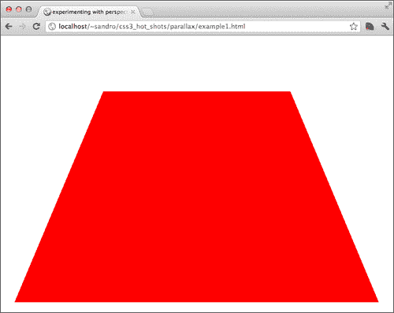
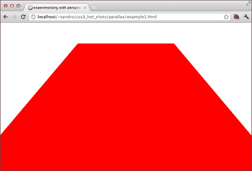
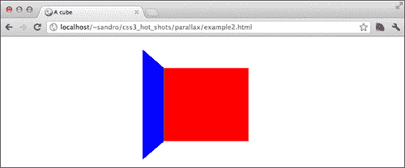
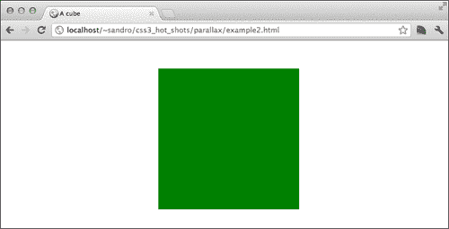
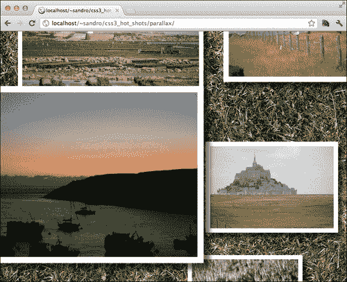
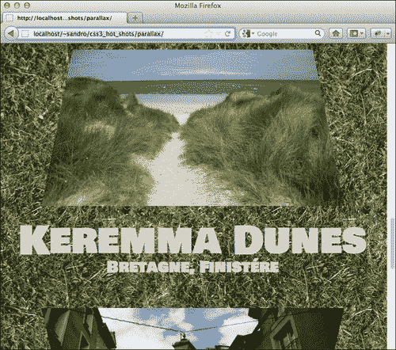

# 六、视差滚动

什么是**视差滚动**？视差滚动是一种视觉效果技术，试图通过移动具有不同速度的场景元素来实现深度感，以便它们响应用户的动作，例如滚动网页。自 80 年代以来，该技术已广泛应用于 2D 视频游戏行业。

在本章中，我们将发现如何通过视差滚动和其他响应页面滚动的酷效果来增强我们的网站。为了实现这一点，我们将深入研究一些先进的，有时是实验性的 CSS 3D 技术，并学习如何有效地处理透视。

由于实现上的一些差异，我们将重点讨论如何在不同的布局引擎上获得类似的效果，例如 WebKit 和 Gecko。

如果您使用的是 Windows 操作系统和 Chrome 浏览器，如果由于缺少或不支持 GPU，CSS 3D 结果不符合预期，您可能必须切换到 Firefox（或 IE10）。要检查这一点，我们可以从 Chrome 浏览器导航到**about:gpu**并检查**3D CSS**复选框是否已启用。

以下是本章涵盖的主题：

*   发现视角
*   创建多维数据集
*   透视原点
*   三维视差
*   布局引擎之间的差异
*   更改页面滚动上的视差
*   创建启用视差的图像库

# 发现视角

正如我们在前一章中开始探讨的那样，CSS3 引入了在三维空间中移动 HTML 元素的可能性。现在，我们可以围绕三个轴（即 x、y 和 z）中的每一个轴移动和旋转它们。虽然处理围绕 x 轴和 y 轴的运动很容易理解，但当 z 轴起作用时，事情会变得有点混乱。

沿着 z 轴移动一个元素意味着让它离我们的视点更近或更远，但是这个动作有一些隐藏的问题，例如，下面的语句：

```html
#element{
  transform: translateZ(100px);
}
```

我们怎么能想象将一个距离以像素为单位的物体向我们移动？为了解决这个难题，W3C 引入了一个名为`perspective`的属性，它基本上告诉浏览器我们观察页面的距离。

因此，如果我们将`500px`设置为透视属性，则放置在距离`250`像素的 z 轴上的对象看起来会大两倍，而放置在距离`500`像素的 z 轴上的对象看起来会大一半。

让我们用一个小例子来尝试一下：

```html
<!doctype html>
<html>
<head>
  <meta charset="utf-8">
  <title>experimenting with perspective</title>

  <style>

  body{
 perspective: 500px;
    transform-style: 'preserve-3d';
  }

  #red-square{
    margin: auto;
    width: 500px;
    height: 500px;
    background: red;
    transform: rotateX(40deg);
  }

  </style>

  <script src="js/prefixfree.js"></script>

</head>
<body>

  <div id="red-square"></div>

</body>
</html>
```

如果我们在支持 CSS 3D 功能的浏览器（如 Chrome、Firefox 或 IE10）中运行此代码，我们会注意到类似于以下屏幕截图所示的结果：



增加`perspective`属性的值时，结果将看起来更平坦，另一方面，如果此属性减小，红色框将看起来延伸到地平线。下面是一个带有`perspective: 250px`的示例：



## 创建立方体

为了更好地理解`perspective`的一些属性，我们可以利用到目前为止所学的知识，仅使用 CSS 创建一个真正的 3D 立方体。我们需要六个`div`标签，每侧一个，另外一个用作其他标签的容器：

```html
<!doctype html>
<html>
  <head>
    <meta charset="utf-8">
    <title>A cube</title>

    <style>

    body, html{
      height: 100%;
      width: 100%;
    }

    </style>

    <script src="js/prefixfree.js"></script>
  </head>
  <body>
    <div id="container">
      <div class="square back"></div>
      <div class="square bottom"></div>
      <div class="square right"></div>
      <div class="square left"></div>
      <div class="square top"></div>
      <div class="square front"></div>
    </div>
  </body>
</html>
```

首先，我们必须对`#container`选择器应用一些属性；让我们在已经定义的`style`标记中插入以下 CSS 代码块：

```html
    #container{
      perspective: 500px;
      backface-visibility: visible;
      transform-style: 'preserve-3d';	
      position: relative;
      height: 100%;
      width: 100%;
    }
```

在这里，我们告诉浏览器，必须根据 z 轴上的位置来渲染容器内的内容，并且我们将`#container`选择器和容器内的元素的`perspective`属性设置为`500px`。最后但并非最不重要的一点是，我们要求浏览器也渲染用于创建立方体的`div`标记的背面。

好，现在让我们创建面。我们可以从`.square`的一些基本属性开始：

```html
.square{
  transform-style: 'preserve-3d';	
  position: absolute;
  margin: -100px 0px 0px -100px;
  top: 50%;
  left: 50%;
  height: 200px;
  width: 200px;;
}
```

好的，现在每个方块都是一个一个的，我们可以开始一个一个地调整它们。让我们从`.back`开始，我们必须将从相机中移开到其大小的一半，因此将`transform`属性设置为`-100px`：

```html
    .back{
      background: red;
      transform: translateZ(-100px);
    }
```

接下来我们来看`.left`。在这里，我们必须先对其 y 轴进行旋转，然后将其平移一半到左侧。这是因为每一个变换，除非有不同的表述，都有其起源于元素的中心；此外，我们必须记住，变换是按顺序应用的，因此元素必须相对于其 z 轴进行平移，以获得正确的结果：

```html
    .left{
      background: blue;
      transform: rotateY(90deg) translateZ(-100px);
    }
```

以下是一个屏幕截图，提醒我们迄今为止所取得的进展：



我们可以对所有剩余的面使用相同的策略：

```html
    .right{
      background: yellow;
      transform: rotateY(-90deg) translateZ(-100px);
    }

    .front{
      background: green;
      transform: translateZ(100px);
    }

    .top{
      background: orange;
      transform: rotateX(-90deg) translateZ(-100px);
    }

    .bottom{
      background: purple;
      transform: rotateX(90deg) translateZ(-100px);
    }
```

如果我们现在尝试拍摄这个实验的屏幕截图（如图所示），我们可能会遇到一个小小的失望：



`.front`选择器的`div`标签覆盖了所有其他`div`标签。这个小实验向我们显示，场景的消失点默认设置为包含`perspective`属性的元素的中心。

## 透视原点属性

幸运的是，我们可以很容易地使用接受两个值的`perspective-origin`属性来更改消失点，这两个值可以用所有常见的 CSS 度量单位来表示，也可以使用文字来表示，就像`background-position`一样。

因此，我们将在`#container`中添加以下内容：

```html
perspective-origin: top left;
```

并获得与此处所示类似的结果：


如果我们调整浏览器窗口的大小，我们还会注意到消失点会发生变化，因为它与`#container`选择器相关，该选择器的`width`和`height`属性设置为与浏览器视口相同。

这种行为是我们将在下一章构建视差项目时使用的技巧的根源。

# CSS 3D 视差

很好，现在我们有了开始构建项目所需的工具。我们将要创建的内容背后的基本思想是，如果我们将元素放置在不同的高度并滚动，同时将消失点保持在可视区域的中心，那么我们可以获得冷视差滚动效果。

像往常一样，我们首先需要一个 HTML 结构，所以让我们从这个开始。让我们用以下代码创建`index.html`文件：

```html
<!doctype html>
<html>
  <head>
  <meta charset="utf-8">	
<link href='http://fonts.googleapis.com/css?family=Bowlby+One+SC' rel='stylesheet' type='text/css' data-noprefix>
    <link rel="stylesheet" type="text/css" href="http://yui.yahooapis.com/3.5.1/build/cssreset/cssreset-min.css" data-noprefix>
    <link rel="stylesheet" type="text/css" href="css/application.css">

    <script src="js/prefixfree.js"></script>
    <script src="https://ajax.googleapis.com/ajax/libs/jquery/1.7.2/jquery.min.js"></script>

  </head>
  <body>

    <div id="body">
      <div id="container">

      </div>
    </div>

  </body>
</html>
```

与此页面一起，我们必须创建一个名为`css/application.css`的文件，该文件将保存我们的 CSS 属性和选择器。正如我们在前面的示例中所做的那样，我们将拉伸`#body`以适应浏览器的视口，因此我们可以在`application.css`中添加几行 CSS 代码：

```html
body,html{
  height: 100%;
}

#body{
  height: 100%;
 overflow-y: auto;
 overflow-x: hidden;
}
```

我们还将`overflow-y: auto`和`overflow-x: hidden`添加到元素中，稍后我们将讨论它们将如何发挥作用。

## 在 WebKit 中实现视差滚动

好的，在继续之前，我们现在必须一次关注一个布局引擎；这是因为 WebKit 和 Firefox 在 CSS 3D 属性的实现方面存在一些差异，因此我们必须分别处理这两种情况。让我们从 WebKit 开始。

我们可以利用一个整洁的类，Lea Verou 的前缀免费自动放在插入页面的`html`元素上。该类的名称等于浏览器所需的实验前缀；因此，如果我们从 Internet Explorer 查看页面，则类为`-ms-`，如果从 Firefox 查看页面，则类为`-moz-`。

因此，我们可以开始向`#body`添加`perspective`和`transform-style`属性，就像我们在前面的示例中所做的那样：

```html
.-webkit- #body{
  perspective: 500px;
  transform-style: preserve-3d;
}
```

现在我们必须处理`#container`选择器；这必须比通常的视口长。该项目所需的所有图像都位于 Packt 发布网站（[www.packtpub.com](http://www.packtpub.com)）：

```html
#container{
  background-image: url('img/grass.png');
  text-align: center;
  padding-bottom: 300px;
  /* to be removed when we'll have content */
min-height: 1000px;
}
```

由于我们已经将`overflow`属性应用于`#body`，我们将在浏览器中看到的滚动条不属于整个 HTML 文档，而是属于`#body`。

但`#body`也有`perspective`属性；这意味着所包含元素的消失点始终位于浏览器屏幕的中心，因此我们实现了本章开头希望实现的结构。

为了测试我们的代码，我们可以开始在容器中添加一些元素，并为它们指定不同的高度：

```html
<div id="body">
  <div id="container">

  <!-- EXPERIMENT -->
    
    

  </div>
</div>
```

我们可以使用`transform: translateZ();`设置高度：

```html
.experiment1{
  transform: translateZ(10px);
}

.experiment2{
  transform: translateZ(150px);
}
```

很好，现在我们可以在符合WebKit 的浏览器中测试到目前为止我们所做的工作：


滚动时，我们可以注意到第二个图像（离我们的视点最近的图像）的移动速度比第一个图像快。我们刚刚在 WebKit 上实现了视差！

## 在 Gecko 中实现视差滚动

Gecko 和 WebKit之间存在一些细微的实现差异，同时也存在一些 bug。

首先，Gecko 中的属性`transform-style: preserve-3d`不会传播到匹配元素的所有后代，而只传播到一级子元素。`perspective`和`perspective-origin`属性也有相同的作用。

幸运的是，我们可以找到解决这个问题的方法。这可以通过将`perspective`表示为转换来实现，例如：

```html
transform: perspective(500px);
```

当我们使用这种方法时，`perspective-origin`不再有用，应该使用`transform-origin`代替它。以这种方式在基于 Gecko 的浏览器上使用`perspective`会导致与在基于 WebKit 的浏览器上使用透视图时相同的行为。

因此，我们可以使用与 WebKit 相同的策略添加几行 CSS 代码：

```html
.-moz- #container{
  transform: perspective(500px);
  transform-style: preserve-3d;	
}
```

如果我们现在打开 Firefox 并测试我们的项目，我们将看到如下内容：


虽然结果看起来像是通过 WebKit 获得的，但在这种情况下滚动页面不会产生任何视差效果。在快速分析之后，我们可能会认为这种行为是由于将`transform: perspective`属性放置在错误的元素上（`#container`而不是`#body`）、【T6]而导致的，但事实是，由于一个微妙的错误（[），我们有意识地选择了这种方式 https://bugzilla.mozilla.org/show_bug.cgi?id=704469](https://bugzilla.mozilla.org/show_bug.cgi?id=704469) ）从具有`overflow`属性的元素中删除`transform: perspective`属性。

因此，现在让基于 Gecko 的浏览器按预期运行的唯一方法是实现一小块 JavaScript，它可以动态地修改消失点，使它保持在浏览器窗口的中心。

此脚本必须调整响应滚动事件中的`transform-origin`属性：

```html
<script>
  $(document).ready(function(){
    if($.browser.mozilla){
      $('#body').scroll(function(event){
        var viewport_height = $(window).height(),
          body_scrolltop = $('#body').scrollTop(),
          perspective_y = body_scrolltop + Math.round( viewport_height / 2 );

        $('#container').css({
          'transform-origin': 'center ' + perspective_y + "px",
          '-moz-transform-origin': 'center ' + perspective_y + "px",
        });
      })
    }
  });
</script>
```

完美的现在，基于 Gecko 的浏览器也将按预期运行。

## 在 IE 浏览器中实现视差滚动

Internet Explorer 9 不支持 CSS 3D转换，但 IE10 支持，因此我们也可以尝试使用该浏览器运行该项目。为了在 IE10 上实现正确的行为，我们必须应用一些自定义属性；这是因为 IE10的行为方式与其他两种浏览器略有不同。

基本上 IE10 支持`perspective`和`transform: perspective`属性，但前者仅对具有该属性的元素的直接后代有效，后者仅对具有该属性的元素有效。

因此，我们必须采用一种更接近壁虎的行为，但使用`perspective`而不是`transform: perspective`。这是：

```html
.-ms- #container{
  perspective: 500px;
}
```

现在我们还需要稍微更改 JavaScript 代码，以便在浏览器为 Internet Explorer 且支持 3D 转换时影响`perspective-origin`。以下是可以替代前一个代码使用的代码：

```html
// == for Firefox and MSIE users ==
$(document).ready(function(){
  if($.browser.mozilla || ( $.browser.msie&& Modernizr.csstransforms3d )){
    $('#body').scroll(function(event){
      var viewport_height = $(window).height(),
        body_scrolltop = $('#body').scrollTop(),
        perspective_y = body_scrolltop + Math.round( viewport_height / 2 );

      if($.browser.mozilla){              
        $('#container').css({
          'transform-origin': 'center ' + perspective_y + "px",
          '-moz-transform-origin': 'center ' + perspective_y + "px",
        });
      }else{
        $('#container').css({
          'perspective-origin': 'center ' + perspective_y + "px",
          '-ms-perspective-origin': 'center ' + perspective_y + "px",
        });
      }
    })
  }
});
```

为了实现这一点，我们必须下载 Modernizer 以检查 CSS 3D 支持，我们可以像前面的章节一样创建自定义构建，但这次我们只检查配置面板（[中的**CSS 3D**](http://modernizr.com/download/)转换复选框 http://modernizr.com/download/ 。接下来，我们必须在页面中的其他`script`标签后面添加下载的文件（[js/modernizer.js](http://js/modernizr.js)）：

```html
<script src="js/modernizr.js"></script>
```

以下是 IE10 的截图：


# 给画廊增加一些随机性

现在我们已经解决了浏览器兼容性问题，我们可以安全地删除我们之前附加到图像上的实验性注释和类。

为了创造一种随机感，我们可以定义几组类，每组都有相同属性的更多变体，然后我们可以为要显示的每个图像的每组选择一个类。这里有一个例子；让我们在`application.css`中添加以下内容：

```html
/* sizes */
.size-a{
  width: 30%;
}

.size-b{
  width: 35%;
}

.size-c{
  width: 50%;
}

/* z-indexes */
.depth-a{
  transform: translateZ(10px);
  z-index: 1;
}

.depth-b{
  transform: translateZ(50px);
  z-index: 2;
}

.depth-c{
  transform: translateZ(100px);
  z-index: 3;
}

.depth-d{
  transform: translateZ(150px);
  z-index: 4;
}

.depth-e{
  transform: translateZ(200px);
  z-index: 5;
}
```

现在，我们可以使用此列表替换上一节中使用的图像，其中每个图像都有一个`depth-*`和一个`size-*`属性（其中`*`表示从前面代码中定义的类中随机选择的类）：

```html


```

最后，让我们为每个图像定义一个基本 CSS：

```html
img.basic_parallax{
  background: rgb(255,255,255);
  padding: 10px;
  box-shadow: 10px 10px10pxrgba(0,0,0,0.6);
  position: relative;
  margin: 10px;
}
```

很好，现在让我们重新加载浏览器并进行测试：



# 旋转图像

因为我们要处理的是真实的 3D 环境，所以我们可以尝试使用相同的基本思想来开发更有趣的效果。例如，如果我们旋转一个元素而不是简单地向我们移动它会怎么样？让我们试试看！首先，我们需要添加一些更多的图片到我们的画廊；这次我们还决定添加一些装饰性文字，如下所示：

```html
<!-- DECKS -->

<p>
  Keremma Dunes
  <small>Bretagne, Finist&eacute;re</small>
</p>

<p class="depth-e">
  Rennes
  <small>Bretagne</small>
</p>

```

然后我们可以对图像使用`rotateX`变换方法：

```html
.rotatextop{
  transform-origin: top center;
  transform: rotateX(15deg);
}

.rotatexbottom{
  transform-origin: bottom center;
  transform: rotateX(-15deg);		
}
```

再添加一些 CSS 属性来对段落进行一些样式化，我们完成了：

```html
p{
  text-align: center;
  font-family: 'Bowlby One SC', cursive;
  font-size: 6em;
  color: #e4ddc2;
}

p small{
  display: block;
  font-size: 0.4em;
  margin-top: -1em;
}
```

以下是生成的图库的屏幕截图：



# 3D 全景图

让我们也尝试一下`rotateY`方法来完成这个项目。这次我们将使用这个属性和`perspective-origin`属性技巧来创建一个很酷的全景效果。

首先我们需要一个全景图像，然后我们可以使用图像编辑器将其切割成三部分，其中中心图像的大小大约是其他两部分的两倍（例如，800 x 800 px 和 500 x 800 px）。完成此操作后，我们可以在`#container`选择器结束之前添加这些图像：

```html
<p>
  Ortigia
  <small>Italy</small>
</p>


```

现在我们可以对`.left`和`.right`使用`rotateY`方法，如下所示：

```html
.panorama.left{
  transform-origin: center right;
  transform: rotateY(43deg);  
}

.panorama.right{
  transform-origin: center left;
  transform: rotateY(-43deg);	
}

.panorama.left, .panorama.right{
  width: 27%;
}

.panorama.center{
  width: 43.2%;
}
```

结果如下：


# 处理旧浏览器

尽管该项目的核心效果利用了一些旧版本浏览器无法模拟的 CSS 3D 属性，但整个结构仅使用与 CSS 2 兼容的属性和选择器，因此几乎可以从任何浏览器查看：


# 总结

处理第三维度可能会导致一场有很多小的实现差异的斗争，但是一旦我们驯服了它们，结果会令人震惊并且非常愉快。

以下是我们在本章中讨论的内容：

*   CSS 可用于变换元素并在三维空间中移动它们
*   我们可以使用一些属性来定义 3D 场景中的消失点
*   使用 CSS 3D 属性可以模拟冷视差滚动效果
*   需要一些 JavaScript 编码来处理浏览器实现的差异

在下一章中，我们将学习如何用 CSS 增强 HTML5`video`元素。