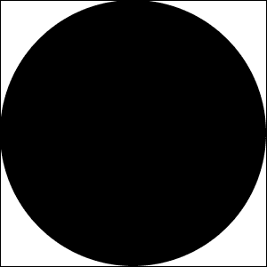
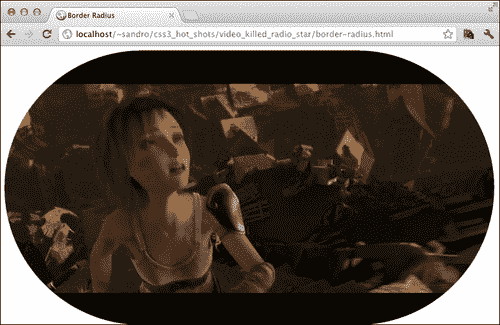
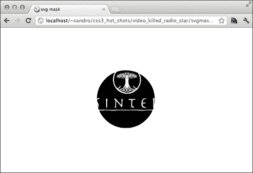
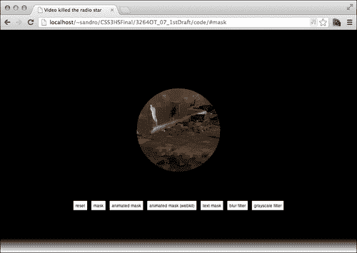
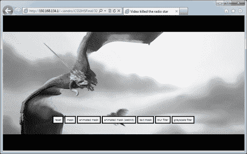

# 七、视频杀死了这位广播明星

在撰写本文时，使用 CSS 和 HTML`video`元素仍然有点像在练习黑魔法。主要问题是每个浏览器都利用其特定的视频实现技术；其中一些使用 GPU，而另一些使用与页面其余部分相同的渲染引擎。在本章中，我们将探讨如何利用 SVG 和 CSS 的强大功能在正在运行的视频上创建遮罩和效果。以下是我们将讨论的主题列表：

*   HTML5`video`元素
*   SVG 掩蔽
*   SVG 动画
*   WebKit 特定掩蔽属性
*   CSS 过滤器

# HTML5 视频元素

HTML5 规范引入了新的多媒体元素，允许在网页中更好地集成视频和音频，而无需嵌入 Flash 等外部插件。嵌入视频现在只需编写以下内容：

```html
<video src="path/to/video">
```

不过，有一些警告要考虑；首先，每个浏览器只支持可用视频编解码器的一小部分，因此，如果我们希望播放我们的元素，我们需要至少以`mp4`和`webm`对视频进行编码，然后使用另一种语法来包含这两种格式，如下所示：

```html
<video>
  <source src="path/to/video.mp4" type="video/mp4">
  <source src="path/to/video.webm" type="video/webm">
</video>
```

**米罗**[http://www.mirovideoconverter.com/](http://www.mirovideoconverter.com/) 是一款优秀的免费视频转换软件，适用于 Mac 和 Windows 操作系统。使用起来非常简单，只需选择所需的输出格式并将文件放入应用窗口即可开始转换过程。

一旦我们设置了`video`元素，我们很快就会发现大多数影响该元素形状的常见 CSS3 属性在所有浏览器上的行为方式都不一样。例如，`border-radius`属性；在下面的屏幕截图中，此属性显示在不同浏览器中显示视频的动作中（请注意此属性在不同浏览器中的行为不同）：


基于 WebKit 的浏览器似乎忽略了这个属性，而 Firefox 和 IE9 则正确地实现了它。这可能是因为 Chrome 和 Safari 使用 GPU 播放视频，因此无法对该内容应用 CSS 修改。

在处理视频和 CSS 时，布局引擎之间的这些差异需要谨慎处理。

在这个项目中，我们将使用 CSS 开发一小部分修改，这些修改可以在运行时应用于视频。让我们从一些基本的面具开始。

# 面具

**面具**是我们需要隐藏部分内容的有用工具；它们对视频更有用，因为我们可以应用有趣的效果，否则需要一些专用软件。有几种技术可以用来使用 HTML5/CSS3 创建掩码；但是，跨浏览器的支持是不一致的。为了解释不一致性，我们将在本系列中结合几种技术。

在某种程度上，我们可以使用`border-radius`来屏蔽我们的视频，因此：

```html
<!doctype html>
<html>

  <head>
    <meta charset="utf-8">
    <title>Masking</title>

    <style>
      video{
        border-radius: 300px;
      }
    </style>

  </head>

  <body>

    <video autoplay muted loop>
      <source src="video/sintel-trailer.mp4">
      <source src="video/sintel-trailer.webm">
    </video>

  </body>

</html>
```

如您所见，这种方法适用于 Firefox 和 IE，但对于基于 WebKit 的浏览器，我们需要使用不同的方法。

如果我们正在使用 web 服务器（如 Apache 或 IIS），我们可能希望将其配置为提供具有适当内容类型的视频文件。为了实现这一点，我们可以在项目的根目录中创建一个`.htaccess`文件（如果我们使用 Apache），其内容如下：

```html
AddType video/ogg .ogv 
AddType video/mp4 .mp4 
AddType video/webm .webm
```

如果我们使用 IIS，则需要遵循另一个过程。这在[的指南中有详细说明 http://blog.j6consultants.com.au/2011/01/10/cross-browser-html5-video-running-under-iis-7-5/](http://blog.j6consultants.com.au/2011/01/10/cross-browser-html5-video-running-under-iis-7-5/) 。

自 2008 年以来，WebKit 支持一组管理掩码的 CSS 属性。我们将使用`webkit-mask-box-image`选择器将图像掩码应用于我们的电影示例。为此，我们需要一个与下图类似的`300px`黑色圆圈：



然后，我们将使用前面介绍的属性将这个黑圈设置为`video`元素的掩码。应用时，此图像的黑色部分将使基础内容可见，而白色部分将使内容完全隐藏。当然，灰色可以用于部分隐藏/显示内容。

```html
video{
  border-radius: 300px;
  -webkit-mask-box-image: url(img/circle-mask.png) stretch;
}
```

结果如下：



## 更高级的掩蔽

目前，我们只能使用基本类型的掩蔽，这是可以用`border-radius`属性模拟的一切。但是，如果我们只是尝试创建一个中心有一个小圆的遮罩，我们发现这种组合与之前的技术是不可行的，因为圆角只能位于元素一侧。幸运的是，我们可以切换到更复杂但功能强大的版本，其中涉及 SVG 格式。

Gecko 和 WebKit 都通过不同的 CSS 属性支持 SVG 屏蔽基于 Gecko 的浏览器使用`mask`属性，WebKit 使用`-webkit-mask-image`。

这些属性不仅名称不同，行为也不同：

*   `mask`属性需要链接到一个名为`<mask>`的 SVG 元素，该元素基本上是一个容器，用于屏蔽`html`元素的所有形状
*   另一方面，`-webkit-mask-image`属性需要指向一个 SVG 元素，该元素包含我们想要覆盖视频的所有形状

例如，下面是我们如何正确实现`mask`属性：

```html
<!doctype html>
<html>

  <head>
    <meta charset="utf-8">
    <title>svg mask</title>

  </head>

  <body>

    <video autoplay muted loop>
      <source src="video/sintel-trailer.mp4">
      <source src="video/sintel-trailer.webm">
    </video>

 <style>
 video{
 mask: url('#circle');
 }
 </style>

 <svg>
 <defs>
 <mask id="circle">
 <circle cx="427" cy="240" r="100" fill="white"/>
 </mask>
 </defs>
 </svg>

  </body>

</html>
```

下面是我们如何处理`-webkit-mask-image`属性：

```html
<!doctype html>
<html>

  <head>
    <meta charset="utf8">
    <title>svg mask</title>

  </head>

  <body>

    <video autoplay muted loop>
      <source src="video/sintel-trailer.mp4">
      <source src="video/sintel-trailer.webm">
    </video>

 <style>
 video{
 -webkit-mask-image: url('svg/mask-circle.svg');
 }
 </style>

  </body>

</html>
```

这里，SVG 文件`svg/mask-circle.svg`定义为，如下所示：

```html
<?xml version="1.0" standalone="no"?>
<!DOCTYPE svg PUBLIC "-//W3C//DTD SVG 1.1//EN" "http://www.w3.oimg/SVG/1.1/DTD/svg11.dtd">

<svg version="1.1"  xmlns:xlink="http://www.w3.org/1999/xlink">
 <circle cx="427" cy="240" r="100" fill="white"/>
</svg>
```

在这两种情况下，最终结果相同，如下所示：



这种方法的缺点是，我们必须创建两个不同的 SVG 片段以适应两种布局引擎。这里有一个小的改进，可以引导我们找到更好的解决方案；通过利用`<use>`元素，我们可以在一个名为`svg/mask.svg`的 SVG 文件中满足这两个属性的需要，如下所示：

```html
<?xml version="1.0" standalone="no"?>
<!DOCTYPE svg PUBLIC "-//W3C//DTD SVG 1.1//EN" "http://www.w3.oimg/SVG/1.1/DTD/svg11.dtd">

<svg version="1.1"  xmlns:xlink="http://www.w3.org/1999/xlink">
  <defs>
 <mask id="circle">
 <circle id="circle-element" cx="427" cy="240" r="100" fill="white"/>
 </mask>
  </defs>
 <use xlink:href="#circle-element"/>
</svg>
```

通过使用此方法，我们可以在两种浏览器上使用单个 CSS 语句获得与前一个图像相同的结果：

```html
<!doctype html>
<html>

  <head>
    <meta charset="utf-8">
    <title>svg mask</title>

    <style>
 video{
 mask: url('svg/mask.svg#circle');
 -webkit-mask-image: url('svg/mask.svg');
 }
    </style>

  </head>

  <body>

    <video autoplay muted loop>
      <source src="video/sintel-trailer.mp4">
      <source src="video/sintel-trailer.webm">
    </video>

  </body>

</html>
```

做得好！现在我们准备在项目中实现一些掩码。

# 项目实施

在本项目中，我们将使用 Sintel 的漂亮拖车（[http://www.sintel.org/about/](http://www.sintel.org/about/) ，一部根据知识共享许可证发行的电影。

像往常一样，我们需要一个包含一些文件夹的基本项目结构（`css`、`img`、`svg`、`js`、`video`）。本项目中使用的视频可以在 Sintel 网站上获得，也可以从 Packt 的网站（[www.packtpub.com【T7）】下载，以及已完成的项目。我们还将使用](http://www.packtpub.com)**无前缀**[http://leaverou.github.com/prefixfree/](http://leaverou.github.com/prefixfree/) ），那么让我们下载它并将其放入`js`文件夹中。

让我们先创建一个`index.html`文件：

```html
<!doctype html>
<html>

  <head>
    <meta charset="utf8">
    <title>Video killed the radio star</title>

    <link rel="stylesheet" type="text/css" href="http://yui.yahooapis.com/3.5.1/build/cssreset/cssreset-min.css" data-noprefix>
    <link rel="stylesheet" type="text/css" href="css/application.css">

    <script src="js/prefixfree.min.js"></script>

  </head>

  <body>

    <a id="mask" name="mask"></a>
    <a id="mask-stretch" name="mask-stretch"></a>
    <a id="mask-animate" name="mask-animate"></a>
    <a id="mask-animate-webkit" name="mask-animate-webkit"></a>
    <a id="mask-text" name="mask-text"></a>
    <a id="blur-filter" name="blur-filter"></a>
    <a id="grayscale-filter" name="grayscale-filter"></a>

    <video autoplay muted loop>
      <source src="video/sintel-trailer.mp4">
      <source src="video/sintel-trailer.webm">
    </video>

    <ul>
      <li>
        <a href="#">reset</a>
      </li>
 <li>
 <a href="#mask">mask</a>
 </li>
      <li>
        <a href="#mask-animate">animated mask</a>
      </li>
      <li>
        <a href="#mask-animate-webkit">animated mask (webkit)</a>
      </li>
      <li>
        <a href="#mask-text">text mask</a>
      </li>
      <li>
        <a href="#blur-filter">blur filter</a>
      </li>
      <li>
        <a href="#grayscale-filter">grayscale filter</a>
      </li>
    </ul>
  </body>

</html>
```

然后，在`application.css`中，让我们做一些基本的 CSS 样式以及我们刚才介绍的掩蔽技术：

```html
html{
  min-height: 100%;
  background-image: linear-gradient(top, black, black 500px, white);
  background-size: cover;
  background-repeat: no-repeat;
}

video{
  display: block;
  margin: 0 auto;
}

ul{
  text-align: center;
  position: absolute;
  bottom : 100px;
  width: 100%;
}

li{
  display: inline;
}

li > a{
  display: inline-block;
  padding: 5px;
  background: #FFF;
  border: 3px solid black;
  text-decoration: none;
  font-family: sans-serif;
  color: black;
  font-size: 10px;
}

/* ==[BEGIN] Masking == */

a[name="mask"]:target ~ video{
 mask: url('../svg/mask.svg#circle');
 -webkit-mask-image: url('../svg/mask.svg');
}
```

下面是按下**遮罩**按钮后的结果：



## 制作面具动画

SVG 通过一些特殊元素支持动画。在本章中，我们将使用最通用的一个`<animate>`。

下面是一个例子：

```html
<circle ... >
<animate attributeType="CSS" attributeName="opacity" from="1" to="0" dur="5s" repeatCount="indefinite" />
</circle>
```

包含`<animate>`的元素将按照标记属性中指定的选项对其属性设置动画。在前面的代码中，我们要求浏览器在五秒钟内将圆的不透明度从完全可见设置为隐藏。

因此，如果我们使用以下代码创建一个名为`svg/mask-animate.svg`的新 SVG 文件，我们将能够获得在 Gecko 和 WebKit 浏览器上都能工作的动画：

```html
<?xml version="1.0" standalone="no"?>
<!DOCTYPE svg PUBLIC "-//W3C//DTD SVG 1.1//EN" "http://www.w3.oimg/SVG/1.1/DTD/svg11.dtd">

<svg version="1.1"  xmlns:xlink="http://www.w3.org/1999/xlink">
  <defs>
    <mask id="circle">
      <circle id="circle-element" cx="427" cy="240" r="100" fill="white">
 <animate attributeName="r" values="100;200;100" dur="5s" repeatCount="indefinite" />
      </circle>
    </mask>
  </defs>
  <use xlink:href="#circle-element"/>
</svg>
```

以下是我们需要添加到`css/application.css`的 CSS：

```html
a[name="mask-animate"]:target ~ video{
  mask: url('../svg/mask-animate.svg#circle');
  -webkit-mask-image: url('../svg/mask-animate.svg');
}
```

下面是遮罩在 5 秒动画中增长和收缩的结果：


# WebKit 特定属性

还有一些与屏蔽相关的额外属性，仅适用于 WebKit 浏览器；这些与`background`地产完全相同，因此以下列表摘自最初的 WebKit 博客帖子：

*   `-webkit-mask`（`background`）：这是所有其他属性的快捷方式
*   `-webkit-mask-attachment`（`background-attachment`：定义掩码是否在内容内滚动
*   `-webkit-mask-clip`（`background-clip`）：此指定掩模的剪裁区域
*   `-webkit-mask-position`（`background-position`：此属性指定遮罩在元素中的位置
*   `-webkit-mask-origin`（`background-origin`）：这指定坐标 0,0 应放置在元素内的位置（例如，在填充区域的开始处，使用`padding-box`作为值）
*   `-webkit-mask-image`（`background-image`）：此指向一个或多个用作遮罩的图像或渐变
*   `-webkit-mask-repeat`（`background-repeat`）：此定义掩模是否应重复，以及是否在一个或两个方向上重复
*   `-webkit-mask-composite`（`background-composite`）：指定两个遮罩重叠时应如何合并
*   `-webkit-mask-box-image`（`border-image`）：此指向一个或多个图像或渐变，这些图像或渐变将用作遮罩，其属性和行为与用于定义边界图像的属性和行为相同

有了这些新特性，我们可以利用 CSS 转换来创建一些额外的效果，例如，我们可以用渐变遮罩我们的电影，然后使用`:hover`改变遮罩位置；以下是 CSS 代码：

```html
a[name="mask-animate-webkit"]:target ~ video{
  -webkit-mask-position: 0 100%;
  -webkit-mask-size: 100% 200%;
  -webkit-mask-image: -webkit-gradient(linear, center top, center bottom, 
      color-stop(0.00,  rgba(0,0,0,1)),
      color-stop(1.00,  rgba(0,0,0,0))
    );
  -webkit-transition: -webkit-mask-position 1s;
}

a[name="mask-animate-webkit"]:target ~ video:hover{
  -webkit-mask-position: 0 0;
}
```

由于这些 WebKit 掩码属性是在 2008 年创建的，并且此后可能从未更新过，因此我们必须使用旧的 WebKit 渐变语法；除此之外，其他一切都非常简单，如下图所示：


# 文本掩蔽

我们可以使用文本来屏蔽`video`元素；过程与我们之前看到的类似，但当然，我们需要制作另一个特殊的 SVG 文件，名为`svg/mask-text.svg`：

```html
<?xml version="1.0" standalone="no"?>
<!DOCTYPE svg PUBLIC "-//W3C//DTD SVG 1.1//EN" "http://www.w3.oimg/SVG/1.1/DTD/svg11.dtd">

<svg  xmlns:xlink="http://www.w3.org/1999/xlink" width="1000" height="280" version="1.1">
  <defs>
    <mask id="sintel-mask">
 <text x="0" y="300" id="sintel" fill="white" style="color: black;font-size:210px;
 font-family: Blue Highway, Arial Black, sans-serif;">SINTEL</text>
    </mask>
  </defs>
 <text x="0" y="80%" id="sintel" fill="white" style="color: black;font-size:240px;
 font-family: Blue Highway, Arial Black, sans-serif;">SINTEL</text>
</svg>
```

在这里，我们不能利用`<use>`元素，因为掩模定位和掩模尺寸的确定方式之间存在另一个差异。

基于 Gecko 的浏览器只能提供固定的坐标，而基于 WebKit 的浏览器可以拉伸遮罩以适应屏幕，如果我们使用`-webkit-mask-box-image`而不是`-webkit-mask-image`（正如我们在本章第一个示例中看到的那样）。

以下是所需的 CSS：

```html
a[name="mask-text"]:target ~ video{
  mask: url('../svg/mask-text.svg#sintel-mask');
  -webkit-mask-box-image: url('../svg/mask-text.svg');
}
```

下面是结果的屏幕截图：


# 过滤器

除了遮罩，过滤器是其他功能强大的修改器，可以应用于元素以获得各种效果，如模糊、灰度和等。当然，也有缺点；在撰写本文时，过滤器的支持是不均匀的。以下是一些缺点：

*   IE9 使用著名的`progid`过滤器支持某些效果
*   如果在 SVG 片段中声明，Firefox 支持过滤器
*   Chrome、Safari 和其他基于 WebKit 的浏览器支持最新的 CSS 过滤器规范
*   IE10 尚未确认对这些属性的支持，而且它将放弃对`progid`过滤器的支持

因此，让我们实现模糊过滤器，以尽可能广泛地保持支持。首先，我们将处理 WebKit，这非常简单：

```html
-webkit-filter: blur(3px);
```

传递给`blur`函数的参数是效果的像素半径。接下来是壁虎的支持；为此，我们必须在正确完成的 SVG 文件中使用`feGaussianBlur`元素，名为`svg/filters.svg`：

```html
<?xml version="1.0" standalone="no"?>
<!DOCTYPE svg PUBLIC "-//W3C//DTD SVG 1.1//EN" "http://www.w3.oimg/SVG/1.1/DTD/svg11.dtd">
<svg  xmlns:xlink="http://www.w3.org/1999/xlink" version="1.1">
  <defs>
    <filter id="blur">
    <feGaussianBlur stdDeviation="3" />
  </filter>
  </defs>
</svg>
```

然后，我们可以使用 Gecko 支持的`filter`属性来引用这个效应：

```html
filter: url('../svg/filters.svg#blur');
```

接下来，我们还可以通过使用`progid`过滤器在 IE9 上实现此效果：

```html
filter:progid:DXImageTransform.Microsoft.Blur(pixelradius=3);
```

这是最后的 CSS。注意我们如何添加了一个`:hover`选择器技巧来改变鼠标上方的模糊；这实际上仅适用于基于 WebKit 的浏览器，但通过遵循前面所述的规则，可以轻松扩展支持：

```html
a[name="blur-filter"]:target ~ video{
  -webkit-filter: blur(3px);
  -webkit-transition: -webkit-filter 1s;      
  filter: url('../svg/filters.svg#blur');
}

.-ms- a[name="blur-filter"]:target ~ video{
  filter:progid:DXImageTransform.Microsoft.Blur(pixelradius=3);
}

a[name="blur-filter"]:target ~ video:hover{
  -webkit-filter: blur(0px);
}
```

我们还必须处理这样一个事实，Gecko 和 IE9 都引用了相同的`filter`属性，但其价值取向确实不同。为了找到解决这个问题的方法，我们可以在顶级`html`元素上使用 LeaVerou 的 prefixfree 库添加的特殊`-ms-`类。

结果如下：


在当前稳定的 Chrome 版本中，`filter`属性似乎不是现成的。这是因为我们需要在加速元素上启用过滤器。因此，让我们打开一个新选项卡，在地址栏中键入`about:flags`并启用**GPU 加速 SVG 和 CSS 过滤器**实验功能。

## 灰度滤波器

让我们再看一个过滤器，灰度！灰度过滤器基本上将目标图像或视频的所有颜色转换为相应的灰度值。

以下是完整的 CSS：

```html
/* == [BEGIN] Grayscale filter == */

a[name="grayscale-filter"]:target ~ video{
  -webkit-filter: grayscale(1);
  filter: url('../svg/filters.svg#grayscale');
}

.-ms- a[name="grayscale-filter"]:target ~ video{
  filter:progid:DXImageTransform.Microsoft.BasicImage(grayscale=1);
}
```

下面是 SVG 片段：

```html
  <filter id="grayscale">
          <feColorMatrix values="0.3333 0.3333 0.3333 0 0
                                 0.3333 0.3333 0.3333 0 0
                                 0.3333 0.3333 0.3333 0 0
                                 0      0      0      1 0"/>
  </filter>
```

最后，这里是从 IE9 中截图：



有更多的过滤器可以应用于我们的元素；有关完整列表，我们可以查看：

*   官方过滤器在[处起草规范 https://dvcs.w3.org/hg/FXTF/raw-file/tip/filters/index.html](https://dvcs.w3.org/hg/FXTF/raw-file/tip/filters/index.html)
*   SVG 规范中[处的**滤波效果**部分 http://www.w3.org/TR/SVG/filters.html](http://www.w3.org/TR/SVG/filters.html)
*   [处 MSDN 上的**过滤器**部分 http://msdn.microsoft.com/en-us/library/ms532847（v=vs.85）。aspx](http://msdn.microsoft.com/en-us/library/ms532847(v=vs.85).aspx)

# 总结

在本章中，我们发现了如何使用 CSS 处理 HTML5`video`元素；我们了解到浏览器的行为非常不同，因此我们必须实现各种技术以实现兼容性。

我们了解了如何使用 SVG 或新的 W3C 规范动态添加静态或动画遮罩，以及如何创建过滤器。

在下一章中，我们将学习如何处理复杂的动画。