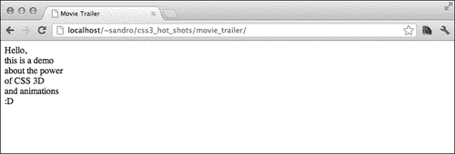
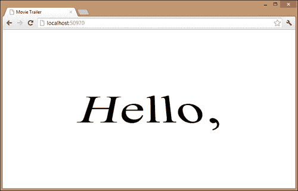
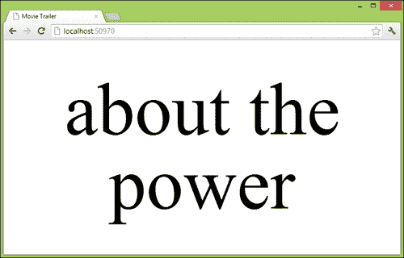
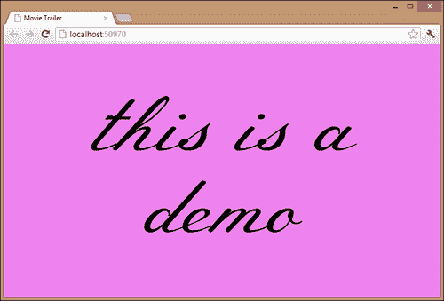

# 第九章，制作介绍

这个项目的目标是创建一个介绍，一个非交互式的动画，使用文本和视觉效果来呈现产品、概念或任何东西。这个项目让我们有机会探索一些高级动画和 3D 主题，并扩展我们对 Compass 的知识，同时创建一些特殊功能来处理这种复杂性。

本章将涵盖以下主题：

*   新的 flexbox 模型
*   创建关键帧动画
*   连接动画
*   CSS 3D 属性的动画

# 项目说明

我们希望在 3D 场景中放置一些元素，然后在其中移动。要做到这一点，我们首先必须创建一个 HTML 结构来保存这些元素中的每一个，然后我们必须找到一种聪明的方法来获得所需的效果。但是，在做任何其他事情之前，我们必须定义文件夹结构并启动项目的基本文件。

在上一个项目中，我们将使用 SASS 和 Compass，因此我们需要安装 Ruby（[http://www.ruby-lang.org/en/downloads/](http://www.ruby-lang.org/en/downloads/) ），然后在终端窗口中输入`gem install compass`（或`sudo gem install compass`。之后，我们需要在项目根文件夹中包含 Compass 配置的`config.rb`文件：

```html
# Require any additional compass plugins here.

# Set this to the root of your project when deployed:
http_path = "YOUR-HTTP-PROJECT-PATH"
css_dir = "css"
sass_dir = "scss"
images_dir = "img"
javascripts_dir = "js"

# You can select your preferred output style here (can be overridden via the command line):
# output_style = :expanded or :nested or :compact or :compressed

# To enable relative paths to assets via compass helper functions. Uncomment:
relative_assets = true

# To disable debugging comments that display the original location of your selectors. Uncomment:
line_comments = false

preferred_syntax = :sass
```

做得好！下一步是创建项目所需的文件夹，即`css`、`scss`、`img`、`js`，并定义一个空的`scss/application.scss`文件。然后我们需要从项目的根文件夹启动`compass watch .`，并最终创建主 HTML 文档`index.html`。

# 创建 HTML 结构

我们将要创建的基本上是一个幻灯片，其中每个幻灯片都放置在 3D 空间中，动画从一个幻灯片移动到另一个幻灯片。一个基本的滑动结构可以简单到：

```html
<div data-sequence="1">
  <div data-slide>
    Hello,
  </div>
</div>
```

我们需要两个嵌套的`div`标签来定义这个结构；第一个标签将覆盖 100%的窗口区域，第二个`div`标签将具有必要的属性，以将其内容保存在屏幕中央。另外，我们需要设置每张幻灯片，以便它们将一张叠在另一张上面，因为我们需要在开始在 3D 空间中移动它们之前，将它们全部放在中心。

我们可以使用`flexbox`CSS 属性来实现这个结果。实际上，flexbox 具有定义垂直对齐和水平对齐的属性。

让我们根据到目前为止看到的内容定义一个基本的 HTML 结构：

```html
<!doctype html>
<html>
<head>
  <title>Movie Trailer</title>
  <link href='http://fonts.googleapis.com/css?family=Meie+Script' rel='stylesheet' type='text/css'>
  <link rel="stylesheet" type="text/css" href="css/application.css">
</head>
<body>
 <div id="viewport">
 <div id="container">

 <div data-sequence="1">
 <div data-slide>
 Hello,
 </div>
 </div>

 <div data-sequence="2">
 <div data-slide>
 this is a demo
 </div>
 </div>

 <div data-sequence="3">
 <div data-slide>
 about the power
 </div>
 </div>

 <div data-sequence="4">
 <div data-slide>
 of CSS 3D 
 </div>
 </div>

 <div data-sequence="5">
 <div data-slide>
 and animations
 </div>
 </div>

 <div data-sequence="6">
 <div data-slide>
 :D
 </div>
 </div>

 </div>
 </div>
</body>
</html>
```

下面是没有 CSS 时幻灯片的外观：



## 制作幻灯片

首先，通过在`scss/application.scss`中写入几行代码，将每张幻灯片的`position`属性设置为`absolute`和`width`以及`height`属性设置为`100%`：

```html
@import "compass/reset";
@import "compass/css3/box";
@import "compass/css3/transform";

html,body, #viewport, #container{
  height: 100%;
  font-size: 150px;
}

#container{

  & > div{
    width: 100%;
    height: 100%;
    position: absolute;
    top: 0;
    left: 0;    
  } 

  div[data-slide]{
    width: 100%;
    height: 100%;
    text-align: center;

 @include display-box;
 @include box-align(center);
 @include box-pack(center);
  }

}
```

Flexbox 非常方便，这得益于`box-pack`和`box-align`属性，它们基本上设置了 Flexbox 主方向（默认为水平，但可以使用`box-orient`属性更改）和垂直方向上的对齐方式。

由于这个项目目前只在 Chrome 和 Firefox 上运行（IE10 在使用嵌套 3D 转换时似乎有一些问题），我们对这些属性没有意见；否则，我们应该记住，Internet Explorer 10 不支持旧的 Flexbox 语法（我们正在使用的是 2009 年的语法）。

来自微软的最新浏览器只支持最新的 Flexbox 实现，它有一个相当不同的语法，不幸的是还不能在基于 Gecko 的浏览器上工作。

在[第 4 章](04.html "Chapter 4. Zooming User Interface")、*缩放用户界面*中，我们开发了一个项目，尽管我们使用了不受支持的 Flexbox 语法，但该项目在 IE10 中也运行良好。这是因为，在这种情况下，我们包含了 Flexie，一种在不支持旧 Flexbox 语法时模拟 Flexbox 行为的 polyfill。

让我们深入了解一下这个新 Flexbox 语法的细节，为了完整起见，让我们将这两种语法添加到这个项目中。

# 新型柔性箱模型

新的灵活布局模型（从这里开始，在本章中称为 Flexbox）与以前的版本一样，旨在为开发人员提供一种对齐页面上元素的新方法。

使用这种新的长方体模型的元素可以垂直或水平放置，并且可以动态交换顺序，此外，它们还可以“灵活”其大小和位置，以响应可用空间。

下面是一个示例（在 Internet Explorer 10 上测试）：

```html
<!DOCTYPE html>

<html lang="en">
    <head>
        <meta charset="utf-8" />
        <title></title>

        <style>
            html,body,ul{
                height: 100%;
                margin: 0;
                padding: 0;
            }
 ul{
 display: -ms-flexbox;
 -ms-flex-direction: row-reverse;
 -ms-flex-pack: center;
 -ms-flex-align: center;
 -ms-flex-wrap: wrap;
 }
 li {
 font-size: 70px;
 line-height: 100px;
 text-align: center;
 list-style-type: none;
 -ms-flex: 1 0 200px;
 }

        </style>

    </head>
    <body>

        <ul>
            <li style="background-color: #f9f0f0">A</li>
            <li style="background-color: #b08b8b">B</li>
            <li style="background-color: #efe195">C</li>
            <li style="background-color: #ccdfc4">D</li>
        </ul>

    </body>
</html>
```

这是结果页面：


在前面的属性中，我们定义了一个带有`display: -ms-flexbox`的 Flexbox（W3C 值为`flex`，但每个浏览器都会稍微更改此值，可以添加自定义前缀，也可以稍微更改）。我们使用`-ms-flex-direction: row-reverse`反转可视化顺序；此属性还用于指定是需要水平配置还是垂直配置。可用值为：`row`、`column`、`row-reverse`和`column-reverse`。`-ms-flex-pack`和`-ms-flex-align`属性确定 Flexbox 子元素在其主轴和垂直轴上的对齐方式（如`-ms-flex-direction`所述）。

这些属性仍然是 Flexbox IE10 实现的一部分，但最近已被`align-items`和`justify-content`所取代，因此我们在组装时也必须注意这一点。

我们使用`-ms-flex-wrap: wrap`命令浏览器在主轴上的空间不足以容纳所有元素的情况下，将其放置在多行上。

最后，我们在每个元素上使用了`-ms-flex: 1 0 200px`来表示每个子元素都有一个正的伸缩因子`1`，因此它们将以相同的速度覆盖所有的空白，保持它们之间的大小相等，负的伸缩因子`0`，首选大小`200px`。

这与我们之前指定的`-ms-flex-wrap`属性一起创建了一个有趣的响应效果，如果浏览器窗口太小，无法将元素放在一行中，元素将移动到新行：


## 创建示例布局

我们可以利用此属性创建一个三柱布局，如果没有足够的空间，例如在移动设备中，两个横向柱在中心柱下方和上方移动。以下是创建此类布局的代码：

```html
<!DOCTYPE html>

<html lang="en">
    <head>
        <meta charset="utf-8" />
        <title></title>

        <style>
 section {
 min-height: 300px; 
 }

 div {
 display: -ms-flexbox;
 -ms-flex-direction: row;
 -ms-flex-pack: center;
 -ms-flex-wrap: wrap;
 }

 aside, nav {
 -ms-flex: 1 3 180px;
 min-height: 100px;
 }

 nav {
 -ms-flex-order: 1;
 background-color:  #ffa6a6;
 }

 aside {
 -ms-flex-order: 3;
 background-color:  #81bca1;
 }

 section {
 -ms-flex: 3 1 600px;
 -ms-flex-order: 2;
 background-color: #72c776;
 }
        </style>
    </head>
    <body>

        <div>
            <section></section>
            <nav></nav>
            <aside></aside>
        </div>

    </body>
</html>
```

结果如下：


如果我们现在调整浏览器窗口的大小，我们会注意到`nav`和`aside`元素是如何在主内容上下移动的，为移动设备创建了一个漂亮的布局：


让我们回到我们的项目；我们可以通过几行 CSS 轻松添加对 Flexbox 新版本的支持，如下所示：

```html
  div[data-slide]{
    width: 100%;
    height: 100%;
    text-align: center;

    @include display-box;
    @include box-align(center);
    @include box-pack(center);

 display: -ms-flexbox;
 display: -moz-flex;
 display: -webkit-flex;
 display: flex;
 -ms-flex-pack: center;
 -moz-align-items: center;
 -webkit-align-items: center;
 align-items: center;
 -ms-flex-align: center;
 -moz-justify-content: center;
 -webkit-justify-content: center;
 justify-content: center;
  }
```

下面是期待已久的结果：


# 处理幻灯片

我们现在可以使用一些 3D`transform`属性在 3D 场景中移动和旋转这些幻灯片。这些变换绝对是任意的，可以根据电影预告片的整体效果进行选择；下面是一个例子：

```html
div{
  &[data-sequence="1"]{
    @include transform(rotateX(45deg));
  }

  &[data-sequence="2"]{
    @include transform(rotateY(45deg) translateY(300px) scale(0.5));
  }

  &[data-sequence="3"]{
    @include transform(rotateX(90deg) translateY(300px) scale(0.5));
  }

  &[data-sequence="4"]{
    @include transform(rotateX(90deg) translateY(300px) translateX(600px) scale(0.5));
  }

  &[data-sequence="5"]{
    @include transform(rotateX(90deg) translateZ(300px) translateY(350px) translateX(600px) scale(0.5));
  }

  &[data-sequence="6"]{
    @include transform(rotateZ(30deg) translateY(500px) translateZ(300px));
  }
}
```

现在，我们需要在幻灯片的父元素上设置一些 3D 标准属性，例如`transform-style`和`perspective`：

```html
#viewport{
  @include transform-style(preserve-3d);
  @include perspective(500px);
  overflow: hidden;
  width: 100%;
}

#container{
    @include transform-style(preserve-3d);
}
```

如果我们现在在 Chrome 上运行这个项目，我们会注意到幻灯片并不像上一个截图那样堆积如山；相反，它们现在都被放置在 3D 场景周围（大多数在变换后不可见）：



# 移动摄像机

现在，我们将学习创建在幻灯片中移动的摄影机的效果；由于无法移动用户的视口，我们需要通过移动场景中的元素来模拟这种感觉；这可以通过对`#container`应用一些转换来实现。

要将相机靠近幻灯片，我们需要应用我们在该幻灯片上使用的精确变换，但值相反，顺序相反。因此，例如，如果我们想要查看其`data-sequence`属性为`3`的帧，我们可以写：

```html
// not to be permanently added to the project
#container{
    @include transform(scale(2) translateY(-300px) rotateX(-90deg));
}
```

结果如下：



动画必须聚焦在幻灯片上，静止一段时间，然后移动到下一张幻灯片。在创造这种效果时，我们通常面临以下两个主要问题：

*   CSS`keyframes`只接受百分比值，但我们更愿意使用秒作为度量单位（例如，说“在 2 秒内移动到下一张幻灯片，然后静止 1 秒”）
*   我们需要为每张幻灯片处理两条`keyframes`规则（移动和静止）；最好有一个函数为我们处理这个问题

通过使用 SASS，我们可以轻松地解决这两个问题。首先，我们可以创建一个函数，通过接受动画的总长度，将秒数转换为百分比值：

```html
$total_animation_duration: 11.5;
@function sec_to_per($sec, $dur: $total_animation_duration){
 @return 0% + $sec * 100 / $dur;
}

```

此函数接受两个参数：要从秒转换为百分比的值和动画的总长度。如果未提供此参数，则将该值设置为等于`$total_animation_duration`变量。

我们可以为该项目创建的第二个函数以`move`时间和`still`时间为参数，打印必要的关键帧，并跟踪动画的前进百分比：

```html
$current_percentage: 0%;
@mixin animate_to_and_wait($move, $still ) {

 $move_increment: sec_to_per($move);
 $current_percentage: $current_percentage + $move_increment;

 #{ $current_percentage }{ @content }

 @if $still == end {
 $current_percentage: 100%;
 } @else{
 $still_increment: sec_to_per($still);
 $current_percentage: $current_percentage + $still_increment;
 }

 #{ $current_percentage }{ @content } 

}
```

此函数的作用是基本上以百分比转换`$move`参数，并将此值添加到`$current_percentage`全局变量中，该变量跟踪动画中的进度。

然后，我们使用我们刚刚计算的百分比打印一个关键帧，其中包含`@content`变量的值，SASS 使用函数调用后放在花括号之间的内容为我们填充该变量，例如：

```html
myfunction(arg1, arg2){
  // everything here is placed into @content variable
}
```

如果`$still`等于`end`，我们希望静止阶段持续到动画结束，所以我们将`$current_percentage`变量设置为`100%`；否则，我们对待这个变量就像对待`$move`变量一样，然后打印另一个关键帧。

# 动画带来的乐趣

为了处理CSS3 动画属性附带的所有实验前缀，我们可以再次使用 Compass 动画插件（`gem install animation`来自命令行终端，然后使用`compass watch . -r animation`从项目的根文件夹重新启动 Compass）。

我们还需要在`application.scss`中包含`animation`：

```html
@import "animation";
```

我们还需要编写一个小函数，将动画插件提供的函数封装起来，并在每次从一个实验前缀切换到另一个前缀时重置`$current_percentage`：

```html
@mixin ext_keyframes($name){

  @include with-only-support-for($moz: true) {
    @-moz-keyframes #{$name} { @content; }
    }
    $current_percentage: 0%;
    @include with-only-support-for($webkit: true) {
    	@-webkit-keyframes #{$name} { @content; }
    }
    $current_percentage: 0%;
    @include with-only-support-for {
      @keyframes #{$name} { @content; }
    }
}
```

好的我们现在已经准备好把事情放在一起并定义我们的动画：

```html
/* == [BEGIN] Camera == */
@include ext_keyframes(camera){
 0%{
 @include transform(none);
 }

 @include animate_to_and_wait(0.5, 1.5){ 
 @include transform(scale(2) rotateX(-45deg));
 }

 @include animate_to_and_wait(0.5, 1.5){
 @include transform(scale(2) translateY(-300px) rotateY(-45deg));
 }

 @include animate_to_and_wait(0.5, 1.5){
 @include transform(scale(2) translateY(-300px) rotateX(-90deg));
 }

 @include animate_to_and_wait(0.5, 1.5){
 @include transform(scale(2) translateX(-600px) translateY(-300px) rotateX(-90deg));
 }

 @include animate_to_and_wait(0.5, 1.5){
 @include transform(scale(2) translateX(-600px) translateY(-350px) translateZ(-300px) rotateX(-90deg));
 }

 @include animate_to_and_wait(0.5, end){
 @include transform(scale(2) translateZ(-300px) translateY(-500px) rotateZ(-30deg));
 }
}
/* == [END] Camera == */
```

最后，我们必须将适当的动画属性添加到`#container`：

```html
#container{
@include animation(camera #{0s + $total_animation_duration} linear);
@include animation-fill-mode(forwards);
}
```

完成！浏览器中的最后一次重新加载足以充分欣赏动画：


## 步进动画

现在，我们将创建一个特殊的动画，在每次幻灯片更改时同步切换项目的背景色。因为我们不希望颜色之间出现任何褪色，所以我们将引入 step 动画。

步骤动画让我们指定在每个声明的关键帧之间必须放置多少帧；下面是一个例子：

```html
<!DOCTYPE html>

<html lang="en">
    <head>
        <meta charset="utf-8" />
        <title></title>
        <style>
            div {
                width:  100px;
                height: 100px;
                background-color: red;
                position: absolute;
 -webkit-animation: diagonal 3s steps(5) infinite alternate;
            }

            @-webkit-keyframes diagonal {
                from {  
                    top: 0;
                    left: 0; 
                }
                to {  
                    top: 500px;
                    left: 500px; 
                }
            }

        </style>
    </head>
    <body>
        <div></div>
    </body>
</html>
```

如果我们现在在浏览器中运行这个小示例，我们将看到`div`元素的运动不是流动的，而是由五帧组成的。我们可以在步骤声明中添加特殊关键字`start`或`end`（例如`step(5, end)`，要求浏览器在每个步骤中跳过初始或最终关键帧。好的现在，我们可以将相同的概念应用到我们的 intro 项目中。首先，我们需要定义一个改变`background-color`属性的动画：

```html
/* == [BEGIN] bg == */
@include ext_keyframes(bg){
  0%{
    background: green;
  }
  #{sec_to_per(2)}{
    background: darkolivegreen;
  }
  #{sec_to_per(4)}{
    background: violet;
  }
  #{sec_to_per(6)}{
    background: orange;
  }
  #{sec_to_per(8)}{
    background: lightsteelblue;
  }
  #{sec_to_per(10)}{
    background: thistle;
  }
  100%{
    background: pink;
  }
}
/* == [END] bg == */
```

请注意我们是如何使用`sec_to_per`函数的，以便使用秒而不是百分比；接下来，我们只需要使用`animation`属性将`bg`添加到`#viewport`：

```html
#viewport{
  @include animation(bg #{0s + $total_animation_duration} steps(1,start));
  @include animation-fill-mode(forwards);
}
```

结果如下：


# 最后的润色

现在，我们已经定义了一个基本结构，并且已经学习了如何创建在 3D 场景中放置的幻灯片中移动的流体动画，显然，下一步是使用图像、视频、图形以及我们可能需要的所有内容来丰富每一张幻灯片。

要做到这一点，我们可以利用本书前几章中积累的知识；例如，我们可以很容易地为第一张幻灯片定义淡入动画，如下所示：

```html
div[data-sequence="1"]{
  @include animation(sequence_1 2s linear);
  @include animation-fill-mode(forwards);
}

/* == [BEGIN] sequence_1 == */
@include ext_keyframes(sequence_1){
  0%{
    color: rgba(0,0,0,0);
  }
}
/* == [END] sequence_1 == */
```

我们还可以在幻灯片中添加自定义字体：

```html
div[data-sequence="2"]{
  font-family: 'Meie Script', cursive;
}
```

结果如下：



# 总结

CSS 动画和 3D 转换可以结合起来创造有趣的结果；当然，当我们转向这些类型的功能时，我们必须接受一个事实，即某些浏览器可能无法支持该项目。然而，当这些特性不受支持时，我们总是可以使用一些特性检测库（如 Modernizer）来解决这个问题。

在下一章中，我们将完全使用 CSS3 创建一个漂亮的图形库！