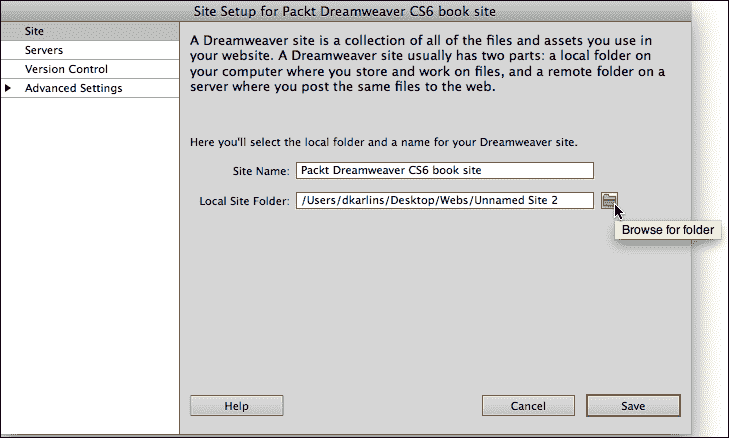
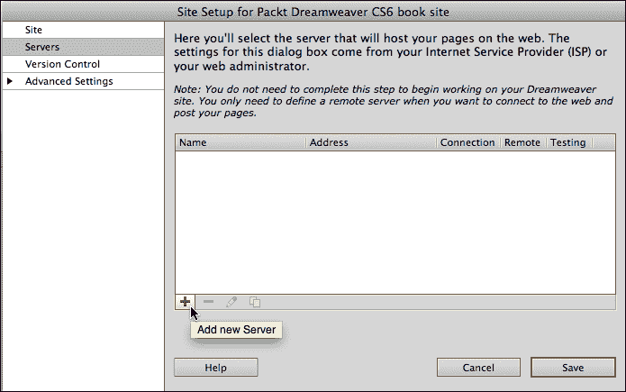
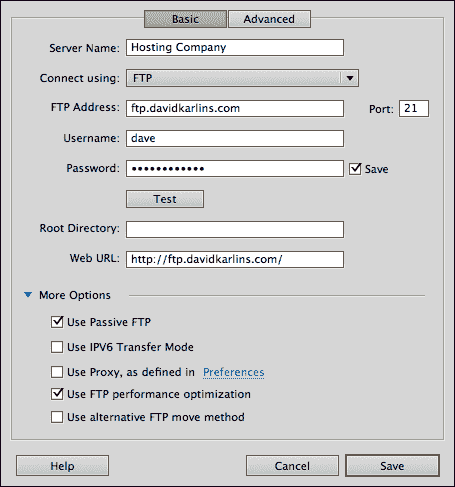
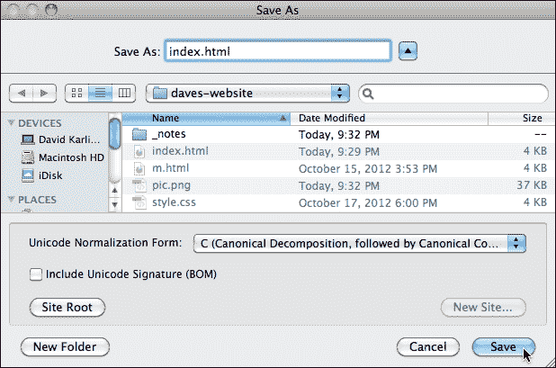
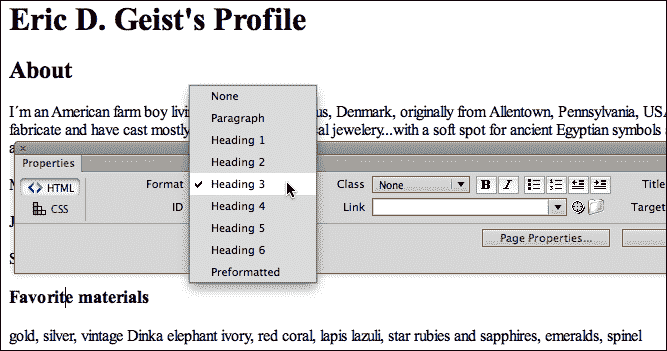
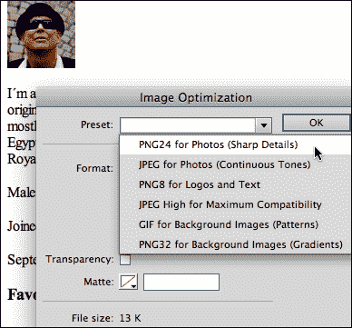
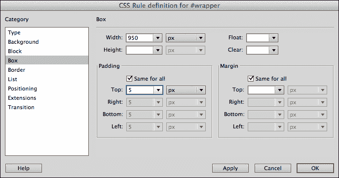

# 第一章。使用 Dreamweaver CS6 创建网站和页面

这本书以压缩的方式涵盖了 Dreamweaver CS6 中提供的所有前沿和高级功能。我们的重点是 HTML5 中结构内容并使其更容易访问的新功能，是向元素添加变换(如旋转)和效果(如圆角)的 CSS3 样式，以及带有 HTML5 媒体查询和 jQuery Mobile 的移动设计。Dreamweaver CS6 提供了实现所有这些功能的所有重要工具。

我们很快就会谈到这一点。但是首先，在本章中，回顾一下(对于那些刚接触 Dreamweaver 的人来说，了解一下)一些在 Dreamweaver 中最大限度提高工作效率的基本工具是很重要的。这样做有两个目的:它提供了对 Dreamweaver CS6 基础知识的快速而激烈的概述，而且可能更重要的是，它使我们所有人都有了保护我们将在本书中介绍的所有其他内容的完整性的协议。

在本章中，我们将:

*   定义一个 Dreamweaver 站点
*   创建 HTML5 页面
*   将元素应用于文本
*   定义链接
*   插入图像
*   创建 CSS 文件并将 HTML 页面链接到这些样式表
*   为页面设计定义和应用 ID 和类 Div 样式

# 定义一个 Dreamweaver 站点

在 Dreamweaver 中所做的一切都要求您首先创建一个 Dreamweaver 站点。没有那个 Dreamweaver 站点，Dreamweaver 中就没有真正有效的东西。

为什么会这样？基本上这就是因为你在这本书的过程中学习构建的网页涉及到几十个文件。几十个？真的吗？好吧，数一数:几个 JavaScript 文件，到内部和外部页面的链接，嵌入的音频、视频和图像，到 CSS 文件的链接，以及使用 iFrame 技术从其他页面嵌入的内容。我们已经有几十个了！

如果这些文件之间的任何关系或链接被破坏(通过移动、重命名或删除文件)，我们的页面就会崩溃。但是，如果我们在 Dreamweaver 网站中工作(并遵循在其中工作的规则)，Dreamweaver 会跟踪您所有网页中的所有文件，例如嵌入的图像文件和视频剪辑以及到其他网页的链接，并确保所有这些文件协同工作。

Dreamweaver 站点还提供工具来管理我们的本地(预览)站点和该站点的在线远程版本之间的文件传输。

## 定义本地站点

所有这些都始于为您使用 Dreamweaver 管理的每个网站定义一个单独的(并且只有一个)Dreamweaver *站点*。我们这里有斜体大写的“*网站*，以强调我们不是在谈论在“网站”中组织文件，而是定义一个非常具体的 Dreamweaver 事物——网站。

在 Dreamweaver 的任何界面中，最简单的方法是通过**站点**菜单。定义网站的第一步(也是最重要的一步)是在你自己的电脑上创建一个本地版本；稍后可以链接到远程(在线)服务器。

在定义 Dreamweaver 站点之前，请在您的计算机上创建一个文件夹(您的桌面是一个方便的地方)，作为站点的根文件夹。命名该文件夹时避免空格或特殊字符(即`daves-website`而不是`Dave's Website!`)。

要定义本地站点，请执行以下步骤:

1.  随着 Dreamweaver CS6 的上线，选择**站点** | **新站点**。**站点设置**对话框打开。
2.  在**网站名称**字段中，输入有助于您将该网站与其他网站区分开来的任何内容。使用空格或特殊字符没有限制。
3.  In the **Local Site Folder** field, use the **Browse for Folder** icon to locate the folder you created to serve as your site's root folder.

    

    前面的截图展示了如何为 Dreamweaver 站点创建根文件夹。

4.  点击 **浏览文件夹**图标后，**选择根文件夹**对话框打开。导航到您的根文件夹，点击**选择**。这将返回到**站点设置**对话框。
5.  Click on **Save** to complete the local site's definition:

    

上一张截图显示了一个定义了**本地站点文件夹**文件的 Dreamweaver 站点。

我们将很快返回到我们的本地站点，看看如何使用它，但是首先让我们来看看如何为我们的站点定义远程连接。

## 定义远程站点

大多数网站都打算在互联网上公开发布。它们托管在支持此功能的服务器上；这些服务器主机很容易找到(一个可靠的定价和功能列表在[http://reviews.cnet.com/web-hosting-plans/](http://reviews.cnet.com/web-hosting-plans/))。

在定义到远程服务器的 Dreamweaver CS6 链接之前，您需要已经为远程主机签订了合同。这项托管服务将为您提供三项基本信息——一个 FTP 地址、一个用户名和一个密码。一些主机设置也包括一个定义的根目录。当您签约托管时，请记录这些信息，或者如果您现在才将该服务器合并到 Dreamweaver 站点，请查找您当前托管服务的登录信息。

考虑到您的 FTP 地址、用户名和密码，以下步骤将介绍为您的 Dreamweaver 站点定义远程连接所需的内容。或者不要。请记住，远程站点并不是在自己的计算机上建立站点所必需的，您将能够在没有远程连接的情况下完成本书中的几乎所有内容。

要为 Dreamweaver 站点定义远程连接，请执行以下步骤:

1.  随着 Dreamweaver CS6 的推出，选择**站点** | **管理站点**。这将打开**管理站点**对话框，顺便说一下，您可以使用这种技术(管理站点)编辑 Dreamweaver 站点定义中的任何内容，而不仅仅是远程连接。
2.  在**管理站点**对话框中，从**您的站点**列表中双击您的站点，再次打开**站点设置**对话框。
3.  在**站点设置**对话框左侧的类别列表中，选择**服务器**。
4.  Click on the **Add New Server** (**+**) button. Another dialog named **Site Setup…** opens.

    

    上一张截图显示了一个新的服务器连接被添加到站点定义中。

5.  在**服务器名称**字段中，输入任何有助于您记住所连接的服务器的文本。
6.  在 **FTP 地址**字段，输入您的托管管理员提供的 FTP 地址，在 **用户名**字段输入提供的用户名，在**密码**字段输入您的密码。大多数站点使用**端口 21** ，因此除非站点管理员指示，否则不要更改**端口**字段中的默认值。
7.  Selecting the **Use Passive FTP** and **Use FTP Performance Optimization** checkboxes can be advantageous in avoiding connection glitches. To see these options, expand the **More Options** section of the **Site Setup…** dialog. By default, these checkboxes are selected in Dreamweaver CS6.

    

    上面的截图说明了一个定义的远程连接。

8.  **网址**字段是由 Dreamweaver 根据您在**文件传输协议地址**字段中输入的内容自动填写的。Dreamweaver 使用这些信息作为工具，如其内置的链接检查功能，但这些信息与定义网站的过程无关，更多的是分散了定义网站的注意力。如果您愿意，您可以用您网站的实际网址替换生成的网址。
9.  Don't click on **Save** yet. First, click on the **Test** button. If you get an error message, check your FTP address, login credentials, and password with your site-hosting company (and be sure you are connected to the Internet). When the **Test** button produces a message saying that you have connected to your web server successfully, click on **Save**.

    

    上面的截图展示了一个成功测试的远程连接。

10.  保存远程连接后，**站点设置…** 对话框再次出现。再次点击**保存**。然后，点击**管理站点**对话框中的**完成**按钮。您的站点现已定义！

## 在本地和远程站点之间传输文件

定义 Dreamweaver 站点后，您可以在**文件**面板中查看该站点的本地或远程版本中的文件。与 Dreamweaver 中的任何其他面板一样，您可以通过**窗口**菜单查看或隐藏**文件**面板。

在**文件**面板顶部的工具栏中有两个下拉菜单。使用第一个选择一个 Dreamweaver 站点。如果您只有一个网站，默认情况下将选择该网站。

**文件**工具栏中的第二个下拉菜单在四个视图之间切换，其中两个是相关的，另外两个对于大多数设计师来说是深奥的。前两个选项在查看站点的本地或远程版本的文件之间切换。**测试** **服务器**选项用于管理数据的后端编程脚本，**存储库视图**选项用于存储的代码片段。

前面的截图说明了本地视图和远程视图之间的切换。

当您点击**连接到远程服务器**按钮时，您可以使用**文件**面板查看您远程站点中的文件。点击**文件**面板工具栏最右侧的**展开/折叠**图标，可以拆分**文件**面板:

上图截图中，按下**连接远程服务器**按钮，悬停**折叠/展开**按钮；这允许我们在同时查看本地和远程视图(展开时)或仅查看本地或远程视图(折叠时)之间切换。

您可以将文件从**文件**面板的本地拖到远程，或者使用**获取文件**(向下箭头)或**放置文件**(向上箭头)符号分别下载或上传您的文件。

# 创建 HTML5 页面

定义了站点后，您就可以在 Dreamweaver 中创建 HTML5 页面了。HTML5 是当前 HTML 的标准，也是 HTML 最广泛支持的版本，包括较早的浏览器。HTML5 中有一些旧浏览器不支持的新功能，但 HTML5 文档本身为使用旧浏览器查看现代网站的访问者产生的错误信息最少。由于这些原因，HTML5 是 Dreamweaver CS6 中网页的默认文档类型。

Dreamweaver CS6 附带预设计的 HTML5 页面布局，一个用于两列页面，一个用于三列页面。这些都是有用的，并且有很好的文档记录，但是在 Dreamweaver CS6 的压缩介绍中，我们将不得不匆匆而过，以便从头开始构建 HTML5 页面。

按照以下步骤在 Dreamweaver CS6 中创建新的 HTML5 页面:

1.  从 Dreamweaver 的主菜单中选择**文件** | **新建**。出现**新文档**对话框。
2.  From the left-hand side column, choose **Blank Page**. In the **Page Type** column, choose **HTML**. In the **Layout** column, choose **<none>**. And leave **HTML 5** as the setting in the **DocType** drop-down menu. Click on the **Create** button to generate a new page.

    

    创建新的 HTML5 页面

3.  The new page opens in Dreamweaver's **Design** window. We won't explore every option in the **Design** window, but will identify key ones:
    *   “文档”工具栏左上角的**代码**、**拆分**和**设计**按钮在代码编辑器、代码编辑器之间的屏幕拆分和所见即所得页面之间切换，或者只是所见即所得视图。你们大多数人会发现**分割**视图最有效，因为它提供了对所见即所得设计工具的快速访问，以及对代码的访问。
    *   **Live** 视图打开时，显示的页面更像浏览器中显示的页面(例如，用于查看链接在浏览器中的外观)。但是您不能在打开**实时**视图的情况下进行编辑。
    *   浏览器中的**预览/调试**按钮在任何已安装的浏览器中提供页面的快速预览。
    *   **文件管理**按钮允许您直接从**设计**视图上传打开的页面，无需求助于**文件**面板。
    *   **WC3 验证**按钮访问工具来测试你的代码。
    *   **刷新**按钮更新**设计**视图以匹配新代码。
    *   **标题**字段定义出现在浏览器标题栏中的页面标题。

    

    上面的截图说明了文档工具栏中的一些关键工具。

4.  Choose **File** | **Save** to save your file. Use lowercase letters and numbers with no spaces or special characters (except _ or -) to ensure your files and links will not get corrupted and will open in the browsers.
    *   第一次保存文件时，**另存为**对话框打开。
    *   使用**另存为**对话框中的**站点根目录**按钮快速导航到您的 Dreamweaver 站点的根目录文件夹。对于较小的网站，您可以将所有文件直接保存在此文件夹中。对于更复杂的网站，您可以在此文件夹中创建子文件夹。
    *   最广泛支持的为任何文件夹定义主页的方法是将其命名为`index.html`。
    *   使用`.htm`或`.html`作为文件扩展名，但避免两者都使用，以防止两个同名不同扩展名的文件造成混乱。
    *   在**另存为**字段输入有效文件名后，点击**保存**。

    

上面的截图说明了将一个 HTML5 页面保存为带有`index.html`文件名的网站的主页。

# 创建文本内容

Dreamweaver 文档窗口中的一个有价值且可提高工作效率的功能是**设计**视图(或**分割**视图的**设计**侧)用作功能性文字处理器。您可以在键入时使用一套标准的编辑工具在此撰写文本。

也就是说，你更有可能从网页或文字处理器文档中复制文本内容。

根据文本的来源，Dreamweaver 提供了一组将文本粘贴到“文档”窗口的选项。通过选择**编辑** | **粘贴特殊**来访问这些。使用试错法找到最适合将复制的文本粘贴到“文档”窗口的选项(从极简**纯文本**到保留更多格式的选项)。

将复制的文本粘贴到 Dreamweaver 页面

## 应用标题

HTML 文本元素(标签)——标题、段落和列表——应该用来表示内容的优先级。 CSS 样式(我们很快就会用到)用来定义这些元素的外观。

一般来说，`h1`元素是应用于页面上最重要的标题，`h2`应用于次要标题，依此类推。

通过单击段落中的任意位置，并从**属性**检查器的**格式**下拉菜单中选择标题来应用标题元素(如果不可见，请选择**窗口** | **属性**)。

前面的截图说明了将`h3`标签应用于选定的文本行。

## 添加段落、列表和链接

默认情况下，您在“文档”窗口中输入的内容会添加段落标记以应用段落格式(包括段落之间的一行间距)。您可以从**属性**检查器的**格式**下拉菜单中，将段落标记应用到所选段落。

单击**属性**检查器中的两个图标之一，将有序(编号)或无序(项目符号)列表应用于选定的文本。

在前面的截图中，无序列表和列表标签已经应用于文档窗口。

您可以通过在**属性** 检查器的**链接**字段中输入一个网址(包括`http://www`部分)来为所选文本分配链接。从**目标**下拉菜单中选择 **_blank** ，在新的浏览器窗口(或选项卡，取决于用户的配置)中打开链接。输入当链接悬停在**标题**字段时显示的标题文本。

在前面的截图中，定义了一个将在新的浏览器窗口中打开的链接；此外，还会应用链接标题。

您也可以使用位于**链接**字段右侧的**浏览文件**图标来浏览和链接到您的 Dreamweaver 站点中的文件。

## 插入图像

如果您已经为网站保存和准备了图像，您可以通过在文档窗口中单击以定义插入点，然后选择**插入** | **图像**来嵌入它们。出现**选择图像源**对话框。导航并选择您的图像文件，点击**打开**插入图像。当您这样做时，**图像标签辅助功能属性**对话框出现。在**替代文本**字段中输入文本，图像被禁用或视力受损的用户可以访问该文本。**长描述**字段可用于当您的网站的主要受众是无法查看图像的用户时，链接到描述图像的 HTML 页面。

在前面的截图中，为图像定义了替代文本。

您也可以将任何来源的图稿复制并粘贴到 Dreamweaver 文档窗口中。粘贴复制的图像会启动**图像优化**对话框。**预设**下拉菜单提供了清晰解释的选项，用于将图像转换为可用的网络友好图像格式之一。选择一个，点击**确定**插入并启动**保存网页图片**对话框。

上面的截图说明了如何为粘贴的图像选择文件格式。

在**保存网页图像**对话框中，在**另存为**字段中输入文件名(除–或 _)外，没有空格或特殊字符。点击**保存**保存图像，如下图截图所示:

# 链接到样式表

在快速浏览了创建包含文本、图像、标题、列表、和链接的 HTML5 网页所需的基本技术后，让我们转到一个更压缩的调查，即定义该网页并将其链接到外部 CSS 样式表。

一段时间以来，外部级联样式表(CSS)文件一直是格式化网页内容的标准方式，取代了网页设计发展的早期步骤，例如使用数据表进行网页设计，或使用 HTML 属性(例如，`color=red`)进行格式化。

当我们使用与不同类型的内容(如文章、标题、页脚和侧栏)相关联的新的 HTML5 元素来组织页面内容时，我们将在下一章中回到网格样式和 HTML 来设计页面。在这里，我们将简单地建立创建和链接样式表的基本技术。

## 创建并链接到外部样式表

一个基本的网站，即使是一个大型网站，通常也可以使用链接到数百甚至数千页的单个外部样式表。将样式组织在外部样式表中允许全局更新—当样式表中的页面背景改变时，整个站点的背景也会改变。

要创建样式表，请执行以下步骤:

1.  从 Dreamweaver 主菜单中选择**文件** | **新建**。出现**新文档**对话框。
2.  在左栏中，选择**空白**。
3.  在**页面类型**栏，选择 **CSS** 。
4.  点击**创建**。一个新的 CSS 文件以`@charset`声明打开，该声明支持最宽的字符集，并有一个注释表明这是一个 CSS 文件。
5.  Save the file by choosing **File** | **Save**. Your stylesheet file can have a simple name such as `style.css` (as always, avoid spaces, upper-cases, or special characters). Enter the filename in the **Save As** field of the **Save As** dialog and click on **Save** to save the file, as shown in the following screenshot:

    

## 将样式表链接到 HTML 文件

要将一个 CSS 文件链接到一个 HTML 页面，您必须首先确保该 HTML 页面已在“文档”窗口中打开。

请注意，保存文件后，您可以在“文档”工具栏上方的标签栏中在 CSS 文件和打开的 HTML 文件之间切换，如下所示(您可以使用这些标签在打开的文件之间切换):

按照以下步骤将 CSS 文件链接到打开的 HTML 页面:

1.  打开 HTML 文件，查看 **CSS 样式**面板(**窗口** | **CSS 样式**)。
2.  点击 **CSS 样式**面板底部的**附加样式表**图标。将打开**附加外部样式表**对话框。
3.  使用**浏览**按钮导航并选择你的 CSS 文件，点击**附加外部样式表**对话框中的**确定**将 CSS 文件链接到你打开的 HTML 页面。
4.  链接的 CSS 文件现在出现在 **CSS 样式**面板中(确保在 **CSS 样式**面板的顶部选择了**全部**选项卡，而不是**当前**选项卡)。

### 定义主体标签的样式

任何网页中最具定义性的元素是`<body>`标签，因为它控制着所有可见的页面内容。随着样式表的增长，更具体的标签将覆盖`body`标签样式，但是应用于`body`标签的样式会设置页面的默认外观。因此，让我们以此为例说明如何在 Dreamweaver 中定义样式。

要使用字体、字体颜色和页面背景颜色定义`body`样式，请执行以下步骤:

1.  在 **CSS 样式**面板中，点击面板底部的**新 CSS 规则**图标；**新 CSS 规则**对话框打开。
2.  从**选择器类型**下拉菜单中，选择**标签**。
3.  从**选择器名称**下拉菜单中，选择**车身**。
4.  在**规则定义**下拉菜单中，选择链接样式表。
5.  点击**确定**启动**规则定义**对话框。
6.  在**类型**类别中，从**字体系列**下拉菜单中选择一个字体系列。
7.  Choose other font parameters and values from other drop-down menus and swatches in the **Type** category.

    

    前面的截图说明了为主体元素定义字体系列。

8.  在 **CSS 规则定义…** 对话框的**背景**类别中，选择一种背景颜色。
9.  点击**应用**预览您的设置。
10.  点击**确定**应用您的设置。

一旦定义，样式可以在 **CSS 样式**面板的下半部分进行调整。如下图所示，在 **CSS 样式**面板中编辑`font-family`属性:

## 定义包装标识样式

在“包装”我们在 Dreamweaver CS6 中对基本页面构建技术的压缩探索/回顾之前，让我们应用一个“包装”`div`标签来约束我们的页面宽度，并创建一个独立于页面本身的页面背景。

虽然我们在下一章中创建的 HTML5 样式将让我们有机会深入探索使用 CSS 的页面设计，但是 HTML5 没有附带“包装”元素，我们必须创建自己的样式。

我们应用的技术是将所有页面内容包含在一个名为 **Div** 标签的特殊标签中。 Div 标签划分内容的各个部分，如果没有与之相关的样式，就做不了什么。

Dreamweaver 从根本上简化了用包装标签包装页面的过程。为此，只需遵循以下步骤:

1.  打开 HTML 文件，将光标放在**分割**视图的**设计**侧，选择**编辑** | **全选**选择所有页面内容。
2.  选中所有页面内容，选择**插入** | **布局对象** | **Div 标签**。**插入分区标签**对话框打开。
3.  将**插入**下拉菜单设置为**环绕选择**。
4.  Enter `wrapper` in the **ID** field and click on the **New CSS Rule** button. The **New CSS Rule** dialog opens; the following screenshot illustrates how to use the **Insert Div Tag** dialog to create an **ID** style:

    

5.  在**新 CSS 规则**对话框中，只需点击**确定**。 **CSS 规则定义…** 对话框打开。
6.  在**框**类别中，在**宽度**字段中输入`950`以将我们的页面宽度限制为标准的 960 像素大小(我们将使用填充来用完缺少的十个像素)。
7.  在对话框的**填充**部分，输入一个值`5` (px)。
8.  In the **Margin** section of the dialog, deselect the **Same for All** checkbox and enter `Auto` for the **Left** and **Right** margins to center the wrapper.

    

    在前面的截图中，宽度、填充和边距是为名为`wrapper`的标识样式定义的。

9.  在 **背景**类别中，为包装定义不同的背景颜色(不同于`body`标签的背景颜色)。
10.  点击**确定**应用包装。

# 总结

在本书的第一章中，我们完成了对在 Dreamweaver CS6 中工作的基本和基础技术的压缩调查。其中包括在 Dreamweaver 站点中定义和工作、构建 HTML5 页面以及链接 CSS 样式表文件。

我们还完成了定义 ID `div`标签样式和在容器`div`标签中布局页面内容的过程。这是现代网页设计的基本构件。

在下一章中，我们将学习在 Dreamweaver 中构建网页，依靠 HTML5 容器标签，这使得页面内容结构更加合理和易于设计，并为搜索引擎优化页面内容。