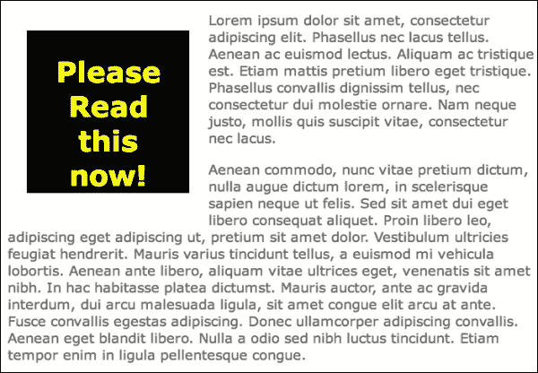
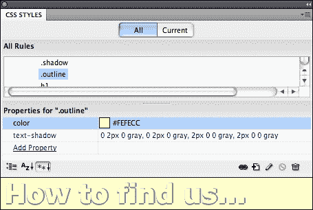
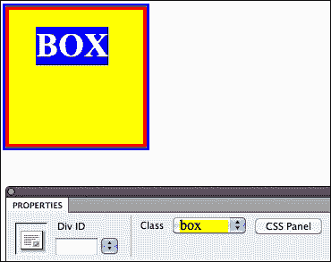
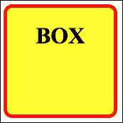
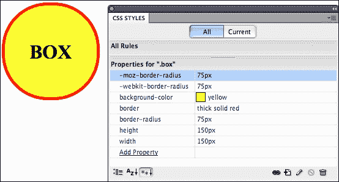
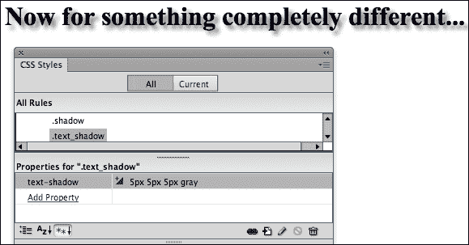
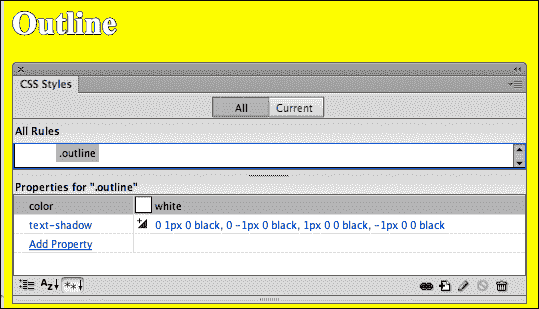
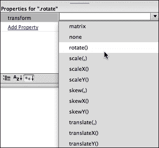

# 四、应用 CSS3 效果和变换

CSS3——样式表的当前版本——提供了对效果的简单访问，例如阴影、圆角和不透明度。此外，CSS3 引入了改变对象的形状、位置、旋转和大小的变换。CSS3 的效果和转换共同打开了一扇大门，让网页变得更动态、更吸引人、不那么“四四方方”，更具互动性。

当用户用鼠标悬停或点击对象时，可以通过改变对象的外观来使效果和变换具有交互性。无论有没有动画，效果和转换加在一起，都比以前的工具更容易为网页添加可访问的、吸引人的设计元素和活力。

CSS3 效果和转换是通过样式表定义的；因此，我们可以利用 Dreamweaver 的 **CSS 样式**面板来避免大量(如果有的话)求助于手工制作来创建它们。

在本章中，我们将探讨以下内容:

*   定义和应用 CSS3 变换:平移、缩放、旋转和倾斜
*   定义和应用 CSS3 效果:边框半径、阴影和不透明度
*   组合多个变换和效果
*   使 CSS3 变换和效果与`:hover`伪类交互

# 在 CSS3 中新增–效果和变换

CSS3 效果，比如阴影、圆角、不透明度，可以让网页更时尚、不那么刺目、更欢迎。当谨慎使用时(也就是说，不要过度使用)，它们会使网页变得有吸引力和吸引力。

效果和变换可以，而且经常应该，结合起来产生引人注目的元素。例如，以下文本应用了倾斜变换和阴影(框阴影)效果:


当与交互性相结合时，诸如倾斜、旋转、缩放和平移(移动)对象等过渡尤其引人入胜。例如，一个网站的访问者悬停在一个对象上时，会体验到其中微妙但诱人的变化。

在 CSS3 之前的时代，这些类型的效果或过渡需要一些组合编码和嵌入 Flash 对象，方法是依赖 JavaScript(并使用 JavaScript 编程)，并用 Photoshop 效果的图像替换类型(阴影或轮廓等功能)。这些工具曾经是！)昂贵和/或具有高学习曲线。

在本章的过程中，我们将探索 CSS3 中的几个新效果和新的 2D(二维)变换。三维变换超出了我们的调查范围；它们在浏览环境中没有得到广泛支持，通常需要额外的脚本(通常是 JavaScript)才能使它们有效。

本章的大部分内容将包括如何创建特定的 CSS3 效果和变换。

## 兼容性挑战

CSS3 的效果和过渡被广泛支持，不需要插件(比如 JavaScript 或者 Flash)。

另一方面，重要的是强调 HTML5 和 CSS3 特性都是一个正在进行的工作。在寻找描述浏览器支持 CSS3 状态的公式时，我碰到了这个公式，**不规则标准化**。我意识到这是一个矛盾的说法，但我的意思是我们在本章中创建的 CSS3 效果和转换在所有主要浏览器的当前版本中都得到了支持(是的，这包括 Internet Explorer 9 以及用于移动和桌面的 Safari 火狐和 Opera)。

然而，Safari、Firefox 和 Opera 都需要唯一的代码前缀。例如，应用`rotate`变换将一个框逆时针旋转五度的类样式的 CSS3 代码可能如下所示:

```html
rotate {
  transform: rotate(-5deg);
  -webkit-transform:rotate(-5deg);
  moz-transform:rotate(-5deg);
  o-transform:rotate(-5deg);
}
```

`-webkit-`前缀适用于 Safari 和其他遵循 WebKit 标准的浏览器(顺便说一下，其中包括 Dreamweaver CS6 的 **Live** 视图)。`-moz-`前缀适用于 Mozilla Firefox。`-o-`前缀适用于 Opera 浏览器。通用转换代码适用于“其他所有人”，包括不需要浏览器前缀来解释这种(或其他)效果的 Internet Explorer 9。

缺乏标准化编码并不像看起来那么大的问题。当我们定义和应用效果和变换时，它只需要一点冗余。

完全不支持 CSS3 效果和变换的浏览环境呢，比如旧版的 Internet Explorer？对于这个挑战，有一个简单而又困难的答案。困难的解决方案是将 JavaScript 和其他编码解决方案拼凑在一起，这些解决方案可以在网上找到，或者是为了模拟 CSS3 中不支持的效果和转换而调制的。也就是说，您可以恢复到在 CSS3 出现之前产生这些效果所需的工具和技术，如 JavaScript 和 Flash。

在大多数情况下，更简单，也可能更明智的解决方案是采用不需要浏览器支持效果的方式进行转换和效果，以便访问者吸收页面内容。例如，看一下下面截图中使用`border-radius`效果创建的圆角矩形:


如果有人使用旧版本的 Internet Explorer(如 IE6)访问上例中的页面，他们将放弃看到圆圈中的类型的体验(由`border-radius`效果定义)。不太吸引人，但他们仍然能够阅读文本，如下图所示:



在深入探讨*如何*应用变换和效果之前，让我们思考一下使用这些 CSS3 特性来格式化我们到目前为止预览的示例的优势。在创建这些效果时，没有创建、伤害、虐待或更糟糕的 Flash 或 JavaScript。所需要的只是我们在 Dreamweaver 的 **CSS 样式**面板中生成的几行 CSS。

也没有必要使用“图像文本”(保存为图像的类型)来创建这些效果。页面几乎可以立即加载，无需等待图像下载。在没有插件或图像的情况下，形状和格式或多或少会被立即下载，而浏览器不必弄乱插件或下载的图像。

最后，文本仍然是*可选的*。这意味着应用了变换或效果的文本仍然可以复制并粘贴到地图程序、日历事件中，或者选择为文本链接，如下图所示:


## Dreamweaver CS6 中的 CSS3 样式

Dreamweaver CS6 为定义和应用这些新的 CSS3 特性提供了一些特性。虽然不是 Dreamweaver 中最强大的工具，但它们确实使创建和应用新的 CSS3 技术成为可能，而无需求助于编码。在编码必不可少的地方， Dreamweaver 会提供代码提示。

当我们生成 CSS3 变换和效果时，有两种方法可以让我们的钱花得值:

*   If we enter the CSS code in the **Code** view, Dreamweaver will help with the coding by supplying code hints. For example, the following screenshot shows a code hint being offered after `–moz-tran` has been entered in the **Code** view. Code hints for the stylesheet provide easy access to the `transform-` attribute.

    

    ### 注

    **冗余 CSS 代码**

    前面的截图显示了定义和应用 CSS3 转换和效果的一个重要方面。您必须创建代码的四个版本，一个用于 Webkit (Safari)，一个用于 Mozilla (Firefox)，一个用于 Opera(在欧洲拥有大量用户的浏览器)，以及一个通用版本(没有浏览器前缀)，由 Internet Explorer 9 识别。我们将很快在本章中回到这个挑战。

*   另一个选项是在 **CSS 样式**面板中生成 CSS3 效果和变换。不利的一面是，这些新的 CSS3 样式规则没有出现在 **CSS 规则定义**对话框中，这通常是在 Dreamweaver 中定义 CSS 样式最友好和直观的环境。

您*可以*但是，通过 **CSS 样式**面板底部的**添加属性**链接输入 CSS3 效果和变换。而 Dreamweaver CS6(或安装了 HTML5 Pack 的旧版本)*将根据您在 **CSS 样式**面板中输入的样式规则和参数*生成 CSS 代码。有了这个选项，如果你试图输入一个无效的 CSS3 规则，Dreamweaver 至少会“击垮”你，如下图截图所示(在下面的例子中，我应该是输入`–moz-transform`，然后在 **CSS 样式**面板的右侧列定义**歪斜**变换)。


让我们坦率地说一会儿。这些选项——依赖于**代码**视图中的代码提示或者使用 Dreamweaver 的 **CSS 样式**面板——都没有达到我们在生成 CSS3 之前的样式时从 Dreamweaver CS6 获得的帮助水平。我们认为，Adobe 的员工和其他人一样，都在争先恐后地追赶当前和新兴的网页设计工具。

我将让您来决定使用这些有用但有缺陷的技术中的哪一种来定义 CSS3 效果和样式，我将在本章的剩余部分说明这两种技术。

# CSS3 效果

正如已经提到的，对 CSS3 效果和转换的支持是不规则的，并且正在进行中。在该框架内，四种可用的转换(`scale`、`translate`、`rotate`和`skew`)相对稳定且得到广泛支持。另一方面，效果的支持不那么一致，也不那么有限，因为浏览环境中有一个可用效果的“列表”(尽管有唯一的编码前缀)。

部分原因是许多效果非常灵活。例如，可以调整`text-shadow`效果以产生轮廓类型。有时，你会听到人们提到“轮廓”效果，这意味着调整`text-shadow`效果的参数，以创建轮廓类型，如下图所示:



到目前为止，我们已经讨论了 CSS3 效果的灵活性和开放性，让我们来看看三个最有用的效果:`opacity`、`border radius`和`shadow`(对于方框和文本)。

## 定义不透明度

CSS3 中的`opacity`效果允许您对对象应用不同程度的不透明度/透明度。语法如下:

```html
opacity:x;
```

在前面的语法中，`x`是介于 0 和 1 之间的值。完全不透明度(值为`1`)是正常的——应用了不透明度的对象就像是覆盖了其他一切。完全透明(T2 值)使 T4 物体不可见。`.6`的不透明度值使对象 60%不透明，依此类推。

尽管前面警告过必须为不同的浏览器专门定义 CSS3 效果，但是`opacity`效果是指*不*需要前缀来识别目标浏览器。

### 注

**简单还是复杂**

使用 CSS3，实现不透明性(透明度)非常简单，或者说非常复杂，这取决于你的目标。使用不透明度创建一组复杂的分层对象，其中各种元素都有自己指定的不透明度，这需要复杂的编码，并非所有浏览器都支持。

不透明度可以应用于标签(例如，可以想象定义图像显示方式的``标签)。更有效的是定义应用不透明度的类样式的技术。您可以通过以下步骤做到这一点:

1.  在 **CSS 样式**面板中，点击面板底部的**新 CSS 规则**图标，启动**新 CSS 规则**对话框。从**选择器类型**弹出菜单中选择**类别**，输入名称(无空格或特殊字符— **半透明**即可)，并从**规则定义**弹出菜单中选择您的外部样式表。点击**确定**。
2.  **CSS 规则定义**对话框打开。可悲的是，如前所述，在 **CSS 规则定义**对话框中无法定义 CSS3 效果。所以，只需点击**确定**就可以在这个阶段创建一个没有属性的新 CSS 规则。然而，新规则将出现在 **CSS 样式**面板中，我们将在这里定义不透明度设置。
3.  With your newly created class style selected in the **CSS Styles** panel, click on the **Add Property** link in the bottom-half of the **CSS Styles** panel. In the first column type `opacity`, and press the *Tab* key to move to the second column. In the second column, type a value between `0` (for complete transparency) and `1` (for full opacity). The value `.5`, for example, defines 50 percent transparency as shown in the following screenshot:

    

定义了类样式后，您可以通过从**属性**检查器中选择类样式，将其应用于选定的对象(如图像)。

定义完 CSS 类样式后，可以从**属性**检查器的**类**下拉菜单中将其应用于任何选定的元素，如下图所示:


您可以在不同的浏览器中测试不透明度效果。虽然不透明并不是所有浏览器都支持的——尤其是旧版本的浏览器——但它的应用通常是这样的，如果它能工作，它可以增强一个页面，但如果它不能工作，没有必要的内容会丢失。下面的截图显示了图像顶部的文本。左侧的文本以完全不透明的方式显示。右侧的文本显示为部分透明，允许访问者看到文本后面的一些页面背景。


## 边界半径

CSS3 `border-radius`效果是用来定义圆角。

让我们来看一个类样式的例子，它将半径为 12 像素的圆角应用于 150 像素的方形框，黄色背景周围有一条粗实线。在前面关于创建类样式来应用不透明度效果的讨论中，我们使用了在 **CSS 样式**面板中构建类样式的技术。这很有效，因为不透明效果非常简单。这里，让我们在 CSS 样式表中构建样式。假设您有一个链接到 Dreamweaver 中打开的网页的外部样式表，您可以将此代码添加到 CSS 文件中，以定义一个`border-radius`类样式:

```html
.box {
  background-color: yellow;
  height: 150px;
  width: 150px;
  border: thick solid red;
  -webkit-border-radius: 12px;
  -moz-border-radius: 12px;
  border-radius: 12px;
}
```

我们在这里使用的代码使用`-moz-`前缀来支持火狐。以下屏幕截图显示了应用于 Dreamweaver 中选定文本的此类样式:



在浏览器中，前面的图像看起来像下面的截图:



一个有趣的技巧是通过使圆角半径值等于正方形盒子高度(和宽度)的一半来创建一个圆。下面的示例显示了这种效果，其值根据前面的示例进行了调整，使圆角半径为 75 个像素，是定义原始正方形尺寸的像素的一半。



## 阴影

阴影很可能是平面设计中应用最广泛的效果。不要引用我的话，但是阴影在很多设计中肯定是无处不在的元素；现在，使用 CSS3，它们很容易应用于选定的对象。

有两种不同的阴影效果:`box-shadow`和`text-shadow`。他们的应用很容易理解；`box-shadow`适用于方框，`text-shadow`适用于文本。

`box-shadow`和`text-shadow`效果都可以用最少两个参数来定义:x 偏移(垂直距离)和 y 偏移(水平距离)。除此之外，它们通常还包括一种颜色(如果未指定颜色，则会出现浏览器默认颜色)和一个模糊参数(模糊渐变的厚度)。

x 和 y 偏移值可以是正值或负值。正值会在文本的右侧产生阴影，而负值会在文本的左侧产生阴影。对于 y 偏移值，正值在文本下方产生阴影，负值在文本上方产生阴影。值通常以像素为单位定义。

在检查框、文本和轮廓的工作方式之前，需要注意的是*多个*阴影定义可以合并。因此，例如，如果您希望在文本上方的*和*下生成阴影(并且您在定义轮廓样式时会希望这样做)，您可以组合两个甚至三个阴影定义，并且它们相互堆叠。

### 框影

如上所述，`box-shadow`效果通常由四个参数定义:offset-x(水平距离)、offset-y (垂直距离)、模糊(以像素为单位的宽度)和阴影的颜色。

例如，下面的代码定义了一个具有 5 个像素水平和垂直偏移量、5 个像素模糊长度和一个灰色阴影的盒子阴影——它为五个不同的浏览器这样做，即 Chrome、Safari、Firefox(使用非固定代码)互联网浏览器 9 和 Opera。

```html
.shadow {
  -webkit-box-shadow: 5px 5px 5px gray;
  -moz-box-shadow: 5px 5px 5px gray;
  box-shadow: 5px 5px 5px gray;
}
```

这是在 **CSS 样式**面板中的外观(您可以在 **CSS 样式**面板中定义类样式)。


### 文字阴影

`text-shadow`效果与`box-shadow`效果非常相似，只是它应用于文本而不是框。而且，无论出于什么原因，与需要特殊前缀的`box-shadow`效果不同，`text-shadow`效果不需要厂商前缀。

`text-shadow`效果的参数与`box-shadow`效果的参数相同，其中定义了四个值:x 偏移、y 偏移、模糊距离和颜色。没有创建三个版本的效果的麻烦，下面的 CSS 代码可以用来定义一个水平和垂直偏移为 5 像素、模糊值为 5 和灰色的文本阴影:

```html
.text_shadow {
  text-shadow: 5px 5px 5px gray;
}
```

上例中的`text-shadow`效果设置产生如下效果:



### 创建文本轮廓

正如本章前面提到的，不存在“文本轮廓”效应。但是*有*一种使用`text-shadow`效果应用文本轮廓的方法。通常，这包括将“轮廓”类型的文本颜色与页面背景相匹配，然后定义一个特别薄的黑色“阴影”，看起来像轮廓，一点也不模糊。

创建有效的轮廓效果需要堆叠额外的定义参数，以便在应用样式的文本的上下和左右堆叠非常薄的“阴影”。例如，当应用于位于白色页面背景上的文本时，以下类样式组合(堆叠)三组不同的参数来创建轮廓效果。

```html
.outline {
text-shadow: 0 1px 0 black, 0 -1px 0 black, 1px 0 0 black, -1px 0 0 black; 
color: white;
}
```

这是它在浏览器和 **CSS 样式**面板中的外观。



### 类型

本质上，前面的代码在文本下面生成一个薄的(1 个像素)“阴影”，在文本下面生成第二个“阴影”，在文本上面生成第三个(1 个像素)厚的“阴影”。对于较粗的轮廓，可以将像素值均匀地增加到 2 个像素。

# CSS3 变换

四个 CSS3 过渡`scale`(调整大小)`translate`(移动)`rotate`和`skew`作为*效果*应用于所选内容。也就是说，它们会改变对象的显示或外观，但不会改变其底层属性。

这些变换使得呈现文本或图像的失真成为可能，在 CSS3 出现之前，这通常是通过图像来完成的——通过使用文本图像来呈现倾斜、旋转或缩放的文本。

与其将我的书面沟通技巧推到极限之外，不如让我们利用下图来说明这四个转变:


## 何时使用变换

`skew`和`rotate`变换可用于以有趣且独特的方式呈现文本或图像，同时保持用户选择(以及复制、粘贴、点击等)*文本*的能力。`translate`变换可用于将一个内容块放在另一个内容块上(如上图所示)。`scale`变换可用于拉伸或调整文字或图像的大小。

### 类型

**当图像重叠时**

当两个`<div>`标签重叠时，出现在前面的标签将是 z 指数值最高的标签。您可以在 **CSS 样式**面板中设置 z 索引。

在许多情况下，这些效果与交互式动画一样有效，访问者通过将鼠标悬停在对象上来触发转换。作为本章的最后一部分，我们将探讨这种技术。

与本章前面探讨的 CSS3 效果一样，转场可以应用于各种标签，如标题标签(`<h1>`、`<h2>`)和图像(使用``标签)。或者更典型地，定义类样式来应用这些转换。

## 如何在 Dreamweaver CS6 中生成过渡编码

在检查定义转换所必需的相对基本语法之前，让我们重温一下我在本章前面试图挑起的争议，即两种可能的方法来最大限度地利用 Dreamweaver CS6 有限但有用的生成 CSS3 代码的工具。

查看和扩展选项:您*不能在 **CSS 规则定义**对话框中定义变换，但是您可以以这种方式应用 CSS2(早期)样式，例如背景颜色、字体定义等规则。但是，我们会徒劳地在 Dreamweaver 的 **CSS 规则定义**对话框中的类别中搜索`skew`、`scale`、`transform`或`rotate`。因此，以下两个选择依然存在:*

*   在**拆分**或**代码**视图中输入 CSS 代码，直接进入 CSS 文件
*   使用 **CSS 样式**面板的有限资源来定义转换

我将让您跳回并回顾本章前面更详细的讨论，逐步了解如何在您正在处理的 CSS 文件中输入代码或使用 **CSS 样式**面板定义样式。但是这里有一个新的因素需要检查:在定义变换参数的 **CSS 样式**面板中，您比本章前面讨论的效果(如阴影)得到了更多的帮助。

以下是附加帮助的工作原理:在 **CSS 样式**面板中向样式添加规则的过程中，如果您在 **CSS 样式**面板底部输入一个变换选项(`-webkit-transform`、`-moz-transform`或`-o transform`，Dreamweaver 会在面板的第二列提供一个弹出窗口，其中包含各种变换选项，如下图所示:



底线是，您必须决定哪种环境更适合生成用于转换的 CSS3 代码。在本章剩余部分探索具体的转换时，我将给出我自己的选择(只需在 **Code** 视图中键入代码)。但是特别是当你开始熟悉转换的 CSS3 代码时，你可能会发现 **CSS 样式**面板中的弹出帮助很有帮助。

## 按比例调整大小

缩放由两个参数定义，即 x 和 y，x 值定义增加多少宽度(或负值减少)，y 值适用于高度。值通常是乘数，因此值 2 = 200%意味着大小加倍，值 0.5 = 50%意味着大小减少到原始值的一半。

下面几行代码应用了一个`scale`变换，保持对象的宽度不变，但高度增加了 50%:

```html
  -webkit-transform: scale(1,1.5);
  -moz-transform: scale(1,1.5);
  -o-transform: scale(1,1.5);
transform: scale(1,1.5);
```

下面是一个类样式(称为`.scale`)的示例，它包含了前面的代码，并定义了一个类样式，该样式生成了一个 125 像素的方形框(在重新缩放之前)，可以进行缩放:

```html
.scale {
  height: 125px;
  width: 125px;
  background-color: yellow;
  -webkit-transform: scale(1,1.5);
  -moz-transform: scale(1,1.5);
  -o-transform: scale(1,1.5);
   transform: scale(1,1.5);
  float: left;
  margin: 15px;
  padding:5px;
  border:1px solid #F00
}
```

### 注

**浮箱**

在这个例子中，`float`属性允许我们在一行中排列一堆这样或类似的盒子。

## 平移移动

`translate`变换将对象从页面上的位置移动。如前所述，这可能是一种有效的技术，可以让框(包括可选文本框)在页面上重叠。

`translate`变换的语法类似于`scale`变换的语法，除了第一个参数，即 x 值定义了对象将向右移动多远(如果使用负值，则为向左)，y 值定义了对象将向下移动多远(如果使用负值，则为向上)。值通常以像素为单位定义。

这是我们在上一节中用作`scale`变换示例的相同类样式，但是`translate`变换设置为向左移动对象 35 像素，向下移动 15 像素:

```html
.translate {
  height: 125px;
  width: 125px;
  background-color: yellow;
  transform: translate(-35px,15px);
  -webkit-transform: translate(-35px,15px);
  -moz-transform: translate(-35px,15px);
  -o-transform: translate(-35px,15px);
  float: left;
  margin: 15px;
  padding:5px;
  border:1px solid #F00
}
```

## 应用旋转

`rotate`变换也许是最简单的定义——只有一个参数叫做旋转角度。该角度可以是正的(顺时针旋转)或负的(逆时针旋转)。

将对象顺时针旋转 15 度的代码示例如下:

```html
  transform: rotate(15deg);
  -webkit-transform:rotate(15deg);
  -moz-transform:rotate(15deg);
  -o-transform:rotate(15deg);
```

将对象旋转 15 度的类样式的一个示例如下，其大小和其他属性与我们之前使用的示例相同:

```html
.rotate {
  height: 125px;
  width: 125px;
  background-color: yellow;
  transform: rotate(15deg);
  -webkit-transform:rotate(15deg);
  -moz-transform:rotate(15deg);
  -o-transform:rotate(15deg);
  float: left;
  margin: 15px;
  padding:5px;
  border:1px solid #F00
}
```

### 注

**注意–为旋转(和歪斜)留出空间**

当你旋转一个物体时(或者，正如我们将看到的，如果你倾斜它)，该物体将与附近的物体重叠。通常情况下(除非这种重叠是设计的一部分)，这是通过向对象样式添加足够大的边距值以防止重叠来解决的。

## 创建倾斜过渡

`skew`变换可能由两个用逗号分隔的参数定义。第一个值以度为单位定义 x 轴(水平)变换，第二个值定义垂直失真。如果使用零作为两个轴之一的值，结果将是一个平行四边形，如下图所示:


这里有一个类标签的代码示例，它应用了我们前面示例中的黄色背景、红色边框和其他属性，将对象在盒子的轴上倾斜 15 度:

```html
  transform: rotate(15deg);
  -webkit-transform:rotate(15deg);
  -moz-transform:rotate(15deg);
  -o-transform:rotate(15deg);
```

下面是一个将对象旋转 15 度的类样式示例，其大小和其他属性与我们之前使用的示例相同:

```html
.skew {
  height: 125px;
  width: 125px;
    background-color: yellow;
  transform: skew(15deg,15deg);
  -webkit-transform: skew(15deg,15deg);
  -moz-transform: skew(15deg,15deg);
  -o-transform: skew(15deg,15deg);
  float: left;
  margin: 25px;
  padding:5px;
  border:1px solid #F00;}
```

## 其他 CSS3 变换效果

除了我们在本章中探讨的 CSS3 的二维(2D)变换效果，还有其他处于新兴支持状态的三维变换。一般来说，除了 WebKit 集(SafariLimit)之外，任何浏览器都不支持它们，从我所能理解的来看，如果没有额外的 JavaScript 来激活它们，它们就不那么适用了。

也就是说，请继续关注。CSS3 变换的世界是一个不断运动和发展的世界，3D 变换可能会获得更广泛的支持，并变得更容易被开发人员访问。

## 复合变换

您可以将多达四个变换组合成一个变换规则。例如，要创建一个应用`skew`(x 轴和 y 轴均为 5 度)、`scale`(x 轴和 y 轴均为 1.5 的倍数)和`rotate` (45 度)的变换，其前缀适用于 WebKit 浏览器，您可以使用以下代码:

```html
-webkit-transform: skew(5deg,5deg) scale(1.5, 1.5) rotate(45deg);
```

由于变换倾向于对对象应用相当激进的变化，并且`skew`和`rotate`创建了类似的效果，保证在单个对象中组合多个变换的美观性和可访问性是有限的，但是可用的。

# 交互效果和变换

在调查并完成了创建和应用 CSS3 效果和变换的过程后，我们现在转向这些新样式特性最令人兴奋、最动态的方面之一:**交互性**。

交互性，我们的意思是页面的一个对象或元素用他们自己的行为对访问者的行为做出反应。访问者悬停在一个对象上，该对象会移动、调整大小、旋转、倾斜、产生阴影、变成半透明或经历其他一些变化。

将交互性与效果和变换相结合有两种基本技术。一种是使用 JavaScript，编写或生成结合了变换和效果的代码。将 JavaScript 与效果和转换相结合是一种非常强大的技术，可以在可以生成的级别上创建交互性，例如使用 Flash。

另一种更容易获得的技术是利用广泛支持且易于使用的`:hover`伪类。如果您熟悉定义链接的“悬停”状态，其中链接在悬停时呈现独特的外观，那么您对这将如何工作有一个基本的概念。在接下来的部分中，我们将更详细地介绍这一点。

## 使用 JavaScript 效果的限制

用 JavaScript 创建交互效果和转换有几个明确的限制，这超出了我们在本书中讨论的范围。首先，为了实现这种方法，人们需要了解 JavaScript，虽然这些知识可以在厚厚的书籍中获得，但通过大量的在线资源，以及生成 JavaScript 的付费使用工具，这些知识远远超出了我在本章中所能涵盖的范围，更不用说这本书了。此外，在浏览环境中并不普遍支持 JavaScript，HTML5 和 CSS3 的很大吸引力在于，通过适当考虑非 HTML5 环境，我们在本书中探索的几乎所有内容在任何浏览环境中都可以工作，或者至少不会造成伤害。

Dreamweaver 被低估但也未得到充分支持的生成 JavaScript 的工具“行为”面板不支持 CSS3 效果和转换，因此在组合 JavaScript 效果和转换时显得无能为力。

我们已经部分列举了将 JavaScript 与 CSS3 效果和转换相结合的缺点(和优点)，因为您可能会在 web 上遇到探索 CSS3 前沿并将其工作与 JavaScript 相结合的开发人员的示例、模型和大量讨论。

## 与悬停伪类的交互

然而，有一个更容易使用的工具来应用交互效果和变换:伪类。

伪类是 CSS 修饰符，根据对象的状态定义网页对象的外观。它们最著名的，也是应用最广泛的，是链接上的修饰符。

例如，网页上未访问的链接默认显示为蓝色下划线，已访问的链接显示为紫色下划线，活动的链接显示为红色下划线。这些参数可以在 Dreamweaver 的 **CSS 样式**面板中轻松更改。而且，每个现代浏览器都支持它们，甚至旧浏览器也支持它们。

但是除了`:visited`和`:link :active`伪类样式(伪类)，还有另一个更动态的状态叫做`:hover`。这种可定义的状态适用于页面上任何访客将鼠标悬停在其上的情况。

通过对对象的悬停状态应用效果和变换，您可以使它以定义的方式与访问者的鼠标动作进行交互。

## 在 Dreamweaver 中制作 CSS3 变换的动画

现在让我们来看看 CSS 变换和效果是如何与`:hover`伪类一起工作的。

基本概念是你在悬停时为你想要变换的对象定义一个`:hover`伪类。这个对象可以是一个超文本标记语言标签(像``)或一个`<div>`标签(类或标识)。

例如，在``标签的情况下，CSS 文件中的这一行代码将定义一个`scale`变换，当图像悬停在以下位置时，高度和宽度增加 10%:

```html
img:hover  {
  -webkit-transform: scale(1.1,1.1);
}
```

或者举另一个例子——一个 div 标签——下面的代码将导致一个名为`.box`的类样式容器在悬停时旋转 45 度:

```html
.box:hover {
  -webkit-transform:rotate(45deg)
}
```

产生如下效果:


# 示例–创建动画效果和变换

这个方法创建了一个类样式框，可以在显示 CSS3 效果的页面上重复使用，当悬停在上面时会显示 CSS3 变换。因此，它是一个容易适应的配方——你可以使用本章中的信息来替换我们将在配方中使用的不同效果和变换。

在我们的特定场景中，我们将应用圆角，并在悬停时稍微放大该框。

## 把碎片放好

在深入研究这个配方之前，您需要具备以下条件:您需要定义一个 Dreamweaver 站点。跳回[第 1 章](01.html "Chapter 1. Creating Sites and Pages with Dreamweaver CS6")、*用 Dreamweaver CS6* 创建站点和页面，查看关于创建 Dreamweaver 站点的讨论和步骤。

定义好你的站点，你就准备好了！我们需要的一切都在 Dreamweaver CS6 中。让我们首先设置我们需要的文件:

1.  导航至**文件** | **新建**打开**新建文档**对话框。在**类别**栏中选择**空白页**，在**页面类型**栏中选择 **HTML** ，在**布局**栏中选择 **< none >** 。从**文档类型**弹出菜单中，选择 **HTML5** 。此时**附加 CSS 文件**框应为空。定义好新文件后，点击**创建**创建一个新的空白 Dreamweaver 页面。
2.  在**文档**工具栏的标题区输入`Hover`。导航至**文件** | **保存**并指定文件名。让我们使用`hover.html`文件。
3.  接下来，我们将创建保存我们的样式的 CSS 文件——特别是我们将使用的 CSS3 效果和转换样式。导航至**文件** | **新建**。**新文档**对话框打开。
4.  在 **页面类型**类别中选择 **CSS** ，点击**创建**按钮。保存 CSS 文件；使用文件名`hover.css`。将打开一个空白的 CSS 页面。
5.  选择 HTML 文件。您可以从 Dreamweaver **文档**窗口顶部的文件选项卡中执行此操作。或者为了避免任何可能的混淆(假设我们打开了两个名称相似的文件)，点击**窗口**菜单，然后点击`hover.html`文件。
6.  在 HTML 页面中(您可以在三个视图中的任何一个中，但是**设计**视图工作正常)，导航到**窗口** | **CSS 样式**以显示 **CSS 样式**面板(如果该面板不可见)。
7.  Click on the **Attach Style Sheet** link icon at the bottom of the **CSS Styles** panel, and navigate to and link the `hover.css` stylesheet file. The (empty) stylesheet file appears in the **CSS Styles** panel. You can see all the elements we've defined so far, and your screen should, at this point, look like the one shown in the following screenshot:

    

8.  点击 **CSS 样式**面板底部的**新 CSS 规则**图标，打开**新 CSS 规则**对话框。从**选择器类型**弹出选择**类别**，并在**选择器名称**框中键入`box`。在**规则定义**区域，如果`hover.css`还没有被选中，从**规则定义**弹出菜单中选择。点击**确定**打开 **CSS 规则定义。对话框中。**
9.  In the **Background** category of the **CSS Rule Definition** dialog, choose a light colored background color (such as yellow). In the **Box** category, apply the following rules as illustrated in the following screenshot. Don't click on **OK** yet! We'll define a border next.
    *   **宽度** : **200** **px**
    *   **高度**:**【200】****【px】**
    *   **浮动** : **左侧**
    *   **填料** : **25** (全部)
    *   **保证金** : **50** (全部)

    

    ### 注

    **设置说明**

    我们正在创建一个 200 像素的方形盒子，这个盒子的大小非常适合放置侧边栏消息或图片和标题。我们将它浮动到左侧，以便其他内容可以围绕右侧的框。大的边距和填充为可能扩展盒子或影响附近元素空间的效果提供了很大的灵活性。

10.  Next, let's create a kind of fun border. In the **Border** category of the **CSS Rule Definition** dialog, define the border as dashed, thick, and red, as shown in the following screenshot. Then click on **OK** to create the style rule.

    

11.  Let's place one (or `-- your option --` more than one) instance of this class style on the page now. Navigate to **Insert** | **Layout Objects** to open the **Insert Div Tag** dialog. Choose **box** from the **Class** popup and click on **OK**. Note that you can do this repeatedly if you wish to use this box as a page design element, as shown in the following screenshot. You can also use this figure to double-check the rules for the `.box` class style in the **CSS Styles** panel.

    

## 使用悬停类样式制作效果动画

我们现在可以定义`:hover`伪类样式来用缩放和圆角来激活这个盒子。我们能够使用 Dreamweaver CS6 的 **CSS 样式**面板和对话框创建一个具有定义边框的大小浮动框。对于以下步骤中所需的 CSS3 样式，我们就不会那么幸运了。我们将使用 **CSS 样式**面板定义样式，但是我们将不得不使用 Dreamweaver CS6 的代码提示自己输入 CSS3 样式代码。

1.  点击 **CSS 样式**面板底部的**新 CSS 规则**图标，打开**新 CSS 规则**对话框。从**选择器类型**弹出选择**类别**，并在**选择器名称**框中键入`.box:hover`。在**规则定义**区域，如果还没有选择`hover.css`，从**规则定义**弹出菜单中选择。点击**确定**打开 **CSS 规则定义对话框。框:悬停在悬停对话框中。**
2.  由于我们需要的规则在 **CSS 规则定义**对话框中没有，点击**确定**保存样式`.box:hover`在当前阶段没有任何规则。
3.  Navigate to **Window** | **hover.css** to open the CSS styles file in Dreamweaver's **Code** view. Refer to the following code to define a scale transition that bumps the size of the box up to a noticeable, but not obnoxious, 2 percent and applies subtle rounded corners to the box. The code makes this effect accessible for Safari (`-webkit`), IE9 (`generic`), Opera (`-o`), and Firefox (`-moz`) users.

    专门针对`.box:hover`样式的代码如下:

    ```html
    .box:hover {
      -webkit-transform:scale(1.02);
      -webkit-border-radius: 10px;
      -transform:scale(1.02);
      -border-radius: 10px;
      -o-transform:scale(1.02);
      -o-border-radius: 10px;
      -moz-transform:scale(1.02);
      -moz-border-radius: 10px;
      }
    ```

4.  Save the CSS file (navigate to **File** | **Save**). Use the **Window** menu to return to the **hover.html** page. Test the effect and transform in the **Live** view, along with other browsers using the **Preview** option of the **File** menu in the browser. The following screenshot shows the effect in Firefox—the middle box displays as slightly larger with rounded corners.

    

同样，这是一个适应性很强的方法，可以作为创建页面布局元素的基础，这些元素可以与悬停在其上的访问者进行交互。例如，您可以将`scale`替换为`rotate`、`skew`，甚至`translate`来改变变换。你可以用阴影或者不透明度的改变来代替`border-radius`效果。

# 总结

在本章中，我们介绍了随着样式表的 CSS3 标准的出现而出现的各种各样的效果和转换。那些“标准”是不一致的，所以需要为不同的浏览器提供替代(带前缀的)规则。

这些变换和效果本身作为设计工具是有用的，并且当通过定义`:hover`伪类元素使它们在对象悬停时(并且仅当对象悬停时)出现而变得交互时，它们甚至是更动态的设计因素。

Dreamweaver CS6 为定义和应用 CSS3 变换和效果提供了一个基本框架。我们检查了 Dreamweaver 有限的 CSS3 工具，比如在**代码**视图中使用代码提示的能力，以及在 **CSS 样式**面板中有用的转换提示。

在本书的下一章中，我们将探索使用 HTML5 向网页添加“原生”音频和视频。本机音频和视频直接在浏览器中运行，无需插件播放器(如视窗媒体播放器、快速时间播放器或闪存播放器)。