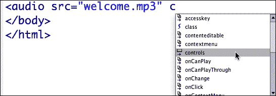
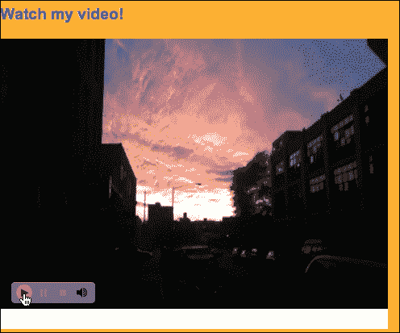
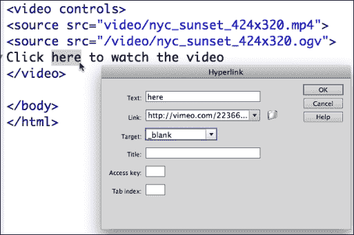

# 第五章。嵌入 HTML5 原生音频和视频

在本章中，我们将介绍如何使用 HTML5 向网页添加音频和视频。在 Dreamweaver 中使用 HTML5 嵌入媒体的优点是不需要任何外部播放器工作。对于支持 HTML5 音频或视频元素的浏览器，本地媒体是在线呈现音频和视频的最优雅方式。

Dreamweaver 使添加 HTML5 音频变得相对无痛——无需大量了解或担心 HTML 编码。

# 原生介质和兼容性

在开始我们用 HTML5 嵌入媒体的旅程之前，让我们后退一步，观察一下地形。在 HTML5 之前，如果你想从网站上听音频或看视频，你必须通过这样或那样的浏览器插件来实现。该插件可能是 QuickTime Player(通常在 Mac 上)、Windows Media Player(通常在 Windows 计算机上)、Flash、硬件制造商提供的插件或其他程序。

由于用户在插件(如视窗媒体播放器或快速时间播放器)的帮助下收听音频，当用户收听音频时，网页设计师几乎无法控制屏幕上出现的内容。HTML5 提供所谓的**原生音频(以及原生视频)。原生视频不需要插件。播放器和控件仍然会根据浏览环境有所不同，但是有了 HTML5，音频播放器相对来说是*标准化的。***

 **呈现 HTML5 音频和视频有两个兼容性问题:1)访问者的浏览器必须符合 html 5；以及 2)访问者的浏览器必须支持保存音频或视频的特定音频格式。因此，在演示 HTML5 音频的过程中，我们将探索如何处理这两个兼容性问题。

当我们使用 Dreamweaver 完成嵌入本机音频，然后嵌入本机视频的过程时，我将分别针对音频和视频返回更详细的兼容性问题。

# 打基础

Dreamweaver CS6 对 HTML5 音视频的支持还是有点原始。如果您使用创意云更新 Dreamweaver，更多 HTML5 元素(包括音频和视频)可从**插入**菜单(或**插入**工具栏)获得。但是 Dreamweaver CS6(和 5.5)的所有版本都在 **Code** (或 **Split** )视图中提供了有价值的代码提示，这就是我们将在这里采用的方法，因为它可以在任何 Dreamweaver CS6 环境中工作。而且，除此之外，接触并理解`audio`和`video`标签语法也是不错的。

让我们快速回顾一下在 Dreamweaver 中使用 HTML5 媒体所需的两个基本事项:

*   如果您还没有定义，请确保您已经定义了一个 Dreamweaver 站点。这是必不可少的第一步。要了解如何定义网站，您可以查看本书的[第 1 章](01.html "Chapter 1. Creating Sites and Pages with Dreamweaver CS6")、*使用 Dreamweaver CS6* 创建网站和页面，了解如何进行定义。
*   收集媒体文件。音频:MP3、OGG 和 WebM 格式的音频文件。对于视频:h.264(通常带有`.mp4`文件扩展名)、OGG 或 WebM。你会想要你的视频文件的所有三个版本——h . 264、OGG 和 WebM。您可以使用免费程序 **开关**([http://www.nch.com.au/switch/index.html](http://www.nch.com.au/switch/index.html))将文件从一种音频格式翻译成另一种音频格式。视频转换可以使用免费程序**在线-转换** ，可在[http://video.online-convert.com/](http://video.online-convert.com/)下载。

以此作为介绍，让我们转到在 Dreamweaver 中嵌入本机 HTML5 音频和视频的具体过程。

# 准备本地音频

我们需要做的第一件事，在我们可以把它们放在我们的网站上之前，是让我们的音频文件 HTML5-ready。

在通过各种音频格式来找出哪个浏览器支持哪个格式之前，让我提供一个非常基本的音频压缩概述。

## 音频压缩

你可能至少熟悉一些流行的音频格式，比如 MP3、WAV、AIFF 等等。WAV(适用于 Windows)和 AIFF(适用于 Macs)格式的原始未压缩音频文件可提供最高的在线音频音质。但是这些文件非常大，对于大多数用户来说下载速度太慢。另一方面，MP3 音频文件的文件大小要小得多。

压缩算法用于在文件转换为 MP3 时从文件中挤出额外的数据。而对于大多数听众，以及大多数音频文件来说，MP3 的质量已经足够了。因此，当我们谈论在线提供音频文件时，我们经常谈论 MP3 等格式的压缩音频文件。另一种压缩文件格式是 OGG 格式。

## 浏览器对音频文件的支持

MP3 和 OGG 是两种最广泛使用的压缩音频格式。由于未压缩音频的下载时间要长得多，压缩音频(MP3 和 OGG)更适合几乎所有可下载的音频。

哪种压缩音频格式适用于所有浏览器？不幸的是，两者都不能在所有浏览器中工作。最受欢迎的五种浏览器——互联网浏览器、火狐、Chrome、Safari 和 Opera——都支持 HTML5 音频，但不同的浏览器支持不同的格式。

哪些浏览器支持哪些音频格式会随着时间的推移而改变，但在撰写本章时，细分如下:

*   Internet Explorer 9 及更新版本:MP3
*   火狐 4.0 及更新版本:OGG
*   谷歌 Chrome 6 和更新版本:两者都有
*   苹果 Safari 5 和更新版本:MP3
*   歌剧 10.6 及更新版本:OGG

[W3Schools.com](http://W3Schools.com)在[http://www.w3schools.com/html/html5_audio.asp](http://www.w3schools.com/html/html5_audio.asp)保留了一份更新的支持音频格式的浏览器列表。但正如我所能预测的那样，如果你想接触到绝大多数用户，你必须同时提供 MP3 和 OGG 音频。

用于呈现 HTML5 音频的最可靠和“符合标准”的解决方案是提供 HTML5 压缩音频格式、MP3 和 OGG 的选项。这就是我们接下来要探索的解决方案。

# 在 Dreamweaver 网页中嵌入 HTML5 音频元素

一旦我们奠定了基础，我们就可以开始了。使用以下步骤将音频元素嵌入到打开的 Dreamweaver HTML5 页面中:

1.  在**分割**视图的**代码**部分，将光标放在 **<主体>** 标签后，点击*输入*(或在 Mac 上*返回*)创建新的代码行。
2.  Start typing `<au` and press *Tab* and the HTML5 pack will auto-complete that into the beginning of the `<audio>` tag, as shown in the following screenshot:

    

3.  将光标放在单词`audio`后，按下*空格键*。弹出菜单将再次出现。键入字母`s`，然后双击列表中的`src`。这是源代码，如中所示，文件将来自哪里。
4.  When you select `src`, a **Browse** link will appear. Double-click on the **Browse** link to open the **Select File** dialog, as shown in the following screenshot:

    

5.  找到你之前拷贝的音频文件，在我们的例子中是一个 MP3 文件(但它可能是 WAV 或 OGG)。双击选择该文件。
6.  You want to have a controller, or player, for this audio, so we'll set a parameter to display one. Press the *Space bar* again, and this time type `c`, which in this case will be for controls. Double-click on **controls**, and then when a pop-up box appears, double-click **controls** again, as shown in the following screenshot:

    

7.  通过键入`>`关闭开始的`audio`标签。
8.  最后，键入`</`以允许 Dreamweaver 自动完成到`</audio>`，这将以结束标记完成`audio`元素。

现在我们想预览文件，这只能在 Safari 或 Opera 中进行，假设您选择了 MP3。要在 Safari 中预览，导航至**文件** | **在浏览器中预览** | **Safari** 。它应该如下图所示:


如果我们使用了 OGG 文件，我们可以做同样的步骤，但是我们现在必须在火狐中预览。

## 可选音频选项

所以现在你的页面上有了音频。但有两点缺失:

*   首先，您的音频播放器没有很多特殊功能。
*   其次，不是每个访问这些网站的人都能访问音频文件。您应该为不同的浏览环境提供不同的 HTML5 支持的音频格式作为选项，因为正如我们前面所指出的，并非所有 HTML5 友好的浏览器都支持相同的音频文件格式。

让我们从提供替代音频文件格式的挑战开始。正如我们所注意到的，一些符合 HTML5 的浏览环境支持 MP3 文件格式，其他的支持 OGG 格式，剩下的支持 WebM。

因此，我们可以通过提供第二个源文件来使我们的音频更容易访问。这样，符合 HTML5 的浏览器可以找到并播放与该浏览器相匹配的文件格式。

为此，我们将改变之前创建的 HTML，将播放器控制代码与音频源代码分开。代码看起来类似于下面的代码块:

```html
<audio controls="controls">
   <source src="audio.ogg" type="audio/ogg" />
   <source src="audio.mp3" type="audio/mpeg" />
</audio>
```

在前面的代码中，您用自己的音频文件名替换了`audio.ogg`或`audio.mp3`。

对于那些浏览器不解释 HTML5 的用户，例如旧版本的 Internet Explorer 用户或旧浏览器上的用户，我们将希望提供一种访问音频的替代方法。为此，我们可以创建一个指向音频文件的链接。如果我们这样做，当链接被点击时，音频文件将在其自己的浏览器用户中打开。然后浏览器将使用一个插件播放器，如 QuickTime、Flash 或 Windows Media 来播放音频文件。这不是最优雅的解决方案，但它会起作用。

为此，我们可以在刚刚探索的 HTML 中添加一行代码。这一行代码创建的文本将出现在不解释(支持)HTML5 `<audio>`标签的浏览器中，并且可以链接到以传统格式(如 QuickTime、Windows Media 或 FLV)呈现音频的页面。

代码如下所示:

```html
<audio controls="controls">
  <source src="sound.ogg" type="audio/ogg" />
  <source src="sound.mp3" type="audio/mpeg" />
Your browser does not support the HTML5 audio element but you can hear the audio file <a href="sound.html">here</a>.
</audio>
```

最后一行代码以`Your browser…`开头，链接到一个 HTML 页面(`sound.html`)，该页面可用于呈现旧浏览器插件软件中播放的传统音频格式。

## 添加播放参数

现在(几乎)每个人都可以访问我们的音频，让我们看看还有哪些参数可以用来为我们的`audio`元素添加功能。

当我们在定义源文件时添加代码`controls="controls"`时，我们添加了一个控制参数。如果您在 Safari 中测试时使用该控制器进行播放，您已经发现该控制器将允许我们播放、暂停、静音和重新启动我们的 MP3。我们还可以使用小节或搓擦器在音频轨道中移动、倒带或快进。

我们可能想使用四个重要的 HTML5 音频参数。为了启用这些参数中的每一个，我们将希望像启用控件一样使用 HTML5 代码提示:

*   `controls`:该属性显示音频播放器中启动、暂停、停止或改变音量的控件。
*   `loop`:重复播放音频文件，或者循环播放。要启用此循环，将光标放在代码`controls="controls"`后，按下*空格键*激活代码提示。键入`l`，然后双击`loop`添加`loop`代码。
*   `autoplay`: This starts the audio file immediately when someone opens the page, as opposed to the viewer having to press **Play**, the way we did with the controller. You can have both `loop` and `autoplay` enabled at the same time. To make the audio play automatically, place your cursor after the code `controls="controls"` and press the *Space bar* to activate the code hints. Double-click on `autoplay` to add the code `autoplay =""`. For autoplaying an audio file, you don't need to put anything between the quotation marks in the code, the way we did with `controls` and `loop`. Just adding the code enables it, as shown in the following screenshot:

    

    ### 注

    移动设备(包括 iOS 苹果设备)和部分版本的安卓移动操作系统不支持`autoplay`，主张包含`controls`。

*   `preload`:该属性在页面打开时开始下载音频文件，在点击**播放**之前。如果我们使用`autoplay`，这是不相关的，因为它会立即加载，但当我们不使用`autoplay`时，它允许音频文件在访问者点击**播放**时启动得更快。我建议不要使用此选项，因为它会在许多移动环境中延迟页面的打开。如果你想预载曲目，再次将光标放在代码`controls="controls"`后，按下*空格键*激活代码提示。键入`p`然后双击`preload`，然后双击`auto`添加代码`preload="auto"`。
*   `preload`属性还有另外两个可能的变量:`none`和`metadata`。`none`变量明确指定不预加载文件，而`metadata`指定仅预加载元数据信息(例如，关于音频文件的歌曲标题、作者等的信息)。

您可以同时启用多个参数。每次只需在代码`controls="controls"`后按下*空格键*即可激活 HTML5 代码提示，然后重复任何你想要的其他代码。例如，你可以有一个自动播放和循环的轨道。

记住什么会让对你的音频和网站访问者的偏好最有意义。请记住，许多访问者在进入您网站的主页时不会欣赏自动播放的声音。他们可能在工作，也可能只是不想打开声音。除非是他们期望声音打开的链接页面，否则让音频成为他们可以选择打开的东西，而不是他们必须选择关闭的东西，对你的访问者来说是更体贴的。

# 嵌入 HTML5 音频

在下一节中，我们将逐步介绍如何使用 HTML5 Audio 元素嵌入 MP3 音频文件，并为浏览器不支持 HTML5 的访问者提供一个选项。我将假设您在 Dreamweaver 网站上工作，并且您打开了一个文件，保存为 HTML5 网页(首先保存文件对于确保音频文件链接的完整性很重要)。并且，你有一个 MP3 音频文件准备嵌入。

有了这些部分，这些步骤就会起作用:

1.  在 Dreamweaver 文档窗口中，跳转到**拆分**视图，并在**拆分**视图的**代码**侧，单击要创建新代码行的位置。这可以在`<body>`和`</body>`标签之间的任何位置。
2.  开始打字`<audio>`。几个字母进入流程，可以按 *Tab* 键完成元素的开始。然后按下你的*空格键*。
3.  Double-click on **src** from the pop-up list, as shown here. A **Browse** link appears:

    

4.  双击**浏览**链接，打开**选择文件**对话框，导航选择 MP3 音频文件。
5.  再次按下*空格键*，在出现的代码提示中双击**控制**。在下一个代码提示中，再次双击**控件**。
6.  键入`</`，Dreamweaver 将完成关闭元素`</audio>`。
7.  现在，为了支持非 HTML 浏览器，在你的网页上添加一行文本，链接到你刚刚嵌入 HTML5 `<audio>`标签的音频文件。为此，找到一个插入点(用鼠标在**分割**视图的代码侧点击，就在关闭音频元素的`</audio>`代码之前。键入一个闭合角括号(`>`)来完成元素。然后键入`Listen to the audio file`作为常规的 HTML 文本，并使用**属性**检查器为您嵌入了 HTML5 `<audio>`标签的文本附加一个音频文件链接。

### 类型

这段代码为能够处理 MP3 文件的支持 HTML5 的浏览器提供了无缝的 HTML5 音频，并为其他所有人提供了 MP3 文件的链接。

# 嵌入原生视频

接下来，我们将学习如何使用 HTML5 和 Dreamweaver 将不同种类的视频添加到网页中。

在线视频正在经历一场彻底的变革。这些变化可以非常简单地总结为:你不再需要插件播放器了。Dreamweaver 为嵌入这个原生视频提供了有限但有价值的支持(之所以这么说，是因为它在没有插件的原生浏览器环境中播放)。

我们将通过几个步骤学习如何使用 HTML5 视频元素:

*   理解原生视频的概念，以及它如何与网络视频发展的早期进化步骤相关联，以及哪些视频格式在哪些浏览器中工作。
*   创建 HTML5 就绪的数字视频文件。
*   使用`<video>`标签在 Dreamweaver 中嵌入视频。
*   为非 HTML5 兼容浏览器提供替代选项。
*   定义附加视频显示参数。

### 类型

我们需要做这些步骤中的每一个，以确保我们在我们的网站中包含的 HTML5 视频将在每个浏览环境中工作。

## HTML5 视频和 Dreamweaver

要理解今天呈现在线视频的挑战，将网络视频的发展框架到这一点是很有启发性的。首先，旧的网络视频仍然是一个问题，就像旧的浏览器一样。我们必须解决在支持当前标准的新浏览器和不支持当前标准的旧浏览器中呈现视频的挑战。

此外，如果不深入了解当前这种情况是如何出现的，当前竞争相当疯狂的在线视频格式就没有多大意义。

为了理清这一切，将紧急在线视频分为三个阶段是有用的。

### 早期视频格式

在线视频第一阶段的特点是不同的、不兼容的视频格式和播放器的扩散。苹果的 QuickTime 视频在 QuickTime 播放器中播放，这是苹果 Safari 浏览器自带的。微软的互联网浏览器播放各种微软视频格式，如 AVI 或 WMF。通常情况下，网页设计师将 QuickTime 视频放在网站中，期望只有在 Macs 上的用户才能看到该视频，或者将 Windows Media Formats(如 WMV 或 AVI)放在网站中，期望只有拥有 Windows Media Player(经过适当更新)的用户才能处理该视频。在这一阶段，其他格式，如 RealMedia 的视频和播放器获得了一段时间的吸引力。

在这个早期阶段，缺乏单一的在线视频格式是影响网络视频的一个边缘化因素。此外，缺乏足够数量的拥有高速连接的用户，使得在线视频的吸引力降低。笔记本电脑和数字设备中的低质量视频和音频显示是另一个因素。网络视频不再是今天网站不可或缺的组成部分，相应地，高质量的在线视频内容的缺乏使得网络视频成为网页设计中的边缘元素。

从文化和技术上来说，网络视频在这一点上，在网络浏览体验中有点像“局外人”——需要长时间等待下载，并向用户解释如何观看视频，正如我在 2002 年为喜马拉雅博览会创建的以下网站所示:


就 HTML 和 Dreamweaver 技术而言，`<embed>`标签用于在页面上放置视频。这个标签允许设计师对播放器控件和其他参数(如`autoplay`)进行一些控制，但是如何(以及是否)播放视频主要由用户的浏览器以及他/她在该浏览器中安装的插件来定义。

### 闪光视频(FLV)

在线视频进化的第二阶段，正如我们在这里描述的那样，标志着视频整合到每一种网站的每一个领域。

视频进入网络主流的一个关键因素是 Adobe**Flash Video**(**【FLV】**)格式的出现和 Flash Player 的广泛接受。FLV 以高度压缩的形式呈现视频，在保持良好的视频和音频质量的同时，从根本上减少了文件大小(与 QuickTime 相比，通常减少一半)。

FLV 文件需要 Flash Player，但在这个阶段的网络，安装 Flash Player 几乎是普遍的。Dreamweaver，尤其是在 CS4 和 CS5，包含了漂亮的、可定制的菜单驱动的 Flash Player 设计工具。Dreamweaver 设计师在嵌入 Flash Video 时，可以从各种 Flash Player 皮肤中进行选择。下面的截图显示了一个极简的玩家皮肤:



与 FLV 的崛起和对 Flash Player 近乎普遍的支持相交叉的是高速互联网连接的可用性和视频内容的激增。以 FLV 视频为特色的 YouTube 的迅速流行是这些现象的一种表现和引擎。这些发展仍然是网络视频的主要元素，将网络视频从边缘转变为主流。

就 HTML 和 Dreamweaver 而言，FLV 将使用`<object>`标签嵌入页面。但是视频播放器的外观和自动播放或循环等参数的属性是在 Dreamweaver 的“文档”窗口的“属性”面板中为选定的 FLV 视频定义的。

使用 FLV 视频的主要缺点是它在 iPhone、iPod Touch 或 iPad(或 iPod)上不受支持。接下来我将解释这种情况是如何发展的，以及对使用视频的网页设计师的影响。

### 苹果设备和网络视频

在线视频的参数——以 Flash Video 为凝聚元素——似乎是定义的，相对稳定的，并且被全球接受。直到...史蒂夫·乔布斯在 2010 年 4 月发表了《关于 Flash 的思考》。那封信的实质是陈述并永久表明苹果的立场，即它永远不会在其 i-gadgets 上支持 Flash Player:

> “移动时代是关于低功耗设备、触摸界面和开放网络标准的时代，这些都是闪存不足的领域。为苹果移动设备提供内容的媒体铺天盖地，表明 Flash 不再是观看视频或消费任何类型的网络内容所必需的。”

这一决定出台之际，尽管乔布斯发表了声明，但在 Hulu 和 YouTube 等网站上，大部分在线视频都在 Flash Video 中。试图从这些网站观看视频的人通常会收到如下截图所示的消息:


苹果公司大力支持包装压缩视频的`h.264`格式。这种格式基本上使用了与 Flash Video 相同的压缩技术，但它采用了一个包，可以从浏览器而不是插件播放器中调整播放器的显示和控制。

撇开这一决定的权力政治和经济层面不谈，关键的技术和设计问题是，苹果不想在 Flash Player 上扩展其数字设备中有限的能源资源，苹果认为视频播放器应该“原生”于观看环境，而不是像 Flash Player 中那样的全球跨平台界面(在每个操作系统和浏览器上看起来基本相同)。

在苹果发布声明的一年内，提供在线视频的临界量已经开始向本地视频倾斜。但是 FLV 仍然在网上广泛传播。因此，使用 Dreamweaver 的网页设计师面临着嵌入原生视频的挑战。

## 准备原生视频文件

原生视频在 HTML5 中以`<video>`元素(标签)呈现。完成这一任务是我们在本章中的任务，很快，我们将探索 Dreamweaver 中可用的使用该标签嵌入视频的工具。

在此之前，让我们确定开发人员在提供原生视频方面面临的两大挑战。一个是没有一种而是三种原生视频格式。第二个挑战是旧版的 Internet Explorer (8 及更早版本)不支持 HTML5 `<video>`元素。

### 原生视频格式

最广泛支持的三种原生视频格式是:MP4 (h.264)，由 Safari 支持；Theora OGG，Mozilla Firefox 支持的开源视频格式；和 WebM，由谷歌 Chrome、Opera 支持，据报道很快在 Firefox 中推出。

以下是目前哪些浏览器支持哪些视频格式的详细分类:

*   Ogg: Firefox，Chrome，Opera 10.5+
*   h.264 (MP4): Internet Explorer 9+，Safari，旧版 Chrome，苹果的移动设备，安卓设备
*   WebM: Chrome 6+，Opera 10.6+

但请记住，这一切都是一个移动的目标。

如您所见，没有所有主要浏览器都支持的视频格式。尤其是火狐和 Chrome(在浏览器市场上占据了相当大的份额)不支持`h.264`视频格式。

我们将通过提供替代视频来解决这一挑战，所有视频都具有相同的参数(位置、玩家控制显示等)。

### 不支持 HTML5 的浏览器

提供替代视频格式将解决我们的原生视频在所有 HTML5 浏览器中显示的问题。但是旧版本的 Internet Explorer(IE 9 之前)不支持 HTML5！

在浏览嵌入本地视频的要点和难点的过程中，我们将为不支持 HTML5 `<video>`标签的浏览器构建备份支持。为此，我们将制作一个 FLV 格式的视频版本。

### 为每个场景准备 HTML5 视频

如果您选择只为网络提供一种可用的流行视频格式，您将会把很大一部分人排除在您的视频之外。例如，如果您选择使用苹果移动设备支持的`h.264`格式，则使用火狐浏览网页的大约 30%的用户无法观看该视频。相反，如果你提供 Flash Video (FLV)，你的视频可以在 Firefox 中观看，但不能被高价值的 5%的网络浏览器在他们的 I-设备上浏览。

因此，我们面临的挑战是提供快速下载、压缩的网络视频，这些视频在每个*浏览器(或者至少每个重要的浏览环境)中都得到支持。*

没问题！到本章结束时，您将能够在 Dreamweaver 中做到这一点。

## 为网络压缩视频

让我们回到我们之前对网络视频发展的讨论。这个链条中的一个关键环节是开发强大、有效的网络视频压缩。简单解释一下这是如何工作的可能会有所帮助。

视频动画——无论是数字的还是老式模拟的(如电影)——都是以帧的形式呈现的。每秒显示的帧越多，动画就越流畅。

视频压缩不是通过减少帧数，而是通过合理化保存帧数据的方式来减小数字视频的大小。比方说，你有一个人在背景中讲话的视频。很可能整个视频的背景都没有改变。视频压缩软件通过组织用于描绘背景的数据来压缩呈现该视频所需的数字数据，使得不必对视频的每一帧重复该数据。

### 注

我在这里用一个非常简单的例子来帮助说明一个观点，但是这个观点适用范围更广，甚至适用于背景更复杂的视频。而且，根据一般经验，压缩可以将文件大小减少一半，同时保持原始质量。

在典型的工作流程中，您可能会从 QuickTime 的 MOV 格式(或微软的 AVI 格式)的视频文件开始。这些视频，直接来自摄像机，或来自视频编辑软件，没有压缩。它们可以直接在线展示，除了:

*   它们不必要的大，而且会使下载时间加倍
*   并非所有浏览器都支持它们，除非这些浏览器添加了插件，我们正在努力摆脱这种情况

因此，在您或其他人以未压缩格式创建视频后，为网络准备该视频的过程中的一个关键步骤是对其进行压缩。

### 视频压缩——开源和专有

网络上使用的四种最流行的压缩数字视频格式大致分为两组:开源和专有。专有格式是拥有和许可的，而开源格式对公众是免费的。

WebM 和 Ogg Theora 是免费的开源视频格式。要创建它们，您可以使用各种免费的编码程序。

Flash Video (FLV)和 h.264 不是开源的，而是专有的。要生成它们，我们可以使用 Adobe Media Encoder。

虽然创建原始未压缩视频的四个附加(压缩)版本(从快速时间或视窗媒体格式)有点麻烦，但这是可行的。

### 使用开源工具将视频转换为网络格式

有许多免费下载的应用程序可以将您的(原始)快速时间或视窗媒体文件转换成压缩的 OGG 或网络媒体文件。

### 注

我目前使用的是一款名为 **的米罗视频转换器**([www.mirovideoconverter.com](http://www.mirovideoconverter.com))，一款不错的免费下载应用。

无论您最终使用哪种免费视频压缩应用程序，该过程都包括两个步骤:将您的视频添加到要转换的缓存中，并选择一种输出格式(如`h.264`)，如下图所示(在这种情况下使用的是 Miro Video Converter):


当然，这两个一般步骤将根据您最终使用的开源视频转换程序而有所不同。总的来说，这些免费的视频压缩应用程序相当简单。它们不提供编辑、调整大小或调整压缩视频质量的选项。因此，我建议使用它们来转换你的网络视频的开源版本(Theora OGG 和 WebM)，但不要转换你的视频的 Flash Video (FLV)和 h.264 (MP4)版本。

为此，我建议利用几乎每个版本的创意套件都附带的 Adobe Media Encoder。

## 针对 HTML5 视频的 Dreamweaver 网站管理

现在，已经探索了为 HTML5 准备视频的过程，让我们简要地考察一下如何准备在这个过程中最大限度地利用 Dreamweaver。

Dreamweaver 将通过两种方式协助嵌入 HTML5 视频。一种方法是 Dreamweaver 将提供有用的代码提示，这有助于创建我们需要的 HTML5 代码，我们很快就会谈到这一点。

但是 Dreamweaver 在这个过程中的另一个价值是，站点管理工具将跟踪我们需要的所有文件，最重要的是，维护我们在嵌入式视频和其他文件(CSS、可能的 JavaScript、嵌入式图像等)之间创建的链接的完整性，这些文件是使我们的页面在浏览器中正常工作所必需的。

因此，作为关键的下一步，请确保您在 Dreamweaver 网站上工作。正如我们在前面几章中所提到的，我们将通过三个简单的步骤来回顾实现这一目标的基础知识:

1.  如果您不在已定义的 Dreamweaver 站点中工作，请导航至**站点** | **新站点**。在**站点设置**对话框中，给你的新站点命名并定义一个本地站点文件夹。这样做定义了一个 Dreamweaver 站点。定义站点的 Servers 元素对于在 Dreamweaver 网页中嵌入 HTML5 视频来说并不重要，但是定义本地站点是非常重要的。
2.  现在创建一个新文件，并将其保存在您定义的站点中。为此，导航至**文件** | **新建**打开**新建文档**对话框。在**类别**栏中选择**空白页**，在**页面类型**栏中选择 **HTML** ，在**布局**栏中选择 **< none >** 。从**单据类型**弹出菜单中选择 **HTML5** 。点击**创建**创建一个新的空白 Dreamweaver 页面。
3.  为了避免出现**无标题**页面标题，请在**文档**窗口的**标题**区域输入标题(可以是任何描述性文本)。
4.  导航至**文件** | **保存**并指定文件名。

### 类型

通过保存文件，我们将能够使用相对路径链接视频。

## 定义 HTML5 <视频>元素

一旦你准备好一个 Dreamweaver 站点，并创建了你的视频的 h.264、OGG、WebM 和 FLV 版本，你就拥有了嵌入原生 HTML5 视频所需的所有元素，并为不支持 HTML5 的浏览器提供了一个替代方案。

在下面的步骤中，您将完成在 HTML5 网页中放置视频的过程。

遗憾的是，我们无法在**设计**视图中做到这一点。Dreamweaver 没有用于嵌入 HTML5 原生视频的**设计**视图菜单选项。但是我们可以利用 Dreamweaver 的**文档**窗口中的两个有用功能: **代码提示**和**拆分视图**。代码提示将帮助我们生成所需的 HTML5 代码，Split 视图将允许我们在创建视频时至少预览一些访问者可能看到我们视频的方式。

### 先决条件

为了回顾和再次强调的事情，在 Dreamweaver 中创建 HTML5 视频之前，您需要准备好以下内容:

*   你应该准备一个 h . 264(MP4)；西奥拉(OGG)；你的视频的 WebM(网络管理)和 Flash 视频(FLV)版本。您可以选择只支持一种格式，或者前三种 HTML5 兼容格式中的一些。如果你支持 h.264 和 OGG，你将覆盖几乎所有的现代浏览器。
*   您必须创建一个 Dreamweaver 站点，并在 Dreamweaver **文档**窗口中将一个打开的页面保存为站点内的 HTML5 文件。在**分割**视图中查看页面。
*   将所有视频文件复制到您定义的站点文件夹中的文件夹中。如果您将视频文件保存在其他位置，Dreamweaver 会提示您在站点文件夹中制作视频副本，但在此阶段创建站点文件夹中的视频文件副本会节省一个步骤并简化事情。

### 定义<视频>元素

在您保存的 HTML5 页面中，将光标放在打开的`<body>`标签之后。如果要在包含现有内容的页面中嵌入视频，请将插入点放在视频应该出现的位置。

1.  键入`<vi`，然后代码提示将显示`<video>`标签。
2.  按下*标签*完成`<video>`标签的开始。
3.  Use code hinting to add parameters for height, width, and controls. The height and width values can either match the original values of your video, or be larger or smaller. If the values are larger than the original video, the resolution of the video will be degraded. Including the `controls` parameter displays player controls (for play, pause, stop, and volume). The resulting code is as follows:

    ```html
    <video width="xxxpx" height="yyypx" controls>
    ```

    (其中`xxx`为视频的宽度，`yyy`为高度)

由于我们要支持多种视频格式，我们通过在这里输入关闭了`video`标签。

### 定义视频属性

HTML5 视频控制器通常显示播放按钮、暂停按钮和静音按钮，以及擦洗器(带有可移动拇指的水平条，用于在视频回放中前后滚动)。此外，默认情况下，HTML5 视频控件仅在用户将鼠标指针悬停在视频上或视频开始播放时显示。

最重要的视频参数是`height`、`width`和`controls`。`controls`参数显示这些播放器控件。`height`和`width`值后面是测量单位，几乎都是像素。

还有其他有用的 HTML5 视频参数，如下所示:

*   `Audio=muted`视频开始播放时关闭音量
*   `Autoplay=autoplay`自动启动视频
*   `Loop=loop`重复视频
*   `Preload=preload`打开页面时加载视频，甚至在播放之前
*   `Poster=[filename]`(其中`filename`是一个 PNG 图像文件)在播放视频之前显示插图

### 类型

**iOS 的设置**:ipad 不能自动播放 HTML5 视频，苹果不允许在 iOS 设备上播放，所以如果你的受众包括那些设备上的访客，就不要依赖自动播放。此外，预加载适用于台式机和笔记本电脑，但对于移动设备来说太耗费资源。

尽管准备 HTML5 视频通常意味着呈现多个视频源文件，但其他属性可以一起为它们定义。此外，通常情况下，这是您想要做的，因为无论访问者查看何种视频文件格式，视频大小、自动播放状态等属性都是相同的。

代码提示支持这些参数中的每一个，我们将在本章末尾的食谱中详细探讨这是如何工作的。

### 定义视频源

每个视频源都需要一行单独的 HTML5 代码。该代码在 Dreamweaver(安装了 HTML5 Pack 的任何版本)中生成，并带有代码提示。

要开始定义视频源，输入`<sour`，就像你做的那样，代码提示提示`<source>`标签。按*选项卡*完成编码。按下*空格键*。输入`sr`，就像你做的一样，代码提示提示`<src>`。然后按下 *Tab* 键。出现**浏览**链接。

要定位源视频文件，双击代码提示提供的**浏览**链接，打开**选择文件**对话框。


然后，导航到从 Media Encoder 导出到 Dreamweaver 站点文件夹中的 h.264 视频文件。双击该文件将其选中。

### 非 HTML5 环境的替代视频

Internet Explorer 9 包括 HTML5 视频支持。然而，许多人仍然在看旧版本的互联网浏览器的在线视频——IE 8、7 和 6。因此，包含不需要 HTML5 支持的在线视频替代访问非常重要。

为此，您可以添加一行代码，提供到 FLV 文件的链接。这一行代码应该在`<video>`标记的参数集的末尾，就在`</video>`结束标记之前。这一行代码包含在下面的示例中。

### 把所有的放在一起

我们将在本章末尾逐步介绍嵌入 HTML5 视频的示例，该示例使用了所有重要的`<video>`标签参数，并且合并了所有三种 HTML5 视频格式，并为非 HTML5 浏览器提供了可访问性。

然而，作为这方面的一个短期课程，下面几行代码显示了一个 320 x 240 的视频，带有控件，具有所有三种 HTML5 视频格式，并且为拥有旧版本 IE 的人提供了一个选项，可以将视频作为 FLV 视频观看:

```html
<video width="320px" height="240px" controls> 
<source src="Video/on_record.mp4"> 
<source src="Video/on_record.theora.ogv"> 
<source src="Video/on_record.webm"> 
<a href="Video/on_record_1.flv">Click to watch this video using Flash Player</a>
</video>
```

## 测试 HTML5 视频页面

很明显，在我们对 HTML5 视频的探索中，在 HTML5 中呈现在线视频会带来主要的兼容性问题。视频真的会在从 iPad 到 Windows 机器上的 Internet Explorer 6.0 的所有浏览环境中播放吗？

如果您提供了所有三种 HTML5 视频格式选项，并为没有 HTML5 视频支持的访问者提供了一个指向 Flash Video 页面的链接，则您的视频应该可以在任何环境中播放。

### 在实时视图中预览视频

在 Dreamweaver 中测试视频有两种选择。其中一个可以通过导航到**文件** | **在浏览器**中预览找到，只需在安装在您自己电脑上的一个浏览器中打开您的页面。这对于在已经安装的浏览器中测试视频非常有效和有用。

查看您的视频是否工作的更快的方法，至少在 Safari 和其他遵循 Webkit 标准的浏览器(这包括苹果移动设备)中，是简单地查看视频，并在 **Live View** 中测试视频。如果您在**分割**视图中工作(这是在 Dreamweaver 中处理 HTML5 视频的必要条件)，您可以点击**实时视图**按钮，测试您的视频，即使您在**分割**视图的代码侧看到(并编辑)代码。

# 嵌入 HTML5 视频

以下示例逐步介绍了使 HTML5 视频以所有三种可用的压缩视频格式可用所需的一切，以及一个适用于旧版 Internet Explorer(版本 6-8)的 FLV 选项。

正如我们在本书中的所有示例一样，第一步是确保您已经定义了 Dreamweaver 网站。准备好之后，在网站中创建并保存一个名为`video.html`的页面。

这里的示例代码使用了我上传到我的 Vimeo 频道的真实视频文件(NYC Sunset)(搜索“David Karlins”)。你可以用这个来做实验。如果有，点击视频的**下载**按钮，从 Vimeo 下载。

然后，通过使用 Micro Converter 将下载的 h.264 ( `nyc_sunset_424x320.mp4`)视频翻译到 OGG 和 WebM，准备多个版本的视频(请参见本章中的*使用开源工具*将视频转换为 web 格式部分，了解相关技巧)。

将这三个视频文件保存在你的站点根文件夹中名为`video`的文件夹中。

定义了您的站点，保存了一个 HTML5 页面(`video.html`)，并且在站点的视频文件夹中保存了(下载的)mp4/h.264 视频以及(转换的)OGG 和 WebM 视频，您已经准备好执行以下步骤:

1.  在 Dreamweaver **文档**窗口中，跳转到**拆分**视图，并在的**代码**侧的**拆分**视图中，单击要创建新代码行的位置。这可以在`<body>`和`</body>`标签之间的任何位置。当我们处理一个全新的文档时，将光标放在第一个`<body>`标签后，按*回车* (Windows)或*回车* (Mac)创建一行新的代码。
2.  开始输入`<video`元素。几个字母进入流程，可以按 *Tab* 键完成元素的开始。
3.  添加名为`controls`的视频参数来显示控件。
4.  通过输入`>`关闭`<video>`标签，按*返回*创建新的代码行。
5.  通过键入`</video>`关闭视频元素。
6.  在开始`video`标记之后，但是在结束`video`标记之前，用下面一行代码定义第一个视频源:

    ```html
    <source src=" nyc_sunset_424x320.mp4">
    ```

7.  At this stage, you can see (and hear!) the video in **Live** view in the **Design** side of **Split** view, as shown in the following screenshot:

    

8.  在新的代码行中，输入 HTML5 代码，将 Theora OGG 视频定义为第二个视频源:

    ```html
    <source src="/video nyc_sunset_424x320.ogv"> 
    ```

9.  You can test this second line of code by previewing your page in Google Chrome, if you have that browser installed. The current version of Chrome does not support h.264 video, so the `.mp4` file will not be recognized, but the `.ogv` (OGG) file will be.

    

10.  添加一行定义第三个视频源的代码:

    ```html
    <source src="video/nyc_sunset_424x320.webm">
    ```

11.  On a new line of code, simply type: `Click here to watch the video`. Select the word `here` and use the **Insert Hyperlink** dialog to define a link to [http://vimeo.com/22366228](http://vimeo.com/22366228), which opens in a new browser window (choose **_blank** from the **Target** popup).

    

    ### 类型

    最后一个链接是我们的“故障安全”选项，适用于使用不支持任何 HTML5 视频的非常旧的浏览器的用户。他们可以在 Vimeo 看视频。

12.  请随意用文本或样式修饰页面。或者不是。保存您的文件。如果您可以访问 IE 6、7 或 8，您可以测试非 HTML 版本，也可以使用 Adobe BrowserLab ( **文件** | **在浏览器中预览** | **Adobe BrowserLab** )进行测试

我们的示例项目的整个代码如下:

```html
<!doctype html>
<html>
<head>
<meta charset="UTF-8">
<title>Video</title>
</head>
<body>
<video controls>
<source src="video/nyc_sunset_424x320.mp4">
<source src="/video/nyc_sunset_424x320.ogv">
<source src="/video/nyc_sunset_424x320.webm">
Click <a href="http://vimeo.com/22366228" target="_blank">here</a> to watch the video
</video>
</body>
</html>
```

# 总结

在本章中，我们探讨了创建和呈现 HTML5 音频和视频的过程。我们研究了 HTML5 支持的不断发展的、不同的和竞争的压缩音频和视频的选项。此外，我们注意到需要通过创建一个在 HTML5 之前的浏览环境中工作的 FLV 文件来提供一种为非 HTML5 浏览环境呈现视频的方式。

然后，我们浏览了 Dreamweaver 嵌入 HTML5 视频的工具。这些工具本质上是代码提示，为编写 HTML5 `<video>`标签及其属性提供帮助，以及 Live View，当我们编写代码时，它至少会预览视频的 Webkit (Safari)版本。

除了 Dreamweaver 菜单选项嵌入本机音频和视频的限制之外，我们还探索了使用代码视图来输入我们自己的 HTML5 音频和视频元素。

在下一章中，我们将看到如何在 Dreamweaver 中使用媒体查询。有了这些，我们将开始关注这本书的主要焦点，以及当今网页设计师面临的最重要和最令人兴奋的挑战之一:创建在全尺寸(笔记本电脑/台式机)环境和移动设备(智能手机)中都具有吸引力、吸引力和可访问性的网页。**