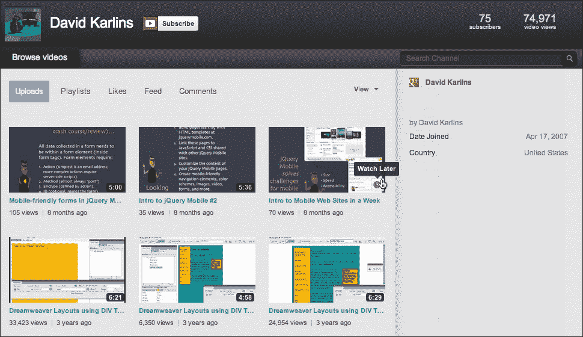
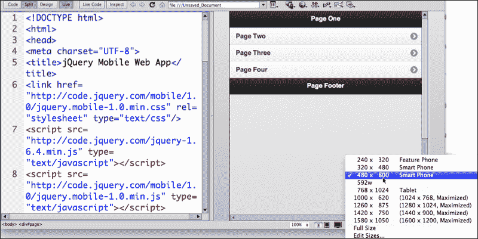
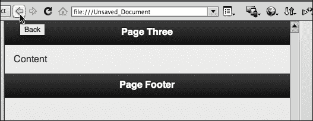
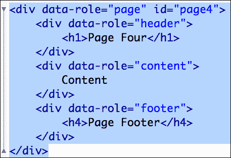
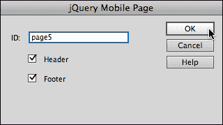
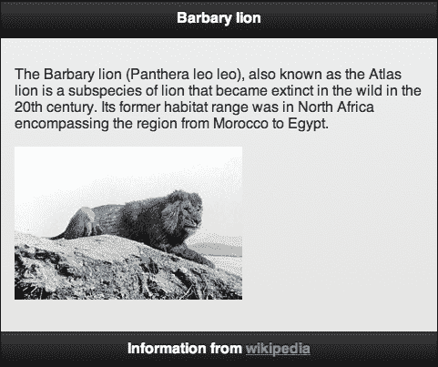
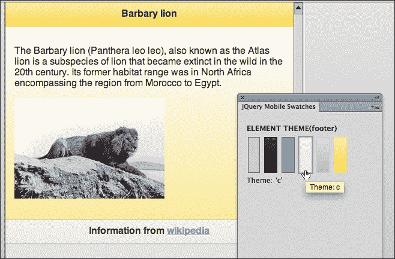

# 第七章。用 jQuery 手机创建手机页面

作为一名网页设计顾问，我沉浸在研究统计趋势的时间里——谁在使用网页？做什么？在什么浏览环境下？但是你可能不需要总结我的研究就知道，无论是在数量上还是在影响上，使用移动设备的人构成了网络活动的动态因素。我将分享一个从我筛选的大量调查中收集的统计数据:随着我们这本书的出版，大约一半的网站访问量将来自移动设备。在娱乐和餐馆等类别中，大量的网页浏览已经通过移动设备完成。

他们为此使用网络浏览器吗？还是应用？两者都有。但是在游戏的这个阶段，移动网站为开发者提供了一种更容易获得的技术。您可以并且将会使用 jQuery Mobile 创建完全移动友好的网站，这些网站看起来和感觉都像应用程序，但不需要构建应用程序时涉及的高级编码。

这不是我们第一次面对为多种媒体设计的挑战。在[第 6 章](06.html "Chapter 6. Responsive Design with Media Queries")、*媒体查询响应设计*中，我们首先探索了用 HTML5 的媒体查询构建的页面，以呈现相同的内容，但具有不同的样式，用于全尺寸、移动和平板尺寸的页面。而在[第五章](05.html "Chapter 5. Embedding HTML5 Native Audio and Video")、*嵌入原生音视频*中，我们探索了使用 HTML5 音视频在网页中嵌入移动友好(非 Flash)视频。

jQuery Mobile 页面提供了一种比简单使用 Media Queries 和移动友好视频更激进的方法来创建移动友好的内容。jQuery Mobile 页面包括为移动设备创建不同的*、*不同的*内容(通常是更短、更压缩的内容)，并以与面向台式机和笔记本电脑用户的网站完全不同的方式呈现这些内容。接下来我们将探讨这意味着什么。*

 *本章涵盖以下主题:

*   面向移动设备的设计—概述
*   应用和移动页面
*   移动网络的三个组件:HTML5、CSS 和 jQuery Mobile
*   Dreamweaver 中的 jQuery Mobile
*   从起始页面生成移动就绪页面
*   自定义移动入门页面内容
*   添加“页面”
*   自定义移动页面 CSS

# 移动页面–概述

设计移动网站的原则可以归结为一个词:简单。

移动站点在设计上必须简单。人们在小设备上观看并与他们互动。正因为如此，在笔记本电脑或台式机上运行良好的列、边栏和复杂背景在移动设备上并不吸引人，也无法访问。

当涉及到为移动设备设计时，“简单”的第二个维度是网站不能加载插件(如 Flash)、服务器端脚本(如 PHP)或复杂的导航方案。其中一些功能在某些移动设备中受支持(某些版本的安卓操作系统支持闪存)，但大多数不受支持。此外，移动设备的处理能力、电池时间和其他限制因素都很有限，这让我们不得不回到口号:简单。

笔记本电脑和台式机与移动设备有着截然不同的界面特征。显然，在大多数情况下，台式机/笔记本电脑的视窗(屏幕)更宽。因此，多列页面布局不仅是可能的，它们通常是呈现诱人内容所必需的。手机不是这样，即使是大平板电脑也不是这样。

台式机和笔记本电脑有一个鼠标或某种悬停设备，可以悬停在一个对象上；移动设备有可以调整大小或滚动的触摸屏。

花些时间在全尺寸视窗和移动设备上检查您最喜欢的网站。你会看到，专业设计的网站有一个单独的移动存在，考虑到这些因素。例如，YouTube 在笔记本电脑中呈现了一个多列网格，并利用悬停功能，允许用户将鼠标悬停在页面上的某个元素上时获得弹出内容。



另一方面，如果你用 iPhone 访问 YouTube，你会体验到一个不依赖悬停的单列网站。


## 移动页面、应用和 jQuery Mobile

在本章的介绍中，我简要指出了使用响应设计(媒体查询)、jQuery Mobile 和应用程序来呈现移动可访问页面之间的关系。让我再详细解释一下:

*   从开发的角度来看，响应设计是移动友好内容的最简单方法，因为使用这种方法，您可以为所有页面使用相同的内容，并且只呈现不同的页面布局。
*   jQuery Mobile requires more work since it involves distinct content for mobile pages, different from that provided to fullscreen visitors. On the other hand, jQuery Mobile sites have a number of advantages such as:
    *   他们下载得更快
    *   它们为移动用户提供了吸引人的动画和交互性
    *   它们允许使用特殊的、移动友好的导航元素
    *   它们支持在小屏幕中更好工作的表单元素。

    ### 注

    本章的剩余部分将向您介绍这是如何工作的

*   应用程序的外观和行为与 jQuery Mobile 页面非常相似，但创建和维护它们需要完全不同的专业知识和资源。应用程序要么用 Objective-C 编程语言编写，要么用其他复杂的编程语言编写。我们将在本书的最后一章深入探讨 PhoneGap。

虽然应用程序开发对于拥有相对无限开发资源的主要机构，或者主要目标是在 iTunes 上销售应用程序以获取利润的人来说是有意义的，但绝大多数网站最好的服务是响应设计或 jQuery Mobile。

## 什么是 jQuery Mobile？

jQuery 是一个基于 JavaScript 的对象库。 JavaScript 可以在任何浏览器或操作系统中工作。这是一个开源(免费)软件。

好，那么什么是 JavaScript 呢？什么是图书馆？

JavaScript 是一种*客户端*脚本语言。也就是说，它是一种在浏览器中创建动画和交互性的编程语言(“客户端”或多或少是浏览器的技术术语)。换句话说:JavaScript(几乎总是)运行在用户的计算机上，而不是服务器上。

自从 Dreamweaver 存在以来，JavaScript 就一直是 Dreamweaver 的一部分。相当废弃的**行为**面板生成 JavaScript。Spry 小部件(在 Dreamweaver 的早期版本中引入)基于 JavaScript。在网页设计的另一个方面，也就是说，在 Dreamweaver 之外，jQuery 已经发展成为一组相对容易访问的可定制的 JavaScript 对象。现在，当我说相对可访问时，我的意思是通过 jQuery 库实现 JavaScript 仍然需要编辑 JavaScript 代码。

在我们使用这个词的上下文中，库通常是 HTML、CSS 和编程语言的组合。你从这些库中得到的是一组文件:一个或多个 HTML 文件，一个或多个 CSS 文件，以及一个或多个为 HTML 和 CSS 添加动画和交互性的程序文件。这些文件一起工作——你需要 HTML、CSS 和程序脚本来使库元素工作。

随着移动设备的出现，出现了一个独特的 JavaScript 库——jQuery Mobile，其中有一组在为移动设备设计时特别有用的对象。

# 从 Dreamweaver 初学者创建移动页面

在 Dreamweaver 的**设计**视图中，有一组很小但非常充实的 jQuery Mobile 对象。它们不需要编码！这些对象中最广泛使用的已经捆绑到一组非常方便的可定制的启动页面中。在本章中，我们将使用这些启动器创建页面，检查它们，并自定义控制这些页面内容和外观的 HTML 和 CSS。

Dreamweaver 中移动入门页面附带的 jQuery 对象本身是不可自定义的。这样，它们与 Dreamweaver 中的 Spry 小部件有点不同，在 Dreamweaver 中，您通常可以自定义一些 JavaScript 本身。但是正如我们将看到的，这不会成为太大的问题，因为您可以通过编辑与 jQuery Mobile 对象相关联的 HTML 和 CSS 来完成大部分您可以想象的定制工作。

这是怎么回事？Dreamweaver 已经建立了工具，允许我们定制 jQuery Mobile 对象，而不用担心表面下发生的事情。但是作为一个非常基本的基础，理解 JavaScript(这适用于 Spry 和 jQuery Mobile 对象)要么在 HTML 对象(如标签，通常包括`div`标签)上工作，要么在已定义的 CSS 样式属性上工作是有帮助的。

例如，一个 jQuery 对象可能会在被点击(或在移动设备上点击)时改变其背景颜色。但是颜色(之前和之后)是在相关联的 CSS 规则中定义的，该规则可在 **CSS 样式**面板中访问。此外，该对象中的内容(文本、图像、媒体)由您在 Dreamweaver 的**设计**视图中创建的 HTML 定义。

Dreamweaver 自带三个基于 jQuery Mobile 的入门页面:**jQuery Mobile(CDN)****jQuery Mobile(本地)****jQuery Mobile 带主题(本地)**。您可以通过导航至**文件** | **新建**并从左侧栏的**样本**和**样本文件夹**栏的**移动启动器**中选择**页面**来访问这些选项以打开**新文档**对话框。


jQuery Mobile 示例页面的那三个选项是什么？

*   **jQuery Mobile (CDN)** 使用 JavaScript 和 CSS 的版本，这些版本通过致力于提供 jQuery Mobile 的**中央分发网络** ( **CDN** )进行存储和分发。这是在 jQuery Mobile 中构建页面最可靠、最稳定的方法，因为集中分布的文件不会被您所做的任何事情破坏。此外，随着新版本的 JavaScript 和 CSS 文件的引入，您可以更新它们的链接。缺点是，除非在线，否则无法在 Dreamweaver 中的 jQuery Mobile 网站上工作。
*   **jQuery Mobile(本地)**使用 Dreamweaver 附带的 JavaScript 和 CSS 版本。这些文件更容易损坏，因为它们存储在您的计算机上(并上传到您的服务器上)。但是在没有互联网接入的情况下，您可以使用它们在 Dreamweaver 中开发 jQuery Mobile 网站。
*   The **jQuery Mobile with theme (Local)** option is new to Dreamweaver CS6 and is an attempt by Adobe to make it easier to edit the theme for a jQuery Mobile site. A theme is the portion of the required CSS that defines fonts, colors, and other styling options. My experience has been that it is easy and reliable to use one of the other options, and you can avoid this option. But we'll return to these issues in [Chapter 9](09.html "Chapter 9. Customizing Themes with ThemeRoller"), *Customizing Themes with ThemeRoller*, when we explore customizing themes in detail.

    ### 类型

    在大多数情况下，使用 **jQuery Mobile (CDN)** 选项开始创建新的 jQuery Mobile 站点。

点击**新建文档**对话框中的**创建**按钮后，基于 jQuery Mobile 的网页将在 Dreamweaver **文档**窗口中打开。

## 拆分视图中的移动页面

编辑和预览 jQuery Mobile 页面带来了一个特殊的挑战:如果不进入实时视图，您将无法真正看到页面的外观，因为使页面工作的 jQuery Mobile 应用程序不会与实时视图一起显示。但另一方面，您不能在“实时”视图打开的情况下，在“设计”视图中编辑 jQuery Mobile 页面的内容。

有两种方法可以应对这一挑战:

*   您可以在 **Live** 视图中来回切换，关闭(编辑页面)或打开(查看页面)
*   您可以在**设计**窗口中打开**直播**视图，并在**代码**视图中进行编辑

在本书中，我们将使用并结合这两种技术。为此，您会发现在拆分视图中检查页面非常有用，原因有二。在拆分视图中，您既可以检查 HTML 代码，也可以查看预览的页面，因为它将出现在浏览器中。此外，您可以在更窄的预览窗口中看到您的页面，这将更接近模拟您的页面在移动设备中的外观。

在设计移动设备时，利用**设计**分割**视图一半的底部弹出的**窗口大小**，将**预览**窗口的大小更改为`480`像素宽，这是一个与许多流行的移动设备相对应的尺寸，这一点特别有用。使用 Dreamweaver(底部)状态栏中弹出的**窗口大小**来执行此操作。**


或者，您可以将状态栏中的预设大小按钮用于移动、平板或桌面大小的窗口:


## 在实时视图中预览 jQuery 移动页面

当您浏览任何 jQuery Mobile 初学者页面生成的模板页面时，您会马上注意到一件事，它与您在 Dreamweaver 中使用过的其他页面非常不同；在打开实时视图之前(点击**文档**工具栏中的**实时视图**按钮)，几乎看不到任何格式。试着来回切换，打开和关闭**实时视图**，查看关闭**实时视图**时显示什么和不显示什么。



# 定制手机页面内容

从基本意义上来说，您可以像自定义任何由起始页面生成的内容一样自定义 jQuery Mobile 页面内容。入门页面自带模板内容，你可以用自己的真实内容代替。

够简单吗？算是吧。正如我们已经注意到的，jQuery Mobile 页面中的内容和布局之间的差距有不同的顺序。换句话说，没有什么比关闭实时视图更接近它的外观了。但是，您不能在实时视图中编辑内容。

## html 5 数据角色属性

与 jQuery Mobile 脚本相关联的 Div 标签可以作为不同种类的元素，包括那些看起来像并且在移动设备中表现得像页面的元素。这是通过在 HTML5 标签中实现数据角色属性，然后定义 CSS(样式表)规则来配合每个数据角色来完成的。

通常，Dreamweaver 中的入门页面就是这种情况，jQuery Mobile 页面使用以下四个数据角色进行组织和布局:

*   页
*   页眉
*   内容
*   页脚

## 数据-角色页面

在一个 HTML 页面中组织页面内容的基本框架是带有`data-role-page`属性的`div`标签。换句话说在一个 HTML 页面中，通常有多个使用`div`标签的`data-role`创建的“页面”。

如果您看一下从 Dreamweaver jQuery Mobile starter 生成的代码和页面布局，就可以知道这是如何工作的。您会看到，在 Live 视图中看似“页面”的内容实际上是一个`div` `data-role`页面:


用一个名为`data-role`的 HTML5 属性将内容组织成实际上是`div`的标签，允许人们浏览感觉和行为像网页的内容。但是这些`div`标签就像页面一样，允许访问者在“页面”之间来回跳转，而不必等待新页面加载到他们的浏览器中。使用这样的`data-page` `div`标签是如何最好地利用移动设备上的微小空间来呈现大量内容的核心。

人们在移动设备中通过点击、拖动或其他方式在`data-role`页面之间导航，导航方式本质上是显示或隐藏不同的“页面”。您可以通过在实时视图中的 jQuery Mobile 初学者页面的“页面”中导航来熟悉这是如何工作的。使用 Dreamweaver **文档**窗口工具栏中的**后退**按钮来模拟移动浏览设备中的**后退**按钮:



## 定制页面内容

现在您已经了解了 jQuery Mobile 页面是如何在一个 HTML 页面中组织和运行的，在起始页面中定制“页面”的内容将会非常自然。处理这个过程的一种方法是忽略其他一切，简单地用自己的内容替换 jQuery“页面”中的内容。然后，在实时视图中试用内容，看看它是如何流动的，并根据需要编辑、移动、拆分和修改内容。

使用您自己的内容替换每页的页眉、内容和页脚。在每个生成的页面中标识该代码:

```html
<div data-role="page" id="page2">
  <div data-role="header">
 <h1>Page Two</h1>
  </div><div data-role="content">
 Content 
</div>  
<div data-role="footer">
 <h4>Page Footer</h4>
  </div>
</div>
```

用任何 HTML5 内容替换突出显示的代码行中的内容。

### 类型

**记住**:在你的 jQuery Mobile 页面中只使用 HTML5 内容。避免使用 Flash 等插件。此外，避免服务器端包含内容(使用服务器端脚本将数据提供到页面中)，如果这是您正在处理的事情的话。服务器端的实时数据不是我们将在本书中探讨的内容，但是如果您使用的是 PHP 脚本，它将不会在 jQuery Mobile 页面中出现。同样，基本规则是:坚持 HTML、CSS 和 JavaScript 内容。

此外，虽然我是 Dreamweaver 中最大化使用设计视图的倡导者，部分原因是 jQuery Mobile 页面中内容和格式之间的巨大差距，但我不得不承认，我通常会在拆分视图的代码端创建 HTML 内容，而在设计端打开实时视图。

## 为不同的数据角色定制内容

一般来说，为“页面”定制内容的过程包括浏览和定制页面的页眉、内容和页脚部分。

jQuery Mobile 页面也使用`listview`数据角色来组织链接集。同样，一般来说，这些链接是 HTML 页面中到其他数据角色“页面”的链接。用更传统的 HTML 术语来说，这些是指向命名锚点的链接。您可以通过查看 starter 页面附带的默认(内部)listview 链接来了解这些是如何设置的。如您所见，默认情况下，它们链接到`#page2`、`#page3`和`#page4`；您可以复制并粘贴这些链接，以创建更多“页面”的更多链接。接下来我们将详细探讨这个过程。

# 添加新的 jQuery 移动页面和对象

jQuery Mobile 入门页面包含四个页面，以及指向四个页面的链接。一个不错的数字，但是如果你想让有五页，或者六页，或者七页呢？

如果您需要添加更多的“页面”，复制、粘贴并稍微编辑(更改页码)定义每个“页面”的相当容易识别的 HTML 代码部分。当您自定义内容时，打开和关闭实时视图以查看页面在浏览器或应用程序中的外观，使用**窗口大小**弹出窗口定义预览环境。

以下是您在复制和粘贴以创建新页面时需要做的事情:

复制粘贴页面顶部列表中的链接，更改`xxx`。例如，当您创建第五页时，该代码将被添加到第四页之后的列表中，如下所示:

```html
<li><a href="#page4">Page Four</a></li>

       <li><a href="#page5">Page Five</a></li>
```

如您所见，列表中复制的代码有两处更改。

您需要通过复制并粘贴生成的`page4`并制作`page5`来创建新页面。选择并复制定义`page4`的代码。



然后在**页面 4** 的 **数据-角色**属性末尾的结束`</div>`标签后粘贴该代码。将`id`值更改为`page5`。

显然，您将希望在新页面的页眉、内容和页脚部分创建自定义内容。但是为了让您在页面顶部的列表中创建的链接起作用，您还需要确保更改页面 ID 以匹配您在页面顶部的列表中定义的`href`链接。


Dreamweaver 有一个用于添加新页面的菜单选项。要使用该功能，请导航至**插入** | **jQuery Mobile** | **页面**。出现 **jQuery 移动页面**对话框，预设提示在您最后一个现有页面之后添加一个页面。复选框选项允许您在页面上包括页眉和页脚(或不包括页眉和页脚):



在介绍这个对话框选项之前，我想向您展示一下代码，以便您更好地了解正在发生的事情，但是在这样做之后，我鼓励您使用这个对话框来节省时间。

# 使用主题样本进行造型

作为 jQuery Mobile 库一部分的 CSS 文件有五个主题样本。为了暂时了解技术，所有这五个样本都构建在一个 CSS 文件中。它们分别被命名为`a`、`b`、`c`、`d`和`e`。这些主题样本中的每一个都为页面背景和字体颜色提供了不同的、移动友好的(高对比度)配色方案。

这意味着，简而言之，您不会像对普通网页那样通过编辑 CSS 来对 jQuery Mobile 页面应用样式。相反，您可以更改 HTML，将五个主题样本中的一个应用于页面上的任何元素。

被限制在五个主题样本是不是有点狭窄？是的。但是我们将在[第 9 章](09.html "Chapter 9. Customizing Themes with ThemeRoller")、*中通过创建我们自己的自定义主题样本来解决这个问题。首先，让我们轻松应用主题样本。*

## 应用主题

jQuery Mobile 中的“主题”到底是什么？jQuery Mobile CSS 文件有内置的主题:`a`、`b`、`c`、`d`和`e`。同样，这些不是单独的 CSS 样式表文件；它们是 CSS 文件中的主题(有时也称为样本)。每个主题都有不同的配色方案。

您可以使用 HTML5 中的`data-theme`属性来定义哪个 jQuery Mobile 主题应用于任何元素。您可以使用 **jQuery 移动色板**面板将主题色板指定给任何选定的元素。

导航至**窗口** | **jQuery 手机样本**查看面板。单击页面中的任何元素，然后单击一个样本，将该配色方案分配给该元素。顺便说一下，这可以在实时视图切换到打开状态时工作。


你可以手工制作主题。例如，要将主题`e`应用于 ID 为`page`的`div`页面，请使用以下代码:

```html
<div data-role="page" id="page" data-theme="e">
```

或者举第二个例子，如果您希望将主题`a`应用于页面上的内容元素，请使用以下代码:

```html
<div data-role="content" data-theme="a">
```

## 在 jQuery 手机页面中编辑 CSS

因为 jQuery Mobile 页面中的大部分格式依赖于作为 jQuery Mobile 库一部分的中央 CSS 文件，所以您定义自定义 CSS 的选项非常有限。让 jQuery Mobile 页面工作的 CSS 文件非常复杂，有数百种 CSS 样式。编辑该样式表文件可能会撤消整个包，并使您的 jQuery Mobile 页面功能失调。

如果你是一个高级 CSS 编码者，你可以将你自己的 CSS 样式附加到 jQuery Mobile 包中提供的文件中。但是，通过使用定制的 jQuery Mobile 主题，可以实现高级别的定制——我们将在本书的[第 9 章](09.html "Chapter 9. Customizing Themes with ThemeRoller")、*中探索使用主题滚轮*定制主题。

也就是说，如果你真的想“躲起来”，这里有一点关于为 jQuery Mobile 页面创建自己的 CSS 样式的建议:

*   您可以识别和编辑`div`标签的样式，主要是`class`样式，以重新格式化内容容器和其他对象。
*   您可以在 CSS 对话框中识别和编辑元素(标签)规则。例如，您可以重新定义标题和段落标记。
*   在应用上述两种方法时，您可以借鉴并应用在[第 2 章](02.html "Chapter 2. Using HTML5 for Page Structure")、*中探索的技术，将 HTML5 用于页面结构*，只是您必须另外考虑到jQuery Mobile 页面中的许多对象(`class`样式)对于五个主题中的每一个都有特定的规则。

有了这三点建议，擅长 CSS 编码的读者可能希望创建自己的 CSS 样式，以增强作为 jQuery Mobile 包的一部分提供的样式。

# 示例–使用 jQuery Mobile 对象构建移动网页

为了回顾和加强本章中的概念，并为您提供一组创建自己的 jQuery 移动页面的快速步骤，让我们浏览一个示例。

与您在 Dreamweaver CS6 中所做的一切一样，前提是您在一个定义好的 Dreamweaver 站点上工作。我称之为我的`jqm`，但无论如何，如果创建一个网站，如果过程的本质不清楚，回顾[第 1 章](01.html "Chapter 1. Creating Sites and Pages with Dreamweaver CS6")、*用 Dreamweaver CS6* 创建网站和页面，并创建网站。

1.  导航至**文件** | **新建**，创建新的 jQuery 手机页面。
2.  在**新文档**对话框中，从**类别**列的**样本**中选择**页面**，从**样本文件夹**列中选择**移动启动器**，从**样本页面**列中选择 **jQuery 移动(CDN)** 。点击**创建**。
3.  将页面另存为`index.html`。
4.  选择**分割**视图，设置**设计**视图**窗口大小**为`480`像素宽，`800`像素高，查看您的 **CSS 样式**面板，设置一个方便的工作空间。
5.  向 jQuery Mobile 站点添加第五个页面元素。要在您的站点末尾插入该页面，请单击**代码**视图，将您的插入点放在结束的`</body>`标签之前。
6.  导航至**插入** | **jQuery Mobile** | **页面**插入新页面元素。出现 **jQuery 手机页面**对话框，预设提示添加**第五页**。保持选中复选框选项，以便在页面上包含页眉和页脚。
7.  Even though Dreamweaver added a fifth page element, you still need to create a link to that element from your home page. Copy and paste the **Page Four** link on the home page of the jQuery Mobile site. Change the link text to **Page Five**, and change the link to **#page5** in the **Properties** inspector.

    

8.  Customize the page content for each page. Need some inspiration for an example? Head over to Wikipedia's page for endangered species, and copy and paste some of the text (and pictures) into your various pages. When you copy and paste text from Wikipedia (or other sources), navigate to **Edit** | **Paste Special** to enable the **Paste Special** dialog and choose the **Text only** option to avoid copying links and styles as you paste the text into Dreamweaver.

    

9.  Check that the links on your home page element work. If you have set up pages for four endangered species, the home page should have links to each. And be sure to appropriately credit Wikipedia in your footer.

    

10.  Test your site in Live view. Clicking each link on the home page element should open one of the four additional page elements.

    

11.  确保 **jQuery 移动色板**面板打开(如果没有，导航至**窗口** | **jQuery 移动色板**)。
12.  With Live View on, systematically work through your new site, selecting elements and applying swatch coloring to each element.

    

13.  Save your page and navigate to **File** | **Preview in Browser**. Test your page in a browser. While testing in a browser in your development environment (a laptop or desktop computer) doesn't completely duplicate a mobile experience, it provides a good enough testing environment.

    

# 总结

在本章中，我们介绍了在 Dreamweaver CS6 中创建完整 jQuery Mobile 页面的基本元素。这些“页面”是两个层次的页面。一方面，它们是使用 HTML5 的常规 HTML 页面(与通过 jQuery Mobile 提供的 CSS 和 JavaScript 相结合)。在另一个层面上，这个 HTML 页面有 jQuery 数据页面，基本上是页面内的页面。这项技术允许我们创建一个移动网页，允许访问者导航，而不必等待他们的移动设备加载额外的页面。

为了创建这个 jQuery Mobile 页面(带有一组数据页面)，我们依赖于 Dreamweaver 启动页面。该页面包括许多最广泛使用的 jQuery Mobile 元素。还有其他有用的 jQuery Mobile 页面元素，我们将在下一章中探讨它们。

您可以像编辑任何 HTML5 页面一样编辑 jQuery Mobile 页面的内容。因此，在前面几章中，您为掌握定制 HTML5 页面内容所涉及的基本技术付出的所有心血、汗水和泪水都在这里得到了回报。但是，由于页面格式和导航非常依赖 JavaScript(尤其是 jQuery Mobile 脚本库)，您需要更多地依赖 Live View 来查看页面与普通 HTML5 页面相比的外观。

jQuery Mobile 中的编辑样式受限于 jQuery Mobile 页面涉及许多 CSS 规则以及 jQuery Mobile CSS 被组织成主题的事实。在本章中，您学习了如何应用主题样本。在[第 9 章](09.html "Chapter 9. Customizing Themes with ThemeRoller")、*使用主题滚轮*定制主题中，我们将探讨如何创建定制主题。

在本章学习创建的基本 jQuery Mobile 页面中，您已经为创建非常广泛的 jQuery Mobile 站点打下了基础。在下一章中，我们将探索创建更复杂的 jQuery Mobile 页面的其他工具。*