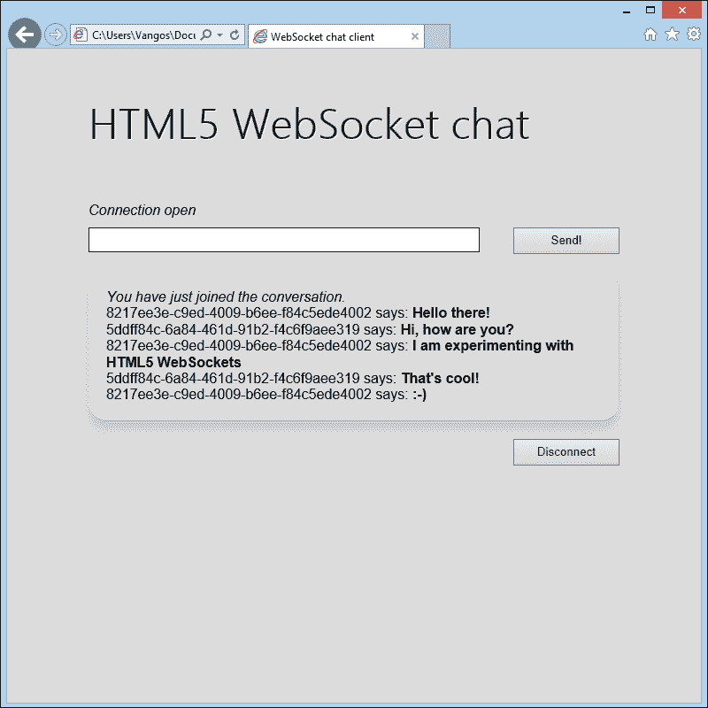

# 三、服务器配置

WebSocket代表双向、全双工通信。因此，我们需要两方进行这种对话。在上一章中，我们实现了 WebSocket 客户端应用。现在是时候建立通道的另一端了，即 WebSocket 服务器。

# 我为什么需要 WebSocket 服务器？

我们假设您一般对服务器有一点了解。服务器只不过是一台远程计算机，它具有特定的硬件和软件要求，以实现高可用性和启动时间、增强的安全性以及对多个并发连接的管理。

WebSocket 服务器只是一个能够处理 WebSocket 事件和操作的简单程序。它通常向 WebSocket 客户端 API 公开类似的方法，大多数编程语言都提供了一个实现。下图说明了 WebSocket 服务器和 WebSocket 客户端之间的通信过程，强调了触发的事件和操作。

下图显示 WebSocket 服务器和客户端事件触发：


不要感到困惑——Web 服务器既可以在 Apache 或 IIS 上运行，也可以是完全不同的应用。

考虑到硬件，您可以使用超级计算机或您的开发人员机器作为服务器。这取决于每个项目的需求和预算。

# 设置服务器

从头开始实现WebSocket 服务器并不是一个困难的过程，尽管它需要特定的知识，并且与本书的目的相去甚远。因此，我们将使用现有的 WebSocket 实现之一。由于有大量的开发人员，我们可以轻松地选择我们首选的编程语言或框架的 WebSocket 服务器。此外，大多数实现都是开源的，因此如果需要，您甚至可以根据自己的需要进行调整！

## 选择适合您的技术

我们列出了一些流行的 WebSocket 服务器实现。在选择之前，您应该问自己以下几个问题：

*   您最熟悉的技术是什么？
*   您的项目的具体要求是什么？
*   您是否已经有了要增强的解决方案？
*   服务器的文档是否完整、易懂？
*   是否存在该服务器的活动支持社区？

现在让我们来看看最流行的 WebSocket服务器库，用于使用最广泛的编程语言。

### C/C++

<colgroup><col style="text-align: left"> <col style="text-align: left"></colgroup> 
| Tufao'T0'。 | T0https://github.com/vinipsmaker/tufao T1 |
| [Wslay【t0] | [http://wslay.sourceforge.net/](http://wslay.sourceforge.net/) |
| Libwebsockets T0 | T0http://libwebsockets.org/trac T1 |
| 猫鼬 | [https://code.google.com/p/mongoose/](https://code.google.com/p/mongoose/) |

### 爪哇

<colgroup><col style="text-align: left"> <col style="text-align: left"></colgroup> 
| ApacheTomcat | T0http://tomcat.apache.org/ T1 |
| JBoss | T0http://www.jboss.org/ T1 |
| 玻璃鱼。 | T0http://glassfish.java.net/ T1 |
| 大气 | [https://github.com/Atmosphere/atmosphere](https://github.com/Atmosphere/atmosphere) |
| 播放框架 | [http://www.playframework.com/](http://www.playframework.com/) |
| 码头 | [http://www.eclipse.org/jetty/](http://www.eclipse.org/jetty/) |
| jWebSocket | [http://jwebsocket.org/](http://jwebsocket.org/) |
| 迁移数据 | [http://migratorydata.com/](http://migratorydata.com/) |
| 回毛*12304T0*123051； | T0http://bristleback.pl/ T1 |

### .NET

<colgroup><col style="text-align: left"> <col style="text-align: left"></colgroup> 
| 互联网信息服务8 | [http://www.iis.net/](http://www.iis.net/) |
| 斑点*12304T0*123051； | T0https://github.com/statianzo/Fleck T1 |
| 超级网袋 | T0http://superwebsocket.codeplex.com/ T1 |

### PHP

<colgroup><col style="text-align: left"> <col style="text-align: left"></colgroup> 
| Php web 套接字 | 我对上帝发誓。https://github.com/nicokaiser/php-websocket 哈。 |
| 轴 | [http://socketo.me/](http://socketo.me/) |
| 白'T0'。 | T01230551；https://github.com/hoaproject/Websocket 1-123051；T2-1230555； |

### 蟒蛇

<colgroup><col style="text-align: left"> <col style="text-align: left"></colgroup> 
| 龙卷风 | [http://www.tornadoweb.org/en/stable/](http://www.tornadoweb.org/en/stable/) |
| Pywebsocket | ‘T0’。https://code.google.com/p/pywebsocket/ “T1”“T2”； |
| 高速公路 | T0http://autobahn.ws/ T1 T2 |
| txWS 1230444；T0 123055； | 我对上帝发誓。https://github.com/MostAwesomeDude/txWS 哈。 |
| Python 的 WebSocket | ‘T0’。https://github.com/Lawouach/WebSocket-for-Python “T1”“T2”； |

### 红宝石

<colgroup><col style="text-align: left"> <col style="text-align: left"></colgroup> 
| EM WebSocket | T01230551；https://github.com/igrigorik/em-websocket 1-123051；T2-1230555； |
| Socky服务器 | T0https://github.com/socky/socky-server-ruby T1 |

### JavaScript

这不是开玩笑。感谢`Node.js`，您可以使用 JavaScript 创建 web 服务器。`Node.js`（[http://nodejs.org](http://nodejs.org) 是一个事件驱动的框架，允许您构建实时 web 应用。它也由谷歌的 JavaScript 引擎 V8 解释。尽管该框架不支持现成的 WebSocket，但有一些非常好的扩展可以做到这一点。

<colgroup><col style="text-align: left"> <col style="text-align: left"></colgroup> 
| 插座 IO | [http://socket.io/](http://socket.io/) |
| WebSocket 节点 | [https://github.com/Worlize/WebSocket-Node](https://github.com/Worlize/WebSocket-Node) |
| 节点 WebSocket服务器 | T0https://github.com/miksago/node-websocket-server T1 |

`Node.js`粉丝不断增加，所以值得一试。

## 建立发展环境

创建服务器的环境取决于您计划使用的技术、框架和编程语言。有各种各样的**集成开发环境**（**IDE**）和实用程序，让您的生活更轻松！

以下是我们建议的一些 IDE 列表，以及它们支持的 web 编程语言：

<colgroup><col style="text-align: left"> <col style="text-align: left"> <col style="text-align: left"></colgroup> 
| 

集成电路设备

 | 

操作系统

 | 

支持的语言

 |
| --- | --- | --- |
| 阿普塔纳 | Windows、Mac、Linux | HTML5JavaScriptPHP |
| NetBeans | Windows、Mac、Linux | HTML5信用证++JAVA |
| Eclipse（带有 Web 开发者插件） | Windows、Mac、Linux | HTML5JavaScript信用证++JAVA |
| Visual Studio | 窗户 | HTML5JavaScript网 |
| 网络矩阵 T0 | 窗户 | HTML5JavaScriptPHP网 |

在整本书中，我们决定使用 C#NET 和 Fleck，尽管这对您来说没有什么不同。自由选择您喜欢的语言或您现有项目所需的语言。

出于教学目的，C#具有以下优点：

*   它使用.NET 框架在 Windows 上运行，使用 Mono 在 Mac 和 Linux 上运行
*   它有一个活跃的开发人员社区，使其更容易找到支持
*   这很容易学
*   您可以使用最少的配置快速设置 WebSocket 服务器

选择 Fleck library的原因有三：

*   它在基于 Windows 和 Unix 的操作系统上都受支持
*   它非常易于使用和配置
*   它得到了良好的维护和记录

这就是如何使用 C#快速设置Fleck WebSocket 服务器：

1.  下载 Visual Studio Express（可在[免费获得）http://www.microsoft.com/visualstudio/eng/products/visual-studio-express-for-windows-desktop](http://www.microsoft.com/visualstudio/eng/products/visual-studio-express-for-windows-desktop) ）。
2.  下载点（'T0'）https://github.com/statianzo/Fleck T1（T1）。
3.  启动 Visual Studio，点击**文件****新建****项目**。
4.  在 Visual C#下，选择**窗口**。
5.  选择**控制台应用**（是的，基于控制台的服务器是设置 WebSocket 服务器的最简单方法）。
6.  您可以随意命名您的项目，然后单击**确定**。
7.  在**解决方案浏览器**选项卡上，右键点击**参考**图标，选择**添加新参考**。
8.  点击**浏览**找到`Fleck.dll`文件。
9.  点击**确定**即可！

# 连接到 web 服务器

WebSocket 服务器的工作方式与 WebSocket 客户端类似。它响应事件并在必要时执行操作。无论您使用何种编程语言，每个 WebSocket 服务器都会执行一些特定的操作。它被初始化为 WebSocket 地址，处理`OnOpen`、`OnClose`和`OnMessage`事件，并向客户端发送消息。

## 创建 WebSocket 服务器实例

每个WebSocket 服务器都需要一个有效的主机和端口。下面是我们如何在 Fleck 中创建 WebSocketServer 实例：

```html
var server = new WebSocketServer("ws://localhost:8181");
```

您可以键入任何想要的有效 URL，并指定未使用的端口。

保存已连接客户端的记录非常有用，因为您可能需要为它们提供不同的数据或向每个客户端发送不同的消息。

Fleck 表示具有`IWebSocketConnection`接口的传入连接（客户端）。我们可以创建一个空列表，并在有人连接或断开我们的服务时进行更新：

```html
var clients = new List<IWebSocketConnection>();
```

之后，我们可以调用`Start`方法，等待客户端连接。启动时，服务器能够接受传入连接。

在 Fleck 中，`Start`方法需要一个参数来指示引发事件的套接字：

```html
server.Start(socket) =>
{
});
```

一些语法解释：`Start`声明之后的内容被称为 C#Action，如果使用不同的语言，您可以完全忽略它。我们将处理`Start`块中的所有事件。

## 开放

`OnOpen`事件确定新客户端已请求访问并执行初始握手。我们应该将客户机添加到列表中，并可能存储与之相关的任何信息，例如 IP 地址。Fleck 为我们提供了此类信息，以及连接的唯一标识符。

```html
server.Start(socket) =>
{
  socket.OnOpen = () =>
  {
    // Add the incoming connection to our list.
    clients.Add(socket);
  }

  // Handle the other events here…
}); 
```

## 关闭

每当客户端断开连接时，就会引发`OnClose`事件。我们可以将该客户从我们的列表中删除，并通知其他客户断开连接：

```html
socket.OnClose = () =>
{
  // Remove the disconnected client from the list.
  clients.Remove(socket);
};
```

## 信息

当客户端向服务器发送数据时，会引发`OnMessage`事件。在这个事件处理程序中，我们可以将传入消息传输到所有客户端，或者可能只选择其中的一部分。这个过程很简单。请注意，此处理程序将名为`message`的字符串作为参数：

```html
socket.OnMessage = () =>
{
  // Display the message on the console.
  Console.WriteLine(message);
};
```

## 发送

`Send()`方法只是将所需的消息发送到指定的客户端。使用`Send()`，我们可以跨客户端传递文本或二进制数据。让我们遍历已注册的客户端并将消息传递给它们。我们需要修改`OnMessage`事件如下：

```html
socket.OnMessage = () =>
{
foreach (var client in clients)
{
  // Send the message to everyone!
  // Also, send the client connection's unique identifier in order to recognize who is who.
  client.Send(client.ConnectionInfo.Id + " says: " + message);
}
};
```

显然，您不需要公开每个人的 IP 地址或 ID！这对你的用户来说毫无意义（除非他们是黑客）。当然，在真实的聊天对话中，用户选择昵称而不是字符串文字。我们将在下一章中为他们提供昵称选项。

Fleck 接受字符串和字节数组。字符串包含纯文本、XML 或 JSON 消息。在处理图像或二进制文件时，字节数组非常有限。

# 其他方法

根据您使用的 WebSocket 服务器实现，可能会有其他事件或方法。例如，Fleck 支持`OnBinary`事件，它是支持`OnMessage`事件的二进制等价物。

请记住，web 服务器将连接存储在一个列表中，为了发送消息，我们需要遍历所有连接。

# 完整的源代码

以下是完整的服务器端源代码，并添加了一些额外的代码以获得更好的用户体验。屏幕截图显示一个 Chrome 和一个 InternetExplorer10 并排聊天的窗口！

以下屏幕截图显示了一位用户使用 Chrome 聊天：


以下屏幕截图显示第二个用户同时使用 Internet Explorer 10 聊天：



```html
namespace WebSockets.Server
{
  class Program
  {
    static void Main(string[] args)
    {
      // Store the subscribed clients.
      var clients = new List<IWebSocketConnection>();

      // Initialize the WebSocket server connection.
      var server = new WebSocketServer("ws://localhost:8181");

      server.Start(socket) =>
      {
        socket.OnOpen = () =>
        {
          // Add the incoming connection to our list.
          clients.Add(socket);

          // Inform the others that someone has just joined the conversation.
          foreach (var client in clients)
          {
            // Check the connection unique ID and display a different welcome message!
            if (client.ConnectionInfo.Id != socket.ConnectionInfo.Id)
            {
              client.Send("<i>" + socket.ConnectionInfo.Id + " joined the conversation.</i>");
            }
            else
            {
              client.Send("<i>You have just joined the conversation.</i>");
            }
          }
        };

        socket.OnClose = () =>
        {
          // Remove the disconnected client from the list.
          clients.Remove(socket);

          // Inform the others that someone left the conversation.
          foreach (var client in clients)
          {
            if (client.ConnectionInfo.Id != socket.ConnectionInfo.Id)
            {
              client.Send("<i>" + socket.ConnectionInfo.Id + " left the chat room.</i>");
              }
            }
          };

          socket.OnMessage = message =>
          {
            // Send the message to everyone!
            // Also, send the client connection's unique identifier in order to recognize who is who.
            foreach (var client in clients)
            {
              client.Send(socket.ConnectionInfo.Id + " says: <strong>" + message + "</strong>");
            }
          };
        });

        // Wait for a key press to close...
        Console.ReadLine();
      }
  }
}
```

# 总结

现在，您应该能够创建一个完整的 WebSocket 应用了！[第 2 章](02.html "Chapter 2. The WebSocket API")*WebSocket API*演示了如何使用 JavaScript 配置客户端，本章向您展示了如何使用您最熟悉的环境和编程语言配置 WebSocket 服务器。此外，我们还了解了 WebSocket 服务器事件和操作。在接下来的章节中，我们将学习如何有效地处理不同的数据格式并保护基于 WebSocket 的应用。