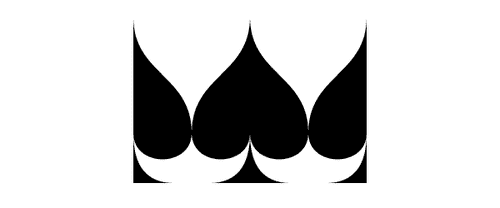
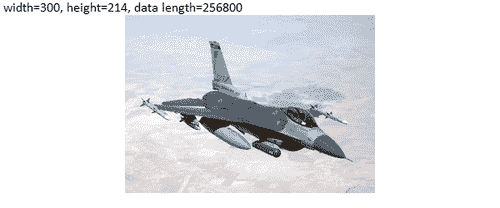
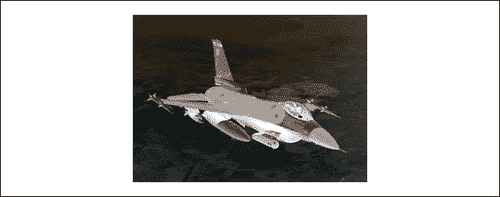
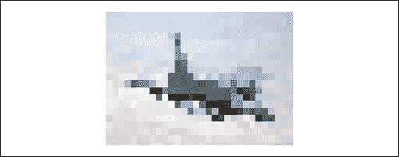

# 第三章。使用图像和视频

在本章中，我们将介绍:

*   绘制图像
*   裁剪图像
*   复制和粘贴画布的部分
*   使用视频
*   获取图像数据
*   像素操作简介:反转图像颜色
*   反转视频颜色
*   将图像颜色转换为灰度
*   将画布绘图转换为数据网址
*   将画布绘图保存为图像
*   用数据网址加载画布
*   创建像素化图像焦点

# 简介

这一章的重点是 HTML5 画布的另一个非常令人兴奋的主题，图像和视频。除了为定位、调整大小和裁剪图像和视频提供基本功能之外，HTML5 画布应用编程接口还允许我们访问和修改两种媒体的每个像素的颜色和透明度。我们开始吧！

# 绘制图像

让我们直接画一个简单的图像。在本食谱中，我们将学习如何加载图像并将其绘制在画布上的某个位置。


按照以下步骤在画布中央绘制图像:

## 怎么做...

1.  定义画布上下文:

    ```html
    window.onload = function(){
    var canvas = document.getElementById("myCanvas");
    var context = canvas.getContext("2d");

    ```

2.  创建一个 `image`对象，将 `onload`属性设置为绘制图像的函数，然后设置图像的来源:

    ```html
    var imageObj = new Image();
    imageObj.onload = function(){
    var destX = canvas.width / 2 - this.width / 2;
    var destY = canvas.height / 2 - this.height / 2;
    context.drawImage(this, destX, destY);
    };
    imageObj.src = "jet_300x214.jpg";
    };

    ```

3.  将画布标签嵌入到 HTML 文档的主体中:

    ```html
    <canvas id="myCanvas" width="600" height="250" style="border:1px solid black;">
    </canvas>

    ```

### 它是如何工作的...

要绘制图像，我们首先需要使用新的 `Image()`创建一个 `image`对象。请注意，在定义图像来源之前，我们已经设置了 `image`对象*的 `onload`属性。*

### 类型

在设置其来源之前，定义当图像加载*时我们想要对其做什么是一个很好的实践。理论上，如果我们在定义 `onload`属性之前定义图像的来源；图像可能会在定义完成之前加载(尽管这不太可能)。*

本食谱中的关键方法是 `drawImage()`方法:

```html
context.drawImage(imageObj,destX,destY);

```

其中 `imageObj`是 `image`对象， `destX`和 `destY`是我们要定位图像的地方。

### 还有更多...

除了使用 `destX`和 `destY`定义图像位置之外，我们还可以添加两个附加参数 `destWidth`和 `destHeight`来定义图像的大小:

```html
context.drawImage(imageObj,destX,destY,destWidth,destHeight);

```

在大多数情况下，避免使用 `drawImage()`方法调整图像大小是一个好主意，因为缩放后的图像质量会显著降低，类似于我们使用 HTML 图像元素的宽度和高度属性调整图像大小时的结果。如果图像质量是你关心的事情(你到底为什么不关心呢？)，如果您正在创建一个需要缩放图像的应用程序，通常最好在处理较大图像的同时处理缩略图图像。另一方面，如果您的应用程序动态地缩小和扩展图像，那么使用带有 `destWidth`和 `destHeight`的 `drawImage()`方法来缩放图像是完全可以接受的方法。

# 裁剪图像

在这个食谱中，我们将裁剪出图像的一部分，然后将结果绘制到画布上。


按照以下步骤裁剪出图像的一部分，并将结果绘制到画布上。

## 怎么做...

1.  定义画布上下文:

    ```html
    window.onload = function(){
    var canvas = document.getElementById("myCanvas");
    var context = canvas.getContext("2d");

    ```

2.  创建图像对象，将 `onload`属性设置为裁剪图像的函数，然后设置图像的来源:

    ```html
    var imageObj = new Image();
    imageObj.onload = function(){
    // source rectangular area
    var sourceX = 550;
    var sourceY = 300;
    var sourceWidth = 300;
    var sourceHeight = 214;
    // destination image size and position
    var destWidth = sourceWidth;
    var destHeight = sourceHeight;
    var destX = canvas.width / 2 - destWidth / 2;
    var destY = canvas.height / 2 - destHeight / 2;
    context.drawImage(this, sourceX, sourceY, sourceWidth, sourceHeight, destX, destY, destWidth, destHeight);
    };
    imageObj.src = "jet_1000x714.jpg";
    };

    ```

3.  将画布标签嵌入到 HTML 文档的主体中:

    ```html
    <canvas id="myCanvas" width="600" height="250" style="border:1px solid black;">
    </canvas>

    ```

### 它是如何工作的...

在上一个食谱中，我们讨论了两种不同的方法，可以使用 `drawImage()`方法在画布上绘制图像。在第一种情况下，我们可以通过一个 `image`对象和一个位置来简单地在给定的位置绘制一个图像。在第二种情况下，我们可以传递一个 `image`对象、一个位置和一个尺寸，在给定的位置用给定的尺寸绘制图像。此外，如果我们想要裁剪图像，我们还可以向 `drawImage()`方法添加六个参数:

```html
Context.drawImage(imageObj,sourceX,sourceY,sourceWidth, sourceHight, sourceHeight,sourceHeight, destX, destY, destWidth, destHeight);

```

请看下图:


可以看到， `sourceX`和 `sourceY`指的是源图像中裁剪区域的左上角。 `sourceWidth`和 `sourceHeight`是指来源中裁剪图像的宽度和高度。 `destX`和 `destY`指的是裁剪图像在画布上的位置， `destWidth`和 `destHeight`指的是生成的裁剪图像的宽度和高度。

### 类型

如果不打算缩放裁剪后的图像，则 `destWidth`等于 `sourceWidth`， `destHeight`等于 `sourceHeight`。

# 复制和粘贴画布的部分

在本食谱中，我们将介绍 `drawImage()`方法的另一个有趣的用法——复制画布的各个部分。首先，我们将在画布的中心绘制一个铲子，然后我们将复制铲子的右侧，然后将其粘贴到左侧，然后我们将复制铲子的左侧，然后将其粘贴到右侧。



按照以下步骤在画布中央绘制一个铲，然后将形状的部分复制并粘贴回画布:

## 怎么做...

1.  定义画布上下文:

    ```html
    window.onload = function(){
    // drawing canvas and context
    var canvas = document.getElementById("myCanvas");
    var context = canvas.getContext("2d");

    ```

2.  使用我们在[第 2 章](02.html "Chapter 2. Shape Drawing and Composites")、*形状绘制和复合* :

    ```html
    // draw spade
    var spadeX = canvas.width / 2;
    var spadeY = 20;
    var spadeWidth = 140;
    var spadeHeight = 200;
    // draw spade in center of canvas
    drawSpade(context, spadeX, spadeY, spadeWidth, spadeHeight);

    ```

    中创建的 `drawSpade()`功能，在画布的中心绘制一把铲子
3.  复制铁锹的右半部分，然后使用 `drawImage()`方法将其粘贴在铁锹左侧的画布上:

    ```html
    context.drawImage(
    canvas,
    spadeX, // source x
    spadeY, // source y
    spadeWidth / 2, // source width
    spadeHeight, // source height
    spadeX - spadeWidth, // dest x
    spadeY, // dest y
    spadeWidth / 2, // dest width
    spadeHeight // dest height
    );

    ```

4.  复制铁锹的左半部分，然后使用 `drawImage()`方法将其粘贴到铁锹右侧的画布上:

    ```html
    context.drawImage(
    canvas,
    spadeX - spadeWidth / 2, // source x
    spadeY, // source y
    spadeWidth / 2, // source width
    spadeHeight, // source height
    spadeX + spadeWidth / 2, // dest x
    spadeY, // dest y
    spadeWidth / 2, // dest width
    spadeHeight // dest height
    );
    };

    ```

5.  将画布嵌入到 HTML 文档的主体中:

    ```html
    <canvas id="myCanvas" width="600" height="250" style="border:1px solid black;">
    </canvas>

    ```

### 它是如何工作的...

要复制画布的一部分，我们可以将 `canvas`对象传递给 `drawImage()`方法，而不是 `image`对象:

```html
Context.drawImage(canvas,sourceX,sourceY,sourceWidth, sourceHight, sourceHeight,sourceHeight, destX, destY, destWidth, destHeight);

```

正如我们将在下一个食谱中看到的，我们不仅可以用 `drawImage()`复制图像或画布的部分，还可以复制 HTML5 视频的部分。

# 使用视频

虽然 HTML5 canvas API 没有像对图像那样提供在画布上绘制视频的直接方法，但我们当然可以通过从隐藏的视频标签中捕获帧，然后用循环将它们复制到画布上来处理视频。


## 做好准备...

在开始之前，我们先来谈谈每个浏览器支持的 HTML5 视频格式。在撰写本文时，视频格式之战仍在继续，所有主要浏览器——Chrome、Firefox、Opera、Safari 和 IE——都在继续减少和增加对不同视频格式的支持。更糟糕的是，每次主要浏览器增加或减少对特定视频格式的支持时，开发人员都必须再次重新制定其应用程序在所有浏览器上工作所需的最小视频格式集。

在撰写本文时，三种主要的视频格式是 Ogg Theora、H.264 和 WebM。对于本章中的视频食谱，我们将使用 Ogg Theora 和 H.264 的组合。当使用视频时，强烈建议您在线搜索，查看视频支持的当前状态，因为它随时可能发生变化。

还有呢！一旦您决定支持哪些视频格式，您可能需要一个视频格式转换器来将现有的视频文件转换为其他视频格式。转换视频格式的一个很好的选择是 Miro 视频转换器，它支持几乎任何视频格式的视频格式转换，包括 Ogg Theora、H.264 或 WebM 格式。

米罗视频转换器可能是撰写本文时最常见的视频转换器，尽管您当然可以使用您喜欢的任何其他视频格式转换器。可以从:[http://www.mirovideoconverter.com/](http://www.mirovideoconverter.com/)下载米罗视频转换器。

按照以下步骤在画布上绘制视频:

## 怎么做...

1.  创建一个请求动画帧的跨浏览器方法:

    ```html
    window.requestAnimFrame = (function(callback){
    return window.requestAnimationFrame ||
    window.webkitRequestAnimationFrame ||
    window.mozRequestAnimationFrame ||
    window.oRequestAnimationFrame ||
    window.msRequestAnimationFrame ||
    function(callback){
    window.setTimeout(callback, 1000 / 60);
    };
    })();

    ```

2.  定义 `drawFrame()`功能，复制当前视频帧，使用 `drawImage()`方法将其粘贴到画布上，然后请求一个新的动画帧来绘制下一帧:

    ```html
    function drawFrame(context, video){
    context.drawImage(video, 0, 0);
    requestAnimFrame(function(){
    drawFrame(context, video);
    });
    }

    ```

3.  定义画布上下文，获取视频标签，绘制第一个视频帧:

    ```html
    window.onload = function(){
    var canvas = document.getElementById("myCanvas");
    var context = canvas.getContext("2d");
    var video = document.getElementById("myVideo");
    drawFrame(context, video);
    };

    ```

4.  将画布和视频标签嵌入到 HTML 文档的主体中:

    ```html
    <video id="myVideo" autoplay="true" loop="true" style="display:none;">
    <source src="BigBuckBunny_640x360.ogv" type="video/ogg"/><source src="BigBuckBunny_640x360.mp4" type="video/mp4"/>
    </video>
    <canvas id="myCanvas" width="600" height="360" style="border:1px solid black;">
    </canvas>

    ```

### 它是如何工作的...

要在 HTML5 画布上绘制视频，我们首先需要在 HTML 文档中嵌入一个隐藏的视频标签。在这个食谱中，以及在未来的视频食谱中，我使用了 Ogg Theora 和 H.264 (mp4)视频格式。

接下来，当页面加载时，我们可以使用我们的跨浏览器 `requestAnimFrame()`方法以浏览器允许的最快速度捕获视频帧，然后将其绘制到画布上。

# 获取图像数据

现在我们已经知道如何绘制图像和视频，让我们尝试访问图像数据，看看我们可以玩什么样的属性。



### 注

警告:由于 `getImageData()`方法的安全限制，该配方必须在网络服务器上运行。

## 做好准备...

在开始处理图像数据之前，我们必须先了解画布安全性和 RGBA 色彩空间。

那么，为什么画布安全性对于访问图像数据很重要呢？简而言之，为了访问图像数据，我们需要使用画布上下文的 `getImateData()`方法，如果我们尝试从驻留在非 web 服务器文件系统上的图像访问图像数据，或者如果我们尝试从不同域上的图像访问图像数据，该方法将抛出 `SECURITY_ERR`异常。换句话说，如果您要亲自试用这些演示，如果您的文件驻留在本地文件系统上，它们将不起作用。你需要在一个网络服务器上运行本章剩余的食谱。

接下来，由于像素操作是关于改变像素的 RGB 值，我们可能应该覆盖 RGB 颜色模型和 RGBA 颜色空间。RGB 代表像素颜色的红色、绿色和蓝色成分。每个分量都是 0 到 255 之间的整数，其中 0 表示无颜色，255 表示全颜色。RGB 值通常表示如下:

```html
rgb(red,green,blue)

```

以下是用 RGB 颜色模型表示的一些常见颜色值:

```html
rgb(0,0,0) = black
rgb(255,255,255) = white
rgb(255,0,0) = red
rgb(0,255,0) = green
rgb(0,0,255) = blue
rgb(255,255,0) = yellow
rgb(255,0,255) = magenta
rgb(0,255,255) = cyan

```

除了 RGB，像素也可以有一个 alpha 通道，这是指它的不透明度。0 的 alpha 通道是完全透明的像素，255 的 alpha 通道是完全不透明的像素。RGBA 颜色空间简单地指的是 RGB 颜色模型(RGB)加上 alpha 通道(A)。

### 类型

注意不要混淆 HTML5 画布像素的 alpha 通道范围和 CSS 颜色的 alpha 通道范围，前者是 0 到 255 的整数，后者是 0.0 到 1.0 的小数。

按照以下步骤写出图像的图像数据属性:

## 怎么做...

1.  定义画布上下文:

    ```html
    window.onload = function(){
    var canvas = document.getElementById("myCanvas");
    var context = canvas.getContext("2d");

    ```

2.  创建一个 `image`对象，将 `onload`属性设置为绘制图像的函数:

    ```html
    var imageObj = new Image();
    imageObj.onload = function(){
    var sourceWidth = this.width;
    var sourceHeight = this.height;
    var destX = canvas.width / 2 - sourceWidth / 2;
    var destY = canvas.height / 2 - sourceHeight / 2;
    var sourceX = destX;
    var sourceY = destY;
    // draw image on canvas
    context.drawImage(this, destX, destY);

    ```

3.  获取图像数据，写出其属性，然后将 `image`对象的来源设置在 `onload`定义之外:

    ```html
    // get image data from the rectangular area
    // of the canvas containing the image
    var imageData = context.getImageData(sourceX, sourceY, sourceWidth, sourceHeight);
    var data = imageData.data;
    // write out the image data properties
    var str = "width=" + imageData.width + ", height=" + imageData.height + ", data length=" + data.length;
    context.font = "12pt Calibri";
    context.fillText(str, 4, 14);
    };
    imageObj.src = "jet_300x214.jpg";
    };

    ```

4.  将画布标签嵌入到 HTML 文档的主体中:

    ```html
    <canvas id="myCanvas" width="600" height="250" style="border:1px solid black;">
    </canvas>

    ```

### 它是如何工作的...

这个食谱背后的想法是画一个图像，获取它的图像数据，然后把图像数据的属性写在屏幕上。从前面的代码中可以看到，我们可以使用画布上下文的 `getImageData()`方法获得图像数据:

```html
context.getImageData(sourceX,sourceY,sourceWidth,sourceHeight);

```

请注意， `getImageData()`方法仅适用于画布上下文，而不适用于 `image`对象本身。因此，为了获得图像数据，我们必须首先在画布上绘制图像，然后使用画布上下文的 `getImageData()`方法。

`ImageData`对象包含三个属性: `width, height`和 `data`。从本食谱开头的截图中可以看到，我们的 `ImageData`对象包含一个 300 的 `width`属性、一个 214 的 `height`属性和一个像素信息数组 `data`属性，在本例中，像素信息的长度为 256，800 个元素。老实说， `ImageData`对象的关键是 `data`属性。 `data`属性包含图像中每个像素的 RGBA 信息。因为我们的图像是由 300 * 214 = 64，200 像素组成的，所以这个数组的长度是 4 * 64，200 = 256，800 个元素。

# 像素操作介绍:反转图像颜色

现在我们知道如何访问图像数据，包括图像或视频中每个像素的 RGBA，我们的下一步是探索像素操作的可能性。在这个食谱中，我们将通过反转每个像素的颜色来反转图像的颜色。



### 注

警告:由于 `getImageData()`方法的安全限制，该配方必须在网络服务器上运行。

按照以下步骤反转图像的颜色:

## 怎么做...

1.  定义画布上下文:

    ```html
    window.onload = function(){
    var canvas = document.getElementById("myCanvas");
    var context = canvas.getContext("2d");

    ```

2.  创建一个 `image`对象，并将 `onload`属性设置为绘制图像并获取图像数据的函数:

    ```html
    var imageObj = new Image();
    imageObj.onload = function(){
    var sourceWidth = this.width;
    var sourceHeight = this.height;
    var sourceX = canvas.width / 2 - sourceWidth / 2;
    var sourceY = canvas.height / 2 - sourceHeight / 2;
    var destX = sourceX;
    var destY = sourceY;
    context.drawImage(this, destX, destY);
    var imageData = context.getImageData(sourceX, sourceY, sourceWidth, sourceHeight);
    var data = imageData.data;

    ```

3.  循环遍历图像中的所有像素，并反转颜色:

    ```html
    for (var i = 0; i < data.length; i += 4) {
    data[i] = 255 - data[i]; // red
    data[i + 1] = 255 - data[i + 1]; // green
    data[i + 2] = 255 - data[i + 2]; // blue
    // i+3 is alpha (the fourth element)
    }

    ```

4.  用操作过的图像覆盖原始图像，然后将图像的来源设置在 `onload`定义之外:

    ```html
    // overwrite original image with
    // new image data
    context.putImageData(imageData, destX, destY);
    };
    imageObj.src = "jet_300x214.jpg";
    };

    ```

5.  将画布标签嵌入到 HTML 文档的正文中:

    ```html
    <canvas id="myCanvas" width="600" height="250" style="border:1px solid black;">
    </canvas>

    ```

### 它是如何工作的...

要使用 HTML5 画布反转图像的颜色，我们可以简单地循环遍历图像中的所有像素，然后使用颜色反转算法反转每个像素。别担心，这比听起来容易。要反转像素的颜色，我们可以通过从 255 中减去每个值来反转每个 RGB 分量，如下所示:

```html
data[i ] = 255 - data[i ]; // red
data[i+1] = 255 - data[i+1]; // green
data[i+2] = 255 - data[i+2]; // blue

```

像素更新后，我们可以使用画布上下文的 `putImageData()`方法重新绘制图像:

```html
context.putImageData(imageData, destX, destY);

```

这种方法基本上允许我们使用图像数据而不是使用 `drawImage()`方法的源图像来绘制图像。

# 反转视频颜色

这个方法的目的是演示如何像处理图像一样对视频进行像素操作。在这个食谱中，我们将反转短视频剪辑的颜色。


### 注

警告:由于 `getImageData()`方法的安全限制，该配方必须在网络服务器上运行。

按照以下步骤反转视频的颜色:

## 怎么做...

1.  创建请求动画帧的跨浏览器方法:

    ```html
    window.requestAnimFrame = (function(callback){
    return window.requestAnimationFrame ||
    window.webkitRequestAnimationFrame ||
    window.mozRequestAnimationFrame ||
    window.oRequestAnimationFrame ||
    window.msRequestAnimationFrame ||
    function(callback){
    window.setTimeout(callback, 1000 / 60);
    };
    })();

    ```

2.  定义 `drawFrame()`功能，捕捉当前视频帧，反转颜色，在画布上绘制帧，然后请求新的动画帧:

    ```html
    function drawFrame(canvas, context, video){
    context.drawImage(video, 0, 0);
    var imageData = context.getImageData(0, 0, canvas.width, canvas.height);
    var data = imageData.data;
    for (var i = 0; i < data.length; i += 4) {
    data[i] = 255 - data[i]; // red
    data[i + 1] = 255 - data[i + 1]; // green
    data[i + 2] = 255 - data[i + 2]; // blue
    // i+3 is alpha (the fourth element)
    }
    // overwrite original image
    context.putImageData(imageData, 0, 0);
    requestAnimFrame(function(){
    drawFrame(canvas, context, video);
    });
    }

    ```

3.  定义画布上下文，获取视频标签，绘制第一个动画帧:

    ```html
    window.onload = function(){
    var canvas = document.getElementById("myCanvas");
    var context = canvas.getContext("2d");
    var video = document.getElementById("myVideo");
    drawFrame(canvas, context, video);
    };

    ```

4.  将视频和画布元素嵌入到 HTML 文档的主体中:

    ```html
    <video id="myVideo" autoplay="true" loop="true" style="display:none;">
    <source src="BigBuckBunny_640x360.ogv" type="video/ogg"/><source src="BigBuckBunny_640x360.mp4" type="video/mp4"/>
    </video>
    <canvas id="myCanvas" width="640" height="360" style="border:1px solid black;">
    </canvas>

    ```

### 它是如何工作的...

与前面的方法类似，我们可以像处理图像一样对视频执行像素操作，因为 `getImageData()`方法从画布上下文中获取图像数据，而不管上下文是如何渲染的。在这个食谱中，我们可以简单地为 `requestAnimFrame()`方法提供的每个视频帧反转画布上每个像素的颜色。

# 将图像颜色转换为灰度

在本食谱中，我们将探索另一种常见的像素操作算法，将颜色转换为灰度。


### 注

警告:由于 `getImageData()`方法的安全限制，该配方必须在网络服务器上运行。

按照以下步骤将图像的颜色转换为灰度:

## 怎么做...

1.  定义画布上下文:

    ```html
    window.onload = function(){
    var canvas = document.getElementById("myCanvas");
    var context = canvas.getContext("2d");

    ```

2.  创建一个 `image`对象，并将 `onload`属性设置为绘制图像并获取图像数据的函数:

    ```html
    var imageObj = new Image();
    imageObj.onload = function(){
    var sourceWidth = this.width;
    var sourceHeight = this.height;
    var destX = canvas.width / 2 - sourceWidth / 2;
    var destY = canvas.height / 2 - sourceHeight / 2;
    var sourceX = destX;
    var sourceY = destY;
    context.drawImage(this, destX, destY);
    var imageData = context.getImageData(sourceX, sourceY, sourceWidth, sourceHeight);
    var data = imageData.data;

    ```

3.  循环浏览图像中的像素，并使用亮度公式将颜色转换为灰度:

    ```html
    for (var i = 0; i < data.length; i += 4) {
    var brightness = 0.34 * data[i] + 0.5 * data[i + 1] + 0.16 * data[i + 2];
    data[i] = brightness; // red
    data[i + 1] = brightness; // green
    data[i + 2] = brightness; // blue
    // i+3 is alpha (the fourth element)
    }

    ```

4.  用操作过的图像覆盖原始图像，然后在 `onload`定义后设置图像源:

    ```html
    // overwrite original image
    context.putImageData(imageData, destX, destY);
    };
    imageObj.src = "jet_300x214.jpg";
    };

    ```

5.  将画布元素嵌入到 HTML 文档的主体中:

    ```html
    <canvas id="myCanvas" width="600" height="250" style="border:1px solid black;">
    </canvas>

    ```

### 它是如何工作的...

要将 RGB 颜色转换为灰度，我们需要获得颜色的亮度。我们可以使用亮度方程来获得彩色像素的灰度值。这个等式是基于这样一个事实:人类对绿光最敏感，其次是红光，对蓝光最不敏感:

```html
Brightness = 0.34 * R + 0.5 * G + 0.16 * B

```

为了说明生理影响，请注意我们为绿色值(最敏感)加上了更多的权重，然后是红色值(不太敏感)和蓝色值(最不敏感)。

有了这个等式，我们可以简单地循环遍历图像中的所有像素，计算感知亮度，将这个值分配给每个 RGB 值，然后将图像重新绘制到画布上。

# 将画布绘图转换为数据 URL

除了图像数据之外，我们还可以提取一个图像数据 URL，它基本上只是一个非常长的文本字符串，包含关于画布图像的编码信息。如果我们想将画布绘图保存在本地存储或离线数据库中，数据 URL 非常方便。在这个食谱中，我们将绘制一个云形状，获取它的数据网址，然后将其插入到 HTML 页面中，这样我们就可以看到它的样子。

按照以下步骤将画布绘图转换为数据网址:

## 怎么做...

1.  定义画布上下文并绘制云形:

    ```html
    window.onload = function(){
    var canvas = document.getElementById("myCanvas");
    var context = canvas.getContext("2d");
    var startX = 200;
    var startY = 100;
    // draw cloud shape
    context.beginPath();
    context.moveTo(startX, startY);
    context.bezierCurveTo(startX - 40, startY + 20, startX - 40, startY + 70, startX + 60, startY + 70);
    context.bezierCurveTo(startX + 80, startY + 100, startX + 150, startY + 100, startX + 170, startY + 70);
    context.bezierCurveTo(startX + 250, startY + 70, startX + 250, startY + 40, startX + 220, startY + 20);
    context.bezierCurveTo(startX + 260, startY - 40, startX + 200, startY - 50, startX + 170, startY - 30);
    context.bezierCurveTo(startX + 150, startY - 75, startX + 80, startY - 60, startX + 80, startY - 30);
    context.bezierCurveTo(startX + 30, startY - 75, startX - 20, startY - 60, startX, startY);
    context.closePath();
    context.lineWidth = 5;
    context.fillStyle = "#8ED6FF";
    context.fill();
    context.strokeStyle = "#0000ff";
    context.stroke();

    ```

2.  使用 `canvas`对象的 `toDataURL()`方法获取画布的数据 URL:

    ```html
    // save canvas image as data url (png format by default)
    var dataURL = canvas.toDataURL();

    ```

3.  将(长)数据网址插入`<p>`标签，这样我们就可以看到:

    ```html
    // insert url into the HTML document so we can see it
    document.getElementById("dataURL").innerHTML = "<b>dataURL:</b> " + dataURL;
    };

    ```

4.  将画布标签嵌入到 HTML 文档的主体中，并创建一个`<p>`标签，用于存储数据 URL:

    ```html
    <canvas id="myCanvas" width="600" height="250" style="border:1px solid black;">
    </canvas>
    <p id="dataURL" style="width:600px;word-wrap: break-word;">
    </p>

    ```

### 它是如何工作的...

这个配方的关键是 `toDataURL()`方法，它将画布绘图转换成数据 URL:

```html
var dataURL = canvas.toDataURL();

```

运行此演示时，您将看到一个非常长的数据 URL，如下所示:

```html
data:image/png;base64,iVBORw0KGgoAAAANSUhEUgAAAlg
AAAD6CAYAAAB9LTkQAAAgAElEQVR4Xu3dXbAUxd3H8f+5i09
VrEjuDlRFBSvoo1ETD/HmEcQIXskRc6FViaA+N7woRlNJUDQm4
kueeiS+INz4wEGfilwocLxSUASvDMf4XokpQbFKuAtYSdWT3PXz
/885C3t2Z3dndntme3q+W7UehN2e7k/3sj96enpGhAcCCCCAAAI
IIICAV4ERr6VRGAIIIIAAAggggIAQsBgECCCAAAIIIICAZwECl
mdQikMAAQQQQAABBAhYjAEEEEAAAQQQQMCzAAHLMyjFIYAAAgg
ggAACBCzGAAIIIIAAAggg4FmAgOUZlOIQQAABBBBAAAECFmMAA
QQQQAABBBDwLEDA8gxKcQgggAACCCCAAAGLMYAAAggggAACCHgWI
GB5BqU4BBBAAAEEEECAgMUYQAABBBBAAAEEPAsQsDyDUhwCCCCAA
AIIIEDAYgwggAACCCCAAAKeBQhYnkEpDgEEEEAAAQQQIGAxBhBAA
AEEEEAAAc8CBCzPoBSHAAIIIIAAAggQsBgDCCCAAAIIIICAZwECl
mdQikMAAQQQQAABBAhYjAEEEEAAAQQQQMCzAAHLMyjFIYAAAgggg
AACBCzGAAIIIIAAAggg4FmAgOUZlOIQQAABBBBAAAECFmMAAQQQQ
AABBBDwLEDA8gxKcQgggAACCCCAAAGLMYAAAggggAACCHgWIGB5
BqU4BBBAAAEEEECAgMUYQAABBBBAAAEEPAsQsDyDUhwCCCCAAAI
IIEDAYgwggAACCCCAAAKeBQhYnkEpDgEEEEAAAQQQIGAxBhBAAA
EEEEAAAc8CBCzPoBSHAAIIIIAAAggQsBgDCCCAAAIIIICAZwECl
mdQikMAAQQQQAABBAhYjAEEEEAAAQQQQMCzAAHLMyj

```

您在这里看到的只是整个数据 URL 的一小部分。网址中需要注意的重要部分是最开始，从 `data:image/png;base64`开始。这意味着数据网址是一个 PNG 图像，由 64 位编码表示。

与图像数据不同，图像数据是像素数据的本机数组，图像数据网址是特殊的，因为它是一个字符串，可以存储在本地存储中，也可以传递给网络服务器保存在离线数据库中。换句话说，图像数据对于检查和操作构成图像的每个单独像素是有用的，而图像数据 URL 旨在用于存储画布绘图并在客户端和服务器之间传递。

# 将画布绘图保存为图像

除了将画布绘图保存在本地存储或脱机数据库中之外，我们还可以使用图像数据 URL 将画布绘图保存为图像，这样用户就可以将其保存到他们的本地计算机上。在这个食谱中，我们将获得画布绘图的图像数据网址，然后将其设置为一个 `image`对象的来源，以便用户可以右键单击并下载图像作为 PNG。

按照以下步骤将画布绘图保存为图像:

## 怎么做...

1.  定义画布上下文并绘制云形:

    ```html
    window.onload = function(){
    var canvas = document.getElementById("myCanvas");
    var context = canvas.getContext("2d");
    // draw cloud
    context.beginPath(); // begin custom shape
    context.moveTo(170, 80);
    context.bezierCurveTo(130, 100, 130, 150, 230, 150);
    context.bezierCurveTo(250, 180, 320, 180, 340, 150);
    context.bezierCurveTo(420, 150, 420, 120, 390, 100);
    context.bezierCurveTo(430, 40, 370, 30, 340, 50);
    context.bezierCurveTo(320, 5, 250, 20, 250, 50);
    context.bezierCurveTo(200, 5, 150, 20, 170, 80);
    context.closePath(); // complete custom shape
    context.lineWidth = 5;
    context.fillStyle = "#8ED6FF";
    context.fill();
    context.strokeStyle = "#0000ff";
    context.stroke();

    ```

2.  获取数据网址:

    ```html
    // save canvas image as data url (png format by default)
    var dataURL = canvas.toDataURL();

    ```

3.  将图像标签的来源设置为数据 URL，以便用户可以下载:

    ```html
    // set canvasImg image src to dataURL
    // so it can be saved as an image
    document.getElementById("canvasImg").src = dataURL;
    };

    ```

4.  将画布标签嵌入到 HTML 文档的主体中，并添加一个包含画布绘图的图像标签:

    ```html
    <canvas id="myCanvas" width="578" height="200">
    </canvas>
    <p>
    Image:
    </p>
    

    ```

### 它是如何工作的...

在画布上画了一些东西之后，我们可以通过使用 `toDataURL()`方法获取图像数据 URL，然后将一个 `image`对象的来源设置为数据 URL，来创建一个用户可以保存的图像。一旦加载了图像(这几乎是即时的，因为图像是直接加载的，不需要向网络服务器发出请求)，用户就可以右键单击图像，将其保存到他们的本地计算机上。

# 用数据 URL 加载画布

要加载带有数据 URL 的画布，我们可以通过用数据 URL 创建一个 `image`对象，然后使用我们的好朋友 `drawImage()`在画布上绘制它来扩展之前的配方。在这个食谱中，我们将进行一个简单的 Ajax 调用，从文本文件中获取数据 URL，然后使用该 URL 在画布上绘制图像。当然，在现实世界中，您可能会从本地存储或通过调用数据服务来获取图像数据 URL。

按照以下步骤加载带有数据网址的画布绘图:

## 怎么做...

1.  定义 `loadCanvas()`函数，该函数以一个数据 URL 作为输入，定义一个画布上下文，使用该数据 URL 创建一个新图像，然后在加载图像后将其绘制到画布上:

    ```html
    function loadCanvas(dataURL){
    var canvas = document.getElementById("myCanvas");
    var context = canvas.getContext("2d");
    // load image from data url
    var imageObj = new Image();
    imageObj.onload = function(){
    context.drawImage(this, 0, 0);
    };
    imageObj.src = dataURL;
    }

    ```

2.  进行 AJAX 调用，获取存储在服务器上的数据 URL，收到响应后用响应文本调用 `loadCanvas()`:

    ```html
    window.onload = function(){
    // make ajax call to get image data url
    var request = new XMLHttpRequest();
    request.open("GET", "dataURL.txt", true);
    request.onreadystatechange = function(){
    if (request.readyState == 4) {
    if (request.status == 200) { // successful response
    loadCanvas(request.responseText);
    }
    }
    };
    request.send(null);
    };

    ```

3.  将画布标签嵌入到 HTML 文档的主体中:

    ```html
    <canvas id="myCanvas" width="600" height="250" style="border:1px solid black;">
    </canvas>

    ```

### 它是如何工作的...

要从 web 服务器获取图像数据 URL，我们可以设置一个 AJAX 调用(异步 JavaScript 和 XML)向 web 服务器发出请求，并获取数据 URL 作为响应。当我们得到状态码为 200，表示请求和响应成功时，我们可以从 `request.responseText`获取图像数据 URL，然后传递给 `loadCanvas()`函数。该函数将创建一个新的 `image`对象，将其来源设置为数据网址，然后在加载后将图像绘制到画布上。

# 创建像素化图像焦点

寻找一种奇特的方式来聚焦图像？像素化图像对焦怎么样？在这个食谱中，我们将通过循环一个算法来探索图像像素化的艺术，该算法将图像像素化得越来越少，直到它完全聚焦。



### 注

警告:由于 `getImageData()`方法的安全限制，该配方必须在网络服务器上运行。

按照以下步骤创建一个像素化函数，用于缓慢聚焦图像:

## 怎么做...

1.  定义 `focusImage()`函数，该函数基于像素化值对图像进行去像素化:

    ```html
    function focusImage(canvas, context, imageObj, pixelation){
    var sourceWidth = imageObj.width;
    var sourceHeight = imageObj.height;
    var sourceX = canvas.width / 2 - sourceWidth / 2;
    var sourceY = canvas.height / 2 - sourceHeight / 2;
    var destX = sourceX;
    var destY = sourceY;
    var imageData = context.getImageData(sourceX, sourceY, sourceWidth, sourceHeight);
    var data = imageData.data;
    for (var y = 0; y < sourceHeight; y += pixelation) {
    for (var x = 0; x < sourceWidth; x += pixelation) {
    // get the color components of the sample pixel
    var red = data[((sourceWidth * y) + x) * 4];
    var green = data[((sourceWidth * y) + x) * 4 + 1];
    var blue = data[((sourceWidth * y) + x) * 4 + 2];
    // overwrite pixels in a square below and to
    // the right of the sample pixel, whos width and
    // height are equal to the pixelation amount
    for (var n = 0; n < pixelation; n++) {
    for (var m = 0; m < pixelation; m++) {
    if (x + m < sourceWidth) {
    data[((sourceWidth * (y + n)) + (x + m)) * 4] = red;
    data[((sourceWidth * (y + n)) + (x + m)) * 4 + 1] = green;
    data[((sourceWidth * (y + n)) + (x + m)) * 4 + 2] = blue;
    }
    }
    }
    }
    }
    // overwrite original image
    context.putImageData(imageData, destX, destY);
    }

    ```

2.  定义画布上下文、决定图像聚焦快慢的 fps 值、对应的时间间隔和初始像素化量:

    ```html
    window.onload = function(){
    var canvas = document.getElementById("myCanvas");
    var context = canvas.getContext("2d");
    var fps = 20; // frames / second
    var timeInterval = 1000 / fps; // milliseconds
    // define initial pixelation. The higher the value,
    // the more pixelated the image is. The image is
    // perfectly focused when pixelation = 1;
    var pixelation = 40;

    ```

3.  创建一个新的 `image`对象，将 `onload`属性设置为一个函数，该函数创建一个调用 `focusImage()`函数的定时循环，并为每次调用递减像素化值，直到图像聚焦，然后将图像源设置在 `onload`定义之外:

    ```html
    var imageObj = new Image();
    imageObj.onload = function(){
    var sourceWidth = imageObj.width;
    var sourceHeight = imageObj.height;
    var destX = canvas.width / 2 - sourceWidth / 2;
    var destY = canvas.height / 2 - sourceHeight / 2;
    var intervalId = setInterval(function(){
    context.drawImage(imageObj, destX, destY);
    if (pixelation < 1) {
    clearInterval(intervalId);
    }
    else {
    focusImage(canvas, context, imageObj, pixelation--);
    }
    }, timeInterval);
    };
    imageObj.src = "jet_300x214.jpg";
    };

    ```

4.  将画布标签嵌入到 HTML 文档的主体中:

    ```html
    <canvas id="myCanvas" width="600" height="250" style="border:1px solid black;">
    </canvas>

    ```

### 它是如何工作的...

在进入像素化算法之前，让我们定义像素化。当人眼能够检测到组成图像的单个像素时，图像就会发生像素化。旧的学校视频游戏图形和被放大的小图像是像素化的好例子。通俗地说，如果我们将像素化定义为组成图像的像素可见的条件，这仅仅意味着像素本身相当大。事实上，像素越大，图像就越像素化。我们可以利用这个观察来创建一个像素化算法。

为了创建一个对图像进行像素化的算法，我们可以对图像进行颜色采样，然后在它的位置绘制超大像素。由于像素需要是正方形，我们可以构造 1×1(标准像素大小)、2×2、3×3、4×4 等像素大小。像素越大，图像看起来就越像素化。

到目前为止，我们的食谱只是循环遍历 `data`属性中的所有像素，并使用简单的算法进行转换，而没有太注意哪些像素正在更新。然而，在这个食谱中，我们需要通过基于 x，y 坐标观察图像中的特定区域来检查样本像素。我们可以使用以下公式，根据 x，y 坐标，找出像素的 RGBA 分量:

```html
var red = data[((sourceWidth * y) + x) * 4];
var green = data[((sourceWidth * y) + x) * 4 + 1];
var blue = data[((sourceWidth * y) + x) * 4 + 2];

```

有了这些方程，我们可以使用 `setInterval()`随时间渲染一系列像素化图像，其中每个连续的像素化图像都比前一个图像像素化程度低，直到像素化值等于 0 并且图像恢复到其原始状态。