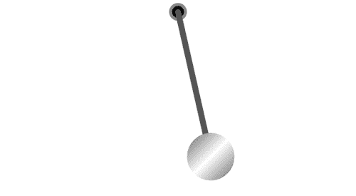
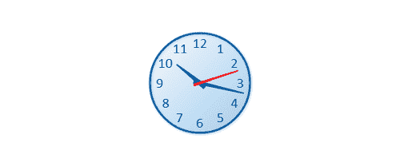
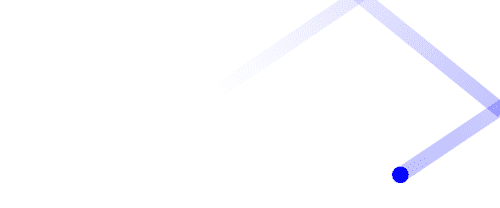

# 第五章。用动画让画布栩栩如生

在本章中，我们将介绍:

*   创建动画类
*   产生线性运动
*   产生加速度
*   产生振荡
*   振荡气泡
*   摆动钟摆
*   制作机械齿轮的动画
*   制作时钟动画
*   模拟粒子物理
*   创造微观生命形式
*   强调画布并显示 FPS

# 简介

在本书的前半部分，我们介绍了 HTML5 画布的基本功能，包括路径绘制、形状绘制、处理图像和视频以及转换。本章重点介绍动画，它不是 HTML5 画布 API 的一部分。虽然 API 没有为我们提供动画功能，但是我们当然可以创建一个可以用来支持动画项目的动画类。我们将涵盖基本的运动类型，包括线性运动、加速度和振荡，并将利用我们所学的知识创建一些非常棒的演示。我们开始吧！

# 创建动画类

由于 HTML5 画布 API 不提供动画方法，我们将不得不创建自己的动画类来处理动画阶段。这个食谱将涵盖动画的基础知识，并为我们所有未来的动画项目提供动画类。

## 做好准备...

由于浏览器和计算机硬件的创建并不相同，因此必须了解每个动画的最佳 **FPS(每秒帧数)**值会因浏览器、计算机硬件和动画算法而异。因此，对于开发人员来说，找出每个用户的最佳 FPS 值是非常困难的。幸运的是，浏览器现在正在实现一种 `window`对象的 `requestAnimationFrame`方法，可以自动确定动画的最佳 FPS(谢天谢地)。正如我们将在本章后面看到的，平滑动画的典型 FPS 值在每秒 40 到 60 帧之间。


看看前面的图表。要创建动画，我们首先需要初始化舞台上的对象。我们可以将画布称为“舞台”，因为画布中将要移动的对象可以被视为舞台上的“演员”。此外，舞台类比给我们提供了一种感觉，即素材正在画布上发生*，而不仅仅是坐在那里。一旦我们的对象被初始化，我们就可以开始一个动画循环，更新舞台，清除画布，重新绘制舞台，然后请求一个新的动画帧。*

 *由于这种行为可以定义任何类型的动画，所以我们创建一个动画类，在幕后为我们处理这些步骤是很有意义的。

## 怎么做...

按照以下步骤创建一个动画类，它将支持本章中的动画食谱:

1.  定义 `Animation`构造函数，创建跨浏览器 `requestAnimationFrame`方法:

    ```html
    var Animation = function(canvasId){
    this.canvas = document.getElementById(canvasId);
    this.context = this.canvas.getContext("2d");
    this.t = 0;
    this.timeInterval = 0;
    this.startTime = 0;
    this.lastTime = 0;
    this.frame = 0;
    this.animating = false;
    // provided by Paul Irish
    window.requestAnimFrame = (function(callback){
    return window.requestAnimationFrame ||
    window.webkitRequestAnimationFrame ||
    window.mozRequestAnimationFrame ||
    window.oRequestAnimationFrame ||
    window.msRequestAnimationFrame ||
    function(callback){
    window.setTimeout(callback, 1000 / 60);
    };
    })();
    };

    ```

2.  定义 `getContext()`方法:

    ```html
    Animation.prototype.getContext = function(){
    return this.context;
    };

    ```

3.  定义 `getCanvas()`方法:

    ```html
    Animation.prototype.getCanvas = function(){
    return this.canvas;
    };

    ```

4.  定义清除画布的 `clear()`方法:

    ```html
    Animation.prototype.clear = function(){
    this.context.clearRect(0, 0, this.canvas.width, this.canvas.height);
    };

    ```

5.  定义设置 `stage()`功能的 `setStage()`方法。该功能将对每个动画帧执行:

    ```html
    Animation.prototype.setStage = function(func){
    this.stage = func;
    };

    ```

6.  定义 `isAnimating()`方法:

    ```html
    Animation.prototype.isAnimating = function(){
    return this.animating;
    };

    ```

7.  定义返回帧数的 `getFrame()`方法:

    ```html
    Animation.prototype.getFrame = function(){
    return this.frame;
    };

    ```

8.  定义开始动画的 `start()`方法:

    ```html
    Animation.prototype.start = function(){
    this.animating = true;
    var date = new Date();
    this.startTime = date.getTime();
    this.lastTime = this.startTime;
    if (this.stage !== undefined) {
    this.stage();
    }
    this.animationLoop();
    };

    ```

9.  定义停止动画的 `stop()`方法:

    ```html
    Animation.prototype.stop = function(){
    this.animating = false;
    };

    ```

10.  定义 `getTimeInterval()`方法，以毫秒为单位返回最后一帧和当前帧之间的时间:

    ```html
    Animation.prototype.getTimeInterval = function(){
    return this.timeInterval;
    };

    ```

11.  定义返回动画运行时间的 `getTime()`方法:

    ```html
    Animation.prototype.getTime = function(){
    return this.t;
    };

    ```

12.  定义返回动画当前 FPS 的 `getFps()`方法:

    ```html
    Animation.prototype.getFps = function(){
    return this.timeInterval > 0 ? 1000 / this.timeInterval : 0;
    };

    ```

13.  定义处理动画循环的 `animationLoop()`方法:

    ```html
    Animation.prototype.animationLoop = function(){
    var that = this;
    this.frame++;
    var date = new Date();
    var thisTime = date.getTime();
    this.timeInterval = thisTime - this.lastTime;
    this.t += this.timeInterval;
    this.lastTime = thisTime;
    if (this.stage !== undefined) {
    this.stage();
    }
    if (this.animating) {
    requestAnimFrame(function(){
    that.animationLoop();
    });
    }
    };

    ```

### 它是如何工作的...

`Animation`类的思想是通过封装和隐藏动画所需的所有逻辑来简化我们的动画项目，例如提供帧之间的时间间隔、处理动画循环和清除画布。

`Animation`类的关键在 `Animation`构造函数内部，我们在这里设置 `window`对象的 `requestAnimFrame`方法。这个方法作为 `requestAnimationFrame`的跨浏览器实现，允许用户的浏览器决定动画的最佳 FPS。FPS 是完全动态的，并且会在整个动画中发生变化。

我们的 `Animation`类还提供了一些方便的方法，比如 `getTimeInterval()`返回自上一个动画帧以来的毫秒数， `getTime()`方法返回动画自启动以来运行的毫秒数， `start()`方法启动动画， `stop()`方法停止动画，以及 `clear()`方法清除画布。

既然我们已经为黄金时间准备好了一堂工作 `Animation`课，本章的其余动画，以及您未来的动画项目，都将是小菜一碟。

# 创建线性运动

在这个食谱中，我们将尝试我们的 `Animation`类，通过将一个框从画布的左边移动到画布的右边来创建一个简单的线性运动动画:


## 怎么做...

按照以下步骤将框从画布的一侧移动到另一侧:

1.  链接到 `Animation`类:

    ```html
    <head>
    <script src="animation.js">
    </script>

    ```

2.  实例化一个 `Animation`对象，获取画布上下文:

    ```html
    <script>
    window.onload = function(){
    var anim = new Animation("myCanvas");
    var canvas = anim.getCanvas();
    var context = anim.getContext();

    ```

3.  定义盒子的线速度并创建一个包含盒子位置和大小的 `box`对象:

    ```html
    var linearSpeed = 100; // pixels / second
    var box = {
    x: 0,
    y: canvas.height / 2 - 25,
    width: 100,
    height: 50
    };

    ```

4.  设置 `stage()`功能，更新方块位置，清除画布，绘制方块:

    ```html
    anim.setStage(function(){
    // update
    var linearDistEachFrame = linearSpeed * this.getTimeInterval() / 1000;
    if (box.x < canvas.width - box.width) {
    box.x += linearDistEachFrame;
    }
    else {
    anim.stop();
    }
    // clear
    this.clear();
    // draw
    context.beginPath();
    context.fillStyle = "blue";
    context.fillRect(box.x, box.y, box.width, box.height);
    });

    ```

5.  开始动画:

    ```html
    anim.start();
    };
    </script>
    </head>

    ```

6.  将画布嵌入到 HTML 文档的主体中:

    ```html
    <body>
    <canvas id="myCanvas" width="600" height="250" style="border:1px solid black;">
    </canvas>
    </body>

    ```

### 它是如何工作的...

要创建一个简单的线性运动，首先我们需要实例化一个新的 `Animation`对象，然后获取画布和上下文。接下来，我们可以定义盒子的速度，对于这个食谱，我们已经设置为 100 像素/秒，我们可以创建一个包含盒子位置和大小的 `box`对象。

现在我们的盒子已经初始化，我们可以定义 `stage()`函数，该函数将在动画循环中执行。对于每个动画循环，我们可以通过首先计算框在最后一帧和当前帧之间移动的距离来更新框的位置，然后通过添加框移动的距离来更新框的 x 位置。一旦盒子到达画布边缘，我们可以通过调用 `stop()`来停止动画。

最后，一旦定义了 `stage()`函数，我们就可以用 `start()`方法开始动画了。

### 另见...

*   *在[第二章](02.html "Chapter 2. Shape Drawing and Composites")中画一个长方形*

# 创造加速度

现在我们已经掌握了动画的基础知识，让我们尝试一些更复杂的东西，通过重力向下加速一个盒子。


## 怎么做...

按照以下步骤在画布顶部绘制一个由于重力而向下落下的方框:

1.  链接到 `Animation`类:

    ```html
    <head>
    <script src="animation.js">
    </script>

    ```

2.  实例化一个 `Animation`对象，获取画布上下文:

    ```html
    <script>
    window.onload = function(){
    var anim = new Animation("myCanvas");
    var canvas = anim.getCanvas();
    var context = anim.getContext();

    ```

3.  定义重力并创建一个 `box`对象，该对象包含盒子的位置、x 和 y 速度以及大小:

    ```html
    var gravity = 2; // pixels / second^2
    var box = {
    x: canvas.width / 2 - 50,
    y: 0,
    vx: 0,
    vy: 0,
    width: 100,
    height: 50
    };

    ```

4.  设置 `stage()`功能，更新方块，清除画布，绘制方块:

    ```html
    anim.setStage(function(){
    // update
    if (this.getTime() > 1000) {
    var speedIncrementEachFrame = gravity * anim.getTimeInterval() / 1000; // pixels / second
    box.vy += speedIncrementEachFrame;
    box.y += box.vy * this.getTimeInterval();
    if (box.y > canvas.height - box.height) {
    box.y = canvas.height - box.height;
    this.stop();
    }
    }
    // clear
    this.clear();
    // draw
    context.beginPath();
    context.fillStyle = "blue";
    context.fillRect(box.x, box.y, box.width, box.height);
    });

    ```

5.  开始动画:

    ```html
    anim.start();
    };
    </script>
    </head>

    ```

6.  将画布嵌入到 HTML 文档的主体中:

    ```html
    <body>
    <canvas id="myCanvas" width="600" height="250" style="border:1px solid black;">
    </canvas>
    </body>

    ```

### 它是如何工作的...

为了创建加速度，我们可以增加盒子的速度，用新的速度更新盒子的位置，清除画布，然后绘制盒子。

我们可以通过将重力引起的速度变化相加来计算每个帧的新 y 速度，该速度设置为 2 像素/ second^2:

```html
var speedIncrementEachFrame = gravity * anim.getTimeInterval() / 1000; // pixels / second
box.vy += speedIncrementEachFrame;

```

接下来，我们可以通过添加自上一帧以来盒子移动的距离来计算盒子的新 y 位置:

```html
box.y += box.vy * this.getTimeInterval();

```

换句话说，y 位置的变化等于盒子的速度乘以时间的变化(时间间隔)。

最后，我们可以添加一个条件，检查盒子是否已经到达画布的底部，如果已经到达，我们就可以用 `stop()`方法停止动画。

### 注

当对物体或粒子施加力时，加速度特别有用。作用力的一些例子包括重力、空气阻力、阻尼、地面摩擦力和电磁力。对于需要大量物理知识的密集动画，您可以考虑寻找一个开源矢量库来帮助处理 x 和 y 方向的速度和加速度。

### 另见...

*   *在[第二章](02.html "Chapter 2. Shape Drawing and Composites")中画一个长方形*

# 产生振荡

在这个食谱中，我们将探索运动的第三种主要类型——振荡。振荡的一些好例子是弹簧上的弹跳重物、振荡气泡或来回摆动的钟摆。


## 怎么做...

按照以下步骤来回摆动盒子:

1.  链接到 `Animation`类:

    ```html
    <head>
    <script src="animation.js">
    </script>

    ```

2.  实例化一个 `Animation`对象，获取画布上下文:

    ```html
    <script>
    window.onload = function(){
    var anim = new Animation("myCanvas");
    var canvas = anim.getCanvas();
    var context = anim.getContext();

    ```

3.  创建一个包含盒子位置和大小的 `box`对象:

    ```html
    var box = {
    x: 250,
    y: canvas.height / 2 - 25,
    width: 100,
    height: 50
    };

    ```

4.  定义谐波振荡方程所需的参数:

    ```html
    var centerX = canvas.width / 2 - box.width / 2;
    var amplitude = 150; // pixels
    var period = 2000; // ms

    ```

5.  设置 `stage()`功能，根据谐波振荡方程更新盒子的位置，清除画布，然后绘制盒子:

    ```html
    anim.setStage(function(){
    // update
    box.x = amplitude * Math.sin(anim.getTime() * 2 * Math.PI / period) + centerX;
    // clear
    this.clear();
    // draw
    context.beginPath();
    context.rect(box.x, box.y, box.width, box.height);
    context.fillStyle = "blue";
    context.fill();
    });

    ```

6.  开始动画:

    ```html
    anim.start();
    };
    </script>
    </head>

    ```

7.  将画布嵌入到 HTML 文档的主体中:

    ```html
    <body>
    <canvas id="myCanvas" width="600" height="250" style="border:1px solid black;">
    </canvas>
    </body>

    ```

### 它是如何工作的...

一旦页面加载，我们可以实例化一个新的 `Animation`对象，然后获得画布和上下文。

接下来，我们可以创建一个 `box`对象，它定义了盒子的位置和大小，然后定义了谐波振荡方程所需的变量:

```html
x(t) = A * sin (t * 2π / T + Φ) + x0

```

对于本食谱，我们将振幅 `A`设置为 `150`，将周期 `T`设置为 `2`秒，将偏移量 `x0`和相位差 `Φ`设置为 `0`。

对于每个动画帧，我们可以利用谐波振荡的方程来更新盒子的位置，清除画布，然后使用 `rect()`方法绘制盒子。

最后，我们可以使用 `start()`方法开始动画。

### 另见...

*   *在[第二章](02.html "Chapter 2. Shape Drawing and Composites")中画一个长方形*

# 振荡气泡

在这个食谱中，我们将使用谐波振荡和画布变换的原理来创建一个栩栩如生的振荡气泡。


## 怎么做...

按照以下步骤创建一个漂浮在空气中的栩栩如生的振荡气泡:

1.  链接到 `Animation`类:

    ```html
    <head>
    <script src="animation.js">
    </script>

    ```

2.  实例化一个 `Animation`对象，获取画布上下文:

    ```html
    <script>
    window.onload = function(){
    // instantiate new animation object
    var anim = new Animation("myCanvas");
    var context = anim.getContext();
    var canvas = anim.getCanvas();

    ```

3.  设置 `stage()`功能，更新气泡的宽度和高度比例，清除画布，缩放画布上下文，然后绘制气泡:

    ```html
    anim.setStage(function(){
    // update
    var widthScale = Math.sin(this.getTime() / 200) * 0.1 + 0.9;
    var heightScale = -1 * Math.sin(this.getTime() / 200) * 0.1 + 0.9;
    // clear
    this.clear();
    //draw
    context.beginPath();
    context.save();
    context.translate(canvas.width / 2, canvas.height / 2);
    context.scale(widthScale, heightScale);
    context.arc(0, 0, 65, 0, 2 * Math.PI, false);
    context.restore();
    context.fillStyle = "#8ED6FF";
    context.fill();
    context.lineWidth = 2;
    context.strokeStyle = "#555";
    context.stroke();
    context.beginPath();
    context.save();
    context.translate(canvas.width / 2, canvas.height / 2);
    context.scale(widthScale, heightScale);
    context.arc(-30, -30, 15, 0, 2 * Math.PI, false);
    context.restore();
    context.fillStyle = "white";
    context.fill();
    });

    ```

4.  开始动画:

    ```html
    anim.start();
    };
    </script>
    </head>

    ```

5.  将画布标签嵌入到 HTML 文档的主体中:

    ```html
    <body>
    <canvas id="myCanvas" width="600" height="250" style="border:1px solid black;">
    </canvas>
    </body>

    ```

### 它是如何工作的...

在我们讨论振荡气泡之前，先介绍一下如何使用画布变换在 x 和 y 方向拉伸气泡是个好主意。要绘制水平拉伸的气泡，我们可以将上下文平移到画布的中心，水平缩放上下文，然后绘制一个气泡。要绘制垂直拉伸的气泡，我们可以将其平移到画布的中心，垂直缩放上下文，然后绘制气泡。

为了振荡气泡，我们需要改变画布的缩放方向，使水平比例和垂直比例始终等于一个常数，在我们的例子中是 1.8，这样气泡的体积保持不变。一旦这种关系到位，我们可以使用谐波振荡方程来振荡气泡的 x 和 y 尺度。

当页面第一次加载时，我们可以实例化一个新的 `Animation`对象，并获得画布和上下文。接下来，我们可以设置 `stage()`功能，负责更新气泡，清除画布，然后为每个动画帧绘制气泡。为了更新每一帧的气泡，我们可以使用谐波振荡方程来计算气泡的水平和垂直尺度。接下来，我们可以清除画布，然后使用 `arc()`方法绘制气泡。

最后，一旦设置了 `stage()`功能，我们就可以用 `start()`方法开始动画了。

### 另见...

*   *在[第二章](02.html "Chapter 2. Shape Drawing and Composites")中画一个圆*
*   *缩放画布上下文[第 4 章](04.html "Chapter 4. Mastering Transformations")中的*
*   *在[第四章](04.html "Chapter 4. Mastering Transformations")中将圆形转化为椭圆形*

# 摆动钟摆

与宽度和高度随时间振荡的气泡配方不同，在本配方中，我们将创建一个摆，其*角度*随时间振荡。



## 怎么做...

按照以下步骤来回摆动钟摆:

1.  链接到 `Animation`类:

    ```html
    <head>
    <script src="animation.js">
    </script>

    ```

2.  实例化一个新的 `Animation`对象，获得画布上下文:

    ```html
    <script>
    window.onload = function(){
    var anim = new Animation("myCanvas");
    var canvas = anim.getCanvas();
    var context = anim.getContext();

    ```

3.  定义摆锤的属性:

    ```html
    var amplitude = Math.PI / 4; // 45 degrees
    var period = 4000; // ms
    var theta = 0;
    var pendulumLength = 250;
    var pendulumWidth = 10;
    var rotationPointX = canvas.width / 2;
    var rotationPointY = 20;

    ```

4.  设置 `stage()`功能，更新摆锤角度，清除画布，然后绘制摆锤:

    ```html
    anim.setStage(function(){
    // update
    theta = (amplitude * Math.sin((2 * Math.PI * this.getTime()) / period)) + Math.PI / 2;
    // clear
    this.clear();
    // draw top circle
    context.beginPath();
    context.arc(rotationPointX, rotationPointY, 15, 0, 2 * Math.PI, false);
    context.fillStyle = "#888";
    context.fill();
    // draw top inner circle
    context.beginPath();
    context.arc(rotationPointX, rotationPointY, 10, 0, 2 * Math.PI, false);
    context.fillStyle = "black";
    context.fill();
    // draw shaft
    context.beginPath();
    var endPointX = rotationPointX + (pendulumLength * Math.cos(theta));
    var endPointY = rotationPointY + (pendulumLength * Math.sin(theta));
    context.beginPath();
    context.moveTo(rotationPointX, rotationPointY);
    context.lineTo(endPointX, endPointY);
    context.lineWidth = pendulumWidth;
    context.lineCap = "round";
    context.strokeStyle = "#555";
    context.stroke();
    // draw bottom circle
    context.beginPath();
    context.arc(endPointX, endPointY, 40, 0, 2 * Math.PI, false);
    var grd = context.createLinearGradient(endPointX - 50, endPointY - 50, endPointX + 50, endPointY + 50);
    grd.addColorStop(0, "#444");
    grd.addColorStop(0.5, "white");
    grd.addColorStop(1, "#444");
    context.fillStyle = grd;
    context.fill();
    });

    ```

5.  开始动画:

    ```html
    anim.start();
    };
    </script>
    </head>

    ```

6.  将画布嵌入到 HTML 文档的主体中:

    ```html
    <body>
    <canvas id="myCanvas" width="600" height="330" style="border:1px solid black;">
    </canvas>
    </body>

    ```

### 它是如何工作的...

当页面加载时，我们可以实例化一个新的 `Animation`对象，然后获取画布和上下文。接下来，我们可以定义我们的摆的属性，包括角振幅、周期、初始角度θ、摆的长度、宽度和旋转中心。

一旦我们的摆锤已经初始化，我们可以设置 `stage()`功能，该功能将使用谐波振荡方程更新摆锤角度，清除画布，然后立即重新绘制摆锤。

我们可以通过在旋转点画几个圆来创建一个钟摆，从旋转点到钟摆的重量画一条粗线来形成轴，然后在线的末端画一个大圆，它有一个漂亮的对角灰色梯度来创建抛光表面的错觉。

一旦设置了 `stage()`功能，我们就可以用 `start()`方法开始动画了。

### 另见...

*   *在[第一章](01.html "Chapter 1. Getting Started with Paths and Text")中画线*
*   *在[第二章](02.html "Chapter 2. Shape Drawing and Composites")中画一个圆*
*   *使用自定义形状和填充样式[第 2 章](02.html "Chapter 2. Shape Drawing and Composites")中的*

# 为机械齿轮设置动画

对于机械师和工程师来说，这个是给你的。在这个食谱中，我们将创建一个相互连接的旋转齿轮系统。


## 怎么做...

按照以下步骤制作一个相互连接的齿轮系统的动画:

1.  链接到 `Animation`类:

    ```html
    <head>
    <script src="animation.js">
    </script>

    ```

2.  定义 `Gear`类的构造函数:

    ```html
    <script>
    Gear classfunction Gear(config){
    this.x = config.x;
    this.y = config.y;
    this.outerRadius = config.outerRadius;
    this.innerRadius = config.innerRadius;
    this.holeRadius = config.holeRadius;
    this.numTeeth = config.numTeeth;
    this.theta = config.theta;
    this.thetaSpeed = config.thetaSpeed;
    this.lightColor = config.lightColor;
    this.darkColor = config.darkColor;
    this.clockwise = config.clockwise;
    this.midRadius = config.outerRadius - 10;
    }

    ```

3.  定义绘制 `gear`对象的 `Gear`类的 `draw`方法:

    ```html
    Gear.prototype.draw = function(context){
    context.save();
    context.translate(this.x, this.y);
    context.rotate(this.theta);
    // draw gear teeth
    context.beginPath();
    // we can set the lineJoin property to bevel so that the tips
    // of the gear teeth are flat and don't come to a sharp point
    context.lineJoin = "bevel";
    // loop through the number of points to create the gear shape
    var numPoints = this.numTeeth * 2;
    for (var n = 0; n < numPoints; n++) {
    var radius = null;
    // draw tip of teeth on even iterations
    if (n % 2 == 0) {
    radius = this.outerRadius;
    }
    // draw teeth connection which lies somewhere between
    // the gear center and gear radius
    else {
    radius = this.innerRadius;
    }
    var theta = ((Math.PI * 2) / numPoints) * (n + 1);
    var x = (radius * Math.sin(theta));
    var y = (radius * Math.cos(theta));
    // if first iteration, use moveTo() to position
    // the drawing cursor
    if (n == 0) {
    context.moveTo(x, y);
    }
    // if any other iteration, use lineTo() to connect sub paths
    else {
    context.lineTo(x, y);
    }
    }
    context.closePath();
    // define the line width and stroke color
    context.lineWidth = 5;
    context.strokeStyle = this.darkColor;
    context.stroke();
    // draw gear body
    context.beginPath();
    context.arc(0, 0, this.midRadius, 0, 2 * Math.PI, false);
    // create a linear gradient
    var grd = context.createLinearGradient(-1 * this.outerRadius / 2, -1 * this.outerRadius / 2, this.outerRadius / 2, this.outerRadius / 2);
    grd.addColorStop(0, this.lightColor);
    grd.addColorStop(1, this.darkColor);
    context.fillStyle = grd;
    context.fill();
    context.lineWidth = 5;
    context.strokeStyle = this.darkColor;
    context.stroke();
    // draw gear hole
    context.beginPath();
    context.arc(0, 0, this.holeRadius, 0, 2 * Math.PI, false);
    context.fillStyle = "white";
    context.fill();
    context.strokeStyle = this.darkColor;
    context.stroke();
    context.restore();
    };

    ```

4.  实例化一个 `Animation`对象，获取画布上下文:

    ```html
    window.onload = function(){
    var anim = new Animation("myCanvas");
    var canvas = anim.getCanvas();
    var context = anim.getContext();

    ```

5.  构建一个 `gear`对象的数组:

    ```html
    var gears = [];
    // add blue gear
    gears.push(new Gear({
    x: 270,
    y: 105,
    outerRadius: 90,
    innerRadius: 50,
    holeRadius: 10,
    numTeeth: 24,
    theta: 0,
    thetaSpeed: 1 / 1000,
    lightColor: "#B1CCFF",
    darkColor: "#3959CC",
    clockwise: false
    }));
    // add red gear
    gears.push(new Gear({
    x: 372,
    y: 190,
    outerRadius: 50,
    innerRadius: 15,
    holeRadius: 10,
    numTeeth: 12,
    theta: 0.14,
    thetaSpeed: 2 / 1000,
    lightColor: "#FF9E9D",
    darkColor: "#AD0825",
    clockwise: true
    }));
    // add orange gear
    gears.push(new Gear({
    x: 422,
    y: 142,
    outerRadius: 28,
    innerRadius: 5,
    holeRadius: 7,
    numTeeth: 6,
    theta: 0.35,
    thetaSpeed: 4 / 1000,
    lightColor: "#FFDD87",
    darkColor: "#D25D00",
    clockwise: false
    }));

    ```

6.  设置 `stage()`功能，更新每个档位的旋转，清除画布，然后绘制档位:

    ```html
    anim.setStage(function(){
    // update
    for (var i = 0; i < gears.length; i++) {
    var gear = gears[i];
    var thetaIncrement = gear.thetaSpeed * this.getTimeInterval();
    gear.theta += gear.clockwise ? thetaIncrement : -1 * thetaIncrement;
    }
    // clear
    this.clear();
    // draw
    for (var i = 0; i < gears.length; i++) {
    gears[i].draw(context);
    }
    });

    ```

7.  开始动画:

    ```html
    anim.start();
    };
    </script>
    </head>

    ```

8.  将画布嵌入到 HTML 文档的主体中:

    ```html
    <body>
    <canvas id="myCanvas" width="600" height="250" style="border:1px solid black;">
    </canvas>
    </body>

    ```

### 它是如何工作的...

要创建一个旋转齿轮系统，我们可以重用第 2 章中的齿轮绘制程序，并创建一个 `Gear`类，该类具有一些附加属性，如齿数、颜色、θ和θ速度。 `theta`定义齿轮的角位置， `thetaSpeed`定义齿轮的角速度。我们还可以给 `Gear`类添加一个 `clockwise`属性，定义齿轮旋转的方向。

一旦页面加载，我们可以实例化一个新的 `Animation`对象，并获得画布和上下文。接下来，我们可以通过实例化 `Gear`对象并将它们推送到齿轮数组来初始化一些齿轮。现在我们的舞台已经初始化，我们可以设置 `stage()`功能，该功能将更新每个齿轮的角度，清除画布，然后使用 `Gear`类的 `draw()`方法绘制每个齿轮。

现在 `stage()`功能已经设置好了，我们可以用 `start()`方法开始动画了。

### 另见...

*   *在[第二章](02.html "Chapter 2. Shape Drawing and Composites")中画一个圆*
*   *用循环创建图案:在[第二章](02.html "Chapter 2. Shape Drawing and Composites")中绘制齿轮*

# 为时钟设置动画

对于那些在开发很酷的项目时陷入恍惚状态的人来说，时间似乎在融化，这一个是给你的。在这个食谱中，我们将创建一个漂亮的动画时钟来提醒我们网络空间之外的真实世界时间。



## 怎么做...

按照以下步骤制作时钟上的时针、分针和秒针的动画:

1.  链接到 `Animation`类:

    ```html
    <head>
    <script src="animation.js">
    </script>

    ```

2.  实例化一个 `Animation`对象，获取画布上下文，定义时钟半径:

    ```html
    <script>
    window.onload = function(){
    var anim = new Animation("myCanvas");
    var canvas = anim.getCanvas();
    var context = anim.getContext();
    var clockRadius = 75;

    ```

3.  设置 `stage()`功能，获取当前时间，计算时针、分针和秒针的角度，清除画布，然后绘制时钟:

    ```html
    anim.setStage(function(){
    // update
    var date = new Date();
    var hours = date.getHours();
    var minutes = date.getMinutes();
    var seconds = date.getSeconds();
    hours = hours > 12 ? hours - 12 : hours;
    var hour = hours + minutes / 60;
    var minute = minutes + seconds / 60;
    // clear
    this.clear();
    // draw
    var context = anim.getContext();
    context.save();
    context.translate(canvas.width / 2, canvas.height / 2);
    // draw clock body
    context.beginPath();
    context.arc(0, 0, clockRadius, 0, Math.PI * 2, true);
    var grd = context.createLinearGradient(-clockRadius, -clockRadius, clockRadius, clockRadius);
    grd.addColorStop(0, "#F8FCFF"); // light blue
    grd.addColorStop(1, "#A1CCEE"); // dark blue
    context.fillStyle = grd;
    context.fill();
    // draw numbers
    context.font = "16pt Calibri";
    context.fillStyle = "#024F8C";
    context.textAlign = "center";
    context.textBaseline = "middle";
    for (var n = 1; n <= 12; n++) {
    var theta = (n - 3) * (Math.PI * 2) / 12;
    var x = clockRadius * 0.8 * Math.cos(theta);
    var y = clockRadius * 0.8 * Math.sin(theta);
    context.fillText(n, x, y);
    }
    context.save();
    // apply drop shadow
    context.shadowColor = "#bbbbbb";
    context.shadowBlur = 5;
    context.shadowOffsetX = 1;
    context.shadowOffsetY = 1;
    // draw clock rim
    context.lineWidth = 3;
    context.strokeStyle = "#005EA8";
    context.stroke();
    context.restore();
    // draw hour hand
    context.save();
    var theta = (hour - 3) * 2 * Math.PI / 12;
    context.rotate(theta);
    context.beginPath();
    context.moveTo(-10, -4);
    context.lineTo(-10, 4);
    context.lineTo(clockRadius * 0.6, 1);
    context.lineTo(clockRadius * 0.6, -1);
    context.fill();
    context.restore();
    // minute hand
    context.save();
    var theta = (minute - 15) * 2 * Math.PI / 60;
    context.rotate(theta);
    context.beginPath();
    context.moveTo(-10, -3);
    context.lineTo(-10, 3);
    context.lineTo(clockRadius * 0.9, 1);
    context.lineTo(clockRadius * 0.9, -1);
    context.fill();
    context.restore();
    // second hand
    context.save();
    var theta = (seconds - 15) * 2 * Math.PI / 60;
    context.rotate(theta);
    context.beginPath();
    context.moveTo(-10, -2);
    context.lineTo(-10, 2);
    context.lineTo(clockRadius * 0.8, 1);
    context.lineTo(clockRadius * 0.8, -1);
    context.fillStyle = "red";
    context.fill();
    context.restore();
    context.restore();
    });

    ```

4.  开始动画:

    ```html
    anim.start();
    };
    </script>
    </head>

    ```

5.  将画布嵌入到 HTML 文档的主体中:

    ```html
    <body>
    <canvas id="myCanvas" width="600" height="250" style="border:1px solid black;">
    </canvas>
    </body>

    ```

### 它是如何工作的...

当页面加载时，我们可以实例化一个新的 `Animation`对象，然后获取画布和上下文。接下来，我们可以开始定义 `stage()`函数，负责更新时钟，清除画布，然后为每个动画循环绘制时钟。

在代码的更新部分，我们可以实例化一个新的 `Date()`对象，然后获得小时、分钟和秒。接下来，我们可以调整小时和分钟来表示 12 小时的时间(上午和下午)。

清理画布后，我们可以开始绘制时钟:

*   使用 `translate()`方法将画布上下文翻译到画布的中心
*   用 `arc()`方法画身体
*   使用 `fillText()`方法创建一个在边缘绘制时钟数字的循环
*   使用 `shadowOffsetX`和 `shadowOffsetY`属性应用阴影
*   用 `stroke()`划圈画出钟圈
*   通过旋转画布上下文绘制每个时钟指针，然后绘制一个最粗的一端位于中心的薄梯形。

最后，一旦设置了 `stage()`功能，我们就可以用 `start()`方法开始动画了。

### 另见...

*   *在[第 1 章](01.html "Chapter 1. Getting Started with Paths and Text")中处理文本*
*   *在[第二章](02.html "Chapter 2. Shape Drawing and Composites")中画一个圆*
*   *使用自定义形状和填充样式[第 2 章](02.html "Chapter 2. Shape Drawing and Composites")中的*

# 模拟粒子物理

既然我们已经涵盖了经典物理的基础知识，让我们把它们放在一起。在这个食谱中，我们将通过模拟重力、边界条件、碰撞阻尼和地板摩擦来模拟粒子物理。



## 怎么做...

按照以下步骤，在画布内发射一个粒子，观察它在墙壁上反弹时的抛射路径，由于重力逐渐下落到地板上，然后由于地板摩擦减速停止:

1.  链接到 `Animation`类:

    ```html
    <head>
    <script src="animation.js">
    </script>

    ```

2.  定义 `applyPhysics()`函数，该函数将粒子作为输入，并基于物理变量(如重力、碰撞阻尼和地板摩擦)更新其位置和速度:

    ```html
    function applyPhysics(anim, particle){
    // physics globals
    var gravity = 1500; // pixels / second^2
    var collisionDamper = 0.8; // 80% velocity lost when collision occurs
    var floorFriction = 100; // pixels / second^2
    var timeInterval = anim.getTimeInterval();
    var canvas = anim.getCanvas();
    // gravity
    particle.vy += gravity * timeInterval / 1000;
    // position
    particle.y += particle.vy * timeInterval / 1000;
    particle.x += particle.vx * timeInterval / 1000;
    // floor condition
    if (particle.y > (canvas.height - particle.radius)) {
    particle.y = canvas.height - particle.radius;
    particle.vy *= -1;
    particle.vy *= collisionDamper;
    }
    // floor friction
    if (particle.y == canvas.height - particle.radius) {
    if (particle.vx > 0.1) {
    particle.vx -= floorFriction * timeInterval / 1000;
    }
    else if (particle.vx < -0.1) {
    particle.vx += floorFriction * timeInterval / 1000;
    }
    else {
    particle.vx = 0;
    }
    }
    // ceiling condition
    if (particle.y < (particle.radius)) {
    particle.y = particle.radius;
    particle.vy *= -1;
    particle.vy *= collisionDamper;
    }
    // right wall condition
    if (particle.x > (canvas.width - particle.radius)) {
    particle.x = canvas.width - particle.radius;
    particle.vx *= -1;
    particle.vx *= collisionDamper;
    }
    // left wall condition
    if (particle.x < (particle.radius)) {
    particle.x = particle.radius;
    particle.vx *= -1;
    particle.vx *= collisionDamper;
    }
    }

    ```

3.  实例化一个新的 `Animation`对象，获取画布上下文:

    ```html
    window.onload = function(){
    var anim = new Animation("myCanvas");
    var canvas = anim.getCanvas();
    var context = anim.getContext();

    ```

4.  用位置、x 和 y 速度以及半径初始化 `particle`对象:

    ```html
    var particle = {
    x: 10,
    y: canvas.height - 10,
    vx: 600, // px / second
    vy: -900, // px / second
    radius: 10
    };

    ```

5.  设置 `stage()`功能，通过将粒子传递到 `applyPhysics()`功能来更新粒子，清除画布，然后绘制粒子:

    ```html
    anim.setStage(function(){
    // update
    applyPhysics(this, particle);
    // clear
    this.clear();
    // draw
    context.beginPath();
    context.arc(particle.x, particle.y, particle.radius, 0, 2 * Math.PI, false);
    context.fillStyle = "blue";
    context.fill();
    });

    ```

6.  开始动画:

    ```html
    anim.start();
    };
    </script>
    </head>

    ```

7.  将画布标签嵌入到 HTML 文档的主体中:

    ```html
    <body>
    <canvas id="myCanvas" width="600" height="250" style="border:1px solid black;">
    </canvas>
    </body>

    ```

### 它是如何工作的...

为了模拟粒子物理，我们需要为每一帧处理粒子的 x 和 y 位置以及粒子在 x 和 y 方向上的速度。理解粒子物理模拟的关键是要记住，系统中粒子的运动是基于作用在粒子上的所有力的总和。在我们的例子中，重力将向下拉动粒子，根据碰撞阻尼器常数，与墙壁、天花板和地板的碰撞将降低粒子的速度，地板摩擦将降低粒子在地板上滚动时的水平速度。

首先，当页面加载时，我们可以实例化一个新的 `Animation`对象，然后获取画布和上下文。接下来，我们可以用位置、初始速度和大小初始化一个粒子。现在我们已经初始化了舞台上的演员(粒子)，我们可以设置 `stage()`功能，该功能将更新粒子，清除画布，然后为每个动画帧绘制粒子。

更新逻辑发生在 `applyPhysics()`函数内部，该函数被传递一个对 `Animation`对象以及 `particle`对象的引用。 `applyPhysics()`功能遍历更新粒子位置和速度的条件列表。

调用 `applyPhysics()`函数并更新粒子后，我们可以清除画布，然后通过绘制一个半径等于粒子半径的简单圆来绘制粒子。

最后，一旦设置了 `stage()`功能，我们就可以用 `start()`方法开始动画了。

### 还有更多...

如果你真的想变得花哨，你甚至可以增加额外的力量，比如空气阻力。根据一般经验，粒子模拟中添加的力越多，它就越逼真。你可以在不同的初始位置和速度下玩来玩去，看看不同的投射路径。

### 另见...

*   *在[第二章](02.html "Chapter 2. Shape Drawing and Composites")中画一个圆*

# 创造微观生命形式

你有没有在显微镜下看到过微小的生命形式，并观察到它们是如何摆动的？这个食谱的灵感来自外星微生物世界。在这个食谱中，我们将创建 100 个随机的微生物，并让它们在画布中释放。


## 怎么做...

按照以下步骤创建在画布内移动的蠕动微生物:

1.  链接到 `Animation`类:

    ```html
    <head>
    <script src="animation.js">
    </script>

    ```

2.  定义返回随机颜色的 `getRandColor()`函数:

    ```html
    <script>
    function getRandColor(){
    var colors = ["red", "orange", "yellow", "green", "blue", "violet"];
    return colors[Math.floor(Math.random() * colors.length)];
    }

    ```

3.  定义返回随机θ的 `getRandTheta()`函数:

    ```html
    function getRandTheta(){
    return Math.random() * 2 * Math.PI;
    }

    ```

4.  定义 `updateMicrobes()`功能，通过给每个微生物添加一个随机生成角度的新头段，然后移除尾段来更新 `microbe`对象:

    ```html
    function updateMicrobes(anim, microbes){
    var canvas = anim.getCanvas();
    var angleVariance = 0.2;
    for (var i = 0; i < microbes.length; i++) {
    var microbe = microbes[i];
    var angles = microbe.angles;
    /*
    * good numNewSegmentsPerFrame values:
    * 60fps -> 1
    * 10fps -> 10
    *
    * for a linear relationship, we can use the equation:
    * n = mf + b, where n = numNewSegmentsPerFrame and f = FPS
    * solving for m and b, we have:
    * n = (-0.18)f + 11.8
    */
    var numNewSegmentsPerFrame = Math.round(-0.18 * anim.getFps() + 11.8);
    for (var n = 0; n < numNewSegmentsPerFrame; n++) {
    // create first angle if no angles
    if (angles.length == 0) {
    microbe.headX = canvas.width / 2;
    microbe.headY = canvas.height / 2;
    angles.push(getRandTheta());
    }
    var headX = microbe.headX;
    var headY = microbe.headY;
    var headAngle = angles[angles.length - 1];
    // create new head angle
    var dist = anim.getTimeInterval() / (10 * numNewSegmentsPerFrame);
    // increase new head angle by an amount equal to
    // -0.1 to 0.1
    var newHeadAngle = headAngle + ((angleVariance / 2) - Math.random() * angleVariance);
    var newHeadX = headX + dist * Math.cos(newHeadAngle);
    var newHeadY = headY + dist * Math.sin(newHeadAngle);
    // change direction if collision occurs
    if (newHeadX >= canvas.width || newHeadX <= 0 || newHeadY >= canvas.height || newHeadY <= 0) {
    newHeadAngle += Math.PI / 2;
    newHeadX = headX + dist * Math.cos(newHeadAngle);
    newHeadY = headY + dist * Math.sin(newHeadAngle);
    }
    microbe.headX = newHeadX;
    microbe.headY = newHeadY;
    angles.push(newHeadAngle);
    // remove tail angle
    if (angles.length > 20) {
    angles.shift();
    }
    }
    }
    }

    ```

5.  定义绘制所有微生物的 `drawMicrobes()`函数:

    ```html
    function drawMicrobes(anim, microbes){
    var segmentLength = 2; // px
    var context = anim.getContext();
    for (var i = 0; i < microbes.length; i++) {
    var microbe = microbes[i];
    var angles = microbe.angles;
    context.beginPath();
    context.moveTo(microbe.headX, microbe.headY);
    var x = microbe.headX;
    var y = microbe.headY;
    // start with the head and end with the tail
    for (var n = angles.length - 1; n >= 0; n--) {
    var angle = angles[n];
    x -= segmentLength * Math.cos(angle);
    y -= segmentLength * Math.sin(angle);
    context.lineTo(x, y);
    }
    context.lineWidth = 10;
    context.lineCap = "round";
    context.lineJoin = "round";
    context.strokeStyle = microbe.color;
    context.stroke();
    }
    }

    ```

6.  实例化一个 `Animation`对象，获取画布上下文:

    ```html
    window.onload = function(){
    var anim = new Animation("myCanvas");
    var canvas = anim.getCanvas();
    var context = anim.getContext();

    ```

7.  初始化 100 个微生物:

    ```html
    // init microbes
    var microbes = [];
    for (var n = 0; n < 100; n++) {
    // each microbe will be an array of angles
    microbes[n] = {
    headX: 0,
    headY: 0,
    angles: [],
    color: getRandColor()
    };
    }

    ```

8.  设置 `stage()`功能，通过调用 `updateMicrobes()`功能更新微生物，清除画布，然后通过调用 `drawMicrobes()`功能

    ```html
    anim.setStage(function(){
    // update
    updateMicrobes(this, microbes);
    // clear
    this.clear();
    // draw
    drawMicrobes(this, microbes);
    });

    ```

    绘制微生物
9.  开始动画:

    ```html
    anim.start();
    };
    </script>
    </head>

    ```

10.  将画布嵌入到 HTML 文档的主体中:

    ```html
    <body>
    <canvas id="myCanvas" width="600" height="250" style="border:1px solid black;">
    </canvas>
    </body>

    ```

### 它是如何工作的...

为了创建一个微生物，我们可以绘制一系列相连的片段来创建一个短的蛇形生物。我们可以将微生物表示为包含头部位置和角度阵列的对象。这些角度代表线段之间的角度。

这个配方初始化了 100 个随机微生物，并将它们放置在画布的中心。我们的 `stage()`功能包含 `updateMicrobes()`和 `drawMicrobes()`功能。

`updateMicrobes()`函数循环遍历所有微生物对象，为每个微生物添加一个新的头段，并移除尾段。这样，每种微生物的片段在画布上移动时都会摆动。当微生物的头部碰到画布边缘时，它的角度会增加 90 度，这样它就会弹回到画布区域。

`drawMicrobes()`功能循环遍历所有 `microbe`对象，将绘制光标定位在每个微生物的头部，然后根据每个线段的角度绘制 20 条线段。

### 另见...

*   *在[第一章](01.html "Chapter 1. Getting Started with Paths and Text")中画一个螺旋*
*   *在[第 6 章](06.html "Chapter 6. Interacting with the Canvas: Attaching Event Listeners to Shapes and Regions")中创建绘图应用*

# 拉紧画布并显示 FPS

看到最后一个食谱后，你可能会想“我们能激活的微生物数量有限制吗？”这个问题的直接答案是肯定的。由于 HTML5 画布的 2D 上下文不是硬件加速的，并且由于我们的动画完全由 JavaScript 驱动，如果浏览器超时工作，肯定会有一个点开始窒息。为了说明这一点，我们可以画出我们动画的 FPS，观察屏幕上的微生物数量和 FPS 值之间的关系。


## 怎么做...

按照以下步骤拉伸画布并显示 FPS:

1.  链接到 `Animation`类:

    ```html
    <head>
    <script src="animation.js">
    </script>

    ```

2.  定义在画布右上角绘制 FPS 值的 `drawFps()`函数:

    ```html
    function drawFps(anim, fps){
    var canvas = anim.getCanvas();
    var context = anim.getContext();
    context.fillStyle = "black";
    context.fillRect(canvas.width - 100, 0, 100, 30);
    context.font = "18pt Calibri";
    context.fillStyle = "white";
    context.fillText("fps: " + fps.toFixed(1), canvas.width - 93, 22);
    }

    ```

3.  定义返回随机颜色的 `getRandColor()`函数:

    ```html
    <script>
    function getRandColor(){
    var colors = ["red", "orange", "yellow", "green", "blue", "violet"];
    return colors[Math.floor(Math.random() * colors.length)];
    }

    ```

4.  定义返回随机θ的 `getRandTheta()`函数:

    ```html
    function getRandTheta(){
    return Math.random() * 2 * Math.PI;
    }

    ```

5.  定义 `updateMicrobes()`功能，通过给每个微生物添加一个随机生成角度的新头段，然后移除尾段来更新 `microbe`对象:

    ```html
    function updateMicrobes(anim, microbes){
    var canvas = anim.getCanvas();
    var angleVariance = 0.2;
    for (var i = 0; i < microbes.length; i++) {
    var microbe = microbes[i];
    var angles = microbe.angles;
    /*
    * good numNewSegmentsPerFrame values:
    * 60fps -> 1
    * 10fps -> 10
    *
    * for a linear relationship, we can use the equation:
    * n = mf + b, where n = numNewSegmentsPerFrame and f = FPS
    * solving for m and b, we have:
    * n = (-0.18)f + 11.8
    */
    var numNewSegmentsPerFrame = Math.round(-0.18 * anim.getFps() + 11.8);
    for (var n = 0; n < numNewSegmentsPerFrame; n++) {
    // create first angle if no angles
    if (angles.length == 0) {
    microbe.headX = canvas.width / 2;
    microbe.headY = canvas.height / 2;
    angles.push(getRandTheta());
    }
    var headX = microbe.headX;
    var headY = microbe.headY;
    var headAngle = angles[angles.length - 1];
    // create new head angle
    var dist = anim.getTimeInterval() / (10 * numNewSegmentsPerFrame);
    // increase new head angle by an amount equal to
    // -0.1 to 0.1
    var newHeadAngle = headAngle + ((angleVariance / 2) - Math.random() * angleVariance);
    var newHeadX = headX + dist * Math.cos(newHeadAngle);
    var newHeadY = headY + dist * Math.sin(newHeadAngle);
    // change direction if collision occurs
    if (newHeadX >= canvas.width || newHeadX <= 0 || newHeadY >= canvas.height || newHeadY <= 0) {
    newHeadAngle += Math.PI / 2;
    newHeadX = headX + dist * Math.cos(newHeadAngle);
    newHeadY = headY + dist * Math.sin(newHeadAngle);
    }
    microbe.headX = newHeadX;
    microbe.headY = newHeadY;
    angles.push(newHeadAngle);
    // remove tail angle
    if (angles.length > 20) {
    angles.shift();
    }
    }
    }
    }

    ```

6.  定义绘制所有微生物的 `drawMicrobes()`函数:

    ```html
    function drawMicrobes(anim, microbes){
    var segmentLength = 2; // px
    var context = anim.getContext();
    for (var i = 0; i < microbes.length; i++) {
    var microbe = microbes[i];
    var angles = microbe.angles;
    context.beginPath();
    context.moveTo(microbe.headX, microbe.headY);
    var x = microbe.headX;
    var y = microbe.headY;
    // start with the head and end with the tail
    for (var n = angles.length - 1; n >= 0; n--) {
    var angle = angles[n];
    x -= segmentLength * Math.cos(angle);
    y -= segmentLength * Math.sin(angle);
    context.lineTo(x, y);
    }
    context.lineWidth = 10;
    context.lineCap = "round";
    context.lineJoin = "round";
    context.strokeStyle = microbe.color;
    context.stroke();
    }
    }

    ```

7.  实例化一个 `Animation`对象，获取画布上下文:

    ```html
    window.onload = function(){
    var anim = new Animation("myCanvas");
    var canvas = anim.getCanvas();
    var context = anim.getContext();

    ```

8.  初始化 1500 个微生物:

    ```html
    // init microbes
    var microbes = [];
    for (var n = 0; n < 1500; n++) {
    // each microbe will be an array of angles
    microbes[n] = {
    headX: 0,
    headY: 0,
    angles: [],
    color: getRandColor()
    };
    }

    ```

9.  设置 `stage()`功能，更新微生物，每 10 帧更新一次 FPS 值，清空画布，然后绘制微生物和 FPS 值:

    ```html
    var fps = 0;
    anim.setStage(function(){
    // update
    updateMicrobes(this, microbes);
    if (anim.getFrame() % 10 == 0) {
    fps = anim.getFps();
    }
    // clear
    this.clear();
    // draw
    drawMicrobes(this, microbes);
    drawFps(this, fps);
    });

    ```

10.  开始动画:

    ```html
    anim.start();
    };
    </script>
    </head>

    ```

11.  将画布嵌入到 HTML 文档的主体中:

    ```html
    <body>
    <canvas id="myCanvas" width="600" height="250" style="border:1px solid black;">
    </canvas>
    </body>

    ```

### 它是如何工作的...

为了绘制动画的 FPS，我们可以创建 `drawFps()`函数，该函数接受一个 FPS 值作为输入，在画布的右上角绘制一个黑框，然后写出 FPS 值。为了避免 FPS 更新过于频繁，我们可以在变量 `FPS`中存储 FPS 值的副本，每 10 帧更新一次。这样，FPS 最多每秒更新 6 次。

为了强调画布，我们可以简单地初始化更多的微生物。在这个食谱中，我们已经初始化了 1500 个微生物。如果你自己尝试代码，你可以玩不同的数字，看看 FPS 是如何受到影响的。

### 还有更多...

如前所述，典型的动画应该以大约 40 到 60 FPS 的速度运行。如果 FPS 下降到 30 以下，您将开始注意到动画中的轻微延迟。在谷歌 Chrome 中，在一台搭载 2.2 GHz AMD 处理器和 2gb RAM 的 32 位 Windows 7 机器上进行测试时(是的，我知道，我需要升级)，我在为 1500 个微生物制作动画时看到了大约 5 FPS。看起来不坏，但也不太好。当制作 2000 个或更多微生物的动画时，动画开始看起来不可接受地起伏不定。

我们在 2D 环境下创建的几乎所有动画在台式机和笔记本电脑上都表现出色。但是，如果您发现自己的动画计算量很大，在 2D 环境中表现不佳，您可以考虑使用网络 GL(我们将在[第 9 章](09.html "Chapter 9. Introducing WebGL")、*网络 GL 简介*中介绍网络 GL)。与 2D 上下文不同，WebGL 利用硬件加速。在撰写本文时，所有主要浏览器中的 2D 上下文都没有使用硬件加速。然而，使用 WebGL 确实是有代价的，因为开发和维护 WebGL 动画比创建 2D 上下文动画要困难得多。

### 另见...

*   *在[第 1 章](01.html "Chapter 1. Getting Started with Paths and Text")中处理文本*
*   *在[第一章](01.html "Chapter 1. Getting Started with Paths and Text")中画一个螺旋*
*   *在[第 6 章](06.html "Chapter 6. Interacting with the Canvas: Attaching Event Listeners to Shapes and Regions")中创建绘图应用**