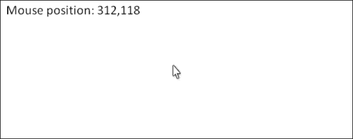
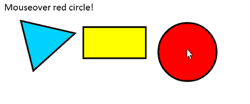
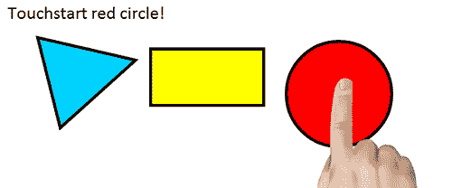
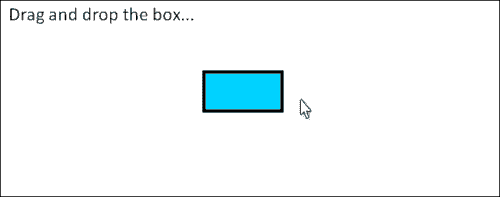
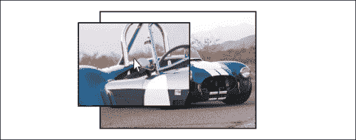
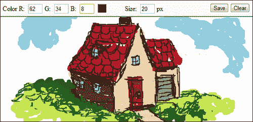

# 第六章。与画布交互:将事件侦听器附加到形状和区域

在本章中，我们将介绍:

*   创建事件类
*   使用画布鼠标坐标
*   将鼠标事件侦听器附加到区域
*   将触摸事件监听器附加到移动设备上的区域
*   将事件侦听器附加到图像
*   拖放形状
*   拖放图像
*   创建图像放大镜
*   创建绘图应用程序

# 简介

到目前为止，我们已经学会了如何在画布上绘画、处理图像和视频，以及创建流畅的动画。本章重点介绍画布的交互性。直到现在，我们所有的画布项目都非常没有反应，脱离了用户。尽管 HTML5 画布 API 没有为我们提供将事件侦听器附加到形状和区域的方法，但我们肯定可以通过扩展 API 来实现这一功能。根据 HTML5 规范，一旦绘制了一个形状，我们就不能像访问 HTML 文档中的 DOM 元素一样将它作为一个对象来访问。在 HTML5 画布规范包括将事件侦听器附加到形状和区域的方法之前(希望有一天会是这样)，我们需要构建自己的事件类，这将使我们能够这样做。我们的类将使我们能够将事件侦听器附加到包装一个或多个形状的区域，类似于将事件侦听器附加到 DOM 元素。

这是一个非常强大的概念，因为它使我们能够在画布上绘制用户可以与之交互的形状。我们的事件类将支持**鼠标向下、鼠标向上、鼠标悬停、鼠标移出、鼠标移动、触摸开始、触摸结束**和**触摸移动**事件。

### 类型

虽然本章中的大多数食谱都利用了鼠标事件，但是也可以通过将 `mousedown`替换为 `touchstart, mouseup`替换为 `touchend`，将 `mousemove`替换为 `touchmove`来修改它们以支持移动触摸事件。

我们开始吧！

# 创建事件类

类似于[第 5 章](05.html "Chapter 5. Bringing the Canvas to Life with Animation")、*用动画将画布带入生活*，在这里我们创建了一个自定义类来处理动画，在本章中我们将创建一个自定义类来处理画布事件。

因为画布形状不能作为对象访问(糟糕！)，对于我们来说，没有什么可以像下面的 div 元素那样附加事件侦听器:

```html
document.getElementById("foo").addEventListener("mouseup", function() {
// do stuff
}, false);

```

那么我们能做些什么呢？如果我们遵循画布 API 的模式，其中一个形状的开始用 `beginPath()`定义，形状的结束用 `closePath()`定义，我们可以通过引入区域的概念将这个想法进一步扩展，区域封装了多个形状。此外，如果我们能够像在 DOM 元素中添加事件监听器一样，在一个区域中添加事件监听器，那就太好了，如下所示:

```html
this.addRegionEventListener("mouseup", function() {
// do stuff
});

```

Events 类的目标就是通过扩展 canvas API 来支持 canvas 事件，方法是引入可附加桌面事件监听器(如 `mousedown, mouseup, mouseover, mouseout`、 `mousemove`)以及移动事件监听器(如 `touchstart, touchend`、 `touchmove`)的区域。

### 类型

你可以考虑在[www.html5canvastutorials.com/cookbook](http://www.html5canvastutorials.com/cookbook)从这本书的在线资源中下载课程，而不是手工输入事件课程。

## 怎么做...

按照以下步骤创建一个事件类，它将使我们能够将事件侦听器附加到画布上的形状和区域:

1.  定义 `Events`构造函数:

    ```html
    var Events = function(canvasId){
    this.canvas = document.getElementById(canvasId);
    this.context = this.canvas.getContext("2d");
    this.stage = undefined;
    this.listening = false;
    // desktop flags
    this.mousePos = null;
    this.mouseDown = false;
    this.mouseUp = false;
    this.mouseOver = false;
    this.mouseMove = false;
    // mobile flags
    this.touchPos = null;
    this.touchStart = false;
    this.touchMove = false;
    this.touchEnd = false;
    // Region Events
    this.currentRegion = null;
    this.regionIndex = 0;
    this.lastRegionIndex = -1;
    this.mouseOverRegionIndex = -1;
    };

    ```

2.  定义返回画布上下文的 `getContext()`方法:

    ```html
    Events.prototype.getContext = function(){
    return this.context;
    };

    ```

3.  定义返回画布 DOM 元素的 `getCanvas()`方法:

    ```html
    Events.prototype.getCanvas = function(){
    return this.canvas;
    };

    ```

4.  定义清除画布的 `clear()`方法:

    ```html
    Events.prototype.clear = function(){
    this.context.clearRect(0, 0, this.canvas.width, this.canvas.height);
    };

    ```

5.  定义返回画布位置的 `getCanvasPos()`方法:

    ```html
    Events.prototype.getCanvasPos = function(){
    var obj = this.getCanvas();
    var top = 0;
    var left = 0;
    while (obj.tagName != "BODY") {
    top += obj.offsetTop;
    left += obj.offsetLeft;
    obj = obj.offsetParent;
    }
    return {
    top: top,
    left: left
    };
    };

    ```

6.  定义设置 `stage()`功能的 `setStage()`方法:T2】
7.  定义 `reset()`方法，设置鼠标位置和触摸位置，重置区域索引，调用 `stage()`功能，然后重置事件标志:

    ```html
    Events.prototype.reset = function(evt){
    if (!evt) {
    evt = window.event;
    }
    this.setMousePosition(evt);
    this.setTouchPosition(evt);
    this.regionIndex = 0;
    if (this.stage !== undefined) {
    this.stage();
    }
    // desktop flags
    this.mouseOver = false;
    this.mouseMove = false;
    this.mouseDown = false;
    this.mouseUp = false;
    // mobile touch flags
    this.touchStart = false;
    this.touchMove = false;
    this.touchEnd = false;
    };

    ```

8.  定义将事件监听器添加到画布元素的 `listen()`方法:

    ```html
    Events.prototype.listen = function(){
    var that = this;
    if (this.stage !== undefined) {
    this.stage();
    }
    // desktop events
    this.canvas.addEventListener("mousedown", function(evt){
    that.mouseDown = true;
    that.reset(evt);
    }, false);
    this.canvas.addEventListener("mousemove", function(evt){
    that.reset(evt);
    }, false);
    this.canvas.addEventListener("mouseup", function(evt){
    that.mouseUp = true;
    that.reset(evt);
    }, false);
    this.canvas.addEventListener("mouseover", function(evt){
    that.reset(evt);
    }, false);
    this.canvas.addEventListener("mouseout", function(evt){
    that.mousePos = null;
    }, false);
    // mobile events
    this.canvas.addEventListener("touchstart", function(evt){
    evt.preventDefault();
    that.touchStart = true;
    that.reset(evt);
    }, false);
    this.canvas.addEventListener("touchmove", function(evt){
    evt.preventDefault();
    that.reset(evt);
    }, false);
    this.canvas.addEventListener("touchend", function(evt){
    evt.preventDefault();
    that.touchEnd = true;
    that.reset(evt);
    }, false);
    };

    ```

9.  定义返回桌面应用程序鼠标位置的 `getMousePos()`方法:

    ```html
    Events.prototype.getMousePos = function(evt){
    return this.mousePos;
    };

    ```

10.  定义返回移动应用触摸位置的 `getTouchPos()`方法:

    ```html
    Events.prototype.getTouchPos = function(evt){
    return this.touchPos;
    };

    ```

11.  定义设置鼠标位置的 `setMousePos()`方法:

    ```html
    Events.prototype.setMousePosition = function(evt){
    var mouseX = evt.clientX - this.getCanvasPos().left + window.pageXOffset;
    var mouseY = evt.clientY - this.getCanvasPos().top + window.pageYOffset;
    this.mousePos = {
    x: mouseX,
    y: mouseY
    };
    };

    ```

12.  定义设置触摸位置的 `setTouchPos()`方法:

    ```html
    Events.prototype.setTouchPosition = function(evt){
    if (evt.touches !== undefined && evt.touches.length == 1) { // Only deal with one finger
    var touch = evt.touches[0]; // Get the information for finger #1
    var touchX = touch.pageX - this.getCanvasPos().left + window.pageXOffset;
    var touchY = touch.pageY - this.getCanvasPos().top + window.pageYOffset;
    this.touchPos = {
    x: touchX,
    y: touchY
    };
    }
    };

    ```

13.  定义用于定义新区域的 `beginRegion()`方法:

    ```html
    Events.prototype.beginRegion = function(){
    this.currentRegion = {};
    this.regionIndex++;
    };

    ```

14.  定义用于向区域添加事件监听器的 `addRegionEventListener()`方法:

    ```html
    Events.prototype.addRegionEventListener = function(type, func){
    var event = (type.indexOf('touch') == -1) ? 'on' + type : type;
    this.currentRegion[event] = func;
    };

    ```

15.  定义 `closeRegion()`方法，该方法用于关闭一个区域并确定当前区域是否发生了事件:

    ```html
    Events.prototype.closeRegion = function(){
    var pos = this.touchPos || this.mousePos;
    if (pos !== null && this.context.isPointInPath(pos.x, pos.y)) {
    if (this.lastRegionIndex != this.regionIndex) {
    this.lastRegionIndex = this.regionIndex;
    }
    // handle onmousedown
    if (this.mouseDown && this.currentRegion.onmousedown !== undefined) {
    this.currentRegion.onmousedown();
    this.mouseDown = false;
    }
    // handle onmouseup
    else if (this.mouseUp && this.currentRegion.onmouseup !== undefined) {
    this.currentRegion.onmouseup();
    this.mouseUp = false;
    }
    // handle onmouseover
    else if (!this.mouseOver && this.regionIndex != this.mouseOverRegionIndex && this.currentRegion.onmouseover !== undefined) {
    this.currentRegion.onmouseover();
    this.mouseOver = true;
    this.mouseOverRegionIndex = this.regionIndex;
    }
    // handle onmousemove
    else if (!this.mouseMove && this.currentRegion.onmousemove !== undefined) {
    this.currentRegion.onmousemove();
    this.mouseMove = true;
    }
    // handle touchstart
    if (this.touchStart && this.currentRegion.touchstart !== undefined) {
    this.currentRegion.touchstart();
    this.touchStart = false;
    }
    // handle touchend
    if (this.touchEnd && this.currentRegion.touchend !== undefined) {
    this.currentRegion.touchend();
    this.touchEnd = false;
    }
    // handle touchmove
    if (!this.touchMove && this.currentRegion.touchmove !== undefined) {
    this.currentRegion.touchmove();
    this.touchMove = true;
    }
    }
    else if (this.regionIndex == this.lastRegionIndex) {
    this.lastRegionIndex = -1;
    this.mouseOverRegionIndex = -1;
    // handle mouseout condition
    if (this.currentRegion.onmouseout !== undefined) {
    this.currentRegion.onmouseout();
    }
    }
    };

    ```

### 它是如何工作的...

尽管 HTML5 canvas API 没有为我们提供一种轻松处理事件侦听器的方法，但它确实提供了一个关键方法，使之成为可能:

```html
context.isPointInPath(x,y);

```

如果给定坐标位于画布上绘制的任何*路径内，则 `isPointInPath()`方法返回真。由于画布是位图，因此图层和形状的概念在这里没有任何意义，因此我们必须找到一种方法来利用 `isPointInPath()`方法来确定给定的坐标，尤其是鼠标坐标，是否位于画布的特定区域内。一旦我们可以检测到鼠标光标是否在特定区域的顶部，我们就可以添加额外的逻辑来处理 `mouseover, mousemove, mouseout, mousedown, mouseup, touchstart, touchend`和 `touchmove`事件。*

在深入讨论之前，让我们举一个例子，制定一个模拟区域事件的过程，然后用我们所学的知识来安排创建 `Events`类所需的方法。假设我们想在画布上画一个三角形、一个矩形和一个圆，然后当用户将光标放在圆上时，我们想提醒一些文本。我们可以先画三角形，然后使用 `isPointInPath()`查看鼠标坐标是否位于当前路径内。如果方法返回 false，我们知道鼠标光标在三角形之外的某个地方。接下来，我们可以绘制矩形，并再次检查鼠标坐标是否位于任何路径中，此时包括三角形和矩形。如果 `isPointInPath()`仍然返回 false，我们现在知道鼠标光标在三角形和矩形之外的某个地方。最后，我们可以画圆，并再次检查鼠标坐标是否位于画布上的任何路径内，现在包括三角形、矩形和圆形。如果方法返回 true，则鼠标确实在圆上。如果返回 false，则鼠标光标位于三角形、矩形和圆形之外的某个位置。

当然，只有当我们假设在元素实际绘制之前光标已经位于画布上的某个位置时，这种方法才有效。在光标移动后，我们检测鼠标光标是否在元素顶部的唯一方法是每次触发事件时重新绘制我们的元素，然后在绘制每个元素后检查鼠标坐标是否存在于形状中。我们可以通过用 `Events`类的 `setStage()`方法定义 `stage()`函数来实现这一点。

接下来，我们需要一种方法来定义一个区域的开始和结束。我们可以创建一个 `beginRegion()`方法来定义一个新的 `Region`对象。 `Region`对象可以有八个属性: `mouseover, mouseout, mousemove, mousedown, mouseup, touchstart, touchend`和 `touchmove`，都是用户自定义的功能。接下来，我们可以创建一个名为 `addRegionEventListener()`的方法，该方法可用于附加需要事件类型的区域事件以及事件发生时要调用的函数。既然我们有一个开始新区域的方法，我们也需要创建一个 `closeRegion()`方法。该方法包含确定八个事件中是否有一个发生所需的大部分逻辑。最后，我们可以创建一个 `listen()`方法，将事件监听器添加到画布元素中，以便适当地处理区域事件。

本食谱中描述的 Events 类通过 `beginRegion()`和 `closeRegion()`方法定义区域，然后在每次触发事件时重新绘制区域，以检测事件属于哪个区域。这种方法的优点是易于实现，并且我们只需要一个画布元素。

尽管这种方法对于画布应用程序非常有效，因为画布应用程序有合理数量的带有事件侦听器的区域，但对于使用大量区域的应用程序来说，这可能不是最好的方法。需要数千个区域(每个区域都有自己的事件侦听器)的应用程序可能会遇到性能问题，因为每次鼠标移动时都会重绘大量形状。

对于这样的应用程序，可以使用更复杂的方法，为每个区域分配自己的画布，然后将画布堆叠在彼此之上，这样就不必在每次触发事件时重新绘制区域。这种方法的一个很好的例子是 KineticJS 库([http://www.kineticjs.com](http://www.kineticjs.com))。

# 使用画布鼠标坐标

为了让我们的脚被 `Events`类弄湿，我们将通过使用 `Events`类中的 `getMousePos()`方法获取光标的鼠标坐标，然后将其显示在画布的左上角来保持简单。 `getMousePos()`方法返回鼠标相对于画布的坐标，该坐标考虑了画布相对于页面的偏移位置，以及页面的滚动位置。



## 怎么做...

按照以下步骤获取画布鼠标坐标，并在每次鼠标光标移动时将其显示在画布的左上角:

1.  链接到 `Events`类:

    ```html
    <script src="events.js">
    </script>

    ```

2.  定义写消息的 `writeMessage()`功能:

    ```html
    <script>
    function writeMessage(context, message){
    context.font = "18pt Calibri";
    context.fillStyle = "black";
    context.fillText(message, 10, 25);
    }

    ```

3.  实例化一个新的 `Events`对象，获取画布和上下文:

    ```html
    window.onload = function(){
    var events = new Events("myCanvas");
    var canvas = events.getCanvas();
    var context = events.getContext();

    ```

4.  当用户将鼠标移出画布时，清除画布，然后写出消息“鼠标滑过我！”:

    ```html
    canvas.addEventListener("mouseout", function(){
    events.clear();
    writeMessage(context, "Mouseover me!");
    }, false);

    ```

5.  当用户在画布中移动鼠标时，清除画布，然后写出鼠标位置:

    ```html
    canvas.addEventListener("mousemove", function(){
    var mousePos = events.getMousePos();
    events.clear();
    if (mousePos !== null) {
    message = "Mouse position: " + mousePos.x + "," + mousePos.y;
    writeMessage(context, message);
    }
    }, false);

    ```

6.  开始收听事件:

    ```html
    // if we don't set the stage function,
    // we'll have to manually start listening for events
    events.listen();

    ```

7.  在用户开始之前写下初始消息:

    ```html
    writeMessage(context, "Mouseover me!");
    };
    </script>

    ```

8.  将画布嵌入到 HTML 文档的主体中:

    ```html
    <canvas id="myCanvas" width="600" height="250" style="border:1px solid black;">
    </canvas>

    ```

### 它是如何工作的...

一旦页面加载，我们可以实例化一个 `Events`对象，这样我们就可以访问 `getMousePos()`方法。接下来，我们可以将 `mouseout`事件监听器附加到 `canvas`对象，该对象将事件显示设置为“鼠标悬停在我身上！”，还将一个 `mousemove`事件监听器附加到 `canvas`对象，该对象使用 `getMousePos()`方法获取鼠标位置，然后写出坐标。最后，我们可以使用 `listen()`方法开始监听事件。

# 将鼠标事件侦听器附加到区域

在本食谱中，我们将通过定义区域并向它们添加事件侦听器来触及 `Events`类的核心。我们会画一个三角形，附加一个 `mouseout`和 `mousemove`事件监听器到上面，我们会画一个没有事件监听器的矩形，最后我们会画一个圆并附加一个 `mouseover, mouseout, mousedown`，和 `mouseup`事件监听器来尝试 `Events`类支持的每个不同的桌面事件监听器。



## 怎么做...

按照以下步骤绘制三角形、矩形和圆形，然后将鼠标事件监听器附加到每个形状:

1.  链接到 `Events`类:

    ```html
    <script src="events.js">
    </script>

    ```

2.  定义写消息的 `writeMessage()`功能:

    ```html
    <script>
    function writeMessage(context, message){
    context.font = "18pt Calibri";
    context.fillStyle = "black";
    context.fillText(message, 10, 25);
    }

    ```

3.  实例化一个新的 `Events`对象，获取画布和上下文:

    ```html
    window.onload = function(){
    var events = new Events("myCanvas");
    var canvas = events.getCanvas();
    var context = events.getContext();
    var message = "";

    ```

4.  开始定义 `stage()`功能，从清除画布开始:

    ```html
    events.setStage(function(){
    this.clear();

    ```

5.  以 `beginRegion()`开始一个新区域，然后画一个蓝色三角形:

    ```html
    // draw blue triangle
    this.beginRegion();
    context.beginPath();
    context.lineWidth = 4;
    context.strokeStyle = "black";
    context.fillStyle = "#00D2FF";
    context.moveTo(50, 50);
    context.lineTo(180, 80);
    context.lineTo(80, 170);
    context.closePath();
    context.fill();
    context.stroke();

    ```

6.  将 `mousemove`和 `mouseout`事件监听器添加到三角形中，并用 `closeRegion():`

    ```html
    this.addRegionEventListener("mousemove", function(){
    var mousePos = events.getMousePos();
    var mouseX = mousePos.x - 50;
    var mouseY = mousePos.y - 50;
    message = "Triangle mouse Position: " + mouseX + "," + mouseY;
    });
    this.addRegionEventListener("mouseout", function(){
    message = "Mouseout blue triangle!";
    });
    this.closeRegion();

    ```

    关闭该区域
7.  画一个没有事件监听器的黄色矩形:

    ```html
    // draw yellow rectangle
    // this is an example of a shape
    // with no event listeners
    context.beginPath();
    context.lineWidth = 4;
    context.strokeStyle = "black";
    context.fillStyle = "yellow";
    context.rect(200, 65, 150, 75);
    context.fill();
    context.stroke();

    ```

8.  开始一个新的区域，画一个红圈:

    ```html
    // draw red circle
    this.beginRegion();
    context.beginPath();
    context.arc(450, canvas.height / 2, 70, 0, Math.PI * 2, true);
    context.fillStyle = "red";
    context.fill();
    context.stroke();

    ```

9.  将 `mousedown, mouseup, mouseover`和 `mouseout`事件监听器附加到圆圈，并关闭区域:

    ```html
    this.addRegionEventListener("mousedown", function(){
    message = "Mousedown red circle!";
    });
    this.addRegionEventListener("mouseup", function(){
    message = "Mouseup red circle!";
    });
    this.addRegionEventListener("mouseover", function(){
    message = "Mouseover red circle!";
    });
    this.addRegionEventListener("mouseout", function(){
    message = "Mouseout red circle!";
    });
    this.closeRegion();

    ```

10.  写一条信息:

    ```html
    writeMessage(context, message);
    });
    // since we set the draw stage function, the listen()
    // method is automatically called for us
    };
    </script>

    ```

11.  将画布嵌入到 HTML 文档的主体中:

    ```html
    <canvas id="myCanvas" width="600" height="250" style="border:1px solid black;">
    </canvas>

    ```

### 它是如何工作的...

要将事件附加到这个配方中的三个形状，我们首先需要初始化一个 `Events`对象，然后设置 `stage()`功能。在 `stage()`功能中，我们可以使用 `beginRegion()`定义一个新的区域，绘制蓝色三角形，使用 `addRegionEventListener()`附加事件，然后使用 `closeRegion()`关闭该区域。接下来，我们可以在不定义区域的情况下绘制黄色矩形，因为我们没有向它附加任何事件。最后我们可以定义第二个区域，画红圈，附加事件监听器，然后关闭该区域，完成 `stage()`功能定义。

### 另见...

*   *在[第二章](02.html "Chapter 2. Shape Drawing and Composites")中画一个长方形*
*   *在[第二章](02.html "Chapter 2. Shape Drawing and Composites")中画一个圆*
*   *使用自定义形状和填充样式[第 2 章](02.html "Chapter 2. Shape Drawing and Composites")中的*
*   *将触摸事件监听器附加到移动设备上的区域*

# 将触摸事件监听器附加到移动设备上的区域

对于那些哭诉“移动设备怎么办？台式机和笔记本电脑已经成为过去！”—这个食谱是专门为你准备的。随着互联网冲浪者从他们巨大的受束缚的桌面迁移出来，并开始从移动设备上消费互联网内容，越来越明显的是，包括画布在内的网络的未来将主要存在于移动领域。

与在台式机和笔记本电脑上运行的网络应用程序不同，在台式机和笔记本电脑上运行的网络应用程序使用来自 `mousedown, mouseup, mouseover, mouseout`和 `mousemove`事件的鼠标检测用户交互，而在移动设备上运行的网络应用程序使用来自 `touchstart, touchend`和 `touchmove`事件的触摸事件进行交互。

在这个食谱中，我们将通过在三角形和圆形中添加触摸事件监听器来创建上一个食谱的移动版本。

如前所述，本章中的任何方法都可以通过添加触摸事件监听器来支持移动设备。



## 怎么做...

按照以下步骤绘制三角形、矩形和圆形，然后将移动触摸事件附加到每个形状:

1.  在标题标签内添加视口元标签，设置移动设备宽度，设置初始比例，禁用用户比例:

    ```html
    <meta name="viewport" content="width=device-width, initial-scale=0.552, user-scalable=no"/>

    ```

2.  链接到 `Events`类:

    ```html
    <script src="events.js">
    </script>

    ```

3.  定义写消息的 `writeMessage()`功能:

    ```html
    <script>
    function writeMessage(context, message){
    context.font = "18pt Calibri";
    context.fillStyle = "black";
    context.fillText(message, 10, 25);
    }

    ```

4.  实例化一个新的 `Events`对象，获取画布和上下文:

    ```html
    window.onload = function(){
    var events = new Events("myCanvas");
    var canvas = events.getCanvas();
    var context = events.getContext();
    var message = "";

    ```

5.  开始定义 `sStage()`功能，从清除画布开始:

    ```html
    events.setStage(function(){
    this.clear();

    ```

6.  以 `beginRegion()`开始一个新区域，然后画一个蓝色三角形:

    ```html
    // draw blue triangle
    this.beginRegion();
    context.beginPath();
    context.lineWidth = 4;
    context.strokeStyle = "black";
    context.fillStyle = "#00D2FF";
    context.moveTo(50, 50);
    context.lineTo(180, 80);
    context.lineTo(80, 170);
    context.closePath();
    context.fill();
    context.stroke();

    ```

7.  将 `touchmove`事件监听器添加到三角形中，并用 `closeRegion():`

    ```html
    this.addRegionEventListener("touchmove", function(){
    var touchPos = events.getTouchPos();
    if (touchPos !== null) {
    var touchX = touchPos.x - 20;
    var touchY = touchPos.y - 50;
    message = "Triangle touch position: " + touchX + "," + touchY;
    }
    });
    this.closeRegion();

    ```

    关闭该区域
8.  画一个没有事件监听器的黄色矩形:

    ```html
    // draw yellow rectangle
    // this is an example of a shape
    // with no event listeners
    context.beginPath();
    context.lineWidth = 4;
    context.strokeStyle = "black";
    context.fillStyle = "yellow";
    context.rect(200, 65, 150, 75);
    context.fill();
    context.stroke();

    ```

9.  开始一个新的区域，画一个红圈:

    ```html
    // draw red circle
    this.beginRegion();
    context.beginPath();
    context.arc(450, canvas.height / 2, 70, 0, Math.PI * 2, true);
    context.fillStyle = "red";
    context.fill();
    context.stroke();

    ```

10.  将 `touchstart`和 `touchend`事件监听器附加到圆圈中，并关闭区域:

    ```html
    this.addRegionEventListener("touchstart", function(){
    message = "Touchstart red circle!";
    });
    this.addRegionEventListener("touchend", function(){
    message = "Touchend red circle!";
    });
    this.closeRegion();

    ```

11.  写一条信息:

    ```html
    writeMessage(context, message);
    });
    // since we set the draw stage function, the listen()
    // method is automatically called for us
    };
    </script>

    ```

12.  将画布嵌入到 HTML 文档的主体中:

    ```html
    <canvas id="myCanvas" width="600" height="250" style="border:1px solid black;">
    </canvas>

    ```

### 它是如何工作的...

与上一个方法类似，在这个方法中，我们将事件监听器附加到三角形和圆形，除了这次我们将附加触摸事件监听器，以便演示可以在移动设备上运行。

移动设备上的触摸事件实际上非常简单，其工作方式与桌面事件非常相似。 `mousedown`的移动等价物是 `touchstart`， `mouseup`的等价物是 `touchend`，而 `mousemove`的等价物是 `touchmove`。由于移动设备无法检测到您的手指是否悬停在某个区域上，因此移动设备没有对应的 `mouseover`或 `mouseout`功能，因此，如果在未来某个时候移动设备*能够*检测到手指靠近屏幕但没有完全触摸到屏幕，我不会感到惊讶。

要显示蓝色三角形的触摸坐标，我们可以使用 `touchmove`事件监听器，要检测红色圆圈何时被触摸或释放，我们可以使用 `touchstart`和 `touchend`事件。

### 另见...

*   *在[第二章](02.html "Chapter 2. Shape Drawing and Composites")中画一个长方形*
*   *在[第二章](02.html "Chapter 2. Shape Drawing and Composites")中画一个圆*
*   *使用自定义形状和填充样式[第 2 章](02.html "Chapter 2. Shape Drawing and Composites")中的*
*   *将鼠标事件监听器附加到区域*

# 将事件侦听器附加到图像

在这个食谱中，我们将把事件监听器附加到图像上。由于我们只能用我们的 `Events`类将事件侦听器附加到路径上，并且由于画布上绘制的图像不被归类为路径，我们可以创建一个覆盖图像的矩形区域，以便将事件侦听器附加到矩形区域，从而将事件侦听器附加到图像上。


## 怎么做...

按照以下步骤绘制两个不同的图像，然后将 `mouseover, mouseout, mousedown`和 `mouseup`事件监听器附加到它们上面:

1.  链接到 `Events`类:

    ```html
    <script src="events.js">
    </script>

    ```

2.  定义 `writeMessage()`函数，该函数写出一条消息:

    ```html
    <script>
    function writeMessage(context, message){
    context.font = "18pt Calibri";
    context.fillStyle = "black";
    context.fillText(message, 10, 25);
    }

    ```

3.  创建一个加载一组图像的图像加载器，然后在加载完所有图像后调用 `callback`函数:

    ```html
    /*
    * loads the images and then calls the callback function
    * with a hash of image objects when the images have loaded
    */
    function loadImages(sources, callback){
    var loadedImages = 0;
    var numImages = 0;
    var images = {};
    // get num of sources
    for (var src in sources) {
    numImages++;
    }
    // load images
    for (var src in sources) {
    images[src] = new Image();
    images[src].onload = function(){
    // call callback function() when images
    // have loaded
    if (++loadedImages >= numImages) {
    callback(images);
    }
    };
    images[src].src = sources[src];
    }
    }

    ```

4.  定义 `drawImages()`函数，该函数实例化一个新的 `Events`对象，并开始定义 `stage()`函数:

    ```html
    function drawImages(images){
    drawStage() functionvar events = new Events("myCanvas");
    var canvas = events.getCanvas();
    var context = events.getContext();
    var message = "";
    events.setStage(function(){
    this.clear();

    ```

5.  开始新区域，绘制左侧图像，定义表示图像路径的矩形区域，将事件侦听器附加到矩形区域，然后关闭该区域。对正确的图像也重复这些步骤，然后写出一条信息:

    ```html
    this.beginRegion();
    context.drawImage(images.challengerImg, 50, 70, 240, 143);
    // draw rectangular region for image
    context.beginPath();
    context.rect(50, 70, 240, 143);
    context.closePath();
    this.addRegionEventListener("mouseover", function(){
    message = "Dodge Challenger mouseover!";
    });
    this.addRegionEventListener("mouseout", function(){
    message = "Dodge Challenger mouseout!";
    });
    this.addRegionEventListener("mousedown", function(){
    message = "Dodge Challenger mousedown!";
    });
    this.addRegionEventListener("mouseup", function(){
    message = "Dodge Challenger mouseup!";
    });
    this.closeRegion();
    this.beginRegion();
    context.drawImage(images.cobraImg, 350, 50, 200, 150);
    // draw rectangular region for image
    context.beginPath();
    context.rect(350, 50, 200, 150);
    context.closePath();
    this.addRegionEventListener("mouseover", function(){
    message = "AC Cobra mouseover!";
    });
    this.addRegionEventListener("mouseout", function(){
    message = "AC Cobra mouseout!";
    });
    this.addRegionEventListener("mousedown", function(){
    message = "AC Cobra mousedown!";
    });
    this.addRegionEventListener("mouseup", function(){
    message = "AC Cobra mouseup!";
    });
    this.closeRegion();
    writeMessage(context, message);
    });
    }

    ```

6.  当页面加载时，创建一个图像源的散列，然后将其传递给 `loadImages()`函数:

    ```html
    window.onload = function(){
    var sources = {
    challengerImg: "challenger.jpg",
    cobraImg: "cobra.jpg"
    };
    loadImages(sources, drawImages);
    };
    </script>

    ```

7.  将画布嵌入到 HTML 文档的主体中:

    ```html
    <canvas id="myCanvas" width="600" height="250" style="border:1px solid black;">
    </canvas>

    ```

### 它是如何工作的...

一旦页面加载，我们可以使用一个图像加载器函数来加载两个图像。当两个图像都加载后，调用 `drawImages()`函数并实例化一个 `Events`对象。在 `stage()`功能中，我们可以用 `beginRegion()`开始一个新的区域，绘制第一个图像，绘制一个矩形路径来定义图像路径，使用 `addRegionEventListener()`附加事件，然后关闭该区域。接下来，我们可以重复这个过程，用它自己的一组事件侦听器创建第二个图像。

### 另见...

*   *在[第三章](03.html "Chapter 3. Working with Images and Videos")中绘制图像*

# 拖放形状

在这个食谱中，我们将解决事件监听器的圣杯——拖放。如果没有 `Events`类或其他一些轻量级的 JavaScript 库，拖放操作的开发会非常麻烦。我们可以使用 `Events`类将 `mouseover, mousedown, mousemove, mouseup`和 `mouseout`事件侦听器附加到矩形中，以处理拖放操作的不同阶段。



## 怎么做...

按照以下步骤拖放矩形:

1.  链接到 `Events`类:

    ```html
    <script src="events.js">
    </script>

    ```

2.  定义写消息的 `writeMessage()`功能:

    ```html
    <script>
    function writeMessage(context, message){
    context.font = "18pt Calibri";
    context.fillStyle = "black";
    context.fillText(message, 10, 25);
    }

    ```

3.  页面加载时，实例化一个新的 `Events`对象，定义将要拖放的矩形的起始位置，并定义 `draggingRect, draggingRectOffsetX`，拖放操作的【T2:

    ```html
    window.onload = function(){
    events = new Events("myCanvas");
    var canvas = events.getCanvas();
    var context = events.getContext();
    var rectX = canvas.width / 2 - 50;
    var rectY = canvas.height / 2 - 25;
    var draggingRect = false;
    var draggingRectOffsetX = 0;
    var draggingRectOffsetY = 0;

    ```

4.  对于 `stage()`功能，如果 `draggingRect`布尔值为真:

    ```html
    events.setStage(function(){
    // get the mouse position
    var mousePos = this.getMousePos();
    if (draggingRect) {
    rectX = mousePos.x - draggingRectOffsetX;
    rectY = mousePos.y - draggingRectOffsetY;
    }

    ```

    ，首先根据鼠标的坐标设置矩形的坐标
5.  清除画布，写出消息，开始一个新区域，绘制矩形，附加事件，然后关闭区域:

    ```html
    // clear the canvas
    this.clear();
    writeMessage(context, "Drag and drop the box...");
    this.beginRegion();
    // draw the box
    context.beginPath();
    context.rect(rectX, rectY, 100, 50);
    context.lineWidth = 4;
    context.strokeStyle = "black";
    context.fillStyle = "#00D2FF";
    context.fill();
    context.stroke();
    context.closePath();
    // attach event listeners
    this.addRegionEventListener("mousedown", function(){
    draggingRect = true;
    var mousePos = events.getMousePos();
    draggingRectOffsetX = mousePos.x - rectX;
    draggingRectOffsetY = mousePos.y - rectY;
    });
    this.addRegionEventListener("mouseup", function(){
    draggingRect = false;
    });
    this.addRegionEventListener("mouseover", function(){
    document.body.style.cursor = "pointer";
    });
    this.addRegionEventListener("mouseout", function(){
    document.body.style.cursor = "default";
    });
    this.closeRegion();
    });
    };
    </script>

    ```

6.  将画布嵌入到 HTML 文档的主体中:

    ```html
    <canvas id="myCanvas" width="600" height="250" style="border:1px solid black;">
    </canvas>

    ```

### 它是如何工作的...

拖放分三个阶段处理:

1.  检测开始操作的形状上的 `mousedown`事件
2.  使用 `mousemove`事件监听器根据鼠标坐标定位形状
3.  释放鼠标按钮时放下形状(鼠标向上)

在 `stage()`功能中，如果 `draggingRect`布尔为真，我们可以设置矩形相对于鼠标位置的位置。然后我们可以用 `beginRegion()`开始一个新的区域，画出矩形，然后用 `addRegionEventListener()`方法附加事件监听器。我们可以添加一个 `mousedown`事件监听器，将 `draggingRect`布尔值设置为真，然后计算 `draggingRectOffsetX`和 `draggingRectOffsetY`变量，这两个变量说明了鼠标和矩形左上角之间的位置偏移。接下来，我们可以添加一个 `mouseup`事件监听器，将 `draggingRect`布尔值设置为 false，完成拖放操作。我们还可以附加一个 `mouseover`事件监听器，将光标变成手形，表示元素可以交互，我们还可以附加一个 `mouseout`事件监听器，将光标图像还原回默认指针，表示鼠标光标不再在元素上。

### 另见...

*   *拖放图像*

# 拖放图像

这个食谱基本上结合了前两个食谱中的概念来演示我们如何拖放图像。

## 怎么做...

按照以下步骤拖放图像:

1.  链接到 `Events`类:

    ```html
    <script src="events.js">
    </script>

    ```

2.  定义写消息的 `writeMessage()`功能:

    ```html
    <script>
    function writeMessage(context, message){
    context.font = "18pt Calibri";
    context.fillStyle = "black";
    context.fillText(message, 10, 25);
    }

    ```

3.  定义 `drawImage()`函数，首先实例化一个新的 `Event s`对象，并设置覆盖图像的矩形区域的初始位置:

    ```html
    function drawImage(challengerImg){
    var events = new Events("myCanvas");
    var canvas = events.getCanvas();
    var context = events.getContext();
    var rectX = canvas.width / 2 - challengerImg.width / 2;
    var rectY = canvas.height / 2 - challengerImg.height / 2;
    var draggingRect = false;
    var draggingRectOffsetX = 0;
    var draggingRectOffsetY = 0;

    ```

4.  定义 `stage()`功能，如果 `draggingRect`布尔值为真:

    ```html
    events.setStage(function(){
    var mousePos = this.getMousePos();
    if (draggingRect) {
    rectX = mousePos.x - draggingRectOffsetX;
    rectY = mousePos.y - draggingRectOffsetY;
    }

    ```

    ，则首先根据鼠标坐标设置图像的位置
5.  清空画布，写下一条信息:

    ```html
    // clear the canvas
    this.clear();
    writeMessage(context, "Drag and drop the car...");

    ```

6.  开始一个新区域，绘制图像，绘制一个矩形区域来定义图像路径，附加事件监听器，关闭区域:

    ```html
    this.beginRegion();
    context.drawImage(challengerImg, rectX, rectY, challengerImg.width, challengerImg.height);
    // draw rectangular region for image
    context.beginPath();
    context.rect(rectX, rectY, challengerImg.width, challengerImg.height);
    context.closePath();
    this.addRegionEventListener("mousedown", function(){
    draggingRect = true;
    var mousePos = events.getMousePos();
    draggingRectOffsetX = mousePos.x - rectX;
    draggingRectOffsetY = mousePos.y - rectY;
    });
    this.addRegionEventListener("mouseup", function(){
    draggingRect = false;
    });
    this.addRegionEventListener("mouseover", function(){
    document.body.style.cursor = "pointer";
    });
    this.addRegionEventListener("mouseout", function(){
    document.body.style.cursor = "default";
    });
    this.closeRegion();
    });
    }

    ```

7.  页面加载时，加载图片后调用 `drawImage()`函数:

    ```html
    window.onload = function(){
    // load image
    challengerImg = new Image();
    challengerImg.onload = function(){
    drawImage(this);
    };
    challengerImg.src = "challenger.jpg";
    };
    </script>

    ```

8.  将画布嵌入到 HTML 文档的主体中:

    ```html
    <canvas id="myCanvas" width="600" height="250" style="border:1px solid black;">
    </canvas>

    ```

### 它是如何工作的...

要拖放图像，我们可以在图像顶部绘制一个不可见的矩形路径，为图像提供一个路径，我们可以附加类似于上一个食谱的 `mousedown, mouseup`、 `mousemove`事件来处理拖放的三个阶段。

当用户拖放图像时，他/她实际上是在拖放图像及其对应的矩形路径。

### 另见...

*   *在[第三章](03.html "Chapter 3. Working with Images and Videos")中绘制图像*
*   *拖放形状*

# 创建图像放大镜

在这个食谱中，我们将创建一个真正整洁的图像放大镜，根据小图像的鼠标坐标裁剪出大图像的一部分，然后在小图像上显示结果。



## 怎么做...

按照以下步骤创建一个图像放大镜，当用户将鼠标放在图像上时，它会渲染图像的放大部分:

1.  链接到 `Events`类:

    ```html
    <script src="events.js">
    </script>

    ```

2.  创建一个加载大小图像的图像加载器，然后在加载图像后调用回调函数:

    ```html
    <script>
    /*
    * loads the images and then calls the callback function
    * with a hash of image objects when the images have loaded
    */
    function loadImages(sources, callback){
    var loadedImages = 0;
    var numImages = 0;
    var images = {};
    // get num of sources
    for (var src in sources) {
    numImages++;
    }
    // load images
    for (var src in sources) {
    images[src] = new Image();
    images[src].onload = function(){
    // call callback function when images
    // have loaded
    if (++loadedImages >= numImages) {
    callback(images);
    }
    };
    images[src].src = sources[src];
    }
    }

    ```

3.  定义绘制放大图像的 `drawMagnifier()`功能:

    ```html
    function drawMagnifier(config){
    var context = config.context;
    var images = config.images;
    var mousePos = config.mousePos;
    var imageX = config.imageX;
    var imageY = config.imageY;
    var magWidth = config.magWidth;
    var magHeight = config.magHeight;
    var smallWidth = config.smallWidth;
    var smallHeight = config.smallHeight;
    var largeWidth = config.largeWidth;
    var largeHeight = config.largeHeight;
    /*
    * sourceX and sourceY assume that the rectangle we are
    * cropping out of the large image exists within the large
    * image. We'll have to make some adjustments for the
    * cases where the magnifier goes past the edges of the * large image
    */
    var sourceX = ((mousePos.x - imageX) * largeWidth / smallWidth) - magWidth / 2;
    var sourceY = ((mousePos.y - imageY) * largeHeight / smallHeight) - magHeight / 2;
    var destX = mousePos.x - magWidth / 2;
    var destY = mousePos.y - magHeight / 2;
    var viewWidth = magWidth;
    var viewHeight = magHeight;
    var viewX = destX;
    var viewY = destY;
    var drawMagImage = true;
    // boundary checks and adjustments for cases
    // where the magnifyer goes past the edges of the large image
    if (sourceX < 0) {
    if (sourceX > -1 * magWidth) {
    var diffX = -1 * sourceX;
    viewX += diffX;
    viewWidth -= diffX;
    sourceX = 0;
    }
    else {
    drawMagImage = false;
    }
    }
    if (sourceX > largeWidth - magWidth) {
    if (sourceX < largeWidth) {
    viewWidth = largeWidth - sourceX;
    }
    else {
    drawMagImage = false;
    }
    }
    if (sourceY < 0) {
    if (sourceY > -1 * magHeight) {
    var diffY = -1 * sourceY;
    viewY += diffY;
    viewHeight -= diffY;
    sourceY = 0;
    }
    else {
    drawMagImage = false;
    }
    }
    if (sourceY > largeHeight - magHeight) {
    if (sourceY < largeHeight) {
    viewHeight = largeHeight - sourceY;
    }
    else {
    drawMagImage = false;
    }
    }
    // draw white magnifier background
    context.beginPath();
    context.fillStyle = "white";
    context.fillRect(destX, destY, magWidth, magHeight);
    // draw image
    if (drawMagImage) {
    context.beginPath();
    context.drawImage(images.cobraLargeImg, sourceX, sourceY, viewWidth, viewHeight, viewX, viewY, viewWidth, viewHeight);
    }
    // draw magnifier border
    context.beginPath();
    context.lineWidth = 2;
    context.strokeStyle = "black";
    context.strokeRect(destX, destY, magWidth, magHeight);
    }

    ```

4.  定义 `drawImages()`函数，该函数从实例化一个新的 `Events`对象开始，并定义放大镜属性:

    ```html
    function drawImages(images){
    var events = new Events("myCanvas");
    var canvas = events.getCanvas();
    var context = events.getContext();
    // define magnifier dependencies
    var imageX = canvas.width / 2 - images.cobraSmallImg.width / 2;
    var imageY = canvas.height / 2 - images.cobraSmallImg.height / 2;
    var magWidth = 200;
    var magHeight = 150;
    var smallWidth = images.cobraSmallImg.width;
    var smallHeight = images.cobraSmallImg.height;
    var largeWidth = images.cobraLargeImg.width;
    var largeHeight = images.cobraLargeImg.height;

    ```

5.  设置 `stage()`功能绘制小图，然后调用 `drawMagnifier()`绘制放大图:

    ```html
    events.setStage(function(){
    var mousePos = events.getMousePos();
    this.clear();
    context.drawImage(images.cobraSmallImg, imageX, imageY, smallWidth, smallHeight);
    // draw border around image
    context.beginPath();
    context.lineWidth = 2;
    context.strokeStyle = "black";
    context.strokeRect(imageX, imageY, smallWidth, smallHeight);
    context.closePath();
    if (mousePos !== null) {
    drawMagnifier({
    context: context,
    images: images,
    mousePos: mousePos,
    imageX: imageX,
    imageY: imageY,
    magWidth: magWidth,
    magHeight: magHeight,
    smallWidth: smallWidth,
    smallHeight: smallHeight,
    largeWidth: largeWidth,
    largeHeight: largeHeight
    });
    }
    });

    ```

6.  向画布元素添加一个事件监听器，如果用户将鼠标移出画布以移除放大的图像，该事件监听器将重新绘制舞台:

    ```html
    canvas.addEventListener("mouseout", function(){
    events.stage();
    }, false);
    }

    ```

7.  当页面加载时，构建一个图像源的散列，并将其传递给图像加载器函数:

    ```html
    window.onload = function(){
    var sources = {
    cobraSmallImg: "cobra_280x210.jpg",
    cobraLargeImg: "cobra_800x600.jpg"
    };
    loadImages(sources, drawImages);
    };
    </script>

    ```

8.  将画布嵌入到 HTML 文档的主体中。

    ```html
    <canvas id="myCanvas" width="600" height="250" style="border:1px solid black;">
    </canvas>

    ```

### 它是如何工作的...

为了创建一个图像放大镜，我们需要两个图像，一个小的和一个大的。小图像将是在画布上始终可见的图像，大图像将用作绘制放大镜的缓冲图像。一旦页面被加载，并且两个图像都被加载，我们可以实例化一个 `Events`对象并开始定义 `stage()`函数。

画出以画布为中心的小图像后，我们可以通过计算 `drawImage()`方法的 `sourceX, sourceY, destX`、 `destY`参数来画出放大图像，该方法将裁剪出大图像的放大部分，然后将结果显示在小图像的顶部。

要得到 `sourceX`和 `sourceY`，我们可以通过取鼠标位置和小图像左上角位置的差，得到相对于小图像的鼠标坐标，然后将结果乘以放大倍数(即大图像宽度除以小宽度)，再减去放大窗口的一半大小，就可以得到大图像对应的坐标:

```html
var sourceX = ((mousePos.x - imageX) * largeWidth / smallWidth) - magWidth / 2;
var sourceY = ((mousePos.y - imageY) * largeHeight / smallHeight) - magHeight / 2;

```

要将放大的图像放在鼠标光标的中心，我们可以将 `destX`设置为鼠标的 x 位置偏移放大镜宽度的一半，将 `destY`设置为鼠标的 y 位置偏移放大镜高度的一半:

```html
var destX = mousePos.x - magWidth / 2;
var destY = mousePos.y - magHeight / 2;

```

### 另见...

*   *在[第三章](03.html "Chapter 3. Working with Images and Videos")中绘制图像*
*   *在[第三章](03.html "Chapter 3. Working with Images and Videos")中裁剪图像*

# 创建绘图应用程序

在这个食谱中，我们将创建一个漂亮的绘图应用程序，这样用户就可以在浏览器中直接绘制图片。



## 怎么做...

按照以下步骤创建一个简单的绘图应用程序:

1.  工具栏、输入和按钮的样式:

    ```html
    <style>
    canvas {
    border: 1px solid black;
    font-family: "Helvetica Neue", "Arial", "Lucida Grande", "Lucida Sans Unicode", "Microsoft YaHei", sans-serif;
    font-size: 13px;
    line-height: 1.5;
    color: #474747;
    }
    #toolbar {
    width: 590px;
    border: 1px solid black;
    border-bottom: 0px;
    padding: 5px;
    background-color: #f8f8f8;
    }
    input[type = ‘text’] {
    width: 30px;
    margin: 0px 5px 0px 5px;
    }
    label {
    margin-left: 40px;
    }
    label:first-of-type {
    margin-left: 0px;
    }
    input[type = ‘button’] {
    float: right;
    }
    #colorSquare {
    position: relative;
    display: inline-block;
    width: 20px;
    height: 20px;
    background-color: blue;
    top: 4px;
    }
    </style>

    ```

2.  链接到 `Events`类:

    ```html
    <script src="events.js">
    </script>

    ```

3.  定义 `addPoint()`函数，该函数将一个点添加到点数组中:

    ```html
    <script>
    function addPoint(events, points){
    var context = events.getContext();
    var drawingPos = events.getMousePos();
    if (drawingPos !== null) {
    points.push(drawingPos);
    }
    }

    ```

4.  定义 `drawPath()`函数，该函数清除画布，在路径开始之前重新绘制画布绘图，然后使用点数组中的点绘制绘图路径:

    ```html
    function drawPath(canvas, points, canvasImg){
    var context = canvas.getContext("2d");
    // clear canvas
    context.clearRect(0, 0, canvas.width, canvas.height);
    // redraw canvas before path
    context.drawImage(canvasImg, 0, 0, canvas.width, canvas.height);
    // draw patch
    context.beginPath();
    context.lineTo(points[0].x, points[0].y);
    for (var n = 1; n < points.length; n++) {
    var point = points[n];
    context.lineTo(point.x, point.y);
    }
    context.stroke();
    }

    ```

5.  定义更新工具栏颜色方块颜色的 `updateColorSquare()`功能:

    ```html
    function updateColorSquare(){
    var red = document.getElementById("red").value;
    var green = document.getElementById("green").value;
    var blue = document.getElementById("blue").value;
    var colorSquare = document.getElementById("colorSquare");
    colorSquare.style.backgroundColor = "rgb(" + red + "," + green + "," + blue + ")";
    }

    ```

6.  定义 `getCanvasImg()`方法，返回画布绘图的图像对象:

    ```html
    function getCanvasImg(canvas){
    var img = new Image();
    img.src = canvas.toDataURL();
    return img;
    }

    ```

7.  页面加载时，实例化一个新的 `Events`对象，定义 `isMouseDown`标志，获取画布图像，初始化绘图颜色和大小:

    ```html
    window.onload = function(){
    var events = new Events("myCanvas");
    var canvas = events.getCanvas();
    var context = events.getContext();
    var isMouseDown = false;
    var canvasImg = getCanvasImg(canvas);
    var points = [];
    // initialize drawing params
    var red = document.getElementById("red").value;
    var green = document.getElementById("green").value;
    var blue = document.getElementById("blue").value;
    var size = document.getElementById("size").value;

    ```

8.  每当输入新的颜色输入时，更新颜色方块:

    ```html
    // attach listeners
    document.getElementById("red").addEventListener("keyup", function(evt){
    updateColorSquare();
    }, false);
    document.getElementById("green").addEventListener("keyup", function(evt){
    updateColorSquare();
    }, false);
    document.getElementById("blue").addEventListener("keyup", function(evt){
    updateColorSquare();
    }, false);

    ```

9.  按下清除按钮时清除画布:

    ```html
    document.getElementById("clearButton").addEventListener("click", function(evt){
    events.clear();
    points = [];
    canvasImg = getCanvasImg(canvas);
    }, false);

    ```

10.  按下**保存**按钮，将画布绘图转换为数据 URL，并在新窗口中以图像形式打开绘图:

    ```html
    document.getElementById("saveButton").addEventListener("click", function(evt){
    // open new window with saved image so user
    // can right click and save to their computer
    window.open(canvas.toDataURL());
    }, false);

    ```

11.  当用户在画布上 `mousedowns`时，获取绘制位置、颜色和大小，设置路径样式，将第一个点添加到点数组中，然后将 `isMouseDown`标志设置为真:

    ```html
    canvas.addEventListener("mousedown", function(){
    var drawingPos = events.getMousePos();
    // update drawing params
    red = document.getElementById("red").value;
    green = document.getElementById("green").value;
    blue = document.getElementById("blue").value;
    size = document.getElementById("size").value;
    // start drawing path
    context.strokeStyle = "rgb(" + red + "," + green + "," + blue + ")";
    context.lineWidth = size;
    context.lineJoin = "round";
    context.lineCap = "round";
    addPoint(events, points);
    isMouseDown = true;
    }, false);

    ```

12.  当用户从画布上 `mouseups`时，将 `isMouseDown`标志设置为假，绘制路径，然后保存当前图像绘制:

    ```html
    canvas.addEventListener("mouseup", function(){
    isMouseDown = false;
    if (points.length > 0) {
    drawPath(this, points, canvasImg);
    // reset points
    points = [];
    }
    canvasImg = getCanvasImg(this);
    }, false);

    ```

13.  当用户鼠标离开画布时，模拟一个 `mouseup`事件:

    ```html
    canvas.addEventListener("mouseout", function(){
    if (document.createEvent) {
    var evt = document.createEvent(‘MouseEvents’);
    evt.initEvent("mouseup", true, false);
    this.dispatchEvent(evt);
    }
    else {
    this.fireEvent("onmouseup");
    }
    }, false);

    ```

14.  设置 `stage()`功能，当鼠标向下移动时，该功能会不断向当前绘制路径添加新的点:

    ```html
    events.setStage(function(){
    if (isMouseDown) {
    addPoint(this, points);
    drawPath(canvas, points, canvasImg);
    }
    });
    };
    </script>

    ```

15.  构建工具栏并添加画布元素:

    ```html
    <body>
    <div id="toolbar">
    <label>
    Color
    </label>
    R: <input type="text" id="red" maxlength="3" class="short" value="0">G: <input type="text" id="green" maxlength="3" class="short" value="0">B: <input type="text" id="blue" maxlength="3" class="short" value="255">
    <div id="colorSquare">
    </div>
    <label>
    Size:
    </label>
    <input type="text" id="size" maxlength="3" class="short" value="20">px<input type="button" id="clearButton" value="Clear"><input type="button" id="saveButton" value="Save">
    </div>
    <canvas id="myCanvas" width="600" height="250">
    </canvas>
    </body>

    ```

### 它是如何工作的...

绘图应用程序通常具有以下核心功能:

*   `mousedown`事件开始绘制路径，而 `mouseup`事件结束绘制路径
*   可以设置线宽
*   颜色可以设置
*   可以清除该图形
*   可以保存图形

当然，如果你想在网络上创建一个类似 Photoshop 或 Gimp 的绘图应用程序，你可以添加数百个其他功能，但在这里，我们只确定了开始的基础。

前面列表中的第一个项目显然是最重要的——我们需要找出一种用户可以在屏幕上画线的方法。最直接的方法是遵循以下步骤:

1.  当用户在画布上某处 `mousedowns`时，设置路径样式，并将鼠标位置坐标添加到一组点中，以定义绘图路径的起点。
2.  当用户移动鼠标时，获取鼠标位置并向点数组中添加另一个点，然后用新的点重新绘制路径。
3.  当用户 `mouseups`时，设置一个标志，表示路径为，并保存当前绘图图像，以便与下一个绘图路径一起使用。

为了简单起见，我们可以让用户用文本输入设置线宽，我们可以让用户用三个文本输入设置颜色(一种颜色的红色、绿色和蓝色分量)。

最后，我们可以创建一个清除按钮，使用 `Events`对象的 `clear()`方法清除画布，我们可以创建一个保存按钮，使用画布上下文的 to `DataURL()`方法将画布绘图转换为数据 URL，然后使用数据 URL 打开一个新窗口。从那里，用户可以右键单击图像，将其保存到他们的计算机。

### 还有更多...

如果您要创建更复杂的绘图应用程序，以下是一些更多的想法:

*   在所有主要浏览器都支持拾色器输入之前，您可以创建一个自定义的拾色器小部件，让用户以图形方式选择颜色，而不是输入他们想要的颜色的红色、绿色和蓝色成分
*   您可以使用 HTML5 范围输入为画笔大小创建一个滑动条
*   您可以通过为每个层动态创建一个新的画布元素来创建层支持。类似于 Photoshop 和 Gimp，您可以提供删除图层和合并图层的功能
*   如果您的应用程序支持分层，您还可以为每个层添加一个不透明度控件
*   您可以通过将绘图保存在本地存储器或离线数据库中来增强保存功能(参见[第 3 章](03.html "Chapter 3. Working with Images and Videos")中的*将画布绘图转换为数据 URL*
*   提供预先构建的绘图形状，如直线、矩形和圆形
*   允许缩放和旋转形状
*   允许用户将图像导入他们的绘图
*   不胜枚举...

希望这个食谱能进一步激发你对画布的兴趣，让你思考其他的可能性。我认为可以肯定地说，有人最终会创建一个完全由画布驱动的成熟的图像编辑网络应用程序，并让 Adobe 为他们的钱而努力。也许会是你！

### 另见...

*   *在[第一章](01.html "Chapter 1. Getting Started with Paths and Text")中画一个螺旋*
*   *将[第三章](03.html "Chapter 3. Working with Images and Videos")中的画布绘图转换为数据网址*
*   *在[第三章](03.html "Chapter 3. Working with Images and Videos")T3 中将画布绘图保存为图像*
*   *使用画布鼠标坐标工作*