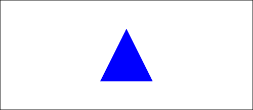
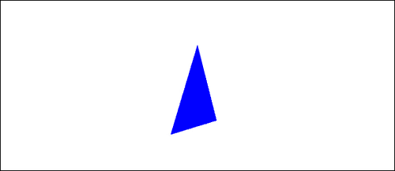
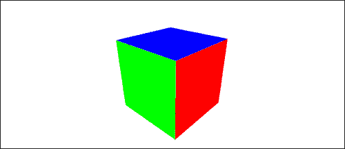
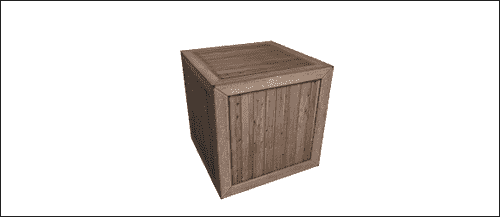
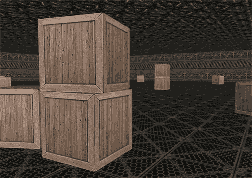

# 第九章。介绍 WebGL

在本章中，我们将介绍:

*   创建网络总帐包装以简化网络总帐应用编程接口
*   创建三角形平面
*   在三维空间中旋转三角形平面
*   创建旋转立方体
*   添加纹理和照明
*   创造一个你可以探索的三维世界

# 简介

最初，当我第一次开始写这本书时，我打算只覆盖 HTML5 画布的 2D 上下文(我坚信大多数使用画布的人都会使用这个上下文)。我最初也打算用三维投影方法和矢量运算来覆盖在 2D 环境中渲染三维形状的技术。人们已经在忙着为 2D 环境创建一些非常不可思议的 3D JavaScript 库，包括凯文·布拉克的 K3D 库(这本书的审稿人之一)，以及迪安·麦克纳梅的 Pre3d 库。

当我接近写这一章的时候，WebGL——一个真正的 3D 环境——开始主导整个网络的 3D 画布演示。WebGL 代表**基于 Web 的图形库**，它基于 OpenGL ES 2.0，提供了一个 3D 图形的 API。由于 WebGL 通过将缓冲区直接推送到图形卡上来渲染 3D 模型，从而利用了硬件加速，因此它的性能比 2D 上下文 3D 投影库的同类产品好得多。此外，它还展示了用 OpenGL 已经做了多年的工作。正如你现在可能已经知道的，我决定用 2D 的上下文来覆盖网络 GL，而不是三维投影库，因为我非常相信网络 GL 将在不久的将来成为三维应用的标准。对于想要在网络上创建 3D 游戏或 3D 模型的人来说，WebGL 特别有意思。

本章将通过涵盖缓冲区、着色器、透视和模型视图矩阵、法线、纹理、照明、相机处理等概念，让您开始了解 WebGL 的基础知识。我们开始吧！

# 创建一个 WebGL 包装器来简化 WebGL 应用编程接口

如果你已经向前看了一下这个食谱的代码，并且你对 OpenGL 或 WebGL 不太熟悉，你可能会感到非常不知所措，这是有充分理由的。WebGL 虽然功能极其强大，但第一次深入其中时，它的学习曲线相当陡峭。坦率地说，执行简单的任务需要很多行代码。因此，我发现使用一个 WebGL 包装器非常方便，该包装器本质上将冗长的代码块收缩成简单的方法。这个方法提供了创建一个简单的 WebGL 包装的步骤，它将用于本章中的所有方法。我们开始吧！

### 类型

由于 WebGL 包装相当复杂，您可以考虑在 http://www.html5canvastutorials.com/cookbook/从本书的在线资源中获取 WebGL 包装代码。

## 怎么做...

按照以下步骤创建一个 WebGL 包装对象来简化 WebGL API，或者转到[http://www.html5canvastutorials.com/cookbook](http://www.html5canvastutorials.com/cookbook)并从参考资料部分下载【T0:

1.  通过初始化画布上下文和定义动画属性开始定义 WebGL 构造函数:

    ```html
    var WebGL = function(canvasId){
    this.canvas = document.getElementById(canvasId);
    this.context = this.canvas.getContext("experimental-webgl");
    this.stage = undefined;
    // Animation
    this.t = 0;
    this.timeInterval = 0;
    this.startTime = 0;
    this.lastTime = 0;
    this.frame = 0;
    this.animating = false;

    ```

2.  使用*保罗·爱尔兰的* `requestAnimFrame`垫片创建一个跨浏览器 `requestAnimationFrame`功能，使浏览器能够处理我们动画的 FPS:

    ```html
    // provided by Paul Irish
    window.requestAnimFrame = (function(callback){
    return window.requestAnimationFrame ||
    window.webkitRequestAnimationFrame ||
    window.mozRequestAnimationFrame ||
    window.oRequestAnimationFrame ||
    window.msRequestAnimationFrame ||
    function(callback){
    window.setTimeout(callback, 1000 / 60);
    };
    })();

    ```

3.  由于*布兰登·琼斯的* `glMatrix`使用全局变量，我们可以封装它们，这样变量就不会在包装器之外被更改:

    ```html
    /*
    * encapsulte mat3, mat4, and vec3 from
    * glMatrix globals
    */
    this.mat3 = mat3;
    this.mat4 = mat4;
    this.vec3 = vec3;

    ```

4.  定义着色器类型常数并初始化模型-视图矩阵、透视矩阵和视口尺寸:

    ```html
    // shader type constants
    this.BLUE_COLOR = "BLUE_COLOR";
    this.VARYING_COLOR = "VARYING_COLOR";
    this.TEXTURE = "TEXTURE";
    this.TEXTURE_DIRECTIONAL_LIGHTING = "TEXTURE_DIRECTIONAL_LIGHTING";
    this.shaderProgram = null;
    this.mvMatrix = this.mat4.create();
    this.pMatrix = this.mat4.create();
    this.mvMatrixStack = [];
    this.context.viewportWidth = this.canvas.width;
    this.context.viewportHeight = this.canvas.height;

    ```

5.  启用深度测试:

    ```html
    // init depth test
    this.context.enable(this.context.DEPTH_TEST);
    };

    ```

6.  为上下文和画布属性定义 getter 方法:

    ```html
    WebGL.prototype.getContext = function(){
    return this.context;
    };
    WebGL.prototype.getCanvas = function(){
    return this.canvas;
    };

    ```

7.  定义一个 `clear()`方法来清除 WebGL 视口:

    ```html
    WebGL.prototype.clear = function(){
    this.context.viewport(0, 0, this.context.viewportWidth, this.context.viewportHeight);
    this.context.clear(this.context.COLOR_BUFFER_BIT | this.context.DEPTH_BUFFER_BIT);
    };

    ```

8.  定义 `setStage()`方法:

    ```html
    WebGL.prototype.setStage = function(func){
    this.stage = func;
    };

    ```

9.  定义返回动画是否正在运行的 `isAnimating()`方法:

    ```html
    WebGL.prototype.isAnimating = function(){
    return this.animating;
    };

    ```

10.  定义返回当前帧数的 `getFrame()`方法:

    ```html
    WebGL.prototype.getFrame = function(){
    return this.frame;
    };

    ```

11.  定义启动动画的 `start()`方法:

    ```html
    WebGL.prototype.start = function(){
    this.animating = true;
    var date = new Date();
    this.startTime = date.getTime();
    this.lastTime = this.startTime;
    if (this.stage !== undefined) {
    this.stage();
    }
    this.animationLoop();
    };

    ```

12.  定义停止动画的 `stopAnimation()`方法:

    ```html
    WebGL.prototype.stopAnimation = function(){
    this.animating = false;
    };

    ```

13.  定义 `getTimeInterval()`方法，该方法返回自渲染最后一帧以来经过的时间(以毫秒为单位):

    ```html
    WebGL.prototype.getTimeInterval = function(){
    return this.timeInterval;
    };

    ```

14.  定义 `getTime()`方法，返回动画开始后经过的毫秒数:

    ```html
    WebGL.prototype.getTime = function(){
    return this.t;
    };

    ```

15.  定义 `getFps()`方法，返回浏览器确定的当前 FPS 值:

    ```html
    WebGL.prototype.getFps = function(){
    return this.timeInterval > 0 ? 1000 / this.timeInterval : 0;
    };

    ```

16.  定义 `animationLoop()`方法，负责更新动画属性，绘制舞台，请求新的动画帧:

    ```html
    WebGL.prototype.animationLoop = function(){
    var that = this;
    this.frame++;
    var date = new Date();
    var thisTime = date.getTime();
    this.timeInterval = thisTime - this.lastTime;
    this.t += this.timeInterval;
    this.lastTime = thisTime;
    if (this.stage !== undefined) {
    this.stage();
    }
    if (this.animating) {
    requestAnimFrame(function(){
    that.animationLoop();
    });
    }
    };

    ```

17.  定义 `save()`方法，通过将当前状态推送到模型-视图矩阵栈来保存模型-视图矩阵状态:

    ```html
    WebGL.prototype.save = function(){
    var copy = this.mat4.create();
    this.mat4.set(this.mvMatrix, copy);
    this.mvMatrixStack.push(copy);
    };

    ```

18.  定义 `restore()`方法，恢复之前的模型视图状态:

    ```html
    WebGL.prototype.restore = function(){
    if (this.mvMatrixStack.length == 0) {
    throw "Invalid popMatrix!";
    }
    this.mvMatrix = this.mvMatrixStack.pop();
    };

    ```

19.  根据着色器类型参数定义获取 **GLSL (GL 着色器语言)**片段代码的 `getFragmentShaderGLSL()`方法。本质上，该方法包含四个不同的独立 GLSL 片段着色器程序，它们是用 `case`语句选择的:

    ```html
    WebGL.prototype.getFragmentShaderGLSL = function(shaderType){
    switch (shaderType) {
    case this.BLUE_COLOR:
    return "#ifdef GL_ES\n" +
    "precision highp float;\n" +
    "#endif\n" +
    "void main(void) {\n" +
    "gl_FragColor = vec4(0.0, 0.0, 1.0, 1.0);\n" +
    "}";
    case this.VARYING_COLOR:
    return "#ifdef GL_ES\n" +
    "precision highp float;\n" +
    "#endif\n" +
    "varying vec4 vColor;\n" +
    "void main(void) {\n" +
    "gl_FragColor = vColor;\n" +
    "}";
    case this.TEXTURE:
    return "#ifdef GL_ES\n" +
    "precision highp float;\n" +
    "#endif\n" +
    "varying vec2 vTextureCoord;\n" +
    "uniform sampler2D uSampler;\n" +
    "void main(void) {\n" +
    "gl_FragColor = texture2D(uSampler, vec2(vTextureCoord.s, vTextureCoord.t));\n" +
    "}";
    case this.TEXTURE_DIRECTIONAL_LIGHTING:
    return "#ifdef GL_ES\n" +
    "precision highp float;\n" +
    "#endif\n" +
    "varying vec2 vTextureCoord;\n" +
    "varying vec3 vLightWeighting;\n" +
    "uniform sampler2D uSampler;\n" +
    "void main(void) {\n" +
    "vec4 textureColor = texture2D(uSampler, vec2(vTextureCoord.s, vTextureCoord.t));\n" +
    "gl_FragColor = vec4(textureColor.rgb * vLightWeighting, textureColor.a);\n" +
    "}";
    }
    };

    ```

20.  定义 `getVertexShaderGLSL()`方法，该方法基于着色器类型参数获取 GLSL 顶点代码:

    ```html
    WebGL.prototype.getVertexShaderGLSL = function(shaderType){
    switch (shaderType) {
    case this.BLUE_COLOR:
    return "attribute vec3 aVertexPosition;\n" +
    "uniform mat4 uMVMatrix;\n" +
    "uniform mat4 uPMatrix;\n" +
    "void main(void) {\n" +
    "gl_Position = uPMatrix * uMVMatrix * vec4(aVertexPosition, 1.0);\n" +
    "}";
    case this.VARYING_COLOR:
    return "attribute vec3 aVertexPosition;\n" +
    "attribute vec4 aVertexColor;\n" +
    "uniform mat4 uMVMatrix;\n" +
    "uniform mat4 uPMatrix;\n" +
    "varying vec4 vColor;\n" +
    "void main(void) {\n" +
    "gl_Position = uPMatrix * uMVMatrix * vec4(aVertexPosition, 1.0);\n" +
    "vColor = aVertexColor;\n" +
    "}";
    case this.TEXTURE:
    return "attribute vec3 aVertexPosition;\n" +
    "attribute vec2 aTextureCoord;\n" +
    "uniform mat4 uMVMatrix;\n" +
    "uniform mat4 uPMatrix;\n" +
    "varying vec2 vTextureCoord;\n" +
    "void main(void) {\n" +
    "gl_Position = uPMatrix * uMVMatrix * vec4(aVertexPosition, 1.0);\n" +
    "vTextureCoord = aTextureCoord;\n" +
    "}";
    case this.TEXTURE_DIRECTIONAL_LIGHTING:
    return "attribute vec3 aVertexPosition;\n" +
    "attribute vec3 aVertexNormal;\n" +
    "attribute vec2 aTextureCoord;\n" +
    "uniform mat4 uMVMatrix;\n" +
    "uniform mat4 uPMatrix;\n" +
    "uniform mat3 uNMatrix;\n" +
    "uniform vec3 uAmbientColor;\n" +
    "uniform vec3 uLightingDirection;\n" +
    "uniform vec3 uDirectionalColor;\n" +
    "uniform bool uUseLighting;\n" +
    "varying vec2 vTextureCoord;\n" +
    "varying vec3 vLightWeighting;\n" +
    "void main(void) {\n" +
    "gl_Position = uPMatrix * uMVMatrix * vec4(aVertexPosition, 1.0);\n" +
    "vTextureCoord = aTextureCoord;\n" +
    "if (!uUseLighting) {\n" +
    "vLightWeighting = vec3(1.0, 1.0, 1.0);\n" +
    "} else {\n" +
    "vec3 transformedNormal = uNMatrix * aVertexNormal;\n" +
    "float directionalLightWeighting = max(dot(transformedNormal, uLightingDirection), 0.0);\n" +
    "vLightWeighting = uAmbientColor + uDirectionalColor * directionalLightWeighting;\n" +
    "}\n" +
    "}";
    }
    };

    ```

21.  定义 `initShaders()`方法，该方法基于着色器类型参数初始化适当的着色器:

    ```html
    WebGL.prototype.initShaders = function(shaderType){
    this.initPositionShader();
    switch (shaderType) {
    case this.VARYING_COLOR:
    this.initColorShader();
    break;
    case this.TEXTURE:
    this.initTextureShader();
    break;
    case this.TEXTURE_DIRECTIONAL_LIGHTING:
    this.initTextureShader();
    this.initNormalShader();
    this.initLightingShader();
    break;
    }
    };

    ```

22.  定义 `setShaderProgram()`方法，该方法基于着色器类型参数设置着色器程序:

    ```html
    WebGL.prototype.setShaderProgram = function(shaderType){
    var fragmentGLSL = this.getFragmentShaderGLSL(shaderType);
    var vertexGLSL = this.getVertexShaderGLSL(shaderType);
    var fragmentShader = this.context.createShader(this.context.FRAGMENT_SHADER);
    this.context.shaderSource(fragmentShader, fragmentGLSL);
    this.context.compileShader(fragmentShader);
    var vertexShader = this.context.createShader(this.context.VERTEX_SHADER);
    this.context.shaderSource(vertexShader, vertexGLSL);
    this.context.compileShader(vertexShader);
    this.shaderProgram = this.context.createProgram();
    this.context.attachShader(this.shaderProgram, vertexShader);
    this.context.attachShader(this.shaderProgram, fragmentShader);
    this.context.linkProgram(this.shaderProgram);
    if (!this.context.getProgramParameter(this.shaderProgram, this.context.LINK_STATUS)) {
    alert("Could not initialize shaders");
    }
    this.context.useProgram(this.shaderProgram);
    // once shader program is loaded, it's time to init the shaders
    this.initShaders(shaderType);
    };

    ```

23.  定义 `perspective()`方法，该方法包装了对透视矩阵进行操作的 `perspective()`方法:

    ```html
    WebGL.prototype.perspective = function(viewAngle, minDist, maxDist){
    this.mat4.perspective(viewAngle, this.context.viewportWidth / this.context.viewportHeight, minDist, maxDist, this.pMatrix);
    };

    ```

24.  定义 `identity()`方法，该方法包装了在模型视图矩阵上运行的 `identity()`方法:

    ```html
    WebGL.prototype.identity = function(){
    this.mat4.identity(this.mvMatrix);
    };

    ```

25.  定义 `translate()`方法，该方法包装了在模型视图矩阵上运行的 `translate()`方法:

    ```html
    WebGL.prototype.translate = function(x, y, z){
    this.mat4.translate(this.mvMatrix, [x, y, z]);
    };

    ```

26.  定义 `rotate()`方法，该方法包装了在模型视图矩阵上运行的 `rotate()`方法:

    ```html
    WebGL.prototype.rotate = function(angle, x, y, z){
    this.mat4.rotate(this.mvMatrix, angle, [x, y, z]);
    };

    ```

27.  定义 `initPositionShader()`方法，该方法初始化与位置缓冲区一起使用的位置着色器:

    ```html
    WebGL.prototype.initPositionShader = function(){
    this.shaderProgram.vertexPositionAttribute = this.context.getAttribLocation(this.shaderProgram, "aVertexPosition");
    this.context.enableVertexAttribArray(this.shaderProgram.vertexPositionAttribute);
    this.shaderProgram.pMatrixUniform = this.context.getUniformLocation(this.shaderProgram, "uPMatrix");
    this.shaderProgram.mvMatrixUniform = this.context.getUniformLocation(this.shaderProgram, "uMVMatrix");
    };

    ```

28.  定义 `initColorShader()`方法，初始化颜色着色器以与颜色缓冲区一起使用:

    ```html
    WebGL.prototype.initColorShader = function(){
    this.shaderProgram.vertexColorAttribute = this.context.getAttribLocation(this.shaderProgram, "aVertexColor");
    this.context.enableVertexAttribArray(this.shaderProgram.vertexColorAttribute);
    };

    ```

29.  定义 `initTextureShader()`方法，初始化纹理着色器以与纹理缓冲区一起使用:

    ```html
    WebGL.prototype.initTextureShader = function(){
    this.shaderProgram.textureCoordAttribute = this.context.getAttribLocation(this.shaderProgram, "aTextureCoord");
    this.context.enableVertexAttribArray(this.shaderProgram.textureCoordAttribute);
    this.shaderProgram.samplerUniform = this.context.getUniformLocation(this.shaderProgram, "uSampler");
    };

    ```

30.  定义 `initNormalShader()`方法，该方法初始化与正常缓冲区一起使用的正常着色器:

    ```html
    WebGL.prototype.initNormalShader = function(){
    this.shaderProgram.vertexNormalAttribute = this.context.getAttribLocation(this.shaderProgram, "aVertexNormal");
    this.context.enableVertexAttribArray(this.shaderProgram.vertexNormalAttribute);
    this.shaderProgram.nMatrixUniform = this.context.getUniformLocation(this.shaderProgram, "uNMatrix");
    };

    ```

31.  定义初始化环境和方向照明着色器的 `initLightingShader()`方法:

    ```html
    WebGL.prototype.initLightingShader = function(){
    this.shaderProgram.useLightingUniform = this.context.getUniformLocation(this.shaderProgram, "uUseLighting");
    this.shaderProgram.ambientColorUniform = this.context.getUniformLocation(this.shaderProgram, "uAmbientColor");
    this.shaderProgram.lightingDirectionUniform = this.context.getUniformLocation(this.shaderProgram, "uLightingDirection");
    this.shaderProgram.directionalColorUniform = this.context.getUniformLocation(this.shaderProgram, "uDirectionalColor");
    };

    ```

32.  定义 `initTexture()`方法，该方法包装初始化 WebGL 纹理对象所需的 WebGL API 代码:

    ```html
    WebGL.prototype.initTexture = function(texture){
    this.context.pixelStorei(this.context.UNPACK_FLIP_Y_WEBGL, true);
    this.context.bindTexture(this.context.TEXTURE_2D, texture);
    this.context.texImage2D(this.context.TEXTURE_2D, 0, this.context.RGBA, this.context.RGBA, this.context.UNSIGNED_BYTE, texture.image);
    this.context.texParameteri(this.context.TEXTURE_2D, this.context.TEXTURE_MAG_FILTER, this.context.NEAREST);
    this.context.texParameteri(this.context.TEXTURE_2D, this.context.TEXTURE_MIN_FILTER, this.context.LINEAR_MIPMAP_NEAREST);
    this.context.generateMipmap(this.context.TEXTURE_2D);
    this.context.bindTexture(this.context.TEXTURE_2D, null);
    };

    ```

33.  定义 `createArrayBuffer()`方法，该方法包装创建数组缓冲区所需的 WebGL API 代码:

    ```html
    WebGL.prototype.createArrayBuffer = function(vertices){
    var buffer = this.context.createBuffer();
    buffer.numElements = vertices.length;
    this.context.bindBuffer(this.context.ARRAY_BUFFER, buffer);
    this.context.bufferData(this.context.ARRAY_BUFFER, new Float32Array(vertices), this.context.STATIC_DRAW);
    return buffer;
    };

    ```

34.  定义 `createElementArrayBuffer()`方法，该方法包装创建元素数组缓冲区所需的 WebGL API 代码:

    ```html
    WebGL.prototype.createElementArrayBuffer = function(vertices){
    var buffer = this.context.createBuffer();
    buffer.numElements = vertices.length;
    this.context.bindBuffer(this.context.ELEMENT_ARRAY_BUFFER, buffer);
    this.context.bufferData(this.context.ELEMENT_ARRAY_BUFFER, new Uint16Array(vertices), this.context.STATIC_DRAW);
    return buffer;
    };

    ```

35.  定义将位置缓冲区推送到显卡上的 `pushPositionBuffer()`方法:

    ```html
    WebGL.prototype.pushPositionBuffer = function(buffers){
    this.context.bindBuffer(this.context.ARRAY_BUFFER, buffers.positionBuffer);
    this.context.vertexAttribPointer(this.shaderProgram.vertexPositionAttribute, 3, this.context.FLOAT, false, 0, 0);
    };

    ```

36.  定义将颜色缓冲区推送到显卡上的 `pushColorBuffer()`方法:

    ```html
    WebGL.prototype.pushColorBuffer = function(buffers){
    this.context.bindBuffer(this.context.ARRAY_BUFFER, buffers.colorBuffer);
    this.context.vertexAttribPointer(this.shaderProgram.vertexColorAttribute, 4, this.context.FLOAT, false, 0, 0);
    };

    ```

37.  定义将纹理缓冲区推送到显卡上的 `pushTextureBuffer()`方法:

    ```html
    WebGL.prototype.pushTextureBuffer = function(buffers, texture){
    this.context.bindBuffer(this.context.ARRAY_BUFFER, buffers.textureBuffer);
    this.context.vertexAttribPointer(this.shaderProgram.textureCoordAttribute, 2, this.context.FLOAT, false, 0, 0);
    this.context.activeTexture(this.context.TEXTURE0);
    this.context.bindTexture(this.context.TEXTURE_2D, texture);
    this.context.uniform1i(this.shaderProgram.samplerUniform, 0);
    };

    ```

38.  定义将索引缓冲区推送到显卡上的 `pushIndexBuffer()`方法:

    ```html
    WebGL.prototype.pushIndexBuffer = function(buffers){
    this.context.bindBuffer(this.context.ELEMENT_ARRAY_BUFFER, buffers.indexBuffer);
    };

    ```

39.  定义将普通缓冲区推送到显卡上的 `pushNormalBuffer()`方法:

    ```html
    WebGL.prototype.pushNormalBuffer = function(buffers){
    this.context.bindBuffer(this.context.ARRAY_BUFFER, buffers.normalBuffer);
    this.context.vertexAttribPointer(this.shaderProgram.vertexNormalAttribute, 3, this.context.FLOAT, false, 0, 0);
    };

    ```

40.  定义 `setMatrixUniforms()`方法，包装设置矩阵制服所需的 WebGL API 代码:

    ```html
    WebGL.prototype.setMatrixUniforms = function(){
    this.context.uniformMatrix4fv(this.shaderProgram.pMatrixUniform, false, this.pMatrix);
    this.context.uniformMatrix4fv(this.shaderProgram.mvMatrixUniform, false, this.mvMatrix);
    var normalMatrix = this.mat3.create();
    this.mat4.toInverseMat3(this.mvMatrix, normalMatrix);
    this.mat3.transpose(normalMatrix);
    this.context.uniformMatrix3fv(this.shaderProgram.nMatrixUniform, false, normalMatrix);
    };

    ```

41.  定义 `drawElements()`方法，该方法包装基于索引缓冲区绘制非三角形位置缓冲区的 WebGL API 代码:

    ```html
    WebGL.prototype.drawElements = function(buffers){
    this.setMatrixUniforms();
    // draw elements
    this.context.drawElements(this.context.TRIANGLES, buffers.indexBuffer.numElements, this.context.UNSIGNED_SHORT, 0);
    };

    ```

42.  定义 `drawArrays()`方法，包装绘制三角形位置缓冲区所需的 WebGL API 代码:

    ```html
    WebGL.prototype.drawArrays = function(buffers){
    this.setMatrixUniforms();
    // draw arrays
    this.context.drawArrays(this.context.TRIANGLES, 0, buffers.positionBuffer.numElements / 3);
    };

    ```

43.  定义 `enableLighting()`方法，包装启用照明所需的 WebGL API 代码:

    ```html
    WebGL.prototype.enableLighting = function(){
    this.context.uniform1i(this.shaderProgram.useLightingUniform, true);
    };

    ```

44.  定义 `setAmbientLighting()`方法，包装设置环境照明所需的 WebGL API 代码:

    ```html
    WebGL.prototype.setAmbientLighting = function(red, green, blue){
    this.context.uniform3f(this.shaderProgram.ambientColorUniform, parseFloat(red), parseFloat(green), parseFloat(blue));
    };

    ```

45.  定义 `setDirectionalLighting()`方法，包装设置方向照明所需的 WebGL API 代码:

    ```html
    WebGL.prototype.setDirectionalLighting = function(x, y, z, red, green, blue){
    // directional lighting
    var lightingDirection = [x, y, z];
    var adjustedLD = this.vec3.create();
    this.vec3.normalize(lightingDirection, adjustedLD);
    this.vec3.scale(adjustedLD, -1);
    this.context.uniform3fv(this.shaderProgram.lightingDirectionUniform, adjustedLD);
    // directional color
    this.context.uniform3f(this.shaderProgram.directionalColorUniform, parseFloat(red), parseFloat(green), parseFloat(blue));
    };

    ```

### 它是如何工作的...

WebGL 包装器对象的思想是处理 WebGL 应用编程接口没有提供的一些东西，并包装做简单事情所需的繁琐的代码块。

WebGL 有两个主要组件没有内置到应用编程接口中——矩阵变换数学和着色器程序。在本章中，我们将使用一个由*布兰登·琼斯*专门为 WebGL 构建的便利矩阵库，称为 glMatrix，来处理所有的向量运算。至于缺少对着色器程序的支持，我们的 WebGL 包装对象包括预建的 GLSL 着色器程序。着色器程序是用 GLSL 编写的，这是 OpenGL 着色语言的缩写，用于以编程方式定义顶点和片段应该如何渲染。顶点着色器对构成我们的 3D 模型形状的每个顶点进行操作，片段着色器对光栅化产生的每个片段进行操作。要使用着色器程序，我们实际上必须将 GLSL 代码字符串传入到 WebGL API 中。

除了包装器方法之外，WebGL 包装器对象还包括我们在[第 5 章](05.html "Chapter 5. Bringing the Canvas to Life with Animation")、*中组合在一起的动画方法，通过动画将画布变得栩栩如生。*

我们的 WebGL 包装器对象中的大多数剩余方法只是包装将缓冲区推送到显卡上然后绘制结果所需的代码块。在接下来的五个食谱中，我们将深入探讨每一种缓冲类型，包括位置缓冲、颜色缓冲、索引缓冲、纹理缓冲和普通缓冲。

### 还有更多...

要对 WebGL 和 OpenGL 进行更深入的探索，请查看这两个非常棒的资源:

*   [http://learning webgl . com/](http://learningwebgl.com/)
*   [http://nehe.gamedev.net/](http://nehe.gamedev.net/)

### 另见...

*   *[附录 A](10.html "Appendix A. Detecting Canvas Support") ，检测帆布支架*

# 创建三角形平面

现在我们已经设置好了我们的 WebGL 包装器，让我们通过在屏幕上画一个简单的三角形来创建我们的第一个 WebGL 应用程序。它将为创建更复杂的 3D 模型所需的典型步骤奠定良好的基础。在这个食谱中，我们将引入位置缓冲区的概念，它只是用来定义 3D 模型的位置和形状的顶点数组。



## 怎么做...

按照以下步骤使用 WebGL 渲染 2D 三角形:

1.  链接到 `glMatrix`库和 WebGL 包装器:

    ```html
    <script type="text/javascript" src="glMatrix-1.0.1.min.js">
    </script>
    <script type="text/javascript" src="WebGL.js">
    </script>

    ```

2.  定义 `initBuffers()`函数，为我们的三角形初始化位置缓冲区:

    ```html
    function initBuffers(gl){
    var triangleBuffers = {};
    triangleBuffers.positionBuffer = gl.createArrayBuffer([
    0, 1, 0,
    -1, -1, 0,
    1, -1, 0
    ]);
    return triangleBuffers;
    }

    ```

3.  定义 `stage()`函数，该函数设置透视矩阵，将模型-视图矩阵设置为单位矩阵，在 z 方向将模型-视图矩阵向后平移 5 个单位，将位置缓冲区推送到显卡上，然后使用 `drawArrays():`

    ```html
    function stage(gl, triangleBuffers){
    gl.clear();
    // set field of view at 45 degrees
    // set viewing range between 0.1 and 100.0 units away.
    gl.perspective(45, 0.1, 100.0);
    gl.identity();
    // translate model-view matrix
    gl.translate(0, 0, -5);
    gl.pushPositionBuffer(triangleBuffers);
    gl.drawArrays(triangleBuffers);
    }

    ```

    绘制三角形
4.  页面加载时，创建 WebGL 包装对象的新实例，将着色器程序设置为`"BLUE_COLOR"`，初始化三角形缓冲区，然后绘制舞台:

    ```html
    window.onload = function(){
    var gl = new WebGL("myCanvas", "experimental-webgl");
    gl.setShaderProgram("BLUE_COLOR");
    var triangleBuffers = initBuffers(gl);
    stage(gl, triangleBuffers);
    };

    ```

5.  将画布标签嵌入到 HTML 文档的主体中:

    ```html
    <canvas id="myCanvas" width="600" height="250"
    style="border:1px solid black;"></canvas>

    ```

### 它是如何工作的...

当加载时，我们需要做的第一件事是使用 `experimental-webgl`上下文初始化 WebGL 包装器对象。在撰写本文时， `experimental-webgl`上下文是支持 WebGL 的所有主要浏览器中唯一支持的画布上下文，包括谷歌 Chrome、火狐和 Safari。

接下来，我们可以将着色器程序设置为“`BLUE_COLOR`”，这将使用预构建的 GLSL 程序来渲染蓝色顶点和片段。一旦着色器程序被设置，我们需要初始化我们的缓冲区。缓冲区是一个顶点数组，用于定义我们的三维模型。对于这个配方，我们将只使用一个位置缓冲区，它定义了我们三角形的顶点位置。在未来的食谱中，我们将介绍其他缓冲区类型，包括索引缓冲区、纹理缓冲区和普通缓冲区。对于这个配方，位置缓冲区包含九个元素，代表三个顶点(每个顶点都有一个 x、y 和 z 分量)。

一旦三角形缓冲区被初始化，我们就可以画舞台了。 `stage()`功能首先清除画布，然后设置透视矩阵。我们的 WebGL 包装器对象的 `perspective()`方法接受三个参数，一个视角，一个最小可见距离和一个最大可见距离。在本食谱中，我们将最小可视距离设置为 0.1 单位，最大可视距离设置为 100 单位。任何接近 0.1 单位的物体都是不可见的，任何超过 100 单位的物体也是不可见的。如果我们的舞台包含许多分布在整个空间的复杂模型，那么拥有很大的最大可视距离可能会导致性能问题，因为太多的东西同时呈现在屏幕上。

接下来，我们可以使用 `identity()`函数将模型-视图矩阵设置为单位矩阵，然后将模型-视图矩阵转换为(0，0，-5)。这意味着我们只需在 z 方向移动我们的 model -5 单元，距离用户 5 个单元。

最后，我们可以使用 `pushPositionBuffer()`方法将位置缓冲推送到显卡上，然后使用 `drawArrays()`绘制三角形。

# 在三维空间中旋转三角形平面

现在，我们可以在三维空间中绘制一个 2D 三角形，让我们尝试使用我们添加到 WebGL 包装对象的动画方法围绕 y 轴旋转它。



## 怎么做...

按照以下步骤使用 WebGL 围绕 y 轴旋转三角形:

1.  链接到 `glMatrix`库和 WebGL 包装器:

    ```html
    <script type="text/javascript" src="glMatrix-1.0.1.min.js">
    </script>
    <script type="text/javascript" src="WebGL.js">
    </script>

    ```

2.  定义 `initBuffers()`函数，为我们的三角形初始化位置缓冲区:

    ```html
    function initBuffers(gl){
    var triangleBuffers = {};
    triangleBuffers.positionBuffer = gl.createArrayBuffer([
    0, 1, 0,
    -1, -1, 0,
    1, -1, 0
    ]);
    return triangleBuffers;
    }

    ```

3.  定义 `stage()`函数，该函数设置透视，将模型-视图矩阵设置为单位矩阵，平移三角形，围绕 y 轴旋转三角形，将位置缓冲区推到图形卡上，并使用 `drawArrays():`

    ```html
    function stage(gl, triangleBuffers, angle){
    // set field of view at 45 degrees
    // set viewing range between 0.1 and 100.0 units away.
    gl.perspective(45, 0.1, 100.0);
    gl.identity();
    // translate model-view matrix
    gl.translate(0, 0, -5);
    // rotate model-view matrix about y-axis
    gl.rotate(angle, 0, 1, 0);
    gl.pushPositionBuffer(triangleBuffers);
    gl.drawArrays(triangleBuffers);
    }

    ```

    绘制三角形
4.  页面加载时，初始化 WebGL 包装对象，设置着色器程序，初始化缓冲区，为动画设置 `stage`功能，然后开始动画:

    ```html
    window.onload = function(){
    var gl = new WebGL("myCanvas", "experimental-webgl");
    gl.setShaderProgram("BLUE_COLOR");
    var triangleBuffers = initBuffers(gl);
    var angle = 0;
    gl.setStage(function(){
    // update angle
    var angularVelocity = Math.PI / 2; // radians / second
    var angleEachFrame = angularVelocity * gl.getTimeInterval() / 1000;
    angle += angleEachFrame;
    this.clear();
    stage(gl, triangleBuffers, angle);
    });
    gl.start();
    };

    ```

5.  将画布标签嵌入到 HTML 文档的主体中:

    ```html
    <canvas id="myCanvas" width="600" height="250"
    style="border:1px solid black;"></canvas>

    ```

### 它是如何工作的...

要围绕 y 轴旋转我们的三角形，我们首先需要通过设置 WebGL 包装器对象的 `stage()`功能来设置动画阶段(类似于我们在[第 5 章](05.html "Chapter 5. Bringing the Canvas to Life with Animation")中用 `Animation`对象所做的)，然后用 `start()`开始动画。对于每个动画帧，我们可以通过 `rotate()`方法旋转模型-视图矩阵来增加三角形围绕 y 轴的角度。

### 另见...

*   *在[第五章](05.html "Chapter 5. Bringing the Canvas to Life with Animation")中创建动画类*

# 创建旋转立方体

好了，现在乐趣真的开始了。在这个食谱中，我们将创建一个不同颜色面的旋转三维立方体。为此，我们将引入两种新的缓冲区——颜色缓冲区和索引缓冲区。



## 怎么做...

按照以下步骤使用 WebGL 创建旋转立方体:

1.  链接到 `glMatrix`库和 WebGL 包装器:

    ```html
    <script type="text/javascript" src="glMatrix-1.0.1.min.js">
    </script>
    <script type="text/javascript" src="WebGL.js">
    </script>

    ```

2.  定义 `initBuffers()`函数，为我们的立方体初始化位置缓冲区、颜色缓冲区和索引缓冲区:

    ```html
    function initBuffers(gl){
    var cubeBuffers = {}
    cubeBuffers.positionBuffer = gl.createArrayBuffer([
    // Front face
    -1, -1, 1,
    1, -1, 1,
    1, 1, 1,
    -1, 1, 1,
    // Back face
    -1, -1, -1,
    -1, 1, -1,
    1, 1, -1,
    1, -1, -1,
    // Top face
    -1, 1, -1,
    -1, 1, 1,
    1, 1, 1,
    1, 1, -1,
    // Bottom face
    -1, -1, -1,
    1, -1, -1,
    1, -1, 1,
    -1, -1, 1,
    // Right face
    1, -1, -1,
    1, 1, -1,
    1, 1, 1,
    1, -1, 1,
    // Left face
    -1, -1, -1,
    -1, -1, 1,
    -1, 1, 1,
    -1, 1, -1
    ]);
    // build color Vertices
    var colors = [
    [1, 0, 1, 1], // Front face - Pink
    [0, 1, 0, 1], // Back face - Green
    [0, 0, 1, 1], // Top face - Blue
    [0, 1, 1, 1], // Bottom face - Turquoise
    [1, 1, 0, 1], // Right face - Yellow
    [1, 0, 0, 1] // Left face - Red
    ];
    var colorVertices = [];
    for (var n in colors) {
    var color = colors[n];
    for (var i=0; i < 4; i++) {
    colorVertices = colorVertices.concat(color);
    }
    }
    cubeBuffers.colorBuffer = gl.createArrayBuffer(colorVertices);
    cubeBuffers.indexBuffer = gl.createElementArrayBuffer([
    0, 1, 2, 0, 2, 3, // Front face
    4, 5, 6, 4, 6, 7, // Back face
    8, 9, 10, 8, 10, 11, // Top face
    12, 13, 14, 12, 14, 15, // Bottom face
    16, 17, 18, 16, 18, 19, // Right face
    20, 21, 22, 20, 22, 23 // Left face
    ]);
    return cubeBuffers;
    }

    ```

3.  定义 `stage()`函数，该函数设置透视、将模型-视图矩阵设置为身份矩阵、平移立方体、旋转立方体、将位置缓冲区、颜色缓冲区和索引缓冲区推到显卡上，最后使用 `drawElements()`绘制立方体，因为我们模型的面不是三角形:

    ```html
    function stage(gl, cubeBuffers, angle){
    // set field of view at 45 degrees
    // set viewing range between 0.1 and 100.0 units away.
    gl.perspective(45, 0.1, 100);
    gl.identity();
    // translate model-view matrix
    gl.translate(0, 0, -5);
    // rotate model-view matrix about x-axis (tilt box downwards)
    gl.rotate(Math.PI * 0.15, 1, 0, 0);
    // rotate model-view matrix about y-axis
    gl.rotate(angle, 0, 1, 0);
    gl.pushPositionBuffer(cubeBuffers);
    gl.pushColorBuffer(cubeBuffers);
    gl.pushIndexBuffer(cubeBuffers);
    gl.drawElements(cubeBuffers);
    }

    ```

4.  页面加载时，初始化 WebGL 包装对象，将着色器程序设置为`"VARYING_COLOR"`，因为每个面的颜色都是可变的，并且依赖于颜色缓冲区，初始化缓冲区，为动画设置 `stage`功能，然后开始动画:

    ```html
    window.onload = function(){
    var gl = new WebGL("myCanvas", "experimental-webgl");
    gl.setShaderProgram("VARYING_COLOR");
    var cubeBuffers = initBuffers(gl);
    var angle = 0;
    gl.setStage(function(){
    // update angle
    var angularVelocity = Math.PI / 4; // radians / second
    var angleEachFrame = angularVelocity * this.getTimeInterval() / 1000;
    angle += angleEachFrame;
    this.clear();
    stage(this, cubeBuffers, angle);
    });
    gl.start();
    };

    ```

5.  将画布标签嵌入到 HTML 文档的主体中:

    ```html
    <canvas id="myCanvas" width="600" height="250"
    style="border:1px solid black;"></canvas>

    ```

### 它是如何工作的...

这个配方引入了索引缓冲区和颜色缓冲区的概念。在前两个食谱中，我们创建了一个三角形平面，因为带有三角形面的模型最容易用 WebGL 实现，因为只需要一个缓冲区——位置缓冲区。当我们想要创建一个具有非三角形面的三维模型时，比如立方体，这就有点复杂了，因为我们需要一种方法来将立方体表示为一组三角形面。我们可以通过创建一个将三角形映射到位置缓冲区顶点的索引缓冲区来实现这一点。

看看前面代码中的索引缓冲顶点。你会注意到前六个元素是 `[0, 1, 2, 0, 2, 3]`。前三个元素， `[0, 1, 2]`指的是位置缓冲区的第 0、第 1 和第 2 个顶点，它们形成了一个三角形，覆盖了立方体正面的一半。第二组元素 `[0, 2, 3]`对应于位置缓冲区的第 0、第 2 和第 3 个顶点，并形成覆盖立方体正面另一半的第二个三角形。这两个三角形一起构成了立方体的正面。当索引缓冲区完成时，它将包含位置缓冲区顶点的映射，这些顶点形成覆盖立方体六个面的三角形面。

除了索引缓冲区，这个配方还需要使用颜色缓冲区。颜色缓冲区用于定义模型面的颜色。在这个配方中，颜色缓冲区将为我们的立方体的六个面定义六种不同的颜色。与索引缓冲区类似，颜色缓冲区用于将颜色映射到位置缓冲区中的每个顶点。每种颜色由四个元素定义，[红、绿、蓝、阿尔法]。根据位置缓冲区的定义，我们的立方体由六个面组成，每个面有四个顶点。因此，我们的颜色缓冲区数组应该包含(6 个面)*(每个面 4 个顶点)*(每个颜色 4 个元素)= 96 个元素。

一旦我们定义了位置缓冲区、颜色缓冲区和索引缓冲区，剩下要做的就是将每个缓冲区推到显卡上并渲染模型。与前面两个使用 `drawArrays()`方法直接渲染三角形的方法不同，在这个方法中，我们将不得不使用 `drawElements()`方法，因为我们的模型由非三角形面组成，并且需要一个索引缓冲区来将三角形面映射到我们模型的正方形面。

### 另见...

*   *在[第五章](05.html "Chapter 5. Bringing the Canvas to Life with Animation")中创建动画类*

# 添加纹理和光照

现在我们已经知道如何使用位置缓冲区和索引缓冲区创建简单的 3D 模型，让我们通过用板条箱纹理包裹我们的模型来制作一个木制板条箱，然后添加一些环境和方向照明来创建着色表面。这个配方引入了纹理缓冲区来创建纹理和普通缓冲区，这是处理灯光效果所必需的。



## 怎么做...

按照以下步骤在 WebGL 中创建带照明的旋转板条箱:

1.  链接到 `glMatrix`库和 WebGL 包装器:

    ```html
    <script type="text/javascript" src="glMatrix-1.0.1.min.js">
    </script>
    <script type="text/javascript" src="WebGL.js">
    </script>

    ```

2.  定义 `initBuffers()`函数，为我们的立方体初始化位置缓冲区、正常缓冲区、纹理缓冲区和索引缓冲区:

    ```html
    function initBuffers(gl){
    var cubeBuffers = {};
    cubeBuffers.positionBuffer = gl.createArrayBuffer([
    // Front face
    -1, -1, 1,
    1, -1, 1,
    1, 1, 1,
    -1, 1, 1,
    // Back face
    -1, -1, -1,
    -1, 1, -1,
    1, 1, -1,
    1, -1, -1,
    // Top face
    -1, 1, -1,
    -1, 1, 1,
    1, 1, 1,
    1, 1, -1,
    // Bottom face
    -1, -1, -1,
    1, -1, -1,
    1, -1, 1,
    -1, -1, 1,
    // Right face
    1, -1, -1,
    1, 1, -1,
    1, 1, 1,
    1, -1, 1,
    // Left face
    -1, -1, -1,
    -1, -1, 1,
    -1, 1, 1,
    -1, 1, -1
    ]);
    cubeBuffers.normalBuffer = gl.createArrayBuffer([
    // Front face
    0, 0, 1,
    0, 0, 1,
    0, 0, 1,
    0, 0, 1,
    // Back face
    0, 0, -1,
    0, 0, -1,
    0, 0, -1,
    0, 0, -1,
    // Top face
    0, 1, 0,
    0, 1, 0,
    0, 1, 0,
    0, 1, 0,
    // Bottom face
    0, -1, 0,
    0, -1, 0,
    0, -1, 0,
    0, -1, 0,
    // Right face
    1, 0, 0,
    1, 0, 0,
    1, 0, 0,
    1, 0, 0,
    // Left face
    -1, 0, 0,
    -1, 0, 0,
    -1, 0, 0,
    -1, 0, 0
    ]);
    cubeBuffers.textureBuffer = gl.createArrayBuffer([
    // Front face
    0, 0,
    1, 0,
    1, 1,
    0, 1,
    // Back face
    1, 0,
    1, 1,
    0, 1,
    0, 0,
    // Top face
    0, 1,
    0, 0,
    1, 0,
    1, 1,
    // Bottom face
    1, 1,
    0, 1,
    0, 0,
    1, 0,
    // Right face
    1, 0,
    1, 1,
    0, 1,
    0, 0,
    // Left face
    0, 0,
    1, 0,
    1, 1,
    0, 1
    ]);
    cubeBuffers.indexBuffer = gl.createElementArrayBuffer([
    0, 1, 2, 0, 2, 3, // Front face
    4, 5, 6, 4, 6, 7, // Back face
    8, 9, 10, 8, 10, 11, // Top face
    12, 13, 14, 12, 14, 15, // Bottom face
    16, 17, 18, 16, 18, 19, // Right face
    20, 21, 22, 20, 22, 23 // Left face
    ]);
    return cubeBuffers;
    }

    ```

3.  定义 `stage()`函数，该函数设置透视、将模型-视图矩阵设置为身份矩阵、平移立方体、旋转立方体、启用照明、设置环境照明、设置方向照明，将位置缓冲区、法线缓冲区、纹理缓冲区和索引缓冲区推送到显卡上，最后使用 `drawElements():`

    ```html
    function stage(gl, cubeBuffers, crateTexture, angle){
    // set field of view at 45 degrees
    // set viewing range between 0.1 and 100 units away.
    gl.perspective(45, 0.1, 100.0);
    gl.identity();
    // translate model-view matrix
    gl.translate(0, 0.0, -5);
    // rotate model-view matrix about x-axis (tilt box downwards)
    gl.rotate(Math.PI * 0.15, 1, 0, 0);
    // rotate model-view matrix about y-axis
    gl.rotate(angle, 0, 1, 0);
    // enable lighting
    gl.enableLighting();
    gl.setAmbientLighting(0.5, 0.5, 0.5);
    gl.setDirectionalLighting(-0.25, -0.25, -1, 0.8, 0.8, 0.8);
    gl.pushPositionBuffer(cubeBuffers);
    gl.pushNormalBuffer(cubeBuffers);
    gl.pushTextureBuffer(cubeBuffers, crateTexture);
    gl.pushIndexBuffer(cubeBuffers);
    gl.drawElements(cubeBuffers);
    }

    ```

    绘制立方体
4.  定义初始化板条箱纹理的 `init()`方法，设置 `stage()`功能，并开始动画:

    ```html
    function init(gl, crateTexture){
    var cubeBuffers = initBuffers(gl);
    var angle = 0;
    gl.initTexture(crateTexture);
    gl.setStage(function(){
    // update angle
    var angularVelocity = Math.PI / 4; // radians / second
    var angleEachFrame = angularVelocity * this.getTimeInterval() / 1000;
    angle += angleEachFrame;
    this.clear();
    stage(this, cubeBuffers, crateTexture, angle);
    });
    gl.start();
    }

    ```

5.  定义 `loadTexture()`函数，该函数创建一个新的纹理对象，创建一个新的图像对象，初始化纹理，并在加载纹理图像后开始动画:

    ```html
    function loadTexture(gl){
    var crateTexture = gl.getContext().createTexture();
    crateTexture.image = new Image();
    crateTexture.image.onload = function(){
    init(gl, crateTexture);
    };
    crateTexture.image.src = "crate.jpg";
    }

    ```

6.  页面加载时，初始化 WebGL 包装对象，将着色器程序设置为`"TEXTURE_DIRECTIONAL_LIGHTING"`，加载纹理:

    ```html
    window.onload = function(){
    var gl = new WebGL("myCanvas", "experimental-webgl");
    gl.setShaderProgram("TEXTURE_DIRECTIONAL_LIGHTING");
    loadTexture(gl);
    };

    ```

7.  将画布标签嵌入到 HTML 文档的主体中:

    ```html
    <canvas id="myCanvas" width="600" height="250"
    style="border:1px solid black;"></canvas>

    ```

### 它是如何工作的...

这个配方引入了纹理缓冲区和普通缓冲区的概念。纹理缓冲区允许我们为三维模型的每个面定义纹理图像的方向和比例。为了定义木箱的纹理缓冲区，我们需要将纹理图像的四个角映射到立方体每个面的四个角。

为了用 WebGL 处理灯光效果，我们需要定义面的法线，这些面用法线缓冲组成我们的立方体。法线是垂直于表面的矢量。例如，地板的法线指向上，天花板的法线指向下。一旦我们的法线已经被定义，我们现在可以设置环境和方向照明。

虽然使用 WebGL 可以实现许多其他种类的照明效果，但本食谱重点介绍了两种最常见的——环境照明和方向照明，它们可以一起使用，也可以单独使用:

*   **环境照明**指房间或世界的一般照明，用 RGB 定义。环境照明值为 `[0,0,0]`的房间将完全黑暗，环境照明值为 `[1,1,1]`的房间将完全明亮。此外，如果我们有一个房间的环境照明值为 `[1,0,0]`举例来说，房间将被一个红灯照亮。
*   **定向照明**会导致 3D 模型面向灯光的面变亮，3D 模型面向远离灯光的面变暗。定向照明通常用于模拟非常远的强光源，例如太阳。

为了同时使用纹理和方向照明，我们可以使用 `setShaderProgram()`方法将着色器程序设置为 `TEXTURE_DIRECTIONAL_LIGHTING`，并且可以使用 `enableLighting()`方法启用照明。最后，我们可以使用 `setAmbientLighting()`方法设置我们世界的环境照明，并使用 `setDirectionalLighting()`方法设置方向照明。

### 另见...

*   *在[第五章](05.html "Chapter 5. Bringing the Canvas to Life with Animation")中创建动画类*

# 创造一个可以探索的 3D 世界

现在我们知道了如何用纹理和灯光创建一些基本的 3D 模型，我们现在可以创建自己的 3D 世界了。在这个配方中，我们将创建三组缓冲区——立方体缓冲区、墙壁缓冲区和地板缓冲区。我们可以使用立方体缓冲区来渲染整个世界中随机放置的板条箱，使用墙壁缓冲区来创建四面墙，使用地板缓冲区来创建地板和天花板(我们可以将地板缓冲区重新用于天花板缓冲区，因为它们是相同的形状)。接下来，我们将向文档中添加键盘事件侦听器，这样我们就可以用箭头键和鼠标探索世界。我们开始吧！



## 怎么做...

按照以下步骤创建一个充满随机放置的板条箱的 3D 世界，您可以在 WebGL 中使用键盘和鼠标进行探索:

1.  链接到 `glMatrix`库和 WebGL 包装器:

    ```html
    <script type="text/javascript" src="glMatrix-1.0.1.min.js">
    </script>
    <script type="text/javascript" src="WebGL.js">
    </script>

    ```

2.  定义 `Controller`构造函数，初始化视图、WebGL 包装对象和模型，附加键盘事件监听器，并加载世界纹理:

    ```html
    /*************************************
    * Controller
    */
    function Controller(){
    this.view = new View(this);
    this.gl = new WebGL("myCanvas");
    this.gl.setShaderProgram("TEXTURE_DIRECTIONAL_LIGHTING");
    this.model = new Model(this);
    this.attachListeners();
    var sources = {
    crate: "crate.jpg",
    metalFloor: "metalFloor.jpg",
    metalWall: "metalWall.jpg",
    ceiling: "ceiling.jpg"
    };
    this.mouseDownPos = null;
    this.mouseDownPitch = 0;
    this.mouseDownYaw = 0;
    var that = this;
    this.loadTextures(sources, function(){
    that.gl.setStage(function(){
    that.view.stage();
    });
    that.gl.start();
    });
    }

    ```

3.  定义加载世界纹理的 `loadTextures()`方法:

    ```html
    Controller.prototype.loadTextures = function(sources, callback){
    var gl = this.gl;
    var context = gl.getContext();
    var textures = this.model.textures;
    var loadedImages = 0;
    var numImages = 0;
    for (var src in sources) {
    // anonymous function to induce scope
    (function(){
    var key = src;
    numImages++;
    textures[key] = context.createTexture();
    textures[key].image = new Image();
    textures[key].image.onload = function(){
    gl.initTexture(textures[key]);
    if (++loadedImages >= numImages) {
    callback();
    }
    };
    textures[key].image.src = sources[key];
    })();
    }
    };

    ```

4.  定义获取鼠标位置的 `getMousePos()`方法:

    ```html
    Controller.prototype.getMousePos = function(evt){
    return {
    x: evt.clientX,
    y: evt.clientY
    };
    };

    ```

5.  定义捕捉开始鼠标位置、摄像机俯仰和摄像机偏航的 `handleMouseDown()`方法:

    ```html
    Controller.prototype.handleMouseDown = function(evt){
    var camera = this.model.camera;
    this.mouseDownPos = this.getMousePos(evt);
    this.mouseDownPitch = camera.pitch;
    this.mouseDownYaw = camera.yaw;
    };

    ```

6.  定义更新相机的 `handleMouseMove()`方法:

    ```html
    Controller.prototype.handleMouseMove = function(evt){
    var mouseDownPos = this.mouseDownPos;
    var gl = this.gl;
    if (mouseDownPos !== null) {
    var mousePos = this.getMousePos(evt);
    // update pitch
    var yDiff = mousePos.y - mouseDownPos.y;
    this.model.camera.pitch = this.mouseDownPitch + yDiff / gl.getCanvas().height;
    // update yaw
    var xDiff = mousePos.x - mouseDownPos.x;
    this.model.camera.yaw = this.mouseDownYaw + xDiff / gl.getCanvas().width;
    }
    };

    ```

7.  定义控制用户在世界范围内移动的 `handleKeyDown()`方法:

    ```html
    Controller.prototype.handleKeyDown = function(evt){
    var keycode = ((evt.which) || (evt.keyCode));
    var model = this.model;
    switch (keycode) {
    case 37:
    // left key
    model.sideMovement = model.LEFT;
    break;
    case 38:
    // up key
    model.straightMovement = model.FORWARD;
    break;
    case 39:
    // right key
    model.sideMovement = model.RIGHT;
    break;
    case 40:
    // down key
    model.straightMovement = model.BACKWARD;
    break;
    }
    };

    ```

8.  定义 `handleKeyUp()`方法，如果释放了左箭头键或右箭头键，将用户侧移动设置为 `STILL`，如果释放了上箭头键或下箭头键，将用户直线移动设置为【T2:

    ```html
    Controller.prototype.handleKeyUp = function(evt){
    var keycode = ((evt.which) || (evt.keyCode));
    var model = this.model;
    switch (keycode) {
    case 37:
    // left key
    model.sideMovement = model.STILL;
    break;
    case 38:
    // up key
    model.straightMovement = model.STILL;
    break;
    case 39:
    // right key
    model.sideMovement = model.STILL;
    break;
    case 40:
    // down key
    model.straightMovement = model.STILL;
    break;
    }
    };

    ```

9.  定义将监听器连接到画布和文档的 `attachListeners()`方法:

    ```html
    Controller.prototype.attachListeners = function(){
    var gl = this.gl;
    var that = this;
    gl.getCanvas().addEventListener("mousedown", function(evt){
    that.handleMouseDown(evt);
    }, false);
    gl.getCanvas().addEventListener("mousemove", function(evt){
    that.handleMouseMove(evt);
    }, false);
    document.addEventListener("mouseup", function(evt){
    that.mouseDownPos = null;
    }, false);
    document.addEventListener("mouseout", function(evt){
    // same as mouseup functionality
    that.mouseDownPos = null;
    }, false);
    document.addEventListener("keydown", function(evt){
    that.handleKeyDown(evt);
    }, false);
    document.addEventListener("keyup", function(evt){
    that.handleKeyUp(evt);
    }, false);
    };

    ```

10.  定义 `Model`构造器，初始化板条箱、地板和墙壁的摄像机和缓冲器:

    ```html
    /*************************************
    * Model
    */
    function Model(controller){
    this.controller = controller;
    this.cubeBuffers = {};
    this.floorBuffers = {};
    this.wallBuffers = {};
    this.angle = 0;
    this.textures = {};
    this.cratePositions = [];
    // movements
    this.STILL = "STILL";
    this.FORWARD = "FORWARD";
    this.BACKWARD = "BACKWARD";
    this.LEFT = "LEFT";
    this.RIGHT = "RIGHT";
    // camera
    this.camera = {
    x: 0,
    y: 1.5,
    z: 5,
    pitch: 0,
    yaw: 0
    };
    this.straightMovement = this.STILL;
    this.sideMovement = this.STILL;
    this.speed = 8; // units per second
    this.initBuffers();
    this.initCratePositions();
    }

    ```

11.  定义 `initCratePositions()`方法，生成世界上随机位置的 20 个板条箱，并随机堆叠板条箱:

    ```html
    Model.prototype.initCratePositions = function(){
    var crateRange = 45;
    // randomize 20 floor crates
    for (var n = 0; n < 20; n++) {
    var cratePos = {};
    cratePos.x = (Math.random() * crateRange * 2) - crateRange;
    cratePos.y = 0;
    cratePos.z = (Math.random() * crateRange * 2) - crateRange;
    cratePos.rotationY = Math.random() * Math.PI * 2;
    this.cratePositions.push(cratePos);
    if (Math.round(Math.random() * 3) == 3) {
    var stackedCratePosition = {};
    stackedCratePosition.x = cratePos.x;
    stackedCratePosition.y = 2.01;
    stackedCratePosition.z = cratePos.z;
    stackedCratePosition.rotationY = cratePos.rotationY + ((Math.random() * Math.PI / 8) - Math.PI / 16);
    this.cratePositions.push(stackedCratePosition);
    }
    }
    };

    ```

12.  定义初始化板条箱立方体缓冲区的 `initCubeBuffers()`方法:

    ```html
    Model.prototype.initCubeBuffers = function(){
    var gl = this.controller.gl;
    this.cubeBuffers.positionBuffer = gl.createArrayBuffer([
    -1, -1, 1, 1, -1, 1, 1, 1, 1, -1, 1, 1, // Front face
    -1, -1, -1, -1, 1, -1, 1, 1, -1, 1, -1, -1, // Back face
    -1, 1, -1, -1, 1, 1, 1, 1, 1, 1, 1, -1, // Top face
    -1, -1, -1, 1, -1, -1, 1, -1, 1, -1, -1, 1, // Bottom face
    1, -1, -1, 1, 1, -1, 1, 1, 1, 1, -1, 1, // Right face
    -1, -1, -1, -1, -1, 1, -1, 1, 1, -1, 1, -1 // Left face
    ]);
    this.cubeBuffers.normalBuffer = gl.createArrayBuffer([
    0, 0, 1, 0, 0, 1, 0, 0, 1, 0, 0, 1, // Front face
    0, 0, -1, 0, 0, -1, 0, 0, -1, 0, 0, -1, // Back face
    0, 1, 0, 0, 1, 0, 0, 1, 0, 0, 1, 0, // Top face
    0, -1, 0, 0, -1, 0, 0, -1, 0, 0, -1, 0, // Bottom face
    1, 0, 0, 1, 0, 0, 1, 0, 0, 1, 0, 0, // Right face
    -1, 0, 0, -1, 0, 0, -1, 0, 0, -1, 0, 0 // Left face
    ]);
    this.cubeBuffers.textureBuffer = gl.createArrayBuffer([
    0, 0, 1, 0, 1, 1, 0, 1, // Front face
    1, 0, 1, 1, 0, 1, 0, 0, // Back face
    0, 1, 0, 0, 1, 0, 1, 1, // Top face
    1, 1, 0, 1, 0, 0, 1, 0, // Bottom face
    1, 0, 1, 1, 0, 1, 0, 0, // Right face
    0, 0, 1, 0, 1, 1, 0, 1 // Left face
    ]);
    this.cubeBuffers.indexBuffer = gl.createElementArrayBuffer([
    0, 1, 2, 0, 2, 3, // Front face
    4, 5, 6, 4, 6, 7, // Back face
    8, 9, 10, 8, 10, 11, // Top face
    12, 13, 14, 12, 14, 15, // Bottom face
    16, 17, 18, 16, 18, 19, // Right face
    20, 21, 22, 20, 22, 23 // Left face
    ]);
    };

    ```

13.  定义初始化地板缓冲区的 `initFloorBuffers()`方法(这些缓冲区也将用于天花板):

    ```html
    Model.prototype.initFloorBuffers = function(){
    var gl = this.controller.gl;
    this.floorBuffers.positionBuffer = gl.createArrayBuffer([
    -50, 0, -50, -50, 0, 50, 50, 0, 50, 50, 0, -50
    ]);
    this.floorBuffers.textureBuffer = gl.createArrayBuffer([
    0, 25, 0, 0, 25, 0, 25, 25
    ]);
    this.floorBuffers.indexBuffer = gl.createElementArrayBuffer([
    0, 1, 2, 0, 2, 3
    ]);
    // floor normal points upwards
    this.floorBuffers.normalBuffer = gl.createArrayBuffer([
    0, 1, 0, 0, 1, 0, 0, 1, 0, 0, 1, 0
    ]);
    };

    ```

14.  定义初始化墙缓冲区的 `initWallBuffers()`方法:

    ```html
    Model.prototype.initWallBuffers = function(){
    var gl = this.controller.gl;
    this.wallBuffers.positionBuffer = gl.createArrayBuffer([
    -50, 5, 0, 50, 5, 0, 50, -5, 0, -50, -5, 0
    ]);
    this.wallBuffers.textureBuffer = gl.createArrayBuffer([
    0, 0, 25, 0, 25, 1.5, 0, 1.5
    ]);
    this.wallBuffers.indexBuffer = gl.createElementArrayBuffer([
    0, 1, 2, 0, 2, 3
    ]);
    // floor normal points upwards
    this.wallBuffers.normalBuffer = gl.createArrayBuffer([
    0, 0, 1, 0, 0, 1, 0, 0, 1, 0, 0, 1
    ]);
    };

    ```

15.  定义初始化立方体、地板和墙壁缓冲区的 `initBuffers()`方法:

    ```html
    Model.prototype.initBuffers = function(){
    this.initCubeBuffers();
    this.initFloorBuffers();
    this.initWallBuffers();
    };

    ```

16.  定义用于更新每个动画帧的摄像机位置的 `updateCameraPos()`方法:

    ```html
    Model.prototype.updateCameraPos = function(){
    var gl = this.controller.gl;
    if (this.straightMovement != this.STILL) {
    var direction = this.straightMovement == this.FORWARD ? -1 : 1;
    var distEachFrame = direction * this.speed * gl.getTimeInterval() / 1000;
    this.camera.z += distEachFrame * Math.cos(this.camera.yaw);
    this.camera.x += distEachFrame * Math.sin(this.camera.yaw);
    }
    if (this.sideMovement != this.STILL) {
    var direction = this.sideMovement == this.RIGHT ? 1 : -1;
    var distEachFrame = direction * this.speed * gl.getTimeInterval() / 1000;
    this.camera.z += distEachFrame * Math.cos(this.camera.yaw + Math.PI / 2);
    this.camera.x += distEachFrame * Math.sin(this.camera.yaw + Math.PI / 2);
    }
    };

    ```

17.  定义设置画布尺寸的 `View`构造函数:

    ```html
    /*************************************
    * View
    */
    function View(controller){
    this.controller = controller;
    this.canvas = document.getElementById("myCanvas");
    this.canvas.width = window.innerWidth;
    this.canvas.height = window.innerHeight;
    }

    ```

18.  定义绘制地板的 `drawFloor()`方法:

    ```html
    View.prototype.drawFloor = function(){
    var controller = this.controller;
    var gl = controller.gl;
    var model = controller.model;
    var floorBuffers = model.floorBuffers;
    gl.save();
    gl.translate(0, -1.1, 0);
    gl.pushPositionBuffer(floorBuffers);
    gl.pushNormalBuffer(floorBuffers);
    gl.pushTextureBuffer(floorBuffers, model.textures.metalFloor);
    gl.pushIndexBuffer(floorBuffers);
    gl.drawElements(floorBuffers);
    gl.restore();
    };

    ```

19.  定义绘制天花板的 `drawCeiling()`方法:

    ```html
    View.prototype.drawCeiling = function(){
    var controller = this.controller;
    var gl = controller.gl;
    var model = controller.model;
    var floorBuffers = model.floorBuffers;
    gl.save();
    gl.translate(0, 8.9, 0);
    // use floor buffers with ceiling texture
    gl.pushPositionBuffer(floorBuffers);
    gl.pushNormalBuffer(floorBuffers);
    gl.pushTextureBuffer(floorBuffers, model.textures.ceiling);
    gl.pushIndexBuffer(floorBuffers);
    gl.drawElements(floorBuffers);
    gl.restore();
    };

    ```

20.  定义绘制板条箱的 `drawCrates()`方法:

    ```html
    View.prototype.drawCrates = function(){
    var controller = this.controller;
    var gl = controller.gl;
    var model = controller.model;
    var cubeBuffers = model.cubeBuffers;
    for (var n = 0; n < model.cratePositions.length; n++) {
    gl.save();
    var cratePos = model.cratePositions[n];
    gl.translate(cratePos.x, cratePos.y, cratePos.z);
    gl.rotate(cratePos.rotationY, 0, 1, 0);
    gl.pushPositionBuffer(cubeBuffers);
    gl.pushNormalBuffer(cubeBuffers);
    gl.pushTextureBuffer(cubeBuffers, model.textures.crate);
    gl.pushIndexBuffer(cubeBuffers);
    gl.drawElements(cubeBuffers);
    gl.restore();
    }
    };

    ```

21.  定义绘制墙壁的 `drawWalls()`方法:

    ```html
    View.prototype.drawWalls = function(){
    var controller = this.controller;
    var gl = controller.gl;
    var model = controller.model;
    var wallBuffers = model.wallBuffers;
    var metalWallTexture = model.textures.metalWall;
    gl.save();
    gl.translate(0, 3.9, -50);
    gl.pushPositionBuffer(wallBuffers);
    gl.pushNormalBuffer(wallBuffers);
    gl.pushTextureBuffer(wallBuffers, metalWallTexture);
    gl.pushIndexBuffer(wallBuffers);
    gl.drawElements(wallBuffers);
    gl.restore();
    gl.save();
    gl.translate(0, 3.9, 50);
    gl.rotate(Math.PI, 0, 1, 0);
    gl.pushPositionBuffer(wallBuffers);
    gl.pushNormalBuffer(wallBuffers);
    gl.pushTextureBuffer(wallBuffers, metalWallTexture);
    gl.pushIndexBuffer(wallBuffers);
    gl.drawElements(wallBuffers);
    gl.restore();
    gl.save();
    gl.translate(50, 3.9, 0);
    gl.rotate(Math.PI * 1.5, 0, 1, 0);
    gl.pushPositionBuffer(wallBuffers);
    gl.pushNormalBuffer(wallBuffers);
    gl.pushTextureBuffer(wallBuffers, metalWallTexture);
    gl.pushIndexBuffer(wallBuffers);
    gl.drawElements(wallBuffers);
    gl.restore();
    gl.save();
    gl.translate(-50, 3.9, 0);
    gl.rotate(Math.PI / 2, 0, 1, 0);
    gl.pushPositionBuffer(wallBuffers);
    gl.pushNormalBuffer(wallBuffers);
    gl.pushTextureBuffer(wallBuffers, metalWallTexture);
    gl.pushIndexBuffer(wallBuffers);
    gl.drawElements(wallBuffers);
    gl.restore();
    };

    ```

22.  定义 `stage()`方法，更新相机位置，清除画布，相对于相机位置定位世界，然后绘制地板、墙壁、天花板和板条箱:

    ```html
    View.prototype.stage = function(){
    var controller = this.controller;
    var gl = controller.gl;
    var model = controller.model;
    var view = controller.view;
    var camera = model.camera;
    model.updateCameraPos();
    gl.clear();
    // set field of view at 45 degrees
    // set viewing range between 0.1 and 100 units away.
    gl.perspective(45, 0.1, 150.0);
    gl.identity();
    gl.rotate(-camera.pitch, 1, 0, 0);
    gl.rotate(-camera.yaw, 0, 1, 0);
    gl.translate(-camera.x, -camera.y, -camera.z);
    // enable lighting
    gl.enableLighting();
    gl.setAmbientLighting(0.5, 0.5, 0.5);
    gl.setDirectionalLighting(-0.25, -0.25, -1, 0.8, 0.8, 0.8);
    view.drawFloor();
    view.drawWalls();
    view.drawCeiling();
    view.drawCrates();
    };

    ```

23.  页面加载时，初始化 `Controller:`

    ```html
    window.onload = function(){
    new Controller();
    };

    ```

24.  将画布标签嵌入到 HTML 文档的主体中:

    ```html
    <canvas id="myCanvas" width="" height="">
    </canvas>

    ```

### 它是如何工作的...

该方法使用 MVC(模型、视图、控制器)设计模式来分离绘图逻辑和数据逻辑。

`Controller`类负责指导模型和视图，还管理用户动作。它使用 `handleKeyDown()`和 `handleKeyUp()`方法处理箭头键事件，还使用 `handleMouseDown()`和 `handleMouseMove()`方法处理屏幕拖动。此外，控制器还负责在模拟开始前预加载所有纹理。

接下来，模型负责处理所有的数据设置逻辑。我们模拟的数据包括立方体、地板和墙壁缓冲区、纹理、板条箱位置、摄像机位置、俯仰和偏航，以及用户运动。用 `initCratePositions()`方法初始化货箱位置，用 `initCubeBuffers(), initFloorBuffers()`和 `initWallBuffers()`方法初始化世界缓冲区，用 `updateCameraPos()`方法更新摄像机位置、俯仰和偏航。

最后，视图负责使用模型数据渲染三维世界。缓冲区被推送到图形卡，用 `drawFloor(), drawCeiling(), drawCrates()`和 `drawWalls()`方法渲染。对于每个动画帧，调用 `stage()`方法，该方法更新相机位置，清除画布，设置照明，并使用上述绘制方法绘制场景。

### 还有更多...

如果你想扩展这个食谱，这里还有一些想法:

*   添加边界条件，这样玩家就不能穿过板条箱和墙壁
*   使玩家能够跳跃，甚至可能在板条箱上跳跃
*   创建通往其他房间的门道
*   创建楼梯，以便玩家可以探索其他楼层
*   使用 HTML5 画布音频标签添加行走声音

现在你可以用纹理和灯光创建 3D 模型，并把它们组合在一起形成 3D 世界的片段，你和现实中的创之间唯一的障碍就是你自己的想象力。玩得开心！

### 另见...

*   *在[第五章](05.html "Chapter 5. Bringing the Canvas to Life with Animation")中创建动画类*