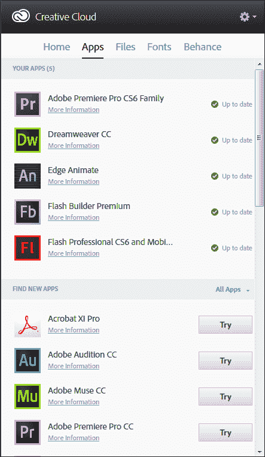
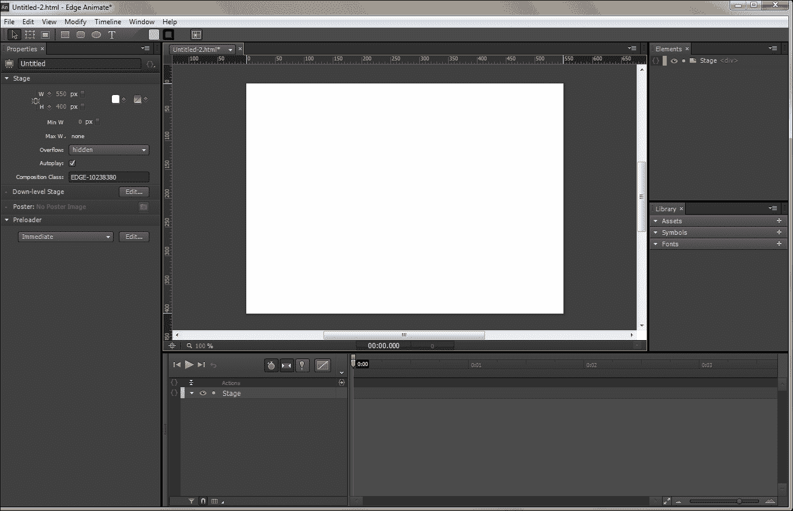
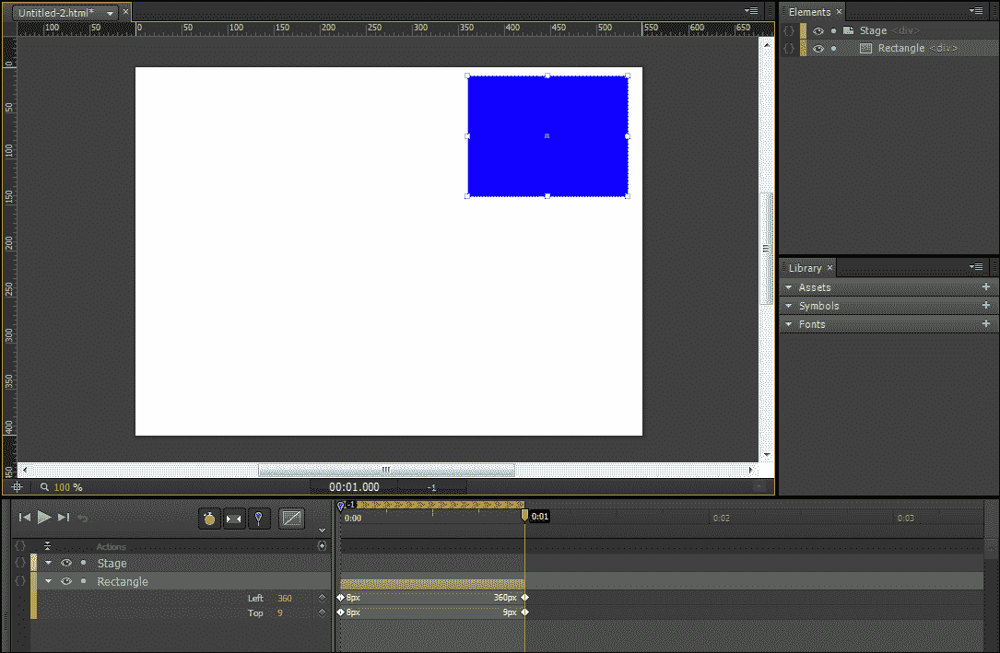
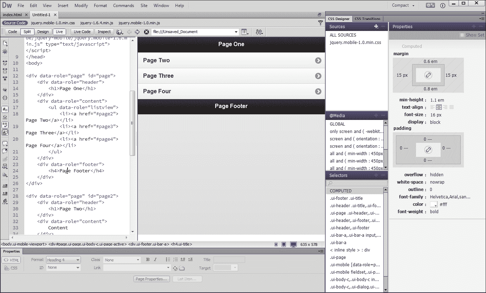
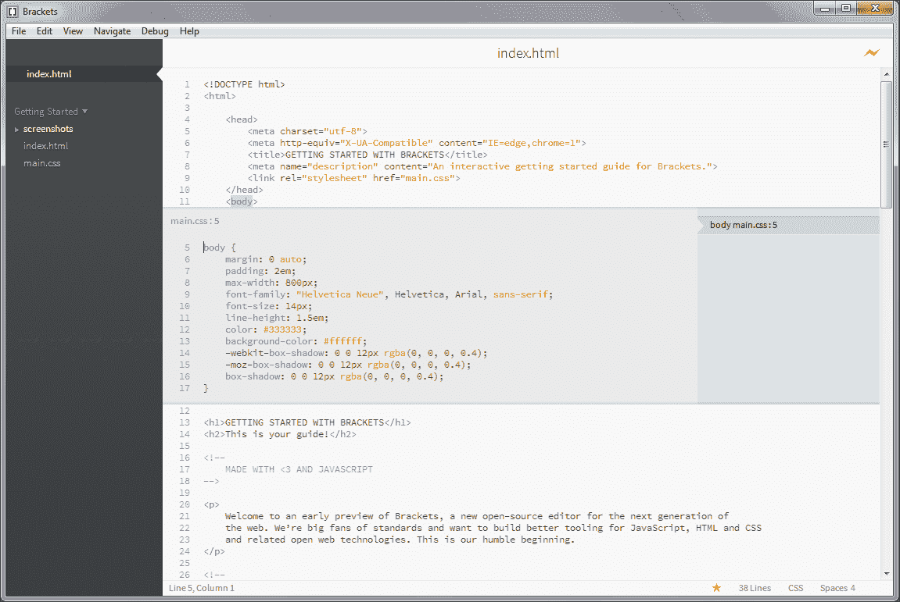
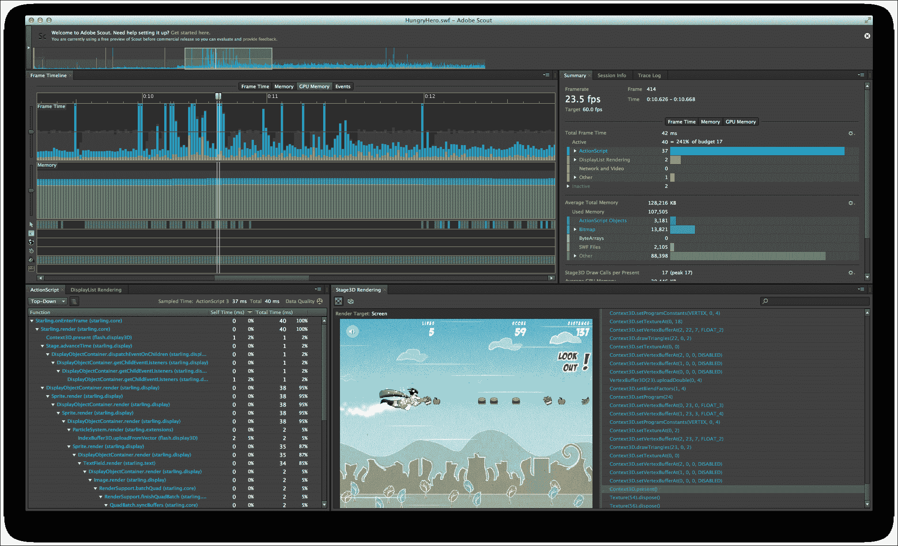
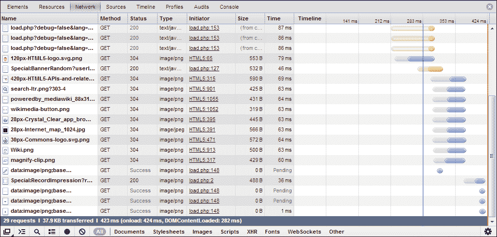

# 七、选择如何开发

进入 HTML5 开发流程将需要您远离在 Flash 开发周期中变得熟悉的应用。Flash Professional、Flash Builder 和 Flash Develop 等应用都是专门为处理 Flash 内容和 Flash 内容而设计的。尽管这些应用很棒，但还有许多类似的 HTML5 开发应用，允许您以非常相似的方式构建丰富的网络体验，这是您所习惯的。本章将介绍放弃使用 Adobe Flash Professional 开发环境的过程，并开始艰难地决定在创建 HTML5 项目时使用什么新的开发软件。虽然你可以使用的优秀软件种类繁多，但这一章将涵盖 web 开发人员目前正在使用的许多新的和流行的应用。

在本章中，我们将介绍以下内容:

*   了解 HTML5 集成开发环境需要什么
*   资产创建和操作工具
*   使用 Adobe Edge 创建交互式动画 HTML5 元素
*   一些最流行的 HTML5 代码编辑器概述
*   用于代码执行和运行时测试的工具

# 替换 Flash 开发环境

在闪存环境中开发应用的最大好处是，Adobe 投入了大量时间构建创意套件中包含的工具和应用，允许您在它们的应用集中创建整个应用。虽然，有一种观点认为，这个系统是有限的，更新缓慢。事实是，当所有正确的工具都可以帮助你构建应用时，进入下一个项目就容易多了。由于它不受某个特定公司的监管或控制，HTML5 开发是一个更加开放的开发平台，因为开发人员可以自由选择如何以及使用什么来构建他们的项目。

我必须强调，在本章中，我们将概述 HTML5 开发人员用来完成工作的许多常见方法和应用。当然，这些应用或方法都不是构建 HTML5 项目的绝对正确的方法，希望你能找到一个适合你所寻找的应用。随着时间的推移，您构建了越来越多与 HTML5 相关的项目，在为手头的工作研究最佳工具时，请务必投入额外的努力。瞬息万变的环境导致很多项目在短时间内起起落落。保持在现有的基础上将有助于让你保持在游戏的顶端，并继续扩展你的 HTML5 开发技能集。

# html 5 开发环境的要求

当涉及到在同一个代码编辑器中编写 HTML、CSS 和 JavaScript 时，大多数开发人员通常会做一些一般的考虑，以确保他们获得适合自己需求的特性集。由于整个 HTML5 堆栈被呈现为纯文本文档，从技术上讲，任何文本编辑器都可以完成这项工作。尽管每个开发人员都有自己独特的设置和开发风格，但仍有许多常见的功能值得关注。

## 资产和文件管理

能够直接在开发环境中预览甚至操作包含在项目中的资产，如图像、视频、音频和其他外部资产，可以让您通过将焦点放在特定的应用中来加快开发流程。像 Adobe 的 Dreamweaver 这样的应用，我们稍后将介绍，是一个很好的例子，它是一个结合了设计和开发过程的软件。值得注意的是，许多简单明了的代码编辑器(将在本章中概述)可能不包含支持简单文件和资产管理的功能。然而，当像这样的大型功能集成不包含在代码编辑器中时，一般的最终结果是一个更快、更轻的应用。

## 代码高亮显示

与任何编程语言一样，代码高亮显示或着色是代码编辑器中必须具备的一个基本特性。轻松理解代码的哪些部分在做什么的能力，将使您不仅可以更轻松地开发应用，还可以帮助您以更少的问题理解其他开发人员的代码。代码突出显示也是确保用正确的语言语法编写代码的关键。为了让代码编辑器能够正确地着色或突出显示您的代码，应用必须能够正确地识别并解析您的代码所使用的特定语言。因此，在试图找到最佳匹配时，密切关注那些支持您打算使用的特定编程语言的代码编辑应用至关重要。幸运的是，在我们的例子中，HTML5 开发或 HTML、CSS 和 JavaScript 开发得到了许多可用的代码编辑应用的广泛支持，因此您的选择数量非常多。

## 代码完成

在您选择使用的代码编辑器中内置良好的代码完成功能，对于尝试学习一种新的编程语言会有巨大的帮助。如果你在你的 Flash 开发生涯中花了时间使用 Flash Builder，我相信你已经看到了你能以多快的速度写出好的工作代码。尽管如此，一些开发人员认为代码完成只是创建了一个懒惰的开发人员，避免记住语言语法中的任何细节。现实情况是，从新手到经验丰富的老手，开发人员都使用代码完成来避免编写代码时的延迟，并且通常会加快编写长代码片段所需的时间。

当使用 Flash Builder([http://www.adobe.com/products/flash-builder.html](http://www.adobe.com/products/flash-builder.html))或 Flash Develop([http://www.flashdevelop.org](http://www.flashdevelop.org))等开发环境开发 Flash 应用时，您会看到利用代码完成的最佳案例场景之一。由于这些代码编辑器是专门为编写 ActionScript 3 而构建的，因此它们可以通过关注 ActionScript 3 API 中的可用内容来优化这种开发体验。

实际上，在开发 HTML5 或许多其他语言时，有两种形式的代码完成。显而易见的形式是在您键入时自动完成文本。例如，当您键入一个声明的变量名并点击*时。*键准备指定对象上的属性。有些编辑器会在活动代码行下面生成一个下拉菜单，其中包含一个可用属性列表，您可以将这些属性附加到当前对象上。当学习一门新语言时，这种形式的代码完成会非常方便，因为当你开发时，它就在你面前展示了可用的可能性。代码完成的第二种形式是生成更大的代码片段。例如，当您试图通过在代码编辑器中键入单词`function`来声明一个新函数时，一些编辑器会识别出这一点，并自动为您生成默认的函数布局。你所要做的就是填写内部代码，你就完成了。一些开发人员对这个特性有问题，因为它可能无法生成符合其确切规范的代码，但是现在许多编辑器支持修改预先存在的代码片段，甚至添加您自己的代码片段。

## 创建和操纵资产

作为一名有过在 Flash 中创建应用经验的开发人员，您可能已经习惯了使用 Flash Professional 开发环境，不仅将您的应用资产文件存储在 SWC 文件中以供项目包含，还可以构建整个项目。在功能丰富的开发环境(如 Flash Professional)中处理项目资产的能力是 Flash 最初如此受欢迎的原因之一。当转向 HTML5 开发时，失去这样一个构建和操纵资产的伟大开发环境将是一种耻辱。幸运的是，随着 HTML5 的蓬勃发展，许多令人兴奋的新项目和应用已经发布，将这种类型的资产控制带到了网络开发周期中。

### 土坯边缘动画

随着 Adobe 将其产品发展为完全基于云的软件设置，他们还推出了许多基于 HTML5 的项目，允许网络开发人员在传统的 Adobe 用户友好环境中轻松创建 HTML5 内容。Adobe Edge 是该系列中最新、最令人兴奋的软件之一。Edge 允许轻松创建交互式和动画 HTML5 内容，所有这些都在一个点击用户界面内。本质上，当在 HTML5 堆栈中使用 HTML、CSS 和 JavaScript 进行开发时，您可以将 Edge 视为 Flash IDE 的替代品。尽管这款软件的能力远不及闪存 IDE 目前支持的能力，但自发布以来，它的功能支持一直在以指数级的速度增长。

通过登录 Adobe 的应用管理器，可以免费下载 Adobe Edge 。前往[http://html.adobe.com/edge/animate](http://html.adobe.com/edge/animate)下载 Edge，并注册一个 Adobe 帐户，如果你还没有这样做的话。设置好帐户后，在应用管理器中找到**边缘工具&服务**部分，并将软件下载到您的计算机上。值得注意的是，如上所述，这种新的基于云的软件交付系统是 Adobe 正在走向的新方向，以便更容易地访问他们目录中的软件。您可以通过单击每个可用软件描述下的**尝试**链接，轻松测试 Adobe 的任何其他产品，如下图所示:



一旦你成功下载并安装了 Edge，启动它，你就可以第一眼看到用户界面了。虽然它不完全像您可能习惯的 Flash Professional 用户界面，但您可能会看到许多相似之处，这些相似之处将使您能够轻松地集成您从 Flash、Photoshop 等获得的现有 Adobe 用户界面技能:



让我们花点时间来概述一些令人兴奋的功能，以及 Edge 对独特功能的支持，例如CSS3 滤镜和动画。我们可以像大多数人一样，从一个简单的蓝色盒子开始，我们的用户界面领域的 Hello World。默认情况下，主工具栏位于窗口顶部，方形工具很容易在以下位置找到:


值得浏览一下工具栏中的其他一些工具，因为它们非常熟悉，而且不言自明。不管怎样，我们很快会回来检查的。现在，我们将选择方形工具，并在用户界面中呈现的舞台上绘制一个合适大小的矩形。请注意，此过程与在闪存中创建内容非常相似:


默认情况下，您的形状不会是蓝色的，因此将其放置在舞台上后，将头转向位于应用窗口左侧的**属性**面板，并使用颜色选择器修改形状的颜色。

当我们的框准备好进行动画制作时，让我们将焦点向下移动到应用窗口底部默认显示的**时间线**面板。如上所述，如果您花了任何时间使用 Flash Professional 和基于时间线的动画，Edge 中的这项功能不仅会让您熟悉，而且可能也会让您兴奋。如果时间线动画的概念对您来说是新的，那么它就是在设定的时间内控制应用视图中的元素的过程。通过定义资源随时间变化的动画方式，您可以轻松控制它们在特定回放间隔内的行为。为了演示这一点，我们将使用时间轴在舞台周围制作新的蓝色矩形的动画，在舞台移动时对其应用不同的效果和属性。

首先，我们将启用切换针，它将允许我们在动画时间线的关键帧内设置元素的新状态。切换销位于顶部按钮导航的**时间线**面板中。它用蓝色大头针标记表示:


激活切换针后，当时间线设置到新位置时，对元素的任何更新都将仅应用于该新关键帧。产生的动作将是在给定时间段内自动创建的补间动画。

通过将时间轴上的播放头拖到 1 秒，我们现在已经告诉 Edge 开始对舞台上的任何元素应用新属性。因此，让我们将蓝框从舞台的左上角拖到右上角，然后点击空格键来查看生成的动画:



当然，在文本中，你将不得不相信我的话，但最终的动作是你在 Flash 中补间元素时所习惯的动作。当播放头在 1 秒钟从 0 秒钟移动到我们的新关键帧时，蓝色框的位置会自动更新，以从开始到结束动画显示该位置。虽然这个例子很简单，但它不仅展示了 Edge 与 Flash Professional 的许多极其相似的方面，而且突出了 Edge 所做工作的核心。

让我们花更多的时间检查一下**属性**面板中的可用内容，看看我们的蓝盒还能做些什么。在不太深入**属性**面板的每一个细节的情况下，最简单的总结方式是，它显然受到了 Flash Professional 中**属性**面板的启发。尽管 Edge 中的一些可用属性不同于 Flash，但布局和样式几乎相同。如果您对 Adobe Edge 感兴趣，那么花点时间查看当前版本中的一些可用属性是值得的。我还建议在测试时，从桌面到移动设备，尽可能多地在您可以使用的浏览器中打开发布的文件。了解不同设备和平台对 HTML5 动画负载的反应，以更好地判断未来应用的发展方向。

当然，在开发或测试阶段的任何时候，您都可以选择**文件**菜单中的**在浏览器中预览**选项，以查看您当前项目在实际网络浏览器中的外观和感觉。这也是一个挖掘生成的源代码的绝佳时机，以便更好地了解 Edge 编译器实际上为我们做了什么。

Edge 将应用源代码构建为 HTML、CSS 和最小化的 JavaScript 文件，并以`YOUR-PROJECT-NAME_edgePreload.js`的文件名保存 JavaScript 数据。尽管这种最小化的 JavaScript 很难阅读或理解，但它被设置为尽可能小的文件大小，以优化最终用户通过互联网检索时的加载。

Adobe Edge 还包含一个内置的代码编辑器，允许您轻松地将代码追加到您的 Edge 项目中，进一步扩展您的网络应用的功能。这个代码编辑器，虽然使用方式略有不同，但对于任何在 Flash IDE 中编写过动作脚本的人来说，都是一个非常容易识别的面板。在代码编辑面板中，您会发现一组代码片段，只需单击一下就可以将其追加到项目中。从在元素上添加像 play 方法调用这样简单的特性，到动态创建和销毁元素的新实例，内置的代码片段可以让您轻松上手。代码编辑器还可以通过仅显示操作元素所需的内容来简化代码显示。这可以通过选择代码窗口右上角的**完整代码**选项卡来切换，这将导致显示整个项目 JavaScript 文档源。

## 编码环境

通常，创建 HTML5 项目的大部分工作将在一个环境中进行，该环境被设置为允许您在同一位置编写 HTML、CSS 和 JavaScript。因为所有这些不同的开发语言都包含在纯文本文件中，所以在选择可以使用的编辑器时没有具体的要求。然而，随着 HTML5 成长为一个更加进化的网络和应用开发平台，对支持媒体集成、代码格式化和完成、设备测试和调试等功能的平台的需求几乎已经成为必须。许多在 HTML5 之前就已经存在的软件标题已经更新了它们的特性集，以包括对 HTML5 开发的支持，并增加了新的特性，以使网络开发更加容易。这方面的一个完美例子是最新版本的创意套件中包含的最新版本的 Adobe Dreamweaver。

### Adobe Dreamweaver CS6

由于您应该已经对 Adobe Creative Suite 有些熟悉，我们将从 Adobe 的 Dreamweaver 开始概述 HTML5 代码编辑器。从版本 3 开始，Dreamweaver 就成为了创意套件的一部分。虽然您可能会发现许多网络开发人员对 Dreamweaver 有一种或爱或恨的关系，因为如果您购买了 Creative Suite，它很容易访问，但许多网络开发人员曾在某个时候使用过它。无论您以前是否使用过 Dreamweaver，现在需要注意的重要一点是，Adobe 已经添加了大量专门与 HTML5 web 开发相关的新功能，以帮助您的整个开发周期:


我不会对 Dreamweaver 的使用做太深入的探讨，因为网络上有很多优秀的书籍和教程可以帮助你开始学习它的功能集和用户界面。然而，我将概述 Dreamweaver CS6 包含的一些令人兴奋的新功能，这些功能允许网络开发人员轻松地将 HTML5 元素和功能集成到他们的网络项目中。值得注意的是，在撰写本书时，其中许多功能仅在 Creative Cloud 上对 Dreamweaver CS6 的第二次更新中可用。拥有本机安装版本的 Dreamweaver 的用户目前运气不佳。如果您有兴趣亲自测试其中一些功能，请从创意云下载 Dreamweaver 的 30 天试用版，并尝试一下。

#### 音视频嵌入

对 Dreamweaver CS6 的最新更新增加了一些新的功能，包括将 HTML5 就绪的音频和视频文件包含和操作到您的文档中。与许多可以导入 HTML5 项目的媒体形式一样，现在只需点击几下鼠标，就可以轻松地从项目源目录中选择音频和视频并将其放入文档。设置元素属性，如自动播放、启用回放控制，甚至设置海报图像，都可以直接在 Dreamweaver 用户界面中完成。此过程不仅可以确保您按照正确的语法规范开发媒体播放代码，还可以轻松地为仅支持特定文件类型的浏览器和平台设置播放选项。

#### 土坯边缘支持

由于您已经了解了 Adobe Edge Animate 的一些功能，您可能会理解为什么将 Adobe Edge 直接集成到 Dreamweaver 中对网络开发人员来说是一个巨大的胜利。您现在可以将交互式和动画元素无缝集成到您的 Dreamweaver 项目中，而不是手动剥离 Adobe Edge 项目中的导出数据并将其应用到您自己的项目中。如果您有幸使用 Flash Professional 中的 **从 Photoshop 导入**功能节省了几个小时，您将很容易理解这种跨应用的交流如何为您节省无数个小时的开发时间。

#### PhoneGap 和 jQuery Mobile 支持

您可能会惊讶地得知 Adobe 实际上在 jQuery Mobile 框架的开发中扮演了重要角色。似乎这种关系仍然很牢固，因为 Adobe 继续将其对 jQuery Mobile 的全面支持从 Dreamweaver CS5.5 扩展到 CS6。最新的 jQuery Mobile 功能更新使 jQuery Mobile 项目主题化变得非常容易:



正如您在前面的截图中看到的，jQuery Mobile**samples**面板允许我们在项目的实时视图中轻松选择特定元素，并通过单击鼠标将新的主题属性应用到该元素。产生的代码更新显示为突出显示的更改，向您显示现有文档中已修改的内容。这个特性远远超出了仅仅支持默认的 jQuery Mobile 主题。Dreamweaver 将自动检测附加到项目中的任何自定义主题，并允许您在 Dreamweaver jQuery Mobile **色板**面板中继续操作和实现该主题。您可以将选择深入到网页中的特定元素，也可以修改图标和字体等资源。最流行的 HTML5 移动框架变得更容易使用了。

PhoneGap 用户也没有被冷落。如果您希望将移动项目构建到本机应用中，从开发人员的角度来看，Dreamweaver 已经使它变得非常用户友好。新的 PhoneGap **构建服务**面板允许您只需点击几下鼠标，就可以为任何支持移动平台构建您当前的工作项目。您的 PhoneGap 构建可以从 Dreamweaver 内部的 PhoneGap 构建服务器发送和下载。在 HTML5 中为五种不同的流行移动平台构建原生应用从未像现在这样简单，也从未像现在这样方便用户。

#### 流体网格布局和 HiDPI 支持

Dreamweaver 中全新的**流体网格布局** 系统允许您从项目创建之初就轻松地针对特定设备定制网页布局。在页面布局中激活网格系统后，您可以开始精确指定特定元素可以占据多少列。如果浏览器窗口被调整大小或页面被加载到高于或低于目标屏幕分辨率的显示器上，网格系统将通过更新显示多少列来自动响应变化。在网页中布局元素的概念并不新鲜。然而，随着这么多现在可以访问您的内容的设备的发布，保持在现代显示规范之上的要求可能会减少。Adobe 已使 Dreamweaver 用户能够轻松集成优化的条件集，从而实现轻松响应的网页设计:


今天我们看到移动和桌面屏幕的像素密度越来越高。需要合适的环境来允许开发人员在这些显示器上进行测试，即使他们无法访问这些显示器，也是必须的。Dreamweaver 现已将**【HiDPI】**支持集成到一个易于使用的用户界面中，使特定显示类型的测试变得轻而易举。

### Aptana

如果你是从主要存在于 Flash Builder 中的 Flash 开发背景来的，那么 Aptana([http://www.aptana.com](http://www.aptana.com))可能值得一看。Aptana 构建在 Flash Builder 创建的同一个 Eclipse([http://www.eclipse.org](http://www.eclipse.org))编辑器上，为许多 Flash 开发人员带来了一个极具辨识度的代码开发用户界面:


Aptana 包含大量专为帮助网络开发而设计的优秀功能。代码辅助功能已经到位，有助于 HTML、CSS 和 JavaScript 语法，部署向导可以轻松地将自动文件更新集成到您的公共 web 服务器上。Aptana 还包含对 Git 集成的内置支持，因此您可以轻松地为您的项目集成版本控制支持。像 Flash Builder 一样，Aptana 允许您轻松地同时将多个项目添加到应用中。当从您在其他地方添加的功能中引用源代码时，将来自多个项目的代码放在您面前可以很容易地节省您的时间。Aptana 是免费使用的，开源的，并由一大群贡献者积极开发。

### 括号

作品中最新的和最激动人心的 HTML5 代码编辑器之一是 Adobe([http://brackets.io/](http://brackets.io/))的括号。这个开源编辑器不仅是专门为 HTML5 开发人员设计的，而且应用本身实际上是用 HTML5 堆栈编写的，允许您轻松定制编辑体验。

括号实际上是一个惊人的表示，表明了在过去的几年里，HTML 的发展已经走了多远。使用网络技术创建如此丰富的交互环境来操作计算机上的本地文件的能力只是迈向完全基于网络应用的生活方式的又一步。

括号仍处于早期开发过程中，但已经处于可供今天任何人使用的可用状态。尽管是用 HTML、CSS 和 JavaScript 编写的，但由于它是作为桌面应用打包和运行的，因此它可以轻松地在本地机器上创建和操作文件。

要开始使用支架，您需要前往项目网站获取最新版本的链接([http://download.brackets.io/](http://download.brackets.io/))。与许多开源项目一样，作为最终用户，您将可以选择下载预打包的软件版本，该版本通常是最稳定的。或者，您可以下载项目贡献者正在积极开发的夜间或最新开发版本。正如您可能假设的那样，开发构建是不稳定的，并且可能会在使用时导致一些问题。然而，如果你愿意勇敢面对有缺陷软件的风暴，那么你在使用它时所拥有的信息和经验对于从事该项目的开发团队来说是极其重要的。您在使用过程中可能遇到的提交问题和错误应记录在其 GitHub 项目帐户([https://github.com/adobe/brackets/issues](https://github.com/adobe/brackets/issues))的括号内**问题跟踪器** 。

出于示例的目的，我将下载该软件的最新预打包稳定版本，向您展示支架必须提供的一些令人兴奋的功能。下载并运行安装程序后，在您的 Windows 或基于 OS X 的机器上打开应用。在应用的初始启动时，您将看到一个默认的示例设置，如下图所示:


正如你在之前的截图中所看到的，这个界面虽然对你们很多人来说很熟悉，但是非常简单，而且风格和布局也很优雅。

#### 内联编辑

目前支架中最酷的特性之一是它易于使用的内嵌代码编辑系统。作为一名网络开发人员，你会发现自己在开发项目时不仅要从一个程序跳到另一个程序，还要从一个文件跳到另一个包含完全不同的代码语言的文件。为了简化这个过程并加快文档中元素的开发速度，括号允许您选择 HTML 文件中的元素，并查看它们的相对 CSS 样式。为此，请在 HTML 示例文件中选择一个元素，然后按 *Ctrl* + *E* 或 *Cmd* + *E* (取决于您的操作系统)在同一 HTML 文件中直接显示该元素的样式。

您不再需要浪费时间在专用的 CSS 文件中一行行地筛选 CSS 来找到您的元素样式。现在，当您继续编写代码时，括号可以完成所有艰苦的搜索工作:



当显示内联编辑器时(如前面`<body>` HTML 元素标签下的截图所示)，不仅可以轻松编辑与所选元素相关的样式，还会显示一些重要数据。在内嵌样式窗口的左上角是包含相关样式的文档的文件名，文件名旁边是样式所在的行号。

尽管内联编辑的概念很简单，但我们可以通过检查包含多个样式定义的元素的样式来更进一步。例如，查看括号中的以下链接元素会显示许多不同的样式，它们都以某种方式应用于同一个元素。通过在内嵌编辑器中选择不同的定义，您可以轻松地在每种样式设置之间切换、编辑它们，并继续您的工作。当然，这种内联编辑的概念不仅适用于 HTML 和 CSS，它也适用于您的 JavaScript 开发周期。括号背后的团队仍在通过扩展颜色和渐变选择等功能，在应用中构建更多的内联编辑功能。

#### 直播预览

另一个内置在支架中的伟大功能是**实时预览** 。实时预览系统不是传统的编辑代码、保存代码，然后转移到浏览器进行测试的方法，而是在您键入时将其简化为自动测试构建。当应用窗口右上角的**实时预览**按钮被激活时，将打开包含当前工作 HTML 页面的默认系统网页浏览器。如上所述，选择此功能后，您可以继续修改当前文档，并在键入时查看反映的更改:


上面的截图说明了对 body 元素背景色样式属性的更改，将它从白色更改为红色。这个简单的自动保存和重新加载功能只是支架的另一部分，它允许网络开发人员花更少的时间来完成重复的耗时任务。

#### 插件

由于支架是开源的，并且是用它打算用于的相同平台创建的，许多开发人员已经开始为支架创建他们自己定制的扩展和插件。从添加使用鼠标进行自定义代码高亮显示的能力，到添加对代码完成的支持，公共输入的范围已经相当惊人了。当然，你不必依赖公众来让新功能进入支架。如前所述，整个项目是用你在本书中学到的技术构建的。因此，如果你愿意尝试，尝试在支架中添加一些新的独特功能可能是一个很好的学习项目。

#### 贡献

支架最大的优点不仅在于它是完全开源的、免费提供的、积极开发的，而且整个应用都建立在 HTML5 堆栈上。随着您的网络开发技能集的增长，支架项目可以成为一个扩展和与世界其他地方分享您的开发技能的绝佳场所。开发团队不断追加公众提交的更新和修改，并始终要求用户提供进一步的意见。由于支架仍然在开发烤箱中烹饪，现在是一个很好的时机来加入进来，帮助创建下一个大的 HTML5 代码编辑器。所有项目信息都可以在项目网站页面以及项目 GitHub 页面中找到。如果你想潜得更深，跳上救援委，在[freenode.net](http://freenode.net)上查看`#brackets`频道。

### 升华文本

如果像括号这样的轻量级代码编辑器更适合你，那么崇高文本是另一个值得一试的编辑器([http://www.sublimetext.com](http://www.sublimetext.com))。Sublime 简单且重量轻，支持大量现成的编程语言，因此它不仅仅可以用于 HTML5 开发:


威震的多文本选择功能值得注意。当处理较大文档的代码时，对大量文本进行相同编辑的需求，如间距，似乎出现了不少。为了缓解这个问题，崇高使用多文本选择和编辑功能，使您可以轻松修改同一文档的许多部分，只需一次更改:


正如您在前面的截图中所看到的，崇高还包括一个最小化的代码布局，使您可以根据代码的外观轻松定位代码的特定部分。虽然听起来很奇怪，但令人惊讶的是，它真的很有效。Sublime 还有很多其他优秀的特性，使它成为我个人最喜欢的代码编辑器之一。

威震可在视窗、OS X 和 Linux 上免费下载和安装，并无限期使用。但是，要删除购买警告，可以从崇高文本网站([https://www.sublimetext.com/buy](https://www.sublimetext.com/buy))购买 70 美元的许可证。

# 执行和测试

到目前为止显示的许多软件标题都包含了自己的方法来帮助您测试和调试您的网站和应用。然而，需要测试的技术数量正在以一定的速度增长，这使得特定的软件很难保持领先。拥有一个由不同应用和服务组成的库，不仅可以让你测试项目的许多不同方面，还可以在这个过程中节省大量时间。

## 网络浏览器开发者控制台

虽然我们已经在本书中花了一些时间来研究许多流行的浏览器开发人员控制台中包含的一些功能，但是在考虑前端执行基准和测试时，控制台的其他一些方面也值得研究。随着项目规模和复杂性的增长，花时间优化应用的流程和执行的要求也随之增长。如果您曾经有机会使用 Adobe Flash Profiler 或 Adobe Scout 深入了解您的应用在运行时是如何工作的，您可能已经了解了这种预防措施的好处:



前面的截图来自新的 Adobe Scout([http://gaming.adobe.com/technologies/scout/](http://gaming.adobe.com/technologies/scout/))分析工具，游戏开发者使用这些工具来查看他们的游戏内部正在发生的事情。不幸的是，离开闪存开发领域意味着放弃使用像 Scout 这样伟大的新应用和概要文件，然而，作为一名 HTML5 开发人员，有许多替代方案可供您选择，我们只需要去寻找它们。

### 类型

在 2013 年 Adobe Max 会议期间，讨论了专为作品中的 HTML5 开发而构建的新版 Adobe Scout 的细节。请留意 Adobe 网站上这个神奇工具的发布日期。也可以在[http://TV . adobe . com/watch/max-2013/adobe-scout-profiling-take-to-next-level/](http://tv.adobe.com/watch/max-2013/adobe-scout-profiling-taken-to-the-next-level/)观看大会的视频演示。

我们已经花了一些时间来研究当今许多流行的网络浏览器中的 JavaScript 或网络开发人员控制台，但是这些面板包含了更多的功能，可以帮助在向公众发布项目之前对其进行测试和基准测试。

### 网络分析

网络浏览器中的许多开发人员控制台包含网络控制台，允许您从用户的角度可视化网页中的数据是如何加载的。在加载页面之前打开控制台，当页面被加载时，实时数据被传递到一个易于阅读的表中，该表可以准确显示正在加载哪些文件，加载是否成功，资产的文件大小是多少，以及加载所需的确切时间:



结合所有这些数据可以很容易地让您在网页中找到开发阶段可能遗漏的问题。需要注意的一点是，一旦页面完全加载，总页面加载大小是多少。记住用户连接到互联网的各种方法和速度，当试图优化项目中使用的资产的文件大小时，首先考虑终端用户总是明智的。

### 时间线分析

使用许多常见的内置时间线分析工具，您可以点击记录按钮并准确捕获运行时应用罩下发生的事情。当捕获到事件时，它们会实时显示，并与总内存使用量一起显示。当试图定位应用中可能发生任何潜在内存泄漏的位置时，这些数据会非常有帮助:


如果其中一些形式的应用分析方法对您来说是陌生的，不要担心，我们将在接下来的章节中更多地介绍这个主题。花时间检查你的网站和应用在不同平台上的实际运行情况，可以在发布后为你省下一大堆麻烦。

## Stats.js

处理 Flash 中每秒**帧**或 **FPS** 的概念是经常发生的事情。由于整个平台是建立在时间线的概念上的，让你的应用以特定的 FPS 或最大 FPS 运行通常是每个 Flash 项目的最终目标。在你的 Flash 开发生涯中，可能有一次你遇到了，甚至使用了杜博先生的 Hi-ReS Stats 脚本([https://github.com/mrdoob/Hi-ReS-Stats](https://github.com/mrdoob/Hi-ReS-Stats))的一个版本。这段很棒的小代码允许您轻松地在应用上添加一个覆盖图，显示 FPS 随时间的变化以及应用当前使用的内存量:


在前面的例子中，你可以从一个伟大的 Flash 资源网站 WonderFl([http://wonderfl.net/c/6fCf](http://wonderfl.net/c/6fCf))上找到的原型中看到，统计脚本被用来显示这个魔方应用在使用时的运行情况。当试图在项目执行中找到可能导致问题的位置时，这是非常方便的。

虽然在 HTML5 开发中 FPS 的想法并不完全相同，因为静态 HTML 页面在加载期间或加载之后没有活动的 FPS。然而，当在 JavaScript 中处理动画和计时器间隔时，可以像我们在 Flash 开发中已经习惯的那样使用 FPS 概念。多亏了杜博先生的工作，曾经只存在于 Flash 项目中的`Stats` 脚本现在也可以在你的 HTML5 项目中使用了。

访问[https://github.com/mrdoob/stats.js/](https://github.com/mrdoob/stats.js/)下载项目最新版本。用 JavaScript 实现`Stats`显示比用 ActionScript 3 稍微复杂一点，但是，它仍然相对简单。看看项目文档中`Stats`显示的示例实现:

```html
var stats = new Stats();
stats.setMode(1); // 0: fps, 1: ms

// Align top-left
stats.domElement.style.position = 'absolute';
stats.domElement.style.left = '0px';
stats.domElement.style.top = '0px';

document.body.appendChild(stats.domElement);

setInterval( function () {
    stats.begin();

    // your code goes here

    stats.end();
}, 1000 / 60 );
```

这里的主要区别在于，您需要创建`Stats`窗口自己绘制计算的间隔。如上所述，由于 JavaScript 不是基于框架的开发范式，所以为应用间隔应用自己的方法是计算每秒帧数等数据的唯一方法。这可以通过在 JavaScript 中使用内置的`setInterval()`方法并手动设置预期的帧速率来轻松实现。由于渲染帧的时间将被有效地模拟，我们可以做一些简单的数学运算来使事情符合我们已经习惯的情况。在前面的例子中，我们已经将间隔持续时间设置为 *1000/60* ，其中 *60* 是预期的每秒帧数值。该计算等于*16.6666666666667*，即在一秒内对 60 个间隔求和的毫秒值。因此在创建`Stats`对象并用`setMode()`方法设置显示模式后，您还需要在显示器上手动设置显示位置。

在接下来的章节中，我们将继续深入挖掘其中的一些应用，并概述更多有助于项目测试和基准测试的平台。正如我在前几章中提到的，仔细检查您完成的项目以测试执行时间、内存使用和浏览器性能的重要性对于确保您可以相信每个人都可以按照您在设计中的意图查看您的内容是极其重要的。 Web 开发缺乏 Flash 编译器在运行前自动优化我们的应用的优势。这项工作取决于你，以确保你的程序顺利运行。

# 总结

有一件事我可能怎么强调都不为过，那就是尽可能多地出去探索不同的应用和其他服务对你来说有多重要。作为网络开发人员，你对可用工具的了解越多，你就越能判断什么是适合手头工作的工具。如果还没有深入了解的话，虽然在很多方面都很相似，但是 HTML5 的开发更像是一种开放的开发风格。不需要使用特定的应用集，你可以随心所欲地做和使用。这一章几乎没有触及开发人员目前使用的一些流行应用的表面。然而，我希望有了这个软件的概述，你就可以开始开发你自己的 HTML5 应用，并使用最适合这项工作的工具。

在下一章中，我们将了解一些流行的选项，这些选项不仅可以将 JavaScript 编译成其他编程语言，还可以将其他编程语言编译成 JavaScript。