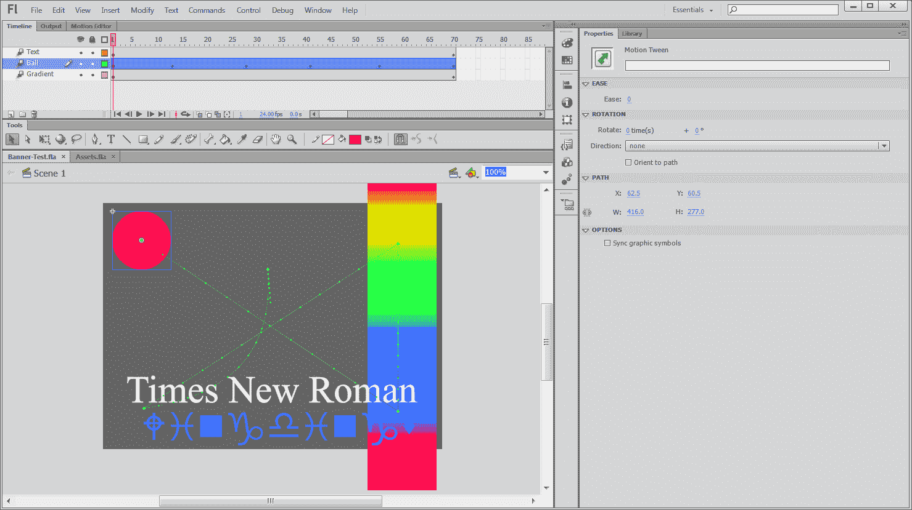
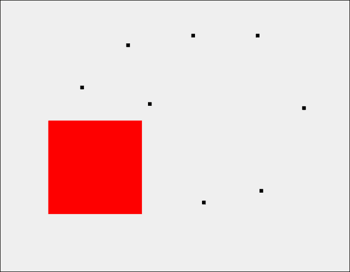
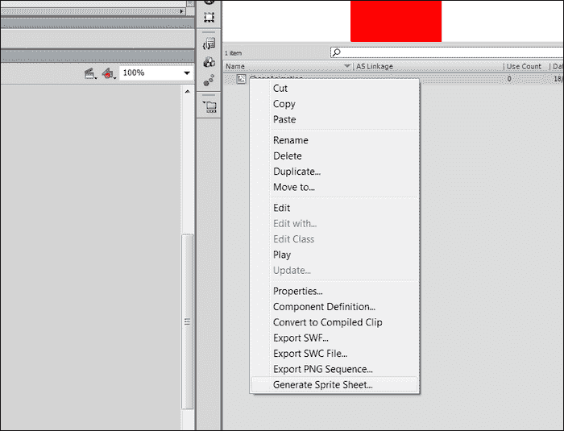
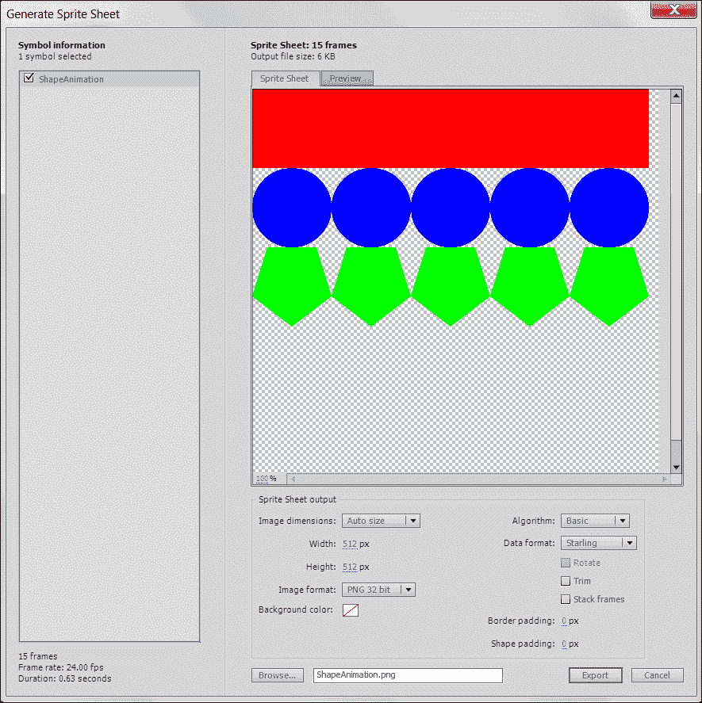
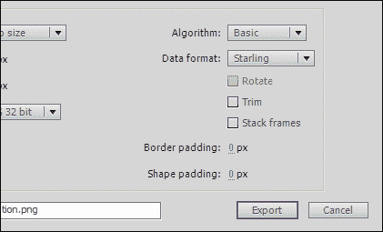
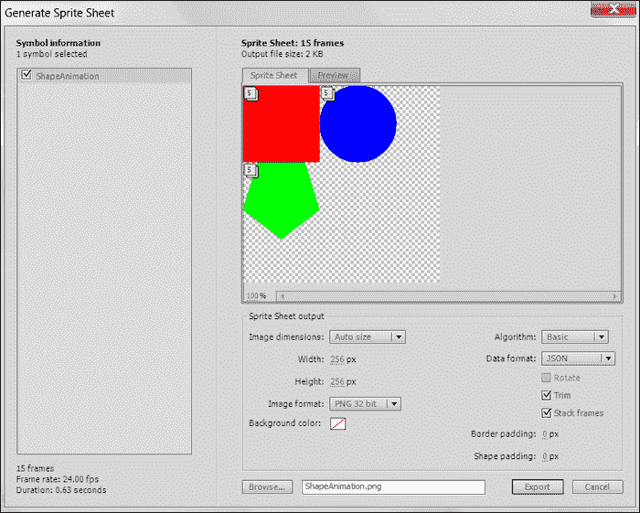
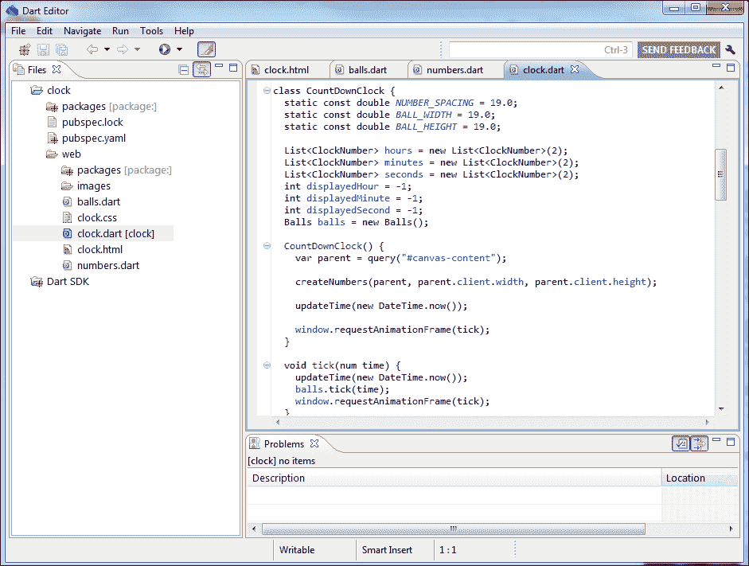

# 八、导出到 HTML5

在[第 5 章](05.html "Chapter 5. Code Once, Release Everywhere")、*代码一次、发布无处不在、*中，我们花了一些时间学习 CreateJS JavaScript 框架以及 Flash Professional CS6 的 CreateJS Toolkit 插件([http://www.adobe.com/ca/products/flash/flash-to-html5.html](http://www.adobe.com/ca/products/flash/flash-to-html5.html))以及它们如何能够轻松地将您已有的 Flash 开发知识直接集成到 HTML5 项目中。在过去的一年里，Adobe 已经采用这个框架作为在您的 HTML5 项目中使用基于 Flash 的资产的官方方式。也就是说，当试图将基于 Flash 的应用和游戏直接移动到纯 HTML5 中时，实际上有许多其他方法可以达到某种程度上相同的效果。在本章中，我们将继续研究一些第三方工具和应用，这些工具和应用可能有助于您的资产和代码开发流程。

在本章中，我们将介绍以下内容:

*   用谷歌的 Swiffy 从 Flash SWF 自动生成 HTML5 项目
*   手动将动画资源转换为 HTML5 就绪的精灵表
*   用江加罗在动作脚本 3 中编写你的 JavaScript 库和框架
*   使用 Haxe 以单一语言源满足您的所有平台开发需求
*   使用谷歌的 Dart 编程语言构建健壮的网络应用

# 谷歌 Swiffy

由谷歌([https://www.google.com/doubleclick/studio/swiffy](https://www.google.com/doubleclick/studio/swiffy))创建的 Swiffy 项目是将你已经存在的 Flash 应用移植到 HTML5 项目中最简单的方法之一。该项目的目的是接收已经编译好的 Flash SWF 文件，并将其中的数据转换为带有 SVG 矢量动画数据的 JSON 对象。由此产生的 Swiffy 编译的 JavaScript，然后可以在谷歌 Swiffy 运行时的帮助下直接在现代网络浏览器中运行。

虽然这个项目还在测试阶段，有很多限制，但是 Swiffy 支持用 ActionScript 2 和 ActionScript 3 编写的 Flash 项目，让你可以避免考虑手动将你的 AS2 转换成 AS3 项目。在您的项目中，对更复杂的 Flash 资产的支持正在以稳定的速度增长，但是，在使用之前，值得您花时间查看项目网站上的当前浏览器和功能支持列表，因为它可能无法完全覆盖您打算转换的应用(https://www . Google . com/double click/studio/swiffy/getting started . html)。Swiffy 中的 ActionScript 3 支持仅限于在特定的类中使用特定的方法，以确保转换可以正常进行。在撰写本书时，Swiffy 中的 ActionScript 3 支持包含以下限制:

*   不支持异常处理
*   不支持可选参数
*   不支持 XML 处理
*   对象初始化和构造的顺序不是恒定的

您可以在项目网站的 Swiffy ActionScript 3 Support 页面(https://www . Google . com/double click/studio/Swiffy/ActionScript 3 . html)上找到当前 action script 3 支持的完整、最新文档。如果您转到动作脚本支持页面，您可以更好地了解哪些类和方法可以在您的闪存应用中使用。如果您的应用超出了项目支持页面中列出的受支持属性，则您的应用极有可能无法正常转换。

## Swiffy 是如何工作的？

为了了解 Swiffy 的工作原理，并直接查看输出和限制，让我们创建一个简单的 Flash 应用，并将其转换为 HTML5，然后查看发生了什么。我们将从 Swiffy 转换的最佳情况开始。我们的 Flash 项目将包含完全在 Flash Professional IDE 中创建的资产和动画，暂时避免使用任何动作脚本。为了使这个例子更接近真实世界的例子，我们可以假设这个 Flash 应用是一个预先存在的横幅广告或其他简单的 Flash 电影，我们希望在移动设备或任何其他无法访问 Adobe Flash Player 的设备上显示:



虽然前面的例子很丑，但它实际上代表了一些需要测试的重要因素。首先，我们有一个围绕舞台运动的圆。其次，我们有一个填充了渐变背景色的矩形，同样是矢量格式。最后，我们有两行文本:一行是简单使用**倍新罗马**字体，另一行是测试更复杂的字体，如**翁丁斯**。就像这两个形状一样，文本将在回放时在舞台上被动画化。这个测试的想法是看看 Swiffy 如何处理极其常见的 SWF 设置，即时间线修改元素。为了使这个测试不那么复杂，我们也将省略任何动作脚本，并假设时间线将无限循环。

创建好时间线后，我们就可以将这部电影的 SWF 输出到我们的项目目录中。Swiffy 生成其网络就绪输出所需的只是从您的 Flash 项目创建的单个 SWF，因此打开网络浏览器，前往 Swiffy 项目网站([https://www.google.com/doubleclick/studio/swiffy](https://www.google.com/doubleclick/studio/swiffy))。

### 类型

在写这本书的时候，Swiffy 将允许你上传任何大小等于或小于 1 MB 的 SWF 文件。

当您准备好转换您的 SWF 时，请使用项目网站首页上的表单将您的 SWF 上传到 Swiffy 服务器。结果应该只需要一两分钟就能出现，如下图所示:


结果应该显示类似前面截图的内容。转换后的 SWF 预览将出现在网络就绪显示中，以及所有输出消息和下载输出的链接。每个 SWF 转换页面上提供的二维码将允许您在移动设备上轻松测试生成的源代码，以验证它是否正常工作。如输出页面上所示，您可以通过右键单击外部输出示例的链接(在本例中为`Banner-Test.html`)轻松下载 HTML 文档以及所有其他数据，并以这种方式保存引用的页面。

## 检查 Swiffy 生成的代码

将内容保存到您的本地机器上后，让我们花一点时间来回顾一下到底做了什么，以及如何将这一资产移植到预先存在的网站上。打开打开 HTML 文件后，首先要注意的是外部库的使用:

```html
<script src="https://www.gstatic.com/swiffy/v5.0/runtime.js"></script>
```

这个 JavaScript 调用正在从谷歌文件服务器导入谷歌 Swiffy 运行时，并且需要正确显示它后面的数据。就像 CreateJS 一样，已经创建的代码是 JavaScript 的混合，需要一个最终的解释器才能正常运行。关于斯威夫特，这是一件非常重要的事情。如果添加了 Swiffy 生成的任何资产，包含`runtime.js`文件是您项目的绝对要求。

在 Swiffy 运行时包含之后，您将会注意到包含在更多 HTML `<script>`标签中的一大块文本。以下是它的一个片段:

```html
swiffyobject = {"tags":[{"frames":[],"scenes":[{"name":"Scene 1","offset":0}],"type":23},{"bounds":[{"ymin":0,"ymax":2240,"xmin":0,"xmax":10399}],"id":1,"fillstyles":[{"transform":["4738D::1056F199e20k"],"type":2,"gradient":{"stops":[{"color":[-65536],"offset":[0]},{"color":[-256],"offset":[42]},{"color":[-16711936],"offset":[93]},{"color":[-16711681],"offset":[127]}….
```

这些数据是 JavaScript 对象，它代表原始 SWF 中包含的资产和动画的所有数据。由于我们的示例不包含位图图像，并且其中的所有内容都是基于矢量的，因此整个应用已经被编译成 100%的代码，并且可以用几行 JavaScript 来显示:

```html
var swiffyElement = document.getElementById('swiffycontainer');
var stage = new swiffy.Stage(swiffyElement), swiffyobject);
stage.start();
```

## 寻找斯威夫特的极限

所有这些都很好，直到我们开始把事情变得更复杂一点。在下一个例子中，我在 ActionScript 3 中创建了一个非常简单的游戏。游戏的思路是通过在可见舞台周围移动鼠标来控制盒子在舞台上的位置。久而久之，你的盒子会开始变大，在舞台上占据更多的空间。游戏的目标是尽可能长的时间，不要让你的盒子碰到任何随机移动的黑点。为了简单起见，我没有在这个游戏中包含任何用户界面。所有的结果和输出暂时只是发送到 web 浏览器开发者控制台。与往常一样，您可以查看工作表单中的示例，因为它包含在可下载的章节示例文件中:



是的，它非常粗糙，但是它以可管理的代码行覆盖了闪存应用的许多常见方面，这对于我们的演示目的来说是完美的。如上所述，游戏中没有用户界面，因为任何游戏输出都将被发送到闪存输出调试窗口。在继续之前，让我们先看一下代码，这样您就可以注意到已经使用的特定特性、类和变量类型:

```html
package {

  import flash.display.MovieClip;
  import flash.events.Event;
  import flash.events.MouseEvent;

  // Setting the frame rate is important here as we calculate
  // the users score from how many frames have passed.
  // It's worth noting that the TimerEvent class can be used
  // without any issue by applications converted with
  // Google Swiffy.
  [SWF(backgroundColor="0xEFEFEF", width="1024", height="768", frameRate="30")]

  public class PlayerMoveTest extends MovieClip {
    // Setting a static const variable, defines
    // how many bad guy dots to add to the stage.
    private static const BAD_GUY_COUNT:int = 10;

    // The 'Player' class is a red box created and defined
    // within an SWC included into this project.
    private var _player:Player;

    // An array to hold all of the bad guys created
    // when the game is created.
    private var _badGuys:Array;

    private var _lifeTimer:int;
    private var _playerTarget:Object = new Object();

    /**
     * PlayerMoveTest Constructor
     */
    public function PlayerMoveTest() {
      // Start by creating and adding all of the bad
      // guys to the game stage.
      _badGuys = new Array();
      for(var i:int = 0; i < BAD_GUY_COUNT; i++) {
        // Using MovieClips instead of Sprites
        // as Sprites are not supported by the
        // Google Swiffy compiler.
        var badGuy:MovieClip = new MovieClip();
        badGuy.graphics.beginFill(0x000000, 1);
        badGuy.graphics.drawRect(-5, -5, 10, 10);
        badGuy.graphics.endFill();
        badGuy.x = Math.floor(Math.random() * (1000 + 1));
        badGuy.y = Math.floor(Math.random() * (700 + 1));
        _badGuys.push(badGuy);
        addChild(badGuy);
      }

// Create the users Player object
// Again, this is created within a included SWC.
      _player = new Player();
      _player.x = 100;
      _player.y = 100;
      _playerTarget.x = _player.x;
      _playerTarget.y = _player.y;
      addChild(_player);

      // Add a on enter frame to update the game stage.
      this.addEventListener(Event.ENTER_FRAME, updateEnviroment, false, 0, true);
    }

/**
 * Called on every frame when the game is in a playable
 * state.
 */ 
    private function updateEnviroment(event:Event):void {
      // Update the life timer, used for player score.
      _lifeTimer++;

      // Set the new player position target.
      // this position is based of the current X and Y
      // position of the user's mouse.
      _playerTarget.x = this.mouseX - 50;
      _playerTarget.y = this.mouseY - 50;

// Calculate the distance to the current 
// player target.
      var xDistance:int = _playerTarget.x - _player.x;
      var yDistance:int = _playerTarget.y - _player.y;

      // Update the position of the player object. Use
      // a simple method to ease the position into the 
      // target.
      _player.x = _playerTarget.x - (xDistance * 0.9);
      _player.y = _playerTarget.y - (yDistance * 0.9);
      _player.width += 0.5;
      _player.height += 0.5;

// Randomly move the position of each bad guy on
// every frame.
      for(var i:int = 0; i < BAD_GUY_COUNT; i++) {
        _badGuys[i].x += Math.round(Math.random() * (15 - (-15)) + (-15));
        _badGuys[i].y += Math.round(Math.random() * (15 - (-15)) + (-15));

// Using the common hitTestObject method 
// to check and see if any of these bad guys 
// are currently touching the player object. 
        if(_player.hitTestObject(_badGuys[i])) {
          // The player is touching a bad guy
          // so stop the on enter frame event
          // and alert the users score.
          this.removeEventListener(Event.ENTER_FRAME, updateEnviroment);

          trace('GAME OVER!!!');
          trace('You lasted ' + Math.round(_lifeTimer / 30) + ' seconds.');
        }
      }
    }
  }
}
```

如果您对实际编译这个应用的源代码感兴趣，您可以在 Flash Builder 中找到所有打开它的文件，作为一个 ActionScript 项目。将应用编译到一个 SWF，并在本地测试应用以确认它正在工作。如果一切正常，让我们尝试将此文件发送给 Swiffy，看看会发生什么:


如果您正确地遵循了这些步骤，Swiffy 将在尝试转换此 SWF 并生成上一个屏幕截图中的错误列表时失败。让我们快速了解一下哪里出了问题、局限性以及可以用来纠正问题的变通方法。首先，第一个错误列出了 Swiffy 编译器不支持数组的注意事项。在我们的应用中，我们使用一个数组将所有坏人实例包含在一个全局变量中。如果没有在这个或任何应用中使用数组，就需要以更原始的方式管理数据。在决定使用 Swiffy 进行转换时，这个问题可能是唯一的决定因素。虽然有很多方法可以解决这个问题，但事实是，如果您的应用中到处都是数组，那么 Swiffy 的当前版本很可能无法帮助您。抛开所有这些坏消息，让我们继续讨论第二个问题。毫不奇怪，在 ActionScript 3 开发中常见的`hitTestObject`方法也不被编译器支持。

当 Flash 开发中需要简单的冲突检测时，这种易于使用的方法可以成为一种救命稻草，但是由于没有直接的 JavaScript 等价物来将其转换为。同样，这是可以补偿的，但是结果代码会比调用一个方法大得多，就像在典型的 ActionScript 3 开发中一样。所以这可以被认为是一个问题，但不是一个死胡同，前提是您的碰撞检测只使用支持的方法和属性。在我们的转换尝试中列出的最后一个错误是使用了`Sprite.graphics`类。如果您还记得，该代码示例专门使用了电影剪辑而不是精灵，因为 Swiffy 编译器不支持精灵。然而，与最初在 Flash Professional IDE 中创建并保存到 SWC 中的`Player`对象不同，坏人对象是使用内部 ActionScript 3 图形应用编程接口在代码中创建的:

```html
badGuy.graphics.beginFill(0x000000, 1);
badGuy.graphics.drawRect(-5, -5, 10, 10);
badGuy.graphics.endFill();
```

这三行是最终错误的原因。由于 Flash 中的`MovieClip`对象是建立在`Sprite`类之上的，因此产生的错误也是如此。由于 SWC 处理的是`Player`对象的创建，因此不会为该对象传递任何错误。然而，值得注意的是，即使通过移除所有坏人并只让一个盒子四处移动来修复这些错误，成功转换的结果仍然在游戏的 HTML 版本上显示不出任何东西。目前，Swiffy 似乎不支持在 ActionScript 3 项目中使用 SWC 的，它更适合使用老派的纯 Flash IDE 开发风格的应用开发。

尽管如此，现实是 Swiffy 能够为您可靠地完成的大部分工作是简单的 Flash 应用和电影转换，而不是典型的 Flash 游戏或应用。尽管缺少多年来在 Flash 开发中普遍使用的许多功能，Swiffy 仍然是一个非常方便的资产工具，例如集成的网站动画或广告横幅。

# 在 Flash Professional CS6 中生成精灵表

如果你曾经打算移植或者复制一些你已经存在的基于 Flash 的时间轴动画到一个 HTML5 项目中，你将会不得不做一些你自己的转换。正如您在本书的示例中所看到的，时间轴动画只是不存在于 HTML5 堆栈中。因此，您需要将动画序列转换为可以在网络上正确显示的新格式。最简单的选项之一是将动画转换成视频文件，并使用`<video>`标记元素回放。不幸的是，将位图或矢量资产转换成可以在网络上正常播放的视频文件会导致大量的质量损失。最重要的是，视频播放将非常繁重，导致应用加载时间变慢。最后，HTML5 中的视频缺少许多重要功能，例如支持 alpha 透明度，导致您的所有资产都包含在一个完全可见的矩形容器中。为了解决所有这些问题，许多网络开发人员都转向了 sprite sheets 这种屡试不爽的方法。雪碧床单背后的概念很简单。获取动画序列中的所有帧，将它们并排放置在同一个图像上(背景透明)，并将图像保存为未压缩的 PNG 文件。这样，当客户端通过网络加载时，只需下载一个文件，就可以将整个动画序列保存在内存中以备回放。通过将每一帧复制并粘贴到一个 PNG 文档中，手动将基于 Flash 的时间线动画转换成精灵表，是一项漫长而乏味的工作。谢天谢地，这是一个你不需要处理的任务，因为 Flash Professional CS6 已经在 IDE 中加入了一个精灵表生成器。

在 Flash CS6 中使用精灵表生成器非常简单。Adobe 的优秀人员已经设法创建了一个工具，可以让您在几分钟内轻松地在 HTML5 项目中使用 Flash 动画。虽然使用起来很简单，但是这个特性可能有点隐藏，所以让我们快速看一下运行中的 sprite 工作表生成器，并将一些结果放在一个工作的 HTML5 文档中进行测试。

出于示例目的，我在时间轴上创建了一个非常简单的 Flash 动画示例，其中仅包括三种不同的形状。每个形状只显示 5 帧，总共 15 帧动画:

### 类型

和往常一样，您可以在可下载的章节示例中找到所有示例文件。



在 Flash 项目的库中找到电影剪辑，然后右键单击它。查看显示的上下文菜单右键单击任何电影剪辑，您会发现一个**生成精灵表**选项。选择此选项，您将看到新的功能丰富的 **生成** **精灵表单**窗口:



初次检查时，您可以看到动画中的每一帧都已自动附加到同一文档中，并以网格格式排列。如上所述，此动画包含 15 帧，因此，每一帧都已附加到精灵表**预览**窗口，并以默认配置显示。在保存这个输出之前，让我们检查一些可用的选项，看看我们是否可以进一步优化这个精灵表。

我们可以先大致了解一下我们将要出口的产品。在 **【生成精灵表】**窗口的左下角，你会发现当前电影剪辑的细节，包含基于特定帧速率的帧数和持续时间。在窗口的右侧，您可以看到一个易于查看的预览，显示在当前配置下生成的 sprite 表是什么样子。选择第二个**预览**选项卡将显示以其原始形式运行的动画。

预览窗口下方是导出动画资产和数据集时所有可用的配置属性。可以通过 Flash 自动调整导出图像的尺寸，也可以手动配置以设置可放置动画帧的可用区域。图像格式也可以配置为 PNG 或 JPG 格式，以便对导出的图像进行进一步压缩。建议您将其设置为无背景的 PNG，除非需要适当的图像背景透明度:


配置属性的正确大小包含数据集导出的设置。由于为子画面导出的图像将只包含帧资源，而不包含动画数据，因此子画面需要某种形式的数据才能正确回放。使用可用切片算法中的基本算法时，通常不会有问题。在基本设置下，精灵以简单易用的网格布局排列成整齐划一的行。这是处理任何简单动画时的最佳输出设置。算法的另一个当前选项是 **MaxRects** 选项。该选项用于尝试将框架尽可能紧密地包装在一起。这样做的原因是为了最小化导出的图像文件大小，以便通过互联网连接加快下载速度。一旦选择了算法，我们就可以进入这个导出窗口中最重要的设置。**数据格式**选项允许您设置数据导出格式，以便专门用于开发您的 HTML5 应用。对 iOS 开发的 **麻雀框架**([http://gamua.com/sparrow](http://gamua.com/sparrow))、 **动作脚本 3([http://gamua.com/starling/](http://gamua.com/starling/))的八哥框架**，以及**Cocos2D**([http://cocos2d.org/](http://cocos2d.org/))的支持已经包含在内。作为一名 HTML5 开发人员，您可能最感兴趣的三个主要导出设置是 **JSON** 、 **JSON-Array** 和 **easeljs** 选项。将数据集导出为简单的 JSON 导出将允许您在人类可读数据存储的开放标准中将数据通用为 JSON。 **JSON-Array** 设置与将数据存储在 JSON 数组而不是直接对象的区别极其相似。这两者之间的差异只会真正影响您如何解释代码中的数据。最后， **easlejs** 导出设置允许您自动准备导出的动画，以包含在您的 CreateJS 或 EaselJS 项目中。当您试图将另一个 Flash 项目中的外部资产包含到预先存在的基于 CreateJS 工具包的项目中时，此导出设置非常方便:



配置中的最终设置是**修剪**和**堆叠框架**选项。修剪子画面表中的框架将会移除其中每个元素之间任何未使用的空白空间。这将通过最小化导出的图像文件大小再次优化您的最终结果。最后，**堆叠帧**选项允许您通过移除或堆叠动画中任何相同的帧来进一步优化动画。

由于导出的数据集将包含时间线信息，因此不需要存储相同的图像两次，因此可以毫无问题地删除这些资产:



涵盖了所有这些设置后，让我们将此动画与上一个截图中的设置一起导出，看看我们得到了什么输出。点击**导出**按钮，完成后窗口会关闭，您可以在项目目录的根目录下找到导出的素材。将 **JSON** 设置附加到**数据格式**选项中，导出两个文件。第一个文件是 PNG 格式的子画面图像:


第二个文件是我们的 JSON 输出，包含动画的所有帧位置和大小。以下是导出的 JSON 的片段，包含前三帧动画的动画数据:

```html
{"frames": {

"ShapeAnimation0000":
{
  "frame": {"x":0,"y":0,"w":100,"h":100},
  "rotated": false,
  "trimmed": false,
  "spriteSourceSize": {"x":0,"y":0,"w":100,"h":100},
  "sourceSize": {"w":100,"h":100}
},
"ShapeAnimation0001":
{
  "frame": {"x":0,"y":0,"w":100,"h":100},
  "rotated": false,
  "trimmed": false,
  "spriteSourceSize": {"x":0,"y":0,"w":100,"h":100},
  "sourceSize": {"w":100,"h":100}
},
"ShapeAnimation0002":
{
  "frame": {"x":0,"y":0,"w":100,"h":100},
  "rotated": false,
  "trimmed": false,
  "spriteSourceSize": {"x":0,"y":0,"w":100,"h":100},
  "sourceSize": {"w":100,"h":100}
},
"ShapeAnimation0003":
{
  "frame": {"x":0,"y":0,"w":100,"h":100},
  "rotated": false,
  "trimmed": false,
  "spriteSourceSize": {"x":0,"y":0,"w":100,"h":100},
  "sourceSize": {"w":100,"h":100}
},
```

数据非常容易阅读和理解哪个是好的，因为从这一点来看，不使用游戏开发框架或 CreateJS，我们必须自己解释和显示这些数据和资产:

```html
<!DOCTYPE html>
<html lang="en">
  <head>
    <meta charset="utf-8" />
    <title>ShapeAnimation Sprite Sheet Example</title>

    <style>
      #animation {
        width:100px;
        height:100px;
        overflow:hidden;
      }
      </style>

      <script type="text/javascript" src="js/jquery-1.9.1.min.js"></script>
    <script>
      var animationData = Array();
      var currentFrame = 0;

      $(document).ready(function() {
        // Get the Sprite Sheet JSON
        $.getJSON('ShapeAnimation.json', function(data) {
          // Save each of the objects into an array.
          $.each(data['frames'], function(key, val) {
            animationData.push(val);
          });

          // Start the animation.
          runAnimation();
        });
      });

      function runAnimation() {
        // Update the CSS properties of the Sprite Sheet image.
        $('#animation img').css('margin-left', animationData[currentFrame]['frame']['x'] * -1);
        $('#animation img').css('margin-top', animationData[currentFrame]['frame']['y'] * -1);

        // Update the frame counter and reset if needed.
        currentFrame++;
        if(currentFrame == animationData.length) currentFrame = 0;

        // Keep calling this method every 200ms.
        setTimeout(runAnimation, 200);
      }
    </script>
  </head>

  <body>
    <div id="animation">
      
    </div>
  </body>
</html>
```

由于 Flash Professional CS6 中对 CreateJS 的巨大支持，导出和使用精灵表的 EaselJS 设置绝对是最简单的方法。然而，如前面的代码片段所示，使用标准化的 JSON 导出方法，您可以相对容易地将任何 Flash 动画作为子画面实现到您的 HTML5 项目中。

### 类型

如果你有兴趣了解更多关于雪碧表，但你不想花时间创造所有的资产，前往谷歌图像和搜索雪碧表。你会发现无穷无尽的伟大的精灵表资源来测试你的应用。当然，当在面向公众的网站上使用时，您应该始终确保拥有任何资产的许可或所有权。

# 杨戈罗

詹加罗([http://www.jangaroo.net](http://www.jangaroo.net))发展背后的故事其实挺有意思的。由 CoreMedia([http://www.coremedia.com](http://www.coremedia.com))的开发团队创建的江加罗是从内部开发团队对当前 JavaScript 开发能力的失望中建立起来的。CoreMedia 的开发团队没有处理 JavaScript 所具有的许多常见语法问题，而是着手创建一个用 Java 编写的 ActionScript 3 到 JavaScript 编译器。尽管这听起来很荒谬，但现实是 Flash 开发人员可以很容易地继续用熟悉的语法编写，同时专门针对基于 HTML5 的网络开发。Jangaroo 旨在让开发人员借助 ActionScript 3 的强大功能编写高质量的 JavaScript 框架和应用。简而言之，它将接收 ActionScript 3 文件，并使用其用 Java 编写的编译器，将它们转换为可以使用的 JavaScript:


那么，为什么会有人想要避免编写原生 JavaScript，而开始为下一个 HTML5 项目编写 ActionScript 3 呢？作为一个有过编写 ActionScript 3 经验的开发人员，您可能已经可以从本书到目前为止的所有示例和概述中回答这个问题。当涉及到在 HTML5 中编写大型健壮的应用时，JavaScript 中缺少包、类和适当的继承可能会开始创建一个难以管理的代码雷区。通过允许你自己继续用一种你不仅习惯的语言开发你的应用，而且允许更容易地管理你的项目中的类，你可以超越在纯 JavaScript 开发周期中出现的许多常见障碍。

詹加罗项目的核心是被称为`jooc`的詹加罗动作脚本 3 到 JavaScript 编译器。编译器将接收你的动作脚本`.as`文件，并将它们导出为编译后的 JavaScript `.js`文件。要安装和运行 Jangaroo，首先需要确保您已经安装了最新版本的 Java 运行时环境(http://www . Oracle . com/technetwork/Java/javase/downloads/index . html)以及 Maven([http://maven.apache.org](http://maven.apache.org))。这两个软件的安装和设置可能看起来令人生畏，但是请确保该过程非常简单，并且有良好的文档记录，因此我将把该过程留给您。

### 类型

在您的计算机上安装 Java 运行时环境时，需要注意的一点是确保`JAVA_HOME`环境变量设置正确。如果您在安装江加罗的测试过程中遇到任何问题，这将是一个开始调试的好地方。

为了给你一个用 ActionScript 3 创建并用 Jangaroo 编译的 JavaScript 驱动的应用的简化开发周期的例子，让我们使用在项目网站([http://www.jangaroo.net/tutorial](http://www.jangaroo.net/tutorial))上可以找到的 HelloWorld 例子:

```html
package {
/**
 * The most simple Jangaroo class on earth.*/
public class HelloWorld {
  /**
   * Let the browser display a welcome message.*/
  public static function main():void {window.document.body.innerHTML = "<strong>Hello World from Jangaroo!</strong>";
  }
}
}
```

正如您在代码示例中看到的，您的 ActionScript 类可用的语法是通用 ActionScript 3 以及一些特殊窗口和文档对象引用的混合，允许您将应用正确地集成到浏览器中。如果在为江加罗编译器准备 ActionScript 3 时，您有兴趣了解更多关于语言和代码语法选项的信息，请前往江加罗官方文档([http://www.jangaroo.net/tutorial/writing_code](http://www.jangaroo.net/tutorial/writing_code))中的**编写代码**页面。

Jangaroo 的大部分内容都是开源的，项目代码和资产可以在 CoreMedia Github 页面([https://github.com/CoreMedia](https://github.com/CoreMedia))找到。

# 光束

继续讨论将应用和其他编程语言直接编译为 JavaScript 的话题，我应该花点时间介绍一下 Haxe 开发领域的一些令人兴奋的特性:


**Haxe**([http://haxe.org](http://haxe.org))是自己独立的开源编程语言。大多数编程语言都是为特定的应用类型而构建的，网络 JavaScript、Flash action script、Haxe 都可以在各种平台和设备上编译和运行，所有这些都来自同一个源代码。Haxe 源码可以有选择地编译成 JavaScript、Flash、PHP、C++、C#和 Java，以你之前对 ActionScript 3 的经验和你在 JavaScript 中学到的新技能，学习 Haxe 语言语法轻而易举。

虽然跨平台开发现在可能对你不感兴趣，但至少对像 Haxe 这样的语言有一个基本的了解，可能会让你在开发技能集上填补更多的空白。在我们继续之前，为了最后的清晰起见，让我们快速浏览一下 Haxe 代码的示例片段，它可以在 Haxe 项目网站([http://haxe.org/doc/snip](http://haxe.org/doc/snip))的**代码片段**页面上找到。下面的代码是实现流行排序方法 quick sort([http://en.wikipedia.org/wiki/Quicksort](http://en.wikipedia.org/wiki/Quicksort))的一个例子。既然我们已经知道这个排序算法试图完成什么，那么让我们回顾一下这段代码，主要了解一下 Haxe 编程语言中的类、方法和变量语法:

```html
class Quicksort {

    static var arr = [4,8,0,3,9,1,5,2,6,7];

    static function quicksort( lo : Int, hi : Int ) : Void {
        var i = lo;
        var j = hi;
        var buf = arr;
        var p = buf[(lo+hi)>>1];
        while( i <= j ) {
            while( arr[i] > p ) i++;
            while( arr[j] < p ) j--;
            if( i <= j ) {
                var t = buf[i];
                buf[i++] = buf[j];
                buf[j--] = t;
            }
        }
        if( lo < j ) quicksort( lo, j );
        if( i < hi ) quicksort( i, hi );
    }

    static function main() {
        quicksort( 0, arr.length-1 );
        trace(arr);
    }
}
```

正如您在第一行中直接看到的，与 JavaScript 不同，Haxe 具有完整的类支持。这个概念本身可能就是一个卖点，因为进入 Haxe 的 ActionScript 开发人员会发现许多 JavaScript 中没有的相似之处。静态函数、严格的变量类型以及`trace()` 等常见调试方法等其他特性只是 Haxe 中更多的优秀特性中的几个，这些特性让拥有先前 ActionScript 3 开发经验的开发人员大放异彩。

### 类型

如果您有兴趣了解更多关于 Haxe 开发的精彩世界，请查看书籍 *Haxe 2 初学者指南*、*Packt Publishing*([http://www.packtpub.com/haxe-2-beginners-guide/book](http://www.packtpub.com/haxe-2-beginners-guide/book))。

Haxe 本身就是一个庞然大物。当您开发具有非常具体的平台需求的项目时，将应用源代码直接交叉编译到几乎所有可用的现代平台的能力是一项极其宝贵的资产。即使您打算用您的 Haxe 源代码只针对 HTML5 web 项目，只需点击几下鼠标就能把您的应用移动到另一个平台，这是非常惊人的。此外，正如我们在本章中回顾的许多其他平台和编译器一样，Haxe 可以减轻 web 开发人员对 JavaScript 语法的许多常见抱怨。尽管许多开发人员已经加入了这一行列，但该项目仍然相对较新。如果在 Haxe 中开发你的下一个应用听起来像是一个有趣的挑战，我强烈建议你多研究一下。

# 谷歌镖

以帮助所有平台的开发者为现代网络构建复杂、高性能的客户端应用为目标，谷歌的 Dart([https://code.google.com/p/dart/](https://code.google.com/p/dart/))是将网络开发，更具体地说是 JavaScript 开发推向极限的又一个伟大例子。就像 Haxe 一样，Dart 是一个开源项目，它使用自己特定的编程语言来编译成网络就绪的 JavaScript 文档，就像 Jangaroo 一样，Dart 是从对当前网络开发平台局限性的失望中建立起来的。为了带来新的结构化、单一语言的工作流程，谷歌发布了 Dart 项目的*技术预览版*，用于早期测试和网络开发社区的反馈:


当然，由于 Dart 是建立在它自己的语言语法上的，所以在刚开始的时候会有一个学习曲线。为了帮助学习一门新语言，我强烈建议查看官方的 Dart 编辑器。飞镖编辑器([http://www.dartlang.org/docs/editor/](http://www.dartlang.org/docs/editor/))可能是飞镖开发最简单的启动和运行方式。

它支持实时错误和语法检查等功能，可以在编译前提醒您任何问题，还支持代码完成功能，可以帮助您了解如何使用每个方法和属性:



飞镖编辑器和许多其他编辑器一样，是基于流行的 Eclipse IDE 构建的。尽管代码编辑器很简单，但对于任何有 Flash Builder 经验的人来说，这都可以被视为另一个胜利，因为界面将非常熟悉。我说这个编辑器被简化了，因为这个编辑器不是作为 Eclipse 的插件来的，而是打包成独立的基于 Eclipse 的编辑器，去掉了所有不必要的元素。

就像对 Haxe 的概述一样，我将保持简短，因为 Dart 仍然是一个非常新的项目，我还没有亲自见过任何使用它开发流行的网络应用的人。话虽如此，我们绝对没有理由怀疑像达特这样的语言。随着 JavaScript 规范的发展和浏览器支持的跟进，对这些项目的需求可能会变得更少。然而，正如任何闪存开发人员所知，使用适当的调试和输出流编译项目的能力可以让他们比许多传统的编写客户端脚本的方法更快地发现和修复问题。

# 总结

在本章的过程中，我们花了一些时间从网站和库(如谷歌的 Swiffy 项目，该项目允许您轻松地将简单的 Flash SWF 文件直接转换为网络友好的 HTML 和 JavaScript 配置)到从 Flash Professional IDE 中将 Flash 矢量和位图动画导出到网络就绪的 sprite 表的熟悉方法，来了解一些正在推动 web 应用开发极限的项目。Haxe、Dart 和 Jangaroo 等项目在试图创建 HTML5 项目时为开发人员提供了新的选择。驱动应用的原生 JavaScript 实际上可以用完全不同的语言编写。起初，将 JavaScript 的功能扩展到其他语言似乎有些落后，但创建这些项目的原因通常都归结于开发人员在编写 JavaScript 时缺乏通用语言语法和开发流程问题。如前所述，在开发下一个 HTML5 项目时，本章中提到的特定应用中的任何项目或功能都不是必需的。用网络开发人员现在可以使用的项目和平台的知识武装自己，会让你得出更好的结论，知道你处理下一个 HTML5 项目的最佳方式。

我必须强调，本章中提到的应用、特性和编译器只是您在使用 JavaScript 时可以使用的一小部分。如果你有兴趣看到更多可以编译和/或扩展 JavaScript 的项目，请前往[http://altjs.org](http://altjs.org)开始。在那里你会发现一个针对初学者到高级开发人员风格的项目列表，所以我相信那里会有一些让你感兴趣的东西。这些项目中的许多是基于咖啡脚本([http://coffeescript.org](http://coffeescript.org))，这是另一种直接编译成 JavaScript 的专用语言，这也是我推荐的另一个伟大的项目。与扩展 JavaScript 的开发流程和能力相关的项目数量似乎无穷无尽，并且每天都在增长。没有人能指望你知道所有这些，但是对外面有什么以及这些平台能做什么有一个大致的了解，会让你在着手开发你的下一个项目时做出更快更好的决定。

在接下来的两章中，我们将开始把到目前为止我们已经覆盖的所有内容纳入一个实际的 HTML5 应用开发流程。我们将涵盖每个开发人员在为网络开发时应该注意的许多重要方面，以及在开发时正确测试应用的方法。最后，为了总结一切，我们将把该应用带到互联网上，并介绍一些在项目上线后发布和维护项目的方法。