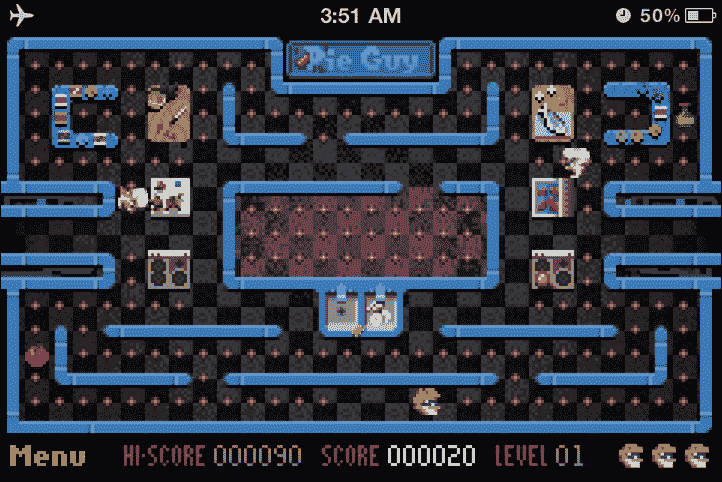
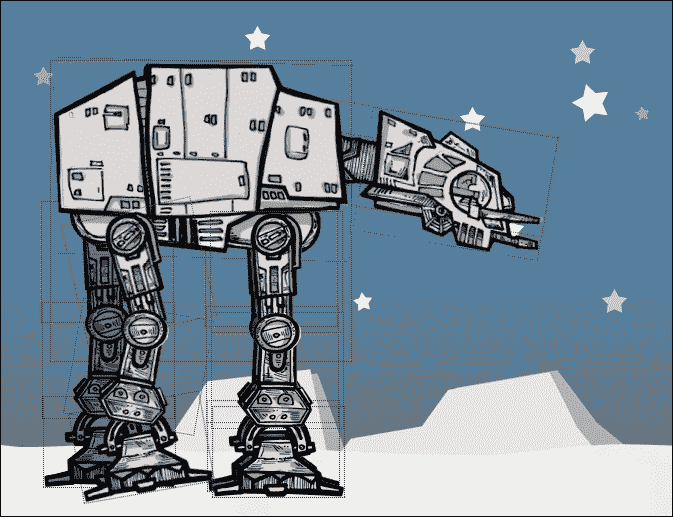
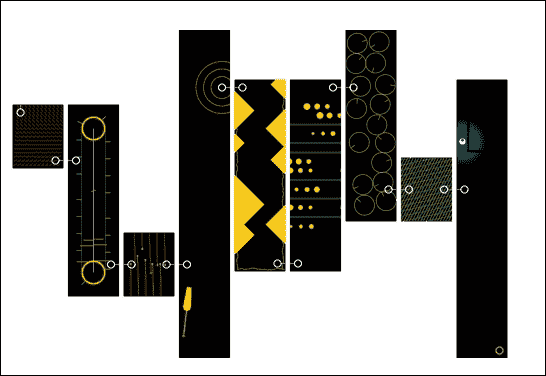
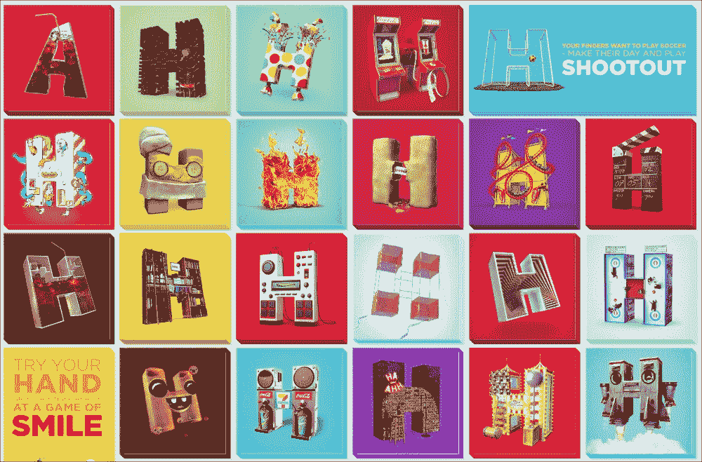
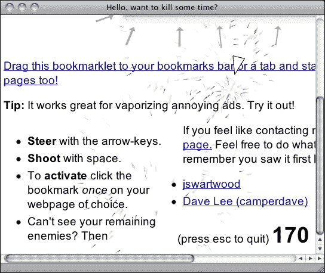
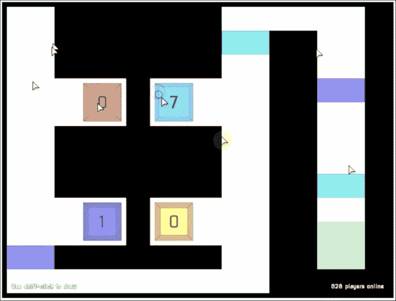
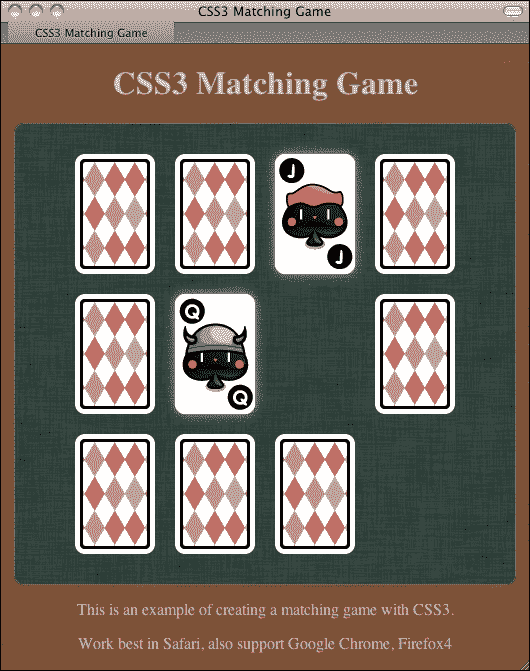

# 一、HTML5 游戏简介

*超文本标记语言 HTML 在过去几十年中一直在塑造互联网。它定义了内容在 Web 中的结构以及相关页面之间的链接。HTML 一直在从版本 2 发展到 HTML4，然后发展到 XHTML1.1。多亏了 web 应用程序和社交网络应用程序，现在已经进入了 HTML5 时代。*

***层叠样式表**（**CSS**）定义了网页的视觉呈现方式。它设置所有 HTML 元素及其状态的样式，例如悬停和活动。*

*JavaScript是网页的逻辑控制器。它使 web 页面具有动态性，并在页面和用户之间提供客户端交互。通过**文档对象模型****DOM**访问 HTML。它通过 API 控制新的 HTML 特性。*

在大多数桌面和移动设备中都有现代 web 浏览器。这些最新的网络技术为我们带来了新的游戏市场——HTML5 游戏。有了这些技术的新功能，我们可以设计具有 HTML5 元素、CSS3 属性和 JavaScript 的游戏，以在大多数浏览器和移动设备上玩。

在本章中，我们将介绍以下主题：

*   发现 HTML5 的新特性
*   讨论是什么让我们对 HTML5 和 CSS3 如此兴奋
*   预览我们将在后面的章节中构建的游戏
*   准备发展环境

那么，让我们开始吧。

# 发现 HTML5 的新功能

HTML5 和 CSS3 中引入了许多新的东西。在制作游戏弄脏我们的手之前，让我们先概述一下新功能，看看如何使用它们来制作游戏。

## 帆布

**Canvas**是一个 HTML5 元素，提供低级别的绘图形状和位图操作功能。我们可以将 Canvas 元素想象为一个动态图像标记。传统的`` 标签显示静态图像。此图像加载后通常是静态的。我们可以将``标记更改为另一个图像源或将样式应用于图像，但我们无法修改图像的位图上下文本身。

另一方面，Canvas 类似于客户端动态``标记。我们可以在其中加载图像，在那里绘制形状，并使用 JavaScript 与之交互。

画布在 HTML5 游戏开发中扮演着重要角色。这是本书中我们主要关注的领域之一。

## 音频

背景音乐和音效是游戏设计的基本元素。HTML5 带有来自`audio`标签的本机音频支持。由于此功能，我们不需要专有的 Flash 播放器在 HTML5 游戏中播放音效。然而，在网络上使用网络音频有一些限制。我们将在[第 6 章](06.html "Chapter 6. Adding Sound Effects to Your Games")中讨论`audio`标签的用法，*为您的游戏*添加音效。

## 触摸事件

除了传统的键盘和鼠标事件外，我们还可以使用触摸事件来处理单个和多个触摸事件。我们可以设计一款在移动设备上使用触摸屏的游戏。我们还可以通过观察触摸模式来处理手势。

## 地理定位

**地理定位**允许网页检索用户计算机的经纬度。例如，谷歌的 Ingress游戏利用地理位置让玩家在真实的城市玩游戏。多年前，当每个人都在桌面上使用互联网时，这个功能可能就没有那么有用了。我们需要用户道路的准确位置的事情并不多。我们可以通过分析 IP 地址得到大致的位置。

如今，越来越多的用户使用功能强大的智能手机上网。Webkit 和其他现代移动浏览器都在每个人的口袋里。地理定位让我们可以设计移动应用程序和游戏来使用位置的输入。

## WebGL

WebGL通过在 web 浏览器中提供一组 3D 图形 API 扩展了画布元素。API 遵循 OpenGL ES 2.0 的标准。WebGL 为 HTML5 游戏提供了强大的 GPG 加速 3D 渲染 API。一些 3D 游戏引擎支持 WebGL 的导出，包括流行的 Unity 引擎。我们可以期待看到更多的 HTML5 3D 游戏等待使用 WebGL 发布。

使用 WebGL 创建游戏所使用的技术与使用 Canvas 的技术有很大不同。在 WebGL 中创建游戏需要处理 3D 模型并使用类似于 OpenGL 的 API。因此，本书不讨论 WebGL 游戏开发。

由于 GPU 渲染支持，WebGL 的性能优于 2D 画布。一些库允许游戏使用画布 2D 绘图 API，这些工具通过在 WebGL 上绘图来渲染画布以获得性能。Pixi.js（[http://www.pixijs.com](http://www.pixijs.com) 、画架（[http://blog.createjs.com/webgl-support-easeljs/](http://blog.createjs.com/webgl-support-easeljs/) 和WebGL-2D（[https://github.com/corbanbrook/webgl-2d](https://github.com/corbanbrook/webgl-2d) 就是其中的几个工具。

## 网匣

WebSocket是HTML5规范的一部分，用于将网页连接到套接字服务器。它为我们提供了浏览器和服务器之间的持久连接。这意味着客户端不需要在短时间内轮询服务器以获取新数据。只要有数据需要更新，服务器就会将更新推送到浏览器。此功能的一个好处是，游戏玩家可以几乎实时地相互交互。当一个玩家执行某项操作并向服务器发送数据时，我们可以向单个玩家发送更新以创建一对一的实时页面播放，或者我们可以迭代服务器中的所有连接，以向每个其他连接的浏览器发送事件，以确认玩家刚刚执行的操作。这创造了构建多人 HTML5 游戏的可能性。

## 本地存储

HTML5 为 web 浏览器提供了持久数据存储解决方案。

本地存储器持久存储键值对数据。浏览器终止后，数据仍然存在。此外，数据不仅限于创建它的浏览器可以访问。它可用于具有相同域的所有浏览器实例。多亏了本地存储，我们可以轻松地在 web 浏览器中本地保存游戏的状态，如进度和获得的成就。

web 浏览器上的另一个数据库是 IndexedDB。它也是一个键值对，但它允许存储对象和查询有条件的数据。

## 离线应用

通常，我们需要一个互联网连接来浏览网页。有时，我们可以浏览缓存的脱机网页。这些缓存的脱机网页通常会很快过期。通过 HTML5 引入的下一个离线应用程序，我们可以声明缓存清单。这是一个文件列表，当没有 Internet 连接时，将存储这些文件以供以后访问。

通过缓存清单，我们可以在本地存储所有游戏图形、游戏控制 JavaScript 文件、CSS 样式表和 HTML 文件。我们还可以将 HTML5 游戏打包为桌面或移动设备上的离线游戏。玩家甚至可以在飞行模式下玩游戏。下面是馅饼人游戏（[的截图 http://mrgan.com/pieguy](http://mrgan.com/pieguy) 显示一款 HTML5 游戏在没有互联网连接的 iPhone 上玩；请注意指示脱机状态的小飞机符号：



# 发现 CSS3 的新特性

CSS 是表示层，HTML 是内容层。它定义了 HTML的外观。当我们用 HTML5 创建游戏时，尤其是基于 DOM 的游戏，我们不能错过 CSS。我们可能纯粹使用 JavaScript 来创建游戏，并使用 Canvas 元素设计游戏。然而，当我们创建基于 DOM 的 HTML5 游戏时，我们需要 CSS。因此，让我们看看 CSS3 中的新内容，以及如何使用新的属性来创建游戏。

新的 CSS3 属性允许我们以不同的方式为 DOM 设置动画，而不是直接在画布的绘图板上绘制和交互。这使得制作更复杂的基于 DOM 的浏览器游戏成为可能。

## CSS3 转换

传统上，当我们对元素应用新样式时，样式会立即发生变化。CSS3 转换在目标元素的样式随时间变化期间在样式之间进行渲染。例如，在这里，我们有一个蓝色的盒子，当我们做鼠标悬停时，我们想把它改成深蓝色。我们可以通过使用以下代码段来实现这一点：

**HTML**：

```html
<a href="#" class="box"></a>
```

**CSS**：

```html
a.box {
  display: block;
  width: 100px;
  height: 100px;
  background: blue;
}
a.box:hover {
  background: darkblue;
}
```

鼠标悬停时，盒子立即变成深蓝色。应用 CSS3 转换后，我们可以在特定持续时间和缓和值的样式之间切换：

```html
a.box {
  transition: all 0.5s ease-out;
}
```

### 提示

**下载示例代码**

对于您购买的所有 Packt Publishing 图书，您可以从您的账户[下载示例代码文件 http://www.packtpub.com](http://www.packtpub.com) 。如果您在其他地方购买了本书，您可以访问[http://www.packtpub.com/support](http://www.packtpub.com/support) 并注册，将文件直接通过电子邮件发送给您。

在过去，我们需要 JavaScript 来计算和呈现中间样式；这比使用 CSS3 转换要慢得多，因为浏览器本身会产生效果。

### 注

由于一些 CSS3 规范仍处于起草阶段，尚未确定，不同浏览器供应商的实现可能与 W3C 规范存在一些细微差异。因此，浏览器供应商倾向于使用供应商前缀实现其 CSS3 属性，以防止冲突。

Safari 使用`-webkit-`前缀。Opera 使用`-o-`前缀。Firefox 使用`-moz-`前缀，IE 使用`-ms-`前缀。Chrome 过去使用`-webkit-`，但现在它在将引擎切换为闪烁后不再使用任何前缀。现在声明一个 CSS3 属性（如 flex）有点复杂，它有好几行相同的规则，适用于多个浏览器。我们可以期望在属性规范修复后删除前缀。

为了使本书中的代码更清晰，我将对本书中的所有属性使用非供应商前缀。我建议您使用基于 JavaScript 的库为不同的 web 浏览器自动添加所需的供应商前缀。前缀自由库（[http://leaverou.github.io/prefixfree/](http://leaverou.github.io/prefixfree/) 就是其中之一。

或者，如果您使用的是预处理器，则编译过程还可能为您添加必要的供应商前缀。

## CSS3 变换

CSS3 变换让我们缩放元素，旋转它们，并平移它们的位置。CSS3变换分为 2D 和 3D。通过结合变换原点和 3D 旋转和平移，我们可以在 3D 空间中为 2D 图形制作动画。

## CSS3 动画

CSS3 过渡是动画的一种类型。它声明了两种元素样式之间的 tweening 动画。

CSS3 动画是动画的进一步发展。我们可以定义动画的关键帧。每个关键帧都包含一组属性，这些属性在任何特定时刻都应该更改。它类似于一组按顺序应用于目标元素的 CSS3 转换。

AT-AT 步行机[http://anthonycalzadilla.com/css3-ATAT/index-bones.html](http://anthonycalzadilla.com/css3-ATAT/index-bones.html) 演示了如何使用 CSS3 动画关键帧、变换和变换创建骨骼动画。如下图所示：



# 创建 HTML5 游戏的好处

我们已经探索了 HTML5 和 CSS3 的几个新的关键特性。有了这些功能，我们可以在浏览器上创建 HTML5 游戏。但我们为什么要这么做？创建 HTML5 游戏的好处是什么？

## 自由开放的标准

web 标准是开放的，可以免费使用。相比之下，第三方工具通常是专有的，而且需要花钱。对于专有技术，他们的支持可能会因为公司重点的改变而下降。HTML5 的标准化和开放性确保了我们将拥有支持它的浏览器。

## 支持多平台

由于内置了现代浏览器中所有 HTML5 功能的支持，我们不需要用户为了播放任何文件而预先安装任何第三方插件。这些插件不是标准的。它们通常需要额外的插件安装，而您可能无法安装。例如，全球数以百万计的苹果 iOS 设备在其移动 Safari 中不支持第三方插件，如 Flash Player。不管原因是什么，苹果不允许 Flash Player 在他们的移动 Safaris 上运行，相反，HTML5 和相关的网络标准是他们在浏览器中得到的。我们可以通过创建针对手机优化的 HTML5 游戏来达到这个用户群。

## 特定场景下本机应用程序呈现性能

当我们在画布中编写游戏时，有一些渲染引擎可以将画布绘制代码转换为 OpenGL，从而在本机移动设备中进行渲染。这意味着，虽然我们仍在为 web 浏览器编写游戏，但我们的游戏可以通过本机应用程序 OpenGL 渲染在移动设备中获得好处。**喷射物**[http://impactjs.com/ejecta](http://impactjs.com/ejecta) 和**CocoonJS**[http://ludei.com/cocoonjs](http://ludei.com/cocoonjs) 是两个这样的发动机。

## 打破普通浏览器游戏的界限

在传统的游戏设计中，我们在一个边界框内构建游戏。我们在电视上玩电子游戏。我们在具有矩形边界的 web 浏览器中玩 Flash 游戏。

利用创造力，我们不再局限于一个长方形的游戏阶段。我们可以享受所有页面元素的乐趣。

抽搐（[http://reas.com/twitch/](http://reas.com/twitch/) 是一款来自 Chrome 实验的游戏。这是一系列迷你游戏，玩家必须将球从起点带到终点。有趣的是，每个迷你游戏都是一个小的浏览器窗口。当球到达该迷你游戏的目标点时，它将被传输到新创建的迷你游戏浏览器中以继续旅程。以下屏幕截图显示了 Twitch 与各个 web 浏览器的整个地图：



## 打造 HTML5 游戏

由于 HTML5 和 CSS3 的新功能，我们现在可以在浏览器中创建一个完整的游戏。我们可以控制 DOM 中的每个元素。我们可以使用 CSS3 设置每个文档对象的动画。我们有画布来动态地绘制事物并与之交互。我们有一个音频元素来处理背景音乐和声音效果。我们还有本地存储来保存游戏数据，还有 WebSocket 来创建实时多人游戏。大多数现代浏览器已经支持这些功能。现在是构建 HTML5 游戏的时候了。

# 其他人在玩什么 HTML5

这是一个很好的机会，通过观看其他使用不同技术制作的 HTML5 游戏来研究不同 HTML5 游戏的表现。

## 可口可乐的 Ahh 运动

可口可乐已经开展了一项名为**啊**（[的活动 http://ahh.com](http://ahh.com) ）有很多互动迷你游戏。交互结合了多种技术，包括画布和设备旋转。它们中的大多数在桌面和移动设备上都能很好地工作。



## 小行星样式书签

瑞典网页设计师埃里克创造了一个有趣的书签。这是一款适用于任何网页的小行星风格游戏。是的，任何网页！它显示了与任何网页交互的异常方式。它会在你阅读的网站上创建一个平面。然后，您可以使用箭头键驾驶飞机，并使用空格键发射子弹。有趣的是子弹会破坏页面上的 HTML 元素。您的目标是销毁您选择的网页上的所有内容。这个 bookmarklet 是打破普通浏览器游戏界限的另一个例子。它告诉我们，在设计 HTML5 游戏时，我们可以跳出框框思考。

下面的屏幕截图显示了破坏网页内容的飞机：



bookmarklet 可在[安装 http://kickassapp.com](http://kickassapp.com) 。你甚至可以设计你控制的宇宙飞船。

## X 型

一个名为Impact 的基于画布的游戏引擎的创建者创建了这个X-Type（[http://phoboslab.org/xtype/](http://phoboslab.org/xtype/) ）针对不同平台的射击游戏，包括网络浏览器、iOS 和 Wii U。以下屏幕截图显示游戏在 iPhone 中运行平稳。


## Cursors.io

Cursors.io（[http://cursors.io](http://cursors.io) 展示了一款精心设计的实时多人游戏。每个用户控制一个匿名鼠标光标，并通过将光标移动到绿色出口，在游戏的各个关卡中进行旅程。游戏的有趣之处在于，玩家必须帮助其他玩家提升水平。有一些开关，一些光标点击它们来解锁门。匿名玩家必须承担起帮助其他玩家的角色。有人会扮演你的角色，这样你就可以提升到下一个层次。帮助你的玩家越多，你在游戏中成功的机会就越大。如果只有几个玩家在玩，而你无法体验游戏，我已经以 12 倍的速度（在[下）录制了我的游戏屏幕 http://vimeo.com/109414542](http://vimeo.com/109414542) ）让您一窥这款多人游戏的工作原理。这已在以下屏幕截图中捕获：



### 注

我们将在[第 8 章](08.html "Chapter 8. Building a Multiplayer Draw-and-Guess Game with WebSockets")中讨论构建多人游戏，*使用 WebSocket*构建多人你画我猜游戏。

# 我们将在本书中创造什么

在接下来的章节中，我们将构建六个游戏。我们将首先创建一个基于 DOM 的乒乓球游戏，它可以由两个玩家在同一台机器上玩。然后，我们将使用 CSS3 动画创建一个内存匹配游戏。接下来，我们将使用画布创建一个解开谜题的游戏。稍后，我们将构建一个带有音频元素的音乐游戏。然后，我们将使用 WebSocket 创建一个多人你画我猜游戏。最后，我们将使用 Box2dJavaScript 端口创建一个物理汽车游戏的原型。下面的屏幕截图显示了我们将在[第 3 章](03.html "Chapter 3. Building a Card-matching Game in CSS3")中构建的内存匹配游戏，*在 CSS3*中构建一个卡片匹配游戏。您可以在[玩游戏 http://makzan.net/html5-games/card-matching/](http://makzan.net/html5-games/card-matching/) 。



# 准备开发环境

开发 HTML5 游戏的环境类似于设计网站。我们需要网络浏览器和一个好的文本编辑器。哪个文本编辑器好是一个永无休止的争论。每个文本编辑器都有自己的优势，所以只需选择您最喜欢的一个。我个人推荐使用多个游标的文本编辑器，例如，升华文本或括号。对于浏览器，我们需要支持最新 HTML5 和 CSS3 规范的现代浏览器，并为我们提供方便的调试工具。

现在互联网上有几种现代浏览器可供选择。它们是苹果野生动物园（[http://apple.com/safari/](http://apple.com/safari/) 、谷歌Chrome（[http://www.google.com/chrome/](http://www.google.com/chrome/) 、MozillaFirefox（[http://mozilla.com/firefox/](http://mozilla.com/firefox/) 、歌剧（[http://opera.com](http://opera.com) 。这些浏览器支持我们将在整本书的示例中讨论的大部分功能。我个人使用 Chrome 是因为它有很好的内置开发工具。强大的开发工具使其受到 web 和游戏开发人员的欢迎。

我们还需要安卓手机和 iPad/iPhone 在移动设备上测试游戏。模拟器也可以工作，但使用真实设备进行的测试结果更接近真实世界的使用情况。

# 总结

在本章中，我们了解了很多有关 HTML5 游戏的基本信息。

具体来说，我们介绍了 HTML5 和 CSS3 的新特性。在后面的章节中，我们向您简要介绍了我们将使用哪些技术来创建游戏画布、音频、CSS 动画，并介绍了更多新功能。我们将有许多新功能可供使用。我们讨论了为什么我们要创建 HTML5 游戏我们要满足网络标准，满足移动设备，打破游戏的界限。我们看了几个现有的 HTML5 游戏，它们是用不同的技术创建的，我们也将使用这些技术。在我们创建自己的游戏之前，您可以测试这些游戏。我们还预览了我们将在书中构建的游戏。最后，我们准备了我们的开发环境。

现在我们已经有了一些关于 HTML5 游戏的背景信息，我们准备在下一章中创建第一个基于 DOM、JavaScript 驱动的游戏。