# 九、使用 Box2D 和画布构建一个物理汽车游戏

*2D 物理引擎是游戏开发中的热门话题。在物理引擎的帮助下，我们可以通过定义一个环境和一个简单的规则轻松创建一个可玩的游戏。以现有游戏为例，愤怒的小鸟游戏中的玩家用飞鸟摧毁敌人的城堡。在《割断绳子》中，糖果落入怪物的嘴里，进入下一关。*

在本章中，我们将学习以下主题：

*   安装 Box2D JavaScript 库
*   在物理世界中创建静态地体
*   在画布上绘制物理世界
*   在物理世界中创建动态长方体
*   推进世界时间
*   为游戏添加轮子
*   创造物理汽车
*   通过键盘输入为汽车增加动力
*   在 Box2D 世界中检查碰撞
*   为我们的汽车游戏添加关卡支持
*   用图形替换 Box2D 外形图
*   添加最后一次触球，让游戏变得有趣

下面的屏幕截图显示了本章结束时我们将获得的内容；这是一个汽车游戏，玩家将汽车移动到目的地：

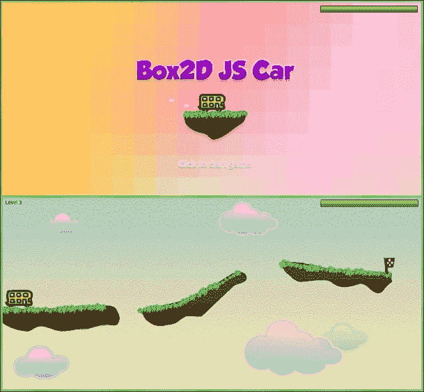

您也可以在[玩游戏 http://makzan.net/html5-games/car-game/](http://makzan.net/html5-games/car-game/) 了解最终结果。

那么，让我们继续吧。

# 安装 Box2D JavaScript 库

现在，假设我们想要创建一个汽车游戏。我们对车施力，使其向前移动。汽车在坡道上行驶，然后在空中飞行。然后，汽车落在目的地坡道上，游戏结束。在物理世界的每一个角落，每一次碰撞都依赖于这一运动。如果我们必须从头开始做这个游戏，那么我们必须至少计算每个部分的速度和角度。幸运的是，物理图书馆帮助我们处理所有这些物理问题。我们所要做的就是创建物理模型，并将其呈现在画布上。我们使用的发动机是 Box2D。

Box2D 是一个 2D 物理模拟引擎。最初的 Box2D 是由 Erin Catto 用 C 编写的。它后来被移植到 Flash ActionScript 中。后来，它的 2.1a 版本被移植到 JavaScript。您可以在他们的谷歌代码项目[中找到 Box2D 2.1a的JavaScript 版本 https://code.google.com/p/box2dweb/](https://code.google.com/p/box2dweb/) 。

### 注

在撰写本书时，谷歌代码宣布将于 2016 年关闭。我已经把图书馆分成了一个 URL（[https://github.com/makzan/Box2DWeb-Fork](https://github.com/makzan/Box2DWeb-Fork) 如果无法访问原始存储库。

# 行动时间-安装 Box2D 物理库

我们将设置 Box2D 库。我们必须执行以下步骤来准备我们的项目：

1.  First, let's set up our game project. Create a folder with the following file structure. The HTML file contains an HTML template with empty content and includes all the scripts and style files. You may find the full document's source in the code bundle. Please also download the Box2D source file into the `js` folder.

    

2.  在 HTML 正文中，我们必须定义画布，如下所示：

    ```html
    <canvas id="game" width="1300" height="600"></canvas>
    ```

3.  然后，我们必须别名几个我们将在游戏中使用的 Box2D 类；这使得在代码中引用它们更容易：

    ```html
    // Box2D alias
    var b2Vec2 = Box2D.Common.Math.b2Vec2
      , b2BodyDef = Box2D.Dynamics.b2BodyDef
      , b2Body = Box2D.Dynamics.b2Body
      , b2FixtureDef = Box2D.Dynamics.b2FixtureDef
      , b2World = Box2D.Dynamics.b2World
      , b2PolygonShape = Box2D.Collision.Shapes.b2PolygonShape
      , b2CircleShape = Box2D.Collision.Shapes.b2CircleShape
      , b2DebugDraw = Box2D.Dynamics.b2DebugDraw
      , b2RevoluteJointDef = Box2D.Dynamics.Joints.b2RevoluteJointDef;
    ```

4.  现在，我们将创建一个空世界来测试我们的 Box2D库安装。打开 `box2dcargame.js`JavaScript 文件，在文件中放入以下代码创建世界：

    ```html
    var carGame = {
    }

    var canvas;
    var ctx;
    var canvasWidth;
    var canvasHeight;

    function initGame() {

      carGame.world = createWorld();

      console.log("The world is created. ",carGame.world);

      // get the reference of the context
      canvas = document.getElementById('game');
      ctx = canvas.getContext('2d');
      canvasWidth = parseInt(canvas.width);
      canvasHeight = parseInt(canvas.height);
    };

    // Create and return the Box2D world.
    function createWorld() {
      // Define the gravity
      var gravity = new b2Vec2(0, 10);

      // set to allow sleeping object
      var allowSleep = true;

      // finally create the world with 
      // gravity and sleep object parameter.
      var world = new b2World(gravity, allowSleep);
      return world;
    }

    // After all the definition, we init the game.
    initGame();
    ```

5.  在 web 浏览器中打开`index.html`文件。我们应该看到一块灰色的帆布，上面什么也没有。

我们还没有把物理世界展现在画布上。这就是为什么我们在页面上只看到一块空白画布。但是，我们已经在控制台日志中打印了新创建的世界。下面的屏幕截图显示了控制台跟踪具有许多以`m_`开头的属性的世界对象。以下是世界的物理状态：


## *刚才发生了什么事？*

我们刚刚安装了 box2djavascript 库，并创建了一个空世界来测试安装。

## 用 b2World 创造新世界

`b2World`类是 Box2D 环境中的核心类。我们所有的物理身体，包括地面和汽车，都是在这个世界上创造出来的。下面的代码向我们展示了如何创建世界：

```html
var world = new b2World(gravity, doSleep);
```

`b2World`类需要初始化两个参数，下表列出了这两个参数及其说明：

<colgroup><col style="text-align: left"> <col style="text-align: left"> <col style="text-align: left"></colgroup> 
| 

论点

 | 

类型

 | 

讨论

 |
| --- | --- | --- |
| `gravity` | b2Vec2 | 这代表了世界的严重性 |
| `doSleep` | 布尔 | 这定义了世界是否忽略睡眠对象 |

## 设定世界的引力

我们必须定义世界的引力。重力由`b2Vec2`定义。`b2Vec2`类是*x*和*y*轴的向量。因此，以下代码定义了向下 10 个单位的重力：

```html
var gravity = new b2Vec2(0, 10);
```

## 设置 Box2D 忽略睡眠对象

睡眠中的身体是一个动态的身体，它会跳过模拟直到醒来。物理图书馆计算世界上所有天体的数学数据和碰撞。当世界上有太多的实体无法在每一帧中计算时，性能将降低。当一个睡觉的身体与另一个物体碰撞时，它会醒来，然后再次回到睡眠模式，直到下一次碰撞。

# 在物理世界中创造一个静态地体

世界现在是空的。如果我们要在那里放置物体，物体会掉落并最终离开我们的视线。现在，假设我们要在世界上创建一个静态的地面实体，以便对象可以站在上面。我们可以在 Box2D 中执行此操作。

# 是行动的时候了——在世界上创造一片天地

执行以下步骤创建静态接地：

1.  打开 `box2dcargame.js`JavaScript 文件。
2.  在文件中定义以下`pxPerMeter`变量；这是 Box2D 世界中的单位设置：

    ```html
    var pxPerMeter = 30; // 30 pixels = 1 meter
    ```

3.  将以下函数添加到 JavaScript 文件的末尾；这将创建一个固定的实体作为游乐场：

    ```html
    function createGround() {
      var bodyDef = new b2BodyDef;
      var fixDef = new b2FixtureDef;

      bodyDef.type = b2Body.b2_staticBody;
      bodyDef.position.x = 250/pxPerMeter;
      bodyDef.position.y = 370 /pxPerMeter;

      fixDef.shape = new b2PolygonShape();
      fixDef.shape.SetAsBox(250/pxPerMeter, 25/pxPerMeter);
      fixDef.restitution = 0.4;

      // create the body from the definition.
      var body = carGame.world.CreateBody(bodyDef);
      body.CreateFixture(fixDef);

      return body;
    }
    ```

4.  创建如下世界后，在`initGame`函数中调用`createGround`函数：

    ```html
    createGround();
    ```

5.  由于我们仍在定义逻辑，还没有直观地展示物理世界，如果打开浏览器，我们将什么也看不到。但是，如果有任何错误消息，那么尝试并检查控制台窗口以获取错误消息是值得的。

## *刚才发生了什么事？*

我们已经创建了一个具有形状和实体定义的地面实体。这是一个常见的过程，我们将大量使用它来创建世界上不同种类的物理实体。那么，让我们深入了解一下我们是如何制作的。

## 每米像素数

Box2D 中单元的尺寸和位置以米为单位计算。我们在屏幕上使用像素。因此，我们定义了一个变量，用于在米和屏幕像素之间转换单位。我们将该值设置为 30，这表示 30 个像素等于 1 米。你可以为你的物理世界探索不同的价值观。

我们不应该使用 1 像素到 1 米，否则我们的对象将在 Box2D 范围内变得非常大。假设我们有一辆 100 像素宽的车，它将变为 100 米长，这根本不现实。通过定义 30px/米或任何合理的值，屏幕上宽度为 100px 的对象在模拟中的长度约为 3.33 米，Box2D 可以很好地处理。有关更多详细信息，请参阅 Box2D 手册第 1.7 节[http://www.box2d.org/manual.html](http://www.box2d.org/manual.html) 。

## 使用夹具创建形状

夹具包含物理特性及其形状。物理特性定义了密度、摩擦和恢复，其中恢复基本上是对象的反弹。形状定义几何数据。形状可以是圆形、矩形或多边形。我们在前面的示例中使用的以下代码定义了一个长方体形状定义。`SetAsBox`函数有两个参数：半宽半高。它是半个值，因此形状的最终面积是该值的四倍：

```html
fixDef.shape = new b2PolygonShape();
fixDef.shape.SetAsBox(250/pxPerMeter, 25/pxPerMeter);
fixDef.restitution = 0.4;
```

## 创造身体

定义夹具后，我们可以使用给定的形状定义创建实体定义。然后，我们设置身体的初始位置，最后要求世界实例根据我们的身体定义创建身体。以下代码显示了如何使用给定的形状定义在世界中创建实体：

```html
bodyDef.type = b2Body.b2_staticBody;
bodyDef.position.x = 250/pxPerMeter;
bodyDef.position.y = 370 /pxPerMeter;

// create the body from the definition.
var body = carGame.world.CreateBody(bodyDef);
body.CreateFixture(fixDef);
```

实体可以是静态实体，也可以是动态实体。静态实体是不可移动的，不会与其他静态实体发生碰撞。因此，这些实体可以用作地面或墙，成为水平环境。另一方面，动态物体在与其他物体（静态或动态）发生碰撞后，由于重力的作用，会移动。稍后我们将创建一个动态长方体。

## 使用恢复属性设置反弹效果

恢复值为 0 到 1 之间的。在我们的例子中，盒子掉在了地上。当地面和长方体上的恢复值均为 0 时，长方体根本不会反弹。当长方体或地面的恢复值为 1 时，碰撞是完全弹性的。

### 提示

当两个实体碰撞时，该碰撞的恢复值是两个实体的恢复值之间的最大值。因此，如果恢复值为 0.4 的长方体掉落在恢复值为 0.6 的地面上，则此碰撞将使用 0.6 计算反弹速度。

# 在画布上描绘物理世界

我们创造了基础，但它只是在数学模型中。我们没有在画布上看到任何东西，因为我们还没有在画布上画任何东西。为了展示物理是什么样子，我们必须根据物理世界画一些东西。

# 是行动的时候了——把物理世界画进画布

执行以下步骤以绘制有用的调试视图：

1.  首先，打开 `box2dcargame.js`JavaScript 文件：

    ```html
    var shouldDrawDebug = false;
    ```

2.  添加一个绘制调试行的函数：

    ```html
    function showDebugDraw() {
      shouldDrawDebug = true;

      //setup debug draw
      var debugDraw = new b2DebugDraw();
      debugDraw.SetSprite(document.getElementById('game').getContext('2d'));
      debugDraw.SetDrawScale(pxPerMeter);
      debugDraw.SetFillAlpha(0.3);
      debugDraw.SetLineThickness(1.0);
      debugDraw.SetFlags(b2DebugDraw.e_shapeBit | b2DebugDraw.e_jointBit);

      carGame.world.SetDebugDraw(debugDraw);

      carGame.world.DrawDebugData();
    }
    ```

3.  在`initGame`方法

    ```html
    showDebugDraw();
    ```

    的末尾添加`showDebugDraw`函数调用
4.  Now, reopen the game in a browser, and we should see the outline of the ground body in the canvas, as shown in the following screenshot:

    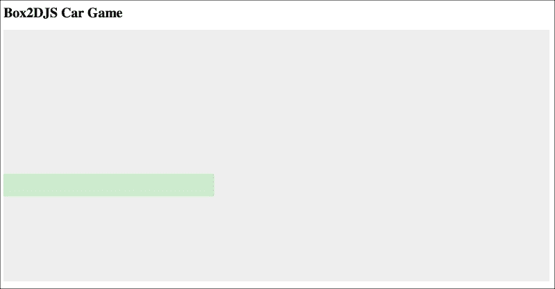

## *刚才发生了什么事？*

我们刚刚定义了一个方法，要求 Box2D 引擎在画布中绘制物理实体。这对于在成功添加自己的图形之前进行调试非常有用。我们可以通过`SetFlags`方法设置要显示的内容。

这些标志是按位变量。这意味着标志中的每个位控制一种图形类型。我们使用位运算符 or（`|`组合标志。例如，我们使用以下代码显示形状和关节。

```html
debugDraw.SetFlags(b2DebugDraw.e_shapeBit | b2DebugDraw.e_jointBit);
```

除形状和接头外，还有不同类型的调试图纸：

<colgroup><col style="text-align: left"> <col style="text-align: left"></colgroup> 
| 

位标志

 | 

讨论

 |
| --- | --- |
| `e_aabbBit` | 此绘制所有边界框 |
| `e_centerOfMassBit` | 这个画出了质心 |
| `e_controllerBit` | 此绘制所有动力学控制器 |
| `e_jointBit` | 此绘制所有接头连接 |
| `e_pairBit` | 此绘制了广义短语碰撞对 |
| `e_shapeBit` | 这个画出了所有的形状 |

# 创造物理世界的动态盒子

现在想象一下，我们把一个盒子扔到这个世界上。盒子从空中掉下来终于落地了。箱子反弹了一点，最后落在了地上。这与我们在上一节中创建的内容不同。在最后一节中，我们创建了一个静止的地面，它是不可移动的，不受重力影响。现在，我们将创建一个动态框。

# 是行动的时候了——在世界上放置一个动态的盒子

执行以下步骤以创建第一个动态实体：

1.  打开我们的 JavaScript 文件，将下面的框创建代码添加到页面加载的事件处理程序中。将代码放在`createGround`功能

    ```html
    // temporary function
    function createBox() {
      var bodyDef = new b2BodyDef;
      var fixDef = new b2FixtureDef;

      bodyDef.type = b2Body.b2_dynamicBody;
      bodyDef.position.x = 50/pxPerMeter;
      bodyDef.position.y = 210/pxPerMeter;

      fixDef.shape = new b2PolygonShape();
      fixDef.shape.SetAsBox(20/pxPerMeter, 20/pxPerMeter);

      var body = carGame.world.CreateBody(bodyDef);
      body.CreateFixture(fixDef);

      return body;
    }
    ```

    后
2.  我们需要调用我们新创建的函数`createBox`。在调用`initGame`中的`createGround`函数后，放置以下代码。
3.  Now, we will test the physics world in a browser. You should see that a box is created at the given initial position. However, the box is not falling down; this is because we still have to do something to make it fall:

    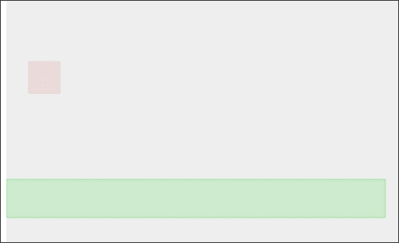

## *刚才发生了什么事？*

我们刚刚创造了一个充满活力的世界。与不可移动的地面体不同，该长方体在碰撞过程中受到重力和速度变化的影响。当实体包含具有任何质量或密度的形状时，它是一个动态实体。否则，它是静态的。因此，我们为我们的盒子定义了一个密度。Box2D 将使其动态化，并根据车身的密度和尺寸自动计算质量。

# 推进世界时间

盒子是动态的但它不会掉下来。我们做错什么了吗？答案是否定的。我们已经正确地设置了盒子，但是我们忘记了在物理世界中推进时间。

在 Box2D 物理世界中，所有计算都是在系统迭代中完成的。世界根据当前步骤计算所有事物的物理变换。当我们将`step`移动到下一个级别时，世界再次计算为新状态。

# 行动时间-建立世界步环

我们将通过以下步骤推动世界时间进步：

1.  为了推进世界步，我们必须定期调用世界实例中的`step`函数。我们使用`setTimeout`继续调用`step`函数。在我们的 JavaScript 逻辑文件中放入以下函数：

    ```html
    function updateWorld() {
      // Move the physics world 1 step forward.
      carGame.world.Step(1/60, 10, 10);

      // display the build-in debug drawing.
      if (shouldDrawDebug) {
        carGame.world.DrawDebugData();
      }
    }
    ```

2.  接下来，我们将在`initGame`方法中设置一个区间：

    ```html
    setInterval(updateWorld, 1/60);
    ```

3.  We will again simulate the world in a browser. The box is created at the initialized position and falls on the ground correctly. The following screenshot shows the sequence of a box dropping on the ground:

    

## *刚才发生了什么事？*

我们已经推进了世界的时代。现在，物理图书馆以每秒 60 次的频率模拟世界。在游戏循环中，我们向 Box2D 世界调用`Step`函数。`Step`函数模拟物理世界向前一步。在这一步中，物理引擎计算世界上发生的一切，包括力和重力。

# 为游戏添加轮子

现在，我们在游戏中有一个盒子。想象一下，现在我们创建两个圆形物体作为轮子。然后，我们将有一辆汽车的基本组成部分-车身和车轮。

# 是行动的时候了——让世界转两圈

我们将通过以下步骤为世界添加两个圆圈：

1.  打开`html5games.box2dcargame.js`JavaScript 文件添加轮体。
2.  在框创建代码之后添加以下代码。这将调用`createWheel`函数，我们将编写该函数来创建一个圆形实体：

    ```html
    // create two wheels in the world
    createWheel(25, 230);
    createWheel(75, 230);
    ```

3.  现在让我们研究一下`createWheel`函数。我们设计此函数是为了在给定的世界中的*x*和*y*坐标下，在给定的世界中创建一个圆形物体。为此，在 JavaScript 逻辑文件中放入以下函数：

    ```html
    function createWheel(x, y) {
      var bodyDef = new b2BodyDef;
      var fixDef = new b2FixtureDef;

      bodyDef.type = b2Body.b2_dynamicBody;
      bodyDef.position.x = x/pxPerMeter;
      bodyDef.position.y = y/pxPerMeter;

      fixDef.shape = new b2CircleShape();
      fixDef.shape.SetRadius(10/pxPerMeter);

      fixDef.density = 1.0;
      fixDef.restitution = 0.1;
      fixDef.friction = 4.3;

      var body = carGame.world.CreateBody(bodyDef);
      body.CreateFixture(fixDef);

      return body;
    }
    ```

4.  We will now reload the physics world in a web browser. This time, we should see a result similar to the one shown in the following screenshot, with a box and two wheels falling down from air:

    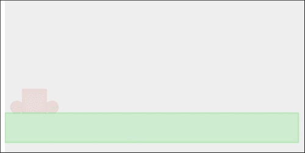

## *刚才发生了什么事？*

在模拟物理世界时，盒子和轮子都会掉落并相互碰撞和地面。

创建圆形实体类似于创建长方体。唯一的区别是我们使用`CircleDef`类而不是长方体形状定义。在圆定义中，我们使用`radius`属性而不是`extents`属性来定义圆的大小。

# 打造实体车

我们已经准备好了车厢箱体和两个轮体。我们离制造汽车只有一步之遥。想象一下，现在我们有一个胶水棒，把车轮粘到车身上。然后，汽车和车轮将不再分离，我们将拥有一辆汽车。我们可以使用**接头**来实现这一点。在本节中，我们将使用`joint`将车轮和车身粘在一起。

# 动作时间-用旋转接头连接盒子和两个圆圈

执行以下步骤来创建一个带有箱子和轮子的汽车：

1.  我们仍然只在逻辑部分工作。在文本编辑器中打开我们的 JavaScript 逻辑文件。
2.  创建一个名为`createCarAt`的函数，该函数将坐标作为参数。然后，在此功能中移动车斗和车轮创建代码。然后，添加以下高亮显示的关节创建代码。最后返回车体：

    ```html
    function createCarAt(x, y) {
      var bodyDef = new b2BodyDef;
      var fixDef = new b2FixtureDef;

      // car body
      bodyDef.type = b2Body.b2_dynamicBody;
      bodyDef.position.x = 50/pxPerMeter;
      bodyDef.position.y = 210/pxPerMeter;

      fixDef.shape = new b2PolygonShape();
      fixDef.density = 1.0;
      fixDef.friction = 1.5;
      fixDef.restitution = .4;
      fixDef.shape.SetAsBox(40/pxPerMeter, 20/pxPerMeter);

      carBody = carGame.world.CreateBody(bodyDef);

      carBody.CreateFixture(fixDef);

      // creating the wheels
      var wheelBody1 = createWheel(x-25, y+20);
      var wheelBody2 = createWheel(x+25, y+20);

      // create a joint to connect left wheel with the car body
      var jointDef = new b2RevoluteJointDef();
      jointDef.Initialize(carBody, wheelBody1, new b2Vec2( (x-25)/pxPerMeter ,  (y+20)/pxPerMeter ));
      carGame.world.CreateJoint(jointDef);

      // create a joint to connect right wheel with the car body
      var jointDef = new b2RevoluteJointDef();
      jointDef.Initialize(carBody, wheelBody2, new b2Vec2( (x+25)/pxPerMeter ,  (y+20)/pxPerMeter ));
      carGame.world.CreateJoint(jointDef);

      return carBody;

    }
    ```

3.  在`initGame`功能中，我们创建了两个轮子。删除这些在`initGame`函数中调用`createWheel`函数的代码行。
4.  然后，我们需要做的就是创建一个初始位置的汽车。调用`createGround`函数后，在`initGame`函数中添加以下代码：

    ```html
    carGame.car = createCarAt(50, 210);
    ```

5.  It is time to save the file and run the physics world in a browser. At this time, the wheels and the car body are not separate pieces. They glue together as a car and drop on the ground correctly, as shown in the following screenshot:

    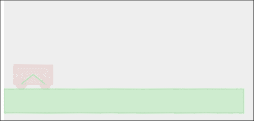

## *刚才发生了什么事？*

关节可用于在两个实体（或实体与世界）之间添加约束。关节有很多种，我们在本例中使用的是称为**旋转关节**。

## 使用旋转接头在两个实体之间创建锚定点

旋转接头用一个共同的锚定点将两个物体粘在一起。然后将两个实体粘在一起，仅允许基于公共锚点旋转。以下屏幕截图的左侧显示两个实体通过锚连接。在我们的代码示例中，我们将锚点设置为车轮的中心点。下面屏幕截图的右侧显示了如何设置关节。轮子旋转，因为旋转原点位于中心。此设置使汽车和车轮看起来真实：

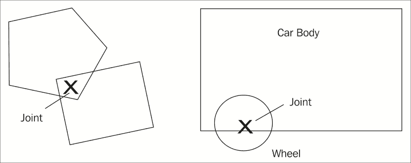

还有其他类型的关节以不同的方式使用。关节对创建游戏环境很有用，因为有几种类型的关节，每种关节类型都值得一试，您应该考虑如何使用它们。以下链接由 Box2D手册组成，该手册解释了每种类型的接头以及我们如何在不同的环境设置中使用它们：[http://www.box2d.org/manual.html#_Toc258082974](http://www.box2d.org/manual.html#_Toc258082974) 。

# 通过键盘输入给汽车加力

我们现在把车准备好了。让我们用我们的键盘移动它。

# 行动时间-给汽车加力

执行以下步骤进行键盘输入：

1.  在文本编辑器中打开 `box2dcargame.js`JavaScript 文件。
2.  在页面加载的事件处理程序中，我们在代码开头添加了以下`keydown`事件处理程序。这将监听右箭头键和左箭头键在不同方向施加力：

    ```html
    $(document).keydown(function(e){
      switch(e.keyCode) {
        case 39: // right arrow key to apply force towards right
          var force = new b2Vec2(100, 0);
          carGame.car.ApplyForce(force, carGame.car.GetWorldCenter());
          return false;
          break;
        case 37: // left arrow key to apply force towards left
          var force = new b2Vec2(-100, 0);
          carGame.car.ApplyForce(force, carGame.car.GetWorldCenter());
          return false;
          break;
      }
    });
    ```

3.  我们给身体增加了力量。我们需要在每个步骤中清除力，否则力会累积：

    ```html
    function updateWorld() {
      // existing code goes here.
      // Clear previous applied force.
      carGame.world.ClearForces();
    }
    ```

4.  Save the files and run our game in the browser. When you press the *arrow* keys, the car starts moving. If you keep pressing the key, the world will keep adding force to the car and make it speed away:

    

## *刚才发生了什么事？*

我们刚刚创造了一个与车身的互动。我们可以按箭头键左右移动汽车。游戏似乎变得越来越有趣了。

## 对身体施力

通过调用中的`ApplyForce`函数，我们可以对任何物体施加力。以下代码显示了该函数的用法：

```html
body.ApplyForce(force, point);
```

此函数采用下表中列出的两个参数：

<colgroup><col style="text-align: left"> <col style="text-align: left"> <col style="text-align: left"></colgroup> 
| 

论点

 | 

类型

 | 

讨论

 |
| --- | --- | --- |
| `force` | `b2Vec2` | 这是要应用于实体的力向量 |
| `point` | `b2Vec2` | 这是施加力的点 |

## 清除力

当我们对物体施加力后，力会不断地作用在物体上，直到我们清除它。在大多数情况下，我们在每一步后清除力。

## 了解 ApplyForce 和 ApplyImpulse 的区别

除了`ApplyForce`功能外，我们还可以通过`ApplyImpulse`功能移动任何物体。这两种功能都会移动身体，但它们使用不同的方法移动身体。如果我们想要改变一个物体的实例速度，那么我们在这个物体上使用一次`ApplyImpulse`来改变它的速度以满足我们的目标值。另一方面，我们需要不断地对物体施加力来提高速度。

例如，如果我们想提高汽车的速度，就像踩踏板一样，我们需要对汽车施加力。如果我们正在创建一个需要踢球启动球的球类游戏，我们可以使用`ApplyImpulse`函数向球体添加一个实例脉冲。

## 做个英雄吧

你能想象一个不同的情况，我们需要对身体施加力量或冲动吗？

## 为我们的游戏环境添加坡道

现在，我们可以把车开走了。然而，环境不够有趣玩。想象一下，现在有一些坡道供赛车跳跃，两个平台之间有一个间隙，玩家必须驾驶赛车。使用不同的坡道设置将变得更加有趣。

# 行动的时候到了——用坡道创造世界

执行以下步骤在物理世界中创建渐变：

1.  我们打开游戏逻辑 JavaScript 文件。
2.  在`createGround`函数中，我们更新该函数以获取四个参数。更改后的代码突出显示如下：

    ```html
    function createGround(x, y, width, height, rotation) {
      var bodyDef = new b2BodyDef;
      var fixDef = new b2FixtureDef;

      bodyDef.type = b2Body.b2_staticBody;
      bodyDef.position.x = x /pxPerMeter;
      bodyDef.position.y = y /pxPerMeter;
      bodyDef.angle = rotation * Math.PI / 180;

      fixDef.shape = new b2PolygonShape();
      fixDef.shape.SetAsBox(width/pxPerMeter, height/pxPerMeter);
      fixDef.restitution = 0.4;
      fixDef.friction = 3.5;

      // create the body from the definition.
      var body = carGame.world.CreateBody(bodyDef);
      body.CreateFixture(fixDef);

      return body;
    }
    ```

3.  现在，我们有一个创建地体的功能。现在，我们将用以下代码替换页面加载处理程序函数中的地面创建代码：

    ```html
    // create the ground
    createGround(250, 270, 250, 25, 0);
    // create a ramp
    createGround(500, 250, 65, 15, -10);
    createGround(600, 225, 80, 15, -20);
    createGround(1100, 250, 100, 15, 0);
    ```

4.  Save the file and preview the game in a browser. We should now see a ramp and a destination platform, as shown in the following screenshot. Try to control the car by making it jump over the ramp to reach the destination without falling down. Refresh the page to restart the game if you fail:

    

## *刚才发生了什么事？*

我们只是用一个函数包装了创建代码的接地盒，这样我们就可以轻松地创建接地体的组合。这些地面实体构成了游戏的水平环境。

此外，这是我们第一次旋转物体。我们使用`rotation`属性设置身体的旋转，该属性采用弧度值。通过设置长方体的旋转，我们可以在游戏中设置具有不同坡度的斜坡。

## 做个英雄吧

我们现在已经建立了一个坡道，我们可以在环境中玩这辆车。使用不同类型的关节来搭建操场怎么样？例如，滑轮接头作为升降机如何？另一方面，是否包括一个中心有接头的动态板？

# 在 Box2D 世界中检查碰撞

Box2D物理库自动计算所有碰撞。现在想象一下，我们将一个地面实体设置为目的地。当玩家成功地将汽车开到目的地时，他们就会获胜。由于 Box2D 已经计算了所有碰撞，我们所要做的就是获取检测到的碰撞列表，并确定我们的汽车是否撞上了目的地。

# 行动时间-检查汽车与目的车身之间的碰撞

执行以下步骤以处理碰撞：

1.  同样，我们从我们的游戏逻辑开始。在文本编辑器中打开 `box2dcargame.js`JavaScript 文件。
2.  我们在地面创建代码中设置了一个目标地面，并将其分配给`carGame`全局对象实例中的`gamewinWall`引用，如下所示：

    ```html
    carGame.gamewinWall = createGround(1200, 215, 15, 25, 0);
    ```

3.  接下来，我们进入`step`函数。在每一步中，我们都会从世界各地获得完整的联系人列表，并检查是否有任何两个碰撞的物体是汽车和目的地：

    ```html
    function checkCollision() {
      // loop all contact list 
      // to check if the car hits the winning wall.
      for (var cn = carGame.world.GetContactList(); cn != null; cn = cn.GetNext()) {
        var body1 = cn.GetFixtureA().GetBody();
        var body2 = cn.GetFixtureB().GetBody();
        if ((body1 === carGame.car && body2 === carGame.gamewinWall) || (body2 === carGame.car && body1 === carGame.gamewinWall))
        {
          if (cn.IsTouching()) {
            console.log("Level Passed!");
          }
        }
      }
    }
    ```

4.  当我们调用我们的游戏循环函数`updateWorld`时，我们调用我们新创建的碰撞检查函数。

    ```html
    checkCollision();
    ```

5.  We will now save the code and open the game in a browser again. This time, we have to open the console window to track whether we get the **Level** **Passed!** output when the car hits the wall. Try to finish the game, and we should see the output in the console once the car hits the destination:

    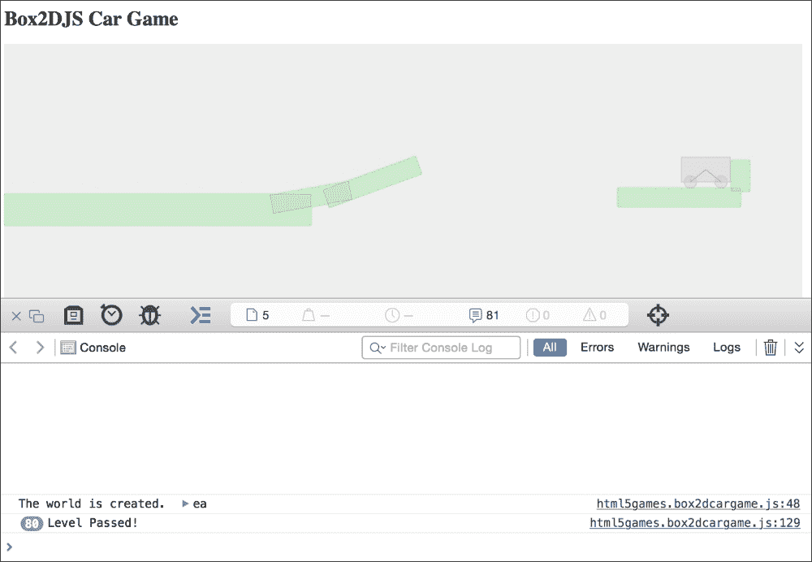

## *刚才发生了什么事？*

我们刚刚通过检查碰撞触点创建了游戏获胜逻辑。当汽车成功到达目标地面物体时，玩家获胜。

## 获取碰撞联系人列表

在每一步中，Box2D计算所有碰撞，并将它们放入`world`实例中的**联系人****列表**。我们可以通过`carGame.world.GetContactList()`功能获取联系人列表。返回的联系人列表为**链接****列表**。我们可以使用以下`for`循环浏览整个链接列表：

```html
for (var cn = carGame.world.GetContactList(); cn != null; cn = cn.GetNext()) {
   // We have fixture 1 and fixture 2 of each contact node.
   var body1 = cn.GetFixtureA().GetBody();
   var body2 = cn.GetFixtureB().GetBody();
}
```

当我们得到碰撞的形状时，我们检查该形状的车身是汽车还是目标车身。由于车辆形状可能在夹具 1 或夹具 2 中，并且同样适用于`gamewinWall`，我们需要检查这两种组合。附加的`isTouching`功能提供了夹具之间更精确的碰撞检查。

```html
if ((body1 === carGame.car && body2 === carGame.gamewinWall) ||
   (body2 === carGame.car && body1 === carGame.gamewinWall))
{
  if (cn.IsTouching()) {
    console.log("Level Passed!");
  }
}
```

## 做个英雄吧

我们在[第 7 章](07.html "Chapter 7. Saving the Game's Progress")中创建了一个游戏结束对话框*保存游戏进度*。在这里使用这种技术来创建一个对话框，显示玩家在击中致胜墙时通过关卡，怎么样？当我们在游戏中添加不同的关卡设置时，作为关卡转换，这也很有用。

# 重启游戏

在上一个示例中，您可能已经多次尝试刷新页面，以使汽车成功跳转到目的地。想象一下，如果我们能按下一个键重新初始化世界。然后，我们可以遵循试错法直到成功。

# 行动时间-按下 R 键重新启动游戏

我们将分配*R*键作为我们游戏的重启键。现在，让我们执行以下步骤：

1.  同样，我们只需要更改 JavaScript 文件。在文本编辑器中打开 `box2dcargame.js`JavaScript 文件。
2.  我们需要一个函数来移除所有实体：

    ```html
    function removeAllBodies() {
      // loop all body list to destroy them
      for (var body = carGame.world.GetBodyList(); body != null; body = body.GetNext()) {
        carGame.world.DestroyBody(body);
      }
    }
    ```

3.  我们将 create world、ramp 和 car 代码移动到一个名为`restartGame`的函数中。它们最初位于页面加载的处理程序函数中：

    ```html
    function restartGame() {
      removeAllBodies();

      // create the ground
      createGround(250, 270, 250, 25, 0);

      // create a ramp
      createGround(500, 250, 65, 15, -10);
      createGround(600, 225, 80, 15, -20);
      createGround(1100, 250, 100, 15, 0);

      // create a destination ground
      carGame.gamewinWall = createGround(1200, 215, 15, 25, 0);

      // create a car
      carGame.car = createCarAt(50, 210);
    }
    ```

4.  然后，在`initGame`函数中，我们调用`restartGame`函数来初始化游戏，如下所示：

    ```html
    restartGame();
    ```

5.  最后，我们将以下突出显示的代码添加到`keydown`处理程序中，以便在按下*R*键时重新启动游戏：

    ```html
    $(document).keydown(function(e){
      switch(e.keyCode) {
        case 39: // right arrow key to apply force towards right
          var force = new b2Vec2(300, 0);
          carGame.car.ApplyForce(force, carGame.car.GetWorldCenter());
          break;
        case 37: // left arrow key to apply force towards left
          var force = new b2Vec2(-300, 0);
          carGame.car.ApplyForce(force, carGame.car.GetWorldCenter());
          break;
     case 82: // r key to restart the game
     restartGame();
     break;
      }
    });
    ```

6.  玩家通过关卡后重新开始游戏如何？为此，在我们检查汽车与中奖标志碰撞的逻辑中添加以下突出显示的代码：

    ```html
    console.log("Level Passed!");
    restartGame();

    ```

7.  现在是在浏览器中测试游戏的时候了。试着玩游戏，按*R*键重新开始游戏。

## *刚才发生了什么事？*

我们折射代码以创建一个`restartGame`函数。每次调用此函数时，世界都会被销毁并再次初始化。通过创建 world 变量的新 world 实例，我们可以破坏现有世界并创建一个新的空世界，如下所示：

```html
carGame.world = createWorld();
```

## 做个英雄吧

现在重新启动游戏的唯一方法是按重新启动键。在世界的最底层建立一个地面，检查是否有坠落的汽车，怎么样？当赛车跌落并撞到底部时，我们知道玩家失败了，然后他们可以重新开始游戏。

# 为我们的汽车游戏添加关卡支持

现在想象一下，在完成每一场游戏后，我们可以升级到下一个环境设置。我们需要为每个级别设置几个环境。

# 行动时间-用关卡数据加载游戏

我们将对代码进行折射，以支持从 levels 数据结构加载静态地物。让我们通过执行以下步骤来处理它：

1.  在文本编辑器中打开 `box2dcargame.js`JavaScript 文件。
2.  我们需要在每一层进行地面设置。将以下代码放在 JavaScript 文件的顶部。这是一个层次的数组。每一层都是另一组对象，具有静态地面主体的位置、尺寸和旋转：

    ```html
    var carGame = {
       currentLevel: 0
    }
    carGame.levels = new Array();
    carGame.levels[0] = [{"type":"car","x":50,"y":210,"fuel":20},
    {"type":"box","x":250, "y":270, "width":250, "height":25, "rotation":0},
    {"type":"box","x":500,"y":250,"width":65,"height":15, "rotation":-10},
    {"type":"box","x":600,"y":225,"width":80,"height":15, "rotation":-20},
    {"type":"box","x":950,"y":225,"width":80,"height":15, "rotation":20},
    {"type":"box","x":1100,"y":250,"width":100,"height":15, "rotation":0},
    {"type":"win","x":1200,"y":215,"width":15,"height":25, "rotation":0}];

    carGame.levels[1] = [{"type":"car","x":50,"y":210,"fuel":20},
    {"type":"box","x":100, "y":270, "width":190, "height":15, "rotation":20},
    {"type":"box","x":380, "y":320, "width":100, "height":15, "rotation":-10},
    {"type":"box","x":666,"y":285,"width":80,"height":15, "rotation":-32},
    {"type":"box","x":950,"y":295,"width":80,"height":15, "rotation":20},
    {"type":"box","x":1100,"y":310,"width":100,"height":15, "rotation":0},
    {"type":"win","x":1200,"y":275,"width":15,"height":25, "rotation":0}];

    carGame.levels[2] = [{"type":"car","x":50,"y":210,"fuel":20},
    {"type":"box","x":100, "y":270, "width":190, "height":15, "rotation":20},
    {"type":"box","x":380, "y":320, "width":100, "height":15, "rotation":-10},
    {"type":"box","x":686,"y":285,"width":80,"height":15, "rotation":-32},
    {"type":"box","x":250,"y":495,"width":80,"height":15, "rotation":40},
    {"type":"box","x":500,"y":540,"width":200,"height":15, "rotation":0},
    {"type":"win","x":220,"y":425,"width":15,"height":25, "rotation":23}];
    ```

3.  将功能替换为以下代码。这会将函数更改为接受一个`level`参数。然后，根据标高数据创建地面或轿厢：

    ```html
    function restartGame(level) {
       carGame.currentLevel = level;

       // destroy existing bodies.
       removeAllBodies();// create the world 

       // create a ground in our newly created world
       // load the ground info from level data
       for(var i=0;i<carGame.levels[level].length;i++) {
          var obj = carGame.levels[level][i];

          // create car
          if (obj.type === "car") {
             carGame.car = createCarAt(obj.x, obj.y);
             continue;
          }

          var groundBody = createGround(obj.x, obj.y, obj.width, obj.height, obj.rotation);

          if (obj.type === "win") {
             carGame.gamewinWall = groundBody;
          }   
       }
    }
    ```

4.  在页面加载处理函数中，通过提供`currentLevel`来更改调用的`restartGame`函数，如下所示：

    ```html
    restartGame(carGame.currentLevel);
    ```

5.  我们还需要在重启密钥处理程序中提供`currentLevel`值：

    ```html
    case 82: // r key to restart the game
       restartGame(carGame.currentLevel);
       break;
    ```

6.  最后，更改游戏赢取逻辑中突出显示的代码。当汽车到达目的地时，我们在游戏中提升一级：

    ```html
    if ((body1 === carGame.car && body2 === carGame.gamewinWall) ||
       (body2 === carGame.car && body1 === carGame.gamewinWall))
    {
      if (cn.IsTouching()) {
        console.log("Level Passed!");
     restartGame(carGame.currentLevel+1);
      }
    }
    ```

7.  We will now run the game in the web browser. Finish the level and the game should restart at the next level:

    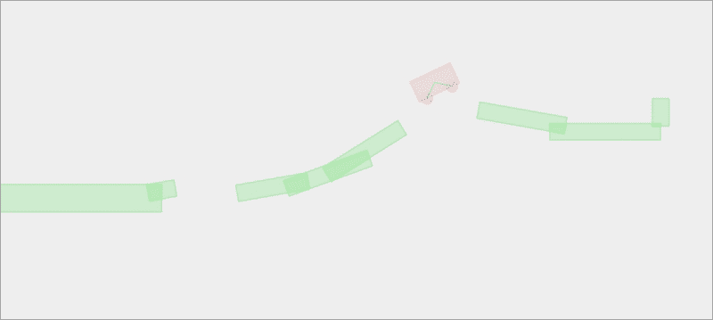

## *刚才发生了什么事？*

我们刚刚创建了一个数据结构来存储级别。然后，我们用给定的关卡编号创建游戏，并用关卡数据构建世界。

每个级别的数据都是一个对象数组。每个对象都包含世界上每个地面实体的属性。这包括位置、大小和旋转等基本属性。还有一个名为`type`的属性。它定义了车身是普通箱体、汽车数据还是目标获胜场地：

```html
carGame.levels[0] = [{"type":"car","x":50,"y":210,"fuel":20},
{"type":"box","x":250, "y":270, "width":250, "height":25, "rotation":0},
{"type":"box","x":500,"y":250,"width":65,"height":15,"rotation":-10},
{"type":"box","x":600,"y":225,"width":80,"height":15,"rotation":-20},
{"type":"box","x":950,"y":225,"width":80,"height":15,"rotation":20},
{"type":"box","x":1100,"y":250,"width":100,"height":15,"rotation":0},
{"type":"win","x":1200,"y":215,"width":15,"height":25,"rotation":0}];
```

在创建世界时，我们使用下面的代码循环通过级别数组中的所有对象。然后，我们创建赛车和场地主体，并根据类型参考比赛获胜场地：

```html
for(var i=0;i<carGame.levels[level].length;i++) {
  var obj = carGame.levels[level][i];

  // create car
  if (obj.type === "car") {
    carGame.car = createCarAt(obj.x,obj.y);
    continue;
  }

  var groundBody = createGround(obj.x, obj.y, obj.width, obj.height, obj.rotation);

  if (obj.type === "win") {
    carGame.gamewinWall = groundBody;
  }   
}
```

## 做个英雄吧

现在，我们为游戏设置了几个关卡。复制关卡数据以创建更有趣的关卡如何？创建您自己的关卡并使用它们。这就像一个孩子如何建造积木并玩积木一样。

# 用图形替换 Box2D 外形图

我们已经创建了一个游戏，它至少可以在几个关卡上玩。然而，它们只是一些轮廓框。我们甚至无法在游戏中区分目标物体和其他地面物体。现在想象一下，目的地是一面赛车旗，有一个汽车图形来表示它。这将使游戏的目的更加明确。

# 行动时间-在游戏中添加旗帜图案和汽车图案

执行以下步骤，在我们的物理对象上绘制两个图形：

1.  我们将首先下载本示例所需的图形。要下载图形，请转至[http://mak.la/book-assets](http://mak.la/book-assets) 。
2.  将本章的图像文件放入`images`文件夹中。
3.  现在，是编辑`index.html`文件的时候了。将以下 HTML 标记添加到`body`部分：

    ```html
    <div id="asset">
      
      
      
    </div>
    ```

4.  我们想隐藏包含`img`标记的资产 DIV。打开`cargame.css`文件并添加以下 CSS 规则以使资产 DIV 不被我们看到：

    ```html
    #asset {
      position: absolute;
      top: -9999px;
    }
    ```

5.  我们现在将进入逻辑部分。打开 `box2dcargame.js`JavaScript 文件。
6.  在`restartGame`功能中，添加高亮显示的代码，将`flag`图像的参考分配给获胜目的地标志：

    ```html
    if (obj.type === "win") {
      carGame.gamewinWall = groundBody;
     groundBody.SetUserData( document.getElementById('flag') );
    }
    ```

7.  Next, assign the reference of the `bus` image tag to the user data in the car shape. Add the following highlighted code to the car box definition creation:

    ```html
    function createCarAt(x, y) {
      var bodyDef = new b2BodyDef;
      var fixDef = new b2FixtureDef;

      // car body
      bodyDef.type = b2Body.b2_dynamicBody;  
      bodyDef.userData = document.getElementById('bus');

      // existing code goes here.
    }
    ```

    ### 注

    我们过去常常通过 jQuery`$(selector)`方法获取元素的引用。jQuery 选择器返回包含附加 jQuery 数据的元素对象数组。如果我们想要获得原始文档元素引用，那么我们可以使用`document.getElementById`方法或`$(selector).get(0)`方法。由于`$(selector)`返回一个数组，`get(0)`给出列表中的第一个原始文档元素

8.  然后，我们需要处理车轮。我们将`wheel`图像标记分配给轮体的`userData`属性。将以下突出显示的代码添加到`createWheel`功能

    ```html
    function createWheel(x, y) {
      var bodyDef = new b2BodyDef;
      var fixDef = new b2FixtureDef;

      bodyDef.type = b2Body.b2_dynamicBody;
      bodyDef.userData = document.getElementById('wheel');

      // existing code goes here
    }
    ```

9.  我们必须在画布上画图像。使用以下代码在`box2dcargame.js`文件中创建一个新的`drawWorld`函数。

    ```html
    // drawing functions
    function drawWorld(world, context) {
      for (var body = carGame.world.GetBodyList(); body != null; body = body.GetNext()) {
        if (body.GetUserData() !== null && body.GetUserData() !== undefined) {
          // the user data contains the reference to the image
          var img = body.GetUserData();

          // the x and y of the image. We have to subtract the half width/height
          var x = body.GetPosition().x;
          var y = body.GetPosition().y;
          var topleftX = - $(img).width()/2;
          var topleftY = - $(img).height()/2;

          context.save();
          context.translate(x * pxPerMeter,y * pxPerMeter);
          context.rotate(body.GetAngle());
          context.drawImage(img, topleftX, topleftY);
          context.restore();
        }
      }
    }
    ```

10.  最后，调用`updateWorld`函数中的`drawWorld`函数：

    ```html
    function updateWorld() { 
      ctx.clearRect(0, 0, canvasWidth, canvasHeight);

      // existing code goes here.  

      // render graphics
      drawWorld(carGame.world, ctx);
    } 
    ```

11.  Save all files and run the game in a web browser. We should see a yellow bus graphic, two wheels, and a flag as the destination. Play the game now and the game should move on to the next level when the bus hits the flag:

    

## *刚才发生了什么事？*

我们现在用最少的图形展示我们的游戏。至少，玩家很容易知道他们在控制什么以及他们应该去哪里。

Box2D 库使用画布渲染物理世界。因此，我们学习的关于画布的所有技术都可以在这里应用。在[第 5 章](05.html "Chapter 5. Building a Canvas Game's Masterclass")*构建画布游戏的 Masterclass*中，我们学习了使用`drawImage`函数在画布中显示图像。我们使用这种技术在物理世界的画布上绘制旗帜图形。

## 在形状和身体中使用用户数据

我们如何知道哪个物理体需要显示为标志图像？在每个 Box2D 形状和主体中都有一个名为`userData`的属性。此属性用于存储与该形状或实体相关的任何自定义数据。例如，我们可以存储图形文件的文件名，或者直接存储对图像标记的引用。

我们有一个图像标签列表，引用游戏中需要的图形资源。但是，我们不希望显示图像标记，它们只是为了加载和引用。我们通过设置资产图像标记在以下 CSS 样式绑定的 HTML 中的位置来隐藏资产图像标记。我们不使用`display:none`，因为我们无法获得根本不显示的元素的宽度和高度。我们需要宽度和高度在物理世界中正确定位图形：

```html
#asset {
   position: absolute;
   top: -9999px;
}
```

## 根据其物理实体的状态，在每一帧中绘制图形

Box2D 中的图纸仅供开发使用，然后我们将其替换为图形。

以下代码检查形状是否已分配用户数据。在我们的示例中，用户数据用于引用图形资产的`image`标记。我们获取`image`标记并将其传递给画布上下文`drawImage`函数进行绘制。

Box2D 中的所有长方体和圆形状的原点都位于中心。但是，画布中的图像绘制需要左上角的点。因此，我们有*x*和*y*坐标和左上*x*和*y*点的偏移量，这是图像的负半宽半高：

```html
if (body.GetUserData() !== null && body.GetUserData() !== undefined) {
   // the user data contains the reference to the image
   var img = body.GetUserData();

   // the x and y of the image.
   // We have to subtract the half width/height
   var x = body.GetPosition().x;
   var y = body.GetPosition().y;
   var topleftX = - $(img).width()/2;
   var topleftY = - $(img).height()/2;

   context.save();
   context.translate(x,y);
   context.rotate(s.GetBody().GetRotation());
   context.drawImage(img, topleftX, topleftY);
   context.restore();
}
```

## 旋转和平移画布中的图像

我们使用`drawImage`函数直接用坐标绘制图像。然而，这里的情况有所不同。我们需要旋转绘制的图像。这是通过在绘制之前旋转上下文，然后恢复旋转来完成的。我们可以通过保存上下文状态，翻译它，旋转它，然后调用`restore`函数来实现。下面的代码显示了如何在给定的位置和旋转绘制图像。`topleftX`和`topleftY`是从图像中心原点到左上角点的偏移距离：

```html
context.save();
context.translate(x,y);
context.rotate(s.GetBody().GetRotation());
context.drawImage(img, topleftX, topleftY);
context.restore();
```

### 提示

我们不需要使物理体区域与其图形完全相同。例如，如果我们有一只圆形的鸡，我们可以在物理世界中用一个球体来表示它。使用简单的物理体可以大大提高性能。

## 做个英雄吧

我们已经学习了使用 CSS3 转换来制作记分板动画。把它应用到汽车游戏中怎么样？此外，给汽车增加一些发动机声音怎么样？试着运用我们在本书中学到的知识，给玩家一个完整的游戏体验。

# 添加最后一次触控，让游戏变得有趣

想象一下，现在我们想要发布游戏。游戏逻辑基本上是存在的，但在黑白环境下看起来相当丑陋。在本节中，我们将为游戏添加一些最后的润色，使其更具吸引力。我们还将应用一些约束来限制`ApplyForce`的时间。这种限制使游戏更有趣，因为它要求玩家在对汽车施加太大的力之前先思考。

# 行动时间-装饰游戏并增加燃料限制

执行以下步骤将我们的调试绘图变成一个丰富的图形游戏：

1.  First, we need some background images for the starting screen, game winning screen, and environment backgrounds for each level. These graphics can be found from the code bundle named `box2d_final_game`. The following screenshot shows the graphics that we need in this section:

    

2.  打开`index.html`文件并用以下标记替换 canvas 元素。这将创建另外两个名为`current level`和`fuel``remaining`的游戏组件，并将游戏组件分组为`game-container`DIV:

    ```html
    <section id="game-container">
        <canvas id="game" width='1300' height='600' class="startscreen"></canvas>

       <div id="fuel" class="progressbar">
          <div class="fuel-value" style="width: 100%;"></div>
       </div>

       <div id="level"></div>
    </section>
    ```

3.  Next, we will copy the `cargame.css` file from the code bundle. This contains several class-style definitions for the game. The game should look similar to the one shown in the following screenshot after we have applied the new stylesheet:

    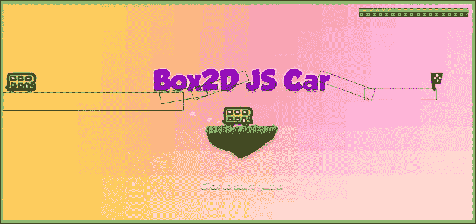

4.  现在，我们将继续讨论 JavaScript 部分。打开`html5games.box2dcargame.js`文件。
5.  使用以下附加变量更新`carGame`对象声明：

    ```html
    var carGame = {
       // game state constant
       STATE_STARTING_SCREEN : 1,
       STATE_PLAYING : 2,
       STATE_GAMEOVER_SCREEN : 3,

       state : 0,

       fuel: 0,
       fuelMax: 0,

       currentLevel: 0
    }
    ```

6.  现在，我们有了开始屏幕。不是一次启动游戏，而是加载页面。我们将显示开始屏幕，等待玩家单击游戏画布。将以下逻辑添加到`initGame`功能中：

    ```html
    // set the game state as "starting screen"
    carGame.state = carGame.STATE_STARTING_SCREEN;

    // start the game when clicking anywhere in starting screen
    $('#game').click(function(){
       if (carGame.state === carGame.STATE_STARTING_SCREEN) {
          // change the state to playing.
          carGame.state = carGame.STATE_PLAYING;

          // start new game
          restartGame(carGame.currentLevel);
       }
    });
    ```

7.  接下来，当玩家通过所有关卡时，我们需要处理游戏获胜屏幕。在 Wing flag 冲突检查逻辑中，我们使用以下逻辑来确定是显示下一级还是结束屏幕。在文件中找到`console.log("Level Passed!");`代码，将`restartGame`函数调用替换为以下代码：

    ```html
    if (cn.IsTouching()) {
      console.log("Level Passed!");

      if (carGame.currentLevel < carGame.levels.length - 1) {
        restartGame(carGame.currentLevel+1);
      } else {
        // show game over screen
        $('#game').removeClass().addClass('gamebg_won');

        // clear the physics world
        carGame.world = createWorld();
      }
    }
    ```

8.  然后，我们将处理游戏背景。我们为每个关卡设置准备了每个游戏背景。我们将在`restartGame`函数中切换背景，该函数对应于重建世界：

    ```html
    $("#level").html("Level " + (level+1));

    // change the background image to fit the level
    $('#game').removeClass().addClass('gamebg-level'+level);
    ```

9.  现在有了游戏图形，我们不再需要物理对象的轮廓图了。我们可以通过将`shouldDrawDebug`对象设置为`false`：

    ```html
    var shouldDrawDebug = false;
    ```

    来关闭调试图形
10.  最后，让我们添加一些约束。请记住，在我们的级别数据中，我们包含了汽车的神秘燃油数据。这是一个汽车燃料含量的指示器。我们将使用这种燃料来限制玩家的输入。每次对汽车施加力时，燃油都会减少。一旦燃料耗尽，玩家不能施加任何额外的力。这种限制使游戏更有趣。
11.  使用以下逻辑更新箭头键“`keydown`功能。新代码在此处突出显示：

    ```html
    switch(e.keyCode) {
      case 39: // right arrow key to apply force towards right
        if (carGame.fuel > 0) {
          var force = new b2Vec2(300, 0);
          carGame.car.ApplyForce(force, carGame.car.GetWorldCenter());
          carGame.fuel -= 1;
          $(".fuel-value").width(carGame.fuel/carGame.fuelMax * 100 +'%');
        }
        return false;
        break;
      case 37: // left arrow key to apply force towards left
        if (carGame.fuel > 0) {
          var force = new b2Vec2(-300, 0);
          carGame.car.ApplyForce(force, carGame.car.GetWorldCenter());
          carGame.fuel -= 1;
          $(".fuel-value").width(carGame.fuel/carGame.fuelMax * 100 +'%');
        }
        return false;
        break;
      case 82: // r key to restart the game
        restartGame(carGame.currentLevel);
        break;
    }
    ```

12.  另外，在重启游戏功能中的造车逻辑中，我们初始化燃料如下：

    ```html
    // create car
    if (obj.type === "car") {
       carGame.car = createCarAt(obj.x,obj.y);
     carGame.fuel = obj.fuel;
     carGame.fuelMax = obj.fuel;
     $(".fuel-value").width('100%');
       continue;
    }
    ```

13.  Now, run the game in a browser. We should get five graphic levels. The following screenshot shows how the last four levels look:

    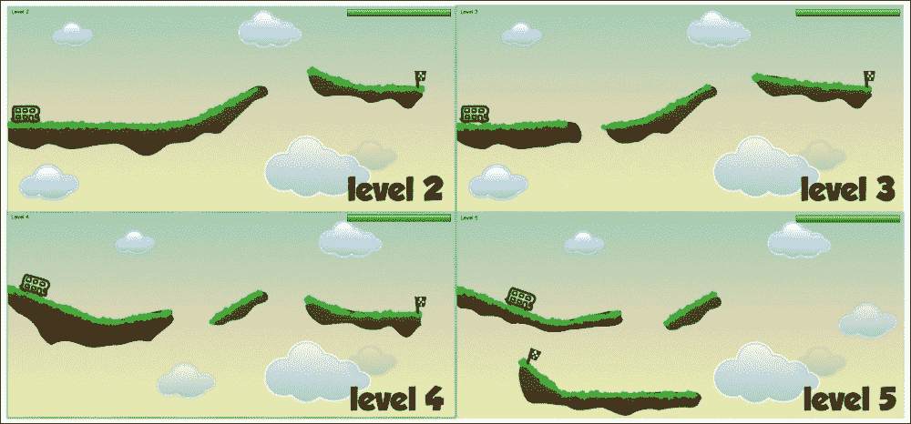

14.  After passing all the levels, we will get the following winning screen:

    

## *刚才发生了什么事？*

我们刚刚用更多的图形装饰了我们的游戏。我们还绘制了每个级别的环境，一个背景图像。下面的屏幕截图说明了可视背景如何表示逻辑物理框。与赛车和获胜旗帜不同，地面图形与地面物理无关。这只是一个背景图像，图形位于各自的位置。我们可以使用这种方法，因为这些逻辑框永远不会移动：


然后，我们可以为每个级别准备几个 CSS 样式，在类名中使用级别编号，例如`.gamebg-level1`和`.gamebg-level2`。通过将每个类与每个级别背景链接，我们可以使用以下代码在切换级别时更改背景：

```html
$('#game').removeClass().addClassddClass('gamebg-level'+level);
```

## 在施力时添加燃料以增加约束

现在，我们通过提供有限的燃料来限制玩家的输入。当玩家对汽车施力时，燃料会减少。我们使用了以下`keydown`逻辑来减少燃油，并防止在车辆燃油耗尽时产生额外的作用力：

```html
case 39: 
  if (carGame.fuel > 0) {
    var force = new b2Vec2(300, 0);
    carGame.car.ApplyForce(force, carGame.car.GetCenterPosition());
    carGame.fuel -= 1;
    $(".fuel-value").width(carGame.fuel/carGame.fuelMax * 100 +'%');
  }
```

## 在 CSS3 进度条中显示剩余燃油

在我们的游戏中，我们将剩余的燃料作为进度条呈现。进度条实际上是另一个 DIV 中的一个 DIV。下面的标记显示了进度条的结构。外部 DIV 定义最大值，内部 DIV 显示实际值：

```html
<div id="fuel" class="progressbar">
   <div class="fuel-value" style="width: 100%;"></div>
</div>
```

以下屏幕截图说明了进度条的结构：


使用此结构，我们可以通过将宽度设置为百分比值来显示特定的进度。我们使用以下代码根据燃油百分比更新进度条：

```html
$(".fuel-value").width(carGame.fuel/carGame.fuelMax * 100 +'%');
```

这是设置进度条并使用宽度样式控制进度条的基本逻辑。

# 增加平板电脑触摸支持

我们在[第 6 章](06.html "Chapter 6. Adding Sound Effects to Your Games")中添加了触摸支持，*为您的游戏*添加了音效。在这个游戏中，我们将添加触摸支持，使其可在平板电脑上玩。

# 行动时间-增加触摸支持

执行以下步骤，使我们的游戏在具有触摸输入的平板电脑中运行：

1.  在`index.html`文件中，我们在`#game-container`结尾之前添加了以下触摸控件：

    ```html
    <div id="left-button" class="touch-control"></div>
    <div id="right-button" class="touch-control"></div>
    <div id="restart-button" class="touch-control">Restart</div>
    ```

2.  我们还可以在`<head>`标签中添加一个`<meta>`标签来控制视口，使游戏适合 iPad 1024 像素的宽度。

    ```html
    <meta name="viewport" content="width=device-width, initial-scale=0.78, minimum-scale=0.78, maximum-scale=0.78">
    ```

3.  对于这些控件，我们添加一些基本样式来定位它们。为此，请将以下代码附加到`cargame.css`文件：

    ```html
    .touch-control {
      position: absolute;
    }
    #left-button {
      top: 0;
      left: 0;
      width: 50%;
      height: 100%;
    }
    #right-button {
      top: 0;
      right: 0;
      width: 50%;
      height: 100%;
    }
    #restart-button {
      top: 0;
      left: 50%;
      left: calc( 50% - 50px );
      width: 100px;
      height: 50px;
      text-align: center;
      line-height: 50px;
    }
    ```

4.  现在，我们移动到`box2dcargame.js`文件，我们添加了一个名为`handleTouchInputs()`：

    ```html
    function handleTouchInputs() {
      // Touch support
      if (!window.Touch) {
        $('.touch-control').hide();
      } else {
        $('#right-button').bind('touchstart', function(){
          if (carGame.state === carGame.STATE_STARTING_SCREEN) {
            // change the state to playing.
            carGame.state = carGame.STATE_PLAYING;

            // start new game
            restartGame(carGame.currentLevel);
          } else {
            carGame.isRightButtonActive = true;
          }
        });
        $('#left-button').bind('touchstart', function(){
          if (carGame.state === carGame.STATE_STARTING_SCREEN) {
            // change the state to playing.
            carGame.state = carGame.STATE_PLAYING;

            // start new game
            restartGame(carGame.currentLevel);
          } else {
            carGame.isLeftButtonActive = true;
          }
        });
        $('#right-button').bind('touchend', function() {
          carGame.isRightButtonActive = false;
        });
        $('#left-button').bind('touchend', function() {
          carGame.isLeftButtonActive = false;
        });
        $('#restart-button').bind('touchstart', function(){
          restartGame(carGame.currentLevel);
        })
      }
    }
    ```

    的函数
5.  我们在`initGame`函数中调用`handleTouchInputs`函数：

    ```html
    handleTouchInputs();
    ```

6.  我们持续施力，直到补漆事件。我们可以稍微调整该值以适合平板电脑。为此，在现有的`updateWorld`函数末尾添加以下代码：

    ```html
    // apply force based on the touch event
    if (carGame.isRightButtonActive) {
      if (carGame.fuel > 0) {
        var force = new b2Vec2(50, 0);
        carGame.car.ApplyForce(force, carGame.car.GetWorldCenter());
        carGame.fuel -= 0.1;
        $(".fuel-value").width(carGame.fuel/carGame.fuelMax * 100 +'%');
      }
    } else if (carGame.isLeftButtonActive) {
      if (carGame.fuel > 0) {
        var force = new b2Vec2(-50, 0);
        carGame.car.ApplyForce(force, carGame.car.GetWorldCenter());
        carGame.fuel -= 0.1;
        $(".fuel-value").width(carGame.fuel/carGame.fuelMax * 100 +'%');
      }
    }
    ```

7.  保存所有文件并在平板电脑（比如 iPad 或 Android）中运行游戏，我们应该能够通过按下游戏的左右两侧来控制汽车。我们也可以通过按下重新启动按钮来重新启动该级别。

## *刚才发生了什么事？*

我们刚刚为我们的游戏添加了触摸支持，使其可以在平板电脑上玩。我们为左右力创建了两个接触区域。我们还创建了一个只能在触摸设备上查看的重启按钮：

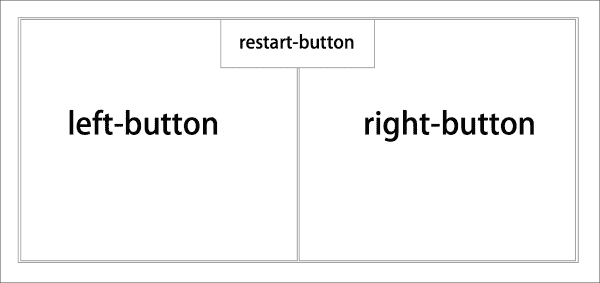

我们在这些按钮上收听和`touchstart`事件。`touchstart`事件不像`keydown`事件那样持续触发事件。我们需要一个布尔值来知道触摸是否已经开始并保持跟踪直到结束。在触摸按压过程中，我们采用`updateWorld`方法施力。频率不同，所以我们调整了力和燃料消耗的值，使其在平板电脑中工作得更好。

### 控制视口比例

在设计移动网页时，我们经常使用 viewport 告诉浏览器使用设备宽度作为网页的查看端口宽度：

```html
<meta name="viewport" content="width=device-width, initial-scale=1">
```

在游戏中，尤其是需要频繁点击的游戏中，我们可能希望通过将相同的值设置为最小比例和最大比例来修复缩放功能。此外，我们还可以控制缩放值来缩放游戏以适应平板电脑设备。

```html
<meta name="viewport" content="width=device-width, initial-scale=0.78, minimum-scale=0.78, maximum-scale=0.78">
```

### 触摸特定按钮

平板电脑和移动设备上没有键盘。我们必须为这些设备创建屏幕输入。在这个游戏示例中，我们创建了三个屏幕按钮：左、右和重启按钮。我们通过检查`window.Touch`的可用性将这些按钮隐藏在桌面中：

```html
if (!window.Touch) {
  $('.touch-control').hide();
}
```

# 总结

在本章中，您学到了很多关于使用 Box2D 物理引擎在画布中创建汽车冒险游戏的知识。

具体来说，我们使用 JavaScript 物理引擎来设置游戏。然后，我们在物理世界中创造了静态和动态物体。我们通过使用关节约束车身和车轮来设置汽车。我们通过给汽车加力，用键盘输入来控制它。最后，我们通过在物理世界中添加碰撞来确定游戏并升级。我们现在已经学习了如何使用 Box2D 物理库创建基于画布的物理游戏。

在下一章中，我们将讨论不同的分销渠道，并将我们的游戏放到一个本地 Mac 应用中。