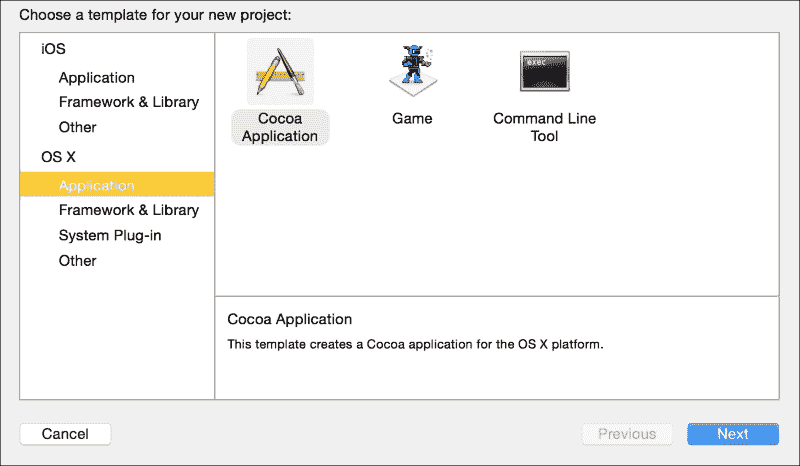
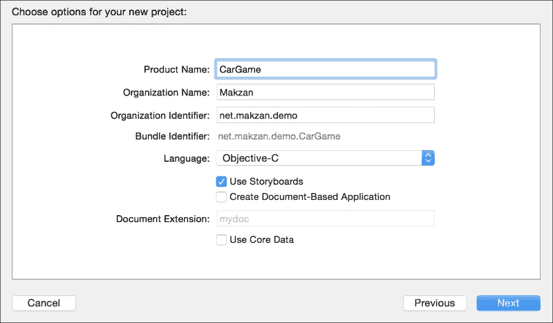
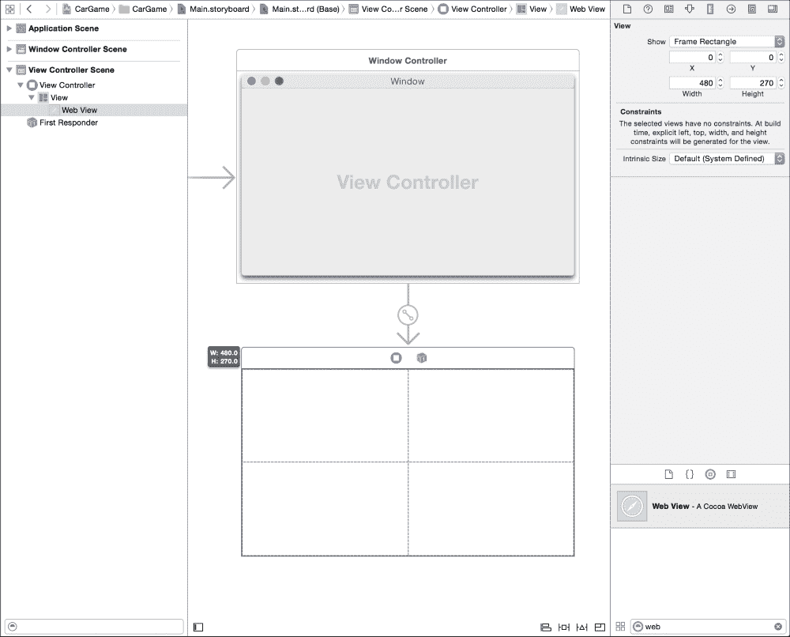
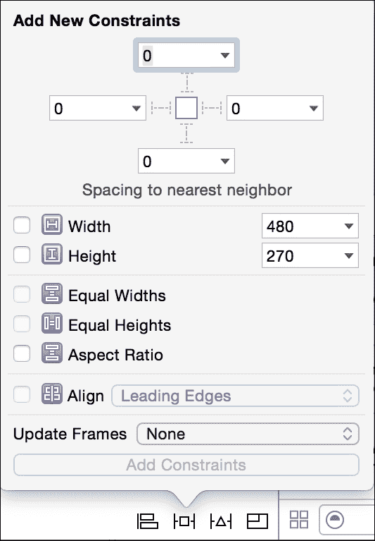
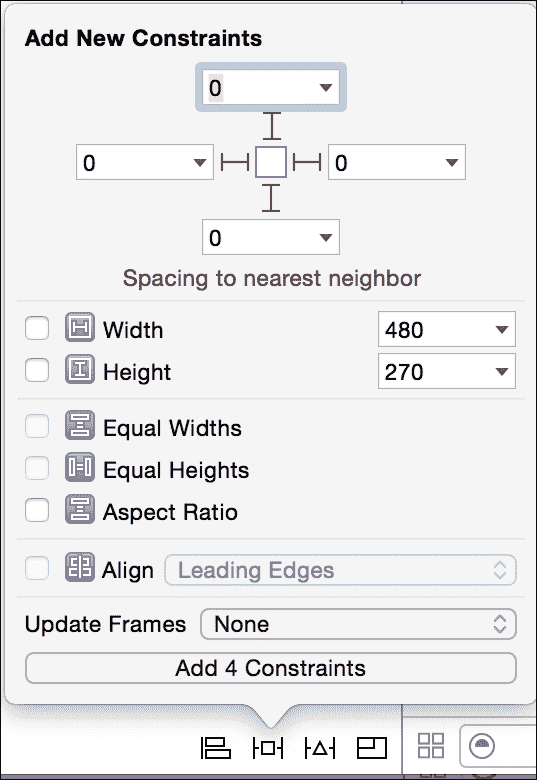
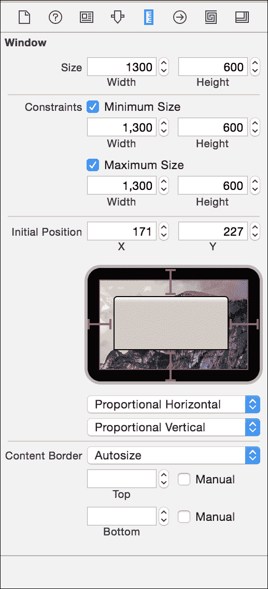
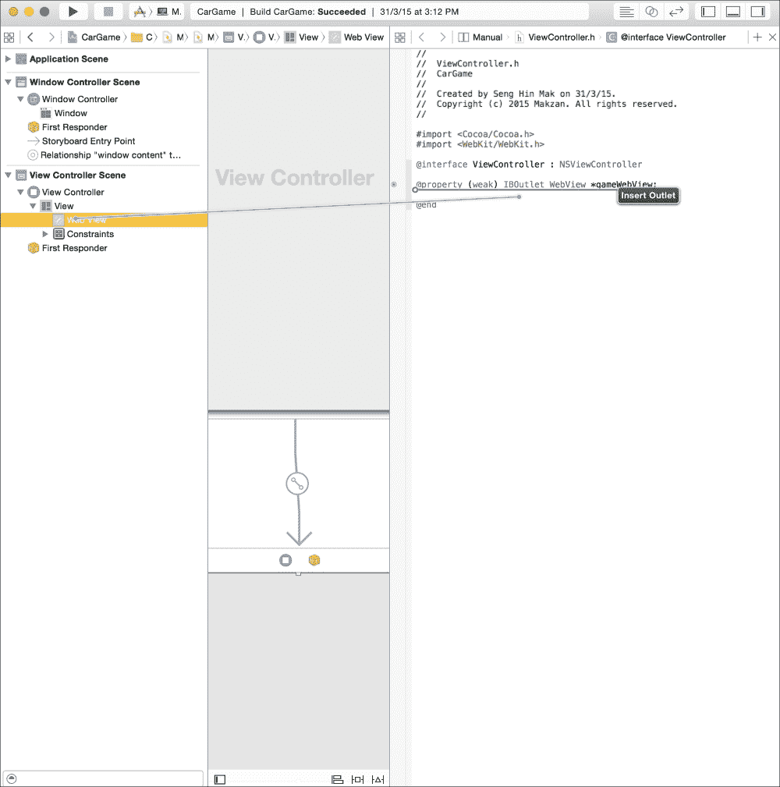
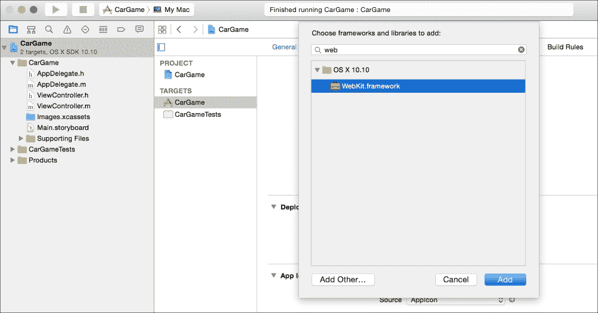
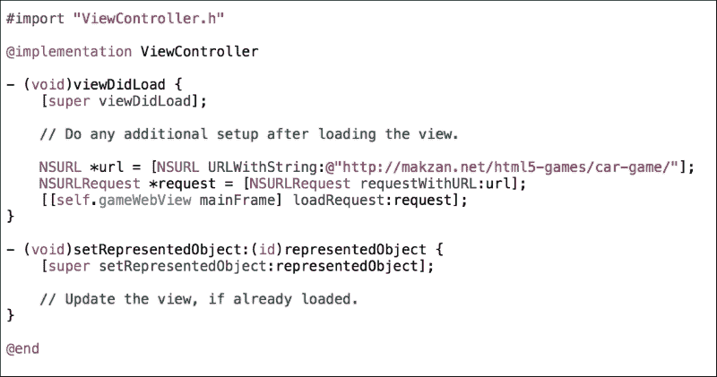
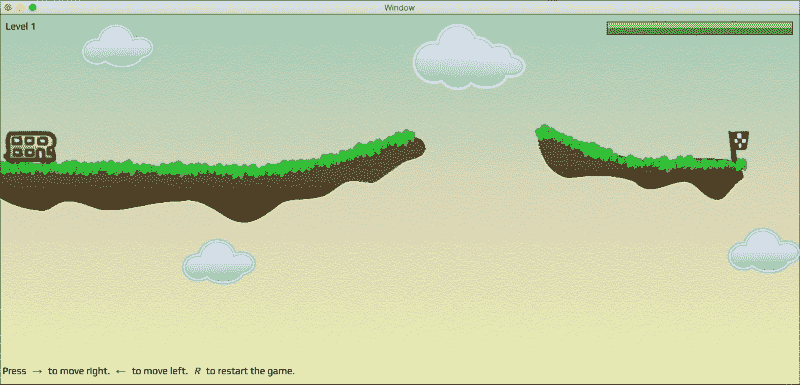

# 十、部署 HTML5 游戏

*我们在整本书中创建了几个 HTML5 游戏。在本章中，我们将讨论几种方法，通过这些方法我们可以部署我们的游戏，让其他人玩。*

在本章中，您将学习以下主题：

*   将游戏部署到网页。
*   将游戏部署为移动 web 应用程序。
*   将游戏包装到 OSX 应用程序中。
*   将游戏部署到应用商店。

有不同的渠道部署 HTML5 游戏。我们可以将游戏放在普通网页上，也可以将其部署为移动 web 应用程序。否则，我们可以在 Chrome 网络商店上部署游戏。对于本地应用商店，我们根据游戏类型提供不同的应用商店选项。我们选择桌面或移动应用商店来部署我们的游戏。对于桌面游戏，我们可以将游戏部署到 Mac App Store 或 Windows Store。对于移动设备的游戏，我们可以将其部署到 iOS 应用商店和 Android 应用商店。

将 HTML5 游戏部署到应用商店的最直接方法是使用目标平台的 Web 视图组件托管 HTML 文件和相关资产。

# 准备展开材料

在部署游戏时，我们通常需要准备店铺列表。这意味着我们需要制作应用程序图标、几个屏幕截图和游戏描述。一些商店可以选择接受短的游戏视频。

# 将游戏放到网上

服务器的要求取决于我们在游戏中使用的技术。对于只涉及客户端 HTML、CSS 和 JavaScript 的游戏，我们可以使用任何 web 托管，包括静态网站托管服务。通常，这些静态托管服务允许您以 ZIP 文件或通过 Dropbox 等云存储轻松上传网站。

亚马逊 S3也是一个负担得起的静态网站托管选择。例如，我的 HTML5 游戏托管在 S3 上，使用**Amazon CloudFront**作为内容交付网络（CDN），以提高缓存和加载性能。您可以在[上查看 HTML5 游戏的网站 http://makzan.net/html5-games-list/](http://makzan.net/html5-games-list/) 。

另一种流行且免费的静态网站托管方式是通过 GitHub 页面。GitHub是一个托管 Git 存储库的服务，它为每个存储库提供了一个静态网站托管功能。您可以在他们的指南[中了解更多信息 https://help.github.com/categories/github-pages-basics/](https://help.github.com/categories/github-pages-basics/) 。

### 注

本章中提到的一些服务要求您使用 Git 版本控制将代码推送到它们的服务器。Git 是一个代码版本控制系统。您可以通过在线资源[了解 http://git-scm.com/book/](http://git-scm.com/book/) 。

# 托管 node.js 服务器

对于需要服务器的游戏，例如多人游戏，我们需要托管游戏服务器。以我们的你画我猜游戏为例；我们需要一个支持 Node.js 服务器运行的主机。要获取支持运行 Node.js 的主机列表，请转到：[https://github.com/joyent/node/wiki/Node-Hosting](https://github.com/joyent/node/wiki/Node-Hosting) 。

其中一些应用程序（如 Heroku）在低使用率时是免费的，在应用程序流行并需要使用更多服务器资源后向您收费。这种定价模式有利于我们与公众一起测试游戏，而无需支付高昂的服务器租用费。

# 在主屏幕中部署为移动 web 应用程序

我们可以通过配置几个`meta`标签，使游戏能够安装在移动设备的主屏幕上。

# 行动时间-为移动 web 应用程序添加元标记

首先，我们将以音频游戏为例。让我们执行以下步骤：

1.  在代码编辑器中打开`index.html`文件。
2.  在 head 部分中添加以下代码。

    ```html
    <meta name="apple-mobile-web-app-capable" content="yes">
    <meta name="apple-mobile-web-app-status-bar-style" content="black">
    <link rel="apple-touch-icon" href="game-icon.png">
    <link rel="apple-touch-startup-image" href="launch-screen.png">
    ```

3.  在 iOS 设备或模拟器上测试游戏。要执行此操作，请尝试点击**共享**按钮，然后选择**添加到主屏幕**。你应该看到图标和游戏名称。继续将游戏添加到主屏幕。
4.  然后，从主屏幕打开游戏。它将以全屏模式打开。
5.  Double-click on the home button to enable the app-switching screen. You will be able to see that the app has its own place, similar to a natively installed application.

    ### 注

    如果您是在 Mac 上开发，您可以使用苹果免费 Xcode 开发 IDE 附带的 iOS 模拟器。只需将 HTML 文件拖动到模拟器中，就可以在 mobile Safari 中测试游戏。

## *刚才发生了什么事？*

我们添加了几个`meta`标签，这些标签可以被移动操作系统识别，特别是 iOS。移动网络应用的想法是在 2007 年第一部 iPhone 首次亮相时提出的。我们告诉系统，我们的 web 浏览器能够像应用程序一样显示。然后，根据用户的视角，系统使网页非常类似于应用程序。

默认图标大小为 60 x 60。我们还可以通过为 iPhone 和 iPad 指定每个尺寸来提供像素完美的图标：

```html
<link rel="apple-touch-icon" href="default-icon-60x60.png">
<link rel="apple-touch-icon" sizes="76x76" href="icon-ipad.png">
<link rel="apple-touch-icon" sizes="120x120" href="icon-iphone-retina.png">
<link rel="apple-touch-icon" sizes="152x152" href="icon-ipad-retina.png">
```

# 在 Mac OS X 应用程序中构建 HTML5 游戏

在本节中，我将向您展示如何用 Web 视图包装 HTML5 游戏，并将其构建到本机应用程序中。本节包括在不同开发环境中使用其他编程语言的代码。

# 将 HTML5 游戏放入 Mac 应用程序的行动时间到了

按照 macxcode 中的步骤操作。我们需要 Mac 和 Apple Xcode 来创建 Mac OS X 应用程序。如果您没有 Xcode，请从 Mac 应用商店下载它。

### 注

即使你没有 Mac 电脑，你仍然可以看看我们如何用应用程序包装 Web 视图。这个概念比本节中的步骤更重要。

1.  Launch Xcode and create a new project. Select **Cocoa Application** under **OS X**:

    

2.  In the Options View, give the name of the game as **Product Name**. **Organization Name** can be your name or a company's name. Use a reversed domain as **Organization Identifier**. Choose **Objective-C** for this code example. We keep the default value for the other options.

    

3.  Open the `Main.storyboard` file from the left panel. In the bottom-right panel, choose the third tab (which is highlighted in blue in the following screenshot). Drag the **Web View** component into the Window View. The Web View should become full width and height when you drag and drop it into the view:

    

4.  At the bottom of the window, there are several icons that configure how you can handle the resizing of the app window. Keep the **Web View** selected and then select the second icon that pops up a window, as shown in the following screenshot. Click on the four spacing icons that are beside the **0** input at the top to turn them into solid red lines:

    

5.  After selecting the four spacings at the top, click on the **Add Constraints** button. This tells the Web View to maintain **0** spacing between all the four edges when the window resizes.

    

6.  Then, we set the window size to fit our game. To do this, select the window. On the top-right panel, choose the fifth tab. Then, we make the window's size exactly 1,300 px width and 600 px height:

    

7.  然后，我们在**视图**菜单中启用**显示辅助编辑器**选项。保留左侧的`Main.storyboard`选项，打开右侧面板中的`ViewController.h`文件。
8.  On the left panel, identify the **Web View** component. Right-click on the component and drag it to the interface section in the `ViewController.h` file. This allows us to name the component for future reference. Name the Web View component as `gameWebView`:

    

9.  We have now configured the view. Let's move on to the code. We used the Web View component that is part of the WebKit framework. We need to include it in the project. To do this, select the **CarGame** project on the left panel. In the **Linked Framework and Libraries** section under the **General** tab, click on the plus icon to add the WebKit framework:

    

10.  Now, we should see `WebKit.framework` in the **Linked Frameworks and Libraries** section:

    

11.  点击`ViewController.m`文件，将以下代码放入`viewDidLoad`函数中：

    ```html
    NSURL *url = [NSURL URLWithString:@"http://makzan.net/html5-games/car-game/"];
    NSURLRequest *request = [NSURLRequest requestWithURL:url];
    [[self.gameWebView mainFrame] loadRequest:request];
    ```

12.  Now, your `ViewController.m` file should look like the following screenshot:

    

13.  Finally, click on the **Play** button on the top left of the Xcode that is shown in the following screenshot:

    

    单击 Play 按钮后，应用程序将构建并打开一个窗口，让我们的汽车游戏运行，如以下屏幕截图所示：

    

## *刚才发生了什么事？*

我们刚刚通过使用 Web View 组件将游戏包装为一个本机应用程序。我们使用 Xcode 和 Objective-C 演示包装 Web 视图的幕后场景。实际上，您可以在其他语言和平台中应用相同的技术，例如，在 iOS 中使用 Swift，甚至在 Windows 平台中使用其 Web 视图组件构建 Windows 应用程序。

# 将 HTML5 游戏构建成具有 Web 视图的移动应用程序

我们了解了如何在 Web 视图中包装游戏。这非常类似于将 Web 视图包装到移动应用程序中。例如，在 iOS 中，我们使用 Xcode 创建一个 iPhone 或 iPad 项目，并在默认视图中添加一个 Web 视图。在 Web 视图中，我们使用 Mac 应用程序部分中的类似技术加载 HTML 文件。

对于 Android 应用程序，我们可以使用 Android Studio。Android 使用不同的编程语言；它使用 Java，但概念是一样的。我们在主视图中创建一个 Web 视图组件，并通过 URL 加载 HTML5 游戏。

请注意，我们需要证书才能将 iOS 应用部署到应用商店。为了获得证书，我们需要加入苹果开发者计划，该计划需要年费。对于 Mac 应用程序，我们可以自己分发游戏，或者使用 Mac 开发者证书将其部署到 Mac 应用程序商店。

# 使用 PhoneGap 构建的构建

通过使用 PhoneGap 构建服务，还可以从 web 应用程序中构建 Android 和 iPhone 应用程序。该服务允许您上传网络游戏的 ZIP 文件。然后，它使用 Web 视图显示 HTML，类似于我们前面的 Web 视图示例。


不同之处在于 PhoneGap 通过其 JavaScript API 提供了多种硬件资源。因为我们的游戏没有使用任何 PhoneGap API，所以它给出的结果与我们自己包装 Web 视图并使用 PhoneGap 构建的结果几乎相同。

如果您没有任何本地编程经验，PhoneGap 或类似的云构建服务是一个不错的选择。如果您熟悉本机开发环境，我更喜欢自己包装 Web 视图。这为将来的开发提供了更大的灵活性，以防我们需要混合使用本机视图和 Web 视图，使其成为一个混合应用程序。

### 注

除了 PhoneGap 构建之外，还有其他一些服务试图将 HTML5 游戏放入本机应用程序平台。CocoonJS（[https://www.ludei.com/cocoonjs/](https://www.ludei.com/cocoonjs/) 是用于此目的的另一个平台。CocoonJS 尝试将画布绘图 API 转换为操作系统的 OpenGL 命令，以获得进一步的性能，而不是将 Web 视图包装在本机应用程序中。

# App store 的审核流程

每个部署渠道有不同的审查流程。例如，苹果通常需要 1 到 4 周的时间来审查该应用程序，然后才允许其进入应用商店。另一方面，谷歌经常花数小时在 Play Store 上查看应用程序。如果您是该商店的新手，通常需要额外一周的时间来熟悉其配置工具。因此，如果你需要将游戏推到应用商店的最后期限，比如客户端项目，那么提前 4 周做好准备。

### 注

我们没有将游戏上传到应用商店，因为它们的配置和商店列表可能会随着时间的推移而改变。重要的是准备好所有的材料和目标构建。在所有材料准备就绪的情况下，每个商店的上传和配置不应成为负担。

# 总结

在本章中，您学习了如何将游戏发布到不同的平台。具体来说，我们讨论了部署 HTML5 游戏的静态网站托管服务。我们列出了运行 node.js 的服务器。我们更新了代码，使其与主屏幕 web 应用程序配合良好。我们试图在 Xcode 中将 HTML5 游戏放到 Web 视图中。我们还讨论了移动应用程序的构建及其审查过程。

我们在九章中讨论了使用 CSS3 和 JavaScript 制作 HTML5 游戏的不同方面。我们学习了如何在 DOM 中构建一个传统的乒乓球游戏，并在 CSS3 中构建了一个卡片匹配游戏和一个带画布的解开谜题游戏。然后，我们探索了如何在游戏中添加声音，并围绕它创建了一个迷你钢琴音乐游戏。接下来，我们讨论了使用本地存储保存和加载游戏状态。我们还用 WebSockets 构建了一个你画我猜实时多人游戏。然后，我们在本章中创建了一个带有物理引擎的汽车游戏。最后，我们讨论了如何将 HTML5 游戏部署到不同的平台。

在整本书中，我们构建了不同类型的游戏，您学习了制作 HTML5 游戏所需的一些基本技术。下一步是继续部署您自己的游戏。为了帮助您开发自己的游戏，有一些资源可以提供帮助。以下列表提供了一些 HTML5 游戏开发的有用链接：

*   通用 HTML5：
    *   HTML5 游戏开发（[http://www.html5gamedevelopment.com/](http://www.html5gamedevelopment.com/) ）
    *   HTML5 岩石（[http://www.html5rocks.com/](http://www.html5rocks.com/) ）
*   HTML5 游戏引擎
    *   冲击 JS（[http://impactjs.com/](http://impactjs.com/) ）
    *   CreateJS（[http://createjs.com/](http://createjs.com/) ）
    *   移相器（[http://phaser.io/](http://phaser.io/) ）
*   游戏精灵和纹理
    *   迷失花园（[http://lunar.lostgarden.com/labels/free%20game%20graphics.html](http://lunar.lostgarden.com/labels/free%20game%20graphics.html) ）
    *   具有图形精灵、纹理和瓷砖集（[http://hasgraphics.com/category/sprites/](http://hasgraphics.com/category/sprites/) ）
    *   微妙的模式（[http://subtlepatterns.com](http://subtlepatterns.com) ）