# 第一章。通过第一场比赛了解工作室

欢迎使用 GameMaker 进行*HTML5 游戏开发！您即将进入激动人心的网络游戏开发世界。如果您以前从未使用过**GameMaker:Studio**，本书将向您展示有关使用该软件、制作游戏以及在互联网上发布游戏的所有知识。如果您以前有 GameMaker:Studio 的经验，但这是您第一次涉足 HTML5，本书将让您更好地理解开发单机游戏和基于浏览器的游戏之间的区别。请随意浏览本章并进入项目。*

现在如果你还在读这篇文章，我们可以假设你想了解更多关于这个软件的信息。你可能会问自己，“为什么我应该使用 GameMaker:Studio？HTML5 模块给了我什么功能？就这一点而言，什么是 HTML5？我为什么应该关心？”所有这些都是好问题，让我们试着回答它们。

# 简化 HTML 游戏开发

GameMaker:Studio 是一款功能强大且易于使用的制作游戏的开发工具。该软件最初设计用于课堂环境，作为学生学习基本编程概念、理解游戏架构和创建全功能游戏的一种方式。因此，由于采用了拖放式编码系统，开发环境对于初次使用的用户来说非常直观。与许多其他具有类似功能的竞争开发工具不同，GameMaker:Studio 有一种非常强大的脚本语言，允许用户创建几乎任何他们可以想象的东西。此外，您还可以轻松导入和管理图形和音频资源，集成神奇的 Box2D 物理库和内置源代码管理，为什么不使用它呢？到目前为止，制作游戏通常意味着你要创建一个独立的产品。

互联网并不是一个真正的考虑因素，因为它是相当静态的，需要大量专有插件来显示动态内容，如游戏、电影和音频。然后 HTML5出现并改变了一切。HTML5 是一个开放标准的代码语言集合，允许任何人和每个人开发交互式体验，通过现代浏览器和互联网连接，可以在任何设备上本地运行。开发人员现在可以使用最前沿的功能，如 WebGL（一个允许 3D 渲染的图形库）、音频 API和资产管理，来拓展您在浏览器中的功能范围。

### 注

并非所有浏览器都是平等的！虽然 HTML5 标准是由 W3C 制定的，但每个供应商的实现方式都不同。此外，目前并不是所有的标准都已制定，这意味着某些东西在某些浏览器中可能无法工作。例如，有多个音频 API 竞争成为标准。随着标准被锁定，浏览器变得更加兼容，这些问题应该消失。要查看您的首选浏览器对 HTML5的支持程度，请转到[http://html5test.com](http://html5test.com) 。

通常，为 HTML5 开发游戏需要具备三种不同编码语言的工作知识：**HTML5**（**超文本标记语言**），创建网页结构的代码语言，**CSS3**（**层叠样式表 3**，这决定了网站的呈现方式，而真正让魔术发生的是**JavaScript**。GameMaker:Studio HTML5 导出模块允许开发人员在集成环境中工作，只需按下一个按钮即可导出到这些语言，从而简化了所有这一切。HTML 导出模块不仅是一个游戏引擎，还包括处理 URL 和浏览器信息的特定功能。它还附带了自己的本地服务器软件，可以让你像在线一样测试游戏。最后，您可以进一步扩展 GameMaker:Studio，因为它允许您为任何需要或想要的功能导入外部 JavaScript 库。听起来不错，不是吗？现在让我们把录音室开动起来。

# 设置软件

为了使用这本书，我们需要一些软件。首先，我们需要兼容 HTML5 的浏览器，如 Mozilla Firefox、Microsoft Internet Explorer 9.0，或者为了获得最佳效果，需要谷歌 Chrome。其次，我们需要购买并安装带有 HTML5 导出模块的 GameMaker:Studio Professional。一旦我们拥有了所有这些，我们就可以开始制作游戏了！

### 注

请注意 GameMaker:Studio Professional 和 HTML5 导出模块是两个独立的项目，您需要拥有这两个模块才能为 web 创建游戏。

1.  购买并从[下载 GameMaker:Studio Professional 和 HTML5 导出模块 https://www.yoyogames.com/buy/studio/professional](https://www.yoyogames.com/buy/studio/professional) 。
2.  下载完后，运行程序`GMStudio-Installer.exe`。
3.  按照屏幕上的说明操作，然后启动程序。
4.  Enter your license key. This will unlock the software and the modules that have been purchased.

    

游戏制作人：工作室准备就绪，让我们开始一个项目吧！

1.  在**新建项目**窗口中，选择**新建**选项卡。它应该与前面的屏幕截图类似。
2.  GameMaker:Studio 通过为每个资源创建文件夹和项目文件来管理项目。为此，您需要指定存储游戏文件的目录。将**项目名称**字段设置为`Chapter_01`，点击**创建**。

# 我们第一次看演播室

现在我们有了软件并运行，让我们来看看接口 To0T0.GameMaker:Studio 的基本布局可分为四个部分：菜单、工具栏、资源树和工作区。我们将在本书中探讨这些组成部分，所以不要期望每一项都有细目。这不仅会让阅读变得令人难以置信的枯燥，还会耽误我们制作游戏的时间。相反，让我们专注于我们现在需要知道的事情。

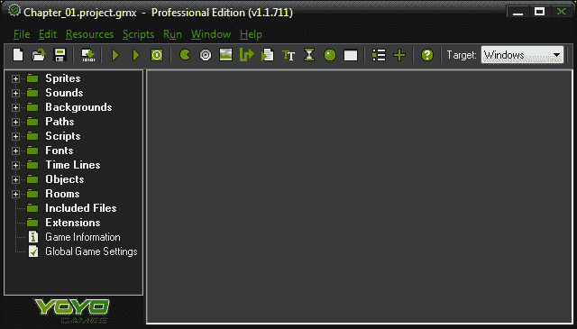

首先，与最复杂的软件一样，这些组件中的每一个都有自己的方式允许用户执行最常见的任务。例如，如果你想创建一个精灵，你可以导航到**菜单****资源****创建精灵**，或者你可以点击工具栏中的**创建精灵**按钮，或者你可以用鼠标右键点击资源树中的**精灵**组，或者你可以使用*Shift*+*Ctrl*+*S*打开工作区中的**精灵编辑器**窗口。实际上有更多的方法可以做到这一点，但你明白了。

虽然有许多重叠的功能，但也有许多事情只能在每个特定组件中完成。这是我们需要知道的。

## 菜单

**菜单**在中，您可以找到所需的所有编辑器和工具。这里有一些非常有用的工具，例如在脚本中搜索**的功能和**定义常量**的功能，这些功能仅在这里找到。为什么不花一点时间看看每一个菜单选项，这样你就可以了解所有你可以使用的东西了。我们会等的。**

## 工具栏

**工具栏**为我们将要使用的最常用的编辑器和工具使用简单的图形图标。这些按钮是创建新资产和运行游戏的最简单、最快捷的方法，因此希望经常使用这些按钮。工具栏上有一个非常重要、独特的元素：**目标**下拉菜单。**目标**决定了我们将编译和导出到的格式。将其设置为**HTML5**。

### 注

**目标**菜单的默认设置为**Windows**，因此请确保将其更改为**HTML5**。

## 资源树

**资源树**显示并组织为游戏创建的所有资产。保持项目的组织性不会影响软件的性能，但从长远来看，它会节省我们的时间并减少挫折感。

## 工作空间

**工作区**是所有编辑打开的地方。当游戏运行时，**编译器信息**框将出现在底部，并显示游戏运行时正在编译的所有内容。还有一个用于**源代码管理**的选项卡，如果您有用于分组工作的 SVN 客户端和存储库，则可以使用该选项卡。

### 注

如果您想了解更多关于源代码管理的信息，请查看以下 GameMaker:Studio wiki 页面：[http://wiki.yoyogames.com/index.php/Source_Control_and_GameMaker:Studio](http://wiki.yoyogames.com/index.php/Source_Control_and_GameMaker:Studio)

# 探索资源编辑

为了在 GameMaker:Studio 中创建游戏，您至少需要三种类型的资源资产：一个**精灵**（您看到的）、一个**对象**（它的功能）和一个**房间**（发生的地方）。除此之外，您还可以拥有**脚本、背景**、**声音**、**字体**、**路径**和**时间线**。

您可以带入 GameMaker:Studio 的每个资源都有自己的属性编辑器。为了熟悉其中的每一个，我们将构建一个非常简单的猫捉老鼠游戏。我们将创建一个玩家角色（鼠标），它可以在房间里走动、收集物品（奶酪）和躲避敌人（猫）。让我们通过创建一些精灵直接进入。

## 使用精灵属性编辑器加载您的艺术资产

精灵是位图图像，旨在用于对象的图形表示。这些图像可以是单个图像或动画图像序列。GameMaker 有自己的图像编辑器来创建这些文件，但也允许导入 JPG、GIF、PNG 和 BMP 文件。

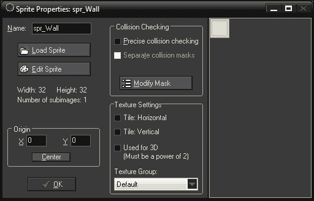

例如，我们将从创建两个精灵开始；一个用于墙，一个用于玩家角色。如果您已经下载了支持文件，我们已经在`Chapter_01`文件夹中为此提供了图像文件。

### 墙精灵

我们将从一个简单的精灵开始，它将代表我们游戏的墙壁。

1.  导航到**资源****创建精灵**创建新精灵。这将在资源树中创建一个精灵，并打开**精灵属性**编辑器。
2.  将精灵命名为`spr_Wall`。
3.  点击**加载精灵**打开精灵图像。在这个窗口的一侧有一个**图像信息**部分，在这里我们可以看到所选图像的预览，并选择激活几个选项。**使不透明**将删除选定精灵的所有透明度。**移除背景**将移除图像左下角像素中的所有颜色像素。**平滑边缘**将平滑图像的透明边缘，在导入动画 GIF 文件以去除硬边时非常有用。
4.  在未选中任何选项的情况下，打开`Chapter 1/Sprites/Wall.png`并单击**确定**。
5.  As you can see in the following screenshot, it has a width and height of 32 pixels and has one subimage. Nothing else needs to be changed, so click on **OK**:

    

### 玩家精灵

游戏中的玩家将是一只鼠标，精灵由两帧动画组成。

1.  创建一个新的精灵。
2.  将精灵命名为`spr_Player`。
3.  点击**加载精灵**并选择`Chapter 1/Sprites/Player.gif`。勾选**去除背景和平滑边缘**框。点击**确定**。
4.  Once again, it has a width and height of 32 pixels, but this has two subimages as shown in the next screenshot. This means it has animation! Let's see what each frame looks like by clicking on the arrow beside **Show**. It is useful to do this when loading animated images to ensure that all the frames are in the appropriate order and are aligned properly.

    

5.  将**原点**中的**X**设置为`16`，将**Y**设置为`16`，或者点击**中心**按钮即可。
6.  点击**确定**按钮。

祝贺您已经创建了第一个精灵。在下一章中，我们将更深入地探讨艺术资产的创作，因此让我们继续关注对象。

## 使用对象属性编辑器创建游戏对象

这就是游戏制作者工作室的真正力量所在。**对象**可以被认为是包含属性、事件和功能的容器，我们希望游戏中的每个项目都能完成这些属性、事件和功能。当我们将一个对象放入游戏世界时，它被称为**实例**，它将独立于该对象的所有其他实例进行操作。

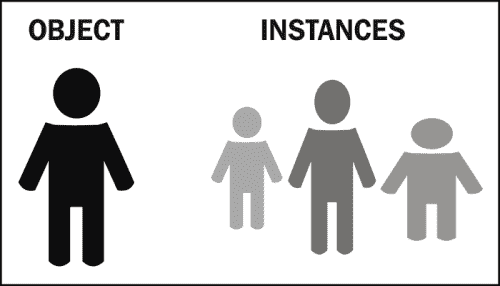

在我们继续之前，理解**对象**和该对象的**实例**之间的区别非常重要。对象是描述某事物的一组规则，而实例是该事物的唯一表示。一个真实的例子是*您*是*人类*对象的实例。*人*是指有胳膊、腿、说话、睡觉等的人。*你*是这些元素的独特诠释。这个概念的一个例子可以在前面的图表中看到。

之所以如此重要，是因为根据所使用的功能，效果将应用于该类型的所有项目或单个项目。一般来说，你不会想射杀一个敌人，然后让世界上所有的敌人都死去，是吗？


继续我们的示例，我们将创建一个墙对象和一个玩家对象。这堵墙将成为一个固定的障碍物，而玩家将拥有允许它在世界各地移动并与墙碰撞的控制装置。

### 墙壁物体

我们将以实心墙物体开始，我们可以用来为玩家创建一个迷宫。

1.  导航到**资源****创建对象**创建新对象。这将在资源树中创建一个新对象，并打开**对象属性**编辑器。
2.  将此对象命名为`obj_Wall`。
3.  Click on the input box in **Sprite** and select `spr_Wall`.

    GameMaker 处理与实体对象碰撞的方式与处理非实体对象的方式不同。如果实体对象和非实体对象发生碰撞，GameMaker 将尝试通过将非实体对象移回其先前位置来防止它们重叠。当然，为了正确地实现这一点，固体物体必须是静止的。因此，我们应该将实体属性添加到墙中。

4.  Click on the **Solid** checkbox and then click on **OK**.

    ### 注

    **Solid**属性只能用于不移动的对象。

### 玩家对象

玩家对象将向我们介绍如何使用**事件**和**动作**进行运动和碰撞等操作。

1.  创建一个新对象并将其命名为`obj_Player`。
2.  Select `spr_Player` as the Sprite.

    GameMaker 的力量来自其事件驱动系统。事件是在游戏运行过程中发生的时刻和动作。向对象添加事件时，要求该项在事件发生时响应该操作，然后应用指定的指令。

    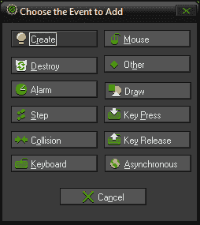

    听起来很简单，不是吗？当涉及到事件的顺序时，可能会有点混乱。GameMaker 将游戏分解为多个步骤（有限时间），每秒钟运行多个事件。某些事件按预设顺序发生，例如开始步骤，它总是在步骤的最开始处开始。每当调用其他事件时，都会发生其他事件，例如创建，它在创建对象实例时立即运行，以检查代码是在步骤的开始还是结束时发生。

    ### 注

    转到[http://wiki.yoyogames.com/index.php/Order_of_events](http://wiki.yoyogames.com/index.php/Order_of_events) 了解更多关于 GameMaker:Studio 的事件顺序。

3.  In the **Events:** area, click on **Add Event** and navigate to **Keyboard** | **Left**. This event will run code each step that the left arrow key is held down.

    **事件**需要**动作**才能应用于他们做任何事情。GameMaker:Studio 使用**拖放**（**DnD**系统），可以轻松实现代表常见行为的图标。根据功能，这些选项卡分为七个不同的选项卡。对于本书的绝大多数内容，我们将只使用**公共**选项卡中的执行脚本图标，因为我们将编写放入**脚本**中的代码。但是，在本章中，我们将使用 DnD 操作，以便您了解它们的作用。

4.  From the **Move** tab, select and drag the Move Fixed icon into the **Actions** area of the Left Key event.

    

    移动固定图标

5.  In the **Move Fixed** options box, there is an option for what object this action is to be applied to. We want this to be set to **Self**, so that it is applied to the instance of the player.

    

6.  点击左箭头指示我们希望移动的方向。
7.  将**速度**字段设置为`8`值。这将应用每步 8 像素的速度。
8.  确保**相对**未被*检查。Relative 将向当前值添加值。*
9.  点击**确定**。
10.  Repeat steps 4 to 9 for the other keyboard arrows (right, up, and down) with the same **Speed** and the appropriate direction.

    现在我们有了一个对象，当按下箭头键时，它将在世界各地移动。然而，如果我们运行这个，一旦我们开始移动，我们将无法停止。这是因为我们将速度应用于对象。为了使物体停止运动，我们需要给它一个零的速度。

11.  在**事件：**区域，点击**添加事件**并导航至**键盘**|**无键**。这是一个特殊的键盘事件，只有在没有按键时才会发生。
12.  选择并将移动固定图标拖动到操作区域。
13.  Set the direction to be in the center and set the **Speed** field to `0`.

    我们需要做的最后一件事是添加碰撞检测。GameMaker:Studio 中的冲突是由两个实例组成的单个事件。每个实例都能够在这个单一冲突上执行事件调用，不过通常只将代码放在其中一个实例上更有效。在我们的例子中，将碰撞事件放置在播放器上是有意义的，因为当它与墙碰撞时，播放器将是执行某些操作的实例。这堵墙将保持原样，什么也不做。

14.  点击**添加事件**并导航至**碰撞****obj_ 墙**。
15.  Drag the Move Fixed icon into the **Actions:** area.

    

16.  将方向设置在中间，**速度**字段设置为`0`。点击**确定**。

演员们准备好了；我们有一些可以看到的物体，可以做一些事情。现在我们需要做的就是把这些放进一个房间。

## 使用房间属性编辑器创建世界

房间代表我们的对象的实例所在的世界。您创建的大多数房间可能会用作各种标高，但房间也可用于：

*   前端菜单屏幕
*   非交互场景
*   Any self-contained environment you need

    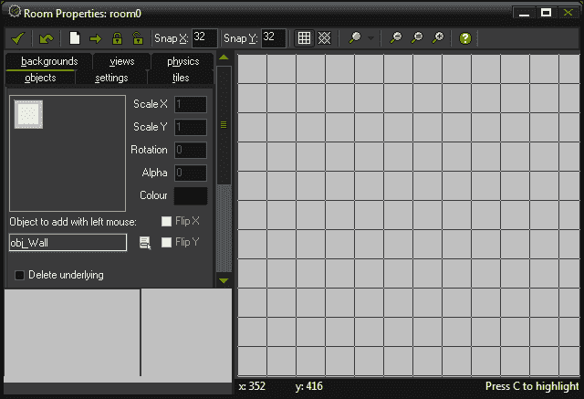

我们想要建立一个既能容纳球员又能带来一些障碍的世界。为了做到这一点，我们将在房间的外边缘放置下墙物体，并在中心放置几行。

1.  导航到**资源****创建房间**创建新房间。这将在资源树中创建一个新的文件室，并打开**文件室属性**编辑器。
2.  为了便于放置，请将**捕捉 X**和**捕捉 Y**字段设置为`32`。这将创建一个放置网格，每 32 像素有一个捕捉点。
3.  选择**设置**选项卡。在这里，我们可以更改房间的基本属性、大小、每秒步长和房间名称。
4.  将房间命名为`rm_GameArea`。
5.  We will leave the room **Width**, **Height**, and **Speed** fields at their defaults as seen in the following screenshot:

    

6.  选择**对象**页签，用鼠标左键在**对象下选择`obj_Wall`。**
7.  In the upper-left corner of the room, click with the left mouse button to place an instance of the wall.

    现在你可能会想，建造这个房间要花很长时间，一点一点。别担心，有一个更简单的方法。如果您按住*Shift*+*Ctrl*，您将能够用实例描绘世界。如果您犯了一个错误，想要删除一个实例，只需鼠标右键单击删除一个实例，或者按住*Shift*键即可对实例进行反绘制。如果您只想稍微移动实例，而不是在整个网格单元中，请按住*Alt*键。

8.  Holding down the *Shift* + *Ctrl* keys and the left mouse button, draw the perimeter walls. Also lay down two extruded sections as shown in the following example screenshot:

    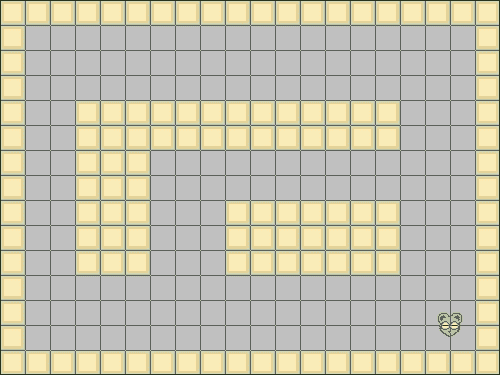

    别忘了加入玩家！

9.  在**对象**选项卡中，选择`obj_Player`。
10.  将`obj_Player`的单个实例放入房间右下角的房间中。
11.  单击**房间属性**编辑器左上角的复选标记关闭房间。
12.  现在，我们已经具备了在 GameMaker:Studio 中运行游戏所需的所有必要元素。在我们测试游戏之前，我们应该导航到**文件****保存**来保存我们的工作。

## 运行游戏

在创建游戏时，可以进行三种不同类型的编译。如果游戏 100%完成，您可以为目标平台选择**创建应用程序**。如果游戏仍在开发中，则有**正常运行**，可以像应用程序一样编译和运行游戏；还有**以调试模式**运行，可以运行调试工具。

我们不要再等了。导航至**运行****运行游戏**，或按*F5*运行游戏。

如果一切正常，玩家对象应该能够使用箭头键在世界各地移动，但不能通过任何墙对象。然而，有些事情并不完全正确。由于正在设置动画，播放器对象似乎在闪烁。让我们在查看脚本属性编辑器的同时解决这个问题。

## 使用脚本属性编辑器引入代码

GameMaker:Studio 使用自己的专有脚本语言**GameMaker 语言**，也称为**GML**。这种语言的开发非常宽容新手用户，并且使用了一些在其他脚本语言中可能找不到的功能。例如，GML 将接受标准表达式`&&`来组合两个比较，或者接受单词`and`。GameMaker:Studio 通过为用户提供一组强大的函数、变量和常量，在创建游戏方面做了很多艰苦的工作。


如前所述，我们希望停止播放对象的动画。使用脚本很容易做到这一点。

1.  导航到**资源****创建脚本**创建新脚本。这将在资源树中创建一个新脚本，并打开**脚本属性**编辑器。
2.  将其命名为`scr_Player_Create`。在本书中，我们将在名称的末尾用事件的名称来命名我们的大多数脚本。在本例中，我们将把此代码放入`Create`事件中。
3.  要阻止精灵设置动画，我们只需将精灵的播放速度设置为零。在线**1**上，键入以下内容：

    ```html
    image_speed = 0;
    ```

4.  Close the Script by clicking on the check mark in the upper-left corner of the editor.

    为了让脚本运行，我们需要将它附加到一个对象。

5.  重新打开`obj_Player`的**对象属性**编辑器。
6.  添加一个**创建**事件。
7.  Navigate to **Actions** | **Control**, and select and drag the Execute Script icon into the **Actions:** area.

    

    执行脚本图标

8.  选择`scr_Player_Create`作为要执行的脚本，然后点击**确定**。

我们现在可以运行游戏了，我们看到玩家对象不再是动画。

## 使用背景属性编辑器填充场景

背景是一种特殊的艺术资产，分为两种不同类型：背景图像和瓷砖集。与精灵不同，背景从未将任何动画作为艺术资产的一部分。**背景图像**主要用作房间的大背景，如果您希望背景移动，则非常有用。**瓷砖集**是一种小艺术片，可用于绘制背景，有助于创建大型、独特的世界，并在计算上保持较低的图形成本。

### 注

如果需要，请使用背景图像：

*   背景中的一个大图像
*   要移动的背景

### 注

如果需要，请使用瓷砖集：

*   只有少数艺术资产可以创造出巨大的世界
*   向背景中添加唯一的详细信息

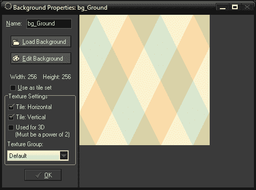

对于这个简单的示例，我们将创建一个静态背景。在下一章中，我们将进一步研究瓷砖集：

1.  导航到**资源****创建背景**创建新背景。这将在资源树中创建一个新的背景，并打开**背景属性**编辑器。
2.  将其命名为`bg_Ground`。
3.  点击**加载背景**打开`Chapter 1/Backgrounds/Ground.png`。
4.  Then click on **OK**.

    我们现在已经准备好了艺术品，我们只需要把它放在房间里。

5.  重新打开`rm_GameArea`。
6.  Click on the `backgrounds` tab.

    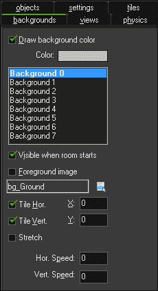

    每个房间最多可同时显示八个背景。这些背景也可以用作前景元素。如果没有激活的背景，它将显示纯色。

7.  选择**背景 0**，然后勾选房间启动时可见的**框。为了在游戏过程中看到背景，这必须是活动的。**
8.  选择`bg_Ground`作为要显示的背景。
9.  其他一切都可以保持默认状态。**地砖。**和**瓷砖垂直。应检查**，所有其他值应设置为`0`。
10.  单击编辑器左上角的复选标记关闭房间。

让我们再次运行游戏，现在我们可以看到我们有一个背景。事情看起来确实好转了，但也少了一些东西。让我们在游戏中加入一些声音。

## 使用声音属性编辑器带来噪音

声音属性编辑器是中的可以将声音引入游戏中。GameMaker 只允许您输入 MP3 和 WAV 文件。您可以使用两种类型的声音：

*   正常声音
*   背景音乐

正常声音是你听到的所有小声音效果，比如枪声和脚步声。这些文件通常应该是 WAV 文件。背景音乐适用于较长的声音，如游戏音乐，也适用于口语对话等。这应该是 MP3 格式。

当 GameMaker:Studio 为 HTML5 导出游戏音频时，所有声音都将转换为 MP3 和 OGG 格式。这是因为不同的浏览器在实现 HTML5 音频标记时使用不同的音频文件格式。幸运的是，GameMaker:Studio 自动将浏览器识别码添加到游戏中，这样游戏就知道使用了哪些文件。


我们将为游戏创建两种声音，一些背景音乐和一个可收藏对象的声音效果。

### 一点背景音乐

让我们在游戏中加入一些音乐来营造气氛。

1.  导航到**资源****创建声音**创建新声音。这将在资源树中创建一个新声音，并打开**声音属性**编辑器。
2.  将其命名为`snd_bgMusic`。
3.  加载`Chapter 1/Sounds/bgMusic.mp3`文件。如果你想听音乐，只需按播放按钮。听完后，按停止按钮。
4.  在**种类**下选择**背景音乐**作为类型，然后点击**确定**。

我们希望在比赛开始时就开始播放音乐。为此，我们将创建一个**数据对象**，我们称之为**霸王**。数据对象通常不会出现在游戏中，因此我们不需要为其指定精灵。

### 与霸主把持游戏

我们将使用一个霸王对象监视游戏并控制事物，如音乐和赢/输条件。

1.  创建一个新对象并将其命名为`obj_Overlord`。
2.  添加一个事件，然后导航到**其他****游戏开始**。这是一个特殊的功能，只有在游戏第一次开始时才会运行。
3.  Navigate to **Actions** | **Main1**, and select and drag the Play Sound icon into the **Actions:** area.

    

    播放声音图标

4.  Set the **sound:** field to `snd_bgMusic`, set **loop:** to `true`, and then click on **OK**.

    

    在我们测试这一点之前，我们需要确保霸主在世界上。当您将其放置到房间中时，它将由一个蓝色小圆圈图标表示，如以下屏幕截图所示：

    

5.  重新打开`rm_GameArea`。
6.  从**对象**选项卡中选择`obj_Overlord`并在房间中放置一个实例。

让我们来运行游戏并聆听。音乐应该立即开始播放，无限循环。让我们继续创建一个收藏品。

### 收藏品

我们将创建一个玩家可以在游戏中收集的对象。当播放器与之碰撞时，声音将播放一次。

1.  创建一个新声音并将其命名为`snd_Collect`。
2.  Load the `Chapter 1/Sounds/Collect.wav` file and set it to **Normal Sound**, and then click on **OK**.

    我们没有为此创建对象，也没有引入精灵。现在是你测试记忆力的机会。我们只会很快检查我们需要的东西。

3.  创建一个新精灵并将其命名为`spr_Collect`。
4.  选择**删除背景**和**平滑边缘**后，加载文件`Chapter 1/Sprites/Collect.png`并将其原点居中。
5.  创建一个新对象并将其命名为`obj_Collect`。
6.  将`spr_Collect`指定为其**精灵**。
7.  添加一个带`obj_Player`的**碰撞事件**。
8.  导航至**动作****主 1**，将播放声音图标拖入**动作：**区域。
9.  Set the `sound:` field to `snd_Collect` and set **loop:** to `false`.

    现在，当播放器与对象碰撞时，它将播放一次声音。这是一个好的开始，但是我们为什么不给球员多一点奖励呢？

10.  Navigate to **Actions** | **Score**, and drag the Set Score icon into the **Actions:** area.

    

    设置分数图标

11.  As can be seen in the next screenshot, set the new **score:** field to `50`, check the box for **Relative**, and then click on **OK**. This will add 50 points to our score each time the object is collected. **Relative** makes the score add to the previous score.

    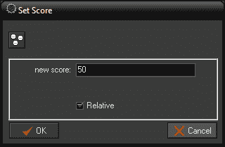

    现在我们有了一些值得收藏的东西。只有一个问题仍然存在，那就是我们只需要触摸物体就可以得到点和声音。我们不能让这种情况永远持续下去！

12.  Navigate to **Actions** | **Main1**, and drag the Destroy Instance icon into the **Actions:** area. This action will remove the instance from the world. Leave the values as they are, and click on **OK**.

    

    销毁实例图标

13.  We are done with this object, and if built correctly, it should look like the following screenshot. Click on **OK**.

    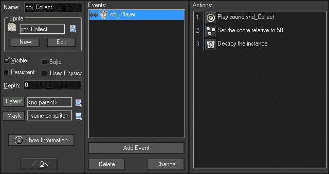

让我们把这些收藏品放进房间，开始游戏。我们应该能够将播放器移动到世界各地，并与收藏品发生碰撞。我们应该听到声音播放，物体就会消失。但我们的分数在哪里？为了显示它，我们需要输入一些文本。

## 书写文本和字体属性编辑器

您可以导入字体，将其用作游戏中的文本。这些字体需要安装在您的机器上，以便在开发过程中使用。每个字体资源都设置为特定的字体类型、大小以及是否为粗体/斜体。如果您想要一个微小的变化，例如字体比单独的字体资源大两个点，那么必须创建一个单独的字体资源。这是因为在导出时，GameMaker 会将字体转换为图像，这样就可以在用户机器上使用字体，而无需预先安装字体。

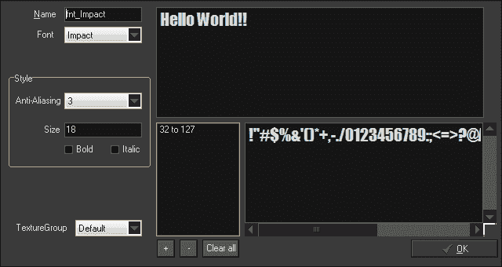

我们将创建一种字体，用于显示游戏的分数。

1.  导航到**资源****创建字体**创建新字体。这将在资源树中创建新字体，并打开**字体属性**编辑器。
2.  把这个命名为`fnt_Impact`。
3.  从**字体**下拉菜单中，选择**冲击**。这是默认的 Windows 字体。
4.  Set the **Size** to `16`. Then click on **OK**.

    我们现在有了一种可以在游戏中使用的字体。为此，我们将让霸王对象在屏幕顶部绘制游戏分数。我们还将使文本变为白色，并将其与中心对齐。

5.  重新打开`obj_Overlord`。
6.  Add a Draw GUI event by navigating to **Draw** | **Draw GUI**.

    ### 注

    绘制事件发生在每一步的最后，在计算完所有内容后，需要在屏幕上显示。Draw GUI 事件用于平视显示，将始终呈现在所有其他游戏图形之上。

7.  Navigate to **Actions** | **Draw**, and drag the Set Color icon into the **Actions:** area. This will open a dialog box where you can set a color.

    

    设置颜色图标

8.  We want to set the **color** to teal. In the color palette that pops up, select the teal color found on the bottom row, fifth column from the left. Click on **OK**.

    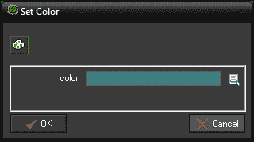

9.  Navigate to **Actions** | **Draw**, and drag the Set Font icon into the **Actions:** area. This will open up a dialog box with two parameters: the font to use and how it should be aligned.

    

    设置字体图标

10.  Set the **Font:** field to `fnt_Impact` and align it to `center`. Click on **OK**.

    

11.  最后，导航至**动作****评分**，并将抽签评分图标拖动到**动作：**区域。此将打开一个包含三个参数的对话框：x 和 y 坐标，以及一个可选的标题，可放置在实际分数前面。
12.  Set the **x:** field to `320`, the **y:** field can remain at `0`, and remove `Score:` from the **caption:** field, leaving it blank as can be seen in the following screenshot. Click on **OK**.

    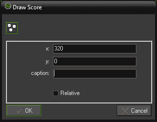

我们现在可以运行游戏，分数现在将显示在屏幕中央的顶部。当你现在与收藏品碰撞时，你会看到分数增加。

## 使用路径属性编辑器创建复杂运动

路径是为对象创建复杂运动模式的最佳方式。路径由一系列点组成，对象可以在这些点上移动。点之间的过渡可以是直的，这意味着对象将精确地击中每个点，或者弯曲，三个点之间的插值。路径可以是开放线或闭合环。以下屏幕截图将用作本节的参考图像。


我们将创建一个简单的敌人，沿着房间周围的路径。如果玩家与敌人相撞，玩家将被摧毁。让我们从创建路径开始。

1.  导航到**资源****创建路径**创建新路径。这将在资源树中创建一个新路径，并打开**路径属性**编辑器。
2.  将其命名为`pth_Enemy`。
3.  At the end of the editor toolbar we can set what room is displayed. This is very useful for creating accurate paths on a per room basis. Set this to `rm_GameArea`.

    

    要为路径添加点，只需在地图上的任意位置单击鼠标左键。第一个点将由一个绿色正方形表示，接下来的所有点都将是圆。

4.  将第一点放置在地图的`64`、`64`处。如果出错，可以始终将点拖动到正确的位置，也可以手动设置 X 和 Y 值。
5.  在这条路径上，我们将再添加五个点，如参考图像中所示。
6.  We will leave all the other settings at their defaults, so click on **OK**.

    路径已经准备好使用，现在我们只需要创建一个敌人来连接路径。这个敌人将沿着路径移动，如果它与玩家发生碰撞，它将重新启动游戏。

7.  创建一个新精灵并将其命名为`spr_Enemy`。
8.  选择**去除背景**和**平滑边缘**，加载`Chapter 1/Sprites/Enemy.png`并将原点居中。
9.  创建一个新对象并将其命名为`obj_Enemy`。
10.  Add a **Create** Event, navigate to **Actions** | **Move**, and drag the Set Path icon into the **Actions:** area. This will open the Set Path options dialog box.

    

    设置路径图标

    

11.  将**路径：**设置为`pth_Enemy`。
12.  将**速度：**字段设置为`4`。
13.  下一个选项确定当实例到达路径末端时应该发生什么。有**停止**、**从开始继续**（对于开放路径）、**从这里继续**（对于封闭路径）和**反转**方向的选项。最后设置**：**到**从这里继续**。
14.  The **relative:** option here determines whether the path starts where the instance is (relative), or whether the instance starts at the path's first point (absolute). As we built it to fit the room, set **relative:** to **absolute**. Then click on **OK**.

    我们现在有一个敌人准备沿着一条路走，但这并不是对玩家的真正威胁。让我们在敌人身上放置一个碰撞事件，并使其在接触时重新启动游戏。

15.  Add a **Collision** Event with `obj_Player`, navigate to **Actions** | **Main2**, and drag the Restart Game icon into the **Actions:** area.

    

    重新启动游戏图标

16.  敌人现在完成了，所以点击**确定**关闭它。
17.  在房间的任何地方放置一个敌人实例。确切的位置并不重要，因为当游戏运行时，它会将自己重新定位到正确的位置。
18.  保存游戏并运行它。我们应该看到敌人沿着房间周围的小路移动。如果玩家对象与之碰撞，游戏将重新启动。

我们现在在游戏中有一些风险，但没有足够的回报。我们来解决这个问题，好吗？

## 使用时间线属性编辑器生成收藏品

时间线是一种先进的时间跟踪系统，允许有限控制游戏过程中发生的事情。时间线由时刻列表组成。每一个时刻代表从时间线开始的若干步。

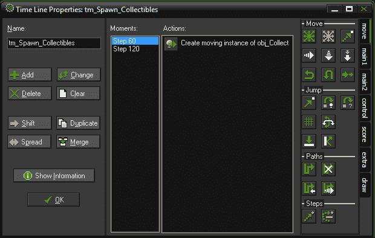

虽然时间线几乎可以用于任何事情，但时间线最常见的用途之一是生成实例。在这个游戏中，我们将使用它来产生我们的收藏品，这样玩家就有东西可以追逐。

1.  导航到**资源****创建时间线**创建新的时间线。这将在资源树中创建新的时间线，并打开**时间线属性**编辑器。
2.  将其命名为`tm_Spawn_Collectibles`。
3.  点击**添加**按钮，将**步骤**设置为`60`。
4.  We are going to make these collectibles move by applying a velocity to them. Navigate to **Actions** | **Main1**, and drag the Create Moving icon into the **Actions:** area.

    

    创建移动图标

5.  将对象设置为`obj_Collect`。
6.  我们希望产卵发生在屏幕外，这样玩家就不会看到它的存在。我们将水平移动这个收藏品，因此我们将从游戏区域的左侧开始。将**x:**字段设置为`-64`。
7.  我们不希望收藏品总是在完全相同的位置产生，所以我们将添加一个随机元素。我们将在屏幕顶部 48 像素和底部 48 像素之间的随机垂直位置创建实例。将**y:**字段设置为`random(394) + 48`。
8.  Give it a **speed** of `4`, and set the **direction:** field to `0`. It should look like the following screenshot. Click on **OK**.

    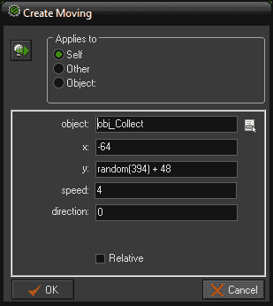

9.  Add another **Moment** at `120` and repeat the previous steps except this time make it vertical. To do this, the **x:** field should be set to `random(546) + 48`, the **y:** field should be `-64`, the **speed:** field should be `4`, and the **direction:** field should be `270`.

    我们现在有了一个时间线，每两秒就会产生一个新的移动收藏品。但是，我们需要将其附加到一个对象，所以让我们将其应用于`obj_Overlord`。

10.  重新打开`obj_Overlord`。
11.  In the **Game Start** Event that already exists, drag the Set Time Line icon into the **Actions:** area by navigating to **Actions** | **Main2**.

    

    设置时间线图标

12.  将**时间线：**字段设置为`tm_Spawn_Collectibles`。
13.  离开**位置：**在`0`处；这将从一开始就开始。
14.  将**启动**设置为**立即启动**。
15.  We want it to repeat itself infinitely, so set **loop:** to `Loop`.

    

给你！运行游戏，你应该会看到收藏品在两秒钟后开始繁殖，并继续被永久创建。从下面的屏幕截图中可以看到，我们的游戏已经完成，但还有一个组件需要查看。

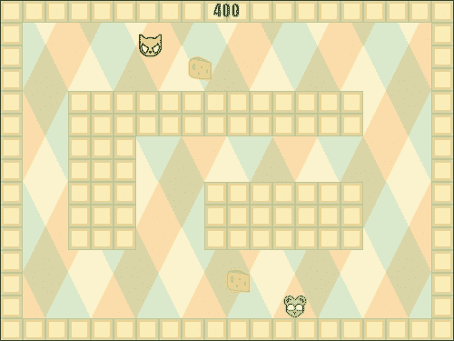

# 调试游戏的工具

无论你在编写脚本和制作游戏方面有多么丰富的经验，错误总是会发生的。有时可能是输入错误或缺少变量，在这种情况下 GameMaker:Studio 会捕捉到这一点并显示一个代码错误对话框。其他时候，游戏可能不会做你期望它做的事情，比如在你不应该做的时候穿过一堵墙。在这种情况下，代码在技术上没有问题，只是构造不当。如果没有调试工具，跟踪这些 bug 可能非常乏味，甚至不可能。为了使用这些工具，游戏必须在调试模式下运行，您可以通过点击工具栏中的**运行调试模式**按钮，或者进入菜单并导航到**运行**|**运行调试模式**来访问调试模式。

在调试模式中，我们可以利用**调试消息**帮助我们了解游戏中发生了什么。这些消息只能在编写脚本时通过`show_debug_message()`函数实现（没有拖放选项），并在执行该函数时显示在控制台窗口中。您可以使用它来传递字符串或显示变量，以便将结果与预期结果进行比较。这是你解决问题的第一道防线。

## 使用 HTML5 调试控制台

我们应该使用的第一个控制台是GameMaker:Studio 的 HTML5 调试控制台。当游戏以 HTML5 为目标并在调试模式下运行时，将随游戏一起创建一个弹出窗口，其中包含所有调试消息将出现的调试输出，以及实例列表及其基本数据信息。让我们测试一下这个控制台！

1.  We will start by adding the traditional `Hello World` debug message on the creation of the player. Reopen `scr_Player_Create` and add the following code at the end of the script:

    ```html
    myText = "Hello World";
    show_debug_message(myText);
    ```

    ### 提示

    **下载示例代码**

    您可以下载您在[账户购买的所有 Packt 书籍的示例代码文件 http://www.packtpub.com](http://www.packtpub.com) 。如果您在其他地方购买了本书，您可以访问[http://www.packtpub.com/support](http://www.packtpub.com/support) 并注册，将文件直接通过电子邮件发送给您。

    我们首先创建一个变量来保存字符串。虽然我们可以在不使用变量的情况下直接通过`show_debug_message`函数传递字符串，但我们将在稍后的调试测试中使用此变量。

2.  由于这个脚本已经附加到我们玩家的创建事件中，我们可以继续运行游戏。单击运行调试模式图标。
3.  When the game starts in the browser, a second window will pop up with the **DEBUG console** as seen in the next screenshot. If you do not see this window, check to ensure the browser allows pop ups. Scroll down to the bottom of the **Debug Output** column. Here you should see the debug message `Hello World`. This indicates that our code was successfully executed. If we didn't see it as expected, then we would have an idea of where the game is having issues.

    

4.  我们还可以在游戏中看到每个实例的所有属性，它们由实例号表示，包括房间中的当前位置、它显示的精灵等等。点击**实例**列中的任意一个数字，查看**实例数据**列中的属性。
5.  点击**暂停/恢复**按钮。这允许我们暂停游戏，如果您有大量调试消息充斥控制台，并且希望花时间查看发生了什么，这将非常有用。
6.  最后，我们可以点击**清除控制台**按钮，删除**调试输出**列中的所有内容。

祝贺现在可以开始调试脚本了。虽然在游戏开发过程中你会使用相当长的时间，但将活动消息的数量保持在最低限度是很重要的。发生如此多的调试消息，以至于您无法看到正在发生的事情，这是没有意义的！

## 使用 Windows 版本调试器

虽然你可以通过调试消息解决大部分问题，但有时你需要更多有限的细节来了解游戏中发生的事情。GameMaker:Studio 有一个更高级的调试器，只有当游戏针对 Windows 版本时才运行。如果我们不粗略地看一眼这个奇妙的工具，那我们就是失职了。

1.  Change the **Target** to `Windows` and run the game in the debug mode. When the game opens up, the **GameMaker Debugger** will be displayed in a separate window, as shown in the following screenshot:

    

    通过查看**房间速度：**（每秒步数）和每秒帧数（**FPS:**，可以立即显示一些基本信息，例如它的执行情况。如果您将鼠标光标移动到游戏中的实例上，您将注意到**鼠标 id:**将发生变化。此 ID 是该特定实例的唯一标识符，非常方便。

    **GameMaker Debugger**窗口提供了更多用于调试游戏的选项。**运行**菜单不仅允许我们暂停游戏，而且我们还可以一步一步前进。**Watch**菜单允许您跟踪特定表达式，例如函数调用或属性。**工具**菜单提供了我们所期望的调试消息的访问权限，但也可以显示所有全局变量、每个实例变量以及当前存在的所有实例的列表。让我们看一下这个控制台中实例的信息。

2.  导航至**工具****显示实例**。这将打开一个窗口，显示游戏中的所有实例。
3.  向下滚动列表，直到找到`obj_Player`。双击它，我们可以看到它的所有属性。很像 HTML5 调试控制台，我们可以看到它在世界上的位置以及它有什么精灵（通过精灵索引号）。但是，如果向下滚动列表，则会显示更多属性。事实上，如果我们查看列表的底部，我们可以看到`myText`变量。太棒了！

## 看一下 JavaScript 代码

我们最后要看的是编译的 JavaScript 代码。所有现代浏览器，如 Mozilla Firefox、Microsoft Internet Explorer 9.0和 Google Chrome都配有内置调试控制台，允许任何人查看任何网站的源代码，甚至影响本地屏幕上显示的内容。这是正确的。每个人都可以看到游戏的代码。虽然这可能会吓到你，但不要害怕！当 GameMaker:Studio 导出游戏或正常运行时，它会混淆代码，使其很难破译。另一方面，在调试模式下运行时，除了引擎本身之外，它不会进行任何模糊处理。

让我们来看看这个代码的样子。我们将从调试版本开始，这样我们就可以在不混淆的情况下看到它的外观。对于这个例子，我们将使用 Chrome，因为它有最健壮的调试控制台。

1.  将**目标**平台设置为`HTML5`，在调试模式下运行游戏。
2.  在游戏下方区域的浏览器窗口中，右键单击并选择**检查元素**。这将为 Chrome 打开**开发工具**。
3.  选择**源**选项卡，在左上角点击名为**显示导航器**的小图标。
4.  In the Navigator there is a directory tree. Open the folders until you find the `html5` folder. Inside this folder is the game. Click on the game and we should see all the code as can be seen in the next screenshot. If we scroll through the code we can clearly see the scripts we have created, properties of objects, and so on.

    

5.  Let's now take a look at the obfuscated version. Close down the browser tab and then run the game in normal mode. Repeat the same process and take a look at the code. It should look like the next screenshot. We can still read some bits and pieces, but none of it makes any sense. You can feel fairly secure that few people will want to mess with this.

    

# 总结

好了，给你。在本书的第一章中，您已经制作了您的第一款 HTML5 游戏。通过这样做，您有机会探索 GameMaker:Studio 界面并熟悉它。您还创建并实现了每种可用的资源类型，同时使用了所有不同的资源编辑器。希望您已经意识到，该软件可以让您非常轻松地为 web 制作游戏。利用您已经获得的知识，您可以开始制作更高级的游戏。例如，既然您知道如何使用按键事件、使对象移动以及如何处理碰撞，为什么不添加拍摄呢？

在下一章中，我们将深入探讨资产创造。游戏的好坏取决于它的外观和声音。我们将学习如何创建一个动画角色，建立一个瓷砖组来装饰房间，并使用音频来增加气氛。让我们继续前进，因为事情将变得更加激动人心！