# 二、3A 游戏：艺术与音频

现在，我们已经熟悉了界面导航，并且已经构建了一个简单的游戏，我们可以开始创建更复杂的项目了。在本章中，我们将重点介绍创建艺术、添加动画和实现音频音景。所有这三个元素对于游戏的制作都非常重要，因为它们都有助于玩家了解正在发生的事情，并使体验更具沉浸感。我们如何构建游戏会受到我们使用的资产类型和实现方式的极大影响。我们将从导入外部图像开始，接着介绍如何创建瓷砖集和制作动画角色的一些实际示例。然后我们将讨论音频文件以及如何为游戏添加环境。我们将以如何使游戏看起来更专业的简短谈话结束本章。让我们开始吧！

# 制造艺术品资产

通常情况下，在创建游戏时，大部分艺术资产将在外部程序中创建，并且需要导入。的确，GameMaker:Studio 确实有一个内置的图像编辑器，我们稍后将对此进行研究，但它的功能相当有限。它非常适合创作简单的艺术，但还有许多其他工具为我们提供了更先进的技术来创作复杂的艺术。

有许多流行的软件选项，您可能需要考虑。功能最全、价格最贵的是**Adobe Photoshop**，这是大多数专业艺术家的首选，可在[购买 http://www.photoshop.com/](http://www.photoshop.com/) 。具有许多类似功能的免费替代品是**GIMP**，可在[下载http://www.gimp.org/](http://www.gimp.org/) 。这两个软件包都提供了一整套用于创建图像的高级工具。还有许多其他更简单的工具可用，例如**Pickle**[http://www.pickleeditor.com/](http://www.pickleeditor.com/) 、**喷灯**[http://www.brashmonkey.com/](http://www.brashmonkey.com/) 和**PyxelEdit**[http://pyxeledit.com/](http://pyxeledit.com/) ，所有这些都是免费的，值得一看。

如果你只是想跳过艺术创作，喜欢一些预先制作的作品，有很多地方可以下载精灵。最受欢迎的精灵网站之一是**精灵资源**[http://spriters-resource.com/](http://spriters-resource.com/) 。他们拥有你能想象到的每一种游戏的资产。您也可以查看 GameMaker 论坛[http://gmc.yoyogames.com/](http://gmc.yoyogames.com/) 。在这里，你会发现许多积极的人愿意制作或分享他们的艺术资产。

## 了解图像文件格式

GameMaker:Studio 能够导入四种图像类型：BMP、GIF、JPG 和 PNG。每种格式都有其独特的功能和缺点，这将决定如何使用它们。**BMP**格式是目前使用最少的格式，因为数据没有压缩。由于文件较大，未压缩的图像通常被认为效率低下。**GIF**是唯一可以设置动画的格式，但仅限于 256 色和单一透明度级别。这是完美的经典 8 位风格的艺术，一切都有硬边。**JPG**图像的文件大小最小，这是因为缺乏任何透明度和有损压缩格式。这是一个很好的选择，背景和不透明的精灵只。**PNG**图像格式是最有用的格式，因为它们比 BMP 更高效，有 1600 万种颜色和全透明度，并且是 GameMaker:Studio 在游戏编译时作为纹理页面输出的格式。

在本书中，我们将只使用两种图像格式，GIF 和 PNG。我们将使用 GIF 图像制作所有动画，因为这是导入动画的最简单方法。与前一章一样，如果加载动画 GIF 图像，动画的每一帧都将在**精灵属性编辑器**中分离。不幸的是，这意味着我们仅限于 8 位艺术风格，由于单一的透明度，我们的角色具有硬边。如果我们想有一个更平滑，更干净的外观，我们将希望我们的边缘抗锯齿，这需要使用 PNG 图像。在 GIF 图像中尝试平滑边缘是艺术家可能犯的最常见错误之一。正如我们将在下面的屏幕截图中看到的，左侧是一幅具有清晰硬边的 8 位艺术风格的 GIF 图像，右侧是一幅具有平滑抗锯齿边的 PNG 图像。

在中间，我们使用了与 PNG 相同的平滑精灵，但保存为 GIF。请注意，曾经略微透明的边缘像素现在是纯白色轮廓。


# 进口雪碧床单

虽然本书中的动画都是为了方便起见而使用 GIF 图像，但如果我们不介绍如何导入**精灵表**，那将是疏忽。精灵工作表通常是一个 PNG 文件，对象（如角色）的所有动画帧均匀地放置在网格中。然后，我们可以在 GameMaker 中快速剪切动画的每一帧，以构建我们需要的单个精灵。让我们试试这个！

1.  让我们先打开一个名为`Chapter_02`的**新项目**。
2.  创建一个新精灵并将其命名为`spr_PlayerSpriteSheet`。
3.  点击**编辑精灵**按钮，打开**精灵编辑器**。
4.  在**文件**下，选择**从条带**创建，然后打开`Chapter 2/Sprites/PlayerSpriteSheet.png`，在**图像信息**部分不选择任何内容。这将打开**加载条形图**编辑器。
5.  我们刚刚加载的 sprite 表由六帧运行循环组成。由于我们需要所有的帧，我们需要将**图像数**设置为`6`。
6.  精灵工作表的布局有两行三个图像。将每行**图像**设置为`3`。
7.  Since each image is 64 x 64 pixels in size we need to set **image width** and **image height** to `64`. The other options for offsets and separation are not necessary for such a small sprite sheet, but they would come in handy if we had a complete set of animations for this character. The setting should look like the following image:

    

8.  点击**确定**。我们现在有了一个具有平滑边缘的动画精灵！
9.  我们喝完了这个雪碧。现在点击**精灵编辑器**和**精灵属性**编辑器的复选标记，点击**确定**按钮将其关闭。

# 介绍图像编辑器

使用 GameMaker:Studio 开发的一大好处是它有一个内置**图像编辑器**用于创建精灵和背景。这个编辑器看起来很基本，但是有很多优秀的工具可以使用。有各种不同的绘图工具，包括标准工具，如铅笔、橡皮擦和填充。编辑器中一个非常有用且独特的功能是能够使用两个鼠标按钮进行绘制。如下图所示，**颜色****左**和**颜色****右**颜色选项表示将使用的颜色，具体取决于鼠标左键还是右键。我们还可以通过**变换**和**图像**菜单进行多种调整。**变换**菜单包含影响图像中像素大小和位置的功能。**图像**菜单包含图像更改工具，如更改颜色、模糊图像和添加光晕的功能。

与其讨论图像编辑器，不如在其中构建一些艺术资产。我们将首先创建一个 tileset，然后移动到一个动画角色，这两个角色都可以在[第 4 章](3.html "Chapter 4. The Adventure Begins")、*冒险开始*中使用。如果您更愿意在外部编辑器中工作，请随时跟随，因为创建这些资产的一般理论有些普遍。

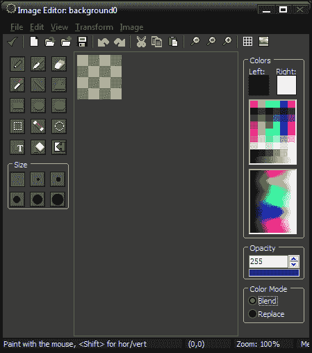

## 使用瓷砖集创建背景

**tileset**是一种特殊类型的背景资产，它允许游戏在环境中有巨大的变化，而无需使用大量计算机内存。保持文件大小和内存使用量小是很重要的，尤其是对于 HTML5 游戏。浏览器需要下载所有这些资产，因为我们不知道用户的计算机有多强大。

创建外观自然的瓷砖集完全是为了欺骗眼睛。我们的眼睛非常善于识别图案；当存在重复时，他们识别形状、对比度和颜色的差异。知道我们的大脑是以这种方式连接在一起的，这让我们能够利用这种优势。我们可以通过使用奇怪的形状、最小化对比度以及在我们的艺术品中使用相似的颜色来打破图案。

我们将为游戏中最常见的表面之一——石头地板——创建一个瓷砖集。现在这似乎很容易，但令人惊讶的是，这经常是错误的。

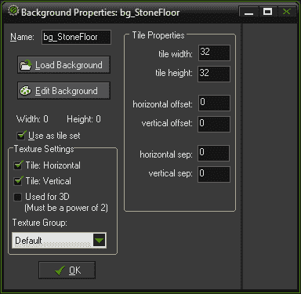

1.  创建一个新的后台资源并将其命名为`bg_StoneFloor`。
2.  因为我们希望这是一个平铺集，所以请确保选中**用作平铺集**的复选框。这将显示**瓷砖属性**，允许您设置瓷砖宽度和高度、偏移和间距。
3.  将**瓷砖宽度**和**瓷砖高度**设置为`32`，如上图所示。我们现在准备开始建造瓷砖。
4.  点击**编辑背景**按钮。这将打开**图像编辑器**。
5.  We are going to start by creating the master tile from which all other tiles will be based. In the **Image Editor**, Select **File** | **New** and set the **Width** and **Height** to `32`.

    

6.  Select the **Fill an Area** tool and apply a light gray color to the entire sprite. This is the base and we will change the colors later.

    在开始在一堆石头上作画之前，我们需要首先考虑潜在的问题以及解决这些问题的最佳解决方案。人们创建 tileset 最常见的问题是，他们从尝试创建最终产品开始，而不是按照最终产品进行构建。这包括选择颜色和添加细节，然后确保它实际上可以正确地平铺。

    在查看平铺纹理时，我们需要确保尽最大努力打破网格。整个世界都将基于 32 x 32 像素的小瓷砖，但我们不希望观众注意到这一点。因此，我们的目标是使用不规则形状，并尝试避免水平和垂直对齐。

    

7.  选择**在图像**上绘制工具和深灰色。
8.  To make life a bit easier we can zoom in on the image. This can be done with the magnifying glass or with the middle mouse scroll button.

    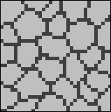

9.  画出小岩石的轮廓，但一定要记得在大小和形状上保持一点变化。另外，不要忘记将对角线的宽度保持为一个像素！完成此操作后，它应该与前面的示例屏幕截图类似。
10.  From the **Image Editor** menu, select **Transform** | **Shift**. This will open the **Shift the Image** dialog box that allows you to move pixels horizontally or vertically.

    

11.  将**水平**和**垂直**值设置为`16`并检查**水平缠绕**和**垂直缠绕**框。此将图像向下和向右移动 16 个像素（瓷砖大小的一半），并包裹剩余像素，如前一屏幕截图所示。
12.  Click on **OK**.

    通过移动像素，我们现在可以看到边缘是如何平铺的。你可能会注意到它并不完美。在下面的示例屏幕截图中，您可以看到有几行代码刚刚结束，没有创建完整的石头。你也可能不喜欢某些石头的大小或看到太厚的线条。这里的目标是解决这个问题，并重复这个过程，直到一切都按照你喜欢的方式排列。

    

13.  绘制线，并在必要时覆盖旧线，以修复任何看起来不正确的石头。
14.  Re-apply the **Transform** | **Shift** tool with the same settings. If you see errors, fix them and repeat until you are happy.

    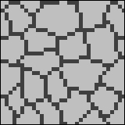

    一旦我们对瓷砖图案感到满意，并且它沿着边缘正确重复，我们就可以添加颜色了。一般来说，最好不要使用完全不饱和的灰色方案来表示石头，因为大多数石头都有一些颜色。选择颜色时，目标是避免仅使用具有明暗变化的单一颜色，而是选择一系列类似的颜色。要做到这一点，首先选择一个像米色这样的中性基色。从这里开始，每种额外的颜色在**色调**、**饱和度、**和**亮度**上都应该有轻微的变化。例如，第二种颜色可能比第一种米色略红、不太鲜艳、颜色更深。

15.  选择一个浅棕色，使用**填充区域**工具填充一些石头。
16.  Repeat this process with the other brown variants until there are no gray colored stones remaining.

    

17.  Once all the stones have been filled, we need to make sure it still tiles. Use **Transform** | **Shift** to see if the colors line up correctly. If there are any issues (as seen in the preceding screenshot) just adjust the colors until you are happy again.

    我们的基础瓷砖的最后一步是将深灰色线条改为深棕色。现在，您可能会认为这将是令人难以置信的乏味，但幸运的是，图像编辑器有一个工具使这变得容易。

18.  Select a dark brown color with the left mouse button. This color should appear under **Color** | **Left**.

    

19.  Select the **Change all Pixels with the Same Color** tool, as seen previously, and left click on one of the dark gray pixels. The stone outline should all be the dark brown color now, as we will see in the following screenshot:

    

    干得好！我们现在有了一个基础瓷砖来构建所有其他瓷砖。下一步是添加边框瓷砖，以便有一条用于分隔不同材质的边。如果我们想要一个正方形的房间，我们总共需要九块瓷砖：底层瓷砖和八块代表边缘和角落的瓷砖。让我们为画布添加更多空间，并用瓷砖填充。

20.  选择**变换****调整画布尺寸**。
21.  Increase the **New Size** | **Width** and **New Size** | **Height** by `300` percent or `96` pixels. Then under **Position** click on the center square so that the canvas expands all around the tile we created. The settings can be seen in the following screenshot.

    

22.  You will want to make sure that you line everything up correctly, so turn on the grid. Select **View** | **Toggle Grid** or click on the **Toggle Grid** icon.

    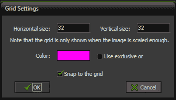

23.  At this point you probably can't see any grid. This is because the default grid is set to 1 x 1 pixel. Select **View** | **Grid Options** to open the **Grid Settings**. Change the **Horizontal size** and **Vertical size** to `32` and check **Snap to the grid**. Feel free to change the **Color**, as we did in the previous screenshot, if you want. Then click on **OK**.

    

24.  使用**选择区域**工具拖动选择整个基础瓷砖。
25.  **Copy** (*Ctrl* + *C*) and **Paste** (*Ctrl* + *V*) the tile and then drag it into one of the available spaces. Repeat this step until all nine spots have a base tile in them as seen in the following screenshot:

    

26.  Go back to the **View** | **Grid Options** and turn off **Snap to the grid**. Otherwise you will get very frustrated trying to draw the borders!

    

27.  We want a border of eight pixels in thickness. Using the same colors as the stones, use the **Draw a Line** tool to create a border around the outer perimeter of the tileset as seen previously.

    棒极了！我们现在有了一个基本的 tileset，让我们来测试一下。

28.  如果你还没有一个房间，那就新建一个房间。
29.  In the **Room Properties** editor, select the **tiles** tab.

    

30.  如果尚未选择，请将背景图像设置为`bg_StoneFloor`。
31.  To select a tile, just left click on the one you want to use in the preview area as seen in the preceding screenshot.

    当您想要放置奇数形状的瓷砖（树、路标）而不必为每种表面类型（石头地板、草地）创建新的瓷砖时，可以使用多层瓷砖，这非常有用。它还可用于编辑多个瓷砖，以创建更自然的表面，例如顶部设置有泥土瓷砖的石头地板。

32.  我们将保持这个简单，因此让我们将**当前瓷砖层**保留在`1000000`。
33.  In the room, use left click to place an individual tile or hold *Shift* to paint tiles in the room. Try to layout the tiles as if there were multiple rooms with hallways, much like the following screenshot.

    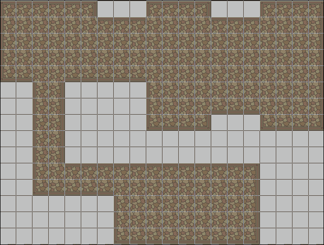

    它看起来相当不错，但有一些值得注意的问题，特别是内角没有边界。你也可能会觉得瓷砖在这么大的面积上重复得太多了。因为我们将为第一个问题创建更多的瓷砖，所以我们不妨为第二个问题添加一些瓷砖！

34.  如果`bg_StoneFloor`尚未打开，则重新打开`bg_StoneFloor`并选择**变换****调整画布大小**。
35.  Increase the size by `133` percent or to `128` pixels. Under **Position** click on the upper left arrow, then click on **OK**. It should now look like the following screenshot.

    

36.  选择**查看****切换网格**即可查看网格。我们需要复制原始的底砖，我们可以在第二行和第二列中找到。
37.  使用**选择区域**工具，从原始基础平铺中选择像素。
38.  将此平铺复制并粘贴到图像外边缘的每个空单元格中。
39.  We need to create four corner pieces to fix our room layout. For this we will use the four tiles along the right-hand side edge that we just placed. Use the **Draw on the Image** tool to draw the corner trim and repeat this for all four corner tiles.

    我们有三个沿底部剩余的瓷砖，我们将作为替代基础瓷砖使用。只要我们不影响外边缘周围的一个像素边界，我们可以根据需要改变内部，它仍然可以正确地平铺。

40.  Change the shape and alternate the colors of a few of the stones in the inner area of each of the three remaining tiles. The tileset, as seen in the following screenshot, is now complete!

    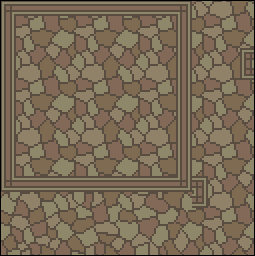

41.  Finally, go back to the room and place down the corner tiles where necessary and lay down a random variation of the alternate tiles.

    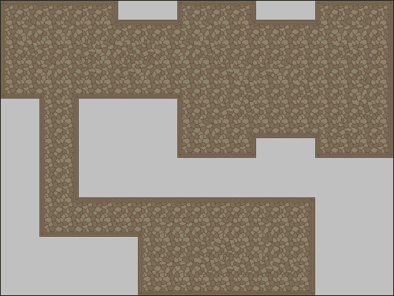

    如您所见，使用 128 x 128 的小纹理，我们可以轻松填充大面积，同时提供随机性的错觉。为了增加更多的变化，我们可以很容易地创建调色板交换版本，在那里我们可以调整色调和饱和度。例如，我们可以有一个蓝灰色的瓷砖集。通过更多的练习，我们可以开始添加阴影等细节，为世界添加更多的视角。对于所有未来的瓷砖集，只需记住使用非均匀形状，最小化对比度，并稍微改变颜色即可。更重要的是，在构建边缘和替代之前，始终确保基础平铺正确重复！

# 制作精灵动画

动画精灵是一系列静态图像，播放时，这些图像似乎有一个运动。它让玩家知道他们正在奔跑，当他们用剑攻击时，一个按钮是可以点击的。好的游戏在所有互动的东西上都有动画，而且通常在许多背景元素上都有动画，以至于你可能根本没有注意到。正是这些微小的细节，比如动画，才真正为游戏注入了活力。

## 行动的幻觉

制作动画需要时间和敏锐的眼光，但基本的动画，即使是角色，每个人都可以完成。要使动画制作更容易，需要遵循一些重要规则。首先，它是关于动作的外观，而不是动作的准确性。从下面的截图中可以看出，第一套剑摆动动画在技术上是准确的；剑会在每一个位置。然而，第二组将看起来更自然，因为它包括一个模糊的效果，人们会期待看到在剑摆动。

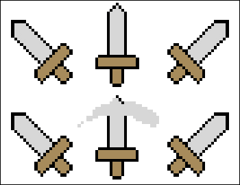

## 最大化精灵空间

第二条规则是最大化精灵空间。大多数游戏使用基于方框的碰撞，而不是像素完美的碰撞。因此，您希望为所需的动画使用尽可能多的精灵。开发人员通常会浪费大量空间，因为他们是根据真实世界而不是游戏世界来思考的。例如，在跳跃动画中可以看到一个常见问题。在下面的屏幕截图中，第一个跳跃动画中的角色从地面开始，向上跳到空中，然后坠落和着陆。第二个跳跃动画相同，但已删除所有空白。这不仅效率更高，而且还可以帮助防止碰撞错误，因为我们总是知道碰撞框在哪里。

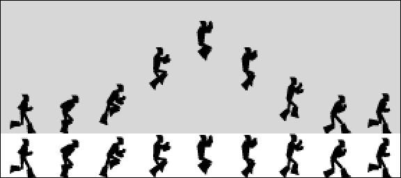

## 循环播放动画

最后一条主要规则，可能也是最重要的规则是可重复性。大多数游戏动画都会在某个点上循环，并且有一个明显的重复序列会让玩家非常不安。这些重复性问题的一个常见原因是动画过多。动画的帧数越多，就越有可能弹出某些内容。这里的关键是简单性和删除不需要的帧。在下面的屏幕截图中，您可以看到两个正在运行的动画，第一个有五帧，第二个只有三帧。由于步幅的细微差异，最上面的那一个看起来会更平滑，但重复性也会降低。最后的第二个看起来会更好，因为它有更少的帧和更少的步幅差异。


考虑到这三条规则，让我们构建一个简单的角色运行周期：

1.  创建一个新精灵并将其命名为`spr_WalkCycle`。
2.  点击**编辑精灵**；这将打开**精灵编辑器**。此编辑器用于处理构成动画精灵的所有单个图像。
3.  In the **Sprite Editor**, select **File** | **New** which will open a dialog box for the new image dimensions. Keep it at `32` x `32` and click on **OK**.

    

4.  You should now see, as in the previous screenshot, an empty image titled **image 0** in the **Sprite Editor**. Double click on the image to open the **Image Editor**.

    现在我们需要一个角色设计。在设计角色时，您需要考虑角色将要做什么、角色所在的世界以及碰撞区域。在我们的例子中，角色将只行走，世界将是一个户外冒险游戏，并将有一个大的方形碰撞盒。

    ### 注

    如果你不想创造你自己的角色，我们提供了一个精灵，`Chapter_02/Sprites/WalkCycle.gif`，第一帧动画。

5.  The first frame of animation that we will create should be the character at their full extension of their walk cycle, the legs far apart, and touching the bottom of the sprite. The character will be at the lowest point of the stride on this frame, so make sure that the head is at least one pixel, preferably two, away from the top of the sprite.

    

    在前面的截图中设计的角色是一个穿着夹克的猿类生物。穿夹克的原因是为了让手臂摆动时更容易阅读。我们可以看到，这个字符相当厚，这使得较大的碰撞区域更可信。最后，后腿有点暗，好像有阴影。同样，这有助于提高可读性。

    一旦我们对第一帧满意，我们需要移动到下一个关键帧。一个**关键帧**是动画中变化量最大的点。在这种情况下，角色将处于其最高点，并且手臂和腿相互交叉。

    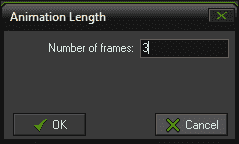

6.  在**精灵编辑器**中，选择**动画****设置长度**并将**帧数**设置为`3`，如上图所示。这将复制第一帧两次，为我们提供两个以上的动画帧。
7.  Open **image 1** and use the **Selecting a Region** tool to raise the upper half of the body to the top of the sprite as seen in the following screenshot. This frame will represent the highest point of the stride, where the character is on one foot with the other foot crossing over. We can also select and shift the hands and feet to quickly get them into position.

    

8.  使用铅笔和橡皮擦工具，将手臂和腿涂在适当的位置，抬起腿前方地面上的腿，只露出一只手臂。一旦您对它的外观满意，请关闭该图像。
9.  Open **image 2**. This is the opposite motion of the first frame which makes things quite easy to change. The hands and feet are already in position, so we just need to repaint the arms and legs accordingly, as seen in the following screenshot on the left-hand side. Once this is done, close the image.

    

10.  现在我们需要复制**图像 1**并将其放置在末端，以便行走循环可以循环。选择**图像 1**并复制粘贴边框。这将复制帧，并标记为**图像 2**。
11.  选择**图像 2**并点击**精灵编辑器**工具栏中的右向箭头。这会将帧移动到动画的末尾。选择并打开**图 3**以便我们可以重新绘制腿部，使后腿在地面上，前腿在空中，交叉。完成此操作后，关闭编辑器。
12.  To see how the animation plays, check the **Show Preview** checkbox in the **Sprite Editor** and set the **Speed** to `5`. See the following screenshot.

    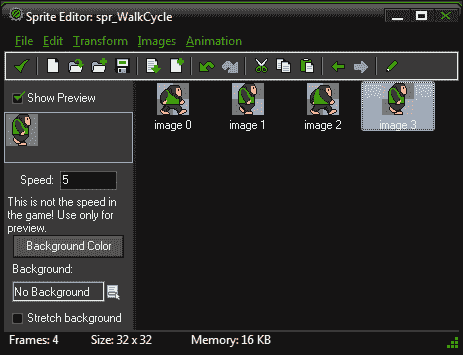

    好了！一个像样的步行循环，如果有点颠簸的话，也能正常循环。如果我们想让这个动画平滑一点，只需在关键帧之间添加一帧动画，然后按照刚才的步骤进行操作。它的最终外观应该与以下屏幕截图类似：

    

# 制造音频

音频对于创建专业质量的游戏来说极其重要。不幸的是，它往往是最被忽视的因素，也是最后一个需要实施的因素。其中一个原因是，我们可以在没有音频的情况下玩游戏，并且仍然可以享受这种体验。然而，游戏中良好的音景会让游戏更具沉浸感，并有助于改善用户反馈。

为了创建音频，我们需要使用外部软件，因为 GameMaker:Studio 没有任何内置的音频创建工具。有一系列的软件可供选择。为了制作音效和音乐，有一些流行的节目，如功能非常全的**Reason**、[等 http://www.propellerheads.se/](http://www.propellerheads.se/) ，模拟合成器、混音器和其他组件的机架。在自由端有**BFXR**、[http://www.bfxr.net/](http://www.bfxr.net/) ，可以在线制作游戏声音，还有**Sonant**、[http://sonantlive.bitsnbites.eu/](http://sonantlive.bitsnbites.eu/) 用于制作音乐。所有这些软件包都很有趣且易于使用。需要记住的一件事是，音频的创建非常具有挑战性。有时候下载一些免费的音乐或声音更好，而且有很多网站提供免费和可购买的音频。**Freesound**`http://www.freesound.org`拥有数千个音频片段，可供下载和使用。更为经典的 chiptune 音乐和声音风格是**8 位集合**、`http://8bc.org/`，一个专门提供游戏音频的网站。

## 了解音频文件格式

如果说添加音频还不够具有挑战性，HTML5 只会让它变得更难一点。我们将遇到的第一个困难是 HTML5 音频标签到目前为止还没有标准化。有两种文件格式竞相成为 HTML5 的官方标准：MP3 和 OGG。**MP3**文件格式是最常用的格式之一，但有被许可和获得专利的缺点，这可能导致支付大量费用。**OGG**文件格式既开放源代码又无专利，是一种可行的替代方案。最重要的是，各种浏览器对文件类型都有自己的偏好。例如，Internet Explorer 接受 MP3 但不接受 OGG，而 Opera 接受 OGG 但不接受 MP3。Google Chrome 和 Mozilla Firefox 正在对冲他们的赌注，并支持两者。GameMaker:Studio 通过在导出游戏时将所有音频转换为 MP3 和 OGG 文件格式来解决此问题。

# 使用 GM:S 音频引擎

GameMaker:Studio 配备了两种不同的声音引擎，用于控制游戏中的各种音频：**GM:S 音频**和**传统声音**。这些系统彼此完全独立，在游戏中可以有一个或另一个系统处于活动状态。

GM:S 音频引擎是一种新的、更坚固的音响系统，其设计目的是通过使用发射器和听筒来实现完整的 3D 音景。**发射器**允许在游戏空间中放置声音。有添加声音衰减、模拟运动的速度等功能。**听众**根据玩家在游戏中的位置，包括他们的方向和速度，通过听写声音的播放方式，给予更多的控制。如果您没有声明侦听器，那么这些声音将成为通用的。这将最终成为 GameMaker:Studio 中的主要音频引擎，但由于 HTML5 音频问题，它不能在所有浏览器中正常工作。

传统的声音引擎是 GameMaker 使用的原始声音系统，顾名思义，该引擎不再积极开发，许多功能已经过时。这是一个简单得多的系统，没有 3D 功能，尽管对于大多数游戏来说这已经足够了。这个引擎的一大好处是，音频可以在所有浏览器中工作。

在本书中，我们将使用传统的声音引擎来确保最大的性能，但我们需要知道如何在未来使用GM:S 音频引擎。让我们通过创建一个非常简单的位置声音演示来测试这些功能。我们将在房间中创建一个对象，让它播放一种只有当鼠标接近该位置时才能听到的声音。


1.  要选择您正在使用的系统，请单击**资源****更改全球游戏设置**。**常规页签**中有**使用新音频引擎**复选框；一定要检查这个。如果已检查，则表明它正在使用 GM:S 音频引擎；如果不是，则使用传统声音。
2.  创建一个新声音并将其命名为`snd_Effect`。
3.  加载`Chapter 2/Sounds/Effect.wav`。确保**类**设置为**正常声音**。
4.  创建一个新对象并将其命名为`obj_Sound`。
5.  创建一个新脚本并将其命名为`scr_Sound_Create`。首先，我们需要创建一个发射器并将其捕获到一个变量中：

    ```html
    sem = audio_emitter_create();
    ```

6.  接下来，我们将把发射器定位到对象所在的位置。此函数的参数为：应用此函数的发射器和 X/Y/Z 坐标。我们将使用对象的 X 和 Y，但由于这是一个 2D 示例，我们将 Z 设置为 0:

    ```html
    audio_emitter_position(sem, x, y, 0);
    ```

7.  我们还希望在发射器上有一个**衰减**，这样当听者靠近时声音会变得更大。我们拥有的参数有：发射器、声音在半音量下的距离、总衰减距离和衰减系数：

    ```html
    audio_emitter_falloff(sem, 96, 320, 1);
    ```

8.  发射器已全部设置好；现在让我们在发射器上播放声音。此函数的参数包括：发射器、要播放的声音、是否应循环以及其优先级。我们希望它能**循环**，这样我们就能听到声音：

    ```html
    audio_play_sound_on(sem, snd_Effect, true, 1);
    ```

9.  此代码已完成，当所有代码放在一起时应如下所示：

    ```html
    sem = audio_emitter_create();
    audio_emitter_position(sem, x, y, 0);
    audio_emitter_falloff(sem, 96, 320, 1);
    audio_play_sound_on(sem, snd_Effect, true, 1);
    ```

10.  添加一个**创建**事件，并将一个**控件****执行脚本**图标拖动到附加此脚本的操作中。
11.  声音现在将播放，但在我们有**监听器**之前，它不会有方向。我们将根据每一步鼠标的位置移动侦听器的位置。创建一个新脚本并将其命名为`scr_Sound_Step`。
12.  我们只需要一行代码来定位侦听器的 X/Y/Z 坐标。X 和 Y 将设置为鼠标 X 和 Y，Z 再次设置为`0`。

    ```html
    audio_listener_position(mouse_x, mouse_y, 0);
    ```

13.  在`obj_Sound`对象上，添加**步骤****步骤**事件，并将**执行脚本**图标拖动到附加步骤脚本的动作中。
14.  打开房间，将`obj_Sound`对象的实例放置在房间中央。
15.  运行游戏。

你应该能够安静地听到声音，当你移动鼠标靠近屏幕中心时，声音应该变得越大。如果您有环绕声或耳机，您还会注意到声音从左声道移动到右声道。这只是 GM:S 音频引擎的一个示例，一旦它在所有浏览器中都能正常工作，使用它将非常激动人心。

# 提高质量标准

当我们看到成千上万的游戏时，很容易从底层识别出顶级游戏。然而，当我们纵观所有最好的游戏时，它们之间有着明显的区别。有些游戏是极简主义的，有些是写实的，而另一些则是梦幻的。这些游戏可能由少数人或一个大型专家团队制作。是什么让本质上如此不同的游戏仍然能够达到相同的质量定义？答案很简单，可以用三个一般原则来概括：一致性、可读性和润色性。在创作高质量的艺术和音频的同时，它确实需要通过多年的学习和实践学到大量的技能。遵循这几条规则将有助于使任何游戏看起来更专业。

## 一致性

一致性听起来很明显，但它实际上比人们预期的更具挑战性。每个精灵、背景或其他艺术资源都需要使用相同的规则集构建。在下面的屏幕截图中，您可以看到飞机在城市背景下飞行的三种变化。第一幅图像是完全不一致的，因为它有一个带有像素块样式的平面和照片真实背景的平面阴影。下一幅图像比第一幅图像更加一致，因为城市是平阴影的，但缺乏像素块样式的清晰性。这是大多数人可能会停下来的地方，因为距离足够近，但仍有改进的余地。最终的图像是最一致的，因为所有的东西都有平面着色和像素块样式。

通过使平面变得更逼真，此过程同样容易在相反方向上工作。所需要的只是选择一组选项，并将其平等地应用于所有事物。


## 可读性

可读性是指确保向用户传达正确的信息。这可能意味着一系列的事情，比如确保背景与前景分开，或者确保可收藏的物品看起来不像危险品。在下图中，有两套药剂；一种是毒药，另一种是健康药。对于玩家来说，仅仅用不同的颜色并不像用骷髅来表示中毒和用心脏来表示健康那样易读。重要的是让玩家能够轻松理解正在发生的事情，以便他们能够对其作出反应，而不是沉思。


## 抛光

最后，最大的因素虽然通常最不明显，但却是波兰。波兰语是关于小细节的。这是一个范围广泛的元素，涵盖了从收集项目时的粒子效果到确保记分板正确居中的所有内容。在下图中，我们有两个带有统计条的化身图标。左边的那个功能正确，看起来不错。然而，右边的那一个看起来更加光鲜。统计条向左移动，以便它们与同样正确居中的化身图标之间没有间隙。希望你能看到一些轻微的调整可以大大提高抛光的质量。


# 总结

为游戏创作艺术和音频是一项艰巨的任务，无论是从所需的时间还是制作的资产来看。作为一名游戏开发人员，您有责任确保一切都具有凝聚力和美感，无论您是在创建资产还是与艺术家和声音设计师合作。在本章中，您已经开始了解 GameMaker:Studio 中艺术和音频的工作原理，以及“好”和“足够好”之间的区别。您了解了可接受的图像格式以及如何导入精灵工作表。您创建了一个 tileset，它将更好地利用计算机内存，并允许使用大型独特世界。您为精灵设置了动画并使其正确循环。您还学习了如何控制声音和听到声音的方向。你现在已经准备好开始制作真正的游戏了！

在下一章中，我们将构建第二个游戏，一个侧滚射击游戏。我们将创建一个在屏幕上移动的玩家，创建几个射击武器的敌人，创建移动的背景，并实现赢/输条件。最令人兴奋的是，我们将在学习**游戏机语言**（**GML**的同时完成这一切。