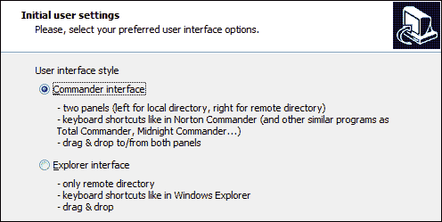
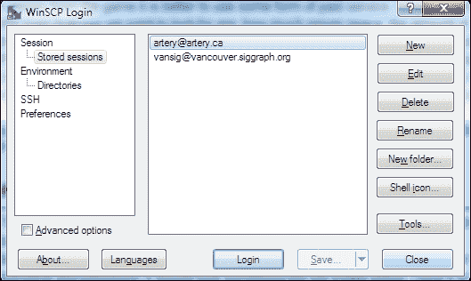
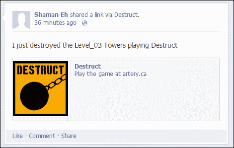
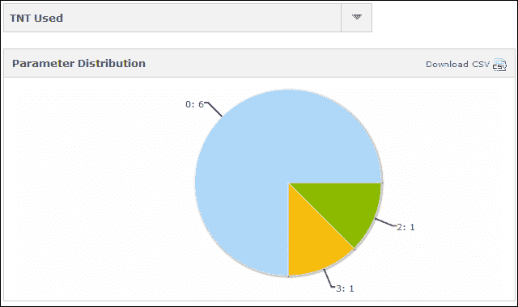

# 第九章。把你的游戏拿出来

经过所有的努力，我们的游戏已经准备好发布了。在本章中，我们将把我们的游戏上传到一个网络服务器，这样任何人都可以在互联网上玩。我们将研究如何允许用户登录他们的 Facebook 帐户，并将 a 级别的分数发布到他们的 Facebook 墙上。我们还将整合 Flurry 分析来跟踪有用的数据，这将使我们能够了解人们如何以及在哪里玩游戏。最后，我们将简要讨论从游戏中赚钱。

# 在自己的网站上发布游戏

为了让人们玩这个游戏，我们需要把它放到一个网站上，最好是你自己的网站上。这意味着我们需要找到一个地方来托管网站，导出游戏的最终版本，当然还要使用 FTP 程序，这样我们就可以上传游戏了。

## 创建应用程序

在整本书中，我们一直在使用 GameMaker:Studio 的内置服务器模拟器测试和玩我们的游戏。它可以让我们看到游戏的表现，就像它在一个实际的网站上一样，但它只能被我们正在开发的计算机访问。要将游戏上传到网站，我们需要将所有文件构建为正确的 HTML5 格式。

1.  打开我们一直在做的翻塔游戏，如果它还没有打开的话。
2.  在创建最终构建之前，我们应该查看一些可用的选项。导航至**资源****更改全球游戏设置**，然后进入**HTML5**选项卡。

在**常规**子选项卡中有四个选项部分，如下一个屏幕截图所示。查看**HTML5 文件选项**，如果我们想要页面上的特定布局或其他内容，可以使用自定义网页文件和自定义加载栏。创建这些文件需要了解 HTML 和 JavaScript，以及支持这些语言的代码编辑器，这两种语言都不在本书的范围之内。


**闪屏**是在游戏加载前看到的，实际上嵌入了`index.html`代码中。需要一个与游戏区大小相同的 PNG 文件；如果它的尺寸不同，它将被缩放以适合适当的尺寸。使用闪屏的一个缺点是将绘制图像而不是加载条。由于通常认为让用户知道发生了什么是最佳实践，特别是在加载数据时，我们不会在这个游戏中添加闪屏。

当我们编译游戏时，GameMaker:Studio 将在根目录中创建一个名为`favicon.ico`的文件，图标设置在**全局游戏设置**中。用户将在浏览器选项卡中看到此图标以及该选项卡显示的页面名称；将页面另存为书签时，也可以看到它。图标是大多数网站的共同特征，是一个 ICO 格式的小图像，用于显示网站的代表性符号。大多数图像编辑器不会以 ICO 格式保存，通常需要一个插件来完成。幸运的是，有很多免费网站可以将任何图像转换成我们的图标。我个人更喜欢使用[http://iconverticons.com/online/](http://iconverticons.com/online/) 因为他们接受最常见的图像格式，并转换为所有主要图标格式，包括 Windows、Mac 和 web 图标。一旦我们有了一个合适的 ICO 文件，我们就可以在游戏中使用它了。

1.  点击**更新**并加载`Chapter 9/Resources/Extras/GameIcon.ico`更新**图标**。点击**确定**。
2.  游戏现在可以输出了。导航到**文件****创建应用程序**并将游戏保存到游戏项目目录中名为`Destruct`的新文件夹中。
3.  点击**保存**，您将看到游戏编译并创建运行游戏所需的所有文件。在`Destruct`文件夹中，您应该看到两个文件和一个文件夹。有一个`favicon.ico`文件和一个`index.html`文件，这是显示游戏的网页。文件夹`html5game`包含所有资产，例如 OGG 和 MP3 格式的所有声音，一些以`index_texture`开头的 PNG 文件，其中包含编译成单个精灵表的所有图形，以及一个包含所有游戏功能的`index.js`文件。还有一个`particles`文件夹，其中包含用于粒子形状的所有图像。

## 主持比赛

游戏已经制作完成；我们只需要一个地方放它。在互联网上，有许多选项可用于托管游戏网站。从免费的网络托管到拥有个人服务器，以及两者之间的一切。选择主机可能非常耗时，因为所有不同的软件包、不同的价位以及我们的总体意图。每一个开发人员都需要考虑一些事情，比如预计有多少人玩游戏，将来还会增加更多的游戏，网站会对它进行广告等等。如果游戏只向家人和朋友展示，免费的网络托管服务可能就足够了，但如果目标是从游戏中赚钱，最好使用某种形式的付费服务。在选择提供商时，我们要查找的主要功能是：服务器空间大小、带宽大小、FTP 访问和最大文件大小。

此外，您应该确保该网站允许上传 MP3 文件，因为许多免费网站和少数付费网站不允许上传。流行的网站，如[www.godaddy.com](http://www.godaddy.com)和[www.globat.com](http://www.globat.com)提供了大量的服务器空间和带宽，价格非常便宜，适合大多数开发者，或者至少在他们首次发布游戏时。

为了进入下一步，请确保您已经保护了 web 服务器空间，并且您有 FTP 访问权。

## 使用 FTP 上传游戏

为了让我们的游戏进入服务器，我们需要使用 FTP 客户端来传输文件。有许多可免费下载的 FTP 客户端，如 WinSCP、CuteFTP 和 FileZilla。如果安装了适当的插件，某些浏览器可以用于 FTP，例如 Firefox 的 FireFTP。一些 web 托管服务甚至提供拖放 FTP 功能。对于本项目，我们将使用 WinSCP，可从[下载 http://winscp.net](http://winscp.net) 。

1.  Download the WinSCP client and install it according to the instructions. When the **Initial user settings** page appears, select **Commander interface** as shown in the following screenshot:

    

2.  运行 WinSCP。
3.  由于这是我们第一次访问网站的 FTP，我们需要点击**新建**来创建新的 FTP 会话。
4.  We need to select a file protocol method by navigating to **Session** | **File Protocol** to transfer the files. The default is **SFTP** (**Secure FTP**), but many hosting sites only allow for standard FTP access, so we will go with that. Navigate to **File Protocol** | **FTP**.

    ### 注

    有关如何配置 FTP 连接的说明，请参阅主机提供商的文档。

5.  Next we need to enter the server FTP address, often your website name, plus your username and password. It should look something like the following screenshot:

    

6.  为了便于将来访问该网站，我们可以保存这些设置，包括密码。点击**保存**。
7.  This will take us back to the login screen and we can now see the FTP connection in the **Stored sessions** list as shown in the next screenshot. To open a connection, we can double-click the site name, or select the site name and click on **Login**.

    

    如果已正确输入所有信息，则应打开一个目录窗口。如下一个屏幕截图所示，有两个带有文件目录的窗格。左侧为计算机的本地驱动器，右侧为服务器目录。服务器应该对根目录打开，尽管它可能显示在名为`www`或`public_html`的文件夹中。目录中可能已经至少有一个文件，`index.html`，这将是人们进入域时看到的默认页面。

    

8.  在左侧面板中，找到我们的游戏导出到的`Destruct`文件夹。将整个文件夹拖到右侧面板，将所有文件传输到服务器。
9.  一个弹出的对话框将询问我们是否要复制所有文件。点击**复制**。可能需要一些时间才能将所有内容转移过来。
10.  游戏现在已经上传，可以在互联网上访问。要访问它，只需打开浏览器，进入网站和`Destruct`子目录，例如`http://www.yoursitename.com/Destruct/`。

# 与 Facebook 整合

随着游戏被上传到服务器，世界上任何人都可以玩它。他们可以玩这个游戏，也就是说，如果他们知道的话。任何开发人员面临的最困难的挑战之一就是如何将他们的产品公之于众。传播新闻最简单的方式之一是通过社交媒体网站，如 Facebook。GameMaker:Studio 让这变得简单，因为与 Facebook 连接的功能已经集成。我们将在游戏的前端添加一个 Facebook 登录按钮，并为玩家添加将分数发布到 Facebook 墙上的功能。

1.  为了使用 Facebook 功能，我们需要有一个 Facebook 帐户和一个 Facebook 开发者帐户。转到[http://developers.facebook.com/](http://developers.facebook.com/) 并登录。如果您没有 Facebook 帐户，它将提示您创建一个。
2.  一旦我们登录到开发者页面，我们需要点击顶部菜单栏上的**应用**。这将带我们进入**应用程序**页面。
3.  Next we need to click on the **Register as a Developer** button. This will open a registration dialog that we need to go through. First we will need to **Accept the Terms** **and Conditions**, and then we need to supply a phone number to **Verify the Account**. This must be a valid number, as it will send a text message that is needed for verification. Finish the process as instructed.

    ### 注

    在同意之前，请务必阅读*条款和条件，并确保您完全理解您在法律上同意的内容。*

4.  完成注册后，我们应该回到**应用程序**仪表板上。“注册”按钮旁边有一个“创建新应用”按钮。点击它。
5.  In the **Create New App** dialog box, as seen in the next screenshot, we need to enter an **App Name**. This name does not need to be unique so long as we don't have another app with the same name. There are a few rules about naming conventions that you can read by clicking on the **Facebook Platform Policies** link. The optional **App Namespace** is for integrating into Facebook a bit deeper with app pages and using Open Graph, a notification tool. We will not need an App Namespace so we can leave it blank. We also do not need **Web Hosting** and can click **Continue**.

    

    ### 注

    要了解有关 Facebook 开放图、应用程序名称空间等的更多信息，请查看位于[的 Facebook 开发者 API 文档 https://developers.facebook.com/docs/reference/apis/](https://developers.facebook.com/docs/reference/apis/) 。

6.  下一步是验证码安全检查。按照说明，点击**继续**。
7.  应用程序现在已经创建，我们在**基本信息**页面。在这里，我们可以完成如何将游戏集成到 Facebook 的设置。在**基本信息****应用程序域**中输入游戏网站的基本域名。这将允许应用程序在该域和所有子域上运行。它不应包括`http://`或根站点名称以外的任何其他元素。
8.  在**下选择你的应用如何与 Facebook**集成，我们需要选择登录 Facebook 的**网站**，然后输入游戏所在的确切 URL。
9.  Click on **Save Changes** as we are done with the basic info. The settings should look like the following screenshot with the appropriate domain information entered for your site:

    

10.  在我们回到 GameMaker:Studio 之前，我们需要从**基本**页面顶部复制**应用程序 ID:**。
11.  重新打开游戏项目，导航至**资源****更改全局游戏设置**。
12.  Go to the **Facebook** tab, as shown in the next screenshot, check the box for **Use Facebook**, and then paste the ID we copied into **Facebook App Id**. Click on **OK**.

    

13.  We now have access to the Facebook app; now we just need to initialize it. Create a new script, `scr_Global_Facebook`, with the following code:

    ```html
    facebook_init();
    globalvar permissions;
    permissions = ds_list_create();
    ds_list_add(permissions, "publish_stream");
    ```

    我们首先初始化 Facebook，然后为`ds_list`创建一个全局变量，该变量将包含我们希望能够从 Facebook 请求的所有权限。在我们的例子中，我们只是要求能够发布登录用户的 Facebook 墙。所有可用的选项都可以在 Facebook 开发者网站上找到。

14.  打开`scr_Global_GameStart`并在末尾执行以下行：

    ```html
    scr_Global_Facebook();
    ```

## 添加 Facebook 登录按钮

现在我们有了活跃的 Facebook，我们可以在游戏中实现它。我们将首先添加一个登录按钮。

1.  创建一个新的精灵`spr_Button_FacebookLogin`，取消选中**删除背景**，加载`Chapter 9/Resources/Sprites/FacebookLogin.gif`并将原点居中。
2.  创建一个新对象`obj_Button_FacebookLogin`，附加我们刚刚创建的精灵，然后将**父**设置为`obj_Button_Parent`。
3.  添加一个**鼠标****左键按下**事件，并附加一个新脚本`scr_Button_FbLogin_MousePressed`，让用户登录 Facebook。

    ```html
    facebook_login(permissions);
    ```

4.  打开`MainMenu`并在**开始**按钮下方添加该按钮的单个实例。
5.  接下来，我们需要让玩家张贴到他们的墙上。为此，我们将在分数屏幕上添加另一个按钮。创建一个新的精灵`spr_Button_FacebookPost`，取消选中**删除背景**，加载`Chapter 9/Resources/Sprites/FacebookPost.gif`并将原点居中。
6.  score 屏幕都是代码，所以我们不需要新的对象，但是我们需要将代码添加到现有脚本中。打开`scr_ScoreScreen_Create`，为按钮的 Y 位置、宽度偏移和高度偏移添加变量。

    ```html
    postfb_Y = 340;
    postfb_OffsetW = 64;
    postfb_OffsetH = 16;
    ```

7.  Next we will create a new Script, `scr_Menu_Button_FbPost`, which will control the functionality.

    ```html
    if (isVictory)
    {
        status = facebook_status()
        if (status == "AUTHORISED")
        {
            draw_sprite(spr_Button_FacebookPost, 0, screenX, postfb_Y);
            if ((win_Y > postfb_Y - postfb_OffsetH && win_Y < postfb_Y + postfb_OffsetH))
            {
                if ((win_X > screenX - postfb_OffsetW && win_X < screenX + postfb_OffsetW)) 
                {            {
                    draw_sprite(spr_Button_FacebookPost, 1, screenX, postfb_Y);
                    if (mouse_check_button_pressed(mb_left)) 
                    {
                        myTitle = "Destruct";
                        myCaption = "Play this game at yournamesite.com"
                        myText = "I just destroyed the " + room_get_name(room) + " Towers playing Destruct!";    
                        myImage = "http://yoursitename.com/Destruct/Thumbnail.gif"; 
                        mySite = "http://yoursitename.com/Destruct/"      
                        facebook_post_message(myTitle, myCaption, myText, myImage , mySite, "", "");                    
                    }
                }
            }
        }
    }
    }
    ```

    我们只想在玩家击败某个关卡时发布到 Facebook 上，因此我们首先要检查获胜条件。我们检查 Facebook 连接的状态，因为我们只想在玩家登录时显示按钮。如果玩家已登录，我们将在屏幕上绘制按钮，并检查鼠标是否在其上悬停，就像我们对所有其他按钮所做的那样。如果单击按钮，我们将为消息标题、标题和文本、图像和返回站点的链接创建一些变量。然后我们在 Facebook 上发布消息。该函数还有两个额外的参数，用于使用更高级的 Facebook 操作，但我们将这些参数留空。

    ### 注

    要查看可用的高级选项，请参阅 Facebook 开发者 API 帖子页面[https://developers.facebook.com/docs/reference/api/post/](https://developers.facebook.com/docs/reference/api/post/) 。

8.  为了在屏幕上绘制这个，我们需要重新打开`scr_ScoreScreen_DrawGUI`并执行我们刚刚创建的脚本：

    ```html
    scr_Menu_Button_FbPost();
    ```

9.  保存游戏并点击**创建应用程序**。可以覆盖现有的项目文件。
10.  打开 WinSCP 并连接到 FTP 服务器。
11.  将所有文件传输到服务器。当提示确认覆盖文件时，点击**是所有**。
12.  我们还需要在我们想要包含在文章中的图像上进行传输。打开`Chapter_09/Resources/Extras/`并将`Thumbnail.gif`转移到服务器的`Destruct`文件夹中。
13.  Open a browser and go to the game site. When the game loads up, we should see the new button just below the **START** button as shown in the following screenshot:

    

14.  Click on the **Log Into Facebook** button. A pop-up window, like the next screenshot, should appear. If nothing happens, check to see if the browser has blocked pop ups and unblock it. When the pop up does appear, we just need to sign into our Facebook account.

    

15.  Play a level successfully. When the Score screen appears we should see the **POST TO FACEBOOK** button, as shown in the following screenshot:

    

16.  Click on the button and then go to your Facebook page. We will see a new post that has been shared with the world, which will look like the following screenshot:

    

祝贺该游戏现在可供所有人玩，并通过 Facebook 向全世界公开。任何开发者的目标都是创造有趣的游戏，每个人都喜欢玩并且能够完成。但你怎么知道这是否正在发生呢？人们被困在游戏中了吗？这太容易了吗？太难了？在制作这个游戏付出了所有的努力之后，如果不知道这些答案，那将是一种耻辱。这就是分析派上用场的地方。

# 使用 Flurry 分析追踪游戏

**分析**是在一组数据中收集和发现模式的过程。这些数据可以是任何可量化的动作（如鼠标单击）及其相关元素（如单击的内容）。此信息允许开发人员查看用户如何使用其产品。它在创建游戏时非常有用，因为有很多东西可以跟踪。

我们将实施 Flurry Analytics，这是游戏制作人 Studio内置的两个系统之一，也是最强大的。虽然可以跟踪任何内容，但通常最好关注与用户体验最相关的内容。对于我们的游戏，我们将跟踪每个关卡的分数、使用的设备和玩的时间。我们只会在玩家成功完成一个关卡后发送此数据。这将让我们了解每一关的游戏频率、使用最多的设备、分数的变化、每一关的难度以及人们平均退出游戏的位置。

## 建立 Flurry 分析

为了使用 Flurry Analytics，我们需要有一个服务帐户，一个将数据发送到的应用程序，并在 GameMaker:Studio 中激活它。一旦这样做了，一个新的构建需要上传到网站，人们需要玩这个游戏。

1.  首先，让我们注册 Flurry analytics。转到[http://www.flurry.com/](http://www.flurry.com/) 并按照网站指示注册一个免费帐户。
2.  Once the account has been set up and you have logged in, we should be on the developer home page. On the menu bar click on the **Applications** tab to go to the **Applications** page as shown in the following screenshot:

    

3.  我们目前没有任何应用程序，因此需要添加一个。点击**添加新应用**。
4.  下一页要求选择一个平台。单击 Java 图标。
5.  Next we need to add in some basic info for the application. As seen in the next screenshot, enter the name of the game, `Destruct`, and choose an appropriate category, in our case, **Games - Simulation** seems to fit best. Then click on **Create App**.

    

6.  在下一页中，我们将询问如何将 SDK 与几个选项集成。GameMaker:Studio 已经将其集成到软件中，这意味着我们可以跳过这一步。点击**取消**完成此步骤，返回**首页**页面。
7.  We should now see our application in **Application Summary**, as can be seen in the next screenshot. We need to get our application ID, so click on **Destruct**.

    

8.  Next, we need to navigate to **Manage** | **App Info** in the left menu to access the page with our application information. At the bottom of the list, as seen in the next screenshot, is the **API Key**. This key is needed to connect the game in GameMaker: Studio into this analytics app. Copy this key. We are done with this site for now.

    

9.  重新打开项目文件，打开**全局游戏设置**。
10.  Click on the right arrow at the top of the **Global Game Settings** until you see the **Analytics** tab as shown in the next screenshot. Click on the **Analytics** tab.

    

11.  在**HTML5**子选项卡中，将**分析提供者**设置为**Flurry**，勾选**启用 Flurry**复选框，将 API 密钥粘贴到**Flurry Id**中。我们现在已经做好了一切准备，可以输出一些数据了。

## 跟踪游戏中的事件

现在我们可以发送数据了，我们只需要在现有的游戏中实现它。我们需要在几个脚本中添加一些代码，并创建一些新的脚本，以便获得有用的、可跟踪的信息。我们希望跟踪所玩的关卡、每件装备的使用情况、该关卡被玩了多少次以及关卡的分数。

1.  我们已经有了用于跟踪设备的常数（`TNT: 0, WRECKINGBALL: 1`、`MAGNET: 2`），可用于跟踪目的。这就使得我们需要一些额外的水平、尝试和分数常量。导航到**资源****定义常数**并添加`LEVEL: 3, ATTEMPTS: 4, LVLSCORE: 5`。
2.  We need to keep this data in a grid accessible globally. Create a new Script, `scr_Global_Analytics`, and initialize values for the whole game.

    ```html
    globalvar levelData;
    levelData = ds_grid_create(totalLevels, 6);
    for (i = 0; i < totalLevels; i++)
    {
        ds_grid_set(levelData, i, TNT, 0);
        ds_grid_set(levelData, i, WRECKINGBALL, 0);
        ds_grid_set(levelData, i, MAGNET, 0);
        ds_grid_set(levelData, i, LEVEL, level[i, 0]);
        ds_grid_set(levelData, i, ATTEMPTS, 0);
        ds_grid_set(levelData, i, LVLSCORE, 0);
    }
    ```

    我们首先创建一个全局数据结构，该结构在游戏中的每个级别都有六个值。我们运行一个循环来设置每件设备的初始值，通过从先前创建的级别数组中获取级别名称来设置级别，尝试次数和级别分数，所有这些都设置为零。

3.  重新打开`scr_Global_GameStart`并执行此脚本。
4.  Next, we need to insert some code to change these values for each level. We will start with tracking the attempts for each level. This is going to require changes to several scripts. The first one we will change is `scr_Button_LevelSelect_MousePressed`, where we need to add an attempt when the player selects a level. In the `else` statement, before we change rooms, add the following code:

    ```html
    currentLevel = ds_grid_value_x(levelData, 0, LEVEL, totalLevels-1, LEVEL, myLevel);
    ds_grid_add(levelData, currentLevel, ATTEMPTS, 1);
    ```

    我们在 levelData 网格中搜索已选择的房间，以找出需要更改的行。一旦我们有了行，我们将向该级别的数据添加一次尝试。

5.  由于我们正在跟踪尝试，我们需要在重新启动房间之前将相同的代码插入`scr_Menu_Button_Restart`。
6.  最后，我们还需要在`scr_Menu_Button_NextLevel`中添加类似的代码，只是我们不能使用`myLevel`来查找房间。相反，我们需要向前看下一个房间。在我们换房之前，插入以下代码：

    ```html
    currentLevel = ds_grid_value_x(levelData, 0, LEVEL, totalLevels-1, LEVEL, level[i+1,0]);
    ds_grid_add(levelData, currentLevel, ATTEMPTS, 1); 
    ```

7.  With the attempts now being tracked, we can move onto tracking the rest of the desired data. Create a new Script, `scr_Level_Stats`, and update all the relevant stats.

    ```html
    levelCompleted = ds_grid_value_x(levelData, 0, LEVEL, totalLevels-1, LEVEL, room)
    for (i = 0; i < ds_grid_width(equip); i += 1)
    {
        equipUsed = abs(ds_grid_get(obj_Menu.startEquip, i, AMOUNT) - ds_grid_get(equip, i, AMOUNT));
        ds_grid_set(levelData, levelCompleted, i, equipUsed);   
    }
    levelScore = obj_Menu.tempScore - obj_Menu.tempCost
    ds_grid_set(levelData, levelCompleted, LVLSCORE, levelScore);
    ```

    我们首先查找刚刚完成的级别的行。然后我们在装备上运行一个循环，通过从玩家开始使用的装备数量中减去剩余的装备，来查看关卡中使用了多少装备。为了确保得到一个正数，我们使用返回绝对值的 abs 函数。我们还获取该级别的最终分数并更新网格。

8.  我们希望只在成功完成一个关卡后才运行这个脚本，最简单的方法是在`scr_WinCondition`中，就在我们返回真值的最后一行代码之前。

    ```html
    scr_Level_Stats();
    ```

## 向 Flurry 发送数据

现在，每次播放关卡并成功完成时，数据都会正确更新。我们现在需要做的就是将数据发送给 Flurry。Flurry 不会实时更新，而是每天编译几次数据。如果我们在整个播放会话中单独发送数据位和数据块，那么在编译数据时，这些数据可能会被分离，从而导致异常。为了防止这种情况，我们将在每次更新时发送每个级别的所有相关数据。Flurry 将识别更改并将数据保存在一起。

1.  Create a new Script, `scr_Analytics_Send`, and run a loop through all the level data and send it out.

    ```html
    for (a = 0; a < totalLevels; a++)
    {
        levelName = room_get_name(ds_grid_get(levelData, a, LEVEL));
        levelScore = ds_grid_get(levelData, a, LVLSCORE);
        levelAttempt = ds_grid_get(levelData, a, ATTEMPTS);
        usedTNT = ds_grid_get(levelData, a, TNT);
        usedWB = ds_grid_get(levelData, a, WRECKINGBALL);
        usedMagnet = ds_grid_get(levelData, a, MAGNET);
        analytics_event_ext(levelName, "Level Score", levelScore, "Attempts", levelAttempt, "TNT Used", usedTNT, "WBalls Used", usedWB, "Magnets Used", usedMagnet);
    }
    ```

    在这个循环中，我们首先获取存储在网格中的房间名称以及每个数据段的所有值。使用`analytics_event_ext`功能，我们可以向 Flurry 发送多达 10 条不同的数据。第一个参数是作为字符串发送的数据类别，在本例中，我们使用级别名称作为类别。以下所有参数都是键/值对，包含我们正在跟踪的数据的名称及其关联值。

2.  我们需要在游戏开始时发送一组初始分析，这样我们就可以从头开始。重新打开`scr_Global_Analytics`并在脚本末尾发送数据。

    ```html
    scr_Analytics_Send();
    ```

3.  我们还需要在完成关卡后发送数据。重新打开`scr_Level_Stats`并在脚本末尾发送数据。
4.  我们现在已经完成了分析的实施。剩下的就是把它放到网上了。保存游戏，点击**创建应用程序**，将游戏的新版本上传到服务器。
5.  玩游戏数次，确保每次使用不同数量的设备和重试级别。我们想追踪一些基本数据，这样我们就能知道这一切意味着什么。

## 了解分析

我们正在跟踪几条数据，Flurry 将把这些信息编译成事件日志。我们可以看到一个会话何时发生，以及在该播放会话期间发生了什么。虽然这有点有用，但 Flurry 在全球范围内将事情进一步细分，这将向我们展示每个关卡的平均水平。让我们花些时间看看 FLRE 给我们提供了什么。在我们开始之前，重要的是要知道 Flurry Analytics 不会实时更新，我们可能需要几个小时才能看到任何数据出现。

1.  登录您的 Flurry 帐户，进入**销毁**应用页面。
2.  The very first statistic you will see on the **Dashboard** is the **Sessions** graph, as shown in the next screenshot. Here we can see how many times the game was played each day. There is also information, such as average duration of each play session, where in the world people are playing the game from, and so on.

    

3.  Click on **Events** on the left-hand side menu. The first option is the **Event Summary**, as shown in the following screenshot, which displays how often the level was played and the percentage of users that have completed this level per session.

    

4.  If we click on the little pie icon of a level, we will get a breakdown of the individual event parameters. Each parameter will show the total usage of all sessions. As can be seen in the following screenshot, one player used three pieces of TNT, another needed only two, and six players did not use any TNT at all.

    

拥有这类信息是非常有价值的。知道玩家在哪里停止玩游戏可以告诉我们哪里可以改进。跟踪玩家在游戏中使用的东西可以让我们知道游戏是否正确平衡。我们收集的有用数据越多，我们就越能将学到的经验教训应用到未来的奥运会中。

# 通过游戏赚钱

发布一款游戏是一项了不起的成就，但每个开发者在某个时候都想从他们的努力中赚点钱。最常见的游戏赚钱方式是在网站上投放广告，但在 HTML5 游戏中，这有一些缺点。第一个问题是，在获得足够的点击量来赚钱之前，网站将需要非常高的流量。这影响到第二个问题，即广告只有在人们在特定网站的网页上玩游戏时才起作用。不幸的是，其他网站可以通过**iframe**嵌入 HTML5 游戏，这是网页内的一个窗口，允许显示其他网站的内容，并在其周围放置自己的广告。这可能是相当令人沮丧的，因为这意味着我们没有赚钱，即使游戏是在我们的网站上运行。令人高兴的是，还有其他方式可以让游戏赚钱，比如赞助。

**赞助商**是游戏门户网站，他们会花钱将自己的品牌投放到游戏中。品牌通常是赞助商的标志，作为游戏开始时的初始屏幕，但也可以包括之类的东西，例如链接回他们网站的按钮或 Facebook 帖子上显示的内容。赞助的唯一缺点是，目前没有太多的游戏门户网站提供 HTML5 游戏，这意味着潜在的优惠机会更少。展望未来，随着 HTML5 游戏的成熟和需求的增加，预计会有越来越多的门户网站加入进来。

寻求赞助的最佳场所之一根本不是一个游戏门户，而是一个所有类型基于浏览器的游戏的市场。FGL、[http://www.fgl.com](http://www.fgl.com) 最初是为了连接 flash 游戏开发商和赞助商，但最近它扩展到 HTML5 和 Unity 游戏，并接受 iOS 和 Android 设备的游戏。这个市场允许开发者私下向赞助商和其他游戏开发者公开他们的游戏，获得反馈，并在准备好后将游戏提交竞价。与传统拍卖行不同的是，开发商可以选择自己喜欢的报价，并可以与竞拍人就交易的具体条款进行谈判。不能保证游戏会获得任何资金，但如果有机会提前获得资金，这就是它可能发生的地方。

# 总结

好了！在本章中，我们涵盖了广泛的内容。我们首先使用 FTP 客户端将游戏上传到 web 服务器。然后，我们将 Facebook 集成到游戏中，允许玩家登录他们的帐户，并将等级分数发布到他们的墙上。然后，我们使用 Flurry 实现分析，以跟踪玩家玩游戏的方式。最后，我们简要地谈到了通过赞助我们的游戏来赚钱。

既然你已经完成了这本书，你应该有一个非常坚实的基础来建立你自己的游戏。我们从探索 GameMaker:Studio 界面和构建最简单的游戏开始。我们着眼于创造艺术和音频，以便提高游戏质量。然后，我们专注于使用 GameMaker 语言编写几个游戏。我们从一个简单的侧面滚动射击游戏开始，它演示了脚本编写的基础知识。然后，我们创建了一个具有多个房间和路径上的敌人的冒险游戏，以此知识为基础。我们学习了如何更好地构建我们的游戏，并提高我们的脚本编写效率。从那时起，我们开始使用 Box2D physics 创建一个简单的塔楼倒塌游戏，然后我们将其完善为一个完整的游戏，包括完整的前端、粒子效果、Facebook 集成和 Flurry 分析。

游戏制作人：Studio 还有很多功能可以提供，新功能也在不断增加。这取决于你使用所有这些获得的知识来制作你自己设计的游戏。尽情探索 HTML5 平台的可能性，让你的游戏展现在那里。祝你好运！