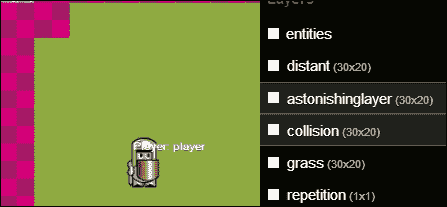
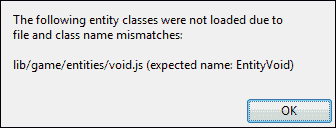
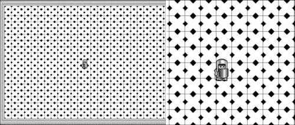
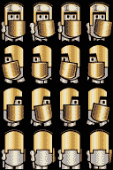

# 二、Impact简介

现在我们已经收集了所有必要的工具，并启动和运行了第一个游戏，是时候了解更多关于 Impact 实际工作原理的信息了。

但是，在深入代码之前，我们应该首先将代码从`chapter 2`文件夹复制到正确的位置。

类似于我们在[第一章](01.html "Chapter 1. Firing Up Your First Impact Game")、*中所做的启动你的第一个Impact游戏*，我们只需要覆盖`main.js`和`index.html`文件以及`myfirstawesomegame`项目的`entities`、`levels`、`plugins`和`media`文件夹。

我们现在开始探索 ImpactJS 引擎的复杂工作方式！

在本章中，我们将介绍以下过程:

*   ImpactJS 中的 Weltmeister 工具以及更改某个级别中某些参数的后果
*   标高层影响标高设计的方式
*   在 ImpactJS 中如何处理冲突
*   ImpactJS 实体
*   ImpactJS 实体的属性
*   可玩实体与不可玩实体的区别
*   如何产生或杀死一个角色
*   如何设置播放器控件
*   如何改变游戏的图形
*   如何在触发时播放音效和背景音乐
*   如何使用 Box2D 为游戏添加物理

# 建立自己的关卡

在设计一个游戏的时候，你会想要创造一个环境和发生这一切的地方。许多游戏被分成等级，随着每一个等级的升级，往往会变得更加困难。对于其他一些游戏，如 **RPGs** ( **角色扮演游戏** ) 、没有等级这种东西，因为它暗示了一个特定的截止点，通常没有回头路。在整本书中，一个可以作为单个文件保存在 Weltmeister 中的空间将被称为一个级别。

韦尔默斯特实际上是在Impact中掌握你的世界的工具。如果您正确安装了 ImpactJS，您应该能够通过在浏览器中放置以下地址来访问下一个屏幕截图中显示的级别编辑器:

`http://localhost/myfirstawesomegame/weltmeister.html`


## 在 Weltmeister 中创建、加载和保存级别

为游戏创建关卡是游戏设计中最令人愉快的事情之一。这个罐子放得太好了，你会花几个小时摆弄它，只是因为你可以。

打开韦尔特梅斯特(默认情况下)，一切从头开始；有大量的空虚需要你去填补。很快我们将从头开始建造一个关卡，但是现在我们应该加载`level1`关卡。按下您的邮箱右上角的**加载**按钮，并在`levels`文件夹中选择它。如果你在这一章的开头复制了它，它应该就在那里，否则现在就复制到 Weltmeister。

`Level1`是一个相当的第一级原名，但是让我们把它保存为`myfirstepiclevel`来个性化一下。按右上角的**另存为**按钮，保存在同一个目录下。现在我们有一个副本要处理和处理。

在我们实际使用名为`myfirstepiclevel`的关卡之前，我们需要对`main.js`脚本的代码进行更改:

1.  在首选脚本编辑器中打开`main.js`脚本。
2.  In the `main.js` script, you will see a call to the `loadLevel()` function.

    ```html
    this.loadLevel(LevelLevel1);
    ```

    ### 注

    该调用位于游戏的`init()`功能中(`ig.game.init`)。这意味着`main.js`剧本首先要做的一件事(在*开始*，因此`init`)是加载关卡`Level1`。很明显，我们不想要了，因为我们现在有了自己的等级`myfirstepiclevel`。为了让游戏知道它必须包含这个等级，您需要将其添加到`.requires()`功能中，如下代码行所示:

    ```html
    'game.levels.level1',
    'game.levels.myfirstepiclevel',
    ```

3.  Also, change the call to the `loadLevel()` function so it calls the level, `myfirstepiclevel`, instead of `Level1` as shown in the following snippet:

    ```html
    this.loadLevel(LevelMyfirstepiclevel1);
    ```

    ### 类型

    你可能已经注意到了，你总是要把`Level`这个词放在你实际的关卡名称之前。此外，您将始终需要用大写字母书写`Level`和您的级别名称。不遵守其中任何一条都会导致游戏负荷的巨大崩溃。将`Level`放在实际的级别名称前面是一个相当奇怪的约定，尤其是像`loadlevel()`这样的函数是为期望一个级别文件而构建的。在未来版本的 ImpactJS 中，可能会删除这个强制前缀。但目前，如果未能在您的实际级别名称前插入`Level`一词，或者将`Level`和您的级别名称都用大写字母书写，将导致显示以下错误:

    

韦尔默斯特中的其他按钮有**保存**、**新建**、**重新加载** **图像**。**保存**按钮只是保存你正在处理的文件，而**新建**按钮会打开一个新的空文件。**重新加载** **图像**按钮是平铺显示的刷新按钮。游戏的平铺显示是图像的集合。单个主题的所有图形都可以在一个波形集上，例如`outdoor`波形集。因为多个图像存储在一个称为 tileset 的整体图像中，所以在 Weltmeister 中工作时更容易创建您的级别。你可以把它看作是艺术家的调色板，但是作为一个水平创造者，你有多少调色板就有多少调色板。

总结我们遇到的一切，我们可以得出结论:

*   当您的服务器打开时，您可以通过在浏览器中键入以下地址来访问 weltmester:`localhost/myfirstawesomegame/weltmeister.html`
*   使用**加载**按钮打开`level1`
*   用**另存为**按钮将其再次另存为`myfirstepiclevel`
*   通过将`myfirstepiclevel`添加到`include()`功能，在`main.js`脚本中包括新的级别

## 层和 z 轴

打开关卡后，您可以看到不同的元素和图层。我们先来看看编辑器右侧的 **图层**菜单。

选择**碰撞**图层，你会看到一个图层为了存在需要填充的标准属性。所有图层(除了**实体**图层)都有名称、波浪线、波浪线大小、尺寸和距离。

波形图基本上是正方形图像的链，当它们组合得足够好的时候，就形成了你田园诗般的风景或者恐怖的地牢。tilesize 是一个图块的宽度和高度，以像素为单位。因为所有的瓷砖都是正方形，你只需要填写一个数字。图层的尺寸是需要显示图层的整个地图的宽度和高度，以图块数量衡量。因此，一个具有 8 的波形、20 的宽度和 30 的高度的层由 4800(8×20×30)像素组成。在使用移动设备时，请考虑这一点。分辨率为 160 (8 x 20) x 240 (8 x 30)的水平仪适合大多数设备。然而，如果 tilesize 是 32，你需要一个自动跟随你的可玩角色的视窗来显示你的水平。这个视图端口很容易合并，将在本章后面解释。要创建新的波形图，请执行以下步骤:

1.  单击图层选择菜单顶部的加号( **+** )尝试创建新图层。
2.  键入图层的名称；比如说`astonishinglayer`或者`tree`，随便你怎么说。
3.  Now select the tree tileset from the `media` folder by clicking the empty box next to the **Tileset** field. If you can't reach it by using the Weltmeister menu, you just type `media/Tree.png` in the tileset box. Set the tilesize to `32` and the dimensions to `30 x 20` (width x height). You can see the border of your layer change accordingly.

    ### 类型

    一个图层比另一个图层小，然后无法在地图的一部分添加对象，这是一个常见的错误。假设你打算让你的关卡是一个 30×20 的地图，波浪大小是 32，你添加一个像这样的图层，用草填充它。你想在草地上添加一个长凳，所以你添加了另一个层，使尺寸为 30 x 20。因为您的长凳是 32 x 16 的图像，所以您将 tilesize 设置为 16。如果你这样做，你将能够相当准确地画出你的长凳，但只能在你的水平的左上角。您需要将尺寸更改为 60 x 40，以便与草层占据相同的空间。

距离是图层相对于游戏屏幕位置的移动速度。**距离:**字段中的值`1`表示它以相等的速度移动，而值`2`表示图层以一半的速度移动。通过将该参数设置为高于`1`，可以使事物看起来更远；这非常适合你在侧滚(或视差)游戏中漂亮的多云背景，比如马里奥。去你的游戏，从游戏最左边向右边界走你的角色，观察改变**距离:**场数值的效果。

现在返回 Weltmeister，尝试将**距离:**字段的值设置为`2`。保存并重新加载游戏，运行你的角色从一个边缘到另一个边缘的水平，看看会发生什么。游戏的一部分会比其他部分移动得慢。这在侧边滚动条游戏中作为背景很有用，但在自上而下的游戏中也使用它来创建一个可怕的深渊的印象。下面有**是碰撞层**、**游戏预渲染**、**重复**、**链接碰撞**选项。打开和关闭它们可以通过单击白色方块来完成(白色方块变为黑色表示选项已关闭)。

**是碰撞层**选项会告诉关卡编辑器，你正在绘制的图层中的物体是不可穿透的。预渲染一个层将导致游戏在加载时聚集瓦片。这将增加初始加载时间，但减少游戏所需的平局次数，从而提高运行时的性能。

**重复**选项用于背景层。例如，如果你的背景云是一种模式，它可以一遍又一遍地重复。

最后**链接碰撞**选项将确保，对于您绘制的每个对象，碰撞方块都被添加到**碰撞**层。您可以稍后从**碰撞**图层中删除它们，但它是加快绘制墙壁和其他无法通行地形的有用工具。

通过在列表中上下拖动图层，可以在**图层**菜单中重新排列图层。通过将图层拖动到列表的顶部或底部，可以定义其在 z 轴上的位置。你应该把 z 轴看作是关卡的第三维度，就像我们生活的世界有一个 x 轴(宽度)、一个 y 轴(高度)和一个 z 轴(深度)。你构建的游戏并不是传统意义上的 3D，但是由于 2D 的图形是层层叠叠的，这里有一个实际的第三维度在起作用。列表顶部的图形层将始终可见，甚至会隐藏实体。底层只有在没有其他东西的情况下才可见。**碰撞**图层永远不可见，但将其拖动到顶部将使您更容易对其进行修改。

尝试重新排列图层，看看会发生什么。保存您的游戏并重新加载。取决于你对这些层做了什么疯狂的事情，世界现在确实是一个非常不同的地方。

您也可以打开和关闭图层，而不是将图层拖到堆栈顶部以便查看。这是通过点击图层名称前面的方块来完成的。这在实际游戏中不会有任何影响；它只在 Weltmeister 中可见。这对于**碰撞**层非常有用。试着将**碰撞**图层拖到堆栈顶部，然后随意打开和关闭它。您会注意到，这是处理 Weltmeister 时**碰撞**层的最佳位置。这是因为**碰撞**层本身在玩游戏的时候其实并没有图形，所以不能遮挡其他任何东西。



总结我们遇到的细节，我们得出结论:

*   一个级别由不同的层组成，这些层具有诸如 tilesize、距离以及是否是**碰撞**层等属性
*   使用**图层**菜单中的( **+** )符号添加新图层，并将其命名为`astonishinglayer`
*   向图层添加波浪线`media/tree.png`。将其尺寸设置为`30 x 20`，将其波形设置为`32`
*   试着摆弄你能在图层上找到的所有属性，包括上下拖动图层
*   每次调整参数时，保存级别并在浏览器中重新加载游戏

## 添加和移除实体和对象

有三大类图层:**实体**、**碰撞**，以及任何其他图层。对于实体和死对象，感兴趣的是实体和图形层。

**实体**层保存所有存在于`entity`文件夹中并被`main.js`脚本调用的实体。一个实体可以是任何东西，从玩家使用的角色，到杀死一切敢于靠近的人的隐形陷阱。所有功能和级别的人工智能都在这些实体中。它可以容纳敌人、触发器、等级变化、随机飞行的物体、可发射的射弹，以及所有可以交互的东西。

### 类型

如果您在这些实体中有关键的 bug，或者一些不存在的 bug 包含在您的`main.js`脚本中，Weltmeister 甚至不会加载。因此，当您想要构建一个级别时，请始终确保这些实体没有错误(或者没有包含在内)。

一些实体，比如玩家，已经出现在关卡中。首先在**图层**菜单中选择**实体**图层，然后选择玩家实体以查看其属性。 **x:** 和 **y:** 属性是其当前位置，并且在将新实体放入级别时始终存在。

尝试通过选择玩家并将其拖到其他地方来移动玩家实体。 **x:** 和 **y:** 坐标现在改变了。

让我们在关卡中增加一个**敌人**实体。选择**实体**图层，当鼠标悬停在该图层上时，按空格键。鼠标旁边会出现一个菜单；在此菜单中选择**敌人**实体。一个敌人刚刚出现在你鼠标的位置！你现在可以疯狂地用敌人的实体来绘制每个方块，但是这可能有点矫枉过正，所以我们现在只放置一个敌人。保存并重新加载您的游戏。现在，当你的敌人攻击你时，你会害怕得发抖，或者盯着它看而不为所动，这是你的选择。

如果你添加了太多的敌人而无法安全漫游，首先通过选择 Weltmeister 中的**实体**层将其从游戏中移除，然后选择你想要除掉的敌人，只需按下*删除*键。

### 类型

这是一个好习惯，让游戏和 Weltmeister 都打开，以检查您所做的更改。如果由于某种原因，你添加的某个实体被破坏了，游戏拒绝加载，至少你知道问题出在你最后做的修改上。当然，你仍然有 Chrome 或 Firefox 调试器，它们也将为你指明正确的方向。

添加对象不同于添加实体。死的物体，不能互动，只是一个图形的东西，可以简单地画，例如，一个正方形的草地，一个喷泉，或一个城堡的墙壁。可以与这些对象进行复杂的交互，但只能使用实体。这里我们将看看如何添加一个简单的对象，没有交互，到一个水平。

虽然关卡看起来很整洁，但我们需要对它进行改造。让我们从**层**菜单中选择草层。将鼠标悬停在地图上，然后按空格键。将出现一个波形图；您可以通过再次轻按空格键来使其消失。如果此波形图不适合您的屏幕，您可以将鼠标悬停在更中心的位置并将其上移，或者用鼠标滚轮缩小。如果没有滚轮，可以使用 *Ctrl* + *-* (减号)组合键缩小，使用 *Ctrl* 组合键加上加号键( *+* )缩小。现在你可以看到你的整个草地。通过点击并按住鼠标左键，选择草并开始在各处绘制。

### 类型

用单幅图块绘制大面积区域的一个小技巧是首先在地图上只绘制一小块区域。然后点击 *Shift* +鼠标左键，从关卡本身选择这个新绘制的较大区域的瓷砖。你现在可以用这个新选择的瓷砖画画，用更少的时间覆盖更多的区域。

如果你想从一个给定的图层中删除某个东西，只需为该特定图层选择一个空的正方形。如果在某个点上已经有了其他图层的图形，但不是当前正在处理的图层的图形，则可以认为该方块是空的。现在用这个空方块画画，以前选择的瓷砖会神奇地消失。现在试着删除一些你的草。

草是万物的底部。如果你有一个物体，任何物体，它将永远在草的上面，永远不会在下面(也许在一些疯狂的鼹鼠世界里除外)。要做到这一点，您必须将草图层拖到图层堆栈的底部。

让我们在场景中添加一些其他的东西。我们仍然有我们创建的层，`astonishinglayer`，准备好了，所以让我们用它画一棵树。要一次选择整棵树，点击 *Shift* +鼠标左键组合键选择树。取决于你把你的层放在哪里，树现在将总是出现在玩家的前面或后面。如果您将图层拖到列表底部，它甚至可能不可见。这是一个奇怪的结果，我们稍后会处理。保存你的关卡并重新加载，检查你的第一关创造力。


总结添加和移除实体和对象的过程，我们得出结论:

*   实体层提供所有游戏实体的选择
*   你可以在关卡中添加一些当前的实体，然后保存并重新加载游戏

## 碰撞层

**碰撞**层是一个特殊的层，当你从零开始打开 Weltmeister 时，它不是预定义的。它很特别，因为它是一个不可见的层，标志着无法通行的区域。例如，如果您使用图形图层在地图上绘制一面墙，所有实体都可以直接穿过它，就好像它根本不存在一样。如果你想要一堵真正能够阻挡玩家和他的敌人的墙，在墙所在的**碰撞**层画一条线。

您的游戏仍然开放；尝试绘制一面墙(或任何其他对象)，然后在标高的底部穿过它。你会发现在看起来如此坚固的东西中漫步特别容易。选择**碰撞**图层，如果还没有完成，将其拖动到列表顶部，并确保打开了**可见性**选项。现在所有的瓷砖都清晰可见，正如你所看到的，在底壁没有瓷砖。将鼠标悬停在该级别的画布上，然后按空格键以调出碰撞波形图。选择一个正方形，在墙所在的位置画一条线。删除碰撞块就像删除图形一样。在地图上选择一个不存在碰撞块的区域(无论是否按住 *Shift* 键)，并使用该选项删除存在的碰撞块。保存关卡并重新加载游戏。现在再试着穿过墙；这已经变得非常不可能了；为此欢呼吧！

总结前面的过程:

*   在 Welmeister 中选择**碰撞**层
*   用它画一些瓷砖
*   保存并重新加载游戏，看看如果你想走到你画碰撞瓷砖的地方会发生什么

## 连接两个不同的层次

现在我们已经对如何通过添加一些图形如草、树、一个玩家和一些敌人来建造一个关卡有了的感觉，是时候看看关卡是如何连接的了。

为此，请将内侧水平仪加载到 Weltmeister 中。里层位于一栋建筑内(你没看到吗？).由于我们必须处理`myfirstepiclevel`，我们需要更改对`main.js`脚本中`loadlevel()`函数的调用，如下面的代码片段所示。然而这一次，关卡本身已经包含在`main.require`脚本中了。

```html
this.loadLevel(LevelInside);
```

同样，不要忘记大写字母。

加载 Weltmeister 和游戏本身，看看是否一切都设置正确。

在 Weltmeister 中，通过选择**实体**层来查看该级别的实体。如果您不能很好地查看地图中的实体，请随意单击其他图层的白色方块来关闭它们。或者，您可以在将鼠标悬停在地图上时按下空格键，以调出实体选择菜单。像往常一样，我们有一个玩家实体，所以我们可以在这个地方移动，但是在菜单中你应该注意到一些额外的实体，比如**虚空**、**触发**和**等级改变**:

*   **虚空**实体是一个相当简单的实体；它只不过是一个有名字和坐标的盒子
*   **触发**实体将触发它所链接的任何其他实体的代码，如果某个特定类型的实体(如玩家)与之冲突
*   **等级改变**实体会让游戏加载另一个等级

通过智能地组合这三个实体，您可以连接级别，让我们这样做:

1.  确保**实体**图层是最上面的一个，这样你就可以看到你添加了什么。
2.  首先选择**触发**实体，并将其放置在门附近的地图上。一开始只是一个小方块，所以要大一点，以便适合出口。您可以通过选择该框，将鼠标移动到它的一个边缘，直到看到一个双箭头(双箭头符号)，然后拖动它使其变大(就像您调整电脑上任何窗口对象的大小一样)。在选择你的尺寸时，你的目标是在玩家想用门出去的时候发现他。
3.  现在添加一个**级别更改**实体。如果选择**级别更改**实体，您将在右侧看到其属性。现在，这只是它在地图上的位置(x 和 y 坐标)和尺寸，以防你重新塑造了这个盒子。通过在键框中键入`name`并以**为其值，给**级别更改**实体一个名称。按*进入*键确认。现在，您将看到实体有一个额外的属性(名称)，其值为**到外部**。只有给它起一个名字，它才能被唯一识别，这就是我们需要的。我们还需要告诉他需要加载什么级别。将**键加到**外的数值**上，按下*回车*键。****
4.  **触发** 和**等级改变**实体现在都在等级中，但是它们还不知道彼此的存在；如果我们想让他们合作，这很重要。
5.  Return to the trigger entity and give it a target. You do this by typing `target.1` as a key and **ToOutside** as a value. Notice the dot (`.`) after the word `target`; without it, it will not work. Now press the *Enter* key and watch as the two pretty squares get linked to each other by a white line as shown in the next figure. The **Trigger** entity now knows it is the **Levelchange** entity; it will have to trigger when touched by a player.

    

保存这个并加载级别。带领你的玩家走向触发点；您的 **Levelchange** 实体的位置无关紧要。如果一切顺利，你现在应该可以走到门口，进入下一个层次！

奇怪的是，当你进入外部世界时，你并没有被放置在建筑物旁边。即使对于电子游戏来说，这也很奇怪。还有，伸手去拿门的时候没有办法回到里面，你永远被困在外面，或者直到你重新装弹。

这是因为没有**衍生点**、**触发**或**级别变更**实体被添加到外部级别。我们将弥补这一点，但让我们首先添加一个产卵点到内部水平。

为此，我们需要**虚空**实体。将**虚空**实体添加到关卡，并将其放在门前，但要越过扳机。把它放得离扳机太近(或者放在扳机上面)会导致玩家被击回到外面。虽然做一个永恒的循环让玩家在关卡之间来回切换很有趣，但是永恒的循环(比如除以零)有机会毁灭世界。命名**作废**实体`insideSpawn`。选择**级别更改**实体，添加键**生成**，值**在**之外。


我们已经完成了内部关卡，但是现在需要设置外部关卡作为它的镜像对面。所以再次添加**虚空**、**水平变化**、**触发**实体。命名 **Void** 实体`OutsideDoor`，因为 **Levelchange** 实体会寻找这个。命名 **Levelchange** 实体`ToInside`，并将触发器指向它。同时将**等级**和**衍生**属性添加到**等级变更**实体中。这些的值是(正如你可能猜到的那样)**在**里面的**级别**属性和**在**里面的**衍生**属性。


保存并重新加载游戏。如果一切顺利，你现在应该能够像真正的职业选手一样在两个级别之间移动。

总结连接两个层次的完整过程:

*   将水平仪放入水槽中
*   将三个实体添加到级别中，**触发**、**级别更改**、**作废**
*   给每个实体起一个名字
*   使触发点指向**级别更改**实体
*   将此信息添加到**级别更改**实体:它需要加载的级别和它必须使用的生成点
*   在内部保存，在外部加载级别，并在那里重复该练习
*   确保这两个级别都已保存，并在浏览器中重新加载游戏

# 物体——可玩和不可玩的角色

现在我们已经看到了如何构建一个关卡，是时候放大我们一直在玩的实体背后的代码了。虽然没有官方的分类，但事情可以通过区分三种类型的实体来简化:死亡物体、不可玩角色和玩家实体本身。这三种类型的实体在复杂性和交互性的水平上是有序的。在本章的第一部分，我们看了一下游戏的图形层。纯图形完全没有交互元素；它们只是作为稳定的元素存在。要从你正在玩的游戏中获得一点反馈，你需要实体。这些实体中最不复杂的是死亡物体，它们没有任何人工智能，但可以与例如硬币和药剂等拾取物品进行交互。我们已经研究过的一种实体类型是**触发**实体，它本身是不可见的，但可以放在与图形相同的级别，可以指示游戏中还会发生什么。熔岩的图形不会杀死你。一个小心翼翼地放在熔岩下面的实体，告诉游戏摧毁进入那个区域的一切，肯定能杀死你。稍微复杂一点的是 **NPC 的** ( **不可玩的角色**)。这些是你的敌人，你的朋友，你作为一名球员会杀死或捍卫的一切，或者如果你愿意，就忽略它们。它们可以是无脑僵尸，也可以是复杂的计算对手，如国际象棋计算机。游戏中最后也是最复杂的实体是你，或者至少是你的化身。这个可玩的角色是目前为止最通用的角色，非常值得在本章后面详细说明。在我们这样做之前，我们首先要看看是什么让 ImpactJS 实体变成这样。

## impact js 实体

为了说明实体的基础，最好先看一下死的物体。这些实体没有复杂的行为模式，如不可玩的角色或玩家，但肯定比普通图形更复杂。

这方面的一个例子是**虚空**实体，这是我们在本章前面设置等级转换时遇到的一个好朋友。在你的脚本编辑器中打开`void.js`文件，我们可以看一下。以下代码片段是 **Void** 实体的一个示例:

```html
ig.module(
  'game.entities.void'
)
.requires(
  'impact.entity'
)
.defines(function(){
  EntityVoid = ig.Entity.extend({
  _wmDrawBox: true,_wmBoxColor: 'rgba(128, 28, 230, 0.7)',_wmScalable: true,size: {x: 8, y: 8},update: function(){}});
});
```

每个实体至少会调用`ig.module`。`requires()`、和。`defines()`功能。

在`ig.module`功能中，将**作废**实体定义为一个模块。`ig.module`函数调用将 **Void** 实体定义为一个新模块。模块名应该与脚本名相同。放入`game`文件夹内`entities`文件夹的`void.js`文件成为`game.entities.void`文件。

`requires()`函数将调用这个实体所依赖的代码。像所有实体一样，无效实体依赖于来自影响引擎的实体原型代码，因此得名`impact.entity`。

`defines()`功能使您能够定义该特定模块的全部内容。看看`defines()`功能里面有什么。我们看到`EntityVoid`模块被定义为实体类的扩展，如下所示:

```html
EntityVoid = ig.Entity.extend({
```

始终在实体名称前加上`Entity`，不要忘记大写字母。如果您不喜欢它，Weltmeister 将不会喜欢它，并且您将收到一条错误消息，说它需要一个不同名称的实体。Weltmeister 将生成以下错误:



**虚空**实体是一个特殊的实体，因为它在游戏中是不可见的；这一点从代码没有指向`media`文件夹中的某个图像这一事实可以明显看出。取而代之的是，它有三个属性，分别适用于`_wmDrawBox`、`_wmBoxColor`和`_wmScalable`。`_wm`前缀属性表示它们对威尔士人很重要。

```html
 _wmDrawBox: true,
```

前面的代码片段告诉 Weltmeister，当实体插入到级别中时，它必须绘制一个框。通过将该属性设置为`false`，将不应用来自 `_wmBoxColor`属性的颜色。

```html
_wmBoxColor: 'rgba(128, 28, 230, 0.7)',
```

前面的代码片段定义了 RGBA 配色方案中此框的颜色。对于 **Void** 实体，目前颜色为紫色。

```html
_wmScalable: true ,
```

前面的代码片段将允许您放大或缩小盒子。这对于像**触发**实体这样的东西特别有用，在之前连接两个级别时，您可能会将它变成一个很小但相当长的矩形。

```html
size: {x: 8, y: 8},
```

在前面的代码片段中，`size`属性是实体的默认大小。因为这个是可扩展的，你可以在 Weltmeister 中更改它。

```html
update: function(){}
```

最后是`update()`功能。每个实体每帧调用这个函数一次，不管您是否明确提到对这个函数的调用，如前面的代码片段所示。

尝试更改 **Void** 实体的默认参数，并重新加载 Weltmeister，看看会发生什么。

**Void** 实体是一个简单而有用的实体，但让我们面对它，它也相当无聊。让我们看看更有趣的东西，比如硬币。假设你希望你的玩家每次拿起硬币都变得更富有。

下面是一个**硬币**实体的例子:

对于这个你需要一个**硬币**实体，所以让我们在编辑器中打开`coin.js`文件。类似于 **Void** 实体，有名字(硬币)，需要`impact.entity`库，是原型实体的扩展，有大小。但是，在下面的代码中还有一些其他有趣的属性:

```html
collides: ig.Entity.COLLIDES.NEVER,
type: ig.Entity.TYPE.B,
checkAgainst: ig.Entity.TYPE.A,
```

`type`、`collides`和`checkAgainst`属性都是关于硬币与其他实体碰撞的行为。`type`参数告诉游戏，当必须评估碰撞时，硬币属于类型`B`。硬币实际上从不与任何东西碰撞，因为它的`collides`属性被设置为`NEVER`。这里的其他可能性有:`LITE`、`PASSIVE`、`ACTIVE`和`FIXED`。`LITE`和`PASSIVE`实体不会相互碰撞。`FIXED`实体不能移动，`LITE`实体可以被`ACTIVE`实体移动。如果一个`ACTIVE`实体与另一个`ACTIVE`或`PASSIVE`实体碰撞，两个实体都会移动。

起初听起来很棘手，但值得尝试。打开`player.js`文件，确保`collides`属性设置为`ACTIVE`。现在在游戏中加入一枚硬币，靠近玩家的起点，使用 Weltmeister。通过添加两个破折号(`//`)将硬币的`checkAgainst`属性放入注释中，如下例所示:

```html
//checkAgainst: ig.Entity.TYPE.A
```

如果您将**硬币**实体的模式设置为`FIXED`，您将无法移动硬币。当您将其模式设置为`PASSIVE`或`ACTIVE`时，您可以移动硬币，但会很困难，因为硬币会向后推。然而，设置为`LITE`属性的**硬币**实体将非常容易移动。最后，当**硬币**实体被设置回属性`NEVER`时，玩家直接穿过硬币，就好像它不存在一样。我们使用 Weltmeister 向墙壁添加碰撞瓷砖；这些图块可以被视为`FIXED`，因此不会被实体移动。

删除`checkAgainst`属性中的破折号，使其再次工作，因为这将告诉**硬币**实体检查类型为`A`的实体是否接触到它(玩家实体被设置为`A`)。

当 **Void** 实体可见时，硬币有游戏中的图形，它们在**动画页**框架中。

```html
animSheet: new ig.AnimationSheet('media/COIN.png',16,16),
```

然而，这个`AnimationSheet`帧只不过是一个 16 像素的正方形图像，所以它并不能真正实现真正的动画。为此，您需要一个包含至少两个不同图像的 PNG 文件。

然而，我们可以用第二枚硬币代替这枚硬币。通过将`COIN.png`更改为`COIN2.png`(保存并重新加载)来完成。

每个实体的`init()`函数将定义它们的标准属性。

```html
  init: function(x, y , settings){
    this.parent(x,y,settings);
    this.addAnim('idle',1,[0]);
  }
```

由于一个**币** 实体没有太多属性，`init()`法比较虚。

我们所做的是调用父实体，在这种情况下只是`entity`。`this.addAnim()`功能是一个能够使硬币产生动画的Impact功能。它有三个输入:

*   实体的状态(`idle`)
*   从一个动画切换到另一个动画的速度(`1`秒)
*   它必须通过的波形图上的图像(图像`0`)

显然因为只有一个图像，所以没有真正的动画。

`check()`函数对于每个实体来说都是一个非常有趣的方法。以下示例代码解释了`check()`功能:

```html
  check: function(other){
    ig.game.addCoin();   // give the player a coin when picked up
    this.kill();     //disappear if you are picked up
  }
```

它检查是否与另一个实体有重叠，如果有，将执行函数中声明的操作。`check()`方法绑定到`checkagainst`属性；唯一相关的重叠将是与其中所述实体类型的重叠。在这种情况下，`check()`功能将在玩家触摸硬币时关闭。这将导致触发`ig.game.addCoin()`功能，然后使用`this.kill()`功能从游戏中移除硬币。

死亡物体通常是非常简单的实体，只有几行代码，不可玩的角色甚至有一个简单的人工智能，而可玩的角色完全是一个不同的游戏。

总结可玩和不可玩角色的创作，我们可以得出结论:

*   与纯图形相反，ImpactJS 实体是一个交互式游戏元素。
*   死的物体是最不复杂的实体；这方面的两个例子是**虚空**和**硬币**实体。
*   **Void** 实体在游戏中是不可见的，但是由于其特殊的 weltmester 属性，在 weltmester 中是可见的。我们在本章前面把它作为一个种子点。
*   **硬币**实体在游戏中是可见的，因为它有一个动画表。由于碰撞检测，它也可以被玩家拾取。
*   碰撞检测可以采取几种形式:实体可以根据其碰撞属性杀死、阻挡、推开或简单地忽略彼此。
*   试着摆弄一下 **Void** 和 **coin** 实体中所有解释过的参数，看看会发生什么。

## 设置玩家控制

没有什么比真正的玩家和他或她送去遗忘的敌人更有趣的了。

如果你打开`player.js`和`enemy.js`文件，你会看到关于这些实体有相当多的讨论。从动画控制到音效等等，它们确实很复杂。所有这些事情将在本章剩下的几页中逐渐被揭开。但首先，ImpactJS 如何知道可玩和不可玩角色的区别？

事实上，你调用了一个实体玩家并不自动使它这样；ImpactJS 没有为此实体保留名称，以便识别哪些可以控制，哪些不受玩家控制。这确实是非常有限的，因为 **RTS** ( **实时策略**)游戏依赖于同时移动不同可玩对象的能力。这意味着区分这两个实体的唯一因素是它们是否可控。

打开`player.js`文件，滚动到以下代码:

```html
    if(ig.input.state('up') || ig.input.pressed('tbUp')){
      this.vel.y = -100;
      this.currentAnim = this.anims.up;
      this.lastPressed = 'up';
    }else if(ig.input.state('down') || ig.input.pressed('tbDown')){
      this.vel.y =  100;
      this.currentAnim = this.anims.down;
      this.lastPressed = 'down';
    }
    else if(ig.input.state('left') || ig.input.pressed('tbLeft')){
      this.vel.x = -100;
      this.currentAnim = this.anims.left;
      this.lastPressed = 'left';
    }
    else if(ig.input.state('right')||ig.input.pressed('tbRight')){
      this.vel.x = 100;
      this.currentAnim = this.anims.right;
      this.lastPressed = 'right';
    }
```

在这里，我们可以看到玩家实体会对输入做出反应。当给出输入命令`up`时，头像将向上移动并显示动画。这些`up`、`down`、`left`和`right`状态不是 ImpactJS 关键字。它们实际上是在主脚本中定义的。打开`main.js`文件，看看下面的代码:

```html
    if(!ig.ua.mobile){
    ig.input.bind(ig.KEY.UP_ARROW, 'up');
    ig.input.bind(ig.KEY.DOWN_ARROW,'down');
    ig.input.bind(ig.KEY.LEFT_ARROW,'left');
    ig.input.bind(ig.KEY.RIGHT_ARROW,'right');
    // fight
    ig.input.bind(ig.KEY.SPACE,'attack');
    ig.input.bind(ig.KEY.CTRL,'block');
```

在这里您可以看到哪个键与哪个输入状态相关联。还要注意`if`语句*前的*键绑定。首先，检查您是否在使用移动设备。这是因为键，如空格键和方向箭头，在 iPads 和 iPhones 上不存在。尝试将攻击状态绑定到鼠标左键，而不是空格键，代码片段如下:

```html
ig.input.bind(ig.KEY.MOUSE1,'attack');
```

所有可能的组合都可以在 ImpactJS 网站上找到。

保存并重新加载游戏，注意你的触发手指是如何从空格键移到鼠标左键的。

请注意这些初始键绑定定义是如何在`main.js`脚本的`init()`函数中的，同时等待其更新函数中的`player.js`脚本的输入。这是因为密钥的实际绑定只需要完成一次(在游戏启动时)，而你的玩家需要时刻受到控制。每次游戏经过一个完整的游戏周期都会调用`update`功能，和你的帧率一样。假设你的帧率是 60fps(每秒 60 帧)；在这种情况下，更新功能将每秒检查用户输入 60 次。

在处理移动设备时，情况有点不同。由于几乎没有键，您将需要通过使用 HTML 对象来添加人工按钮。

打开`index.html`文件，输入以下添加人工按钮的代码:

```html
    if(ig.ua.mobile){
      // controls are different on a mobile device
      ig.input.bindTouch( '#buttonLeft', 'tbLeft' );
      ig.input.bindTouch( '#buttonRight', 'tbRight' );
      ig.input.bindTouch( '#buttonUp', 'tbUp' );
      ig.input.bindTouch( '#buttonDown', 'tbDown' );
      ig.input.bindTouch( '#buttonJump', 'changeWeapon' );
      ig.input.bindTouch( '#buttonShoot', 'attack' );
    }
```

当将 ImpactJS 游戏加载到浏览器中时，实际加载的是这个页面，游戏本身只显示在页面内的画布元素中。这意味着在这个画布元素旁边，可以添加其他东西，比如 HTML 按钮。由于每一个按钮都可以用触摸板按下，通过智能使用这些按钮，可以为游戏增加无限数量的交互功能。您可以在`index.html`文件中找到以下按钮定义，如以下 HTML 代码所示:

```html
<div class="button" id="buttonLeft"></div>
<div class="button" id="buttonRight"></div>
<div class="button" id="buttonUp"></div>
<div class="button" id="buttonDown"></div>
<div class="button" id="buttonShoot"></div>
<div class="button" id="buttonJump"></div>
```

按钮是`<div>`元素，其中`div`是除法的缩写。< `div` >元素与 CSS 代码一起用于布局网页。在这种情况下，他们为我们提供了四个箭头来选择方向。

一个`<div>`元素有几个属性；其中，`id`属性是我们特别感兴趣的，因为它唯一地标识了`<div>`元素，并使我们能够链接到 JavaScript 代码。这可以在`main.js`剧本内的`bindTouch`法中看到。

```html
ig.input.bindTouch('#buttonLeft', 'tbLeft' );
```

它的第一个参数是`<div>`元素的唯一标识，前面有一个`#`符号；这样，JavaScript 知道它需要寻找一个 ID。第二个参数是输入状态，我们称之为`tbleft`(向左触摸)。

如果你有一台 iPad 或任何其他移动设备，如果你把它放在一台在线服务器上，你就可以在那里加载你的游戏。

现在输入键(无论是真正在你的键盘上还是虚拟键盘上)被绑定到一个 ImpactJS 状态；这些状态可以用来跟随玩家控制。这方面的一个例子当然是向某个方向移动。

总结设置播放器控件的过程:

*   控制一个实体是区分可玩角色和不可玩角色的关键。
*   键盘和动作名称之间的链接在主脚本中定义一次。您应该尝试更改这些控件以适应您自己的偏好。
*   动作名称和实际执行动作之间的联系可以在玩家实体本身中找到。
*   在移动设备上，你有点受限于触摸屏。虚拟按钮可以使用 HTML `<div>`标签来实现。

## 位置、加速度和速度

每样东西都有一个位置，有些东西正在去往某个地方的路上。在 ImpactJS 世界中定位 是通过 x 和 y 坐标以及第三个不太直观的 z 索引来完成的。

x 和 y 坐标是到标高左上角的距离，以像素为单位。x 坐标是任何物体在水平轴上的位置，从左到右计数。y 坐标是垂直轴上的位置，从上到下计数。这个 y 坐标对于习惯看图的人来说有点反直觉；向上移动时，y 坐标在底部始终为 0，更高。请注意，一个级别的左上角并不总是与画布的左上角相同！通过画布你可以看到游戏，这只是你对世界的窗口。这在战略游戏中非常明显，在这种游戏中，你永远看不到整个世界，为了更快地从一场战斗导航到另一场战斗，你经常会得到一张迷你地图。



每个实体都有一个 x 和 y 坐标，当您使用 Weltmeister 时，当您在地图上拖动实体时，您会看到这种变化。在实体代码中，您可以这样引用(并更改)它的位置:

```html
this.pos.x = 100;
this.pos.y = 100;
```

如果你想让东西瞬间移动，这很好，但通常你只是想让它们移动得更微妙。为此，我们可以调整速度和加速度等属性。将速度设置为不同于`0`的数值将使实体的位置随时间变化。设置加速度会随着时间改变速度。

```html
if(ig.input.state('up') || ig.input.pressed('tbUp')){
      this.vel.y = -100;this.currentAnim = this.anims.up;
      this.lastPressed = 'up';
}
```

在讨论玩家控制的时候，我们已经看到了这段代码。 `this.vel.x = -100`命令会让玩家以每秒 100 px 的速度向上移动。你需要速度为负才能上升，因为，正如我们之前看到的，y 轴是反的。速度可以为每个方向单独设置。例如，你可以创建一个区域，强风使英雄在逆风时移动得更慢，但在 90 度角下移动时不受影响，在这个命令的帮助下，玩家甚至可以在身后顺风的情况下移动得更快。尝试使用以下代码更改速度以模拟来自北方的强风:

```html
if(ig.input.state('up') || ig.input.pressed('tbUp')){
      this.vel.y = -25;
      this.currentAnim = this.anims.up;
      this.lastPressed = 'up';
}
else if(ig.input.state('down') || ig.input.pressed('tbDown')){
      this.vel.y = 400;
      this.currentAnim = this.anims.down;
      this.lastPressed = 'down';
}
```

加速度反过来会随着时间影响速度。加速有点棘手，因为减速并不自然地以停止而告终，而是以相反的方向运动，此时减速实际上变成了加速，反之亦然。为了引入加速度因子，我们插入以下代码:

```html
    if(ig.input.state('accelerate')){
      this.accel.x = 1;
      this.accel.y = 1;
    }
    if(ig.input.state('slow_down')){
      this.accel.x = -1;
      this.accel.y = -1;
    }
```

要确保加速不会使实体以光速前进，给定足够的时间和按键，可以使用以下代码示例设置最大速度:

```html
maxVel:{x:200,y:200},
```

尝试将此代码片段添加到`player.js init()`函数或作为属性。如果你的风效应还在的话，顺风的时候应该没有以前那么强了。

除了 x 和 y 坐标，第三维度也在发挥作用。为了给游戏增加深度感，可以将实体放在彼此的前面。对于图形图层，只需在 weltmester**图层**菜单中上下移动即可。在那里你可以把层永久地放在彼此和所有实体的前面或后面。但是，实体之间如何解析并不是在 Weltmeister 中设置的，而是由它们各自的 z 索引设置的。实体的 z 索引实际上是它在实体数组中的位置。为了更好地理解这意味着什么，请看下面 Firebug 表示的游戏 DOM:


位于数组末尾的实体将通过游戏的`draw()`方法最后被抽取。最后被抽中意味着你将被抽中所有其他的上面，因此看起来好像在他们前面。所有新产生的实体都被追加到列表的末尾。实体越年轻，当它被放在其他实体之上时，就会显得越接近。这可以通过手动设置 z 指数并使用`player.js`文件的`main.js`更新功能中的游戏`sortEntitiesDeferred()`方法来避免:

```html
zIndex:999,
```

如下更新`main.js update()`功能:

```html
ig.game.sortEntitiesDeferred() ;
```

你的玩家可以移动，但是它是如何如此优雅地移动而不仅仅是从 A 点到 B 点滑行的呢？这一切都与精灵和动画表有关。

总结位置、加速度和加速过程，我们得出结论:

*   每个实体都有位置、速度和加速度。
*   尝试改变玩家的速度来改变他/她的位置。
*   尝试改变加速度，以改变速度，从而改变球员的位置。
*   每个实体都有一个 z 坐标，它指示该实体应该绘制在其他实体的前面还是后面。尝试将玩家的 z 坐标更改为非常高的数字。现在这个可玩的角色将会被画在关卡中所有其他实体的后面。

## 游戏的图形:精灵和动画表

精灵是一种绘图，它被放在透明的背景上，然后以文件格式保存，该文件格式可以像`.png`或`.gif`格式一样保持背景透明。例如，JPEG 不能有透明部分。画一个角色，比如说一只有核爪的红鲸，很不错。然而，对于动画来说，你需要不止一幅这样的图，最好是从不同的角度。所有这些图纸然后被放在一个文件中(同样，不是`.JPEG`格式)，在那里它们形成一个动画表。



好的精灵和动画表并不是那么容易得到的，你能在网上找到的那些经常被授权和禁止用于游戏发布。你可以自己画，也可以在[www.sprites4games.com](http://www.sprites4games.com)等网站上购买。

动画表通常放在`media`文件夹中，尽管这不是强制性的，完全取决于您如何构造它们。

通过调用`AnimationSheet()`方法将动画表分配给实体，如下所示:

```html
animSheet: new ig.AnimationSheet('media/player.png',32,48),
```

第一个参数是动画工作表的位置和名称。永远不要忘记，一个位置总是相对于它的根文件夹指定的，现在应该是`myfirstawesomegame`文件夹。它存储在 XAMP 文件结构的`htdocs`文件夹中的事实不算在内。第二个和第三个参数分别是每个动画的宽度和高度(以像素为单位)。

现在动画表已经链接到玩家，玩家可以采取的所有可能的状态都需要链接到特定的图像序列。实体的`addAnim()`方法允许您将可能的状态链接到特定的图像序列，如以下示例代码所示:

```html
this.addAnim('idle',1,[0]);
this.addAnim('down',0.1,[0,1,2,3,2,1,0]);
this.addAnim('left',0.1,[4,5,6,7,6,5,4]);
this.addAnim('right',0.1,[8,9,10,11,10,9,8]);
this.addAnim('up',0.1,[12,13,14,15,14,13,12]);
```

在玩家启动时(`init()`功能)，定义了几个序列并给了一个名称。最简单的就是`idle`。玩家什么都不做，只需要一个图像，在动画表上的位置 0 ( `[0]`)。所有的 JavaScript 数组都从索引 0 开始，ImpactJS 的动画表数组也是如此。一个 128 x 192 像素的动画表可以容纳 16 幅 32 x 48 像素的图像，编号从 0 到 15。编号从纸张的左上角开始，到右下角结束，就像你阅读这本书的页面一样(除非你是中国人)。

向左行走只需要三个截然不同的图像:向左看，伸出右腿，伸出左腿。在制作动画时，如果速度设置正确，在双腿切换之间会重复向左看，这给人一种有人行走的感觉。这里切换图像的速度设定在`0.1`秒，非常仓促。

尝试将怠速动画的速度设置为`100`秒，行走动画的速度设置为`0.5`秒，如以下示例代码所示:

```html
this.addAnim('idle',100,[0]);
this.addAnim('down',0.5,[0,1,2,3,2,1,0]);
```

请注意，将空闲动画的速度设置为`100`秒完全没有影响它，因为没有真正的动画，反正它只是一个图像。然而，将图像之间的步行时间增加五倍确实会产生很大的视觉影响。玩家现在看起来像是在漂浮，有点像幽灵。

最后需要用当时需要的动画更新实体属性`currentAnim`。当用户输入的速度和方向改变时，用所需的动画更新该实体属性会改变动画序列。

你也可以把这个弄乱。例如，当玩家向左走时，尝试将动画设置为向右，反之亦然。结合这个相当缓慢的动画，哦，是的，你在月球漫步！

```html
else if(ig.input.state('left') || ig.input.pressed('tbLeft')){
this.vel.x = -100;
this.currentAnim = this.anims.right;
this.lastPressed = 'right';
}
```

总结使用精灵和动画表增强游戏图形的过程，我们可以得出结论:

*   每个可见实体都有一个动画表。动画表是一个实体所有不同外观的组合。尝试更改播放器实体的动画表。
*   动画序列将告诉游戏在执行某个动作时，哪些图像应该相互跟随。摆弄动画的顺序和速度可以创造有趣的效果。尝试仅使用`addAnim()`方法复制一个幽灵或月球行走角色。

## 产卵、健康和死亡

每个生命都有开始、生命和死亡。如果说这些年来你都是从母亲的子宫里生出来的，那就有点刺耳了。但从游戏的角度来说，这就是你所做的。

理论上，单个游戏中可以衍生的实体数量没有限制；实际上，这受到性能问题的限制，尤其是在移动设备上。

让我们来看看一个经常产生和毁灭的实体:抛射体。

当玩家感觉他的扳机手指发痒时，投射物就会产生。在`player.js`更新功能中，您会发现以下代码:

```html
ig.game.spawnEntity('EntityProjectile',this.pos.x,this.pos.y,{direction:this.lastPressed})
```

通过 `ig.game.spawnEntity`方法产卵。这个方法工作真正需要的是实体类型和它需要产生的位置。第四个参数是您可能想要添加的一组额外设置，是可选的，但现在用于告诉子弹朝哪个方向发射。

任何事物都可以产生一个实体。就像玩家产生抛射体一样，**等级改变**实体将会产生玩家。在`levelchange.js`文件中，您会发现以下代码:

```html
if(spawnpoint) {
ig.game.spawnEntity(EntityPlayer, spawnpoint.pos.x,spawnpoint.pos.y);
ig.game.player = ig.game.getEntitiesByType( EntityPlayer )[0]
}
```

这段代码的作用是检测玩家想去的关卡中是否有产卵点，如果有，杀死可能是预设的玩家。在韦尔特米斯特你可以添加一个玩家实体到关卡；这样，您就可以单独测试它，而不必费力地遍历可能出现在它之前的所有其他测试。这个预设的玩家实体被杀死，并在适当的繁殖点位置被新的玩家实体替换。然后将`ig.game.player`变量设置为他找到的第一个预设(`[0]`)玩家实体。这最后一部分不是强制性的，但有时直接链接到玩家实体很方便。

在这种情况下，射弹本身并没有特定的生命值，但是可以用以下代码杀死它:

```html
if(this.lifetime <=100){this.lifetime +=1;}else{this.kill();}
```

在这里，弹丸只能存活 100 帧。你也可以用真正的计时器控制一个实体的寿命，或者当它碰到可以造成伤害的东西时摧毁它。将数值从`100`更改为`1000`，可以看到射弹的射程大幅增加。或者，你可以给射弹增加一个新的属性，叫做`range`，并用这个替换寿命检查。在`init()`功能中添加范围属性如下:

```html
this.range = 100;
```

在检查功能中，用`this.range`替换数值`100`:

```html
if(this.lifetime <=this.range){this.lifetime+=1;}else{this.kill();}
```

恭喜你！您的代码再次变得更加易读和灵活。

炮弹击中敌人时也可以被摧毁，使用以下代码片段:

```html
check: function(other){
    if(other.name == 'enemy'){other.receiveDamage(100,this);}
    this.kill();
    this.parent();
  }
```

杀死一个实体只需调用`kill()`方法即可，但是如果生命值达到 0，实体`receiveDamage()`方法也会调用`kill()`方法。

那么这个射弹检查功能会发生什么呢？如果弹丸与敌人发生碰撞，将受到`this`(弹丸)相当于`100`的伤害。如果发生这种情况，射弹就会在这个过程中被摧毁。

产卵和死亡是影响健康的简单事情，健康更是如此。当你用一个方法产生或杀死一个实体时，健康只不过是一个你可以随意设置和改变的属性。在`player.js`文件中，如果添加了以下代码，你会看到玩家的生命值为`400`:

```html
 health: 400,
```

通过`receiveDamage()`方法将扣除健康内置到Impact引擎中；你可以用同样的方法增加健康。试着将`receiveDamage()`法中的伤害设置为负数，你就发明了治疗弹！

```html
if(other.name == 'enemy'){other.receiveDamage(-100,this);}
```

总结产卵、健康和死亡的整个过程，我们可以得出结论:

*   每一个受影响的实体都可能繁殖、丢失、获得生命值和被杀死。
*   尝试改变抛射体实体的产卵位置，让他离玩家更近或更远产卵。
*   射弹对其他实体造成损害；尝试反转效果来创建一个治疗箭头。

# 相机视图

当你探索的世界小而舒适时，你很容易随时保持一个概述。在更大的级别和更小的屏幕上，情况并非如此。如果你的目标是为手机发布游戏，你必须掌握相机。

你的相机只不过是你通向世界的窗口。当你的世界很大时，你需要定期调整你的窗口来记录事情。照相机有几种类型，但最重要的两种是自由移动照相机和自动照相机。

然而，在潜入相机本身之前，最好先看看画布元素以及它在 Impact 游戏中的设置方式。

## 游戏画布

如果同时打开`main.js`和`html.index`的，你应该会找到你需要的所有画布代码，因为这是一个如此高级的游戏组件。在 HTML 文档的主体标签中，您会发现容纳游戏电影屏幕的画布。画布元素有一个名为`"canvas"`的标识，通过使用以下代码可以将其链接到 JavaScript:

```html
<canvas id="canvas"></canvas>
```

在`main.js`文件中可以找到`ig`对象的`main`方法。这个方法通过查找 ID 将整个游戏链接到画布。如果 JavaScript 需要查找一个 HTML 标识，它的前面总是有`#`符号，如下例所示:

```html
 ig.main('#canvas', OpenScreen, 60, 640, 480, 1);
```

`ig.main()`方法有 6 个参数。第一个是画布 ID，然后是游戏名称，如前面在`main.js`文件中所指定的。第三个参数表示游戏需要运行的每秒帧数；然而，这一个已经过时了，可能会在未来的版本中被完全删除。如今，引擎本身决定了最佳帧率，所以手动设置已经变得不可能。

最后三个参数是画布的宽度和高度以及您想要使用的缩放。缩放是一种奇特的东西，因为它会根据你设定的因子来放大一切。

尺寸为 640 x 480，缩放值为 1 的画布实际上会有 640 x 480 像素大，其中的每个字符都会有其原始尺寸。然而，如果你把缩放的值设为`2`，尺寸将乘以 2，游戏中的所有东西也将乘以 2。例如，如果您只有 640 x 480 像素可用，但您几乎看不到您的主要角色，将尺寸除以值 2，并将缩放值设置为`2`，如以下代码示例所示:

```html
ig.main('#canvas', OpenScreen, 60, 320, 240, 2);
```

尝试将缩放值设置为`6`以消除眼睛极度疼痛和模糊。

总结画布的特点，我们可以得出结论:

*   游戏画布是你了解游戏世界的窗口。
*   此窗口的几个元素可以更改；尺寸和缩放是最重要的。尝试改变它们，以便完美地适应您自己的屏幕分辨率。

## 自由移动摄像头

一个可以自由移动的摄像头，正如名字所说，可以由玩家自己自由移动。这些视窗通常用于 rts 游戏，因为许多事情都在玩家的指挥之下。例如，在著名的游戏《红色警报》中，你有几十辆坦克、飞机、士兵和疯狂的潜艇四处游荡。优秀的玩家把他们的分散在地图上，同时攻击各种目标。这样一个游戏中的相机控制比我们将要在这里探索的简单介绍更复杂，但是你必须从某个地方开始。在`main.js`文件中找到自由移动相机的代码:

```html
var gameviewport= ig.game.screen;
if(ig.input.state('camera_right')) {gameviewport.x = gameviewport.x + 2;}
else if(ig.input.state('camera_left')) {gameviewport.x = gameviewport.x - 2;}
else if(ig.input.state('camera_up'))	{gameviewport.y = gameviewport.y - 2;}
else if(ig.input.state('camera_down')) {gameviewport.y = gameviewport.y + 2;} 
```

屏幕对象代表您可以看到的游戏部分，也就是前面提到的视图端口。在这里，屏幕被分配给一个名为`gameviewport`的局部变量，这样就可以用按钮操纵它。比如玩家每次点击`camera_right`按钮，窗口向右改变 2 个像素。

总结摄像机的移动过程，我们可以得出结论:

*   自由移动相机只有在手动被告知时才会调整窗口
*   你可以试着在游戏中移动相机

## 自动跟随摄像头

制作一个自动跟随的相机听起来可能要困难得多，但其实并不需要。我们可以在下面的代码中看到添加自动跟随摄像机的简单过程:

```html
var gameviewport= ig.game.screen;
var gamecanvas= ig.system;
var player = this.getEntitiesByType( EntityPlayer )[0];
gameviewport.x = player.pos.x - gamecanvas.width /2;
gameviewport.y = player.pos.y - gamecanvas.height /2;
```

这里引入了一个额外的元素:画布本身。`ig.system`对象确保游戏循环，也负责输入。`ig.system`对象通常通过`ig.main()`函数调用，我们在查看画布时看到了该函数，因此采用相同的参数。这里它被分配给一个局部变量`gamecanvas`，我们需要它来获得我们正在处理的视图端口的实际尺寸。玩家实体也被分配给一个局部变量`player`。正如您可能已经注意到的，第一个玩家实体被获取(数组的索引 0)。因此，在有多个玩家实体的情况下，只关注第一个。这使得它成为一个自动跟随的相机，非常不适合有几个可玩实体的游戏。

游戏窗口会随着玩家的位置(x 轴和 y 轴)不断更新，地图宽度除以 2。这最后一个演绎是为了让玩家坚定的居中。试着省略最后一部分，看看会发生什么:

```html
gameviewport.x = player.pos.x;
gameviewport.y = player.pos.y;
```

视窗将被更新以保持玩家在屏幕上，但是玩家被放置在左上角。它总是在左上角，因为 x 轴的坐标从左到右计数，y 轴的坐标从上到下增加。

总结创建自动跟随摄像机的过程，我们可以得出以下结论:

*   自动跟随的摄像机试图将玩家保持在屏幕中间。
*   您可以尝试更改代码，使播放器保持在屏幕的左上角。

# 添加音乐和音效

有好的游戏，也有真正令人难忘的游戏。任何游戏都可以仅仅依靠出色的游戏性和一些像样的图形来支撑自己；你并不总是需要音乐。《我的世界》就是这类游戏的一个很好的例子；你实际上并不是为了它令人耳目一新的音乐而演奏它。但是对于那些演奏过《时间的塞尔达陶笛》和任何《最终幻想》的人来说，你知道音乐是锦上添花的东西。不得不说，音乐有时在移动设备上是一个有问题的东西。同时播放两种声音通常是不可能的。这是相当基本的东西，因为背景音乐和音效总是重叠的。由于它在手机上难以驾驭的特性，并且为了再现性，我们将只在这里看桌面版本。

声音主要有两种:真实音乐和音效。真正的音乐由作曲的歌曲组成；对于现代(和昂贵)游戏来说，这些通常是精心策划的。音效是你敌人的呼噜声、剑的碰撞声、你的脚步声和一阵风。如果你想给自己买一些真正的音乐，你可以自己作曲或者买。当你需要音效的时候，你只需要给自己买一个录音机和一个你需要的声音列表，然后和你最好的朋友组织一次录音会议。

## 播放背景音乐

在 `main.js`文件中，您应该可以找到以下代码:

```html
var play_music = true;
var music = ig.music;
music.add("media/music/backgroundMusic.ogg");
music.volume = 0.0;
music.play();
```

你在这里看到的第一个重要元素是`ig.music`，它是(正如你可能猜到的)照顾所有音乐的对象。音乐数组形成了你想要使用的所有音乐的列表，添加一首歌曲的方式与你在任何数组的末尾添加一些东西的方式相同，即使用`.add()`方法。该方法只需要一个参数:您想要使用的音乐文件及其相对于游戏根文件夹的位置。您可以使用 volume 属性设置音量。音量范围从数值`0`到`1`。当然你可以随意设置`1`的音量，不激活音乐就没有声音。这是通过。`play()`方法。尝试将音乐音量设置为 1，然后重新加载游戏。

播放器是否想听你的音乐，真的应该由她或他来决定。假设他们在课堂上玩你的游戏；你不想让他们被抓住，是吗？那将是邪恶的。为此，您将在`main.js`文件中找到以下代码:

```html
  if (ig.input.pressed('music_down')){ig.music.volume -= 0.1;}
  if (ig.input.pressed('music_louder')){ig.music.volume += 0.1;}
  if (ig.input.pressed('music_off')){ig.music.stop();}
```

它主要检查声音按钮(您之前已经定义过)是否被按下，如果被按下，音量是增大、减小还是完全关闭。

总结添加音乐和音效的整个过程，我们可以得出结论:

*   音乐可以以`.mp3`或`.ogg`格式添加到游戏中
*   `music`类对整个音乐曲目特别有用，因为它有几个相当于标准收音机的功能
*   你可以试着改变音量，打开和关闭音乐

## 引入音效

音乐是一个连续的东西，并不真正依赖于游戏事件(除了当你的玩家快要死了的时候可能会有一些更紧张的音乐)。另一方面，音效几乎可以添加到任何东西中。

打开`player.js`文件，在其`init()`功能中找到以下代码:

```html
  this.walksound = new ig.Sound('media/music/snowwalk.ogg');
  this.walksound_status = false;
  this.walksound.volume = 1;
```

另一个新的对象`ig.sound`，将能够处理你提供给它的任何声音，包括背景音乐。然而，更好的做法是将你的音乐归于`ig.music`对象，因为你有额外的选项来处理音乐曲目。例如，使用`ig.music`对象，如果您的 MP3 文件中尚未包含您的曲目(`.random`)或添加淡出效果(`.fadeOut`)，您可以对其进行无序播放。

行走声音作为新声音添加到播放器实体(`this`)中，其音量设置为`1`。我们要为脚步声添加一个声音，但是当他实际上没有行走时，听到脚步声没有多大意义:

```html
if(this.vel.x == 0 && this.vel.y == 0){
  this.walksound.stop();
  this.walksound_status = false;
}
else if(this.walksound_status == false){
  this.walksound.play();
  this.walksound_status = true;
}
```

当玩家不在闲逛时，一切都很安静。如果他又开始走路，脚步声就会恢复。添加音效的例子还有很多，但现在我们就在这一个结束。

总结添加音效的完整过程，我们可以得出结论:

*   音效是一种短声音，通常只在特定动作发生时播放
*   默认情况下，声音效果只会播放一次
*   你可以尝试激活雪地行走音效

# 与 Box2D 的游戏物理

为了结束探索性的章节，我们将看一看impact js:Box2D 的物理引擎。物理引擎是游戏引擎，能够模拟许多在地球上运行的可见力，如重力和压力(Impact力)。使用物理引擎的最著名游戏之一当然是《愤怒的小鸟》。在这次 2D 世界大战之前，物理已经在很多游戏中使用了(比如《半条命》和在此之前的游戏)。然而，《愤怒的小鸟》应该是一个简单的游戏(结合相当大的营销机器)如何获得巨大成功的例子。

这个引擎不是多米尼克(ImpactJS 的制造者)的发明，而是一个从 Flash ActionScript 到 JavaScript 的端口。因此，所有 Box2D 功能的完整描述不能在撞击网站上获得(如同撞击引擎一样)，但可以在以下网站上获得:[http://www.box2dflash.org/docs/2.0.2/manual.php](http://www.box2dflash.org/docs/2.0.2/manual.php)。

然而，关于组合 ImpactJS 和 Box2D 的文档充其量是零碎的。你需要一个完全不同的思维方式来构建一个有物理和没有物理的游戏，这就是为什么源代码也是独立于标准包的原因。正如[第 1 章](01.html "Chapter 1. Firing Up Your First Impact Game")、*点燃你的第一个Impact游戏*中提到的，当你购买Impact时，你可以从一个名为`physics`的可下载文件中获得你的 Box2D 源代码。名为`Box2D`的文件夹应该放在`plugins`文件夹下才能继续。

在进入 Box2D 代码之前，加载一个游戏并按下 *Shift* + *F9* 组合键。你现在被神奇地传送到 Box2D 的奇异世界，在那里东西可以飞行，重力把一切都吸回去。试着把硬币推来推去，看看它们对不同方向放置好的头槌有什么反应。

## 重力和力

如果你打开`main.js`文件，你会偶然发现一个新的游戏定义。这次不是标准`ig.game`功能的延伸，而是`ig.Box2DGame`。是的，可以在一个文件中定义不同的游戏，通常这种技术用于在屏幕上制作游戏、闪屏以及使用以下代码进行排序:

```html
BouncyGame = ig.Box2DGame.extend({
    gravity:3,
```

从一开始，我们就可以把世界的引力定义为`BouncyGame`变量的一个属性。请随意更改，并观看重力差异在游戏中生效。重力也不一定是正的力。试着将其设置为负数，如`-100`，你会看到一切都被拉向天花板。

重力越强，你需要克服的力就越大。重力值为`300`(或`-300`)时，您的移动将被限制在左右。

这可以在玩家实体本身中改变。打开`boxPlayer.js`文件，找到玩家实体的一个特殊实例。特殊，因为它不是普通玩家实体的扩展，而是另一个名为`Box2DEntity`的实体，如下面的代码示例所示:

```html
.requires(
  'plugins.box2d.entity'
)
.defines(function(){
  EntityBoxPlayer = ig.Box2DEntity.extend({
```

还要注意，我们需要包含 Box2D 实体。

正常的撞击引擎使用速度，而 Box2D 使用矢量。你可能从物理和数学中记得，矢量是一条既有方向又有大小的线；让我们看看它是如何实现的:

```html
if(ig.input.state('up')){
  this.body.ApplyForce( new b2.Vec2(0,-200),this.body.GetPosition() );
}
```

例如，为了向上，你用你自己的身体在你身体的位置上施力。您输出的力的大小为`200`，如本例所示。我们把引力的值改成了`300`，所以我们没有足够的力量用 200 的力去克服它。尝试将其值设置为`500`，你将能够再次逐渐克服重力。将它的值设置为`1000`，即使你仍然会像砖头一样倒下，通过按向上按钮克服重力也变得轻而易举。

总结重力和力的概念，我们可以得出结论:

*   Box2D 是一个物理引擎，不是 ImpactJS 的正式组成部分，但与它相当集成。
*   Box2D 是基于矢量的。所有的运动都是力和方向的结合。重力只是一个特例，总是有一个垂直的方向。
*   试着改变游戏的重力，让东西浮上来。
*   改变按向上按钮时施加到播放器上的力。

## 碰撞Impact和弹跳

当撞击另一个物体如硬币时，它可以被Impact力移动。你可能已经试过了。玩家施加的力作用在硬币上，硬币就会飞起来。最终硬币会因为重力再次静止，但你当然可以自由地再次击中它。

硬币也有一定的弹性，在 Box2D 中称为恢复原状。恢复值可以设置在从`0`到`1`的范围内。由于力随着时间的推移而减小，物体永远不会以撞击墙壁的速度反弹回来。您可以在`boxcoin.js`文件中自行设置硬币的弹性，如下所示:

```html
This.restitution = 1;
```

尝试将恢复值设置为`0`并查看硬币是否仍然从墙上弹开。

这是对 Box2D 的一个非常简短的介绍。在下一章中，我们将从头开始构建一个小的 RPG。

总结碰撞Impact和弹性概念，我们可以得出结论:

*   Box2D 环境中两个物体之间的碰撞将在每个物体中平移，对另一个物体施加一定的力
*   一个物体撞击固体物体时可以有一定的弹性；这被称为恢复原状或弹性
*   你可以尝试改变硬币实体的恢复，并观察弹性的微小差异

# 总结

本章的目的是通过探索一个预先制作好的例子来快速了解 Impact 游戏的每个重要组成部分。我们首先使用 Weltmeister 工具来打开一个现有的级别，并深入了解它是如何由层和实体构建而成的。我们看了一个可玩的角色和它与不可玩的角色的区别。通过调整一些实体参数，我们可以改变健康、运动速度，甚至我们实体的外观。因为在大多数游戏中，你不能在一个屏幕上看到你的整个比赛场地，我们看了一下手动和自动跟随相机。我们添加了背景音乐和音效作为游戏氛围的一部分。

最后，我们快速浏览了 Box2D 物理引擎。虽然在这一章我们只调整了参数，但在下一章我们将从头开始构建一个游戏。