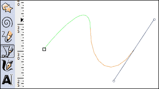
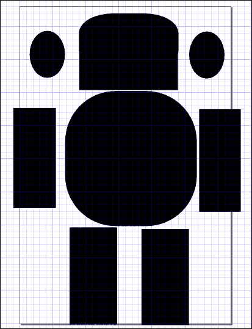
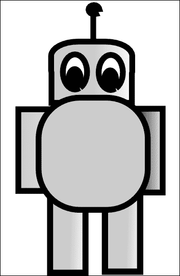

# 七、制作图形

你可以有完美的工作脚本，但是没有什么可以看的时候就没有游戏。图形很重要，这里我们将研究如何获取它们并在 ImpactJS 中实现它们。在本章中，您将学习:

*   呈现的图形类型
*   在决定是生产还是购买时，你应该考虑什么
*   如何使用免费工具 Inkscape 制作矢量图形
*   如何利用 Adobe Photoshop 将现实变成游戏

游戏图形从数字游戏开始就一直在进化。快速浏览太空战！以及它的街机版，电脑空间，Pong，枪战，以及其他许多从古至今的游戏。你会注意到的第一件事不是游戏性的不同，而是缺乏图形的精彩。更快的计算机和专用图形处理器的发展使得游戏变得越来越好看。当然，总体趋势是更加现实:我们能在多大程度上让游戏看起来像现实生活中的游戏，而不会把我们的处理器烧得很脆？这有点像一般绘画的情况。画家倾向于追求更多的细节，更好地接近你在现实生活中看到的东西。这是一个挑战，直到他们开始使用光学镜头将图像直接反射到画布上。然后他们所要做的就是追踪和上色。艺术家们开始寻找新的方式在画布上表达自己，因为完美不再是成功的保证。在图形达到完美的几个世纪后，世界看到了像巴勃罗·毕加索的《格尔尼卡》和爱德华·蒙克的《呐喊》这样的画作。这两者甚至都没有接近达到完美的现实主义；不过，他们都有吸引人的地方。

类似的事情似乎正在游戏世界发生。最近的游戏已经证明，我们可以非常接近现实主义，一些游戏开发商已经开始寻找更多的原创外观。例如，任天堂从未努力接近交付逼真的图形，但他们制作伟大游戏的技能在世界各地都受到尊敬。这是因为他们明白，在玩家身上激起某种感觉比展示玩家从屏幕上看不到的东西更重要。

来看看 1995 年为超级任天堂发布的游戏《Yoshi 的岛》。这里描绘的景色一点也不真实。然而，仅仅播放 10 分钟就能让你充满一种快乐的感觉。一切看起来都是那么的幸福和波光粼粼，有着明亮和幸福的色彩。当他们不打算杀你的时候，动物甚至云朵都会带着真诚的喜悦对你微笑。

塞尔达:2003 年发布的《风之觉醒》，是最早使用细胞阴影图形的大型游戏之一。单元格阴影或卡通阴影图形看起来就像是手绘的。许多其他非常成功的游戏都使用了单元格底纹，比如《边境地带》和《T2》。

前面的例子是 3D 游戏，但是你现在正在阅读的事实证明了制作游戏不仅仅是关于图形。许多年前，游戏从 2D 过渡到 3D 取得了巨大的成功。就连我们心爱的平着陆器马里奥也能出色地完成过渡。3D 游戏通常被认为比 2D 游戏更好看。然而，你在这里，准备做一个 2D 游戏。这证明了漂亮的图形对于传达某种感觉是很重要的，但是传达这种感觉可以用你希望的任何形式，比如艺术本身。

# 制作/购买图形

我们在做游戏的时候需要购买或者自己制作显卡吗？我们很幸运，至少在这方面有选择。对于 3D 游戏来说，自己制作图形的选项通常会受到开发团队规模的限制。对于 2D 奥运会来说，独自完成所有事情的选择仍然是现实的。如果您没有购买精灵和波浪图案的预算，您有三个主要选项来创建您的图形:

*   像素类型
*   矢量艺术
*   用 Photoshop 创造现实

这三个选项中，自己一个像素一个像素的画人物和风景是最有野心的。伟大的艺术家可以用这个获得非常好的结果，但是即使是最有经验的像素艺术家也会花几个小时在一些角色和波形上。有几种工具可以帮助你将自己的绘画技能转移到电脑上，比如数字绘图笔和软件:Adobe Photoshop 或它的免费对应物 GIMP。如果你没有一般的绘画经验，也没有强烈的冲动去投入其中，那就不要。

第二个选项是矢量图形设计。矢量图形不同于像素艺术，因为图形是由线条和基本形式构成的，而不是由单个点构成的。这些线条和形式可以自由缩放到更高和更低的分辨率，而对于像素艺术来说，这可能非常困难。从基本形状(如矩形、圆形和直线)构建绘图需要与常规绘图不同的洞察力。制作图形的先决条件基本上是从需要一只稳定的手转移到对物体和生命形式有一个分析的观点。以《愤怒的小鸟》中的小鸟为例。它们的基本形状是一个圆形，圆形眼睛位于中心。它们的喙有点像圆形的三角形，它们的眉毛和尾巴不过是矩形的集合体。如果你从这种更具分析性的角度来看这些愤怒的小鸟，你自己画一只会变得更容易。如果你觉得你有那种分析性的洞察力，即使你的绘画技巧只是一般，如果你付出足够的努力，你也可以自己制作瓷砖。在本章中，将有一个简短的介绍如何做到这一点。

最后一个选择更像是快速解决方案。通过拍摄对象的照片并将其转换为波形图，您可以快速拥有一些供您使用的图形。虽然接近真实场景对于 3D 游戏来说非常困难，但这实际上是 2D 游戏中最简单的方法。这里的主要问题当然是，如果你使用调整后的图片，你就不能很容易地将自己与竞争对手区分开来，这是营销你的游戏时的一个真正缺点。然而，图形看起来不错，这是一个快速和廉价的方式来获得它们。

# 哪里可以买到显卡

尽管 2D 游戏很常见，但专门向业余游戏开发商提供瓷砖的公司并不多。大多数游戏艺术家要么为游戏公司本身工作，要么在定制的基础上工作，这对于在空闲时间开发游戏的人来说往往变得过于昂贵。

然而，有一些负担得起的 2D 游戏图形制作商，例如、[www.sprites4games.com](http://www.sprites4games.com)。他们有一些免费的精灵，但他们因美丽而实惠的定制作品而受到特别的赞扬

从随机网页下载免费波形图时，有两个主要问题:

*   颚化符非常不完整，所以它们实际上不允许你用它们来创建一个完整的游戏。
*   免费颚化符的另一个问题是它们实际上并不免费。它们经常被从现有游戏中删除，重用它们是非法的。

比如在[www.spritedatabase.net](http://www.spritedatabase.net)上，你可以下载整个游戏的颚化符。但是使用它们来实际发布你自己的游戏可能会导致被起诉侵犯版权。

有时你也可以在更大的艺术和图片网站上找到瓷砖，比如[www.shutterstock.com](http://www.shutterstock.com)。这里的问题是杂乱；很难在所有其他图片之间找到真实的游戏图形。如果你最终找到了一些，你会面临和免费的一样的问题:不完整。到那时，你可以联系艺术家，要求更多的图形，但随后它又变成了定制作品，这往往会变得相当昂贵。

# 矢量图形介绍

现在我们已经看了我们不同的选项，让我们更深入地探讨其中一个:创建我们自己的矢量图形。有几个有趣的工具可以帮助你。Adobe Illustrator 是市场上最好的之一。然而，这里我们将使用一个稍微不那么先进但免费的工具:墨景。你可以在他们的网站上下载 Inkscape:[www.inkscape.org/download/](http:// www.inkscape.org/download/)。

一旦我们在电脑上安装了 Inkscape，我们就可以继续前进，让自己成为一个机器人角色。

给自己画一个角色或一个物体有几种方法。真正的艺术家使用钢笔工具，如下图所示:



这是一个非常通用的绘图工具，它使您能够绘制直线和最完美的对称曲线。然而，在这个简短的初学者教程中，我们将仅限于使用矩形和圆形等基本形式来构建我们的小机器人，如下图所示:


它实际上将是一个小型机器人，因为我们希望它的大小与我们一直使用的字符相同:48 x 32 像素。尽管矢量图形是可缩放的，但最好还是按照您要使用它们的比例来工作。在使用这些小分辨率时，实际查看您要填充哪些像素也是有意义的。您可以通过打开**视图**选项卡下的**网格**选项来实现。此外，您需要在放大图片和实际大小之间切换；这样你就可以看到你实际上会在游戏中加入多少细节。使用 *Ctrl* 键和鼠标滚轮可以进行放大和缩小；此外，按下键盘上的 *1* 键就可以简单地实现以 1:1 的比例查看所有内容的快捷方式。


当我们看一看想要打造的机器人时，可以注意到一些重要的东西:头部被炸得不成比例。正常情况下，人的头部大约是人体的八分之一到七分之一。绘制低分辨率时，头部最好是身体大小的三分之一到一半。这很不现实，但至少你能看到一些面部特征，比如眼睛和嘴巴。这种大头造型叫赤壁，日语中的意思是一个*矮个子*；非常适合小动画。

让我们先来看看我们需要的基本形式。这似乎只不过是几个矩形(圆形和常规矩形)和两个眼睛椭圆，如下图所示:



通过选择正常的矩形并在下面屏幕截图所示面板的帮助下更改其角的半径，可以轻松地圆角矩形的角:


椭圆只不过是一个拉长的圆。您可以在任何方向拉伸任何形状，并在必要时旋转或扭曲它，如下图所示:


在使用矢量图形时，最好有不同的图层，以应对不同的动画。例如，如果我们想让我们的机器人行走，我们将需要它的一只手臂和一条腿伸出来，然后是它的另一只手臂和一条腿。从动画的角度来看，将身体、手臂和腿放在单独的层中是有意义的。身体的形态在运动时不会改变，而肢体的形态会改变。

现在我们已经有了基本的形式，让我们把重点放在颜色上。在低分辨率下工作时，最好进行大对比度。你可以通过让一种颜色接近白色和一种接近黑色来做到这一点，从而发挥亮度。或者，您可以选择使用两种赠送的颜色。两种颜色相对时是恭维，放在一起对比最大。所以在挑选颜色的时候，引入色轮是很有用的。在这个轮子上彼此相对的颜色被认为是互补色。例如，黄色的恭维是紫色的，如下图所示:


我们的机器人将是灰色和黑色的。为了给它上色，我们只需要在每个元素上右击鼠标按钮，选择**填充和描边**，并用我们喜欢的颜色填充它。


此外，我们可以通过将我们的圆切换为不完整的弧，使用下面截图中显示的面板，在我们的机器人的眼睛中给出一个小的额外细节:


我们的机器人现在有一个可识别的形式，甚至有这个小的眼睛细节。这些细节的问题是，当实际玩你的游戏时，它们将不总是可见的，如下图中我们的机器人角色的最小化形式所示；找到适当数量的细节可能很棘手。


我们可以在他的头上加上天线，如下图所示，虽然很小，但仍然可以识别；最终，这是你添加的每个细节都需要考虑的。让我们在下图所示的人物图中引入一点阴影。我们可以通过将填充改为渐变模式而不是均匀填充来实现这一点。



此外，通过添加一些带有这些渐变阴影图案的额外形式，我们可以使设计看起来更加逼真。作为练习，你可以添加你自己的动画，当角色空闲时。例如，一个人会吸气和呼气，使他或她的胸部上下运动。为了描绘这一点，你可以添加一个额外的图像，使游戏感觉更加生动。最终，我们得到了最后一个机器人。教它如何走路就是把最好的一只脚放在前面，然后当然是另一只脚。如果你在单层中工作，可以通过选择一条腿和一只胳膊放在前面，然后按 *Home* 键来完成。按下*结束*键，将选定的手臂定位在其他表单的后面。或者，您可以使用**对象**菜单来实现同样的事情。理想情况下，你会希望与不同的层一起工作，因为这让生活变得容易多了。然而，我们不会在这里讨论这个细节。


这个机器人看起来好像要离开他的小照片，直接向你走来，如前图所示。要获得一个完整的角色，你需要对至少一个侧面图及其背面进行同样的操作。一旦你有这样做的经验，这可以很快完成。然而，有一个更快的方法来获得图形。尽管在绘图准备好之前，您可能只想将它们用作占位符，但这仍然是一个不错的选择。这个选项是使用 Adobe Photoshop 来处理真实的图片。

# 使用 Adobe Photoshop 创建自己的头像

有没有梦想过让自己在自己的游戏里走来走去？现在你可以了！你只需要一个相机和一个类似 Adobe Photoshop 的工具。虽然我们将使用 Adobe Photoshop，但有很多免费的替代品可以很好地完成这项工作。甚至浏览器解决方案也相当不错。Pixlr 就是一个很好的例子。可以在[www.pixlr.com](http://www.pixlr.com)找到。

我们必须从从所有相关方向拍摄的一系列照片开始。最好把它们放在颜色均匀的屏幕前；简单的白色毯子或墙壁也可以。如果你的背景很容易与你想要捕捉的人区分开来，从照片中减去他或她会更容易。我们可以使用快速选择工具来实现这一点，如下图所示:


将人物与背景分离后，我们可以简单地将图片放入一个新的具有透明背景的文件中，甚至为其添加一些效果，以赋予其更超现实的触感，如下图截图所示:


不要局限于 Adobe Photoshop 提供的内容。有好的网站可以用你难以理解的方式改变你的图片。其中一个这样的网站是[www.befunky.com](http:// www.befunky.com)。

在这里，我们可以选择在我们的图片上释放卡通效果，使人几乎无法识别，同时产生这种漂亮的单元格阴影风格，如下图所示:


你将不得不对你所有的图片重复这个过程，这可能相当耗时。然而，这将比你亲自画它们要快得多。还要记住，被动对象只需要一张图片。需要实际动画表的游戏角色代表了大部分工作量。

现在我们有了自己的小精灵，让我们来看看动画表本身。如果你没有必要的适合自己的照片，现在是时候去让别人拍几张你在白墙前摆姿势的照片了。在电子游戏中看到自己有些特别奇怪，所以试试吧。

# 将你的作品添加到角色扮演中

为了将从你的单个精灵变成一个完整的动画表，所有需要做的就是将它们很好地排列在一个文件中。


在进入这个领域之前，你需要考虑一下你需要你的图像有多大。在本例中，它们的大小为 32 x 96 像素。在前面的章节中，我们有 32 x 48 像素大小的字符。拥有比我们当前示例更少拉伸的绘图是优选的，因为它们将允许更容易的游戏性。操纵一个圆形或正方形的角色要比操纵一个细长的角色容易得多。然而，在这种情况下，我们的测试人员又长又瘦，我们希望他保持这种状态。

实际上在一张动画纸上排列图片是一项精密的工作，所以建议使用图片的坐标。Adobe Fireworks 允许通过设置坐标来非常直观地安排绘图。任何图片程序都应该做到这一点；你甚至可以在 MS Paint 中做到这一点。当然还有其他选择。精灵页面生成器将使排列精灵并将它们保存为 tileset 变得更加容易。您还可以选择在 Fireworks 中使用一些 JavaScript 排列代码来自动化定位过程。然而，这里不会详细阐述这些主题。

当你最终设置好自己的工作表时，是时候把它引入你的游戏了。将文件保存为`player.png`并替换您选择的前一章中的代码和表格。

```html
animSheet: new ig.AnimationSheet( 'media/player.png', 32, 96 ), 
init: function( x, y, settings ) {
  this.parent( x, y, settings );
  // Add the animations
  this.addAnim( 'idle', 1, [4] );
  this.addAnim('down',0.1,[3,4,3,5]);
  this.addAnim('left',0.1,[0,1,0,2]);
  this.addAnim('right',0.1,[6,7,6,8]);
  this.addAnim('up',0.1,[9,10,9,11]);
}
```

我们的动画序列很短。对于每一个视角，我们在静止和向前移动右腿或左腿之间切换。如果我们有一个完美的对称特征，床单可能会更小。然后，我们只需要向左或向右行走的动画，并通过翻转图像获得另一个动画，如前一章所见。

# html 5 中图形的提示

为了结束这一章，让我们回顾一下在 HTML5 中使用图形的几个要点:

*   尽量保持你的动画表尽可能的小。不需要复制某些精灵；如果需要，动画序列允许同一子画面被寻址多次。知道每个浏览器都有不同的图像大小限制也很好，尽管要达到这个限制你必须相当草率。
*   使用支持透明背景的文件格式。一个 PNG 文件就可以了。JPG 无法将背景保留为透明，而是将其解释为纯白色。
*   尽可能使用对称图形。这样，您可以翻转图像，使角色从左向右行走，反之亦然。这也减少了你需要的精灵数量，从而减少了制作精灵的工作量。
*   在 ImpactJS 中使用背景贴图时，预先渲染它们会很有用。背景图与常规级别图层的不同之处在于，它是由您在脚本中提供的代码数组而不是标准的 JSON 编码级别文件绘制的。这样就可以设置重复出现的背景。

    ```html
    var backgroundarray= [
      [1,2,6],
      [0,3,5],
      [2,8,1],
    ];
    var background = new ig.BackgroundMap( 32, backgroundarray,'media/grass.png' );
    ```

*   预渲染背景将使系统创建区块，这是一个瓦片的集合。选择预渲染将需要更多的内存，因为较大的部分需要保存在内存中，但会加快绘图过程；这样，对设备处理器的征税就少了。知道您有这个选项，并且根据您是否认为内存或处理能力将是瓶颈，您可以使用 ImpactJS `.prerender`属性选择是否预渲染您的背景。此外，您可以设置块大小来微调两个资源之间的平衡:

    ```html
    background.preRender = true;
    background.chunksize = 4096;
    ```

# 总结

图形是任何游戏的重要元素，因为它们是你的游戏所代表的一切的可视化。虽然游戏中出现了更逼真图形的趋势，但这并不是良好游戏体验的绝对要求。我们讨论了您是否应该制作或购买显卡，以及在哪里可以以实惠的价格购买定制显卡。如果您决定创建自己的图形，我们区分了三个重要选项:像素图形、矢量图形和使用 Adobe Photoshop reality。跳过第一个选项，我们快速了解了如何使用 Inkscape 开发矢量图形，并使用 Adobe Photoshop 将自己添加到游戏中。这一章最后给出了一些在游戏中使用图形的提示。在下一章中，终于到了向世界展示我们的游戏的时候了，因为我们可以将它部署到几个分销渠道，从常规网站到谷歌游戏。