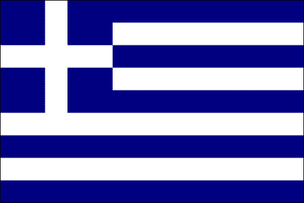
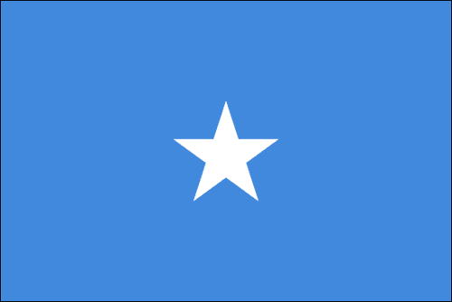

# 第一章。在画布中绘制形状

在本章中，我们将介绍:

*   带有 2D 画布的图形
*   从基本形状开始
*   将矩形分层以创建希腊国旗
*   使用路径创建形状
*   创建复杂的形状
*   添加更多顶点
*   重叠形状以创建其他形状

# 简介

这一章的主要重点是突破画布。在创建图表时，我们将花费大部分时间使用画布。

在本章中，我们将掌握使用画布 API 绘制的基本形状和样式。这一章将是这本书其余部分的主干，所以如果在任何阶段你觉得你需要复习，你可以回到这一章。画线可以是...不太刺激。还有什么比把一个主题作为一个副主题融入到这一章更有戏剧性的方法呢:创造旗帜！

# 2D 画布上的图形

画布是 HTML 的主要和最激动人心的补充。这是业界的热门话题，让我们从这里开始。我们将在后面的章节中再次回顾画布。在这个食谱中，我们将学习如何使用画布动态绘制，并创建一个每秒更新一次的彩色圆圈阵列。


## 怎么做...

我们将创建两个文件(一个 HTML5 文件和一个 JS 文件)。让我们从创建一个新的 HTML5 文档开始:

1.  The first step is to create an empty HTML5 document:

    ```html
    <!DOCTYPE html>
    <html>
      <head>
        <meta charset="utf-8" />
        <title>Canvas Example</title>
      </head>
      <body>
      </body>
    </html>
    ```

    ### 类型

    **下载示例代码**

    您可以从您在[http://www.PacktPub.com](http://www.PacktPub.com)的账户中下载您购买的所有 Packt 书籍的示例代码文件。如果您在其他地方购买了这本书，您可以访问[http://www.PacktPub.com/support](http://www.PacktPub.com/support)并注册，以便将文件直接通过电子邮件发送给您。

    代码文件也可以在[http://02 geek . com/books/html 5-图形和数据可视化-cookbook.html](http://02geek.com/books/html5-graphics-and-data-visualization-cookbook.html) 上找到。

2.  创建新的画布元素。我们给画布元素一个 ID`myCanvas`:

    ```html
      <body>
    <canvas id="myCanvas"> </canvas>
      </body>

    ```

3.  将 JavaScript 文件`01.01.canvas.js`导入到的 HTML 文档中(我们将在步骤 5 中创建该文件):

    ```html
    <!DOCTYPE html>
    <html>
      <head>
        <meta charset="utf-8" />
     <script src="01.01.canvas.js"></script>
        <title>Canvas Example</title>
      </head>

    ```

4.  添加`onLoad`监听器并在文件加载时触发功能`init`:

    ```html
    <!DOCTYPE html>
    <html>
      <head>
        <meta charset="utf-8" />
        <script src="01.01.canvas.js"></script>
        <title>Canvas Example</title>
      </head>
      <body onLoad="init();" style="margin:0px">
        <canvas id="myCanvas" />
      </body>
    </html>
    ```

5.  创建`01.01.canvas.js`文件。
6.  在 JavaScript 文件中，创建函数`init`并调用其中的函数`updateCanvas`:

    ```html
    function init(){
      updateCanvas();
    }
    ```

7.  创建功能`updateCanvas` :

    ```html
    function  updateCanvas(){
      //rest of the code in the next steps will go in here
    }
    ```

8.  在`updateCanvas`函数中(对于剩余的步骤，所有代码都将添加到该函数中)，创建两个变量来存储您想要的宽度和高度。在我们的例子中，我们将抓住窗口的宽度:

    ```html
    function  updateCanvas(){
     var width = window.innerWidth;
     var height = 100;
    ...
    ```

9.  访问 HTML 文档中的画布层并更改其宽度和高度:

    ```html
    var myCanvas = document.getElementById("myCanvas");
        myCanvas.width = width;
        myCanvas.height = height;
    ```

10.  获取画布的 2D 背景:

    ```html
    var context = myCanvas.getContext("2d");
    ```

11.  创建一个矩形来填充画布的全部可见区域:

    ```html
    context.fillStyle = "#FCEAB8";
    context.fillRect(0,0,width,height);
    ```

12.  让我们创建几个辅助变量来帮助我们建立要绘制的元素的颜色、大小和数量:

    ```html
    var circleSize=10;
    var gaps= circleSize+10;
    var widthCount = parseInt(width/gaps); 
    var heightCount = parseInt(height/gaps); 
    var aColors=["#43A9D1","#EFA63B","#EF7625","#5E4130"];
    var aColorsLength = aColors.length;
    ```

13.  创建嵌套循环并创建随机颜色的圆形网格:

    ```html
    for(var x=0; x<widthCount;x++){
      for(var y=0; y<heightCount;y++){
        context.fillStyle = aColors[parseInt(Math.random()*aColorsLength)];
        context.beginPath();
        context.arc(circleSize+gaps*x,circleSize+ gaps*y, circleSize, 0, Math.PI*2, true); 
        context.closePath();
        context.fill();	
      }
    }
    }
    ```

哇哦！这是一个很大的步骤！如果你按照所有的步骤，当你运行应用时，你会在你的浏览器中发现很多圆圈。

## 它是如何工作的...

在我们直接跳到这个应用的 JavaScript 部分之前，我们需要触发`onLoad`事件来调用我们的`init`函数。我们通过在我们的 HTML 主体标签中添加`onLoad`属性来实现:

```html
<body onLoad="init();">
```

让我们分解 JavaScript 部分，并理解这样做背后的原因。第一步是创建`init`功能:

```html
function init(){
  updateCanvas();
}
```

我们的`init`功能立即调用`updateCanvas`功能。这样做是为了以后我们可以刷新并再次调用`updateCanvas`。

在`updateCanvas`功能中，我们首先获取浏览器的当前宽度，并为绘图区域的高度设置一个硬编码值:

```html
var width = window.innerWidth;
var height = 100;
```

我们的下一步是使用画布的 ID 获取画布，然后根据前面的变量设置新的宽度和高度:

```html
var myCanvas = document.getElementById("myCanvas");
    myCanvas.width = width;
    myCanvas.height = height;
```

我们该开始画画了。为此，我们需要要求画布返回其上下文。有几种类型的上下文，如 2D 和 3D。在我们的案例中，我们将重点关注 2D 的环境，如下所示:

```html
var context = myCanvas.getContext("2d");
```

既然我们有了背景，我们就有了开始探索和操纵画布所需的一切。在接下来的几个步骤中，我们通过使用十六进制值设置`fillStyle`颜色并绘制适合画布整个区域的矩形来定义画布背景颜色:

```html
var context = myCanvas.getContext("2d");
    context.fillStyle = "#FCEAB8";
 context.fillRect(0,0,width,height);

```

`fillRect`方法取四个参数。前两个是矩形的(x，y)位置，在我们的例子中，我们希望从(0，0)开始，下面的参数是新矩形的宽度和高度。

让我们画圆。为此，我们需要定义圆的半径和圆之间的空间。我们不要把圆隔开，而是创建半径为 10 像素的圆。

```html
var rad=10;
var gaps= rad*2;
```

第一条线为我们的圆指定半径，而第二条线捕捉我们创建的每个圆的中心之间的间隙，或者在我们的例子中是圆的直径。通过将它设置为半径的两倍，我们就可以一个接一个地将圆隔开。

```html
var widthCount = parseInt(width/gaps); 
var heightCount = parseInt(height/gaps); 
var aColors=["#43A9D1","#EFA63B","#EF7625","#5E4130"];
var aColorsLength = aColors.length;
```

使用我们新的`gaps`变量，我们发现我们可以在画布组件的宽度和高度上创建多少个圆。我们创建一个数组来存储我们的圆的一些颜色选项，并将变量`aColorsLength` 设置为`aColors`的长度。我们这样做是为了减少处理时间，因为变量比属性更容易获取，因为我们将在`for`循环中多次调用这个元素:

```html
for(var x=0; x<widthCount;x++){
 for(var y=0; y<heightCount;y++){
    context.fillStyle = aColors[parseInt(Math.random()*aColorsLength)];
    context.beginPath();
    context.arc(rad+gaps*x,rad+ gaps*y, rad, 0, Math.PI*2, true); 
    context.closePath();
    context.fill();
  }
}
```

我们的嵌套`for`循环使我们能够按照画布的宽度和高度创建圆。第一个`for`循环专注于提升宽度值，而第二个`for`循环负责运行每一列。

```html
context.fillStyle = aColors[parseInt(Math.random()*aColorsLength)];
```

使用`Math.random`，我们从`aColors`中随机选择一种颜色作为我们新圆的颜色。

```html
context.beginPath();
context.arc(rad+gaps*x,rad+ gaps*y, rad, 0, Math.PI*2, true); 
context.closePath();
```

前一段代码中的第一行和最后一行声明了新形状的创建。`beginPath`方法定义形状的开始，`closePath`方法定义形状的结束，而`context.arc`创建实际的圆。`arc`属性采用以下值格式:

```html
context.arc(x,y,radius,startPoint,endPoint, isCounterClock);
```

`x`和`y`属性定义了弧的中心点(在我们的例子中是一个完整的圆)。在我们的`for`循环中，我们需要添加一个额外半径的缓冲区来将我们的内容推入屏幕。我们需要这样做，因为如果我们不把第一个圆向左下方推一个额外的半径，它只有四分之一是可见的。

```html
context.fill();
```

最后但同样重要的是，我们需要调用`fill()`方法，用它的颜色填充我们新创建的形状。

## 还有更多...

让我们的元素每秒刷新一次；要做到这一点，我们需要做的就是再添加两行。第一个将使用 `setInterval`每秒触发一次对`updateCanvas`函数的新调用。

```html
function init(){
 setInterval(updateCanvas,1000);
  updateCanvas();
} 
```

如果您刷新浏览器，您会发现我们的示例正在工作。如果你真的很努力想找到问题你不会，但是我们有问题。这不是一个大问题，但却是我们了解画布另一个有用功能的绝佳机会。在任何阶段，我们都可以清除画布或它的一部分。与其在当前画布上绘制，不如在重绘之前清除它。在`updateCanvas`功能中，我们将添加以下高亮显示的代码:

```html
var context = myCanvas.getContext("2d"); 
context.clearRect(0,0,width,height);

```

一旦我们获得了上下文，我们就可以使用`clearRect`方法清除已经存在的数据。

## 另见

*   *从基本形状开始*食谱

# 从基本形状开始

在这个阶段你知道如何创建一个新的画布区域，甚至创建一些基本的形状。让我们扩展我们的技能，开始创造旗帜。

## 做好准备

我们不会从最基本的旗帜开始，因为那只是一个绿色的矩形。如果你想学习如何创建一个绿色的旗帜，你不需要我，所以让我们来看看一个更复杂的旗帜。

如果你按照 2D 画布上的*图形*食谱，你已经知道如何做了。这一张献给我们的帕劳读者和完美的弧线(也称为圆)。


在本食谱中，我们将忽略 HTML 部分，因此，如果您需要复习如何创建带有 ID 的画布，请回到本章的第一个食谱，并设置您的 HTML 文档。别忘了用正确的标识创建画布。您也可以下载我们的示例 HTML 文件。

## 怎么做...

添加以下代码块:

```html
var cnvPalau = document.getElementById("palau");
  var wid = cnvPalau.width;
  var hei = cnvPalau.height;

  var context = cnvPalau.getContext("2d");
      context.fillStyle = "#4AADD6";
      context.fillRect(0,0,wid,hei);

      context.fillStyle = "#FFDE00";
      context.arc(wid/2.3, hei/2, 40, 0, 2 * Math.PI, false);
      context.fill();
```

就是这样，你刚刚创造了一个完美的弧线，用它你的第一面旗帜有一个形状。

## 它是如何工作的...

这段代码的很大一部分在这个阶段应该看起来非常熟悉。因此，我将重点介绍与本章第一个食谱中使用的线条相比的新线条。

```html
  var wid = cnvPalau.width;
  var hei = cnvPalau.height;
```

在这些线条中，我们提取画布的宽度和高度。这里我们有两个目标:缩短代码行，减少不需要时调用 API 的次数。由于我们不止一次使用它，我们首先获取值并将其存储在`wid`和`hei`中。

现在我们知道了画布的宽度和高度，是时候画圆了。在开始绘制之前，我们将调用`fillStyle`方法来定义要在画布中使用的背景颜色，然后我们将创建弧，完成后触发`fill`方法。

```html
      context.fillStyle = "#FFDE00";
      context.arc(wid/2.3, hei/2, 40, 0, 2 * Math.PI, false);
      context.fill();
```

然后，我们使用`arc`方法创建我们的第一个完美圆。需要注意的是，我们可以在任何时候改变颜色，比如在这个例子中，我们在创建一个新的圆之前改变了颜色。

让我们更深入地了解一下`arc`方法是如何工作的。我们首先用`x`和`y`位置定义我们的圆心。画布标签遵循标准笛卡尔坐标:(0，0)位于左上角(`x`向右增长，`y`向下增长)。

```html
context.arc(x, y, radius, startingAngle, endingAngle, ccw);
```

在我们的例子中，我们决定通过将画布的宽度除以`2.3`来将圆稍微定位在中心的左侧，并且我们将`y`定位在画布的精确中心。下一个参数是我们圆的半径，后面是两个参数，定义了我们笔画的开始和结束位置。当我们想创建一个完整的圆时，我们从`0`开始，到两次`Math.PI`结束，一个完整的圆(`Math.PI`相当于 180 度)。最后一个参数是我们弧线的方向。在我们的例子中，当我们创建一个完整的圆时，我们在这里设置什么并不重要(ccw =逆时针)。

```html
context.fill();
```

最后但同样重要的是，我们调用`fill`函数来填充和着色我们之前创建的形状。与创建和填充形状的`fillRect`功能相反，`arc`方法不创建和填充形状。`arc`方法仅定义要填充的形状的边界。您可以使用这种方法(以及其他方法)在实际将形状绘制到舞台上之前创建更复杂的形状。我们将在本章的以下食谱中更深入地探讨这一点。

# 将矩形分层以创建希腊国旗

我们在为帕劳创建国旗时了解到，当我们使用`arc`方法创建圆时，我们必须单独触发一个填充形状的请求。对于我们从头开始创建的所有形状都是如此，对于创建线条也是如此。让我们来看一面稍微复杂一点的国旗:希腊国旗。



## 做好准备

和前面的方法一样，我们将跳过 HTML 部分，直接跳到画布中绘图的 JavaScript 部分。有关画布元素创建步骤的详细说明，请参考本章的第一个配方。

在您开始编码之前，仔细查看标志，并尝试针对创建该标志所需执行的步骤提出攻击计划。

## 怎么做...

如果我们看看国旗，就很容易想出如何规划。有很多方法可以做到这一点，但以下是我们的尝试:

1.  我们将首先启动我们的应用，并创建一个空白的蓝色画布:

    ```html
      var canvas = document.getElementById("greece");
      var wid = canvas.width;
      var hei = canvas.height;

      var context = canvas.getContext("2d");
          context.fillStyle = "#000080";
          context.fillRect(0,0,wid,hei);
    ```

2.  如果你看一下上图，有四个白色条和五个蓝色条将成为背景的一部分。让我们将画布的总高度除以`9`，这样我们就可以找到适合线条的尺寸:

    ```html
      var lineHeight = hei/9;
    ```

3.  到目前为止，我们使用内置工具创建了形状，例如`arc`和`fillRect`。现在我们将手动绘制线条，为此我们将设置`lineWidth`和`strokeStyle`值，这样我们就可以在画布上绘制线条:

    ```html
      context.lineWidth = lineHeight;
      context.strokeStyle = "#ffffff";
    ```

4.  现在，让我们循环并创建四次从右手边到左手边的线，如下所示:

    ```html
      var offset = lineHeight/2;
      for(var i=1; i<8; i+=2){
        context.moveTo(0,i*lineHeight + offset);
        context.lineTo(wid,i*lineHeight+offset);

      }
    ```

就这样，我们拿到了。重新加载你的 HTML 页面，你会发现希腊的旗帜光彩夺目。嗯，还没有达到最辉煌的程度，但足以猜测这是希腊的国旗。在我们继续之前，让我们深入了解一下这是如何工作的。

## 它是如何工作的...

请注意添加了一个偏移量。这样做是因为`lineWidth`从直线中心的实际点开始向两个方向生长。换句话说，从(0，0)到(0，高度)的宽度为 20 像素的线只有 10 个像素可见，因为线的厚度范围在(-10 到 10)之间。因此，我们需要考虑到我们的第一条线需要被向下推一半的宽度，这样它就在正确的位置。

`moveTo`功能接受两个参数`moveTo(x,y)`。`lineTo`功能也采用两个参数。我相信你一定猜到了它们之间的区别。一个将移动虚拟点而不画任何东西，而另一个将在点之间创建一条线。

## 还有更多...

如果你运行你的 HTML 文件，你会发现我们的行没有被泄露。别担心，你没有犯任何错误(至少，我是这么想的；)).为了让这些行变得可见，我们需要告诉浏览器我们已经准备好了，就像我们在使用`arc`时调用`fill()`方法一样。在这种情况下，当我们创建线时，我们将在定义好线后立即调用`stroke()`方法，如下所示:

```html
var offset = lineHeight/2;
  for(var i=1; i<8; i+=2){
    context.moveTo(0,i*lineHeight + offset);
    context.lineTo(wid,i*lineHeight+offset);

  }
 context.stroke();

```

如果你现在刷新屏幕，你会看到我们越来越近了。现在是我们在屏幕左上角添加矩形的时候了。为此，我们将重用我们的`lineHeight`变量。我们矩形的大小是`lineHeight`长度的五倍:

```html
  context.fillRect(0,0,lineHeight*5,lineHeight*5);
```

现在是时候在旗帜上画十字了:

```html
  context.moveTo(0, lineHeight*2.5);
  context.lineTo(lineHeight*5,lineHeight*2.5);
  context.moveTo(lineHeight*2.5,0);
  context.lineTo(lineHeight*2.5,lineHeight*5+1);
  context.stroke();
```

如果你现在运行应用，你会非常失望。我们确实做了我们以前学过的东西，但是没有达到预期的效果。


台词全混了！好吧，不用担心，这意味着是我们学习新东西的时候了。

### BeginPath 方法和 closePath 方法

我们的旗帜没有那么成功，因为它被我们之前创建的所有线条弄糊涂了。为了避免这种情况，我们应该告诉画布我们什么时候开始新的绘图，什么时候结束它。要做到这一点，我们可以调用`beginPath`和`closePath`方法，让画布知道我们已经完成了一些事情，或者正在开始一些新的事情。在我们的例子中，通过增加方法`beginPath`我们可以解决我们的旗帜问题。

```html
  context.fillRect(0,0,lineHeight*5,lineHeight*5);
 context.beginPath();
  context.moveTo(0, lineHeight*2.5);
  context.lineTo(lineHeight*5,lineHeight*2.5);
  context.moveTo(lineHeight*2.5,0);
  context.lineTo(lineHeight*2.5,lineHeight*5+1);
  context.stroke();
```

恭喜你！您刚刚创建了前两个标志，并在此过程中了解了很多关于画布 API 如何工作的知识。这足以创造出 196 面国旗中的 53 面。这已经是一个很好的开始；世界的 25%在你手中。

你现在应该能做的最复杂的国旗是英国国旗。如果你想探索，试一试。如果你真的以此为荣，给我写封信，我很想看。

# 使用路径创建形状

我们结束了最后一个食谱学习如何创造世界四分之一的旗帜，但这不能成为它的结束，对吗？这个配方将致力于使用路径来创建更复杂的形状。我们将从创建一个三角形开始，并从那里发展到更复杂的形状。

## 做好准备

让我们从基本形状库中没有的最简单的形状开始:三角形。如果你准备好了，让我们开始吧...

## 怎么做...

让我们从创建我们的第一个形状开始，一个三角形:

```html
context.fillStyle = color;
context.beginPath();
context.moveTo(x1,y1);
context.lineTo(x2,y2);
context.lineTo(x3,y3);
context.lineTo(x1,y1);
context.closePath();
context.fill();
```

这里带点`x1,y1`到`x3,y3`的代码是伪代码。你需要选择你自己的点来创建一个三角形。

## 它是如何工作的...

这里的大多数元素都不是新的。这里最重要的变化是，我们使用之前使用的元素从头开始创建形状。当我们创建一个形状时，我们总是从使用`beginPath()`方法声明它开始。然后我们创建形状并用`closePath()`方法结束创建。在我们决定对我们创建的形状做什么之前，我们仍然不会在屏幕上看到任何东西，例如显示它的填充或显示它的笔画。在这种情况下，当我们试图创建一个三角形时，我们将调用`fill`函数。

让我们在一个实时标志示例中看到这一点。这次我们将游览圭亚那的罗赖马山。


好，那么你得到三角形的概念。让我们看看这是怎么回事。我已经提取了这个代码，并将其放入一个函数中。为了创建这个标志，我们需要创建四个三角形。

```html
var canvas = document.getElementById("guyana");
var wid = canvas.width;
var hei = canvas.height;

var context = canvas.getContext("2d");
    context.fillStyle = "#009E49";
    context.fillRect(0,0,wid,hei);

fillTriangle(context,	0,0,
             wid,hei/2,
             0,hei, "#ffffff");
fillTriangle(context,0,10,
             wid-25,hei/2,
             0,hei-10, "#FCD116");
fillTriangle(context,0,0,
             wid/2,hei/2,
             0,hei, "#000000");
fillTriangle(context,0,10,
             wid/2-16,hei/2,
             0,hei-10, "#CE1126");

function fillTriangle(context,x1,y1,x2,y2,x3,y3,color){
  context.fillStyle = color;
  context.beginPath();
  context.moveTo(x1,y1);
  context.lineTo(x2,y2);
  context.lineTo(x3,y3);
  context.lineTo(x1,y1);
  context.closePath();
  context.fill();
}
```

通过创建`fillTriangle()`函数 ，我们现在可以快速有效地创建三角形，就像我们创建矩形一样。这个功能使得创建一个三角形如此丰富的旗帜变得轻而易举。现在，借助`fillTriangle`方法，我们可以创建世界上任何有三角形的旗帜。

## 还有更多...

不要让三角形成为你最复杂的形状，因为你可以创建任意数量的尖头形状。让我们创建一个更复杂的之字形图案。为此，我们将飞往巴林王国。


在我们分解和解释新逻辑之前，试着找到它。

```html
var canvas = document.getElementById("bahrain");
var wid = canvas.width;
var hei = canvas.height;

var context = canvas.getContext("2d");
    context.fillStyle = "#CE1126";
    context.fillRect(0,0,wid,hei);
var baseX = wid*.25;
    context.fillStyle = "#ffffff";
    context.beginPath();
    context.lineTo(baseX,0);

var zagHeight = hei/5;
for(var i=0; i<5; i++){
  context.lineTo(baseX +25 , (i+.5)*zagHeight);
  context.lineTo(baseX  , (i+1)*zagHeight);

}
context.lineTo(0,hei);
context.lineTo(0,0);
context.closePath();
context.fill();

addBoarder(context,wid,hei);
```

让我们打破这个之字形，了解这里发生了什么。在开始正常设置画布元素后，我们直接创建我们的形状。我们先画一个红色的背景，让我们创建一个有白色区域的形状。它很像一个长方形，只是里面有之字形。

在这段代码中，我们从开始创建一个矩形，但是我们的目标是用之字形改变高亮显示的代码行:

```html
var baseX = wid*.25;
context.fillStyle = "#ffffff";
context.beginPath();
context.lineTo(baseX,0);
context.lineTo(wid*.25,hei);
context.lineTo(0,hei);
context.lineTo(0,0);
context.closePath();
context.fill();
```

在这段代码中，我们将填充颜色设置为白色，我们设置我们的`beginPath`，然后设置`lineTo`(从点`(0,0)`，默认的起点)并创建一个矩形，填充画布宽度的 25%。我已经强调了水平线，因为这是我们想做之字形。通过查看标志，我们可以看到我们将创建穿过屏幕的五个三角形，所以让我们用`for`循环来切换这条线:

```html
...
context.lineTo(baseX,0);

var zagHeight = hei/5;
for(var i=0; i<5; i++){
 context.lineTo(baseX +25 , (i+.5)*zagHeight);
 context.lineTo(baseX  , (i+1)*zagHeight);

}

context.lineTo(0,hei);
  ...
```

所以我们在循环之前的第一步是决定每个三角形有多高:

```html
var zagHeight = hei/5;
```

我们取画布的总高度，除以 5，得到每个三角形的高度。

我们在`for`循环本身中画出之字形。为此，我们需要在每轮中使用以下两行代码:

```html
context.lineTo(baseX +25 , (i+.5)*zagHeight);
context.lineTo(baseX  , (i+1)*zagHeight);		
```

在第一行中，我们离开当前位置，将线扩展到三角形高度的一半，并扩展到右侧的极值点；然后在第二行，我们返回到起点`x`并将我们的`y`更新到下一个线段的起点。顺便说一下，`baseX +25`的加入完全是任意的。我只是玩它，直到它看起来很好，但如果你想，你可以使用比率代替(这样，如果你扩展画布，它仍然会看起来很好)。

所有这些中最令人惊奇的部分就是知道如何创建一些之字形、三角形、矩形和圆形。你可以创建更多的标志，但是我们还没有完成。我们继续探索如何创造世界上所有的旗帜。

如果你是通过代码绘图的新手，或者觉得你可以使用一些额外的练习，只要看看世界地图，挑战自己，根据我们已经建立的技能创建旗帜。

# 创建复杂的形状

是时候把我们学到的一切都融入到我们迄今为止见过的最复杂的形状——大卫之星中去了。这颗星是以色列国旗的一部分(世界上我最喜欢的国旗之一；)).我们需要绕一个弯，然后才能通过参观正弦和余弦的神奇世界来创造它。


你一定会喜欢的，对吧？我知道很多人害怕余弦和正弦，但实际上它们非常容易和有趣。让我们在这里用一种更为面向绘图的编程方式来分解它们。最基本的想法是你有一个 90 度角的三角形。你有一些关于这个三角形的信息，这就是你开始使用正弦和余弦所需要的。一旦你知道你有一个 90 度角，知道正弦/余弦，你就有了你需要的所有信息，有了这些信息，你就可以发现任何丢失的信息。在我们的例子中，我们知道所有的角度，我们知道斜边的长度(它是我们的半径；看一下带有圆圈的图像，看看它是如何工作的)。在 JavaScript 中，方法`Math.cos()`和`Math.sin()`都表示一个半径为 1 的圆，位于屏幕上的(0，0)点上。如果我们在`sin`函数中输入我们要寻找的角度，它将返回`x`值(在本例中是相邻的长度)，而`cos`函数将返回相反的长度，在本例中是所需的值`y`。

我做了一个很好的视频，深入到了逻辑。可以在[http://02 geek . com/courses/video/58/467/Using-Cos-and-Sin-to-animate . html](http://02geek.com/courses/video/58/467/Using-Cos-and-Sin-to-animate.html)查看。

## 做好准备

了解正弦/余弦如何工作的最简单方法是通过一个活生生的例子，在我们的例子中，我们将使用它来帮助我们找出如何在以色列国旗上创建大卫之星。我们将后退一步，学习如何在屏幕上找出点来创建形状。我们将再次跳过 HTML 文件的创建，直接进入 JavaScript 代码。关于如何获取 HTML 集合的概述，请查看带有 2D 画布的*图形配方。*


## 怎么做...

创建完 JavaScript 文件后，在您的`init`函数中添加以下代码。

1.  创建我们的基本画布变量:

    ```html
    var canvas = document.getElementById("israel");
    var wid = canvas.width;
    var hei = canvas.height;
    var context = canvas.getContext("2d");
    ```

2.  用弧度定义一度。我们这样做是因为`Math.cos`和`Math.sin`期望的是弧度值而不是度数值(`radian`是以弧度度量的一度):

    ```html
    var radian = Math.PI/180;
    ```

3.  创建一个`tilt`变量。这个变量将定义将要创建的三角形的倾斜度。想象一下三角形在一个圆里，我们用这个`tilt`变量旋转这个圆:

    ```html
    var tilt = radian*180;
    ```

4.  定义画布的中心点:

    ```html
    var baseX = wid / 2;
    var baseY = hei / 2;
    ```

5.  设置大卫之星的不可见边界圆的半径:

    ```html
    var radius = 24;
    ```

6.  定义标志中条带的高度:

    ```html
    var stripHeight = 14;
    ```

7.  定义线宽:

    ```html
    context.lineWidth=5;
    ```

8.  创建两个三角形(一个倾斜，一个不倾斜):

    ```html
    createTrinagle(context,
      baseX+ Math.sin(0) * radius, baseY + Math.cos(0) * radius,
      baseX+ Math.sin(radian*120) * radius, baseY + Math.cos(radian*120) * radius,
      baseX+ Math.sin(radian*240) * radius, baseY + Math.cos(radian*240) * radius, 
      null,"#0040C0");

    createTrinagle(context,
      baseX+ Math.sin(tilt) * radius, baseY + Math.cos(tilt) * radius,
      baseX+ Math.sin(radian*120+tilt) * radius, baseY + Math.cos(radian*120+tilt) * radius,
      baseX+ Math.sin(radian*240+tilt) * radius, baseY + Math.cos(radian*240+tilt) * radius, 
      null,"#0040C0");
    ```

9.  绘制旗条 :

    ```html
    context.lineWidth=stripHeight;
    context.beginPath();
    context.moveTo(0,stripHeight);
    context.lineTo(wid,stripHeight);
    context.moveTo(0,hei- stripHeight);
    context.lineTo(wid,hei- stripHeight);
    context.closePath();
    context.stroke();
    ```

10.  创建`createTriangle`功能 :

    ```html
    function createTriangle(context,x1,y1,x2,y2,x3,y3,fillColor,strokeColor){
      context.beginPath();
      context.moveTo(x1,y1);
      context.lineTo(x2,y2);
      context.lineTo(x3,y3);
      context.lineTo(x1,y1);
      context.closePath();
      if(fillColor) {
        context.fillStyle = fillColor;
        context.fill();	
      }
      if(strokeColor){
      context.strokeStyle = strokeColor;
      context.stroke();

      }
    }
    ```

你完蛋了。运行您的应用，您会发现以色列国旗的中央有大卫之星。

## 它是如何工作的...

在我们深入了解标志的创建以及它是如何完成的之前，我们需要了解我们如何在一个圆中定位点。为此，让我们看一个更简单的例子:

```html
var rad = Math.PI/180;	
context.fillStyle = "#FFDE00";
context.arc(wid / 2, hei / 2, 30, 0, 2 * Math.PI, false);
context.fill();
context.beginPath();
context.strokeStyle = "#ff0000";
context.lineWidth=6;
context.moveTo(Math.sin(0) * 30 + wid / 2, Math.cos(0) * 30 + hei/2);
context.lineTo(Math.sin(rad*120) * 30 + wid / 2, Math.cos(rad*120) * 30 + hei/2);
context.stroke();
```

下面是代码将生成的输出:


虽然在我们人性化的头脑中，圆形是一个 360 度的形状，但实际上在大多数编程语言中，它最好用弧度来表示。

弧度就像度一样，只是不是 0 到 360 之间的人性化数字，而是 0 到 2 倍π之间的数字。你可能想知道圆周率是什么，所以再多讲一点圆周率。圆周率本质上是取任意圆的周长除以同一个圆的直径所得到的值。回来的结果将是圆周率或大约 3.14159。这是一个神奇的数字，好消息是，如果你不想知道，你不需要知道更多。你只需要知道 3.142 等于半个圆。有了这个事实，我们现在可以用π除以`180`得到一个弧度值，等于一度:

```html
var rad = Math.PI/180;
```

然后，我们在屏幕中心创建一个半径为`30`的圆，以帮助我们可视化，并继续创建一条线，该线将从我们的圆的角度`0`开始，以角度`120`结束(因为我们想要创建一个 360/3 的三角形)。

```html
context.strokeStyle = "#ff0000";
context.lineWidth=6;
context.moveTo(Math.sin(0) * 30 + wid / 2, Math.cos(0) * 30 + hei/2);
context.lineTo(Math.sin(rad*120) * 30 + wid / 2, Math.cos(rad*120) * 30 + hei/2);
context.stroke();
```

让我们分解最复杂的一行:

```html
context.lineTo(Math.sin(rad*120) * 30 + wid / 2, Math.cos(rad*120) * 30 + hei/2);
```

当`Math.sin`和`Math.cos`返回一个半径为`1`的值时，我们将把返回的任何值乘以我们的圆的半径(在本例中为`30`)。在`Math.sin`和`Math.cos`的参数中，我们将提供完全相同的值；在本例中`120`弧度。由于我们的圆将在画布的左上角居中，我们希望通过添加我们的值`wid/2`和`hei/2`，将圆从屏幕中心开始移动。

在这个阶段，你应该知道如何在圆上寻找点，以及如何在两点之间画线。让我们回到我们的以色列国旗，深入了解新功能`createTriangle`。这是基于*中创建的功能`fillTriangle`使用路径*配方创建形状。

```html
function createTriangle(context,x1,y1,x2,y2,x3,y3,fillColor,strokeColor){

...

 if(fillColor) {
 context.fillStyle = fillColor;
 context.fill(); 
 }

if(stokeColor){
 context.strokeStyle = fillColor;
 context.stroke(); 

 }

}
```

与功能`fillTriangle`相比，我强调了该功能的新组件。两个新参数`fillColor`和`strokeColor`定义了我们应该填充还是描边三角形。请注意，我们将`strokeStyle`和`fillStyle`方法移到了函数的底部，以减少代码占用。太好了。我们现在有了一个现代三角创造者，可以处理大卫之星。

## 还有更多...

好了，是时候把这些点连接起来(字面意思)并创造以色列的旗帜了。回顾我们的原始代码，我们发现自己两次使用`createTriangle`函数来创建完整的大卫之星形状。让我们通过看第二个三角形(颠倒的那个)来更深入地了解这里的逻辑:

```html
createTriangle(context,
  baseX+ Math.sin(tilt) * radius, 
  baseY + Math.cos(tilt) * radius,
 baseX+ Math.sin(radian*120+tilt) * radius, 
 baseY + Math.cos(radian*120+tilt) * radius,
baseX+ Math.sin(radian*240+tilt) * radius,
  baseY + Math.cos(radian*240+tilt) * radius, null,"#0040C0");
```

我们在虚拟圆上发送三个点来创建一个三角形。我们将我们的虚拟圆分成三个相等的部分，并在`0`、`120`和`240` 度找到点值。这样，如果我们在这些点之间画一条线，我们就会得到一个所有边都相等的完美三角形。

让我们深入了解一下发送到`createTriangle`功能的一个点:

```html
baseX + Math.sin(radian*120+tilt) * radius, 	
baseY + Math.cos(radian*120+tilt) * radius
```

我们从`baseX`和`baseY`(屏幕的中心)作为我们圆的中心点开始，然后从那个基础起点计算出实际的点间隙。然后，我们将分别从`Math.sin`和`Math.cos`获得的价值相加。在这个例子中，我们试图得到`120`度加上倾斜值。换句话说，`120`度加上`180`度(或`300`度)。

为了更容易理解，伪代码看起来类似于下面的代码片段:

```html
 startingPositionX + Math.sin(wantedDegree) * Radius 
 startingPositionY + Math.cin(wantedDegree) * Radius 
```

除了祝贺，没什么好说的了。我们刚刚完成了另一面旗帜的创建，在这个过程中，我们学习了如何创建复杂的形状，使用数学来帮助我们在屏幕上找出点，并将不同的形状混合在一起以创建更高级的形状。

# 添加更多顶点

有许多旗帜包含的星星是无法通过重叠的三角形来创造的。在这个食谱中，我们将计算出如何创建一颗包含任意数量点的恒星我们将使用我们在上一个食谱中发现的相同的关键概念，利用一个虚拟圆来计算位置，这次只有两个虚拟圆。在这个食谱中，我们将创建索马里的国旗，并在这个过程中找出如何创建一个功能，使我们能够创建星星。



## 做好准备

请继续处理上一份食谱中的样品。如果你还没有做，我强烈鼓励你做，因为这个食谱是上一个食谱的下一个逻辑步骤。和前面的食谱一样，我们将跳过这个示例的 HTML 部分。请复习书中的第一个食谱，刷新所需的 HTML 代码。

## 怎么做...

让我们跳进来，创造索马里的旗帜。

1.  创建画布标准逻辑:

    ```html
    var canvas = document.getElementById("somalia");
    var wid = canvas.width;
    var hei = canvas.height;

    var context = canvas.getContext("2d");
    ```

2.  填充画布背景色:

    ```html
    context.fillStyle = "#4189DD";
    context.fillRect(0,0,wid,hei);
    ```

3.  通过调用`createStar`功能

    ```html
    createStar(context,wid/2,hei/2,7,20,5,"#ffffff",null,0);
    ```

    画出星星
4.  创建`createStart`功能:

    ```html
    function createStar(context,baseX,baseY,
                        innerRadius,outerRadius,
                        points,fillColor,
                        strokeColor,tilt){
    // all the rest of the code in here
    }
    ```

5.  从上的这个点开始，我们将在`createStart`功能内工作。添加几个辅助变量:

    ```html
    function createStar(context,baseX,baseY,innerRadius,outerRadius,points,fillColor,strokeColor,tilt){
      var radian = Math.PI/180;
      var radianStepper = radian * ( 360/points) /2;
      var currentRadian =0;
      var radianTilt = tilt*radian;
    ```

6.  开始绘制任何形状前，调用`beginPath`方法:

    ```html
      context.beginPath();
    ```

7.  将绘图指针移动到内圆中的角度【T0:

    ```html
      context.moveTo(baseX+ Math.sin(currentRadian + radianTilt) * innerRadius,baseY+ Math.cos(currentRadian + radianTilt) * innerRadius);
    ```

8.  循环通过恒星的总点，在外圆和内圆之间来回画一条线，创建一颗恒星:

    ```html
    for(var i=0; i<points; i++){
      currentRadian +=  radianStepper;
      context.lineTo(baseX+ Math.sin(currentRadian + radianTilt) * outerRadius,baseY+ Math.cos(currentRadian + radianTilt) * outerRadius);
      currentRadian +=  radianStepper;
      context.lineTo(baseX+ Math.sin(currentRadian + radianTilt) * innerRadius,baseY+ Math.cos(currentRadian + radianTilt) * innerRadius);
    }
    ```

9.  关闭绘图路径，根据功能参数

    ```html
    context.closePath();

      if(fillColor){
        context.fillStyle = fillColor;
        context.fill();	
      }

      if(strokeColor){
        context.strokeStyle = strokeColor;
        context.stroke();	

      }

    }
    ```

    填充或描边

当你运行你的 HTML 包装器时，你会发现你的第一颗星，随之而来的是另一面旗帜。

## 它是如何工作的...

让我们从开始，了解我们要创建的函数期望什么。想法很简单，要创造一颗恒星我们要有一个虚拟的内圆和一个虚拟的外圆。然后我们可以在圆圈之间来回画线来创建恒星。为此，我们需要一些基本参数。

```html
function createStar(context,baseX,baseY,
     innerRadius,outerRaduis,points,fillColor,
                             strokeColor,tilt){
```

我们常规的上下文，`baseX`和`baseY`不需要进一步介绍。虚拟的`innerRadius`和`outerRadius`有助于定义形成恒星的线段的长度和它们的位置。我们想知道我们的明星会有多少积分。我们通过增加`points`参数来实现。我们想知道`fillColor`和/或`strokeColor`，这样我们就可以定义恒星的实际颜色。我们用一个`tilt`值(正如我们在为以色列国旗创建大卫之星时所看到的，它可能很有用)来填充它。

```html
var radian = Math.PI/180;
var radianStepper = radian * ( 360/points) / 2;
var currentRadian =0;
var radianTilt = tilt*radian;
```

然后，我们继续为我们的明星配置辅导员变量。这不是我们第一次看到弧度变量，但这是我们第一次`radianStepper`。弧度步进器的目标是简化我们循环中的计算。我们用三角形的点数除以 360 度。我们将该值除以`2`，因为我们将有两倍数量的点作为线。最后但同样重要的是，我们希望将这个值转换为弧度，这样我们就可以通过弧度变量复制完整的结果。然后，我们创建一个简单的`currentRadian`变量来存储当前步骤，并通过将`tilt`值转换为弧度值来结束，这样我们就可以将其添加到所有行中，而无需在循环中进行额外的计算。

像往常一样，我们用`beginPath`和`closePath`方法开始和完成我们的形状。让我们更深入地了解一下我们即将成形的起点:

```html
context.moveTo(baseX+ Math.sin(currentRadian + radianTilt) * innerRadius,baseY+ Math.cos(currentRadian + radianTilt) * innerRadius);
```

虽然乍一看这个可能看起来有点吓人，但其实和我们创造大卫之星的方式非常相似。我们从`currentRadian` (也就是现在的`0`)开始，以`innerRadius` 为起点。

在我们的循环中，我们的目标将是在内外圈之间来回编织。为此，我们需要在每次循环循环时将`currentRadian`值增加一个`radianStepper`:

```html
for(var i=0; i<points; i++){
 currentRadian +=  radianStepper;
  context.lineTo(baseX+ Math.sin(currentRadian + radianTilt) * outerRadius,baseY+ Math.cos(currentRadian + radianTilt) * outerRadius);
  currentRadian +=  radianStepper;
  context.lineTo(baseX+ Math.sin(currentRadian + radianTilt) * innerRadius,baseY+ Math.cos(currentRadian + radianTilt) * innerRadius);
}
```

我们根据参数中的点数开始一个循环。在这个循环中，每当我们在内圆和外圆之间画两条直线时，我们就在外半径和内半径之间来回移动。我们的步长由点数定义(我们用`radianStepper`变量配置的值)。

当我们在早期的配方中创建`createTriangle`函数时，我们覆盖了其余的函数。给你。现在，您可以运行该应用并找到我们的第七面旗帜。有了这个新的复杂函数，我们可以创建所有实心恒星和所有空心的非实心恒星。

好的，我希望你坐下...有了新获得的星际力量，你现在可以创建至少 109 个国旗，包括美利坚合众国和所有其他国旗上有星星的国家(世界上 57%的国家，还在计算中！).

# 重叠形状以创建其他形状

总的来说，有许多旗帜和许多形状可以通过组合我们到目前为止创建的形状来创建。我们不知道如何创造的 82 面国旗中最受欢迎的形状之一是新月形，就像土耳其国旗中的形状一样。有了它，我们学习了一种新的技巧，使用减法来创建更深入的形状。


## 做好准备

上一个食谱是我们在这个食谱中的起点。从这里开始，我们将继续努力创建更高级的形状，这些形状是由两个形状组合而成的。因此，我们将使用位于`01.02.flags.js`的最后一个配方中创建的代码。

## 怎么做...

让我们直接跳到代码中，看看它是如何运行的。

1.  访问上下文并将画布的宽度和高度保存到变量中:

    ```html
    var canvas = document.getElementById("turkey");
    var wid = canvas.width;
    var hei = canvas.height;

    var context = canvas.getContext("2d");
    ```

2.  填充矩形画布区域:

    ```html
    context.fillStyle = "#E30A17";
    context.fillRect(0,0,wid,hei);
    ```

3.  创建一个完整的圆:

    ```html
    context.fillStyle = "#ffffff";
    context.beginPath();
    context.arc(wid / 2 - 23, hei / 2, 23, 0, 2 * Math.PI, false);
    context.closePath();
    context.fill();
    ```

4.  更改画布的颜色填充。用另一个圆填充其边界内的圆，该圆隐藏了最后创建的圆的一部分。这个效果创造了一个看起来像新月的形状:

    ```html
    context.fillStyle = "#E30A17";
    context.beginPath();
    context.arc(wid / 2 - 18, hei / 2, 19, 0, 2 * Math.PI, false);
    context.closePath();
    context.fill();
    ```

5.  重复使用之前食谱中的`createStart`来添加土耳其星:

    ```html
    createStar(context,wid/2 + 13,hei/2,5,16,5,"#ffffff",null,15);
    ```

给你。您刚刚创建了一个形状，如果不使用另一个形状来遮盖它，这是不可能的。

## 它是如何工作的...

这里的问题是我们使用了两个圆，一个重叠另一个来创建一个月牙形。顺便说一下，注意我们是如何倾斜恒星的，这样它的一个点就会指向圆的中间。

在过去的几个例子中，我们已经经历了很多，在这个阶段，你应该会很舒服地在画布上创建许多形状和元素。在我们可以说我们已经掌握了画布之前，还有很多要探索的，但是我们可以肯定地说，我们已经掌握了创造世界上大多数旗帜，这很酷。我想看看你的旗帜。当你写了一本书中没有的书时，给我写一行！:)