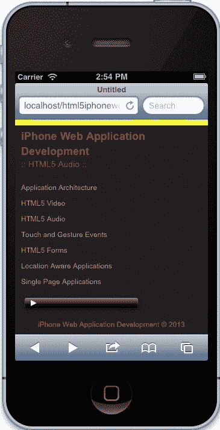
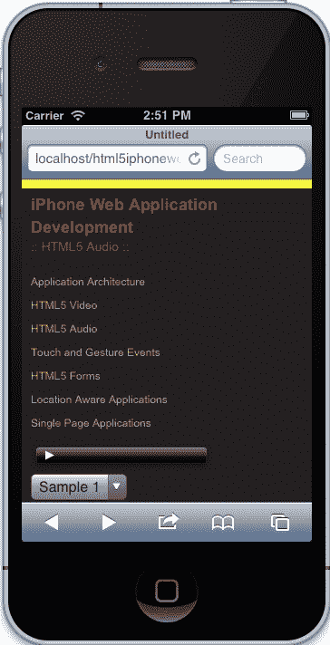
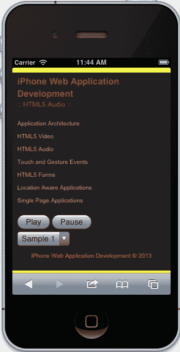
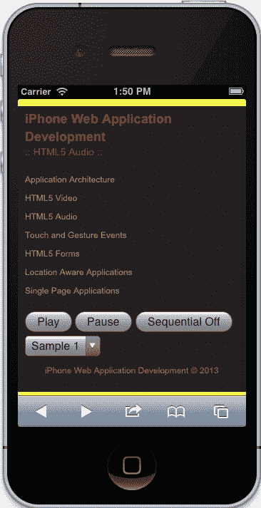

# 第三章 HTML5 音频

在上一章中，我们讨论了媒体分发的重要性，以及 HTML5 如何改变 web，在浏览器中以本地方式提供音频和视频内容。我们专门讨论了 HTML5 视频实现，但也讨论了`MediaElement`规范，该规范涵盖了视频和音频使用的常见 API。

在本章中，我们将进一步深入规范并对其进行抽象，使其可用于音频和视频。但在讨论这个问题之前，我们将用一个简单的示例讨论服务器配置，然后继续讨论使用动态音频播放器和自定义控件的更高级实现。

在本章中，我们将了解：

*   集成一个简单的 HTML5 音频示例
*   配置我们的服务器
*   `MediaElement`抽象
*   扩展音频的`MediaElement`API
*   创建动态音频播放器
*   自定义音频控件

# 服务器配置

在开始使用 HTML5 音频元素之前，我们需要配置服务器，以允许特定音频格式正确播放。首先，让我们花些时间了解合适的音频格式。

## 音频格式

对 HTML5音频播放的支持与视频元素的支持类似，因为每个浏览器出于某种原因支持不同类型的格式。以下是一些表格，展示了支持的内容：

*   以下是与桌面浏览器相关的详细信息：

    3.6+

    【T51 Ogg Vorbis，T63】

    3.6】

    <colgroup><col style="text-align: left"><col style="text-align: left"><col style="text-align: left"></colgroup>
    | 

    桌面浏览器

     | 

    版本

     | 

    编解码器支持

     |
    | --- | --- | --- |
    | 互联网浏览器 | 9.0+ | MP3、AAC |
    | 谷歌浏览器 | 6.0+ | Ogg Vorbis，MP3，WAV |
    | Mozilla Firefox |
    | 【Ogg Vorbis，T64】【 |
    | 游猎 | 5.0+ | MP3、AAC、WAV |
    | 歌剧 | 10.0+ | Ogg Vorbis，WAV |

*   以下是与移动浏览器相关的详细信息：

    <colgroup><col style="text-align: left"><col style="text-align: left"><col style="text-align: left"></colgroup>
    | 

    移动浏览器

     | 

    版本

     | 

    编解码器支持

     |
    | --- | --- | --- |
    | 歌剧手机 | 11.0+ | 设备相关 |
    | 安卓 | 2.3+ | 设备相关 |
    | 移动 Safari（iPhone、iPad、iPod Touch） | iOS 3.0+ | MPEG、MPG、MP3、SWA、AAC、WAV、BWF、MP4、AIFF、AIF、AIFC、CDDA、32G、3GP2、3GP、3GPP |
    | 黑莓 | 6.0+ | MP3、AAC |

正如我们所看到的，各种浏览器（包括移动浏览器和桌面浏览器）都支持多种格式类型。幸运的是，这本书关注的是 iphoneweb 应用，因此出于我们的目的，我们将只关注提供大多数浏览器支持的 MP3 格式。现在，我们需要确保我们的服务器可以播放 MP3。

## 音频格式指令

为了提供正确的 MIME 类型，我们需要配置 Apache 服务器。为此，我们希望将以下指令添加到`.htaccess`文件中：

```html
AddType audio/mpeg mp3
AddType audio/mp4 m4a
AddType audio/ogg ogg
AddType audio/ogg oga
AddType audio/webm webma
AddType audio/wav wav
```

当然，出于我们的目的，我们只需要 MPEG/MP3，但最好允许这些，以便在支持其他浏览器时考虑可扩展性。

# 简单的 HTML5 音频集成

在页面上包含音频非常简单。我们只需在页面中添加以下标记，即可立即使用音频播放器：

```html
<audio controls>
    <source src="../assets/mymusic.mp3" type='audio/mpeg; codecs="mp3"'/>
    <p>Audio is not supported in your browser.</p>
</audio>
```



音频元素

前面的示例指定了一个音频元素，该元素的属性为控件，告诉浏览器有一个带有本机控件的音频播放器用于播放。在这个元素中，有一个源元素和一个段落元素。source 元素指定音频的源及其类型。源元素上的属性`src`是音频的相对位置，和`type`属性指定源的 MIME 类型和编解码器。最后，我们有一个段落元素，以防音频元素不受支持。

这个例子完美地展示了在我们的页面上有媒体是多么容易，只是它并不总是那么简单。大多数时候，我们希望完全控制我们的组件，有时有必要使用指定的 API。在上一章中我们已经讨论了这些概念，我们开发了一个广泛的视频类，我们可以在这里使用。在下一节中，我们将后退一步，抽象到目前为止我们编写的代码。

# \12304；T0】元素抽象

我们已经讨论了音频和视频如何在 HTML5 规范中共享相同的 API。在本节中，我们将讨论如何获取我们编写的视频JavaScript 并对其进行抽象，以便我们可以将其重新用于音频播放。

## 创建 App.MediaElement.js

1.  首先，让我们在`js`目录中创建一个新的 JavaScript文件，并将其命名为`App.MediaElement.js`。
2.  Next, copy over the contents of `App.Video.js` into the new `App.MediaElement.js` file.

    在这一步中，我们希望确保我们的文件反映了`MediaElement`名称空间，因此我们将把单词`Video`重命名为`MediaElement`。

一旦我们将所有内容重命名为`MediaElement`，我们可能会删除默认元素及其名称，因为像这样的抽象类不需要这些元素。除了这些默认值，我们不需要 public`fullscreen`方法或`onFullScreen`回调。

进行上述更改时，我们的文件应如下所示：

```html
var App = window.App || {};
App.MediaElement = (function(window, document, $){
  'use strict';

  var _defaults = {
'callbacks': {
...
}
  };

  function MediaElement(options) { ... }
  function attachEvents() { ... }

MediaElement.prototype.onCanPlay = function(e, ele) { ... }
MediaElement.prototype.onSeeking = function(e, ele) { ... }
MediaElement.prototype.onSeeked = function(e, ele) { ... }
MediaElement.prototype.onEnded = function(e, ele) { ... }
MediaElement.prototype.onPlay = function(e, ele) { ... }
MediaElement.prototype.onPause = function(e, ele) { ... }
MediaElement.prototype.onLoadedData = function(e, ele) { ... }
MediaElement.prototype.onLoadedMetaData = function(e, ele) { ... }
MediaElement.prototype.onTimeUpdate = function(e, ele) { ... }
MediaElement.prototype.getDefaults = function() { ... ;
MediaElement.prototype.toString = function() { ... };
MediaElement.prototype.play = function() { ... }
MediaElement.prototype.pause = function() { ... }
MediaElement.prototype.stop = function() { ... }
MediaElement.prototype.mute = function() { ... };
MediaElement.prototype.unmute = function() { ... };

  return MediaElement;

}(window, document, Zepto)); 
```

虽然我们之前已经编写了这段代码，但让我们简要回顾一下`MediaElement`类的结构。此类包含可访问的公开方法，如`onCanPlay`、`onSeeking`和`onEnded`。当我们传入的元素已调度适当的事件时，将调用这些方法。我们正在收听的事件在`attachEvents`中，它们包含共享的 API 事件，如`canplay`、`seeking`、`ended`等。

这个类本质上只包含音频和视频媒体之间共享的 API。如果我们想为特定的功能（如全屏）扩展它，我们将扩展`MediaElement`的实例或为`App.Video`类使用 JavaScript 继承。

### 提示

在本书中，我们不涉及真正的 JavaScript 继承。鉴于我们想从整体上回顾 HTML5 在 iPhone web 应用开发中的应用，我们不想深入了解 JavaScript 架构的更高级细节。

## 初始化 App.MediaElement.js

为了初始化`App.MediaElement.js`，我们可以执行以下操作：

```html
new App.MediaElement({
    'element': someElement,
    'callbacks': {
        'onCanPlay': function(){ console.log('onCanPlay'); },
        'onSeeking': function(){ console.log('OVERRIDE :: onSeeking'); },
        'onSeeked': function(){ console.log('OVERRIDE :: onSeeked'); },
        'onEnded': function(){ console.log('OVERRIDE :: onEnded'); },
        'onPlay': function(){ console.log('OVERRIDE :: onPlay'); },
        'onPause': function(){ console.log('OVERRIDE :: onPause'); },
        'onLoadedData': function(){ console.log('OVERRIDE :: onLoadedData'); },
        'onLoadedMetaData': function(){ console.log('OVERRIDE :: onLoadedMetaData'); },
        'onTimeUpdate': function(){ console.log('OVERRIDE :: onTimeUpdate'); }
    }
});
```

在前面的代码中，我们创建了一个新的`MediaElement`实例，并向其传递一个对象，该对象与`MediaElement`构造函数的默认值合并。请记住，`element`总是指音频或视频元素。我们可以选择是否覆盖默认回调，因为它们是可选的。

### 注

请注意，我们正在传递所有回调。这是因为，自从写这本书以来，`Zepto.js`包含一个 bug，如果将布尔真值作为第一个参数传入，它不会对对象进行深度复制。

现在我们准备将这个类与我们为本页开发的音频类一起使用。

# 为音频扩展 MediaElement API

现在我们有了一个抽象的`MediaElement`类，我们想在它的基础上进行构建，以允许音频播放。从我们建立的基础模板开始，我们将创建一个包含此页面所有功能的`App.Audio`类；从创建`MediaElement`的实例，到创建切换曲目和管理每个曲目音量的下拉菜单。

## 基础模板

我们可以按照之前建立的模式建立基础模板。以下是一些可以作为模板开始的代码：

```html
var App = window.App || {};

App.Audio = (function(window, document, $){
  'use strict';

  var _defaults = {
    'element': 'audio',
    'name': 'Audio'
  };

  function Audio(options) {
    this.options = $.extend({}, _defaults, options);

        this.element = this.options.element;
        this.$element = $(this.element);

        attachEvents.call(this);
  }

    function attachEvents() { }

  Audio.prototype.getDefaults = function() { ... };

  Audio.prototype.toString = function() { ... };

  return Audio;

}(window, document, Zepto));
```

这里没有什么是新的，我们使用的是我们以前使用的相同模式；建立一个`App.Audio`类，一个包含`Audio`构造函数的 IIFE，包含要处理的事件的相同`attachEvents`方法，以及一些扩展`Audio`（`getDefaults`和`toString`的原型方法。我们继续使用`Zepto`并将`window`和`document`作为参考传入IIFE，然后自行包含我们的代码。

## 创建 MediaElement 实例

在构造函数中，我们需要做两件事。首先，我们需要获取页面上的音频元素并缓存它。第二，我们需要基于页面上的元素创建或初始化 MediaElement 的实例。

### 查找并缓存音频元素

要查找音频元素并缓存它，我们可以执行以下操作：

```html
this.audioElement = document.getElementsByTagName('audio')[0];
this.$audioElement = $(this.audioElement);
```

记住，`this`关键字引用的是返回到`App.Audio`的`audio`实例。然后我们在`this`上创建一个名为`audioElement`的属性，该属性被设置为页面上找到的第一个音频元素。

### 注

请注意，文档上存在的`getElementsByTagName`接受一个参数，即字符串。此方法获取页面上与数组中的该标记匹配的所有元素。在本例中，页面上只有一个 audio 元素，因此我们得到一个数组，其中找到一个元素。因此，我们使用`[0]`获取该数组中的第一个实例。

一旦我们有了音频元素，我们就将其缓存为一个`Zepto`对象，这样我们就可以使用`Zepto`一次，从而提高应用的性能。我通常在我的大多数项目中都这样做，因为我发现自己在使用 Zepto 的许多内置方法，特别是在创建事件侦听器时。但是，如果您觉得它在您的案例中没有用处，可以跳过它。

### 初始化媒体元素

现在我们有了音频元素，我们可以按照上一节编写的代码来初始化`MediaElement`。因此，您不必反向操作，以下是我们可以使用的代码：

```html
this.mediaElement = new App.MediaElement({
    'element': this.audioElement,
    'callbacks': {
        'onCanPlay': function(){ ... },
        'onSeeking': function(){ ... },
        'onSeeked': function(){ ... },
        'onEnded': function(){ ... },
        'onPlay': function(){ ... },
        'onPause': function(){ ... },
        'onLoadedData': function(){ ... },
        'onLoadedMetaData': function(){ ... },
        'onTimeUpdate': function(){ ... }
    }
});
```

这与我们之前编写的代码相同，回调中的省略号应该包含我们编写的`console.log`。您应该注意的一点是，我们将缓存的音频元素`this.audioElement`传递到`MediaElement`的实例中。另外，我们已经创建了一个引用`MediaElement`实例的`this.mediaElement`。现在我们可以公开控制稍后创建的`App.Audio`实例中的音频。

在这一点上，我们有一个功能齐全的音频播放器，它是基于我们的抽象类`MediaElement`构建的。然而，没有什么进展；我们只有一个可以工作且可扩展的设置，但它在任何方面都不是唯一的。我们的动态音频播放器将在这里播放。

# 动态音频播放器

因此，在这一点上，我们有一个 audio 类，它用公开的事件扩展了`MediaElement`对象，因此我们可以创建动态内容。现在，让我们有一些乐趣，并创建一个动态音频播放器，切换曲目。

## 选择元素

最初，当我们在[第 1 章](01.html "Chapter 1. Application Architecture")、*应用架构*中创建此应用时，我们创建了一个导航，其中包含锚定标记和列表元素。尽管这在台式机和 iPad 上都能很好地工作，但它不适合像 iPhone 这样的小屏幕设备。由于这个原因，`select`元素带来了一个本地组件，它允许您轻松地导航您可以选择的选项。

苹果的开发者文档建议我们在应用中使用`select`元素，因为它已经作为 iOS（[中的自定义控件进行了优化 http://goo.gl/T3xuY](http://goo.gl/T3xuY) ）。这非常有用，因为允许我们遵守 iOS 的 web 应用设计准则。

现在让我们继续实施。首先，我们需要确保将`select`元素添加到页面中。现在，您应该具有以下标记：

```html
<div class="audio-container">
    <audio controls preload>
        <source src="../assets/sample.mp3" type='audio/mpeg; codecs="mp3"'/>
        <p>Audio is not supported in your browser.</p>
    </audio>
</div>
```

我们需要做的是在`audio`标记后添加 select 元素，如下所示：

```html
<div class="audio-container">
    <audio controls preload>
        <source src="../assets/nintendo.mp3" type='audio/mpeg; codecs="mp3"'/>
        <p>Audio is not supported in your browser.</p>
    </audio>
    <select>
        <option value="sample1.mp3" selected>Sample1</option>
        <option value="sample2.mp3">Sample2</option>
        <option value="sample3.mp3">Sample3</option>
    </select>
</div>
```



选择元素

在前面的代码中，我们已经添加了一个包含多个选项的 select 元素。这些选项有一个`value`属性，第一个选项也包含一个`selected`属性。value 属性应该包含您在资产中拥有的轨迹，所选属性告诉`select`在页面加载时自动选择该选项。

### 注

在本例中，我们假设所有音频都是 MP3。在您的情况下，这可能是不同的，如果是这样，我们需要在我们将编写的代码中构建逻辑来处理此逻辑。由于将引入的复杂性，我们专门关注处理具有 MP3 MIME 类型的音频曲目。

## 切换音轨

现在我们在页面上有一个`select`元素，以 iOS 建议的方式列出了几个音频曲目，我们现在希望根据用户输入使我们的播放器动态化。为此，我们需要创建一个事件侦听器来处理更改事件。

### 变更事件监听器

`select`元素有一个我们可以监听的特定事件，即`change`事件。使用`Zepto`和我们的音频元素缓存实例可以很容易地实现这一点。要添加侦听器，让我们转到`App.Audio`中的`attachEvents`方法，并添加以下代码位：

```html
var that = this;
this.$element
    on('change', 'select', function(e) { onSelectChange.call(that, e); });
```

首先，我们创建一个名为`that`的变量，它引用音频实例。然后，我们获取在构造函数中创建的缓存元素，并委托来自页面上任何`select`元素的`change`事件。当`change`事件触发时，我们调用匿名函数，即`on`方法中的第三个参数。在这个匿名函数中，我们调用了一个我们尚未创建的方法，称为`onSelectedChange`，并将其传递到事件或`e`引用中。

### 注

我们正在使用 Zepto 的`on`方法。这个方法可以接受与 jQuery 的`on`方法类似的各种参数，但在这种情况下，我们在想要监听的事件中发送它应该来自的元素，然后发送一个应该调用的函数。除此之外，我们的匿名函数正在对该方法进行调用，我们前面已经讨论过，但本质上它将该方法的引用更改为 audio。

### 变更事件处理程序

一旦我们为`change`事件创建了侦听器，我们就需要定义处理程序。我们还没有创建它，但是它需要一些相当复杂的功能。最初，这应该是相当容易的，因为我们有一个通过`MediaElement`实例的 API。但是，页面上只有一个音频元素，因此我们需要能够使用该元素进行播放。因此，我们需要在处理程序中执行以下操作：

*   创建对缓存音频元素的临时引用
*   停止播放音频，即使它没有播放
*   将缓存的音频元素克隆到临时引用
*   从 DOM 中删除音频元素
*   删除缓存的媒体元素、音频元素和 Zepto 音频元素
*   更改克隆音频元素的源
*   将克隆的音频元素附加到 DOM
*   重新创建缓存的媒体元素、音频元素和 Zepto 音频元素

是的，为了在页面上保留一个音频元素，这听起来需要做很多工作，但是做这件事的代码很少，而且涉及一些复制和粘贴，因为我们已经编写了它。所以，让我们写一些魔术！

在事件处理程序部分下，我们希望包括以下方法：

```html
function onSelectChange(e) {
    var $tempAudioElement;
    // Stop the song from playing
    this.mediaElement.stop();
    // Store the element temporarily
    $tempAudioElement = this.$audioElement.clone();
    // Now remove the element
    this.$audioElement.remove();
    // Remove from memory
    //-----
    delete this.mediaElement;
    delete this.audioElement;
    delete this.$audioElement;
    //-----

    // Change the temporary audio source
    $tempAudioElement.
        find('source').
            attr('src', '../assets/' + e.target.selectedOptions[0].value);

    // Now attach it to the DOM
    this.$element.prepend($tempAudioElement);
    // Reset the audioElement
    this.audioElement = document.getElementsByTagName('audio')[0];
    this.$audioElement = $(this.audioElement);
    // Reset the mediaElement
    this.mediaElement = new App.MediaElement({
        'element': this.audioElement,
        'callbacks': {
            'onCanPlay': function(){ ... },
            'onSeeking': function(){ ... },
            'onSeeked': function(){ ... },
            'onEnded': function(){ ... },
            'onPlay': function(){ ... },
            'onPause': function(){ ... },
            'onLoadedData': function(){ ... },
            'onLoadedMetaData': function(){ ... },
            'onTimeUpdate': function(){ ... }
        }
    });
}
```

如果我们继续在浏览器中运行代码，我们应该能够毫无问题地在音频曲目之间切换。如果您确实有问题，请参考提供的源代码。

无论哪种方式，前面的代码都完全符合我们的要求。如果我们仔细分析代码，我们可以看到，当我们停止播放时，我们实际上正在进入`MediaElement`类。这是一个例子，说明在音频和视频等媒体元素被抽象后，如何轻松地进行播放。还要注意的是，我们使用了相当多的 Zepto 方法，包括`clone`、`remove`、`prepend`和`attr`。这些都是有用的方法，这正是我们缓存音频元素的原因。

您可能会问自己`delete`部分在前面的代码中做了什么。本质上，这有助于垃圾收集；它告诉 JavaScript 引擎我们不再需要它，因此您可以回忆它。是的，我们可以在预先添加新的 audio 元素后将它们设置为新值，但这是一种全新的开始方式，不会让 JavaScript 引擎猜测任何东西。

我们编写的代码有一个问题，那就是`audioElement`、`$audioElement`和`mediaElement`对象的重复性。正如我们之前在构造函数中定义的那样，我们可以进行重构，以确保我们的功能都位于一个位置，这是下一节将介绍的内容。如果您已经理解了这段代码的重构意味着什么，那么可以跳过这一部分。

### 重构我们的代码

由于我们在两个地方有相同的代码，我们开始引入一些冗余。为了使我们的应用更易于管理，我们应该将相同的功能集中到一个位置。这样做并不复杂，而且比你想象的要简单。

对于我们的重构，我们只需要编写一个方法，一个`setAudioElement`方法。此方法应该是私有的，并且仅在`Audio`类中可用，并且它应该只包含创建对`audioElement`、`$audioElement`和`mediaElement`对象的引用所需的代码。

为此，请在“专用方法”部分中创建以下方法：

```html
function setAudioElement() {
    return this;
}
```

现在从构造函数中复制以下代码，并粘贴到`setAudioElement`中：

```html
this.audioElement = document.getElementsByTagName('audio')[0];
this.$audioElement = $(this.audioElement);

this.mediaElement = new App.MediaElement({
        'element': this.audioElement,
        'callbacks': {
            'onCanPlay': function(){ ... },
            'onSeeking': function(){ ... },
            'onSeeked': function(){ ... },
            'onEnded': function(){ ... },
            'onPlay': function(){ ... },
            'onPause': function(){ ... },
            'onLoadedData': function(){ ... },
            'onLoadedMetaData': function(){ ... },
            'onTimeUpdate': function(){ ... }
        }
});
```

完成后，让我们在构造函数中调用`setAudioElement`：

```html
function Audio(options) {
    // Customizes the option
    this.options = $.extend({}, _defaults, options);
    //Cache the main element
    this.element = this.options.element;
    this.$element = $(this.element);
    // Sets the audio element objects
    setAudioElement.call(this);
    attachEvents.call(this);
}
```

如果我们现在运行我们的应用，它应该像正常一样运行，就像我们没有改变任何东西一样。现在我们需要替换`select`处理程序中的重复代码来调用相同的方法：

```html
function onSelectChange(e) {
    ....
    // Now attach it to the DOM
    this.$element.prepend($tempAudioElement);

   setAudioElement.call(this);
}
```

现在我们已经完成了所有需要的重构，让我们在 iPhone 模拟器上运行应用。当页面运行并且您在音频曲目之间切换时，您应该不会遇到任何问题。这里没有什么令人惊讶的，但是很酷的事情是，您现在有一个公共代码集中在一个位置。这是重构的本质，它有助于实现可维护的代码库。

### 初始化我们的音频类

到目前为止，我们关注的是`Audio`类的开发。这很好，但是现在我们需要初始化所有这些代码。

为此，打开**音频**页面的`index.html`文件。应位于`/audio/index.html`处。打开该文件后，滚动到源代码底部，在所有其他脚本之后添加以下脚本：

```html
<script>
    new App.Audio({
        'element': document.querySelector('.audio-container')
    });
</script>
```

这与我们初始化`App.Video`的方式有点不同，因为我们现在传入元素，而`App.Video`在其中查找视频元素。差异背后的原因是为了说明我们如何以不同的方式初始化类。如何初始化类取决于您自己。每种方法都有其优点和缺点，但最好了解各种替代方法，并根据您的代码风格和项目需要选择最佳的方法。

现在我们有了一个动态音频播放器，它运行在一个抽象的`MediaElement`类中。除此之外，我们还创建了一个 UI，可以有效地实现这一目的，并执行预期的操作。但是，如果除了默认界面中提供的功能外，我们还希望对音频进行更清晰的控制，那该怎么办？在下一节中，我们将了解如何使用前面创建的`MediaElement`类控制音频。

# 定制 HTML5 音频控件

在本节中，我们将介绍如何自定义音频播放器的控件。正如我们在上一章中讨论的视频播放器中所看到的，创建定制体验非常有用。对于这本书，我们保持它相当简单，我们将继续遵循这种模式，以便我们可以讨论这些原则并让您快速开始。对于音频，定制控件更简单，特别是因为我们无法控制音量，这将在下一节中进一步讨论。

## 创建自定义媒体控件

首先，让我们从`audio`元素中删除`controls`属性。执行此操作时，您应该具有以下标记：

```html
<audio preload>
    <source src="../assets/sample1.mp3" type='audio/mpeg; codecs="mp3"'/>
    <p>Audio is not supported in your browser.</p>
</audio>
```

现在我们需要向标记中添加自定义控件。我们可以继续做与上一章相同的事情，只是这次我们用一个媒体控件类来抽象它，并通过一个播放和暂停按钮来保持简单。这也应该在`audio`元素之后。完成后，标记应如下所示：

```html
<div class="media-controls">
    <div class="mc-state">
        <button class="mc-play mc-state-play">Play</button>
        <button class="mc-pause mc-state-pause">Pause</button>
    </div>
</div>
```

当您在 iPhone 模拟器上查看应用时，它应该如下所示：



自定义控件

您会注意到，我们现在页面上没有显示音频元素。这是因为我们去掉了`controls`属性。不要太担心它；这是 iOS 上的预期行为。通常，您会为音频播放器创建所有控件，但现在我们只做播放和暂停。作为奖励，你可能也想要一首曲目，但这是一个更大的讨论，不适合本书的范围。

## 为我们的定制控件添加交互性

这就是所有魔法发生的地方。我们现在将把我们内置的互动性连接到`MediaElement`类中，以定制我们的体验。

首先，让我们转到我们的`App.Audio`JavaScript 文件，找到`attachEvents`方法。为了保持简短，让我们在`change`事件侦听器之后包含以下代码：

```html
this.$element.
    find('.media-controls').
        on('click', '.mc-play', function() { that.mediaElement.play(); }).
        on('click', '.mc-pause', function(){ that.mediaElement.pause(); });
```

前面的代码使用缓存的`$element`查找媒体控件，然后将时钟事件相应地附加到播放和暂停按钮上。在每个事件侦听器中，我们使用在`setAudioElement`方法中创建的`mediaElement`实例来调用`play`或`pause`方法。

### 注

需要注意的一点是，我们的事件侦听器正在使用`that`来引用`mediaElement`的实例。如果您还记得的话，我们在`attachEvents`方法的顶部创建了`that`变量，以便在事件侦听器中有`this`的引用。如前所述，JavaScript 具有函数作用域，因此当我们创建事件侦听器时，该函数创建了一个新的作用域，用于设置`this`与事件作用域的关系。在幕后，Zepto 将`this`设置为目标元素，该元素可以是`play`或`pause`元素。

这就是我们需要定制的播放和暂停音频的控件。如果我们现在测试应用，我们应该能够在曲目之间切换、播放曲目和暂停曲目。

## 顺序播放

在本节中，我们将了解如何构建初步播放列表。虽然本节内容更多，但在创建某种音乐播放器应用时，它非常有用，其中有我们希望按顺序播放的音乐播放列表。首先，可能很难理解我们如何做到这一点，特别是考虑到我们需要用户输入来启用播放，但这并不是一个真正的问题。因为加载和播放方法是在第一首歌曲上启动的，所以我们可以切换源，加载它，然后播放曲目。所以让我们一步一步地看一遍。

### 加价

默认情况下，我们并不想按顺序播放音乐，这应该是基于良好的用户体验设计由用户发起的。那么，让我们为用户添加另一个按钮来启用或禁用此功能：

```html
<div class="mc-state">
    <button class="mc-play mc-state-play">Play</button>
    <button class="mc-pause mc-state-pause">Pause</button>
    <button class="mc-sequential mc-sequential-off mc-state-sequential">Sequential Off</button>
</div>
```

我们在前面的代码中所做的就是在播放和暂停按钮之后添加另一个按钮。此按钮包含我们需要的三个相应类和文本`Sequential Off`，因为我们只希望用户在需要时启用此功能。

设置完标记后，应具有以下界面：



顺序按钮

### JavaScript

这里有一些工作要做，但没有太复杂的事情。以下是我们想要做的清单：

*   为顺序播放创建默认设置，并将其设置为 false
*   创建一个`handleOnAudioEnded`方法，为`Audio`类创建一个参数
*   在 MediaElement 初始化的`onEnded`回调中调用`handleOnAudioEnded`方法
*   在`handleOnAudioEnded`方法中，我们应该检查是否启用了顺序播放
*   如果已启用顺序播放，我们希望更新选择菜单并重新加载音频元素
*   最后，我们想要监听新的顺序按钮上的点击事件，以启用或禁用此功能，同时也更新按钮的状态

首先，让我们创建顺序默认设置：

```html
var _defaults = {
    'element': 'audio',
    'name': 'Audio',
    'sequential': false
};
```

没什么太疯狂的，我们刚刚添加了一个名为`sequential`的默认设置，并将其设置为`false`。接下来，我们要创建包含前面列出的功能的`handleOnAudioEnded`方法：

```html
function handleOnAudioEnded(Audio) {
    if(Audio.options.sequential) {
        var $select = Audio.$element.find('select'), $next;

        // Go to next in playlist
        $next = $select.
            find('option[selected]').
                removeAttr('selected').
                    next().
                        attr('selected', 'selected');

        // Change the Selected Index
        $select[0].selectedIndex = $next.index();

        // Must be made on the audio element itself
        Audio.audioElement.src = '../assets/' + $select.val();
        Audio.audioElement.load();
        Audio.audioElement.play();
    }
}
```

如果您不理解前面的代码，请不要担心，只需考虑以下几点：

*   我们传递的唯一参数是`Audio`的一个实例
*   然后检查`sequential`是否启用
*   一旦我们验证了我们想要顺序播放，我们就创建两个变量：`$select`，它将缓存 select 元素，以及`$next`，它将缓存播放列表中的下一首歌曲
*   然后我们在从当前选项中删除`selected`属性的同时设置`$next`元素
*   我们通过将`selectedIndex`设置为`select`中的下一个选项来更新`select`菜单
*   最后，我们直接更新音频元素源，加载该源，并将状态设置为播放

此方法处理要播放的下一个源的播放。我们可能可以通过添加功能来改进这一点，在`MediaElement`类中更改源代码、加载和播放，但我将让您自行决定并根据需要进行扩展。我们也可以在类级别（`Audio`上缓存`select`，而不是每次我们想按顺序播放时都这样做。

### 注

请注意，我们没有添加任何错误检查。目前，当我们到达列表的末尾时，这段代码不会检查。也许我们想让它循环，或者我们想通知用户播放列表已经完成？我们可以在这里执行许多用例，但关键是，如果需要，我们可以在应用中使用播放列表。

接下来，我们要调用前面在传入`callbacks`到媒体元素初始化时创建的方法。您可能还记得，我们将其放在我们的`setAudioElement`中，因此我们希望将初始化更新为以下内容：

```html
this.mediaElement = new App.MediaElement({
    'element': this.audioElement,
    'callbacks': {
        ...
        'onEnded': function(){ handleOnAudioEnded(that); },
        ...
    }
});
```

我们在这里所做的就是通过调用`handleOnAudioEnded`并传入`that`来更新`onEnded`方法，这是对`Audio`类实例的引用。现在，我们需要做的就是添加事件监听器，以便用户需要顺序播放，这可以添加到我们的`attachEvents`方法中：

```html
this.$element.
    find('.media-controls').
        on('click', '.mc-play', function() { that.mediaElement.play(); }).
        on('click', '.mc-pause', function() { that.mediaElement.pause(); }).
        on('click', '.mc-sequential', function(e) { handleSequentialClick(e, that); });
```

前面的代码基本上显示了我们在顺序按钮中添加了一个`click`事件侦听器，它所做的只是调用`handleSequentialClick`方法，该方法使用我们之前创建的`that`变量接受事件和音频实例。注意我们如何没有创建`handleSequentialClick`方法？好的，给你：

```html
function handleSequentialClick(e, Audio) {
    var $this = $(e.target);

    if(!Audio.options.sequential) {
        Audio.options.sequential = true;
        $this.
            removeClass('mc-sequential-off').
            addClass('mc-sequential-on').
            text('Sequential On');
    } else {
        Audio.options.sequential = false;
        $this.
            removeClass('mc-sequential-on').
            addClass('mc-sequential-off').
            text('Sequential Off');
    }
}
```

简单地说，此方法只是将默认的`sequential`选项更新为`true`或`false`，根据之前的状态切换该值。该方法还切换按钮和内部文本的类，根据它们的交互更新用户。

# iOS 注意事项

到目前为止，我们已经为视频和音频元素定制了很多体验。这对桌面设备来说非常有效，但在使用触摸设备时，如 iPhone 和 iPad，我们需要考虑几点。好的是，这些点在所有 iOS 设备上都是一致的，因此我们应该考虑到这一点。

## 卷

我们可以将音频和视频元素的音量从`0`设置为`1`，并且我们可以在`MediaElement`库中维护音量的状态。这是总体架构的良好实践。然而，在iOS 上，音量处于用户的物理控制之下，即我们在几乎任何设备上与之交互的音量按钮。

根据苹果公司文件（[http://developer.apple.com/library/safari/#documentation/AudioVideo/Conceptual/Using_HTML5_Audio_Video/Device-specificcessions/devicespecificcessions.html#//apple_ref/doc/uid/TP40009523-CH5-SW11](http://developer.apple.com/library/safari/#documentation/AudioVideo/Conceptual/Using_HTML5_Audio_Video/Device-SpecificConsiderations/Device-SpecificConsiderations.html)：

> 在 iOS 设备上，音频级别始终由用户物理控制。无法在 JavaScript 中设置 volume 属性。读取 volume 属性始终返回 1。

基本上，我们不能设置 volume 属性；它将始终返回`1`。这样我们就不会操纵用户的音量，因此只能通过用户的音量控制按钮进行设置。

## 自动播放

在我们的应用中，我们还看到了一个自动播放的示例，在该示例中，我们在`select`中选择不同的曲目后播放音频。这在台式机上非常有效，但在 iOS 上没有这么多。这是有原因的，基本上是为了保护用户的蜂窝数据使用。这是苹果公司的设计决定，我们也可以在其他设备上看到这一点。

根据苹果公司文件（[http://developer.apple.com/library/safari/#documentation/AudioVideo/Conceptual/Using_HTML5_Audio_Video/Device-specificcessions/devicespecificcessions.html#//apple_ref/doc/uid/TP40009523-CH5-SW8](http://developer.apple.com/library/safari/#documentation/AudioVideo/Conceptual/Using_HTML5_Audio_Video/Device-SpecificConsiderations/Device-SpecificConsiderations.html)：

> 禁用自动播放以防止未经请求的手机下载。

它还指出（[http://developer.apple.com/library/safari/#documentation/AudioVideo/Conceptual/Using_HTML5_Audio_Video/Device-specificcessions/devicespecificcessions.html#//apple_ref/doc/uid/TP40009523-CH5-SW4](http://developer.apple.com/library/safari/#documentation/AudioVideo/Conceptual/Using_HTML5_Audio_Video/Device-SpecificConsiderations/Device-SpecificConsiderations.html)：

> 在 iOS 上的 Safari（适用于所有设备，包括 iPad）中，用户可能位于蜂窝网络上，并按数据单元收费，预加载和自动播放被禁用。在用户启动之前，不会加载任何数据。这意味着 JavaScript play（）和 load（）方法在用户启动播放之前也是非活动的，除非 play（）或 load（）方法是由用户操作触发的。换句话说，用户启动的播放按钮可以工作，但 onLoad=“Play（）”事件不能工作。

## 同步播放

你可能会问，为什么我们没有进入更复杂的体验，包括多个视频播放或音频曲目同时播放。嗯，这也有一个很好的理由，基本上是因为 iOS 限制音频或视频流一次只能播放一个。这也回到了我们不想在页面上使用超过必要数量的蜂窝数据这一事实上。

根据苹果公司文件（[http://developer.apple.com/library/safari/#documentation/AudioVideo/Conceptual/Using_HTML5_Audio_Video/Device-specificcessions/devicespecificcessions.html#//apple_ref/doc/uid/TP40009523-CH5-SW10](http://developer.apple.com/library/safari/#documentation/AudioVideo/Conceptual/Using_HTML5_Audio_Video/Device-SpecificConsiderations/Device-SpecificConsiderations.html)：

> 目前，所有运行 iOS 的设备仅限于在任何时候播放单个音频或视频流。iOS 设备目前不支持并排、部分重叠或完全重叠播放多个视频。也不支持同时播放多个音频流。

在开发支持音频和视频媒体播放的 iOS web 应用时，还需要考虑更多的因素。我们可以在这里继续讨论，但我鼓励您访问苹果的文档，*iOS 特定注意事项*（[http://developer.apple.com/library/safari/#documentation/AudioVideo/Conceptual/Using_HTML5_Audio_Video/Device-SpecificAttentions/Device-specificAttentions.html](http://developer.apple.com/library/safari/#documentation/AudioVideo/Conceptual/Using_HTML5_Audio_Video/Device-SpecificConsiderations/Device-SpecificConsiderations.html)，审查所有必要的考虑因素。前面提到的文档片段应该涵盖您在开发本书的视频和音频部分时遇到的一些问题，但是了解出现的所有问题总是很好的。

# 总结

在本章中，我们从 iOS 音频播放的角度回顾了媒体元素 API。从将以前的代码抽象为一个`MediaElement`类，使其可用于音频和视频，到定制音频元素的控件，我们创建了一个动态音频播放器，它以模块模式工作和构建。在创建音频播放器的同时，我们还回顾了在 iOS 设备上必须考虑的事项，例如音量控制和同时播放的限制。我希望本章已经帮助您开始尝试音频，并帮助您理解我们可以通过抽象代码来整合代码并专注于提供应用中至关重要的功能。在下一章中，我们将讨论如何使用触摸和手势来创造独特的用户体验，而不仅仅是可点击的按钮。