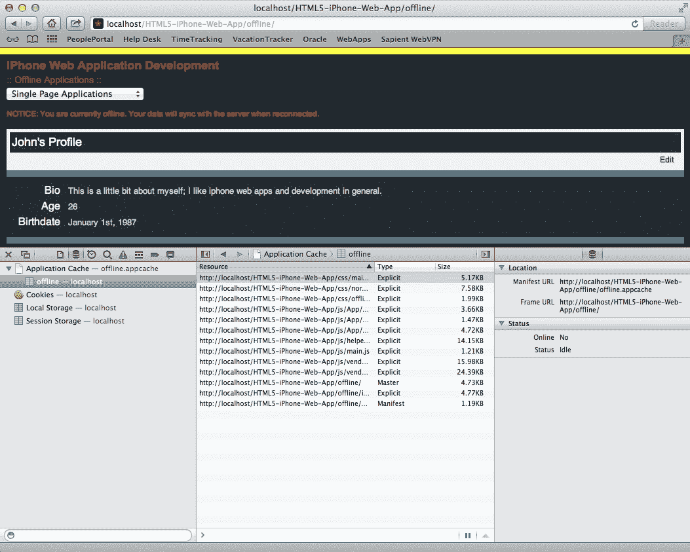
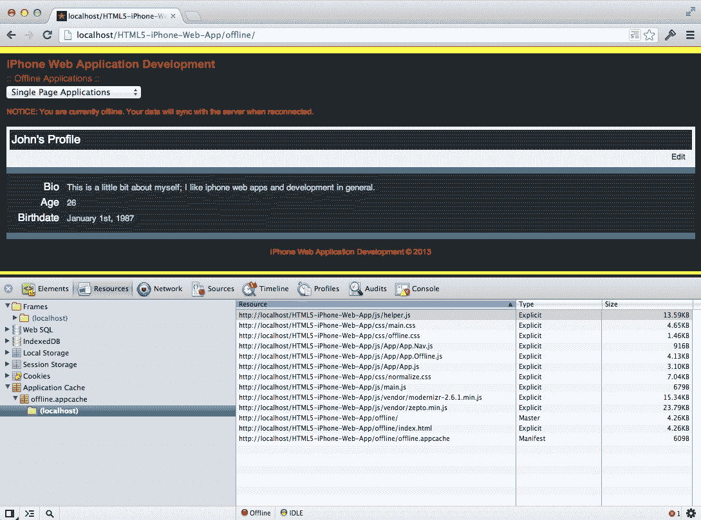

# 第八章。离线应用

在本章中，我们将介绍离线应用开发的基础知识。具体来说，我们将讨论应用清单，包括优点和缺点，并看看我们如何处理离线交互。然后我们就跳到`localStorage`和`IndexedDB`如何在客户端临时存储数据。这一章的内容将补充一些基本的例子，帮助你快速地起床和行动。因此，让我们从介绍应用清单如何对我们有益开始。

我们将在本章中讨论以下主题:

*   应用清单
*   处理离线交互
*   `localStorage`和`IndexedDB`原料药

# 应用缓存

**应用缓存**，或者称为**应用缓存** ，允许您定义离线使用期间应该缓存和可用的资源。这基本上使您的 web 应用在用户脱机时可用，因此失去网络连接甚至刷新页面都不会影响您的用户的连接，他们仍然能够与您的应用交互。让我们先来看看应用缓存清单是什么样子的。

## 清单文件

我们的应用清单文件包含文件将缓存哪些资源的信息。它明确地通知浏览器您希望脱机使用的资源，使其可以脱机使用，但也通过缓存加快了页面加载。下面的代码展示了本章所附示例的缓存清单的基本示例:

```html
 CACHE MANIFEST

index.html

# stylesheets
../css/normalize.css
../css/main.css
../css/offline.css

# javascripts
../js/vendor/modernizr-2.6.1.min.js
../js/vendor/zepto.min.js
../js/helper.js
../js/App/App.js
../js/App/App.Nav.js
../js/App/App.Offline.js
../js/main.js
```

在前面的例子中，发生了一些事情。首先，我们使用全大写单词`CACHE MANIFEST`来标识缓存清单。浏览器要求并读取这一行，以使其完全成为缓存清单。下一行定义了我们想要缓存的文件，`index.html`。现在，有一些事情我们需要记住；这个清单文件是相对于我们所在的地方。这意味着我们的文件位于目录中`index.html`的位置(例如`offline.appcache`位于`localhost/`，就像`index.html`)。

继续，我们发现我们可以通过在前面加上井号(`#stylesheets`)在清单文件中包含注释。这有助于我们跟踪这个文件中发生了什么。从这里开始，我们定义了样式表和脚本，我们希望相对于正在查看的页面来定义它们。此时，我们正在查看一个真实的清单文件，并将其分解以了解它。随着本章的深入，我们将回到这个文件，看看它如何影响本章中构建的示例。

## 清单实现

为了有效地使用我们的缓存清单，我们需要能够将其与当前页面相关联。但是要做到这一点，我们还需要设置我们的服务器，通过发送正确的 MIME 类型来正确处理清单。每种类型的服务器对此的处理方式都有所不同，指令可能看起来不同，但它们都获得了相同的结果——发送与该文件相关联的正确类型的头。

在 Apache 中，我们的配置如下所示:

```html
AddType text/cache-manifest .appcache
```

如您所见，我们已经定义了所有类型为`.appcache`的文件，这些文件的内容类型为`text` / `cache-manifest`。这允许浏览器正确解释文件，因此浏览器将其关联为`cache-manifest`。虽然这很棒，但我们还没有完成。最后，我们需要我们的页面来定义这个文件，以便它被正确地关联。

为了使我们的缓存清单与我们的页面相关，我们需要在我们的 HTML 标签上设置`manifest`属性，如下所示:

```html
<html manifest=”offline.appcache”>
```

我们现在已经完成了定义我们的应用缓存清单，并将其与相关页面一起交付，但是我们只是简单地介绍了这项技术。为了充分理解它的力量，我们需要看到它的使用。因此，我们将继续创建一个简单的示例，让我们使用到目前为止所学的知识。

## 一个简单的例子

我们这一章的例子将基于前一章。出于这个原因，我们将不详细讨论用于创建该示例的结构、样式或脚本。但是，它将被简化为一个基本的概要视图，允许您理解离线应用，而不需要从前面的章节中获得任何额外的知识。首先，让我们看看我们的标记。

### 标记

一如既往，本书附带的源代码包含了开始本章目标所需的一切。因此，让我们看看这个示例的主要部分，并从标记开始检查这个示例将如何运行。如果您打开位于`offline`目录中的索引文件，您会注意到我们的内容应该如下所示:

```html
<div class=”site-wrapper”>
    <section class=”view-profile”>
        <header>
            <h1>John’s Profile</h1>
            <a href=”#edit”>Edit</a>
        </header>
        <dl>
            <dt>Bio</dt>
            <dd>This is a little bit about myself; I like iphone web apps and development in general.</dd>
            <dt>Age</dt>
            <dd>26</dd>
            <dt>Birthdate</dt>
            <dd>January 1st, 1987</dd>
        </dl>
        <form>
            <div class=”field”>
                <label for=”bio”>Bio</label>
                <textarea id=”bio”>
                    This is a little bit about me; I like iphone web apps and development in general.
                </textarea>
            </div>
            <div class=”field”>
                <label for=”age”>Age</label>
                <input id=”age” type=”number” value=”26”>
            </div>
            <div class=”field”>
                <label>Birthdate</label>
                <input type=”date” value=”1987-01-01”>
            </div>
        </form>
    </section>
</div>
```

与任何网络应用一样，尤其是本书中编写的应用，这只是整个应用架构的摘录，它将包含页眉、页脚、样式表和脚本。但是，前面的标记描述了一个显示用户信息的配置文件视图，包括简短的简历、年龄和出生日期。除了这些信息，还有一个允许您更新这些信息的表单。

这种应用的经验如下。首先，当用户加载页面时，他们应该看到与他们相关的所有信息。其次，他们可以选择使用带有文本**编辑**的超链接来编辑该信息。单击超链接时，将出现一个允许用户编辑其信息的表单。相应地，**编辑**超链接将更新至**查看个人资料**。最后，当用户点击**查看个人资料**时，表单将隐藏，用户信息的显示将重新出现。

### JavaScript

这并不像听起来那么复杂。事实上，用于创建页面功能的脚本依赖于以下脚本:

```html
var $viewProfile = $(‘.view-profile’),
    $form = $viewProfile.find(‘form’),
    $dl = $viewProfile.find(‘dl’),
    $p = $(‘<p />’);

function onEditClick(e) {
    e.preventDefault();
    e.stopImmediatePropagation();

    $form.show();
    $dl.hide();
    $(this).text(‘View Profile’).attr(‘href’, ‘#view’);
}

function onViewClick(e) {
    e.preventDefault();
    e.stopImmediatePropagation();

    $form.hide();
    $dl.show();
    $(this).text(‘Edit’).attr(‘href’, ‘#edit’);
}

$viewProfile.
    on(‘click’, ‘a[href=”#edit”]’, onEditClick).
    on(‘click’, ‘a[href=”#view”]’, onViewClick);
```

让我们看看在前面的代码中发生了什么，以确保没有人丢失。首先，我们缓存适合我们页面的元素。通过这种方式，我们通过不在每次需要查找时遍历 DOM 来优化性能。然后，我们定义我们的`onEditClick`和`onViewClick`事件处理程序，它们显示或隐藏适当的内容块，然后更新与之相关的锚标签的`text`和`href`属性。最后，我们将锚标签上的`click`事件附加到缓存的`$viewProfile`元素。

### 注

请注意，前面的 JavaScript 是这本书本章附带源代码的摘录。为了简单起见，我们删除了闭包和`Offline`类，以便更好地解释这里构建的应用的实质。当然，欢迎您要么照原样使用前面的代码，要么继续使用本书的源代码。无论您选择哪种方式，期望的结果都是基于当前状态显示或隐藏内容的应用。

当执行前面的代码并加载页面时，应用的状态如下:


初始应用状态和应用编辑状态

既然我们已经有了与应用交互时应用应该是什么样子的坚实基础，我们希望确保它得到缓存。通过实现我们的应用开始时给出的技术，我们应该有一个现在离线运行的应用。

请记住，我们需要将应用缓存清单放在与这里构建的示例应用相同的目录中。因此，我们的应用清单需要和我们的`index.html`文件一起存在于离线目录中。如果您查看本章的源代码，您应该会看到清单和源文件的结构和布局的工作示例。在配置正确的服务器上运行此应用将使我们的页面脱机。但问题是，我们如何调试这样的东西？这就是下一部分要解决的问题。

# 调试缓存清单

调试我们的离线应用极其重要，毕竟，如果我们的应用依赖于网络连接，那么我们为用户提供成功的替代体验至关重要。但是，调试脱机应用并不容易。这有几个原因，但主要是基于应用缓存接口的实现。

> 当 Safari 重新访问您的网站时，该网站会从缓存中加载。如果缓存清单发生了变化，Safari 会检查声明缓存的 HTML 文件，以及清单中列出的每个资源，以查看其中是否有任何资源发生了变化。
> 
> 如果文件与以前的版本逐字节相同，则认为该文件没有变化；更改文件的修改日期不会触发更新。您必须更改文件的内容。(更改注释就足够了。)

这可以在苹果文档中找到:https://developer . Apple . com/library/safari/# documentation/iPhone/conceptive/safarijsdatabasguide/offline applicationcache/offline applicationcache . html #//Apple _ ref/doc/uid/TP 40007256-CH7-SW5

## 在浏览器中调试

基于前面的文档，我们可以通过用更新的资源清除缓存来改进调试过程。这可能就像更新代码中的注释一样简单，但是为了确保缓存正确的资产，我们可以使用现代浏览器并使用调试器工具来检查缓存的资产。查看以下截图，了解如何测试您的资产是否被缓存:



Safari 开发者工具–资源

上一张截图中显示的 Safari 中的开发人员工具通过提供**资源**选项卡帮助我们调试应用缓存，该选项卡允许我们分析多个域的应用缓存。在这个例子中，我们可以看到与我们的示例应用的域相关的资源。当我们查看应用缓存时，我们可以看到右侧与缓存相关联的文件列表。另外，我们可以看到文件的位置和用户的状态；在这种情况下，我们处于在线和空闲状态。



Chrome 开发者工具-资源

Chrome 开发工具同样有助于显示与应用缓存相关的信息。虽然用户界面有点不同，但是它包含了查看与您的应用缓存相关联的资产所需的所有相同组件。此视图还包括您的应用的在线状态；在这个例子中，我们没有在线和空闲。

## 使用 JavaScript 进行调试

应用缓存也可以使用 JavaScript 进行调试，幸运的是，应用缓存清单的实现非常容易交互。我们可以听多个事件，包括`progress`、`error`、`updateready`。当我们听这些事件时，我们可以选择实现一个补充体验，但是对于我们这里的用例，我们将只是注销事件。

```html
window.applicationCache.addEventListener(‘cached’, handleCacheEvent, false);
window.applicationCache.addEventListener(‘checking’, handleCacheEvent, false);
window.applicationCache.addEventListener(‘downloading’, handleCacheEvent, false);
window.applicationCache.addEventListener(‘error’, handleCacheError, false);
window.applicationCache.addEventListener(‘noupdate’, handleCacheEvent, false);
window.applicationCache.addEventListener(‘obsolete’, handleCacheEvent, false);
window.applicationCache.addEventListener(‘progress’, handleCacheEvent, false);
window.applicationCache.addEventListener(‘updateready’, handleCacheEvent, false);

function handleCacheEvent(e) {
  console.log(e);
}

function handleCacheError(e) {
  console.log(e);

}
```

在前面的脚本中，我们监听规范定义的事件([http://www . whatwg . org/specs/web-apps/current-work/# appcacheevents](http://www.whatwg.org/specs/web-apps/current-work/#appcacheevents))并调用`handleCacheEvent`或`handleCacheError`方法。在每一种方法中，我们只是记录事件本身；然而，如果我们愿意，我们可以创造一种替代的体验。

在应用缓存过程的实现过程中，还可以使用许多操作方法。例如，我们可以使用`update`方法手动更新缓存。

```html
window.applicationCache.update();
```

虽然前面的方法可能对我们有帮助，但是请记住，只有当内容本身发生变化时，缓存才会更新。现实中`update`方法触发下载过程([http://www . whatwg . org/specs/web-apps/current-work/# application-cache-download-process](http://www.whatwg.org/specs/web-apps/current-work/#application-cache-download-process))，并不告诉浏览器获取最新的缓存。`swapCache`方法是另一个动作调用，可以通过将缓存切换到最新版本来调试我们的应用。

```html
window.applicationCache.swapCache();
```

请记住，如果我们进行此调用，资产不会自动更新。我们获取更新资产的方式是页面刷新。根据规范，更简单的方法是做`location.reload()`([http://www . whatwg . org/specs/web-apps/current-work/# DOM-appcache-swapcache](http://www.whatwg.org/specs/web-apps/current-work/#dom-appcache-swapcache))。

在这一点上，我们对应用缓存清单有了一个很好的想法，包括它如何工作，实现的细节，以及最终如何调试它。现在我们需要知道如何使用前面的方法和更多方法来处理离线交互。当我们很好地理解这两个方面时，我们将能够创建利用这种技术的简单的离线应用。

# 处理离线申请

在这一点上，我们已经学会了如何使用应用清单界面在客户端缓存我们的文件，不仅可以加快我们的网站速度，还可以在用户离线时提供给他们。然而，这种技术没有考虑到你应该做什么来处理用户的交互。在这种情况下，我们需要确保我们的应用有可用的部分，当它们失去连接时，可以使应用无缝。

## 一个简单的用例

在我们继续之前，让我们定义一个简单的用例，说明为什么处理离线应用对用户和我们都有用。假设我们有一个名叫约翰的用户，约翰正在上下班途中，目前正在他的 iPhone 上的一个网络应用中更新他的个人资料。通勤涉及一些不稳定的网络连接，有时他确实会失去连接。他希望能够在上班途中继续使用该应用，而不是在工作中等待。

考虑到我们今天生活的世界，以及不稳定的交互会给公司和客户带来怎样的损失，我们肯定想优雅地处理这个问题。这并不意味着我们会在用户离线时为他们提供所有服务，这是不合理的。这意味着我们需要通知用户他们已经离线，并且由于这个原因某些功能目前被禁用。

## 检测网络连通性

现在，你可能会问，“如何检测网络连接？”其实很简单。让我们看看下面的代码:

```html
var $p = $(‘<p />’);
if(!navigator.onLine) {
  $p.
    text(‘NOTICE: You are currently offline. Your data will sync with the server when reconnected.’);

  $(‘.view-profile’).
    before($p);
}
```

让我们简单回顾一下前面的代码。这段代码的第一部分在内存中创建一个缓存的元素，并将其存储在`$p`变量中。下一行是最重要的，通过检查`navigator`对象的`onLine`属性来检测在线连接。如果此人不在线，我们最终会设置缓存元素的文本，并将其附加到我们之前的代码中。

如果我们的应用处于离线状态，它将如下所示:


检测网络连接

当然，这是你在现实应用中处理网络连接的精简版本，但它展示了你可以获取网络状态并确定离线体验。这对我们来说很棒，因为它开辟了一个我们还未能探索的网络发展新世界。但当然，这也需要对如何处理这类经历进行一些复杂的预先考虑。

回到我们定义的用例，用户想要更新他/她的配置文件信息，显然，如果没有必要的资源，这将是极其困难的。幸运的是，有两种新技术可以用来完成类似于这个用例的简单任务。所以，让我们简单回顾一下这两种技术。

## 本地存储应用编程接口

虽然离线状态是新 HTML5 规范的一个特征，但它与 HTML5 的另一个特征齐头并进，即存储([http://dev.w3.org/html5/webstorage/](http://dev.w3.org/html5/webstorage/))。存储是许多开发人员以前认为的与后端系统的一对一关系。这不再正确，因为我们现在能够使用`localStorage`应用编程接口在客户端设备上保存数据。

让我们用`localStorage`来覆盖一个简单的例子，看看它是如何工作的:

```html
localStorage.setItem(‘name’, ‘John Smith’);
```

我们刚刚在这里编写的代码有多个部分。首先，有一个名为`localStorage`的全局对象。这个对象有开发者可以交互的方法，包括`setItem`方法。最后，`setItem`方法取两个参数，都是字符串。

要检索我们刚刚设置的项目的值，我们可以这样做:

```html
localStorage.getItem(‘name’);
```

很酷吧？唯一的缺点是，当前的实现将 API 描述为只接受每个键/值对的字符串，类似于一个 JavaScript 对象。但是，我们可以通过执行以下操作来超越这一限制:

```html
localStorage.setItem(‘name’, JSON.stringify({ ‘first’: ‘John’, ‘last’: ‘Smith’ }));
```

这里的不同之处在于，我们还在访问内置的`JSON`对象，该对象将该对象转换为字符串，以便`localStorage` API 可以高效地将其存储为普通字符串。否则，您将存储`[object Object]`，这只是对象的类型。

要访问这些信息，我们将执行以下操作:

```html
JSON.parse(localStorage.getItem(‘name’));
```

当您在控制台中运行这段代码时，您应该会看到一个对象。`JSON`功能所做的是将“字符串化”的对象变成一个传统的 JavaScript 对象。这使得访问我们存储的数据变得简单而高效。

正如您可以开始收集的那样，我们有能力在客户端存储过去无法存储的信息，允许我们暂时允许用户在应用离线时与网站的某些方面进行交互。结合 HTML5 的存储和离线功能，我们可以为应用带来更深入的交互，同时满足客户端和用户的期望。

但是`localStorage`的限制是可以存储的信息量。因为这个原因，另一种技术存在，叫做`IndexedDB`。尽管它的支持并不一致，并且该技术在各种浏览器上仍处于实验阶段，但它值得一看。不幸的是，由于缺乏 iOS Safari 的支持，我们不会在本书中介绍这项技术，但它仍然值得一些评论([https://developer.mozilla.org/en-US/docs/IndexedDB](https://developer.mozilla.org/en-US/docs/IndexedDB))。

# 总结

在本章中，我们介绍了应用缓存的基础知识，包括一个实现示例。我们的评论指出了使用这项新技术的好处，但也讨论了它的缺点，比如不一致的支持，主要是旧浏览器，以及我们在测试它时面临的问题。我们学习了如何处理离线交互，以及`localStorage`和`IndexedDB`如何允许我们将信息临时存储在客户端作为解决方案。在下一章中，我们将讨论性能优化，并看看这在本书开发的应用中表现如何。