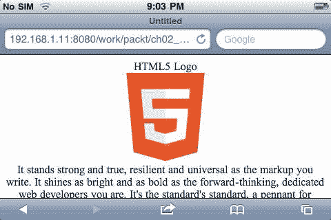
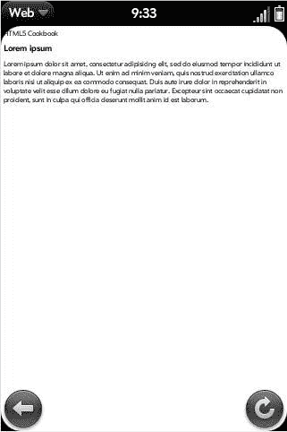
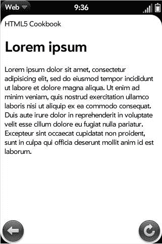
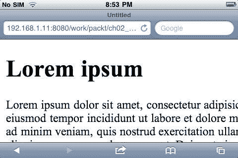
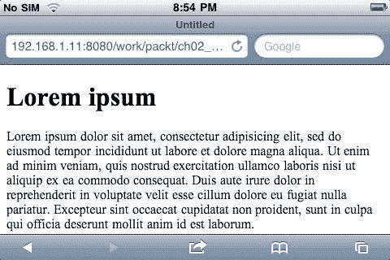
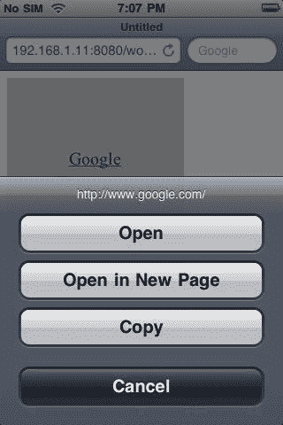
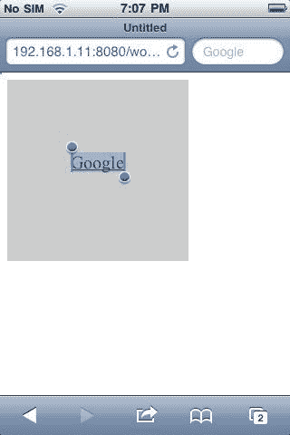

# 第二章。移动设置和优化

在本章中，我们将介绍:

*   添加主屏幕按钮图标
*   防止调整文本大小
*   优化视口宽度
*   修复移动 Safari 屏幕比例
*   从浏览器启动电话专用程序
*   在全屏模式下启用 iPhone 启动屏幕
*   防止 iOS 聚焦缩放
*   禁用或限制网络工具包功能

# 简介

虽然有许多操作系统和设备制造商，但不可避免地会出现跨浏览器问题，这让我们非常头疼。但另一方面，我们开发人员热爱挑战，并着手解决它们！

在本章中，我们将首先关注您可能想要考虑的跨浏览器/浏览器特定的设置和优化。然后，我们将继续研究一些您可能希望在移动开发开始时添加的通用/特定于浏览器的特性。

# 添加主屏幕按钮图标

目标设备:iOS、安卓、塞班

在现代智能手机上，屏幕大多是基于触摸的。iPhone 让你设备上的一切都变成了“应用”，彻底改变了我们对移动的看法；甚至短信和电话拨号的行为也像主屏幕上有图标的应用。对于一个 HTML 网页应用来说，情况有点不同；用户必须先进入浏览器应用，输入地址，然后启动你的网站。从用户的角度来看，这可能太麻烦了，因此在某些智能手机上，用户可以将主屏幕图标添加到特定的网络应用中，这样他们就可以直接从主屏幕上的图标启动该特定的网络应用网站。

听起来很酷，对吧？是的，确实如此，但也有与之相关的问题。并非所有浏览器在触摸图标时的行为都是一样的。在这个食谱中，我们将研究每个浏览器的行为，以及如何让尽可能多的移动浏览器可以使用主屏幕图标。

## 做好准备

首先，您必须从章节代码文件夹下载图标集。如果打开文件夹，应该可以看到如下内容:

```html
apple-touch-icon.png
apple-touch-icon-57x57-precomposed.png
apple-touch-icon-72x72-precomposed.png
apple-touch-icon-114x114-precomposed.png
apple-touch-icon-precomposed.png

```

这些图像将用于不同的设备。

创建一个 HTML 文档并命名为 `ch02r01.html`。

## 怎么做...

在您的 HTML 文档中，使用以下代码:

```html
<!doctype html>
<html>
<head>
<title>Mobile Cookbook</title>
<meta charset="utf-8">
<meta name="viewport" content="width=device-width, initial-scale=1.0">
<link rel="apple-touch-icon-precomposed" sizes="114x114" href="icons/apple-touch-icon-114x114-precomposed.png">
<link rel="apple-touch-icon-precomposed" sizes="72x72" href="icons/apple-touch-icon-72x72-precomposed.png">
<link rel="apple-touch-icon-precomposed" href="icons/apple-touch-icon-precomposed.png">
<link rel="shortcut icon" href="icons/apple-touch-icon.png">
</head>
<body>
</body>
</html>

```

## 它是如何工作的...

现在让我们分解代码:

从 iOS 4.2.1 开始，可以使用 `sizes`属性为不同的设备分辨率指定多个图标。

```html
<link rel="apple-touch-icon-precomposed" sizes="114x114" href="apple-touch-icon-114x114-precomposed.png">

```

对于 iPhone 4 上的高分辨率视网膜显示器，使用 114 x 114 图标。

```html
<link rel="apple-touch-icon-precomposed" sizes="72x72" href="apple-touch-icon-72x72-precomposed.png">

```

对于 iPad，可以使用 72 x 72 的图标。对于非视网膜 iPhone、Android 2.1+设备，使用 57 x 57 低分辨率图标。

```html
<link rel="apple-touch-icon-precomposed" href="apple-touch-icon-precomposed.png">

```

对于诺基亚塞班 60 设备，在链接关系中使用 `shortcut icon`来告诉设备快捷图标。

```html
<link rel="shortcut icon" href="img/l/apple-touch-icon.png">

```

以下是书签在安卓系统上的外观:


## 还有更多...

看了前面的例子，你心里一定有几个问题:

*   Isn't it possible to define more than one value in the `rel` attribute? So can we combine the last two lines into something as follows?

    ```html
    <link rel="shortcut icon apple-touch-icon-precomposed" href="apple-touch-icon-precomposed.png">

    ```

    它经过测试，但不知何故，移动浏览器无法识别其价值。

    你可能见过人们使用:

    ```html
    <link rel="apple-touch-icon-precomposed" media="screen and (min-resolution: 150dpi)" href="apple-touch-icon-114x114-precomposed.png">

    ```

与保罗·爱尔兰和*迪维娅·马年*一起，我们一直致力于移动样板([http://www.h5bp.com/mobile](http://www.h5bp.com/mobile))的开发，为前端移动开发提供了坚如磐石的默认。在移动样板中，我们已经涵盖了所有当前场景和未来可能的场景:

[https://github . com/h5bp/mobile-boile plate/blob/master/index . html # L21](http://github.com/h5bp/mobile-boilerplate/blob/master/index.html#L21)

### 你一直想知道的关于触摸图标的一切

关于这个主题的大部分观点都来自于马蒂亚斯·比嫩斯。他的原创文章*关于触摸图标*你一直想知道的一切都可以在:[http://mathiasbynens.be/notes/touch-icons](http://mathiasbynens.be/notes/touch-icons)找到。

### 关于苹果触控图标的官方文档

有一个官方文档列表，您可以在其中找到关于每个特定设备和浏览器的触摸图标的更多信息:

*   苹果触摸图标:

    ```html
    http://developer.apple.com/library/safari/#documentation/AppleApplications/Reference/SafariWebContent/ConfiguringWebApplications/ConfiguringWebApplications.html

    ```

*   WHATWG 官方信息:

    ```html
    http://www.whatwg.org/specs/web-apps/current-work/multipage/links.html#rel-icon

    ```

#### 苹果自定义图标和图像创建指南

关于如何创建触摸图标的指南和文章可以在以下文章中找到:

*   苹果— *自定义图标和图像创建指南:*

    ```html
    http://developer.apple.com/library/ios/#documentation/userexperience/conceptual/mobilehig/Iconsimg/IconsImages.html#//apple_ref/doc/uid/TP40006556-CH14-SW11

    ```

#### 另见

*启用 iPhone 全屏模式启动屏幕*—在本食谱中，我们将看到如何从主屏幕触摸图标启动时添加全屏模式的启动屏幕。

# 防止调整文本大小

目标设备:iOS、Windows Mobile

在某些移动设备上，如 iPhone 和 Windows Mobile，当您将设备从纵向模式旋转到横向模式时，浏览器文本可能会调整大小。这对 web 开发人员来说可能是个问题，因为我们想要完全控制网站的设计和呈现。

## 做好准备

新建一个 HTML 文件，命名为 `ch02r02.html`。输入以下代码:

```html
<!doctype html>
<html>
<head>
<meta charset="utf-8">
<meta name="viewport" content="width=device-width, initial-scale=1.0, maximum-scale=1.0, minimum-scale=1.0">
<style>
figure, figcaption, header {
display:block;
margin:0 auto;
text-align:center;
}
</style>
</head>
<body>
<header>
HTML5 Logo
</header>
<figure>

<figcaption>
It stands strong and true, resilient and universal as the markup you write.
It shines as bright and as bold as the forward-thinking, dedicated web developers you are.
It's the standard's standard, a pennant for progress.
And it certainly doesn't use tables for layout.
</figcaption>
</figure>
</body>
</html>

```

现在在 iPhone 中以人像模式渲染此页面，可以看到，正常渲染如下:


现在如果你在横向模式下渲染它，字体大小会突然增加。正如我们所看到的，当页面被更改为横向模式时，文本将被调整大小。这不是想要的行为。下图显示了它的外观:


## 怎么做...

您可以按照以下步骤修复问题:

1.  您可以在 CSS 中添加以下几行，然后再次以横向渲染页面:

    ```html
    html {
    -webkit-text-size-adjust: none;
    }

    ```

2.  As You can see, the text now appears normal:

    

## 它是如何工作的...

要解决这个问题，你必须在 WebKit 中添加一个名为 `text-size-adjust`的 CSS 属性，并将该值赋给 `none`以防止自动调整。

将 `text-size-adjust`设置为“无”可以解决移动特定网站的问题，但是如果我们在桌面屏幕或其他非移动浏览器上渲染，桌面浏览器的文本缩放功能将被禁用。为了防止这种可访问性问题，我们可以将 `text-size-adjust`设置为 `100%`而不是 `none`。

所以我们可以调整这个例子:

```html
html {
-webkit-text-size-adjust: 100%;
}

```

## 还有更多...

除了 iPhone，其他设备也有办法添加文本大小调整属性。

### Windows Mobile

Windows Mobile IE 使用了不同的前缀。他们最初添加了 WebKit 前缀。其目的是增加对特定于 WebKit 的属性的支持，使网络开发人员的生活更加轻松，因为他们不必在页面上添加另一个带有供应商前缀的 CSS 属性来控制文本的缩放方式。更具体地说，他们凭直觉知道，这个属性最常见的用法是将其显式设置为 `none`，以便告诉浏览器不要缩放文本的特定部分。

在听取了社区对这个问题的反馈后(当他们意识到实现其他浏览器供应商的 CSS 属性的更广泛的含义时，有几个面子工厂)，他们决定最好只实现 `-ms-`前缀版本，而不是 `-webkit-`版本。

为了使前面的例子更加完整，您可以添加:

```html
html {
-webkit-text-size-adjust: 100%;
-ms-text-size-adjust: 100%;
}

```

### 让它成为未来的证明

为了更好地证明未来的事情，您可以添加一个没有任何前缀的行，如下所示:

```html
html {
-webkit-text-size-adjust: 100%;
-ms-text-size-adjust: 100%;
text-size-adjust: 100%;
}

```

### px em，哪个更好？

关于使用 px 还是 em 的普遍争论在手机上并不是什么问题。原来是雅虎！用户界面使用 ems 的原因是 IE6 不支持像素页面缩放。在 mobile 上，并没有这样的问题，即使我们希望页面在桌面浏览器上呈现良好，有人使用 IE6 的可能性也越来越低，所以在大多数情况下，您可以省去使用 ems 和所有计算的麻烦，而是选择使用像素。

# 优化视口宽度

目标设备:跨浏览器

不同的移动设备具有不同的默认移动视口宽度。有关所有移动设备默认视口宽度的完整列表，请参考附录十。如果不设置它，在大多数情况下，它会导致意想不到的结果。例如，在 iPhone 中，如果视口宽度保持不变，它将被渲染为 980 像素。

## 做好准备

让我们创建一个 HTML 文档并命名为 `ch02r03.html`。

## 怎么做...

以下是我们可以优化视口宽度的方法:

1.  Add the following code to `ch02r03.html` and render it in your mobile browser:

    ```html
    <!doctype html>
    <html>
    <head>
    <meta charset="utf-8">
    </head>
    <body>
    <header>
    HTML5 Logo
    </header>
    <div id="main">
    <h1>Lorem ipsum</h1>
    Lorem ipsum dolor sit amet, consectetur adipisicing elit, sed do eiusmod tempor incididunt ut labore et dolore magna aliqua. Ut enim ad minim veniam, quis nostrud exercitation ullamco laboris nisi ut aliquip ex ea commodo consequat. Duis aute irure dolor in reprehenderit in voluptate velit esse cillum dolore eu fugiat nulla pariatur. Excepteur sint occaecat cupidatat non proident, sunt in culpa qui officia deserunt mollit anim id est laborum.
    </div>
    </body>
    </html>

    ```

    以下是默认情况下的渲染方式:

    

2.  If we render this example, we can see that everything becomes extremely small. Now, let's set the viewport width to the device width:

    ```html
    <!doctype html>
    <html>
    <head>
    <meta charset="utf-8">
    <meta name="viewport" content="width=device-width">
    </head>
    <body>
    <header>
    HTML5 Logo
    </header>
    <div id="main">
    <h1>Lorem ipsum</h1>
    <p>Lorem ipsum dolor sit amet, consectetur adipisicing elit, sed do eiusmod tempor incididunt ut labore et dolore magna aliqua. Ut enim ad minim veniam, quis nostrud exercitation ullamco laboris nisi ut aliquip ex ea commodo consequat. Duis aute irure dolor in reprehenderit in voluptate velit esse cillum dolore eu fugiat nulla pariatur. Excepteur sint occaecat cupidatat non proident, sunt in culpa qui officia deserunt mollit anim id est laborum.</p>
    </div>
    viewport widthviewport widthoptimizing</body>
    </html>

    ```

    现在，内容宽度使用屏幕宽度，文本变得可读:

    

## 它是如何工作的...

当我们将视口宽度设置为设备宽度时，它会告诉浏览器不要缩放页面来固定设备区域。所以对于 iPhone 来说， `device-width`在人像模式下是 320 px，在风景模式下是 480 px。

## 还有更多...

对于一些非常古老的遗迹移动浏览器来说， `meta`属性是无法识别的。要处理这些浏览器，您需要使用:

```html
<meta name="HandheldFriendly" content="true">

```

这是由旧版本的掌上操作系统、AvantGo 和黑莓使用的。

```html
<meta name="MobileOptimized" content="320">

```

对于微软 PocketPC，引入了一个 `MobileOptimized`属性。

所以最完整的代码应该是这样的:

```html
<meta name="HandheldFriendly" content="true">
<meta name="MobileOptimized" content="320">
<meta name="viewport" content="width=device-width">

```

### IE for Windows Phone 视口博文

在 Windows Phone Team Weblog 的 IE 上，有一篇关于*Windows Phone 7*上 IE 移动视口的文章。在这篇文章中，作者解释了一些重要的信息，比如 Windows Phone 7 如何实现“设备宽度”，以及许多其他非常有用的信息。你可以在这里阅读文章:[http://blogs . msdn . com/b/iemobile/archive/2010/11/22/the-ie-mobile-viewport-on-windows-phone-7 . aspx](http://blogs.msdn.com/b/iemobile/archive/2010/11/22/the-ie-mobile-viewport-on-windows-phone-7.aspx)。

### Safari 文档

Safari 在开发者库中有一个引用，网址为:[http://developer . apple . com/library/safari/# documentation/apple applications/reference/safarihtml ref/Articles/meta tags . html](http://developer.apple.com/library/safari/#documentation/appleapplications/reference/SafariHTMLRef/Articles/MetaTags.html)。

### 黑莓文档

有一个黑莓浏览器内容设计指南文件。它解释了黑莓对视窗宽度的使用:[http://docs . Blackberry . com/en/developers/deliverables/4305/Blackberry _ Browser-4 . 6 . 0-us . pdf](http://docs.blackberry.com/en/developers/deliverables/4305/BlackBerry_Browser-4.6.0-US.pdf)。

# 固定移动 Safari 屏幕回流比例

目标设备:iOS

Mobile Safari 有一个烦人的屏幕重流 bug:当你将手机浏览器从纵向模式旋转到横向模式时，文本会突然跳到更大的尺寸。

在我致力于构建移动样板文件的时候，杰里米·基思和我就这个问题进行了长时间的讨论。

修复此问题的传统方法是向 `meta`视口添加以下缩放属性:

```html
<meta name="viewport" content="width=device-width, initial-scale=1.0, maximum-scale=1.0, minimum-scale=1.0">

```

这个解决方案首先被合并到移动样板中。 *Jeremy* 指出，这解决了缩放跳转问题，但同时也造成了另一个关于可访问性的问题:当你如上图设置数值时，就不能再通过缩放页面来放大了。对于视力有问题的人来说，变焦能力是必不可少的。但是如果我们让缩放发生，文本跳转会惹恼大多数用户。所以，在很长一段时间里，这是一场可访问性和可用性的争论。

我发现了一个可以解决这个问题的方法，接下来我们将讨论这个问题。

## 做好准备

首先，让我们创建一个 HTML 文档并将其命名为 `ch02r04.html`，在其中输入以下代码:

```html
<!doctype html>
<html>
<head>
<meta charset="utf-8">
<meta name="viewport" content="width=device-width, initial-scale=1.0">
</head>
<body>
<div>
<h1>Lorem ipsum</h1>
<p>Lorem ipsum dolor sit amet, consectetur adipisicing elit, sed do eiusmod tempor incididunt ut labore et dolore magna aliqua. Ut enim ad minim veniam, quis nostrud exercitation ullamco laboris nisi ut aliquip ex ea commodo consequat. Duis aute irure dolor in reprehenderit in voluptate velit esse cillum dolore eu fugiat nulla pariatur. Excepteur sint occaecat cupidatat non proident, sunt in culpa qui officia deserunt mollit anim id est laborum.</p>
</div>
</body>
</html>

```

此页面在人像模式下渲染得非常好:


但是当以横向模式显示时，情况会发生变化:



## 怎么做...

要解决这个问题，我们只需要在用户放大页面时，动态地将比例因子重置为默认值。现在将以下代码放入您的 HTML 文档中:

```html
<!doctype html>
<html>
<head>
<meta charset="utf-8">
<meta name="viewport" content="width=device-width, initial-scale=1.0">
</head>
<body>
<div>
<h1>Lorem ipsum</h1>
<p>Lorem ipsum dolor sit amet, consectetur adipisicing elit, sed do eiusmod tempor incididunt ut labore et dolore magna aliqua. Ut enim ad minim veniam, quis nostrud exercitation ullamco laboris nisi ut aliquip ex ea commodo consequat. Duis aute irure dolor in reprehenderit in voluptate velit esse cillum dolore eu fugiat nulla pariatur. Excepteur sint occaecat cupidatat non proident, sunt in culpa qui officia deserunt mollit anim id est laborum.</p>
</div>
<script>
var metas = document.getElementsByTagName('meta');
var i;
if (navigator.userAgent.match(/iPhone/i)) {
for (i=0; i<metas.length; i++) {
if (metas[i].name == "viewport") {
metas[i].content = "width=device-width, minimum-scale=1.0, maximum-scale=1.0";
}
}
document.addEventListener("gesturestart", gestureStart, false);
}
function gestureStart() {
for (i=0; i<metas.length; i++) {
if (metas[i].name == "viewport") {
metas[i].content = "width=device-width, minimum-scale=0.25, maximum-scale=1.6";
}
}
}
</script>
</body>
</html>

```

现在如果我们把屏幕从纵向旋转到横向，这个问题应该就不存在了，如果我们把页面放大，它会做出预期的反应:



## 它是如何工作的...

让我们浏览一下代码，看看它是如何工作的。

1.  我们需要知道默认的最小刻度和最大刻度值。在 iPhone 的官方文档中，说明最小刻度值为 0.25，最大刻度值为 1.6。所以要替换默认值，我们需要设置:

    ```html
    function gestureStart() {
    var metas = document.getElementsByTagName('meta');
    var i;
    for (i=0; i if (metas[i].name == "viewport") {
    metas[i].content = "width=device-width, minimum- scale=0.25, maximum-scale=1.6";
    }
    }

    ```

2.  接下来，我们需要知道什么时候设置这个。这很简单:iPhone 有一个手势事件监听器，我们可以用它来定位文档主体。下面是如何做到的:

    ```html
    document.addEventListener("gesturestart", gestureStart, false);

    ```

3.  最后，我们需要确保这种情况只发生在 iPhone 上。这也可以很容易地使用:

    ```html
    if (navigator.userAgent.match(/iPhone/i)) {
    document.addEventListener("gesturestart", gestureStart, false);
    }

    ```

    来完成

### 还有更多...

如果你有兴趣了解杰里米和我之间的整个故事和讨论，你可以在[http://www . blog . highub . com/mobile-2/a-fix-for-iphone-viewport-scale-bug/](http://www.blog.highub.com/mobile-2/a-fix-for-iphone-viewport-scale-bug/)上阅读。

尽管这为问题提供了解决方案，但仍有一些人遇到了一些问题:

*   一旦用户在文档上做了一个手势，缩放就被再次启用。因此，如果在此之后更改设备方向，缩放错误仍然会发生。
*   据 iOS4 报道，用户只有在启动第二个手势后，才能有效地开始缩放。

#### 稍有改进的版本

*Mathias Bynens* 有一个更聪明的编码修订版。你可以在看到代码

[https://gist.github.com/901295](http://gist.github.com/901295)。

#### 更好的版本

约翰-大卫·道尔顿在有一个更好的更新版本，代码更聪明更精简

[https://gist.github.com/903131](http://gist.github.com/903131)。

#### jQuery Mobile 的一个词

*来自 jQuery Mobile 的 Scott Jehl* 提到未来可能会在 jQuery Mobile 实现。目前，你可以在[https://gist.github.com/1183357](http://gist.github.com/1183357)看到他的主旨。

# 从浏览器启动电话专用程序

目标设备:跨浏览器

用户可以从移动浏览器中启动特定于手机的程序，例如地图、通话，而短信可以从某些移动设备中启动。程序是否可以启动取决于特定设备上本机应用的可用性。

## 做好准备

创建一个 HTML 文档并命名为 `ch02r05.html.`

## 怎么做...

以下是我们如何启动特定于手机的程序:

1.  让我们将以下代码添加到 HTML 文档中:

    ```html
    <!doctype html>
    <html>
    <head>
    <meta charset="utf-8">
    <meta name="viewport" content="width=device-width, initial-scale=1.0">
    </head>
    <body>
    <header>
    HTML5 Logo
    </header>
    <div>
    <h1>Lorem ipsum</h1>
    <a href="http://maps.google.com/maps?q=cupertino"> Directions</a>
    </div>
    </body>
    </html>

    ```

2.  Now run this code in Palm OS browser, press the address link. You will be prompted to launch the map application on your phone:

    

## 它是如何工作的...

与某些方案不同，地图网址不以“地图”方案标识符开始。相反，地图链接被指定为常规的 HTTP 链接，但目标是谷歌地图服务器。设备浏览器将能够判断这是否是一张地图，并使用解析的信息启动程序。

## 还有更多...

您可以做的不仅仅是启动一个应用。以下示例显示了您可以用来提供旧金山和库比蒂诺之间的行车方向的字符串:

```html
<a href="http://maps.google.com/maps?daddr=San+Francisco,+CA&saddr=cupertino">Directions</a>

```

那么，如果浏览器无法启动特定的程序呢？没关系！在这种情况下，它将作为正常链接打开:


### 移动 Safari URL 方案

所有与 Mobile Safari 相关的 URL 方案列表可在以下网址找到:[http://developer . apple . com/library/Safari/# featuredarticles/iphone URL scheme _ Reference/Introduction/Introduction . html](http://developer.apple.com/library/safari/#featuredarticles/iPhoneURLScheme_Reference/Introduction/Introduction.html)。

### 黑莓 URL 方案

所有黑莓相关 URL 方案的列表可在以下网址找到:[http://docs . Blackberry . com/en/developers/deliverables/18169/](http://docs.blackberry.com/en/developers/deliverables/18169/)。

### 索尼爱立信开发者指南

索尼爱立信开发者可以从开发者世界网站下载*网页浏览开发者指南*网址为:[http://Developer . sonyericsson . com/wportal/devworld/search-downloads？cat = % 5b 1.706817% 2C+1.716594% 2C+1.716688% 5D&cc = GB&LC = en](http://developer.sonyericsson.com/wportal/devworld/search-downloads?cat=%5B1.706817%2C+1.716594%2C+1.716688%5D&cc=gb&lc=en)。

# 在全屏模式下启用 iPhone 启动屏幕

目标设备:iOS

为了让网络应用感觉更像一个本地应用，苹果手机有很多独特的功能供开发者添加到网络应用中。您可以在全屏模式下添加开始屏幕，设置状态栏的样式，以及为应用定义预加载屏幕。

## 做好准备

下载提供的源代码中的图片，创建一个 HTML 文档，并命名为 `ch02r06.html`。

## 怎么做...

下面是我们如何在全屏模式下制作开始屏幕:

1.  输入以下 HTML 代码:

    ```html
    <!doctype html>
    <html>
    <head>
    <meta charset="utf-8">
    <meta name="viewport" content="width=device-width, initial-scale=1.0">
    <meta name="apple-mobile-web-app-capable" content="yes">
    <meta name="apple-mobile-web-app-status-bar-style" content="black">
    <link rel="apple-touch-startup-image" href="img/l/splash.png">
    </head>
    <body>
    <header>
    HTML5 Logo
    </header>
    <div>
    Lorem ipsum
    </div>
    </body>
    </html>

    ```

2.  如果您为页面添加书签，并从应用图标在浏览器中打开它，它将显示为全屏应用。

## 它是如何工作的...

我们来看看代码:

```html
<meta name="apple-mobile-web-app-capable" content="yes">

```

这使得网页在从主屏幕图标启动时以全屏模式运行，隐藏浏览器顶部和底部的地址栏和组件栏。

```html
<meta name="apple-mobile-web-app-status-bar-style" content="black">

```

这将样式化浏览器顶部的状态栏。

```html
<link rel="apple-touch-startup-image" href="img/l/splash.png">

```

您也可以在应用启动时添加闪屏，这是页面仍在加载时显示的预加载屏幕。

## 还有更多...

iPad 和 iPhone 的闪屏大小不同，所以如果我们想让网站动态改变闪屏，这取决于用来渲染的浏览器。我们可以使用下面的 JavaScript 函数来实现这一点:

```html
var filename = navigator.platform === 'iPad' ? 'h/' : 'l/'; document.write('<link rel="apple-touch-startup-image" hrefimg/' + filename + 'splash.png" />' );

```

### iOS 4.3 的全屏问题

iOS 4.3 引入了一项新功能，他们称之为 JavaScript 硝基引擎。这段新代码允许默认的 Safari 浏览器以两倍的速度加载页面。然而，全屏 web 应用似乎不支持该功能。虽然有些人质疑苹果为什么没有将新的 Safari 功能纳入其网络应用，但其他人也指出了这可能只是一个 bug 的证据。

### 关于网络应用的 Safari 文档

有关官方文档，您可以访问 Safari 上的网站:

[http://developer . apple . com/library/safari/# documentation/apple applications/Reference/SafariWebContent/ConfiguringWebApplications/ConfiguringWebApplications . html](http://developer.apple.com/library/safari/#documentation/appleapplications/Reference/SafariWebContent/ConfiguringWebApplications/ConfiguringWebApplications.html)

### Safari 闪屏图像和触摸图标指南

有关闪屏图像和触摸图标指南，您可以访问官方 Safari 网站上的自定义图标和图像创建指南:

`http://developer.apple.com/library/safari/#documentation/UserExperience/Conceptual/MobileHIG/Iconsimg/IconsImages.html#//apple_ref/doc/uid/TP40006556-CH14`

# 防止 iOS 聚焦变焦

目标设备:iOS

在 JavaScript 事件 API 中，有一个 `form onfocus`事件。当您点击 iOS 中的表单元素时，该元素将在设备屏幕上放大。对于一个不是为响应性或移动性而设计的网站，这种默认缩放可能会有所帮助，但是对于一个移动优化的网站，这可能就没那么有帮助了，而且会很烦人。要禁用此默认行为，我们可以更改元视口值 `onfocus`和 `onblur`。

## 做好准备

创建一个 HTML 文档并命名为 `ch02r06_b.html`。

## 怎么做...

下面是我们如何启动手机专用程序:

1.  让我们将以下代码添加到 HTML 文档中:

    ```html
    <!doctype html>
    <html>
    <head>
    <meta charset="utf-8">
    <meta name="viewport" content="width=device-width, initial-scale=1.0">
    </head>
    <body>
    <form>
    <label>First name:</label> <input type="text" name="fname" /><br />
    <label>Last name:</label> <input type="text" name="lname" />
    </form>
    <script>
    var $viewportMeta = $('meta[name="viewport"]');
    $('input, select, textarea').bind('focus blur', function(event) {
    $viewportMeta.attr('content', 'width=device-width,initial-scale=1,maximum-scale=' + (event.type == 'blur' ? 10 : 1));
    });
    </script>
    </body>
    </html>

    ```

2.  现在，在 iOS 设备中渲染页面，触摸聚焦表单输入字段，如您所见，现在输入字段不会放大。

## 它是如何工作的...

现在让我们提取出 JavaScript 部分:

```html
<script>
var $viewportMeta = $('meta[name="viewport"]');
$('input, select, textarea').bind('focus blur', function(event) {
$viewportMeta.attr('content', 'width=device-width,initial-scale=1,maximum-scale=' + (event.type == 'blur' ? 10 : 1));
});
</script>

```

脚本所做的是当检测到 `onfocus`事件时，我们将最大刻度设置为 1，当检测到 `onblur`时，我们将其设置为 10。

## 还有更多...

您可以在以下网址阅读更多关于原始博文讨论的信息:

[http://nerd.vasilis.nl/prevent-ios-from-zooming-onfocus/](http://nerd.vasilis.nl/prevent-ios-from-zooming-onfocus/)

此代码片段已添加到移动样板中:

[https://github . com/h5bp/mobile-boilerplate/blob/master/js/my libs/helper . js](http://github.com/h5bp/mobile-boilerplate/blob/master/js/mylibs/helper.js)

# 禁用或限制网络工具包功能

目标设备:WebKit 移动浏览器(安卓、iOS)

移动浏览器中有许多特定于设备的问题。使用一些不太为人所知的 CSS 技术，我们可以轻松解决这些问题。让我们来看看一些问题，以及如何神奇地解决它们。

## 做好准备

创建一个 HTML 文档并命名为 `ch02r07.html`。

## 怎么做...

以下是如何限制 WebKit 功能的示例:

1.  Add the following code into the HTML document:

    ```html
    <!doctype html>
    <html>
    <head>
    <meta charset="utf-8">
    <meta name="viewport" content="width=device-width, initial-scale=1.0">
    <meta name="apple-mobile-web-app-capable" content="yes">
    <style>
    .nocallout {-webkit-touch-callout: none;}
    #targetarea {width:200px; height:120px; padding-top:80px; background:#ccc; text-align:center; font-size:20px;}
    </style>
    </head>
    <body>
    <div id="targetarea" class="nocallout">
    <a href="http://www.google.com" target="_blank">Google</a>
    </div>
    WebKit featuresWebKit featureslimiting</body>
    </html>

    ```

    

2.  Now, enter the additional code to the HTML document,

    ```html
    <!doctype html>
    <html>
    <head>
    <meta charset="utf-8">
    <meta name="viewport" content="width=device-width, initial-scale=1.0">
    <meta name="apple-mobile-web-app-capable" content="yes">
    <style>
    .nocallout {-webkit-touch-callout: none;}
    #targetarea {width:200px; height:120px; padding-top:80px; background:#ccc; text-align:center; font-size:20px;}
    </style>
    WebKit featuresWebKit featureslimiting</head>
    <body>
    <div id="targetarea" class="nocallout">
    <a href="http://www.google.com" target="_blank">Google</a>
    </div>
    </body>
    </html>

    ```

    

### 它是如何工作的...

在不设置 `webkit-touch-callout`的情况下，当你在设备上点击并按住一个链接时，会出现一个提示，询问你是要在当前页面打开，还是在新页面打开，还是复制，如第一个例子所示。

如果要禁用此功能，可以通过将 `webkit-touch-callout`值设置为 `none`来实现，如第二个示例所示。

### 还有更多...

您可能想要限制的另一个功能是复制粘贴。这个特性在网页上是有意义的，但是对于应用的大多数界面元素来说，它是不需要的。

```html
<style type="text/css">
.oncopy {
-webkit-user-select: text;
}
</style>

```

#### 改变水龙头颜色

您可以使用以下规则更改抽头颜色:

```html
<style type="text/css">
* {
-webkit-tap-highlight-color: rgba(0,0,0,0);
}
</style>

```

#### 使文本区域内容可编辑

如果想要有一个元素作为 `contenteditable`，可以使用以下 CSS:

```html
textarea.contenteditable {
-webkit-appearance: none;
}

```

#### 窄屏省略号

在移动浏览器上，屏幕要窄得多，因此当您显示菜单标题列表时，可能会出现文本溢出。如果发生这种情况，CSS 技巧可以帮助您使用省略号修复文本溢出

```html
.ellipsis {
text-overflow: ellipsis;
overflow: hidden;
white-space:
white-space:

```