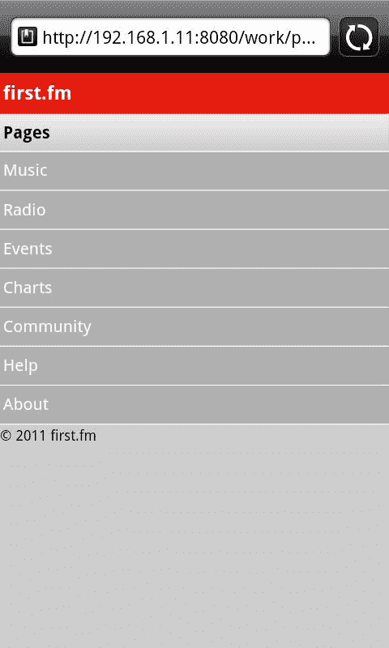
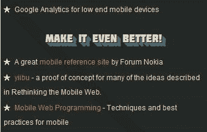

# 四、构建快速响应式网站

在本章中，我们将介绍:

*   使用基本 HTML5 标记构建页面
*   使用 CSS3 功能进行渐进增强
*   将响应设计应用于媒体查询
*   使用动态加载
*   应用用户代理检测
*   向主页添加移动书签气泡
*   使用文本区域和自动增长表单构建联系人页面
*   制作具有即时响应的按钮
*   隐藏 WebKit chrome
*   构建移动站点地图

# 简介

在移动设备上，带宽并不总是像在台式计算机上一样好。如果你在一个慢的 3G 网络上，东西的加载速度会比无线热点慢得多。即使是无线网络连接，许多移动浏览器的处理速度也比台式电脑慢。因此，当我们创建移动网站时，它们必须快速响应。

从这一章开始，我们也将开始介绍 HTML5 的特性。HTML5 是一组由语义、新的 CSS 规则和属性以及新的 JavaScript APIs 组成的技术，可以用来构建更好的结构化网页和强大的 web 应用。以下是 HTML5 的八个主要特性:

*   语义学
*   离线和存储
*   设备访问
*   连通性
*   多媒体
*   3D、图形和效果
*   性能和集成
*   CSS3

并非所有这些功能都是手机独有的；有些与移动网络更相关，而有些则更通用于移动和桌面网络。我们将讨论其中的每一项功能，并看看它们如何最好地帮助我们的移动开发。

基于使用新的语义标签和 CSS3 创建的示例，我们将讨论充分利用移动浏览器所提供的功能的多种方法，以及如何使用这些独特的功能构建网站。

# 使用 HTML5 语义构建页面

目标设备:跨浏览器

HTML5 引入了更丰富的标签集；这些标签赋予了结构意义。语义是 HTML5 的一个基本方面。

我们不会在这里讨论所有的标签，但会涉及一些最常用的标签。

## 做好准备

首先，我们创建一个新的 HTML 文件，并将其命名为 `ch04r01.html`。让我们创建一个关于音乐的虚构网站。

## 怎么做...

在我们的 HTML 文档中，键入以下代码:

```html
<!doctype html>
<html>
<head>
<title>first.fm</title>
<meta charset="utf-8">
<meta name="viewport" content="width=device-width, initial-scale=1.0">
<style>
</style>
</head>
<body>
<header>
<h1>first.fm</h1>
</header>
<div id="main">
<h2>Pages</h2>
<nav>
<ul>
<li class="list"><a href="music.html">Music</a></li>
<li><a href="radio.html">Radio</a></li>
<li><a href="events.html">Events</a></li>
<li><a href="charts.html">Charts</a></li>
<li><a href="community.html">Community</a></li>
<li><a href="help.html">Help</a></li>
<li><a href="about.html">About</a></li>
</ul>
</nav>
</div>
<footer>
<small>&copy; 2011 first.fm</small>
</footer>
</body>
</html>

```

## 它是如何工作的...

`header`元素常用于 `h1`到 `h6`元素；它可以作为整个页面的标题或任何块级元素的标题出现。它通常包含标题、副标题或标语。

`<header>`元素:

```html
<header>
</header>

```

`nav`元素表示文档的导航。 `nav`元素是一个包含指向其他文档或当前文档中各部分的链接的部分。

并非页面上的所有链接组都需要在 `nav`元素中。它只是一组主要或次要的导航链接。特别是，页脚通常有一个链接列表，链接到网站的各个关键部分，但是页脚元素在这种情况下更合适。

`<nav>`元素:

```html
<nav>
<ul class="list">
<li class="list"><a href="music.html">Music</a></li>
</ul>
</nav>

```

`footer`元素表示文档或文档部分的“页脚”。页脚元素通常包含关于其封闭部分的元数据，如谁编写的、相关文档的链接、版权数据等。页脚中给出的部分的联系信息应使用 address 元素进行标记。

`<footer>`元素:

```html
<footer>
<small>&copy; 2011 first.fm</small>
</footer>

```

`small`元素可用于小字。它并不旨在呈现页面的主要焦点。小元素不应用于冗长的段落或文本部分。它仅适用于短文本，如版权信息。

`<small>`元素:

```html
<small>&copy; 2011 first.fm</small>

```

## 还有更多...

语义不仅仅是一组更丰富的标签。我们需要的不仅仅是更有意义的标签。为了扩展到标签之外，我们还可以添加机器可读的额外语义；浏览器、脚本或机器人可以理解的数据，为程序和用户提供更有用的、数据驱动的网络。这些语义是: **RDFa(属性中的资源描述框架)**微数据，**微格式**。

### RDFa

RDFa 提供了一组机器可读的 HTML 属性。通过使用 RDFa，作者可以将现有的人类可读信息转化为机器可读数据，而无需重复内容。最新规格可在以下网址找到:

[http://www.w3.org/TR/rdfa-in-html/](http://www.w3.org/TR/rdfa-in-html/)。

### 微数据

微数据使用属性来定义数据的名称-值对组。你可以在 http://html5doctor.com/microdata/了解更多。

你可以通过阅读位于 http://www.w3.org/TR/microdata/的 W3C 工作草案来深入研究微观数据。

你也可以在 http://dev.w3.org/html5/md/阅读 W3C 编辑草稿。

### 微格式

微格式是为人类和机器设计的。目前有 34 种微格式规格，有些已经出版，有些是草稿。你可以在 http://html5doctor.com/microformats/了解更多。

## 另见

*   *在移动网络上使用 html 5[第一章](01.html "Chapter 1. HTML5 and the Mobile Web")、 *HTML5 和移动网络**
*   *让 HTML5 跨浏览器渲染[第一章](01.html "Chapter 1. HTML5 and the Mobile Web")、 *HTML5 和移动网络**

# 使用 CSS3 特征进行渐进增强

目标设备:跨浏览器

CSS3 使用广泛的风格和效果来增强网络应用和网站。使用 CSS3，可以创建一组丰富的无图像用户界面。在手机上，更少的图像意味着更快的加载，这是提升性能的一种方式。随着 CSS3 在大多数现代智能手机浏览器上的广泛支持以及 poly files for fallback(poly files 被用作 fallback，以使 HTML5 功能在不支持 HTML5 的浏览器上工作)的出现，开始使用 CSS3 不仅安全，而且很有必要！


## 做好准备

让我们为上一个示例中创建的页面设置样式。首先复制 `ch04r01.html`并将其重命名为 `ch04r02.html`。

## 怎么做...

加入以下样式规则:

```html
<style>
body {
margin:0;
padding:0;
font-family:Arial;
background:#ccc;
}
header {
text-shadow: 0 1px #000;
background: #ff3019; /* Old browsers */
background: -moz-linear-gradient(top, #ff3019 0%, #cf0404 20%, #ff3019 100%); /* FF3.6+ */
background: -webkit-gradient(linear, left top, left bottom, color-stop(0%,#ff3019), color-stop(20%,#cf0404), color-stop(100%,#ff3019)); /* Chrome,Safari4+ */
background: -webkit-linear-gradient(top, #ff3019 0%,#cf0404 20%,#ff3019 100%); /* Chrome10+,Safari5.1+ */
background: -o-linear-gradient(top, #ff3019 0%,#cf0404 20%,#ff3019 100%); /* Opera11.10+ */
background: -ms-linear-gradient(top, #ff3019 0%,#cf0404 20%,#ff3019 100%); /* IE10+ */
filter: progid:DXImageTransform.Microsoft.gradient( startColorstr='#ff3019', endColorstr='#ff3019',GradientType=0 ); /* IE6-9 */
background: linear-gradient(top, #ff3019 0%,#cf0404 20%,#ff3019 100%); /* W3C */
}
h1 {
padding:0.5em 0.2em;
margin:0;
font-size: 18px;
color:white;
}
h2 {
text-shadow: 0 1px #FFFFFF;
background: #eeeeee; /* Old browsers */
background: -moz-linear-gradient(top, #eeeeee 0%, #cccccc 100%); /* FF3.6+ */
background: -webkit-gradient(linear, left top, left bottom, color-stop(0%,#eeeeee), color-stop(100%,#cccccc)); /* Chrome,Safari4+ */
background: -webkit-linear-gradient(top, #eeeeee 0%,#cccccc 100%); /* Chrome10+,Safari5.1+ */
background: -o-linear-gradient(top, #eeeeee 0%,#cccccc 100%); /* Opera11.10+ */
background: -ms-linear-gradient(top, #eeeeee 0%,#cccccc 100%); /* IE10+ */
filter: progid:DXImageTransform.Microsoft.gradient( startColorstr='#eeeeee', endColorstr='#cccccc',GradientType=0 ); /* IE6-9 */
background: linear-gradient(top, #eeeeee 0%,#cccccc 100%); /* W3C */
padding:0.5em 0.2em;
margin:0;
font-size: 16px;
color:#000;
}
nav ul {
border-top:1px solid #fff;
list-style-type: none;
padding:0;
margin:0;
}
nav li {
padding:0.5em 0.2em;
margin:0;
background:#AFAFAF;
border-bottom:1px solid #fff;
}
nav li a {
height:20px;
display:block;
text-decoration:none;
color:white;
}
</style>

```

通过在浏览器中运行这段代码，我们可以看到:



## 它是如何工作的...

在这个例子中，我们使用了 CSS3 渐变来设置标题元素的样式。传统上，要像前面的例子一样创建渐变，必须使用 Photoshop 或 Illustrator，但现在您可以使用纯粹的 CSS 来创建它！

```html
background: #eeeeee; /* Old browsers */
background: -moz-linear-gradient(top, #eeeeee 0%, #cccccc 100%); /* FF3.6+ */
background: -webkit-gradient(linear, left top, left bottom, color-stop(0%,#eeeeee), color-stop(100%,#cccccc)); /* Chrome,Safari4+ */
background: -webkit-linear-gradient(top, #eeeeee 0%,#cccccc 100%); /* Chrome10+,Safari5.1+ */
background: -o-linear-gradient(top, #eeeeee 0%,#cccccc 100%); /* Opera11.10+ */
background: -ms-linear-gradient(top, #eeeeee 0%,#cccccc 100%); /* IE10+ */
filter: progid:DXImageTransform.Microsoft.gradient( startColorstr='#eeeeee', endColorstr='#cccccc',GradientType=0 ); /* IE6-9 */
background: linear-gradient(top, #eeeeee 0%,#cccccc 100%); /* W3C */

```

通过查看前面提到的每个规则，我们可以看到不同的浏览器对渐变使用不同的 CSS 规则。有六种不同的变体，只是为了确保它是跨浏览器兼容的。你一定在想:“哦，伙计，处理每个浏览器都很费时间。”别担心，这个规则不是手动输入的。**终极 CSS 渐变生成器**来救援了！ColorZilla 强大的类似 Photoshop 的 CSS 渐变编辑器可以帮助您轻松创建 CSS3 渐变:

[http://www.colorzilla.com/gradient-editor/](http://www.colorzilla.com/gradient-editor/)


## 还有更多...

如果考虑 IE9 及以下，可以使用 CSS3 PIE([http://css3pie.com/](http://css3pie.com/))进行支持。

下载 `PIE.htc`后，用以下方法将其包含在你的 CSS 中:

```html
-pie-background: linear-gradient(top, #eeeeee 0%,#cccccc 100%); /*PIE*/
behavior: url(PIE.htc);

```

支持的功能包括:

*   边界半径
*   箱形阴影
*   边框图像
*   CSS3 背景(`-pie-background`)
*   梯度
*   RGBA 颜色值
*   PIE 自定义属性

### 理解 CSS3 渐变

*netturts 的编辑 Jeffrey Way* 有一篇关于 CSS3 渐变的优秀文章。你可以在以下网址查看:T2。

### 请 CSS3！

*CSS3 拜托！由*保罗·爱尔兰*创作的*在[http://css3please.com/](http://css3please.com/)上有关于渐变和许多其他 CSS3 特性的最新语法。

## 另见

*   *在移动网络上使用 html 5[第一章](01.html "Chapter 1. HTML5 and the Mobile Web")中*

# 应用响应性设计

目标设备:跨浏览器

响应设计是最近移动开发中最重要的概念之一。它强调了浏览器应该响应屏幕/浏览器调整大小以不同方式呈现的概念。移动优先响应设计可以让页面在桌面浏览器上优雅地降级。

*那么我们为什么需要响应性的网页设计呢？*

当我们在桌面网页上应用固定布局时，根据浏览器屏幕的大小，屏幕的左侧或右侧通常会有空白。移动浏览器也有不同的尺寸，在视窗空间有限的情况下，每个像素都至关重要，因此利用屏幕上的每个像素非常重要。为了消除页面左侧或右侧不必要的空白，使用了响应式设计。

*媒体查询如何帮助响应性设计？*

媒体查询用于根据屏幕大小更新来设置内容的样式，因此对于相同的 HTML 元素，可以应用两个独立的规则。渲染哪一个取决于浏览器视口的大小。

## 做好准备

在这个例子中，我们将使用一个名为 `respond.js`的 HTML5 polyfill。它是由*斯科特·杰尔*(来自 jQuery 移动团队)创建的。它位于源代码中的 `ch04_code/js`。

## 怎么做...

首先，让我们创建一个名为 `ch04r03.html`的 HTML 文档。

在 HTML 中输入以下代码:

```html
<!doctype html>
<html>
<head>
<title>first.fm</title>
<meta charset="utf-8">
<meta name="viewport" content="width=device-width, initial-scale=1.0">
<link rel="stylesheet" href="css/style.css?v=1">
<script>Modernizr.mq('(min-width:0)') || document.write("<script src='js/respond.min.js'>\x3C/script>")</script>
</head>
<body>
<header>
<h1>first.fm</h1>
</header>
<div id="main">
<h2>Pages</h2>
<nav>
<ul class="list clearfix">
<li class="list"><a href="music.html">Music</a></li>
<li class="list"><a href="radio.html">Radio</a></li>
<li class="list"><a href="events.html">Events</a></li>
<li class="list"><a href="charts.html">Charts</a></li>
<li class="list"><a href="community.html">Community</a></li>
<li class="list"><a href="help.html">Help</a></li>
<li class="list"><a href="about.html">About</a></li>
</ul>
</nav>
</div>
<footer>
<small>&copy; 2011 first.fm</small>
</footer>
</body>
</html>

```

如果您在移动设备上呈现该页面，该页面看起来将与之前的配方完全相同。但是如果您在桌面浏览器中渲染它，它将看起来类似于以下内容:


## 它是如何工作的...

在文件顶部，我们使用 **Modernizr** 首先检测当前浏览器是否支持媒体查询。如果没有，我们将加载 `respond.min.js:`

```html
<script>Modernizr.mq('(min-width:0)') || document.write("<script src='js/respond.min.js'>\x3C/script>")</script>

```

在写的时候，你需要在规则的末尾有 `/*/mediaquery*/`的注释，它才会起作用。这可能会在 `respond.js:`的未来版本中得到改进

```html
@media only screen and (min-width: 800px) {
}/*/mediaquery*/

```

## 还有更多...

在移动样板网站上，我已经进一步解释了媒体查询，您可以在:[http://html5boilerplate.com/mobile/](http://html5boilerplate.com/mobile/)找到幻灯片。

*安迪·克拉克*创造了 *320 和 up* ，也是基于响应性设计的理念。您可以在:[http://stuffandnonsense.co.uk/projects/320andup/](http://stuffandnonsense.co.uk/projects/320andup/)下载。

# 优化聚合填充脚本加载

目标设备:跨浏览器

脚本加载对任何浏览器都很重要，但对移动设备更重要，因为带宽低。Modernizr 配备了动态装载解决方案。

## 做好准备

首先，让我们创建一个 HTML 文档，并将其命名为 `ch03r04.html`。

## 怎么做...

在代码编辑器中输入以下代码，并运行它。

```html
<!doctype html>
<html>
<head>
<title>first.fm</title>
<meta charset="utf-8">
<meta name="viewport" content="width=device-width, initial-scale=1.0">
<script src="js/modernizr.custom.54685.js"></script>
<style>
</style>
</head>
<body>
<header>
<h1>Your Location</h1>
</header>
<div id="main">
Your Geo Location is: <span id="geo"></span>
</div>
<script src="//ajax.googleapis.com/ajax/libs/jquery/1.5.2/jquery.js"></script>
<script>
yepnope({
test : Modernizr.geolocation,
nope : ['js/geolocation.js'],
complete: function () { navigator.geolocation.getCurrentPosition(function(position) {
document.getElementById('geo').innerHTML = position.coords.latitude+", "+position.coords.longitude;
});
}
});
</script>
</body>
</html>

```

## 它是如何工作的...

在撰写本文时，Modernizr 2.0 预览版处于 Beta 1 版本。在这个测试版中，有两个很棒的新特性。一是您可以选择自定义想要检测的功能。另一个很棒的特点是你可以拥有 `yepnope.js`(也被称为 `Modernizr.load`)由*亚历克斯·塞克斯顿*和*拉尔夫·霍尔兹曼)*组成。 `Yepnope.js`提供了一个动态的 JavaScript 加载器，你可以在本章的*部分了解更多。*


使用 Modernizr，我们可以首先检测当前用户代理中是否已经存在某个功能:

```html
test : Modernizr.geolocation

```

如果不存在，我们将使用 `yepnope`加载 `shim geolocation.js`。完成后，我们可以添加纬度和经度:

```html
yepnope({
test : Modernizr.geolocation,
nope : ['js/geolocation.js'],
complete: function () {
...
});

```

## 还有更多...

有几个对开发人员有帮助的可选资源。Modernizr 测试套件就是其中之一。它有助于帮助开发人员一目了然地了解某个设备支持哪些功能。您可以在:了解更多信息

[http://modern . github . com/modern/test/index . html](http://modernizr.github.com/Modernizr/test/index.html)。

### 耶普帕

yepnope 是一个异步条件资源加载器，速度超快，只允许加载用户需要的脚本。要了解更多信息，请访问:[http://yepnopejs.com/](http://yepnopejs.com/)。

## 另见

*   *使用 CSS3 功能进行渐进增强*

# 应用用户代理检测

目标设备:跨浏览器

开发移动站点时，最好有用户代理检测。这可以帮助您使用重定向脚本，或者帮助您确定是否要加载/不加载基于用户代理的内容。

## 做好准备

首先，让我们看看如何根据用户代理检测来判断用户是否可以从一个站点重定向到另一个站点。有两种方法可以做到这一点:你可以在服务器配置中，在你的服务器端编程语言中，或者在前端 JavaScript 中使用它。

## 怎么做...

可以从:[http://detectmobilebrowser.com/](http://detectmobilebrowser.com/)下载重定向脚本。它有许多不同的版本。在这个例子中，让我们使用 Apache 配置 `.htaccess`。

## 它是如何工作的...

下载并打开文件后，您将看到如下脚本:

```html
RewriteEngine On
RewriteBase /
RewriteCond %{HTTP_USER_AGENT} android|avantgo|blackberry|blazer|compal|
....
|up\.(browser|link)|vodafone|wap|windows\ (ce|phone)|xda|xiino [NC,OR]
RewriteCond %{HTTP_USER_AGENT} ^(1207|6310|6590|
....
|your|zeto|zte\-) [NC]
RewriteRule ^$ http://example.com/mobile [R,L]

```

要将桌面站点重定向到移动站点，可以将 `http://example.com/mobile`更改为您的站点地址。

## 还有更多...

用户代理检测不仅对重定向站点有用，当您试图根据用户代理确定是否应该首先加载某些内容时，它也很有用。

在构建移动样板网站时，我使用了检测脚本的 JavaScript 版本来确定网站是否应该基于用户代理(移动或桌面)呈现嵌入的内容:

```html
if(!jQuery.browser.mobile) {
...
}

```

使用此桌面浏览器脚本，幻灯片的加载和显示如下:


在手机版上，不显示:



### 移动浏览器检测的方法

一篇关于手机 tuts 的文章解释了手机浏览器检测的不同方法:[http://mobile . tutplus . com/tutories/mobile-web-apps/mobile-browser-detection/](http://mobile.tutsplus.com/tutorials/mobile-web-apps/mobile)。

# 在首页添加手机书签气泡

目标设备:iOS

在前几章中，我们已经讨论了在某些移动设备上为您的网站添加书签的能力。虽然这是一个非常酷的功能，可以让网络应用更接近本地应用，但它有一个问题:没有一个应用编程接口可以用来调用书签操作，所以许多用户根本不知道他们手机上有这样的功能。为了解决这个问题，一些框架使用 CSS 和 JavaScript 提供了书签气泡。该脚本在您的 web 应用页面底部添加了一个宣传气泡，要求用户将该 web 应用添加到他们设备的主屏幕上。

## 做好准备

如上所述，许多框架都提供了这个特性，但是为了简单起见，让我们使用一个独立的框架。谷歌为此发布了一个名为*移动书签泡泡*的开源库。首先，我们在:[http://code.google.com/p/mobile-bookmark-bubble/](http://code.google.com/p/mobile-bookmark-bubble/)下载。

## 怎么做...

图书馆有一个。只需在创建的任何网页中包含 `bookmark_bubble.js`和 `sample.js`；然后，您会看到如下内容:


## 它是如何工作的...

该库使用 HTML5 本地存储来跟踪宣传片是否已经显示，避免用户不断唠叨。该库的当前实现专门针对移动 Safari，即在 iPhone 和 iPad 设备上使用的网络浏览器。

## 另见

*启用[第二章](02.html "Chapter 2. Mobile Setup and Optimization")中的*全屏模式下的 iPhone 启动屏幕

# 使用文本区域和自动增长表单构建联系人页面

目标设备:跨浏览器

在短信等原生应用上，文本区会自动增长。在移动网络上，如果你创建一个文本区，你会发现它是一个固定的大小。当您键入的文本行超过 textarea 高度时，将很难看到文本。在这个例子中，我们将看到如何创建一个文本区域，当您键入更多行时，它会自动增长。

## 做好准备

首先，让我们创建一个 HTML 文档，并将其命名为 `ch04r05.html`。在本例中，我们将在移动样板中使用 `helper.js`:[https://github.com/h5bp/移动样板](http://github.com/h5bp/)

## 怎么做...

在文件中输入此代码:

```html
<!doctype html>
<html>
<head>
<title>first.fm</title>
<meta charset="utf-8">
<meta name="viewport" content="width=device-width, initial-scale=1.0">
<style>
#contact {width:220px; height:40px;}
</style>
</head>
<body>
<header>
<h1>Contact Form</h1>
</header>
<div id="main">
<p>Type the message to see it autogrow</p>
<textarea id="contact">
</textarea>
</div>
<script src="//ajax.googleapis.com/ajax/libs/jquery/1.5.2/jquery.js"></script>
<script src="//github.com/shichuan/mobile-html5-boilerplate/raw/master/js/mylibs/helper.js"></script>
<script>
var contact = document.getElementById("contact");
MBP.autogrow(contact);
</script>
</body>
</html>

```

以下是它在掌上网络操作系统中的渲染截图:


## 它是如何工作的...

在脚本中，我们有按键事件监听器。这将检测 textarea 高度是否已更改。我们测量内容的高度，如果内容改变了，我们将改变文本区域的 CSS 样式来增加高度。

## 还有更多...

最初的概念来自谷歌的代码博客。您可以在以下网址了解更多信息:http://googlecode . blogspot . com/2009/07/Gmail-for-mobile-html 5-series . html。

## 另见

*   *即时响应按钮*

# 做出即时反应的按钮

目标设备:iOS、安卓

在移动设备浏览器上，按钮响应可能比本机应用稍慢。在手机浏览器上，有一个 `touchstart`事件。通过检测这个事件而不是点击事件，它将使点击更快。

## 做好准备

在这个例子中，我们将在移动样板中使用一个函数。创建一个名为 `ch04r06.html`的文件。

## 怎么做...

下面的代码将创建一个带有提交按钮的表单:

```html
<!doctype html>
<html>
<head>
<title>first.fm</title>
<meta charset="utf-8">
<meta name="viewport" content="width=device-width, initial-scale=1.0">
<style>
#contact {
width:220px; height:40px;
}
</style>
</head>
<body>
<header>
<h1>Contact Form</h1>
</header>
<div id="main">
<textarea id="contact"></textarea><br />
<button id="btn">INSTANT button!!!</button><br />
<span id="result"></span>
</div>
<footer>
<small>&copy; 2011 first.fm</small>
</footer>
<script src="//ajax.googleapis.com/ajax/libs/jquery/1.5.1/jquery.js"></script>
<script src="//github.com/shichuan/mobile-html5-boilerplate/raw/master/js/mylibs/helper.js"></script>
<script>
var btn = document.getElementById("btn");
MBP.fastButton(btn,showForm);
function showForm() {
$("#result").html("Thank you for submitting, we will get back to you shortly!");
}
</script>
</body>
</html>

```

## 它是如何工作的...

以下是快速按钮功能的摘录，在这里我们将看到该功能如何工作。

在顶部，我们定义了主要功能。这仅在支持 `addEventListener`的情况下使用，其中它监听 `touchstart`和 `click`事件:

```html
MBP.fastButton = function (element, handler) {
this.element = element;
this.handler = handler;
if (element.addEventListener) {
element.addEventListener('touchstart', this, false);
element.addEventListener('click', this, false);
}
};
MBP.fastButton.prototype.handleEvent = function(event) {
switch (event.type) {
case 'touchstart': this.onTouchStart(event); break;
case 'touchmove': this.onTouchMove(event); break;
case 'touchend': this.onClick(event); break;
case 'click': this.onClick(event); break;
}
};

```

`onTouchStart`法用来听 `touchmove`和 `touchend`事件。 `stopPropagation`用于停止事件在侦听器中的传播，从而停止冒泡:

```html
MBP.fastButton.prototype.onTouchStart = function(event) {
event.stopPropagation();
this.element.addEventListener('touchend', this, false);
document.body.addEventListener('touchmove', this, false);
this.startX = event.touches[0].clientX;
this.startY = event.touches[0].clientY;
this.element.style.backgroundColor = "rgba(0,0,0,.7)";
};

```

`touchmove`用于测试用户是否在拖动。如果用户拖动超过 10 px，我们将重置它:

```html
MBP.fastButton.prototype.onTouchMove = function(event) {
if(Math.abs(event.touches[0].clientX - this.startX) > 10 || Math.abs(event.touches[0].clientY - this.startY) > 10) {
this.reset();
}
};

```

下面的代码防止重影点击并调用实际的点击处理程序:

```html
MBP.fastButton.prototype.onClick = function(event) {
event.stopPropagation();
this.reset();
this.handler(event);
if(event.type == 'touchend') {
MBP.preventGhostClick(this.startX, this.startY);
}
this.element.style.backgroundColor = "";
};
MBP.fastButton.prototype.reset = function() {
this.element.removeEventListener('touchend', this, false);
document.body.removeEventListener('touchmove', this, false);
this.element.style.backgroundColor = "";
};

```

## 还有更多...

你可以在谷歌的博客上读到更多关于 fast button 的信息。它详细解释了这个想法背后的背景和理论。

## 另见

*使用文本区域和自动增长表单构建联系人页面*

# 隐藏 WebKit chrome

目标设备:iOS、安卓

iOS 和安卓手机 Safari 顶部的 URL 栏使用了很大的空间。由于移动地产有限，许多开发人员会将其隐藏在页面加载中。每个像素都很重要，通过隐藏网址栏，它可以帮助您利用屏幕上的每个像素来最大化显示区域。

## 做好准备

首先，让我们创建一个 HTML 文档，并将其命名为 `ch04r07.html`。

## 怎么做...

输入此代码:

```html
<!doctype html>
<html>
<head>
<title>Mobile Cookbook</title>
<meta charset="utf-8">
<meta name="viewport" content="width=device-width, initial-scale=1.0">
<style>
html,body,header,footer{
padding:0;
margin:0;
}
header{
height:40px;
background:#BFB840;
display:block;
}
#main{
height:350px;
background:#F2CB67;
}
footer{
height:40px;
background:#DB5E31;
display:block;
}
</style>
</head>
<body>
<header>
header
</header>
<div id="main">
main
</div>
<footer>
footer
</footer>
<script src="//ajax.googleapis.com/ajax/libs/jquery/1.5.1/jquery.js"></script>
<script src="//github.com/shichuan/mobile-html5-boilerplate/raw/master/js/mylibs/helper.js"></script>
<script>
//MBP.hideUrlBar();
</script>
</body>
</html>

```

现在如果你在浏览器中渲染它，它会看起来像这样:


现在取消对以下行的注释:

```html
MBP.hideUrlBar();

```

再次渲染内容，您可以看到 chrome 现在被隐藏，允许页脚显示:


## 它是如何工作的...

以下是样板文件中的脚本:

```html
MBP.hideUrlBar = function () {
var win = window,
doc = win.document;
// If there's a hash, or addEventListener is undefined, stop here
if( !location.hash || !win.addEventListener ){
//scroll to 1
window.scrollTo( 0, 1 );
var scrollTop = 1,
//reset to 0 on bodyready, if needed
bodycheck = setInterval(function(){
if( doc.body ){
clearInterval( bodycheck );
scrollTop = "scrollTop" in doc.body ? doc.body.scrollTop : 1;
win.scrollTo( 0, scrollTop === 1 ? 0 : 1 );
}
}, 15 );
win.addEventListener( "load", function(){
setTimeout(function(){
//reset to hide addr bar at onload
win.scrollTo( 0, scrollTop === 1 ? 0 : 1 );
}, 0);
}, false );
}
};

```

它会检测 URL 中是否有任何哈希。如果有，我们将停止运行脚本，因为这意味着有一个内嵌锚。如果没有任何散列，我们将等待一秒钟，如果没有滚动，安卓使用 1 px y pos 进行隐藏，而 iOS 中为 0。该脚本将两者正常化。它是由斯科特·杰尔在 https://gist.github.com/1183357 制造的。

它也包含在移动样板中，网址为:[https://github . com/h5bp/Mobile-样板/blob/master/js/my libs/helper . js](http://github.com/h5bp/mobile-boilerplate/blob/master/js/mylibs/helper.js)。

## 另见

*使用文本区域和自动增长表单构建联系人页面*

# 构建移动站点地图

目标设备:跨浏览器

许多开发人员都熟悉谷歌网站地图。作为最大的搜索引擎，确保它获得我们的内容非常重要。为了移动搜索引擎优化，谷歌想出了**移动网站地图**。谷歌建议人们将他们的手机网站地图更新为下面描述的格式。

## 做好准备

首先，让我们创建一个 XML 文档，并将其命名为 `sitemap.xml`。

## 怎么做...

我们可以将以下代码添加到 XML 文档中。对于你的特定网站，网址应该是你的网页的网址:

```html
<?xml version="1.0" encoding="UTF-8" ?>
<urlset 
xmlns:mobile="http://www.google.com/schemas/sitemap-mobile/1.0">
<url>
<loc>http://mobile.example.com/article100.html</loc>
<mobile:mobile/>
</url>
</urlset>

```

所有的网址都包含在`<loc></loc>`里面。

确保你已经包括`<mobile:mobile/>`。否则，网站将无法正确爬网。

## 它是如何工作的...

站点地图遵循特定的模式；前面提到的 XML 模式用于告诉 Google 搜索引擎移动网页的位置。通常，如果一个网站是使用内容管理系统构建的，应该有一种自动生成网址的方法，并且它们都应该在`<loc></loc>`内列出。

## 还有更多...

移动站点地图不能包含仅桌面 URL。但是，它可以包含桌面和移动内容。

对于有专用移动内容和专用网址的网站，您可以将用户从 `example.com`引导至 `m.example.com`。在这种情况下，对用户和 Googlebot-Mobile 都使用 301 重定向。

如果你从 `example.com`开始提供所有类型的内容，这不被谷歌认为是隐形。

### 谷歌和移动友好网站建设

在谷歌站长网站上，有一篇关于如何让网站变得移动友好的博文:[http://googlewebmastercentral . blogspot . com/2011/02/making-网站-移动友好. html](http://googlewebmastercentral.blogspot.com/2011/02/making-websites-mobile-friendly.html) 。

### 谷歌和移动网站索引

谷歌站长网站上还有一个博客，讲的是如何帮助谷歌索引你的移动站点:[http://googlewebmastercentral.blogspot.com/2009/](http://googlewebmastercentral.blogspot.com/2009/)T2】