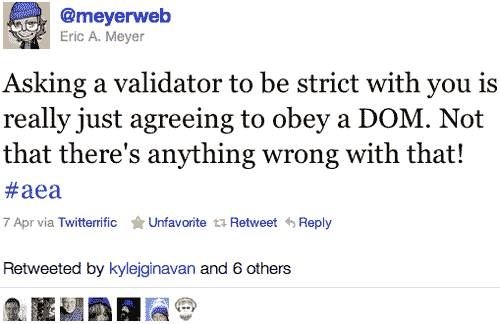
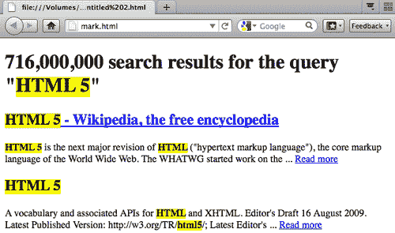
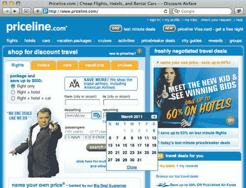
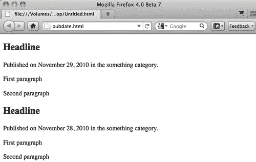
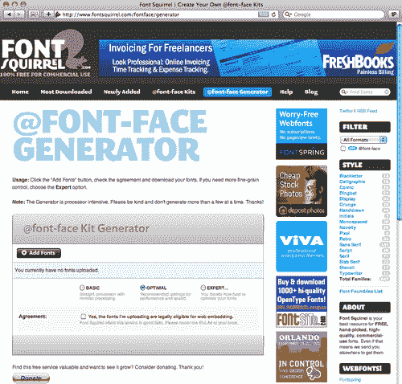
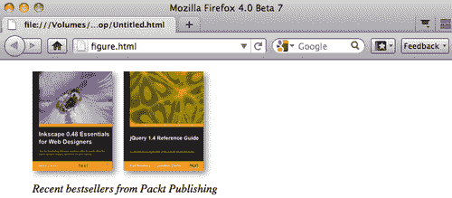

# 第二章。支持内容

在本章中，我们将介绍:

*   构建博客`article`
*   使用`mark`元素突出显示文本
*   使用`time`元素
*   指定`article`的`pubdate`
*   使用`article`元素显示注释块
*   使用@font-face 动态添加字体
*   给字体添加阴影效果
*   对字体应用渐变效果
*   使用`figure`标签标注视觉元素

# 简介

> “在网络上，判断一个人不应该看他的肤色，而应该看他内容的内容。”-互联网迷因

HTML5 和所有以前版本的 HTML 之间最显著的区别之一是，在我们构建通用`<div>s`和其他类似的通用容器之前，我们并不知道它们会包含什么内容。随着 HTML5 的出现，这一切都结束了。为了在语义上符合规范，我们需要知道内容是什么，这样我们就可以用最合适的新元素标签来包装它。虽然这可能意味着我们开发人员必须以不同的方式思考，但一个新的挑战正是我们在这里的原因。在这一章中，我们将看一些如何使用 HTML5 的一些新元素来做到这一点的例子。

> "在冲突的情况下，考虑用户超过作者超过实现者超过说明符超过理论纯度."-选区的优先权

在本章中，我们将向您展示如何使用新的`<article>`元素标记博文和评论，如何为`<article>`添加有意义的发布日期，如何使用新的`<mark>`元素突出显示文本，以及如何使用新的`<figure>`元素注释视觉元素。然后，我们将把注意力转向使用字体替换技术来设计文本样式的一些新方法，以及给文本添加阴影和渐变。

# 构建博客文章

> “T0”元素表示文档、页面、应用或站点中的自包含组合，原则上是可独立分发或可重用的，例如在联合中。这可以是论坛帖子、杂志或报纸文章、博客条目、用户提交的评论、交互式小部件或小工具，或者任何其他独立的内容项目。”- WHATWG 的 HTML5 标准草案-[http://whatwg.org/html5](http://whatwg.org/html5)

## 做好准备

博客条目是新的`<article>`元素的完美候选，该元素是为联合内容设计的。

对于这个食谱，让我们从识别博客的主要元素开始`<article>:`通常有一个标题标签形式的标题，博客条目本身由几个段落组成，可能还有一个或多个图像，以及一些通常包括作者姓名和其他相关元数据的信息。请注意，这都是独立的相关内容。

## 怎么做...

我们将继续使用新的 HTML5

<header>和

<footer>元素。标题、条目和元信息应该包装在自己独特的标签中，比如`<h2>`、多个`<p>s`和新的`<footer>`。</footer>

</header>

让我们从一个与上一章非常相似的基础开始，并添加我们新的`<article>`元素两次:

```html
<!DOCTYPE html>
<html lang="en">
<head>
<meta charset="UTF-8">
<title>Blog Title</title>
<!--[if lt IE 9]><script src="http://html5shiv.googlecode.com/svn/trunk/html5.js"> </script>[endif]-->
<!--[if lt IE 9]><script src="http://html5shiv.googlecode.com/svn/trunk/html5.js"> </script>[endif]-->
<meta name="viewport" content="width=device-width, initial-scale=1.0">
</head>
<body>
<article>
<header>
<h2>Headline</h2>
</header>
<p>First paragraph</p>
<p>Second paragraph</p>
<footer>Meta information.</footer>
</article>
<article>
<header>
<h2>Headline</h2>
</header>
<p>First paragraph</p>
<p>Second paragraph</p>
<footer>Meta information.</footer>
</article>
</body>
</html>

```

### 把你的代码节食？

准备好震惊了吗？想爽一把吗？`<html>`、`<head>`和`<body>`标签(以及它们的结束标签)现在在 HTML5 规范中是可选的。当然，你可以把它们留在那里，你的页面会很好地验证，但是我们为什么要这么做呢？如果把它们从前面的代码中去掉，我们就剩下斯巴达人了:

```html
<!DOCTYPE html>
<meta charset="UTF-8">
<title>Blog Title</title>
<!--[if lt IE 9]><script src="http://html5shiv.googlecode.com/svn/trunk/html5.js"> </script>[endif]-->
<meta name="viewport" content="width=device-width, initial-scale=1.0">
<article>
<header>
<h2>Headline</h2>
</header>
<p>First paragraph</p>
<p>Second paragraph</p>
<footer>Meta information.</footer>
</article>
<article>
<header>
<h2>Headline</h2>
</header>
<p>First paragraph</p>
<p>Second paragraph</p>
<footer>Meta information.</footer>
</article>

```

不相信我？在万维网联盟的验证器中运行该代码，验证器位于:[http://validator.w3.org](http://validator.w3.org)，您将看到它在浏览器中正确显示。

没那么快巴斯特。问题是移除这些元素会破坏屏幕阅读器的代码。哦哦。第一击。此外，移除`<body>`标签打破了我们新的 html 5-支持互联网浏览器的 JavaScript。第二击。你猜怎么着？你能预见到它的到来，不是吗？是的，移除`<html>`标签会移除页面的语言。就是这样:三振出局。

让我们把这些元素加进去，好吗？

```html
<!DOCTYPE html>
<html lang="en">
<head>
<meta charset="UTF-8">
<title>Blog Title</title>
<!--[if lt IE 9]><script src="http://html5shiv.googlecode.com/svn/trunk/html5.js"> </script>[endif]-->
<meta name="viewport" content="width=device-width, initial-scale=1.0">
</head>
<body>
<article>
<header>
<h2>Headline</h2>
</header>
<p>First paragraph</p>
<p>Second paragraph</p>
<footer>Meta information.</footer>
</article>
<article>
<header>
<h2>Headline</h2>
</header>
<p>First paragraph</p>
<p>Second paragraph</p>
<footer>Meta information.</footer>
</article>
</body>
</html>

```

好了，好多了。

## 它是如何工作的...

请记住，新的`<article>`元素是旨在通过 RSS 或其他方式进行联合的相关信息的集合。

## 还有更多...

更丰富、更有意义的语义可能是 HTML5 最重要的目标。对机器更好，对作者更好，最重要的是，对我们的观众更好。

### 验证是一种辅助，而不是拐杖

正如我们之前看到的，移除`<html>`、`<head>`和`<body>`标签会呈现一个仍然有效的页面。这就引出了一个问题，验证器的有效性如何。与 XML 世界不同，HTML5 可以使用不正确的语法，并且仍然呈现得很好。

作者尽一切努力验证他的代码。没有必要对验证器唯唯诺诺，但它总是一个很好的质量控制检查。越接近有效代码，浏览器越有可能以尽可能一致的方式显示您的工作。

### 埃里克·迈耶的搞笑

作者喜欢 CSS 大师埃里克·迈耶对验证器的看法:



### 哪里可以找到验证器

您可以在以下位置充分利用代码验证器:

*   [http://validator.nu](http://validator.nu)
*   [http://validator.w3.org](http://validator.w3.org)

## 另见

克里斯蒂娜·哈尔沃森的书《网络内容战略》从发行之时起就是一部经典之作。在这篇文章中，总部位于明尼阿波利斯的公司 Brain Traffic 的首席执行官哈尔沃森明确定义了如何为在线受众创建和提供有用和可用内容的过程。

# 使用标记元素突出显示文本

> `<mark>`元素表示一个文档中的一系列文本，由于其在另一个上下文中的相关性，该文档被标记或高亮显示以供参考。当用于引文或散文中提到的其他文本块时，它表示原本不存在的突出部分，但添加该突出部分是为了将读者的注意力吸引到文本的某个部分，该部分在最初编写该文本块时可能并不被原作者认为重要，但现在却处于先前未预料到的审查之下。当用于文档的主要部分时，它表示文档中由于可能与用户当前活动相关而被突出显示的部分。”- WHATWG 的 HTML5 标准草案-[http://whatwg.org/html5](http://whatwg.org/html5)

## 准备

查看搜索结果时，您通常会发现您搜索的术语高亮显示。我们现在可以使用更有意义的`<mark>`元素，而不是依赖语义上没有意义的标签。

## 怎么做...

在这个食谱中，你会看到[HTML5doctor.com](http://HTML5doctor.com)有一个如何使用新的`<mark>`元素突出显示搜索结果术语的优秀例子。这不仅为样式设计提供了一个有用的语义钩子，也为跟踪结果的机器提供了一个有用的语义钩子。

```html
<!DOCTYPE html>
<html lang="en">
<head>
<meta charset="UTF-8">
<title></title>
<!--[if lt IE 9]><script src="http://html5shiv.googlecode.com/svn/trunk/html5.js"> </script>[endif]-->
<meta name="viewport" content="width=device-width, initial-scale=1.0">
</head>
<body>
<h1>716,000,000 search results for the query "<mark>HTML5</mark>"</h1>
<section id="search-results">
<article>
<h2><a href="http://en.wikipedia.org/wiki/HTML_5"> <mark>HTML5</mark> - Wikipedia, the free encyclopedia</a></h2>
<p><mark>HTML5</mark> is the next major revision of <mark>HTML</mark> ("hypertext markup language"), the core markup language of the World Wide Web. The WHATWG started work on the ... <a href="http://en.wikipedia.org/wiki/HTML_5"> Read more</a></p>
</article>
<article>
<h2><a href="http://dev.w3.org/html5/spec/Overview.html"> <mark>HTML5</mark></a></h2>
<p>A vocabulary and associated APIs for <mark>HTML</mark> and XHTML. Editor's Draft 16 August 2009\. Latest Published Version: http://w3.org/TR/<mark>html5</mark>/; Latest Editor's ... <a href="http://dev.w3.org/html5/spec/Overview.html"> Read more</a></p>
</article>
</section>
</body>
</html>

```

添加一个简单的样式声明，如:

```html
<style type="text/css">
mark {background-color: yellow; font-weight: bold;}
</style>

```

在`<head>`部分帮助我们呈现这个突出显示的文本:



## 它是如何工作的...

新的`<mark>`元素只是突出一个单词或短语来吸引读者的注意力。为此，只需在相应的级联样式表中将`<mark>`指定为粗体或斜体或以某种方式突出显示。

## 还有更多...

当然，您可以标记搜索结果页面并设置其样式，以使用`<b>`或`<i>`甚至`<span>`标签来指示搜索是针对哪个术语进行的，但是这些标签中的每一个都只影响表示层。它们缺乏意义。新的`<mark>`元素可以实现相同的视觉效果，同时也为您的标记增加了额外的意义。事实上，新的`<mark>`元素充满了胜利。

### <马克>长盛不衰

新的`<mark>`元素的另一个很好的用途是在日历选择器中突出显示日期，就像我们经常在任何基于日期的预订系统网站上看到的一样，比如[Priceline.com](http://Priceline.com)。

[Priceline.com](http://Priceline.com)在预订行程时，默认会突出显示当前日期。新的`<mark>`元素不是使用语义上没有意义的标签来实现这一点，而是一个完美的候选元素。



### 等待浏览器

在撰写本文时，任何网络浏览器都不完全支持新的`<mark>`元素。虽然额外的语义含义对机器读者来说可能并不明显，但我们仍然可以使用新的`<mark>`元素作为风格上的“钩子”，直到它的含义被各种浏览器完全支持的那一天。

### 是“未来证明”一词吗？

请记住，HTML5 的新元素试图给我们的标记增加额外的意义。目标是永远不要带走意义或断页。考虑到这一点，在像`<mark>`元素这样还没有被浏览器完全实现的新元素上进行分层变得更加容易接受。即使它的含义还没有被机器完全理解，添加它并尽可能地让我们的页面成为“未来的证明”当然没有坏处。

## 另见

2001 年，Carrie Bickner 编写了“纽约公共图书馆在线风格指南”([http://legacy.www.nypl.org/styleguide](http://legacy.www.nypl.org/styleguide))供 NYPL 的分支机构在更新网站时使用。在这份开创性的出版物中，比克纳通过将内容(标记)与表示(级联样式表)和行为(JavaScript)分开，为网络标准提出了理由。该出版物当时极具前瞻性，已使用多年。

# 使用时间元素

> `<time>`元素表示 24 小时时钟上的时间，或者公历中的精确日期，可选地带有时间和时区偏移- WHATWG 的 HTML5 标准草案-[http://whatwg.org/html5](http://whatwg.org/html5)

## 准备

新的`<time>`元素是显示时间或特定日期的强大方式。

## 怎么做...

在这个食谱中，我们将显示日期和时间，这对人类和机器都是可读的。我们来看四个例子。

```html
<!DOCTYPE html>
<html lang="en">
<head>
<meta charset="UTF-8">
<title></title>
<!--[if lt IE 9]><script src=http://html5shiv.googlecode.com/svn/trunk/html5.js> </script>[endif]-->
<meta name="viewport" content="width=device-width, initial-scale=1.0">
</head>
<body>
<article>
<header>
<h2>Headline</h2>
<time datetime="2010-11-29">November 29, 2010</time>
</header>
<p>First paragraph</p>
<p>Second paragraph</p>
<footer>Meta information.</footer>
</article>
<article>
<header>
<h2>Headline</h2>
<time datetime="2010-11-29">Nov. 29</time>
</header>
<p>First paragraph</p>
<p>Second paragraph</p>
<footer>Meta information.</footer>
</article>
<article>
<header>
<h2>Headline</h2>
<time datetime="2010-11-29">the date this was written</time>
</header>
<p>First paragraph</p>
<p>Second paragraph</p>
<footer>Meta information.</footer>
</article>
<article>
<header>
<h2>Headline</h2>
<time datetime="2010-11-29T11:34">the date and time this was written</time>
</header>
<p>First paragraph</p>
<p>Second paragraph</p>
<footer>Meta information.</footer>
</article>
</body>
</html>

```

## 它是如何工作的...

我们可以使用新的`<time>`元素来表示特定的日期、时间或两者。

## 还有更多...

新的`<time>`元素指定了一个精确的时刻，而不是一个时间段。

### 奇怪的规则

新`<time>`元素的一个有趣的方面是，你不能使用基督教时代之前的日期。你也不能用“2010 年 11 月”这样的日期无论我们指定什么日期，都必须是一个肯定的具体日期，而不是相对日期。HTML5 工作组继续处理这一看似任意的限制。

### 时间<T2 的时代将会到来

浏览器显示了新的`<time>`元素，但是还没有对它做任何特殊的处理。

### 永远记住 SEO

时间到了。为什么我们如此痴迷于此？在网上关注时间和日期的一个非常有效的理由是搜索引擎优化。搜索引擎优化，曾经被视为某种神秘的巫毒术，只有戴黑帽子的巫师才明白，现在是每个人在网上的责任。你花时间创造好的代码，并期待一个作者创造值得阅读的内容。现在更进一步，确保您的目标受众能够真正找到您花时间创建的内容。而新的`<time>`元素只是搜索引擎吸引人们关注最新内容的方式之一。

## 另见

新的 HTML5 `<time>`元素是微格式运动的一个可能的补充。微格式承诺给我们的标记增加额外的语义含义。虽然微格式不是正式的标准，但它正在网络开发社区中慢慢被接受。在[Microformats.org](http://Microformats.org)了解更多信息。

# 指定文章的发表日期

> `pubdate`属性是一个布尔属性。如果指定，则表示元素给出的日期和时间是最近的祖先`<article>`元素的发布日期和时间，或者，如果元素没有祖先`<article>`元素，则表示整个文档的发布日期和时间。”- WHATWG 的 HTML5 标准草案-[http://whatwg.org/html5](http://whatwg.org/html5)

## 准备

新的`pubdate`是新的`<time>`元素的属性，当它存在于新的`<article>`元素中时。它让我们在呈现出版日期和时间时更加精确。

## 怎么做...

在这个配方中，我们将基于上一个配方中的新`<time>`元素，并添加新的可选`pubdate`属性来显示我们的发布日期。

```html
<!DOCTYPE html>
<html lang="en">
<head>
<meta charset="UTF-8">
<title></title>
<!--[if lt IE 9]><script src=http://html5shiv.googlecode.com/svn/trunk/html5.js> </script>[endif]-->
<meta name="viewport" content="width=device-width, initial-scale=1.0">
</head>
<body>
<article>
<header>
<h2>Headline</h2>
<p>Published on <time datetime="2010-11-29" pubdate> November 29, 2010</time> in the something category.</p>
</header>
<p>First paragraph</p>
<p>Second paragraph</p>
<footer></footer>
</article>
<article>
<header>
<h2>Headline</h2>
<p>Published on <time datetime="2010-11-28" pubdate> November 28, 2010</time> in the something category.</p>
</header>
<p>First paragraph</p>
<p>Second paragraph</p>
<footer></footer>
</article>
</body>
</html>

```

## 它是如何工作的...

`Pubdate`简单来说就是一个二进制变量，或者布尔属性，用来表示什么时候发布了什么东西。

## 还有更多...

你可以把`pubdate`想象成给已经在提供额外信息的元素`(<time>)`添加额外信息。这就像圣代上的樱桃。谁不喜欢圣代上的樱桃？

### 还在浏览器上等待

我们通过加入像`<mark>, <time>`和`pubdate`这样的新元素而获得了真正的前瞻性思维，因为没有一个元素得到任何浏览器的完全支持— *到*。



像火狐这样的现代浏览器显示新的`<time>`元素和`pubdate`属性，没有样式。

### 额外积分

如果想要符合 XML 语法，可以将新的`pubdate`布尔属性编码为`<time datetime="2010-11-29" pubdate="pubdate">`。

### 让我们结束混乱

尽管 HTML5 还是相当新，但是对于新的`pubdate`布尔属性已经有一些混乱。有些人认为它应该根据你的计算机时钟或服务器来生成出版日期。那不是它的角色。它的作用是产生一个机器可读的出版日期，无论你在它后面放什么文本，它都是有用的。

## 另见

坦泰克·切利克在 http://favelets.com 创建了一个非常有用的网站，该网站以各种“书签”或浏览器中的 JavaScript 命令为特色。使用这些在同一个窗口中验证 HTML5、CSS 和锚点。非常有帮助！

# 使用文章元素显示评论块

> “T0”元素表示文档、页面、应用或站点中的自包含组合，原则上是可独立分发或可重用的，例如在联合中。这可以是论坛帖子、杂志或报纸文章、博客条目、用户提交的评论、交互式小部件或小工具，或者任何其他独立的内容项目。”- WHATWG 的 HTML5 标准草案-[http://whatwg.org/html5](http://whatwg.org/html5)

## 做好准备

我们当然也可以使用新的`<article>`元素来标记博客评论。在这个食谱中，我们将会这样做。

## 怎么做...

让我们使用新的`<article>`元素来标记一个博客评论块。

```html
<!DOCTYPE html>
<html lang="en">
<head>
<meta charset="UTF-8">
<title></title>
<!--[if lt IE 9]><script src=http://html5shiv.googlecode.com/svn/trunk/html5.js> </script>[endif]-->
<meta name="viewport" content="width=device-width, initial-scale=1.0">
</head>
<body>
<article>
<header>
<h3>Comment by: <a href="http://dalejcruse.com">Dale J Cruse</a></h3>
<p>On <time datetime="2010-11-29">November 29, 2010</time></p>
</header>
<p>The is the first paragraph of my comment</p>
<p>The is the second paragraph of my comment</p>
<footer>
<p><small>Creative Commons Attribution-ShareAlike License</small></p>
</footer>
</article>
<article>
<header>
<article element> usedsteps<h3>Comment by: <a href="http://dalejcruse.com">Dale J Cruse</a></h3>
<p>On <time datetime="2010-11-29">November 29, 2010</time></p>
</header>
<p>The is the first paragraph of my comment</p>
<p>The is the second paragraph of my comment</p>
<footer>
<p><small>Creative Commons Attribution-ShareAlike License</small></p>
</footer>
</article>
</body>
</html>

```

## 它是如何工作的...

“等一下，”你在想。“博客评论不是你惊呼的`<article>!"`。别这么快，巴斯特。如果我们分析博客评论的组成部分，我们会发现与其他`<article>s`相同的元素。

## 还有更多...

在此过程中，让我们检查一下之前的`<footer>s`中的新`<small>`元素。以前，`<small>`是一个表示物理小文本的表象元素。不再是了！现在`<small>`被重新定义为这样使用:

> “`<small>`元素代表所谓的‘小字’，如法律免责声明和警告。”- WHATWG 的 HTML5 标准草案-[http://whatwg.org/html5](http://whatwg.org/html5)

### 博客评论

由于博客评论及其评论源可以用于联合，因此有更多的理由使用新的`<article>`元素。

### 价值评论

评论。几乎在任何值得阅读的博客中都可以找到它们。无论我们是在创建自己的网站还是自己的博客内容管理系统，我们都应该像对待实际的博客文章一样，小心谨慎地对待评论代码。

### 机会是你的

[Disqus.com](http://Disqus.com)是最广泛使用的博客评论插件的在线主页。出版商可以很容易地将它整合到他们的网站中，而不需要太多的编程工作。那我们该怎么办？不管你是用 Disqus 还是任何其他的评论系统，都必须有人开发代码，对吗？还不如是你！

## 另见

乔希·达克在 http://joshduck.com/periodic-table.html 创造了聪明而有用的 HTML5 元素周期表。在那里，乔希巧妙地将类似新元素的类别分组，如根元素、文本级语义、文档部分等等！

# 用@字体动态添加字体

不久前，我们设计人员和开发人员还被限制只能使用少数几种“网络安全”字体。如果我们想用不被认为“安全”的字体显示文本，我们就用它做了一个图像。这很愚蠢，但我们别无选择。现在我们知道了。字体终于在网络上解放了。

好的排版对任何设计都是必不可少的，新的@font-face 功能让我们可以嵌入字体供浏览器使用。虽然从技术上来说不是 HTML5 的一部分，但是这个 CSS3 属性太重要了，不能不处理。

## 做好准备

对于这个食谱，让我们找到一个有趣的字体，并嵌入它作为一个简单的标志。下面你会找到几个伟大的网站的链接，找到免费和付费的网络字体。对于这个例子，让我们看看作者个人作品集在[http://dalejcruse.com](http://dalejcruse.com)的一个先前版本。

## 怎么做...

有几种方法可以在网络上显示自定义字体，但我们将研究并使用防弹方式，使其在现代、传统甚至移动浏览器中工作。

让我们前往位于[http://fontsquirrel.com/fontface/generator](http://fontsquirrel.com/fontface/generator)的@字体生成器。



使用@font-face Kit Generator 向导引导我们完成上传字体的过程(此处为“联盟哥特式”)，并确保您使用的字体是合法授权使用的。

上传后，生成器会将您的字体转换为多种文件格式。下载所有这些文件，并将它们保存到您想要显示它们的服务器上。所需要的只是两个造型:

1.  引用@字体文件
2.  Assigning the new font to the element we want to use.

    ```html
    <!DOCTYPE html>
    <html lang="en">
    <head>
    <meta charset="UTF-8">
    <title></title>
    <!--[if lt IE 9]><script src=http://html5shiv.googlecode.com/svn/trunk/html5.js> </script>[endif]-->
    <meta name="viewport" content="width=device-width, initial-scale=1.0">
    <style>
    @font-face {font-family: 'LeagueGothic'; src: url('fonts/league_gothic-webfont.eot'); src: local(''), url('fonts/league_gothic-webfont.woff') format('woff'), url('fonts/league_gothic-webfont.ttf') format('truetype'), url('fonts/league_gothic-webfont.svg#webfontdrbhz05x') format('svg');
    h1 {font-family: 'LeagueGothic'; font-size: 124px; line-height: 124px; margin: 355px 0 -25px 0; text-transform: uppercase;}
    </style>
    </head>
    <body>
    <h1>Dale J Cruse</h1>
    </body>
    </html>

    ```

    

炸药爆炸了。

## 它是如何工作的...

新的@font-face 功能允许我们在网络服务器上保存各种格式的字体文件，并使用 CSS 引用它们进行显示。这样，字体文件就变成了另一种资产，就像图像一样。

## 还有更多...

浏览器使用自己专有的字体文件在网络上显示。通过下载和引用每一种可能的格式，我们确保了像火狐、Chrome 和 Safari 这样的现代浏览器，以及像 Internet Explorer 甚至移动浏览器这样的传统浏览器都可以显示我们想要的字体。

### 不要偷

确保您正在使用的字体已被合法授权用于在线显示。偷窃不酷。

### Firefox 注意事项

请记住将您想要使用的字体存储在与您的唯一域相同的服务器上。有些浏览器(我在看你，火狐)不喜欢你尝试跨域引用字体。

### 保罗爱尔兰摇滚

本着因势利导的精神，我们用来调用各种本地存储的字体文件的 CSS 方法是由 Paul Irish 在他的帖子“防弹@字体-面部实现语法”中开发的，该帖子位于:[http://paulirish . com/2009/防弹-字体-面部实现-语法](http://paulirish.com/2009/bulletproof-font-face-implementation-syntax)。

## 另见

网上有一些很棒的免费和付费字体来源，包括:

*   fontdeck-[http://fontdeck . com](http://fontdeck.com)
*   克恩斯特-[http://kernest.com](http://kernest.com)
*   活字联盟-http://theleagueofmoveabletype.com
*   类型—[http://types . com](http://typekit.com)
*   类型学-[http://域名学. com/fonts](http://typotheque.com/fonts)
*   网页字体 - [http://webfonts.fonts.com](http://webfonts.fonts.com)
*   web folders . info-http://web folders . info
*   webtype-[http://webtype.com](http://webtype.com)T2】

# 为字体添加阴影效果

曾几何时，似乎网页设计师和开发人员尽可能地给每个视觉元素添加阴影。就好像他们是靠投下阴影获得报酬的。幸运的是，那个时代来了又去。今天，只有最时尚的设计师和开发人员知道如何非常节省地添加阴影。让我们看看如何仅使用 CSS 来做到这一点。

## 准备

首先，让我们使用前面的例子，并简单地在标题字体上添加一个非常微妙的阴影，该字体来自作者在[http://dalejcruse.com](http://dalejcruse.com)的投资组合网站的前一个版本。

## 怎么做...

在这个食谱中，我们将使用一些精心设计的样式来为我们的一些文本添加有品味的阴影效果。

```html
<!DOCTYPE html>
<html lang="en">
<head>
<meta charset="UTF-8">
<title></title>
<!--[if lt IE 9]><script
src=http://html5shiv.googlecode.com/svn/trunk/html5.js>
</script>[endif]-->
<meta name="viewport" content="width=device-width,
initial-scale=1.0">
<style>
@font-face {
font-family: 'LeagueGothic';
src: url('fonts/league_gothic-webfont.eot');
src: local(''), url('fonts/league_gothic-webfont.woff')
format('woff'), url('fonts/league_gothic-webfont.ttf')
format('truetype'), url('fonts/league_gothic-
webfont.svg#webfontdrbhz05x') format('svg');
}
h1 {font-family: 'LeagueGothic'; font-size: 124px;
line-height: 124px; margin: 355px 0 -25px 0;
text-transform: uppercase; text-shadow: black 1px 1px 0;}
</style>
</head>
<body>
<h1>Dale J Cruse</h1>
</body>
</html>

```

## 它是如何工作的...

在现代浏览器中，文本阴影 CSS 属性显示一个细微的黑色阴影，向右一个像素，在文本下面一个像素。虽然在作者的作品集网站上非常微妙，但如果我们将背景和字体颜色都设置为白色，效果会更明显。

背景和文本颜色都设置为白色，我们在这里看到的是右边一个像素和下面一个像素的黑色阴影。由于 IE 不支持文本阴影，这将在浏览器中呈现为纯白色。那可能不是你想要的。


## 还有更多...

除了像“黑色”这样的绝对颜色值之外，我们还可以使用像“#000”这样的十六进制值，甚至是带有半透明 alpha 通道的 RGBA 值。

### 浏览器支持

像 Chrome 2+、Firefox 3.1+、Opera 9.5+、Safari 1.1+等现代浏览器都支持文本阴影 CSS 属性。这首歌现在已经很破旧了，但足以说明互联网浏览器不支持它。

### 以巨大的力量…

仅仅因为只使用 CSS 向文本添加阴影的能力存在，不要认为这是一个许可去滥用它。我们不想回到网络上到处都是阴影的丑陋时代。相反，永远使用你的力量。

### 对所有读者的恳求

为了可读性，请考虑仅将投影效果应用于标题或页眉字体。将它应用于正文会变得令人厌烦和不可读。你不想再次成为那个过度使用和杀死阴影的人。

## 另见

谷歌发布了 WebFont Loader 开源 JavaScript 库，以更好地控制浏览器加载 web 字体的方式。在[http://code . Google . com/API/web font/docs/web font _ loader . html](http://code.google.com/apis/webfonts/docs/webfont_loader.html)查看超简单的实现。

# 对字体应用渐变效果

让我们以前面的例子为例，再增加一层:微妙的渐变效果。

## 做好准备

我们需要的另一个额外的东西是一个可移植的网络图形图像，我们可以通过 CSS 引用它。

## 怎么做...

在这个食谱中，我们将添加一个带有阿尔法透明度的`.png`图像文件，在标题上创建一个光滑的渐变效果。

```html
<!DOCTYPE html>
<html lang="en">
<head>
<meta charset="UTF-8">
<title></title>
<!--[if lt IE 9]><script src=http://html5shiv.googlecode.com/svn/trunk/html5.js> </script>[endif]-->
<meta name="viewport" content="width=device-width, initial-scale=1.0">
<style>
@font-face {font-family: 'LeagueGothic'; src: url('fonts/league_gothic-webfont.eot'); src: local(''), url('fonts/league_gothic-webfont.woff') format('woff'), url('fonts/league_gothic-webfont.ttf') format('truetype'), url('fonts/league_gothic-webfont.svg#webfontdrbhz05x') format('svg');
}
h1 {font-family: 'LeagueGothic'; font-size: 124px; line-height: 124px; margin: 355px 0 -25px 0; text-transform: uppercase; text-shadow: black 1px 1px 0; position: relative;}
h1 span {background: url(gradient.png) repeat-x; display: block; height: 124px; position: absolute; width: 100%;}
</style>
</head>
<body>
<h1><span></span>Dale J Cruse</h1>
</body>
</html>

```

请注意我们的`<h1>`标签中的额外`<span>`。这就是我们的形象。

## 它是如何工作的...

通过简单地在文本上叠加一些透明的图像，我们巧妙地改变了文本，使其看起来有一个渐变。

## 还有更多...

你的想象力是这种效果的唯一限制。你可以创建淡入淡出，金属效果，垂直或水平条纹，甚至斑马条纹！

### 类型

**小心那边**

记住:仅仅因为你能，并不意味着你应该。谨慎使用文本渐变。求你了。

## 另见

关于字体渐变效果的一个很好的例子，看看亚历克斯·克拉克大学项目中关于土卫二的标题，土卫二是位于 http://hagablog.co.uk/demos/enceladus/index.html 的土星卫星之一。当你享受视觉设计的时候，不要忘记查看源代码，看看亚历克斯非常好的 HTML5 代码。

# 使用图形和图形标题标签标注视觉元素

> `<figure>`元素表示一些流内容，可选地带有一个标题，它是独立的，并且通常作为文档主流的单个单元来引用。因此，该元素可以用于注释从文档的主要内容中引用的插图、图表、照片、代码列表等，但是可以在不影响文档流的情况下，将其从主要内容移开，例如移到页面的侧面、专用页面或附录。”- WHATWG 的 HTML5 标准草案-[http://whatwg.org/html5](http://whatwg.org/html5)

> 元素的第一个
> 
> <figcaption>子元素(如果有)代表
> 
> <figure>元素内容的标题。如果没有子
> 
> <figcaption>元素，就没有标题。”- WHATWG 的 HTML5 标准草案-[http://whatwg.org/html5](http://whatwg.org/html5)</figcaption>
> 
> </figure>
> 
> </figcaption>

## 做好准备

你已经看过无数次了:一张图片下面有某种文字说明。通常它在一页的侧面。以前，我们只是把它标记为一个图像，下面有某种文本容器。现在，我们有了语义更丰富的新`<figure>`元素来处理它。让我们来看看怎么做。

## 怎么做...

有两种方法可以实现这个配方:

1.  没有标题
2.  附有说明

首先，让我们在没有标题的情况下尝试一下:

```html
<!DOCTYPE html>
<html lang="en">
<head>
<meta charset="UTF-8">
<title></title>
<!--[if lt IE 9]><script src=http://html5shiv.googlecode.com/svn/trunk/html5.js> </script>[endif]-->
<meta name="viewport" content="width=device-width, initial-scale=1.0">
</head>
<body>
<figure>

</figure>
</body>
</html>

```

现在让我们添加标题:

```html
<!DOCTYPE html>
<html lang="en">
<head>
<meta charset="UTF-8">
<title></title>
<!--[if lt IE 9]><script src=http://html5shiv.googlecode.com/svn/trunk/html5.js>
</script>[endif]-->
<meta name="viewport" content="width=device-width, initial-scale=1.0">
</head>
<body>
<figure>

<figcaption>Inkscape 0.48 for Web Designers</figcaption>
</figure>
</body>
</html>

```

为多张图片配一个标题也很容易。请注意多个`img`标签和一个`<figcaption>`。

```html
<!DOCTYPE html>
<html lang="en">
<head>
<meta charset="UTF-8">
<title></title>
<!--[if lt IE 9]><script src=http://html5shiv.googlecode.com/svn/trunk/html5.js> </script>[endif]-->
<meta name="viewport" content="width=device-width, initial-scale=1.0">
</head>
<body>
<figure> elementvisual elements, annotating<figure>


<figcaption>Recent bestsellers from Packt Publishing</figcaption>
</figure>
</body>
</html>

```

## 它是如何工作的...

一点样式使得`<figcaption>`在新的`<figure>`元素中显示在那些图像下面。



## 还有更多...

请记住，新的`<figure>`元素用于您想要显示在其相应主文本一侧的内联内容。

### 分组很好

新的`<figure>`元素可以包含文本、图像、音频、视频、插图、图表、代码列表，以及除了主要内容之外的任何其他值得分组的内容。

### 语义也很有价值

书籍、报纸和杂志中随时都会出现带标题的内联内容。自从网络的早期，我们已经能够完成同样的事情，但是现在新的`<figure>`元素给了我们一个更加语义化的风格“钩子”，而不是求助于类名。

### <图> vs <一旁>

那么`<figure>`和`<aside>?`有什么区别呢对于位置不重要的必不可少的内容，我们应该使用新的`<figure>`元素。然而，新的`<aside>`元素是针对相关但不重要的内容。我们在吹毛求疵吗？也许吧。但你是那种靠细节生老病死的网络开发者，对吧？

## 另见

关于 HTML5 与之前所有版本的 HTML 有何不同的更详细描述，请参见维基百科上的条目:[http://en.wikipedia.org/wiki/HTML5](http://en.wikipedia.org/wiki/HTML5)。