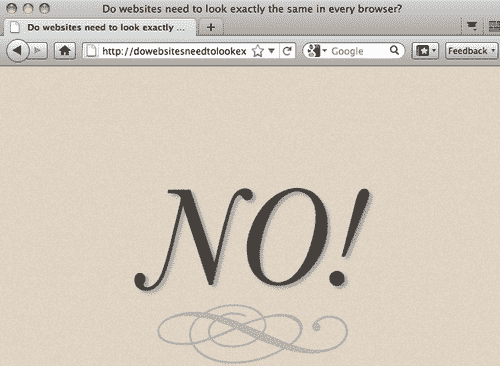
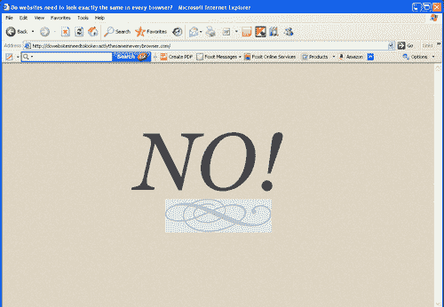
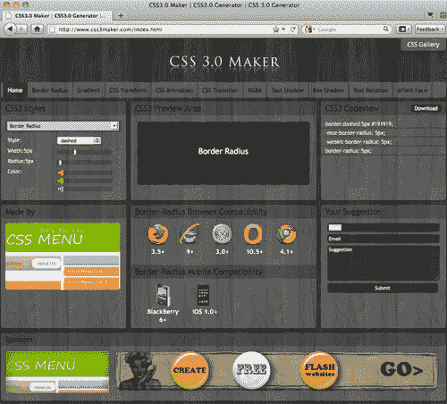
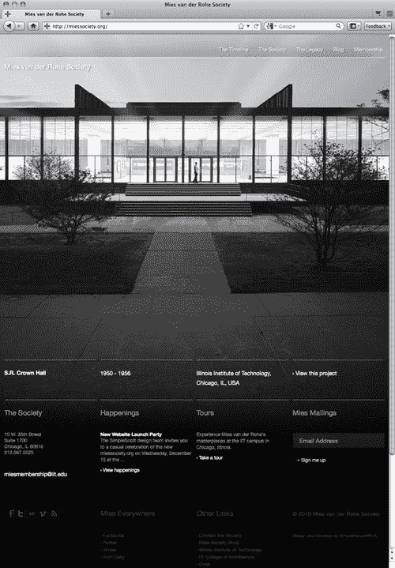
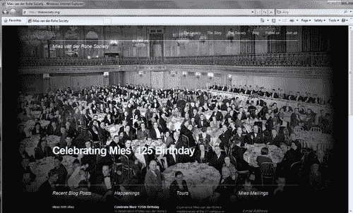
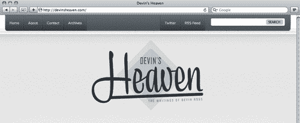
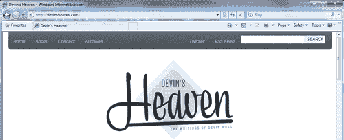
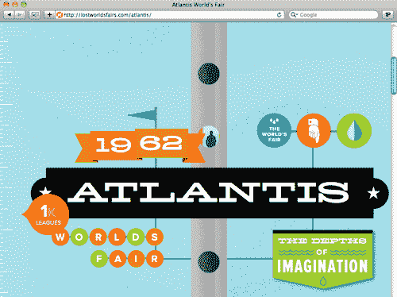
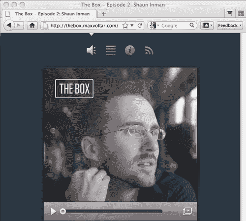
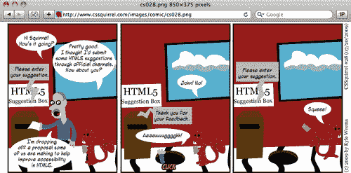

# 三、使用 CSS 样式

在本章中，我们将介绍:

*   将元素设置为`display:block`
*   设置`nav`块元素的样式
*   使用背景大小控制背景外观
*   用`border-radius`添加圆角
*   包括多个背景图像
*   向图像添加框阴影
*   互联网浏览器的样式

# 简介

> “感谢所有的美好时光，IE6。当我们展示一小段 IE 天堂时，在@Mix 再见。-微软的互联网浏览器团队”-在 http://ie6funeral.com 在线看到的来自互联网浏览器 6 葬礼的悼词。

你已经接受了挑战，以不同的方式思考 HTML。接下来，您还将面临扩展级联样式表知识的挑战。与此同时，我们将挑战一些关于跨浏览器显示的假设。如果你——以及你的客户——认为网站在每个浏览器中都应该是一样的，我们会改变一些想法。但是，如果你已经知道跨浏览器显示的谬误，你将是帮助改变别人想法的人。

在我们做这些事情之前，我们需要问自己和客户一个简单的问题:网站需要在每个浏览器中看起来完全一样吗？*需要吗？*要获得简洁、一个字的答案，请在 Chrome、Firefox、Opera 或 Safari 等现代浏览器中访问[http://dowebsitesneedtolookexactlythesameineverybrowser.com](http://dowebsitesneedtolookexactlythesameineverybrowser.com)。



还要检查传统浏览器，如 Internet Explorer 6:



朋友们，这就是死浏览器的样子。看着什么东西死去不是很美好，是吗？

很明显，不同浏览器的网站显示不同。问题是:那又怎样？这重要吗？应该吗？为什么呢？

我们中很少有人在无菌实验室工作，在那里我们可以 100%创造性地控制我们创造的东西的展示。更少的人有时间或倾向于为每个浏览器创建单独的定制体验。肯定有一条中间道路。这位作者非常喜欢一句老话:

> “真相介于两者之间。”- Avadhoot Patwardhan

在这种情况下，事实是你将不得不与你的客户合作，无论他们是企业主、项目经理，还是任何付钱给你为他们创建网站的人。但是，当那些人告诉我们如何工作时，无所事事的日子已经过去了。如果你知道一个更好、更快、更有效的发展方式，你必须大声说出来。这是你的职责。如果你不这样做，没有人会为你说话。这对你不好，对你的客户不好，对这个行业也不好。别做那个人。

相反，你必须教育你的客户为什么有些浏览器显示的东西略有不同，为什么这是完全可以接受的。以下是作者在实际商业环境中使用的一些策略:

1.  向客户演示，适应旧浏览器(尤其是 IE6)需要更长的时间。准备好证明仅仅为那个浏览器开发就可以轻松地花费你四分之一的时间。打客户受伤的地方(钱包)，那个人通常会退让。
2.  Emphasize that the user experience can remain exactly the same even if IE doesn't have every rounded corner or transition effect that other browsers do.

    ### 类型

    用户体验*总是*胜过眼中钉。

CSS 不是 HTML5 规范的正式组成部分。事实上，它值得拥有自己的书。但是在这一章中，作者将向您展示其他人如何使用 CSS 来应用视觉处理的真实例子，方法是将元素显示为块级，模仿导航栏，处理多个背景图像，应用圆角以及添加框阴影等高级样式，以及为互联网浏览器设置样式。

我们去做饭吧！

# 设置要显示的元素:块

默认情况下，现代浏览器将新的 HTML5 元素分配给`display:block`。但也是默认情况下，旧浏览器和大多数版本的互联网浏览器会自动回到`display:inline`。如果你以前使用过 CSS，你会发现麻烦就在一英里之外。我们要做的第一件事是在它成为问题之前解决它。

## 做好准备

首先，让我们确定 HTML5 中的所有新元素。其中包括:

*   `<article>`
*   `<aside>`
*   `<audio>`
*   `<canvas>`
*   `<command>`
*   `<datalist>`
*   `<details>`
*   `<embed>` -不是一个新的标签，但它最终在 HTML5 中验证
*   `<figcaption>`
*   `<figure>`
*   `<footer>`
*   `<header>`
*   `<hgroup>`
*   `<keygen>`
*   `<mark>`
*   `<meter>`
*   `<nav>`
*   `<output>`
*   `<progress>`
*   `<rp>`
*   `<rt>`
*   `<ruby>`
*   `<section>`
*   `<source>`
*   `<summary>`
*   `<time>`
*   `<video>`
*   `<wbr>`

## 怎么做...

我们将从我们通常的页面框架开始，并添加一种样式来制作所有这些新元素`display:block`。

```html
<!DOCTYPE html>
<html lang="en">
<head>
<meta charset="UTF-8">
<title>Blog Title</title>
<!--[if lt IE 9]><script src="http://html5shiv.googlecode.com/svn/trunk/html5.js"> </script>[endif]-->
<style>
article, aside, audio, canvas, command, datalist, details, embed, figcaption, figure, footer, header, hgroup, keygen, mark, meter, nav, output, progress, rp, rt, ruby, section, source, summary, time, video, wbr {display:block;}
</style>
</head>
<body>
</body>
</html>

```

那里。还不算太糟。事实上，好多了。当然，这些也可以包含在 CSS 重置文件中。

## 它是如何工作的...

使用 CSS，我们已经将所有新的 HTML5 元素设置为显示为块级元素，确保了更可预测的浏览器行为。

## 还有更多...

尽管现代浏览器已经将这些新的 HTML5 标记显示为块级元素，但在我们的样式表中再次声明它们`display:block`并不会有任何伤害。安全总比抱歉好。

### 不需要重复，重复，重复，重复，重复

注意:我们应该在我们网站的每个页面引用的外部样式表中包含这一小部分样式，而不是在每个页面的顶部显示它。与其一遍又一遍地重复，不如声明一次，让它在网站的其他地方传播。

### 风格一次

使用这个简单的样式声明，我们可以确保我们的现代、传统和移动浏览器在显示新的 HTML5 元素时表现得更可预测。

### 过去的回声

出于某种原因，一些开发人员不想费心学习 HTML5。你会听到他们滔滔不绝地说规范还没有准备好，不是所有浏览器都完全支持它，以及你需要像 CSS 或 JavaScript 这样的“黑客”来使它工作。那都是胡说八道。不要理会他们的抱怨。你真正听到的是恐龙灭绝的声音。如果一只恐龙由于自身的不作为而被束缚并决心将自己推向灭绝，我们说让它去吧。只有强者才能生存。

记住进化是分阶段发生的是有帮助的。不是所有的生物都会突然进化。与恐龙不同，你可以决定是现在进化，还是以后进化，或者干脆不进化。你可以决定你想站在历史的哪一边。

## 另见

我们没有放火。它一直在燃烧。因为世界在变化。杰弗里·泽尔德曼的文章《让糟糕的浏览器见鬼去吧》在 2001 年出版时震惊了网络开发界*。在书中，现在被广泛认为是网络标准运动教父的泽尔德曼点燃了一代网络设计师和开发人员的怒火，他们将 CSS 用于网络表示层，并留下了残破的遗留浏览器。请在 http://alistapart.com/articles/tohell 阅读这篇开创性的宣言。*

 *# 设置导航块元素的样式

创建 HTML5 规范时，进行了分析并确定最常用的元素之一是`<div id="nav">`或`<div id="navigation">`。有了 HTML5，就不再需要它了。相反，我们有语义丰富的`<nav>`。现在让我们开始设计它。

## 准备

让我们来看看[http://css3maker.com](http://css3maker.com)网站如何使用新的语义丰富的`<nav>`元素。



## 怎么做...

如果我们查看主页的来源，我们会发现这个片段:

```html
<!DOCTYPE html>
<html>
<head>
<meta http-equiv="Content-Type" content="text/html; charset=utf-8" />
<title>CSS3.0 Maker | CSS3.0 Generator | CSS 3.0 Generator </title>
<link href="style/style.css" rel="stylesheet" type="text/css" />
<script type="text/javascript" src="js/CreateHTML5Elements.js"></script>
</head>
<body>
<div class="main_wrapper">
<nav> elementstyling<div id="wrapper">
<nav class="clearfix">
<ul>
<li class="frest"><a href="index.html" title="CSS 3.0 Maker" class="active">Home</a></li>
<li><a href="border-radius.html" title="Border Radius"> Border Radius</a></li>
<li><a href="css-gradient.html" title="Gradient">Gradient</a></li>
<li><a href="css3-transform.html" title="CSS 3.0 Transform">CSS Transform</a></li>
<li><a href="css3-animation.html" title="CSS 3.0 Animation">CSS Animation</a></li>
<li><a href="css3-transition.html" title="CSS 3.0 Transition">CSS Transition</a></li>
<li><a href="css-3-rgba.html" title="CSS 3.0 RGBA">RGBA</a></li>
<li><a href="text-shadow.html" title="Text Shadow">Text Shadow</a></li>
<li><a href="box-shadow.html" title="Box Shadow">Box Shadow</a></li>
<li><a href="text-rotation.html" title="Text Rotation">Text Rotation</a></li>
<li><a href="font-face.html" title="@Font Face">@Font Face</a></li>
</ul>
</nav>
</div>
</div>
</body>
</html>

```

请注意，到目前为止，HTML 标记非常简单。[http://css3maker.com](http://css3maker.com)的团队创建了一个页面包装器，然后使用新的`<nav>`元素来包含包含所有典型导航元素的无序列表。很简单，对吧？接下来让我们把注意力转向他们如何设计它。

```html
<style>
nav {
background: url("img/box_bg.png") repeat scroll 0 0 transparent;
border-radius: 5px;
margin-bottom: 8px;
margin-right: 5px;
}
<nav> elementstylingnav ul {
display: block;
list-style: none outside none;
margin: 0;
padding: 0 0 0 5px;
}
nav ul li.frest {
border-left-width: 0;
}
nav ul li {
border-right: 1px solid #1D1C1C;
display: inline;
float: left;
margin: 0;
padding: 0;
}
nav ul li a {
color: #000;
display: inline;
float: left;
font-size: 13px;
height: 35px;
line-height: 35px;
padding: 0 10px;
text-shadow: 0 -1px 2px #737373;
-webkit-transition: All 0.50s ease;
-moz-transition: All 1s ease;
-o-transition: All 1s ease;
}
</style>

```

## 它是如何工作的...

新的`<nav>`元素不仅成为我们无序列表的容器，还为网络浏览器提供了额外的意义以及可访问性增强。通过浮动`<nav>`元素并显示没有列表样式的无序列表，这允许我们水平显示导航栏。

## 还有更多...

我们还看到了新的 CSS3 `transition`属性的使用。简而言之，这是一种新的浏览器翻转效果，以前只有使用 Flash 或 JavaScript 才能实现。现在，当鼠标在元素上移动时，CSS 可以改变元素的外观。

由于`transition`属性只在浏览器制造商中有实验性的支持，您会看到以单个破折号开头的特定于供应商的前缀，例如:

*   `-webkit`(适用于 Safari 和 Chrome)
*   `-moz`(火狐用)
*   `-o`(歌剧用)

另外，Internet Explorer 有自己的厂商前缀`-ms`。令人费解的是，Chrome 既可以处理`-webkit`前缀，也可以处理自己的`-chrome`前缀。

这些破折号只是表示浏览器制造商正在进行支持工作。请记住，HTML5 和 CSS3 是不断发展的规范。我们现在可以开始使用它们的元素，但是还没有完全的支持。就像我们在为未来做饭。

### 浏览器支持

支持新的`<nav>`元素的网络浏览器:


### 文字-阴影很酷

在前面的代码示例中，您还会注意到新的 CSS3 `text-shadow`属性的巧妙使用，我们在前面的章节中对此进行了深入介绍。

## 另见

对于需要这些新 CSS 属性的特定于浏览器的前缀的任何 CSS3 开发人员来说，[http://cSS3maker.com](http://cSS3maker.com)网站都是一个极好的资源:

*   边框半径
*   梯度
*   CSS 转换
*   CSS 动画
*   CSS 转换
*   RGBA 吗
*   文本阴影
*   箱形阴影
*   文本旋转
*   @font-face

# 使用背景大小控制背景外观

使用 CSS3，我们现在有一种方法来指定背景图像的大小。我们可以用像素、宽度和高度或者百分比来指定这个大小。当您以百分比指定尺寸时，尺寸是相对于我们使用背景原点指定的区域的宽度或高度。



## 做好准备

让我们来看看 http://miessociety.org 的一个真实例子，这是一个由设计师斯科特·托马斯创建的致力于保护建筑师路德维希·密斯·凡·德罗遗产的机构“简单诚实工作”创建的华丽网站。

## 怎么做...

如果我们查看样式表的来源，我们会看到作者为`body`创建了一个规则，然后指定使用的任何背景图像将覆盖整个`body`。

作者还通过在每个`body`元素上附加一个`ID`为每一页指定了一个背景图像。

## 它是如何工作的...

在这里，我们看到创作者如何使用一些简单的样式，包括新的`background-size`属性，在整个页面上拉伸一个大的背景图像，无论您的显示器大小或分辨率如何。

```html
<style>
background appearance controlbackground-size property, workingbody {
background: transparent no-repeat scroll 50% 50%;
background-repeat: no-repeat;
background-size: cover;
margin: 0px;
padding: 0px;
}
body#body_home {
background-attachment: inherit;
background-image: url(http://miessociety.org/site_media/library/ img/crownhall_index.jpg);
background-position: 50% 0%;
}
</style>

```

## 还有更多...

新的`background-size`元素通常以像素、宽度和高度或百分比来指定。在密斯·凡·德·罗协会网站的例子中，我们看到作者使用了“封面”一词，这使得背景图像能够延伸到“覆盖”整个画布。聪明。

### 浏览器支持

支持新`background-size`属性的网络浏览器:


### 在工业工程中可接受

那么，当我们在不受支持的浏览器中使用背景尺寸查看网站时会发生什么呢？在这里，我们可以看到 10 之前版本的 Internet Explorer 如何无法拉伸背景图像，而是简单地用黑色填充画布的其余部分。这是一个完美的例子，它没有在每个浏览器中看起来都一样，但仍然提供了完全令人满意的用户体验。没有一个网站浏览者——即使是使用 IE6 的人——可以合理地抱怨他们没有按照作者的意图体验这个网站。



### 简单的斯科特简直就是石头

在本节中，我们使用了密斯·范德罗厄协会网站的真实例子，该网站使用了新的 CSS3 `background-size`属性，并指出网站作者如何巧妙地适应了旧浏览器的使用。

## 另见

[http://html5rocks.com](http://html5rocks.com)网站以互动演示、代码游乐场、示例和逐步教程为特色，帮助您开发和磨练新的技术技能。有趣的是，这个网站是一个你可以参与的开源项目。学习它，分享它，向前支付它！

# 添加带边框半径的圆角

边框半径很可能成为 CSS3 最常用的新属性。由于在整个网络中使用了如此多的按钮和圆角来包含元素，`border-radius`使得通过 CSS 而不是依靠图像来完成变得容易。下面是如何做到这一点。

## 准备

让我们来看看[http://devinsheaven.com](http://devinsheaven.com)，展示 iPhone 应用设计师和开发者 Devin Ross 的作品和著述。具体来说，我们将研究德文如何设计他的搜索领域。



## 怎么做...

查看 Devin 代码的来源，我们看到简单、直接的表单标记，包含所有典型元素:一个包装器、一个表单、一个标签和两个输入。

```html
<div id="search-form">
<form role="search" method="get" id="searchform" action="http://devinsheaven.com/" >
<div>
<label for="s">Search for:</label>
<input type="text" value="" name="s" id="s" />
<input type="submit" id="searchsubmit" value="Search" />
</div>
</form>
</div>

```

但是 Devin 在他的样式表中接下来要做的是在现代浏览器中实现圆角:

```html
<style>
#navigation-bar #search-form {
background: none repeat scroll 0 0 white;
border-radius: 4px;
margin-left: 180px;
margin-top: 12px;
padding: 2px 6px;
position: absolute;
width: 250px;
}
</style>

```

## 它是如何工作的...

Devin 为搜索表单`ID`指定了一个四像素`border-radius`，它以相同的数量对其所有四个角进行舍入。也可以分别指定每个角的`border-radius`。

## 还有更多...

有趣的是，Opera 浏览器将支持新的 CSS3 `border-radius`属性，而没有特定于浏览器的前缀。干得好，歌剧！谢谢！

### 浏览器支持

支持新`border-radius`风格的网络浏览器:


### 在工业工程中可接受

那么，在不受支持的浏览器中查看 Devin 精心设计的网站会发生什么呢？Internet Explorer 8 和更早版本只是忽略`border-radius`属性，并使角变得方形。同样，这是完全可以接受的，但通常需要你教育你的客户为什么像素完美并不总是一个现实的目标。

在 Internet Explorer 8 中查看的 Devin 的天堂网站。注意正方形搜索表单边框。



### 德文的天堂去 11

在这一节中，我们演示了[http://devinsheaven.com](http://devinsheaven.com)如何使用新的 CSS3 `border-radius`属性来巧妙地绕过搜索栏的角落。我们还研究了作者对特定于浏览器的前缀的使用，以及作者如何选择处理像 Internet Explorer 8 及之前的遗留浏览器。

## 另见

关于新的 CSS3 `border-radius`属性的更多伟大用途，请访问[http://houseofbuttons.tumblr.com](http://houseofbuttons.tumblr.com)。它包括许多设计和开发灵感。

# 包括多个背景图像

[http://benthebodyguard.com](http://benthebodyguard.com)在 2010 年 12 月首次亮相时，互联网上一片哗然。作者用单页版面讲述了一个虚构的名叫本的法国保镖的互动故事。当向下滚动长页面时，多个背景有助于讲述当时即将发布的 iPhone 应用的故事。

## 做好准备

让我们看看[http://benthebodyguard.com](http://benthebodyguard.com)并滚动浏览动画。


## 怎么做...

让我们关注一段源代码，看看网站作者是如何利用多种背景的。

```html
<!doctype html>
<html class="" lang="en">
<head>
<meta http-equiv="Content-Type" content="text/html; charset=UTF-8"/>
<title>Ben the Bodyguard. Coming soon to iPhone® and iPod touch®</title>
<meta name="author" content="Ben the Bodyguard">
<link rel="stylesheet" href="css/style.php?v=1">
</head>
<body class="index">
<div id="container">
<div id="hide-wrapper">
<header>

<h1>A Frenchman <br>protecting your secrets.<br> Yes, seriously.</h1>
<h3>Ben the Bodyguard</h3>
<p>Protecting your passwords, photos, contacts<br> and other sensitive stuff on your iPhone or iPod touch</p>
</header>
<div id="ben">
<div id="speechBubbleWrapper">
<div id='speechBubble'></div>
</div>
<div id="ben-img"></div>
</div>
<div id="hotel">
<div id="hotelanimation"></div>
</div>
<div id="bridge"></div>
<div id="train"></div>
<div id="hideBenInBeginning"></div>
<div id="city">
<div id="thief"></div>
<div id="stolen"></div>
<div id="yakuza"></div>
</div>
</div>
</div>
</body>
</html>

```

到目前为止没有什么异常，除了几个空`divs`。这些是作者用来讲述故事的多个背景图像的容器。您的容器可以包含文本、图像、视频等。

## 它是如何工作的...

通过为这些`divs`中的每一个指定背景图像，网站作者使用了多个 PNG 文件背景图像来创建无缝交互的在线体验。

## 还有更多...

威武之友创建了一系列迷你网站，展示我们在上一章中谈到的一些新的印刷可能性。弗兰克·奇美罗在[http://lostworldsfairs.com/atlantis](http://lostworldsfairs.com/atlantis)创建了一个一页的网站，其工作方式与`http://benthebodyguard.com`网站在多种背景下的工作方式非常相似。当你滚动长长的页面时，你的化身下降到失落的亚特兰蒂斯城。



### 内容在哪里？

查看亚特兰蒂斯失落世界博览会迷你网站的来源，我们看到了一个类似的方法，有多个空`divs`。

```html
<!doctype html>
<html lang="en" class="no-js">
<head>
<meta charset="utf-8">
<title>Atlantis World's Fair</title>
<meta name="Author" content="Friends of Mighty">
<link rel="stylesheet" href="css/all.min.css">
</head>
<body>
<div id="back_to"><a href="http://lostworldsfairs.com">Lost World's Fairs</a></div>
<div id="header">
<div id="img_doc"></div>
<div id="img_ship"></div>
<div class="container">
<p id="txt_below">Below</p>
</div>
<div id="backwave"></div>
<div id="frontwave"></div>
</div>
<div id="tube">
<div class="tube_container">
<div id="tube_dude" class="tube_container"></div>
</div>
<div class="tube_container">
<div id="tube_overlay"></div>
<div id="tube_backtop"></div>
<div id="tube_back"></div>
<div id="tube_fronttop"></div>
<div id="tube_frontbottom"></div>
<div id="tube_front"></div>
</div>
</div>
<div id="depthfinder"><span id="depth-o-meter">0</span> <span id="txt_k">k</span> Leagues</div>
<div id="depthscale"></div>
<div id="content">
<section id="depth1">
<div class="container">
<div id="welcomesign" class="bringFront">
<header>
<h1><span id="txt_date">1962</span> <span id="txt_atlantis">Atlantis</span> <span id="txt_worldsfair">Worlds Fair</span></h1>
<p id="txt_taglines"><span id="txt_worldsfaircircle">The World's Fair</span> <span id="txt_imaginationflag">The Depths Of Imagination</span></p>
</header>
</div>
<aside id="info_1" class="dyk-right">
<div class="didyouknow">

<h4>Did You Know</h4>
<p>Atlantis was<br/> originally built on<br/> the floor of the<br/> sea in 722 BCE<br/> by amphibious<br/> herbivores</p>
</div>
</aside>
</div>
</section>
</div>
</body>
</html>

```

### 坦率点

奇美罗对 http://benthebodyguard.com T2 网站使用了类似的方法，为每一个空的网站指定背景图片，以创造无缝的体验。

## 另见

HTML5 中有太多的新东西，就像是有史以来最好的科技圣诞节。通过访问[http://html5test.com](http://html5test.com)，跟踪你的浏览器支持哪些元素。通过大量浏览器访问该网站会产生令人清醒的结果。

# 给图像添加方块阴影

以前，只有使用第二个图像作为阴影或使阴影本身成为图像的一部分，才有可能在图像下方或周围产生类似阴影的视觉效果。问题是，如果你想调整阴影，你必须把它去掉。让我们看看使用 CSS3 的一种现代、智能的方法。

## 做好准备

在[http://thebox.maxvoltar.com](http://thebox.maxvoltar.com)查看视觉元素周围迷人而微妙的阴影。作者蒂姆·范·达姆应用了新的 CSS3 `box-shadow`属性。



## 怎么做...

让我们检查一下样式，看看蒂姆是如何实现这种漂亮简单的效果的:

```html
<style>
section {
background: none repeat scroll 0 0 #EAEEF1;
border: 1px solid #FFFFFF;
box-shadow: 0 2px 10px rgba(0, 0, 0, 0.5);
margin: 0 auto;
padding: 49px;
position: relative;
width: 300px;
z-index: 50;
}
</style>

```

除了其他样式，我们可以清楚地看到`box-shadow`属性为阴影指定了颜色和扩散距离。

## 它是如何工作的...

新的 CSS3 `box-shadow`属性的语法与`text-shadow`属性相同。也就是说，网站作者在照片周围应用了一个阴影，右边两个像素，底部十个像素，不透明度为 50%。

### 浏览器支持

支持新`box-shadow`风格的网络浏览器。


### 无知是幸福

不支持新 CSS `box-shadow`属性的浏览器直接忽略规则，不会显示阴影。外观略有改变，但用户体验没有改变。没有伤害，没有犯规。

### 盒子的盒子阴影

在这一节中，我们演示了作者蒂姆·范·达姆如何使用新的 CSS3 `box-shadow`属性在他的采访网站周围创建微妙的阴影效果。

## 另见

当为自己的项目创建样式表时，您完全可以创建一个 CSS 来管理它们，或者为移动和/或打印机友好页面创建单独的定制体验。但是当你不能完全控制的时候会发生什么呢？那么很高兴知道我们有像[http://printfriendly.com](http://printfriendly.com)这样的工具来为我们做这件事。

# 互联网浏览器的样式

现在应该很明显，作者强烈主张为现代浏览器提供最佳的 CSS3 体验，让旧版本的 IE 为所欲为。如果一个元素在旧浏览器中缺少圆角或阴影，作者当然不会在意。但事实是你的客户可能会。让我们打开一个蠕虫罐头，谈谈如何适应死浏览器。

## 准备

我们将看一系列具体的方法，让 IE 在使用像`border-radius, box-shadow`和`text-shadow`这样的新 CSS3 属性时有所表现。

## 边界半径

在旧版本的 IE 中实现圆角是可能的。让我们访问[http://html remix . com/CSS/curve-corner-border-radius-cross browser](http://htmlremix.com/css/curved-corner-border-radius-cross-browser)了解一下如何操作。在这里，我们将学习如何在样式表中包含一个`.htc`行为:

```html
<style>
.curved {
-moz-border-radius: 10px;
-webkit-border-radius: 10px;
behavior: url(border-radius.htc);
}
<style>

```

注意`.htc`文件是代码膨胀，这个行为会导致你的 CSS 无法验证。

## 框影

我们可以通过使用专有过滤器来强制 IE 显示【T0:

```html
<style>
.box-shadow {
-moz-box-shadow: 2px 2px 2px #000;
-webkit-box-shadow: 2px 2px 2px #000;
filter: progid:DXImageTransform.Microsoft.Shadow(color='#000', Direction=145, Strength=3);
}
</style>

```

不幸的是，你将不得不摆弄过滤器，以实现阴影的方向和黑暗。注意这个滤镜没有新的 CSS3 `box-shadow`属性强大。

## 文字-阴影

让`text-shadow`在 9 版之前的版本中工作的唯一方法似乎是使用类似于[http://scriptandstyle . com/submissions/text-shadow-in-ie-with-jQuery-2](http://scriptandstyle.com/submissions/text-shadow-in-ie-with-jquery-2)的 jQuery 插件来实现通过 JavaScript 的外观。请注意，强制 JavaScript 执行 CSS 的工作从来都不是一个好方法，这种技术只会导致代码膨胀。

## 注

虽然在 IE 的旧版本中有几种类似 CSS3 的效果，但不推荐使用。每一个都需要额外的开发类型，并且会对浏览器性能产生影响。使用风险由您和您的客户自己承担。

## 另见

凯尔·威姆斯创作了一部非常棒的每周漫画，讽刺了网络标准世界在 http://cssquirrel.com 的发展。HTML5、CSS3、Twitter、可访问性，以及那些世界中重要的主要声音，对凯尔经常扭曲的幽默感来说已经成熟了。

*