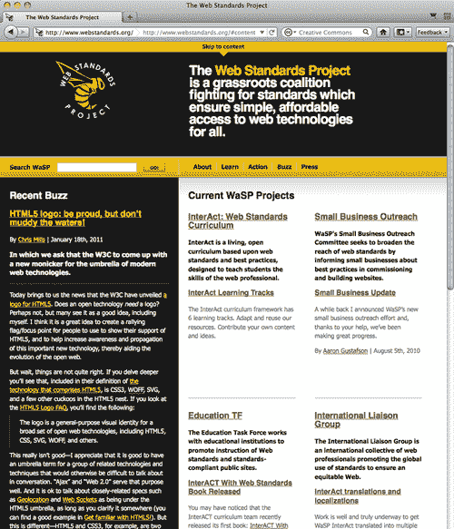
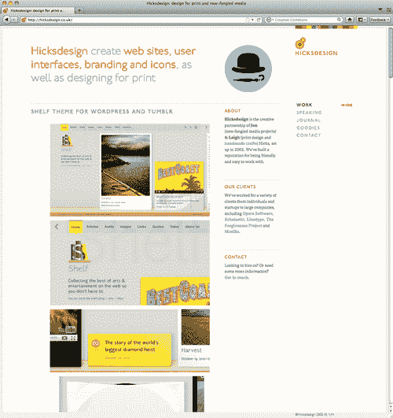
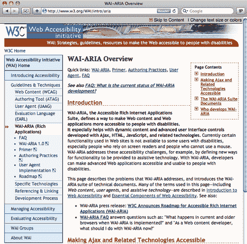

# 第四章。创造无障碍体验

在本章中，我们将介绍:

*   测试浏览器支持
*   添加跳过导航
*   添加元标签
*   在标签中为屏幕阅读器使用语义描述
*   提供备用站点视图
*   使用`hgroup`创建可访问的标题区域
*   为不支持的浏览器显示替代内容
*   利用 WAI-ARIA

# 简介

> "好的无障碍设计就是好的网页设计."

到目前为止，我们已经谈论了很多关于语义网编码和 HTML5 允许我们将这种命名方法提升到一个我们以前无法达到的新水平的方式。我们的大部分讨论都集中在语义 web 编码如何让我们作为 web 开发人员的工作更容易、更快、更有意义。

在这一章中，我们将把注意力转向语义网编码如何改善我们观众的在线体验。现在，应用语义标签——有意义而不仅仅是表象的标签——对于屏幕阅读器和那些依赖它们来浏览我们创建的网站、应用和界面的人来说变得更加重要。

如果你曾经为军队、学术机构或任何从美国联邦政府获得资金的人编写过网站、应用或界面，你应该听说过 508 条款。

与 HTML 或 CSS 验证不同，第 508 节验证的工作方式不同。在 HTML 或 CSS 中，代码要么有效，要么无效。它是二进制的。第 508 条并非如此。在这种情况下，有三个不同的验证级别，每个级别都更加难以达到。

在本章中，我们将研究如何使用 HTML5 来测试浏览器支持，添加跳过导航和元标签，在标签中为屏幕阅读器使用语义描述，提供替代站点视图，使用新的 HTML5 `hgroup`元素来创建可访问的标题区域，为不支持的浏览器显示替代内容，以及使用 WAI-ARIA。

现在。我们去做饭吧！

# 测试浏览器支持

让我们从使用开源的 Modernizr 项目开始，该项目位于:http://modernizr.com，由开发人员 Faruk Ates 和 Paul Irish 创建。该网站称，Modernizr 使用特征检测来测试当前浏览器即将推出的功能。

### 类型

Modernizr 概念的目标是特征检测，而不是浏览器检测。这是一个微妙但重要的区别。Modernizr 方法不是做出宽泛的假设，而是检测浏览器支持的功能。


## 怎么做...

下载 Modernizr JavaScript 文件，并在标记的`head`部分引用它。然后将“no-js”类添加到您的`body`元素中，如下所示:

```html
<!DOCTYPE html>
<html lang="en">
<head>
<meta charset="UTF-8">
<title>Title</title>
<!--[if lt IE 9]><script src="http://html5shiv.googlecode.com/svn/trunk/html5.js"> </script>[endif]-->
<script src="modernizr-1.6.min.js"></script>
</head>
<body class="no-js">
</body>
</html>

```

## 它是如何工作的...

在标记中包含该脚本和简单的 body 类使 Modernizr 能够检测到 web 浏览器支持以下哪些项目。然后，它将添加类和一个 JavaScript API 来检测对某些特性的支持。如果给定的浏览器不支持这些功能，Modernizr 就不会添加它们。

*   @font-face
*   帆布
*   画布文本
*   HTML5 音频
*   HTML5 视频
*   rgba()
*   hsla()
*   边框图像:
*   边界半径:
*   框影:
*   文字-阴影:
*   不透明度:
*   多重背景
*   柔性盒模型
*   CSS 动画
*   CSS 列
*   CSS 渐变
*   CSS 反射
*   CSS 2d 变换
*   CSS 3d 变换
*   CSS 过渡
*   地理定位应用编程接口
*   localStorage
*   本地存储
*   挽救（saving 的简写）
*   同步化多媒体整合语言(Synchronous Multimedia Integrate Language)
*   svg clipping
*   内联 SVG
*   拖放
*   hashchange
*   窗口信息
*   历史管理
*   应用缓存
*   触摸事件
*   网络套接字
*   网络工作者
*   网络数据库
*   web GL(web GL)
*   indexeddb
*   输入类型
*   输入属性

## 还有更多...

Modernizr 2 测试版新增了自定义 JavaScript 下载的功能。所以现在如果你不关心某个特定的特性(比如拖放)，你可以取消选中它，而不用让 Modernizr 检查它。在 http://modernizr.github.com/Modernizr/2.0-beta 阅读全部内容。

### 着眼于未来

从网站:

> “Modernizr 是一个小而简单的 JavaScript 库，它可以帮助您利用新兴的 web 技术(CSS3、HTML5)，同时仍然保持对可能尚不支持这些新技术的旧浏览器的精细控制。”

### 现代真正做的是什么

Modernizr 不做的是添加或启用浏览器中不存在的功能。例如，如果您的浏览器不支持输入属性，Modernizr 不会以某种方式自动将该功能添加到您的浏览器中。那是不可能的。它只是让作为开发人员的你知道你能做什么。

### 为了正确的理由去做

有一些网络开发者使用 Modernizr，因为他们在某个地方读到一篇文章，说他们应该使用它。那很好，但是你比他们聪明。您将看到，如果浏览器本身不支持某些属性，在浏览器中检测到这些能力如何更好地通知您如何提供可访问的体验。你又聪明又帅！

## 另见

为了进一步阅读，作者吉尔·芬克(Gil Fink)在[为微软写了一篇简单但简洁的文章](http://blogs.microsoft.co.il/blogs/gilf/archive/2011/01/09/detecting-html5-features-using-modernizr.aspx)[“使用 Modernizr 检测](http://"Detecting) *HTML5 功能”*，网址为 http://blogs . Microsoft . co . il/blogs/gilf/archive/2011/01/09/Detecting-html 5-Features-use-Modernizr . aspx。

# 添加跳过导航

跳过导航等重复元素的能力对那些使用屏幕阅读器的人是有益的。想象一下，当你访问一个网站时，在进入主要内容之前，你阅读了每一个导航元素。那会很烦人，不是吗？对那些使用屏幕阅读器的人来说也是如此。让我们看看一个简单的方法，不惹恼我们的一部分观众。

## 做好准备

在这个例子中，我们要做的是创建一个简单但特殊的隐形锚，它将为我们的屏幕读者朋友提供跳过我们的导航并直接进入好东西的选项:我们的网站内容。

## 怎么做...

如果你已经使用 HTML 有一段时间了，毫无疑问你已经在某个时候创建了一个跳过导航。大概是这样的:

```html
<a class="skip" href="#content">Skipnav</a>

```

您的 CSS 将包含类似这样的内容，以使锚点不可见:

```html
.skip {display: none}

```

第一个`div`包含你的主要内容，然后包括另一个看起来像这样的隐形锚:

```html
<h2><a name="content"></a></h2>

```

多年来一切都很好。效果很好。而且在 HTML5 里面也应该可以用，对吧？你猜怎么着？它没有。让我们看看为什么。

## 它是如何工作的...

在 HTML5 中，锚点标签的`name`属性不再有效。还记得我在第一章中所说的关于创建 HTML5 规范的方法是“为牛仔铺路吗？”这次不行。这次豇豆被去掉了。所以我们现在要做的是:

我们将保留最初的标记:

```html
<a class="skip" href="#content">Skipnav</a>

```

我们将保留隐藏锚点的那部分 CSS:

```html
.skip {display: none}

```

但是下面是我们要用第二个标记做的不同之处:

```html
<h2 id="content"></h2>

```

当我们移除锚点时，我们将它的属性从`ID`重命名为`name`，并将其添加到`h2`中。现在它工作了，并且在 HTML5 规范中有效。放轻松！

## 还有更多...

跳过导航的能力是我们开发人员为支持不同能力的受众所能做的最常见且最容易实现的事情之一。考虑重新访问您开发的旧网站，更新(或添加)跳过导航，将`DOCTYPE`切换到 HTML5，您就可以使用最新的技术，同时仍然支持可访问性。

### 全面的浏览器支持

幸运的是，所有主要的网络浏览器都支持跳过导航。作者在这样的书里不能经常这么说，所以这是一种解脱！

### 少等于多

在不久的将来，当屏幕阅读器更新时，我们将能够使用网络可访问性计划-可访问的丰富互联网应用角色，并使用新的`nav`元素来实现同样的事情，而不是创建通过显式链接跳过导航的能力。加价越少越好！

http://webstandards.org的网络标准项目网站采取了一种有趣的方法，当有视力的用户悬停在上面时，只显示跳转`nav`。



## 另见

[http://html5accessibility.com](http://html5accessibility.com)是一个非常棒的资源，提供了关于哪些新的 HTML5 元素在网络浏览器中以及那些使用辅助技术的人可以访问的信息。

# 添加元标签

> “语言标签标识人类为了向其他人类传达信息而说、写或以其他方式传达的自然语言。计算机语言被明确排除。HTTP 在接受语言和内容语言字段中使用语言标签。”-万维网联盟的超文本传输协议规范

## 做好准备

如果您正在考虑您或您客户的网站的可访问性(您应该这样做！)您需要确保使用屏幕阅读器的人能够以您想要的语言向他们阅读您的信息。我们将看看如何做到这一点。

## 怎么做...

首先，确定您希望网站阅读的语言。它可以是英语、法语、克林贡语或任何组合。参见以下最受欢迎的内容语言列表:[http://dev files . myopera . com/articles/554/httpaders-content lang-URL . htm](http://devfiles.myopera.com/articles/554/httpheaders-contentlang-url.htm)。

## 它是如何工作的...

我们的通用模板中已经有了一个英语内容语言元标签:

```html
<!DOCTYPE html>
<html lang="en">
<head>
<meta charset="UTF-8">
<title>Title</title>
<!--[if lt IE 9]><script src="http://html5shiv.googlecode.com/svn/trunk/html5.js"> </script>[endif]-->
<script src="modernizr-1.6.min.js"></script>
</head>
<body class="no-js">
</body>
</html>

```

简单的`<html lang="en">`就是我们所需要的，以确保我们的网站能够被英文阅读。为其他语言改变这一点再简单不过了。如果你是《星际迷航》的超级粉丝，用`<html lang="fr">`表示法语，用`<html lang="x-klingon">`表示英语。注意，克林贡语例子中的`x- prefix`表示实验语言。

## 还有更多...

您还可以通过对英语和法语使用类似于:`<html lang="en, fr">`的内容来指定多种语言。请注意在值周围使用引号，因为我们引用了多个值。

### 楚在说什么？

> 注意:“如果未指定内容语言，则默认内容面向所有语言受众。这可能意味着发送者不认为它是特定于任何自然语言的，或者发送者不知道它是针对哪种语言的。”-万维网联盟的超文本传输协议规范

### 一切都回到 SEO

指定一种内容语言对搜索引擎也是有益的，并使它们能够用我们想要的语言解析我们的内容。我们当中谁不能使用更多的搜索引擎优化呢？

### 是我做的吗？

如果不指定元语言，最糟糕的情况会是什么？没什么，对吧？错了。事实证明，如果我们不指定元语言，我们的死对头互联网浏览器的旧版本将试图猜测你想要的语言。正如我们已经看到的，有时 IE 会猜错。根据这篇文章，无害的用户输入可以变成活动的 HTML 并可能执行，导致安全漏洞:[http://code.google.com/p/doctype/wiki/ArticleUtf7](http://code.google.com/p/doctype/wiki/ArticleUtf7)。

## 另见

[http://section508.gov](http://section508.gov)是美国法典第 508 节规范的官方网站。虽然我们网络开发者主要关注的是 508 条款如何适用于网络，但实际上它是一套更广泛的法律，定义了我们美国人如何适应虚拟世界和现实世界中不同能力的人。

# 在标签中为屏幕阅读器使用语义描述

语义网开发的方法不仅对我们这些开发网站、应用和界面的人有意义，对那些使用我们创造的体验并与之互动的人也有意义。

## 做好准备

让我们回顾一下 HTML5 规范中一些新的、语义更丰富的标签。

## 怎么做...

新的 HTML5 标签包括:

*   `<article>`
*   `<aside>`
*   `<audio>`
*   `<canvas>`
*   `<datalist>`
*   `<details>`
*   `<embed>` -不是新标签，但最终在 HTML5 中验证
*   `<figcaption>`
*   `<figure>`
*   `<footer>`
*   `<header>`
*   `<hgroup>`
*   `<keygen>`
*   `<mark>`
*   `<meter>`
*   `<nav>`
*   `<output>`
*   `<progress>`
*   `<rp>`
*   `<rt>`
*   `<ruby>`
*   `<section>`
*   `<source>`
*   `<summary>`
*   `<time>`
*   `<video>`
*   `<wbr>`

## 它是如何工作的...

在该列表中，以下新标签可以支持文本:

*   `<article>`
*   `<aside>`
*   `<datalist>`
*   `<details>`
*   `<figcaption>`
*   `<figure>`
*   `<footer>`
*   `<header>`
*   `<hgroup>`
*   `<keygen>`
*   `<mark>`
*   `<nav>`
*   `<output>`
*   `<section>`
*   `<source>`
*   `<summary>`
*   `<time>`
*   `<wbr>`

该列表代表了绝大多数可用的新 HTML5 标签。使用这些更多语义标签的简单行为将为屏幕阅读器增加额外的意义和智能。

## 还有更多...

以下新标签还为我们提供了创建更丰富、语义更有意义的体验的机会:

*   `<audio>`
*   `<embed>`
*   `<progress>`
*   `<video>`

### 时刻提升

调查您已经启动的具有可访问性要求的项目。如果您仍然能够更新它们，这是重新访问它们以添加更多语义上有意义的标记的黄金机会。记住:仅仅因为一个站点、应用或界面已经启动，并不意味着你以后不能重新访问它。如果一个项目在启动时是无用的，这是更新它然后重新启动它的最佳时机。谁知道呢？它可能会成为你另一份工作的完美投资组合！得分！

### 好的搜索引擎优化的语义

使用越来越多的语义和有意义的标签不仅对那些使用屏幕阅读器的人有好处，而且对搜索引擎优化也有好处，因为搜索引擎将能够更智能地解析和理解您的代码。

### 格雷格终于学会了

语义网开发对其他开发人员也有好处。如果你用`<nav>`标记对一个区域进行编码，那么当前在你的团队中或者将来在你的项目中工作的另一个开发人员会立即理解你的意图。作者曾经和一个开发人员一起工作，他对一些与香蕉无关的东西使用了像`<div id="banana">`这样荒谬的命名。那个开发人员认为这是一种工作保障，因为他是唯一一个知道某些标签是什么意思的人。不幸的是，多年后，当编辑他以前创作的东西时，这种方法对他来说变得痛苦，他记不起它的意思。教训？不要勾掉你未来的自己！

## 另见

[http://caniuse.com](http://caniuse.com)提供了 HTML5、CSS3、SVG 等在桌面和移动浏览器中的兼容表。该网站对于理解哪些新标签可以被支持是一个无价的帮助。它不断更新，不仅值得书签，而且值得反复参考。

# 提供备用站点视图

总部位于马萨诸塞州剑桥的网站开发者伊桑·马科特创造了一种他称之为“响应性网页设计”的方法，以支持具有不同尺寸显示器的台式计算机以及移动设备——所有这些都有一个代码库。虽然这种方法不是必需的，但它可以被视为创造无障碍体验的另一步。让我们仔细看看他的方法。

## 做好准备

马科特在 2010 年 5 月 25 日的《名单之外》上发表了这篇文章，发布时间:[http://alistapart.com/articles/responsive-web-design](http://alistapart.com/articles/responsive-web-design)。阅读这篇文章会让你在理解这一部分的其余部分上有一个好的开端。

## 怎么做...

让我们仔细看看乔恩·希克斯在[http://hicksdesign.co.uk](http://hicksdesign.co.uk)的投资组合，这是马科特工作方法的一个引人注目的例子。

希克斯的作品集在 27 英寸显示器上显示为全幅。


调整窗口大小会导致站点从四列折叠到三列:



调整窗口大小进一步导致网站从三列折叠到两列:


调整窗口大小会进一步导致站点从两列折叠为一列:


## 它是如何工作的...

通过使用灵活的网格以及样式表中的`min-width`和`max-width`值，希克斯创建了一种可以轻松适应不同显示大小的体验。让我们看看它是如何完成的。

## 还有更多...

这种灵活的前端 web 开发的新方式允许我们创建不管设备分辨率如何都能工作的体验。多亏了 Marcotte，我们不再被迫为每台设备创造单独的体验。当前状态:编码一次，处处显示。

我们从一个流畅的网格开始，该网格具有可以适应任何可用屏幕空间的列、灵活的图像，并允许媒体查询根据分辨率和视口提供独特的样式表。

以下是一个示例媒体查询:

```html
@media screen and (max-width: 600px) {
body {
font-size: 80%;
}
#content-main {float: none; width: 100%;}
}

```

你可以很容易地看到我们在说，当设备最大宽度为 600 像素时，我们在告诉`body`以字体高度的 80%显示字体。我们还规定内容主`div`将是一个 100%宽度的单列。如果设备的最大宽度为 601 像素或更大，这些规则将被忽略。请注意，由于此媒体查询指定了屏幕，如果用户打印页面，这些规则也将被忽略。

### 最小宽度

可以想象，如果我们能够像这样为窄宽度指定样式，您也可以为宽得多的宽度指定其他样式，例如:

```html
@media screen and (min-width: 1024px)

```

请注意，在我们的媒体查询中，我们仍然以屏幕为目标，但是现在我们说只有当视口*大于【1024 像素时，才应用一些样式。*

### 我的数学老师是对的

那些习惯于使用像 Grid960 这样的刚性固定网格布局系统的人可能会发现，使用灵活的网格首先是一种精神挑战。正如马科特所解释的:

> “网格的每个方面——以及放置在其上的元素——都可以表示为相对于其容器的比例。”

我们可以将基于像素的宽度转换为百分比，以便无论显示的大小如何，我们的比例都保持不变。让我们从一个简单的例子开始:假设我们的`header`是 600 像素宽，我们想要在 1200 像素宽的设备上显示它。如果等式是目标÷上下文=结果，那么 600 ÷ 1200 = .5。我们的 CSS 看起来像这样:

```html
header {width: 50%; /* 600px / 1200px = .5 */}

```

那很简单。但是如果你想以 960 像素的宽度显示 510 像素宽的不同`header`呢？简单除法就剩下这个:510 ÷ 960 = .53125。我们可以这样调整我们的 CSS:

```html
header {width: 53.125%; /* 510px / 960px = .53125 */}

```

重复这个过程，将你的每个宽度定义为整体的一部分，你将很好地实现许多设备的响应显示。

### 越大总是越好吗？

流体图像甚至更容易，因为没有数学可做。相反，只需包含:

```html
img {max-width: 100%;}

```

并且这些图像永远不会超出您的显示器或设备的宽度。

将这三种技术结合在一起，可以为用户在多个平台、浏览器甚至屏幕阅读器上创造一种几乎无缝的网站体验。

## 另见

2011 年，马科特在[http://books.alistapart.com/products/responsive-web-design](http://books.alistapart.com/products/responsive-web-design)出版了以响应性网页设计为主题的权威书籍。

# 使用组创建可访问的标题区域

记得`hgroups?`你当然记得。我们在上一章中把这些看作是对相关标题标签进行逻辑分组的一种方式。现在，我们将看看新的 HTML5 元素如何增加可访问性的好处。

## 做好准备

之前，我们以罗珊妮的投资组合为例:

```html
<!DOCTYPE html>
<html lang="en">
<head>
<meta charset="UTF-8">
<title>Roxane</title>
<!--[if lt IE 9]><script src="http://html5shiv.googlecode.com/svn/trunk/html5.js"> </script>[endif]-->
</head>
<body>
<header>
<hgroup>
<h1>Roxane is my name.</h1>
<h2>Developing websites is my game.</h2>
</hgroup>
</header>
</body>
</html>

```

在过去，我们可能会这样编码她的站点的身体区域:

```html
<body>
<div>
<div>
<h1>Roxane is my name.</h1>
<h2>Developing websites is my game.</h2>
</div>
</div>
</body>

```

## 怎么做...

对于屏幕阅读器来说，过时的第二个例子在语义上毫无意义。除了在同一个`div`之外，它不知道那些标题标签有任何关系。

## 它是如何工作的...

现在，感谢 WHATWG 在[http://whatwg.org/html5](http://whatwg.org/html5)的 HTML5 草案标准，我们——和屏幕读者——理解`hgroup`是一组相关的标题。你问什么？如果你不能依靠视觉来知道这些标题是相关的，难道你不想要一些其他的机制——比如屏幕阅读器——来让你知道它们是相关的吗？

## 另见

[http://diveintoaccessibility.org](http://diveintoaccessibility.org)是学习更多关于 508 条款和无障碍标准的 30 天分步资源。作者马克·皮尔格林(也是[http://diveintohtml5.org 的*深入 HTML5* 的作者)](http://diveintohtml5.org))提供了按人、残疾、设计原则、网络浏览器和发布工具分类的简单易懂的提示。这个网站已经有几年的历史了，但是因为这些年来无障碍标准没有太大的变化，它仍然是一个无价的免费资源。

# 显示不支持的浏览器的替代内容

一些新的 HTML5 元素太新了，还不是所有的桌面浏览器都支持它们。那么我们怎么能假设所有的屏幕阅读器都会支持它们呢？

## 做好准备

幸运的是，我们可以放心，屏幕阅读器将支持常见的文本标签，例如:

*   `<h1>`
*   `<h2>`
*   `<h3>`
*   `<h4>`
*   `<h5>`
*   `<h6>`
*   `<p>`
*   `<ul>`
*   `<ol>`
*   `<li>`
*   `<dl>`
*   `<dt>`
*   `<dd>`

并且更符合预期。但是那些新的 HTML5 元素呢，比如:

*   `<article>`
*   `<aside>`
*   `<audio>`
*   `<canvas>`
*   `<datalist>`
*   `<details>`
*   `<figcaption>`
*   `<figure>`
*   `<footer>`
*   `<header>`
*   `<hgroup>`
*   `<mark>`
*   `<meter>`
*   `<nav>`
*   `<output>`
*   `<progress>`
*   `<section>`
*   `<summary>`
*   `<time>`
*   `<video>`

这些会按照我们的意图向用户传达意义吗？如果是这样，太好了。但如果没有，用户得到了什么信息呢？有意义吗？当然，我们会同意我们最不希望的是通过我们的新标签提供更少的意义。即使是盲人也能看出这将是一次巨大的失败。

## 怎么做...

在撰写本文时，许多 HTML5 元素向屏幕阅读器提供的语义信息至少与`div`相同。让我们更具体地看看每一个新元素:

*   `<article>` -与 a `div`相同的语义信息。
*   `<aside>` -与 a `div`相同的语义信息。
*   `<details>` -与 a `div`相同的语义信息。
*   `<figcaption>` -与 a `div`相同的语义信息。
*   `<figure>` -与 a `div`相同的语义信息。
*   `<footer>` -与 a `div`相同的语义信息。
*   `<header>` -与 a `div`相同的语义信息。
*   `<hgroup>` -与 a `div`相同的语义信息。
*   `<meter>` -与 a `div`相同的语义信息。
*   `<nav>` -与 a `div`相同的语义信息。
*   `<output>` -与 a `div`相同的语义信息。
*   `<progress>` -与 a `div`相同的语义信息。
*   `<section>` -与 a `div`相同的语义信息。
*   `<summary>` -与 a `div`相同的语义信息。

然而，对于其他新的 HTML5 元素来说，它们的含义对屏幕读者来说并不那么清楚:

*   `<audio>` -语义信息看似一致，但 Firefox 内置的滑块控件有问题，Internet Explorer 9 只有部分播放/暂停支持，Opera 有不错的键盘支持，但没有实际的辅助技术支持。
*   `<canvas>` -几乎没有为辅助技术提供可用的语义信息。任何依赖新的 HTML `<canvas>`元素来传递信息的人都必须非常小心。故意让观众站在门口，无法进入。
*   `<datalist>` -只能在 Opera 中使用的键盘。
*   `<mark>` -不提供额外的语义信息。
*   `<time>` -仅在 Opera 中有缺陷的键盘可访问性。
*   `<video>` -语义信息看似一致，但 Firefox 内置的滑块控件有问题，Internet Explorer 9 只有部分播放/暂停支持，Opera 有不错的键盘支持但没有实际的辅助技术支持。

## 它是如何工作的...

目前，在屏幕阅读器能够赶上所有新的 HTML5 元素之前，在决定我们打算使用这些新标签中的哪一个以及我们打算用它们向那些使用辅助技术的人传达什么意思时，必须小心。

## 另见

艾米丽·刘易斯不仅对 HTML 和 CSS 感到兴奋，还对可用性、语义和可访问性感到兴奋。她是那种热情的倡导者，为了前端网络开发世界的繁荣，我们更需要她。有关如何在 http://msdn.microsoft.com/en-us/scriptjunkie/ff743762.aspx 开始思考可访问性的未来的信息，请参见她出色的《网络可访问性和 WAI-ARIA 入门》。

# 使用 WAI-ARIA

通过使用技术，我们已经开发了在浏览器窗口中动态更新信息的方法，而无需从服务器手动刷新页面。对于一个有视力天赋的人来说，这是一个福音，可以更快、更有效地检索信息。但是当一个人看不见的时候会发生什么呢？他们如何知道页面上的信息已经以任何方式更新，而不刷新页面，重新显示其内容，并让辅助技术再次向他们完整地阅读它？

## 做好准备

可访问的丰富互联网应用(WAI-ARIA)是一个新兴的技术规范，像许多 HTML5 的新语义标签一样，它迫使我们真正思考我们的内容以及我们希望如何将其呈现给我们的受众。我们可以使用 WAI-ARIA 来定义角色、属性和状态，以帮助我们定义元素应该做什么。

http://w3.org/WAI/intro/aria 的 WAI-ARIA 概览，基于马科特的响应性网页设计方法。



## 怎么做...

还记得我们是如何在罗珊妮的投资组合中加入新的 HTML5 元素的吗？下面是我们如何使用 WAI-ARIA 来添加额外的含义:

```html
<!DOCTYPE html>
<html lang="en">
<head>
<meta charset="UTF-8">
<title>Roxane</title>
<!--[if lt IE 9]><script src="http://html5shiv.googlecode.com/svn/trunk/html5.js"> </script>[endif]-->
</head>
<body>
<header>
<hgroup>
<h1>Roxane is my name.</h1>
<h2>Developing websites is my game.</h2>
</hgroup>
</header>
<nav role="navigation">
<ul>
<li><a href="#About">About</a></li>
<li><a href="#Work">Work</a></li>
<li><a href="#Contact">Contact</a></li>
</ul>
</nav>
</body>
</html>

```

因为不是每个浏览器都理解`nav`标签，也不是每个浏览器都理解它的角色。WAI-ARIA 为我们提供了这样做的方法。`role="navigation"`被命名为“地标角色”，它为一个没有视力的人做了一个实际的地标为现实世界中有视力的人做的事情:它让他们知道他们在哪里。

## 它是如何工作的...

现在，即使是那些没有网站的人也可以通过这些标志性的角色意识到页面上的某些东西发生了变化。WAI-ARIA 通过“观察”更新来通知用户这些动态页面变化。不重新阅读整个屏幕，只显示新信息。

## 还有更多...

WAI-ARIA 允许我们创建复杂的、数据驱动的对象，如下拉菜单、选项卡、滑块、文件树，以及多年来视力正常的用户已经习惯的其他对象，并通过使用这些角色来确保即使那些在内容更新时看不到内容的人也会被通知它已经这样做了。

### 仍在等待浏览器支持

总有蹊跷，对吧？这种情况下的问题是，像本书中描述的许多其他 HTML5 特性一样，并非所有辅助技术浏览器都完全支持 WAI-ARIA。无论我们作为开发人员多么勤奋和善意，如果我们的目标受众没有 WAI-ARIA 支持的最新浏览器，他们将不会收到我们希望他们拥有的信息。

### 这就是我的角色

还有一个问题:错误地使用 WAI-ARIA 实际上会使情况变得更糟。如果一个比你少的开发人员将`role="navigation"`分配给一些经常更新的内容，但是给了用户跳过导航的能力，那么该用户将永远不知道信息正在被更新。幸运的是，这可能永远不会发生在你身上，因为你会在同行代码评审中发现这个错误。权力越大，责任越大。

### 可达性优先

如果您有一个正在开发的网站，并且您必须支持不同能力的人，那么在最初的启动会议上必须非常小心，以确保他们的需求得到满足。最容易获得成功的项目是那些从一开始就考虑到人们需求的项目。试图在最后吹嘘一套功能只是另一种让你自己和你的项目失败的方式。我们要么让人们和项目成功，要么让他们失败。你会怎么做？

## 另见

关于如何利用 WAI-ARIA 构建一个更容易访问的网络的进一步阅读，请参见斯科特·吉尔伯森的这篇优秀的网络猴子文章。

Gilbertson 后来写了一个很棒的资源，使用 ARIA 角色设计网站，网址是:[http://webmonkey . com/2011/01/style-网页-with-ARIA-landmark-roles](http://webmonkey.com/2011/01/styling-webpages-with-arias-landmark-roles)。