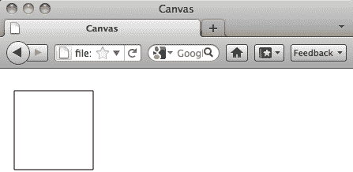
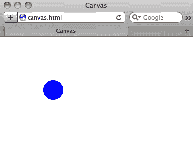
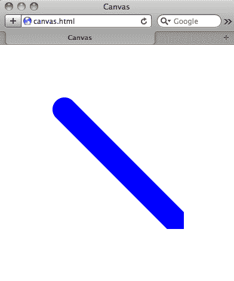
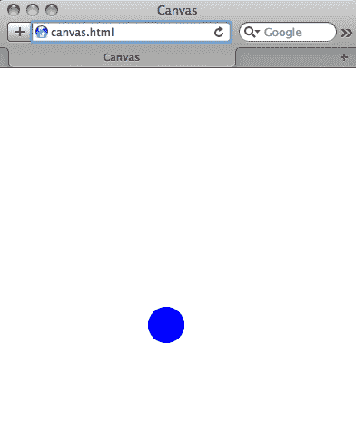

# 第六章。使用画布开发富媒体应用程序

在本章中，我们将介绍:

*   设置`canvas`环境
*   理解 2d 渲染上下文
*   动态处理形状
*   使用`canvas`绘制图像边框
*   圆角
*   创建交互式可视化
*   拍球
*   创建后备内容

# 简介

> “比起说话，我更喜欢画画。画画更快，留给谎言的空间更小。”-勒·柯布西耶

这可能是整本书最具实验性的一章。在接下来的食谱中，我们将真正在这组食谱中推进可能的极限。

### 注

请注意，随着时间的推移，实验新`canvas`元素的规格很可能会发生变化。把这组食谱看作是出版时可能发生的事情的快照。

把图片放在网站上是如此容易，以至于我们现在认为这是理所当然的。通过代码，你只需告诉浏览器显示一个图像，它就完成了。所有这些似乎都是儿戏。目前，一些浏览器实际上可以使用新的`canvas`元素动态创建动态图像。所有的重担都由 JavaScript 来承担。

新的开源`canvas`元素的酷之处在于，你不仅可以动态创建动态图像，而且用户的动作也可以实时创建新图像——所有这些都不需要插件。听起来不错，对吧？从很多方面来说是这样，但它也让我们使用辅助技术的朋友置身事外。

### 类型

如果您使用的浏览器不支持新的`canvas`元素，会发生什么？几乎没什么。浏览器就是不显示。这就是为什么你需要特别小心这项技术，不要把任何东西放在你的网站或应用程序绝对依赖的新的`canvas`元素中。您还必须考虑后备内容。

支持`canvas`的浏览器包括:


### 类型

在继续开发新的`canvas`元素之前，请确保您有良好的 HTML 和 JavaScript 技能基础。适应面向对象编程肯定也不会有什么坏处。

在本章中，我们将查看设置`canvas`环境、理解 2d 渲染上下文、动态处理形状、使用`canvas`为图像绘制边框、圆角、创建交互式可视化、反弹球和创建后备内容的真实示例。

现在，让我们开始做饭吧！

# 设置画布环境

创建新的`canvas`元素很容易。

## 怎么做...

看看这有多简单:

```html
<!DOCTYPE html>
<html>
<head>
<title>Canvas</title>
<meta charset="utf-8" />
</head>
<body>
<canvas id="FirstCanvas" width="800" height="600">
<!-- Fallback code goes here -->
</canvas>
</body>
</html>

```

## 它是如何工作的...

当然，我们可以使用任何我们需要的高度和宽度尺寸，但是这一组简单的标签是我们需要开始的。

### 类型

你可能在想我们可以用 CSS 来控制高度和宽度，但是要抵制这种诱惑。因为新的`canvas`元素包含二维渲染上下文，所以这种方法会导致不可预测的行为。

## 还有更多...

接下来，我们将在调用 jQuery 的同时调用新的`canvas`元素 JavaScript API:

```html
<!DOCTYPE html>
<html>
<head>
<title>Canvas</title>
<meta charset="utf-8" />
<script src="http://ajax.googleapis.com/ajax/libs/jquery/1/ jquery.min.js"></script>
<script>
$(document).ready(function() {
var canvas = document.getElementById("FirstCanvas");
var ctx = canvas.getContext("2d");
});
</script>
</head>
<body>
<canvas id="FirstCanvas" width="800" height="600">
<!-- Fallback code goes here -->
</canvas>
</body>
</html>

```

### 他很聪明

> “让我彻底说清楚一件事:当你使用`canvas`时，你并不是在`canvas`元素本身上进行绘制。相反，您实际上是在 2d 渲染上下文上进行绘制，这是通过 JavaScript API 通过`canvas`元素访问的。”-罗伯·霍克斯

### 我在说什么？

几年前，苹果首次为 OSX 仪表盘引入了新的`canvas`元素。它后来在网络浏览器 Safari 和 Chrome 中实现，其他浏览器也紧随其后。从那以后，它成为了 HTML5 规范的正式部分。

### 下一个<画布>是什么？

现在，我们几乎没有触及新的`canvas`元素能做什么的表面。现在和未来，我们将使用它来创建动画、图表、图表、绘图应用程序、图形和用户界面。你会梦想什么？

## 另见

开发者马丁·安杰洛夫为教程 Zine 写了一个很棒的操作指南，标题为“一个带画布的 HTML5 幻灯片”&jQuery“。在其中，Martin 演示了如何将新的 canvas 元素与最流行的 JavaScript 框架 jQuery 相结合，以创建一个交互性很强的图像幻灯片。

# 理解 2d 渲染上下文

重要的是要理解新的`canvas`元素实际上是一个“表面”，在浏览器中可以在其上绘制位图图像。

## 怎么做...

像这样定义一个`canvas`标签只能说明问题的一半:

```html
<!DOCTYPE html>
<html>
<head>
<title>Canvas</title>
<meta charset="utf-8" />
</head>
<body>
<canvas id="FirstCanvas" width="800" height="600">
<!-- Fallback code goes here -->
</canvas>
</body>
</html>

```

## 它是如何工作的...

HTML5 代码本身没有任何作用。我们必须使用 JavaScript 让文档对象模型检索 2d 渲染上下文，以便让事情发生:

```html
<script>
$(document).ready(function() {
var canvas = document.getElementById("FirstCanvas");
var ctx = canvas.getContext("2d");
});
</script>

```

平心而论，如果没有 HTML 中的`canvas`标签，那一点 JavaScript 也没什么用。

## 还有更多...

你可能想知道这个名字。如果有 2d 渲染上下文，那不也可能有 3d 渲染上下文吗？简短的回答是肯定的。但更详细的答案没那么简单。

虽然 3d 渲染上下文在理论上确实存在，但在本文发表时，没有浏览器支持它。那么，如果新的`canvas`元素在 3d 中渲染，但是没有人看到它，它真的做了什么吗？

### 可以掌握<画布>

2d 上下文为新的`canvas`元素使用了许多不同的绘图上下文，如果你对 CSS 和 JavaScript 有经验的话，这些元素使用的语法应该很熟悉。

### X，遇见 Y

绘图时，请记住浏览器窗口左上角的 X 轴和 Y 轴。值沿着页面向下增加。

### 尊重我的权威！

万维网联盟的 HTML5 `Canvas` 2d 上下文规范在线于:[http://dev.w3.org/html5/2dcontext](http://dev.w3.org/html5/2dcontext)。在那里，我们可以更深入地挖掘信息，如一致性要求、`canvas`状态、转换、合成、颜色和样式、线条样式、阴影、简单形状、复杂形状、焦点管理、文本、图像、像素操作、绘图模型、示例等等。

## 另见

史蒂夫·富尔顿和杰夫·富尔顿为奥莱利图书公司写了这本书 *HTML5 画布*。虽然这一章会给你 30 页左右有价值的新`canvas`元素食谱，但富尔顿的书大约有 400 页。把它看作是本章没有讲到的地方的资源。在[http://oreilly.com/catalog/0636920013327](http://oreilly.com/catalog/0636920013327)查看。

# 动态处理形状

让我们看看允许新的`canvas`元素绘制矩形的 JavaScript 函数。

## 怎么做...

```html
fillRect(x,y,width,height)
strokeRect(x,y,width,height)

```

按顺序:

```html
fillRect(x,y,width,height)

```

绘制一个实心矩形。接下来，

```html
strokeRect(x,y,width,height)

```

围绕矩形绘制轮廓。

现在，让我们画一些形状。

## 它是如何工作的...

我们将从基本的`canvas`代码开始，合并我们的新功能:

```html
<!DOCTYPE html>
<html>
<head>
<title>Canvas</title>
<meta charset="utf-8" />
<script src="http://ajax.googleapis.com/ajax/libs/jquery/1/ jquery.min.js"></script>
<script>
$(document).ready(function() {
var canvas = document.getElementById("FirstCanvas");
var ctx = canvas.getContext("2d");
ctx.strokeRect(10, 10, 396, 236);
ctx.fillStyle = "red";
ctx.fillRect(11, 11, 100, 100);
ctx.fillStyle = "white";
ctx.fillRect(111, 11, 34, 100);
ctx.fillStyle = "red";
ctx.fillRect(156, 11, 249, 100);
ctx.fillStyle = "white";
ctx.fillRect(11, 111, 394, 34);
ctx.fillStyle = "red";
ctx.fillRect(11, 145, 100, 100);
ctx.fillStyle = "white";
ctx.fillRect(111, 145, 34, 100);
ctx.fillStyle = "red";
ctx.fillRect(156, 145, 249, 100);
});
</script>
</head>
<body>
<canvas id="FirstCanvas" width="416" height="256">
<p>Flag of Denmark</p>
</canvas>
</body>
</html>

```

我们创造的东西就像丹麦的国旗！


## 还有更多...

这个例子刚开始可能看起来并不令人难以抗拒，但是当你记得我们已经创建了一个几乎没有任何 HTML 和任何 CSS 的图像时，新的`canvas`元素开始看起来非常令人印象深刻。

### 任何你想要的方式

请注意，当我们使用颜色名称(“白色”和“红色”)时，我们也可以使用十六进制值或 RGB 甚至 HSL！使用对你和你的互动项目最有意义的东西。

### 类似于表格？

把这个例子的颜色和尺寸规格想象成我们过去用来布局的老派`tables`。虽然肯定不一样，但在这种情况下，这种技术肯定有相似之处。

### 先做个正方

掌握矩形是第一个`canvas`技巧，在建立元素本身的能力之后，这一技巧很重要。了解这种方法的基础将有助于您掌握接下来几个食谱的基础。

## 另见

另一本近 400 页的书是罗布·霍克斯的《基础 HTML5 画布:游戏和娱乐之友》中的《T2》。在书中，霍克斯为那些全新的`canvas`元素创建了一个出版物，一直到那些寻求提高技能的最有经验的专家。听起来像你认识的人吗？在[http://friendsofed.com/book.html?isbn=1430232919](http://friendsofed.com/book.html?isbn=1430232919)查看。

# 使用画布为图像绘制边框

让我们仔细看看使用新的`canvas`元素在图像周围绘制边框的超简单方法。

## 怎么做...

首先，我们将从基本的`canvas`代码开始，添加一条新的线来绘制边框:

```html
<!DOCTYPE html>
<html>
<head>
<title>Canvas</title>
<meta charset="utf-8" />
<script src="http://ajax.googleapis.com/ajax/libs/jquery/1/ jquery.min.js"></script>
<script>
$(document).ready(function() {
var canvas = document.getElementById("FirstCanvas");
var ctx = canvas.getContext("2d");
ctx.strokeRect(10, 20, 100, 100);
});
</script>
</head>
<body>
<canvas id="FirstCanvas" width="800" height="600">
<!-- Fallback code goes here -->
</canvas>
</body>
</html>

```



## 它是如何工作的...

这一行 JavaScript 告诉浏览器创建一个矩形，从新的`canvas`元素左边 10 像素开始，从顶部 20 像素开始。它把盒子画成 100 像素的正方形。

## 还有更多...

这很好，但是如果我们希望边框是默认颜色以外的任何颜色，我们需要指定:

```html
<!DOCTYPE html>
<html>
<head>
<title>Canvas</title>
<meta charset="utf-8" />
<script src="http://ajax.googleapis.com/ajax/libs/jquery/1/ jquery.min.js"></script>
<script>
$(document).ready(function() {
var canvas = document.getElementById("myCanvas");
var ctx = canvas.getContext("2d");
ctx.strokeStyle = "rgb(0, 128, 0)";
ctx.strokeRect(10, 20, 100, 100);
});
</script>
</head>
<body>
<canvas id="myCanvas" width="600" height="600">
<!-- Fallback code goes here -->
</canvas>
</body>
</html>

```

在这种情况下，我们使用`strokeStyle`来指定纯绿色的 RGB 颜色。


### 风格优先

### 类型

如果您计划设置边框样式，则需要在浏览器绘制边框之前指定它。如果您后来指定了该样式，浏览器将简单地忽略它。

### 很多颜色值都起作用

我们刚才使用的样式属性是 RGB，但是该方法也适用于颜色(例如，“绿色”)、十六进制值、HSL 和 RGBA。

### 我喜欢大边界，我不会说谎

如果没有指定边框宽度，浏览器将自动绘制一个一像素的边框。下面是如何改变的:

```html
<!DOCTYPE html>
<html>
<head>
<title>Canvas</title>
<meta charset="utf-8" />
<script src="http://ajax.googleapis.com/ajax/libs/jquery/1/ jquery.min.js"></script>
<script>
$(document).ready(function() {
var canvas = document.getElementById("myCanvas");
var ctx = canvas.getContext("2d");
ctx.lineWidth = 10;
ctx.strokeStyle = "rgb(0, 128, 0)";
ctx.strokeRect(10, 20, 100, 100);
});
</script>
</head>
<body>
<canvas id="myCanvas" width="600" height="600">
<!-- Fallback code goes here -->
</canvas>
</body>
</html>

```

就这么简单:


## 另见

[http://rgraph.net](http://rgraph.net)是一个专门为新`canvas`元素设计的图形库。它允许您使用 HTML5、`canvas`和 JavaScript 轻松创建各种图形类型:条形图、双极图、圆环图、漏斗图、甘特图、水平条形图、LED 显示屏、折线图、仪表图、里程表、饼图、进度条、玫瑰图、散点图和传统雷达图。

# 圆角

到目前为止，我们已经使用正方形或矩形创建了图像和边框。接下来，我们将看看如何使用新的`canvas`元素通过 JavaScript 来圆角化这些图像和边框。

## 怎么做...

圆角的能力并不是`canvas`所固有的，但是罗布·霍克斯是一个超级聪明的家伙，他知道如何让它发生。以下是罗布所做的事情，解释如下:[http://raw KES . com/blog/2010/12/11/html 5-canvas 圆角](http://rawkes.com/blog/2010/12/11/rounded-corners-in-html5-canvas)。

```html
<!DOCTYPE html>
<html>
<head>
<title>Canvas</title>
<meta charset="utf-8" />
<script src="http://ajax.googleapis.com/ajax/libs/jquery/1/ jquery.min.js"></script>
<script>
$(document).ready(function() {
var canvas = $("#myCanvas");
var context = canvas.get(0).getContext("2d");
var rectX = 10;
var rectY = 10;
var rectWidth = 100;
var rectHeight = 100;
var cornerRadius = 15;
context.lineJoin = "round";
context.lineWidth = cornerRadius;
context.strokeStyle = "rgb(0, 128, 0)";
context.strokeRect(rectX+(cornerRadius/2), rectY+(cornerRadius/2), rectWidth-cornerRadius, rectHeight-cornerRadius);
});
</script>
</head>
<body>
<canvas id="myCanvas" width="600" height="600">
<!-- Fallback code goes here -->
</canvas>
</body>
</html>

```

## 它是如何工作的...

首先，罗布选择了一种与我们稍微不同的方法来调用 2d `canvas`渲染上下文，但是他的方法也很好。快看:

```html
$(document).ready(function() {
var canvas = $("#myCanvas");
var context = canvas.get(0).getContext("2d");

```

Rob 代码的下一部分看起来应该很熟悉:他设置了图像的 X 和 Y 坐标、大小，然后是边界半径:

```html
var rectX = 10;
var rectY = 10;
var rectWidth = 100;
var rectHeight = 100;
var cornerRadius = 15;

```

然后 Rob 调用连接线的能力和他想要使用的特定边界半径。假装直到你成功！

```html
context.lineJoin = "round";
context.lineWidth = cornerRadius;

```

最后是边框的颜色(还是绿色！)以及将这一切联系在一起的脚本的最后一点:

```html
context.strokeStyle = "rgb(0, 128, 0)";
context.strokeRect(rectX+(cornerRadius/2), rectY+(cornerRadius/2), rectWidth-cornerRadius, rectHeight-cornerRadius);

```

## 还有更多...

现在，罗伯——如果你也跟着去的话，你会成为一个有着美丽的圆角图像的摇滚明星。


### 就像学业能力倾向测验一样

### 类型

记住:`lineWidth`对于新的`canvas`元素就像边界半径对于 CSS 一样。两者完成了同样的事情，但方式却大不相同。

### IE 呢？

在 Internet Explorer 6-8 中，使用位于[http://code.google.com/p/explorercanvas.](http://code.google.com/p/explorercanvas.)的 ExplorerCanvas 库可以支持一些新的`canvas`元素的能力

### 我们正在打基础

在本章的大部分食谱中，我们只使用了新的`canvas`元素在浏览器中绘制静态形状，而没有使用图像。这可能看起来平淡无奇，甚至可能违反直觉。重点是用这个新能力给你一个强大的基础，这样你就可以扩展它，使用新的`canvas`元素来创建游戏，可视化数据，并允许用户动态绘制对象。

## 另见

Mozilla 的“HTML5 人物”视频系列展示了 HTML5 运动的许多主要声音。John Foliot 是 HTML5 中媒体元素可访问性小组委员会的联合主席。当他感叹目前浏览器对这些技术的支持程度时，这应该不足为奇:

> “我认为 HTML5 开始提供的大部分内容将惠及所有用户，包括使用辅助技术的用户。然而，承诺的大部分内容还没有在所有浏览器中得到支持，相关技术——辅助技术——要利用这一优势还有很长的路要走。”

阅读并观看完整采访，网址为:[http://hacks . Mozilla . org/2011/02/people-of-html 5-John-foliot](http://hacks.mozilla.org/2011/02/people-of-html5-john-foliot)。

# 创建交互式可视化

碳五的团队有一个艰巨的任务:创建一个他们的技能和兴趣的物理图表。他们可能从办公室的一面墙开始，但很快意识到新的`canvas`元素给桌子带来的新能力将允许交互性和基于它得出结论的能力。他们是这样做的:http://carbon five . github . com/html 5-游乐场/兴趣地图/兴趣地图. html.


## 怎么做...

### 类型

在跟随这个食谱的同时，在[视图-来源:http://carbon five . github . com/html 5-游乐场/兴趣地图/兴趣地图. html](http://view-source:http://carbonfive.github.com/html5-playground/interest-map/interest-map.html) 查看源代码会很有帮助。

碳五团队通过使用 HTML4.01 Transitional DOCTYPE 创建这种交互式可视化，提醒我们画布不是 HTML5 规范的正式部分。

```html
<!DOCTYPE html PUBLIC "-//W3C//DTD HTML 4.01 Transitional//EN"
"http://www.w3.org/TR/html4/loose.dtd">

```

下面详细看看他们用 JavaScript 和新的`canvas`元素做了些什么。他们从一些变量开始，比如卡片样式。在这里，他们做了几件事:设置背景颜色，创建一个黑色边框，卡片的宽度，以及它周围阴影的值。

```html
var CARD_STYLE = { fill:'rgb(240,240,240)',stroke:'rgb(0,0,0)',width:.05, shadow:{x:0, y:4, blur:4, color:'rgba(0, 0, 0, 0.3)'} };

```

下一个变量对于了解 CSS 的人来说应该很熟悉。在这里，卡片的字体粗细、大小、字体、颜色等都被设置好了:

```html
var CARD_FONT = {font:'bold 8pt Courier', color:'#555', yoffset:10, height:14};

```

接下来，他们又设置了几个与边距、宽度、高度、比例、半径、阴影等相关的变量。

```html
var MARGIN = [75,75,75,100], WIDTH = 1000-MARGIN[1]-MARGIN[3], HEIGHT = 650-MARGIN[0]-MARGIN[2], CARD_SCALE=.75, CARD_RADIUS = 40, TAG_RADIUS = 50, CACHE_RADIUS=70, CLEAR_RADIUS = 50, ITERATIONS = 20, DEGREE = .5, CARD_SHADOW = 2, AXIS_ANIM=700;

```

最后，他们为技能、人员和人员技能矩阵设置变量。不幸的是，这些代码块太长，不适合在这里重新发布。

## 它是如何工作的...

除非变量有作用于它们的函数，否则变量本身不会有很大的好处。

初始化显示后，碳五团队使用更多功能，如在 2d `canvas`渲染元素上绘图:

```html
function draw(t) {
var ctx = el('display').getContext('2d');
ctx.clearRect(0,0,ctx.canvas.width,ctx.canvas.height);
ctx.save(); ctx.globalAlpha = 1 - .75*arrow_visibility;
each( cards, function(card) {
var t0=card.tween(t); x = MARGIN[3] + card.lx + (card.x-card.lx)*t0, y = MARGIN[0] + card.ly + (card.y-card.ly)*t0;
draw_card( ctx, x, y, card.index);
});
ctx.restore();
if ( arrow_visibility > 0 ) {
ctx.save(); ctx.globalAlpha = arrow_visibility;
each( PEOPLE, function(p) { draw_interest_arrow(ctx,p,t); });
ctx.restore();
if (over_person) draw_over_arrow(ctx,over_person,t);
}
draw_axes(ctx);
}

```

以及创建名称标签:

```html
function nametag( ctx, cardx, cardy, person, r, interest ) {
ctx.save(); ctx.translate( cardx, cardy ); ctx.rotate( r + .4*(Math.random()-.5) );
ctx.translate( -TAG_RADIUS - + 4*Math.random(), 0 ); ctx.rotate( -r );
draw_nametag( ctx, person, interest );
ctx.restore();
}

```

画箭头:

```html
function draw_arrow( ctx, length, head_length, head_width ) {
var cx1 = .9*(length - head_length), cy1 = .2*head_width, cx2 = (length - head_length), cy2=.2*head_width;
ctx.beginPath();
ctx.moveTo(0,0);
ctx.bezierCurveTo( cx1, cy1, cx2, cy2, length-head_length, head_width );
ctx.lineTo( length, 0 ); ctx.lineTo( length-head_length, -head_width );
ctx.bezierCurveTo( cx2, -cy2, cx1, -cy1, 0, 0 );
ctx.closePath();
}

```

## 还有更多...

变量和函数都已经设置好了，最后要做的就是在 HTML 中调用`canvas`元素本身，给它一个运行的空间:

```html
<canvas id="display" width="1000" height="650"></canvas>

```

### 两个出租人的罪恶

在网络的旧时代，碳五小组可以选择将他们的地图留在物理墙上，或者创建一个静态的图形图像供计算机显示。虽然两者都可以像使用新的`canvas`元素一样渲染，但是它们都不允许团队像新的`canvas`元素那样提取有价值的信息。

### 回退内容呢？

有趣的是，在这个例子中，碳五在新的`canvas`元素中没有使用后备内容。这是一种你必须仔细权衡的方法，因为那些使用旧浏览器或使用辅助技术的人什么也看不见，真的什么也看不见。碳五在这个内部项目中逃脱了惩罚。你能吗？

### 接受他的提议。

当在[网站上写这个项目的时候，碳五开发者亚历克斯·克鲁克申克甚至提议为前五个以合理格式写数据的人创建可视化地图。截至发表之日，还不清楚是否有人接手此事。](http://blog.carbonfive.com/2011/02/17/visualizing-skillsets-in-html5-canvas-part-1)

## 另见

雅各布·塞德林又打出了一个全垒打，他用新的画布元素形象化了乐队电台司令的歌曲《白痴》，该歌曲来自位于 http://nihilogic.dk/labs/canvas_music_visualization 的专辑《小鬼当家》。雅各布正在挑战`canvas`元素和 JavaScript 的极限，这就是为什么我们认为他很棒！

# 拍球

我们已经了解了如何使用新的`canvas`元素绘制形状，接下来我们将把注意力转移到移动这些形状上。作者芬奇·鲁弗斯向我们展示了如何。

## 怎么做...

我们将从我们通常的`canvas` HTML 代码开始:

```html
<!DOCTYPE html>
<html>
<head>
<title>Canvas</title>
<meta charset="utf-8" />
</head>
<body>
<canvas id="FirstCanvas" width="800" height="600">
<!-- Fallback code goes here -->
</canvas>
</body>
</html>

```

接下来是独特的部分:JavaScript。在这里，达芬奇选择了一种与我们稍微不同的方法来调用 2d `canvas`渲染上下文，但是他的方法也很好。快看:

```html
<script>
var context;
function init()
{
context= myCanvas.getContext('2d');
context.beginPath();
context.fillStyle="#0000ff";
// Draws a circle of radius 20 at the coordinates 100, 100 on the canvas
context.arc(100,100,20,0,Math.PI*2,true); context.closePath();
context.fill();
}
</script>

```

放在一起，代码应该是这样的。注意添加到`body`标签的`onLoad`功能。

```html
<!DOCTYPE html>
<html>
<head>
<title>Canvas</title>
<meta charset="utf-8" />
<script src="http://ajax.googleapis.com/ajax/libs/jquery/1/ jquery.min.js"></script>
<script>
var context;
function init()
{
context= myCanvas.getContext('2d');
context.beginPath();
context.fillStyle="#0000ff";
// Draws a circle of radius 20 at the coordinates 100, 100 on the canvas
context.arc(100,100,20,0,Math.PI*2,true); context.closePath();
context.fill();
}
</script>
</head>
<body onLoad="init();">
<canvas id="myCanvas" width="300" height="300">
<!-- Fallback code goes here -->
</canvas>
</body>
</html>

```

渲染这个蓝色的球:



## 它是如何工作的...

到目前为止，达芬奇的密码相当简单。我们看到他如何调用 2d `canvas`渲染上下文。他接下来设置填充的颜色:

```html
context.fillStyle="#0000ff";

```

然后从顶部和左侧画一条 100 像素的弧线，用他已经设置好的蓝色填充:

```html
context.arc(100,100,20,0,Math.PI*2,true); context.closePath();
context.fill();

```

但是现在我们只有一个蓝色的球坐在那里。接下来，达芬奇向我们展示了如何使用变量和一个名为`draw.` 的新函数让它移动

## 还有更多...

```html
<!DOCTYPE html>
<html>
<head>
<title>Canvas</title>
<meta charset="utf-8" />
<script src="http://ajax.googleapis.com/ajax/libs/jquery/1/ jquery.min.js"></script>
<script>
var context;var x=100;var y=200;var dx=5;var dy=5;
function init()
{
context= myCanvas.getContext('2d');
setInterval(draw,10);
}
function draw()
{
context.beginPath();
context.fillStyle="#0000ff";
// Draws a circle of radius 20 at the coordinates 100, 100 on the canvas
context.arc(x,y,20,0,Math.PI*2,true);
context.closePath();
context.fill();
x+=dx;
y+=dy;
}
</script>
</head>
<body onLoad="init();">
<canvas id="myCanvas" width="300" height="300" >
</canvas>
</body>
</html>

```



如你所见，球在运动，但只是在`canvas`边缘画了一条直线。达芬奇解释原因:

> “这是因为每次调用`draw()`函数时，它都会在新坐标处画一个圆，而不会去掉旧坐标。这就是`getContext`对象的工作原理，所以它不是一个 bug 它不会真正移动圆，而是在每次调用函数时，在新坐标处画一个圆。”

### 重新开始

达芬奇向我们展示了一种方法，当新的`canvas`元素绘制每个新的圆圈时，擦除旧的圆圈:

```html
<script>
var context;
var x=100;
var y=200;
var dx=5;
var dy=5;
function init()
{
context= myCanvas.getContext('2d');
setInterval(draw,10);
}
function draw()
{
context.clearRect(0,0, 300,300);
context.beginPath();
context.fillStyle="#0000ff";
// Draws a circle of radius 20 at the coordinates 100, 100 on the canvas
context.arc(x,y,20,0,Math.PI*2,true);
context.closePath();
context.fill();
x+=dx;
y+=dy;
}
</script>

```

现在，球似乎落到了`canvas`边界的右边。

### 不要把我关在里面

为了确保球保持在`canvas`的边界内，达芬奇写了一些逻辑来检查 x 和 y 坐标是否超出了`canvas`的尺寸。如果是的话，他会让球反向。

```html
<script>
var context;
var x=100;
var y=200;
var dx=5;
var dy=5;
function init()
{
context= myCanvas.getContext('2d');
setInterval(draw,10);
}
function draw()
{
context.clearRect(0,0, 300,300);
context.beginPath();
context.fillStyle="#0000ff";
// Draws a circle of radius 20 at the coordinates 100, 100 on the canvas
context.arc(x,y,20,0,Math.PI*2,true);
context.closePath();
context.fill();
// Boundary Logic
if( x<0 || x>300) dx=-dx;if( y<0 || y>300) dy=-dy;x+=dx;y+=dy;
}
</script>

```

现在球应该在`canvas`的所有四个边上不断地弹跳。



### 这是一个成长

正如达芬奇在他引人入胜的教程《T2》中提醒我们的那样，弹跳球起初看起来很简单，但实际上这是一个需要理解的关键技术，以便为新的 html5 元素开发任何游戏。

## 另见

一个用户生成图形的美丽例子可以在尤里·维什涅夫斯基的[http://weavesilk.com](http://weavesilk.com)看到。该网站使用新的`canvas`元素作为创成艺术实验的一部分。一些生成的图像如此美丽，尤里已经将它们作为令人惊叹的桌面背景图像提供。iPhone 和 iPad 的版本也在计划中。

# 创建回退内容

> “当作者使用`canvas`元素时，他们还必须提供当呈现给用户时传达与位图`canvas`基本相同的功能或目的的内容。该内容可以作为`canvas`元素的内容。`canvas`元素的内容(如果有)是元素的后备内容。”- WHATWG HTML5 规范

如果有人在查看您的全新`canvas`应用程序时使用的是较旧的浏览器，并且无法识别您的编码天才，会发生什么？或者当有人使用辅助技术时会发生什么？让我们来看看。

## 怎么做...

如果出于某种原因，用户的浏览器不支持新的`canvas`元素，那么我们作为开发人员应该给他们一些有价值的东西。

在这里，我们可以使用图像作为后备。

```html
<canvas id="clock" width="200" height="200">

</canvas>

```

或文本:

```html
<canvas id="clock" width="200" height="200">
<p>clock</p>
</canvas>

```

或者几乎任何其他元素。

## 它是如何工作的...

到目前为止，您已经非常了解`alt`标签对图像文件的作用:如果图像文件没有出现或者用户依赖于辅助技术，`alt`标签至少会给他们一个有价值的文本标签，表示他们缺少什么。新的`canvas`元素的后备内容是一个类似的概念，但是能够做的不仅仅是`alt`标签。

## 还有更多...

支持新的`canvas`元素的浏览器会忽略容器内的内容，只是正常渲染新的`canvas`元素。

### 谢谢你，莫西拉

> 如果需要回退内容，必须使用一些 CSS 技巧来屏蔽 Safari 的回退内容(应该只呈现`canvas)`，也可以屏蔽 IE 的 CSS 技巧本身(应该呈现回退内容)。”-[Mozilla.org](http://Mozilla.org)

### 我们将如何处理可达性？

规范作者和整个 HTML5 社区普遍认为新的`canvas`元素只是部分烘焙。让那些使用辅助技术的人置身事外似乎不是正确的做法。注意这个空间。

### 我们准备好<画布>了吗？

许多开发人员认为新的`canvas`元素可访问性是新 HTML5 规范的最后一个症结之一。几乎没有什么有意义的后备能力，这个新元素只是感觉没有准备好黄金时间。