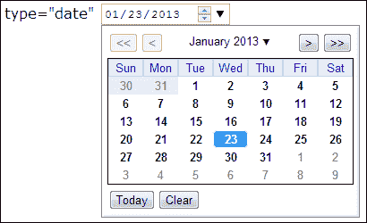
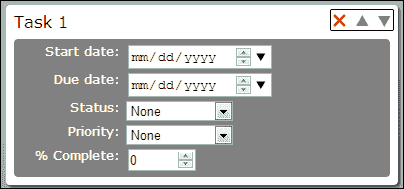
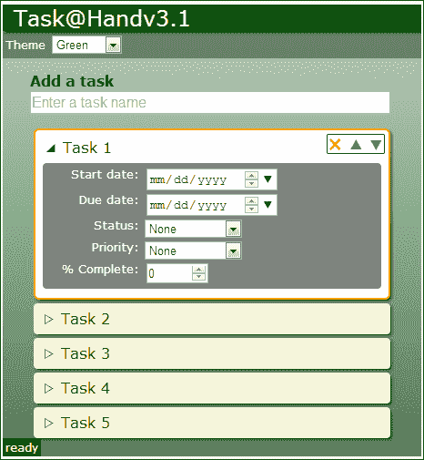

# 第三章。魔鬼在细节中

> "想了解世界的人必须了解世界的具体细节。"

*—赫拉克利特*

*本章讲述的都是新的 HTML5 输入类型，以及如何使用 JavaScript 与它们进行交互。在[第 1 章](01.html "Chapter 1. The Task at Hand")*手头的任务*中，我们创建了一个任务列表应用程序，在[第 2 章](02.html "Chapter 2. Let's Get Stylish")*中，我们使用新的 CSS3 样式来设计它。在本章中，我们通过使用新的 HTML5 输入类型添加任务详细信息部分来继续改进它。然后，我们将使用自定义数据属性将视图中的值自动绑定到应用程序中的数据模型。我们还将添加一些 jQuery 动画，以使 UI 过渡更加流畅。**

我们将在本章中学习以下主题:

*   新的 HTML5 输入类型及其带来的好处
*   自定义数据属性及其用途
*   如何使用自定义数据属性将数据模型绑定到输入元素
*   使用 jQuery 动画方法隐藏和显示元素
*   使用计时器排队保存到本地存储

# HTML5 输入类型

HTML5 带来了一大堆新的输入类型。这些新类型旨在提供格式、验证，在某些情况下还提供选择器。对于触摸设备，其中一些为键盘提供了一组不同的按键。并非所有浏览器都支持所有的新输入类型。对我们来说幸运的是，如果浏览器不支持某个类型，它只会将其显示为普通的文本字段。对我们来说不幸的是，如果不支持的类型只显示为文本字段，您就不能依靠浏览器来提供正确的格式化数据。所以，如果你要使用它们，一定要有一个备份计划。

这里有几个更有用的新输入类型，有 Chrome 支持的图像。

### 注

参见`Chapter 3/input-types/input-types.html`中的例子。

## 颜色

`color`输入类型用于选择颜色。单击时，通常会显示一个颜色选择器。该值是十六进制颜色说明符(例如，#FF0000)。这个控件目前还没有得到广泛支持，所以要谨慎使用。

```html
<input type="color" value="#FF0000"/>
```


## 日期

`date`输入类型用于选择日期。单击时，通常会显示日期选择器。该值是格式为 yyyy-mm-dd 的日期字符串(例如，2013-01-23)。您也可以用相同的日期格式指定`min`和`max`属性，以限制日期范围:

```html
<input type="date" value="2013-01-23" min="2013-01-01"/>
```



## 邮件

`email` 输入类型用于输入电子邮件地址。它的外观和行为类似于标准文本字段。在触摸设备上，键盘通常会改变以提供电子邮件符号，如 *@* 符号和*。com* :

```html
<input type="email" value="foo@bar.com"/>
```

## 数字

`number` 输入类型用于输入数字。它通常用向上和向下按钮(微调控制)显示，当点击时，这些按钮将值改变`step`的量。在触摸设备上，键盘可能会变成数字键盘。您可以使用一些属性来限制字段:

*   `min`:指定允许的最小值
*   `max`:指定允许的最大值
*   `step`:指定点击向上或向下微调按钮

    ```html
    <input type="number" value="23" min="0" max="100" step="1"/>
    ```

    时数值的变化量


## 范围

`range` 输入类型用于从一系列值中选择一个值。这与`number`输入类型几乎相同，只是它通常显示为滑块控件。它具有与`number`输入类型相同的属性。

```html
<input type="range" value="20" min="0" max="100" step="10"/>
```


## 时间

`time` 输入类型用于选择时间。单击时，它可能会显示一个时间选择器，或者您可以使用微调器设置时间。该值是一个 24 小时格式的时间字符串，格式为 hh:mm:ss(例如，13:35:15)。

```html
<input type="time" value="13:35:15"/>
```


## URL

`url` 输入类型用于输入网址。像`email`类型一样，触摸设备通常显示为输入网址而优化的键盘。

```html
<input type="url" value="http://www.worldtreesoftware.com"/>
```

## 数据列表

除了这些新的输入类型，HTML5 中还增加了一个新的`<datalist>`表单元素。它用于向文本字段添加提示的下拉列表。当用户开始在文本字段中键入时，与正在键入的字母匹配的所有列表选项将显示在该字段下的下拉列表中。用户可以选择其中一个选项来自动填写该字段。

通过在`<datalist>`元素上设置一个标识，并将它与`<input>`元素的`list`属性进行引用，可以将`<datalist>`元素与文本字段相关联。

```html
<input type="text" list="color-list"/>
<datalist id="color-list">
    <option value="Red"/>
    <option value="Orange"/>
    <option value="Yellow"/>
    <option value="Green"/>
    <option value="Blue"/>
    <option value="Purple"/>
</datalist>
```


### 注

因为此时新输入类型的实现是不稳定的，所以在使用它们时要小心。如果不支持使用`number`字段，它不会导致很多问题；用户仍然可以在文本字段中输入数字。但是类似`color`字段的内容，如果不被支持，将显示为文本字段。在这种情况下，你的用户愿意用十六进制代码输入颜色吗？

## 自动对焦

HTML5 输入元素还有一个有用的补充。首次加载页面时，添加了新的`autofocus`属性来设置特定`<input>`元素的焦点。之前，我们在应用程序中通过为`<input id="new-task-name">`元素调用 jQuery `focus()`方法做到了这一点。我们可以在 HTML5 中通过添加`autofocus`属性来做同样的事情。

```html
<input type="text" autofocus id="new-task-name".../>
```

# 任务详情

让我们将这些新输入类型中的一些很好地用在我们的任务列表应用程序中。目前我们只有一个任务名称输入字段。我们对此无能为力。因此，让我们为每个任务添加一些字段，以允许用户定义关于它们的更多细节。你可以在`Chapter 3\example3.1`找到这部分的源代码。

# 行动时间-添加任务详细信息

我们将为每个任务指定以下新字段:

*   **开始日期**:任务应该开始的日期。输入类型为`date`。
*   **截止日期**:任务应该完成的日期。输入类型为`date`。
*   **状态**:下拉列表`<select>`，选项为**无**、**未启动**、**已启动**、**已完成**。
*   **优先级**:下拉列表`<select>`，选项为**无**、**低**、**正常**和**高**。
*   **%完成**:输入类型为`number`，有效范围为 **0** 至 **100** 。

让我们在`taskAtHand.html`的任务模板标记中定义这些字段。每个任务的详细信息将显示在任务名称下的一个部分中。我们的模板现在看起来像下面的代码片段:

```html
<li class="task">
    <span class="task-name"></span>
    <input type="text" class="task-name hidden"/>
    <div class="tools">
        <button class="delete" title="Delete">X</button>
        <button class="move-up" title="Up">^</button>
        <button class="move-down" title="Down">v</button>
    </div>
    <div class="details">
 <label>Start date:</label>
 <input type="date"/><br/>
 <label>Due date:</label>
 <input type="date"/><br/>
 <label>Status:</label>
 <select>
 <option value="0">None</option>
 <option value="1">Not Started</option>
 <option value="2">Started</option>
 <option value="3">Completed</option>
 </select><br/>
 <label>Priority:</label>
 <select>
 <option value="0">None</option>
 <option value="1">Low</option>
 <option value="2">Normal</option>
 <option value="3">High</option>
 </select><br/>
 <label>%&nbsp;Complete:</label>
 <input type="number min="0" max="100" step="10" value="0"/>
 </div>
</li>
```

首先，我们添加了一个新的`<div class="details">`元素来包含新的细节字段。这允许我们从任务名称中分离细节，以不同的风格。然后我们添加了标签和字段。注意对于 **% Complete** 我们设置了`number`字段的`min`和`max`属性，将数值限制在 0 到 100 之间。

接下来我们需要设计细节部分。我们会给它一个灰色的背景和圆角。我们使所有标签的宽度相同，并向右对齐，以便所有输入字段对齐。然后，我们将**状态**和**优先级**的`<select>`元素设置为固定宽度，这样它们也可以对齐。

```html
#task-list .task .details
{
    display: block;
    background-color: gray;
    color: white;
    border-radius: 4px;
    margin-top: 0.5em;
    padding: 0.25em;
    overflow: auto;
}
#task-list .task .details label
{
    width: 8em;
    text-align: right;
    display: inline-block;
    vertical-align: top;
    font-size: 0.8em;
}
#task-list .task .details select
{
    width: 8em;
}
```

## *刚刚发生了什么？*

我们使用一些新的 HTML5 输入类型为我们的任务添加了一个任务细节部分。下面的屏幕截图显示了带有详细信息部分的任务项现在的样子:



# 行动时间-隐藏任务细节

这看起来不错，但也占用了很多空间。如果列表中的每个任务都这么长，它将很快滚动出页面，我们将无法很好地看到任务列表的概述。因为任务详细信息是可选字段，所以我们可以通过在用户想要查看之前不显示详细信息来使列表更加紧凑。我们将通过隐藏详细信息部分并在任务名称旁边添加一个切换按钮来显示或隐藏单击时的详细信息来做到这一点。

首先，让我们在任务模板中的任务名称旁边添加切换详细信息按钮，并给它一个名为`toggle-details`的类:

```html
<li class="task">
    <button class="toggle-details">+</button>
    <span class="task-name"></span>
    <!—- Not shown… -->
</li>
```

现在让我们在 JavaScript 代码中实现切换按钮。首先，我们为调用`toggleDetails()`方法的`addTaskElement()`方法中的切换按钮添加一个点击事件处理程序:

```html
$("button.toggle-details", $task).click(function() {
    toggleDetails($task);
});
```

然后我们实施 `toggleDetails()`法:

```html
function toggleDetails($task)
{
    $(".details", $task).slideToggle();
    $("button.toggle-details", $task).toggleClass("expanded");
}
```

`toggleDetails()`方法使用了一些我们还没有见过的新 jQuery 方法。它使用 `slideToggle()`切换任务细节的可见性，并使用`toggleClass()`切换按钮上的`expanded`类别。`toggleClass()`方法如果元素还没有类，就给元素添加一个类，如果有，就移除它。

`slideToggle()`方法是一个动画功能，用于切换元素的可见性。它通过向下滑动将下面的元素向下推，使元素可见。为了隐藏元素，它将元素向上滑动，直到隐藏为止。还有一种淡入淡出元素的方法叫做 `fadeToggle()`。但是当一个元素变得可见时，当它将其他元素移开时，幻灯片提供了更平滑的过渡。

### 注

一般来说，当一个幻灯片变得可见时，当元素向下推动它下面的元素时，它看起来会更好。这也有利于菜单式的行为。当您使显示在其他元素顶部的元素可见时，渐变通常看起来最好。

现在让我们给按钮添加一些样式。当然，我们想要一些像其他任务按钮一样的漂亮图标，所以让我们将它们添加到我们的精灵表文件`icons.png`中。我们需要一个图像来显示任务属性何时折叠，以及一个图像来显示它们何时展开。让我们为这两个图标创建第二行图像。


我们需要在样式表中做的第一件事是将`display`设置为`none`以获取详细信息，这样默认情况下它们是隐藏的:

```html
#task-list .task .details
{
 display: none;
    /* Not shown… */
}
```

然后我们为`toggle-details`按钮添加样式。由于我们使用与任务工具按钮相同的 sprite 表，我们将通过将其添加到 CSS 选择器来为我们的新按钮使用相同的样式。然后我们将添加选择器，使用背景位置偏移将图像放入按钮:

```html
#task-list .task .tools button,
#task-list .task button.toggle-details
{
    /* Not shown… */
    background: url(img/icons.png);
}
#task-list .task button.toggle-details
{
    background-position: 0 -16px;
}
#task-list .task button.toggle-details.expanded
{
    background-position: -16px -16px;
}
```

我们的`toggle-details`图像的垂直偏移量是`-16px`，因为它们在精灵表的第二行。请注意，第二个图像与`expanded`类匹配。当细节可见时，我们正在向按钮添加`expanded`类。

## *刚刚发生了什么？*

我们为每个任务添加了一个切换按钮，在单击时隐藏或显示任务详细信息。在浏览器中打开它，看看我们现在有什么。您可以打开和关闭任务详细信息，它们可以平滑地滑动打开和关闭。很酷。



# 自定义数据属性

HTML5 的另一个新特性是自定义数据属性。自定义数据属性允许您将应用程序私有的自定义数据作为属性存储在 DOM 中的任何元素上。你所要做的就是在属性名前加上`data-`前缀。名字应该全是小写字母。您可以将任何字符串值赋给该属性。

例如，假设我们有一个产品列表，我们想要存储关于产品的信息，例如产品标识和类别。我们所要做的就是向关联的元素添加`data-product-id`和`data-category`属性:

```html
<ul id="product-list">
  <li data-product-id="d1e0ddde" data-category="widgets">
    Basic Widget
  </li>
  <li data-product-id="e6b2c03f" data-category="widgets">
    Super Widget
  </li>
</ul>
```

现在我们有了自定义属性，我们可以使用 JavaScript 从元素中提取自定义数据，并在我们的应用程序中使用它。jQuery 恰好有一个`data()`方法就是为此而设计的。您给它一个自定义属性的名称，减去`data-`，它将返回与之关联的值。

继续前面的例子，假设我们希望允许用户点击列表中的一个产品，然后对其进行一些处理。下面的`setSelectedProduct()`方法使用`data()`方法从被点击的元素中提取产品 ID 和类别:

```html
$("#product-list li").click(function() {
    var $product = $(this);
    var productId = $product.data("product-id");
    var category = $product.data("category");
    // Do something...
});
```

# 带有自定义属性的数据绑定

自定义数据属性的一个很好的用途是实现数据绑定。数据绑定允许我们将 DOM 中的用户控件映射到数据模型中的字段，以便在用户更改它们时自动更新它们。使用这种技术，我们可以消除大量枯燥重复的代码，这些代码只不过是处理事件并将视图中的字段映射到模型中的字段。

### 注

JavaScript 有几个优秀的数据绑定库，包括`Backbone.js`和`Knockout`。我们将在这里实现自己的简单数据绑定，以学习如何使用自定义属性。如果您发现自己正在构建一个包含大量数据的应用程序，您可以考虑使用其中的一个库。

# 行动时间——构建数据模型

在我们开始实现数据绑定之前，我们需要一个数据模型来绑定。如果你记得，我们只是把任务名称保存到`localStorage`。我们的数据模型只是一个字符串数组。现在每个任务都有多个详细信息字段，我们需要一些更具体的东西来保存所有这些数据。你可以在`Chapter 3\example3.2`找到这部分的源代码。

让我们首先为我们的数据模型定义一个任务对象。我们将创建一个新文件，`taskList.js`将其放入:

```html
function Task(name)
{
    this.name = name;
    this.id = Task.nextTaskId++;
    this.created = new Date();
    this.priority = Task.priorities.normal;
    this.status = Task.statuses.notStarted;
    this.pctComplete = 0;
    this.startDate = null;
    this.dueDate = null;
}
// Define some "static variables" on the Task object
Task.nextTaskId = 1;
Task.priorities = {
    none: 0,
    low: 1,
    normal: 2,
    high: 3
};
Task.statuses = {
    none: 0,
    notStarted: 1,
    started: 2,
    completed: 3
};
```

从顶部开始，我们的构造函数接受一个参数——任务名。它使用它来设置对象中的名称字段。每个任务都有一个唯一的任务标识，每次创建任务时，该标识都会递增。其余成员被设置为默认值。

我们将一个`Task.nextTaskId`字段附加到`Task`对象构造器，以跟踪下一个唯一的任务标识应该是什么。通过这样做，我们可以在有类的语言中定义我们称之为静态或类变量的东西，比如 Java 或 C#(它们是使用静态变量定义的)。每当`nextTaskId`字段发生变化时，它将被保存到`localStorage`中，这样当用户返回应用程序时，我们就知道我们在哪里停止了。

注意`priority`和`status`正在使用枚举。我们将它们实现为附加到`Task`构造函数的静态对象(因为 JavaScript 没有枚举)。

接下来我们需要的是一个存储`Task`对象的列表。为了更容易管理代码，我们将创建一个`TaskList`对象，它基本上是一个数组的包装器。它提供了添加、删除和获取任务的方法:

```html
function TaskList(tasks)
{
    tasks = tasks || [];
```

构造函数接受一个可选参数，即`Task`对象的数组。构造函数的第一行检查是否传入了数组。如果没有，它将使用空方括号(`[]`)创建一个新的空数组。

### 注

在 JavaScript 中，逻辑 OR 运算符(`||`)可以充当空值合并运算符。如果操作数为“truthy”，则返回左侧操作数；否则它返回正确的操作数。在这种情况下，truthy 意味着传入了一个`tasks`参数，而不是`null`或`undefined`。这是定义默认值的非常有用的范例。

现在我们添加一个简单返回数组的公共`getTasks()`方法。我们稍后需要访问它来保存任务:

```html
    this.getTasks = function()
    {
        return tasks;
    };
```

接下来，我们添加一个公共的`addTask()`方法，该方法获取一个`Task`对象并将其附加到数组的末尾:

```html
    this.addTask = function(task)
    {
        tasks.push(task);
        return this;
    };
```

公共`removeTask()`方法以任务标识为参数，从列表中删除关联的任务:

```html
    this.removeTask = function(taskId)
    {
        var i = getTaskIndex(taskId);
        if (i >= 0)
        {
            var task = tasks[i];
            tasks.splice(i, 1);
            return task;
        }
        return null;
    };
```

它通过调用`getTaskIndex()`、获取任务的索引，然后使用`array.splice()`方法将其从`tasks`数组中移除。`getTaskIndex()`方法是一种私有方法，它以任务标识为参数，在数组中搜索以找到具有该标识的任务。如果它找到了任务，它就会返回它。否则返回`-1`:

```html
    function getTaskIndex(taskId)
    {
        for (var i in tasks)
        {
            if (tasks[i].id == taskId)
            {
                return parseInt(i);
            }
        }
        // Not found
        return -1;
    }
```

接下来是公众`getTask()`法。它以任务标识为参数，也使用`getTaskIndex()`方法查找。它返回关联的`Task`对象，如果不存在则返回`null`。

```html
    this.getTask = function(taskId)
    {
        var index = getTaskIndex(taskId);
        return (index >= 0 ? tasks[index] : null);
    };
```

我们要添加的最后一个公共方法叫做`each()`。它引用一个`callback`函数 作为参数。它在任务数组中循环，并对数组中的每个任务执行`callback`功能。此方法可用于迭代列表中的所有任务:

```html
    this.each = function(callback)
    {
        for (var i in tasks)
        {
            callback(tasks[i]);
        }
    };
}
```

# 行动时间-实现绑定

让我们回到 HTML 文件中的任务模板，并添加一些自定义数据属性。我们将为所有任务细节`<input>`和`<select>`元素添加自定义属性。数据属性名为`data-field`，属性值为`Task`对象中元素匹配的字段名称。我们将在稍后的 JavaScript 中使用这些属性来将 DOM 元素和数据模型挂钩在一起:

```html
<div class="details">
    <label>Start date:</label>
    <input type="date" data-field="startDate"/><br/>
    <label>Due date:</label>
    <input type="date" data-field="dueDate"/><br/>
    <label>Status:</label>
    <select data-field="status">
        <!— options removed... -->
    </select><br/>
    <label>Priority:</label>
    <select data-field="priority">
        <!— options removed... -->
    </select><br/>
    <label>%&nbsp;Complete:</label>
    <input type="number" data-field="pctComplete"
        min="0" max="100" step="10" value="0"/>
</div>
```

现在我们有了一个数据模型，我们需要进入`taskAtHand.js`中的`TaskAtHandApp`对象，并更新它以使用该模型。首先，我们将添加一个`taskList`变量，并将其初始化为一个`TaskList`对象的实例:

```html
function TaskAtHandApp()
{
    var version = "v3.2",
        appStorage = new AppStorage("taskAtHand"),
 taskList = new TaskList();

```

然后我们去进入`addTask()`方法并添加代码创建一个新的`Task`对象，并将其添加到任务列表中。这也是我们在增加后将`nextTaskId`值保存到`localStorage`的地方:

```html
function addTask()
{
    var taskName = $("#new-task-name").val();
    if (taskName)
    {
 var task = new Task(taskName);
 taskList.addTask(task);
 appStorage.setValue("nextTaskId", Task.nextTaskId);
        addTaskElement(task);
        saveTaskList();
        // Reset the field
        $("#new-task-name").val("").focus();
    }
}
```

请注意，我们还更改了`addTaskElement()`方法的参数以传入`Task`对象。因此，让我们更新`addTaskElement()`方法，将一个`Task`对象作为参数，而不是任务名称:

```html
function addTaskElement(task)
{
    var $task = $("#task-template .task").clone();
 $task.data("task-id", task.id);
    $("span.task-name", $task).text(task.name);
```

在 DOM 中创建新的任务元素后，我们使用名为`task-id`的自定义数据属性在其上设置任务标识。这是通过 jQuery `data()`方法完成的，该方法将数据属性名称和值作为参数。接下来，我们从`task.name`字段将任务名称设置为`<span>`属性。

现在我们将实现数据绑定的第一部分。下一段代码使用我们之前添加到标记中的数据属性，将`Task`对象中的值设置到详细信息部分中相关的`<input>`和`<select>`元素中:

```html
    // Populate all of the details fields
    $(".details input, .details select", $task).each(function() {
        var $input = $(this);
        var fieldName = $input.data("field");
        $input.val(task[fieldName]);
    });
```

以下是它的工作原理:

1.  首先，它找到任务元素中的所有`<input>`和`<select>`元素。
2.  然后它调用 jQuery `each()`方法，该方法用于迭代所选元素的集合，传递一个`callback`函数。
3.  在`callback`功能内`this`指向当前元素。因此，首先我们将元素包装在一个 jQuery 对象中。
4.  然后我们使用`data()`方法获取`data-field`自定义属性的值，这是与元素关联的`Task`对象中的字段名称。
5.  Finally we set the value of the user control to the value of the field in the `Task` object. We get the value from the `Task` object using square brackets. Remember that in JavaScript `object["field"]` is the .same as `object.field`.

    ### 注

    您可以认为使用方括号来访问对象字段类似于在运行时使用 C#或 Java 中的反射来动态访问对象中的值。

现在我们需要添加代码来走另一条路。每当用户更改表单控件的值时，我们都希望将其自动保存回数据模型。因此，让我们为每个细节表单控件添加一个变更事件处理程序:

```html
$(".details input, .details select", $task).change(function() {
    onChangeTaskDetails(task.id, $(this));
});
```

这调用`onChangeTaskDetails()`方法，传入任务标识和包装在 jQuery 对象中的表单控件元素。让我们实现这个方法:

```html
function onChangeTaskDetails(taskId, $input)
{
    var task = taskList.getTask(taskId)
    if (task)
    {
        var fieldName = $input.data("field");
        task[fieldName] = $input.val();
        saveTaskList();
    }
}
```

让我们将其分解，看看它是如何工作的:

1.  首先从任务列表中获取指定标识的`Task`对象。
2.  在确定我们得到一个对象后(你永远不知道，所以总是检查)，我们从元素的`data-field`属性中得到`Task`对象字段名。
3.  然后我们将`Task`对象上的字段值设置为表单控件元素的值，再次使用方括号动态访问它。
4.  最后我们调用`saveTaskList()`将变更提交给`localStorage`。

那提醒我，我们需要重写`saveTaskList()`方法来保存我们新的`TaskList`对象。这很简单。我们只需要调用任务列表中的`getTasks()`方法来获取`Task`对象的数组。然后我们把阵交给`localStorage`:

```html
function saveTaskList()
{
    appStorage.setValue("taskList", taskList.getTasks());
}
```

### 注

如果您有以前示例中的旧任务列表数据，则需要在使用新数据模型之前将其删除。在 Chrome 开发工具中，您可以点击该项目并按*删除*键将其删除。

## *刚刚发生了什么？*

首先，我们创建了一个数据模型来保存所有的任务数据。然后，我们使用自定义数据属性将数据绑定添加到我们的应用程序中，以便在页面上的字段发生变化时自动更新数据模型。然后我们将任务列表保存到本地存储。

# 行动时间–加载任务列表

现在已经将新的数据模型保存到`localStorage`中，我们需要更新`loadTaskList()`方法来加载数据:

```html
function loadTaskList()
{
    var tasks = appStorage.getValue("taskList");
    taskList = new TaskList(tasks);
    rebuildTaskList();
}
```

首先我们从`localStorage`获取任务数组，并将其作为参数传递给`TaskList`对象的构造函数。然后我们调用一个新方法，`rebuildTaskList()` 来创建 DOM 中的任务元素:

```html
function rebuildTaskList()
{
    // Remove any old task elements
    $("#task-list").empty();
    // Create DOM elements for each task
    taskList.each(function(task)
    {
        addTaskElement(task);
    });
}
```

首先，我们使用 jQuery `empty()`方法从任务列表元素中移除所有旧的元素。然后我们使用在`TaskList`对象中实现的`each()`方法来迭代任务，并为每个任务调用`addTaskElement()` 来构建任务元素。

# 排队变更

现在我们已经将用户控件绑定到数据模型，并在每次进行更改时自动保存。不过，这有一个问题。每次单击微调按钮时，像`number`或`time`类型的输入控件都会导致`change`事件。如果用户按住微调按钮，它将以惊人的速度触发`change`事件。这又会在很短的时间内将任务列表反复保存到`localStorage`中。这似乎不是一件非常有效的事情，尤其是当你有很多数据的时候。

# 行动时间-延迟保存

### 注

参见`Chapter 3\example3.3`中的代码。

我们可以通过延迟一段时间保存到`localStorage`来缓解这个问题，直到所有的用户交互都完成。使用 JavaScript 的`setTimeout()`函数很容易实现。我们将在`saveTaskList()`方法中进行此更改，但首先我们需要在`TaskAtHandApp`对象中有一个全局变量来跟踪`setTimeout()`返回的超时标识:

```html
function TaskAtHandApp()
{
    var version = "v3.3",
        appStorage = new AppStorage("taskAtHand"),
        taskList = new TaskList(),
        timeoutId = 0;
```

当更改等待保存时，我们希望在页面底部的 status 元素中显示一条消息，以便用户知道他们的更改将被保存。当实际保存发生时，我们将更新消息并将其淡出，以便用户知道保存已完成。为此，我们还需要重写`setStatus()`方法:

```html
function setStatus(msg, noFade)
{
    $("#app>footer").text(msg).show();
    if (!noFade)
    {
        $("#app>footer").fadeOut(1000);
    }
}
```

我们添加一个可选的`noFade`参数。当设置为`true`时，信息不会消失。否则，我们使用 jQuery `fadeOut()`方法在 1000 毫秒或一秒钟内逐渐淡出消息。现在我们来更新一下`saveTaskList()`的方法:

```html
function saveTaskList()
{
    if (timeoutId) clearTimeout(timeoutId);
    setStatus("saving changes...", true);
    timeoutId = setTimeout(function()
    {
        appStorage.setValue("taskList", taskList.getTasks());
        timeoutId = 0;
        setStatus("changes saved.");
    },
    2000);
}
```

我们要做的第一件事是通过检查`timeoutId`变量是否有值来检查是否已经有一个保存挂起。如果是，我们将使用 JavaScript 的`clearTimeout()`函数取消超时。如果用户在保存未决期间进行了另一次更改，这将具有重置计时器的效果。所有更改将有效地排队并一次性保存。

接下来我们使用`setTimeout()`设置一个新的超时。`setTimeout()`函数需要一个函数来执行，并且需要等待几毫秒才能执行该函数。它返回一个我们存储在`timeoutId`变量中的超时标识，以防我们以后需要取消超时。

2000 毫秒后，或者两秒钟不活动后，任务列表将被保存。然后我们重置`timeoutId`变量，因为我们的超时结束了。最后我们调用`setStatus()`告诉用户修改已经保存。

## *刚刚发生了什么？*

我们使用了 JavaScript `setTimeout()`函数来有效地将更改排队，这样当值快速变化时，我们就不会一直保存任务列表。

## 加油英雄

就是这样；就这本书而言，我们的任务列表应用程序已经完成。现在去添加你自己的功能，让它变得更好。例如，添加更多任务域，如文本区域来输入注释。也许可以在工具栏上添加一个选项来隐藏已完成的任务。尝试添加一个排序选项，按名称、状态或日期对列表进行排序。

## 突击测验

Q1。如果浏览器不支持新的 HTML5 输入类型，会发生什么？

1.  不显示输入字段。
2.  该字段显示为文本字段。
3.  该字段设置为只读。
4.  浏览器显示一条错误消息。

Q2。自定义数据属性可以用于哪种元素？

1.  仅表单输入元素。
2.  仅块级元素。
3.  仅内联元素。
4.  任何元素。

# 总结

在本章中，我们看了一些更有用的 HTML5 输入类型。我们使用这些输入类型为每个任务创建了一个可折叠的任务详细信息部分。然后，我们使用自定义数据属性来实现一个简单的数据绑定，将视图中的输入字段映射到数据模型。

我们在本章中介绍了以下概念:

*   如何以及何时使用新的 HTML5 输入类型
*   如何使用自定义数据属性在 DOM 中存储私有数据
*   如何使用自定义数据属性实现数据绑定，以将数据模型绑定到表单控件
*   如何使用 jQuery 动画方法隐藏和显示元素
*   如何使用定时器来延迟保存到`localStorage`以使应用程序更加响应

在下一章中，我们将朝着一个全新的方向前进。我们将看看 HTML5 画布元素和 API，并编写一个使用它的全新应用程序。