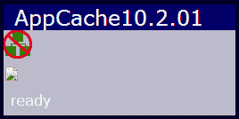

# 第十章。将应用发布到野外

> “互联网是一片蛮荒之地，有自己的游戏、语言和手势，通过它们我们开始分享共同的感受。”
> 
> ——艾未未

*在本章中，我们将学习如何准备发布 web 应用。首先，我们将讨论如何压缩和组合 JavaScript 文件以加快下载速度。然后，我们将了解如何使用 HTML5 应用缓存界面来使您的应用脱机可用。*

在本章中，我们将学习:

*   如何组合和压缩 JavaScript 文件
*   如何创建命令行脚本来准备发布应用
*   如何使用 HTML5 应用缓存 API 使页面及其资源脱机可用
*   如何创建缓存清单文件来确定缓存了哪些资源
*   如何确定应用的缓存何时更新

# 组合压缩 JavaScript

过去，JavaScript 开发人员的传统智慧是应该将所有代码都写在一个文件中，因为下载多个脚本文件会导致大量不必要的网络流量，降低加载时间。虽然减少要下载的文件数量确实更好，但在一个文件中编写所有代码很难阅读和维护。我们不会用其他语言写这样的代码，那为什么要用 JavaScript 写呢？

幸运的是，这个问题有一个解决方案:JavaScript 压缩器。压缩器获取应用的所有 JavaScript 源文件，将它们组合成一个文件，并通过将局部变量重命名为尽可能小的名称、删除空白和注释来压缩它们。我们获得了使用多个源代码文件进行开发的所有好处，以及发布应用时使用单个 JavaScript 文件的所有好处。你可以把它想象成把你的源代码编译成一个紧凑的可执行包。

有许多可用的 JavaScript 压缩器。你可以在网上找到很多。这些方法的问题是，你必须复制你的源代码并粘贴到一个网络表单中，然后再复制回一个文件中。这对于大型应用来说不太适用。我建议您使用可以从命令提示符运行的压缩应用之一，例如雅虎的 YUI Compressor 或谷歌的闭包编译器:

*   [https://developers.google.com/closure/](https://developers.google.com/closure/)
*   [【http://yui . github . io/yui 压缩机/](http://yui.github.io/yuicompressor/)

YUI 和 Closure 都很容易使用，而且效果非常好。它们都提供了关于错误代码的警告(但不是相同的警告)。两者都是用 Java 编写的，因此需要安装 Java 运行时。我不能说一个比另一个好。我选择 YUI 的唯一原因是如果我也想压缩 CSS，因为 Closure 不支持它。

# 行动时间–创建发布脚本

准备您的 JavaScript 准备发布的最简单的方法是创建一个可以从命令行运行的脚本。在这个例子中，我们将使用 YUI 压缩机，但它的工作原理几乎与 Closure 相同。唯一的区别是命令行参数。在本例中，我们创建了一个可以从 Windows 命令行运行的命令行脚本，它将采用我们在[第 7 章](07.html "Chapter 7. Piano Hero")*钢琴英雄*中编写的钢琴英雄应用，并将其打包发布。您可以在`Chapter 10/example10.1`中找到该部分的代码。

在开始之前，我们需要为应用定义一个文件夹结构。我喜欢为应用创建一个基本文件夹，其中包含一个`src`文件夹和一个`release`文件夹。基本文件夹包含命令行批处理脚本。`src`文件夹包含所有的源代码和资源。`release`文件夹将包含压缩的 JavaScript 文件和运行应用所需的所有其他资源:


现在让我们创建我们的批处理脚本文件，并将其命名为`release.bat`。我们首先要告诉 YUI 的是要压缩哪些文件。有几种方法可以做到这一点。我们可以将所有的 JavaScript 文件连接成一个文件，然后引用这个文件，或者传入所有单独文件的列表。你使用的方法取决于你的需要。

如果您需要按照一定的顺序处理文件，或者您没有很多文件，那么您可以将它们单独指定为参数。如果您的应用中有很多文件，并且您不担心顺序，那么将它们合并成一个文件可能是最简单的。对于本例，我们将使用`type`命令将所有 JavaScript 文件连接成一个名为`pianoHero.collated.js`的文件:

```html
type src\*.js > pianoHero.collated.js
```

我们使用`type`命令找到`src`文件夹中的所有`.js`文件，并将它们写入名为`pianoHero.collated.js`的文件中。注意这不包括`lib` 文件夹中的文件。我喜欢将它们分开，但是如果您愿意的话(并且如果它们的许可允许的话)，您当然可以包含任何外部库。现在我们将执行压缩器，传入整理好的 JavaScript 文件:

```html
java -jar ..\yui\yuicompressor-2.4.6.jar --type js -o release\pianoHero.min.js pianoHero.collated.js
```

我们启动 Java 运行时，告诉它在哪里可以找到 YUI 压缩器的 JAR 文件。我们传入一个文件类型参数`js`，因为我们正在压缩 JavaScript (YUI 也可以压缩 CSS)。`-o`参数告诉它将输出写到哪里。最后一个是我们想要压缩的 JavaScript 文件(或者多个文件)。

现在`release`文件夹中有一个`pianoHero.min.js`文件。我们仍然需要将所有其他资源复制到`release`文件夹，包括 HTML 和 CSS 文件、jQuery 库和音频文件:

```html
xcopy /Y src\*.html release
xcopy /Y src\*.css release
xcopy /Y /S /I src\lib release\lib
xcopy /Y /S /I src\audio release\audio
```

我们使用`xcopy`命令将`pianoHero.html`、`pianoHero.css`、`lib`文件夹中的所有内容以及`audio`文件夹中的所有内容复制到`release`文件夹中。此时，我们在`release`文件夹中拥有运行应用所需的一切。

还有最后一件事要做。我们需要删除 HTML 文件中过时的`<script>`元素，并用指向我们的压缩 JavaScript 文件的元素替换它们。这一部分不容易自动化，所以我们需要打开文件并手动完成:

```html
<head>
    <title>Piano Hero</title>
    <link href="pianoHero.css" rel="StyleSheet" />
    <script src="lib/jquery-1.8.1.min.js"></script>
    <script src="pianoHero.min.js"></script>
</head>
```

就这样。现在在你的浏览器中打开应用，做一个冒烟测试，以确保一切仍按你预期的方式运行，然后发货！

## *刚刚发生了什么？*

我们创建了一个 Windows 命令行脚本，将我们所有的 JavaScript 源文件合并成一个，并使用 YUI 压缩器对其进行压缩。我们还将运行应用所需的所有资源复制到`release`文件夹中。最后，我们将脚本引用更改为压缩的 JavaScript 文件。

## 加油英雄

YUI 压缩机也缩小了 CSS。向发布脚本添加代码以压缩 CSS 文件。

# HTML5 应用缓存

HTML5 应用缓存应用编程接口提供了一种缓存网页使用的文件和资源的机制。一旦被缓存，就好像用户在他们的设备上下载并安装了你的应用。这允许应用在用户未连接到互联网时脱机使用。

### 注

浏览器可能会限制可以缓存的数据量。一些浏览器将其限制在 5 MB。

让你的应用缓存的关键是缓存清单文件。这个文件是一个简单的文本文件，包含应该缓存哪些资源的信息。它由您网页的`<html>`元素上的`manifest`属性引用:

```html
<html manifest="myapp.appcache">
```

在清单文件中，您可以指定要缓存或不缓存的资源。该文件可以有三个部分:

*   `CACHE`:这是默认部分，列出了要缓存的文件。声明该节标题是可选的。URIs 不允许使用通配符。
*   `NETWORK`:本节列出了需要网络连接的文件。对这些文件的请求会绕过缓存。允许使用通配符。
*   `FALLBACK`:如果资源不能脱机使用，本节列出后备文件。每个条目包含原始文件的 URI 和后备文件的 URI。允许使用通配符。两个 URIs 必须是相对的，并且与应用来自同一个域。

### 注

缓存清单文件可以有任何文件扩展名，但它必须以文本/缓存清单的 MIME 类型传递。您可能需要将您使用的扩展名与网站服务器中的此 MIME 类型相关联。

需要注意的一点是，一旦应用的文件被缓存，即使文件在服务器上发生了变化，也只会使用这些版本的文件。只有两种方法可以更新应用缓存中的资源:

*   当清单文件改变时
*   当用户为您的应用清除浏览器的数据存储时

我建议在开发应用时，将缓存清单文件与 HTML 文件放在同一个文件夹之外。您不希望在编写代码时缓存文件。将其与发布脚本一起放入应用的基本文件夹中，并将其复制到脚本中的`release`文件夹中。

是否缓存应用取决于应用的性质。如果它严重依赖对服务器的 Ajax 调用来工作，那么让它脱机可用将毫无意义。但是，如果您可以编写应用，使其在脱机时在本地存储数据，那么这可能是值得的。您应该确定维护缓存清单的开销是否会给应用带来好处。

# 行动时间–创建缓存清单

让我们从模板创建一个简单应用来演示如何使用缓存清单。它有 HTML、CSS 和 JavaScript 文件，以及一个`image`文件夹中的几张图像。你可以在`Chapter 10/example10.2`找到这个例子的源代码。

现在让我们创建一个名为`app.appcache`的缓存清单文件:

```html
CACHE MANIFEST
# v10.2.01
```

清单文件必须始终以第一行的`CACHE MANIFEST`开头。在第二行，我们有一个评论。以散列标记(`#`)开头的行是注释。建议您在清单文件的注释中包含某种类型的版本标识符或发布日期。如前所述，将应用重新加载到缓存中的唯一方法是更改清单文件。每次发布新版本时，您都需要更新此版本标识符。

接下来，我们添加我们想要缓存的文件。如果喜欢可以添加`CACHE`节头，但不是必须的:

```html
CACHE:
app.html
app.css
app.js
lib/jquery-1.8.1.min.js
```

不幸的是，这一部分不允许使用通配符，因此您需要显式列出每个文件。对于某些应用，比如钢琴英雄及其所有音频文件，这可能是一个很大的打字量！

接下来让我们定义`NETWORK`部分。现在你可能会想，这一节的重点是什么？我们已经列出了所有想要缓存的文件。那么为什么需要列出不想缓存的文件呢？原因是，一旦缓存，您的应用将只能从缓存中获取文件，即使在线时也是如此。如果您想在您的应用中使用非缓存资源，您需要将它们包含在本节中。

例如，假设我们的页面上有一个网站跟踪图像来跟踪页面点击量。如果我们不将其添加到`NETWORK`部分，对它的请求将永远不会到达服务器，即使用户在线。为了这个例子，我们将使用静态图像文件。实际上，这将是 PHP 或其他一些服务器端请求处理程序，返回一个图像:

```html
NETWORK:
img/tracker.png
```

现在我们来定义`FALLBACK`部分。假设我们想在应用中显示一个图像，让用户知道他们是在线还是离线。这是我们指定从在线映像回退到离线映像的地方:

```html
FALLBACK:
online.png offline.png
```

我们的清单文件到此为止。现在在浏览器中打开应用，这样它就会被缓存。然后进入 JavaScript 文件，改变应用对象中`version`变量的值。现在刷新页面；什么都不应该改变。接下来进入清单文件，更改版本并再次刷新。还是没变。发生了什么事？

还记得我之前说过，当清单文件改变时，会导致应用重新加载吗？虽然这是真的，但是直到从缓存加载页面之后，才会检查清单文件的更改。因此，用户需要重新加载页面两次才能获得更新版本。幸运的是，我们有一种方法可以在 JavaScript 中检测清单文件何时发生了变化，并向用户发出一条消息，表明有更新的版本可用。

让我们添加一个名为`checkIfUpdateAvailable()`的 JavaScript 方法来检查缓存何时被更新:

```html
function checkIfUpdateAvailable()
{
    window.applicationCache.addEventListener('updateready',
    function(e)
    {
        setStatus("A newer version is available. Reload the page to update.");
    });
}
```

首先我们给`applicationCache`对象添加一个`updateready`事件监听器。在浏览器发现清单文件已更改并下载了更新的资源后，将触发此事件。当我们收到缓存已更新的通知时，我们会显示一条消息，告诉用户重新加载页面。现在我们所要做的就是在我们的应用的`start()`方法中添加对这个方法的调用，然后我们就可以开始了。

现在去更新应用和清单文件中的版本号并刷新页面。您应该会看到显示的更新消息。再次刷新页面，您将看到版本已经更改:


最后，让我们检查一下我们的退路。断开您的互联网连接并重新加载页面。您应该看到显示的是离线图像，而不是在线图像。还要注意，它无法加载跟踪图像，因为我们将其标记为非缓存资源:



## *刚刚发生了什么？*

我们学习了如何使用 HTML 应用缓存来缓存 web 应用。我们使用一个清单文件来定义应该缓存的资源、一个没有缓存的资源，以及另一个在应用脱机时具有回退的资源。我们还学习了如何以编程方式检查缓存何时更新。

## 突击测验

Q1。JavaScript 压缩器*不*做什么？

1.  把你的代码压缩成一个压缩文件
2.  将你的 JavaScript 文件合并成一个文件
3.  从 JavaScript 文件中删除所有空白和注释
4.  将局部变量重命名为尽可能小的名称

Q2。应用缓存中的资源何时更新？

1.  当文件在服务器上更改时
2.  当清单文件改变时
3.  资源从不更新
4.  每次用户启动应用时

# 总结

在这一章中，我们学习了如何将我们完成的应用发布到世界各地。我们使用了一个 JavaScript 压缩器来将所有的 JavaScript 文件组合并压缩成一个紧凑的文件。然后，我们使用应用缓存应用编程接口使应用脱机可用。

我们在本章中介绍了以下概念:

*   如何使用 YUI 压缩器组合和压缩 JavaScript 文件
*   如何创建一个命令行脚本来打包我们的应用并准备发布它们
*   如何使用应用缓存应用接口来缓存应用并使其脱机可用
*   如何创建缓存清单文件并定义缓存、非缓存和回退文件
*   如何以编程方式检查清单文件何时更改，并提醒用户有更新可用

给你。我们已经介绍了 HTML5 网络应用开发，从创建一个起始模板到准备您的应用发布。现在走出去，开始编写自己的 HTML5 网络应用。我期待看到你如何使用 HTML5 来创造下一个大东西。