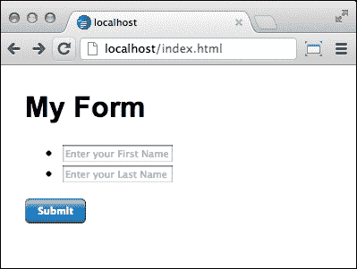
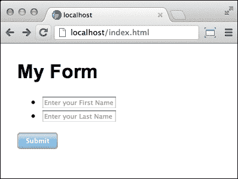

# 第一章。响应元素和媒体

在本章中，您将了解:

*   使用百分比宽度调整图像大小
*   使用 cookie 和 JavaScript 的响应图像
*   让视频响应屏幕宽度
*   使用媒体查询调整图像大小
*   使用媒体查询更改导航
*   根据大小制作响应填充
*   为加载元素制作 CSS3 按钮发光

# 简介

网站设计和媒体的响应性是自从我还是个小学生的时候 ASCII 艺术出现在公告栏上以来，发生在网络开发上最令人兴奋的事情之一。HTML5 、CSS3 和 jQuery 的新的酷功能为旧的网络带来了新的生命，这些新功能带来了乐趣，并真正让网络观众对使用您的应用感到兴奋。这一章包含几个食谱，将帮助您创建响应的 HTML 元素和不同的媒体。

有些食谱很容易，有些更具挑战性。所有用于**响应网页设计** 元素的代码都在书中提供，因此书中没有什么是不可能完成的。每一个和所有的响应网页设计食谱将帮助您优化您的网站的演示，为您的观众创造一个惊人的响应网页体验，无论您使用的设备类型或大小。

# 使用百分比宽度调整图像大小

这种方法依赖于客户端编码来调整大图像的大小。它只向客户端提供一个图像，并要求它根据浏览器窗口的大小渲染图像。当您确信客户端有足够的带宽下载图像而不会导致页面加载缓慢时，这通常是更好的方法。

## 做好准备

首先你需要一张图片。要找到高质量的图像，请使用谷歌图像搜索。对`robots`的一个搜索，比如搜索给我 15800 万个结果，挺好的。但是我真正想要的是大图，于是点击**搜索工具**，然后点击**任意尺寸**，我改成**大图**。我还有 496 万张图片可以选择。

应该调整图像的大小，以匹配最大的可视比例。在你的图像编辑软件中打开它。如果你还没有图像编辑软件，有很多免费的，去买一个吧。Gimp 是一个强大的图像编辑软件，它是开源的，或者可以免费下载。去到[http://www.gimp.org](http://www.gimp.org)获得这个强大的开源图像编辑软件。

## 怎么做…

一旦你有了你的图像编辑软件，打开其中的图像，并改变图像的宽度为 300 像素。保存您的新图像，然后将图像移动或上传到您的 web 目录。

您的 HTML 应该包含您的图像和一些文本，以展示响应效果。如果你没有时间写你的生活故事，你可以回到互联网上，从 Ipsum 生成器中获取一些示例文本。转到[http://www.lipsum.com](http://www.lipsum.com)和生成一段 Ipsum 文本。

```html
<p class="text">Loremipsum dolor sit amet…</p>
<div class="img-wrap" >
     
     <p>Loremipsum dolor sit amet</p>
</div>
```

你的 CSS 应该为你的段落包含一个类，为你的图像包含一个类和一个图像包装器。将段落向左浮动并赋予其宽度`60%`，图像包装宽度`40%`。

```html
p.text {
     float:left;
     width:60%;
}
div.img-wrap{
     float:right;
     width:40%;
}
```

这创建了一个流畅的布局，但还没有做任何事情来创建一个响应的形象。图像将保持 300 像素的静态宽度，直到您添加以下 CSS。然后，在图像的 CSS 中添加一个新的类。为其指定`100%`的`max-width`值。这允许宽度根据浏览器宽度的变化进行调整。接下来，给类添加一个动态`height`属性。

```html
img.responsive {
     max-width: 100%;
     height: auto;
}
```

这个创建了一个图像，它响应浏览器窗口的宽度，为观众提供了该图像的优化版本。

### 类型

**下载示例代码**

您可以从您在[http://www.packtpub.com](http://www.packtpub.com)的账户中下载您购买的所有 Packt 书籍的示例代码文件。如果您在其他地方购买了这本书，您可以访问[http://www.packtpub.com/support](http://www.packtpub.com/support)并注册，以便将文件直接通过电子邮件发送给您。

## 它是如何工作的…

图像 CSS 的`responsive`属性强制其 100%采用其父元素。当父元素的宽度改变时，图像会改变以填充该宽度。`height: auto`属性用于保持图像的纵横比。

## 另见

*   使用 cookie 和 JavaScript 配方的*响应图像*
*   基于尺寸配方制作响应填充

# 使用 cookie 和 JavaScript 的响应图像

一个响应图像的宽度可以通过复杂的服务器逻辑传递。有时因为需求，你不能通过最简单的方法达到预期的结果。百分比宽度方法依赖于客户端来调整大型图像文件的图像大小。此方法提供服务器端传递您请求的适当大小的图像。如果您担心加载速度慢会影响网站的性能，它可能会降低服务器负载和带宽，并帮助您处理长时间加载。

## 做好准备

这些方法要求你的服务器在其上执行某种逻辑功能。首先，它需要你的服务器上的 PHP。它还要求您创建三个不同大小的图像版本，并根据要求提供给客户。

## 怎么做…

JavaScript 很简单。它会根据设备的屏幕尺寸创建一个 cookie。当客户端向服务器请求图像时，它会激发 PHP 代码来传递适当的图像。

```html
<script >
     document.cookie = "screen_dimensions=" + screen.width + "x" + screen.height;
</script>
```

现在，在您的服务器上，在 web 目录中创建一个`images`文件夹，并创建一个 PHP 文件(`index.php`)，其中包含以下代码:

```html
<?php
 $screen_w = 0;
 $screen_h = 0;
 $img = $_SERVER['QUERY_STRING'];

 if (file_exists($img)) {

   // Get screen dimensions from the cookie
   if (isset($_COOKIE['screen_dimensions'])) {
     $screen = explode('x', $_COOKIE['screen_dimensions']);
     if (count($screen)==2) {
       $screen_w = intval($screen[0]);
       $screen_h = intval($screen[1]);
     }
   }
   if ($screen_width> 0) {

     $theExt = pathinfo($img, PATHINFO_EXTENSION);

     // for Low resolution screen
     if ($screen_width>= 1024) {
       $output = substr_replace($img, '-med', -strlen($theExt)-1, 
     } 

     // for Medium resolution screen
     else if ($screen_width<= 800) {
       $output = substr_replace($img, '-low', -strlen($theExt)-1, 0);
     }

     // check if file exists
     if (isset($output) &&file_exists($output)) {
       $img = $output;
     }
   }

   // return the image file;
   readfile($img);
 }

?>
```

现在用你的图像编辑软件，打开你的大图像，创建两个小版本。如果原版本是 300px，那么接下来做两个副本 200px 和 100px。然后分别命名为`robot.png`、`robot-med.png`和`robot-low.png`。将这三张图片上传到`images`文件夹。

最后但同样重要的是，将以下 HTML 文件放入服务器的文档根目录中:

```html
<!doctype html>
<html>
     <head>
          <title>Responsive Images</title>
          <meta charset="utf-8">
          <script>
   document.cookie = "device_dimensions=" + screen.width + "x" + screen.height;
          </script>
     </head>
     <body>
         
     </body>
</html>
```

您可以在下面的截图中看到正在运行的配方:


虽然这种方法仅限于为每个屏幕尺寸提供一个特定图像，并且不是流畅动态的，但它确实在服务器端提供了与 CSS 媒体查询相同的功能。您可以用 CSS 为所提供的图像设置样式，或者用 JavaScript 制作动画。它可以与多种方法结合使用，以提供响应内容。

这个食谱的代码最初是由 http://www.html.it/articoli/responsive-images-con-i-cookie/的聪明人创造的。

## 它是如何工作的…

HTML 文件首先创建一个描述设备屏幕尺寸的 cookie。当图像元素调用 PHP 文件时，它就像 PHP 中的`include`语句一样工作。 PHP 文件首先检查文件是否存在，然后读取屏幕宽度的 cookie，并提供适当大小的图像版本。

# 让你的视频响应你的屏幕宽度

视频流也可以是响应性的。您可以轻松地在页面中嵌入 HTML5 视频，并使其具有响应性。`video`标签很容易支持使用百分比宽度。然而，要求你的网站主机上有视频源。如果你有这个，这很容易。

```html
<style>
video {
     max-width: 100%;
     height: auto;
}
</style>

<video width="320" height="240" controls="controls">
     <source src="movie.mp4" type="video/mp4">
     <source src="movie.ogg" type="video/ogg">
     Your browser does not support the video tag.
</video>
```

然而，使用视频托管网站，如 YouTube 或 Vimeo，比自己托管有很多优势。首先，是带宽问题，您的托管服务器可能有带宽或磁盘空间限制。此外，与仅使用您自己的资源相比，视频托管网站使上传转换为可用的网络视频变得异常容易。

## 做好准备

视频托管网站允许您在页面中嵌入 iFrame 或目标代码片段，以便在您的网站上流式传输视频。这在`video`标签内不起作用。所以，要让它有反应，有一个更复杂，但仍然容易的方法。

## 怎么做…

将视频源片段包装在包含`div`元素的 HTML 中，并在底部和相对位置填充 50%到 60%的内容。然后给它的子元素，视频 iFrame 对象，一个`100%`宽度和`100%`高度，以及一个`absolute`位置。这使得 iFrame 对象完全填充父元素。

以下是使用`iframe`标签从 Vimeo 获取视频的 HTML 代码:

```html
<div class="video-wrap">
     <iframe src="http://player.vimeo.com/video/52948373?badge=0" width = "800" height= "450" frameborder="0"></iframe>
</div>
```

以下是使用带有标记的旧 YouTube 对象的 HTML 代码:

```html
<div class="video-wrap">
    <object width="800" height="450">
       <param name="movie" value="http://www.youtube.com/v/b803LeMGkCA?version=3&amp;hl=en_US">
         </param>
         <param name="allowFullScreen" value="true"></param>
         <param name="allowscriptaccess" value="always"></param>
         <embed src="http://www.youtube.com/v/b803LeMGkCA?version=3&amp;hl=en_US" type="application/x-shockwave-flash" width="560" height="315" allowscriptaccess="always" allowfullscreen="true">
          </embed>
     </object>
</div>
```

两种视频类型使用相同的 CSS:

```html
.video-wrap {
     position:relative;
     padding-bottom: 55%;
     padding-top: 30px;
     height: 0;
     overflow:hidden;
}
.video-wrap iframe,
.video-wrap object,
.video-wrap embed {
     position:absolute;
     top:0;
     width:100%;
     height:100%;
}
```

您可能不希望视频占据整个页面宽度。在这种情况下，可以使用`width`和`max-width`限制视频的宽度。然后，用另一个`div`元素包裹`video-wrap`元素，并指定一个固定的`width`值和`max-width:100%`。

```html
<div class="video-outer-wrap">
     <div class="video-wrap">
          <iframe src="http://player.vimeo.com/video/6284199?title=0&byline=0&portrait=0" width="800" height="450" frameborder="0">
          </iframe>
     </div>
</div>

.video-outer-wrap {
     width: 500px;
     max-width:100%;
}
```

这个食谱将适用于所有现代浏览器。

## 它是如何工作的…

这种方法被称为视频固有比率，由蒂埃里·科布伦茨在《名单之外》中创造。您将视频包装在具有固有纵横比的元素中，然后给视频一个绝对位置。这锁定了长宽比，同时允许尺寸是流动的。

# 使用媒体查询调整图像大小

媒体查询是响应图像的另一种有用且高度可定制的方法。这不同于通过百分比宽度方法获得的响应流体宽度。对于不同的屏幕尺寸范围，您的设计可能需要一些特定的图像宽度，流体宽度会破坏您的设计。

## 做好准备

此方法只需要一个图像，并使客户端的浏览器而不是服务器调整图像的大小。

## 怎么做…

HTML 代码很简单，使用标准图像标签，创建一个图像元素，如下所示:

```html

```

从一个简单的版本开始，创建一个媒体查询，它将检测浏览器窗口的大小，并为大于`1024px`的浏览器屏幕提供一个较大的图像，为较小的浏览器窗口提供一个较小的图像。首先是媒体查询，查找媒体类型`screen`，然后是屏幕大小。当满足媒体查询时，浏览器将在括号内呈现 CSS。

```html
@media screen and ( max-width: 1024px ) {…}
@media screen and ( min-width: 1025px ) {…}
```

现在，给你的图像标签添加一个类。该类将在不同的媒体查询中做出不同的响应，如下面的代码行所示:

```html

```

将 CSS 类添加到每个具有不同大小的媒体查询中，将使浏览器为每个不同大小的浏览器窗口呈现所需的图像大小。媒体查询可以与其他 CSS 类共存。然后，在媒体查询之外，用`height:auto`为图像添加一个 CSS 类。这将适用于仅添加一行 CSS 的两种媒体查询。

```html
@media screen and ( max-width: 1024px ) {
img.responsive { width: 200px; }
}
@media screen and ( min-width: 1025px) {
img.responsive { width: 300px;}
}
img.responsive { height: auto; }
```

要使图像响应多个范围，您可以组合`max-width`和`min-width`媒体查询。要指定浏览器窗口的图像大小，大小在`1024px`和`1280px`之间，添加屏幕的媒体查询，`1024px`为`min-width`，而`1280px`为`max-width`。

```html
@media screen and ( max-width: 1024px ) {
img.responsive { width: 200px; }
}
@media screen and ( min-width:1025px ) and ( max-width: 1280px ) {
img.responsive { width: 300px; }
}
@media screen and ( min-width: 1081px ) {
img.responsive { width: 400px; }
}
img.responsive { height: auto; }
```

您可以使用媒体查询方法为许多不同的浏览器窗口大小指定许多不同的图像大小。

## 它是如何工作的...

CSS3 的媒体查询基于浏览器的视口属性给你的 CSS 逻辑条件，可以基于浏览器的窗口属性渲染不同的样式。这个方法利用了这一点，为许多不同的浏览器窗口大小设置了不同的图像宽度。因此，您可以通过高度的粒度来控制响应图像的大小。

# 通过媒体查询更改导航

媒体查询可以做的不仅仅是调整图像大小。您可以使用媒体查询向您的观众提供更动态的网页。您可以使用媒体查询根据不同的屏幕大小显示响应菜单。

## 做好准备

为了制作一个响应菜单系统，使用两个不同的菜单，我们将为三个不同的浏览器窗口大小显示一个动态菜单。

## 怎么做…

对于较小的浏览器窗口，尤其是移动设备和平板电脑，创建一个简单的`select`菜单，只占用少量垂直空间。该菜单使用一个 HTML `form`元素作为导航选项，该元素触发一个 JavaScript 代码来加载选择的新页面。

```html
<div class="small-menu">
     <form>
          <select name="URL" onchange="window.location.href=this.form.URL.options[this.form.URL.selectedIndex].value">
              <option value="blog.html">My Blog</option>
              <option value="home.html">My Home Page</option>
              <option value="tutorials.html">My Tutorials</option>
          </select>
     <form>
</div>
```

对于更大的浏览器窗口大小，创建一个简单的`ul`列表元素，可以通过 CSS 进行样式化。该菜单将接收不同媒体查询的不同布局和外观。该菜单被添加到`select`菜单之后的同一页面:

```html
<div class="large-menu">
     <ul>
          <li>
               <a href="blog.html">My Blog</a>
          </li>
          <li>
               <a href="home.html">My Home Page</a>
          </li>
          <li>
               <a href="tutorials.html">My Tutorials</a>
          </li>
     </ul>
</div>
```

要使菜单响应，为目标浏览器窗口大小创建媒体查询。对于小于`800px`的浏览器窗口，CSS 将只显示`div`元素内的`select`表单和`small-menu`类，对于所有较大的浏览器窗口，CSS 将显示`div`元素内的`ul`列表和`large-menu`类。这就产生了一种效果，当浏览器窗口跨越`801px`宽度时，页面将在菜单之间移动。

```html
@media screen and ( max-width: 800px ) {
.small-menu { display:inline; }
.large-menu { display:none; }
}
@media screen and ( min-width: 801px ) and ( max-width: 1024px ) {
.small-menu { display:none; }.
.large-menu { display:inline; }
}
@media screen and ( min-width: 1025px ) {
.small-menu { display:none; }
.large-menu { display:inline; }
}
```

对于更大的屏幕尺寸，您可以使用相同的`ul`列表，并进一步使用媒体查询，通过简单地切换 CSS 并使用相同的 HTML 来提供不同的菜单。

对于中等大小的菜单，使用 CSS 将列表项显示为水平列表，如以下代码片段所示:

```html
.large-menu ul{ 
     list-style-type:none; 
}
.large-menu ul li { 
     display:inline; 
}
```

这会将列表变成水平列表。我们希望这个版本的导航出现在中等大小的浏览器窗口上。放在`801px`到`1024px`之间的媒体查询中，如下面的代码片段所示:

```html
@media screen and ( min-width: 801px ) and (max-width: 1024px ) {
     .small-menu { 
          display:none; 
     }
.large-menu { 
          display:inline; 
     }
.large-menu ul { 
          list-style-type:none; 
     }
.large-menu ul li {
          display:inline;
     }
}
@media screen and (min-width: 1025px ) {
.small-menu { 
          display:none; 
     }
     .large-menu { 
          display:inline; 
     }
}
```

为了进一步以最佳方式利用响应导航元素，当屏幕宽度改变时，我们希望菜单列表版本移动到不同的布局位置。中间宽度从`801px`到`1024px`，菜单停留在页面顶部，宽度为`100%`。当屏幕比`1025px`宽时，菜单将浮动到其父元素的左侧。向`801px`到`1024px`媒体查询添加一个`100%`宽度到`large-menu`类，向`1025px`媒体查询添加一个`20%`宽度和一个`float:left`值到`large-menu`类。

为了填充页面，我们还将添加一段用`div`元素包装的文本。您可以返回到 Lorem Ipsum 文本生成器来创建填充文本([http://lipsum.com/](http://lipsum.com/))。在中等宽度媒体查询中，给包含段落的元素一个`100%`宽度。在最大的媒体查询中，给包含段落的元素一个`80%`的宽度，并将其浮动到其父元素的右侧。

```html
<div class="small-menu">
     <form>
          <select name="URL" onchange="window.location.href=this.form.URL.options[this.form.URL.selectedIndex].value">
              <option value="blog.html">My Blog</option>
              <option value="home.html">My Home Page</option>
              <option value="tutorials.html">My Tutorials</option>
          </select>
     <form>
</div>

<div class="large-menu">
     <ul>
          <li>
               <a href="blog.html">My Blog</a>
          </li>
          <li>
               <a href="home.html">My Home Page</a>
          </li>
          <li>
               <a href="tutorials.html">My Tutorials</a>
          </li>
     </ul>
</div>

<div class="content">
     <p>Loremipsum dolor sitamet, consecteturadipiscingelit…</p>
</div>
```

您的风格应该如下面的代码片段所示:

```html
<style>
@media screen and ( max-width: 800px ) {
     .small-menu { 
          display: inline; 
     }
     .large-menu { 
          display: none; 
     }
}
@media screen and ( min-width: 801px ) and ( max-width: 1024px ) {
     .small-menu { 
          display: none; 
     }
     .large-menu { 
          display:inline; 
          width: 100%; 
     }
     .large-menu ul { 
          list-style-type: none; 
     }
     .large-menu ul li { 
          display: inline; 
     }
     .content: { 
          width: 100%; 
     }
}
@media screen and ( min-width: 1025px ) {
     .small-menu { 
          display: none; 
     }
     .large-menu { 
          display: inline; 
          float: left; 
          width: 20%;
     }
     .content{
          float: right;
          width: 80%;
     }
}
</style>
```

最终的结果是一个包含三个不同版本导航的页面。当针对每个特定的浏览器窗口大小给出菜单的优化版本时，您的观众将会感到惊讶。在下面的截图中，您可以看到导航元素光彩夺目:


## 它是如何工作的…

每个版本的导航都利用媒体查询 CSS3 属性来最大化菜单和内容的可用空间。在最小的窗口中，`1024px`下方，导航被整齐地打包在一个`select`表单元素中。中等窗口，从`1025px`到`1280px`，导航是内嵌的，横跨页面顶部，后面是内容。最后，在最宽的浏览器宽度中，菜单浮动在左侧，仅占用 20%的水平屏幕空间，而内容在宽浏览器窗口的剩余 80%(右侧)最大化。这项技术需要更多的计划和努力，但是为了给你的观众提供最好的观看效果，这是非常值得的。

# 根据大小制作响应填充

为了补充响应宽度图像元素，可以添加相对填充。使用静态宽度填充时，图像填充可能在较小的浏览器窗口中显得过厚，并使附近的任何其他元素过度拥挤，或者可能会将图像推离屏幕。

## 做好准备

一个很好的开始是了解盒子模型属性的计算。一个对象的总宽度是它的实际宽度加上两边的填充、边框和边距，或者 *2 x(边距+边框+填充)+内容=总宽度*。

## 怎么做…

对于正常无响应状态下宽度为 200px 的图像，典型的填充可能是 8px，因此使用前面的方框模型，公式可以构建如下:

`2 x ( 0 + 0 + 8px ) + 200px = 216px`

要计算填充百分比，将填充除以总宽度，`8 / 216 = 0.037%`四舍五入至`4%`。

我们在早期创建响应百分比宽度图像时创建了这个 CSS 和 HTML。给图像类添加一个填充`4%`。

```html
<style>
p.text {
      float: left;
      width: 60%;
   }
div.img-wrap{
      float: right;
      margin: 0px;
      width: 38%;
   }
img.responsive {
      max-width: 100%;
      height: auto;
      padding: 4%;
   }
</style>

<p class="text">ipsum dolor sit amet, consecteturadi…</p>
<div class="img-wrap">
     
     <p>ipsum dolor sit amet, consecteturadipiscingelit…</p>
</div>
```

为了帮助您在更改浏览器窗口大小时看到实际填充宽度的变化，请在图像 CSS 中添加背景颜色(`background-color: #cccccc;`)。

## 它是如何工作的…

设置为 100%的图像填充将粘附到其父元素的边缘。随着父元素大小的变化，图像填充也会相应调整。如果你做好了盒子模型的数学计算，你的布局将成功响应浏览器窗口宽度的变化。

# 为加载元素制作 CSS3 按钮发光

你的网站和许多其他网站一样，可能会迎合不耐烦的人。如果你的网站有一个可提交的表单，如果你的页面加载新内容不够快，你的用户可能会发现自己不耐烦地点击“提交”按钮很多次。当它导致使用相同数据提交多个表单时，这可能是一个问题。

## 做好准备

您可以通过添加一些简单的视觉提示来阻止这种行为，这些提示告诉用户幕后正在发生一些事情，并保持一点耐心。如果它有点华而不实，它甚至可能会给他们原本匆忙的生活带来一点阳光。这个食谱不需要任何图像，我们打算只使用 CSS 创建一个帅气的渐变提交按钮。你可能想停下来喝杯咖啡，因为这是本章最长的食谱。

## 怎么做…

您可以从创建一个包含一些文本框和一个提交按钮的表单开始。然后，让表单变得非常酷，对标签使用 HTML5 占位符属性。即使有占位符，表单也很无聊。

请注意，这在 Internet Explorer 9 中尚不受支持。

```html
<h1>My Form<h1>
<form>
     <ul>
        <li>
          <input type="text" placeholder="Enter your first name"/>
        </li>
        <li>
          <input type="text" placeholder="Enter your last name"/>
        </li>
     </ul>
<input type="submit" name="Submit" value="Submit">
</form>
```

通过添加 CSS 属性，我们可以开始赋予按钮一些生命:

```html
input[type="submit"] {
     color: white;
     padding: 5px;
     width: 68px;
     height: 28px;
     border-radius: 5px;
     border: 1px;
     font-weight: bold;
     border: 1px groove #7A7A7A;
}
```

下面的截图说明了这一点:


按钮可以变得更加闪亮，当我们添加一个 CSS3 渐变效果。为了实现这一点，每个浏览器渲染引擎都必须有不同的 CSS 行:Opera、Internet Explorer、WebKit (Chrome 和 Safari)和 Firefox。您可以添加任意多的梯度偏移，只需从顶部添加一个`color`相位和`%`位置，每个偏移用逗号分隔，如以下代码片段所示:

```html
<style>
input[type="submit"] {
     background: -moz-linear-gradient(top, #0F97FF 0%, #97D2FF 8%,#0076D1 62%, #0076D1 63%, #005494 100%);
     background: -webkit-gradient(linear, left top, left bottom, color-stop(0%,#0F97FF), color-stop(8%,#97D2FF)color-stop(50%,#0076D1), color-stop(51%,#0076D1), color-stop(100%,#005494));
     background: -webkit-linear-gradient(top, #0F97FF 0%,#97D2FF 8%,#0076D1 62%,#0076D1 63%,#005494 100%);
     background: -o-linear-gradient(top, #0F97FF 0%,#97D2FF 8%,#0076D1 62%,#0076D1 63%,#005494 100%);
     background: -ms-linear-gradient(top, #0F97FF 0%,#97D2FF 8%,#0076D1 62%,#0076D1 63%,#005494 100%);
     background: linear-gradient(to bottom, #0F97FF 0%,#97D2FF 8%,#0076D1 62%,#0076D1 63%,#005494 100%);filter: progid:DXImageTransform.Microsoft.gradient( startColorstr='#0f97ff', endColorstr='#005494',GradientType=0 );
}
</style>
```

这个效果是如下截图所示:



另外一个效果可以通过 CSS 添加到按钮上，`hover`效果。使用此属性，当指针在按钮上移动时，它看起来像是被压入。下面的 CSS 将帮助你给按钮添加黑色边框:

```html
input[type="submit"]:hover {
   border: 2px groove #7A7A7A;
}
```

这显示在以下屏幕截图中:



使用 CSS3 盒子阴影和 jQuery 我们可以在你按下**提交**按钮后制作一个简单的脉冲光晕动画。用 jQuery 创建一个事件监听器，监听按钮的`click`事件，并在该`click`事件上对表单按钮元素进行一系列类更改。脚本将把`partial-fade`类添加到按钮元素中。

### 类型

别忘了在你的`head`标签中添加一个到 jQuery 源的链接:

```html
<scriptsrc="http://code.jquery.com/jquery-latest.js"></script>
```

然后，在表单关闭后插入以下脚本:

```html
<script >
//Submit Glow
$('input[type="submit"]').click(function() {
$(this).addClass('partial-fade');
   $(this).animate({
      opacity: 0.1
   }, 8).animate({
       opacity: 0.9
   }, 226).animate({
       opacity: .5
   }, 86);
   setTimeout(function () {
      $('input[type="submit"]').removeClass('partial-fade');
   }, 366).animate({
       opacity: 1
   }, 86);
});
</script>
```

要完成使按钮发光，当你点击它时，添加新的类`partial-fade`，到你的 CSS 文件，并给它一个 CSS3 框阴影属性，并改变边框属性。

```html
<style>
input[type="submit"].partial-fade {
     border-top: 1px solid #CFF !important;
     border-right: 1px solid #CCF !important;
     border-left: 1px solid #CCF !important;
     border-bottom: 1px solid #6CF !important;
     -webkit-box-shadow: 0 08px 0px #0F97FF, inset 0 0 20px rgba(37, 141, 220, 1);
     -moz-box-shadow: 0 0 8px 0px #0F97FF, inset 0 0 20px rgba(37,141,220,1);
     box-shadow: 0 0 8px 0px #0F97FF, inset 0 0 20px rgba(37, 141, 220, 1);
}
</style>
```

现在**提交**按钮按下会发出蓝色闪光。以下截图显示了最终产品:


咻！对于这样一个小细节，这个按钮做了很多工作，但是像这样的细节确实有助于打造一个好看的网站。这恰好是我最喜欢的细节之一，让我的观众大吃一惊。

## 它是如何工作的…

CSS3 背景渐变是一个简单的方法，可以让一个好看的按钮在浏览器中保持一致。渐变很复杂，每个浏览器目前都需要自己的 CSS 线。您可以通过手动添加百分比和颜色来控制渐变断点。当事件触发时，添加框阴影、边框和 jQuery 在按钮上产生有趣的效果。