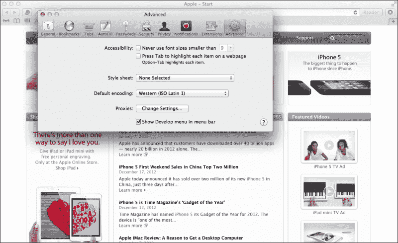
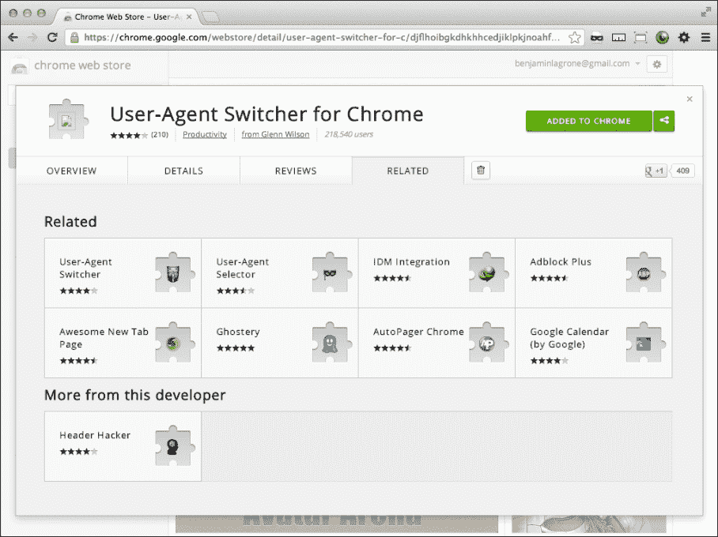
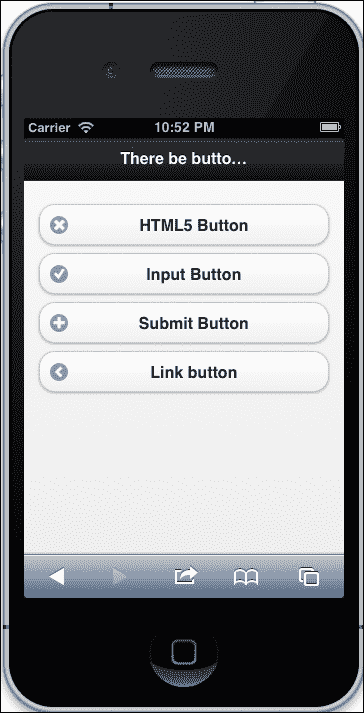
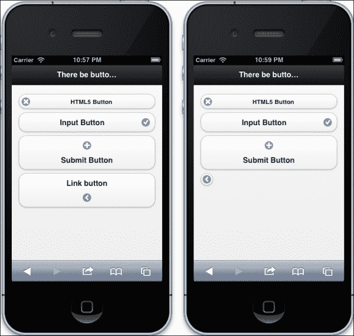

# 第五章。制作移动优先的网络应用

在本章中，您将了解:

*   使用 Safari 开发者工具的用户代理切换器
*   用插件屏蔽你的用户代理
*   使用浏览器调整插件
*   学习视口及其选项
*   为 jQuery Mobile 添加标签
*   在 jQuery Mobile 中添加第二个页面
*   在 jQuery Mobile 中制作列表元素
*   用 jQuery Mobile 添加一个看起来像手机的按钮
*   仅使用媒体查询为移动浏览器添加移动样式表
*   只为移动浏览器添加 JavaScript

# 简介

在本章中，我们将重点关注移动优先响应设计。这里，我们的意思是首先为移动设备设计你的网站，然后为桌面应用变化甚至完全不同的外观。我们将在 jQuery Mobile 上介绍一些食谱，这是一个免费的开源移动 UI 元素和小部件库。此外，我们将构建一些客户端脚本来处理仅针对移动设备的独特外观。

# 使用 Safari 开发者工具的用户代理切换器

为了开发移动优先应用，您需要在本地部署它们，并测试您已经开发的各种功能。到目前为止，我们所研究的许多响应性网页制作方法都依赖于媒体查询来确定基于大小的布局，以提供网站的优化视图。这不是应用提供移动布局的唯一方式，还有更多。一种方法是，通过嗅探 **用户代理**。

您可能已经知道用户代理，但是让我们假设您不知道。另外，什么都知道已经完全违背了买书的目的，不是吗？用户代理存在于请求头中，并标识发出请求的客户端软件。它包含有关您的处理器、操作系统版本、浏览器、渲染引擎、IP 地址和其他识别信息的信息。

根据项目的需要或开发者的偏好，一些网站被设计为针对移动设备显示不同的模板文件，或者基于用户代理数据的其他细节。这种方法需要不同的服务器或客户端智能来读取用户代理并解释其数据，以交付该场景的演示。

因此，您已经创建了一个新的 web 应用，当用户代理详细说明移动设备时，软件会显示移动模板。但是，您希望能够动态测试它，而不必启动网络服务器，因此下一个最好的方法是使用 Safari 中的用户代理屏蔽功能。

使用 Safari 浏览器用户代理切换器是双赢的，因为它不仅模仿了 iOS 设备上移动 Safari 浏览器的用户代理，还模仿了安卓浏览器的用户代理。所以你可以安心了，因为安卓用户代理被改成说也是 Mobile Safari，只是为了让你的生活更轻松。他们不是很好吗？

### 类型

在您的工作范围中明确指定您将测试的浏览器和用户代理是一个很好的做法。

## 做好准备

在苹果电脑上，它已经安装好了。你领先于比赛。所以在窗户人追上来的时候坚持住。

苹果似乎不太可能继续为 Windows 开发 Safari。事实上，当你搜索`Safari Windows`时，第一个链接不是到 Safari 主页，而是到一个苹果支持页面，该页面有一个到上一个 Safari for Windows 版本、Safari 5.1.7 for Windows 的链接，而不是到最新版本(版本 6)。但是说到食谱，让我们继续。

## 怎么做…

首先打开 Safari 浏览器；你会想去一个网站，作为阅读用户代理的演示。转到[http://whatsmyuseragent.com](http://whatsmyuseragent.com)，页面会显示你的用户代理的详细信息。

在 Safari 中，进入 **Safari** | **偏好设置**，或者按*命令* `+` *、*。在**高级**选项卡中，选择**在菜单栏**中显示开发菜单复选框。您可以在下面的截图中看到这一点:



现在菜单栏显示菜单选项**开发**。点击选择**用户代理**；将出现一个子菜单，其中包含不同的用户代理选项。这里有很多有用的选项，但是对于这个食谱来说，最有用的是 **Safari iOS 5.1 - iPhone** 和 **Safari iOS 5.1 - iPad** (很有可能你有 5.1 版本以外的版本)。这将在下一张截图中演示:


选择 iOS 版本中的一个；页面会自动刷新。您现在将看到新的用户代理信息，如下图所示:


## 它是如何工作的...

我知道看起来不像发生了什么，但是发生的事情相当大。浏览器向服务器提供了有关您的计算机和浏览器的信息，结果它为您提供了一个不同的网页。您可以构建逻辑，为移动浏览器提供特殊的样式表、模板、脚本或完全不同的页面内容。

# 用插件屏蔽 Chrome 中的用户代理

Chrome 浏览器拥有丰富的插件，你几乎可以在阳光下使用任何目的。让我们探索一个用户代理屏蔽插件来屏蔽你的用户代理。

为什么要“屏蔽”您的用户代理？这不是不诚实吗？好吧，我承认，是的。但这是为数不多的目的真正证明手段正当的案例之一。此外，没有造成伤害；这不像是服务器发现你的浏览器在对它撒谎，并感到被欺骗和伤害。屏蔽你的用户代理可以让你说服网络服务器你的桌面浏览器实际上是一个移动浏览器。如果服务器认为你使用的是移动浏览器，并且它的逻辑规定它应该提供移动版本，那么这就是你会得到的。

## 做好准备

我们希望找到一种能够在不同用户代理之间切换的方法，并且希望它非常简单。事实上，我们希望它是浏览器上的一个按钮，我们可以按下并切换。那么，我们将从哪里得到这种令人敬畏的技术诡计呢？在 Chrome 网络商店！

我尝试了一些不同的 Chrome 浏览器插件，发现其中一个已经成为我的响应工具包中的最爱。Chrome 的**用户代理切换器**提供了一个快捷的方法来切换用户代理的完整列表。要得到它，走更容易的路，搜索`Google UA Spoofer`。

## 怎么做...

第一个搜索结果应该是 Chrome 网络商店中用户代理切换器的链接。如果是，就去点击**添加到 CHROME** 按钮。这就是安装它所需要做的。使用它会更容易。

现在看看你的浏览器最上面的部分，地址栏的右边，找到一个小面具形状的新图标。当你点击它时，会弹出一个不同浏览器的菜单，其中有可用版本的子菜单。我们测试过了，很简单。证据见下面截图:



## 它是如何工作的...

Chrome 用户代理欺骗器浏览器插件拦截请求头中的正常浏览器用户代理信息，并将其替换为欺骗的用户代理信息。到目前为止，我们只讨论了如何测试用户代理欺骗器。如何设计你的网站来处理不同的用户代理是一个完全不同的主题。

要查看它的运行情况，请转到[http://whatsmyuseragent.com/](http://whatsmyuseragent.com/)，然后切换浏览器插件，从 **iOS** 切换到 **iPhone** 。你会看到用户代理信息变为 **iPhone** 。多尝试一些实验，看看屏蔽用户代理如何影响你喜欢的网站。

## 还有更多...

看看网络上各种流行的网站，你会发现它们是如何处理不同的用户代理的。一些服务于不同的主题，而一些重定向你的浏览器到他们的移动版本的子域。例如，iOS 用户代理的[http://facebook.com](http://facebook.com)重定向至[http://m.facebook.com/?_rdr](http://m.facebook.com/?_rdr)，以及他们网站移动版的[https://plus.google.com/](https://plus.google.com/)重定向至[https://plus.google.com/app/basic/stream](https://plus.google.com/app/basic/stream)。

下面的屏幕截图显示了屏蔽用户代理如何以不同的方式显示页面:


# 使用浏览器调整插件

我会坦率地告诉你；这个食谱是关于安装和使用我使用的浏览器调整插件。如果你有更好的，告诉我。我搜索后选择的那个叫做“窗口调整大小”。

除了在目标设备上测试之外，用插件调整窗口大小是测试媒体查询最准确的方法。然而，这只是你应该让你的响应站点通过的测试的一部分。在部署它之前，一定要用仿真器测试它，当然还有实际的设备。没有什么比部署一个直播网站，看着它在有人引起你的注意后崩溃和燃烧更糟糕的了。

## 做好准备

谷歌是你的朋友。搜索`Window Resizer`。第一个搜索结果应该是 Chrome 网络商店中的窗口调整插件。它就在那里，像夜晚的灯塔！它有五星，是免费的；你怎么可能还没有点击那个链接呢？

## 怎么做...

如果你同意我的观点，你会发现自己在 Chrome 网络商店的安装页面。你会看到一个吸引人的、宽大的、平静的深蓝色按钮，上面写着 **+添加到 CHROME** 。你被它吸引，觉得需要点击它。你在蓝色中看到夜晚的天空，你仰望着它，想知道有一天你会走多远。你想想你的浏览器可以有多大。当你拖动窗户的角，试图猜测它的大小时，你会想到你感受到的疼痛。你再也受不了了。点击按钮！

浏览器窗口上的一点点移动表明正在进行更改。最后，蓝色按钮变成绿色。你完了。

在您的浏览器窗口中，一个看起来像微型浏览器窗口的新图标在您的地址字段的右侧找到了它的主页。好奇心决定了你需要知道这东西能做什么。

这是测试不同媒体查询和网站响应版本的近乎完美的方法，仅次于直接在目标设备上测试。

## 它是如何工作的...

使用按钮测试您的响应设计，达到像素级精度。当你点击它时，它会显示一个不同浏览器窗口大小的列表。每一个都是完美的测量，并会根据你的意愿弯曲你的浏览器的大小。浏览器插件为您完成所有猜测和精确测量，因为它直接影响点击按钮时的浏览器窗口大小！请看下面的截图:


# 学习视口及其选项

不说别的，可以说视口的目的就是驯服移动浏览器窗口。视口对于确定移动浏览器如何呈现移动网页至关重要。

## 做好准备

如果你用的是苹果电脑，可以从苹果下载 Xcode 获得一个 iOS 模拟器。它是 Xcode 包的一部分。我通常通过使用聚光灯来达到目的。按下*命令* +空格键；聚光灯搜索栏出现在屏幕的右上角。开始输入`iOS Simulator`，会出现在搜索结果中。点击它来加速 iOS 模拟器。

## 怎么做…

打开一个你在之前的食谱项目中做过的响应项目。我建议从*打开[resp-width-layout-media-query.html](http://resp-width-layout-media-query.html)项目，通过媒体查询*配方创建响应宽度布局。

要获得一个视窗操作系统模拟器，你需要在网上找到一个。经过搜索，我在[http://iphone4simulator.com/](http://iphone4simulator.com/)找到了一个不错的，在[http://iphonetester.com/](http://iphonetester.com/)又找到了一个。要使用它们，您需要先将项目文件上传到 web 主机，然后该 web 模拟器才能查看它。模拟器无法从本地硬盘读取文件，除非您运行的是本地网络服务器。

首先，为了比较，在浏览器中查看文件。然后在你的 iPhone 模拟器中，输入文件的 URL，你会发现看到你的网站看起来就像桌面版本时的震惊和恐惧。当我早期的响应项目没有按照我希望的方式工作时，我也经历了同样的挫折。问题是移动浏览器不知道你想要它的大小。它聪明但不聪明。像所有软件一样，它需要好的指令。所以深呼吸，我们会一起解决的。下面的截图说明了这个问题:


您可以通过配置视口来告诉移动浏览器它应该做什么。首先添加简单视口`<meta>`标签:

```html
<meta name="viewport">
```

在我们进一步讨论之前，我应该告诉你这个警告。如果你不打算为移动设备做设计，那就省去视口`<meta>`标签。它可能会对您的页面交付造成意想不到的后果。事实上，它可能只显示您页面的一小部分，而不允许查看者展开我们的滚动来查看整个页面。

现在我们将讨论它的选择。一是宽度；我是 K.I.S.S .原则的忠实粉丝(保持简洁明了)。除非您有理由指定特定宽度，否则请输入设备宽度作为视口宽度。这样，它将读取设备宽度并将其设置为页面宽度。例如，设置一个特定的宽度`1000px`，在你的 iPad 上看起来没问题，但是在你的手机设备上，它会表现得太宽，使小于该宽度的媒体查询无效。

```html
<meta name="viewport" content="width=device-width">
```

完成更改后，打开 iOS 模拟器的浏览器并查看文件。您可以在下面的截图中看到固定版本:


接下来，让我们谈谈关于缩放。让我们假设你没有特殊的要求去做任何奇怪的事情，比如用除了一个以外的任何值来启动秤。添加到视口`<meta>`标签中，`1`的初始比例值。

好吧，我知道我说过不要做任何奇怪的事情，但只是为了演示，把你的初始刻度改为`2`。刷新屏幕。

接下来，将其更改为`0.4`。记住这只是为了演示。请再次刷新屏幕。在纵向视图中，您可以看到网页使用小屏幕媒体查询。现在，改变模拟器的方向，使其进入横向模式。现在，您将看到较大的媒体查询处于活动状态。这是一个有趣的实验；现在把你的初始刻度改回`1`。

最后，您是否希望您的观众能够使用多点触控缩放？使用元属性`maximum-scale`来限制您想要允许的缩放量。如果不允许缩放，将最大比例设置为`1`。

```html
maximum-scale=1
```

## 它是如何工作的...

视窗`<meta>`标签最初是由苹果公司包含在 Safari Mobile 浏览器中的，然后被添加到其他浏览器中。它用于定义页面应该读入的宽度。当浏览器看到定义了宽度属性的视口`<meta>`标签时，它会以该宽度设置中定义的比例加载页面，并加上初始比例属性。

# 为 jQuery Mobile 添加标签

这个食谱深入到了一个新的响应设计领域，也就是移动优先。移动优先，简而言之，意味着你将首先设计一个移动版本的网站，然后对桌面进行修改。现在，这并不意味着你正在设计一个“只限于手机”的网站，只是设计你的手机布局和风格是第一位的。

移动优先可能需要重新思考你的设计，或者至少从不同的角度进行设计。但是改变不好吗？难道我们不能通过尝试新的方法来提高我们的设计技能吗？达尔文主义不仅仅是那些最适合适应变化的人的生存吗？

因此，让我们以开放的心态继续前进，尝试一些移动优先的开发。

## 做好准备

首先，跳到 jQuery 移动站点。在[http://jquerymobile.com](http://jquerymobile.com)。不然你跟我一样懒的话可以简单搜索`jQuery Mobile`。我会提供直接链接，如果你不想搜索它，因为你是我的特殊伙伴。该网站的直接链接是[http://lmgtfy.com/?q=jquery+mobile&l = 1](http://lmgtfy.com/?q=jquery+mobile&l=1)。我甚至会为你缩短它；前往[http://bit.ly/TMpuB8](http://bit.ly/TMpuB8)。

在这里，如果你想在本地托管你的文件，你可以下载库(有一些非常好的理由)；然而，对于这个食谱，我们可以用更方便的方法，让其他人来保存所有必要的文件。

jQuery Mobile 网站有大量的文档和样本。它甚至有下载构建器，因此您可以将必要的库缩小到运行您的移动 web 应用所需的库。

## 怎么做...

首先，在集成开发环境中创建一个新的 HTML 文档。将视口`<meta>`标签添加到标题中:

```html
<meta name="viewport" content="width=device-width, initial-scale=1">
```

接下来，包含指向 jQuery Mobile CSS 和 JavaScript 文件的链接。

```html
<link rel="stylesheet" href="http://code.jquery.com/mobile/1.2.0/jquery.mobile-1.2.0.min.css" />
<script src="http://code.jquery.com/jquery-1.8.2.min.js"></script>
<script src="http://code.jquery.com/mobile/1.2.0/jquery.mobile-1.2.0.min.js"></script>
```

暂停一分钟来讨论你的样式表是值得的。在前面的代码中，我们链接到了一个远程 jQuery CSS。我建议您(如果您打算在本地托管这个文件)保持原样，并将元素的所有新 CSS 添加到一个完全不同的样式表中。此外，如果您想对 jQuery 的 CSS 进行任何更改，请添加另一个 CSS 文件并进行显式的名称空间覆盖，或者使用`!important`覆盖。把这个命名为`jQuery-mobile-changes.css`。我不指望你会需要这样做，但以防万一，这是一个很好的处理方式。我之所以推荐这样做，是因为当 jQuery 的新版本发布时，您在升级时不需要破坏您的站点。

这涵盖了你的头部大部分。现在让我们为页面创建一些基本内容。首先，让我们用`<div>`元素包装页面:

```html
<body>
     <div>

     </div>
</body>
```

jQuery Mobile 的一个真正的伟大的特性是它使用标签，，你可以把它放在不用于渲染页面的 HTML 元素中。好处是，您可以为您的桌面站点使用相同的模板，只需将 jQuery Mobile 脚本和样式换成您自己的即可。接下来，给你的包装`<div>`元素添加一些标签，告诉 jQuery Mobile 在这个页面上行动。将`data-role="page"`添加到元素中。

```html
<div data-role="page">
```

让我们通过构建一个示例文本页面来演示。

添加一个用`<div>`元素包装的新`h1`标题。向`<div>`元素添加一个 `data-role="header"`属性。然后，在浏览器中打开文件，查看 jQuery Mobile 主题。

```html
<div data-role="header">
   <h1>Adding tags for jQuery Mobile</h1>
</div>
```

这是一个好的开始；让我们继续在 jQuery Mobile 中添加更多的页面结构示例。

### 类型

您还可以为您的桌面版本提供这些元素标识和类。

接下来，添加一个主体。添加一些填充文字的段落，然后在`<div>`元素中换行。将 HTML5 数据属性`data-role:"content"`分配给`<div>`元素。

```html
<div data-role="content">
  <p>
    Lorem ipsum dolor sit amet, consectetuer adipiscing elit. Aenean commodo ligula eget dolor. Aenean massa....
  </p>
</div>
```

同样，添加页脚。将一个简单的文本包装在一个`h4`标签中，并将其包装在一个`<div>`元素中。现在给那个`<div>`元素属性`data-role="footer"`:

```html
<div data-role="footer">
  <h4>The Footer</h4>
</div>
```

仅此而已。jQuery 移动站点有大量关于如何使用其框架进一步构建移动站点的文档和示例。在本章中，我们将学习更多的 jQuery Mobile 食谱。去看看他们。这是您的页面在 jQuery Mobile 中的外观:


## 它是如何工作的...

jQuery Mobile 使用 HTML5 数据属性来激发标记和小部件的脚本。当您将数据属性放入元素中时，脚本将自动运行。

# 在 jQuery Mobile 中添加第二页

jQuery Mobile 中有一个非常酷的特性，它允许你将一个更大的 HTML 页面分成更小的、可消化的部分。想象一下，你有一个有很多内容的页面，你不想强迫你的观众继续向下滚动阅读。考虑使用 jQuery Mobile 的多页模板结构。移动设备上网页的用户体验与桌面上网页的用户体验非常不同。老桌面 Web 上，常说“内容为王”；现在 Web 是移动的，空间有限，所有这些内容很容易变成过多的内容。您可能需要考虑限制每页显示的内容。在这个食谱中，我们将使用 jQuery Mobile 将一个包含大量数据的大页面分成更小的可消化的部分。

## 做好准备

在前面的食谱中，我们使用 jQuery Mobile 标签构建了一个简单的页面。让我们从配方中挖掘出文件，并将其保存为新文件来处理。这将作为这个食谱的起点。

## 怎么做...

将`p1`的标识添加到外部，包装`<div>`元素(带有页面`data-role`)。这将有助于 jQuery 识别和转换多页元素。

```html
<div data-role="page" id="p1">
```

您已经创建了 jQuery Mobile 将识别为多个页面中的第一个页面。让我们创建下一个。在关闭`<body>`标记之前创建新的打开和关闭`<div>`元素。给这个`<div>`元素一个`data-role="page"`元素，就像前面的例子一样，还有一个`p2`的 ID。

```html
<div data-role="page" id="p2">
```

这个页面会需要`data-role="header"`、`data-role="content"`、`data-role="footer"`，就像之前的`<div>`元素`data-role="page"`一样。也可以简单复制上一节，粘贴到`"p2"` `<div>`元素中。

```html
<div data-role="page" id="p2">
  <div data-role="header">
    <h1>The second page</h1>
  </div>
  <div data-role="content">
    <p> Lorem ipsum dolor sit amet...</p>
  </div>
  <div data-role="footer">
    <h4>The Footer</h4>
  </div>
</div>
```

我们快完成了；我们只需要将页面链接在一起。在`"p1"`内容中，就在结束`<div>`元素之前，添加一个链接到`"#p2"`的`href`锚点标签:

```html
<a href="#p2">Page 2</a>
```

在`"p2"` `<div>`元素中，在`data-role="content"` `<div>`元素内，添加另一个链接，链接回首页 ID:

```html
<a href="#p1">Back to Page 1</a>
```

现在保存文件并启动。你会看到它创建了一个漂亮的，看起来像本地人的移动网站。点击**页面**链接，你会看到多页页面之间有一个平滑的渐变过渡。您还会注意到后退按钮也可以工作。仔细想想，这种行为对于我们网站的原生 app 观感非常有用。请参见下一张截图的第一页:


第二页显示在下面的截图中:


## 它是如何工作的...

jQuery Mobile 可以在单个 HTML 页面中加载多个页面，并将它们呈现为多个页面或子页面。要链接它们，只需添加`HREF="#page"`。当点击该链接时，jQuery Mobile 将寻找具有该 ID 的内部页面，并将其平滑地写入视口。

# 在 jQuery Mobile 中制作列表元素

让我第一个说:我喜欢无序列表。相反，我对“程序员艺术”表也有同样强烈的厌恶。事实上，我在同事中赢得了“餐桌破坏者”的美誉。HTML 中很少有几组东西不能用好的列表来显示，这就是为什么我喜欢 jQuery Mobile 处理列表的方式。在我看来，jQuery Mobile 列表证明了为什么列表是呈现数据、菜单、导航等的优越方式。我对无序列表的异常痴迷已经受够了，让我们一起来看看关于 jQuery Mobile 列表的食谱。

## 做好准备

想想你在网上放了多少可怕的表格，那些无用的代码变成了什么可怕的东西。对你过去的罪行的告诫已经足够了，让我们继续前进，列出一些 jQuery Mobile 列表！

## 怎么做...

使用 jQuery Mobile 需要的必要标题信息创建一个新页面。包括视口`<meta>`标签和到 jQuery Mobile 样式表、jQuery JavaScript 以及 jQuery Mobile JavaScript 的链接。您可以在自己的服务器上本地托管这些，或者使用在[http://code.jquery.com](http://code.jquery.com)托管的那些。

```html
<meta name="viewport" content="width=device-width, initial-scale=1"> 
<link rel="stylesheet" href="http://code.jquery.com/mobile/1.3.0-beta.1/jquery.mobile-1.3.0-beta.1.min.css" />
<script src="http://code.jquery.com/jquery-1.9.min.js"></script>
<script src="http://code.jquery.com/mobile/1.3.0-beta.1/jquery.mobile-1.3.0-beta.1.min.js"></script>
```

接下来创建一个具有`data-role="page"`属性的`<div>`元素。这是 jQuery Mobile 用来部署样式、元素和小部件的 HTML5 属性。

```html
<div data-role="page"></div>
```

在包裹里面，创建一个你最喜欢的机器人的无序列表。

```html
<ul>
  <li>Hero 1</li>
  <li>Bender</li>
  <li>Optimus Prime</li>
  <li>Soundwave</li>
  <li>Wall-E</li>
  <li>Maximillian</li>
  <li>R2-D2</li>
  <li>GORT</li>
  <li>Cat Quadcopter</li>
  <li>Robocop</li>
  <li>The Maschinenmensch</li>
</ul>
```

我们现在不要推出这个。我们都已经知道，这将看起来像一个普通的旧名单。如果你正在为桌面版本制作一个单独的 CSS，你可以在那里设计这个列表。

将属性`data-role="listview"`添加到您的无序列表中。现在，您可以启动这个，并看到它看起来像一个风格化的机器人列表。

让我们继续前进。因为这是一个列表，我们喜欢列表，我们将继续玩它，看看 jQuery Mobile 可以用它做什么。添加另一个属性`data-inset="true"`。现在您的列表有一个很酷的环绕边框，这样每个项目都不会延伸到屏幕边缘。

有时候，你可能会得到一个非常长的列表，比如当你列出一个很酷的机器人列表时，因为机器人很酷，你不想必须不断滚动才能选择你最喜欢的机器人。jQuery Mobile 对此有一个内置的解决方案，一个过滤元素。通过添加新属性`data-filter="true"`来调用它。刷新您的移动浏览器；您将在顶部看到一个输入，输入一个`filtertext`元素。“搜索”小部件使用客户端搜索/过滤器来过滤掉列表项。你不再需要向下滚动才能在你的列表底部找到那个令人敬畏的机器人。

让我们把这个带到的下一个层次。如果我们希望能够通过一些我们不想显示的其他数据来过滤机器人，比如机器人制造商，会怎么样？您可以为每个列表项添加属性`data-filtertext=""`。它看起来像这样:

```html
<li data-filtertext="Mom's Robots"><a href="#">Bender</a></li>
<li data-filtertext="Hasbro"><a href="#">Optimus Prime</a></li>
```

请参见下图进行演示:


该列表甚至可以通过在数据属性中指定主题来进行不同的样式设置。尝试将`data-theme="a"`添加到无序列表中。现在尝试使用字母`b`到`f`。每个主题都有不同的主题，您可以将其应用到列表中。

这是我们到目前为止使用的不同属性的无序列表。下面这段代码后面的图显示了不同的主题。

```html
<ul data-role="listview" data-inset="true" data-filter="true" data-theme="g">
```


接下来让我们看看当这些列表项变成链接时会发生什么。为每个项目添加一个`href`锚点标签。

```html
<li><a href="#">Bender</a></li>
```

当你刷新你的屏幕时，你会看到它如何添加图标来指示它是一个可点击的链接。但是，由于`href`链接到`#`，它不会加载新页面。有关图示示例，请参见下面的屏幕截图:


让我们把这个列表分成两组，“消灭所有人类”组和“工人”组。将第一组的另一个列表项添加到列表顶部，属性为`data-role="list-divider"`。

```html
<li data-role="list-divider">destroy all humans</li>
```

在列表的中间位置添加另一个类似的列表项。

```html
<li data-role="list-divider">workerbot</li>
```

这显示在下一张截图中:


如果让你感觉良好的话，你可能会觉得有必要把你的机器人组织成这些组。我们可以进一步利用这种冲动，将列表嵌套起来。在刚才制作的`list-divider`中添加一个`ul`元素，然后将机器人的`li`代码的前半部分剪切粘贴到这个`ul`元素中。

```html
<li data-role="list-divider">destroy all humans
  <ul>
    <li><a href="#">Bender</a></li>
    <li><a href="#">Optimus Prime</a></li>
    <li><a href="#">Soundwave</a></li>
    <li><a href="#">Wall-E</a></li>
    <li><a href="#">Maximillian</a></li>
  </ul>
</li>
```

对下一个列表部分进行同样的操作。然后，刷新以查看新结果。请看下图:


您可以为父列表项添加一个`h3`标题换行，甚至是一个用段落元素换行的描述。这些清单越来越花哨。请看下面的截图:


所以让我们做最后一个列表功能，称之为食谱。这个是一个处理列表的华丽小部件。您可以制作可折叠列表元素的列表。我们将更改`ul`和`li`列表项属性。首先，使外部`ul`列表元素包含属性`data-role="collapsible-set"`、`data-theme="b"`和`data-content-theme="d"`。

```html
<ul data-role="collapsible-set" data-theme="b" data-content-theme="d">
```

该`ul`元素的两个直接子`li`元素都应该具有属性`data-role="collapsible"`。

```html
<li data-role="collapsible"><h2>workerbots</h2><p>...<p>
```

将属性`data-role="listview"`和`data-filter="true"`赋予可折叠`li`列表项的子`ul`元素。

```html
<ul data-role="listview" data-filter="true">
```

整个无序列表会是这样的:

```html
<ul data-role="collapsible-set" data-theme="b" data-content-theme="d">
  <li data-role="collapsible">
    <h2>destroy all humans</h2>
    <p>Lorem ipsum dolor sit amet, consectetur adipiscing elit. Integer consectetur quam in nulla malesuada congue volutpat mi molestie. Quisque faucibus, nisi ut malesuada volutpat</p>
    <ul data-role="listview" data-filter="true">
      <li><a href="#">Bender</a></li>
      <li><a href="#">Optimus Prime</a></li>
      <li><a href="#">Soundwave</a></li>
      <li><a href="#">Wall-E</a></li>
      <li><a href="#">Maximillian</a></li>
    </ul>
  </li>
  <li data-role="collapsible" >
    <h3>workerbots</h3>
    <p>Nam eget congue nisi. Ut id ante ac ligula congue auctor a et lacus. Suspendisse varius sem sed elit tincidunt convallis.</p>
    <ul data-role="listview" data-filter="true">
      <li><a href="#">R2-D2</a></li>
      <li><a href="#">GORT</a></li>
      <li><a href="#">Cat Quadcopter</a></li>
      <li><a href="#">Robocop</a></li>
      <li><a href="#">The Maschinenmensch</a></li>
    </ul>
  </li>
</ul>
```

完成的列表如下图所示:


## 它是如何工作的...

太神奇了。除了列一个好的清单，你不需要做太多的事情。从来没有一张桌子能做到这一点。只要你在你的元素中使用 HTML5 数据属性，jQuery Mobile 就会完成繁重的工作，把你的列表变成一个时尚的、看起来像本地人的网络应用。jQuery Mobile 采用了数据属性(不影响布局或样式)，并由此改写了移动版本的 HTML 和 CSS。

# 用 jQuery Mobile 添加一个移动的、看起来像本机的按钮

让我们做纽扣吧！制作一个按钮看起来是设计中非常琐碎的一部分，但相反，当你构建一个网络应用时，一个按钮可能是网站可用性的一个非常重要的部分。

jQuery Mobile 有一系列令人印象深刻的按钮调用，它们都很容易使用。它们也可以在许多其他 jQuery Mobile 小部件中使用。此外，从链接制作按钮和从`form input`元素制作按钮一样简单。

## 做好准备

在您的集成开发环境或文本编辑器中，旋转一个新的 HTML 文档并添加必要的标题标签。首先添加视口`<meta>`标签，然后是到 jQuery Mobile CSS 和 JavaScript 库 jQuery 和 jQuery Mobile 的链接。

```html
<meta name="viewport" content="width=device-width, initial-scale=1">
<link rel="stylesheet" href="http://code.jquery.com/mobile/1.2.0/jquery.mobile-1.2.0.min.css" />
<script src="http://code.jquery.com/jquery-1.8.2.min.js"></script>
<script src="http://code.jquery.com/mobile/1.2.0/jquery.mobile-1.2.0.min.js"></script>
```

在你的 HTML `<body>`标签中，添加一个带有 HTML5 属性`data-role="page"`的`<div>`元素。在里面，添加一个`h1`头，用一个带有`data-role="header"`属性的`<div>`元素包装。在标题元素之后，添加一个具有`data-role="content"`属性的`<div>`元素。请参见下面的代码片段:

```html
<div data-role="page">
  <div data-role="header"><h1>There be buttons</h1></div>
  <div data-role="content">...</div>
</div>
```

## 怎么做...

让我们比较一些不同的方法来创建一个基本按钮。首先是 HTML5 元素`<button>`，各种`<input>`形态元素`button`和`submit`，还有一个`href`伪按钮。在你的内容`<div>`元素中各放一个。

```html
<button>HTML5 Button</button>

<input type="button" value="Input Button" />

<input type="submit" value="Submit Button" />

<a href="#" data-role="button">Link button</a>
```

启动您的新页面。您将看到四个看起来相同的新按钮(文本除外)。您可以看到，这些方法都是以相同的方式交付的。这令人印象深刻，因为您的模板文件的非移动版本可能要求您使用某种类型的`submit`元素(这并不完全是移动优先的，但没有人是完美的)。请看下面的截图:


现在让我们继续这个食谱，演示如何使用 jQuery Mobile 向按钮添加图标。这是一个简单、一步到位的过程；它使用一个 HTML5 数据属性，`data-icon`属性。在第一个按钮中，添加`data-icon="delete"`属性；在下一个中，添加`data-icon="check"`属性；添加`data-icon="plus"`到下一个；最后，在这组按钮的最后一个按钮上添加`data-icon="arrow-l"`。有一个图标列表，你可以放在里面；你可以在文档中找到它们。

```html
<button data-icon="delete">HTML5 Button</button>

<input type="button" value="Input Button" data-icon="check" />

<input type="submit" value="Submit Button" data-icon="plus"/>

<a href="#" data-role="button" data-icon="arrow-l">Link button</a>
```

以下屏幕截图显示了新按钮:



您也可以通过添加`data-mini="true"`属性使按钮变小，并使用`data-iconpos`属性将图标定位在按钮的右、左、上或下角。否则，您可以使用`data-iconpos="notext"`属性仅显示图标。参见下面的截图:



这些 jQuery Mobile 按钮的默认行为是在整个屏幕上伸展。可以通过增加属性`data-inline="true"`来改变。

```html
<button data-icon="delete" data-mini="true" data-inline="true">HTML5 Button</button>

<input type="button" value="Input Button" data-icon="check" data-iconpos="right" data-inline="true"/>

<input type="submit" value="Submit Button" data-icon="plus" data-iconpos="top" data-inline="true"/>

<a href="#" data-role="button" data-icon="arrow-l" data-iconpos="notext" data-inline="true">Link button</a>
```

这很乱，但你可以在这里看到它的作用:


它们将成为内联元素，类似于显示为内联的列表项。我们快完成了，但仍有一些乐趣。我们还可以轻松制作按钮组。删除您在上一节中添加的`data-inline="true"`属性。接下来，用`<div>`元素包装按钮元素，属性为`data-role="controlgroup"`。

```html
<div data-role="controlgroup">

  <button data-icon="delete" data-mini="true" >HTML5 Button</button>
  <input type="button" value="Input Button" data-icon="check" data-iconpos="right"/>

  <input type="submit" value="Submit Button" data-icon="plus" data-iconpos="top" />

  <a href="#" data-role="button" data-icon="arrow-l" data-iconpos="notext" >Link button</a>

</div>
```

现在，您可以看到创意按钮组的潜力，并将其保存在一个漂亮的包中。让我们给按钮组添加更多的效果。如果你把`data-type="horizontal"`加到`"controlgroup"` `<div>`元素中，你会弄得一团糟，需要清理。清理这个问题的一个方法是将所有的`data-iconpos`属性改为`"notext"`。

最后，正如我们在之前的 jQuery Mobile 食谱中看到的那样，`data-theme`属性可以让你的按钮变得丰富多彩。为了快速展示这个效果，给每个按钮添加一个不同的`data-theme`属性(`a`、`b`、`c`、`e`)(我跳过了`d`，看起来太像`c`了)。这些将在下一张截图中展示:


## 它是如何工作的...

关于这是如何工作的，你真正需要知道的是使用哪些数据标签来让 jQuery Mobile 提取 HTML 元素，并将它们转换成移动原生按钮。实际上，当你有正确的属性时，它会自动神奇地发生，无论它应用于`submit`按钮的什么方法，它都会起作用。jQuery Mobile 在 HTML5 属性上激发一个事件，并将 HTML 和样式添加到呈现的页面中。

# 仅使用媒体查询为移动浏览器添加移动样式表

在本食谱中，我们希望能够在模板中使用样式表，仅供移动浏览器使用。撇开 JavaScript 不谈，在客户端呈现中，没有办法监听用户代理并为移动浏览器提供一些逻辑或特殊模板。让我们采用 K.I.S .方法并尽可能接近媒体查询。

当然，有许多方法可以编写 JavaScript 来检测用户代理，我们将在后面的食谱中介绍这一点，但是现在让我们编写一个杀手级媒体查询来锁定特定 CSS 的移动浏览器。在前面的方法中，我们的媒体查询是在样式表中执行的。这将是不同的，因为我们将把它放在 HTML 标题链接。改变是好的，不要担心。我们之所以将媒体查询放在 CSS 文件的 HTML 链接中，是因为我们只想在特殊情况下调用该 CSS 文件。当您使用移动优先设计和技术(如 jQuery Mobile)时，这个方法尤其有用。

## 做好准备

启动你方便的集成开发环境，开始一个新的网页。确保添加你的视口`<meta>`标签。如果你喜欢，可以在 HTML 正文中添加一段文字。

## 怎么做...

在新 HTML 文件的`<body>`标签中，添加两段文字。每个都有不同的等级(`class="a"`和`class="b"`)。这将是足以演示媒体查询工作的 HTML。

```html
<p class="a">Lorem ipsum dolor sit amet, consectetur adipiscing elit.</p>
<p class="b">Nulla ante tortor, rutrum eu sollicitudin eget, vehicula quis sem. Nullam cursus placerat luctus.</p>
```

现在回到`<head>`标记。首先，让我们添加视口`<meta>`标签。包含内容属性`"width=device-width"`。接下来，为字体添加一些简单的样式(`font-size: 100%`)。

```html
<style>
  html{font-size:100%}
</style>
```

接下来，我们将使用媒体查询添加到移动 CSS 样式表的链接。基本样式表链接包含`rel="stylesheet"`和路径。添加使用该样式表所需满足的条件。为`screen`和`max-device-width=320px`添加媒体查询。您的 CSS 链接应该如下所示:

```html
<link rel="stylesheet" media="screen and (max-device-width:320px)" href="mobile.css" />
```

在 HTML 文件中我们没有什么可做的了，所以在同一个目录中创建一个 CSS 文件并命名为`mobile.css`。打开它进行编辑。我们在这里不需要做太多，只有一行就足够了。为`b`类段落添加一行，并为字体大小赋予`2rem`属性。REM 的意思是相对 EM，或者相对于根字体大小(以防你跳过了响应的排版方案)。

```html
p.b{font-size:2rem}
```

现在让我们试一试。在浏览器中打开你的 HTML 文件，然后在移动设备模拟器中打开它。在这里，您可以看到移动设备有一个独特的演示文稿，其字体大小与`b`类段落不同。请看下面截图中说明的配方:


## 它是如何工作的...

媒体查询设计为仅在屏幕分辨率为 320px 或更低的设备上有效。任何比这更大的都会忽略(它仍然会被下载)链接的 CSS 文件。您还可以为其他特定设备编写媒体查询。

# 只为移动浏览器添加 JavaScript

在之前的食谱中，我们在样式表链接中编写了一个媒体查询。这对我们自己的移动优先响应网络开发非常有用。但是，当使用专门针对移动平台(如 jQuery Mobile)的 JavaScript 代码时，您可能不希望在桌面计算机上启动它们。让我们构建一个微小的 JavaScript 代码来检测移动设备的屏幕大小，然后为其部署 jQuery Mobile，但不为桌面部署。

## 做好准备

当您拥有服务器端技术时，像 jQuery Mobile 这样的移动优先技术是令人惊叹的工具。他们确实需要服务器端逻辑才能发挥最佳作用。如果你不够幸运，无法访问服务器端逻辑，你可以使用一些客户端技巧来施展你的魔法。

## 怎么做...

如果你还没有浏览过 jQuery Mobile 食谱，现在就来看看；我们将重复使用我们已经使用过的一个食谱。

使用 jQuery Mobile 打开您在之前的食谱中创建的一个文件。您可以使用*在 jQuery Mobile* 食谱中添加一个移动的、看起来像本地人的按钮。如果你已经完成了制作一个移动的、看起来像本地人的按钮的方法，那就用它来做吧。

当我们最后一次看到这个文件时，jQuery Mobile 脚本拿走了你的普通的旧的无聊的 HTML 按钮，并把它们变成了很酷的 jQuery Mobile 按钮。您只需要在元素中包含 HTML5 数据属性，jQuery Mobile 会自动神奇地完成剩下的工作。那么，如果你只希望这发生在移动设备上呢？

如果不是客户端脚本的魔力，你会有麻烦的。我们首先希望脚本知道它正在处理一个移动设备。一种方法是查询 DOM 元素的用户代理。我见过一些人这样做，但这已经足够复杂，容易出错。因此，让我们检测设备屏幕的大小。大多数移动视口最多 600 像素宽或更小；因此，目前，如果您正在开发应用，假设这是正确的最大大小，那么您是安全的。

所以让我们让脚本从 DOM 中获得屏幕宽度；如果小于 600px，就去获取 jQuery Mobile 脚本。首先，使用 jQuery，在文档加载时激发一个函数。

```html
$(document).ready(function(){
  //
});
```

在函数内部，编写一个条件语句；如果屏幕小于 600，那就做点什么。

```html
$(document).ready(function(){
  if (window.screen.width < 600){
    //Do something!
  };
});
```

这是一个好的开始，但让我们更具体地谈论“做某事”。我们希望脚本执行的是获取并运行 jQuery Mobile 脚本。一个很好的方法是 jQuery 的`$.getScript()`函数。所以把它放在`if`条件中，包括 jQuery Mobile 源 URL。

```html
$(document).ready(function(){
  if (window.screen.width < 600){
    $.getScript("http://code.jquery.com/mobile/1.2.0/jquery.mobile-1.2.0.min.js");
  };
});
```

现在在移动设备模拟器中加载页面。

## 它是如何工作的...

如果模拟器成功欺骗了请求中的设备宽度，您将看到 jQuery Mobile 版本的 HTML 页面。在您的桌面浏览器中，无论您的浏览器窗口有多大，您都将无法加载 jQuery Mobile 脚本。

jQuery 的`$.getScript()`是一个函数，将外部脚本加载到头部。您可以像我们在菜谱中所做的那样使用它，有条件地加载外部 JavaScript，并在成功加载时执行额外的功能。